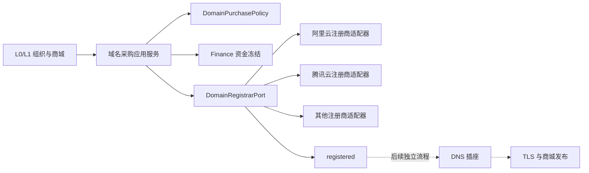

# L0/L1 域名采购插座

状态：接口与领域护栏已建立；尚未接注册商、数据库、付款执行、DNS 或生产路由。

## 所有权

- 域名归 L0/L1 对应的组织与商城，不归管理员个人。
- 管理员会员只留下申请、审批和操作审计身份。
- 一个商城可以持有多个域名；一个域名同一时刻只能归属一个商城。
- L0/L1 必须由服务端组织树解析，客户端不得自行声明等级。

## 分层

注册商插座只允许三个动作：报价、提交购买、查询购买结果。它无权修改 DNS、证书、Caddy、
Cloudflare 路由、账号中心或平台 API 域名。

## 采购状态机

`draft → quoted → approved → submitted → registered`

- 报价过期后回到 `quote_expired`，必须重新报价、重新审批。
- `submitted` 是不可假定失败的未知窗口，只能查询注册商结果，不能用新请求盲目重试。
- `registered` 只表示域名注册成功，不表示 DNS、证书或商城已经上线。
- `registered` 与 `cancelled` 都是终态。

## 提交购买前的硬条件

1. 服务端确认所有者等级是 L0 或 L1。
2. 域名是规范化 ASCII 域名，不是 URL、IP 或通配符。
3. `zhudatuan.com`、`hbbtzn.com` 及其子域永久排除在租户采购之外。
4. 报价中的域名、年限、币种、金额、供应商和有效期必须与申请完全一致。
5. 价格不得超过申请时的上限。
6. 审批必须绑定报价指纹、商城范围、审批会员和 Finance 资金冻结编号。
7. 审批时的身份保证等级至少为 AAL2。
8. 注册人姓名、手机号、证件号不进入命令；只传加密资料引用。
9. 注册商购买调用必须携带稳定幂等键。

## 注册商适配器验收

- 相同幂等键重复提交不得产生第二笔购买。
- 超时后先查询，不得自动再次扣费。
- 返回结果必须保持供应商、域名和外部订单号可核对。
- 供应商原始响应只保存为受控证据引用，不进入日志或公开 API。
- 适配器不得自行创建 DNS 记录或改变生产入口。
