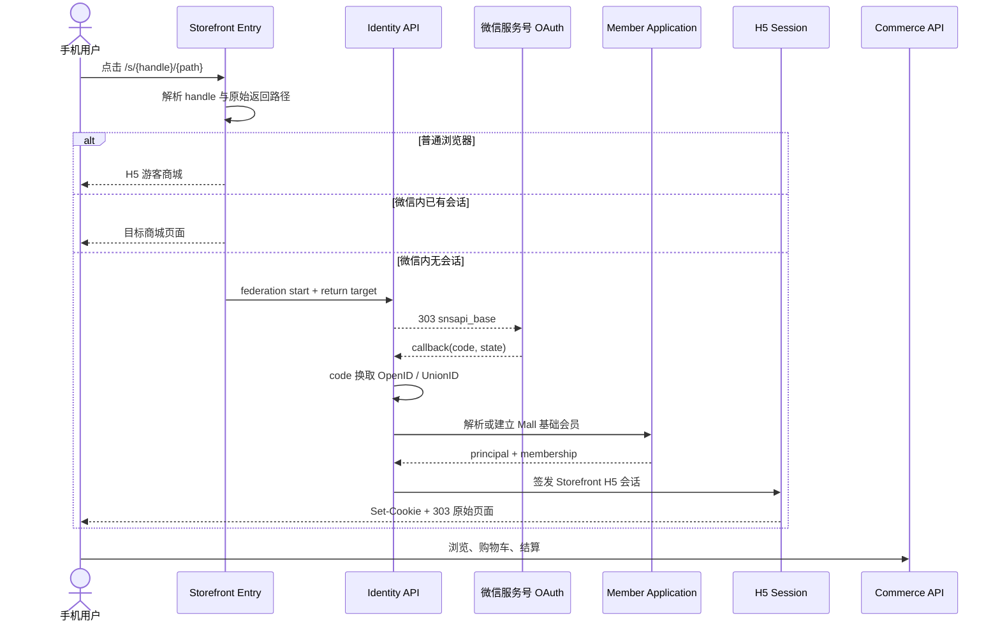

# H5 微信一键绑定与购物入口架构

> 状态：入口方案已形成，尚未迁移代码、接入微信配置或发布生产
>
> 产品归属：`zhudatuan 主打团 → 商城系统 Mall → Storefront / Identity & Access / Commerce`
>
> 直接负责人：Ethan
>
> 取证日期：2026-09-02

## 一、结论

`zdt-next` 的目标入口固定为同一个公开商城地址：

```text
https://<storefront-origin>/s/<storefront-handle>/<optional-path>
```

该地址同时承担普通 H5 访问和微信内 H5 访问：

1. 普通浏览器打开时，直接进入可公开浏览的 H5 商城。
2. 微信内置浏览器打开且已有商城会话时，直接进入目标页面。
3. 微信内置浏览器打开且没有商城会话时，启动服务号 `snsapi_base` 网页授权。
4. 微信回调后，后端使用 OpenID／UnionID 解析或建立商城会员关系，签发 H5 商城会话。
5. 最后返回最初的商城、商品、购物车或结算页面，不把用户丢回首页。

用户第一次点击 H5 链接就是启动入口链路的唯一动作。`snsapi_base` 为静默授权，不要求用户再确认头像或昵称。

“微信身份绑定”和“手机号验证”是两件事：

- 微信网页授权可以完成微信身份识别和商城会员绑定。
- 微信网页授权不能取得手机号。
- 当前订单与支付的手机验证规则保持不变；未完成手机验证的新会员可以浏览和维护购物车，但首次下单前仍进入现有手机验证流程。

## 二、产品边界

本能力不是独立小程序，也不是 Identity 自己拥有的商城页面。它跨越 Mall 内部四个明确边界：

```text
商城系统 Mall
├── Storefront
│   ├── `/s/<handle>` 公开入口
│   ├── 微信入口编排
│   └── 商品、购物车与结算页面
├── Identity & Access
│   ├── 微信服务号网页授权
│   ├── Federated Identity
│   └── H5 Session
├── Organization & Member
│   ├── 基础商城会员建档
│   └── 已有会员关系解析
└── Commerce 交易域
    ├── Cart / Checkout
    ├── OMS
    └── JSAPI Payment
```

Storefront handle 决定当前商城入口，Mall Scope 决定数据范围。两者均属于商城系统 Mall，但不能被微信 OpenID 或任意客户端参数替代。

## 三、用户链路



## 四、“点一下”的精确定义

满足下列条件时，用户只需点击一次 H5 链接：

1. 页面在微信内置浏览器打开。
2. 使用已认证服务号的网页授权能力。
3. 网页授权域名已经配置为 Storefront／Identity 实际回调域名。
4. Provider 使用 `snsapi_base`，只索取完成身份识别所需的 OpenID。
5. 回调成功后直接签发商城会话并返回原始页面。

以下情况不能伪装成“一键成功”：

| 场景 | 结果 |
|---|---|
| 已绑定微信的老会员 | 静默登录并返回原页面 |
| 新微信用户 | 自动建立基础商城会员，签发会话 |
| H5 已登录会员主动绑定微信 | 将微信身份链接到当前会员，返回原页面 |
| 同一微信身份与已有不同会员冲突 | 进入明确的账号确认流程，不自动合并 |
| 一个身份拥有多个可用商城会员关系 | 进入会员关系选择，选择后继续 |
| Safari、Chrome 等微信外浏览器 | 以 H5 游客访问；不能声称已取得微信身份 |
| 新会员未验证手机号 | 可浏览和维护购物车；下单前进入现有手机验证流程 |

## 五、入口与返回路径

### 5.1 唯一公开入口

继续采用 WCHS 已存在的 Storefront 入口模型：

```text
/s/<handle>
/s/<handle>/products/<product-id>
/s/<handle>/cart
/s/<handle>/checkout
```

二维码和分享链接只指向这条公开入口，不再为 H5、微信和小程序分别制造互不相干的商城地址。

### 5.2 返回目标

Identity 只接收由合同生成并可验证的 return target。回调完成后恢复：

- Storefront handle。
- 原始页面路径。
- 商品或活动参数。
- 服务端购物车身份；游客本地购物车在返回后执行一次显式合并。

微信授权 URL、回调 URL 和浏览器地址中不得承载商城 Session Token。

### 5.3 入口编排

Storefront Entry 只负责判断当前是否需要进入微信授权，不拥有会员和订单数据：

```text
request /s/{handle}/{path}
    ├── valid H5 session       → render target
    ├── WeChat + no session    → identity.federations.start
    └── non-WeChat + no session→ render guest target
```

## 六、身份合同

### 6.1 复用的 Operation

优先收回 WCHS 已定义的联邦身份合同，不再新造第二套 H5 OAuth 路由：

```text
identity.providers.read
identity.federations.start
identity.federations.callback
identity.federations.selection.read
identity.federations.complete
identity.links.read
identity.links.create
identity.links.revoke
```

其中：

- `identity.federations.start` 创建短期交易并返回微信授权地址。
- `identity.federations.callback` 校验回调、解析微信身份并签发 H5 会话。
- `identity.links.create` 用于已经登录的会员主动绑定微信。
- 多会员关系只通过 `identity.federations.complete` 选择，不重新登录一次。

### 6.2 Provider 语义

微信身份必须区分应用和渠道：

```text
provider type: wechat
application: 已认证服务号 AppID
scene: h5 / jsapi
subject: OpenID
cross-application subject: UnionID（仅在微信开放平台绑定关系成立时可用）
```

小程序 AppID 的 OpenID 不能直接当作服务号 OpenID。需要跨服务号与小程序统一会员时，通过 UnionID 或已经确认的会员关系完成归并。

### 6.3 未绑定微信用户

WCHS 当前联邦身份实现会把未关联身份送入 `linkrequired`。为了满足普通商城“一次点击开始购物”，zdt-next 增加 Mall 基础会员建档策略：

```text
verified WeChat subject
    → resolve existing federated identity
    → resolve directory membership
    → if still unlinked: create basic Mall shopper membership
    → bind federated identity
    → issue Storefront session
```

自动建档只创建当前商城的基础购物会员，不自动推断企业、部门、员工福利、供应商或管理权限。

## 七、H5 会话

微信回调签发的是 Storefront H5 Session，而不是小程序 Bearer Token：

| 客户端 | 会话载体 | 用途 |
|---|---|---|
| H5 Storefront | Host-only HttpOnly Cookie | 浏览器商城 |
| 微信小程序 | Bearer Access Token | 原生小程序请求 |

两个渠道可以指向同一 Principal／Membership，但不能混用会话载体。

会话建立后，Storefront 只通过统一 SDK 调用 Commerce API；页面不得拿 OpenID 直接查询数据库或自行拼接会员身份。

## 八、手机验证

网页授权只解决“这个微信是谁”，不解决“这个手机号属于谁”。

当前规则继续保持：

```text
微信身份已绑定
    ├── 浏览商品：允许
    ├── 使用购物车：允许
    ├── 查看账户基础状态：允许
    └── 下单 / 支付：要求现有 phone_verified 结果
```

纯 H5 首次用户需要完成现有短信验证。小程序的 `getPhoneNumber` 属于 Miniapp 渠道能力，不应伪装成 H5 能力。

已验证手机号的会员以后再次从微信进入，不重复执行手机验证，只恢复现有会员与会话。

## 九、H5 微信支付

H5 在微信内置浏览器完成支付时使用公众号 JSAPI 支付链路：

```text
Checkout
  → OMS 创建订单
  → Payment 创建 JSAPI prepay
  → H5 调起微信支付
  → 微信支付异步通知
  → Payment 更新权威支付状态
  → H5 查询订单终态
```

H5 不能直接照搬小程序的 `wx.requestPayment` 调用层。可复用的部分是：

- 商户请求签名。
- JSAPI／小程序统一下单客户端。
- `prepay_id` 管理。
- 支付通知验签、解密和幂等处理。
- 订单支付状态查询。

前端“支付调用成功”不等于订单已经支付；OMS 只接受 Payment 的权威终态。

## 十、现有代码利用裁定

### 10.1 可直接提炼

| 能力 | 来源 | 裁定 |
|---|---|---|
| 微信新会员自动建档语义 | `zhudatuan/main/services/commerce-api/src/api/wechatAuthRoutes.ts` | 提炼业务语义，不复制 Worker 路由层 |
| H5 会话模型 | WCHS Identity Session | 作为 Storefront 会话主线 |
| 微信支付服务端 | `zhudatuan/main/services/commerce-api/src/api/wechatPay*.ts` | 提炼 Provider 与通知处理 |

### 10.2 只能参考重写

| 资产 | 原因 |
|---|---|
| 历史 `apps/wechat-miniapp` | 它是 Miniapp 客户端，不是 H5；旧品牌、旧 API 和演示数据混杂 |
| 当前 `wechatAuthRoutes.ts` 的 `/auth/wechat/session` | 使用小程序 `jscode2session`，不能代替服务号网页授权 |
| 小程序 `wx.requestPayment` | H5 必须使用公众号 JSAPI 调起方式 |
| 旧 Auth 页面二维码图标 | 只是视觉图标，不是可扫描商城二维码实现 |

### 10.3 禁止整体搬运

WCHS、旧 `zhudatuan/main` 和历史归档继续作为只读取证源。不得把任何一个目录树整体复制或合并到 zdt-next；每项资产必须经过合同归一、品牌修正和定向测试后进入共享主轴。

## 十一、配置前提

正式接入前必须由 Ethan 提供或确认：

1. 已认证服务号 AppID。
2. 服务号 AppSecret 的运行时引用。
3. 微信网页授权域名。
4. Identity HTTPS 回调地址。
5. 服务号与微信开放平台的绑定关系（需要 UnionID 时）。
6. 服务号 AppID 与微信支付商户号的授权关系。
7. JSAPI 支付授权目录与支付通知地址。

这些配置不写入架构文档、前端代码或二维码。

## 十二、验收标准

### 12.1 入口与身份

- 微信内新用户点击商城 H5 一次，完成静默授权、基础会员建档并返回原页面。
- 微信内老用户点击商城 H5，恢复原 Membership，不产生重复会员。
- H5 已登录用户绑定微信后，仍停留在发起绑定的页面。
- 普通浏览器访问同一地址时正常打开游客 H5，不进入失败的微信回调。
- 多商城 handle 不串 Mall Scope。
- 多会员关系进入选择页，选择后返回原页面。
- OAuth 失败显示可重试状态，不清空已有购物车。

### 12.2 购物与支付

- 授权前加入的游客购物车在登录后按明确规则合并。
- 未验证手机的新会员在下单边界进入现有验证流程。
- 已验证会员可完成报价、创建订单和 JSAPI 支付。
- 客户端支付成功只触发状态查询，不直接把订单写成已支付。
- 支付通知重放不产生重复入账。

### 12.3 品牌与来源

- 所有新页面只出现 `zhudatuan 主打团`。
- 每个迁入资产都能追溯到固定来源 Commit 和新主轴提交。

## 十三、分阶段实施

遵循“一点点、慢慢改”，按四个独立交付物推进：

### P1：H5 微信入口

- `/s/<handle>` 微信入口编排。
- `identity.federations.start/callback`。
- H5 Session 与原路径返回。
- 暂不接支付。

### P2：Mall 基础会员建档

- 未绑定微信身份建立基础商城会员。
- 已有会员链接与冲突分流。
- 游客购物车合并。

### P3：手机验证衔接

- 复用当前手机验证结果。
- 下单前完成一次验证。
- 已验证会员不重复验证。

### P4：H5 JSAPI 支付

- 服务号 AppID 场景预支付。
- H5 JSAPI 调起适配。
- 支付通知与订单终态验收。

每一阶段独立测试、独立提交、独立验收；前一阶段未通过，不开始后一阶段。

## 十四、取证来源

### 本地固定来源

- 旧主线：`/Users/Ethan/Desktop/Projects/zhudatuan/main@dbb5bbb186fb`
- 历史小程序：`/Users/Ethan/Desktop/Projects/zhudatuan/archives/smart-wing-20260826/Shop@7345856007ad`

### 官方能力说明

- 微信服务号网页授权：<https://developers.weixin.qq.com/doc/service/guide/h5/auth>
- 扫普通链接二维码打开小程序：<https://developers.weixin.qq.com/miniprogram/introduction/qrcode.html>
- JSAPI／小程序下单：<https://pay.weixin.qq.com/doc/v3/merchant/4012791856>

本文件只固定目标架构和资产裁定，不表示微信账号、支付商户配置或生产部署已经完成。
