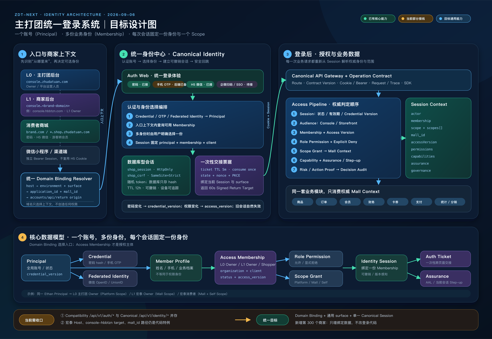
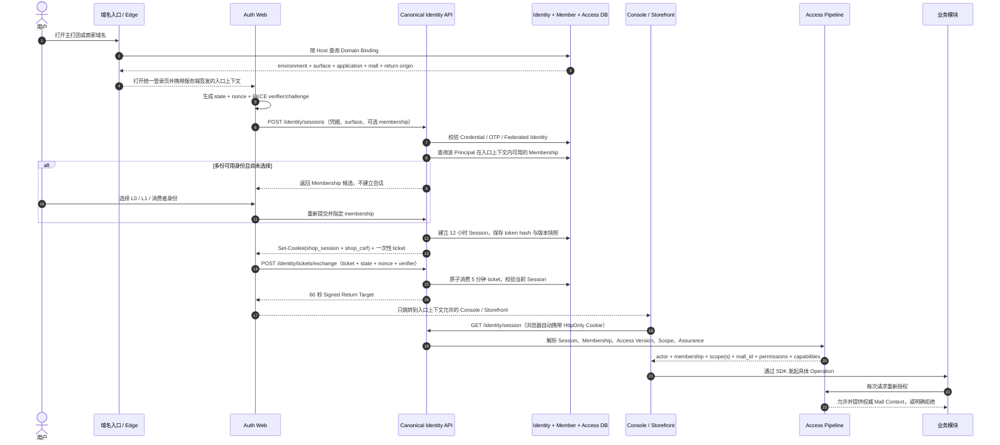
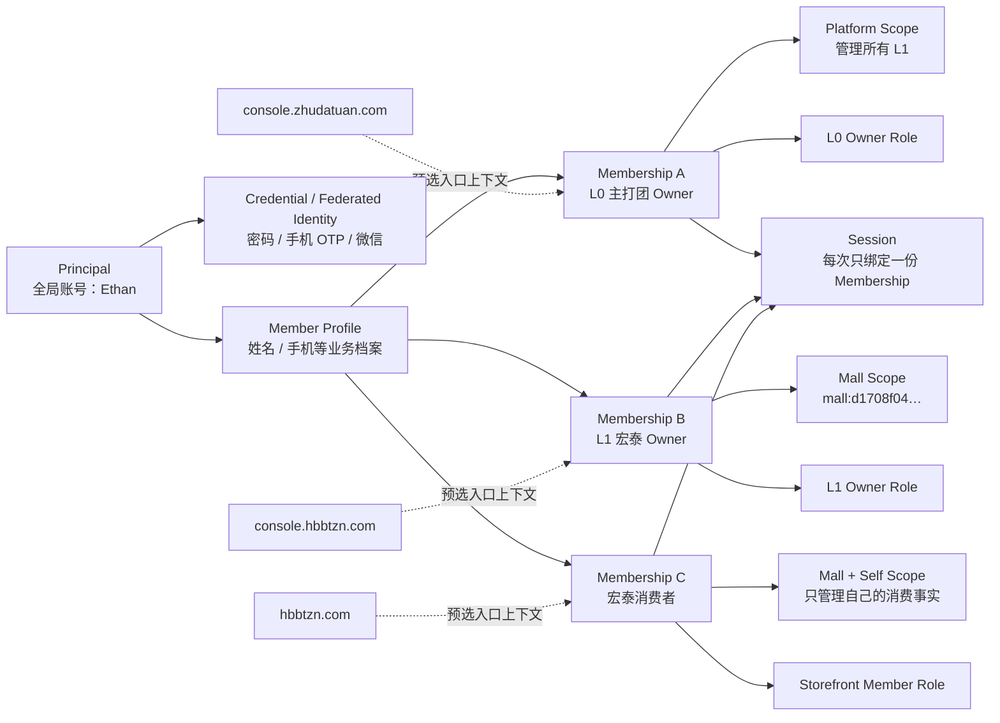

# 主打团登录系统总体设计图

> 状态：设计基线候选，待 Ethan 确认后锁定
>
> 日期：2026-09-06
>
> 依据：指定 Codex session、当前 `zdt-internal` 工作树、Canonical Identity / Access / Console / Storefront / 宏泰域名代理实现
> 审核说明（2026-09-12）：本包作为 2026-09-06 的设计候选快照保存；“当前实现”仅代表当日取证，生产现状须以最新代码、迁移和运行证据为准。本文件不是部署指令。

## 一句话架构

**一个全局账号（Principal）可以拥有多份业务身份（Membership）；域名先确定商城上下文，用户再选择一份真实 Membership，系统把会话固定到该 Membership 与 Scope，之后所有业务请求都从服务端会话重新解析权限和商城范围。**



[打开可无限放大的 SVG 原图](./07-登录系统总体设计图.svg)

## 六条设计裁定

1. **账号与身份分开。** Principal 回答“是谁”；Membership 回答“以什么身份做事”。同一个 Ethan 可以同时拥有主打团 L0 Owner、宏泰 L1 Owner 和消费者身份。
2. **域名与权限分开。** 域名只解析 `environment / surface / application_id / mall_id / return_origin`，不能创建角色、扩大 Scope 或替代 Membership。
3. **入口类型保持通用。** 正式目标只保留 `console / storefront / store / supplier` 等通用 surface，不为每个商家新增 `console-hbbtzn`、`console-abc` 之类代码枚举。
4. **一次会话固定一份身份。** Session 必须绑定 `principal + membership + client + credential_version + access_version`；切换身份应显式选择 Membership，并重新建立或明确切换会话上下文。
5. **业务模块不相信前端自报商城。** 商品、订单、会员、财务、卡券、支付和统计只消费 Access Pipeline 解析出的 `actor / membership / scope / mall_id`。
6. **L0 与 L1 共用代码，不共用身份。** 品牌、导航和数据范围从当前 Scope 动态生成；自定义域名升级只换入口，不改变 `mall_id`，也不搬迁业务数据。

## 标准登录时序



## L0 / L1 / 消费者身份模型



## 当前实现与目标架构的差距

| 位置 | 当前事实 | 设计结论 |
|---|---|---|
| Canonical 登录 | `identity.sessions.create → identity.tickets.exchange → identity.session.read` 已存在，宏泰后台曾完成真实登录与回跳 | 保留为唯一主线 |
| 会话 | `shop_session` 为随机 opaque token，数据库只存 hash；`shop_csrf` 独立；会话 12 小时 | 保留 |
| 身份模型 | Principal、Credential、Member Profile、Access Membership、Role、Scope Grant、Access Version 已分层 | 保留 |
| L0 / L1 | 同一 Principal 可拥有平台 Owner 与商城 L1 Owner；宏泰权限绑定 `mall:d1708…` | 保留并固化为产品语义 |
| 宏泰入口 | Cloudflare Worker 当前固定写有宏泰 Host、`console-hbbtzn` target 和宏泰 `mall_id` 路径 | 改成通用 Domain Binding 解析，不再为商家改代码 |
| 登录入口 | `LoginPage.tsx` 同时处理页面、注册、找回、兼容登录、Canonical 登录、身份选择与跳转 | 拆成 UI、Journey Orchestrator、Identity Client、Return Target 四层 |
| 双轨登录 | `/api/v1/auth/*` Compatibility Cookie 与 `/api/v1/identity/*` Canonical Session 同时存在 | 分批迁移，最终只留 Canonical；迁移期明确标识来源，不能混用 Cookie |
| 多身份 | Canonical API 可返回 Membership 候选；旧 Compatibility 链仍会阻断多身份选择 | 所有入口统一复用 Canonical Membership Selection |
| 登录方式 | 密码主线已接；Canonical 后端有手机号 OTP；H5 微信已有实现；企微扫码和 SSO 页面仍是占位 | 图中分别标记“已接 / 后端已备 / 待接”，不宣传未完成能力 |
| 商城品牌 | Console 已按当前 Scope 名称生成品牌；宏泰与主打团共用页面 | 保留，禁止回到写死品牌名 |

## Domain Binding 应输出的统一入口上下文

```text
host: console.hbbtzn.com
environment: production
surface: console
tenant_id: tenant-zhudatuan
application_id: zdt-l1-verify
mall_id: mall:d1708f04df2dd8a61736852c4900fb43
accounts_origin: https://accounts.hbbtzn.com
api_origin: https://api.hbbtzn.com
return_origin: https://console.hbbtzn.com
```

平台域名与品牌域名可以返回同一 `application_id + mall_id`。例如：

```text
console-hbbtzn.zhudatuan.com ─┐
                              ├─> 同一个宏泰 Mall Context
console.hbbtzn.com ───────────┘
```

## 登录后每次请求的权威判定顺序

```text
Route / Contract
→ Session（token hash、状态、有效期、credential_version）
→ Audience（console / storefront）
→ Membership（状态、access_version）
→ Role Permission + Explicit Deny
→ Scope Grant + Domain/Mall Context
→ Capability
→ Assurance / Step-up（仅需要时）
→ Risk / Action Proof（仅对应操作需要时）
→ Business Operation
→ Audit / Event
```

## 最小验收矩阵

| 场景 | 必须证明的结果 |
|---|---|
| L0 主打团后台登录 | 进入 Platform Scope，可管理 L1，不混入消费者会话 |
| L1 宏泰后台登录 | 同一账号选择 L1 Owner 后，只进入宏泰 Mall Scope，品牌为宏泰甄选 |
| 宏泰消费者登录 | 进入同一宏泰 `mall_id`，只能读取本人消费范围 |
| 平台域名升级为品牌域名 | 两个入口得到同一 `application_id + mall_id`，商品、订单、会员和支付事实不迁移 |
| 多身份账号 | 服务端返回候选；选择后 Session 只绑定一份 Membership |
| 权限改变 | `access_version` 改变后旧会话不再通过授权，重新登录获得新上下文 |
| 密码重置 | `credential_version` 递增，旧会话全部失效，新密码可完成 `201 → 200 → session 200` |
| 退出登录 | 当前 Session 在数据库标记 revoked，Cookie 清除，后续请求返回未认证 |
| 微信 H5 | 微信身份只解析 Principal / Membership，商城范围仍来自 Domain Binding 与 Access Scope |
| 小程序 | 使用独立 Bearer 会话载体，不与 H5 Cookie 混用 |

## 代码证据入口

- Canonical 登录编排：`01_core_hexin/apps/auth-web/src/services/canonicalIdentity.ts`
- 登录页面与当前双轨分流：`01_core_hexin/apps/auth-web/src/screens/LoginPage.tsx`
- Canonical 会话创建与读取：`01_core_hexin/services/commerce/src/modules/identity/05_interface_jieru/http/IdentityOperations.ts`
- PKCE 一次性票据：`01_core_hexin/services/commerce/src/modules/identity/04_adapters_shixian/persistence_cunchu/PgAuthTicket.ts`
- Session → Membership → Scope 授权链：`01_core_hexin/services/commerce/src/foundation/security/AccessPipeline.ts`
- Console 登录态加载：`01_core_hexin/apps/console/src/route/SessionLoader.ts`
- Storefront Canonical 登录：`01_core_hexin/apps/storefront-web/src/services/productionApi.ts`
- 当前宏泰域名代理：`02_platform_pingtai/infrastructure/zhudatuan/cloudflare/hbbtzn-alias/src/index.ts`
- 生产域名合同：`02_platform_pingtai/config/production-domain-boundary.json`

## 本图不代表已经完成的能力

- 通用数据库驱动的商家 Domain Binding 尚未替代宏泰硬编码特例。
- 主打团普通后台、Auth 注册／找回中的 Compatibility 路径尚未全部迁入 Canonical Identity。
- 手机验证码登录 UI、企微扫码、企业 SSO 尚未形成统一生产闭环。
- 本图是架构设计与现状诊断，不代表这些缺口已实现或已部署。
