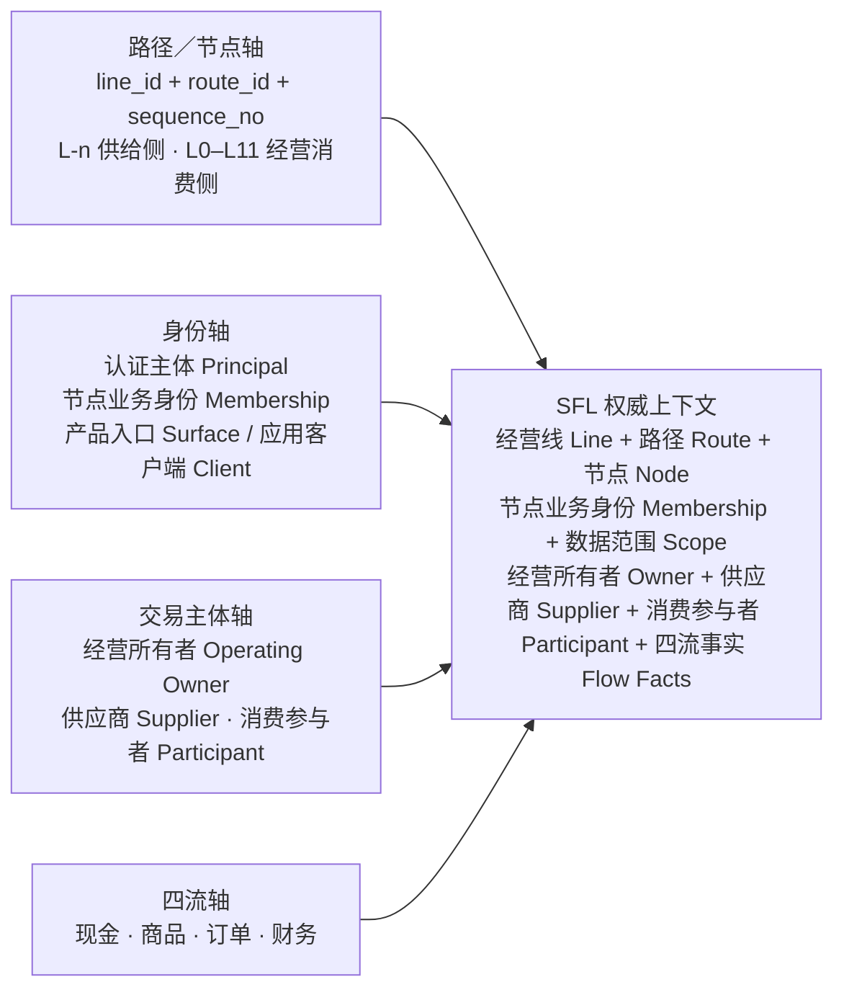

# 四流合一 · 节点主权架构（SFL）标准

> 中文主名：**四流合一 · 节点主权架构**<br>
> 英文名称：**Sovereign Flow Lattice**<br>
> 统一缩写：**SFL**<br>
> 核心表述：**一套标准基座，十二级相对节点，有符号供给路径，四流闭环；主体身份固定、经营级号相对，正向交易生成路径，逆向售后回放原路径。**

## 1. 标准目的

SFL 是有符号经营路径及 L0—L11 参考线的产品、架构、实现和验收共同标准，用来回答六个问题：

1. 当前请求属于哪条经营线、哪个节点和商城；
2. 当前用户正以哪份业务账号上下文工作；
3. 该节点开放了哪些功能，该身份拥有哪些权限；
4. 一次交易的经营所有者、供应商和消费参与者分别是谁；
5. 每个商品行经过哪条有序路径，供应商从哪里接入，逆向售后应回到哪里；
6. 订单流、商品流、现金流和财务流是否形成完整、一致、可追溯的事实。

任何文档、方案、接口、页面、数据库查询、部署或验收，只要无法回答以上问题，就不能宣称符合 SFL。

### 1.1 中英文命名规则

SFL 的名称以中文业务含义为权威，以英文名称和代码标识帮助跨团队及工程实现对齐：

1. 标题、正文、图表和验收报告统一使用“中文主名（English Name）”；
2. 同一章节首次出现时写全称，后续优先使用中文主名或已定义缩写；
3. 数据库字段、接口字段、函数、类、文件和事件名称属于精确代码标识，必须保持原样并使用反引号，不作中文替换；
4. 同一概念只能有一个中文主名和一个英文规范名，不得在 `client / surface`、账号／身份、商城／节点之间混称；
5. 缩写首次出现必须给出中英文全称，例如“行级数据隔离（Row-Level Security，RLS）”；
6. 架构文档文件名使用“编号-中文业务名-稳定英文缩写”，不得只用英文缩写或临时代号。

### 1.2 权威双语术语表

| 中文主名                | 英文规范名／缩写              | 在 SFL 中的含义                                                                      |
| ----------------------- | ----------------------------- | ------------------------------------------------------------------------------------ |
| 四流合一 · 节点主权架构 | Sovereign Flow Lattice（SFL） | 本标准的正式名称                                                                     |
| 节点主权                | Node Sovereignty              | 每个节点的身份、功能、权限、数据与生命周期可独立判定                                 |
| 节点格                  | Node Lattice                  | 多条经营线、节点关系和交易路径共同形成的有向、可追溯关系图                           |
| 经营线                  | Operating Line                | 由 `line_id` 标识、拥有独立 L0 参照点和相对级号空间的经营关系线                      |
| 有符号级号              | Signed Level                  | `L-n / L0 / Ln`；负号标识供给侧，非负号标识经营消费侧，不能代替主体类型或路径顺序    |
| 有符号经营路径          | Signed Operating Route        | 交易实际经过的有序节点序列；级号表达节点方向属性，`sequence_no` 表达真实先后         |
| 经营与治理节点          | Operating and Governance Node | 当前主参考线中 L0—L5 的经营与治理节点；在其他经营线中按该线自己的相对位置判定        |
| 消费与参与节点          | Consumer and Participant Node | 当前主参考线中 L6—L11 的消费与参与节点；身份仍由主体和节点业务身份明确表达           |
| 供给侧节点              | Supply-Side Node              | 以 `L-n` 标记、通过合同或供货关系接入交易路径的供应主体节点                          |
| 供应商主体              | Supplier Party                | 独立参与商品、订单、现金和财务四流的上游经济主体，不因处于上游而获得治理上级地位     |
| 供应关系                | Supply Relationship           | 供应商与平台、商城或其他经营节点之间版本化的合同、供货、履约、结算和开票关系         |
| 路径快照                | Route Snapshot                | 下单时按商品行冻结的节点、顺序、主体、合同及四流责任快照，历史交易不得按当前关系重算 |
| 供应商经济腿            | Supplier Economic Leg         | 主订单中按供应商、合同、履约和结算路径拆出的独立子订单／经济责任段                   |
| 逆向回放                | Reverse Replay                | 退货、退款、库存回补和财务冲销依据原路径快照生成逆向事实的处理方式                   |
| 商城实例                | Mall                          | 由 `mall_id` 唯一标识的经营载体                                                      |
| 登录凭据                | Credential                    | 手机号、密码、微信等登录证明                                                         |
| 认证主体                | Principal                     | 身份系统确认的行为主体                                                               |
| 节点业务身份            | Membership                    | 主体在特定节点和入口中的业务账号身份                                                 |
| 有效会话                | Session                       | 当前请求绑定的一份活动节点业务身份                                                   |
| 产品入口                | Surface                       | 运营后台、消费前台等用户进入的产品面                                                 |
| 应用客户端              | Client                        | 发起请求的具体应用                                                                   |
| 功能                    | Feature                       | 节点是否提供某项业务能力                                                             |
| 业务操作                | Operation                     | 合同中可被授权和执行的原子业务动作                                                   |
| 权限                    | Permission                    | 某节点业务身份是否可执行业务操作                                                     |
| 数据范围                | Scope                         | 权限可作用的节点、商城或本人资源范围                                                 |
| 运行能力                | Capability                    | 当前会话及服务实际具备的运行条件                                                     |
| 经营所有者              | Operating Owner               | 拥有本次商城交易四流权威事实的经营节点                                               |
| 消费参与者              | Participant                   | 参与交易并拥有节点化个人参与事实的消费节点                                           |
| 经营主体                | Legal Entity                  | 营业执照或其他法律经营主体                                                           |
| 经营主体绑定            | Legal Entity Binding          | 节点或商城对经营主体的版本化引用                                                     |
| 支付服务商              | Payment Provider              | 微信支付及未来其他支付渠道提供方                                                     |
| 支付渠道绑定            | Payment Provider Binding      | 支付服务商、应用与商户账户的版本化组合                                               |
| 支付意图                | Payment Intent                | 发起收款的领域意图                                                                   |
| 支付尝试                | Payment Attempt               | 一次具体渠道收款尝试                                                                 |
| 支付观测证据            | Payment Observation           | 主动查询或服务端通知形成的支付事实证据                                               |
| 服务端通知              | Webhook                       | 支付服务商主动投递的签名事件                                                         |
| 对账差异单              | Reconciliation Case           | 四流事实冲突时的可追溯处理载体                                                       |
| 交易关联标识            | Transaction / Correlation ID  | 串联四流事实的稳定标识                                                               |
| 运营后台                | Console                       | 经营与治理人员使用的产品入口                                                         |
| 消费前台                | Storefront                    | 消费者浏览和交易使用的产品入口                                                       |
| 行级数据隔离            | Row-Level Security（RLS）     | 数据库按已解析范围限制行级读写的机制                                                 |

## 2. 名称的正式含义

### 2.1 节点主权（Sovereign）

每条经营线中 L0—L11 的业务点以及接入交易路径的 L-n 供给侧业务点，都是可独立判定的节点。节点至少独立拥有：

- 节点标识、经营线、相对级号和关系；
- 节点化业务账号上下文；
- 可用功能、权限、能力与生效范围；
- 业务数据的所有者或参与者身份；
- 品牌、状态、策略绑定和生命周期；
- 可按 `node_id / mall_id` 独立过滤的运行观测与验收证据。

同一主体可以出现在多条经营线中，每次出现必须有独立、可判定的线内位置。裸写 `L0`、`L-2` 或 `L6` 不能唯一识别主体；至少还需要 `line_id + node_id / party_id`。主体类型由平台、商城、供应商、会员等明确类型字段表达，不从级号猜测。

父节点创建子节点，不等于父节点可以直接读写子节点数据。上级治理能力必须通过明确的业务操作（Operation）、权限（Permission）和数据范围（Scope）表达。

### 2.2 四流合一（Flow）

SFL 的“四流”只指：

1. **现金流**：支付请求、渠道受理、回调／主动查询、实收、退款和资金状态；
2. **商品流**：商品、SKU、价格、库存、预占／释放、履约、发货、收货和退货；
3. **订单流**：购买意图、购物车、结算、订单、取消、完成和售后关系；
4. **财务流**：应收应付、账本、凭证、分配、结算、对账和差异处理。

“合一”表示四流运行在同一标准基座，并通过稳定业务标识、命令、查询和领域事件汇合成完整交易事实；不表示四流共享表、共享写入权或共享状态机。

只有财务流拥有会计语义上的账本。订单流、商品流和现金流拥有各自的权威事实链，统一不称为“四本账”。

### 2.3 节点格（Lattice）

SFL 节点格由经营线、层级关系、供应关系和交易路径共同组成。父子关系形成偏序，供应商通过合同边接入平台或商城，交易路径则是对这些节点和边的一次有序选择。任何一种关系都**不自动产生权限继承或数据支配关系**。

层级关系回答“平时如何归属”，交易路径回答“这笔交易实际经过谁”。二者不得混为一张表或一种排序；历史交易必须读取下单时冻结的路径快照，不得按当前层级重新推导。

SFL 借用格模型的“偏序、标签和可判定边界”思想。经典格访问控制（Lattice-Based Access Control，LBAC）通常还要求定义安全标签、支配关系以及上确界／下确界；SFL 未完成这些形式化定义前，不宣称等同于经典 LBAC。生产授权仍以节点业务身份（Membership）、权限（Permission）、数据范围（Scope）、运行能力（Capability）和会话版本（Session Version）的明确判定为准。

参考：[NIST 历史资料对安全格、偏序与支配关系的说明](https://csrc.nist.gov/files/pubs/conference/1988/10/17/proceedings-11th-national-computer-security-confer/final/docs/1988-11th-ncsc-proceedings.pdf)。

### 2.4 有符号经营路径（Signed Operating Route）

SFL 的级号是“线内相对位置 + 供需方向标记”，不是全局固定身份：

- `L0` 是某条经营线的参照点；不同 `line_id` 可以分别拥有自己的 L0；
- `L1`、`L2`……表示该线经营消费侧的相对节点；
- `L-1`、`L-2`……表示供给侧节点；负号不表示权限更低，也不表示数轴上的执行顺序；
- 同一供应商可以在自己的经营线中是 L0，又通过供应关系以负级节点进入另一条交易路径；
- 实际交易先后只能读取 `sequence_no`，禁止按级号的数值大小排序。

以下两条都是合法且含义不同的有序路径：

```text
路径 A：L-1 → L0 → L2 → L6
路径 B：L0 → L1 → L-2 → L2 → L6 → L7
```

路径 B 中的 `L-2` 位于 L1 与 L2 之间，说明负号是供给侧语义，不是位置排序。对应的默认逆向路径分别为：

```text
路径 A 逆向：L6 → L2 → L0 → L-1
路径 B 逆向：L7 → L6 → L2 → L-2 → L1 → L0
```

逆向路径是售后编排依据，不授权任何业务流直接覆盖另一业务流的权威事实；订单、商品、现金和财务仍须各自追加合法的退货、退款、回补或冲销记录。

## 3. 十二级参考线与负级供给侧

### 3.1 L0—L5｜经营与治理节点段

L0—L5 是当前 `zhudatuan 主打团` 主参考线中的组织、经营和财务归属位置，不是管理员级别，也不是所有经营线通用的主体类型。该段节点可以创建并绑定商城实例（Mall）；商城创建后取得独立 `mall_id`。`line_id`、`node_id` 与 `mall_id` 永远是三个概念。

| 等级  | 当前已确定含义                                                   | 标准约束                                                                          |
| ----- | ---------------------------------------------------------------- | --------------------------------------------------------------------------------- |
| L0    | 当前主参考线的 `zhudatuan 主打团` 平台／自营根节点               | 是该线参照点，不等于其他经营线的 L0，也不天然高于供给侧主体                       |
| L1    | 当前主参考线中由 L0 创建的经营节点；当前实例为 `宏泰甄选 hbbtzn` | 拥有独立节点、商城、身份、品牌和生命周期边界                                      |
| L2—L5 | 当前主参考线的后续经营位置                                       | 具体业务名称待 Ethan 以后定稿；交易路径可只记录实际参与节点，不为凑级号制造空主体 |

节点等级本身不能直接授予 Owner、管理员、财务或其他权限。Owner 代表其商城，管理员按明确授权查看和管理；二者都是节点业务身份和权限，不是新的 L 级。

### 3.2 L6—L11｜消费与参与节点段

L6—L11 是当前主参考线中挂接在经营节点下的消费与参与链，不是独立商城层。在当前宏泰线中，手机注册形成的商城消费者位于 L6；“消费者”仍是明确的主体／节点业务身份类型，不能只凭 `L6` 字符串推断。

```text
任意 L0–L5 经营节点
└─ L6      消费与参与链唯一允许的起点
   └─ L7   只能直接挂在 L6
      └─ L8   只能直接挂在 L7
         └─ L9   只能直接挂在 L8
            └─ L10  只能直接挂在 L9
               └─ L11  只能直接挂在 L10
```

硬性规则：

1. 只有 L6 可以直接挂在 L0–L5 经营节点下。
2. 不允许从 L7–L11 开始建链。
3. L7–L11 必须挂在直接前一级，不允许跳级。
4. 一个节点在同一 `line_id` 和生效时间内只有一个直接父节点；同一稳定主体可以通过不同关系出现在多条经营线中。
5. 层级关系可以变更，但必须留存原关系、新关系和生效时间，不改写历史交易。
6. L6–L11 独立拥有节点化身份、功能、权限和参与事实，但不因等级自动获得后台权限或 `mall_id`。

以上规则描述当前主参考线的归属拓扑。交易路径可以省略本次交易未经过的中间节点，例如记录 `L0 → L2 → L6`；省略只表示该节点不参与本次交易，不自动改写层级关系。

L2–L5 与 L7–L11 的正式业务名称目前保留；出现真实业务差异时，再通过 SFL 版本升级定义。

### 3.3 L-n｜供应商与供给侧节点

供应商明显进入四流合一，但“上游”不等于“上级”。供应商是独立经济主体，可以在商品、履约、资金、结算和票据关系上位于平台或商城上游，却不因此取得对 L0、L1 或其他节点的治理权限。

负级供给侧遵循以下规则：

1. `L-n` 只表示某条经营／交易路径中的供给侧位置，不是供应商类型、固定身份或全局编号。
2. 供应商通过版本化供应关系接入 L0、L1 或其他实际采购节点；可以平台统采、商城直采，也可以同时存在多份独立关系。
3. 一个供应商主体只保留一个稳定 `party_id / supplier_id`，在不同经营线中的接入位置、合同、商品范围、履约和结算分别绑定。
4. 同一条交易路径可以在任意实际业务段插入负级供给节点；禁止假定所有 `L-n` 必须排在 L0 前面。
5. 负级节点不自动获得商城后台权限；供应商工作人员通过独立供应商节点业务身份、权限和范围访问自己的商品、子订单、履约、售后、结算和发票事实。
6. 商城 Owner 必须能在商城范围内看到与该商城签约并参与交易的供应关系；管理员只有获得对应权限和范围后才能看到同一份事实。

平台统采与商城直采的典型连接如下：

```text
供应商经营线 S-A:L0 ──平台供应关系──> 主参考线 L0
供应商经营线 S-B:L0 ──商城供应关系──> 主参考线 L1
```

进入具体交易路径后，供应商使用该路径分配的负级标签，例如 `L-1` 或 `L-2`。供应商自身经营线中的 `S-A:L0` 与交易路径中的 `L-1` 可以指向同一个稳定主体，但承担不同上下文含义。

### 3.4 权威字段字典

| 字段                                       | 回答什么                                                   | 事实源                                           | 可变性                                |
| ------------------------------------------ | ---------------------------------------------------------- | ------------------------------------------------ | ------------------------------------- |
| `line_id`                                  | 当前相对级号属于哪条经营线                                 | 层级／经营线（Hierarchy / Operating Line）       | ID 不复用，关系版本化                 |
| `level` / `signed_level`                   | 节点在指定经营线或路径中的相对级号与供需方向               | 层级／路径快照（Hierarchy / Route Snapshot）     | 必须结合 `line_id` 或 `route_id` 判读 |
| `node_id`                                  | 具体是哪个 SFL 节点                                        | 层级（Hierarchy）                                | 不可复用                              |
| `parent_node_id`                           | 当前直接父节点                                             | 层级关系（Hierarchy Relation）                   | 版本化变更                            |
| `host_node_id`                             | L6 消费链直接归属的 L0–L5 经营节点                         | 层级关系（Hierarchy Relation）                   | 由关系派生，不接受前端自报            |
| `mall_id`                                  | 业务事实属于哪个商城                                       | 商城实例（Mall）                                 | 已成交易不变                          |
| `principal_id`                             | 身份系统中的已认证行为主体                                 | 身份（Identity）                                 | 按身份生命周期管理                    |
| `membership_id`                            | 行为主体在节点／入口中的业务身份                           | 身份与访问（Identity / Access）                  | 可变更状态，ID 不复用                 |
| `scope`                                    | 节点业务身份可作用于哪些资源                               | 访问控制（Access）                               | 版本化变更                            |
| `surface`                                  | 消费前台、运营后台或其他用户界面                           | 应用（Application）                              | 每次会话固定                          |
| `client`                                   | 发起请求的应用客户端                                       | 应用与契约（Application / Contract）             | 每次会话固定                          |
| `credential_version`                       | 认证凭据版本                                               | 身份（Identity）                                 | 凭据变更时提升                        |
| `access_version`                           | 权限与范围版本                                             | 访问控制（Access）                               | 授权变更时提升                        |
| `legal_entity_binding_id`                  | 当前节点／商城引用哪个经营主体绑定                         | 组织与财务（Organization / Finance）             | 只向前生效                            |
| `party_id` / `party_kind`                  | 路径节点实际是谁、属于平台／商城／供应商／会员中的哪类主体 | 主体目录（Party Registry）                       | 主体 ID 不复用，类型不可由级号推断    |
| `supplier_id`                              | 哪个稳定供应商主体参与本商品行／供应商经济腿               | 供应商（Supplier）                               | 历史交易快照固定                      |
| `supplier_relationship_id`                 | 供应商依据哪份版本化关系接入采购节点                       | 供应关系（Supply Relationship）                  | 只向前换版，历史引用不变              |
| `route_id` / `route_version`               | 本次交易使用哪条有符号经营路径及其版本                     | 交易路径（Transaction Route）                    | 下单后不可按当前关系重算              |
| `sequence_no`                              | 节点在本路径中的真实执行顺序                               | 路径快照（Route Snapshot）                       | 路径内唯一且冻结；禁止按级号排序      |
| `contract_id` / `edge_kind`                | 相邻路径节点依据什么合同及业务边连接                       | 合同／供应关系（Contract / Supply Relationship） | 路径快照固定                          |
| `payment_provider_binding_id`              | 某次支付选用哪个支付渠道和商户账户                         | 支付（Payment）                                  | 每次支付尝试快照固定                  |
| `transaction_id`                           | 用哪个稳定标识串起四流                                     | 交易契约（Transaction Contract）                 | 不可复用                              |
| `supplier_leg_id` / `supplier_suborder_id` | 主交易中的哪一条供应商经济腿                               | 订单／交易契约（Order / Transaction Contract）   | 创建后不可换绑供应商或路径            |

产品入口字段 `surface` 和应用客户端字段 `client` 不再混称：前者是用户进入的产品面，后者是产生请求的应用客户端。

### 3.5 经营主体与营业执照绑定

`mall_id` 是商城实例的系统身份，不是营业执照或法律主体身份。一个经营主体可以被多个节点或商城绑定。

子节点创建时可以沿用上一家的有效经营主体，但必须形成明确的绑定快照，至少记录：

```text
legal_entity_binding_id
legal_entity_id
source_node_id
target_node_id / mall_id
binding_role
effective_at
binding_version
```

父节点以后更换营业执照或经营主体，不自动改写子节点已存绑定和历史交易。继续沿用或更换主体时，新建一个向前生效的绑定版本。

供应商主体同样必须通过明确的经营主体绑定参与合同、结算和开票。一个经营主体可以作为多个供应商经营单元或商城的法律主体，但每条供应关系和每笔历史交易必须冻结实际使用的绑定版本。

### 3.6 多支付渠道绑定

“收银”不等于微信支付。一个商城可以同时绑定多个支付服务商（Payment Provider）和多个商户账户；微信只是当前已接入的支付服务商之一。

每次支付尝试（Payment Attempt）必须快照实际选用的渠道绑定，至少能回答：

```text
provider
payment_provider_binding_id
provider_application / merchant account fingerprint
amount / currency
provider_reference
configuration_version
```

不同节点可以共享同一支付服务商或商户账户，但支付事实仍必须通过本地支付意图／支付尝试（Payment Intent / Attempt）映射回唯一 `node_id / mall_id`。

## 4. SFL 四轴上下文

SFL 的每个业务动作都必须同时落在四个轴上：



任一业务动作必须能回答：在哪条经营线和交易路径、经过哪个节点、使用哪份节点业务身份（Membership）、以什么交易主体角色、改变哪一条流的什么权威事实。涉及商品的动作还必须能回答实际供应商、合同边和履约／结算责任。

## 5. 身份标准

### 5.1 凭据、主体、身份和会话分层

```text
登录凭据（Credential）     = 用什么证明可以登录（手机号、密码、微信等）
认证主体（Principal）      = 身份系统中的已认证行为主体
节点业务身份（Membership） = 该主体在某节点／入口以什么业务身份工作
有效会话（Session）        = 本次会话当前绑定哪一份节点业务身份
```

同一凭据可用于低摩擦发现或进入多个节点账号，但凭据本身不授予节点权限。SFL 不强制认证主体（Principal）在所有节点全局共享还是节点本地化；它强制有效业务账号上下文必须节点化。

用户口中的“四个完全不同账号”，在 SFL 中指四份不可串线的业务账号上下文；它们可以复用凭据或自然人关联，但不得共享节点业务身份（Membership）、角色、数据范围（Scope）、权限版本（Access Version）或业务读写权。

### 5.2 四账号上下文示例

| 业务账号上下文 | 入口                   | 节点／范围                                                      | 权限来源                               |
| -------------- | ---------------------- | --------------------------------------------------------------- | -------------------------------------- |
| L0 后台        | 运营后台（Console）    | L0 平台范围（Platform Scope）                                   | L0 后台运营身份（operator Membership） |
| L0 消费        | 消费前台（Storefront） | L0 商城范围 + 本人范围（Mall + Self Scope）                     | L0 消费身份（storefront Membership）   |
| L1 后台        | 运营后台（Console）    | 宏泰 L1 商城范围（Mall Scope）                                  | L1 后台运营身份（operator Membership） |
| L1 消费        | 消费前台（Storefront） | 宏泰 L1 商城范围 + 本人范围（Mall + Self Scope）；参与节点为 L6 | L1 消费身份（storefront Membership）   |

“四账号上下文”不是 SFL 的“四流”。前者解决谁以什么身份进入哪个节点，后者解决交易事实如何闭环。

表中的 L0、L1 和 L6 均以当前 `zhudatuan 主打团` 主参考线为上下文，不构成“平台／商城／消费者”在所有经营线中的全局类型编码。

### 5.3 一次会话只有一份活动身份

权威会话至少绑定：

```text
principal_id
membership_id
surface / client
node_id / mall_id / scope
credential_version
access_version
```

会话可以列出合法的可选身份，但一次业务请求只能有一份活动节点业务身份（Membership）上下文。切换节点或节点业务身份必须由服务端明确发生；切换前权限不得残留。

## 6. 功能与权限标准

### 6.1 功能、权限和范围必须分开

- **功能**回答：该节点是否提供这个业务能力；
- **权限（Permission）**回答：当前节点业务身份是否允许执行该业务操作（Operation）；
- **范围**回答：允许对哪个节点、商城或本人资源执行。

```text
有效能力
= 节点已开放功能
∩ 节点业务身份（Membership）被授予权限
∩ 当前数据范围（Scope）允许范围
∩ 当前会话的运行能力／认证强度（Capability / Assurance）
```

功能存在不等于用户有权限；用户有权限也不等于其他节点已开放该功能。

### 6.2 权威授权顺序

```text
路由／契约（Route / Contract）
→ 有效会话（Session）
→ 受众／应用客户端（Audience / Client）
→ 节点业务身份 + 权限版本（Membership + Access Version）
→ 权限 + 明确拒绝（Permission + Explicit Deny）
→ 节点／商城数据范围（Node / Mall Scope）
→ 运行能力（Capability）
→ 认证强度（Assurance，仅当操作需要时）
→ 业务操作（Business Operation）
→ 审计／事件（Audit / Event）
```

业务模块只接受权威身份管道解析出的上下文，不能相信前端提交的 mall_id、手机号、角色名或页面入口。

### 6.3 层级关系不等于权限继承

以下推断全部禁止：

- L0 创建 L1，所以 L0 任意后台账号都能读取 L1；
- L1 管理员可以读取所有 L6–L11 私人数据；
- L6 属于宏泰，所以宏泰消费者可以进入宏泰运营后台（Console）；
- 同一手机号在两个节点注册，所以两个节点的权限和数据自动合并；
- 角色名叫“财务”或“管理员”，所以可以跳过业务操作（Operation）权限判定。
- 供应商位于 `L-1 / L-2`，所以它在治理上低于或高于某个正级节点；
- `L-2` 数值小于 `L1`，所以交易执行时必须排在 L1 之前；
- 同一供应商服务多个商城，所以这些商城可以互相读取该供应商的订单、结算或会员数据。

确需跨节点治理时，必须使用明确治理身份、业务操作（Operation）、权限（Permission）、数据范围（Scope）和审计事实。

## 7. 四流所有权与交易汇合

### 7.1 四流权威事实

| 业务流 | 自有权威事实                                                                                                                                                    | 不得直接写入                     |
| ------ | --------------------------------------------------------------------------------------------------------------------------------------------------------------- | -------------------------------- |
| 现金流 | 支付意图（intent）、支付尝试（attempt）、支付服务商观测（provider observation）、商城实收、供应商款项分配／支付、退款（refund）、资金运动（fund movement）      | 商品库存、订单明细、财务分录     |
| 商品流 | 供应商商品／报价、库存单位（SKU）、价格（price）、库存（inventory）、预占／释放（reservation / release）、供应商履约（fulfillment）、发货、收货、退货和库存回补 | 支付终态、财务凭证               |
| 订单流 | 购物车（cart）、结算（checkout）、主订单、供应商子订单／经济腿、商品行路径、订单状态和售后关系（after-sales relation）                                          | 渠道支付事实、库存权威事实、总账 |
| 财务流 | 应收（receivable）、供应商应付（payable）、账本（ledger）、分录（entry）、分配、结算、发票、红冲、对账（reconciliation）                                        | 订单状态、支付渠道状态、库存     |

四流只可通过明确命令、查询、带稳定标识的领域事件、幂等消费者和不可改写的历史快照协作。

### 7.2 经营所有者、供应商与消费参与者

一笔交易不是“只有一个节点”，而是必须明确区分至少三个交易主体角色：

| 角色       | 权威字段                                                          | 责任                                                                     |
| ---------- | ----------------------------------------------------------------- | ------------------------------------------------------------------------ |
| 经营所有者 | `operating_node_id + mall_id`                                     | 拥有商城侧交易汇合、顾客订单和商城经营事实                               |
| 供应商主体 | `supplier_id + supplier_relationship_id + contract_id + route_id` | 提供商品／库存，承担约定履约和售后，参与款项分配、应付、结算、发票和对账 |
| 消费参与者 | `participant_node_id + membership_id`                             | 拥有节点化身份、资格、受益与个人可见参与事实                             |

供应商是四流合一中的独立经济主体，不是商城管理员角色，也不是因为供货而成为平台或商城的组织下级。“上游”描述商品、履约、资金和票据方向；“上级”描述治理关系，二者不得互相推导。

一笔面向消费者的销售交易仍须有唯一销售经营所有者（`operating_node_id + mall_id`），用于汇合顾客订单；“唯一”不表示交易只有一个经济参与方。路径中的平台、商城、供应商及其他节点可以分别拥有明确的分配、应收、应付、履约和开票责任，全部通过商品行和供应商经济腿追溯。

消费者的个人订单视图是商城订单事实的受控投影，不是第二份可独立改写的订单真值。同一自然人可以在多个商城拥有多份参与节点或节点业务身份（Membership），每份分别归属。

### 7.3 有符号路径快照

每个进入结算的商品行必须冻结自己的有符号经营路径。最低路径节点结构为：

```text
route_id / route_version
sequence_no
line_id
signed_level
node_id / party_id / party_kind
mall_id（适用时）
supplier_id（适用时）
supplier_relationship_id / contract_id / edge_kind
fulfillment_party_id
settlement_party_id
invoice_party_id
effective_at
```

路径遵循以下规则：

1. `signed_level` 表达供需方向和线内相对位置，`sequence_no` 才表达真实交易顺序。
2. 禁止按 `signed_level` 的数值或字符串排序生成交易或退货路径。
3. 路径只记录本商品行实际经过的节点，可以省略未参与交易的参考线节点。
4. 下单后路径快照不可按当前组织树、供应关系、Owner、管理员、合同或级号重新计算。
5. 同一稳定主体可以在多条路径中承担不同角色，但每次承担的角色、合同和责任都必须在路径快照中明确。

### 7.4 多供应商分腿

一个购物车可以形成一个面向消费者的主订单，但必须按实际供应商路径拆分供应商子订单／经济腿。推荐的最小拆分键是：

```text
supplier_id
+ supplier_relationship_id / contract_id
+ route_id / route_version
+ fulfillment_party_id
+ settlement_party_id
+ invoice_party_id
```

任一字段不同，都不能仅因消费者一次支付而伪装成同一供应商经济腿。一次支付可以覆盖多个供应商子订单，但现金分配、供应商应付、履约、发票和售后必须能回到各自商品行及路径。

```text
一个主订单
├─ 供应商 A 子订单／经济腿 → 路径 A → 独立履约、结算、发票和售后
├─ 供应商 B 子订单／经济腿 → 路径 B → 独立履约、结算、发票和售后
└─ 供应商 C 子订单／经济腿 → 路径 C → 独立履约、结算、发票和售后
```

供应商 A 的商品发生退货或退款，不得要求供应商 B、C 的合法子订单同步逆转。

### 7.5 逆向售后与原路回放

SFL 的逆向售后不是根据当前层级“重新找应该退给谁”，而是引用原商品行路径快照生成逆向责任：

```text
正向订单路径
→ 按商品行冻结 route_id / sequence_no / 各主体责任
→ 发起部分或全部售后
→ 选中原商品行及供应商经济腿
→ 按原路径倒序生成退货、退款、库存回补和财务冲销命令
→ 四流各自在自己的权威事实链中追加逆向事实
→ 对账收口
```

路径倒序回答“依次回到哪些责任节点”，各边快照回答“该节点实际承担什么”。退货接收方、退款承担方、库存所有者和红冲主体可以不同，必须读取原边责任，不得只凭级号猜测。

典型逆向路径：

```text
L-1 → L0 → L2 → L6
L6  → L2 → L0 → L-1

L0 → L1 → L-2 → L2 → L6 → L7
L7 → L6 → L2  → L-2 → L1 → L0
```

Owner 转移、管理员变更、供应合同换版、供应商停用或当前层级调整，都不得改写历史路径。无法执行原路径时，建立异常售后／对账事实并显式改派，不能静默重算。

### 7.6 四流合一判据

一次交易只有同时满足以下条件，才可称为当前生命周期阶段的“四流闭环”：

```text
同一 transaction_id / correlation_id
+ 唯一 operating_node_id / mall_id
+ 已快照 participant_node_id / membership_id
+ 每个商品行唯一 route_id / route_version
+ 实际 supplier_id / supplier_relationship_id / contract_id
+ 多供应商子订单／经济腿及金额分配可追溯
+ 订单权威事实
+ 商品／库存／履约权威事实
+ 现金／支付权威事实
+ 财务／账务权威事实
+ 金额、币种、状态和版本之间一致
```

“当前生命周期阶段”必须写明，不得要求尚未到结算日的交易提前生成最终结算事实。一条流处于合法的 `pending` 状态时，必须同时存在预期下一节点和超时／差异处理规则。

### 7.7 多支付渠道与回调归属

支付通道、商户账户、公网回调入口和服务端通知（Webhook）技术服务可以共享。渠道名称、收款方展示名或回调域名都不是 SFL 节点判据。

每个支付服务商（Payment Provider）的回调都必须经过以下规范路径：

```text
支付服务商事件（provider event）
→ 渠道引用 + 应用／商户账户指纹（provider_reference + application / merchant account fingerprint）
→ 本地支付意图／支付尝试（local payment intent / attempt）
→ 唯一经营节点／商城（operating_node_id / mall_id）
→ 节点范围处理（node-scoped processing）
→ 节点范围观测（node-scoped observation）
```

主动权威查单和已验签的回调可以“有效成功证据先到者先收口”，但每个通道的健康证据必须分开记录。主动查单不得冒充服务端通知（Webhook），任何支付服务商都适用同一原则。

一次支付覆盖多个供应商经济腿时，支付服务商成功只证明商城收款事实，不自动证明供应商结算、发票或履约完成。现金流和财务流必须根据已冻结的商品行路径与分配规则分别生成后续事实。

### 7.8 四流冲突与对账

当四流状态不一致时，不得由某一条流直接改写其他流的权威事实。

```text
检测到差异
→ 财务流建立对账差异单（reconciliation case）
→ 保留各流原始事实和证据来源
→ 调用权威渠道查询或人工对账
→ 向事实所有流发出明确命令／事件
→ 各流自行追加纠正或逆向事实
→ 对账结果收口
```

已由权威证据确认的成功不得被后到的超时、网络失败或非终态查询降级。冲突本身必须留痕，不得通过覆盖原记录“消除”。

## 8. 节点创建、运行、观测与恢复

### 8.1 创建

上级节点可以通过层级与节点生成（Hierarchy and Provisioning）能力创建下级节点。创建动作只生成节点关系、必要快照和明确授权，不得让下级商城在交易运行时同步依赖上级商城。

### 8.2 运行

节点投入运行后应满足：

- 父级层级服务短暂不可用时，已生成的商城实例（Mall）仍可继续浏览、下单、支付、履约、退货和记账；
- 节点只读取自己的权威数据和明确授权的公共能力；
- 支付、回调、订单、退款和财务事实都携带可恢复的节点、供应商经济腿和路径范围；
- 当前供应关系或层级服务不可用时，已成交商品仍可读取冻结路径并发起合法逆向售后；
- 代码、构建物、进程、数据库、支付服务商和服务端通知技术服务可以共享，但节点归属和数据范围必须可分舱。

### 8.3 观测与恢复

SFL 要求的不是“每个节点必须有独立物理服务”，而是：

1. 变更影响节点可明确识别；
2. 日志、事件、作业和交易可按 `line_id / route_id / node_id / mall_id / supplier_id` 过滤；
3. 节点配置、路由或功能版本可向前修正或恢复；
4. 共享制品回退时，必须证明其他节点的身份、数据和四流事实未被改写；
5. 代码回退不得改写已完成的历史交易；
6. 恢复和重放必须使用原路径版本，不能把当前供应商、合同或层级投射到历史订单。

## 9. 受控身份切换（通俗称“无感穿梭”）

SFL 的受控身份切换是**认证体验连续、授权上下文隔离**：

1. 已验证的凭据可以避免重复输入；
2. 目标域名先解析到明确的应用、节点、商城和产品入口（application、node、mall、surface）；
3. 服务端只返回该入口合法可用的节点业务身份（Membership）；
4. 切换后有效会话（Session）只激活选中的一份节点业务身份；
5. 页面、功能和数据从新上下文重新计算；
6. 返回原节点时可以快速恢复其合法上下文，但不得带回另一节点权限。

“无感”不等于一个万能令牌（Token）横跨多条经营线或 L0—L11，也不等于一个浏览器会话凭证（Cookie）同时激活多份身份。

## 10. 运营后台（Console）信息分舱标准

后台必须把四类对象分开：

| 页面             | 只管理什么                                                             | 明确不属于该页的内容                               |
| ---------------- | ---------------------------------------------------------------------- | -------------------------------------------------- |
| 后台成员与权限   | 后台运营身份（`operator` Membership）、角色、权限和范围                | 消费前台会员名单和消费交易视图                     |
| 管理员邀请       | 后台运营人员（operator）邀请生命周期                                   | 商城消费会员和消费者自动授权                       |
| 商城会员         | 当前精确商城范围（mall scope）下的消费身份（storefront Membership）    | 管理员邀请、后台角色重置和其他商城会员             |
| 供应商与供货关系 | 供应商主体、供应关系、合同、商品范围、供应商人员、履约、结算和发票范围 | 商城会员归属、管理员身份以及其他商城的供应商经济腿 |

列表业务行必须以当前节点业务身份（Membership）或节点化账号上下文为准，不得按手机号去重。微信绑定状态必须按当前商城节点业务身份判定，不得只按认证主体（Principal）猜测。供应商列表必须区分稳定供应商主体与当前商城供应关系；同一供应商服务多个商城时，不得把合同、商品、子订单、结算或售后范围合并泄漏。

## 11. SFL 面—线—点变更纪律

每次改动都必须经过三层核对：

1. **面｜SFL 标准**：说明节点、身份、功能、权限、交易角色、数据和四流边界；
2. **线｜本批方案**：只描述一个端到端交付物、影响路径和恢复路径；
3. **点｜代码修改**：每个文件和每条业务操作（Operation）都能映射回本批方案及 SFL 条款。

开工前必须填写以下边界卡：

```text
交付物：
目标经营线 / line_id：
目标节点 / signed_level：
经营所有者 operating_node_id / mall_id：
供应商主体 supplier_id：
供应关系／合同 supplier_relationship_id / contract_id：
交易路径 route_id / route_version：
商品行／供应商经济腿：
消费参与者 participant_node_id / membership_id：
目标产品入口／应用客户端（surface / client）：
目标业务操作（Operation）：
所需权限／运行能力（Permission / Capability）：
精确数据范围（Scope）：
经营主体绑定：
支付服务商绑定（Payment Provider Binding）：
数据所有者：
影响的四流：
逆向售后路径：
明确不影响的节点与模块：
恢复点：
验收事实：
```

无法填写完整时，不得开始修改。

## 12. SFL 符合性与可测量闸门

### 12.1 单项结果穷举

每个闸门在执行前只允许以下结果，事后不得增删类别：

| 结果      | 含义                                                 |
| --------- | ---------------------------------------------------- |
| `PASS`    | 直接证据命中预定通过条件                             |
| `FAIL`    | 直接证据命中任一预定禁止条件                         |
| `UNKNOWN` | 未执行、证据缺失或无法得出结论                       |
| `N/A`     | 标准明确声明该项对当前对象不适用；执行者不得自行豁免 |

总体结论：任一必测项 `FAIL` 即为不符合；没有 `FAIL` 但存在 `UNKNOWN` 即为部分符合；所有必测项 `PASS` 才可宣称符合。

### 12.2 核心架构闸门

| 编号   | 直接测量目标             | 验证方式与必需证据                                                                                               | `PASS / FAIL` 边界                                                                                        |
| ------ | ------------------------ | ---------------------------------------------------------------------------------------------------------------- | --------------------------------------------------------------------------------------------------------- |
| SFL-01 | 唯一经营线与节点上下文   | 读取服务端解析的经营线、节点、相对级号、产品入口、商城／范围（line、node、signed level、surface、mall/scope）    | 全部唯一且一致为 PASS；裸级号、缺失、多值或串线／串节点为 FAIL                                            |
| SFL-02 | 单一活动节点业务身份     | 读取有效会话（Session），并执行一次需权限的写入                                                                  | 一次请求只使用一份活动节点业务身份（Membership）为 PASS；权限混合为 FAIL                                  |
| SFL-03 | 同凭据多账号隔离         | 使用同一凭据分别进入两个节点，比对节点业务身份（Membership）、数据范围（Scope）和业务数据                        | 上下文分离为 PASS；按手机号合并、去重或串数据为 FAIL                                                      |
| SFL-04 | 功能∩权限∩范围∩能力      | 事前列出四项真值组合并逐类验证                                                                                   | 仅全部满足时允许为 PASS；任一缺失仍允许为 FAIL                                                            |
| SFL-05 | 层级不自动授权           | 使用有父子关系但无显式授权的对照身份访问子节点                                                                   | 被拒绝或返回零越界数据为 PASS；成功越界为 FAIL                                                            |
| SFL-06 | 不信任前端自报范围       | 篡改请求中的 node/mall/role，核对服务端上下文与落库结果                                                          | 忽略或拒绝篡改值为 PASS；按篡改值生效为 FAIL                                                              |
| SFL-07 | 数据不泄漏其他节点       | 预置目标节点和对照节点记录，执行同一查询与越权负向查询                                                           | 只返回目标节点记录为 PASS；任一对照记录可见为 FAIL                                                        |
| SFL-08 | 四流写入所有权           | 审查写路径并触发一次跨流状态变化                                                                                 | 权威所有流自行写入且跨流有合同／事件为 PASS；跨流直改表为 FAIL                                            |
| SFL-09 | 四流交易收据             | 选择一笔真实交易，按 transaction/correlation ID、商品行和 route ID 追溯四流                                      | 当前阶段事实齐全，商城、供应商、参与者及路径归属一致为 PASS；缺失、伪造或引用其他经济腿为 FAIL            |
| SFL-10 | 节点可观测与可恢复       | 使用测试环境、历史故障证据或受控演练，证明可按节点定位影响并恢复                                                 | 影响节点可识别且历史事实不改写为 PASS；无法分辨或改写其他节点为 FAIL                                      |
| SFL-11 | 运营后台四类对象分舱     | 分别读取后台运营身份、管理员邀请、消费身份和供应商关系（operator、invitation、storefront、supplier）的接口及页面 | 行类型、操作、商城和供应关系范围不串舱为 PASS；混合查询或跨舱操作为 FAIL                                  |
| SFL-12 | 有符号级号语义           | 使用包含 `L-2` 位于 L1 与 L2 之间的路径执行解析和展示                                                            | 保留原序且负号只表达供给侧为 PASS；按数值／字符串重排或由级号猜主体为 FAIL                                |
| SFL-13 | 供应商进入四流           | 选择一条真实供应商商品行，追溯商品、供应商子订单、款项／退款及应付／结算／发票事实                               | 四流均能回到同一 supplier、relationship、contract 和 route 为 PASS；任一流没有供应商责任或串供应商为 FAIL |
| SFL-14 | 多供应商分腿             | 使用一个包含至少两个供应商的主订单，分别检查路径、履约、分配、结算、发票和售后                                   | 每个供应商经济腿独立且总额守恒为 PASS；合并后无法拆解或一个供应商动作改写另一腿为 FAIL                    |
| SFL-15 | 逆向原路回放             | 对一条含负级节点的商品行执行部分退货／退款，核对原路径和各流新增事实                                             | 只沿选中商品行原路径生成合法逆向事实为 PASS；按当前层级重算、退错主体或覆盖原事实为 FAIL                  |
| SFL-16 | 历史路径不受关系变更影响 | 成交后变更 Owner、管理员、供应关系或合同版本，再读取并演练售后                                                   | 历史 route/version、主体和责任保持不变为 PASS；历史路径漂移或无法定位原责任方为 FAIL                      |

### 12.3 交付配套闸门

以下为 SFL 交付配套标准，不改变核心架构符合性的语义：

| 编号    | 直接测量目标               | 验证方式                                     | `PASS / FAIL` 边界                                               |
| ------- | -------------------------- | -------------------------------------------- | ---------------------------------------------------------------- |
| SFL-D01 | 页面分舱和正式 VI          | 核对信息架构、行类型、操作边界和当前 ZHU-VI  | 目标页不串舱且符合已定 VI 为 PASS；任一违反为 FAIL               |
| SFL-D02 | 源码、构建物与运行版本一致 | 比对 Git SHA、构建元数据、部署清单和运行证据 | 四者指向同一制品为 PASS；任一不一致为 FAIL                       |
| SFL-D03 | 验收直接测量目标事实       | 事前列出穷举结果和权威证据，执行后不增删     | 直接证据命中预定通过条件为 PASS；只有页面提示或下游副产品为 FAIL |

## 13. 当前代码落点映射（非规范性附录）

本节只帮助实现者定位当前代码，不把具体文件名永久锁成 SFL 概念。代码重构后可以更新此映射，不改变前十二节标准。

| SFL 概念                                       | 当前主要落点                                                                                | 作用                                                                               |
| ---------------------------------------------- | ------------------------------------------------------------------------------------------- | ---------------------------------------------------------------------------------- |
| 有效会话与节点业务身份（Session / Membership） | `foundation/security/SessionResolver.ts`、运营后台 `SessionLoader.ts`                       | 解析会话与业务上下文                                                               |
| 节点／数据范围（Scope）数据库上下文            | `foundation/infrastructure/DatabaseContext.ts`、`applyApiDatabaseContext(...)`、`*_scope()` | 把解析后范围写入当前数据库事务上下文                                               |
| 服务业务操作（Operation）白名单                | `bootstrap/DefinedModule.ts`、`defineSelectedModule(...)`                                   | 明确每个运行面只承载哪些业务操作                                                   |
| 必需／禁止能力启动检查                         | `bootstrap/*RuntimeCompatibility.ts`、`assert*RuntimeCompatibility(...)`                    | 启动时核对服务必需能力与不应拥有的数据库能力                                       |
| 数据分舱                                       | PostgreSQL 行级数据隔离（RLS）、`access.scope_allowed(...)` 等受管函数                      | 在数据库边界按已解析数据范围限定读写                                               |
| 支付回调归属                                   | `payment.webhook_scope(...)`、`PaymentWebhook.ts`                                           | 从渠道事件恢复唯一 mall scope 后处理                                               |
| 合同与功能目录                                 | `packages/contract/definitions/operations.yml`、生成式客户端 SDK（Generated SDK）           | 使业务操作（Operation）、运行能力（Capability）、错误和客户端调用保持一致          |
| 有符号经营路径、供应商经济腿与逆向回放         | 尚无经 SFL-12—SFL-16 验收的统一生产落点                                                     | SFL 1.2 新增规范；后续必须以专属交付批实现和验收，不得把本文档完成误报为代码已完成 |

本附录记录现有机制，不授权任何任务新增数据库授权（GRANT）、行级数据隔离（RLS）、守卫、断言或权限收窄。如实现与 SFL 不符，先报告差异，再由 Ethan 决定修改方式。

## 14. 标准权威与版本规则

1. Ethan 在当前任务中的明确决定优先。
2. 本文件是 zdt-next 中 SFL 架构的唯一规范性入口。
3. 当前系统符合性、实施顺序和单次故障结论不写入本标准，应放入独立的日期化验收或审计文档。
4. 与本标准冲突的旧文档只作历史材料，不继续指导新实现。
5. 当前主参考线中 L2–L5 与 L7–L11 未定义的业务名称和功能是显式保留项，不得由实现者猜测；其他经营线不得复制这些名称后冒充全局类型。
6. 供应商是四流独立经济主体；任何实现不得把 `L-n` 简化为普通商城角色、管理员等级或数值排序键。
7. 变更有符号级号、经营线、交易路径、节点分段、挂接规则、身份公式、交易主体、四流事实所有权或符合性边界时，必须提升 SFL 版本并记录原因。

## 15. 标准验收报告模板

```text
版本名称：SFL｜<目标节点>｜<本次能力与阶段>
机器编号：<短 SHA；无代码修改则写“无代码修改”>
目标经营线：<line_id>
目标节点：<node_id / signed_level / mall_id>
有效身份：<认证主体 / 节点业务身份 / 数据范围（principal / membership / scope）>
交易主体：<经营所有者 / 供应商 / 消费参与者（operating owner / supplier / participant）>
交易路径：<route_id / route_version / sequence 摘要>
供应商经济腿：<supplier_id / relationship / contract / suborder>
四流结果：<订单流 / 商品流 / 现金流 / 财务流>
逆向结果：<原路径 / 退货 / 退款 / 库存回补 / 财务冲销>
隔离对照：<对照节点及零变化证据>
符合性：<PASS / PARTIAL / FAIL / UNKNOWN>
未通过项：<精确 Gate 和证据>
本版完成：<一句话>
```

## 16. 变更记录

| 版本    | 日期       | 变更                                                                                                                                                                                                 |
| ------- | ---------- | ---------------------------------------------------------------------------------------------------------------------------------------------------------------------------------------------------- |
| SFL 1.2 | 2026-09-07 | 引入有符号经营路径：L 级号改为经营线内相对位置，`L-n` 标识供给侧且与真实路径顺序分离；供应商升级为四流独立经济主体；定义按商品行冻结路径、多供应商分腿、原路逆向售后、历史路径不重算及对应可测量闸门 |
| SFL 1.1 | 2026-09-07 | 建立中文主名优先的双语命名规则和权威术语表；统一正文、图表、字段、闸门与报告模板名称；不改变 SFL 1.0 架构语义                                                                                        |
| SFL 1.0 | 2026-09-07 | 正式定名；锁定 L0–L5 经营节点与 L6–L11 严格消费链；区分节点、商城、经营主体和支付服务商；定义四流所有权、多渠道支付、受控身份切换、运营后台分舱和可测量闸门                                          |

## 17. 依据

- `05_docs_ziliao/docs_wendang/strategy/zhudatuan-主打团-战略全景图.md`
- `05_docs_ziliao/docs_wendang/prompts/⭐️zhudatuan 主打团标准商城提示词.md`
- `05_docs_ziliao/docs_wendang/architecture/07-登录系统总体设计图.md`
- `05_docs_ziliao/docs_wendang/membership-permissions/00-BOUNDARY-MODELS.md`
- `01_core_hexin/services/commerce/src/foundation/infrastructure/DatabaseContext.ts`
- `01_core_hexin/services/commerce/src/bootstrap/DefinedModule.ts`
- `02_platform_pingtai/database/supabase/migrations/20260901190000_add_payment_mall_identity.sql`
- [NIST 安全格历史资料](https://csrc.nist.gov/files/pubs/conference/1988/10/17/proceedings-11th-national-computer-security-confer/final/docs/1988-11th-ncsc-proceedings.pdf)
