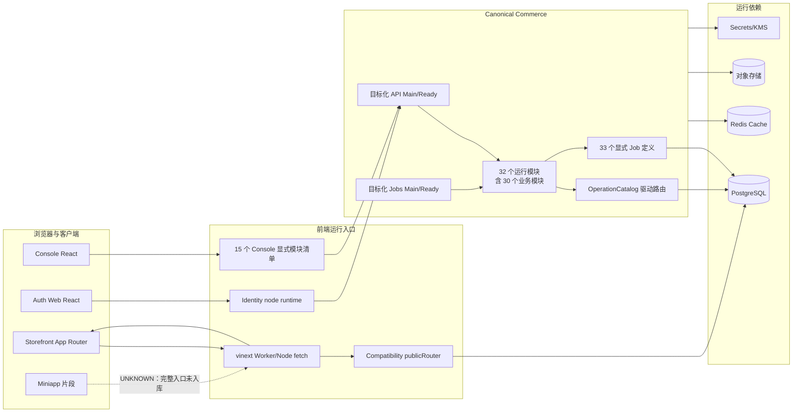
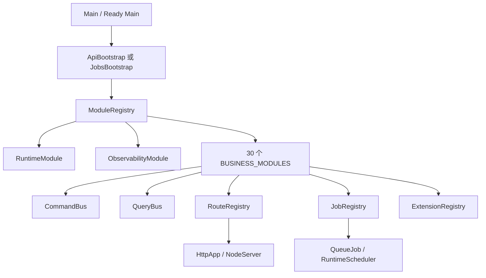
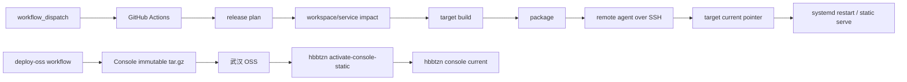
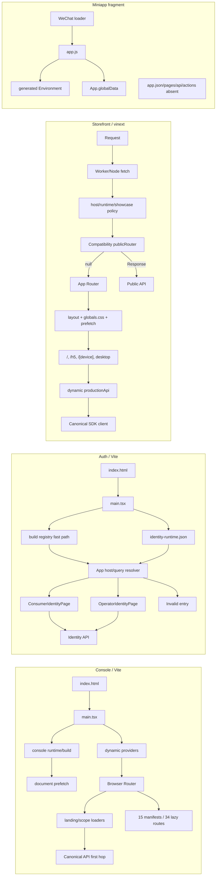

# 全代码库系统审计｜01 真实架构初版

## 1. 本版边界

本文件截至 AU-002 已完成“仓库入口与自动发现机制”以及四个客户端页面/运行入口总图。它不是业务模块深审结论，不证明所有运行单元都健康，也不产生任何删除授权。

- 固定基线：`5a1ce71eebbefaa826368a9e1dc17730f9363bc4`
- 证据明细：`records/AU-001-repository-entry-discovery/evidence.csv`
- 页面入口证据：`records/AU-002-frontend-runtime-entry-map/evidence.csv`、`routes.csv`、`styles-and-assets.csv`
- 微观记录：`records/AU-001-repository-entry-discovery/{files,exports,functions}.csv`；`records/AU-002-frontend-runtime-entry-map/{files,exports,functions}.csv`
- 状态：架构阶段前 2 个审计单元已完成；后续服务进程、数据、通信和故障传播 AU 会增量修正本图。

## 2. 核心结论

1. [FACT][E-AU-001-002][E-AU-001-003] 根仓库是 npm workspaces 单体仓库，7 组路径模式解析出 43 个实际 workspace；miniapp 不在 workspace 图中。
2. [FACT][E-AU-001-007][E-AU-001-011][E-AU-001-012][E-AU-001-013] 生产应用主干不是“扫描目录即自动上线”：Console 模块、Commerce 模块、HTTP 路由和 Jobs 均有显式注册表或冻结闸门。
3. [FACT][E-AU-001-014][E-AU-001-015] Commerce 存在两套不同目的的入口发现：本地/全量构建扫描全部 `*Main.ts`，正式服务构建只接受 10 个显式 target 映射。
4. [FACT][E-AU-001-016] 发布影响分析同时使用 workspace 反向依赖图和 esbuild 服务入口图；无法收窄时倾向选择可达运行目标上界。
5. [FACT][E-AU-001-009] Storefront 的 Worker/Node fetch 入口先调用 Compatibility Commerce API 的 public router，再回落到 vinext App Router。因此 Compatibility API 不是一个可仅凭“无独立发布 target”判定无用的孤立服务。
6. [FACT][E-AU-002-003][E-AU-002-004][E-AU-002-008][E-AU-002-013] 四个客户端不是同一种运行形态：Console 是 Browser Router；Auth 是 host/query 分流；Storefront 是 App Router + Worker 双入口；Miniapp 只有 App 初始化片段。
7. [CONFLICT][E-AU-002-010][E-AU-002-018][E-AU-002-020] Auth 和 Miniapp 的机器声明均不能同时解释当前运行入口：Auth 批准组件/锁哈希漂移，Miniapp 的 candidate/tests/navigation/runtimegraph/delivery matrix 对“完整客户端”使用互相冲突的判据。
8. [CONFLICT][E-AU-001-017][E-AU-001-020][E-AU-001-021][E-AU-004-010] Auth 与 Console 的发布 target、仓库 Caddy 路径和线上 active Caddy 路径不是同一指针体系；观察时 `accounts.fufu.wang/` 与 `console.fufu.wang/` 均返回 404。该项为 F-0001（P1 候选），尚待 RV-0001 独立复核。
9. [CONFLICT][E-AU-001-018][E-AU-001-019][E-AU-001-022] 仓库声明的生产 unit/target 不能完整重建观察时线上运行单元：至少两个活跃 unit 没有基线内同名 unit 文件。

## 3. 总体运行架构

[FACT][E-AU-001-007][E-AU-001-008] Console 的 15 个 manifest 由 `ConsoleModuleRegistry.ts` 静态导入，经 `ConsoleModuleRoutes.tsx` 转换为 React Router route object；hidden 不生成路由，disabled 生成禁用页，redirect 生成 Navigate，其余 route 延迟加载。

[FACT][E-AU-001-011][E-AU-001-012][E-AU-001-013] Canonical Commerce 的 `ModuleRegistry` 先按依赖拓扑排序，再执行模块注册；`RouteRegistry` 和 `JobRegistry` 在 bootstrap 末尾冻结。详细业务调用、数据库对象所有权和权限执行身份尚未在 AU-001 深审。

## 4. 代码发现与注册机制

| 发现面 | 当前机制 | 自动程度 | 失败方式 | 审计判断 |
| --- | --- | --- | --- | --- |
| npm workspace | 根 `package.json` 的 7 个单星号目录模式；lockfile 当前解析 43 个包 | 目录发现 | 缺 package.json 会被 workspace resolver 跳过 | [FACT][E-AU-001-002][E-AU-001-003] |
| 包导出 | 各 workspace `exports`；release resolver 只解析精确 subpath | 显式契约 | 未解析导出交回 esbuild/Node | [FACT][E-AU-001-006]；通配导出兼容性待专项验证 |
| Console 模块 | 15 个 manifest 静态 import 后组成固定数组 | 显式注册 | 重复 ID、路径或 entry 数异常时模块加载报错 | [FACT][E-AU-001-007] |
| Console 页面 | manifest 中的 lazy loader，经 route materializer 生成 route object | 配置驱动动态导入 | hidden 不挂载；disabled 挂载禁用页 | [FACT][E-AU-001-008] |
| Storefront 页面 | `app/**/page.tsx` 与 `layout.tsx` 的 App Router 文件发现 | 框架发现 | 构建期/运行时由 vinext 处理 | [FACT][E-AU-001-009] |
| Storefront API | Worker 直接静态导入 `routePublicRequest` | 显式源码依赖 | 未命中 API 时回落页面 handler | [FACT][E-AU-001-009] |
| Commerce 模块 | `BUSINESS_MODULES` 30 项，加 Runtime、Observability | 显式注册 | 重复业务模块数闸门或依赖拓扑错误 | [FACT][E-AU-001-011] |
| HTTP 路由 | 模块向 `RouteRegistry` 注册 Operation ID；method/path 来自 OperationCatalog | 契约驱动显式注册 | 重复路由、缺 operation、未冻结均报错 | [FACT][E-AU-001-012] |
| Jobs | `app/jobs.ts` 33 项显式 catalog，统一注册为队列处理器 | 显式注册 | 重复/非法并发、lease、batch、deadline 报错 | [FACT][E-AU-001-013] |
| 本地 Commerce build | 扫描 `src/entry/*Main.ts`，并追加 9 个工具入口 | 文件名发现 | 新 Main 文件自动进入全量 bundle | [FACT][E-AU-001-014] |
| 正式服务 build | `service-targets.mjs` 固定 10 target → 19 个 Main/Ready 名称 | 显式白名单 | 未知 target 直接报错 | [FACT][E-AU-001-015] |
| 发布影响 | workspace 反向依赖 + service esbuild metafile | 图分析 | 无法收窄时选择上界 | [FACT][E-AU-001-016] |
| systemd | release manifest 指向模板或具体 unit | 显式发布配置 | 线上可存在仓库外 unit | [CONFLICT][E-AU-001-018][E-AU-001-019][E-AU-001-022] |
| Cloudflare | 3 个 wrangler 配置，其中 h5/mini 指向 Storefront 构建结果 | 配置驱动 | 仓库内未发现 deploy/publish 调用者 | [UNKNOWN][E-AU-001-010] 外部部署责任未知 |

## 5. 前端边界

### 5.1 Console

- [FACT][E-AU-001-007] 模块 ID、route ID、route path 和每模块唯一 entry 在注册时校验。
- [FACT][E-AU-001-008] 路由呈现信息可以按 scope kind 覆盖；缺少指定覆盖时回落 enterprise，再回落通用标题和摘要。
- [UNKNOWN] 15 个页面模块的真实 API 调用、权限、缓存隔离和样式加载不属于本 AU；后续逐模块审阅。

### 5.2 Auth Web

- [FACT][E-AU-001-023] HTML 进入 `src/main.tsx`；入口先装载 identity node runtime，再渲染 `App`。
- [FACT][E-AU-001-023] `App` 依据 host/query 选择 operator 或 consumer 身份界面；基线未发现 Browser Router 注册。
- [UNKNOWN] 登录、ticket exchange、Cookie、刷新、退出和权限链尚未审阅。

### 5.3 Storefront 与 Compatibility API

- [FACT][E-AU-001-009] 路由文件为 `/`、`/h5`、`/[device]`、`/desktop-1920`、`/desktop-1920/frame`、`/desktop-1920/inspect`。
- [FACT][E-AU-001-009] 同一 fetch handler 同时支持 Cloudflare 注入 env 与 Node `process.env`；先执行 labs/showcase/runtime 配置分支，再尝试 Compatibility public API，最后进入 vinext 页面。
- [INFERENCE][E-AU-001-009][E-AU-001-017] Compatibility API 的 public router 被编入 Storefront 制品；它没有独立 target 不代表没有生产职责。
- [UNKNOWN][E-AU-001-010] h5、mini Cloudflare 配置由谁部署、当前是否在线、与阿里云 Storefront 的发布所有权如何划分，仓库内证据不足。

### 5.4 Miniapp

- [FACT][E-AU-001-024] 基线只含 `app.js`、生成配置、领域文件、WXSS 和品牌资源，没有 `app.json`、页面目录或开发者工具项目配置。
- [UNKNOWN] 这些文件可能是生成目标、外部工程输入或未完成客户端；不得标为垃圾代码。

## 6. Canonical Commerce 边界

- [FACT][E-AU-001-011] `ModuleRegistry` 拒绝重复 ID、缺失依赖和循环依赖，且按拓扑顺序串行 await 每个模块的 `register`。
- [FACT][E-AU-001-012] `RouteRegistry` 从 OperationCatalog 取得 method/path；如果 bootstrap 指定 allow-list，未在 allow-list 的 operation 会被忽略，freeze 时检查 allow-list 是否全部注册。
- [FACT][E-AU-001-013] `JobRegistry` 只保存通过最小 lease、batch、concurrency、deadline 校验的任务，冻结前不能被 runner 消费。
- [UNKNOWN] 模块注册过程中的数据库连接、顶层副作用、跨模块数据读取和失败清理尚未逐模块检查。

## 7. 构建与发布边界

- [FACT][E-AU-001-018] 三个工作流当前都只声明手工触发。`deploy.yml` 是独立 direct production 链，不以 `quality.yml` 为先决条件；这是仓库当前明确治理决定，AU-001 不按个人偏好定为缺陷。
- [FACT][E-AU-001-017] release manifest 有 15 个 target、2 个逻辑 node；hbbtzn 的多项服务通过 `hostedBy` 指向 zhudatuan-l0。
- [FACT][E-AU-001-018] `deploy-oss.yml` 是 hbbtzn Console 的独立不可变 tarball 通道；激活脚本切换 `/opt/sfl/nodes/hbbtzn-l1/targets/console/current`。
- [CONFLICT][E-AU-001-020][E-AU-001-021] fufu Console 的 release pointer 与实际 Caddy 静态根分裂，详见 F-0001。

## 8. 架构中的事实源

| 事实面 | 当前权威用途 | 已见漂移 |
| --- | --- | --- |
| 根 package/lock | workspace、正式命令、依赖图 | Playwright 与 ESLint 仍使用不存在的旧路径/包名 |
| Console/Commerce 注册表 | 代码可达模块、route、job | 本 AU 未见注册表内部漂移 |
| release manifest | target、节点、构建与公开验收 | fufu Console pointer 与实际 Caddy 不一致 |
| remote policy | 远端允许 unit、pointer 和检查 | 不能覆盖仓库外活跃 unit |
| systemd 文件 | 可安装 unit 模板和命令 | 线上至少两个活跃 unit 无同名受控文件 |
| Caddy/Cloudflare 配置 | host 到静态/服务入口的路由 | 仓库 Caddy、线上 Caddy、release pointer 三方不一致 |
| 文档 | 设计线索和历史解释 | 多处域名、主线和发布描述滞后，不能作运行事实 |

## 9. 当前边界评价

### 9.1 值得保留的设计

- [FACT][E-AU-001-007][E-AU-001-011][E-AU-001-012] Console 与 Canonical Commerce 都采用显式目录外注册，并在启动阶段检查重复、缺失或循环；这比仅依赖文件名发现更易复核。
- [FACT][E-AU-001-015] 正式 Commerce 服务构建有目标白名单，不会因新增任意 `Main.ts` 自动扩大生产发布面。
- [FACT][E-AU-001-016] 影响分析无法证明最小集合时选择上界，降低漏发布风险。

### 9.2 主要架构风险

- [CONFLICT][E-AU-001-017][E-AU-001-020] 发布、静态路由和运行 current 指针存在多重事实源；当前已出现可观察 404。
- [CONFLICT][E-AU-001-004][E-AU-001-005][E-AU-001-025] 测试/静态质量入口没有随 workspace 重命名保持一致，导致正式命令的覆盖范围与代码树不同。
- [UNKNOWN][E-AU-001-010] Cloudflare 的部署所有权在仓库内不可追踪，无法仅从当前仓库证明哪些边缘 Worker 正在运行。

## 10. 已知未知项

1. Cloudflare h5/mini Worker 的实际部署触发、版本和所有者。
2. fufu Console 路径分裂从何时开始、是否存在替代访问路径、影响用户范围。
3. 两个仓库外活跃 unit 的创建来源、发布责任和恢复方式。
4. 43 个 workspace 的完整外部消费者与所有包导出的动态使用。
5. Commerce 30 个业务模块的数据所有权和跨模块写入方向。
6. 33 个 Job 的生产者、消费者、重试、死信和恢复闭环。
7. miniapp 文件由哪个完整客户端工程消费。

这些未知项会进入后续独立 AU；任何一项都不能被转换成 G3 删除结论。

## 11. AU-002 增量：四客户端真实入口架构

### 11.1 总图

### 11.2 Console 边界

- [FACT][E-AU-002-003] `main.tsx` 在动态加载 React providers 前完成 runtime config 接纳并启动首文档预取；root 缺失同步失败，runtime/provider 失败显示可见错误页，已识别的旧 chunk 失败可触发一次 reload。
- [FACT][E-AU-002-004] Browser Router 的稳定父路径是 `/scopes/:scopeKind/:scopeId`。15 个 enabled manifest 共有 34 条 module route，再加 profile 与 scope/global wildcard。路由所有权来自显式 manifest，不来自目录扫描。
- [FACT][E-AU-002-005][E-AU-002-006] landing/scope loaders 是页面和 API 之间的第一层边界：document prefetch 最多交接 1.5 秒，畸形/超时回退 SDK；scope 必须属于当前 session；profile 403 可降级但 401 不能被 profile fallback 掩盖。
- [FACT][E-AU-002-007] 70 个 CSS 的生产根为 main 的四个 design sheets + `style.css`；后者继续收集 shell/feature/responsive/legacy/VI。6 个 CSS 没有文件名消费者，但均保留为未分级证据，不能据此删除。

### 11.3 Auth 边界

- [FACT][E-AU-002-008] build registry 已知道当前 host 时，App 在 runtime fetch settle 前渲染；同源 runtime 若存在，会校验 envelope、registry 和 accounts host。404/非 JSON 可以回退 build registry，其它错误显示运行配置错误页。
- [FACT][E-AU-002-009] Auth 没有 Browser Router；URL 状态由 `hostname + application/target/client/admin_origin/surface` 解析。consumer 必须精确匹配当前 node；只有 `operating_mall` node 可进入 operator 默认路径。
- [CONFLICT][E-AU-002-010] `owner-approved-ui.json` 和 `SOURCE-MANIFEST.md` 仍指向 LoginPage，但当前 App 不加载它；正式哈希门禁也失败。此冲突是 F-0005，不是 LoginPage 删除依据。
- [CONFLICT][E-AU-002-011][E-AU-002-012] Auth API 第一跳存在 9 个成功响应校验被丢弃的点，详见 F-0007；后端 handler、Cookie 和 ticket 生命周期留给身份专项。

### 11.4 Storefront 边界

- [FACT][E-AU-002-013][E-AU-002-014] Vite 把 `worker/index.ts` 作为 Cloudflare main，vinext 同时支持 `start` 的 Node 模式。每个请求先过 labs/runtime/showcase 分支，再进入 Compatibility public router；未命中才交给 App Router。
- [FACT][E-AU-002-015] `/` 与 `/h5` 的 layout 在浏览器 head 预发 `/api/v1/catalog/public/products?limit=100`，客户端 publicCatalogApi 可复用 Response。认证能力通过 `loadProductionApi()` 动态导入，再由节点绑定的 SDK client 发往 consumer/canonical API。
- [FACT][E-AU-002-016] `[device]` 接住任意单段参数；五个前缀映射到 desktop/mobile/tablet lazy frame。未知参数仅证明组件显示“不存在”文本，HTTP 404/200 未验证。
- [FACT][E-AU-002-017] App Router 实际样式根是 `app/globals.css`；`src/index.css` 无当前消费者。图外状态不产生删除结论。

### 11.5 Miniapp 边界

- [FACT][E-AU-002-018] `app.js` 的唯一行为是把 `wx.getExtConfigSync()` 交给生成 Environment，并写入 `App.globalData.environment`；其余 8 文件由四条生成链产生。
- [CONFLICT][E-AU-002-019][E-AU-002-020] 当前仓库不能提供 app manifest、页面、API client 或 action dispatcher；但 candidate、tests 和 delivery matrix 仍把它列为当前/required 客户端。该项为 F-0006。
- [UNKNOWN] 外部完整小程序工程、微信平台当前版本和该 9 文件目录的真实交付消费者均未验证。

### 11.6 当前最主要通信瓶颈

1. Auth 的 UI approval、运行 import 图和节点 runtime 是三套不同事实面，当前没有一个命令同时验证“批准组件已真实挂载且使用正确节点”。
2. Storefront 同一 fetch 入口横跨边缘策略、Compatibility public API、App Router 和 Canonical SDK；故障在 publicRouter 的 Response/null/reject 与页面 handler 之间传播，后续必须按完整请求链审计。
3. Console 首屏并行 document prefetch 与 Router SDK loader 有刻意 handoff；正确性依赖同一 session/scope parser 和 Abort 清理，不能把重复请求简单认定为冗余。
4. Miniapp 没有统一“完整交付单元”定义，不同门禁会对同一片段分别给出通过、ENOENT、缺兼容边或 implemented。

## 12. AU-003 增量：Canonical 进程架构

### 12.1 构建、发布与运行总图

~~~mermaid
flowchart LR
  Diff[HEAD^..HEAD 变更] --> Planner[affected-target planner]
  Planner --> Migration[database-migration]
  Migration --> Services[10 个 service targets]
  Services --> Artifacts[19 个 Main / Ready 制品]
  Artifacts --> Units[systemd units]

  subgraph API[7 个 API 进程]
    Env[环境与节点 manifest] --> Runtime[target runtime factory]
    Runtime --> Bootstrap[bootstrapApi]
    Bootstrap --> Registry[selected modules + operation allow-list]
    Registry --> Http[HttpApp + loopback NodeServer]
  end

  subgraph Jobs[3 个正式 Jobs 进程]
    JReady[ExecStartPre runtime preflight] --> JMain[Jobs Main]
    JMain --> Queue[QueueJob / JobRunner]
    Queue --> Pg[(runtime.job / deadletter)]
  end

  Units --> API
  Units --> Jobs
~~~

- [FACT][E-AU-003-003][E-AU-003-004] Commerce 全量构建会按文件名发现 28 个 Main 文件，并显式追加 9 个 seed/local-infra 入口；正式发布由另一套白名单收敛为 10 个 service target 和 19 个 Main/Ready 制品。新增 Main 不会自动成为生产单元。
- [FACT][E-AU-003-005][E-AU-003-006] 七个 API 都经过显式 selected module/operation allow-list、注册表 freeze 和 loopback NodeServer。聚合 ApiMain 不属于当前正式 target。
- [FACT][E-AU-003-008][E-AU-003-009] 正式 Jobs 被拆成 Identity Notification、Catalog、Payment 三类；聚合 Full Jobs 的 33 个任务、OutboxRelay 和 RuntimeScheduler 当前没有正式 target。

### 12.2 Ready 是四种不同契约

| 模型 | 运行单元 | 真正验证的对象 | 边界 |
| --- | --- | --- | --- |
| 自身 HTTP health | Identity、Mall、Purchase、Web | 已启动进程的端口、health route、runtime compatibility | 不验证所有业务 operation |
| systemd curl | Support | 已启动 Support 的 /health/ready | 只要求 HTTP 成功 |
| 负向业务探针 | Payment Webhook | 唯一 webhook route，且缺签名在 DB 前被拒绝 | 不验证合法支付回调 |
| 独立 runtime preflight | Catalog API 与三个 Jobs | 新 runtime 能读取 manifest/secret/DB/依赖并关闭 | Jobs 使用在 Main 前合理；Catalog API 不证明 serving path，见 F-0014 |

[FACT][E-AU-003-016] 生产时点日志证明 Jobs ExecStartPre 的确会在依赖未就绪时阻止 Main，并由 systemd 重试；这不是固定基线全日可用性证明。

### 12.3 Jobs 与迁移边界

- [FACT][E-AU-003-010] JobRunner 的数据边界是 PostgreSQL runtime.job：SKIP LOCKED/租约 claim、heartbeat、条件完成、事务性 retry/deadletter。processor 自身幂等尚未审。
- [CONFLICT][E-AU-003-011] 三个轮询 helper 在正常 timeout 后保留 shared AbortSignal listener，见 F-0012。
- [FACT][E-AU-003-012][E-AU-003-014] 当前正式迁移是 release 期间一次性 executor，不是 systemd 常驻单元；它验证 source、身份、冻结历史、advisory lock、目标 schema，并明确采用 forward-only。
- [CONFLICT][E-AU-003-013] 现代 SQL 自己提交后，ledger 在下一条语句登记，形成提交/登记非原子窗口，见 F-0013。

### 12.4 当前最主要通信瓶颈

1. 发布影响图不是运行 import 图的自动完备投影；CreateMall 已出现真实消费者与零 target 规则冲突（F-0011）。
2. Ready 名称没有统一测量语义：同名文件分别验证 HTTP serving、依赖构造或负向业务路径，运维不能只按名称推断覆盖。
3. Jobs 的消息边界实质是共享数据库队列，不是独立 broker；生产者、consumer、lease、deadletter 和业务事务必须按每个 job 成对复核。
4. 迁移与应用 pointer 是两个不同回滚域；数据库一旦 applied，后续应用失败只回 pointer，兼容性责任由 migration 设计承担。

完整逐进程、Ready、Jobs 和迁移表见 records/AU-003-canonical-process-entry-map。

## 13. AU-004 增量：发布与节点控制面

### 13.1 三条发布路径与两个逻辑节点

~~~mermaid
flowchart TB
  Manual[人工触发] --> Direct[Deploy Direct]
  Manual --> Quality[Quality/Candidate]
  Manual --> OSS[OSS Console]
  Direct --> Targets[15 release targets]
  Quality --> Targets
  Targets --> Agent[remote agent]
  Agent --> L0[zhudatuan-l0]
  Agent --> L1[hbbtzn-l1]
  OSS --> L1Console[L1 Console current]
  L0 --> Host[同一 ECS]
  L1 --> Host
  Host --> SD[systemd processes]
  Host --> Caddy[Caddy]
  Caddy --> Public[公网用户]
  Host --> Tunnel[Cloudflared]
  Tunnel --> Cloudflare[HBBTZN Cloudflare edge]
~~~

- [FACT][E-AU-004-002] 固定 manifest 有 15 个 target、2 个逻辑节点；HBBTZN 的部分业务服务通过 `hostedBy=zhudatuan-l0` 共享同一物理进程，不是两个完全独立主机。
- [CONFLICT][E-AU-004-004][E-AU-004-006] 正式 Deploy 固定 Direct。它保留制品完整性和 restart 错误传播，但不执行仓库已实现的 guarded readiness、Caddy/进程对账、外部验收和健康回滚，形成 F-0015。
- [CONFLICT][E-AU-004-008] HBBTZN Console 同时有 release agent 与 OSS 两个 production pointer writer，二者没有共享互斥，形成 F-0016。

### 13.2 业务发布面与控制面没有闭环

[CONFLICT][E-AU-004-003][E-AU-004-007] Caddy、Cloudflared 与 systemd 的 affected 分类不会交付相应配置：结果可能是重发全部 14 个非迁移业务 target，或零 target。独立 runtime installer 与 AutoNode 能处理部分控制面，但没有被普通 Deploy 正式编排，形成 F-0017。

[FACT][E-AU-004-012] AutoNode 的 11 步持久 ledger、exact plan digest 和 ownership-aware compensation 是高质量设计。它是显式主权节点升级通道，不应被误画成每次业务发布都会执行的下游。

### 13.3 Edge 权威分裂

[CONFLICT][E-AU-004-009][E-AU-004-010] HBBTZN gateway Caddy 从正式 target pointer 提供静态文件并反代 L0/L1 服务；fufu active Caddy 则从另一套 runtime-recovery current 读取 Auth/Console。观察时这两个 root 都缺 index，而正式 release pointer 的 index 存在，公网两个入口均为 404。active Caddy blob 不属于固定基线或仓库历史，权威安装者仍 UNKNOWN。

完整发布、制品、node、systemd、edge 与锁关系见 `09-release-and-operations.md` 和 `records/AU-004-release-node-runtime-map/`。

## 14. AU-005 增量：共享状态基础设施

### 14.1 持久状态与易失状态

| 状态设施 | 权威状态 | 进程/入口 | 共享范围 | 恢复边界 |
| --- | --- | --- | --- | --- |
| PostgreSQL | 业务schema及runtime outbox/inbox/job/lease/deadletter | production Docker PG17；staging RDS经TLS proxy | 多API/Jobs共享，角色/schema/scope逻辑隔离 | restart明确；backup/restore owner UNKNOWN；fresh init有F-0023 |
| Redis | 非权威cache | aggregate CommerceRuntime | 跨进程外部服务；当前dedicated targets不消费 | fail-open；同进程不重连F-0028 |
| Local Objects | node-local bytes/metadata/path | L0 8555、L1 8655 systemd StateDirectory | token/目录/manifest按node隔离 | completed保留、upload易失；backup owner UNKNOWN |
| Secret Store | 外部JSON catalog→进程内只读Map | global 8543、L0 8553 | workload按ref读取的意图边界 | 文件恢复owner UNKNOWN；生产授权未接F-0021 |
| Local KMS | 单master派生、ciphertext在业务DB | global 8544/staging8644 | keyRef+context加密域 | 仅local-v1；master备份/轮换owner UNKNOWN |
| Catalog media OSS | 云对象 | Catalog media adapter/job | 多target provider边界 | size/hash核验；云恢复UNKNOWN |

### 14.2 数据库就是消息总线

[FACT][E-AU-005-002][E-AU-005-004] 系统没有独立消息broker；异步边界建立在同一PostgreSQL的outbox、inbox、job、lease和deadletter上。业务写与outbox同事务，inbox去重与job enqueue同事务，aggregate内claim保持顺序；该设计本身值得保留。

[CONFLICT][E-AU-005-003] 唯一创建OutboxRelay和RuntimeScheduler的JobsMain/FullJobsMain不在production正式target图；full-staging聚合unit又被明确保持inactive。production worker只覆盖identity notification、Catalog和Payment专用队列，因此“实现完整”与“运行链存在”发生分裂，见F-0022。

### 14.3 权限与进程边界

[CONFLICT][E-AU-005-006] Secret/KMS客户端、授权Handler、exact-resource policy和文档声明一致；实际build/systemd运行的Main绕过这套授权。服务只监听loopback、systemd非root和文件隔离仍有价值，但不能替代workload身份与ref授权，见F-0021。

### 14.4 对象边界

[FACT][E-AU-005-007][E-AU-005-008] Local Objects与Catalog媒体OSS是两套不同所有权：前者是host/node StateDirectory和内部HTTP，后者是Catalog直连云provider。Local Objects的bytes内容寻址和签名校验清楚；public URL loopback、虚假`clean`和可变digest metadata分别形成F-0025–F-0027。

完整设施、密钥、崩溃点和恢复责任见 `records/AU-005-shared-state-infrastructure-map/`、`06-security-and-permissions.md` 与 `07-data-and-migrations.md`。

## 15. AU-006 增量：共享配置权威

### 15.1 四层配置内核

~~~mermaid
flowchart LR
  Env[systemd/env/browser/ext config] --> Parsers[@shop/config Environment parsers]
  Parsers --> Entry[Main / Ready]
  Entry --> Runtime[专用 Bootstrap]
  Declaration[SFL registry declaration] --> Registry[SflNodeRegistry]
  Registry --> Identity[Identity node projection]
  Registry --> Console[SFL Console runtime]
  AutoNode[AutoNode request] --> Manifest[Signed node Manifest]
  AutoNode --> ConsoleJson[console-runtime.json]
  ConsoleJson --> Console
  Yaml[cache.yml + capacity.yml] --> Generator[Runtime config generator]
  Generator --> SharedLimits[TS/Miniapp generated catalogs]
~~~

[FACT][E-AU-006-002][E-AU-006-007] 服务环境解析、SFL节点声明、Console节点运行JSON和容量/缓存目录是四个不同事实源。专用Bootstrap通常会在环境解析后再次核对Manifest、domain、feature、resource/secret ref，这是值得保留的双层边界。

[CONFLICT][E-AU-006-003] Catalog Jobs在Commerce Bootstrap内自行解析source=process.env；正式环境所有权检查只识别直接属性/下标读取，因此“config是唯一owner”的门禁规则与真实实现不一致。

### 15.2 节点权威与Console投影

SFL内核对exact key、canonical form、Manifest digest、唯一Host、唯一node/ref和release pointer做严格校验。静态Console declaration从registry的domain binding ref生成API/Identity URL，链路闭合。

[CONFLICT][E-AU-006-005] per-node console-runtime parser只验证URL为HTTPS，并只把runtime binding的resource ref/scope与Manifest核对；URL本身没有映射回Manifest domain。解析后的地址直接驱动登录跳转和SDK请求，形成F-0029/P1候选。

[CONFLICT][E-AU-006-006] Registry与生成Runtime Catalog都只冻结最外层并暴露嵌套引用。隔离运行探针证明修改domain host会改变后续resolver，修改RUNTIME_LIMITS.http会改变共享deadline值；readonly类型不能作为运行期不可变性证据，见F-0032。

### 15.3 生成配置

cache.yml和capacity.yml经单一生成器投影到RuntimeCatalog及Miniapp运行文件，生成器支持--check并由check:generated编排；该权威关系清楚。Miniapp Environment生成器复用了schema，却没有复用TS parser的trim语义，形成F-0033。

本单元完整架构、文件记录和17.1%逆向抽检见 records/AU-006-shared-configuration-kernel/。

## 16. AU-007 增量：契约定义与生成边界

### 16.1 四目录、一主生成器、多发布面

~~~mermaid
flowchart LR
  Operations[operations.yml] --> Generator[contractgen]
  Events[events.yml] --> Generator
  Capabilities[capabilities.yml] --> Generator
  Errors[errors.yml] --> Generator
  Authz[PermissionCatalog] --> Generator
  Generator --> Package[@shop/contract]
  Generator --> OpenAPI[OpenAPI]
  Generator --> SDK[SDK domains]
  Generator --> HTTP[Commerce HTTP shells]
  Generator --> EventRuntime[Event registry]
  Generator --> DB[DB current.sql]
~~~

[FACT][E-AU-007-002/003] 345个Operation是路由、owner、audience、permission、availability和执行metadata的主要事实源；67个Event同时驱动公共事件目录、运行handler registry与DB schema URI；1438个Error驱动HTTP status map。271个runtime与74个frozen在当前tracked输出中的集合一致。

`capabilities.yml`不是DB发布权威：DB capability/binding从Operations生成；它只参与局部audience校验，且自身存在孤儿、缺项和permission漂移（F-0041）。因此不能再把四个YAML笼统画成同等权威。

### 16.2 运行消费边界

[FACT] HTTP路由注册使用OperationCatalog，授权器使用Operation上的permission，业务执行再由ModuleOperations按writePath分流。事件发布使用生成的EVENT_HANDLERS与COMMERCE_EVENTS version。错误映射使用generated errorStatus；未声明错误退化为INTERNAL_ERROR 500。

[CONFLICT][E-AU-007-004] 两个真实Member写入口使用member.read并被Console只有read permission的fixture固定，形成F-0036/P1候选。

[CONFLICT][E-AU-007-005] 通用“named schema”不是生产HTTP边界：OpenAPI、SDK类型、直接schema test和handler专用schema拥有不同接受集合，形成F-0038。

### 16.3 执行、版本与生成可靠性

- writePath完全由generator的名称/domain heuristic推断，81个runtime非GET走none；具体业务正确性待逐模块确认，机制缺口为F-0040。
- Event checksum只标识type/version/module，不标识schema/handlers，形成F-0039。
- generator的顺序直接写与无命中断言replace形成F-0042；当前主要tracked输出仍通过只读集合对账。

完整目录、逐Operation/Event/Capability/Error记录、117文件覆盖与19.5%逆向抽检见 `records/AU-007-contract-definitions-contractgen/`。

## 17. AU-008 增量：生成契约运行边界

### 17.1 生成物不是一个发布单元

~~~mermaid
flowchart LR
  Gen[contractgen] --> OA[OpenAPI/events JSON]
  Gen --> SDK[35 SDK operation clients]
  Gen --> HTTP[Controller/Handler]
  Gen --> ER[EVENT_HANDLERS]
  Gen --> DB[current.sql]
  MiniGen[miniapp generator] --> Mini[2 domain modules]
  SDK --> API[ApiClient/Transport]
  API --> CORS[HttpApp preflight]
  HTTP --> Routes[RouteRegistry]
  ER --> Pub[RuntimeEventPublisher]
  OA --> ContractHash[release contractHash]
  SDK --> ClientHash[web client hashes]
  HTTP --> OCI[Commerce OCI hash]
  Mini --> MiniHash[Miniapp directory hash]
~~~

[FACT][E-AU-008-003/010] 345个Operation都存在于SDK；服务端Controller、Handler和数据库快照只承载271个runtime Operation，74个frozen Operation由SDK在传输前拒绝。67个Event均进入生成registry；publisher在事务前解析type/version，再在同一事务写inbox并排队handler job。

[FACT][E-AU-008-012/013] `current.sql`在仓内只有generator写端和一个contract test读端，不进入迁移runner或release candidate。release的`contractHash`只覆盖OpenAPI与稀疏events JSON；Web SDK、Commerce壳和Miniapp分别由目录/OCI哈希追踪。因此制品身份是分层关系，不能用一个contract字段代替全部字节。

### 17.2 主要接缝问题

- SDK的proof header与生产CORS白名单分离维护，真实Console跨域命令在浏览器预检处终止，而mock允许通过（F-0044）。
- runtimegraph仍验证已由`57c1177d`退出的版本头/426契约，并读取不存在的Miniapp client（F-0045）。
- 微信Transport端口边界清楚，但adapter在undefined/不可序列化响应上违反字符串与Promise settle契约（F-0046）。
- Miniapp两个生成domain模块有候选制品责任但零运行引用；外部工程未知，继续保留在F-0006而非删除候选升级。

完整文件记录、通信/FMEA/不变量矩阵与18.5%确定性逆向抽检见 `records/AU-008-generated-contract-runtime-chain/`。

## 18. AU-009 增量：`@shop/kernel` 共享内核

### 18.1 编译共享，不是运行单元

[FACT][E-AU-009-003] Kernel 是 private ESM workspace package，公开根入口和 `./deadline` subpath；72 个源码文件直接 import/re-export，最终编入 Commerce、Vendor、SDK 和 testing 各自制品。它没有 Main、监听端口、数据库连接、Worker 注册、独立镜像或 release target，不能画成单独服务。

~~~mermaid
flowchart LR
  Commerce[Commerce] --> K[Kernel]
  Vendor[Vendor core] --> K
  SDK[SDK ApiClient] --> KD[Kernel deadline]
  Testing[testing] --> K
  K --> Domain[Domain primitives]
  K --> Res[Resilience primitives]
  K --> Gate[Gate types]
  K --> Mod[Module contracts]
~~~

### 18.2 可靠性组合边界

[FACT][E-AU-009-004/005] Commerce 外部 HTTP 的真实顺序是 RateLimiter → Bulkhead → CircuitBreaker → Retry → Deadline 约束下的 fetch；Vendor 使用同一 CircuitBreaker/Retry/Deadline，但另有自己的并发和幂等 attempt 门禁。共享原语降低了 adapter 重复实现，这是值得保留的方向。

[CONFLICT][E-AU-009-004] Circuit 状态没有调用代际，旧成功可关闭新 open；classifier 异常可留下永久 half-open probe（F-0047）。[CONFLICT][E-AU-009-005] `businesskeywrite` 只是一枚 mode 标签，Commerce WeChat 链丢弃已有业务键却允许 transport retry（F-0048）。因此“统一执行器”并不自动证明并发和幂等不变量成立。

### 18.3 领域与模块边界

- Money 的 safe-integer minor unit 及算术溢出检查是当前高质量设计；Currency 运行对象可变则补入既有 F-0032。
- Entity/Aggregate/DomainEvent 由 Commerce 领域和 Outbox 接缝消费；Kernel 不拥有表或事务。Aggregate 的 `pullEvents` 会立即清空内部缓冲，持久化失败恢复责任在调用者，后续领域 AU 继续核对。
- ValueObject 的通用类型大于 canonical 算法支持集，形成 F-0050；当前 PaymentReference 平面字符串未触发。
- [FACT][E-AU-009-006/007] 35 份 module manifests 活跃维护，但 ModuleCatalog 无生产构造者，且两者的 capability 集合不闭合并存在可变快照问题（F-0049）。说明性 manifest 与可执行 startup catalog 目前是两条边界。
- Gate 契约明确只含 disabled/observe，真实 Commerce GateEngine 只记录观察；它不拥有身份、会话或授权裁决。

完整 40 文件、54 导出、30 组关键函数、状态/FMEA 及 12.5% 逆向抽检见 `records/AU-009-kernel/`。

## 19. AU-010 增量：`@shop/authz` 权限决策内核

[FACT][E-AU-010-002/003] `@shop/authz` 是397行的private ESM共享包，18个公开符号由29个源码文件直接消费；它没有监听端口、数据库连接、Worker、独立镜像或release target。contractgen另从内部路径直接读取PermissionCatalog，形成F-0058的包边界绕行。

~~~mermaid
flowchart LR
  Catalog[PermissionCatalog 184] --> Contractgen
  Definitions[operations.yml 345] --> Contractgen
  Contractgen --> Operation[OperationCatalog / Controller]
  Contractgen --> DBContract[permission / capability DB contract]
  Operation --> Pipeline[AccessPipeline]
  DB[(access + identity + organization)] --> Resolvers[Session-bound resolvers]
  Resolvers --> Pipeline
  Pipeline --> Pre[precheck]
  Pipeline --> Scope[checkScope]
  Pipeline --> Assurance[checkAssurance]
  Pipeline --> Gates[capability / availability / risk / proof]
  Gates --> Handler[Module handler]
  Pipeline --> DecisionAudit[decisionaudit]
  Console --> Catalog
  AccessRole[Access role management] --> Scope
~~~

[FACT][E-AU-010-005/006/007] 正式授权边界由7个Commerce runtime构造的同一AccessPipeline执行。角色/override/scopegrant由数据库投影为MembershipAccess；Authz包只拥有permission元数据和纯判定，不拥有角色表或数据。数据库快照时间、Membership ID和current access version的多重核对是当前最强的边界设计。

[CONFLICT][E-AU-010-004/008] 分阶段API允许Pipeline插入其它门禁，但也把“必须先对同一permission执行precheck”的约束留给caller。Access角色分配对第二个`access.scope.manage`只执行checkScope，显式deny因此失效（F-0054）。更上层的custom role写入还没有actor permission subset/Owner-only内容约束，可把固定ID治理边界包装进任意custom role（F-0053）。

[CONFLICT][E-AU-010-010] Scope containment假定上游输入canonical；platform无条件覆盖、缺tenant跳过隔离和exact ID忽略kind使异常投影可能扩大权限（F-0055）。正常Pg/Web resolver由数据库生成scope，因此本结论是“内核边界缺口+生产canonical缓解”，不是已证明线上跨租户事故。

[FACT][E-AU-010-004] 184个permission与329个受保护Operation在固定源集合中无unknown/unused，critical 54条全部由目录派生step-up。这种单目录闭合值得保留；但目录scopes和SCOPE_KINDS运行时可变，补强既有F-0032。

完整文件、导出、函数、permission/Operation矩阵、状态/FMEA和30%高风险二遍抽检见 `records/AU-010-authz/`。

## 20. AU-011 增量：`@smart-wing/authz` 兼容权限内核

[FACT][E-AU-011-002/003] `@smart-wing/authz` 是267行的private ESM兼容包，公开5个符号；只有`decide`被Commerce API的`auth.ts`与`adminServer.ts`直接导入，13个路由源文件再经`authorize/can` wrapper消费。它不拥有进程、监听端口、镜像或数据库表。

[FACT][E-AU-011-004/005/006] 真实兼容链是签名Cookie/Bearer → session/membership context RPC → `public.memberships/public.permissions/public.role_permissions/public.membership_scopes`投影 → server-derived ResourceScope RPC → `decide`。当前正式发布图只加载Storefront public router并禁止旧`admin-server.cjs`制品，因此这条受保护兼容链没有仓库内正式生产运行单元；源码、手工build、公共契约和测试仍存在，不能视为已完成删除。

[FACT][E-AU-011-007] 兼容数据库在custom role创建、更新和assign时验证非Owner的effective permission与scope ceiling。这是值得保留的委派边界，也为canonical F-0053提供直接对照；两套Authz的数据表、permission目录与部署状态不同，不能互相替代。

[CONFLICT][E-AU-011-008/009/010] 两个permission目录仅共享8个code，且4个共享code的risk不同；兼容`HIGH_RISK_PERMISSIONS`还是公开可变Set。包的主干默认拒绝成立，但测试入口失联、异常step-up窗口和challenge顺序形成F-0060–F-0062。完整证据见`records/AU-011-smart-wing-authz/`。

## 21. AU-012 增量：`@smart-wing/api-contract` 兼容共享契约

[FACT][E-AU-012-002/003] 该包不是服务或数据所有者，而是兼容链的编译/运行契约汇合点：权限和Membership/Scope类型进入Smart Wing Authz与Commerce API，支付与会员码常量进入兼容路由，分类JSON单独进入Storefront。包共11文件/758行、10个运行值、35个类型和1个JSON subpath。

~~~mermaid
flowchart LR
  Permission[86 Permission definitions] --> Authz[Smart Wing Authz]
  Permission --> CompatAPI[Commerce API compatibility routes]
  Scope[Membership / Scope / Decision types] --> Authz
  Scope --> CompatAPI
  Payment[Payment status mapper] --> PayRoutes[WeChat payment routes]
  MemberCode[Member-code protocol] --> MemberRoutes[Member-code routes]
  Taxonomy[Catalog taxonomy JSON] --> Storefront[Storefront taxonomy mapper]
  Delivery[Delivery matrix] -. no code consumer .-> Orphan[Orphaned status record]
  Check[check:delivery] --> OtherFacts[mvp.yml + aliyun/delivery.yml]
~~~

[CONFLICT][E-AU-012-005/006/007] 多端矩阵与正式闸门形成平行事实源：矩阵没有代码消费者，四条微信实现证据不存在，正式checker也不读取它，形成F-0063。分类树则在DB会产生的`digital_mobile_accessory`路径上缺少L2父节点，但Storefront leaves校验仍接受，形成F-0064。

[FACT][E-AU-012-004/009/011] permission目录86/86闭合，支付映射主干集中且无I/O，是值得保留的单点契约；运行目录和平台常量可变，补强F-0032。完整逐文件、导出、状态、FMEA与54.5%高风险逆向抽检见`records/AU-012-smart-wing-api-contract/`。

## 14. AU-013 遥测架构增量

~~~mermaid
flowchart LR
  Business[Commerce Operations] --> Audit[Operation Audit]
  Audit --> Redactor[Redactor]
  Runtime[API / Jobs] --> NodeTelemetry[nodeTelemetry]
  NodeTelemetry --> Redactor
  Redactor --> Stdout[JSON stdout]
  Redactor --> AuditStore[(Audit Store)]
  Frontends[Auth / Console / Storefront] --> Timeline[Interaction Timeline]
  SDK[Generated SDK] -. clienterrors .-> Obs[ObservabilityModule]
  Obs --> Buffer[Process-local ClientErrorBuffer]
  Obs -. no formal production target .-> Gap[Release Gap]
~~~

[FACT][E-AU-013-002/003] Telemetry是随消费者编译的共享内核，不是独立服务。Node链进入多个Commerce运行进程，timeline进入三个前端；Browser/Miniapp adapter当前仓内无生产caller。

[CONFLICT][E-AU-013-004/005/006/007] 同一Redactor横跨stdout和Operation审计但无法覆盖多类字符串credential/PII（F-0065）；两个client-error契约没有正式生产入口（F-0066）；允许Promise的writer拒绝未被传播（F-0067）。完整证据见`records/AU-013-telemetry/`。

## 15. AU-017 增量：Canonical Design System

[FACT][E-AU-017-002/003] `@shop/design` 是随 Console 编译发布的共享前端层，不是独立运行单元。Console 入口装载其 token/base/components/workspace 四个 CSS 入口，生产页面和动态 AccessDenied provider 消费共享组件；Storybook和两个生成器属于开发/制品入口。

~~~mermaid
flowchart LR
  Token[tokens.json] --> WebGen[build-web-tokens]
  Token --> MiniGen[build-miniapp-theme]
  Platform[mobile-platforms.json] --> WebGen
  WebGen --> CSS[tokens.css + Token.ts]
  CSS --> Console[Console bundle]
  Components[React components + component CSS] --> Console
  Components --> Storybook[Storybook]
  MiniGen --> Miniapp[miniapp tokens + SVG]
~~~

[CONFLICT][E-AU-017-005] 单源关系只保证生成文件与生成器字节一致，不保证生成变量覆盖消费者：生产样式仍有80个无定义token（F-0076）。[CONFLICT][E-AU-017-006/007] 权限状态跨 Console QueryState 和设计组件传播时，401被折叠为403语义，且AccessDenied视觉类无实现（F-0077/F-0078）。

[FACT][E-AU-017-009/010] canonical包同时承载品牌资产和跨端平台规格；当前品牌身份与token冲突，平台规则大部分没有运行消费者。公共export与唯一规格仍阻止任何激进删除结论。

## 16. AU-018 增量：Miniapp 运行片段

[FACT][E-AU-018-002/003/004] 当前仓库Miniapp只有一个9行人工App入口和8个生成物。唯一运行链是微信ext config → Environment parser → `App.globalData.environment`；其余7个生成输出没有页面、API、导航或样式消费者。

[CONFLICT][E-AU-018-005] generated Experience parser不是canonical parser的行为等价物：页/块上限、required字符串规范化和blocks接纳规则分叉（F-0082）。[CONFLICT][E-AU-018-008] navigation、test topology与candidate继续使用不同“应用存在”判据，补强F-0006。

[UNKNOWN] 外部完整工程和线上微信版本未验证；因此片段不是可部署完整应用，也不能从仓内不完整反推其已下线。
