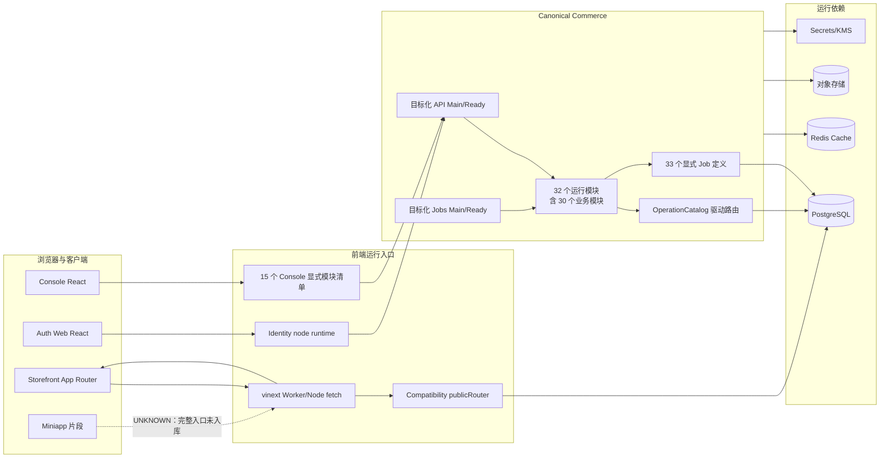
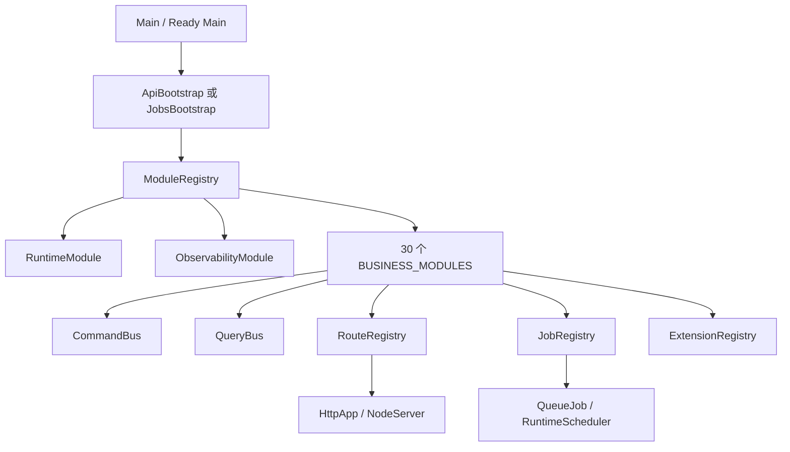
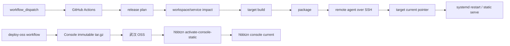
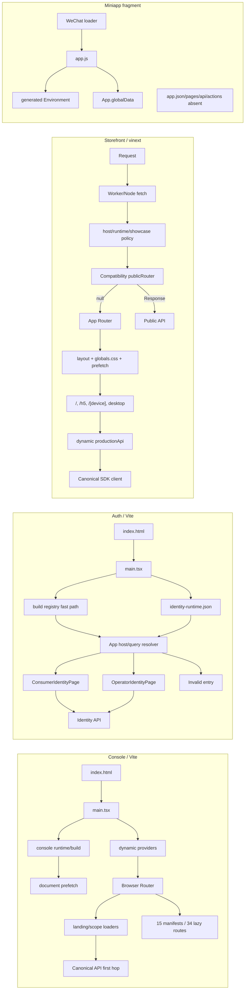

# 全代码库系统审计｜01 真实架构初版

## 1. 本版边界

本文件截至 AU-002 已完成“仓库入口与自动发现机制”以及四个客户端页面/运行入口总图。它不是业务模块深审结论，不证明所有运行单元都健康，也不产生任何删除授权。

- 固定基线：`5a1ce71eebbefaa826368a9e1dc17730f9363bc4`
- 证据明细：`records/AU-001-repository-entry-discovery/evidence.csv`
- 页面入口证据：`records/AU-002-frontend-runtime-entry-map/evidence.csv`、`routes.csv`、`styles-and-assets.csv`
- 微观记录：`records/AU-001-repository-entry-discovery/{files,exports,functions}.csv`；`records/AU-002-frontend-runtime-entry-map/{files,exports,functions}.csv`
- 状态：架构阶段前 2 个审计单元已完成；后续服务进程、数据、通信和故障传播 AU 会增量修正本图。

## 2. 核心结论

1. [FACT][E-AU-001-002][E-AU-001-003] 根仓库是 npm workspaces 单体仓库，7 组路径模式解析出 43 个实际 workspace；miniapp 不在 workspace 图中。
2. [FACT][E-AU-001-007][E-AU-001-011][E-AU-001-012][E-AU-001-013] 生产应用主干不是“扫描目录即自动上线”：Console 模块、Commerce 模块、HTTP 路由和 Jobs 均有显式注册表或冻结闸门。
3. [FACT][E-AU-001-014][E-AU-001-015] Commerce 存在两套不同目的的入口发现：本地/全量构建扫描全部 `*Main.ts`，正式服务构建只接受 10 个显式 target 映射。
4. [FACT][E-AU-001-016] 发布影响分析同时使用 workspace 反向依赖图和 esbuild 服务入口图；无法收窄时倾向选择可达运行目标上界。
5. [FACT][E-AU-001-009] Storefront 的 Worker/Node fetch 入口先调用 Compatibility Commerce API 的 public router，再回落到 vinext App Router。因此 Compatibility API 不是一个可仅凭“无独立发布 target”判定无用的孤立服务。
6. [FACT][E-AU-002-003][E-AU-002-004][E-AU-002-008][E-AU-002-013] 四个客户端不是同一种运行形态：Console 是 Browser Router；Auth 是 host/query 分流；Storefront 是 App Router + Worker 双入口；Miniapp 只有 App 初始化片段。
7. [CONFLICT][E-AU-002-010][E-AU-002-018][E-AU-002-020] Auth 和 Miniapp 的机器声明均不能同时解释当前运行入口：Auth 批准组件/锁哈希漂移，Miniapp 的 candidate/tests/navigation/runtimegraph/delivery matrix 对“完整客户端”使用互相冲突的判据。
8. [CONFLICT][E-AU-001-017][E-AU-001-020][E-AU-001-021] Console 的发布 target、仓库 Caddy 路径和线上实际 Caddy 路径不是同一指针体系；观察时 `console.fufu.wang/` 返回 404。该项为 F-0001（P1 候选），尚待独立复核。
9. [CONFLICT][E-AU-001-018][E-AU-001-019][E-AU-001-022] 仓库声明的生产 unit/target 不能完整重建观察时线上运行单元：至少两个活跃 unit 没有基线内同名 unit 文件。

## 3. 总体运行架构

[FACT][E-AU-001-007][E-AU-001-008] Console 的 15 个 manifest 由 `ConsoleModuleRegistry.ts` 静态导入，经 `ConsoleModuleRoutes.tsx` 转换为 React Router route object；hidden 不生成路由，disabled 生成禁用页，redirect 生成 Navigate，其余 route 延迟加载。

[FACT][E-AU-001-011][E-AU-001-012][E-AU-001-013] Canonical Commerce 的 `ModuleRegistry` 先按依赖拓扑排序，再执行模块注册；`RouteRegistry` 和 `JobRegistry` 在 bootstrap 末尾冻结。详细业务调用、数据库对象所有权和权限执行身份尚未在 AU-001 深审。

## 4. 代码发现与注册机制

| 发现面 | 当前机制 | 自动程度 | 失败方式 | 审计判断 |
| --- | --- | --- | --- | --- |
| npm workspace | 根 `package.json` 的 7 个单星号目录模式；lockfile 当前解析 43 个包 | 目录发现 | 缺 package.json 会被 workspace resolver 跳过 | [FACT][E-AU-001-002][E-AU-001-003] |
| 包导出 | 各 workspace `exports`；release resolver 只解析精确 subpath | 显式契约 | 未解析导出交回 esbuild/Node | [FACT][E-AU-001-006]；通配导出兼容性待专项验证 |
| Console 模块 | 15 个 manifest 静态 import 后组成固定数组 | 显式注册 | 重复 ID、路径或 entry 数异常时模块加载报错 | [FACT][E-AU-001-007] |
| Console 页面 | manifest 中的 lazy loader，经 route materializer 生成 route object | 配置驱动动态导入 | hidden 不挂载；disabled 挂载禁用页 | [FACT][E-AU-001-008] |
| Storefront 页面 | `app/**/page.tsx` 与 `layout.tsx` 的 App Router 文件发现 | 框架发现 | 构建期/运行时由 vinext 处理 | [FACT][E-AU-001-009] |
| Storefront API | Worker 直接静态导入 `routePublicRequest` | 显式源码依赖 | 未命中 API 时回落页面 handler | [FACT][E-AU-001-009] |
| Commerce 模块 | `BUSINESS_MODULES` 30 项，加 Runtime、Observability | 显式注册 | 重复业务模块数闸门或依赖拓扑错误 | [FACT][E-AU-001-011] |
| HTTP 路由 | 模块向 `RouteRegistry` 注册 Operation ID；method/path 来自 OperationCatalog | 契约驱动显式注册 | 重复路由、缺 operation、未冻结均报错 | [FACT][E-AU-001-012] |
| Jobs | `app/jobs.ts` 33 项显式 catalog，统一注册为队列处理器 | 显式注册 | 重复/非法并发、lease、batch、deadline 报错 | [FACT][E-AU-001-013] |
| 本地 Commerce build | 扫描 `src/entry/*Main.ts`，并追加 9 个工具入口 | 文件名发现 | 新 Main 文件自动进入全量 bundle | [FACT][E-AU-001-014] |
| 正式服务 build | `service-targets.mjs` 固定 10 target → 19 个 Main/Ready 名称 | 显式白名单 | 未知 target 直接报错 | [FACT][E-AU-001-015] |
| 发布影响 | workspace 反向依赖 + service esbuild metafile | 图分析 | 无法收窄时选择上界 | [FACT][E-AU-001-016] |
| systemd | release manifest 指向模板或具体 unit | 显式发布配置 | 线上可存在仓库外 unit | [CONFLICT][E-AU-001-018][E-AU-001-019][E-AU-001-022] |
| Cloudflare | 3 个 wrangler 配置，其中 h5/mini 指向 Storefront 构建结果 | 配置驱动 | 仓库内未发现 deploy/publish 调用者 | [UNKNOWN][E-AU-001-010] 外部部署责任未知 |

## 5. 前端边界

### 5.1 Console

- [FACT][E-AU-001-007] 模块 ID、route ID、route path 和每模块唯一 entry 在注册时校验。
- [FACT][E-AU-001-008] 路由呈现信息可以按 scope kind 覆盖；缺少指定覆盖时回落 enterprise，再回落通用标题和摘要。
- [UNKNOWN] 15 个页面模块的真实 API 调用、权限、缓存隔离和样式加载不属于本 AU；后续逐模块审阅。

### 5.2 Auth Web

- [FACT][E-AU-001-023] HTML 进入 `src/main.tsx`；入口先装载 identity node runtime，再渲染 `App`。
- [FACT][E-AU-001-023] `App` 依据 host/query 选择 operator 或 consumer 身份界面；基线未发现 Browser Router 注册。
- [UNKNOWN] 登录、ticket exchange、Cookie、刷新、退出和权限链尚未审阅。

### 5.3 Storefront 与 Compatibility API

- [FACT][E-AU-001-009] 路由文件为 `/`、`/h5`、`/[device]`、`/desktop-1920`、`/desktop-1920/frame`、`/desktop-1920/inspect`。
- [FACT][E-AU-001-009] 同一 fetch handler 同时支持 Cloudflare 注入 env 与 Node `process.env`；先执行 labs/showcase/runtime 配置分支，再尝试 Compatibility public API，最后进入 vinext 页面。
- [INFERENCE][E-AU-001-009][E-AU-001-017] Compatibility API 的 public router 被编入 Storefront 制品；它没有独立 target 不代表没有生产职责。
- [UNKNOWN][E-AU-001-010] h5、mini Cloudflare 配置由谁部署、当前是否在线、与阿里云 Storefront 的发布所有权如何划分，仓库内证据不足。

### 5.4 Miniapp

- [FACT][E-AU-001-024] 基线只含 `app.js`、生成配置、领域文件、WXSS 和品牌资源，没有 `app.json`、页面目录或开发者工具项目配置。
- [UNKNOWN] 这些文件可能是生成目标、外部工程输入或未完成客户端；不得标为垃圾代码。

## 6. Canonical Commerce 边界

- [FACT][E-AU-001-011] `ModuleRegistry` 拒绝重复 ID、缺失依赖和循环依赖，且按拓扑顺序串行 await 每个模块的 `register`。
- [FACT][E-AU-001-012] `RouteRegistry` 从 OperationCatalog 取得 method/path；如果 bootstrap 指定 allow-list，未在 allow-list 的 operation 会被忽略，freeze 时检查 allow-list 是否全部注册。
- [FACT][E-AU-001-013] `JobRegistry` 只保存通过最小 lease、batch、concurrency、deadline 校验的任务，冻结前不能被 runner 消费。
- [UNKNOWN] 模块注册过程中的数据库连接、顶层副作用、跨模块数据读取和失败清理尚未逐模块检查。

## 7. 构建与发布边界

- [FACT][E-AU-001-018] 三个工作流当前都只声明手工触发。`deploy.yml` 是独立 direct production 链，不以 `quality.yml` 为先决条件；这是仓库当前明确治理决定，AU-001 不按个人偏好定为缺陷。
- [FACT][E-AU-001-017] release manifest 有 15 个 target、2 个逻辑 node；hbbtzn 的多项服务通过 `hostedBy` 指向 zhudatuan-l0。
- [FACT][E-AU-001-018] `deploy-oss.yml` 是 hbbtzn Console 的独立不可变 tarball 通道；激活脚本切换 `/opt/sfl/nodes/hbbtzn-l1/targets/console/current`。
- [CONFLICT][E-AU-001-020][E-AU-001-021] fufu Console 的 release pointer 与实际 Caddy 静态根分裂，详见 F-0001。

## 8. 架构中的事实源

| 事实面 | 当前权威用途 | 已见漂移 |
| --- | --- | --- |
| 根 package/lock | workspace、正式命令、依赖图 | Playwright 与 ESLint 仍使用不存在的旧路径/包名 |
| Console/Commerce 注册表 | 代码可达模块、route、job | 本 AU 未见注册表内部漂移 |
| release manifest | target、节点、构建与公开验收 | fufu Console pointer 与实际 Caddy 不一致 |
| remote policy | 远端允许 unit、pointer 和检查 | 不能覆盖仓库外活跃 unit |
| systemd 文件 | 可安装 unit 模板和命令 | 线上至少两个活跃 unit 无同名受控文件 |
| Caddy/Cloudflare 配置 | host 到静态/服务入口的路由 | 仓库 Caddy、线上 Caddy、release pointer 三方不一致 |
| 文档 | 设计线索和历史解释 | 多处域名、主线和发布描述滞后，不能作运行事实 |

## 9. 当前边界评价

### 9.1 值得保留的设计

- [FACT][E-AU-001-007][E-AU-001-011][E-AU-001-012] Console 与 Canonical Commerce 都采用显式目录外注册，并在启动阶段检查重复、缺失或循环；这比仅依赖文件名发现更易复核。
- [FACT][E-AU-001-015] 正式 Commerce 服务构建有目标白名单，不会因新增任意 `Main.ts` 自动扩大生产发布面。
- [FACT][E-AU-001-016] 影响分析无法证明最小集合时选择上界，降低漏发布风险。

### 9.2 主要架构风险

- [CONFLICT][E-AU-001-017][E-AU-001-020] 发布、静态路由和运行 current 指针存在多重事实源；当前已出现可观察 404。
- [CONFLICT][E-AU-001-004][E-AU-001-005][E-AU-001-025] 测试/静态质量入口没有随 workspace 重命名保持一致，导致正式命令的覆盖范围与代码树不同。
- [UNKNOWN][E-AU-001-010] Cloudflare 的部署所有权在仓库内不可追踪，无法仅从当前仓库证明哪些边缘 Worker 正在运行。

## 10. 已知未知项

1. Cloudflare h5/mini Worker 的实际部署触发、版本和所有者。
2. fufu Console 路径分裂从何时开始、是否存在替代访问路径、影响用户范围。
3. 两个仓库外活跃 unit 的创建来源、发布责任和恢复方式。
4. 43 个 workspace 的完整外部消费者与所有包导出的动态使用。
5. Commerce 30 个业务模块的数据所有权和跨模块写入方向。
6. 33 个 Job 的生产者、消费者、重试、死信和恢复闭环。
7. miniapp 文件由哪个完整客户端工程消费。

这些未知项会进入后续独立 AU；任何一项都不能被转换成 G3 删除结论。

## 11. AU-002 增量：四客户端真实入口架构

### 11.1 总图

### 11.2 Console 边界

- [FACT][E-AU-002-003] `main.tsx` 在动态加载 React providers 前完成 runtime config 接纳并启动首文档预取；root 缺失同步失败，runtime/provider 失败显示可见错误页，已识别的旧 chunk 失败可触发一次 reload。
- [FACT][E-AU-002-004] Browser Router 的稳定父路径是 `/scopes/:scopeKind/:scopeId`。15 个 enabled manifest 共有 34 条 module route，再加 profile 与 scope/global wildcard。路由所有权来自显式 manifest，不来自目录扫描。
- [FACT][E-AU-002-005][E-AU-002-006] landing/scope loaders 是页面和 API 之间的第一层边界：document prefetch 最多交接 1.5 秒，畸形/超时回退 SDK；scope 必须属于当前 session；profile 403 可降级但 401 不能被 profile fallback 掩盖。
- [FACT][E-AU-002-007] 70 个 CSS 的生产根为 main 的四个 design sheets + `style.css`；后者继续收集 shell/feature/responsive/legacy/VI。6 个 CSS 没有文件名消费者，但均保留为未分级证据，不能据此删除。

### 11.3 Auth 边界

- [FACT][E-AU-002-008] build registry 已知道当前 host 时，App 在 runtime fetch settle 前渲染；同源 runtime 若存在，会校验 envelope、registry 和 accounts host。404/非 JSON 可以回退 build registry，其它错误显示运行配置错误页。
- [FACT][E-AU-002-009] Auth 没有 Browser Router；URL 状态由 `hostname + application/target/client/admin_origin/surface` 解析。consumer 必须精确匹配当前 node；只有 `operating_mall` node 可进入 operator 默认路径。
- [CONFLICT][E-AU-002-010] `owner-approved-ui.json` 和 `SOURCE-MANIFEST.md` 仍指向 LoginPage，但当前 App 不加载它；正式哈希门禁也失败。此冲突是 F-0005，不是 LoginPage 删除依据。
- [CONFLICT][E-AU-002-011][E-AU-002-012] Auth API 第一跳存在 9 个成功响应校验被丢弃的点，详见 F-0007；后端 handler、Cookie 和 ticket 生命周期留给身份专项。

### 11.4 Storefront 边界

- [FACT][E-AU-002-013][E-AU-002-014] Vite 把 `worker/index.ts` 作为 Cloudflare main，vinext 同时支持 `start` 的 Node 模式。每个请求先过 labs/runtime/showcase 分支，再进入 Compatibility public router；未命中才交给 App Router。
- [FACT][E-AU-002-015] `/` 与 `/h5` 的 layout 在浏览器 head 预发 `/api/v1/catalog/public/products?limit=100`，客户端 publicCatalogApi 可复用 Response。认证能力通过 `loadProductionApi()` 动态导入，再由节点绑定的 SDK client 发往 consumer/canonical API。
- [FACT][E-AU-002-016] `[device]` 接住任意单段参数；五个前缀映射到 desktop/mobile/tablet lazy frame。未知参数仅证明组件显示“不存在”文本，HTTP 404/200 未验证。
- [FACT][E-AU-002-017] App Router 实际样式根是 `app/globals.css`；`src/index.css` 无当前消费者。图外状态不产生删除结论。

### 11.5 Miniapp 边界

- [FACT][E-AU-002-018] `app.js` 的唯一行为是把 `wx.getExtConfigSync()` 交给生成 Environment，并写入 `App.globalData.environment`；其余 8 文件由四条生成链产生。
- [CONFLICT][E-AU-002-019][E-AU-002-020] 当前仓库不能提供 app manifest、页面、API client 或 action dispatcher；但 candidate、tests 和 delivery matrix 仍把它列为当前/required 客户端。该项为 F-0006。
- [UNKNOWN] 外部完整小程序工程、微信平台当前版本和该 9 文件目录的真实交付消费者均未验证。

### 11.6 当前最主要通信瓶颈

1. Auth 的 UI approval、运行 import 图和节点 runtime 是三套不同事实面，当前没有一个命令同时验证“批准组件已真实挂载且使用正确节点”。
2. Storefront 同一 fetch 入口横跨边缘策略、Compatibility public API、App Router 和 Canonical SDK；故障在 publicRouter 的 Response/null/reject 与页面 handler 之间传播，后续必须按完整请求链审计。
3. Console 首屏并行 document prefetch 与 Router SDK loader 有刻意 handoff；正确性依赖同一 session/scope parser 和 Abort 清理，不能把重复请求简单认定为冗余。
4. Miniapp 没有统一“完整交付单元”定义，不同门禁会对同一片段分别给出通过、ENOENT、缺兼容边或 implemented。

## 12. AU-003 增量：Canonical 进程架构

### 12.1 构建、发布与运行总图

~~~mermaid
flowchart LR
  Diff[HEAD^..HEAD 变更] --> Planner[affected-target planner]
  Planner --> Migration[database-migration]
  Migration --> Services[10 个 service targets]
  Services --> Artifacts[19 个 Main / Ready 制品]
  Artifacts --> Units[systemd units]

  subgraph API[7 个 API 进程]
    Env[环境与节点 manifest] --> Runtime[target runtime factory]
    Runtime --> Bootstrap[bootstrapApi]
    Bootstrap --> Registry[selected modules + operation allow-list]
    Registry --> Http[HttpApp + loopback NodeServer]
  end

  subgraph Jobs[3 个正式 Jobs 进程]
    JReady[ExecStartPre runtime preflight] --> JMain[Jobs Main]
    JMain --> Queue[QueueJob / JobRunner]
    Queue --> Pg[(runtime.job / deadletter)]
  end

  Units --> API
  Units --> Jobs
~~~

- [FACT][E-AU-003-003][E-AU-003-004] Commerce 全量构建会按文件名发现 28 个 Main 文件，并显式追加 9 个 seed/local-infra 入口；正式发布由另一套白名单收敛为 10 个 service target 和 19 个 Main/Ready 制品。新增 Main 不会自动成为生产单元。
- [FACT][E-AU-003-005][E-AU-003-006] 七个 API 都经过显式 selected module/operation allow-list、注册表 freeze 和 loopback NodeServer。聚合 ApiMain 不属于当前正式 target。
- [FACT][E-AU-003-008][E-AU-003-009] 正式 Jobs 被拆成 Identity Notification、Catalog、Payment 三类；聚合 Full Jobs 的 33 个任务、OutboxRelay 和 RuntimeScheduler 当前没有正式 target。

### 12.2 Ready 是四种不同契约

| 模型 | 运行单元 | 真正验证的对象 | 边界 |
| --- | --- | --- | --- |
| 自身 HTTP health | Identity、Mall、Purchase、Web | 已启动进程的端口、health route、runtime compatibility | 不验证所有业务 operation |
| systemd curl | Support | 已启动 Support 的 /health/ready | 只要求 HTTP 成功 |
| 负向业务探针 | Payment Webhook | 唯一 webhook route，且缺签名在 DB 前被拒绝 | 不验证合法支付回调 |
| 独立 runtime preflight | Catalog API 与三个 Jobs | 新 runtime 能读取 manifest/secret/DB/依赖并关闭 | Jobs 使用在 Main 前合理；Catalog API 不证明 serving path，见 F-0014 |

[FACT][E-AU-003-016] 生产时点日志证明 Jobs ExecStartPre 的确会在依赖未就绪时阻止 Main，并由 systemd 重试；这不是固定基线全日可用性证明。

### 12.3 Jobs 与迁移边界

- [FACT][E-AU-003-010] JobRunner 的数据边界是 PostgreSQL runtime.job：SKIP LOCKED/租约 claim、heartbeat、条件完成、事务性 retry/deadletter。processor 自身幂等尚未审。
- [CONFLICT][E-AU-003-011] 三个轮询 helper 在正常 timeout 后保留 shared AbortSignal listener，见 F-0012。
- [FACT][E-AU-003-012][E-AU-003-014] 当前正式迁移是 release 期间一次性 executor，不是 systemd 常驻单元；它验证 source、身份、冻结历史、advisory lock、目标 schema，并明确采用 forward-only。
- [CONFLICT][E-AU-003-013] 现代 SQL 自己提交后，ledger 在下一条语句登记，形成提交/登记非原子窗口，见 F-0013。

### 12.4 当前最主要通信瓶颈

1. 发布影响图不是运行 import 图的自动完备投影；CreateMall 已出现真实消费者与零 target 规则冲突（F-0011）。
2. Ready 名称没有统一测量语义：同名文件分别验证 HTTP serving、依赖构造或负向业务路径，运维不能只按名称推断覆盖。
3. Jobs 的消息边界实质是共享数据库队列，不是独立 broker；生产者、consumer、lease、deadletter 和业务事务必须按每个 job 成对复核。
4. 迁移与应用 pointer 是两个不同回滚域；数据库一旦 applied，后续应用失败只回 pointer，兼容性责任由 migration 设计承担。

完整逐进程、Ready、Jobs 和迁移表见 records/AU-003-canonical-process-entry-map。
