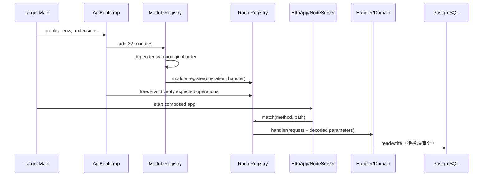
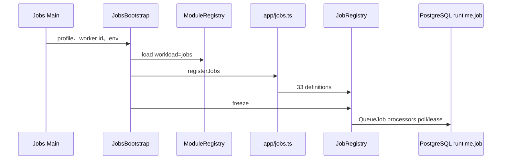

# 全代码库系统审计｜02 运行关系图初版

## 1. 适用范围

本图固定在基线 `5a1ce71eebbefaa826368a9e1dc17730f9363bc4`，并附 2026-09-13 16:20:39+08:00 的一次生产只读观察。代码声明与实时观察分别记录；实时状态不反向修改固定基线。

## 2. 页面入口

| 表面 | 构建/启动入口 | 路由发现 | 进入 API 的方式 | 发布单元 | 结论 |
| --- | --- | --- | --- | --- | --- |
| Console | `index.html` → `src/main.tsx` → providers → ConsoleApp | ConsoleRouter + 15 个显式 manifest | 页面模块经 SDK/HTTP；详细调用待模块审计 | `console` 静态制品 | [FACT][E-AU-001-007][E-AU-001-023] |
| Auth Web | `index.html` → `src/main.tsx` → App | host/query 选择 consumer/operator；无 Browser Router 证据 | Identity API；链路待 AU-身份专项 | `auth-web` 静态制品 | [FACT][E-AU-001-023] |
| Storefront | `vinext start` 或 Worker fetch | App Router 文件发现 | fetch 先进入 Compatibility `routePublicRequest`，未命中再进入页面 | `storefront` Node 制品；另有 h5/mini wrangler 声明 | [FACT][E-AU-001-009][E-AU-001-010] |
| Miniapp | 基线仅有 `miniprogram/app.js` 与生成资源 | [UNKNOWN] 无完整页面/项目清单 | [UNKNOWN] | [UNKNOWN] | [FACT][E-AU-001-024] 不能据此判废弃 |

### 2.1 Console 路由骨架

静态根路由由 `ConsoleRouter.tsx` 构建；作用域主路径为 `/scopes/:scopeKind/:scopeId`。子路由来自 15 个模块 manifest：

`cockpit`、`control`、`applications`、`products`、`supply-chain`、`orders`、`referral`、`channels`、`vouchers`、`finance`、`storefront-members`、`settings/members`、`settings/qualification`、`reports`、`support/:caseId?`。

[FACT][E-AU-001-007][E-AU-001-008] 这份列表来自静态 import 与每个 manifest 的 entry route，不来自文件名猜测。

### 2.2 Storefront fetch 分支

| 顺序 | 条件 | 可观察结果 |
| ---: | --- | --- |
| 1 | labs API path 被 host policy 阻止 | 404、no-store |
| 2 | APP_ENV/AUTH_MODE 与 host 不相容 | 503、no-store |
| 3 | showcase path 不允许该 host | 404、no-store |
| 4 | Compatibility public router 命中 | 返回 API Response |
| 5 | 未命中 API | 交给 vinext App Router |

[FACT][E-AU-001-009] `cf-ray` 被优先用作 request id，否则生成 UUID。该函数没有自身超时或重试；下游行为待 Compatibility 与 Storefront 专项审计。

## 3. Canonical 服务入口

### 3.1 正式 release target

| target | 主入口 | Ready 入口 | 类型 | 当前 node 关系 |
| --- | --- | --- | --- | --- |
| identity-api | IdentityRegistrationApiMain | IdentityRegistrationApiReadyMain | API | zhudatuan-l0 与 hbbtzn-l1 各自运行 |
| identity-notification-jobs | IdentityNotificationJobsOnlyMain | IdentityNotificationJobsReadyMain | Jobs | zhudatuan-l0 与 hbbtzn-l1 各自运行 |
| mall-provisioning-api | MallProvisioningApiMain | MallProvisioningApiReadyMain | API | hbbtzn target 由 zhudatuan-l0 承载/或不重启，需发布专项细化 |
| support-api | ConsoleSupportMain | 无独立 Ready bundle | API | hbbtzn 配置 hostedBy zhudatuan-l0 |
| purchase-api | PurchaseApiMain | PurchaseApiReadyMain | API | hbbtzn hostedBy zhudatuan-l0 |
| web-api | WebBusinessApiMain | WebBusinessApiReadyMain | API | hbbtzn hostedBy zhudatuan-l0 |
| catalog-api | CatalogOperatorApiMain | CatalogOperatorApiReadyMain | API | hbbtzn hostedBy zhudatuan-l0 |
| catalog-jobs | CatalogJobsMain | CatalogJobsReadyMain | Jobs | hbbtzn hostedBy zhudatuan-l0 |
| payment-webhook-api | PaymentWebhookApiMain | PaymentWebhookApiReadyMain | API | hbbtzn hostedBy zhudatuan-l0 |
| payment-jobs | PaymentJobsOnlyMain | PaymentJobsReadyMain | Jobs | hbbtzn hostedBy zhudatuan-l0 |

[FACT][E-AU-001-015][E-AU-001-017] 表中入口来自 `service-targets.mjs` 与 release manifest 的交叉核对。

### 3.2 保留但非当前目标白名单的入口

[FACT][E-AU-001-014] 全量构建还发现 `ApiMain`、`JobsMain`、`FullJobsMain`、`MigrationMain`、`RegistrationMigrationMain`、`SmokeMain`、`PaymentJobsMain`、`IdentityNotificationJobsMain` 等聚合、迁移或兼容入口，并追加 Owner/Registration bootstrap、Internal Runtime、Local KMS/Objects/Secrets 和 Postgres TLS Proxy。

[UNKNOWN] 每个非白名单入口是否仍由本地开发、staging、systemd、恢复流程或外部脚本使用，要逐一复核；本 AU 不把它们列入垃圾候选。

## 4. 注册与调用链

### 4.1 API



### 4.2 Jobs



[FACT][E-AU-001-013] 当前 33 个 Job 定义有 owner、queue、concurrency、timeout、retry、lease、idempotency、dead-letter 和 runbook 字段。生产者/消费者配对、事务提交点和恢复语义尚未验证。

## 5. 构建到运行的制品链

| 层 | 输入 | 选择机制 | 输出/下一跳 |
| --- | --- | --- | --- |
| GitHub | 手工 workflow input + 精确 SHA | workflow_dispatch | checkout 固定提交 |
| Plan | git changes + release manifest | workspace/service impact resolver | target 集合与 plan |
| Build | target + source | 前端 workspace build；服务 target 白名单 | dist 或 Main/Ready bundle |
| Package | build result | target package spec | 不可变 package |
| Deploy | package + node | SSH remote agent/direct | release dir + current pointer |
| Activate | pointer 与 restart policy | static none 或 systemd | 新运行单元/静态根 |
| Accept | manifest checks | candidate/health/public acceptance | success、失败或回滚 |

[FACT][E-AU-001-017][E-AU-001-018] Console 另有 `deploy-oss.yml`：Console build → tar.gz + manifest → 武汉 OSS → ECS 激活脚本 → hbbtzn Console pointer。这条通道与通用 release engine 并列。

## 6. 线上只读快照

观察目标通过 ECS IMDS 核对为授权实例 `i-2zeewhay0farxq8lucrd`。本次只执行状态、文件存在性、符号链接和 HTTP 读取，没有启动、停止、重启、写文件或改变指针。

### 6.1 运行服务族

[FACT][E-AU-001-019] 观察时活跃服务包括：

- zhudatuan-l0：Storefront、Identity API、Identity Notification Jobs、Mall Provisioning、Catalog API/Jobs/Object Store、Purchase、Web API、Payment Webhook/Jobs、Secret Store。
- hbbtzn-l1：API Gateway、Cloudflared、Storefront、Identity API、Identity Notification Jobs、Catalog Object Store。
- fufu-l1a/l1b/l1c：API Gateway、Cloudflared、Catalog Object Store。
- 共享/辅助：Console Support、Console Preview、Finance Preview、Internal Runtime、autonode parent runtime。

[CONFLICT][E-AU-001-022] `sfl-autonode-c1-parent-runtime.service` 与 `zhudatuan-finance-preview.service` 在观察时运行，但基线没有同名 unit 文件。它们是否应入库、是否刻意主机本地化尚未确认。

### 6.2 fufu Console 路径

```mermaid
flowchart LR
  Request[console.fufu.wang /] --> Caddy[线上 /etc/caddy/Caddyfile]
  Caddy --> RuntimeCurrent[/opt/sfl/nodes/zhudatuan-l0/current/.../console/dist]
  RuntimeCurrent --> Missing[index.html absent]
  Missing --> R404[HTTP 404]

  Release[release manifest console target] --> ReleaseCurrent[/opt/zhudatuan/targets/console/current/static]
  ReleaseCurrent --> Present[index.html present]
  ReleaseCurrent -. 当前 Caddy 未指向 .-> Caddy
```

- [FACT][E-AU-001-020] 线上 Caddy 静态根使用 runtime recovery current 下的旧式源树路径；该路径没有 Console `index.html`。
- [FACT][E-AU-001-020] release target current 下存在 Console `static/index.html`。
- [FACT][E-AU-001-021] 通过直连 ECS IP 并使用正确 SNI 请求 `/`，响应为 `HTTP/1.1 404 Not Found`。
- [CONFLICT][E-AU-001-017][E-AU-001-020] release manifest 要求 `https://console.fufu.wang/` 只接受 200，却把新制品写到另一 pointer root。
- [INFERENCE] 当前最小证据说明公开入口与已发布制品脱节；开始时间、替代入口、受影响用户和最近一次发布结果仍是 UNKNOWN。

## 7. 同步、异步和共享边界初表

| 编号 | 上游 | 下游 | 方式 | 契约/发现 | 失败传播 | 状态 |
| --- | --- | --- | --- | --- | --- | --- |
| COM-0001 | Console | Canonical API targets | HTTP | OperationCatalog/SDK，待逐页确认 | HTTP 状态与前端错误态待审 | 初始 |
| COM-0002 | Auth Web | Identity API | HTTP | identity runtime + contract，待身份 AU | ticket/session 传播待审 | 初始 |
| COM-0003 | Storefront Worker | Compatibility publicRouter | 同进程函数调用 | `routePublicRequest` 静态 import | Promise reject/Response 直接传播 | [FACT] |
| COM-0004 | Storefront Worker | vinext handler | 同进程 fetch | App Router | Response/exception 传播待框架审 | [FACT] |
| COM-0005 | Commerce modules | RouteRegistry | 同进程注册 | Operation ID | freeze 时缺失即启动失败 | [FACT] |
| COM-0006 | RuntimeEventPublisher/业务模块 | PostgreSQL queue | 数据库异步 | runtime.job/event schema | 租约/重试/dead letter 待专项 | 初始 |
| COM-0007 | GitHub Actions | ECS remote agent | SSH + package stream | release manifest/policy | deploy envelope/回滚待专项 | 初始 |
| COM-0008 | Cloudflare tunnel | node API gateway | Tunnel/HTTP | node runtime config | 超时和回源策略待专项 | 初始 |
| COM-0009 | 多个 Canonical target | PostgreSQL | 共享数据库 | schema/table ownership 待审 | 事务与锁传播待数据 AU | UNKNOWN |

## 8. 环境变量与启动依赖状态

| 运行单元 | 已确认来源 | 仍需确认 |
| --- | --- | --- |
| Storefront | Cloudflare env 或 Node `process.env`；systemd 提供端口/环境文件 | 完整键、默认值、秘密来源、热更新 |
| Canonical APIs/Jobs | systemd EnvironmentFile/显式 profile + release package | 每 target 全量变量、必填校验、Secret/KMS 依赖 |
| Console/Auth 静态应用 | 构建环境 + runtime config | 当前每域 runtime config 与缓存策略 |
| API Gateway/Cloudflared | node runtime Caddyfile/cloudflared.yml | 外部 tunnel 配置版本与所有权 |
| Release engine | workflow inputs、GitHub secrets、release manifest | secret 最小权限与轮换不属 AU-001 |

本表明确保留 UNKNOWN；没有把文件名或环境变量示例当作线上事实。

## 9. 后续运行图审计入口

1. AU-002：Console、Auth、Storefront、Miniapp 页面与运行入口全图。
2. AU-003：Canonical API/Jobs/Ready/Migration 进程入口全图。
3. AU-004：release target、systemd、Cloudflared、Caddy、静态制品和节点部署全图，并独立复核 F-0001。
4. AU-005：PostgreSQL、Redis、对象存储、Secrets/KMS、队列。
5. AU-006：同步/异步/共享数据库通信矩阵。

在这些单元完成前，本文件是可续接初版，不是“运行架构已 100% 验证”的声明。
