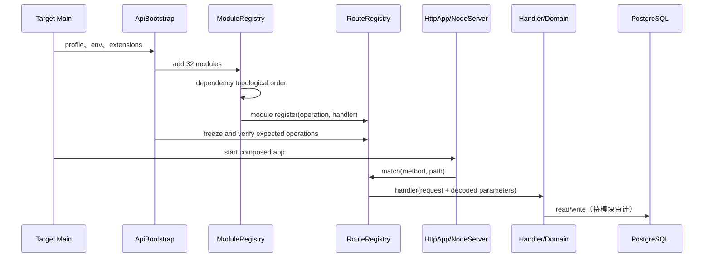
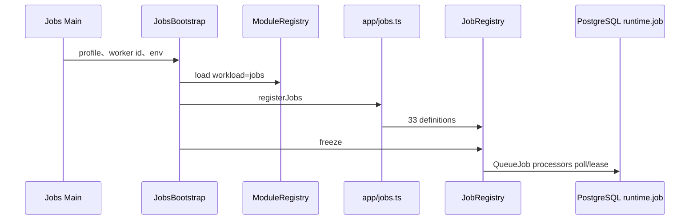
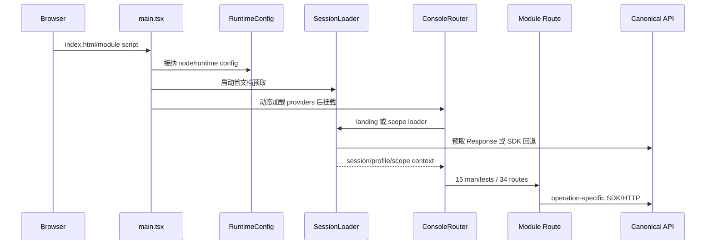
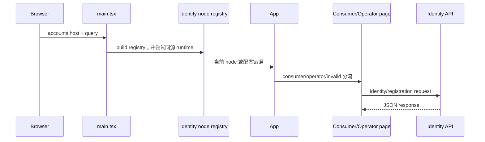
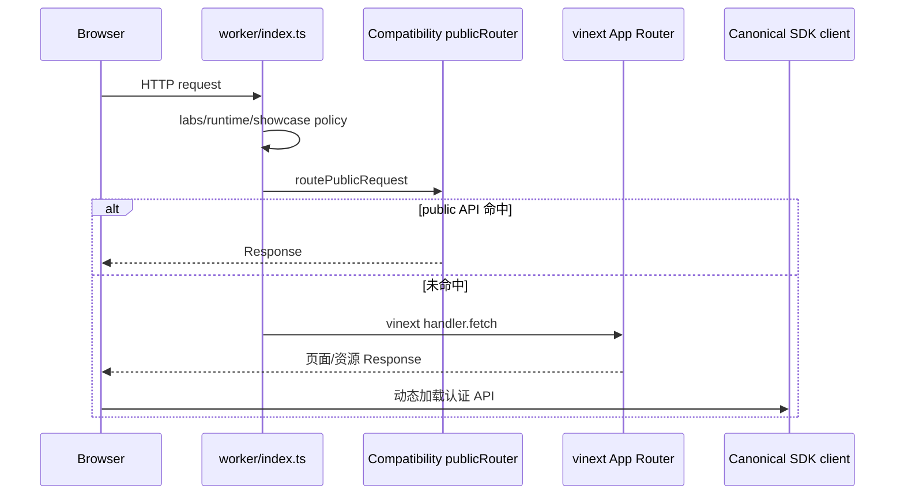
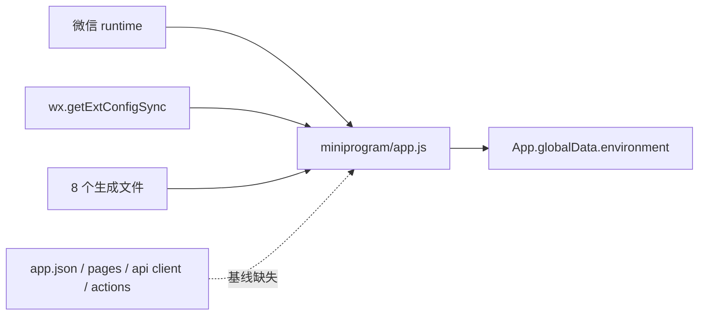

# 全代码库系统审计｜02 运行关系图

## 1. 适用范围

本图固定在基线 `5a1ce71eebbefaa826368a9e1dc17730f9363bc4`，并附 2026-09-13 16:20:39+08:00 的一次生产只读观察。代码声明与实时观察分别记录；实时状态不反向修改固定基线。

## 2. 页面入口

| 表面 | 构建/启动入口 | 路由发现 | 进入 API 的方式 | 发布单元 | 结论 |
| --- | --- | --- | --- | --- | --- |
| Console | `index.html` → `main.tsx` → runtime 接纳/首文档预取 → providers → ConsoleRouter | `/`、`/scopes/:scopeKind/:scopeId`；15 个显式 manifest、34 条模块 route | landing/scope loader 先走同源预取，失败或超时回退 SDK；逐模块 operation 待后续 AU | `console` 静态制品 | [FACT][E-AU-002-003][E-AU-002-004][E-AU-002-005][E-AU-002-006][E-AU-002-007] |
| Auth Web | `index.html` → `main.tsx` → build/runtime node registry → App | 无 Browser Router；由 hostname 与 application/target/client/admin_origin/surface 分流 consumer/operator/invalid | Canonical Identity/Registration HTTP client；Cookie/ticket 服务端链待身份 AU | `auth-web` 静态制品 | [FACT][E-AU-002-008][E-AU-002-009][E-AU-002-010][E-AU-002-011][E-AU-002-012]；机器批准清单冲突见 F-0005 |
| Storefront | Cloudflare `worker/index.ts` fetch 或 `vinext start` | `/`、`/h5`、`/[device]`、`/desktop-1920[/frame\|/inspect]` | Worker 先尝试 Compatibility public router；页面 public catalog 同源 fetch；认证 API 动态加载 Canonical SDK client | `storefront` Node 制品；另有 h5/mini wrangler 声明 | [FACT][E-AU-002-013][E-AU-002-014][E-AU-002-015][E-AU-002-016][E-AU-002-017] |
| Miniapp | 微信 runtime → `miniprogram/app.js` → 生成 Environment | [CONFLICT] 当前没有 app.json、pages 或项目清单 | [UNKNOWN] 当前没有 API client/action dispatcher；外部工程状态未验证 | [UNKNOWN] candidate 会复制当前片段，但完整发布单元不在基线中 | [FACT][E-AU-002-018][E-AU-002-019][E-AU-002-020]；不能据此判废弃 |

### 2.1 Console 路由骨架

静态根路由由 `ConsoleRouter.tsx` 构建；作用域主路径为 `/scopes/:scopeKind/:scopeId`。子路由来自 15 个模块 manifest：

`cockpit`、`control`、`applications`、`products`、`supply-chain`、`orders`、`referral`、`channels`、`vouchers`、`finance`、`storefront-members`、`settings/members`、`settings/qualification`、`reports`、`support/:caseId?`。

[FACT][E-AU-001-007][E-AU-001-008] 这份列表来自静态 import 与每个 manifest 的 entry route，不来自文件名猜测。

### 2.2 Storefront fetch 分支

| 顺序 | 条件 | 可观察结果 |
| ---: | --- | --- |
| 1 | labs API path 被 host policy 阻止 | 404、no-store |
| 2 | APP_ENV/AUTH_MODE 与 host 不相容 | 503、no-store |
| 3 | showcase path 不允许该 host | 404、no-store |
| 4 | Compatibility public router 命中 | 返回 API Response |
| 5 | 未命中 API | 交给 vinext App Router |

[FACT][E-AU-001-009] `cf-ray` 被优先用作 request id，否则生成 UUID。该函数没有自身超时或重试；下游行为待 Compatibility 与 Storefront 专项审计。

## 3. Canonical 服务入口

### 3.1 正式 release target

| target | 主入口 | Ready 入口 | 类型 | 当前 node 关系 |
| --- | --- | --- | --- | --- |
| identity-api | IdentityRegistrationApiMain | IdentityRegistrationApiReadyMain | API | zhudatuan-l0 与 hbbtzn-l1 各自运行 |
| identity-notification-jobs | IdentityNotificationJobsOnlyMain | IdentityNotificationJobsReadyMain | Jobs | zhudatuan-l0 与 hbbtzn-l1 各自运行 |
| mall-provisioning-api | MallProvisioningApiMain | MallProvisioningApiReadyMain | API | hbbtzn target 由 zhudatuan-l0 承载/或不重启，需发布专项细化 |
| support-api | ConsoleSupportMain | 无独立 Ready bundle | API | hbbtzn 配置 hostedBy zhudatuan-l0 |
| purchase-api | PurchaseApiMain | PurchaseApiReadyMain | API | hbbtzn hostedBy zhudatuan-l0 |
| web-api | WebBusinessApiMain | WebBusinessApiReadyMain | API | hbbtzn hostedBy zhudatuan-l0 |
| catalog-api | CatalogOperatorApiMain | CatalogOperatorApiReadyMain | API | hbbtzn hostedBy zhudatuan-l0 |
| catalog-jobs | CatalogJobsMain | CatalogJobsReadyMain | Jobs | hbbtzn hostedBy zhudatuan-l0 |
| payment-webhook-api | PaymentWebhookApiMain | PaymentWebhookApiReadyMain | API | hbbtzn hostedBy zhudatuan-l0 |
| payment-jobs | PaymentJobsOnlyMain | PaymentJobsReadyMain | Jobs | hbbtzn hostedBy zhudatuan-l0 |

[FACT][E-AU-001-015][E-AU-001-017] 表中入口来自 `service-targets.mjs` 与 release manifest 的交叉核对。

### 3.2 保留但非当前目标白名单的入口

[FACT][E-AU-001-014] 全量构建还发现 `ApiMain`、`JobsMain`、`FullJobsMain`、`MigrationMain`、`RegistrationMigrationMain`、`SmokeMain`、`PaymentJobsMain`、`IdentityNotificationJobsMain` 等聚合、迁移或兼容入口，并追加 Owner/Registration bootstrap、Internal Runtime、Local KMS/Objects/Secrets 和 Postgres TLS Proxy。

[UNKNOWN] 每个非白名单入口是否仍由本地开发、staging、systemd、恢复流程或外部脚本使用，要逐一复核；本 AU 不把它们列入垃圾候选。

## 4. 注册与调用链

### 4.1 API



### 4.2 Jobs



[FACT][E-AU-001-013] 当前 33 个 Job 定义有 owner、queue、concurrency、timeout、retry、lease、idempotency、dead-letter 和 runbook 字段。生产者/消费者配对、事务提交点和恢复语义尚未验证。

## 5. 构建到运行的制品链

| 层 | 输入 | 选择机制 | 输出/下一跳 |
| --- | --- | --- | --- |
| GitHub | 手工 workflow input + 精确 SHA | workflow_dispatch | checkout 固定提交 |
| Plan | git changes + release manifest | workspace/service impact resolver | target 集合与 plan |
| Build | target + source | 前端 workspace build；服务 target 白名单 | dist 或 Main/Ready bundle |
| Package | build result | target package spec | 不可变 package |
| Deploy | package + node | SSH remote agent/direct | release dir + current pointer |
| Activate | pointer 与 restart policy | static none 或 systemd | 新运行单元/静态根 |
| Accept | manifest checks | candidate/health/public acceptance | success、失败或回滚 |

[FACT][E-AU-001-017][E-AU-001-018] Console 另有 `deploy-oss.yml`：Console build → tar.gz + manifest → 武汉 OSS → ECS 激活脚本 → hbbtzn Console pointer。这条通道与通用 release engine 并列。

## 6. 线上只读快照

观察目标通过 ECS IMDS 核对为授权实例 `i-2zeewhay0farxq8lucrd`。本次只执行状态、文件存在性、符号链接和 HTTP 读取，没有启动、停止、重启、写文件或改变指针。

### 6.1 运行服务族

[FACT][E-AU-001-019] 观察时活跃服务包括：

- zhudatuan-l0：Storefront、Identity API、Identity Notification Jobs、Mall Provisioning、Catalog API/Jobs/Object Store、Purchase、Web API、Payment Webhook/Jobs、Secret Store。
- hbbtzn-l1：API Gateway、Cloudflared、Storefront、Identity API、Identity Notification Jobs、Catalog Object Store。
- fufu-l1a/l1b/l1c：API Gateway、Cloudflared、Catalog Object Store。
- 共享/辅助：Console Support、Console Preview、Finance Preview、Internal Runtime、autonode parent runtime。

[CONFLICT][E-AU-001-022] `sfl-autonode-c1-parent-runtime.service` 与 `zhudatuan-finance-preview.service` 在观察时运行，但基线没有同名 unit 文件。它们是否应入库、是否刻意主机本地化尚未确认。

### 6.2 fufu Console 路径

```mermaid
flowchart LR
  Request[console.fufu.wang /] --> Caddy[线上 /etc/caddy/Caddyfile]
  Caddy --> RuntimeCurrent[/opt/sfl/nodes/zhudatuan-l0/current/.../console/dist]
  RuntimeCurrent --> Missing[index.html absent]
  Missing --> R404[HTTP 404]

  Release[release manifest console target] --> ReleaseCurrent[/opt/zhudatuan/targets/console/current/static]
  ReleaseCurrent --> Present[index.html present]
  ReleaseCurrent -. 当前 Caddy 未指向 .-> Caddy
```

- [FACT][E-AU-001-020] 线上 Caddy 静态根使用 runtime recovery current 下的旧式源树路径；该路径没有 Console `index.html`。
- [FACT][E-AU-001-020] release target current 下存在 Console `static/index.html`。
- [FACT][E-AU-001-021] 通过直连 ECS IP 并使用正确 SNI 请求 `/`，响应为 `HTTP/1.1 404 Not Found`。
- [CONFLICT][E-AU-001-017][E-AU-001-020] release manifest 要求 `https://console.fufu.wang/` 只接受 200，却把新制品写到另一 pointer root。
- [INFERENCE] 当前最小证据说明公开入口与已发布制品脱节；开始时间、替代入口、受影响用户和最近一次发布结果仍是 UNKNOWN。

## 7. 同步、异步和共享边界初表

| 编号 | 上游 | 下游 | 方式 | 契约/发现 | 失败传播 | 状态 |
| --- | --- | --- | --- | --- | --- | --- |
| COM-0001 | Console | Canonical API targets | HTTP | OperationCatalog/SDK，待逐页确认 | HTTP 状态与前端错误态待审 | 初始 |
| COM-0002 | Auth Web | Identity API | HTTP | identity runtime + contract，待身份 AU | ticket/session 传播待审 | 初始 |
| COM-0003 | Storefront Worker | Compatibility publicRouter | 同进程函数调用 | `routePublicRequest` 静态 import | Promise reject/Response 直接传播 | [FACT] |
| COM-0004 | Storefront Worker | vinext handler | 同进程 fetch | App Router | Response/exception 传播待框架审 | [FACT] |
| COM-0005 | Commerce modules | RouteRegistry | 同进程注册 | Operation ID | freeze 时缺失即启动失败 | [FACT] |
| COM-0006 | RuntimeEventPublisher/业务模块 | PostgreSQL queue | 数据库异步 | runtime.job/event schema | 租约/重试/dead letter 待专项 | 初始 |
| COM-0007 | GitHub Actions | ECS remote agent | SSH + package stream | release manifest/policy | deploy envelope/回滚待专项 | 初始 |
| COM-0008 | Cloudflare tunnel | node API gateway | Tunnel/HTTP | node runtime config | 超时和回源策略待专项 | 初始 |
| COM-0009 | 多个 Canonical target | PostgreSQL | 共享数据库 | schema/table ownership 待审 | 事务与锁传播待数据 AU | UNKNOWN |

## 8. 环境变量与启动依赖状态

| 运行单元 | 已确认来源 | 仍需确认 |
| --- | --- | --- |
| Storefront | Cloudflare env 或 Node `process.env`；systemd 提供端口/环境文件 | 完整键、默认值、秘密来源、热更新 |
| Canonical APIs/Jobs | systemd EnvironmentFile/显式 profile + release package | 每 target 全量变量、必填校验、Secret/KMS 依赖 |
| Console/Auth 静态应用 | 构建环境 + runtime config | 当前每域 runtime config 与缓存策略 |
| API Gateway/Cloudflared | node runtime Caddyfile/cloudflared.yml | 外部 tunnel 配置版本与所有权 |
| Release engine | workflow inputs、GitHub secrets、release manifest | secret 最小权限与轮换不属 AU-001 |

本表明确保留 UNKNOWN；没有把文件名或环境变量示例当作线上事实。

## 9. 后续运行图审计入口

1. AU-002：Console、Auth、Storefront、Miniapp 页面与运行入口全图——已完成。
2. AU-003：Canonical API/Jobs/Ready/Migration 进程入口全图。
3. AU-004：release target、systemd、Cloudflared、Caddy、静态制品和节点部署全图，并独立复核 F-0001。
4. AU-005：PostgreSQL、Redis、对象存储、Secrets/KMS、队列。
5. AU-006：同步/异步/共享数据库通信矩阵。

在这些单元完成前，本文件是可续接地图，不是“运行架构已 100% 验证”的声明。

## 10. AU-002 四客户端运行链

### 10.1 Console



- [FACT][E-AU-002-003][E-AU-002-004][E-AU-002-005][E-AU-002-006] runtime 失败会显示可见错误；document prefetch 最多交接 1.5 秒，畸形、超时或缺失时走 SDK；scope 必须属于当前 session。
- [FACT][E-AU-002-007] 70 个 CSS 的生产收集根已追到 `main.tsx` 的四个 design sheet 与 `style.css`。6 个无文件名消费者的 CSS 只登记证据，没有垃圾代码结论。

### 10.2 Auth Web



- [FACT][E-AU-002-008][E-AU-002-009] App 不使用 Browser Router；当前 host 是身份节点边界，consumer application/target 必须精确匹配。
- [CONFLICT][E-AU-002-010] Owner-approved 清单仍指定 LoginPage，实际 App 不挂载它，且三个锁定文件哈希漂移，见 F-0005。
- [CONFLICT][E-AU-002-011][E-AU-002-012] 两个 HTTP client 的九处成功响应调用 `safeParse` 后丢弃结果，见 F-0007；这不等于已证明服务端授权失效。

### 10.3 Storefront Web



- [FACT][E-AU-002-013][E-AU-002-014][E-AU-002-015][E-AU-002-016] `worker/index.ts` 是 Cloudflare main；Node 模式由 `vinext start` 提供。首页/H5 首屏同源预取 public catalog，认证请求通过节点绑定 SDK client。
- [UNKNOWN][E-AU-002-016] 任意单段 URL 会进入 `[device]`，未知参数会显示不可用文本，但实际 HTTP 状态未运行验证。
- [FACT][E-AU-002-017] 当前 App Router 样式根是 `app/globals.css`；`src/index.css` 图外，但尚未形成删除候选。

### 10.4 Miniapp



- [FACT][E-AU-002-018] `app.js` 只初始化生成 Environment；其余 8 文件来自四条生成链。
- [CONFLICT][E-AU-002-019][E-AU-002-020] navigation、runtimegraph、test topology、candidate 与 delivery matrix 对“当前完整客户端”的判据不一致，见 F-0006。外部工程和线上发布状态仍为 UNKNOWN。

### 10.5 第一跳通信与失败边界

| 客户端 | 第一跳 | 超时/取消 | 失败与恢复 | 尚未验证 |
| --- | --- | --- | --- | --- |
| Console | 同源首文档预取或 Canonical SDK | prefetch 1.5 秒交接；loader 接收 AbortSignal | runtime/provider 有可见错误；401 转登录；旧 chunk 可单次 reload | 各业务 operation 的幂等、服务端超时和真实页面状态 |
| Auth | Canonical Identity/Registration fetch | 客户端调用点未形成统一超时证据 | runtime 404/非 JSON 可回退 build registry；其它配置错误阻断 | Cookie、ticket exchange、刷新、退出和服务端事务 |
| Storefront | Compatibility public router 或 vinext；浏览器同源 API/Canonical SDK | Worker 自身未见统一超时；框架/下游待审 | host policy 返回 404/503 no-store；认证 401 清本地 session | CDN/Worker/Node 当前发布所有权与重试 |
| Miniapp | 只确认 ext config → Environment | UNKNOWN | UNKNOWN | 页面、导航、API、身份、缓存、发布制品全部待外部事实 |

## 11. AU-003：Canonical API、Jobs、Ready 与 Migration

### 11.1 正式 target 与进程

| target | Main | Ready 位置 | 进程职责 | 生产时点实例 |
| --- | --- | --- | --- | ---: |
| identity-api | IdentityRegistrationApiMain | ExecStartPost HTTP | 68/70 个 identity/operator operations | 2 |
| identity-notification-jobs | IdentityNotificationJobsOnlyMain | ExecStartPre runtime | identitynotification | 2 |
| mall-provisioning-api | MallProvisioningApiMain | ExecStartPost HTTP | health + mall create/read | 1 |
| support-api | ConsoleSupportMain | ExecStartPost curl | health + support case/message | 1 |
| purchase-api | PurchaseApiMain | ExecStartPost HTTP | quote/order/payment selected path | 1 |
| web-api | WebBusinessApiMain | ExecStartPost HTTP + manifest | 16 业务 + 3 health operations | 1 |
| catalog-api | CatalogOperatorApiMain | ExecStartPost 独立 runtime | 5 catalog + 3 health operations | 1 |
| catalog-jobs | CatalogJobsMain | ExecStartPre runtime | import/publication/export/+可选 media | 1 |
| payment-webhook-api | PaymentWebhookApiMain | ExecStartPost 负向 HTTP | WeChat payment webhook only | 1 |
| payment-jobs | PaymentJobsOnlyMain | ExecStartPre runtime | query/refund | 1 |

[FACT][E-AU-003-015] “生产时点实例”来自 2026-09-13 对授权 ECS 的只读 systemd 快照，共 12 个 active/running 实例；它们不是固定基线制品，表中不推导版本一致性。完整命令、制品和依赖在 records/AU-003-canonical-process-entry-map/process-map.csv。

### 11.2 API 启动与停止

~~~mermaid
sequenceDiagram
  participant SD as systemd
  participant Main
  participant RT as target runtime
  participant Boot as bootstrapApi
  participant HTTP as NodeServer
  participant Ready
  SD->>Main: ExecStart
  Main->>RT: parse env / manifest / secrets / DB
  Main->>Boot: selected modules + operation IDs
  Boot->>Boot: load + freeze registries/container
  Main->>HTTP: listen 127.0.0.1
  SD->>Ready: ExecStartPost
  Ready->>HTTP: HTTP probe（多数 API）
  Note over Ready,RT: Catalog 例外：创建第二个 RT，不请求 HTTP
  Main->>HTTP: SIGTERM → close
  Main->>RT: close
~~~

- [FACT][E-AU-003-005] NodeServer 对请求建立 AbortSignal、限制 2 MiB body、应用运行时 timeout，并在非 health 路径解析节点上下文。
- [FACT][E-AU-003-008] Payment Webhook 没有 health route；Ready 请求真实 webhook path，但只接受缺签名的确定 400，并由入口测试保存“数据库连接数为 0”的负向契约。
- [CONFLICT][E-AU-003-019] Catalog Main 自身注册 health route，但 ExecStartPost 不访问它；release health 又只看 systemd active，形成 F-0014。

### 11.3 Jobs 运行与失败传播

~~~mermaid
flowchart LR
  Pre[ExecStartPre Ready runtime] --> Main[专用 Jobs Main]
  Main --> Signal[共享 AbortSignal]
  Signal --> Runner[QueueJob / JobRunner]
  Runner --> Claim[(claim runtime.job)]
  Claim -->|空| Poll[poll wait]
  Claim -->|有任务| Processor[processor + deadline + heartbeat]
  Processor -->|成功| Complete[(conditional completed)]
  Processor -->|失败且可重试| Retry[(queued + available_at)]
  Processor -->|耗尽| Dead[(deadletter + failed)]
  Poll --> Runner
~~~

- [FACT][E-AU-003-010] claim、completion 和 failure 都包含 worker lease；scope-bound Catalog 还包含 scope 条件。
- [CONFLICT][E-AU-003-011] 空轮询 timer 正常完成不会移除 abort listener。多个 runner 共享 signal 时累积叠加，见 F-0012。
- [UNKNOWN] 每个 processor 在“副作用成功、completion 更新失败”后的幂等性尚未逐项验证；33 个 generic jobs 不能因有 jobid 声明就视为已证明。

### 11.4 正式迁移路径

~~~mermaid
sequenceDiagram
  participant GH as GitHub deploy
  participant Plan as release planner
  participant Agent as ECS remote agent
  participant Exec as DatabaseMigrationExecutor
  participant DB as PostgreSQL
  GH->>Plan: HEAD^..HEAD / explicit target
  Plan->>Agent: database-migration artifact
  Agent->>Exec: source-SHA execution directory
  Exec->>DB: ledger before
  Exec->>DB: advisory lock + ordered SQL
  DB-->>Exec: SQL COMMIT
  Exec->>DB: INSERT migration ledger
  Exec->>DB: target schema validation
  Exec-->>Agent: applied/noop/failed receipt
  Agent-->>GH: forward-only result
~~~

- [FACT][E-AU-003-004] 10 个服务 target 都在计划图中位于 database-migration 之后。
- [FACT][E-AU-003-012] executor 制品绑定 source SHA，携带 300 SQL 与冻结 history，并用数据库 owner 模式从 loopback 55432 执行。
- [CONFLICT][E-AU-003-013] SQL 自提交与 ledger INSERT 不原子，见 F-0013。
- [FACT][E-AU-003-014] 数据库 applied 后若应用 pointer/health 失败，remote agent 只恢复 pointer，明确报告 databaseRollback=not-performed。

### 11.5 图外但禁止删除的入口

ApiMain、JobsMain、FullJobsMain、JobsEntrypoint、MigrationMain、RegistrationMigrationMain 和 SmokeMain 都没有当前 10 个 service target；其中部分被全量构建、staging 配置、动态 import、测试或 legacy unit 使用。AU-003 没有把任何一个标为 G1–G3。

## 12. AU-004：GitHub、制品、节点与 Edge 运行链

### 12.1 正式 Direct 链

~~~mermaid
sequenceDiagram
  participant U as 操作者
  participant GH as Deploy Direct
  participant P as Planner
  participant A as ECS Agent
  participant SD as systemd/static pointer
  U->>GH: ref + node + optional target
  GH->>P: HEAD^..HEAD / direct
  P-->>GH: target order + artifacts，无 validations
  GH->>A: stage-direct
  A->>A: source/tree/critical files
  GH->>A: activate-direct
  A->>SD: switch pointer + restart
  SD-->>A: restart result
  A-->>GH: direct success receipt
  Note over A,SD: 不执行 readiness/public acceptance/健康回滚
~~~

[CONFLICT][E-AU-004-005][E-AU-004-006] 该链的 success 只覆盖 Direct 契约，不能替代 guarded activation。受保护路径的 capacity、candidate、rollback point、Caddy semantic、process、readiness 和外部 acceptance 仍存在于代码，但不在正式 workflow 路径上。

### 12.2 Node 与进程落点

| 逻辑节点 | 原生前端/进程 | 复用的物理进程 | 公网第一跳 |
| --- | --- | --- | --- |
| zhudatuan-l0 | Storefront、Auth、Console、Identity、Identity Jobs、Mall及全部L0服务 | 无 | host Caddy |
| hbbtzn-l1 | Storefront、Auth、Console、Identity、Identity Jobs；Mall仅制品 | Support、Purchase、Web、Catalog、Payment、Migration hostedBy L0 | Cloudflare→Cloudflared→L1 gateway Caddy |

[FACT][E-AU-004-011] 18 个正式 unit/release-policy入口已逐项建立身份、工作根、启动/Ready和依赖表。Storefront使用DynamicUser，其余正式SFL服务主要使用zhudatuan用户；未发现服务以root运行业务Main的证据。

### 12.3 静态制品双链

- L0 Auth/Console：release agent写 `/opt/zhudatuan/targets/*/current/static`，active fufu Caddy却读 runtime-recovery `.../dist`，见F-0001。
- L1 Auth/Console：gateway读 `/opt/sfl/nodes/hbbtzn-l1/targets/*/current/static`；Console另可由OSS脚本写同一current，见F-0016。
- Storefront：target current/app与独立node_modules runtime layer组合后由systemd启动；Direct不执行remote HTTP health。

### 12.4 控制面与恢复

- 普通Deploy不形成Caddy/systemd/Cloudflared配置artifact，见F-0017。
- installer的runtime模式与AutoNode是独立人工控制面；正式workflow只使用agent安装模式。
- release retention通过timer/path保护current、previous、runtime、进程CWD、pin、recent和grace；行为测试仍受本机Bash版本阻塞。
- database-migration是forward-only；应用pointer恢复不等于数据库回滚。

## 13. AU-005：数据库、队列、Secret/KMS 与对象运行链

### 13.1 服务启动与连接

~~~mermaid
sequenceDiagram
  participant SD as systemd/release target
  participant IR as Internal Runtime
  participant S as Secret Store
  participant K as KMS
  participant A as API/Jobs
  participant P as PostgreSQL
  participant O as Node Object Store
  SD->>IR: InternalRuntimeMain / Local*Main
  IR->>S: spawn loopback TLS
  IR->>K: spawn loopback TLS
  SD->>O: LocalObjectsMain per node
  SD->>A: dedicated API/Jobs bundle
  A->>S: bearer + connection/config refs
  S-->>A: values
  A->>P: role-specific pool
  A->>K: bearer + keyRef/context
  A->>O: object bearer
~~~

[CONFLICT][E-AU-005-006] 图中两个Bearer箭头只在客户端存在；Secret/KMS服务端Main没有执行对应认证和资源授权。

### 13.2 异步事件断点

~~~text
正式业务事务
  → runtime.outbox（已接线）
  → OutboxRelay（实现存在，正式target缺失）
  → RuntimeEventPublisher
  → runtime.inbox + runtime.job（同事务）
  → dedicated/aggregate processor
~~~

全仓49个非测试文件包含runtime.outbox写入语句，其中34个在commerce运行源码；production正式图只有三类dedicated Jobs，full-staging聚合unit被要求保持inactive。未读取live backlog，因此“固定基线没有live通用relay/scheduler”是FACT/CONFLICT，“线上已有积压”仍是UNKNOWN。

### 13.3 Job恢复路径

- scoped与identity claim可领取lease过期的running；generic数据库函数只领取queued。
- Catalog export配置没有scope，因而走generic分支；cleanup可重排过期running，但cleanup属于缺失的aggregate控制面，见F-0024。
- processor错误由有界backoff和deadletter收口；processor外部副作用幂等留各模块专项。

### 13.4 Object与浏览器

~~~text
Console → reporting API → ObjectStore.authorize
        → https://127.0.0.1:<node-port>/v1/public/<ref>?signature=...
        → 远端浏览器连接自身（F-0025）
~~~

私有对象路由仍要求object bearer；完成对象落StateDirectory，未完成upload仅在进程内。没有在仓库Caddy/release配置中找到public URL rewrite。

### 13.5 PostgreSQL两种拓扑

- production registration：Docker Compose、PG17、loopback55432、host bind volume。
- full staging：外部RDS、独立DynamicUser TLS proxy、loopback55442、CA/hostname验证。
- production空卷挂载的init脚本只接受PG16/RDS-like前置，和PG17 Compose冲突；现有volume继续运行不能证明恢复路径，见F-0023。

## 14. AU-006：环境、Manifest、Console与生成配置运行链

### 14.1 服务启动配置

~~~text
systemd EnvironmentFile / process.env
  → <Service>Environment()：选键、默认、unknown-key与格式校验
  → Main / ReadyMain
  → create<Service>Runtime()
  → 读取并验证 NODE_MANIFEST_PATH / digest / refs / domain / feature
  → bind loopback、连接DB/Secret/KMS/Object、READY或listen
~~~

Identity、Catalog、Web、Purchase、Payment Webhook、Mall Provisioning和Identity/Payment Jobs都走config包parser。Catalog Jobs例外：catalogJobsEnvironment定义在Commerce Bootstrap内；ConsoleSupportMain还用动态requiredEnvironment读取通用API键。环境所有权因此是分布式现状，不能只按包目录绘制。

### 14.2 Console启动配置

~~~text
浏览器访问Console Host
  → GET same-origin /console-runtime.json, no-store
  → parseSflConsoleNodeRuntime
  → exact Console Host定位Manifest
  → runtime resource ref + scope校验
  → AppConfig.apiBaseUrl / identityEntryUrl
  → SDK credentials=include + x-csrf-token / x-action-proof
     或 window.location.assign(identityEntryUrl)
~~~

404时才fallback到/console-build.json；其它HTTP错误或JSON/Manifest错误阻止配置安装。[CONFLICT] API/Identity URL没有与Manifest domain bindings交叉核对，见F-0029。AutoNode正向生成从同一request.domains产生Manifest和URL，但浏览器parser不依赖该生成历史。

### 14.3 生成目录传播

~~~text
cache.yml + capacity.yml
  → build-runtime-config.mjs --check
  → RuntimeCatalog.generated.ts
  → Pool / HTTP server-client / cache / SDK / provider transport
  └→ Miniapp RuntimeLimits.js + CachePolicy.js

MiniappEnvironment schema
  → build-miniapp-environment.mjs --check
  → miniprogram/config/Environment.js
  → app.js读取wx.getExtConfigSync()
~~~

正式check:generated可验证逐字漂移；本worktree缺依赖，未执行到生成比较。完整配置、通信和失败矩阵见AU-006 records。

## 15. AU-007：契约从定义到运行消费者

### 15.1 Operation

~~~text
operations.yml
  → normalize/default + operationHash/writePath
  → CommerceOperations/CommerceSchemas/OpenAPI/SDK
  → runtime-only OperationController/OperationHandler/current.sql
  → OperationController.authorize(operation.permission)
  → AccessPipeline permission + capability + scope
  → ModuleOperations（GET / generic write / ExecutionKernel）
  → domain action
~~~

当前271个runtime ID在Controller、Handler与current.sql齐全；74个frozen只保留在OpenAPI/SDK/设计目录。两条Member manage在该链中以member.read到达真实INSERT/DELETE（F-0036）。

### 15.2 Event 与 Error

~~~text
events.yml → COMMERCE_EVENTS(version) + app/events(EVENT_HANDLERS)
           → RuntimeEventPublisher → runtime.inbox/job
           → current.sql(type/version/owner/schema)

errors.yml → ErrorContract.generated(code/status)
           → ErrorMapper → HTTP status / INTERNAL_ERROR
~~~

Event schema和handlers不进入checksum（F-0039）。Error正式门禁扫描旧根，无法证明当前源码错误均有status；保守复算至少899个唯一字面量未声明（F-0037）。

### 15.3 生成与失败

contractgen `--check`逐目标读比；写模式逐文件直接覆盖。任何后段目标失败都可能留下前序新、后序旧的混合工作树；Controller/Handler文本加固的replace不验证命中（F-0042）。本AU没有运行写模式。

## 16. AU-008：生成制品到运行与发布

| 生成对象 | 真实加载者 | 运行/发布终点 | 失败与恢复边界 |
| --- | --- | --- | --- |
| 35个SDK operation文件 | Console 42、Storefront 13、Auth 6个非测试源码文件；Miniapp 0 | ApiClient → Fetch/Wechat Transport | frozen/缺版本/缺幂等键传输前拒绝；HTTP错误按RetryPolicy处理 |
| OperationController/Handler | DefinedModule、RouteRegistry | AccessPipeline → ModuleOperations/handler | missing、duplicate、frozen在route freeze前拒绝；只注册271个runtime |
| EVENT_HANDLERS | app/modules、RuntimeEventPublisher | runtime.inbox + runtime.job | 未知type/version在事务前拒绝；接收与排队同事务；Map仍可变见F-0032 |
| OpenAPI + events.json | release candidate | `contractHash=9bc19d393714c7e9b70e89e0d18c263ca8d6c4097665ab7086a5b366fb70b4d4` | event schema/handlers不旋转该字段；其它字节另由commit/OCI/client hash覆盖 |
| current.sql | contractgen写入、Voucher contract test读取 | 无已证明runtime/release/migration loader | 外部人工执行UNKNOWN；保留快照/测试责任 |
| Miniapp deeplink/experience | 运行引用0；candidate复制整个9文件目录 | Miniapp目录hash | 完整工程/发布链UNKNOWN；runtimegraph还读取不存在api client |

### 16.1 浏览器同步链

~~~text
Console command
  → generated SDK operation
  → ApiClient（path/query/header/body/deadline/retry）
  → FetchTransport
  → browser CORS preflight
  → HttpApp route/CSRF/gate/handler
~~~

`x-action-proof`在SDK与真实Console调用中存在，但生产preflight未允许，链路在真正HTTP请求前终止（F-0044）。ApiClient与HttpApp已经退出旧`x-contract-version`运行阻断；runtimegraph仍要求旧行为（F-0045）。

### 16.2 微信异步链

`createWechatCommerce`是公开factory但固定仓库无生产caller。WechatTransport把AbortSignal传到native task；success分支却可能产出非string或在已settled后抛序列化异常，使Promise无法完成（F-0046）。这不证明线上Miniapp受影响，外部消费者仍为UNKNOWN。

## 17. AU-009：Kernel 到真实消费者

### 17.1 运行装载

| Kernel板块 | 主要上游 | 主要下游 | 进程/发布单元 | 数据所有权 |
| --- | --- | --- | --- | --- |
| Domain values | Commerce domain/foundation | Money/Entity/Event/ValueObject结果 | Commerce API/Jobs OCI | 无；调用方领域/数据库拥有 |
| Resilience | HttpClient、VendorClient、SDK | timer、AbortSignal、注入operation/fetch | 各调用者制品 | 无；可能包裹外部副作用 |
| Gate types | Operation/HttpApp | GateEngine/GateRegistry plugins | Commerce API OCI | 无；只观察，不授权 |
| Module contracts | 35 module files | module index；潜在ModuleCatalog | 当前只作为Commerce编译元数据 | 无 |
| Testing seam | TestIdGenerator/TestClock | Kernel Id/Clock | 测试进程 | 无生产数据 |

### 17.2 外部调用顺序与失败传播

~~~text
adapter.send
  → HttpClient.send
  → Executor.run
  → RateLimiter.acquire(deadline)
  → Bulkhead.run(signal)
  → CircuitBreaker.run(classifier)
  → retry(operation, policy)
  → HttpClient.sendOnce(fetch + phase timers)
  → provider
~~~

- 任一 rate/bulkhead/circuit/deadline 拒绝都在数据库之外向 adapter 抛错；具体业务补偿由调用者拥有。
- Executor 在 `finally` 中 dispose 统一 deadline；HttpClient 在 `finally` 清 phase timer 并移除 abort listener。
- CircuitBreaker 是每个 Executor/VendorClient 实例共享状态，因而真实存在并发完成顺序；F-0047 不是纯理论单调用分支。
- Retry 没有业务 key 输入。Email 等 adapter 自行发送 provider key，Wechat 没有；同一 mode 在不同 adapter 上并不代表同一幂等保障（F-0048）。

### 17.3 模块描述不是启动注册

[FACT][E-AU-009-006/007] `module.manifest.ts → defineModuleManifest` 在模块加载时发生；固定仓库没有 `new ModuleCatalog(realManifests)` 的生产链。35 份 manifest 的 37 个 missing provider 因此记录为潜在执行契约冲突，不伪造成当前 Commerce 启动失败。真实启动仍由 Bootstrap/CommerceModule/app composition 注册，后续独立 AU 审阅。

## 18. AU-010：Permission 到 Handler 的真实授权链

| 阶段 | 真实入口 | 输入 | 输出/下一跳 | 失败传播 |
| --- | --- | --- | --- | --- |
| 契约 | operations.yml + PermissionCatalog | 345 Operation、184 permission | contractgen生成Operation/DB/元数据 | unknown permission使生成失败 |
| HTTP | generated OperationController | headers、operation、permission、resource | PipelineAuthorizer | public跳过；其它失败不进handler |
| Session | PgSessionResolver | Bearer/Cookie hash、entry host | server-derived Actor | 缺失/realm/node不符拒绝 |
| Membership | PgMembershipResolver | membership+realm+client+organization | grants、denies、DB evaluatedAt | 无快照/时间非法拒绝 |
| Permission | `precheck` | active/version/deny/allow | scope阶段 | reason映射为membership/permission错误 |
| Scope | Pg/Web/NodeBound resolver + `checkScope` | operation/resource/scopeHint | canonical Scope/evidence | scope kind/containment失败拒绝 |
| 能力 | capability + availability | membership/operation/resource | 可执行Operation | 缺能力/资源未就绪拒绝 |
| Assurance/Risk | checkAssurance + StepupPolicy + RiskGate | critical、level、verified、scope | allow/challenge/review/deny | 不进入handler |
| 财务proof | ActionProof | operation/headers | 验证结果 | proof/idempotency/version缺失拒绝 |
| 记录 | PgDecisionSink | actor/operation/scope/outcome/reason | decisionaudit | sink失败保持fail closed但可遮蔽原错误 |
| 执行 | ModuleOperations | AccessContext | query/transactional handler | 进入业务事务 |

生产构造者共7个：Commerce、Purchase、Console Support、Catalog Operator、Identity Registration、Web Business、Mall Provisioning runtimes；明细见AU-010 `runtime-consumers.csv`。Authz随这些制品编译，不单独启动或发布。

角色管理有一条额外分支：`access.roles.manage`先按`access.role.manage`通过完整Pipeline，再由AccessOperations对目标scope直接调用`checkScope(access.scope.manage)`。这条二级调用没有执行该permission的explicit deny前置，见F-0054。完整同步顺序与失败状态见AU-010 `communications.csv`、`state-machines.csv`。
