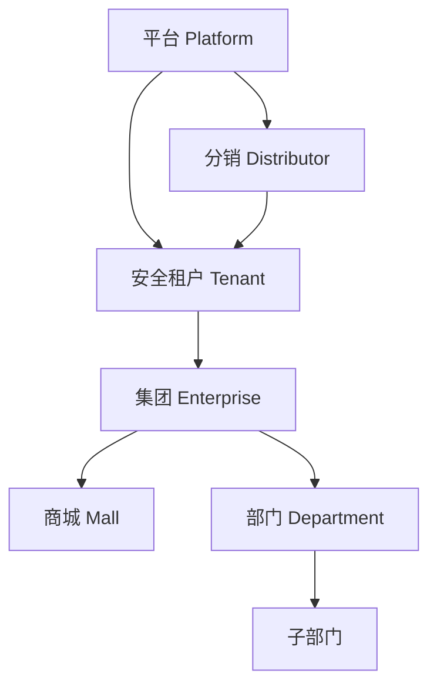
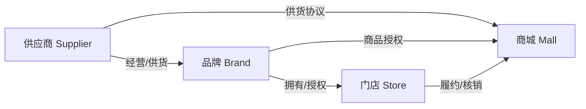
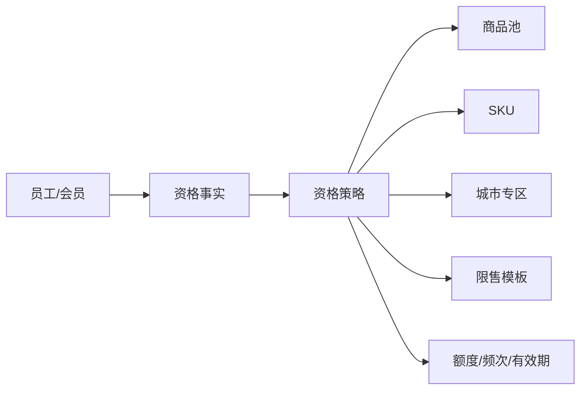

# 会员权限四类边界模型

状态：已选定，作为组织层级迁移、权限矩阵和员工端资格系统的共同基线。

## 一、组织层级模型

严格组织树只承载管理隶属关系：

### 关键约束

- `tenant` 保留为安全隔离域，不再同时承担“平台”和“分销”业务含义。
- `platform` 是全局治理根；只有受保护的 Platform Owner/平台运营角色可获得该范围。
- `distributor` 为可选业务层。没有分销商时安全租户直接挂平台；有分销商时将安全租户整体挂到分销节点下。
- 集团、商城和部门必须属于同一安全租户；组织树不能改变底层数据的租户归属。
- 祖先包含关系由数据库闭包表得出，不能接受浏览器提交的路径。

## 二、商业资源关系模型

供应商、品牌、门店和商城不是一棵严格组织树：

这些实体保留独立业务表，通过显式关系表连接组织节点。不能把供应商或品牌塞进 `org_units`，否则多供应商、多品牌授权和跨商城履约会被错误地压成单父级关系。

建议关系：

- `supplier_brand_bindings`
- `brand_store_bindings`
- `mall_supplier_agreements`
- `mall_brand_authorizations`
- `store_org_unit_bindings`

## 三、员工端可见与可买资格模型

C 端资格不是后台 RBAC。后台权限回答“谁可以管理”，资格策略回答“哪个员工在什么条件下可以看见、购买或核销什么”。

资格事实可以包括组织节点、部门、城市、员工标签、福利计划和会员状态。服务端必须在目录查询、商品详情、购物车校验和下单时重复执行资格判断；前端隐藏只用于体验，不是安全控制。

## 四、旧数据迁移模型

迁移采用兼容式双轨，不立即删除现有字段：

1. 创建 `org_units` 和 `org_unit_closure`。
2. 为现有 tenant 建安全租户节点，并创建唯一平台根节点。
3. 将 enterprise、mall、department 映射为组织节点。
4. 旧 `tenant_id / enterprise_id / mall_id / department_id` 继续作为生产查询快路径。
5. 新权限判定可读取数据库派生的 `orgUnitPath`；没有路径时退回旧平铺范围。
6. 完成数据一致性检查和跨租户回归后，写路径改为同步维护组织树。
7. 最后才评估是否收敛旧冗余字段；本期不删除。

### 不变量

- 默认拒绝；找不到完整祖先链时不扩大权限。
- 非平台/分销范围不能跨安全租户。
- 删除和移动组织节点必须显式执行，禁止通过随意更新 `parent_id` 绕过审计。
- 同一资源只能映射到一个组织节点；同一组织节点只能属于一个安全租户。
- 权限、角色、范围、会员状态发生变化后，相关旧会话必须在下一次请求失效。

## 本期与后续边界

### 本期落地

- 组织节点及闭包关系
- 现有 tenant/enterprise/mall/department 数据回填
- 祖先范围读取基础
- 角色权限变化的会话失效传播
- 旧数据兼容和跨租户安全测试

### 后续落地

- 分销商真实业务表和管理后台
- 品牌、门店与商业关系表
- 员工端资格/商品限售策略执行器
- 条件型风险、审批和职责分离策略
- 套餐能力矩阵
