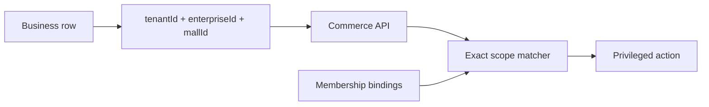
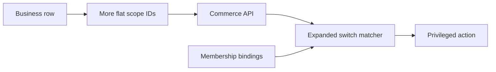
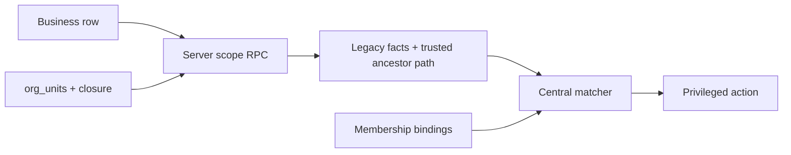
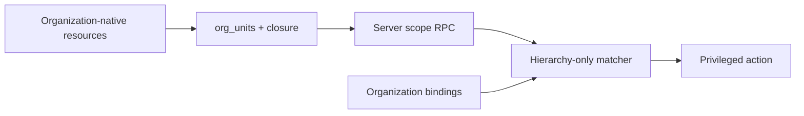

# Security Hardening Proposal: Centralize Hierarchical Scope Containment

## Decision

We need an organization scope model that can express platform, optional distributor, security tenant, enterprise, mall and department ancestry without weakening tenant isolation or forcing an atomic rewrite of every production query.

## Executive Recommendation

We considered Option 1, **continue expanding flat scope fields**; Option 2, **add a compatibility organization hierarchy**; and Option 3, **replace legacy scope columns immediately**. I recommend Option 2 under the current compatibility and uptime constraints. It puts ancestry behind one database-owned boundary while preserving all current scope columns as a rollback path.

## Evidence

I inspected the shared contract, decision engine, membership migrations, command-center mutation path and server resource loader. The following evidence most influenced the diagnosis:

| Evidence | Finding or source                   | What it establishes                                                                                                              |
| -------- | ----------------------------------- | -------------------------------------------------------------------------------------------------------------------------------- |
| `E001`   | Flat shared scope contract          | Each hierarchy level was represented as another optional field.                                                                  |
| `E002`   | Exact-match authorization engine    | A tenant mismatch rejected before scope evaluation; child containment depended on duplicated IDs.                                |
| `E003`   | Membership authorization foundation | Database scope validation and `authzVersion` already provide a safe base.                                                        |
| `E004`   | Permission command center           | New kinds were reserved, but delegation checks remained level-specific and role permission edits did not invalidate all holders. |
| `E005`   | Server resource-scope loader        | Resource facts already have a trusted server-owned construction boundary.                                                        |

The observed facts do not by themselves prove that a hierarchy is the only possible design. They do show that every added organizational level expands contracts, SQL projections and matcher cases together. We infer that keeping this ownership distributed will make future scope additions increasingly error-prone.

## Current Design And Failure Mode

A request resolves one membership and loads the target resource row through a security-definer RPC. This is a strong design: the browser cannot invent a tenant or mall. The weakness is representation. Both membership context and resource facts carry a list of optional IDs, and `scopeMatches` compares one field per kind. Enterprise grants happen to cover mall resources because mall rows redundantly carry their enterprise ID.

That approach has two structural limits. First, platform or distributor administration cannot be represented without relaxing the tenant equality rule. Second, every future level requires coordinated changes in the database, resource projections, TypeScript contract and engine. The current safe default is denial, but the model encourages duplicated containment logic.

## Desired Invariants

- A hierarchical scope only matches when the target resource's ancestors were derived from database state.
- Tenant and lower grants never cross a security tenant.
- Only protected platform or distributor grants may cross tenant boundaries.
- Supplier, brand and store relationships are evaluated as commercial relations, not fictional ancestors.
- Missing, malformed or stale ancestry fails closed.
- A role permission change invalidates every active membership holding that role.
- Existing flat scope facts remain usable during migration and rollback.

## Constraints And Non-Goals

We are not replacing every tenant-aware query in this phase. We are not enabling distributors, brands or stores in the daily permission editor, and we are not treating employee purchasing eligibility as RBAC. No measured production latency or database-size budget was supplied, so closure lookup cost must remain an explicitly measured rollout condition.

## Before Architecture

The current flow keeps resource identity trustworthy but distributes hierarchy semantics across fields and switch cases.

## Options

### Option 1: Continue expanding flat scope fields

This option preserves the current runtime shape. We would add distributor and every later organizational ID to membership context, resource projections and `scopeMatches`. Its strongest case is delivery speed: exact comparisons are cheap and existing engineers already understand the pattern.

The security gain is limited to whatever explicit cases we implement now. The residual problem is ownership drift. A new route can forget one field, or a new level can be added to the contract but not to a delegation RPC. Performance and memory remain predictable, but reliability falls as coordinated changes multiply. Rollback is easy because each addition is local.

| Change               | Before                    | After                       | Security consequence                       | Cost                        |
| -------------------- | ------------------------- | --------------------------- | ------------------------------------------ | --------------------------- |
| New level            | Optional IDs already grow | More optional IDs and cases | Explicit but easy to omit                  | Small now, repeated forever |
| Cross-tenant control | Hard tenant equality      | Special-case branches       | Can remain closed if every case is correct | High review burden          |

Option 1 becomes preferable only if distributor is definitively out of scope and the hierarchy will remain fixed for the product lifetime.

### Option 2: Add a compatibility organization hierarchy

This option adds `org_units` and `org_unit_closure`, maps existing tenants, enterprises, malls and departments, and returns a root-to-resource path from the existing server-owned scope RPCs. The decision engine accepts this path only for strict organization kinds. Supplier, brand, store and self continue to use their appropriate explicit facts.

The attractive part is containment ownership: ancestry lives in one database structure, while the API still passes plain trusted facts to a pure decision function. Platform and distributor bindings can be recognized as the only cross-tenant grants. Tenant and lower bindings remain unable to cross the tenant boundary, even if a malformed path contains a matching lower node.

We pay for an indexed closure lookup and additional closure rows. For ordinary shallow trees this should be modest, but we have not measured a production-shaped hierarchy. Closure rebuilds also require controlled mutation. The migration is deliberately additive: if rollout telemetry is poor, the application can stop returning `org_unit_path` and continue exact flat matching without restoring the database.

| Change               | Before                        | After                                | Security consequence                    | Cost                         |
| -------------------- | ----------------------------- | ------------------------------------ | --------------------------------------- | ---------------------------- |
| Ancestry owner       | Duplicated flat fields        | Database closure                     | One auditable containment source        | New tables and indexes       |
| Tenant boundary      | Unconditional equality        | Equality except explicit global path | Controlled cross-tenant governance      | More decision tests          |
| Migration            | Existing production fields    | Dual-read compatibility              | Rollback remains available              | Temporary dual model         |
| Session invalidation | Membership assignment changes | Role permission edits also propagate | Stale authority is removed next request | Bounded update per role edit |

### Option 3: Replace legacy scope columns immediately

The cleanest final-state model would identify every resource through organization nodes and remove the flat tenant, enterprise and mall scope projections in one release. Its strongest case is conceptual simplicity after migration: only one representation survives.

What gives me pause is the blast radius. The repository contains many tenant-aware operational and financial queries. Converting them atomically changes authorization, query plans, audits and reporting together. A missed caller would become a production outage or isolation defect, and rollback would require both application and database restoration. This option becomes preferable after the compatibility hierarchy has run in production, parity has been measured, and a coordinated maintenance window is acceptable.

| Change     | Before                         | After                      | Security consequence     | Cost                             |
| ---------- | ------------------------------ | -------------------------- | ------------------------ | -------------------------------- |
| Data model | Denormalized production fields | Organization-only identity | One final model          | Broad data conversion            |
| Deployment | Independent callers            | Coordinated cutover        | Removes dual-model drift | Highest outage and rollback risk |

## Comparison

| Dimension   | Option 1: Flat expansion   | Option 2: Compatibility hierarchy      | Option 3: Immediate replacement            |
| ----------- | -------------------------- | -------------------------------------- | ------------------------------------------ |
| Security    | Explicit but dispersed     | Central ancestry with guarded crossing | Strong final model if migration is perfect |
| Performance | Nearly unchanged           | One indexed closure lookup             | Unknown across all rewritten queries       |
| Memory      | Nearly unchanged           | Closure table and indexes              | Unknown net database impact                |
| Reliability | More control drift         | Additive rollback path                 | Atomic cutover risk                        |
| Operability | Repeated coordinated edits | Integrity monitoring required          | Major migration operations                 |
| Migration   | Easiest immediate patch    | Moderate additive migration            | Largest and least reversible               |

Option 2 is the proportional choice because it improves the structural boundary without betting production availability on a one-time rewrite.

## Recommendation

I recommend Option 2. We should keep the tenant node explicit beneath the platform or future distributor, attach database-derived paths only in resource authorization RPCs, and keep global scopes unavailable from the daily tenant permission editor. If closure lookup latency or hierarchy size exceeds an agreed threshold, Option 1 remains a safe short-term fallback; Option 3 should wait until dual-read evidence proves parity.

## Evidence Coverage And Residual Risk

| Evidence                                | Effect                                     | Remaining work                                                           |
| --------------------------------------- | ------------------------------------------ | ------------------------------------------------------------------------ |
| `E001` — Flat shared scope contract     | Addressed structurally                     | Legacy flat fields remain intentionally during migration.                |
| `E002` — Exact-match engine             | Addressed for strict organization ancestry | Commercial relationships require separate evaluators.                    |
| `E003` — Membership foundation          | Preserved and extended                     | Monitor authz-version update volume.                                     |
| `E004` — Flat command-center delegation | Mitigated                                  | Global grant ceremony and ancestor-aware delegation API remain deferred. |
| `E005` — Server scope loader            | Strengthened                               | Every new resource RPC must attach ancestry consistently.                |

The design does not yet make distributor, brand or store management production-ready. It also does not implement employee purchasing eligibility or conditional approval rules.

## Migration And Rollout

Deploy expand and backfill first. Verify that every existing tenant, enterprise, mall and department maps exactly once and has a complete platform path. Then deploy application readers that accept the path, while retaining legacy fields. Keep platform and distributor mutations closed. Observe scope RPC latency, closure size and authorization denials before any global grant is created.

Rollback is application-first: stop returning or consuming `org_unit_path`. Existing flat scope fields and matcher cases remain intact. The additive tables may remain without affecting old behavior.

## Validation Plan

- Execute every migration from an empty PostgreSQL 17 database.
- Repeat against a scrubbed production-shaped snapshot before deployment.
- Assert one source mapping per existing entity and complete self/platform closure rows.
- Test tenant, enterprise, mall, department, platform and malformed paths.
- Prove lower-level matching never crosses tenants.
- Measure p50/p95/p99 resource-scope RPC latency before and after paths.
- Measure closure row and index growth at expected five-year hierarchy size.
- Prove role permission inserts and deletes increment affected membership versions.
- Run all API tests and complete application builds.

## Implementation Work Packages

- WP1: document the four boundary models and migration invariants.
- WP2: add organization nodes, closure, existing-data backfill and path RPCs.
- WP3: add trusted path support and cross-tenant guards to the decision engine.
- WP4: propagate role permission changes through `authzVersion`.
- WP5: expose a read-only organization view and later design global grant ceremony.
- WP6: separately build commercial relations and employee entitlement policy.

## Open Questions

- Which identities may receive platform or distributor scope, and what approval ceremony is required?
- What closure lookup p95 and rebuild-time thresholds are acceptable?
- Will distributors span multiple technical tenants in the first commercial release?
