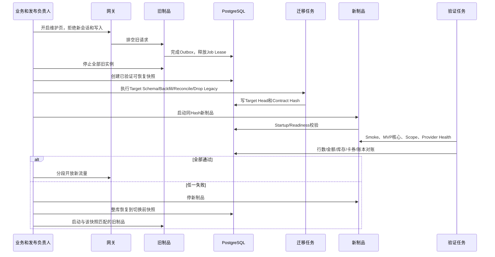

# 福利商城全量代码修改蓝图

> 版本：3.0
> 文档状态：实施级逐文件、逐调用点代码变更合同；不是完成声明
> 重新核对日期：2026-08-25
> 唯一需求基线：`05_docs_ziliao/docs_wendang/福利商城功能清单260821.xlsx`，SHA-256 `78cfc3b350ced633afd6bfc951f2d2a94991780fa1d4b6d571e9f1d3df322942`
> 实施方案：`05_docs_ziliao/docs_wendang/福利商城根治实施方案.md`
> 强制架构基线：`05_docs_ziliao/docs_wendang/福利商城架构和补齐修改清单.md`，SHA-256 `48f7d95dfad87aa9cc06705ff52a35561d7dabfb1ef5e75636e8418405a24ad2`
> VI唯一基线：`05_docs_ziliao/docs_wendang/brand/SMART-WING-UNIFIED-VI-1.0.md`，SHA-256 `6c9a57889534fd1203aa181dbce922af5609c51d7e5ed594964c510b1abb4508`
> 代码标准：`05_docs_ziliao/docs_wendang/代码与前端开发规范.md`，SHA-256 `ee2cad28f5fac9d57317c1141e9161afb7e995586849dae041bef232e6d3b9fc`
> 当前代码根：`smart-wing` 独立分商城仓库根 `.`；仓库拓扑以 `05_docs_ziliao/docs_wendang/operations/MallTopology.md` 为最高优先级
> 当前工作树快照：28 个修改、725 个删除、159 个未跟踪，共 912 项；在基线收束前禁止把本文件当成删除授权
> 当前实现快照：28 个业务模块、217 个 Operation、58 个领域事件、32 个 Job、164 个 SQL 迁移；这些数字是迁移输入，不是 Released 证明
>
> 2026-08-26 裁决：本文关于 `outerShop`、`nestedCandidate`、`Shop1`、同级 Smart 副本、跨仓 move/copy/archive、删除嵌套 `.git` 或把本仓库收束到外层 `Shop` 的内容，仅为历史迁移取证，不再是活动执行授权。不得据此读取或修改仓外目录。

---

## 0. 本清单如何使用

本清单是总方案第 4、12、13、16、17、24、26 与 30 节的执行卷，回答“具体修改哪些代码、移动到哪里、谁调用谁、何时删除旧文件、用什么证据证明没有断裂”。系统架构图、12 条模块间调用时序、28 个模块内部数据流时序和唯一目标树以总方案为唯一图形真值，本清单只补充到文件、符号、Registry、SQL、测试和删除门，避免在两份文档复制同一张图后产生漂移。

本轮不以法律意见、外部审批流程或组织签字作为编写代码蓝图的前置条件；但工作簿明确要求且系统正确性必需的身份、Scope、租户隔离、操作授权、审计和资金控制仍是技术功能，不能因“忽略权限约束”而从代码中删除。它不允许用以下内容代替实现：

- 只有页面、按钮、类型或数据库表，没有可达调用链。
- 只有Provider名称、来源编码或客户端类，没有真实沙箱闭环。
- 只有Mock、Fixture、Simulation、Demo Banner或固定成功响应。
- 只有旧API包装器、兼容别名、转发包、兼容View或双写器。
- 只有单元测试，没有真实PostgreSQL、Provider合同和用户旅程。
- 只有“以后接入”“暂不可用”“后续阶段”文案，却把功能标成完成。

实施时的事实优先级固定为：

```text
260821工作簿原始需求行
→ 福利商城架构和补齐修改清单
→ VI母版与代码开发规范（分别约束表达和工程底线）
→ 福利商城全系统根治方案（对前述依据的可执行收敛）
→ 本清单的逐文件执行合同
→ 当前代码中可验证的业务语义
→ 当前文件结构和局部实现偏好
```

若当前代码与目标冲突，保留经过测试的业务语义，删除错误边界；不得为了少改代码保留两套真值。架构基线、总方案和本执行卷必须在同一变更中消除冲突并刷新Hash，不能用后写文档静默覆盖更高优先级来源。

### 0.1 260821 工作簿闭合口径

- 9 个工作表经规范化形成 296 个独立 Requirement。
- `MVP上线功能清单!A3:F23`共21个MVP标签。
- `接口!A2:F21`共20个渠道或服务接口。
- 接口优先级1共11项，全部阻断MVP发布。
- 接口优先级3共5项，优先级4共4项；最终目标架构保留其Requirement和扩展位置，但在没有真实合同前不提交空Provider、不注册空能力、不模拟成功。
- 工作簿中出现的接口地址、账号、Secret或联系人不进入代码、示例、日志、测试快照和本文。
- 与旧工作簿按OpenXML逐格复核后，工作表行数、业务行身份和296/21/20映射骨架不变，但`接口!H8`、`H10`、`H11`、`I11`、`H12`共5格集成元数据发生变化：包含接入/凭据说明、API文档或环境入口元数据，并且`I11`的接口方式由空白变为有值。它们不应统称为“凭据差异”；尤其接口方式属于实现语义，必须逐格审查。本文不复制任何单元格值或Secret；映射仍必须从260821文件重新生成Source、Hash、Generated At、Output Hash和差异报告，旧生成物不得直接晋级为发布证据。

### 0.2 修改动作定义

| 动作 | 精确定义 |
| --- | --- |
| 保留 | 业务语义、算法或测试继续使用，但仍要移动到目标边界并通过新合同 |
| 拆分 | 一个巨型文件按Domain、Application、Infrastructure、Interface或前端Feature职责拆开 |
| 重接 | 保留实现，删除原调用方式，改由Port、Handler、Registry或生成SDK调用 |
| 重写 | 当前实现依赖Mock、错误状态机、错误Scope或重复真值，不能直接迁移 |
| 新增 | 当前不存在且Excel或目标架构要求的正式产品代码 |
| 删除 | 替代路径已通过门禁后，从产品源码、构建、部署、路由和配置中物理移除 |
| 撤销 | 通过追加SQL执行`REVOKE`或`DROP`，不修改已应用的历史迁移 |

### 0.3 冲突裁决与目标路径

1. 本文件中“当前路径”允许出现 `apps/console`、`features`、`extensions/providers`、`extensions/vendors`、`database/supabase` 等迁移源名称；它们不代表最终结构。
2. 所有“目标路径”必须落到总方案第 16 节的 `Shop`：前端使用 `feature`、`entity`、`route` 单数；渠道扩展使用 `extensions/channel`；数据库使用 `database/migrations|contracts|fixtures|tools`；运维文档使用 `05_docs_ziliao/docs_wendang/operations`。
3. 若旧段落与本节或总方案冲突，以本节和总方案为准；实施前必须由 `FileDisposition.yml` 生成无冲突的最终动作，不允许开发者自行选择旧写法。
4. 本文件在迁移源中的当前落点是分析制品；硬切前原子移动为 `Shop/docs/operations/CodePlan.md`，随后删除嵌套迁移源，最终树不保留第二份活动蓝图。

### 0.4 P0 迁移与 VI 取证

| 风险 | 当前只读证据 | 必须先做 |
| --- | --- | --- |
| 新六端未纳管 | 嵌套Git对`apps/{console,store,supplier,storefront,auth,miniapp}`与`packages/{contract,design,sdk}`的跟踪文件数为0 | 内容寻址Manifest、SHA-256清单、只读快照和可回退提交 |
| 旧Smart已删除态 | 旧`apps/admin-web`有115个已跟踪文件处于删除态 | 固定旧→新逐文件映射，禁止继续物理清理 |
| 外层Shop也有用户修改 | 外层旧客户端存在修改，而整个`smart-wing`对外层Git又是未跟踪目录 | 三方内容迁移和冲突清单，不直接覆盖外层Shop |
| 架构门是假绿 | Boundary只识别`/feature/`，当前大量`/features/`；Naming只查连接符 | 先修Auditor和FileDisposition，再信任结果 |
| Console首包超预算 | 当前Bundle Audit约128.9KB gzip，目标≤95KB | 删除副作用全量Service Import，Workspace按Manifest Lazy Chunk |
| Console VI漂移 | 源码约42处裸色、57处小于12px字号 | Token Gate、字号Gate、对比度与A11y门阻断CI |
| 品牌派生资产漂移 | Canonical `wing-code-symbol.svg`与Console/Auth Public副本Hash不一致 | 冻结Canonical内容，Public仅由Generator原子重生，不手工保留副本 |

---

## 1. 不可协商的代码裁决

### 1.1 最终运行单元

```text
apps/console      平台、分销、集团、商城运营
apps/store        门店后台
apps/supplier     供应链后台
apps/storefront   PC Web和H5员工商城
apps/auth         统一认证入口
apps/miniapp      微信小程序

services/commerce/src/entry/ApiMain.ts
services/commerce/src/entry/JobsMain.ts

PostgreSQL        唯一交易事实源
Redis             可丢失、可重建的缓存和短租约
CDN               已发布体验和公开目录的不可变投影
```

不再保留`services/core-read-cache`独立进程，不再由Storefront Worker直接导入Commerce源码，不再由Express管理后台进程同时承担静态站点、AI接口和权限判断。

### 1.2 最终包名

全部Workspace包统一使用`@shop`作用域：

```text
@shop/console
@shop/store
@shop/supplier
@shop/storefront
@shop/auth
@shop/commerce
@shop/contract
@shop/sdk
@shop/kernel
@shop/authz
@shop/design
@shop/telemetry
@shop/config
@shop/testing
```

一次提交内更新所有`package.json`、TypeScript引用、Vite/Next配置、脚本和源码导入，然后删除`@smart-wing/*`。禁止发布转发包或Path Alias作为长期兼容层。

### 1.3 最终依赖方向

后端：

```text
interface → application → domain
infrastructure → application port和domain
bootstrap → Module公开注册面
模块A → 模块B只能调用B的公开Application Port或订阅B的公开Event
```

前端：

```text
app → route和shell → feature → entity → shared
feature只通过@shop/sdk访问服务
feature之间不深层导入
Navigation、Permission、Capability和Route来自同一Registry
```

禁止：

- Domain导入HTTP、数据库、Redis、环境变量、其他模块Infrastructure、`Date.now()`或`Math.random()`。
- Controller直接调用SQL/RPC。
- React组件直接`fetch`。
- 一个模块读取另一个模块的表。
- Reporting任意JOIN交易Schema。
- Provider字段直接进入核心Domain。
- 一个业务状态由React State、LocalStorage、数据库和Provider响应共同拥有。

### 1.4 不断裂切换规则

每个Operation必须按以下顺序在同一个短生命周期变更集中完成：

1. 在`packages/contract`新增或修改唯一Operation、DTO、Error和Event Schema。
2. 运行Contract Generator，更新`packages/sdk`；禁止手写第二份前端DTO。
3. 在目标模块新增Command或Query Handler及Port。
4. 增加Repository、事务和追加SQL迁移。
5. 由目标`Module.ts`向`RouteRegistry`注册Handler。
6. 修改所有Console、Store、Supplier、Storefront、Auth和Miniapp调用点。
7. 修改所有Jobs、Webhook、Event Consumer和Runbook调用点。
8. 通过Contract、类型、数据库、调用图、集成和Journey测试。
9. 在同一次硬切换中删除旧Route、旧SDK方法、旧RPC和旧导入。
10. 搜索仓库证明旧Operation ID、旧路径、旧导出和旧权限码为零。

不得先删除旧调用点造成主干断裂，也不得为了避免断裂保留兼容包装器。正确做法是使用一次原子提交或受保护的短分支完成“新建、全量改调用点、删除旧点”。

---

## 2. 根Workspace逐文件修改

### 2.1 `package.json`

修改点：

1. `name`改为`shop`，版本由发布流程管理。
2. `workspaces`改为：`apps/*`、`services/*`、`packages/*`、`extensions/channel/*`、`extensions/payment/*`、`extensions/notification/*`、`extensions/storage/*`、`extensions/tax/*`、`04_tools/tools/*`；不再把 `providers` 和 `vendors` 设为两个架构层。
3. 删除`build:core-read-cache`、旧`build:commerce-api`、旧`build:jobs`、旧应用名称脚本和Vite Preview生产脚本。
4. 新增`build:commerce`，分别构建`ApiMain`和`JobsMain`，但共享同一模块代码。
5. 新增六端的`dev`、`build`、`test`和`typecheck`脚本。
6. `quality`只固定为`node 04_tools/tools/quality/bootstrap.mjs`这一入口，不在`package.json`复制线性顺序；唯一`TaskCatalog.ts`恰好执行根方案23.2的21节点DAG：`install→generated`；generated后并发secrets/format/linebudget/architecture/contract/docs；`generated+format→naming`；`naming+linebudget+architecture+contract→typecheck`；`typecheck→unit+component`；`contract→database`；`database+contract→migration`；`typecheck+unit→build`；`build+migration→bundle`；`bundle+database+component→journey→security+performance`；`bundle+secrets→sbom`；最后`docs+security+performance+bundle+sbom+migration→sign`。任何未知节点、漏边、第二顺序或别名脚本为零。
7. 删除根生产依赖`nodemailer`；邮件实现归入Notification Extension并由对应Workspace声明。
8. 删除Commerce中的`@google/genai`、Express静态站点用途及AI辅助接口依赖；Excel没有AI Copilot产品需求。
9. 所有依赖使用唯一版本；React、TypeScript、Vite/Vitest不能在各包漂移出多个版本。

完成后一次性重新生成`package-lock.json`，禁止手改Lock，也禁止同时保留NPM和PNPM两套Lock。

### 2.2 根TypeScript和构建配置

新增或修改：

```text
tsconfig.json
packages/config/src/RuntimeConfig.ts
04_tools/tools/contractgen/src/ContractGenerator.ts
04_tools/tools/requirementgen/src/RequirementGenerator.ts
```

要求：

- 根`tsconfig.json`只管理Project References和严格Compiler Options。
- 每个Workspace只继承根配置，不复制`strict`、`moduleResolution`、Path Alias等选项。
- 禁止用Path Alias把旧目录伪装成新包。
- `noUncheckedIndexedAccess`、`exactOptionalPropertyTypes`、`noImplicitOverride`和`useUnknownInCatchVariables`开启。
- Browser、Node、Worker和Miniapp分别使用明确Lib，不把Node全局泄露到浏览器Domain。

### 2.3 环境配置

修改`packages/config/src/index.ts`，拆为：

```text
packages/config/src/RuntimeConfig.ts
packages/config/src/generated/ApiConfig.ts
packages/config/src/generated/JobsConfig.ts
packages/config/src/generated/WebConfig.ts
packages/config/src/generated/MiniappConfig.ts
packages/config/src/generated/ProviderConfig.ts
packages/config/src/generated/TestConfig.ts
packages/config/src/index.ts
```

动作：

- 保留当前严格解析函数的语义。
- 所有环境变量Schema、Cache/Capacity运行预算、Timeout、Retry和Concurrency只在`RuntimeConfig.ts`声明一次；`generated/*Config.ts`是只读投影视图，重生必须零Diff。
- API、Jobs和Provider用不同Schema，最小化Secret暴露。
- Provider配置只保存`connectionId`和Secret Manager引用，不保存凭据值。
- 删除各应用和服务中重复声明的`WorkerEnv`、超时常量、域名和环境默认值。
- 生产缺失必填值时启动失败；禁止静默默认到测试端点、Mock或开发认证。

### 2.4 CI和审计脚本

当前审计脚本能运行，但必须修改，因为它们仍硬编码旧目录或历史豁免：

| 当前迁移源 | 唯一目标 | 必须修改 |
| --- | --- | --- |
| `04_tools/scripts/audit/workspace.mjs` | `04_tools/tools/quality/src/audit/Workspace.ts` | 只扫描最终Canonical Workspace；归档不在仓库；识别`extensions`和`tools`Workspace |
| `04_tools/scripts/audit/callgraph.mjs` | `04_tools/tools/quality/src/audit/callgraph/Main.ts` | 从Contract Operation Catalog、Route Registry导出、SDK清单和Event Consumer Registry交叉校验，不再用字符串包含判断路由存在 |
| `04_tools/scripts/audit/duplicate.mjs` | `04_tools/tools/quality/src/audit/Duplicate.ts` | 唯一Owner改为`@shop/authz`、`ErrorPresenter`、`RouteRegistry`、`packages/config`；重复块候选必须有Owner处置结果 |
| `04_tools/scripts/audit/naming.mjs` | `04_tools/tools/quality/src/audit/Naming.ts` | 删除旧Commit基线豁免；最终生产目录直接达到零连接符违规；仅保留CLI、审计、测试、配置、SQL和工具强制文件豁免 |
| `04_tools/scripts/audit/boundary.mjs` | `04_tools/tools/quality/src/audit/Boundary.ts` | 目标路径改为`services/commerce/src/modules`和六端固定分层；检查模块公开Port，不允许跨模块内部导入 |
| `04_tools/scripts/audit/regression.mjs` | `04_tools/tools/quality/src/audit/Regression.ts` | 增加旧Route、旧RPC、Mock、Simulation、Fallback、Demo、`@smart-wing`和旧目录零残留检查 |
| `04_tools/scripts/audit/database-contracts.mjs` | `04_tools/tools/quality/src/audit/Database.ts` | 校验164个当前迁移及94个历史迁移的不可变Hash、后续Repair迁移、Fresh Replay、生产副本升级、函数签名、Grant、RLS和Schema Owner |
| `04_tools/scripts/check-line-budget.mjs` | `04_tools/tools/quality/src/audit/LineBudget.ts` | 只对产品源码执行299行门禁；删除Admin/Auth原型豁免；文档、已应用SQL、生成代码和测试使用各自门禁 |
| `04_tools/scripts/check-platform-delivery.mjs` | `04_tools/tools/quality/src/audit/Delivery.ts` | 改为读取生成的21项Requirement Matrix和Released证据，不再用源码字符串推断完成 |
| `04_tools/scripts/verify-p0.mjs` | `04_tools/tools/quality/src/audit/Pzero.ts` | 覆盖身份、授权、下单、库存、支付、退款、Outbox、财务借贷和无Mock生产依赖图 |

新增：

```text
04_tools/tools/quality/bootstrap.mjs
04_tools/tools/quality/src/Quality.ts
04_tools/tools/quality/src/TaskCatalog.ts
04_tools/tools/quality/src/FileDisposition.ts
04_tools/tools/quality/config/archive.yml
04_tools/tools/quality/config/bundles.yml
04_tools/tools/quality/config/cutover.yml
04_tools/tools/quality/config/naming.yml
04_tools/tools/quality/src/authorization/TrustPolicy.ts
04_tools/tools/quality/src/authorization/AuthorizationReceipt.ts
04_tools/tools/quality/src/authorization/ObjectAuthorizationReceipt.ts
04_tools/tools/quality/src/authorization/EvidenceKind.ts
04_tools/tools/quality/src/authorization/EvidenceEnvelope.ts
04_tools/tools/quality/src/authorization/EvidenceEnvelopeBuilder.ts
04_tools/tools/quality/src/authorization/EvidenceSigner.ts
04_tools/tools/quality/src/authorization/KmsEvidenceSigner.ts
04_tools/tools/quality/src/authorization/CheckoutClaimIssuer.ts
04_tools/tools/quality/src/authorization/EvidenceCheckoutClaimIssuer.ts
04_tools/tools/quality/src/authorization/AuthorizationIssuer.ts
04_tools/tools/quality/src/authorization/EvidenceAuthorizationIssuer.ts
04_tools/tools/quality/src/authorization/CheckoutClaimVerifier.ts
04_tools/tools/quality/src/authorization/EvidenceStore.ts
04_tools/tools/quality/src/authorization/ObjectEvidenceStore.ts
04_tools/tools/quality/src/authorization/RunAttestor.ts
04_tools/tools/quality/src/authorization/CiRunAttestor.ts
04_tools/tools/quality/src/authority/AuthorityAuthorization.ts
04_tools/tools/quality/src/authority/AuthoritySnapshot.ts
04_tools/tools/quality/src/authority/AuthorityCli.ts
04_tools/tools/quality/src/snapshot/SnapshotAuthorization.ts
04_tools/tools/quality/src/snapshot/SourceSnapshot.ts
04_tools/tools/quality/src/snapshot/SnapshotCli.ts
04_tools/tools/quality/src/archive/ArchiveAuthorization.ts
04_tools/tools/quality/src/archive/ArchiveStore.ts
04_tools/tools/quality/src/archive/ObjectArchiveStore.ts
04_tools/tools/quality/src/archive/ArchiveCli.ts
04_tools/tools/quality/src/cutover/CutoverAuthorization.ts
04_tools/tools/quality/src/cutover/CutoverState.ts
04_tools/tools/quality/src/cutover/Forward.ts
04_tools/tools/quality/src/cutover/Repair.ts
04_tools/tools/quality/src/cutover/PostTree.ts
04_tools/tools/quality/src/cutover/CleanClone.ts
04_tools/tools/quality/src/cutover/GitMetadata.ts
04_tools/tools/quality/src/cutover/EphemeralArtifact.ts
04_tools/tools/quality/src/cutover/CanonicalRef.ts
04_tools/tools/quality/src/cutover/GitCanonicalRef.ts
04_tools/tools/quality/src/cutover/CutoverSessionStore.ts
04_tools/tools/quality/src/cutover/ObjectCutoverSessionStore.ts
04_tools/tools/quality/src/cutover/RootActivator.ts
04_tools/tools/quality/src/cutover/DeleteExecutor.ts
04_tools/tools/quality/src/cutover/QuarantineFinalizer.ts
04_tools/tools/quality/src/cutover/CutoverCli.ts
04_tools/tools/quality/src/execution/ToolBundle.ts
04_tools/tools/quality/src/execution/ToolLauncher.ts
04_tools/tools/quality/src/execution/CredentialBroker.ts
04_tools/tools/quality/src/execution/ProviderCredentialBroker.ts
04_tools/tools/quality/src/execution/TelemetryProbe.ts
04_tools/tools/quality/src/execution/ProviderTelemetryProbe.ts
04_tools/tools/quality/src/execution/TrafficControl.ts
04_tools/tools/quality/src/execution/ProviderTrafficControl.ts
04_tools/tools/quality/src/execution/MountControl.ts
04_tools/tools/quality/src/execution/ProviderMountControl.ts
04_tools/tools/quality/src/execution/AuthorityMaterializationControl.ts
04_tools/tools/quality/src/execution/ProviderAuthorityMaterializationControl.ts
04_tools/tools/quality/src/execution/ExecutorIsolationControl.ts
04_tools/tools/quality/src/execution/ProviderExecutorIsolationControl.ts
04_tools/tools/quality/src/execution/DeploymentControl.ts
04_tools/tools/quality/src/execution/ProviderDeploymentControl.ts
04_tools/tools/quality/src/execution/MigrationControl.ts
04_tools/tools/quality/src/execution/ProviderMigrationControl.ts
04_tools/tools/quality/src/execution/ReleaseProbe.ts
04_tools/tools/quality/src/runtime/InfrastructureRun.ts
04_tools/tools/quality/src/runtime/ReleaseTopology.ts
04_tools/tools/quality/src/task/Generated.ts
04_tools/tools/quality/src/task/Secrets.ts
04_tools/tools/quality/src/task/Format.ts
04_tools/tools/quality/src/task/Naming.ts
04_tools/tools/quality/src/task/LineBudget.ts
04_tools/tools/quality/src/task/Architecture.ts
04_tools/tools/quality/src/task/Contract.ts
04_tools/tools/quality/src/task/Docs.ts
04_tools/tools/quality/src/task/Typecheck.ts
04_tools/tools/quality/src/task/Unit.ts
04_tools/tools/quality/src/task/Database.ts
04_tools/tools/quality/src/task/Component.ts
04_tools/tools/quality/src/task/Journey.ts
04_tools/tools/quality/src/task/Security.ts
04_tools/tools/quality/src/task/Performance.ts
04_tools/tools/quality/src/task/Build.ts
04_tools/tools/quality/src/task/Bundle.ts
04_tools/tools/quality/src/task/Sbom.ts
04_tools/tools/quality/src/task/Migration.ts
04_tools/tools/quality/src/task/Sign.ts
04_tools/tools/quality/src/audit/Operation.ts
04_tools/tools/quality/src/audit/Event.ts
04_tools/tools/quality/src/audit/Extension.ts
04_tools/tools/quality/src/audit/Requirement.ts
04_tools/tools/quality/src/audit/Job.ts
04_tools/tools/quality/src/audit/Navigation.ts
04_tools/tools/quality/src/audit/Environment.ts
04_tools/tools/quality/src/audit/Bundle.ts
04_tools/tools/quality/src/audit/Migration.ts
04_tools/tools/quality/src/audit/Generated.ts
04_tools/tools/quality/src/audit/Dependency.ts
04_tools/tools/quality/src/audit/RuntimeGraph.ts
04_tools/tools/quality/src/audit/callgraph/Projects.ts
04_tools/tools/quality/src/audit/callgraph/Imports.ts
04_tools/tools/quality/src/audit/callgraph/Operations.ts
04_tools/tools/quality/src/audit/callgraph/Events.ts
04_tools/tools/quality/src/audit/callgraph/Jobs.ts
04_tools/tools/quality/src/audit/callgraph/Extensions.ts
04_tools/tools/quality/src/audit/callgraph/Routes.ts
04_tools/tools/quality/src/audit/callgraph/Database.ts
04_tools/tools/quality/src/audit/callgraph/Report.ts
05_docs_ziliao/docs_wendang/operations/evidence/.gitignore
```

根`package.json`唯一脚本固定为`"quality": "node 04_tools/tools/quality/bootstrap.mjs"`，并把`tsx`以精确版本`4.20.6`锁在根devDependencies和lockfile。普通CI先把不可变Commit检出到本次独占的新目录；本地与CI都只调用该脚本。入口模式固定为：无Claim/State=`localSnapshot`，平台签名Claim=`release`，受签Cutover State=`postApply`。三态共用21节点；Clean本地Snapshot可exit 0但无Publisher、Signature、SignBundle、Attestation或部署资格。

Bootstrap以Node标准库在install前读取`preInstallCommitOid/preInstallTreeOid`并要求三项Git Clean；Claim/State此时不可信，禁止复制Decoder。`npm ci`成功后固定调用唯一`CheckoutClaimVerifier.ts --expected-commit <preInstallCommitOid> --expected-tree <preInstallTreeOid>`，两变量绝不能接硬切父`preCommitOid`；Verifier复用TrustPolicy/Envelope/Store。之后再次读取OID/Clean，要求与preinstall完全相同，才写最终Bootstrap Evidence并启动Quality。localSnapshot不验Claim且拒绝Publisher/Attestor。

Quality原子写`TaskContext.json`（mode=`localSnapshot|release|postApply`、run/Bootstrap/Claim/Commit/Tree/Clean Hash、可选Cutover State、只供Sign的Publisher Ref且local为空）。20个Runner统一接收绝对tsx、`--run-id --context --context-hash --evidence`；除Sign外读取Publisher Ref即失败。Sign的local分支只写`LocalQualitySnapshot(releaseEligible=false,noExternalRefs=true)`；后两态才写/签/发布QualityRun、Manifest、ExecutorToolBundle与SignBundle。Generated/Architecture/FileDisposition不得从环境猜状态或越过DAG。`.gitignore`和20个Runner均是精确Create；Infrastructure与ReleaseTopology仍为唯一生命周期Owner。

### 2.5 当前门禁事实及修改目标

- 当前`callgraph`报告0项，但它无法证明未挂载工作台、运行时Registry、数据库函数和Event Consumer完整；用Operation ID闭合替代弱字符串搜索。
- 当前重复审计发现50组相似代码候选，主要来自多套Laptop/Tablet/Android/MiniProgram页面和卡券/资格面板；硬切换后必须归并为共享组件或留下有理由的不同实现。
- 当前行数门禁因文档和交接材料超过299行失败；修正扫描范围后，产品源码不得再使用历史豁免。
- 新CI必须在全新目录执行`npm ci`，避免本机残留掩盖缺失依赖。

---

## 3. Canonical Workspace 目录迁移动作

这里存在多个彼此重叠但内容不同的来源，动作不是再次“改名”，而是为每个Source Root独立冻结内容、逐文件分类，再原子收束到`Shop`。`outerShop`保存旧正式应用和用户修改，`nestedCandidate`保存新六端与模块候选；其余分支/复制树也可能含独有内容。任何树在未进入多来源`FileDisposition.yml`前都不得移动、覆盖或删除。源树内已采用目标名称的`apps/console|store|supplier|storefront|auth|miniapp`和`services/commerce`直接按内容处置，不经过旧名称中转。

本节表内前缀是Provenance，不是目标目录：`outerShop:`表示`Shop/`当前外层Git，`nestedCandidate:`表示`Shop/smart-wing/`嵌套候选；同一路径出现在两个根时必须生成两条Source Entry并以Hash做三方裁决，不能按路径名覆盖。

### 3.1 顶层路径

| 当前路径 | 最终路径 | 动作 |
| --- | --- | --- |
| `outerShop:apps/admin-web` | `apps/console` | 保留真实商品、订单、卡券、商城、会员、权限和资格语义；重建Route和Feature分层 |
| `outerShop:apps/storefront-web` | `apps/storefront` | 保留核心页面和真实交易调用；删除设备展示副本、Mock和巨型Context |
| `outerShop:apps/auth-web` | `apps/auth` | 保留视觉、Credential Discovery、注册协议；删除全部浏览器模拟安全逻辑 |
| `outerShop:apps/wechat-miniapp` | `apps/miniapp` | 保留真实API、微信支付、翼码和适配器；源内旧展示词“会员码”按本节迁移门统一替换，补齐体验Action、售后、客服和通知 |
| `nestedCandidate:apps/store`（现有未纳管目录） | `apps/store` | 先冻结Hash并逐文件盘点，再按第8.5节重构为门店独立应用；禁止Create覆盖，使用SDK和Store Scope |
| `nestedCandidate:apps/supplier`（现有未纳管目录） | `apps/supplier` | 先冻结Hash并逐文件盘点，再按第8.6节重构为供应商独立应用；禁止Create覆盖，使用SDK和Supplier Scope |
| `outerShop:services/commerce-api` | `services/commerce` | 按28模块拆分，API入口只做Bootstrap和Route注册 |
| `outerShop:services/jobs` | `services/commerce` | 合并Domain和Application；JobsMain只装配Job Registry |
| `outerShop:services/core-read-cache` | 删除 | Redis Cache Port并入各Query Infrastructure |
| `outerShop:packages/api-contract` | `packages/contract` | 统一HTTP、Event、Error和Operation真值 |
| `outerShop:packages/design-system` | `packages/design` | 保留Token和基础组件，禁止含业务状态 |
| `outerShop:packages/wechatpay` | `extensions/payment/wechat` | 保留签名、通知解密、Prepay、Close和退款密码学 |
| `outerShop:packages/authz`、`nestedCandidate:packages/authz` | `packages/authz` | 两份分别入账并按Hash/语义合并；保留Decision思想，重建唯一Permission和Scope目录 |
| `outerShop:packages/config`、`nestedCandidate:packages/config` | `packages/config` | 两份分别入账；拆分入口环境Schema，删除重复配置 |
| `nestedCandidate:packages/sdk`（现有未纳管目录） | `packages/sdk` | 盘点现有Transport/Client语义；公共`unknown`归零后由Contract重生六端唯一客户端，禁止覆盖未归类文件 |
| `nestedCandidate:packages/kernel`（现有未纳管目录） | `packages/kernel` | 盘点后收束Money、Clock、Id、Result、Page、Cursor和值对象；领域Error/Event不在此重复定义 |
| `nestedCandidate:packages/telemetry`（现有未纳管目录） | `packages/telemetry` | 盘点后收束Trace、Metric、Log、Catalog和脱敏策略；文件名服从第4.6/15.5节 |
| `nestedCandidate:packages/testing`（现有未纳管目录） | `packages/testing` | 盘点后收束Test Clock、Id、Container、数据库和Provider Harness；生产引用为零 |
| `nestedCandidate:extensions/providers/*` | `extensions/channel/*` | Provider 是渠道能力实现，保留业务 Mapper/Contract，统一 Manifest、Factory、Health 和 capability 目录 |
| `nestedCandidate:extensions/vendors/*` | 合并到对应 `extensions/channel/<provider>/integration/*` 或 `extensions/channel/core/*` | 只保留真正跨 Provider 复用的签名、限流和传输代码，删除第二插件层和 Vendor Registry |
| `outerShop:database/supabase/migrations`、`nestedCandidate:database/supabase/migrations` | `database/migrations` | 两份逐文件比较；保持已应用历史文件名与内容Hash，不在移动中改写SQL |
| 两根的`database/supabase/tests`与`database/contracts` | `database/contracts` | 按Owner合并成唯一SQL合同目录，重复断言只保留一个Owner |
| 两根的`infrastructure/aliyun\|cloudflare` | `infrastructure/cloud`、`infrastructure/network` | 云厂商是实现，不成为架构层；按资源Owner逐文件分类 |
| `nestedCandidate:infrastructure/local/docker-compose.yml` | `infrastructure/container/compose.yml` | rewrite；服务名恰好postgres/redis/minio/queue，四image只用Images Lock变量，有healthcheck/动态回环端口/项目Volume |
| `nestedCandidate:infrastructure/local/postgres-init.sh` | `infrastructure/container/postgres-init.sh` | refactor；仅创建Test DB Role/Extension，幂等、fail-fast、无内置Secret |
| `nestedCandidate:infrastructure/local/README.md` | `infrastructure/container/README.md` | rewrite；只记唯一Quality入口、四服务、故障排查与清理，不复制命令/版本/Secret |
| `nestedCandidate:infrastructure/local/.env.local\|secrets.local.json\|.tls/**\|data/**` | 无目标 | delete；先登记Hash/种类/引用、必要旋转、调用为0并完成可恢复Archive；不带入新树 |
| 无源 | `infrastructure/container/images.lock.yml` | create；唯一声明POSTGRES_IMAGE/REDIS_IMAGE/MINIO_IMAGE/QUEUE_IMAGE的`registry/name@sha256:digest`，Generated Task校验与Compose变量集合相等 |
| `nestedCandidate:04_tools/tools/localinfra\|localkms\|localobjects\|localsecrets\|seed` | `infrastructure/container` 或 `database/tools` | 仅保留可复现本地环境与数据工具；最终`tools`只保留contractgen、requirementgen、tokengen、quality |

“未纳管”表示目录当前存在但Git跟踪数为0，不表示可按空目录新建；必须先进入`FileDisposition.yml`、固定Source Hash并逐项分类。迁移完成后物理删除旧顶层目录。不得同时构建旧名称和新名称。

### 3.2 Storefront Worker断开源码耦合

当前`apps/storefront-web/worker/index.ts`直接导入`services/commerce-api/src/api/router`。修改为：

- `apps/storefront/src/worker/StorefrontWorker.ts`只承载Vinext/Next渲染和静态资源。
- `/api/*`由Edge转发到独立`ApiMain`部署。
- Storefront不再把Commerce源码打进前端Worker。
- 删除跨Workspace相对路径导入；SDK只发同源HTTP。
- 用部署级集成测试验证Edge路由，而不是靠源码耦合保证API存在。

### 3.3 `services/commerce-api/src/adminServer.ts`

删除该文件，具体替代如下：

- `/api/health`由`ApiMain`的Runtime模块统一注册。
- Console静态制品由CDN或静态站点部署，不由Commerce Express进程托管。
- `/api/ai/classify-product`和`/api/ai/operational-copilot`不在Excel范围内，删除Google Gemini依赖、Mock Fallback和对应按钮调用。
- 若未来业务正式立项AI能力，必须作为独立Extension和明确Requirement重新进入架构，不保留当前辅助入口。
- 删除`GEMINI_API_KEY`、`GoogleGenAI`、AI Prompt和`isMockFallback`生产代码。

---

## 4. 新基础包逐文件修改

### 4.1 `packages/kernel`

新增：

```text
packages/kernel/src/Money.ts
packages/kernel/src/Currency.ts
packages/kernel/src/Clock.ts
packages/kernel/src/SystemClock.ts
packages/kernel/src/Id.ts
packages/kernel/src/IdGenerator.ts
packages/kernel/src/Result.ts
packages/kernel/src/Page.ts
packages/kernel/src/Cursor.ts
packages/kernel/src/Version.ts
packages/kernel/src/Email.ts
packages/kernel/src/Mobile.ts
packages/kernel/src/Hash.ts
packages/kernel/src/index.ts
```

要求：

- `Money`只允许整数最小单位和Currency，禁止浮点业务计算。
- Domain只注入`Clock`和`IdGenerator`，不得直接读取系统时间和随机数。
- `Cursor`是签名不透明值，禁止把数据库Offset暴露为公共分页合同。
- Value Object构造即校验，错误使用稳定Code。
- Kernel不包含Tenant、Order、Product等具体业务概念。

### 4.2 `packages/contract`

重构当前`packages/api-contract/src`：

| 当前文件 | 动作 | 目标 |
| --- | --- | --- |
| `commerce.ts` | 拆分 | 各模块`operations`中的请求、响应和错误Schema |
| `platform.ts` | 拆分 | organization、capability和channel Operation |
| `permissions.ts` | 提取有效语义后删除 | `packages/contract/definitions/permissions.yml`是唯一源，生成`packages/authz/src/PermissionCatalog.ts` |
| `memberCode.ts` | 保留语义 | verification Contract |
| `mallApplicationModel.ts` | 保留Schema语义 | experience Contract |
| `mallApplicationParser.ts` | 服务端解析归Experience | Contract只保留Schema和类型 |
| `mallApplicationValidation.ts` | 合并唯一验证规则 | Experience Schema验证器 |
| `mallApplicationMigration.ts` | 删除 | 硬切换到唯一Schema Version，不做客户端兼容迁移 |
| `catalog-taxonomy.json` | 退出运行时真值 | Catalog数据库和生成只读投影 |
| `delivery-matrix.json` | 移到生成需求制品 | `05_docs_ziliao/docs_wendang/requirements/mapping.json` |

新增：

```text
packages/contract/src/Contract.ts
packages/contract/src/Operation.ts
packages/contract/src/OperationCatalog.ts
packages/contract/src/ErrorContract.ts
packages/contract/src/EventContract.ts
packages/contract/src/Schema.ts
packages/contract/src/operations/
packages/contract/src/events/
packages/contract/src/index.ts
packages/contract/openapi.json
packages/contract/events.json
```

`openapi.json`和`events.json`是生成配置制品，允许连接符规则例外；源代码文件仍使用简洁命名。

### 4.3 `packages/sdk`

新增：

```text
packages/sdk/src/ApiClient.ts
packages/sdk/src/Transport.ts
packages/sdk/src/FetchTransport.ts
packages/sdk/src/ApiError.ts
packages/sdk/src/RequestContext.ts
packages/sdk/src/RetryPolicy.ts
packages/sdk/src/operations/
packages/sdk/src/index.ts
```

修改要求：

- 替代Admin的`adminJson.ts`、Storefront的`productionApi.ts`、Auth的散落`fetch`和Miniapp的重复Path常量。
- Web使用`FetchTransport`，Miniapp提供`WechatTransport`实现同一Transport Port。
- 只对明确幂等的GET、PUT或携带Idempotency Key的命令重试。
- Error统一解析为`ApiError(code,status,requestId,details)`。
- 所有请求携带Trace、Client Version和Scope Hint；服务端仍独立授权，不能信任Hint。
- Operation方法由Contract生成，禁止业务Feature新增手写URL。

### 4.4 `packages/authz`

当前`packages/api-contract/src/permissions.ts`与`packages/authz/src/index.ts`合并为：

```text
packages/authz/src/Permission.ts
packages/authz/src/PermissionCatalog.ts
packages/authz/src/Scope.ts
packages/authz/src/ScopeKind.ts
packages/authz/src/Decision.ts
packages/authz/src/Policy.ts
packages/authz/src/index.ts
```

动作：

- 删除角色可见性Fallback，权限Projection不完整时拒绝，不用Role Code补开菜单。
- Permission、风险等级、是否要求StepUp、允许的Scope种类只在`packages/contract/definitions/permissions.yml`声明一次；`PermissionCatalog.ts`不可手改。
- `capabilities.yml`只描述套餐/分配/额度与功能可用性，`permissions.yml`只描述Actor是否可对Resource执行Action；Capability不能替代Permission，菜单同时消费两者生成物。
- 前端菜单和服务端授权消费相同Catalog生成物。
- 补齐Platform、Distributor、Tenant、Enterprise、Mall、Store、Supplier、Owner Scope。
- Deny优先于Allow；Delegation有生效和过期时间；授权变化提升Access Version并撤销旧Cache。

### 4.5 `packages/design`

移动当前Token、品牌SVG和CSS，新增基础组件但不放业务页面：

```text
packages/design/src/Token.ts
packages/design/src/Theme.ts
packages/design/src/Status.ts
packages/design/src/Form.tsx
packages/design/src/Table.tsx
packages/design/src/Dialog.tsx
packages/design/src/Empty.tsx
packages/design/src/Error.tsx
packages/design/src/index.ts
```

- 删除六端复制的颜色、圆角和状态颜色常量。
- Miniapp Token由构建脚本生成WXSS，不人工复制。
- 设计包不得导入SDK、Permission、Order Status或业务Feature。
- 当前`WorkspaceShell.tsx`把产品IA放进Design并与`ResourceBoard`重复拥有H1；各App Shell完成后删除WorkspaceShell。`ResourceBoard.tsx`只收窄为低风险次级资源页，不得承载五主工作台，也不得自己拥有页面H1。
- `Dialog.tsx`补Focus Trap、Background Inert、Esc和焦点恢复；`Table.tsx`补选择、排序、Sticky、Virtual、ARIA和Keyboard；`ResourceState.tsx`禁止按Error Message正则猜状态，改由Typed ApiError和ErrorPolicy。
- 用户可见产品名唯一为“翼码”；`tokens.json`、页面、菜单、帮助、A11y Name、测试标题和Snapshot中的旧展示词“会员码”必须由Canonical Generator同批迁移并达到零匹配。内部数据库/协议标识`member_code`、`member_code_challenges`与`MemberCode`保持稳定，不得因展示词迁移另造兼容Alias或盲改Schema；旧词只允许出现在FileDisposition的历史Source/迁移说明字段。金额不新建Amount Token，复用H1 28/36/700；Console Icon只允许16/20/24；普通卡片不用Shadow。先修改Canonical Generator，再原子重生Web CSS、Miniapp WXSS、Public Brand副本和Snapshot。
- Canonical SVG内容与文件名冻结；当前Console/Auth的`wing-code-symbol.svg`派生副本Hash已漂移，不得把Public副本反向覆盖母版。

### 4.6 `packages/telemetry`

现有未纳管目录先逐文件盘点，再收束为唯一文件集：`TelemetryCatalog.ts`、`Context.ts`、`Logger.ts`、`Metrics.ts`、`Tracer.ts`、`Redactor.ts`、`browser.ts`、`node.ts`、`miniapp.ts`和边界`index.ts`。不同时保留`Trace/Tracer`、`Metric/Metrics`或第二个Package级`Telemetry.ts`。

- 统一字段：trace、request、actor、membership、tenant、enterprise、mall、store、supplier、operation、idempotency、provider、job、attempt和duration。
- `TelemetryCatalog.ts`是Metric、SLI、SLO和Alert的唯一源；Browser/Node/Miniapp Adapter与Commerce `foundation/telemetry/Telemetry.ts`端口只消费其生成物。
- PII、Token、Cookie、卡密、地址和Provider Secret在Logger入口统一脱敏。
- 替代散落`console.log`、`console.error`和客户端自建错误Envelope。

### 4.7 `packages/testing`

新增测试专用`TestClock.ts`、`TestIdGenerator.ts`、`TestContainer.ts`、`DatabaseHarness.ts`、`HttpHarness.ts`、`EventHarness.ts`和`ProviderHarness.ts`。

测试包不进入生产Bundle。测试账号、固定OTP、Provider Fixture和Simulation只允许存在于此包、`tests`或Provider的`test`目录。

---

## 5. Commerce基础设施逐文件修改

### 5.1 Entry和Bootstrap

新增：

```text
services/commerce/src/entry/ApiMain.ts
services/commerce/src/entry/JobsMain.ts
services/commerce/src/entry/MigrationMain.ts
services/commerce/src/entry/SmokeMain.ts
services/commerce/src/bootstrap/Container.ts
services/commerce/src/bootstrap/ModuleRegistry.ts
services/commerce/src/bootstrap/RouteRegistry.ts
services/commerce/src/bootstrap/EventRegistry.ts
services/commerce/src/bootstrap/JobRegistry.ts
services/commerce/src/bootstrap/ExtensionRegistry.ts
services/commerce/src/bootstrap/RuntimeContract.ts
```

职责：

- `ApiMain`读取生成的`ApiConfig`、构建Container、加载28个Module、冻结Registry、启动HTTP Adapter。
- `JobsMain`读取生成的`JobsConfig`、加载相同Module、冻结Job和Consumer Registry、启动租约循环。
- `MigrationMain`只在部署Migration Job运行，应用实例没有DDL权限。
- `SmokeMain`只在发布后以只读/可逆探针验证Health、Contract Hash、关键Query与最小写后清理，不作为常驻第三入口。
- `ModuleRegistry`校验模块ID唯一、依赖无环、公开Port完整。
- `RouteRegistry`校验Method和Path唯一，并导出Operation ID清单供CI比对Contract。
- `EventRegistry`从生成的Event Catalog注册Serializer、Publisher和Consumer，校验Owner、Version、Inbox与Deadletter策略。
- `JobRegistry`校验Job ID、Lease、Batch、Concurrency和Deadline配置。
- `ExtensionRegistry`只加载签名、启用、健康且能力匹配的Extension。
- `RuntimeContract`在启动前核对代码、生成Contract、Database Runtime Catalog、Migration Head与部署制品Hash；任何偏差Fail Fast，不提供旧版兼容。

### 5.2 Application基础

新增：

```text
services/commerce/src/foundation/application/OperationPipeline.ts
services/commerce/src/foundation/application/OperationHandler.ts
services/commerce/src/foundation/application/TransactionContext.ts
services/commerce/src/foundation/application/Idempotency.ts
```

- `OperationPipeline`按生成的Operation Registry选择唯一Typed Handler，统一执行Context、Deadline、Access、Risk、Idempotency、Transaction、Telemetry和Error Presentation；不得再建平行CommandBus或QueryBus。
- Command和Query合同由`packages/contract`生成，具体类型与Handler分别落在Owner Module的`application/command`、`query`和`handler`；Command恰好一个Handler，Query不得产生领域写入。
- `TransactionContext`只依赖`foundation/persistence/UnitOfWork.ts`端口，具体PostgreSQL实现由Composition Root注入；Job通过`foundation/messaging/JobRunner.ts`进入相同Pipeline。
- 跨模块同步调用使用公开Port；异步副作用使用Domain Event。
- 外部网络调用不能发生在持有数据库行锁的事务内。
- 批量任务使用`foundation/performance/Parallel.ts`的有界并发、Cursor和租约，不使用无限`Promise.all`。
- 当前`ModuleOperations`、`CommandBus`、`QueryBus`、`TransactionRunner`、Application层`UnitOfWork`、`JobRunner`和`Semaphore`只作为迁移输入；新链可达且旧引用归零后删除，不进入目标树。

### 5.3 Domain基础

新增`Aggregate.ts`、`Entity.ts`、`ValueObject.ts`、`DomainEvent.ts`、`DomainError.ts`、`Specification.ts`和`Policy.ts`。

- `DomainEvent.ts`与`DomainError.ts`的唯一Owner是Commerce `foundation/domain`；`@shop/kernel`只提供Result、ID、Money、Clock、Page、Cursor等无领域语义原语，`@shop/contract`只生成跨进程Event/Error合同，三者不得定义同名基类。
- Aggregate收集但不自行发布Event。
- Event包含event、type、version、aggregate、tenant、occurred、trace和payload。
- Domain Error只表达业务原因，不包含HTTP Status。

### 5.4 Persistence、Messaging与Adapter基础

新增：

```text
services/commerce/src/foundation/persistence/UnitOfWork.ts
services/commerce/src/foundation/persistence/DatabaseContext.ts
services/commerce/src/foundation/persistence/Repository.ts
services/commerce/src/foundation/messaging/Outbox.ts
services/commerce/src/foundation/messaging/Inbox.ts
services/commerce/src/foundation/messaging/Deadletter.ts
services/commerce/src/foundation/messaging/EventPublisher.ts
services/commerce/src/foundation/messaging/MessageBroker.ts
services/commerce/src/foundation/messaging/JobRunner.ts
services/commerce/src/foundation/messaging/Lease.ts
services/commerce/src/foundation/messaging/Backoff.ts
services/commerce/src/adapter/database/PgPool.ts
services/commerce/src/adapter/database/PgUnitOfWork.ts
services/commerce/src/adapter/database/PgDatabaseContext.ts
services/commerce/src/adapter/messaging/PgOutbox.ts
services/commerce/src/adapter/messaging/PgInbox.ts
services/commerce/src/adapter/messaging/PgDeadletter.ts
services/commerce/src/adapter/messaging/PgLease.ts
services/commerce/src/adapter/messaging/OutboxRelay.ts
services/commerce/src/adapter/messaging/RabbitMessageBroker.ts
services/commerce/src/adapter/cache/RedisCache.ts
services/commerce/src/adapter/network/HttpClient.ts
services/commerce/src/adapter/http/HttpApp.ts
services/commerce/src/adapter/secret/SecretStore.ts
```

- `foundation`只定义可由Application依赖的稳定端口与策略；`adapter`实现这些端口，只有`bootstrap/Container.ts`可把两者绑定，Module不得引用其他Module或Adapter内部。
- `PgDatabaseContext`在事务开始设置Tenant和Scope，结束自动清理。
- Repository使用最小数据库Role；不再共享通用Service Role `supabase.ts`。
- `HttpClient`统一Connect、Response、Total Deadline、Trace和脱敏，并组合`foundation/performance`的Retry、CircuitBreaker、Bulkhead与RateLimiter；这些策略不在Adapter复制。
- `RedisCache`实现`foundation/performance/QueryCache.ts`；只缓存可重建Query，Cache失败回源权威数据，不生成假数据。
- Outbox、Inbox、Deadletter和Lease的接口与PostgreSQL实现分离；Relay只是`JobRegistry`中的Runtime Job，不形成第二套Worker入口。
- `MessageBroker.ts`只声明Envelope、当次Publisher Confirm Result、Delivery/Ack/Nack、Deadline/Abort和Health，不泄漏AMQP类型；`RabbitMessageBroker.ts`是唯一技术实现，`bootstrap/Container.ts`是唯一绑定点。Commerce `package.json`/lockfile只增加一个精确锁定的AMQP Client生产依赖，第二Broker SDK为零。
- Outbox Relay只在Confirm Ack后Mark Published；publish后/confirm前断线时保持Pending，以相同`sourceEventId/eventId/aggregateVersion/payloadHash`重发，由Owner Inbox Receipt去重。RabbitMQ无按messageId回查持久Receipt的假合同。`03_quality_ceshi/tests/integration/messaging/MessageBroker.test.ts`在真`queue`上覆盖Confirm、Unknown同ID重发、Duplicate、Redelivery、Order、Prefetch、Reconnect、Deadletter与Graceful Shutdown。

### 5.5 Interface和Security基础

新增：

```text
services/commerce/src/foundation/interface/OperationController.ts
services/commerce/src/foundation/interface/ErrorPresenter.ts
services/commerce/src/foundation/interface/ResponsePresenter.ts
services/commerce/src/foundation/security/AccessContext.ts
services/commerce/src/foundation/security/AccessPipeline.ts
services/commerce/src/foundation/security/ResourceScopeRegistry.ts
services/commerce/src/foundation/security/RiskGate.ts
services/commerce/src/foundation/security/Stepup.ts
```

Contract Generator负责HTTP Request Parser、Validation Schema、Response DTO和Error Union；Cursor原语归`@shop/kernel`。删除按Message猜HTTP状态的`ErrorMapper`，只允许`ErrorPresenter`按判别式Error Code映射。

`AccessPipeline`顺序固定：Session→Membership→Access Version→Deny→Permission→Scope→Capability→Risk/StepUp→Resource State→Decision Evidence。Session与Scope解析是Identity/Access Module公开Port，不在Foundation再造第二份Resolver；Controller不能跳过或重新排列。

---

## 6. 当前API路由硬切换清单

`services/commerce-api/src/api/router.ts`、`routes/publicRouter.ts`、`routes/storefrontRouter.ts`、`routes/adminRouter.ts`和`routes/simulationRouter.ts`最终全部删除。每条旧Route都必须按下表处理，不保留Redirect或兼容Handler。

### 6.1 身份与会话

| 当前Route组 | 最终Operation | 修改点 |
| --- | --- | --- |
| `/auth/login`、`/auth/credential/discover` | `POST /identity/sessions` | 合并为一个服务端认证命令；返回可选Membership，不生成浏览器PreAuth假Token |
| `/auth/logout` | `DELETE /identity/session` | 撤销Tracked Session并清Cookie或Token |
| `/auth/session` | `GET /identity/session` | 返回Actor、Membership、Scope、Access Version和Entrances |
| `/auth/registration/otp`、`/auth/security/otp` | `POST /identity/challenges` | Purpose决定策略；生产响应不含`debugCode` |
| `/auth/registration/terms` | `GET /identity/terms/current` | 返回不可变Version和摘要 |
| `/auth/register`、`/auth/register/username` | `POST /identity/members` | 手机或用户名作为Credential类型，不复制注册流程 |
| `/auth/password/initial-change`、`/auth/password/change`、`/auth/password/reset` | `/identity/password/*` | 统一Password Policy、Credential Version、Session Revoke和审计 |
| `/auth/phone/change` | `PUT /identity/mobile` | Challenge一次消费，更新HMAC索引 |
| `/auth/sessions/:id`、`/auth/sessions/revoke-others` | `/identity/sessions/*` | 所有登录均创建Tracked Session |
| `/auth/step-up`及验证Route | `/identity/stepup/*` | 服务端Challenge、TOTP/WebAuthn材料和短时保证等级 |
| `/auth/wechat/session`、`bind`、`register` | `/identity/wechat/*` | 保留微信Code交换和绑定语义，移入Identity模块 |

### 6.2 商品、商城和组织

| 当前Route组 | 最终Operation | 修改点 |
| --- | --- | --- |
| `/catalog/public/products`、`/products` | `GET /catalog/listings` | Public和Member价格由Query Context决定；Cursor分页 |
| `/admin/products`、Import、`:id/status` | `/catalog/products`、`/catalog/imports`、`/catalog/listings` | CRUD、审核、发布、批量上下架分成明确Command |
| `/admin/integrations/whyouye/*` | `/channels/connections`、`/channels/syncruns` | 删除供应商名硬编码Route；通过Provider Manifest和Connection驱动 |
| `/admin/inventory/cutover*` | `/inventory/reviews/*` | 仅迁移期使用，切换结束后连同UI和Route删除 |
| `/admin/mall-applications*` | `/experiences/applications/*` | Draft、Publish、Restore使用Experience Version和乐观版本 |
| `/admin/distributors*`、`/distributor/*` | `/organizations/distributors/*` | Platform和Distributor Scope由Access Context决定 |
| `/bootstrap`、`/home`、`/admin/overview` | 模块化Query | 删除万能聚合响应；Shell只并发请求首屏所需Query |

### 6.3 会员、权限、资格和核验

| 当前Route组 | 最终Operation | 修改点 |
| --- | --- | --- |
| `/admin/access-control`、Membership Access/Status | `/access/memberships/*` | Role、Deny、Scope和Status分离命令，统一Access Version |
| `/admin/roles*` | `/access/roles/*` | 自定义Role生命周期归Access模块 |
| `/admin/member-operations*` | `/members/*`、`/members/imports`、`/members/invitations` | Cursor列表、异步导入和逐行错误制品 |
| `/admin/qualification-center*` | `/qualifications/*` | 配置、预览、审批、历史和回滚保持独立Operation；删除`simulate`命名，改为无副作用`decisions/preview` |
| `/member-code/challenge*`、`/admin/member-code/verify` | `/verifications/challenges/*` | Challenge、Device、Session、Attempt和Record完整建模 |

### 6.4 交易、卡券、财务和支撑

| 当前Route组 | 最终Operation | 修改点 |
| --- | --- | --- |
| `/cart*` | `/carts/current/items*` | 增加批量选择和批量删除命令，避免浏览器并发N次写 |
| `/addresses*` | `/members/me/addresses*` | PII加密和Owner Scope |
| `/orders`、By Number、Admin Orders | `/orders/*` | 下单唯一Command；运营和员工Query使用同一Order Reader和不同Scope |
| `/after-sales*`、Review、Refund | `/orders/aftersales/*` | 申请、审核、退货、换货、质检、退款分别建模 |
| `/orders/:id/ship` | `/fulfillments/:id/shipments` | 不直接改Order状态；Fulfillment Event驱动Order投影 |
| `/orders/:id/payments/internal`、Wechat Prepay、Status | `/payments/intents/*` | 单Intent多Tender；预支付、查询、关闭和退款由Payment模块编排 |
| `/payments/wechat/notify` | `/webhooks/wechat/payment` | 验签解密→Inbox→Payment Handler，立即返回协议响应 |
| 所有`/simulation/*`和Simulated Payment | 删除 | 测试只通过Harness，不存在产品Route或生产表 |
| `/admin/vouchers*`、Reserve、Batch、Redemption、Void Hold | `/vouchers/*` | 保留现有读写语义，Cursor分页，补卡号池创建、批量状态、绑定记录和财务 |
| `/accounts`、`/account-ledgers` | `/benefits/accounts`、`/finance/entries` | 账户余额由Posted Entries投影，不允许直接覆盖 |
| `/finance/reconciliation` | `/finance/reconciliations/*` | 对账、差异、结算、提现、发票完整拆分 |
| `/admin/client-errors` | `/telemetry/clienterrors` | 归Telemetry接入，不伪装成客服工单 |

Route前缀完整形式为`/api/v1`加表中路径。切换后CI搜索所有旧字符串必须为零，历史Markdown、已应用SQL和测试迁移清单除外。

---

## 7. 二十八个领域模块逐条代码修改

### 7.0 每个模块强制骨架

每个模块只创建真正承担职责的文件，不创建空目录或空接口。全部模块至少具备：

```text
modules/example/
├─ domain/
│  ├─ model/
│  ├─ event/
│  ├─ policy/
│  ├─ repository/
│  └─ error/
├─ application/
│  ├─ command/
│  ├─ query/
│  ├─ handler/
│  ├─ dto/
│  └─ port/
├─ infrastructure/
│  ├─ persistence/
│  ├─ messaging/
│  └─ adapter/
├─ interface/
│  ├─ http/
│  └─ job/
├─ test/
└─ ExampleModule.ts
```

统一修改规则：

1. 当前Route文件中的输入解析迁到Interface Validator。
2. 当前业务判断迁到Domain Policy或Application Handler。
3. 当前`callRpc`、`fetch`和SQL调用迁到Infrastructure Adapter或Repository。
4. 当前Response拼装迁到Presenter，由Contract类型约束。
5. 当前测试按Domain、Application、Infrastructure、Contract和Journey拆开。
6. 每个写Handler在同一事务写Aggregate、Audit和Outbox。
7. 每个Query只读本模块表或本模块拥有的Projection。
8. 模块根`Module.ts`是Bootstrap唯一可导入文件；其他模块不得深层导入。

### 7.1 Identity

当前复用来源：

```text
services/commerce-api/src/api/auth.ts
services/commerce-api/src/api/session.ts
services/commerce-api/src/api/credentialAuth.ts
services/commerce-api/src/api/identityAssurance.ts
services/commerce-api/src/api/publicRoutes.ts
services/commerce-api/src/api/registrationRoutes.ts
services/commerce-api/src/api/registrationSecurity.ts
services/commerce-api/src/api/usernameRegistration.ts
services/commerce-api/src/api/securityCenterRoutes.ts
services/commerce-api/src/api/stepUpRoutes.ts
services/commerce-api/src/api/totp.ts
services/commerce-api/src/api/wechatAuthRoutes.ts
services/commerce-api/src/api/otpDelivery.ts
services/commerce-api/src/api/smsProvider.ts
```

保留Cookie签名、密码校验、AES GCM、TOTP、微信Code交换和注册协议版本语义；阿里云短信Adapter迁到Notification Owner，Identity只经E46创建Delivery Intent；删除所有浏览器模拟、固定动态口令和随机Ticket。

新增核心文件：

```text
modules/identity/domain/model/Identity.ts
modules/identity/domain/model/Credential.ts
modules/identity/domain/model/Session.ts
modules/identity/domain/model/Challenge.ts
modules/identity/domain/model/Assurance.ts
modules/identity/domain/policy/LoginPolicy.ts
modules/identity/domain/policy/PasswordPolicy.ts
modules/identity/application/command/Login.ts
modules/identity/application/command/Logout.ts
modules/identity/application/command/Register.ts
modules/identity/application/command/StartChallenge.ts
modules/identity/application/command/VerifyChallenge.ts
modules/identity/application/command/ChangePassword.ts
modules/identity/application/command/ResetPassword.ts
modules/identity/application/command/StartStepup.ts
modules/identity/application/command/CompleteStepup.ts
modules/identity/application/command/StartWechatSession.ts
modules/identity/application/command/BindWechat.ts
modules/identity/application/query/GetSession.ts
modules/identity/application/query/GetSecurityCenter.ts
modules/identity/application/port/SessionCodec.ts
modules/identity/application/consumer/MembershipEnrollmentCreatedInboxHandler.ts
modules/identity/public/PrincipalPort.ts
modules/identity/infrastructure/persistence/PgIdentityRepository.ts
modules/identity/infrastructure/adapter/CookieSessionCodec.ts
modules/identity/infrastructure/adapter/BearerSessionCodec.ts
modules/identity/interface/http/IdentityRoutes.ts
modules/identity/IdentityModule.ts
```

数据库：把`member_credentials`、`member_login_aliases`、`auth_sessions`、`member_wechat_identities`、`phone_verification_challenges`、`admin_mfa_factors`、`admin_step_up_challenges`和登录尝试迁入`identity` Schema；`members`与会员资料只归Member。所有Session带Credential Version、Access Version、Client、IP摘要和撤销时间。

`IdentityRoutes.ts`只做Composition：接收Manifest生成的逐Operation Controller并逐项交给`RouteRegistry`，自身不解析请求、不持有Handler、不实现任何operationId。`IdentityController.ts`不进入目标树；Identity的每个`entryKind=http`用例各有唯一`<Name>Controller.ts`，Route Registry审计断言一个operationId恰好一个Controller，聚合壳与第二入口均为零。

调用修改：Auth、Console、Storefront和Miniapp只调用生成SDK；Access模块只导入E01唯一公开合同`modules/identity/public/PrincipalPort.ts`，会话失效由E74 `modules/access/application/consumer/SessionRevokedInboxHandler.ts`独立消费；`SessionPrincipal`别名、包装器和第二Token必须为零。Access在E76发布`MembershipEnrollmentCreated`后，Identity唯一`MembershipEnrollmentCreatedInboxHandler`建立带opaque enrollmentRef的Invitation；注册后E75 `IdentityRegistered`由Access消费。Identity通过E46调用Notification Owner的`NotificationPort`创建带purpose、challengeId、recipientRef和业务幂等键的Delivery Intent，生产响应类型删除`debugCode`。

删除门：`demoAuth.ts`、Auth浏览器`failureMap`、`stepUpFailureMap`、`auditLogs`、`MOCK_MEMBERSHIPS_MAP`、`TEST_ACCOUNT_MEMBERSHIPS`、固定`123456`、`PAT_*`、`TICKET_SMART_*`和模拟延时全部为零。

### 7.2 Organization

当前复用来源：`distributorRoutes.ts`、`distributorModel.ts`、`services/distributorService.ts`、`membershipContext.ts`及组织闭包、Distributor Scope相关SQL。

新增核心文件：

```text
modules/organization/domain/model/Tenant.ts
modules/organization/domain/model/Distributor.ts
modules/organization/domain/model/OrgUnit.ts
modules/organization/domain/policy/HierarchyPolicy.ts
modules/organization/application/command/CreateDistributor.ts
modules/organization/application/command/AttachTenant.ts
modules/organization/application/command/CreateOrgUnit.ts
modules/organization/application/command/MoveOrgUnit.ts
modules/organization/application/query/GetOrganizationTree.ts
modules/organization/application/query/GetDistributorCenter.ts
modules/organization/public/OrgScopePort.ts
modules/organization/public/OrgQualificationPort.ts
modules/organization/public/OrganizationReadPort.ts
modules/organization/infrastructure/persistence/PgOrganizationRepository.ts
modules/organization/interface/http/OrganizationRoutes.ts
modules/organization/OrganizationModule.ts
```

修改：

- `OrgUnit`统一表达平台、分销、租户、集团、商城、门店和部门层级。
- Move命令锁源节点和目标父节点，校验类型、防环、更新Closure和Access Version。
- Distributor不再拥有第二套Tenant或Mall模型，只通过绑定关系引用组织节点。
- 平台和分销Console Route从Organization Query获取真实树，不从Role Code推测层级。

数据库：`tenants`、`distributors`、`distributor_tenants`、`org_units`、`org_unit_closure`、`departments`和管理绑定归`organization`；旧并行层级列回填后删除。

测试：建树、移动、防环、跨Tenant拒绝、分销锚点、Closure一致性和并发Move死锁测试。

### 7.3 Access

当前复用来源：`packages/authz`、`packages/api-contract/src/permissions.ts`、`membershipContext.ts`、`permissionAdminRoutes.ts`、`customRoleRoutes.ts`、`routerSupport.ts`及Scope SQL。

新增核心文件：

```text
modules/access/domain/model/Membership.ts
modules/access/domain/model/Role.ts
modules/access/domain/model/ScopeGrant.ts
modules/access/domain/model/PermissionDeny.ts
modules/access/domain/model/Delegation.ts
modules/access/domain/model/MembershipEnrollment.ts
modules/access/domain/policy/GrantPolicy.ts
modules/access/application/command/GrantRole.ts
modules/access/application/command/RevokeRole.ts
modules/access/application/command/GrantScope.ts
modules/access/application/command/DenyPermission.ts
modules/access/application/command/ChangeMembershipStatus.ts
modules/access/application/command/CreateMembershipEnrollment.ts
modules/access/application/query/GetAccessCenter.ts
modules/access/public/AccessDecisionPort.ts
modules/access/application/handler/CreateMembershipEnrollmentHandler.ts
modules/access/application/handler/ActivateRegistrationMembershipHandler.ts
modules/access/application/handler/InviteMembershipHandler.ts
modules/access/application/consumer/IdentityRegisteredInboxHandler.ts
modules/access/application/consumer/MemberImportedInboxHandler.ts
modules/access/application/consumer/OrgUnitChangedInboxHandler.ts
modules/access/application/consumer/CapabilityChangedInboxHandler.ts
modules/access/application/consumer/SessionRevokedInboxHandler.ts
modules/access/infrastructure/persistence/PgAccessRepository.ts
modules/access/interface/http/AccessRoutes.ts
modules/access/AccessModule.ts
```

修改：

- 当前`authorizationScope`、`loadResourceScope`和Role判断合并进唯一`AccessPipeline`。
- 入站决策合同只有`public/AccessDecisionPort.ts`与同名Token；返回Allow/Deny/Stepup、Reason、Decision Version和已用途化的AccessContext。旧`AccessPort.ts`、`accessPort`单例、`DecisionPort`和`application/port/Authorization.ts`不进目标树。
- 受权管理员先调`CreateMembershipEnrollmentHandler`；它在同一Access UoW保存Role/Scope预授权快照、一次Ref Hash、Purpose/Expiry/Audit并发E76 `MembershipEnrollmentCreated`。Identity Inbox由此创建Invitation，用户注册后Identity在自身UoW发E75 `IdentityRegistered(identityId,enrollmentRef)`，Access Inbox锁定并一次消费Enrollment，再由`ActivateRegistrationMembershipHandler`建Membership/Role/Scope。Member导入在Member UoW发E73 `MemberImported`，Access用自有默认角色/Scope Policy由`InviteMembershipHandler`建Invited Membership；三条链均不回写Producer Schema。
- 旧`AccessPort` Continuity固定为：`createRegistration`→`IdentityRegisteredInboxHandler`；`ensureImported`→`MemberImportedInboxHandler`；`member`→`AccessDecisionPort`返回的AccessContext.memberId；`revokeSessions`→`SessionRevokedInboxHandler`推进AccessVersion；根导出`accessPort`→delete。不允许为原方法保留Alias。
- Resource Scope由目标模块的公开Scope Port提供，Access不读目标模块内部表。
- 自定义Role保存Permission Code集合；Permission定义本身只来自`@shop/authz`。
- 所有Grant命令验证Actor不能授予自己没有的Scope或Permission。
- UI Menu、Route Guard和按钮能力由同一Decision生成，不再用Role Fallback。

数据库：`memberships`、`membership_roles`、`roles`、`permissions`、`role_permissions`、`membership_scopes`、`membership_permission_overrides`统一迁入`access`并补Deny、Delegation和Version。

测试：默认拒绝、Deny优先、Scope包含、StepUp、Delegation过期、权限提升撤销Cache、平台/分销/集团/商城/门店/供应商越权矩阵。

### 7.4 Capability

当前只有零散菜单、Role可见性和分销Channel基础，不能复用为完整模块。

新增：

```text
modules/capability/domain/model/Package.ts
modules/capability/domain/model/Feature.ts
modules/capability/domain/model/Assignment.ts
modules/capability/domain/model/Quota.ts
modules/capability/domain/policy/InheritancePolicy.ts
modules/capability/application/command/AssignPackage.ts
modules/capability/application/command/ChangeQuota.ts
modules/capability/application/query/GetCapabilities.ts
modules/capability/public/CapabilityDecisionPort.ts
modules/capability/infrastructure/persistence/PgCapabilityRepository.ts
modules/capability/interface/http/CapabilityRoutes.ts
modules/capability/CapabilityModule.ts
```

- Access回答“此人能否操作”，Capability回答“此组织是否购买或启用功能”，两者不可合并。
- 子层级只能继承父级已启用能力，配额分配不能超过父级余额。
- Console Workstation Registry同时检查Permission和Capability。
- Extension启用也必须经过Capability Check。

数据库新建`capability` Schema及packages、features、package_features、assignments、quotas、menu_nodes。测试覆盖配额竞争、继承和降级。

### 7.5 Partner

当前复用：`suppliers`、`stores`、`brands`、商城供应商协议和品牌授权相关SQL；Admin `SupplierGovernanceWorkstation`只保留视觉结构，不保留Mock状态。

新增：

```text
modules/partner/domain/model/Partner.ts
modules/partner/domain/model/Agreement.ts
modules/partner/domain/model/Authorization.ts
modules/partner/domain/model/SupplierProfile.ts
modules/partner/domain/model/StoreProfile.ts
modules/partner/domain/model/BrandProfile.ts
modules/partner/application/command/EnrollPartner.ts
modules/partner/application/command/ApprovePartner.ts
modules/partner/application/command/SignAgreement.ts
modules/partner/application/command/AuthorizeResource.ts
modules/partner/application/query/GetPartners.ts
modules/partner/public/PartnerCatalogPort.ts
modules/partner/public/PartnerQualificationPort.ts
modules/partner/public/StoreReadPort.ts
modules/partner/application/port/SecretRefPort.ts
modules/partner/infrastructure/persistence/PgPartnerRepository.ts
modules/partner/interface/http/PartnerRoutes.ts
modules/partner/PartnerModule.ts
```

- 主体证照使用全局去重摘要，Tenant内通过Enrollment参与。
- Supplier、Store和Brand是Profile，不复制Partner基本信息。
- Catalog上架、Store核验和Supplier履约前都检查有效Agreement和Authorization。
- 资质文件只保存对象存储引用、Hash、有效期和审核记录。
- 入驻、协议到期和审核通知通过E47调用Notification Owner的`NotificationPort`；Partner只传Template ID、Recipient Ref、变量和业务幂等键，不直接调用SMS或Wechat Adapter。

### 7.6 Member

当前复用：`memberOperationsRoutes.ts`、成员导入SQL、Storefront Profile查询和Admin会员组件。

新增：

```text
modules/member/domain/model/MemberProfile.ts
modules/member/domain/model/MemberGroup.ts
modules/member/domain/model/MemberLevel.ts
modules/member/domain/model/PointAccount.ts
modules/member/domain/model/Address.ts
modules/member/application/command/UpdateProfile.ts
modules/member/application/command/ImportMembers.ts
modules/member/application/command/AssignGroup.ts
modules/member/application/command/ChangeLevel.ts
modules/member/application/command/SaveAddress.ts
modules/member/application/command/DeleteAddress.ts
modules/member/application/query/GetMembers.ts
modules/member/application/query/GetMemberProfile.ts
modules/member/application/query/GetAddresses.ts
modules/member/public/AddressReadPort.ts
modules/member/public/AddressCommandPort.ts
modules/member/public/MemberQualificationPort.ts
modules/member/public/MemberSummaryPort.ts
modules/member/public/MemberReadPort.ts
modules/member/infrastructure/persistence/PgMemberRepository.ts
modules/member/interface/http/MemberRoutes.ts
modules/member/application/job/ImportMemberJobHandler.ts
modules/member/application/job/GroupProjectionJobHandler.ts
modules/member/MemberModule.ts
```

- 登录身份归Identity，组织授权关系归Access，会员业务资料归Member，禁止再次合成巨型User表。
- 导入先上传对象存储，再由Job Cursor分批验证和写入；错误文件可下载且不含明文密码。
- 集团设置显示分商城会员统计，由Reporting Projection提供，不由Member运行时聚合全表。
- 收货地址唯一归Member；Checkout只经`AddressReadPort`读取当前Scope下的脱敏地址并保存不可变快照，地址创建、编辑、删除只经`AddressCommandPort`，Checkout Schema不得拥有地址表。

### 7.7 Qualification

当前复用：`qualificationAdminRoutes.ts`、`qualificationGovernanceRoutes.ts`、Admin全部Qualification组件和现有Policy SQL。

新增或移动：

```text
modules/qualification/domain/model/Policy.ts
modules/qualification/domain/model/PolicyVersion.ts
modules/qualification/domain/model/Decision.ts
modules/qualification/domain/model/PurchaseLimit.ts
modules/qualification/domain/policy/QualificationSpecification.ts
modules/qualification/application/command/ChangePolicy.ts
modules/qualification/application/command/ReviewChange.ts
modules/qualification/application/command/RollbackPolicy.ts
modules/qualification/application/query/PreviewDecision.ts
modules/qualification/application/query/GetQualificationCenter.ts
modules/qualification/application/query/GetHistory.ts
modules/qualification/public/QualificationDecisionPort.ts
modules/qualification/infrastructure/persistence/PgQualificationRepository.ts
modules/qualification/interface/http/QualificationRoutes.ts
modules/qualification/QualificationModule.ts
```

- 将`simulate`更名为无副作用Preview，避免与要删除的Payment Simulation混淆。
- Checkout保存Decision ID、Policy Version和事实快照。
- Policy变更走Request→Preview→Review→Activate，不允许直接覆盖生效规则。
- 把当前多个编辑器重复表单抽到Feature内共享`QualificationForm`，不跨Feature复用业务组件。

### 7.8 Catalog

当前复用：`adminRoutes.ts`、`publicCatalogRoutes.ts`、`publicCatalogImages.ts`、`catalogInput.ts`、Taxonomy、供应商Catalog Upsert、Admin商品与来源池UI。

新增：

```text
modules/catalog/domain/model/Product.ts
modules/catalog/domain/model/Sku.ts
modules/catalog/domain/model/Category.ts
modules/catalog/domain/model/Pool.ts
modules/catalog/domain/model/Listing.ts
modules/catalog/domain/model/Media.ts
modules/catalog/domain/policy/PublishPolicy.ts
modules/catalog/application/command/CreateProduct.ts
modules/catalog/application/command/UpdateProduct.ts
modules/catalog/application/command/ClassifyProduct.ts
modules/catalog/application/command/PublishListing.ts
modules/catalog/application/command/BatchChangeListing.ts
modules/catalog/application/command/ImportCatalog.ts
modules/catalog/application/query/GetCatalog.ts
modules/catalog/application/query/GetPools.ts
modules/catalog/application/query/GetListings.ts
modules/catalog/public/CatalogPricingPort.ts
modules/catalog/public/CatalogSkuPort.ts
modules/catalog/public/CatalogPublicationPort.ts
modules/catalog/public/CatalogReadPort.ts
modules/catalog/infrastructure/persistence/PgCatalogRepository.ts
modules/catalog/interface/http/CatalogRoutes.ts
modules/catalog/CatalogModule.ts
```

修改：

- Product是规范商品，Listing是某Scope的可售投放；禁止用一个`status`同时表达商品审核和商城上下架。
- `ProductSourcePoolWorkstation`正式挂载到Catalog Feature，不再是不可达平行组件。
- 删除AI分类按钮和Gemini调用；分类规则、人工审核和Provider映射形成正式流程。
- 来源商品先进入Channel ACL和Source Mapping，再进入Catalog；外部字段不写核心表JSON。
- Public Catalog只返回已发布Listing和不可变价格摘要，Cursor稳定。
- 批量上下架、改价、分类使用一个Batch Command，不让浏览器循环写。

数据库把products、skus、taxonomy、pools、pool_items、listings、media和source_mappings归`catalog`；旧`catalog_pool_items`等回填后删除重复状态列。

### 7.9 Pricing

当前只有Product字段、商城价格、资格价和局部加价语义，必须重建。

新增：

```text
modules/pricing/domain/model/Offer.ts
modules/pricing/domain/model/PriceBook.ts
modules/pricing/domain/model/PriceEntry.ts
modules/pricing/domain/model/MarkupRule.ts
modules/pricing/domain/model/PriceQuote.ts
modules/pricing/domain/policy/PricePipeline.ts
modules/pricing/domain/policy/MarginPolicy.ts
modules/pricing/application/command/ChangePrice.ts
modules/pricing/application/command/BatchChangePrice.ts
modules/pricing/application/query/QuotePrice.ts
modules/pricing/application/query/GetPriceBooks.ts
modules/pricing/public/PricingQuotePort.ts
modules/pricing/public/PricingPreviewPort.ts
modules/pricing/infrastructure/persistence/PgPricingRepository.ts
modules/pricing/interface/http/PricingRoutes.ts
modules/pricing/PricingModule.ts
```

- 价格顺序固定为成本→税→平台→分销→集团→商城→促销→舍入。
- H5加价商品池必须成为Markup Rule和Listing，不使用外链页面篡改结算价。
- Checkout只接受签名Price Quote；下单再次校验Version并保存价格快照。
- 所有金额改用Money，不再在Admin/Storefront用浮点和`toLocaleString`参与计算。

### 7.10 Inventory

当前复用：库存表、`inventoryCutoverRoutes.ts`、Reservation生命周期、Atomic Checkout和Payment Expiry SQL。

新增：

```text
modules/inventory/domain/model/StockItem.ts
modules/inventory/domain/model/Reservation.ts
modules/inventory/domain/model/Movement.ts
modules/inventory/domain/model/Observation.ts
modules/inventory/domain/policy/AvailabilityPolicy.ts
modules/inventory/application/command/ReserveStock.ts
modules/inventory/application/command/CommitReservation.ts
modules/inventory/application/command/ReleaseReservation.ts
modules/inventory/application/command/RestockReturn.ts
modules/inventory/application/command/ObserveStock.ts
modules/inventory/application/query/GetAvailability.ts
modules/inventory/public/InventoryReservationPort.ts
modules/inventory/infrastructure/persistence/PgInventoryRepository.ts
modules/inventory/application/job/InventorySyncJobHandler.ts
modules/inventory/application/job/InventoryImportJobHandler.ts
modules/inventory/application/job/ReservationExpiryJobHandler.ts
modules/inventory/InventoryModule.ts
```

- 唯一可售公式：`onhand-activeReserved-safety`。
- Reservation只能Active→Committed、Released或Expired一次。
- Stock Movement只追加，不能覆盖历史。
- 批量锁按Sku ID排序；Checkout之外不得发明第二个预占入口。
- 退货必须Fulfillment质检通过后才能Restock。
- Cutover Review仅迁移期存在，最终删除Route、UI和临时表。

### 7.11 Experience

当前复用：Mall Application Contract、`mallApplicationRoutes.ts`、Admin编辑器、Miniapp `mallExperience.js`和版本SQL。

新增：

```text
modules/experience/domain/model/Application.ts
modules/experience/domain/model/ExperienceVersion.ts
modules/experience/domain/model/Page.ts
modules/experience/domain/model/Component.ts
modules/experience/domain/model/Action.ts
modules/experience/domain/model/Publication.ts
modules/experience/domain/policy/PublishPolicy.ts
modules/experience/application/command/CreateApplication.ts
modules/experience/application/command/CopyApplication.ts
modules/experience/application/command/SaveDraft.ts
modules/experience/application/command/PublishExperience.ts
modules/experience/application/command/RestoreExperience.ts
modules/experience/application/query/GetApplicationCenter.ts
modules/experience/application/query/GetPublishedExperience.ts
modules/experience/application/port/ExperienceReader.ts
modules/experience/infrastructure/persistence/PgExperienceRepository.ts
modules/experience/infrastructure/adapter/CdnPublisher.ts
modules/experience/interface/http/ExperienceRoutes.ts
modules/experience/ExperienceModule.ts
```

修改：

- Schema硬切到唯一版本；删除`mallApplicationMigration.ts`兼容转换。
- 发布前校验所有Page、Component、Action、Asset、Listing、Collection和Micro Page引用。
- Publication引用不可变Version并写内容Hash、CDN Key和发布时间。
- Storefront和Miniapp消费同一个Published Payload和Action Interpreter。
- Miniapp删除`onPending`，新增Action Dispatcher，支持link、product、category、collection、exchangeableproduct、micropage和marketingactivity。
- Storefront首页不再硬编码布局，使用相同Renderer组件；无法解析时显示配置错误，不回退Demo首页。

### 7.12 Marketing

当前只有展示活动、券和零散推荐语义，没有正式模块。

新增：

```text
modules/marketing/domain/model/Campaign.ts
modules/marketing/domain/model/Coupon.ts
modules/marketing/domain/model/CouponHold.ts
modules/marketing/domain/model/Affiliate.ts
modules/marketing/domain/policy/PromotionPolicy.ts
modules/marketing/application/command/CreateCampaign.ts
modules/marketing/application/command/ActivateCampaign.ts
modules/marketing/application/command/IssueCoupon.ts
modules/marketing/application/query/QuotePromotion.ts
modules/marketing/public/PromotionPricePort.ts
modules/marketing/public/PromotionQuotePort.ts
modules/marketing/public/PromotionReservationPort.ts
modules/marketing/infrastructure/persistence/PgMarketingRepository.ts
modules/marketing/interface/http/MarketingRoutes.ts
modules/marketing/MarketingModule.ts
```

- Checkout通过Port获得Promotion Quote，不读取Campaign表。
- 优惠互斥、叠加、预算、数量和人群规则保存Version。
- Marketing Action只有已发布活动可跳转。
- 若MVP不启用营销，Capability为Disabled且UI不展示；不能加载空实现。

### 7.13 Cart

当前复用：`cartRoutes.ts`、Storefront购物车、Miniapp `checkoutApi.js`和Server Cart SQL。

新增：

```text
modules/cart/domain/model/Cart.ts
modules/cart/domain/model/CartItem.ts
modules/cart/application/command/UpsertCartItem.ts
modules/cart/application/command/BatchSelectCartItems.ts
modules/cart/application/command/RemoveCartItems.ts
modules/cart/application/command/ClearPurchasedItems.ts
modules/cart/application/query/GetCart.ts
modules/cart/public/CartSnapshotPort.ts
modules/cart/public/CartCommandPort.ts
modules/cart/infrastructure/persistence/PgCartRepository.ts
modules/cart/interface/http/CartRoutes.ts
modules/cart/CartModule.ts
```

- 替换Storefront当前“全选时`Promise.all`逐项PUT”和“下单后逐项DELETE”为服务端批量Command。
- Cart只保存意向，不保存权威价格、库存或资格结果。
- Item唯一键包含Cart和Sku，Version避免多端覆盖。
- LocalStorage只允许离线草稿，登录后由明确Merge Command处理，不能成为事实源。

### 7.14 Checkout

当前复用：`checkoutSelectedCart.ts`、`useCheckoutModel.ts`、Miniapp Checkout、Atomic Checkout SQL和现有输入校验。

新增：

```text
modules/checkout/domain/model/CheckoutQuote.ts
modules/checkout/domain/model/QuoteLine.ts
modules/checkout/domain/policy/CheckoutPolicy.ts
modules/checkout/application/command/CreateQuote.ts
modules/checkout/application/command/ConfirmQuote.ts
modules/checkout/application/query/GetQuote.ts
modules/checkout/application/port/CheckoutPort.ts
modules/checkout/infrastructure/persistence/PgCheckoutRepository.ts
modules/checkout/interface/http/CheckoutRoutes.ts
modules/checkout/CheckoutModule.ts
```

- Create Quote可并发调用Qualification、Pricing、Inventory Availability、Voucher、Benefit和Marketing公开Port。
- Quote保存依赖Version、过期时间和签名，不锁库存。
- Confirm Quote进入唯一强一致下单事务，锁顺序不可变。
- 地址、发票、配送、券和Tender选择都是Quote输入，服务端返回逐行失败原因。

### 7.15 Order

当前复用：`orderRoutes.ts`、`adminOrderRoutes.ts`、`adminOrderQuery.ts`、输入校验、Admin Order组件、Storefront和Miniapp订单页面。

新增：

```text
modules/order/domain/model/Order.ts
modules/order/domain/model/OrderLine.ts
modules/order/domain/model/Suborder.ts
modules/order/domain/model/Aftersale.ts
modules/order/domain/model/AftersaleItem.ts
modules/order/domain/policy/OrderPolicy.ts
modules/order/domain/policy/AftersalePolicy.ts
modules/order/application/command/CreateOrder.ts
modules/order/application/command/CancelOrder.ts
modules/order/application/command/CreateAftersale.ts
modules/order/application/command/ReviewAftersale.ts
modules/order/application/command/RequestExchange.ts
modules/order/application/query/GetOrders.ts
modules/order/application/query/GetOrder.ts
modules/order/application/query/GetAftersales.ts
modules/order/application/handler/CreateOrderHandler.ts
modules/order/application/handler/CancelOrderHandler.ts
modules/order/application/handler/CreateAftersaleHandler.ts
modules/order/application/handler/ReviewAftersaleHandler.ts
modules/order/application/handler/RequestExchangeHandler.ts
modules/order/public/CreateOrderPort.ts
modules/order/public/OrderReadPort.ts
modules/order/public/PaymentOrderPort.ts
modules/order/public/OrderSupportReadPort.ts
modules/order/application/query/CheckPaymentCapture.ts
modules/order/infrastructure/persistence/PgOrderRepository.ts
modules/order/infrastructure/persistence/PgAfterSaleRepository.ts
modules/order/interface/http/CancelOrderController.ts
modules/order/interface/http/DecideAfterSaleController.ts
modules/order/interface/http/ReadOrdersController.ts
modules/order/interface/http/ReadOrderDetailController.ts
modules/order/interface/http/ReadOrderTimelineController.ts
modules/order/interface/http/OrderRoutes.ts
modules/order/application/job/OrderExpiryJobHandler.ts
modules/order/application/job/AfterSaleDeadlineJobHandler.ts
modules/order/OrderModule.ts
```

- Order状态拆成Commerce、Payment、Fulfillment和Aftersale四条正交状态，不再由`ship`或`refund`直接覆盖一个总状态。
- 原`PlaceOrder`跨Owner协调器以`moved/replaced`迁到`modules/checkout/application/process/RunPurchaseProcess.ts`；Order Owner内只保留`CreateOrder`、`CreateOrderHandler`和E19 `CreateOrderPort`这一条建单入口，保存商品、价格、资格、地址、参与方、税、券、福利和Experience Version冻结快照。目标运行Bundle中的`PlaceOrder`符号、文件、路由和Handler引用必须为零。
- Admin列表和员工列表共享Order Reader，但Projection按Scope裁剪。
- Export改为Reporting异步任务，不在HTTP内同步生成大CSV。
- AfterSale补齐退货、换货、证据、审核、质检、退款和关闭状态，不把审核通过等同退款完成。
- `CreateOrder`与`CheckPaymentCapture`的Manifest `entryKind=port`，分别只由E19 `CreateOrderPort`与`PaymentOrderPort`绑定Handler；`CreateOrderController.ts`、`CheckPaymentCaptureController.ts`及其Route必须为零。`OrderRoutes.ts`只组合Manifest中`entryKind=http`的`CancelOrderController.ts`、`DecideAfterSaleController.ts`和三个Read Controller；`OrderCommand.ts`、`OrderView.ts`、`OrderEvent.ts`、聚合`OrderController.ts`与`interface/job/OrderExpiryJob.ts`均不得进入目标树。Job Catalog必须逐项注册`order.expire→application/job/OrderExpiryJobHandler.ts`和`order.aftersale.deadline→application/job/AfterSaleDeadlineJobHandler.ts`；`OrderModule.ts`在同一注册函数暴露两份Job Definition/Handler Token并断言唯一jobId、唯一Handler和独立幂等键，两者不得经HTTP Route触发。

### 7.16 Fulfillment

当前复用：简单`handleShipOrder`、fulfillment_orders表、Supplier PII Boundary和支付后Effect处理语义。

新增：

```text
modules/fulfillment/domain/model/FulfillmentOrder.ts
modules/fulfillment/domain/model/SupplierOrder.ts
modules/fulfillment/domain/model/Shipment.ts
modules/fulfillment/domain/model/TrackingEvent.ts
modules/fulfillment/domain/model/Return.ts
modules/fulfillment/domain/policy/FulfillmentPolicy.ts
modules/fulfillment/application/command/CreateFulfillment.ts
modules/fulfillment/application/command/SubmitSupplierOrder.ts
modules/fulfillment/application/command/Ship.ts
modules/fulfillment/application/command/ObserveTracking.ts
modules/fulfillment/application/command/ReceiveReturn.ts
modules/fulfillment/application/command/InspectReturn.ts
modules/fulfillment/application/query/GetFulfillments.ts
modules/fulfillment/application/port/FulfillmentPort.ts
modules/fulfillment/infrastructure/persistence/PgFulfillmentRepository.ts
modules/fulfillment/interface/http/FulfillmentRoutes.ts
modules/fulfillment/application/job/FulfillmentDispatchJobHandler.ts
modules/fulfillment/application/job/TrackingPollJobHandler.ts
modules/fulfillment/application/job/ReturnRecoveryJobHandler.ts
modules/fulfillment/FulfillmentModule.ts
```

- 支付成功事件创建履约单；实物、虚拟、服务和预约使用不同Strategy。
- 收件PII按最小字段和时限提供给授权Supplier，不进入日志和普通Query。
- Provider下单在事务提交后异步执行，使用外部幂等键。
- Return质检事件决定库存回补和退款可执行金额。

### 7.17 Verification

当前复用：`memberCodeRoutes.ts`、动态`member_code` SQL、Miniapp旧“会员码”页面和Admin核验入口；迁移后用户可见词只保留“翼码”，内部`MemberCode/member_code`标识保持不变。

新增：

```text
modules/verification/domain/model/Device.ts
modules/verification/domain/model/Challenge.ts
modules/verification/domain/model/VerificationSession.ts
modules/verification/domain/model/VerificationRecord.ts
modules/verification/domain/policy/VerificationPolicy.ts
modules/verification/application/command/IssueChallenge.ts
modules/verification/application/command/RevokeChallenge.ts
modules/verification/application/command/VerifyChallenge.ts
modules/verification/application/query/GetVerificationHistory.ts
modules/verification/application/port/VerificationPort.ts
modules/verification/infrastructure/persistence/PgVerificationRepository.ts
modules/verification/interface/http/VerificationRoutes.ts
modules/verification/VerificationModule.ts
```

- 动态码短时、单次、绑定会员、商城、门店、设备和Nonce。
- 核验会员身份和权益，不作为支付码。
- Store应用完成扫码、设备注册、核验结果和冲正；Console只做审计查询。
- 同一Challenge并发消费只有一个成功。

### 7.18 Payment

当前复用：`wechatPaymentRoutes.ts`、通知路由、`packages/wechatpay`密码学、Jobs的payment、paymenteffects、paymentquery、paymentrefund和相关SQL。

新增或合并：

```text
modules/payment/domain/model/PaymentIntent.ts
modules/payment/domain/model/PaymentAttempt.ts
modules/payment/domain/model/Tender.ts
modules/payment/domain/model/Refund.ts
modules/payment/domain/model/RefundLeg.ts
modules/payment/domain/model/ProviderObservation.ts
modules/payment/domain/policy/AllocationPolicy.ts
modules/payment/application/command/CreatePaymentIntent.ts
modules/payment/application/handler/CreatePaymentIntentHandler.ts
modules/payment/application/command/PreparePayment.ts
modules/payment/application/handler/PreparePaymentHandler.ts
modules/payment/application/command/FinalizeAttempt.ts
modules/payment/application/handler/FinalizeAttemptHandler.ts
modules/payment/application/command/AcceptWechatWebhook.ts
modules/payment/application/handler/AcceptWechatWebhookHandler.ts
modules/payment/application/command/RequestRefund.ts
modules/payment/application/handler/RequestRefundHandler.ts
modules/payment/application/command/FinalizeRefundLeg.ts
modules/payment/application/handler/FinalizeRefundLegHandler.ts
modules/payment/application/command/ResolveRecovery.ts
modules/payment/application/handler/ResolveRecoveryHandler.ts
modules/payment/application/query/GetPayment.ts
modules/payment/application/port/PaymentProvider.ts
modules/payment/public/PaymentIntentPort.ts
modules/payment/infrastructure/persistence/PgPaymentRepository.ts
modules/payment/interface/http/PaymentRoutes.ts
modules/payment/interface/http/PaymentWebhook.ts
modules/payment/application/job/PaymentQueryJobHandler.ts
modules/payment/application/job/ProviderSubmitJobHandler.ts
modules/payment/application/job/RefundRecoveryJobHandler.ts
modules/payment/application/job/WebhookReplayJobHandler.ts
modules/payment/PaymentModule.ts
```

- 当前四个Jobs子模块合并到Payment模块，避免同一Payment状态分散拥有。
- 单Intent支持福利、餐补、券和微信多Tender；Allocation和退款按原Tender原路。
- E36 `PaymentIntentPort`只映射`CreatePaymentIntentHandler`：用`orderId + orderVersion + checkoutQuoteId`语义键在PurchaseProcess共享UoW恰好一次保存Intent/Tender Plan和既有Hold引用，不创建Attempt、不重复Hold、不调用Provider；`OrderPlaced`没有Payment Consumer。
- `PreparePaymentHandler`只锁既有Intent并以`intentId + clientRequestId`恰好一次创建Pending Attempt，同时写`payment.provider.submit`；`ProviderSubmitJobHandler`是唯一预支付外调点，完成后只经`FinalizeAttemptHandler`推进Attempt。
- `RequestRefundHandler`保存Refund/RefundLeg时为每个外部Pending腿在同UoW写`payment.refund.recover`，payload `action=submitOrRecover`；`RefundRecoveryJobHandler`是Pending初次提交、Unknown先查单和Retryable受控重试的唯一Provider调用点，结果只经`FinalizeRefundLegHandler`推进。HTTP、Webhook Inbox和AfterSale/Return Inbox Handler都不得直接调用退款Provider。
- Provider通知先写Inbox并返回，不在Webhook请求内执行所有副作用。
- 主动查单、关闭、迟到支付、退款和Deadletter都有Job及人工恢复命令。
- `extensions/payment/wechat`实现PaymentProvider；Domain不依赖微信模型。
- 删除全部Payment Simulation Route、表、RPC和前端模拟支付。

### 7.19 Voucher

当前复用：`voucherReadRoutes.ts`、`voucherWriteRoutes.ts`、`voucherInput.ts`、Admin全部Voucher组件和Voucher SQL。

新增：

```text
modules/voucher/domain/model/Program.ts
modules/voucher/domain/model/CardPool.ts
modules/voucher/domain/model/ReserveRequest.ts
modules/voucher/domain/model/IssueBatch.ts
modules/voucher/domain/model/Voucher.ts
modules/voucher/domain/model/Redemption.ts
modules/voucher/domain/policy/VoucherPolicy.ts
modules/voucher/application/command/CreateCardPool.ts
modules/voucher/application/command/RequestReserve.ts
modules/voucher/application/command/DecideReserve.ts
modules/voucher/application/command/IssueBatch.ts
modules/voucher/application/command/BatchChangeVoucher.ts
modules/voucher/application/command/RedeemVoucher.ts
modules/voucher/application/command/ReverseRedemption.ts
modules/voucher/application/query/GetVoucherCenter.ts
modules/voucher/application/query/GetVoucherHistory.ts
modules/voucher/public/VoucherTenderPort.ts
modules/voucher/public/VoucherRedemptionPort.ts
modules/voucher/infrastructure/persistence/PgVoucherRepository.ts
modules/voucher/infrastructure/adapter/CardSecretVault.ts
modules/voucher/application/job/CardImportJobHandler.ts
modules/voucher/application/job/VoucherExpiryJobHandler.ts
modules/voucher/application/job/ReservationRecoveryJobHandler.ts
modules/voucher/interface/http/VoucherRoutes.ts
modules/voucher/VoucherModule.ts
```

- 删除`writeEnabled={false}`；按钮可用性只由Permission、Capability、StepUp和Resource State决定。
- 卡密密文和检索摘要分离，普通Query永不返回完整卡密。
- 批量激活、禁用、延期和作废使用Batch Command和逐项结果。
- 补客户管理、产品档案、卡号池创建、审批开关、绑定历史和消费明细。
- Voucher Hold进入Checkout锁顺序，退款或取消释放；核销冲正不删除原记录。
- 当前Offset API改Cursor。

### 7.20 Benefit

当前可复用：`welfare_accounts`、Account Ledger、员工福利发放语义；删除Simulation Recharge和Benefit Issue。

新增：

```text
modules/benefit/domain/model/BenefitPlan.ts
modules/benefit/domain/model/Budget.ts
modules/benefit/domain/model/GrantBatch.ts
modules/benefit/domain/model/BenefitLot.ts
modules/benefit/domain/policy/GrantPolicy.ts
modules/benefit/application/command/CreatePlan.ts
modules/benefit/application/command/ApproveGrant.ts
modules/benefit/application/command/GrantBenefit.ts
modules/benefit/application/command/RevokeBenefit.ts
modules/benefit/application/query/GetBenefits.ts
modules/benefit/public/BenefitTenderPort.ts
modules/benefit/infrastructure/persistence/PgBenefitRepository.ts
modules/benefit/interface/http/BenefitRoutes.ts
modules/benefit/application/job/BenefitGrantJobHandler.ts
modules/benefit/application/job/BenefitExpiryJobHandler.ts
modules/benefit/application/job/GrantRecoveryJobHandler.ts
modules/benefit/BenefitModule.ts
```

- 发放先冻结预算，再按成员快照分片；重试不能重复发放。
- 余额是Finance Entry投影，Benefit不直接改Balance。
- 支持生效、到期、撤销和批次审计。

### 7.21 Finance

当前复用：Finance Journal、Entry、Reconciliation SQL、`FinancialReconciliationWorkstation`布局和现有退款分录触发语义。

新增：

```text
modules/finance/domain/model/Account.ts
modules/finance/domain/model/Hold.ts
modules/finance/domain/model/Journal.ts
modules/finance/domain/model/Entry.ts
modules/finance/domain/model/Reconciliation.ts
modules/finance/domain/model/Settlement.ts
modules/finance/domain/model/Payout.ts
modules/finance/domain/model/Invoice.ts
modules/finance/domain/policy/PostingPolicy.ts
modules/finance/domain/policy/SettlementPolicy.ts
modules/finance/application/command/PostJournal.ts
modules/finance/application/command/ReconcileStatement.ts
modules/finance/application/command/ResolveDifference.ts
modules/finance/application/command/CloseSettlement.ts
modules/finance/application/command/RequestWithdrawal.ts
modules/finance/application/command/RequestInvoice.ts
modules/finance/application/query/GetFinanceOverview.ts
modules/finance/application/query/GetBills.ts
modules/finance/application/query/GetInvoices.ts
modules/finance/infrastructure/persistence/PgFinanceRepository.ts
modules/finance/interface/http/FinanceRoutes.ts
modules/finance/application/job/ReconciliationJobHandler.ts
modules/finance/application/job/SettlementJobHandler.ts
modules/finance/application/job/InvoiceJobHandler.ts
modules/finance/application/job/WithdrawalRecoveryJobHandler.ts
modules/finance/FinanceModule.ts
```

- Journal和Entry只追加且每个Journal借贷相等；禁止后台直接改余额。
- Payment、Refund、Voucher、Benefit、Channel和Fulfillment只在各自UoW发布逐项登记的会计事实Event；Finance Inbox是唯一自动记账入口，不提供给这些Owner的同步FinancePort。
- 集团和商城财务使用相同模块，不同Scope和Projection。
- 补财务总览、商城财务、配置、账单、提现和我的发票；删除Demo Banner、固定KPI和本地差异状态。
- 对账Statement归一化后匹配订单、支付、退款和履约；差异需要证据和双人审批。

### 7.22 Channel

当前复用：`whyouyeClient.ts`、`whyouyePoolInput.ts`、`whyouyeProductPool.ts`的字段理解，Distributor Channel SQL和Provider相关测试。

新增：

```text
modules/channel/domain/model/Connection.ts
modules/channel/domain/model/Capability.ts
modules/channel/domain/model/SyncRun.ts
modules/channel/domain/model/ExternalMapping.ts
modules/channel/domain/model/WebhookObservation.ts
modules/channel/application/command/CreateConnection.ts
modules/channel/application/command/EnableConnection.ts
modules/channel/application/command/RunSync.ts
modules/channel/application/command/ApplyWebhook.ts
modules/channel/application/query/GetConnections.ts
modules/channel/application/query/GetSyncRuns.ts
modules/channel/application/port/CatalogSource.ts
modules/channel/application/port/PriceSource.ts
modules/channel/application/port/StockSource.ts
modules/channel/application/port/RemoteOrderSubmitter.ts
modules/channel/application/port/RemoteRefundProvider.ts
modules/channel/application/port/StatementSource.ts
modules/channel/public/ChannelFulfillmentPort.ts
modules/channel/infrastructure/persistence/PgChannelRepository.ts
modules/channel/interface/http/ChannelRoutes.ts
modules/channel/interface/http/ChannelWebhook.ts
modules/channel/application/job/CatalogSyncJobHandler.ts
modules/channel/application/job/PriceSyncJobHandler.ts
modules/channel/application/job/InventorySyncJobHandler.ts
modules/channel/application/job/WebhookReplayJobHandler.ts
modules/channel/ChannelModule.ts
```

- 删除`switch providerName`和Whyouye专用HTTP Route。
- Provider由Extension Registry按Capability接口注入。
- Connection保存Secret Ref、限流、Deadline、地区和启用状态；Secret值不进数据库业务列。
- 每次同步保存Cursor、输入Hash、输出计数、错误摘要和Watermark。
- Webhook先验签、防重和写Inbox，再异步进入核心。

### 7.23 Support

当前只有`CaseCenterDrawer`、Mock Case和部分订单售后信息，必须新建正式模块。

新增：

```text
modules/support/domain/model/Conversation.ts
modules/support/domain/model/Message.ts
modules/support/domain/model/Ticket.ts
modules/support/domain/model/AssignmentRule.ts
modules/support/domain/model/Sla.ts
modules/support/domain/policy/AssignmentPolicy.ts
modules/support/application/command/OpenConversation.ts
modules/support/application/command/SendMessage.ts
modules/support/application/command/AssignTicket.ts
modules/support/application/command/CloseTicket.ts
modules/support/application/query/GetConversations.ts
modules/support/application/query/GetTickets.ts
modules/support/application/port/SupportPort.ts
modules/support/infrastructure/persistence/PgSupportRepository.ts
modules/support/interface/http/SupportRoutes.ts
modules/support/application/job/SlaTickJobHandler.ts
modules/support/application/job/AutoAssignJobHandler.ts
modules/support/application/job/ConversationArchiveJobHandler.ts
modules/support/SupportModule.ts
```

- 集团和商城分别配置分配规则、人员和账号，但使用同一Support模块和Scope。
- 员工端与坐席端消息走同一Conversation；Message不可变追加。
- 关联订单前通过Order公开Query和Access Scope校验。
- SLA Job负责提醒和升级；Notification只负责投递。
- `CaseCenterDrawer`视觉迁到Console Support Feature，删除Mock Case和本地状态流转。

### 7.24 Notification

当前复用：阿里云短信Adapter、`notification_dispatches`、客户端错误通知脚本和部分支付退款通知语义。

新增：

```text
modules/notification/domain/model/Template.ts
modules/notification/domain/model/Preference.ts
modules/notification/domain/model/Dispatch.ts
modules/notification/domain/model/Announcement.ts
modules/notification/application/command/DispatchNotification.ts
modules/notification/application/command/ChangePreference.ts
modules/notification/application/query/GetNotifications.ts
modules/notification/application/port/DeliveryChannel.ts
modules/notification/public/NotificationPort.ts
modules/notification/application/handler/CreateDispatchIntentHandler.ts
modules/notification/infrastructure/persistence/PgNotificationRepository.ts
modules/notification/infrastructure/adapter/AliyunSmsDelivery.ts
modules/notification/interface/http/NotificationRoutes.ts
modules/notification/application/job/DispatchJobHandler.ts
modules/notification/application/job/RetryJobHandler.ts
modules/notification/application/job/ReceiptPollJobHandler.ts
modules/notification/NotificationModule.ts
```

- SMS、微信订阅消息、邮件和站内信是Delivery Extension，不在Domain中分支。
- Template有Version和变量Schema；发送前校验变量并脱敏。
- OTP使用Identity专用Purpose，但底层可复用短信Delivery Adapter。
- Miniapp补消息中心和订阅授权；Storefront补通知列表。

### 7.25 Reporting

当前复用：`api_admin_sales_overview_scoped`的指标定义参考、Cockpit UI、Admin订单Projection和导出过滤逻辑。

新增：

```text
modules/reporting/domain/model/Metric.ts
modules/reporting/domain/model/Projection.ts
modules/reporting/domain/model/ExportJob.ts
modules/reporting/application/command/ProjectEvent.ts
modules/reporting/application/command/CreateExport.ts
modules/reporting/application/query/GetDashboard.ts
modules/reporting/application/query/GetSalesReport.ts
modules/reporting/application/query/GetExport.ts
modules/reporting/application/port/ReportingPort.ts
modules/reporting/infrastructure/persistence/PgReportingRepository.ts
modules/reporting/interface/http/ReportingRoutes.ts
modules/reporting/application/job/ProjectionJobHandler.ts
modules/reporting/application/job/BackfillJobHandler.ts
modules/reporting/application/job/ExportJobHandler.ts
modules/reporting/ReportingModule.ts
```

- 只消费Event和授权快照，不跨Schema临时JOIN交易表。
- 每个指标返回Metric Code、Version、Scope、Period、Dimensions、Value、Unit、Watermark和Projection Version。
- 支持实时、昨天、近7天、近30天及应用、商品、商城、分类、供应链渠道、工作簿原文“粉类”和卡券维度。
- 大导出由Job Cursor流式生成、对象存储、病毒扫描和限时下载。
- Group Dashboard可跨下属Mall汇总，Mall Dashboard严格单Mall Scope。

### 7.26 Risk

当前只有设置Mock、资格规则和零散自动上下架概念，必须新建。

新增：

```text
modules/risk/domain/model/RiskPolicy.ts
modules/risk/domain/model/Signal.ts
modules/risk/domain/model/Decision.ts
modules/risk/domain/model/RiskCase.ts
modules/risk/domain/policy/RiskEngine.ts
modules/risk/public/AccessRiskGate.ts
modules/risk/public/PaymentRiskGate.ts
modules/risk/public/IdentityRiskGate.ts
modules/risk/public/CatalogRiskGate.ts
modules/risk/application/command/EvaluateRisk.ts
modules/risk/application/command/ReviewRiskCase.ts
modules/risk/application/query/GetRiskCenter.ts
modules/risk/infrastructure/persistence/PgRiskRepository.ts
modules/risk/interface/http/RiskRoutes.ts
modules/risk/application/job/RiskScanJobHandler.ts
modules/risk/application/job/RiskReplayJobHandler.ts
modules/risk/application/job/CaseEscalationJobHandler.ts
modules/risk/RiskModule.ts
```

- 自动上下架是Risk Decision触发Catalog Command，不直接写Product表。
- 仅登记的E31 `AccessRiskGate`、E32 `PaymentRiskGate`、E58 `IdentityRiskGate`和E59 `CatalogRiskGate`可跨Owner同步调用Risk；退款复用PaymentRiskGate且携带purpose，不另建别名。核销与批量发券由Voucher/Verification自身版本化Policy判定，禁止导入Risk内部Port或调用未登记的通用`RiskCheck`。
- Policy启用前支持历史回放、影响预览和灰度版本。

### 7.27 Audit

当前复用：`audit_logs`、订单授权证据、卡券审计和客户端错误Trace；客户端错误本体归Telemetry，不归审计事实。

新增：

```text
modules/audit/domain/model/AuditRecord.ts
modules/audit/domain/model/AccessRecord.ts
modules/audit/domain/policy/RedactionPolicy.ts
modules/audit/application/command/RecordAudit.ts
modules/audit/application/query/GetAuditRecords.ts
modules/audit/application/port/AuditPort.ts
modules/audit/infrastructure/persistence/PgAuditRepository.ts
modules/audit/interface/http/AuditRoutes.ts
modules/audit/application/job/DigestJobHandler.ts
modules/audit/application/job/ArchiveJobHandler.ts
modules/audit/application/job/IntegrityScanJobHandler.ts
modules/audit/AuditModule.ts
```

- 每个写Command保存Actor、Scope、Reason、Evidence、Before摘要、After摘要、Trace和完整性链。
- 敏感读取也写Access Record。
- Audit表只追加，归档到不可变存储，保留策略由版本化数据分类Policy配置。
- UI不允许编辑或删除审计记录。

### 7.28 Extension

当前不存在统一Extension机制。

新增：

```text
modules/extension/domain/model/Extension.ts
modules/extension/domain/model/Manifest.ts
modules/extension/domain/model/Installation.ts
modules/extension/domain/model/HealthRecord.ts
modules/extension/domain/policy/ContractPolicy.ts
modules/extension/application/command/InstallExtension.ts
modules/extension/application/command/EnableExtension.ts
modules/extension/application/command/DisableExtension.ts
modules/extension/application/query/GetExtensions.ts
modules/extension/public/ProviderCapabilityPort.ts
modules/extension/application/port/ExtensionLoader.ts
modules/extension/infrastructure/persistence/PgExtensionRepository.ts
modules/extension/interface/http/ExtensionRoutes.ts
modules/extension/application/job/HealthProbeJobHandler.ts
modules/extension/application/job/VersionCanaryJobHandler.ts
modules/extension/ExtensionModule.ts
```

这里的`ContractPolicy`只校验当前宿主Contract Version和Extension Manifest是否精确匹配，不提供旧版本兼容适配。

- Manifest包含ID、Version、Contract Version、Capabilities、Required Secrets、Rate Limit、Health Check和Signature。
- 安装时验签、校验合同、检查Capability和Secret Ref，再进入Disabled状态。
- 启用采用健康检查、灰度实例和原子Registry切换。
- 禁止通过运行时动态字符串执行未签名代码。
- Provider不可修改核心Router；只能提供小能力接口实现。

### 7.29 当前 28 模块的精确施工差量

以下表不替代 7.1—7.28 的完整目标文件，而是把 2026-08-25 当前迁移源精确投影到目标。路径缩写：`S=Shop/smart-wing/services/commerce/src`，`T=Shop/services/commerce/src`。表中的`Flow[A,B]`只是用例覆盖集合，绝不是“全部生成HTTP”的规则。每个名称必须先在所属Module Manifest登记`name`、`entryKind=http|port|event|job|webhook|internal`、`intent=read|write`、`input`、`result`、`handler`、`caller`、`permission`、`scope`、`idempotency`与`version`；缺一字段、同名多入口或Manifest与Contract v2不一致即停止生成。

生成器只按`entryKind`展开：`http`建立Command/Query、Typed Handler、DTO和唯一Controller；`port`建立Command/Query、Handler并由Manifest列出的窄Public Port绑定，禁止Controller；`event`只建立Inbox Consumer与内部Handler；`job`只建立Job Handler；`webhook`只建立Provider Adapter、验签接收器与内部Handler；`internal`只建立Command/Query、Handler和DTO。`FinalizeAttempt`、`FinalizeRefundLeg`是`internal`，`CheckPaymentCapture`及Checkout/Inventory/Voucher/Benefit/Marketing的Reserve、Commit、Release、Debit、Restore等跨模块能力是`port`，ProviderSubmit/Recovery/Expiry/Projection等是`job`，Payment Provider回调是`webhook`，一律不得生成HTTP Controller；7.29各模块行出现这些名称只表示内部闭环必须存在。Architecture/Contract门扫描Controller→Operation Registry反向映射，任何非`http`入口有Route/Controller或一个`http`入口有两个Controller都失败。

Public文件同样只按Module Manifest的精确`public[]`生成或收束，文件名以7.1—7.28和6.7.1逐项列出的窄Port为准；不推导`public/<Module>Port.ts`、`<Module>Command.ts`、`<Module>View.ts`或`<Module>Event.ts`泛化文件。Access只允许`AccessDecisionPort.ts`，Organization只允许三个已列Port，Pricing只允许`PricingQuotePort.ts`与`PricingPreviewPort.ts`；旧泛化入口和所有未在Manifest声明的Public符号必须为零。HTTP写链固定为 `Controller → OperationPipeline → Typed Handler → Aggregate/Policy → Owner Repository → TransactionContext/PgUnitOfWork → Audit+Outbox → DTO`；其他入口从各自Adapter/Port/Inbox/Job进入同一个Typed Handler，不复制业务逻辑。统一删除门 `G` 是：Contract v2 映射100%、Owner Schema写入100%、专属Handler 100%、Module根具体实现导出为0、Domain/Repository/Contract/Recovery/Performance测试通过、六客户端同批编译与旅程通过、旧引用和运行流量均为0。

| 模块（当前Operation） | 当前精确文件与动作 | 必须新增/收束的Flow、Port、Event、Job和Owner | 模块特有删除门 |
| --- | --- | --- | --- |
| Identity（20） | 重写 `S/modules/identity/IdentityOperations.ts`、`WechatOperations.ts`；重构 `PasswordPolicy.ts`、`AuthTransaction.ts`、`PgAuthTicket.ts`、`PgIdentityPrincipal.ts`、`WechatIdentityGateway.ts`；删除根导出的 `identityPrincipal` | `Flow[CreateSession,ExchangeTicket,ReadCurrentSession,RevokeCurrentSession,ReadSessions,RevokeSession,CreateChallenge,ResolveInvitation,CreateInvitation,RevokeInvitation,RegisterIdentity,ChangePassword,VerifyPassword,ResetPassword,ManageMobile,StartStepup,CompleteStepup,CreateWechatSession,BindWechat]`；四Repository；消费MembershipEnrollmentCreated；出站CryptoPort/ClockPort/NotificationPort/IdentityRiskGate；事件IdentityRegistered/SessionCreated/SessionRevoked；Job SessionCleanup/ChallengeExpiry；只写`identity.*` | `G`加E46/E58/E74—E76，Identity SQL不含member/access；E76只保存opaque enrollmentRef；Member与Access分别幂等消费IdentityRegistered；事务内KMS移出；Cursor稳定 |
| Organization（1） | 重写 `OrganizationOperations.ts`；把泛化`OrganizationPort.ts`拆为公开`OrgScopePort.ts`、`OrgQualificationPort.ts`、`OrganizationReadPort.ts`，Module只注册公开面 | `Flow[ReadLayers,CreateUnit,MoveUnit,DisableUnit,AssignManager,ReadTree,ReadAncestors]`；Platform、Distributor、Tenant、Enterprise、Mall、Closure；HierarchyPolicy、AnchorPolicy；OrganizationRepository、ClosureRepository；事件OrgUnitChanged；Job ClosureRebuild/TreeProjection；Owner `organization.*` | `G`加E02/E06/E61/E62、每Port Caller矩阵、环、跨租户、并发移动、安全锚点、Closure重建测试；旧泛化Port引用为0 |
| Access（3） | 重写 `AccessOperations.ts`；删除旧`AccessPort.ts`/根`accessPort`导出，新建唯一`public/AccessDecisionPort.ts`；重构 `PgDecisionSink.ts`；Module去具体依赖 | `Flow[ReadAccessCenter,ManageRole,ManageScope,ManageMembership,CreateMembershipEnrollment,DecideAccess,ExplainDecision]`；`ActivateRegistrationMembershipHandler`/`InviteMembershipHandler`只是E75/E73 Inbox内部Handler，禁止生成HTTP Controller；Membership、MembershipEnrollment、Role、Grant、Deny、AccessVersion；消费IdentityRegistered/MemberImported/OrgUnitChanged/CapabilityChanged/SessionRevoked；事件MembershipEnrollmentCreated/AccessVersionChanged；Access Job=0，读/消费时惰性判Expired | `G`加E01/E02/E03/E73—E76、旧AccessPort/DecisionPort/Authorization别名为0、一次Enrollment Ref不可重放、Inbox Handler无Route/Controller、Permission×Scope×Capability×Deny全矩阵 |
| Capability（2） | 重写 `CapabilityOperations.ts`，以公开`CapabilityDecisionPort.ts`替换`CapabilityPort.ts`/`CapabilityCheck.ts`，Module只注册 | `Flow[ReadAssignments,ManageAssignment,ManagePlan,ManagePackage,ManageQuota,ConsumeQuota]`；Plan、Package、Assignment、QuotaCounter；QuotaPolicy；事件CapabilityChanged；Job QuotaReset/UsageProjection；Owner `capability.*` | `G`加E03、旧别名为0、并发超额为0、套餐版本不可原改、停用传播；Capability不替代Access |
| Partner（4） | 重写 `PartnerOperations.ts`；现错误Operation `organization.stores.*`必须移动；补齐Domain/Application层 | `Flow[ReadPartners,ManagePartner,ReadStores,ManageStore,EnrollPartner,ApproveAgreement]`；Supplier、Brand、Store、Agreement；PartnerDeduplicator、AgreementPolicy；公开PartnerCatalogPort/PartnerQualificationPort/StoreReadPort；出站OrganizationReadPort、SecretRefPort、NotificationPort；事件PartnerEnrolled、AgreementChanged；Job OnboardingReview、AgreementExpiry；Owner `partner.*` | `G`加E04/E07/E47/E61/E71、NotificationPort→CreateDispatchIntentHandler合同、六端原子替换为`partner.stores.*`、主体去重、协议版本、历史不物删；Continuity记录Moved |
| Member（6） | 重写 `MemberOperations.ts`、`application/MemberImportOperations.ts`、`MemberProfileImport.ts`；重构 `PgMemberImport.ts`、`MemberImportJob.ts`；用五个窄公开Port替换泛化`MemberPort.ts`，去Identity/Access/Checkout具体导入 | `Flow[ReadMembers,ReadProfile,ReadAddresses,ManageAddress,StartMemberImport,ReadMemberImport,ManageMember,ManageGroup,ManageLevel]`；MemberProfile、Group、Level、ImportBatch、ImportRow、MemberAddress；MemberMatcher、GroupPolicy；公开AddressReadPort/AddressCommandPort/MemberQualificationPort/MemberSummaryPort/MemberReadPort；出站OrganizationReadPort；消费IdentityRegistered/OrgUnitChanged；事件MemberChanged/MemberImported；Job ImportMember/GroupProjection；Owner `member.*` | `G`加E05/E60/E62/E67—E70/E73与7.29 Consumer矩阵、100万行分块、逐行幂等、MemberImported不携带角色或Grant、旧MemberPort为0 |
| Qualification（3） | 重写 `QualificationOperations.ts`，Module按Flow注册 | `Flow[ReadQualificationCenter,PreviewDecision,ManagePolicy,PublishPolicy,ConsumeLimit]`；Policy、PolicyVersion、Decision、Counter；QualificationSpecification；出站Member/Org/Partner/Clock；消费MemberChanged/OrgUnitChanged/AgreementChanged；事件QualificationDecided、QualificationPolicyChanged；Job PolicyCompile、CounterReset；Owner `qualification.*` | `G`加7.29 Consumer矩阵、边界日期、并发限购、解释稳定、依赖失败默认拒绝；QualificationPolicyChanged由Checkout Inbox幂等消费并使Quote失效；Preview与Checkout同引擎 |
| Catalog（13） | 重写 `CatalogOperations.ts`、`CatalogImportOperations.ts`、`CatalogProductImport.ts`；重构 `ApplyRiskDecision.ts`、`PgCatalogImport.ts`、`PgCatalogSku.ts`、`CatalogImportJob.ts`；删除根 `catalogSku` | `Flow[ReadPools,AttachPool,DetachPool,AllocatePool,CreateProduct,UpdateProduct,ArchiveProduct,ReadListings,PublishListing,UnpublishListing,BatchListing,StartCatalogImport,ReadCatalogImport,ReadProductDetail]`；Product、Sku、SourceOffer、Listing、Pool、Category；CatalogNormalizer、ProductMatcher、ReviewPolicy、PublicationPolicy；公开CatalogPricingPort/CatalogSkuPort/CatalogPublicationPort/CatalogReadPort；出站PartnerCatalogPort/CatalogRiskGate；消费OfferSynced/PartnerEnrolled；事件ProductChanged/ListingPublished/ListingUnpublished；Job CatalogImport/CatalogSync/SearchProjection/MediaProcess；Owner `catalog.*` | `G`加E04/E08—E10/E26/E59/E63/E64与7.29 Consumer矩阵、Product/SKU/SourceOffer/Listing语义分离、有订单引用不物删、10万批量与映射Hash一致 |
| Pricing（3） | 重写 `PricingOperations.ts`；公开`PricingQuotePort.ts`和`PricingPreviewPort.ts`替换泛化`PricingPort.ts`；Module按Flow注册 | `Flow[CreateRule,PublishRule,ReadOffers,CreatePriceQuote,ReadRuleVersion,ReviewMargin]`；RuleSet、RuleVersion、Quote、MarginReview；PricingEngine、MarginPolicy、RoundingPolicy；出站CatalogPricingPort/PromotionPricePort/Tax；消费ListingPublished/CampaignChanged；事件PriceQuoted、PriceRulePublished；Job PriceSync、QuoteWarm、RuleActivation；Owner `pricing.*` | `G`加E08/E11/E14/E65/E66与7.29 Consumer矩阵、旧PricingPort为0、Minor Money、税/舍入/毛利/时区Property；无有效价拒绝 |
| Inventory（3） | 重写 `InventoryOperations.ts`、`InventoryImportOperations.ts`；重构 `InventoryPort.ts`、`PgInventoryImport.ts`、两个Job；收敛表双命名 | `Flow[ReadAvailability,StartInventoryImport,ReadInventoryImport,AdjustStock,ReserveInventory,CommitReservation,ReleaseReservation]`；StockItem、Reservation、StockMovement；AvailabilityPolicy；消费ListingPublished/StockSynced/OrderCancelled/ReturnInspected，E09由专属ListingPublishedInboxHandler落盘；事件StockReserved/StockCommitted/StockChanged；Job InventorySync、InventoryImport、ReservationExpiry；Owner `inventory.*` | `G`加E09/E27/E51/E52与7.29 Consumer矩阵、E09 Handler+Module+专属测试齐全、固定Sku锁序、超卖0、重复Commit/Release一次、迟到提交、库存守恒；追加迁移统一command/commands、movement/movements、reservation/reservations、stockitem/stock_items后才Drop别名 |
| Experience（9） | 重构/重写 `ExperienceOperations.ts`、`ExperienceJobs.ts`；保留并重构 `PublishPolicy.ts`、`CdnPublisher.ts` | `Flow[CreateApplication,ReadPublished,CopyApplication,ReadApplication,UpdateApplication,SaveVersion,ValidateVersion,PublishVersion,RestoreVersion]`；Draft、AssetManifest、Snapshot、PublishedHead；消费ListingPublished；事件ExperiencePublished；Job AssetProcess、CdnWarm、PublicationVerify；Owner `experience.*` | `G`加7.29 Consumer矩阵、Snapshot不可变、Head CAS、资产Hash、并发发布、CDN失败不切Head、回滚只切Head |
| Marketing（1） | 重写 `MarketingOperations.ts`；移动 `MarketingPort.ts`；Module按Flow注册 | `Flow[ReadCampaigns,ManageCampaign,PublishCampaign,QuotePromotion,ReserveBudget,ReleaseBudget,RunDraw]`；Campaign、Audience、Budget、PromotionQuote、DrawReceipt；AudiencePolicy、PromotionEngine、DrawPolicy；消费ListingPublished/MemberChanged/OrderCancelled；事件CampaignChanged、CampaignApplied、CampaignBudgetChanged；Job CampaignStart/Stop、DrawRun；Owner `marketing.*` | `G`加E56与7.29 Consumer矩阵、Pricing Inbox幂等消费CampaignChanged并失效Quote Cache；预算锁序、叠加互斥、重复抽奖、可复验随机证据和预算守恒 |
| Cart（3） | 重写 `CartOperations.ts`；移动 `CartPort.ts` | `Flow[ReadCart,PutCartItem,BatchCartItem,MergeCart,ClearCart]`；Cart、CartItem；QuantityPolicy、CartMergePolicy；出站CatalogRead/PricingPreview；消费ListingUnpublished；事件CartChanged；Job AbandonedCartExpiry；Owner `cart.*` | `G`加7.29 Consumer矩阵、CartVersion、多设备合并、失效SKU、数量边界、冲突返回新版本；Cart不锁价不锁库存 |
| Checkout（1） | 重写 `CheckoutOperations.ts`、`application/QuoteReader.ts`；重构 `CheckoutPort.ts`、`CheckoutSessionPort.ts`、`QuoteSigner.ts`、`CheckoutPolicy.ts`；删除Checkout自有`AddressPort`，改用Member公开`AddressReadPort` | `Flow[CreateCheckoutQuote,ReadCheckoutQuote,ConfirmCheckoutQuote,ExpireCheckoutQuote,RunPurchaseProcess]`；CheckoutQuote、TenderPreview、ReservationReference、PurchaseProcess；CheckoutComposer、PurchasePolicy；出站CartSnapshotPort、CartCommandPort、QualificationDecisionPort、PricingQuotePort、PromotionQuotePort、PromotionReservationPort、InventoryReservationPort、VoucherTenderPort、BenefitTenderPort、CreateOrderPort、PaymentIntentPort、AddressReadPort；消费CartChanged/QualificationPolicyChanged；事件QuoteCreated/QuoteConfirmed；Job QuoteExpiry；Owner `checkout.*`；只保存脱敏不可变地址快照 | `G`加E12—E19/E36/E45/E57/E60和7.29 Consumer矩阵；地址Scope/PII/version负向；QuoteConfirmed不建第二单；原子下单p95≤1500ms；跨Schema SELECT为0 |
| Order（8） | 重写 `OrderOperations.ts`、`GetOrderSummary.ts`、`OrderJobs.ts`；把旧`application/PlaceOrder.ts`以`moved/replaced`迁为Checkout `application/process/RunPurchaseProcess.ts`；保留并重构 `domain/model/Order.ts`；公开`CreateOrderPort.ts`、`OrderReadPort.ts`、`PaymentOrderPort.ts`、`OrderSupportReadPort.ts` | `Flow[CreateOrder,ReadOrders,ReadOrderDetail,ReadOrderTimeline,CancelOrder,CreateReminder,ExportOrders,ReadAfterSales,ApplyAfterSale,ApproveAfterSale,RejectAfterSale,CheckPaymentCapture]`；Order内只有CreateOrder/CreateOrderHandler且建单只接受E19；PaymentOrderPort只锁定校验orderVersion/payable/cancelled，不写PaymentState；组合OrderView由Reporting消费PaymentCaptured生成，Order不是其Consumer；事件OrderPlaced/OrderCancelled/AfterSaleOpened/AfterSaleApproved；Job OrderExpiry、AfterSaleDeadline；Owner `ordering.*` | `G`加E19/E30/E35/E40/E52—E56；OrderCancelled(reason=expired)无OrderExpired别名；PaymentOrderPort→CheckPaymentCapture→OrderRepository Contract/CAS/竞态测试；Order与Payment/Checkout Import环、Order内PlaceOrder符号均为0 |
| Fulfillment（4） | 重写 `FulfillmentOperations.ts`、`FulfillmentJobs.ts`；移动 `FulfillmentPort.ts` | `Flow[CreateShipment,ReadTracking,ReceiveReturn,InspectReturn,StartFulfillment,DispatchFulfillment]`；FulfillmentOrder、Shipment、Package、Tracking、Return、Inspection；消费PaymentCaptured/OrderCancelled/AfterSaleApproved/FulfillmentStatusReceived；出站ChannelFulfillmentPort、OrderReadPort、NotificationPort；事件FulfillmentRequested/FulfillmentShipped/FulfillmentDelivered/FulfillmentFailed/ReturnInspected；Job FulfillmentDispatch、TrackingPoll、ReturnRecovery；Owner `fulfillment.*` | `G`加E20/E28/E35/E38/E39/E48/E50/E51，Provider版本单调、重复/倒序、Unknown查单、质检数量/退款金额/回补守恒；Fulfillment↔Channel环为0 |
| Verification（6） | 重写 `VerificationOperations.ts`；Module按Flow注册 | `Flow[IssueChallenge,ReadSessions,VerifyChallenge,ReadHistory,ReadDevices,ManageDevice]`；Challenge、Device、VerificationReceipt；DeviceAuthorizer、VerificationScopePolicy；出站VoucherRedemptionPort/MemberReadPort/StoreReadPort；事件CodeVerified/CodeRejected只作验证证据；Job ChallengeRotate、ReceiptProjection；Owner `verification.*` | `G`加E25同步核销恰好一次、截图重放、错店、过期、并发；Voucher对CodeVerified的Consumer为0，失败不消耗权益 |
| Payment（5） | 重写 `PaymentOperations.ts`、`PaymentOperationSupport.ts`、`PaymentJobSupport.ts`、`PaymentSettlement.ts`、`RefundPlanner.ts`、`RefundSettlement.ts`、`PaymentJobs.ts`、`PaymentWebhook.ts`；保留Lifecycle/AllocationPolicy/WechatGateway；公开`PaymentIntentPort` | `Flow[CreatePaymentIntent,RequestRefund,ReadRecoveries,ResolveRecovery,AcceptWechatWebhook,PreparePayment,FinalizeAttempt,FinalizeRefundLeg]`；PaymentIntent、Attempt、Tender、Refund、RefundLeg、ProviderObservation、Recovery；Runtime只拥有Inbox Receipt，Payment在同UoW保存已验签业务Observation；消费OrderCancelled、AfterSaleApproved(免退)、ReturnInspected(需退)，明确没有OrderPlaced Consumer；出站PaymentProvider、PaymentRiskGate、PaymentOrderPort、BenefitTenderPort、VoucherTenderPort、InventoryReservationPort、PromotionReservationPort；事件PaymentCaptured/PaymentFailed/PaymentRefunded/LatePaymentRecoveryOpened/RefundRecoveryOpened；Job ProviderSubmit/PaymentQuery/RefundRecovery/WebhookReplay；Owner `payment.*` | `G`加E21/E32/E40—E44/E50/E55和7.29 Consumer矩阵；E36只创建Intent/Plan并复用既有Hold；Prepare只落Attempt和`payment.provider.submit`，ProviderSubmitJob唯一外调预支付；Provider已入账但订单不可捕获或任一必需Owner commit失败都发LateRecovery；RefundLeg全成功才PaymentRefunded |
| Voucher（19） | 重写 `VoucherOperations.ts`、`VoucherQueries.ts`、`VoucherJobs.ts`、`VoucherDeadletter.ts`、`VoucherImportOperations.ts`；保留Policy/PgImport；删除泛化/重复VoucherPort，公开VoucherTenderPort和VoucherRedemptionPort | 现19个Operation逐项Flow；Program、CardPool、Voucher、Reservation、Redemption；E25同步VoucherRedemptionPort是唯一核销驱动；消费OrderCancelled释放Hold；事件VoucherIssued/VoucherReserved/VoucherRedeemed/VoucherReversed；Job CardImport/VoucherExpiry/ReservationRecovery；Owner `voucher.*` | `G`加E23/E25/E42/E54；Voucher对CodeVerified Consumer为0；Finance按Voucher Economic Leg唯一记账；卡密AEAD、稳定锁序、核销/冲正恰好一次 |
| Benefit（12） | 重写 `BenefitOperations.ts`、`BenefitJobs.ts`、`BenefitDeadletter.ts`；保留并重构GrantPolicy；合并两个BenefitPort | 现12个Operation各自展开Flow；核心补 `Flow[StartGrantBatch,DecideGrant,ControlGrant,DebitBenefit,RestoreBenefit,ExpireBenefit]`；Plan、Budget、Grant、BenefitLedger、BenefitAccount；GrantPolicy、BudgetPolicy；出站Member/Qualification；消费MemberChanged/OrderCancelled；事件BenefitGranted/BenefitDebited/BenefitRestored/BenefitExpired；Job BenefitGrant、BenefitExpiry、GrantRecovery；Owner `benefit.*` | `G`加E24/E53和7.29 Consumer矩阵、事件→Finance Inbox唯一记账链、每成员语义幂等、预算/余额守恒、Pause/Resume/Cancel/Retry；恢复前重验额度；同步FinancePort与重复BenefitPort删除门 |
| Finance（26加9个必须补齐的详情/预览） | 重写 `FinanceLifecycleOperations.ts`、`FinanceRoutes.ts`、`PgFinanceRepository.ts`及现Command/Query/Job；保留Models/Policies/Gateways；删除FinanceModule对Reporting依赖 | 拆accounting/reconciliation/settlement/invoice；逐项消费PaymentCaptured、PaymentRefunded、LatePaymentRecoveryOpened、VoucherIssued/Redeemed/Reversed、BenefitGranted/Debited/Restored、ChannelSettlementReceived；绝不消费RefundRecoveryOpened；每项独立Inbox Handler；Accounting Leg Owner由Catalog生成；事件EntryPosted/DifferenceResolved/SettlementApproved/PeriodClosed/InvoiceIssued；Job Reconciliation/Settlement/Invoice/WithdrawalRecovery | `G`加E22—E24/E29和F1—F6；Payment只记外部Tender，Voucher/Benefit各记自身腿；economicLegId+ownerEventId+version唯一；Late进Suspense，最终PaymentRefunded以recoveryId/suspenseJournalId只冲Suspense，普通退款引用原Capture Journal；借贷平衡、Maker≠Checker、Replay不重记 |
| Channel（18） | 重构/重写 `ChannelRoutes.ts`、`ChannelWebhook.ts`、Job、`PgChannelRepository.ts`、`PgPrivateProvider.ts`；公开ChannelFulfillmentPort，RemoteOrderSubmitter仅为内部SPI | 现18个ID专属Flow；RunChannelSync/ApplyWebhook；Connection/Cursor Policy；仅通过Extension Provider；消费ExtensionEnabled；事件OfferSynced/StockSynced/ChannelSettlementReceived/FulfillmentStatusReceived/SyncCompleted；Job Catalog/Price/InventorySync/WebhookReplay；Owner `channel.*`；不拥有Distributor主体/层级 | `G`加E26—E29/E34/E38和7.29 Consumer矩阵；Inbox/Cursor/Outbox同UoW、401/429/Unknown/Deadletter；Finance异步消费且不读Statement表；Channel↔Fulfillment无Import环 |
| Support（18） | 重构/重写 `SupportRoutes.ts`、`PgSupportRepository.ts`、Command/Query/Model/Policy/Job | CreateTicket/AppendConversation/AssignTicket/EscalateTicket Handler；消费NotificationDelivered、NotificationFailed、FulfillmentFailed并各有Inbox Handler；出站OrderSupportReadPort、MemberSummaryPort、NotificationPort；事件TicketOpened/TicketAssigned/TicketEscalated；Job SlaTick/AutoAssign/ConversationArchive | `G`加E33/E39/E49、每个事件Duplicate/OutOfOrder/Replay、TicketVersion、越权/最小PII、SLA竞态；客服不能直改资金事实 |
| Notification（8） | 重构/重写 `NotificationRoutes.ts`、`DispatchNotification.ts`、`PgNotificationRepository.ts`、`DeliveryRegistry.ts`、Adapter与Job；新增公开`NotificationPort.ts`并只映射`CreateDispatchIntentHandler`，DeliveryChannel为内部SPI | E37事件与E46—E49 Port调用只创建Pending Dispatch并入`notification.dispatch`；`DispatchJobHandler`才调用SMS/Wechat/Inapp；Retryable只调度`notification.retry`，Permanent或耗尽才发NotificationFailed；事件NotificationDelivered/NotificationFailed；Job Dispatch/Retry/ReceiptPoll | `G`加public Port→Create Handler→Repository/Job合同、Job→Adapter合同、重复Intent/Attempt幂等、Provider限流、模板变量白名单、PII日志为0 |
| Reporting（10） | 重构/重写 `ReportingRoutes.ts`、`ProjectEvent.ts`、`CreateExport.ts`、3 Query、`PgReportingRepository.ts`、2 Job；删除Module根 `createReportingExport` | 现10个ID专属Flow；Fact、Projection、Metric、Checkpoint、Export；五Repository/Handler；消费合同显式 `reportingConsumer=true` 事件；事件ProjectionAdvanced、ExportCompleted；Job Projection、Backfill、Export；Owner `reporting.*` | `G`加SQL不含业务Schema、重复/乱序/Gap/Rebuild、水位单调；Stale可见；Projection 99%≤30s；所有导出走ReportingPort |
| Risk（3） | 重构/重写 `RiskRoutes.ts`、3 Command/Query、Model、RiskEngine、PgRepository、Job | `Flow[ReadRiskCenter,ManageRiskPolicy,ReviewRiskCase,EvaluateRisk]`；Policy/Case/Decision Repository；公开AccessRiskGate/PaymentRiskGate/IdentityRiskGate/CatalogRiskGate，出站仅internal SignalProvider；事件RiskCaseOpened/RiskDecisionMade；Job RiskScan/RiskReplay/CaseEscalation；Owner `risk.*` | `G`加E31/E32/E58/E59、泛化RiskCheck/Access/PaymentChallenge Port为0、Hard Rule优先、模型/规则版本和Evidence、灰度回放；高风险依赖失败默认关闭 |
| Audit（1） | 重构/重写 `AuditRoutes.ts`、`RecordAudit.ts`、`GetAuditRecords.ts`、`PgAuditRepository.ts`和Job；保留Model/RedactionPolicy | `Flow[ReadAuditRecords,AppendAudit,ExportAudit,VerifyIntegrity]`；OperationCatalog中`auditRequired=true`由OperationPipeline调用AuditAppender，MessageCatalog中`auditRequired=true`逐事件生成专属Audit Inbox Handler；AuditRedactor、EvidenceSigner、DigestPolicy；Audit/Archive Repository；事件AuditRecorded/AuditArchived；Job Digest/Archive/IntegrityScan；Owner `audit.*`；高风险Audit失败关闭 | `G`加Operation/Message Catalog双向覆盖、逐事件Handler/Module/Test/Replay、Hash链、篡改、归档恢复、敏感读取也审计、PII最小化；不可变历史永不删除 |
| Extension（1） | 重构/重写 `ExtensionRoutes.ts`、Command/Query、Model/Policy、PgRepository和Job；删除根Pg Factory和Channel Sink | `Flow[ReadInstallations,InstallExtension,EnableExtension,DisableExtension,UpgradeExtension,UninstallExtension]`；Binding、ManifestVerifier、Repository；公开ProviderCapabilityPort；事件ExtensionEnabled/ExtensionDisabled/ExtensionUpgraded；Job HealthProbe/VersionCanary；Owner `extension.*`；Provider仅Capability白名单且无通用DB连接 | `G`加E34、签名/API/Schema验证、版本CAS、健康/小流量/原子切换/回滚；健康下降是状态/指标而非未登记Degraded事件；根具体实现导出为0 |

#### 7.29.1 消费者落盘矩阵：禁止只有事件名没有代码落点

下表路径均相对`T`。每个Handler只处理一个eventId并拥有独立Inbox语义键`consumerId + eventId + sourceEventId`；`<Module>Module.ts`显式注册Schema、Handler、Inbox Repository和Retry Policy。每个测试文件都必须覆盖Duplicate、OutOfOrder、CrashAfterEffectBeforeReceipt、Replay、Poison Payload和Scope/Version负向；跨行复用的只有`foundation/messaging/InboxExecutor.ts`，禁止万能`ProjectEvent`或Switch Consumer。这里登记的Handler是唯一运行落点；事件改名必须同步EventContinuity、Registry、测试与Deadletter迁移，不能保留Alias。

| Consumer | Producer / eventId / Edge | 唯一Inbox Handler文件 | Registry与精确测试目录 | 业务效果与禁止项 |
| --- | --- | --- | --- | --- |
| Identity | Access `MembershipEnrollmentCreated` E76 | `modules/identity/application/consumer/MembershipEnrollmentCreatedInboxHandler.ts` | `modules/identity/IdentityModule.ts`；`tests/message/identity/MembershipEnrollmentCreatedInboxHandler.test.ts` | 只建含opaque enrollmentRef/purpose/expiry的Identity Invitation并创建Notification Intent；不复制Role/Scope，重放不发第二邀请 |
| Access | Identity `IdentityRegistered` E75；Member `MemberImported` E73；Organization `OrgUnitChanged` E02；Capability `CapabilityChanged` E03；Identity `SessionRevoked` E74 | `modules/access/application/consumer/IdentityRegisteredInboxHandler.ts`；`MemberImportedInboxHandler.ts`；`OrgUnitChangedInboxHandler.ts`；`CapabilityChangedInboxHandler.ts`；`SessionRevokedInboxHandler.ts` | `modules/access/AccessModule.ts`；`tests/message/access/<Handler>.test.ts`逐文件 | 前两者分别消费Access自有Enrollment/用Access Policy创建Active或Invited Membership；后三者推进AccessVersion/失效Cache；均不回写Producer |
| Member | Identity `IdentityRegistered`；Organization `OrgUnitChanged` | `modules/member/application/consumer/IdentityRegisteredInboxHandler.ts`；`OrgUnitChangedInboxHandler.ts` | `modules/member/MemberModule.ts`；`tests/message/member/<Handler>.test.ts` | 以opaque identityId建/连档，更新Scope投影；不得读Identity/Organization表 |
| Qualification | Member `MemberChanged` E05；Organization `OrgUnitChanged` E06；Partner `AgreementChanged` E07 | `modules/qualification/application/consumer/MemberChangedInboxHandler.ts`；`OrgUnitChangedInboxHandler.ts`；`AgreementChangedInboxHandler.ts` | `modules/qualification/QualificationModule.ts`；`tests/message/qualification/<Handler>.test.ts` | 失效Decision Cache并排队重算，不静默授予资格 |
| Catalog | Channel `OfferSynced` E26；Partner `PartnerEnrolled` E04 | `modules/catalog/application/consumer/OfferSyncedInboxHandler.ts`；`PartnerEnrolledInboxHandler.ts` | `modules/catalog/CatalogModule.ts`；`tests/message/catalog/<Handler>.test.ts` | 归一SourceOffer/Partner引用，Catalog自己发布Listing事件；不得推进Channel Cursor或写Partner表 |
| Pricing | Catalog `ListingPublished` E08；Marketing `CampaignChanged` E11 | `modules/pricing/application/consumer/ListingPublishedInboxHandler.ts`；`CampaignChangedInboxHandler.ts` | `modules/pricing/PricingModule.ts`；`tests/message/pricing/<Handler>.test.ts` | 失效/预热版本化Quote；不得覆盖Catalog/Marketing事实 |
| Inventory | Catalog `ListingPublished` E09；Channel `StockSynced` E27；Order `OrderCancelled` E52；Fulfillment `ReturnInspected` E51 | `modules/inventory/application/consumer/ListingPublishedInboxHandler.ts`；`StockSyncedInboxHandler.ts`；`OrderCancelledInboxHandler.ts`；`ReturnInspectedInboxHandler.ts` | `modules/inventory/InventoryModule.ts`以`eventId=catalog.listing.published`显式注册E09；`modules/inventory/application/consumer/ListingPublishedInboxHandler.test.ts`、`tests/message/inventory/ListingPublishedInboxHandler.test.ts`与`tests/contract/edge/E09.contract.test.ts`，其余`tests/message/inventory/<Handler>.test.ts` | E09以`eventId+listingId+listingVersion`领取Inbox，经公开`CatalogSkuPort`create-if-absent建立或推进Stock Identity/Availability骨架；重复与乱序旧Version零额外效果，未知SKU失败关闭，且不初始化伪库存、不读Catalog表、不推进Channel Cursor；其他三支单调观察外部库存、释放Reservation或仅按restockableQty回补，四条语义键互不复用 |
| Experience | Catalog `ListingPublished` | `modules/experience/application/consumer/ListingPublishedInboxHandler.ts` | `modules/experience/ExperienceModule.ts`；`tests/message/experience/ListingPublishedInboxHandler.test.ts` | 只更新发布校验投影；Head仍由发布Command CAS切换 |
| Marketing | Catalog `ListingPublished`；Member `MemberChanged`；Order `OrderCancelled` E56 | `modules/marketing/application/consumer/ListingPublishedInboxHandler.ts`；`MemberChangedInboxHandler.ts`；`OrderCancelledInboxHandler.ts` | `modules/marketing/MarketingModule.ts`；`tests/message/marketing/<Handler>.test.ts` | 更新Audience输入或释放已建预算Reservation；取消重放不二次加预算 |
| Cart | Catalog `ListingUnpublished` | `modules/cart/application/consumer/ListingUnpublishedInboxHandler.ts` | `modules/cart/CartModule.ts`；`tests/message/cart/ListingUnpublishedInboxHandler.test.ts` | 标记Item不可结算并推进CartVersion，不删除历史Intent |
| Checkout | Cart `CartChanged`；Qualification `QualificationPolicyChanged` E13 | `modules/checkout/application/consumer/CartChangedInboxHandler.ts`；`QualificationPolicyChangedInboxHandler.ts` | `modules/checkout/CheckoutModule.ts`；`tests/message/checkout/<Handler>.test.ts` | 只使受影响未确认Quote失效；Confirmed Quote不重放下单 |
| Fulfillment | Payment `PaymentCaptured` E20；Order `OrderCancelled`/`AfterSaleApproved` E35；Channel `FulfillmentStatusReceived` E38 | `modules/fulfillment/application/consumer/PaymentCapturedInboxHandler.ts`；`OrderCancelledInboxHandler.ts`；`AfterSaleApprovedInboxHandler.ts`；`FulfillmentStatusReceivedInboxHandler.ts` | `modules/fulfillment/FulfillmentModule.ts`；`tests/message/fulfillment/<Handler>.test.ts` | 创建/取消履约、建Return、按providerVersion单调推进；每条消息最多一个业务效果 |
| Payment | Order `OrderCancelled` E55；Order `AfterSaleApproved(returnRequired=false)` E21；Fulfillment `ReturnInspected` E50 | `modules/payment/application/consumer/OrderCancelledInboxHandler.ts`；`AfterSaleApprovedInboxHandler.ts`；`ReturnInspectedInboxHandler.ts` | `modules/payment/PaymentModule.ts`；`tests/message/payment/<Handler>.test.ts` | 关闭Attempt或授权Refund；`OrderPlacedInboxHandler`、补建Intent、第二`provider.submit`必须为零 |
| Voucher | Order `OrderCancelled` E54 | `modules/voucher/application/consumer/OrderCancelledInboxHandler.ts` | `modules/voucher/VoucherModule.ts`；`tests/message/voucher/OrderCancelledInboxHandler.test.ts` | 只释放Active Hold；`CodeVerified` Consumer必须为零 |
| Benefit | Member `MemberChanged`；Order `OrderCancelled` E53 | `modules/benefit/application/consumer/MemberChangedInboxHandler.ts`；`OrderCancelledInboxHandler.ts` | `modules/benefit/BenefitModule.ts`；`tests/message/benefit/<Handler>.test.ts` | 重验Grant候选或以反向Ledger释放Hold；余额不可直接覆盖 |
| Finance | Payment `PaymentCaptured`/`PaymentRefunded`/`LatePaymentRecoveryOpened` E22；Voucher `VoucherIssued`/`VoucherRedeemed`/`VoucherReversed` E23；Benefit `BenefitGranted`/`BenefitDebited`/`BenefitRestored` E24；Channel `ChannelSettlementReceived` E29 | `modules/finance/application/consumer/PaymentCapturedInboxHandler.ts`；`PaymentRefundedInboxHandler.ts`；`LatePaymentRecoveryOpenedInboxHandler.ts`；`VoucherIssuedInboxHandler.ts`；`VoucherRedeemedInboxHandler.ts`；`VoucherReversedInboxHandler.ts`；`BenefitGrantedInboxHandler.ts`；`BenefitDebitedInboxHandler.ts`；`BenefitRestoredInboxHandler.ts`；`ChannelSettlementReceivedInboxHandler.ts` | `modules/finance/FinanceModule.ts`；`tests/message/finance/<Handler>.test.ts` | 每Handler映射一种Economic Leg后调用内部PostingPolicy；`RefundRecoveryOpened` Consumer和同步FinancePort均为零 |
| Channel | Extension `ExtensionEnabled` E34 | `modules/channel/application/consumer/ExtensionEnabledInboxHandler.ts` | `modules/channel/ChannelModule.ts`；`tests/message/channel/ExtensionEnabledInboxHandler.test.ts` | 只刷新已签名Provider Capability绑定，不复制Extension Registry |
| Support | Notification `NotificationDelivered`/`NotificationFailed` E33；Fulfillment `FulfillmentFailed` E39 | `modules/support/application/consumer/NotificationDeliveredInboxHandler.ts`；`NotificationFailedInboxHandler.ts`；`FulfillmentFailedInboxHandler.ts` | `modules/support/SupportModule.ts`；`tests/message/support/<Handler>.test.ts` | 更新证据或恰好一次开异常工单；重试中的通知不提前失败 |
| Notification | Payment `PaymentCaptured`/`PaymentRefunded` E37 | `modules/notification/application/consumer/PaymentCapturedInboxHandler.ts`；`PaymentRefundedInboxHandler.ts` | `modules/notification/NotificationModule.ts`；`tests/message/notification/<Handler>.test.ts` | 仅创建Pending Dispatch Intent；实际发送只由Dispatch Job调用DeliveryChannel |
| Reporting | `events.yml`中逐项`reportingConsumer=true`的每个事件 | Contract Generator为每项生成`modules/reporting/application/consumer/<EventName>ProjectionHandler.ts`；生成清单不得含通配Handler | `modules/reporting/ReportingModule.ts`；`tests/message/reporting/<EventName>ProjectionHandler.test.ts`逐Catalog生成 | Inbox、Projection、Checkpoint同UoW；缺口显式Stale；禁止跨业务Schema补查 |
| Audit | `events.yml`/MessageCatalog中逐项`auditRequired=true`的每个事件 | Contract Generator为每项生成`modules/audit/application/consumer/generated/<EventName>AuditInboxHandler.ts`；每文件只处理一个精确eventId，禁止通配或Switch Handler | `modules/audit/AuditModule.ts`逐项显式注册；`tests/message/audit/generated/<EventName>AuditInboxHandler.test.ts`逐Catalog生成 | 在Audit自有Inbox+Repository UoW中Redact、签Hash链并追加AuditRecord；不回写Producer、不跨Owner读表；重复/乱序/Crash/Replay不产生第二记录，高风险写失败关闭 |

机械门：`MessageCatalog.json`的`consumerId+eventId`集合必须与上述显式行、Reporting生成行及全部`auditRequired=true` Audit生成行双向相等；每个集合元素恰好一个Handler、一个Module注册、一个测试和一个Deadletter Policy。`OperationCatalog.json`中每个`auditRequired=true` operationId也必须恰好映射OperationPipeline的AuditAppender且有合同测试。CI对`OrderPlaced→Payment`、`CodeVerified→Voucher`、`RefundRecoveryOpened→Finance|Notification|Fulfillment`以及泛化`*EventConsumer.ts`做零匹配断言。

E09的三份测试是互补而非重复：module-local `ListingPublishedInboxHandler.test.ts`只验纯Handler分支和乱序版本；`tests/message/inventory/ListingPublishedInboxHandler.test.ts`在真Inbox/UoW上验重投、Crash-after-effect-before-receipt与Replay；`tests/contract/edge/E09.contract.test.ts`只验Event/`CatalogSkuPort`的Schema、Publisher、Consumer和边序。三者禁止复制同一断言集，CI以唯一`testPurpose`Catalog证明职责不重叠。

#### 7.29.2 六个技术支撑Operation的完整落点

当前217个Operation严格等于211个业务Owner Operation加4个`runtime`和2个`observability`技术Operation。后两者不是第29/30个业务Module，不进入`ModuleRegistry=28`，但仍必须满足一Operation一Controller、一Handler、一Owner、一SDK Method、一Consumer/Test/Evidence。它们由`RouteRegistry`和`RuntimeContract`注册，绝不能因不在上表而继续留在God `RuntimeOperations`或`ClientErrorOperations`。

| Operation ID | 当前来源与Continuity | 唯一Controller | 唯一Handler、Port与技术Owner | SDK、消费者、测试与删除门 |
| --- | --- | --- | --- | --- |
| `runtime.health.live` | `modules/runtime/RuntimeOperations.ts`；ID `kept`、实现`moved` | `adapter/http/LiveHealthController.ts` | `bootstrap/health/LiveHealthHandler.ts`；Owner `runtime`；只检查进程和Event Loop，不访问依赖 | 生成`operations/runtime` SDK；Kubernetes/Load Balancer消费；`services/commerce/tests/http/health/LiveHealth.test.ts`；新路由可达后删旧分支 |
| `runtime.health.ready` | 同上；ID `kept`、实现`moved` | `adapter/http/ReadyHealthController.ts` | `bootstrap/health/ReadyHealthHandler.ts`；Owner `runtime`；检查DB可写、Registry冻结和必需Extension，不展开Secret | Probe/Node SDK；`ReadyHealth.test.ts`覆盖依赖失败和恢复；旧分支与重复Ready检查为0 |
| `runtime.health.startup` | 同上；ID `kept`、实现`moved` | `adapter/http/StartupHealthController.ts` | `bootstrap/health/StartupHealthHandler.ts`；Owner `runtime`；只读取`RuntimeContract`的Contract/Migration/Catalog Hash判定 | 发布Smoke/Node SDK；`StartupHealth.test.ts`覆盖Hash漂移Fail Fast；删除`RuntimeCompatibility`旧命名和兼容语义 |
| `runtime.health.dependency` | 同上；ID `kept`、实现`moved` | `adapter/http/DependencyHealthController.ts` | `bootstrap/health/DependencyHealthHandler.ts`；Owner `runtime`；只返回脱敏、有界、带时间戳的依赖摘要并执行`runtime.health.read` | Console运维Feature经完整Scoped Client链消费；`DependencyHealth.test.ts`覆盖Permission、Timeout、Redaction；旧宽泛SQL/响应为0 |
| `observability.clienterrors.create` | `foundation/telemetry/ClientErrorOperations.ts`+`modules/observability/ObservabilityModule.ts`；ID `kept`、实现`moved` | `adapter/http/CreateClientErrorController.ts` | `foundation/telemetry/CreateClientErrorHandler.ts`→`ClientErrorStore.ts`→`adapter/telemetry/TelemetryClientErrorStore.ts`；Owner `observability` | 六端Feature API经Generated SDK调用；`services/commerce/tests/http/telemetry/CreateClientError.test.ts`覆盖Schema、Rate Limit、PII Redaction、202；旧ModuleOperations和ObservabilityModule删 |
| `observability.clienterrors.read` | 同上；ID `kept`、实现`moved` | `adapter/http/ReadClientErrorsController.ts` | `foundation/telemetry/ReadClientErrorsHandler.ts`→同一Store；Owner `observability`；Cursor、Scope和Retention由Telemetry Catalog决定 | Console运维Feature经完整Scoped Client链消费；`services/commerce/tests/http/telemetry/ReadClientErrors.test.ts`覆盖Operator Permission、Scope、Cursor、Redaction；旧内存List与直接DB读为0 |

`OperationContinuity.ts`必须分别记录这6个旧ID的`kept`及实现位置变化，`operations.yml`仍是唯一输入；`RuntimeContract`在启动时断言`211+4+2=217`只针对当前冻结基线。Contract v2补齐Product Detail、Order Detail、Finance Preview后不再硬编码217，只比较Catalog逐项完整性与Hash。

#### 7.29.3 Event ID原子硬切与当前58项连续性

当前`events.yml`的成功支付ID是`payment.succeeded`，而目标业务事实明确为“资金已被权威捕获并完成Payment状态提交”，Canonical ID裁决为`payment.captured`，类型名为`PaymentCaptured`。这是Contract替换，不是文案改名。`packages/contract/src/generated/EventContinuity.ts`必须把当前58个ID逐一分类；目标Catalog新增事件不受“58”上限约束。

| 当前ID | 目标ID | Disposition | 同批必须替换或创建的调用点 |
| --- | --- | --- | --- |
| `payment.succeeded` | `payment.captured` | `replaced` | Payment Publisher、Event Schema/Serializer、EventRegistry、Fulfillment/Finance/Reporting/Notification Consumer、Inbox Key/Filter、Job Router、Metric/Alert、Replay Tool、Contract/Integration/Journey Test |
| `payment.refunded` | `payment.refunded` | `kept` | 补齐Envelope v2、Publisher/Consumer Schema和Replay证据，不改业务ID |
| 无 | `payment.late.recovery.opened` | `create` | `LatePaymentRecoveryOpened`只在Provider已权威入账、但订单已取消/过期/不可捕获，或Inventory/Voucher/Benefit/Marketing任一必需Owner commit失败时发布；Finance E22与Payment Recovery Job消费，Fulfillment Consumer为0 |
| 无 | `payment.refund.recovery.opened` | `create` | `RefundRecoveryOpened`只由Unknown/Retryable RefundLeg发布；仅Payment Recovery Job消费，Finance/Notification/Fulfillment Consumer均为0 |
| 无 | `fulfillment.return.inspected`、`fulfillment.status.received` | `create` | `ReturnInspected`闭合E50/E51；`FulfillmentStatusReceived`闭合E38；各自生成Schema、Inbox、Replay与Contract Test |
| `fulfillment.shipped` | `fulfillment.shipped` | `kept` | 统一类型名`FulfillmentShipped`，保留当前事实语义 |
| 无 | `fulfillment.requested`、`fulfillment.delivered`、`fulfillment.failed` | `create` | 在`events.yml`新增Schema/Owner/Publisher/Consumer；禁止只在文档写简写`Requested/Delivered/Failed` |
| 无 | `verification.code.verified`、`verification.code.rejected` | `create` | Verification同事务写Outbox；仅Reporting/Audit按显式Catalog消费，Voucher Consumer必须为0；类型名`CodeVerified/CodeRejected` |

硬切顺序固定：先停旧Publisher和相关Consumer领新消息；冻结并按immutable `sourceEventId`/Source Hash盘点未发布Outbox、未处理Inbox、Deadletter、Projection Offset以及每个Consumer已经处理的Inbox Receipt/Dedupe Key。对`payment.succeeded` Pending Envelope做一次性Schema校验与ID变换，但保留原`sourceEventId`为所有新Envelope和Consumer的语义幂等键；已处理Consumer迁移其Receipt，未处理Consumer才接收转换后的Pending Delivery，禁止把事件ID变化当成第二个经济事实。迁移必须覆盖“Finance已处理、Fulfillment已处理、Notification未处理”等部分Fan-out组合，并对账Count、Amount、Aggregate Version、每Consumer Receipt、Finance Journal Reference、Fulfillment Business Key和Projection Watermark。随后部署只认识目标ID的Publisher、Consumer和Registry，重放并验证Finance平衡、Fulfillment恰好创建一次、Reporting Watermark连续；活动Publisher/Consumer、EventRegistry、Job Router、Metric Filter、生产Bundle、Runtime Traffic和Pending Row中的旧ID引用为0后删除旧Schema/Handler。`EventContinuity.ts`、一次性迁移器和签名Evidence保留旧ID作审计键，但不进入运行时Registry或Bundle。不得建双Publisher、双Consumer、Alias Event或长期转换Adapter。

### 7.30 当前最优先十个调用断裂

| 顺序 | 当前证据 | 根治修改 | 删除或放行门 |
| ---: | --- | --- | --- |
| 1 | `packages/contract/src/Operation.ts`、`EventContract.ts`和`packages/sdk/src/ApiClient.ts`公开输入、输出或调用仍为`unknown`；217 Operation/58 Event仍非强类型 | 重写`definitions/operations.yml`、`events.yml`、`errors.yml`，新增`permissions.yml`、`jobs.yml`并生成Parser/DTO/Handler/Typed SDK/Error Union/Event Consumer；新增`packages/contract/src/generated/OperationContinuity.ts` | 每个旧ID被Kept/Moved/Replaced/DeletedWithRequirementProof分类；Public unknown=0，Catalog Hash无漂移，六端同批通过后才关闭Generic Public Call |
| 2 | `foundation/application/ModuleOperations.ts`及各`*Operations.ts`把解析、SQL、事务、幂等和审计混在Action Map | 新增OperationPipeline、TransactionContext、Idempotency；每Operation专属Controller和Handler | 专属Handler覆盖100%、行为/错误/ETag/幂等对照通过；CallGraph与Bundle审计限定`services/**/src`、`apps/**/src`、生产Package Export、Build和Deploy入口中的运行引用为0后删除，05_docs_ziliao/docs_wendang/evidence/FileDisposition中的历史词不计 |
| 3 | `foundation/interface/ErrorMapper.ts`按message前缀推HTTP，DomainError仍是字符串Code | DomainError改判别联合；新增ErrorPresenter、ResponsePresenter并由合同生成Error Union | Message Mapping为0；401/403/404/409/422/429/5xx合同全绿后删除旧Mapper/Response |
| 4 | Identity直接读写member/access | 拆Session/Password/Challenge/Invitation Handler；跨域只走窄Port或事件 | Identity SQL只含identity/runtime；消费幂等，跨Schema审计为0 |
| 5 | `checkout/application/QuoteReader.ts`直接联接九个Owner | 用有界Owner ReadPort和CheckoutComposer替代 | Quote Golden/Hash/金额等价、分Port Deadline/错误/补偿通过，跨Schema SELECT为0 |
| 6 | PlaceOrder跨Checkout/Access/Cart/Pricing/Invoice/Organization并与Payment互相导入 | 原子协调迁Checkout PurchaseProcess；Order只接收冻结事实，Payment用窄OrderPort，Fulfillment消费事件 | 静态图无环且等于声明图；锁序、重复下单、迟到支付通过 |
| 7 | Finance直接读channel/payment/fulfillment且依赖Reporting | 拆四子域，只接规范Command/Event/Snapshot，Reporting只消费Finance Event | 7.31六项P0、平衡、关账、重放、大账期性能全绿且跨Schema为0 |
| 8 | Catalog/Identity/Extension/Channel/Reporting Module根导出Pg具体实现 | Module根只导出public合同、Token与register函数；Pg只在Container绑定 | Root Infrastructure Export为0，调用方全经Port |
| 9 | Event缺aggregateVersion/causation；当前32 Job内联且无payloadSchema/aggregateKey | Event Envelope v2，新增`jobs.yml`、`EventContinuity.ts`和`JobContinuity.ts`；生成类型由`bootstrap/EventRegistry.ts`与`bootstrap/JobRegistry.ts`唯一注册，Claim时回收过期Running，Unknown走QueryRecovery | 当前58 Event/32 Job各有唯一处置；目标Catalog全部Typed，版本单调、Crash/Replay/Deadletter全绿，数量由Catalog Hash决定 |
| 10 | `database/contracts/objects.yml`不完整，Inventory存在多组单双数别名表 | 新增ownership.yml覆盖29个业务Schema加runtime并映射到28个业务Module（`invoice` Owner为Finance）及读写角色；只追加迁移并按copy/backfill/reconcile/revoke/drop收敛别名 | 164历史Hash不变；Fresh Replay、生产副本、断点重跑、RLS、Count/Money/Hash全绿 |

### 7.31 Finance 六个生产 P0/P1

| ID | 当前问题 | 目标调用点与不变量 | 强制测试 |
| --- | --- | --- | --- |
| F1 | `ResolveDifference.ts`只改状态 | `ResolveDifferenceController→PreviewDifferenceHandler→ReconciliationPolicy→JournalRepository`；必须权威重匹配或产生平衡调整分录，Maker与Checker不同Principal | 状态不能脱离分录、重复审批一次效果、自审拒绝 |
| F2 | `SettlementJob.ts`更新Append-only SettlementLine | 新建SettlementAdjustment或新Version，只追加不更新历史行 | DB Trigger、Job重放、部分失败恢复 |
| F3 | Withdrawal恢复沿用旧额度判断 | RecoverWithdrawalHandler重新按accountId稳定顺序锁FinanceAccount并重验额度 | 并发提现/恢复、额度守恒、Unknown查单 |
| F4 | Overview可能混入未过账Entry | GetFinanceOverview只汇总Posted Journal；LEFT JOIN过滤写入JOIN或子查询 | Posted/Draft/Reversed组合与金额Golden |
| F5 | 多候选对账可静默取第一条 | 0候选=Difference，1候选=Match，大于1=Ambiguous | 多候选、顺序变化、重放稳定 |
| F6 | Statement Kind不完整 | 合同覆盖fee、adjustment、fulfillment等正式语义；未知类型隔离，不猜测 | 每类型分录、未知类型Deadletter、回放 |

---

## 8. 六个前端应用逐文件修改

### 8.0 前端共同裁决

六个前端只通过`@shop/sdk`访问`/api/v1`，只通过`@shop/contract`使用DTO、Operation ID、Error Code和Event Schema。业务组件中不得出现`fetch`、Supabase Client、RPC名、数据库表名、供应商名或旧API字符串。

每个Web应用最终固定为：

```text
src/
├─ app/                 # Provider、启动、会话与错误边界
├─ route/               # 真实URL、Manifest装配、Guard、404
├─ shell/               # 导航、动态标题、Scope与任务中心
├─ feature/             # 单数；按业务能力分割
├─ entity/              # 单数；前端展示模型和纯Mapper
├─ shared/              # 跨Feature的无业务UI、Hook和Utility
└─ main.tsx
```

- `app/Providers.tsx`只组装SDK、Query Cache、Session、Scope、Telemetry、Theme和Error Boundary。
- `app/Router.tsx`消费各 `feature/<name>/Manifest.ts`，是唯一真实路由装配点；`route/`只放Route Component、`RouteMatch`与`RouteGuard`，删除`App.tsx`的`switch`、`currentPage`和工作台枚举分发。
- `feature/<name>/api/`仅组合Typed SDK Operation；`model/`只保存界面状态；Mapper必须为纯函数；`ui/`不发请求。
- 服务器状态由Query Cache管理，表单状态局部化；禁止在全局Context保存订单、商品、财务、卡券大列表。
- Route Loader并发获取互不依赖的查询；同一Operation由Query Key合并。
- 每个写操作显式带`Idempotency-Key`、`If-Match`和`Scope`；成功后只失效Operation Catalog声明的Query Key。
- UI只消费生成的Permission决策与Capability权益，并连同Scope、Resource State、Risk/StepUp决定可见与可操作状态；禁止按角色名、角色代码或菜单文案分支，后端仍是最终裁决者。
- 所有网络页都必须同时有Loading、Empty、Error、Forbidden、Stale和Success状态；不使用Mock掩盖失败。
- 当前六端同时存在 `feature` 与 `features`，而 `04_tools/scripts/audit/boundary.mjs` 只识别单数，现有“0发现”是假绿；先让审计器同时识别迁移源并要求最终 `features` 为零，再移动目录。
- 当前六个新客户端与 `packages/contract|design|sdk` 在嵌套Git中均未被跟踪，旧 `admin-web|auth-web|storefront-web|wechat-miniapp` 的已跟踪文件又处于删除态。任何移动或删除前先生成内容寻址Manifest、Hash和只读快照，形成可回退提交，禁止在“旧已删、新未纳管”窗口继续清理。

### 8.1 `apps/console`：平台、集团和商城管理端

当前迁移源已存在未纳管的 `apps/console`，旧 `apps/admin-web` 是处于删除态的交互参考源。先建立逐文件来源映射，再把获准语义收束到目标 `Shop/apps/console`，Package Name为`@shop/console`；不得再次整体覆盖或把两棵树同时纳入Workspace。Console不是平铺的“万能管理后台”，而是同一Shell中的平台、分销、集团、商城等Scope视图。

当前调用链为 `main.tsx → app/providers.tsx → app/App.tsx/ScopeShell → app/routes.tsx → features或page → shared/api/Client.ts → @shop/sdk generic call → /api/v1`。目标装配链必须改为 `main.tsx → app/Providers.tsx → app/Router.tsx → route/RouteMatch与RouteGuard → Manifest → Feature UI`，每次业务调用则严格走 `UI → Feature Controller → Feature API → Scoped Operation Client → Generated SDK → Operation API`；任何层不得跳级。`app/routes.tsx`当前使用 `window.history/popstate`并通过`configureAdminBff`设置全局Scope，Scope切换又不取消旧请求；必须重写为稳定History/Data Router、每次调用显式Scope与AbortSignal。

Console当前逐文件裁决：

| 当前文件规则 | 源文件最终动作 | Target或Derived Targets | 精确修改与删除门 |
| --- | --- | --- | --- |
| `src/main.tsx` | `refactor` | 同路径 | 只加载Canonical Token/Base与Providers，保持极薄 |
| `src/app/providers.tsx` | `move` | `src/app/Providers.tsx` | 在同一Target内重构；PascalCase；只组合Router、Session、Scope、Telemetry、ErrorBoundary |
| `src/app/App.tsx` | `delete` | Derived：`SessionBootstrap.ts`、`ScopeBootstrap.ts`、`Router.tsx` | Source记录只列derivedTargets和Source Hash；移除直接SDK；共享Router的唯一create记录见下方 |
| `src/app/routes.tsx` | `delete` | Derived：`src/app/Router.tsx`、`src/route/RouteMatch.ts`、`src/route/RouteGuard.tsx` | Source记录只列derivedTargets和Source Hash；稳定History Router；共享Router不得第二次create |
| `src/app/ScopeShell.tsx` | `delete` | Derived：`src/shell/ConsoleShell.tsx`、`ScopeBar.tsx`、`WorkspaceHeading.tsx`、`AccountMenu.tsx` | 每个Derived Target单独`create`；Shell不联网；移除直接Logout/Password Write、900px最小宽、11px Footer和原始Membership ID |
| `src/app/ShellNavigation.ts` | `delete` | 无 | 当前把Support/Platform映成Control、Report映成Cockpit；Manifest替代后删 |
| `src/app/menu.ts` | `delete` | Derived：`src/app/WorkspaceRegistry.ts` | Source记录只列derivedTarget和Hash；与workstation源合并到下方唯一create记录 |
| `components/Header.tsx` | `rewrite` | `src/shell/Header.tsx` | 删除假华北预警、10件待分类、COO、假通知与模块标题；保留真实全局搜索/Task/语言/通知/账户 |
| `components/Sidebar.tsx` | `rewrite` | `src/shell/Sidebar.tsx` | 248/72px、200ms、Manifest驱动、aria-current、Tooltip；删除硬编码14项和默认1/3徽标 |
| `CaseCenterDrawer.tsx` | `rewrite` | `src/shell/TaskCenter.tsx` | 只显示真实任务投影，点击Deep Link Owner Feature，不在中控拼退款/对账/上下架 |
| `GuardrailModal.tsx` | `rewrite` | `src/shared/ui/CommandDialog.tsx` | 只做通用确认容器；Preview/Stepup/Execute归Owner状态机 |
| `StepUpModal.tsx` | `rewrite` | `src/shared/ui/StepupDialog.tsx` | 消费服务端Challenge，不直接验证密码 |
| `services/adminBff/**`与根`services/*.ts` | `delete`（逐文件展开） | Derived：各`feature/*/api`与`shared/api/OperationClient.ts` | 每个Target独立`create`并列`sourceHashes`；`routes`、ScopeShell、Cockpit、AccountSecurity、MallApplication全部切走且零引用后删除 |
| `features/workstation/**` | `delete`（逐文件展开） | Derived：WorkspaceRegistry与各Owner Feature | 每个源记录Hash与derivedTargets；WorkspaceRegistry只由下方一条create聚合menu和全部workstation sourceHashes |
| `style.css`、`header.css` | `delete`（逐文件展开） | Derived：Generated Design CSS和`ConsoleShell.css` | 每个Target独立`create`并列`sourceHashes`；裸色、重复CSS、小于12px、重阴影为0后删旧样式 |
| Target `src/app/Router.tsx`（无source） | `create` | 同路径 | 唯一create；`sourceHashes`同时包含`src/app/App.tsx`与`src/app/routes.tsx`，两Source的derivedTargets反向指向本Target |
| Target `src/app/WorkspaceRegistry.ts`（无source） | `create` | 同路径 | 唯一create；`sourceHashes`包含`src/app/menu.ts`和展开后的全部`features/workstation/**`贡献源，禁止每源各建一条create |

上表是人读规则，不是允许复合Action的Schema。`FileDisposition.yml`必须把Glob展开成逐文件记录；所有拆分/合并源使用最终`delete`，每个新目标另建一个无`source`的`create`记录，并以`sourceHashes`和源记录的`derivedTargets`双向闭合。单文件改名用`move`，同路径或单目标重构用`refactor|rewrite`，禁止`Rename/Refactor`、`Rewrite/Split`等复合枚举。

标题交接必须由`TitlePolicy.ts`一个纯函数控制：展开Sidebar显示标题且Canvas H1只做sr-only；折叠Sidebar只显示图标且Canvas H1以28/36/700可见；移动端Canvas H1始终可见；Header不再放模块标题。`document.title`、`aria-current`、语义H1和可见H1在同一次状态提交更新，200ms且Reduced Motion无动画；五主工作台×展开/折叠至少10个自动化用例。

五主工作台最终根文件固定为：

```text
apps/console/src/feature/cockpit/Manifest.ts
apps/console/src/feature/cockpit/index.ts
apps/console/src/feature/cockpit/route/CockpitRoute.tsx
apps/console/src/feature/cockpit/route/CockpitRoute.test.tsx
apps/console/src/feature/cockpit/api/CockpitApi.ts
apps/console/src/feature/cockpit/model/CockpitQuery.ts
apps/console/src/feature/cockpit/model/CockpitFilter.ts
apps/console/src/feature/cockpit/model/CockpitMapper.ts
apps/console/src/feature/cockpit/ui/CockpitPage.tsx
apps/console/src/feature/cockpit/ui/MetricStrip.tsx
apps/console/src/feature/cockpit/ui/TrendPanel.tsx
apps/console/src/feature/cockpit/ui/ContributionPanel.tsx
apps/console/src/feature/cockpit/ui/ExceptionPanel.tsx
apps/console/src/feature/cockpit/ui/CockpitPage.test.tsx
apps/console/src/feature/control/Manifest.ts
apps/console/src/feature/control/index.ts
apps/console/src/feature/control/route/ControlRoute.tsx
apps/console/src/feature/control/route/ControlRoute.test.tsx
apps/console/src/feature/control/api/ControlApi.ts
apps/console/src/feature/control/model/ControlQuery.ts
apps/console/src/feature/control/model/ControlMapper.ts
apps/console/src/feature/control/ui/ControlPage.tsx
apps/console/src/feature/control/ui/CapacityPanel.tsx
apps/console/src/feature/control/ui/QueuePanel.tsx
apps/console/src/feature/control/ui/RiskPanel.tsx
apps/console/src/feature/control/ui/GovernancePanel.tsx
apps/console/src/feature/control/ui/ControlPage.test.tsx
apps/console/src/feature/product/Manifest.ts
apps/console/src/feature/product/index.ts
apps/console/src/feature/product/route/ProductRoute.tsx
apps/console/src/feature/product/route/ProductRoute.test.tsx
apps/console/src/feature/product/api/ProductApi.ts
apps/console/src/feature/product/model/ProductQuery.ts
apps/console/src/feature/product/model/ProductFilter.ts
apps/console/src/feature/product/model/ProductSelection.ts
apps/console/src/feature/product/model/ProductMapper.ts
apps/console/src/feature/product/ui/ProductPage.tsx
apps/console/src/feature/product/ui/ProductTable.tsx
apps/console/src/feature/product/ui/ProductDrawer.tsx
apps/console/src/feature/product/ui/ProductBatchBar.tsx
apps/console/src/feature/product/ui/ProductPage.test.tsx
apps/console/src/feature/order/Manifest.ts
apps/console/src/feature/order/index.ts
apps/console/src/feature/order/route/OrderRoute.tsx
apps/console/src/feature/order/route/OrderRoute.test.tsx
apps/console/src/feature/order/api/OrderApi.ts
apps/console/src/feature/order/model/OrderQuery.ts
apps/console/src/feature/order/model/OrderFilter.ts
apps/console/src/feature/order/model/OrderMapper.ts
apps/console/src/feature/order/ui/OrderPage.tsx
apps/console/src/feature/order/ui/OrderTable.tsx
apps/console/src/feature/order/ui/OrderDrawer.tsx
apps/console/src/feature/order/ui/OrderTimeline.tsx
apps/console/src/feature/order/ui/RefundPreview.tsx
apps/console/src/feature/order/ui/OrderPage.test.tsx
apps/console/src/feature/finance/Manifest.ts
apps/console/src/feature/finance/index.ts
apps/console/src/feature/finance/route/FinanceRoute.tsx
apps/console/src/feature/finance/route/FinanceRoute.test.tsx
apps/console/src/feature/finance/api/FinanceApi.ts
apps/console/src/feature/finance/model/FinanceQuery.ts
apps/console/src/feature/finance/model/FinanceFilter.ts
apps/console/src/feature/finance/model/FinanceMapper.ts
apps/console/src/feature/finance/ui/FinancePage.tsx
apps/console/src/feature/finance/ui/LedgerPanel.tsx
apps/console/src/feature/finance/ui/ReconciliationPanel.tsx
apps/console/src/feature/finance/ui/SettlementPanel.tsx
apps/console/src/feature/finance/ui/InvoicePanel.tsx
apps/console/src/feature/finance/ui/FinancePage.test.tsx
apps/console/src/shell/WorkspaceHeading.test.tsx
apps/console/tests/journey/consoleworkbench.spec.ts
```

上列源码每一行都是Shop-relative、FileDisposition无Source、单Target的精确`create`；不得把目录、brace、glob或`route/api/model/ui`占位项当作目标。运行Evidence `05_docs_ziliao/docs_wendang/operations/evidence/quality/consoleworkbench.json`绝不进入Source create清单；源树只跟踪`05_docs_ziliao/docs_wendang/operations/evidence/.gitignore`，由Journey Runner在运行时创建并固定其Schema，至少记录五工作台×Sidebar展开/折叠、移动端标题、document.title、aria-current、Deep Link、Back/Forward、loading/empty/error/permission和关键Command Preview结果。

- Cockpit保留旧图表映射思想，但当前CockpitApi串五类API并可在浏览器翻100页，必须改成面板独立Query/Abort/ErrorBoundary，UI不做Promise.all。
- Control重写旧ControlCenter：只放Operation、Queue/Outbox/Deadletter、治理任务、组织能力、Provider健康和审计变化；经营指标归Cockpit。
- Product复用旧筛选、表格、详情、批量栏；DTO/价格/库存/Scope/动作全改；5000项批量使用服务端Filter Snapshot+Hash+Preview，不上传5000 ID。
- Order最高价值复用旧筛选、表格、Drawer、Timeline和售后布局；数据层全换；退款必须先服务端Preview，UI不算可退金额。
- Finance只参考表格构图；删除浏览器算差异、本地标Resolved、alert声称生成凭证、硬编码金额和10px字体；只用服务端Preview、Maker/Checker、Stepup、Append-only Journal与权威回读。

集团与商城不再创建两套Page Wrapper；同一Feature通过显式Scope复用。旧`pages/group/*`、`pages/mall/*`、`pages/platform/*`只在Manifest Route完成、Deep Link与前后退测试通过、所有引用为0后删除或合并进Owner Feature。

### 8.2 `apps/storefront`：H5/桌面端商城

现有`apps/storefront-web`改名为`apps/storefront`，Package Name改为`@shop/storefront`。只保留响应式Web商城；微信小程序交互归`apps/miniapp`，Android原生假页、平板独立复制页、架构演示页不属于MVP生产路径。

保留并移动：

- `screens/HomePage.tsx`、`CategoryPage.tsx`、`ProductDetailPage.tsx`、`CartPage.tsx`、`CheckoutPage.tsx`、`OrdersPage.tsx`、`OrderDetailPage.tsx`、`AfterSalePage.tsx`、`PaymentResultPage.tsx`的页面语义分别迁入`route/`装配的Owner Feature；框架强制Route文件保持极薄。
- 当前`features/catalog/*`、`features/checkout/*`、`features/product/*`保留纯组件和纯函数后迁到单数`feature/*`，API改用Typed SDK。
- `components/common/*`进入`shared/ui/`；只保留无业务或平台通用组件。
- `domain/catalog/taxonomy.ts`的纯分类函数移到`entity/catalog/Taxonomy.ts`；分类数据改由Contract生成。
- `domain/orders/orderLifecycle.ts`不再自定义生命周期；仅保留`entity/order/OrderPresentation.ts`显示映射，状态机归Backend Contract。
- `useProductionSync.ts`的渐进加载思路保留，拆成`feature/catalog/model/UseCatalog.ts`、`feature/member/model/UseMember.ts`，不再写大Context。
- `productionApi.ts`的有效Cache/ETag语义下沉`@shop/sdk`，手写DTO和`productionApi.types.ts`删除。
- `utils/finance.ts`的Money计算移到`@shop/kernel/Money`；`utils/inventory.ts`的可售规则不再由前端裁决。

目标Feature（最终单数路径）：

```text
src/feature/session/
src/feature/experience/
src/feature/catalog/
src/feature/search/
src/feature/product/
src/feature/cart/
src/feature/checkout/
src/feature/order/
src/feature/aftersale/
src/feature/payment/
src/feature/voucher/
src/feature/member/
src/feature/security/
```

删除：

- `src/mock/`全目录，以及`mallState.ts`、`mallCatalogCart.ts`、`mallOrders.ts`、`mallService.ts`。
- `features/android/`、`features/tablet/`、`features/miniprogram/`、`showcase/`、`features/architecture/`。
- `ArchitecturePage.tsx`、`MvpConsolePage.tsx`、`MvpDeliveryPage.tsx`和任何交付说明型生产Route。
- `components/laptop/`、`components/mobile/`中的业务页复制树；仅将通用Frame、Safe Area和导航纯UI收敛到`shared/ui/`。
- `MallContext.tsx`、`MallContext.types.ts`及其中的大型可变状态。
- `worker/index.ts`对`services/commerce-api/src`的源码级引用；Web应用只指向Commerce部署URL。

性能根治：首屏只请求Experience首页投影和首屏Product Slice；价格/库存按可见商品批量获取；购物车一次Batch Command提交勾选、数量和删除，禁止N个`Promise.all`Select/Delete。

### 8.3 `apps/auth`：真实身份入口

现有`apps/auth-web`改名为`apps/auth`，Package Name改为`@shop/auth`。

- `LoginPage.tsx`1734行拆为极薄`route/LoginRoute.tsx`、`feature/password/`、`feature/otp/`、`feature/wechat/`、`feature/invitation/`、`feature/recovery/`、`feature/terms/`和`shared/ui/`。
- `services/auth.ts`中真实的凭证发现、注册、条款和初始密码语义移到SDK Operation；文件本身删除。
- 删除测试账号、内存Failure Map、内存Audit、随机PAT/Ticket、固定`123456`、`setTimeout`模拟、本地邀请接受、假Ticket Exchange和假改密码。
- `context/MallContext.tsx`删除。域名解析由Commerce Identity/Organization Resolver返回；Auth只保存短生命Session View。
- `StorefrontHomeScreen.tsx`和`AdminDashboardScreen.tsx`删除；登录成功根据Server返回的已签名Return Target跳转。
- `AuthCallbackScreen.tsx`移到`route/AuthCallbackRoute.tsx`，仅通过Session Feature调`exchangeTicket`，校验State/Nonce/PKCE后用`replace`跳转。
- 敏感Token不进Local Storage；Web使用HttpOnly、Secure、SameSite Cookie，Miniapp使用平台安全存储的短令牌。
- 登录、注册、OTP、找回、邀请和修改密码必须通过Risk Check、Rate Limit、Audit和Notification。

### 8.4 `apps/miniapp`：微信小程序

现有`apps/wechat-miniapp`改名为`apps/miniapp`。保留已有应用配置、品牌资产、Safe Area、尺寸适配以及真实API/支付/翼码的有效部分；`member_code/MemberCode`只作为内部标识保留。

文件级动作：

- `utils/api.js`改为Contract生成的`api/client.js`；`catalogApi.js`、`checkoutApi.js`、`memberApi.js`只保留小程序交互适配，不复制DTO和Error Parser。
- `utils/mallExperience.js`的Schema校验保留到`domain/experience.js`；删除`onPending`和所有“Phase 2”分支，每个Action Type必须映射已注册Operation或在发布时被拒绝。
- `runtimeCache.js`和`catalogCache.js`合并为`cache/store.js`，Key含Mall、Version、Locale，支持ETag、TTL、LRU和Schema Version验证。
- `catalog-taxonomy.generated.js`继续由Contract生成；`catalog-seed.generated.js`和`catalog-seed-critical.generated.js`从生产包删除，Fixture移到`apps/miniapp/tests/fixture/catalog/`，不新增第二个仓库级Fixture根。
- `checkoutState.js`只保留页面草稿；库存、价格、资格和优惠在Preview/Submit时由Backend重算。
- `wechatPayment.js`保留对`wx.requestPayment`的Adapter，预支付参数和最终状态只来自Payment Operation，不在客户端猜测成功。
- `pages/home`、`category`、`products`、`product-detail`、`cart`、`checkout`、`membercode`、`orders`、`order-detail`、`payment-result`、`auth`、`phone-verification`、`profile`保留，但每页的数据加载、命令和展示Mapper必须拆开。
- 合并`*-content.wxss`、`*-rows.wxss`、`*-auth.wxss`等只被单页引用的样式到同页WXSS；共享Token仅保留一份在`styles/tokens.wxss`。
- `00-新任务从这里开始/`、`reports/`、`START-HERE-新任务入口.md`和Windows启动脚本在`FileDisposition.yml`记录Hash与删除理由后删除；目标仓库不新增`05_docs_ziliao/docs_wendang/archive`，也不让历史交付材料进入生产Artifact。

新增`apps/miniapp/tests/contract/`、`apps/miniapp/tests/pages/`和`apps/miniapp/tests/payment/`，覆盖游客、已登录、资格变化、缺货、价变、支付取消、回调重放、订单超时和翼码刷新；它们是App-local测试，不形成第二个仓库级`tests`根。

### 8.5 `apps/store`：门店端新建

该应用服务门店履约、提货和核销，不复制Console。

```text
apps/store/src/app/Router.tsx
apps/store/src/route/
apps/store/src/shell/StoreShell.tsx
apps/store/src/feature/session/
apps/store/src/feature/queue/
apps/store/src/feature/fulfillment/
apps/store/src/feature/verification/
apps/store/src/feature/exception/
apps/store/src/feature/device/
apps/store/src/shared/
apps/store/src/main.tsx
```

- 待办队列使用Cursor和增量同步；核销使用一次Nonce、门店Scope和设备标识。
- 扫码、取货码、卡券核销统一调Verification Command，禁止三套状态机。
- 断网只缓存已签名的待办投影和未提交Intent；重连前必须重新验证Nonce和状态，不允许离线最终核销。
- 支持打印/扫码设备的Adapter Registry，设备驱动不进业务Feature。

### 8.6 `apps/supplier`：供应商端新建

```text
apps/supplier/src/app/Router.tsx
apps/supplier/src/route/
apps/supplier/src/shell/SupplierShell.tsx
apps/supplier/src/feature/onboarding/
apps/supplier/src/feature/qualification/
apps/supplier/src/feature/product/
apps/supplier/src/feature/inventory/
apps/supplier/src/feature/order/
apps/supplier/src/feature/fulfillment/
apps/supplier/src/feature/settlement/
apps/supplier/src/feature/support/
apps/supplier/src/shared/
apps/supplier/src/main.tsx
```

- 用Partner Scope隔离数据；供应商账号永远不得越过Partner Application Service查询平台表。
- 商品提交、库存同步、发货、退货和对账调用与Console相同的Operation，仅Capability和Scope不同。
- 大批量商品和库存使用上传任务、校验报告、分片执行和错误行下载；不在HTTP请求中同步处理大文件。
- 对账单只读Finance发布的供应商投影，供应商申诉创建Support Case，不直接改Finance Ledger。

### 8.7 六客户端当前精确处置矩阵

Web当前共同链是 `main → app/providers → App/session gate → 手写routes → feature/page → shared/api/Client → @shop/sdk CommerceClient.call → /api/v1`；Miniapp是 `app/page → application → api/client → api/operations → wx.request → /api/v1`。目标必须先完成Contract v2与Typed SDK，再按Scope/Abort/Idempotency/Version、Manifest/Router、VI Primitive、页面、Host/CDN深链、状态矩阵和真实Journey的顺序切换；如果先删Generic Call，六端会同时断裂。

| 客户端 | Keep | Refactor / Rewrite | Create | Delete Gate与当前硬断裂 |
| --- | --- | --- | --- | --- |
| Console | `apps/console/src/main.tsx`、`app/providers.tsx`、`features/workstation/model/Workstation.ts`的工作台模型、现有channel/support UI业务语义 | 重构`app/App.tsx`、`ScopeShell.tsx`、`ShellNavigation.ts`、`menu.ts`和`features/**`到`feature/<name>/{Manifest,api,model,ui}`；重写`app/routes.tsx`的手写History和`configureAdminBff`全局Scope；`shared/api/Client.ts`改显式Scoped Typed Client；`OperationApi.ts`与`OperationRoute.tsx`不再从UI调用Generic SDK；CSS全部消费Design Token | `app/Router.tsx`、`shell/ConsoleShell.tsx`、Sidebar/Header/ScopeBar/WorkspaceHeading/TitlePolicy/TaskCenter/AccountMenu；五主工作台及专业工作台Manifest；Scope切换Abort测试和真实Journey | `services/adminBff/**`及`services/*.ts`转发壳、孤立`src/App.ts`、空目录只能在ScopeShell/CockpitApi/Router零引用后删。当前Scope切换不取消旧请求，存在旧Scope响应覆盖新Scope风险 |
| Store | `main.tsx`、`app/providers.tsx`、`shared/config/AppConfig.ts`启动校验、`features/device/DeviceRegistry.ts`适配器思想 | `app/App.tsx`和7个feature重构为单数目录/Manifest/Controller；重写9个Eager Generic ResourceBoard Route、Shared Client及核验链为scan→preview→stepup→confirm→execute→authoritative reread；OfflineQueue禁止缓存`verification.verify`或把Pending显示成“已提交”；DeviceRegistry必须有运行时Caller | Staff、Setting、Risk、Download、Notification、Invoice、Withdrawal、Account专页；扫码/打印/语音真实Adapter；跨店负向与弱网Fail-closed Journey | 当前reporting.dashboard.read、finance.statement.read/export、catalog.pool.manage不接受Store Scope，页面必403；先补合同/服务端决策再启UI。迁移后删旧features、空feature/operation/route/shell，并重写“排队即成功”测试 |
| Supplier | `main.tsx`、`app/providers.tsx`、AppConfig与现product/inventory/order/fulfillment/qualification/settlement/support词汇 | 11个features改为单数Feature+Manifest+Typed API/Controller；重写15个Eager Generic Route和Shared Client；Import/Settlement/Fulfillment写入显式Scope/Version/Idempotency/Abort并权威回读 | Brand、Tax、ShipAddress、Announcement、Download、Risk、Withdrawal、Invoice、SupplierMemberRole专页与真实Journey | reporting/finance不接受Supplier Scope；organization.layer.read、channel.sync.manage、notification.preference.manage同样不接受或越界。删除`features/organization`的租户组织树语义，供应商人员管理由Access/Member重建；合同先改后删旧树 |
| Storefront | `pages/[[...path]].page.tsx`仅作短期入口、`entities/money/format.ts`、Experience Model/ActionInterpreter、Checkout Mapper/Model、WebPayment流程、经部署确认的`StorefrontWorker.ts` | 重写`StorefrontApp.tsx`、`StorefrontRoutes.tsx`手写Path Router和Generic ResourceBoard；Catalog当前env mallId与Session Mall双Scope必须合一；Checkout/Payment API改Typed Client+Abort；Product UI不直调SDK；移动端导航冻结首页/分类/翼码/订单/我的；CSS改VI且字重≤700 | 独立翼码页：QR+条码+45秒倒计时+亮度+刷新+截屏警示+状态三表达+数字会员卡；稳定深链Router；Owner Invoice Contract；浏览器/A11y/错误矩阵Journey | `/invoices`以Owner Scope调用合同不接受Owner的Operation，整页不可达；先修合同。切Router必须同步hbbtzn.com CDN Fallback，否则刷新404。零引用后删`app/[[...path]]`、空Worker目录、旧features；`.vinext/dev/lock.json`退出制品并加入Ignore |
| Auth | Session Authorization中的PKCE/state/nonce思想、Wechat Bridge与服务端流程拆分 | 重构Pages、AuthForm和Feature单数目录；重写`ReturnTarget.ts`：当前“proof”只校长度，无验签与Host Allowlist；重写identityCommand使写入带Idempotency与Abort；手写Path Router改稳定Router；CSS按VI/A11y | Server-bound HttpOnly Return Transaction或可验JWS+Host Allowlist；Forced Password、会话列表/撤销其他、TOTP/WebAuthn/Recovery Code；auth.hbbtzn.com回调与Stepup真实Journey | auth.hbbtzn.com与hbbtzn.com/login必须同批切换；当前ReturnTarget可伪造。删除空Feature/Route/Shared前先扫引用；Vite旧Domain/Preview假设改配置不删文件 |
| Miniapp | `application`、`presentation`、`domain`分层、`cache/store.js`、`payment/wechat.js`、`navigation/actions.js`内部路径Allowlist、生成的Environment/CachePolicy/RuntimeLimits/API Operation、受Generator管理的Brand Asset | `app.js`重构Session/Scope生命周期；所有页面补VI/A11y/错误态；Token由Design生成并把“会员码”统一为“翼码”；重写`api/client.js`：当前所有鉴权请求都发Mall Scope且无ExpectedVersion也发`If-Match: 0`；重写原生TabBar中央购物车和仅显示Nonce的membercode；`project.config.json`恢复urlCheck；修复README不存在路径 | `custom-tab-bar`中央翼码、完整翼码页、企业/商城切换、DevTools/真机/弱网/支付/扫码/A11y Journey | 当前统一Mall Scope导致Owner操作错域，`If-Match: 0`制造假409；同步修正固化错误行为的Client Test。删除空miniprogram目录和过期README引用，不能删真实业务页 |

共享爆炸半径：`packages/design`的WorkspaceShell/ResourceBoard被Console、Store、Supplier、Storefront共用，当前Shell Title与ResourceBoard H1重复；必须在Design和TitlePolicy一次修复，禁止四端Fork。`tokens.json`中的“会员码”改“翼码”必须先修Token Generator，再原子重生Web CSS、Miniapp WXSS、Assets与Snapshots。Permission Scope变更必须同批更新Contract、AccessPipeline、Typed SDK、Route Visibility与六端测试。

六端删除门统一为：内容寻址归档完成、`rg`零引用、六端Build/Typecheck、真实URL与Miniapp Journey、Host/CDN深链、运行流量为0、可回退提交存在；不得用当前每端1—5个以Registry/源码正则为主的测试冒充真实DOM、浏览器或真机证据。

---

## 9. 二十类对接能力逐代码修改

### 9.0 Provider通用代码骨架

二十类对接来自Excel`接口!A2:F21`，不将“同一供应商的多能力”错认为同一Provider。Provider ID是稳定的业务能力ID，Vendor SDK用来去重复。

```text
extensions/channel/<provider>/
├─ Manifest.ts
├─ Factory.ts
├─ Config.ts
├─ Mapper.ts
├─ Client.ts
├─ Health.ts
├─ capability/
├─ integration/
└─ test/

extensions/channel/core/
├─ Provider.ts
├─ Factory.ts
├─ Mapper.ts
├─ ErrorMap.ts
├─ Webhook.ts
└─ Resilience.ts
```

- `jdfresh`和`jdproduct`通过各自 `integration` 复用 `channel/core` 中经证明通用的京东传输组件；`cake`、`flower`、`foodvoucher`、`meal`同理复用蛋糕叔叔协议；`directcharge`和`movie`同理复用万联协议。共享实现是窄传输库，不再形成第二套 Vendor 插件注册体系。
- Client只处理鉴权、签名、传输、限流和通用错误；Provider只组合领域Capability和Mapper。
- Provider只实现它声明的小端口，如`CatalogSource`、`InventorySource`、`OrderSubmitter`、`FulfillmentSource`、`RefundSubmitter`、`VoucherIssuer`、`VerificationSource`。
- Webhook先验签和持久化Raw Envelope，再写Inbox；Provider不直接调业务仓储。
- 外部ID统一写`channel.externalobject`，唯一约束是`provider + objecttype + externalid`。
- 额度、并发度、超时、重试、熔断和回退策略来自一份Provider Manifest，代码不写散落常量。
- 优先级3/4只在拿到已签约的真实接口合同后创建代码；不创建空Provider、假成功、占位Manifest或“待接口”按钮。

### 9.1 Provider二十项清单

| # | Excel类型/优先级 | 目标Provider | 必须实现的Capability | 共享Vendor/当前复用 | 必须验收 |
|---:|---|---|---|---|---|
| 1 | 京东/P1 | `channel/jdproduct` | Catalog、Price、Inventory、Order、Cancel、Return、Logistics | `channel/jdproduct/integration`；不复用Whyouye协议 | 全量+增量商品、价库批量、下单幂等、部分退、回调重放 |
| 2 | 京东生鲜/P1 | `channel/jdfresh` | Catalog、GeoStock、TimeSlot、Order、Cancel、Refund、Delivery | 京东共享传输，独立生鲜Mapper | 地址可售、时段过期、称重差异、缺货替换、冷链状态 |
| 3 | 天猫超市/P1 | `channel/tmallmarket` | Catalog、Price、Inventory、Order、Cancel、Return、Logistics | `channel/tmallmarket/integration` | Token刷新并发锁、销售属性映射、价库变更、退货状态 |
| 4 | 自有供应商/P1 | `channel/private` | SupplierCatalog、Inventory、Order、Shipment、Return | 仅复用已有`whyouyeClient.ts`经验证的字段和签名语义，迁入本Provider `integration` | 多供应商租户隔离、导入错误报告、库存时效、发货和对账 |
| 5 | 蛋糕·蛋糕叔叔/P1 | `channel/cake` | Product、GeoStore、TimeSlot、Order、Cancel、Delivery | 蛋糕叔叔共享传输 | 城市/门店范围、制作时间、祝福语、配送时段、改期/退订 |
| 6 | 鲜花·蛋糕叔叔/P1 | `channel/flower` | Product、GeoDelivery、TimeSlot、Order、Substitute、Cancel | 蛋糕叔叔共享传输 | 配送半径、花材替换同意、节日截止、贺卡隐私 |
| 7 | 图书·文轩/P1 | `channel/book` | ISBN Catalog、Inventory、Order、Shipment、Return | 文轩共享传输 | ISBN/版次去重、套装书、分仓发货、退货逆向单 |
| 8 | 虚拟卡券/直充·万联/P1 | `channel/directcharge` | Product、Issue、DirectCharge、Query、Refund | 万联共享传输 | 手机/账号校验、重复充值防护、异步最终态、密文发码、对账 |
| 9 | 虚拟食品提货券·蛋糕叔叔/P1 | `channel/foodvoucher` | Product、Issue、Bind、Verify、Void、Extend | 蛋糕叔叔共享传输 | 券码唯一、绑定、核销冲突、延期/作废补偿、密文存储 |
| 10 | 电影·万联/P1 | `channel/movie` | Cinema、Show、SeatLock、Order、Issue、Refund | 万联共享传输 | 地区影院、场次过期、座位锁超时、票码发放、不可退规则 |
| 11 | 在线点餐·蛋糕叔叔/P1 | `channel/meal` | Brand、Store、Menu、Option、Order、Pickup、Refund | 蛋糕叔叔共享传输；品牌含KFC/麦当劳/瑞幸/星巴克/库迪 | 门店营业、菜单时效、必选加料、取餐码、制作中不可退 |
| 12 | 淘宝闪购/P3 | `channel/taobaonow` | GeoCatalog、TimeSlot、Order、Delivery | 合同到位后在本Provider新增 integration | 超时菜单、实时库存、骑手状态、取消窗口 |
| 13 | 小象超市/P3 | `channel/elephantmarket` | GeoCatalog、TimeSlot、Order、Delivery | 合同到位后在本Provider新增 integration | 配送范围、供需变价、缺货退款、重量差额 |
| 14 | 美团/P3 | `channel/meituan` | ServiceCatalog、Store、Order、Delivery、Refund | 合同到位后在本Provider新增 integration | 应用签名、门店映射、配送事件乱序、部分退款 |
| 15 | 自营家政/P3 | `channel/privatehome` | Service、Worker、TimeSlot、Booking、Reschedule、Refund | 内部Partner Port，无外部Vendor层 | 服务区域、技能匹配、防超卖时段锁、改期和服务证据 |
| 16 | 京东家政/P3 | `channel/jdhome` | Service、TimeSlot、Booking、Dispatch、Refund | 京东共享传输 | 服务SKU、地址校验、派工回调、改期/取消 |
| 17 | 干洗/P4 | `channel/laundry` | Service、PickupSlot、Order、Tracking、Claim | 合同到位后在本Provider新增 integration | 件数/重量差异、取送时段、洗护状态、损伤理赔 |
| 18 | 配送跑腿/P4 | `channel/errand` | Quote、Pickup、Delivery、Tracking、Cancel | 合同到位后在本Provider新增 integration | 动态计价有效期、物品合规、骑手轨迹脱敏、取消费 |
| 19 | 车咖汽车服务/P4 | `channel/carservice` | Service、Store、Vehicle、TimeSlot、Booking、Verify | 合同到位后在本Provider新增 integration | 车型适配、门店范围、车牌脱敏、到店核销、改期 |
| 20 | 大麦演出/P4 | `channel/show` | Event、Session、PriceTier、SeatLock、Order、Issue | 合同到位后在本Provider新增 integration | 实名信息加密、座位/价位锁、开票高并发、不可退政策 |

### 9.2 Provider启用和删除门禁

每个Provider上线必须同时满足：Manifest验签、Contract Version精确匹配、Secret Ref存在、Sandbox合同测试通过、Webhook重放通过、限流/超时/熔断注入测试通过、对账样本平衡、生产健康检查通过、灰度实例成功且回滚演练通过。

旧`whyouyeClient.ts`、`whyouyeProductPool.ts`和前端直连文件只能在`private` Provider完成同一业务合同、数据比对和切流后删除；如果Whyouye不是Excel的“自有供应商”，则不得偷换概念，必须直接删除且不在MVP加第21个Provider。

---

## 10. 数据库 164 个当前迁移后的追加根治

### 10.0 迁移原则

当前`database/supabase/migrations/`实际有 164 个迁移，其中 94 个历史迁移、70 个候选根治迁移；`database/supabase/tests/`有33个SQL合同测试，`database/contracts/`另有当前Catalog合同制品。164 个已存在迁移全部视为不可变输入：不改写、不重命名、不删除。先固定 `path + sha256 + order` Manifest，在新建空库中从第1个顺序重放，再在当前 Head 之后追加新的 Repair Migration。

不创建兼容View、兼容Function、同义表、双写Trigger或新旧Schema持久适配层。只允许在一次有时限的发布窗口内进行快照、Backfill、对账、停写、原子切换和删旧。回滚单元是整个数据库快照与整个应用版本，不是运行期双路由。

### 10.1 已存在根治迁移与后续严格顺序

SQL文件允许下划线，文件按版本串行；每个文件事务化、可在空库重放，但不支持对旧应用的兼容。下列 `20260821010000` 至 `20260821032000` 文件已经存在于当前 164 文件中，是审计对象而不是待新建文件；实施者不得再次生成同名文件或修改其内容。

```text
database/supabase/migrations/20260821010000_assert_source_head.sql
database/supabase/migrations/20260821011000_create_domain_schemas.sql
database/supabase/migrations/20260821012000_create_runtime_control.sql
database/supabase/migrations/20260821013000_create_identity_access.sql
database/supabase/migrations/20260821014000_create_organization_partner.sql
database/supabase/migrations/20260821015000_create_capability_member.sql
database/supabase/migrations/20260821016000_create_qualification.sql
database/supabase/migrations/20260821017000_create_catalog_pricing.sql
database/supabase/migrations/20260821018000_create_inventory_experience.sql
database/supabase/migrations/20260821019000_create_cart_checkout_order.sql
database/supabase/migrations/20260821020000_create_fulfillment_verification.sql
database/supabase/migrations/20260821021000_create_payment_voucher_benefit.sql
database/supabase/migrations/20260821022000_create_finance_channel.sql
database/supabase/migrations/20260821023000_create_support_notification.sql
database/supabase/migrations/20260821024000_create_reporting_risk_audit.sql
database/supabase/migrations/20260821025000_create_extension.sql
database/supabase/migrations/20260821026000_backfill_domain_data.sql
database/supabase/migrations/20260821027000_reconcile_domain_data.sql
database/supabase/migrations/20260821028000_build_domain_indexes.sql
database/supabase/migrations/20260821029000_publish_domain_contract.sql
database/supabase/migrations/20260821030000_revoke_public_access.sql
database/supabase/migrations/20260821031000_drop_legacy_objects.sql
database/supabase/migrations/20260821032000_assert_target_head.sql
```

逐文件职责：

1. `assert_source_head.sql`保留原始语义；新的迁移门额外检查164个Version全部存在、无Checksum偏差，检查当前表/函数/触发器/策略清单与已审计Manifest一致；不一致立即终止。
2. `create_domain_schemas.sql`创建29个业务Schema：`identity`、`organization`、`access`、`capability`、`partner`、`member`、`qualification`、`catalog`、`pricing`、`inventory`、`experience`、`marketing`、`cart`、`checkout`、`ordering`、`fulfillment`、`verification`、`payment`、`voucher`、`benefit`、`finance`、`invoice`、`channel`、`support`、`notification`、`reporting`、`risk`、`audit`、`extension`；另创建1个内部`runtime` Schema，总数为30。`invoice`在代码中仍属于Finance模块，不增加第29个代码模块。
3. `create_runtime_control.sql`建Outbox、Inbox、Job、Lease、Idempotency、Operation Registry、Event Registry、Projection Offset和Schema Version。
4. 中间14个`create_*`迁移创建目标表、不变量约束、FK、局部唯一索引、RLS与最小权限；不从旧Function复制业务流程。
5. `backfill_domain_data.sql`用显式列、确定性ID映射、UTC时间和Minor Unit金额迁移；不使用`select *`、随机ID或当前时间补历史。
6. `reconcile_domain_data.sql`产出行数、金额、库存、卡券余额、订单状态、外部ID、集合Hash、悬空FK和重复Key证据；任一非零差异终止。
7. `build_domain_indexes.sql`使用发布流程允许的在线索引策略；不将长时间建索引与长事务Backfill绑定。
8. `publish_domain_contract.sql`只发布经审计的View/Function给Commerce DB Role；前端Anon/Authenticated Role不可直访领域表。
9. `revoke_public_access.sql`撤销`public`默认EXECUTE/SELECT、旧Service Role的宽泛权限和不受控Search Path。
10. `drop_legacy_objects.sql`在新应用已停机且对账通过后删除旧`public.api_*`、旧表、旧Trigger、旧RLS、测试表和模拟函数；不保留备用调用点。
11. `assert_target_head.sql`是当时的目标断言；其后又存在 `20260821033000` 至 `20260821079000` 的 47 个追加迁移，因此它不能再被当作当前最终 Head。必须在现 Head 之后追加新的 `assert_current_head`、Ownership/Contract v2/Finance 修复、Backfill、Reconcile、Publish、Revoke/Drop、`assert_final_head`，最终断言验证只有目标Schema、无公共业务表、无悬空对象、无过宽Grant、无未声明Function、无旧Operation和无未启用RLS的Scope表。

后续追加迁移的逻辑顺序固定为：

```text
assert_current_head
→ create_contract_v2_catalog
→ create_event_v2_catalog
→ create_job_catalog
→ create_schema_ownership
→ repair_identity_owner
→ repair_checkout_composition
→ repair_order_payment_dependency
→ repair_finance_accounting
→ repair_finance_reconciliation
→ repair_finance_settlement
→ repair_finance_invoice
→ build_detail_projections
→ backfill_repairs
→ reconcile_repairs
→ publish_contract
→ revoke_legacy_objects
→ drop_legacy_objects
→ assert_final_head
```

具体版本号由单一 Migration Owner 在合并时从当前Head顺序分配；文档不得预占一个可能与并行工作冲突的时间戳。

### 10.2 当前表的唯一目标归属

下表覆盖当前迁移中所有业务表家族。一个现有表只能进一个Owner Schema；其他模块用ID、Application Port或Event Projection读它，不跨Schema Join其内部表。

| 目标Schema | 当前表的迁移归属 | 重要修改 |
|---|---|---|
| `identity` | `auth_sessions`、`login_attempts`、`member_credentials`、`member_identity_assurances`、`member_login_aliases`、`member_wechat_identities`、`phone_verification_challenges`、`username_registration_attempts`、`wechat_binding_challenges`、`registration_terms_policy`、`admin_mfa_factors`、`admin_step_up_challenges` | Credential、Identity、Session、MFA Factor、Stepup Challenge分表；凭证只存Hash/密文；Session仅存Token Hash；失败计数原子更新；不拥有Member Profile |
| `organization` | `tenants`、`enterprises`、`departments`、`org_units`、`org_unit_closure`、`malls`、`distributors`、`distributor_tenants` | 删除Tenant/Enterprise/Org Unit重叠概念；以Organization+Unit+Closure表达Platform/Distributor/Group/Mall/Department；主体资料可引用Partner但层级和租户绑定只归Organization |
| `access` | `permissions`、`roles`、`role_permissions`、`user_roles`、`membership_roles`、`membership_scopes`、`membership_permission_overrides` | 角色是Capability Set；Scope Grant单独建模；删除Colon Permission和角色名判断 |
| `capability` | 新建，从前端菜单、Permission常量、Mall Component Registry中去重导入 | 建Capability、Operation、Feature、UI Block、Dependency、Entitlement目录；ID不可变 |
| `partner` | `suppliers`、`stores`、`brands`、`supplier_brand_bindings`、`brand_store_bindings`、`store_org_unit_bindings`、`mall_supplier_agreements`、`mall_brand_authorizations` | Brand主档、Supplier/Store Profile与Agreement是Partner Aggregate；资质文档只保存Object Ref和Hash |
| `member` | `users`、`members`、`membership_registration_invites`、`membership_import_jobs`、`membership_import_errors`、`delivery_addresses` | User/Member身份去重；会员档案、地址与导入归Member，角色/Scope Membership归Access；地址密文+检索Token，Checkout只保存脱敏快照；Import为可恢复Job |
| `qualification` | `employee_qualification_profiles`、`employee_qualification_tags`、`entitlement_policies`、`entitlement_policy_resources`、`entitlement_policy_subjects`、`purchase_limit_templates`、`purchase_limit_resources`、`purchase_limit_subjects`、`qualification_change_requests` | Policy/Subject/Resource/Limit统一规则AST；版本化、可预览、可回滚、订单保存Evidence Snapshot |
| `catalog` | `products`、`skus`、`catalog_taxonomy_nodes`、`catalog_classification_rules`、`catalog_supplier_category_mappings`、`catalog_pools`、`catalog_pool_items`、`catalog_review_queue`、`city_zone_catalog_items`、`city_zone_cities`、`city_zones` | Product/SKU/Category/Pool/Source Listing分离；只保存Partner Brand ID与必要展示投影，不拥有Brand主档；迁移以brandId映射、count/hash和孤儿引用为零验收 |
| `pricing` | 从`products`、`skus`、`catalog_pool_items`中拆出价格、加价、生效期和币种 | Money一律Minor Unit+币种；Price Book/Rule/Quote分开；保留订单价格快照 |
| `inventory` | `inventory` | 建Stock Item、Balance、Reservation、Movement、Snapshot；可用量由Ledger投影；禁止多库存来源 |
| `experience` | `mall_application_heads`、`mall_application_versions`、`mall_catalog_pool_bindings` | Draft/Version/Release/Domain Binding分开；配置经Schema验证；发布用不变Version ID |
| `marketing` | 当前无稳定现表；依据已冻结Requirement新建目标表 | 新建Campaign、RuleVersion、Audience、Budget、Reservation、DrawReceipt；MVP可由Capability关闭UI但目标聚合和合同不可条件性省略；Voucher事实仍只归Voucher |
| `cart` | `carts`、`cart_items` | 一会员/商城/活动购物车唯一；Item使用Version；Batch Mutation取代N次RPC |
| `checkout` | 当前只在Function中的结算草稿/预览 | Checkout保存签名Quote、资格/库存/配送证据、Member Address引用和脱敏不可变地址快照；不拥有可编辑Address |
| `ordering` | `orders`、`order_items`、`sub_orders`、`after_sales`、`after_sale_review_actions` | Order/Line/Suborder/AfterSale分聚合；状态转移乐观锁；不可编辑历史价格和资格证据 |
| `fulfillment` | `fulfillment_orders`、`fulfillment_order_items` | 按Provider/Store/Supplier拆Fulfillment Order；Shipment/Delivery/Pickup/Service变为类型化里程碑 |
| `verification` | `member_code_challenges` | 新增Verification Session/Attempt/Nonce/Device；翼码、提货码和卡券核销共享反重放基础；`member_code`仅为内部Schema/协议标识 |
| `payment` | `payment_intents`、`payments`、`payment_allocations`、`refunds`、`wechat_payment_attempts`、`wechat_payment_observations`、`wechat_refund_commands`、`wechat_refund_provider_attempts`、`payment_operations_alerts`、`payment_deadletter_reviews`、`payment_recovery_requests` | 目标为Intent/Tender/Allocation/Refund/RefundLeg、`provider_payment_attempts`、`provider_payment_observations`、`provider_refund_attempts`和Recovery Review；`wechat_refund_commands`并入RefundLeg+Provider Attempt，不保留Command表；本行不拥有任何Outbox/Inbox/Effect Receipt |
| `voucher` | `voucher_programs`、`voucher_card_pools`、`voucher_issue_batches`、`vouchers`、`voucher_status_events`、`voucher_reserve_requests`、`voucher_approval_actions`、`voucher_redemptions`、`voucher_redemption_reversals`、`voucher_void_balance_holds` | Program/Card Pool/Batch/Voucher/Reserve/Redemption分聚合；券码密文+指纹；状态事件只追加 |
| `benefit` | `welfare_accounts` | 建Benefit Account、Reservation、Grant、Consumption；不保存可编辑余额，余额由Ledger投影 |
| `finance` | `account_ledgers`、`finance_journals`、`finance_journal_entries` | 双分录、不可变分录、币种平衡和Period Close；去掉“修改账户余额”路径 |
| `invoice` | 无完整现表 | 新建Invoice Profile、Request、Document、Line和Status Event；与Finance代码模块同Owner |
| `channel` | Provider连接、映射、同步、Webhook原始业务观察与Cursor事实 | Distributor主体资料引用Partner，层级与租户绑定归Organization；Channel只拥有Connection、Mapping、SyncRun、WebhookObservation、Cursor和Provider Operation；运输防重只引用Runtime Inbox Receipt，不拥有Inbox表 |
| `support` | 无完整现表 | 新建Case、Message、Assignment、SLA、Evidence、Channel Session和Escalation |
| `notification` | `notification_dispatches` | Template/Preference/Dispatch/Attempt分开；业务模块发Intent，不直接调SMS/Email |
| `reporting` | 从现有销售Overview和订单/财务/卡券投影重建 | 事实表+维表+聚合表；用Projection Offset保证可追赶；不跨聚合在主库现场扫描 |
| `risk` | 无完整现表 | 新建Policy、Version、Signal、Decision、Case、List Entry和Replay；测试模拟数据不迁入 |
| `audit` | `audit_logs` | 只追加Record、Access Record、Integrity Chain、Archive Ref；PII摘要脱敏 |
| `extension` | 无现表 | 新建Manifest、Installation、Health、Secret Ref、Contract Version和Activation History |
| `runtime` | `idempotency_keys`、`distributor_operation_keys`、`wechat_payment_outbox`、`wechat_refund_event_inbox`、`wechat_refund_event_outbox`、`wechat_refund_notification_inbox`、`payment_event_inbox`、`payment_event_effects`及其他Outbox/Inbox/Lease型表 | 七张明确运输/幂等/效果来源连同通用来源统一转换为`idempotency_records`、`outbox_messages`、`inbox_receipts`、`effect_receipts`、`job_leases`、`deadletters`、`projection_offsets`；每行保留`businessOwner`、`consumerId`、eventId/schemaVersion/sourceEventId/aggregateVersion/trace与Payload Hash，Runtime不解释Payment或Channel业务状态 |
| 删除 | `payment_simulations`、`test_point_ledgers`、`test_points_wallets`、`test_vouchers`、`client_error_outbox`、`client_error_reports`、`client_error_witnesses` | 模拟/测试表不进生产；客户端错误改发Telemetry，安全审计才进`audit` |

运输表迁移必须逐源登记`sourceTable/sourcePrimaryKey → targetTable/targetEnvelopeId`映射：Outbox以sourceEventId+payloadHash恰好一次转入`runtime.outbox_messages`；Inbox以consumerId+sourceEventId转入`runtime.inbox_receipts`；`payment_event_effects`只转为`runtime.effect_receipts`且保留effectKind/businessOwner/businessKey，不转成Payment业务状态。每张源表分别提交`rowCount、distinct semantic key、min/max createdAt、payloadHash aggregate、orphan count、collision count、processed/unprocessed count`，目标逐项相等后才停写；部分Fan-out已处理状态按Consumer独立迁Receipt，绝不因换表重放已完成经济效果。旧表只在应用、Job、Registry、Pending Queue和运行流量引用为零且签名对账通过后原子Drop。

### 10.3 Function、RLS、Trigger和Grant修改

- 所有现有`public.api_*`在目标版本删除；Commerce应用层是业务编排者，数据库Function只保留“单聚合原子写+约束”、“任务Claim”、“帐本过账”和“批量投影”。
- 现有Function名不继承；目标Function按`<schema>.commit_<aggregate>`、`claim_<job>`、`post_<ledger>`、`project_<view>`命名，参数是明确复合类型或JSON Schema验证后的Payload。
- 任何`security definer`函数必须固定`search_path`、撤销Public Execute、验证Actor/Scope和记录Audit；不接受客户端自声明Role、Tenant或Price。
- Scope表RLS使用经过索引的`actorid + scopepath`或预计算Grant；禁止每行调用递归函数。
- Closure Table更新、账本平衡、事件封装、不可变字段、Version自增可用Trigger；跨聚合流程禁止用Trigger隐式执行。
- 业务Role只有`shopapp`、`shopjob`、`shopmigration`和最小化的`shopread`；浏览器不持有Service Role。
- 保留并补全`database/contracts/objects.yml`；新增`database/contracts/ownership.yml`，声明29个业务Schema加runtime并映射到28个业务Module（`invoice`归Finance），登记每个Table/Function/Trigger/Policy/Grant的Owner、允许读写角色、调用Operation/Event/Job和删除条件；CI比对真实Catalog，未声明对象、别名双表或跨Owner写直接失败。

### 10.4 事务、锁、索引和分区

- 唯一`LockCoordinator`执行全局Rank：`10 Inbox/Idempotency/PurchaseProcess → 20 Cart → 30 QualificationCounter → 40 Existing Order/AfterSale/Return → 50 Inventory(sorted sku/reservation) → 60 Voucher(sorted voucher) → 70 Benefit(sorted account/lot) → 80 MarketingBudget(sorted campaign/reservation) → 90 Payment/Attempt → 100 Refund/RefundLeg → 110 FinanceAccount(sorted account)`。各Port先返回LockIntent，Coordinator一次加锁后才Mutation；Price Quote/Address Snapshot只读不加锁，新Order与append-only Journal/Entry/Outbox/Audit不作反向锁点。Checkout走10→20→30→50→60→70→80→新Order→新Payment；Capture走10→40→50→60→70→80→90；Refund走10→90→100；Finance独立走Inbox→110→append。Trace出现Rank下降或同类未排序立即失败。
- 所有批量锁按稳定ID排序；所有Job Claim使用`for update skip locked`和Lease Deadline；禁止无顺序多表锁。
- 唯一约束至少覆盖Order Number、Provider External ID、Payment Provider Transaction、Refund Provider Transaction、Voucher Fingerprint、Active Cart、Active Reservation、Inbox Event和Idempotency Key。
- 索引按查询合同建，不“为每列建索引”。核心复合索引：`scope + status + createdat + id`、`provider + externalid`、`mall + product + status`、`member + mall + updatedat`、`jobstate + availableat`。
- Order/Audit/Event/Notification Attempt按月和必要的Scope Hash分区；只在查询量和保留期证明有价值时分区，不给小表增加运维成本。
- Reporting只读投影/副本；大报表导出写Object Storage并返回短期签名URL，不占用API连接。

### 10.5 SQL合同测试调整

现有33个SQL测试的有效不变量要保留，但不保留旧Function名。将它们按Owner迁入：

```text
database/contracts/identity/
database/contracts/organization/
database/contracts/access/
database/contracts/qualification/
database/contracts/catalog/
database/contracts/inventory/
database/contracts/checkout/
database/contracts/order/
database/contracts/payment/
database/contracts/voucher/
database/contracts/finance/
database/contracts/channel/
database/contracts/runtime/
database/contracts/security/
```

必须新增的数据库级验收：新库全量重放、Source/Target对账、所有FK非悬空、重复事件幂等、重复支付/退款回调、并发库存不超卖、并发卡券不双花、帐本平衡、Scope越权全拒绝、PII无明文、Public Role无业务表权限、旧Function/Table完全不存在。

---

## 11. Excel MVP二十一行逐代码修改

### 11.0 逐行验收规则

本节与260821工作簿`MVP上线功能清单!A3:F23`一一对应，恰好21项。“已有表”、“已有不可达组件”、“Mock可点”、“有一个Fetch”和“文档设计完成”都不算完成。每项必须同时具备Route可达、Capability可授权、SDK Operation可调用、Application Use Case真实执行、Domain不变量有效、Persistence落库、Audit可追踪、失败可恢复、自动测试通过和生产证据存在。

本节所有目标路径已经使用唯一单数结构`apps/console/src/feature/<owner>/{route,ui,api,model}`；同一Feature在集团和商城只保留一份Route与UI实现，由Scope和Manifest参数化。旧`apps/*/src/pages/**`与`apps/*/src/features/**`只能作为FileDisposition中的历史Source，禁止成为Target；Quality在排除`tests/evidence/history`后断言两种生产路径和Import均为0。微信小程序平台约定的`apps/miniapp/pages/**`及`apps/miniapp/tests/pages/**`不属于React `src/pages`别名。文中“部分实现/未实现”是旧盘点语义，不是2026-08-25完成声明；Requirement Generator必须根据当前Commit重新写Disposition和Evidence，未具备Released证据的一律不能因本节措辞自动升级。

### 11.1 Excel行3：平台层

Excel功能点：预留逻辑层、商品池挂载、卡号库创建。当前仅有零散Platform Owner、Distributor、Catalog Pool和Voucher Card Pool基础，没有完整可达平台旅程，判定为部分实现。

- UI：新增`apps/console/src/feature/organization/route/LayerRoute.tsx`、`apps/console/src/feature/catalog/route/PoolRoute.tsx`、`apps/console/src/feature/voucher/route/CardLibraryRoute.tsx`和`apps/console/src/feature/organization/ui/LayerTree.tsx`；Manifest注册`/platform`、`/platform/pools`、`/platform/cardlibraries`。
- Operation：`organization.layers.read`、`catalog.pools.attach`、`catalog.pools.detach`、`voucher.cardlibraries.create`、`voucher.cardlibraries.allocate`；对应`GET /api/v1/organizations/layers`、`PUT /api/v1/catalog/pools/{poolid}/bindings/{scopeid}`、`POST /api/v1/vouchers/cardlibraries`。
- Domain：Organization保证Platform是唯一根Scope；Catalog Pool Binding保证来源和下级Scope合法；Voucher Card Library保证编码规则、面额/币种、数量和加密策略在创建后不可静默更改。
- Persistence：`organization.unit/closure`、`catalog.pool/poolbinding`、`voucher.cardlibrary/cardbatch`和`audit.record`。
- 删旧：删除Platform Owner特判、前端假层级、直接更新Pool ID和测试券库。
- 验收：Platform Admin创建卡号库、挂载池、分配下级并查看审计；非Platform Scope不得调用；并发重试只产生一次分配。

### 11.2 Excel行4：分销层

Excel标识为分销层MVP。当前有`distributorRoutes.ts`、`distributorService.ts`和局部数据库基础，但没有统一Console闭环，判定为部分实现。

- UI：新增`apps/console/src/feature/organization/route/DistributionRoute.tsx`与`apps/console/src/feature/organization/ui/DistributorTree.tsx`、`apps/console/src/feature/access/ui/ScopeGrantPanel.tsx`、`apps/console/src/feature/capability/ui/QuotaPanel.tsx`、`apps/console/src/feature/catalog/ui/PoolAllocationPanel.tsx`；Organization Manifest注册`/distributors`及`/distributors/:distributorid`，Channel Feature不拥有Distributor层级。
- Operation：`channel.distributors.create/read/update/disable`、`channel.bindings.manage`、`channel.quotas.manage`、`catalog.pools.allocate`、`voucher.cardlibraries.allocate`。
- 复用：保留现有Distributor Scope锚定、Canonical Binding、Operation Idempotency和越权测试的业务语义，迁入Organization/Channel/Access/Runtime；删除对旧RPC和旧Route的依赖。
- 不变量：Distributor不可越过授权Ancestor、不可将更高Capability下放、子级额度总和不超过父额度、停用后无新写但历史可读。
- 验收：Platform管理Distributor，Distributor管理自身授权下级；平行Distributor、无锚定Mall和已停用Membership全部拒绝。

### 11.3 Excel行5：集团数据大屏

Excel明确要求销售金额、销售数量、退单，可按应用和每个应用查看，时间范围为实时、昨日、7天、30天。当前只有局部Sales Overview和Mock Cockpit，判定为部分实现。

- UI：`apps/console/src/feature/reporting/route/DashboardRoute.tsx`只组装同目录Owner下`ui/SalesCards.tsx`、`TrendChart.tsx`、`ApplicationBreakdown.tsx`、`RefundPanel.tsx`、`Watermark.tsx`；Reporting Manifest注册`/enterprises/:groupid/dashboard`并注入Group Scope。
- Query：`reporting.groupdashboard.read`，`GET /api/v1/reports/groupdashboard?groupid&period&applicationid&cursor`；一次返回Metric Envelope，不发N个应用请求。
- Projection：Order Paid/Cancelled/Refunded事件写`reporting.salefact`和分钟/日聚合；Application、Mall、Category、Channel维度使用事件时快照，防止后改名污染历史。
- 口径：金额用已入账Minor Unit；数量按Paid Order/Line二者明确择一并固定Metric Version；退单分申请、批准、退款成功，Dashboard默认展示退款成功。
- 时间：实时展示Watermark；昨日按Group业务时区闭区间；7/30天明确包含今日。
- 验收：逐订单与财务账本对账，乱序/重复事件不重计，投影重建结果同Hash，P95在性能目标内。

### 11.4 Excel行6：集团应用

Excel要求多应用创建、复制、管理和装修。当前有Mall Application Editor和Version基础，但需彻底去Mock并完成发布语义，判定为部分实现。

- UI：`apps/console/src/feature/experience/route/ApplicationRoute.tsx`组装同Feature的`ui/ApplicationList.tsx`、`Editor.tsx`、`BlockLibrary.tsx`、`ActionEditor.tsx`、`AssetPicker.tsx`、`Preview.tsx`、`VersionHistory.tsx`。
- Operation：`experience.applications.create/copy/read/update`、`experience.versions.save/validate/publish/restore`；复制必须创建新Application ID和新Draft，不共享可变配置。
- 复用：保留`MallApplicationEditor.tsx`、`MallBlockEditor.tsx`、`MallPhonePreview.tsx`和Schema V2的可用纯逻辑，移到Experience Feature/Domain；删除旧V1 Parser和Migration Helper。
- 不变量：只有通过Schema、Asset、Action Operation、Capability、Domain Binding和预览校验的Draft可发布；Published Version不可变；Restore产生新Version。
- 验收：同一Published Version在Storefront、Miniapp和CDN返回同Hash；错误Action在发布阶段阻断；并发编辑冲突返回Version Conflict。

### 11.5 Excel行7：集团商品池

Excel要求总池、渠道池、自有池、H5加价，商品CRUD、批量上下架和调价。当前Catalog和Product Source Pool部分存在，但Source Pool未挂载且批量/回滚不完整，判定为部分实现。

- UI：`apps/console/src/feature/catalog/route/ProductRoute.tsx`组装`feature/catalog/ui/PoolTree.tsx`、`ProductTable.tsx`、`ProductEditor.tsx`、`ListingBatchBar.tsx`、`ImportJobPanel.tsx`、`ReviewQueue.tsx`及`apps/console/src/feature/pricing/ui/PriceRuleEditor.tsx`；Route只能经两个Feature公开Controller组合，不直接调SDK。
- Operation：`catalog.pools.read/manage`、`catalog.products.create/update/archive`、`catalog.listings.publish/unpublish/batch`、`pricing.rules.create/publish`、`catalog.imports.create/read`。
- 实现：将`ProductSourcePoolWorkstation`的可用UI真正挂载；删除`/api/ai/classify-product`直调，分类建议若保留必须成为可审核Catalog Port，不得自动发布。
- 价格：原价、渠道价、Group加价、Mall加价和Member Quote通过Price Book/Rule逐层生成，并保存Rule Version和计算证据。
- 批量：大操作创建Job，逐项幂等，返回Success/Skipped/Failed清单；回滚是反向Command，不直接改审计历史。
- 验收：渠道/自有池Scope隔离、批量重试、部分失败报告、加价版本、并发上下架和前台价格快照全部测试。

### 11.6 Excel行8：集团订单

Excel功能点为商品订单和售后订单。当前订单查询、详情、发货、售后/退款部分存在，但需统一Order/Fulfillment/Payment边界，判定为部分实现。

- UI：保留历史`workstations/order/*`的过滤、Cursor分页、表格、详情和售后语义，迁入`apps/console/src/feature/order/route/OrderRoute.tsx`与同Feature的`ui/OrderTable.tsx`、`OrderDetail.tsx`、`AfterSalePanel.tsx`；Order Manifest注册`/enterprises/:groupid/orders`，不建立第二个AfterSale Page/Feature Owner。
- Query：`order.orders.read/export`、`order.aftersales.read/export`；导出为异步Job，不在浏览器拼全量CSV。
- Command：`order.aftersales.apply/approve/reject`、`fulfillment.returns.receive/inspect`、`order.exchanges.create`、`payment.refunds.request`。发货只调Fulfillment，退款只调Payment。
- 不变量：Group可读下属Mall但不读平行Group；售后数量不超过可售后数量；重复审批/退款幂等；每次决策保存Reason和Evidence。
- 验收：普通商品、多Provider子单、虚拟券、部分退、换货、物流退回和退款失败恢复的全状态旅程。

### 11.7 Excel行9：集团卡券

Excel要求客户卡券、商品档案、预定中心、卡券中心、审批开关和设置，启用/停用/延期/作废的单个与批量操作，以及使用、绑定、消费查询。当前有较完整表/RPC/UI骨架，但Console强制`writeEnabled={false}`，因此只能判定部分实现。

- UI：将现有Voucher Workstation拆到`apps/console/src/feature/voucher/route/VoucherRoute.tsx`和`ui/CustomerVoucherPanel.tsx`、`ProgramPanel.tsx`、`ReservePanel.tsx`、`CenterPanel.tsx`、`UsagePanel.tsx`、`SettingsPanel.tsx`，由Route的显式Tab状态组合；删除全局只读开关和`pages`子目录。
- Operation：`voucher.programs.manage`、`voucher.cardlibraries.manage`、`voucher.reserves.request/decide`、`voucher.batches.issue`、`voucher.status.activate/disable/extend/void`、`voucher.bindings.read`、`voucher.redemptions.read/reverse`。
- 批量状态使用Job+逐券状态机；已核销券不可延期或作废；作废需资金占用释放或补偿；每张券码加密并用HMAC指纹检索。
- 审批开关是Versioned Voucher Policy，不是UI Boolean；开关变更只影响新请求，已进入流程的请求保留Policy Version。
- 验收：从卡号库、预定、审批、发放、绑定、激活、核销、冲正到财务对账的端到端旅程。

### 11.8 Excel行10：集团财务

Excel要求财务概览、商城财务、配置、账单和我的发票。当前Console财务主要是Mock，无完整Invoice领域，严格判定为未实现。

- UI：`apps/console/src/feature/finance/route/FinanceRoute.tsx`组装同Feature的`ui/Overview.tsx`、`MallLedgerTable.tsx`、`StatementTable.tsx`、`ReconciliationPanel.tsx`、`FinancePolicyEditor.tsx`，以及`apps/console/src/feature/invoice/ui/InvoiceList.tsx`、`InvoiceRequestForm.tsx`；Invoice只暴露Feature Controller，不形成第二Finance Route。
- Operation：`finance.overview.read`、`finance.entries.read`、`finance.statements.read/export`、`finance.reconciliations.manage`、`finance.policies.manage`、`invoice.profiles.manage`、`invoice.requests.create/read/cancel`。
- 账本：交易、退款、卡券、福利账户、供应商结算和平台费都发Finance Intent，Finance在单事务中过账并证明借贷平衡。
- 账单：按Group/Mall/Partner/Period结账，关账后不改历史分录；差异用Adjustment Entry和Approval解决。
- 发票：申请金额不超可开金额，快照抬头/税号密文，开票文件存Object Ref，状态事件只追加。
- 验收：每日订单/支付/退款/券对账无差异，所有Journal平衡，跨Mall查询只在Group Scope，发票全流程有Audit。

### 11.9 Excel行11：集团数据统计

Excel维度为商品、商城、分类、供应渠道、“粉类”和卡券消费。当前只有局部Overview，判定为部分实现。

- UI：`apps/console/src/feature/reporting/route/ReportRoute.tsx`组装同Feature的`ui/ReportBuilder.tsx`、`MetricTable.tsx`、`DimensionFilter.tsx`、`ExportJobs.tsx`、`DefinitionDrawer.tsx`。
- Query：`reporting.sales.read`、`reporting.products.read`、`reporting.malls.read`、`reporting.categories.read`、`reporting.channels.read`、`reporting.powderclass.read`、`reporting.voucherconsumption.read`。
- Excel原文“粉类”不得被开发者静默更正；在Requirement Catalog中保留原文和稳定ID，业务确认前用`powderclass`作显式维度代码。若确认是“分类”等笔误，必须先改Excel并生成变更记录，代码不做隐式别名兼容。
- 导出：异步生成CSV/XLSX，包含Metric Version、Filter、Watermark、Timezone、Currency和Generated At。
- 验收：每个维度与事实订单/卡券样本对账；导出与页面同口径；大时间范围不超时。

### 11.10 Excel行12：集团客服

Excel要求设置分配、人员、账号、聊天和历史记录。当前仅有Mock Case Drawer和Client Error，严格判定为未实现。

- UI：`apps/console/src/feature/support/route/SupportRoute.tsx`组装同Feature的`ui/Queue.tsx`、`CaseView.tsx`、`Conversation.tsx`、`AssignmentRuleEditor.tsx`、`AgentPanel.tsx`、`AccountPanel.tsx`、`HistoryTimeline.tsx`、`SlaClock.tsx`。
- Operation：`support.cases.create/read/update/close/reopen`、`support.messages.send/read`、`support.assignments.manage`、`support.agents.manage`、`support.accounts.manage`、`support.history.read`。
- 分配：Assignment Strategy根据Scope、品类、技能、优先级、坐席在线和负载返回决策；手动重分配必须Reason。
- 聊天：Message只追加，附件有Virus Scan/Type/Size校验，PII脱敏，坐席读取产生Access Audit；实时传输断开可从Cursor补拉。
- 分界：Client Error进Telemetry；用户求助或监控升级才创建Support Case；不用错误报告表伪装聊天。
- 验收：用户建单、自动分配、双向聊天、附件、转派、SLA升级、关闭/重开和完整历史；Group坐席不得读其他Group。

### 11.11 Excel行13：集团设置

Excel要求管理员角色、权限、项目，会员按商城管理，供应商和门店管理，短信设置，风险规则自动上下架。当前权限/会员/资格部分存在，但有Mock和本地状态，判定为部分实现。

- UI：`apps/console/src/feature/settings/route/SettingsRoute.tsx`只组装`feature/access`、`organization`、`member`、`partner`、`notification`、`risk`各自公开UI/Controller；Settings只是前端组合Feature，不创建第二套Settings Service或业务Owner。
- 角色/权限：复用Custom Role纯UI，Capability Tree从Catalog读；写操作使用Access Version和Step-up；不允许移除最后一个Owner。
- 项目：Excel的“项目”落为Organization Unit/Scope Project，必须具有Owner、Lifecycle、Mall Binding和Capability Entitlement，不是任意JSON。
- 会员：按Mall Scope用Cursor查询，导入为Job，状态、角色、Scope、Deny用独立Command；删除测试账号Roster。
- 供应商/门店：Partner Aggregate管理资质、协议、Brand、Store和Mall Binding，变更经Qualification/Approval。
- 短信：Notification Template、Provider Connection、Sender、Rate Policy、Purpose和Opt-out单一配置来源；Secret只存Ref。
- 风险：Risk Policy产生Recommend List/Delist Decision，必须预览影响、审批/灰度，然后调Catalog Command；Risk不直接写Listing表。
- 验收：每个Tab有独立Capability、Scope越权测试、Version Conflict、Audit和回滚/反向Command证据。

### 11.12 Excel行14：商城数据大屏

功能与集团大屏同源，但Scope必须锁定当前Mall；当前仅局部前台/管理投影，判定为部分实现。

- UI：复用唯一`apps/console/src/feature/reporting/route/DashboardRoute.tsx`，Reporting Manifest为`/malls/:mallid/dashboard`注入`scope.type=mall`；禁止新增Mall Route Wrapper、复制Chart、Metric Mapper或Period Constant。
- Query：仍用`reporting.groupdashboard.read`对应的通用`reporting.dashboard.read`，由Scope Context决定Mall维度，客户端不得伪造另一Mall ID。
- 验收：销售额/数量/退单及实时/昨日/7/30天与该Mall账本对账；Group汇总等于下属Mall之和（按同口径）。

### 11.13 Excel行15：商城装修

当前有Mall Application Builder和小程序Experience Schema校验，但Action未全部实现且仍有Pending分支，判定为部分实现。

- UI：复用唯一`apps/console/src/feature/experience/route/ApplicationRoute.tsx`，Experience Manifest注册`/malls/:mallid/design`并固定Mall Scope；支持Draft、Preview、Publish、Version History、Restore和Domain Binding，不创建Mall Wrapper。
- 底层：只有`@shop/contract/experience`一份Block/Action Schema；Console编辑、Storefront渲染、Miniapp渲染和Backend发布验证都从它生成。
- 删旧：删除Mall Application V1、Parser Migration Helper、Miniapp`onPending`、无操作的Button和客户端静默忽略未知Block。
- 验收：发布时未注册Operation/资产/域名立即拒绝；Web/Miniapp/CDN同Version Hash；Restore产生可审计新版本。

### 11.14 Excel行16：商城商品池

Excel要求商品查询、渠道池、自有池、H5加价、CRUD和批量上下架/改价。当前部分存在，判定为部分实现。

- UI：复用唯一`apps/console/src/feature/catalog/route/ProductRoute.tsx`和Pricing公开UI，Catalog Manifest注册Mall路径并只显示已授权到Mall的总池/渠道/自有Listing；不创建Mall Product Wrapper。
- Scope：Mall可创建自有Product Draft，但对平台/渠道Product只能创建Mall Listing、加价和上下架，不得改Source Product。
- Query/Command与集团商品池共用；Access Policy根据Owner Scope限制Product Edit和Listing Edit。
- 验收：Group发布的授权/撤回在Watermark内投影到Mall；Mall加价不污染其他Mall；下架后新Checkout拒绝但历史Order仍可读。

### 11.15 Excel行17：商城订单

Excel要求商品订单和售后。当前有部分真实订单/售后/支付链路，但边界仍需收敛，判定为部分实现。

- UI：复用唯一`apps/console/src/feature/order/route/OrderRoute.tsx`，Order Manifest注册`/malls/:mallid/orders`并锁定Mall Scope；无权查看其他Mall的Order Number也必须返回不泄露存在性的统一结果。
- 完成待付款、已支付、待履约、部分履约、已完成、已取消及售后子状态的Query Projection。
- Mall操作员可审核的边界由Policy决定；Provider已发货、虚拟券已发放和已核销的不同退款规则不写在UI。
- 验收：单Mall全订单/售后/退货/换货/退款旅程，Provider超时可恢复，Order、Payment、Fulfillment和Finance最终一致。

### 11.16 Excel行18：商城卡券

功能与集团卡券一致但Scope为Mall。当前同样因强制只读只能判定部分实现。

- UI/Operation复用第11.7的Voucher Feature和Operation；路由`/malls/:mallid/vouchers`，由Scope Context注入Mall，不为Mall复制Route Handler。
- Group Card Library需先分配给Mall才可发放；Mall的批量数量不得超过已分配可用数量；核销门店必须在Mall授权范围。
- 验收：Mall A无法查询/操作Mall B的券；集团汇总数等于Mall分项；核销冲突仅一次成功。

### 11.17 Excel行19：商城财务

Excel要求概览、配置、账单和发票。当前Mall Scope真实财务端到端链路不存在，严格判定为未实现。

- UI：复用唯一`apps/console/src/feature/finance/route/FinanceRoute.tsx`及Invoice公开UI，Finance Manifest注册`/malls/:mallid/finance`；按Permission+Capability隐藏Group/Platform操作，不用角色名判断。
- Query：同一Finance Query用Mall Scope过滤；概览、Entry、Statement、Reconciliation和Invoice必须使用同Period/Timezone/Currency口径。
- 配置：Mall只能在Group Policy允许的范围选择开票资料、对账联系、发票递送和阈值；不能改平台费率/账本科目。
- 验收：Mall帐本与订单/退款/卡券日结对账，发票可开额度准确，越权和重复发票请求被拒绝。

### 11.18 Excel行20：商城数据统计

功能维度与第11.9一致，但只限Mall Scope。当前只有部分概览，判定为部分实现。

- UI：复用唯一`apps/console/src/feature/reporting/route/ReportRoute.tsx`和Metric Catalog，Reporting Manifest注册Mall路径；不重写表格、导出或维度常量。
- Query：使用Scope Context的通用Report Query，不接受越过当前Mall的Mall ID列表。
- 验收：商品、商城、分类、供应渠道、“粉类”和卡券消费的页面/导出与Mall事实对账，无其他Mall数据泄露。

### 11.19 Excel行21：商城客服

Excel要求客服设置、坐席/账号、聊天和历史。当前未实现Mall Scope客服闭环，严格判定为未实现。

- UI：复用唯一`apps/console/src/feature/support/route/SupportRoute.tsx`，Support Manifest注册Mall路径；Mall Manager只配本Mall分配规则和坐席，Group Supervisor可查下属Mall队列。
- 调用：Storefront/Miniapp发起Case -> Support建单 -> Assignment Strategy -> Agent Queue -> Conversation -> Notification -> SLA Escalation -> Audit。
- 可用性：WebSocket/SSE只是实时加速层，断开后用Cursor Poll恢复；消息提交用Client Message ID幂等。
- 验收：Mall客服全旅程、坐席离线转派、SLA超时、附件安全、会话补拉和Scope越权测试。

### 11.20 Excel行22：商城设置

Excel要求角色/权限/项目、会员、供应商/门店、短信和风险自动上下架。当前部分权限/会员能力存在，但并非全Mall Scope真实链路，判定为部分实现。

- UI：复用唯一`apps/console/src/feature/settings/route/SettingsRoute.tsx`，Settings Manifest注册Mall路径，所有Query/Command自动使用当前Mall Scope；不创建Mall Settings Wrapper。
- 角色和Capability只能从Group分配给Mall的集合内选择；Mall Admin不可自我提权或授予Group Capability。
- 会员变更仅作用于当前Mall Membership；供应商/门店仅管理Mall Agreement/Binding；不直接更改Partner主档。
- 短信只可选已由Group授权的Template/Provider；Risk Policy只能在Mall上下架权限内产生Decision。
- 验收：Mall Admin、Mall Operator、Risk Reviewer、Support Agent的最小权限旅程，自提权/跨Mall/超Group Entitlement全拒绝。

### 11.21 Excel行23：优先级1接口

Excel优先级1恰好11项：京东、京东生鲜、天猫超市、自有供应商、蛋糕（蛋糕叔叔）、鲜花（蛋糕叔叔）、图书（文轩）、虚拟卡券/直充（万联）、虚拟食品提货券（蛋糕叔叔）、电影（万联）、在线点餐（蛋糕叔叔，品牌为KFC/麦当劳/瑞幸/星巴克/库迪）。当前只有Whyouye零散连接，不等于11项闭环，整行判定为部分实现。

- 代码：实现第9.1的P1 Provider 1–11；共享的京东、天猫、蛋糕叔叔、文轩、万联和自有供应商传输只进入对应`extensions/channel/<provider>/integration`或`extensions/channel/core`，不创建第二Vendor插件层。
- UI：`apps/console/src/feature/channel/route/ChannelRoute.tsx`组装同Feature的`ui/ConnectionList.tsx`、`SecretForm.tsx`、`CapabilityMatrix.tsx`、`HealthPanel.tsx`、`SyncRunPanel.tsx`、`DeadLetterPanel.tsx`；Channel Manifest注册Platform路径。
- Operation：`channel.connections.create/update/test/enable/disable`、`channel.syncruns.start/read/cancel`、`channel.operations.read/replay`、`extension.installations.read`。
- 每项必须闭环Catalog、Price/Stock（适用时）、Order/Issue/Booking（适用时）、Cancel/Refund、Webhook/Poll、Statement/Reconciliation、Health/Alert/Runbook；不能只实现商品拉取。
- 验收：11个Provider每个都有官方Sandbox或已签约测试环境的Contract Evidence、失败注入、限流、重试、熔断、Webhook重放、对账、灰度和回滚证据。只有11/11全部Integrated才能标记本MVP行Released。

### 11.22 二十一行完成性汇总门禁

`requirements/mvp.yml`由Excel生成恰好21个稳定ID，每个ID必须反向引用本节声明的Route、Operation、Module、Table/Projection、Unit Test、Contract Test、Journey Test、Observability Dashboard、Runbook和Release Evidence。CI必须检查`MVP=21`、`P1Provider=11`、缺任一映射则失败。

---

## 12. 当前后端、Jobs和Packages保留/迁移/重写/删除总账

### 12.1 `services/commerce-api` 逐文件家族动作

`services/commerce-api`与`services/jobs`硬合并为`services/commerce`；HTTP进程和Worker进程使用同一代码模块、不同启动入口。不保留`@shop/commerce-api`、`@shop/jobs`或路径Alias。

| 当前文件/家族 | 处置 | 唯一目标 |
|---|---|---|
| `src/api/router.ts`、`routes/*Router.ts` | 删除并重建 | `src/adapter/http/HttpApp.ts`从`ModuleRegistry`+`RouteRegistry`+`OperationCatalog`注册Controller；不保留Switch Router |
| `src/api/http.ts`、`inputPrimitives.ts`、`errorResponse.ts`、`types.ts` | 保留有效语义后拆分 | Contract Generator输出Request Parser/Validation/DTO/Error Union；通用运行时只落`foundation/interface/OperationController.ts`、`ErrorPresenter.ts`、`ResponsePresenter.ts` |
| `src/api/supabase.ts` | 删除宽泛Client | `foundation/persistence/DatabaseContext.ts`只定义连接/事务上下文端口，`adapter/database/PgDatabaseContext.ts`实现；每个模块建具体Repository，不对Route暴露`callRpc` |
| `auth.ts`、`session.ts`、`credentialAuth.ts`、`usernameRegistration.ts`、`registrationSecurity.ts`、`demoAuth.ts` | 语义归Identity | 真实Session/Credential/Registration/Rate Policy迁第7.1；`demoAuth.ts`和Bypass全删 |
| `totp.ts`、`crypto.ts`、`identityAssurance.ts`、`otpDelivery.ts`、`smsProvider.ts` | 拆分 | TOTP/Crypto归Identity Infrastructure，Assurance归Verification，OTP Intent归Notification；不得在Identity直接发SMS |
| `accountRoutes.ts`、`securityCenterRoutes.ts`、`registrationRoutes.ts`、`wechatAuthRoutes.ts`、`stepUpRoutes.ts` | 重写 | Identity Controller只调Use Case；保留有效安全测试语义 |
| `membershipContext.ts`、`permissionAdminRoutes.ts`、`customRoleRoutes.ts` | 重写 | `foundation/security/AccessPipeline.ts`、Access Query/Command；删除路由级授权函数复制 |
| `memberOperationsRoutes.ts` | 重写 | Member Controller、异步Import Job、Invitation Command和Cursor Reader |
| `qualification*Routes.ts`、`qualificationAdminRoutes.ts` | 保留规则语义后重写 | Qualification Use Case和Repository；Preview无写副作用 |
| `publicCatalogRoutes.ts`、`catalogInput.ts`、`publicCatalogImages.ts`、`homeRoutes.ts` | 收敛 | Catalog/Experience Query Controller；首页不再是万能Bootstrap |
| `whyouyeClient.ts`、`whyouyeProductPool.ts`、`whyouyePoolInput.ts` | 有条件迁移 | 仅在业务身份一致时迁`extensions/channel/private/integration`；否则删除 |
| `mallApplicationRoutes.ts`、`mallApplicationModel.ts` | 迁移且删V1 | Experience Controller/Domain Schema/Repository；Contract只一份 |
| `cartRoutes.ts`、`addressRoutes.ts` | 迁移 | Cart Batch Command；Address Controller/Command/Reader归Member，Checkout只用AddressReadPort并保存脱敏快照；不把Address明文传给无关模块 |
| `orderRoutes.ts`、`adminOrderRoutes.ts`、`adminOrderQuery.ts`、`orderInput.ts` | 重写 | Order Public/Admin使用同Reader/Use Case；Access Context区分Scope；Export异步 |
| `inventoryCutoverRoutes.ts` | 临时语义迁审计脚本后删除 | 目标Inventory不存在产品化Cutover Route/UI |
| `wechatPaymentRoutes.ts`、`wechatPaymentNotificationRoute.ts` | 迁移 | Payment Application、Wechat Adapter、Webhook Controller和Inbox |
| `paymentSimulationRoutes.ts`、`routes/simulationRouter.ts`、`simulationInput.ts` | 全删 | 测试模拟只在`packages/testing`与隔离测试库 |
| `voucherReadRoutes.ts`、`voucherWriteRoutes.ts`、`voucherInput.ts`、`voucherTestSupport.ts` | 迁移 | Voucher Controller/Use Case/Schema；Test Support移`packages/testing` |
| `clientErrorRoutes.ts` | 删除业务Route | 客户端错误发Telemetry Ingest；Support Case另行显式创建 |
| `distributorRoutes.ts`、`distributorModel.ts`、`services/distributorService.ts` | 迁移 | Organization拥有Distributor层级/租户绑定，Partner拥有主体资料，Access拥有授权，Channel只拥有外部连接/同步；删除“一个Service管所有表” |
| `routerSupport.ts`、`runtimeEnvironment.ts` | 拆分 | Router纯技术部分归`foundation/interface/OperationController.ts`，环境验证来自`@shop/config`生成Schema |
| `coreReadCache.ts` | 删除跨服务HTTP | `foundation/performance/QueryCache.ts`、`adapter/cache/RedisCache.ts`和Catalog/Experience Reader内联Port |
| `adminServer.ts` | 全删 | 各Web应用独立静态部署；Gemini AI分类和Mock Fallback不属于Excel MVP |

现有同名`.test.ts`不能因文件删除而丢失覆盖。每个测试先提取“要证明的不变量”，再迁入新Module的Domain/Application/Interface/Integration测试；旧Route字符串和旧RPC签名本身不保留。

### 12.2 `services/jobs` 合并动作

| 当前目录 | 目标 | 修改点 |
|---|---|---|
| `foundation/domain/Telemetry.ts` | `services/commerce/src/foundation/telemetry/*` | 统一Trace/Metric/Log端口 |
| `foundation/domain/Validation.ts` | `@shop/kernel`/Module Validator | 通用断言留Kernel，业务校验回Domain |
| `foundation/infrastructure/SupabaseRpc.ts` | 删除 | Worker调Application Use Case/Repository，不以RPC名作业务Port |
| `foundation/application/Configuration.ts` | `@shop/config` | 删除第二份环境解析 |
| `foundation/application/JobLoop.ts` | `foundation/messaging/JobRunner.ts`、`Lease.ts`、`Backoff.ts` | 保留有界轮询语义，增加Deadline、Jitter、Graceful Shutdown |
| `modules/payment/*` | Runtime Event Relay与Payment Application Job分离 | Outbox Relay归技术Catalog；业务只保留下表`payment.provider.submit/query/refund.recover/webhook.replay`四个Handler |
| `modules/paymenteffects/*` | 删除泛化Effect Job | Accounting/Fulfillment/Notification各自用生成的Inbox Handler去重，不建第二业务Job |
| `modules/paymentquery/*` | `modules/payment/application/job/PaymentQueryJobHandler.ts` | `payment.query`；保留主动查单和最终态，按Channel Bulkhead限流 |
| `modules/paymentrefund/*` | `modules/payment/application/job/RefundRecoveryJobHandler.ts` | `payment.refund.recover`；`RequestRefundHandler`同UoW入队，Job按`action=submitOrRecover`唯一处理Pending初次提交、Unknown先查单、Retryable受控重试，再调用`FinalizeRefundLegHandler`；旧`RefundJob`只进Continuity |
| `modules/orderexpiry/*` | `modules/order/application/job/OrderExpiryJobHandler.ts` | `order.expire`；只提交ExpireOrder，五Owner经OrderCancelled独立补偿 |
| `main.ts`、旧`JobsMain.ts` | `services/commerce/src/entry/JobsMain.ts`、`bootstrap/JobRegistry.ts` | 只从唯一JobsMain和Registry启动必需Job，不新增服务根`worker.ts`或分散多个Main |

目标业务Job恰好72项，完整`jobId→Owner→Handler→唯一文件`以架构基线11.2为唯一人读镜像并由`definitions/jobs.yml`生成；当前32项只做`JobContinuity.ts`迁移处置，技术Job另表计数。执行卷的Owner级落点如下，文件基址统一为`services/commerce/src/modules/<owner>/application/job/`：

| Owner | Canonical jobId → Handler文件 |
| --- | --- |
| Identity | `identity.session.cleanup`→`SessionCleanupJobHandler.ts`；`identity.challenge.expire`→`ChallengeExpiryJobHandler.ts` |
| Organization | `organization.closure.rebuild`→`ClosureRebuildJobHandler.ts`；`organization.tree.project`→`TreeProjectionJobHandler.ts` |
| Access | 无，`access.*`为0 |
| Capability | `capability.quota.reset`→`QuotaResetJobHandler.ts`；`capability.usage.project`→`UsageProjectionJobHandler.ts` |
| Partner | `partner.onboarding.review`→`OnboardingReviewJobHandler.ts`；`partner.agreement.expire`→`AgreementExpiryJobHandler.ts` |
| Member | `member.import`→`ImportMemberJobHandler.ts`；`member.group.project`→`GroupProjectionJobHandler.ts` |
| Qualification | `qualification.policy.compile`→`PolicyCompileJobHandler.ts`；`qualification.counter.reset`→`CounterResetJobHandler.ts` |
| Catalog | `catalog.import`→`CatalogImportJobHandler.ts`；`catalog.sync`→`CatalogSyncJobHandler.ts`；`catalog.search.project`→`SearchProjectionJobHandler.ts`；`catalog.media.process`→`MediaProcessJobHandler.ts` |
| Pricing | `pricing.sync`→`PriceSyncJobHandler.ts`；`pricing.quote.warm`→`QuoteWarmJobHandler.ts`；`pricing.rule.activate`→`RuleActivationJobHandler.ts` |
| Inventory | `inventory.sync`→`InventorySyncJobHandler.ts`；`inventory.import`→`InventoryImportJobHandler.ts`；`inventory.reservation.expire`→`ReservationExpiryJobHandler.ts` |
| Experience | `experience.asset.process`→`AssetProcessJobHandler.ts`；`experience.cdn.warm`→`CdnWarmJobHandler.ts`；`experience.publication.verify`→`PublicationVerifyJobHandler.ts` |
| Marketing | `marketing.campaign.start`→`CampaignStartJobHandler.ts`；`marketing.campaign.stop`→`CampaignStopJobHandler.ts`；`marketing.draw.run`→`DrawRunJobHandler.ts` |
| Cart | `cart.abandoned.expire`→`AbandonedCartExpiryJobHandler.ts` |
| Checkout | `checkout.quote.expire`→`QuoteExpiryJobHandler.ts` |
| Order | `order.expire`→`OrderExpiryJobHandler.ts`；`order.aftersale.deadline`→`AfterSaleDeadlineJobHandler.ts` |
| Fulfillment | `fulfillment.dispatch`→`FulfillmentDispatchJobHandler.ts`；`fulfillment.tracking.poll`→`TrackingPollJobHandler.ts`；`fulfillment.return.recover`→`ReturnRecoveryJobHandler.ts` |
| Verification | `verification.challenge.rotate`→`ChallengeRotateJobHandler.ts`；`verification.receipt.project`→`ReceiptProjectionJobHandler.ts` |
| Payment | `payment.provider.submit`→`ProviderSubmitJobHandler.ts`；`payment.query`→`PaymentQueryJobHandler.ts`；`payment.refund.recover`→`RefundRecoveryJobHandler.ts`（`submitOrRecover`唯一覆盖Pending/Unknown/Retryable外部退款腿）；`payment.webhook.replay`→`WebhookReplayJobHandler.ts` |
| Voucher | `voucher.card.import`→`CardImportJobHandler.ts`；`voucher.expire`→`VoucherExpiryJobHandler.ts`；`voucher.reservation.recover`→`ReservationRecoveryJobHandler.ts` |
| Benefit | `benefit.grant`→`BenefitGrantJobHandler.ts`；`benefit.expire`→`BenefitExpiryJobHandler.ts`；`benefit.grant.recover`→`GrantRecoveryJobHandler.ts` |
| Finance | `finance.reconcile`→`ReconciliationJobHandler.ts`；`finance.settle`→`SettlementJobHandler.ts`；`finance.invoice`→`InvoiceJobHandler.ts`；`finance.withdrawal.recover`→`WithdrawalRecoveryJobHandler.ts` |
| Channel | `channel.catalog.sync`→`CatalogSyncJobHandler.ts`；`channel.price.sync`→`PriceSyncJobHandler.ts`；`channel.inventory.sync`→`InventorySyncJobHandler.ts`；`channel.webhook.replay`→`WebhookReplayJobHandler.ts` |
| Support | `support.sla.tick`→`SlaTickJobHandler.ts`；`support.assignment.auto`→`AutoAssignJobHandler.ts`；`support.conversation.archive`→`ConversationArchiveJobHandler.ts` |
| Notification | `notification.dispatch`→`DispatchJobHandler.ts`；`notification.retry`→`RetryJobHandler.ts`；`notification.receipt.poll`→`ReceiptPollJobHandler.ts` |
| Reporting | `reporting.project`→`ProjectionJobHandler.ts`；`reporting.backfill`→`BackfillJobHandler.ts`；`reporting.export`→`ExportJobHandler.ts` |
| Risk | `risk.scan`→`RiskScanJobHandler.ts`；`risk.replay`→`RiskReplayJobHandler.ts`；`risk.case.escalate`→`CaseEscalationJobHandler.ts` |
| Audit | `audit.digest`→`DigestJobHandler.ts`；`audit.archive`→`ArchiveJobHandler.ts`；`audit.integrity.scan`→`IntegrityScanJobHandler.ts` |
| Extension | `extension.health.probe`→`HealthProbeJobHandler.ts`；`extension.version.canary`→`VersionCanaryJobHandler.ts` |

同一`definitions/jobs.yml`还必须建立4项`kind=technical`目标：`runtime.outbox.relay`→`bootstrap/job/OutboxRelayJobHandler.ts`、`runtime.message.recover`→`bootstrap/job/MessageRecoveryJobHandler.ts`、`runtime.idempotency.expire`→`bootstrap/job/IdempotencyExpiryJobHandler.ts`、`observability.telemetry.expire`→`foundation/telemetry/TelemetryExpiryJobHandler.ts`。前三者Owner为runtime，最后一项Owner为observability；Telemetry Expiry不得删除Audit、Journal或业务Evidence。

CI断言`business=72`、`technical=4`、`total=76`，并与`JobRegistry`、Handler文件、Payload Schema、Aggregate Key、Lease、Retry、Deadletter、Test、Metric和Runbook全双射。当前32项（含技术项）统一进`JobContinuity.ts`，不另建第二份连续性配置；`PaymentEventJob/RefundJob/TrackingJob/ExtensionHealthJob`等旧名在生产源码、Registry和Bundle为0。

### 12.3 `services/core-read-cache` 删除

- `cacheEnvelope.ts`的Version/TTL/Hash有效语义迁`services/commerce/src/foundation/performance/CacheKey.ts`和生成的`@shop/contract`缓存视图合同；Redis实现只在`adapter/cache/RedisCache.ts`。
- `server.ts`、独立Package、Docker/Build/Deploy配置全删；Catalog/Experience Reader以Cache Port直接调Redis/CDN Adapter，不发本地HTTP。
- 先删除所有`coreReadCache`Import和Env，完成Cache Adapter合同测试，再删Workspace，防止调用点断裂。

### 12.4 现有Packages动作

| 当前Package | 目标 | 修改点 |
|---|---|---|
| `packages/api-contract` | `packages/contract` | 拆`operations`、`events`、`errors`、`capabilities`、`requirements`、`experience`；删Mall Application V1/Migration Helper和手写重复DTO |
| `packages/authz` | `packages/authz` | 保留有效Permission/Scope测试；唯一入口改为Capability+Action+Resource+Scope；不导出Role Code |
| `packages/config` | `packages/config` | `RuntimeConfig.ts`为唯一源，生成Api/Jobs/Web/Miniapp/Provider/Test六个只读Config投影；环境变量和运行预算每个只有一个Owner |
| `packages/design-system` | `packages/design` | 保留Token和Brand Asset；JSON/CSS/WXSS由同Token生成；删平台独立复制Token |
| `packages/wechatpay`或当前`extensions/payment/wechat` | `extensions/payment/wechat` | 保留Client、Transport、Crypto、Signature、Notification和已有测试；实现Payment Port，不将Wechat类型泄露到Payment Domain |
| 现有未纳管`packages/kernel` | `packages/kernel` | 只收束ID、Money、Clock、Result、Page、Cursor等无领域语义稳定原语；DomainError/DomainEvent唯一留在Commerce `foundation/domain` |
| 现有未纳管`packages/sdk` | `packages/sdk` | 盘点Transport语义后从Operation Contract重生Web/Miniapp/Node Client，统一Auth、Trace、Error、Retry、ETag、Idempotency |
| 现有未纳管`packages/telemetry` | `packages/telemetry` | 收束为第4.6/15.5节唯一文件集：Catalog、Browser/Node/Miniapp Log/Metric/Trace Adapter与脱敏 |
| 现有未纳管`packages/testing` | `packages/testing` | 收束Test Clock、ID、Event Bus、Repository、Provider Stub、Fixture Builder；生产Bundle禁止引入 |

Package Root只导出稳定公开API；禁止`@shop/contract/src/...`、`@shop/kernel/src/...`和任何跨Package深度引用。

### 12.5 根目录、脚本和配置清理

- `package.json`：Workspace只保留目标6 App + 1 Service + 8 Package + Extensions；删旧Build/Test Script和Root`nodemailer`等错层生产依赖。
- `package-lock.json`：在Workspace改名和依赖统一后一次性重生成，CI用`npm ci`验证无隐式幽灵依赖。
- `tsconfig*.json`：删旧Path Alias，开启Strict、`noUncheckedIndexedAccess`、`exactOptionalPropertyTypes`、`noImplicitOverride`、`useUnknownInCatchVariables`和Project References。
- Vite/Vitest/ESLint/Prettier只在Root保留Base Config，Workspace文件只写差异；React、TypeScript、Vite、Vitest、Node Types版本完全统一。
- 将旧`04_tools/scripts/audit/duplicate.mjs`、`boundary.mjs`、`callgraph.mjs`、`naming.mjs`、`check-line-budget.mjs`的有效检查语义按第13节迁入`04_tools/tools/quality/src/audit`；删历史基线豁免、旧路径硬编码和根`scripts`第二入口。
- 行数预算只检查生产源码；SQL、测试、审计证据、配置、生成文件、脚本和架构文档按用途设置独立预算，不再因文档超299行阻塞代码检查。
- 历史交付说明在`FileDisposition.yml`记录Hash与删除理由后从目标仓库删除；如组织另行保留，必须在仓库和发布制品之外，目标树不新增`05_docs_ziliao/docs_wendang/archive`。

### 12.6 文件命名硬规则

- 生产目录使用简短小写单词；生产TypeScript/TSX文件使用有意义的PascalCase或camelCase；禁止下划线、连字号和`utils`、`common2`、`misc`、`helpers2`、`new`、`legacy`、`temp`等无Owner名。
- CLI、审计代码、测试、配置、SQL可依工具约定使用下划线/连字号，但仍必须表意。
- `index.ts`只能是边界公开API或进程入口，不用于隐藏巨型实现。
- 任何命名例外必须来自框架强制约定并在`04_tools/tools/quality/config/naming.yml`精确声明；不使用Git历史自动豁免。

---

## 13. 禁止调用点断裂的代码门禁

### 13.1 十二个唯一清单

调用点不靠搜索记忆，而是由下列唯一清单和机器校验关闭。源文件可手写，生成文件不可手改。

| 清单 | 唯一源 | 生成/消费者 | CI断言 |
|---|---|---|---|
| Requirement | `ExternalAuthority ../05_docs_ziliao/docs_wendang/福利商城功能清单260821.xlsx`（从最终Shop根解析，只读） | `05_docs_ziliao/docs_wendang/requirements/requirements.yml`、`mvp.yml`、`providers.yml`、Contract Type、追踪报告 | 296独立项+21 MVP+20 Provider；Workbook Hash等于权威Hash且旧源名为0 |
| Operation | `packages/contract/definitions/operations.yml` | HTTP Route、SDK Method、Capability、Audit、Telemetry | 每个Operation恰好1 Controller、1 SDK Method、1 Owner、≥1 Requirement |
| Event | `packages/contract/definitions/events.yml` | Event Type、Serializer、`EventContinuity.ts`、Handler/Event Registry、Schema Registry | 当前58个ID各有唯一处置；目标Catalog每个Event有Owner/Version/Schema/Publisher/Consumer/Replay，每个Handler反向可达 |
| Error | `packages/contract/definitions/errors.yml` | Domain/Application Error、HTTP/SDK/UI Mapper | 代码不得出现未声明业务Error Code |
| Permission | `packages/contract/definitions/permissions.yml` | 生成`packages/authz/src/PermissionCatalog.ts`、Access Policy、Role Editor、Menu权限门与测试矩阵 | 每个Operation引用已声明Permission；Action/Resource/Scope/Risk/StepUp完整，无Role Fallback |
| Capability | `packages/contract/definitions/capabilities.yml` | Capability Module、套餐/分配/额度、Menu能力门、Provider能力 | 无重复ID；Operation与Extension引用均存在；不得替代Permission |
| Module | `services/commerce/src/modules/*/*Module.ts` | `bootstrap/ModuleRegistry.ts`、Route/Event/Job/Health Registry | 28 Owner Module恰好各一，静态Import图等于声明图且无环 |
| Database Object | `database/contracts/objects.yml`与`ownership.yml` | Migration Contract和Catalog Audit | 实际Schema/Table/Function/Trigger/Policy/Grant与清单双向无差异、跨Owner写为0 |
| Job | `packages/contract/definitions/jobs.yml` | 生成Job Type与`JobContinuity.ts`并由`bootstrap/JobRegistry.ts`注册，供`entry/JobsMain.ts`、Dashboard和Runbook消费 | 当前32个ID各有唯一处置；目标Catalog每个Job有Owner、Payload Schema、Aggregate Key、Lease、Retry、Deadletter和并发配置 |
| Extension | `extensions/**/*/Manifest.ts`（递归）及Extension合同定义 | Extension Loader、Channel/Payment/Notification/Storage/Tax Console、Secret Validator | `extensionType+extensionId`唯一，Provider ID在Channel内唯一，Contract精确匹配，Capability/Secret/Health全存在 |
| File Disposition | `05_docs_ziliao/docs_wendang/operations/FileDisposition.yml` | 目标Move Plan、Archive Manifest、删除批次、CI文件覆盖报告 | 每个源文件恰一动作；`keep/move/refactor/rewrite`有规范Target，`delete`无Target、有Archive且`replacement XOR noReplacementReason`，`create`无Source且有Target；无未分类或目标碰撞 |
| Operation Continuity | `packages/contract/src/generated/OperationContinuity.ts` | Contract Generator、Route/SDK/UI/Job/Monitor审计 | 每个旧ID恰好Kept/Moved/Replaced/DeletedWithRequirementProof之一，每个新ID有完整可达链 |

`requirements/*.yml`是工作簿的确定性生成物，只用稳定工作表、章节、功能标题和优先级生成ID；不将Excel中的联系方式、凭据、明文Secret和历史备注复制进代码。

### 13.2 现有审计脚本必须修改

#### `04_tools/tools/quality/src/audit/callgraph/Main.ts`

当前实现主要扫描相对Import/Export、Route字符串和简单路径，无法可靠识别Alias、Barrel、Dynamic Import、Operation Registry、Event/Job/Provider调用。重写为TypeScript Compiler API或`ts-morph`的语义图：

```text
04_tools/tools/quality/src/audit/callgraph/
├─ Main.ts
├─ Projects.ts
├─ Imports.ts
├─ Operations.ts
├─ Events.ts
├─ Jobs.ts
├─ Extensions.ts
├─ Routes.ts
├─ Database.ts
└─ Report.ts
```

必须识别Static Import、Export From、Dynamic Import、TS Path、Package Export、Registry Entry、Route Lazy Module和Test Reference。必须失败的情况：生产文件无入边且不是入口/注册项；Operation没有Controller或SDK；Route没有Page；Event没有Serializer；Handler从不注册；Job没有Worker；Provider没有Manifest；DB Function没有Repository调用者或允许的运维Owner。

#### `04_tools/tools/quality/src/audit/Duplicate.ts`

删除对旧Router路径和Owner名的硬编码。新扫描覆盖：Operation ID、Error Code、Capability ID、Event Type、Route Path、Env Key、Permission Decision、HTTP Client、Money/Date/Cursor Mapper、Provider Retry、Metric Definition、Query Key和大片语义相似AST。

重复不用“基线数量未增加”放过；新目标必须为零硬重复。语义相似报告的50个Review Window必须每个归类为“抽取共用”、“领域语义不同”或“删除”，记录Owner、理由和到期处置且不使用永久豁免。

#### `04_tools/tools/quality/src/audit/Boundary.ts`

当前只识别目标式目录，大量旧平铺代码因“不像模块”而绕过检查。新脚本对全部生产TS/TSX/JS建图，并强制：

- App只可引用SDK/Contract/Authz/Design/Telemetry和本App公开Feature API。
- Module Interface -> Application -> Domain；Infrastructure实现Application Port；Domain不引用Application/Infrastructure/Interface。
- 一个Module不引用另一Module的Domain/Repository；只调公开Application Port或消费Event。
- Extension只引用Contract/Kernel和声明的Channel Port；不引用核心Repository或Router。
- Testing可依赖Production，Production不可依赖Testing/Mock/Fixture/Simulation。

#### `04_tools/tools/quality/src/audit/Naming.ts`

删除基于历史Commit的Ratchet豁免。对目标Workspace全量检查：生产目录/文件无连接符，框架例外仅来自`04_tools/tools/quality/config/naming.yml`；类/值对象名词化，Command用动词，Query用Get/List/Search，Event用过去式，Port用能力语义，Adapter按技术实现命名。

#### `04_tools/tools/quality/src/audit/LineBudget.ts`

删除巨大Legacy Exception Set。所有手写可维护生产源码的绝对上限是299行；其中React Page上限200行、纯UI上限250行，Domain、Application、Controller与Repository上限299行。达到300行即失败，只能按职责拆分，不允许用ADR、历史名单或期限豁免绕过。SQL、Test、Audit、Config、Generated、Script和Docs不使用生产代码预算，分别设置可机器判定的独立检查。

### 13.3 必须新增的审计脚本

```text
04_tools/tools/quality/src/audit/Requirement.ts
04_tools/tools/quality/src/audit/Operation.ts
04_tools/tools/quality/src/audit/Event.ts
04_tools/tools/quality/src/audit/Extension.ts
04_tools/tools/quality/src/audit/Job.ts
04_tools/tools/quality/src/audit/Navigation.ts
04_tools/tools/quality/src/audit/Environment.ts
04_tools/tools/quality/src/audit/Bundle.ts
04_tools/tools/quality/src/audit/Migration.ts
04_tools/tools/quality/src/audit/Generated.ts
04_tools/tools/quality/src/audit/Dependency.ts
04_tools/tools/quality/src/audit/RuntimeGraph.ts
```

- `Requirement.ts`：生成/核对296+21+20及反向追踪。
- `Operation.ts`：以同一个Operation ID和同一组Request/Response/Error Hash分别校验生成、服务端和消费者三条分支，绝不把服务端Use Case串到SDK之后。生成分支是`Contract -> Server Binding + Generated SDK Method`；服务端执行分支是`Route/Controller -> OperationPipeline -> Command或Query Handler（Use Case） -> Owner Port/Repository -> Database/Event/Audit -> Response Presenter`；交互客户端调用分支是`UI -> Feature Controller -> Feature API -> Scoped Operation Client -> Generated SDK -> HTTP Controller`。Job/Event Handler必须从Registry进入OperationPipeline或公开Module Port，CLI按部署边界选择Generated SDK或显式Application Port，均不得伪装成UI。所有分支共同反向可达Requirement、Test、Metric和Evidence。
- `Event.ts`：校验Event Owner、Version、Schema、Publisher、Consumer、Inbox/Outbox和Dead Letter。
- `Extension.ts`：递归扫全部Manifest，校验验签、ID、Extension Type、Contract Version、Capability、Secret Ref和Provider数量。
- `Job.ts`：比对Job Registry、Queue配置、Worker、Runbook和Alert。
- `Navigation.ts`：对六端Route、Menu、Link、Experience Action、Return Target和小程序`app.json`双向比对。
- `Environment.ts`：所有`process.env`、`import.meta.env`和Miniapp Config Key必须由`@shop/config`声明，无重复Default和无不受控Secret。
- `Bundle.ts`：扫生产Bundle不含Mock/Fixture/Simulation/Test Account/Debug Code/旧Route/旧Package。
- `Migration.ts`：核对164个当前Migration Checksum、其中94个历史基线不变、后续追加顺序和Fresh Replay。
- `Generated.ts`：重新生成Contract/SDK/Requirement/Design Token后，同时要求`git diff --quiet`、`git diff --cached --quiet`和`git status --porcelain=v1 --untracked-files=all`全空；只检查unstaged diff不合格。
- `Dependency.ts`：查重复版本、禁止Package、循环依赖、未声明依赖和生产Dev Dependency泄露。
- `RuntimeGraph.ts`：比对部署入口、Registry、Route/Event/Job/Extension与运行制品，证明不存在未启动Worker、未挂载Controller或孤立技术Operation。

### 13.4 原子硬切操作顺序

不使用临时Re-export、旧Route Redirect、旧Package Alias、双SDK或两份Env Key延长兼容。每个切换单元在同一变更集内按下列顺序完成：

1. 先增加目标Contract、Domain/Application、Repository、Controller、SDK、UI和新测试，但不对外发布旧新两个Operation。
2. 使用测试Harness直调新路径，验证行为、并发和越权；可用一次性数据对比脚本，不建运行期兼容层。
3. 一次替换所有生产调用者：Web、Miniapp、后端、Job、Event Handler、Provider、CLI和Monitor。
4. 运行Operation/Call Graph/Navigation/Environment/Bundle审计，确认旧调用者为零、新调用者都可达。
5. 删除旧Controller、Service、RPC、SDK、Type、UI、Test Fixture和Config；再次运行全部审计。
6. 在硬切发布中停旧实例、停写、完成数据对账/迁移/删旧，只启动新Contract Hash和Target Schema匹配的实例。

任何一次重命名/移动都必须同步更新：Package Name、Workspace Script、TS Reference、Import、Dynamic Import、Vite Alias、Test Setup、Docker Context、CI Path、Deploy Artifact、Env Prefix、Route/Menu/Link、Monitoring Service Name、Runbook和Docs链接。少任一项即视为调用断裂。

#### 13.4.1 `FileDisposition.yml` 完整文件总账

> 历史冻结：本节记录 2026-08-25 的多来源盘点模型。依据 `05_docs_ziliao/docs_wendang/operations/MallTopology.md`，这些 Source Root 不再是当前实施输入，本节不得触发扫描、移动、删除、归档或权限变更。

迁移输入不是单一目录：外层`Shop`、嵌套候选、分支工作树、`Shop1`以及两个无Git的Smart复制树都含可能独有的应用、服务、包、数据库、扩展、基础设施、脚本、测试或文档。`05_docs_ziliao/docs_wendang/operations/FileDisposition.yml`是六个Source Root的唯一机器总账；每个Root固定`{rootId,path,baseCommitOrNull,sourceSnapshotHash,statusManifestHash,parentRootIdOrNull,parentDelegationHashOrNull,delegatedRoots[]}`，父Root的`delegatedRoots`按child rootId排序且每项恰为`{rootId,snapshotHash,delegationHash}`，子Root反向保存完全相等的`parentRootId/parentDelegationHash`。缺任一方向、Hash不对称、同child重复，或父Root委托后仍扫描child Entry都失败。Root path只以已验证的Shop Repository Root解析：`outerShop=.`、`nestedCandidate=smart-wing`、`branchReplica=smart-wing-branch-work`、`shopReplica=../Shop1`、`legacySmart=../smart-wing`、`legacySmartCopy=../smart-wing 2`；不得再加`Shop/`前缀。`04_tools/tools/quality/src/FileDisposition.ts`扫描这些完整Snapshot而非单一Commit，并生成/验证：

| Source Root ID | 当前路径 | Base Commit | 当前只读状态事实 | 处置约束 |
| --- | --- | --- | --- | --- |
| `outerShop` | `.` | `7345856007adfa7436f98cb5b2201977cf8ae678` | 54修改、0删除、30未跟踪，共84项 | 用户修改优先保留；嵌套Root用delegation记录 |
| `nestedCandidate` | `smart-wing` | `358bc538214f3f64e553eefde2b6bf5b76e2b8c9` | 28修改、725删除、159未跟踪，共912项 | 新六端、28模块与未纳管包不能被空目标覆盖 |
| `branchReplica` | `smart-wing-branch-work` | `77b0500a13065a34086666195c6c70b2c04db634` | 0修改、0删除、4未跟踪 | 先证明无独有内容，再允许归档删除 |
| `shopReplica` | `../Shop1` | `358bc538214f3f64e553eefde2b6bf5b76e2b8c9` | 1修改、0删除、9未跟踪 | 逐文件与前两Root三方比较 |
| `legacySmart` | `../smart-wing` | 无Git | 约1606个非依赖文件，最终以Manifest为准 | 全内容Hash、模式、链接与引用图入账 |
| `legacySmartCopy` | `../smart-wing 2` | 无Git | 约1605个非依赖文件，最终以Manifest为准 | 全内容Hash；不能因目录名像副本直接删除 |

以上数字只是2026-08-25盘点提示，生成器不得把数量写死为放行条件；任一Root变化都重生Snapshot。启动时先`realpath`六Root，拒绝不存在、循环链接、未Delegation重叠、越出allowlist或Snapshot不符。三个`../`同级Root只有只读Snapshot权限；move/delete/archive另以`rootId + sourceSnapshotHash + exact realpath`授权，扫描权限不传播给Build/Test/Runtime/Deploy。

```yaml
sourceRoots:
  - rootId: outerShop
    path: .
    baseCommitOrNull: 7345856007adfa7436f98cb5b2201977cf8ae678
    sourceSnapshotHash: <generated>
    statusManifestHash: <generated>
    parentRootIdOrNull: null
    parentDelegationHashOrNull: null
    delegatedRoots:
      - rootId: branchReplica
        snapshotHash: <branchReplica sourceSnapshotHash>
        delegationHash: <branchReplica delegationHash>
      - rootId: nestedCandidate
        snapshotHash: <nestedCandidate sourceSnapshotHash>
        delegationHash: <nestedCandidate delegationHash>
  - rootId: nestedCandidate
    path: smart-wing
    baseCommitOrNull: 358bc538214f3f64e553eefde2b6bf5b76e2b8c9
    sourceSnapshotHash: <generated>
    statusManifestHash: <generated>
    parentRootIdOrNull: outerShop
    parentDelegationHashOrNull: <nestedCandidate delegationHash>
    delegatedRoots: []
  - rootId: branchReplica
    path: smart-wing-branch-work
    baseCommitOrNull: 77b0500a13065a34086666195c6c70b2c04db634
    sourceSnapshotHash: <generated>
    statusManifestHash: <generated>
    parentRootIdOrNull: outerShop
    parentDelegationHashOrNull: <branchReplica delegationHash>
    delegatedRoots: []
  - rootId: shopReplica
    path: ../Shop1
    baseCommitOrNull: 358bc538214f3f64e553eefde2b6bf5b76e2b8c9
    sourceSnapshotHash: <generated>
    statusManifestHash: <generated>
    parentRootIdOrNull: null
    parentDelegationHashOrNull: null
    delegatedRoots: []
  - rootId: legacySmart
    path: ../smart-wing
    baseCommitOrNull: null
    sourceSnapshotHash: <generated>
    statusManifestHash: <generated>
    parentRootIdOrNull: null
    parentDelegationHashOrNull: null
    delegatedRoots: []
  - rootId: legacySmartCopy
    path: ../smart-wing 2
    baseCommitOrNull: null
    sourceSnapshotHash: <generated>
    statusManifestHash: <generated>
    parentRootIdOrNull: null
    parentDelegationHashOrNull: null
    delegatedRoots: []
entries:
  - sourceRootId: nestedCandidate
    source: apps/console/src/app/routes.tsx
    sha256: <generated>
    owner: console
    action: delete
    derivedTargets:
      - apps/console/src/app/Router.tsx
      - apps/console/src/route/RouteMatch.ts
      - apps/console/src/route/RouteGuard.tsx
    archive:
      storeId: source
      keyFrom: sha256
    replacement:
      - apps/console/src/app/Router.tsx
      - apps/console/src/route/RouteMatch.ts
      - apps/console/src/route/RouteGuard.tsx
    requirement: [<generated ids>]
    replaces: [<operation ids>]
    deleteAfter: [typed-sdk, route-journey, zero-reference]
  - action: create
    target: apps/console/src/app/Router.tsx
    sourceHashes: [nestedCandidate:<routes source hash>, outerShop:<app source hash>]
    requirement: [<generated ids>]
    verifies: [typed-sdk, route-journey, navigation-audit]
  - action: create
    target: 05_docs_ziliao/docs_wendang/operations/FileDisposition.yml
    contentRule: canonicalSelf
```

动作枚举固定为 `keep|move|refactor|rewrite|create|delete`；所有Source Root中的每个源文件恰好一条，Source Key固定为`sourceRootId + relativePath + sha256`。`keep|move|refactor|rewrite`必须有一个Canonical Target；`delete`禁止Target、必须有外部内容寻址Archive，并且`replacement`与`noReplacementReason`恰有一个；`create`没有Source且必须有一个Target，可用带Source Root ID的`sourceHashes`表达跨Root拆分/合并来源。除显式Merge的`sourceHashes`外每个Target只能有一个创建记录。生成器还必须：

1. 排除node_modules、dist、.next、.vinext、.wrangler、Coverage和临时制品，但把这些目录加入Artifact/Ignore校验，防止进入提交或镜像。
2. 对每个Root校验Base Commit（如有）、Source Snapshot Hash、Status Manifest Hash与每个Source Hash；Deleted项保留Base Blob Hash和Tombstone，Untracked项保留内容Hash；无Git Root也记录文件模式、链接目标和确定性遍历顺序。父子Root delegation必须双向Hash闭合，防止空洞、双计或任何工作树状态绕过盘点。
3. 对Move/Refactor/Rewrite解析静态Import、Dynamic Import、Package Export、Route、Registry、Job、Event、SQL和Deploy引用。
4. 对所有Delete要求Archive Hash、Reference Zero、Runtime Traffic Zero、Recovery Location和Recovery Drill；删除前通过Build、Type、Contract、Database、Journey与Recovery，删除后在Clean Clone再次通过Build、Deploy、Journey与Restore。只有`replacement`分支要求Replacement Evidence，`noReplacementReason`分支要求机器可审计的删除理由以及Requirement/Runtime无依赖证明。
5. 对Merge要求Target Create记录列出跨所有Root的全部限定Source Hash；对Split要求Source Delete记录的`derivedTargets`与每个Target Create记录的`sourceHashes`双向一致。相同相对路径内容不同必须进入`threeWayDecision`并保存Base/Outer/Nested/Replica Hash、选取或人工合并结果与测试，禁止Last Write Wins。
6. 输出`FileDisposition.report.json`与可读Markdown；Generated制品不可手改，CI在Clean Clone重生并要求无Diff。
7. 完成收束后以目标Shop重生一份新基线；全部旧Root Manifest转成只读Release Evidence，不继续参与构建。任何旧Root只有在自身每个Entry都通过Delete门且其独有内容为零时才能删除；一个Root的总账不得授权删除另一个Root。

该YAML的唯一Producer是`04_tools/tools/quality/src/FileDisposition.ts`的Canonical Renderer：读取六份已签Source Snapshot与版本化裁决，排序并验证全部Source/Target，渲染不含自身观测Hash的Canonical YAML，以同目录临时文件fsync+rename原子落盘，再计算最终Hash，并且只把该Hash写入外层`postManifestCandidate`与FileDisposition Report。YAML自身的唯一`create`记录固定`contentRule=canonicalSelf`且禁止`sha256`字段，避免自Hash不动点；其他`create`按Schema携`sourceHashes`或唯一生成规则。Report Decoder必须证明YAML规范化Hash、外层Manifest Hash与Git最终字节全等；不存在手写副本或第二Renderer。

Archive不再是占位URI。以下每一行都是Shop-relative、FileDisposition无Source、单Target的精确`create`，不得用目录、brace、glob或未声明基准的`src/...`代替：

```text
services/commerce/src/bootstrap/Container.ts
services/commerce/src/bootstrap/ModuleRegistry.ts
services/commerce/src/bootstrap/RouteRegistry.ts
services/commerce/src/bootstrap/EventRegistry.ts
services/commerce/src/bootstrap/JobRegistry.ts
services/commerce/src/bootstrap/ExtensionRegistry.ts
services/commerce/src/bootstrap/RuntimeContract.ts
services/commerce/src/foundation/application/OperationPipeline.ts
services/commerce/src/foundation/application/OperationHandler.ts
services/commerce/src/foundation/application/TransactionContext.ts
services/commerce/src/foundation/application/Idempotency.ts
services/commerce/src/foundation/domain/Aggregate.ts
services/commerce/src/foundation/domain/DomainEvent.ts
services/commerce/src/foundation/domain/DomainError.ts
services/commerce/src/foundation/persistence/UnitOfWork.ts
services/commerce/src/foundation/persistence/DatabaseContext.ts
services/commerce/src/foundation/persistence/Repository.ts
services/commerce/src/foundation/messaging/Outbox.ts
services/commerce/src/foundation/messaging/Inbox.ts
services/commerce/src/foundation/messaging/EventPublisher.ts
services/commerce/src/foundation/messaging/MessageBroker.ts
services/commerce/src/foundation/messaging/JobRunner.ts
services/commerce/src/adapter/database/PgUnitOfWork.ts
services/commerce/src/adapter/database/PgDatabaseContext.ts
services/commerce/src/adapter/messaging/OutboxRelay.ts
services/commerce/src/adapter/messaging/RabbitMessageBroker.ts
services/commerce/src/adapter/cache/RedisCache.ts
services/commerce/src/adapter/network/HttpClient.ts
services/commerce/src/adapter/http/HttpApp.ts
services/commerce/src/foundation/interface/OperationController.ts
services/commerce/src/foundation/interface/ErrorPresenter.ts
services/commerce/src/foundation/interface/ResponsePresenter.ts
services/commerce/src/foundation/security/AccessPipeline.ts
packages/contract/src/Contract.ts
packages/sdk/src/ApiClient.ts
packages/kernel/src/Money.ts
packages/kernel/src/Clock.ts
packages/kernel/src/Result.ts
packages/authz/src/PermissionCatalog.ts
packages/authz/src/Scope.ts
packages/config/src/RuntimeConfig.ts
packages/config/src/generated/ApiConfig.ts
packages/config/src/generated/JobsConfig.ts
packages/config/src/generated/WebConfig.ts
packages/config/src/generated/MiniappConfig.ts
packages/config/src/generated/ProviderConfig.ts
packages/config/src/generated/TestConfig.ts
packages/design/src/tokens.css
packages/design/src/tokens.json
packages/design/src/mobile-platforms.json
packages/design/src/brand/brand-mark.svg
packages/design/src/brand/brand-lockup-horizontal.svg
packages/design/src/brand/wing-code-symbol.svg
packages/design/src/brand/wing-pattern.svg
apps/console/public/brand/brand-mark.svg
apps/console/public/brand/brand-lockup-horizontal.svg
apps/console/public/brand/wing-code-symbol.svg
apps/console/public/brand/wing-pattern.svg
apps/auth/public/brand/brand-mark.svg
apps/auth/public/brand/brand-lockup-horizontal.svg
apps/auth/public/brand/wing-code-symbol.svg
apps/auth/public/brand/wing-pattern.svg
packages/telemetry/src/TelemetryCatalog.ts
packages/telemetry/src/Tracer.ts
packages/telemetry/src/Metrics.ts
packages/telemetry/src/Logger.ts
04_tools/tools/requirementgen/src/RequirementGenerator.ts
04_tools/tools/contractgen/src/ContractGenerator.ts
04_tools/tools/tokengen/index.ts
04_tools/tools/tokengen/Generator.ts
04_tools/tools/tokengen/Schema.ts
04_tools/tools/tokengen/Generator.test.ts
04_tools/tools/quality/bootstrap.mjs
04_tools/tools/quality/src/Quality.ts
04_tools/tools/quality/src/TaskCatalog.ts
04_tools/tools/quality/config/archive.yml
04_tools/tools/quality/config/bundles.yml
04_tools/tools/quality/config/cutover.yml
04_tools/tools/quality/config/naming.yml
04_tools/tools/quality/src/authorization/TrustPolicy.ts
04_tools/tools/quality/src/authorization/AuthorizationReceipt.ts
04_tools/tools/quality/src/authorization/ObjectAuthorizationReceipt.ts
04_tools/tools/quality/src/authorization/EvidenceKind.ts
04_tools/tools/quality/src/authorization/EvidenceEnvelope.ts
04_tools/tools/quality/src/authorization/EvidenceEnvelopeBuilder.ts
04_tools/tools/quality/src/authorization/EvidenceSigner.ts
04_tools/tools/quality/src/authorization/KmsEvidenceSigner.ts
04_tools/tools/quality/src/authorization/CheckoutClaimIssuer.ts
04_tools/tools/quality/src/authorization/EvidenceCheckoutClaimIssuer.ts
04_tools/tools/quality/src/authorization/AuthorizationIssuer.ts
04_tools/tools/quality/src/authorization/EvidenceAuthorizationIssuer.ts
04_tools/tools/quality/src/authorization/CheckoutClaimVerifier.ts
04_tools/tools/quality/src/authorization/EvidenceStore.ts
04_tools/tools/quality/src/authorization/ObjectEvidenceStore.ts
04_tools/tools/quality/src/authorization/RunAttestor.ts
04_tools/tools/quality/src/authorization/CiRunAttestor.ts
04_tools/tools/quality/src/authority/AuthorityAuthorization.ts
04_tools/tools/quality/src/authority/AuthoritySnapshot.ts
04_tools/tools/quality/src/authority/AuthorityCli.ts
04_tools/tools/quality/src/snapshot/SnapshotAuthorization.ts
04_tools/tools/quality/src/snapshot/SourceSnapshot.ts
04_tools/tools/quality/src/snapshot/SnapshotCli.ts
04_tools/tools/quality/src/archive/ArchiveAuthorization.ts
04_tools/tools/quality/src/archive/ArchiveStore.ts
04_tools/tools/quality/src/archive/ObjectArchiveStore.ts
04_tools/tools/quality/src/archive/ArchiveCli.ts
04_tools/tools/quality/src/cutover/CutoverAuthorization.ts
04_tools/tools/quality/src/cutover/CutoverState.ts
04_tools/tools/quality/src/cutover/Forward.ts
04_tools/tools/quality/src/cutover/Repair.ts
04_tools/tools/quality/src/cutover/PostTree.ts
04_tools/tools/quality/src/cutover/CleanClone.ts
04_tools/tools/quality/src/cutover/GitMetadata.ts
04_tools/tools/quality/src/cutover/EphemeralArtifact.ts
04_tools/tools/quality/src/cutover/CanonicalRef.ts
04_tools/tools/quality/src/cutover/GitCanonicalRef.ts
04_tools/tools/quality/src/cutover/CutoverSessionStore.ts
04_tools/tools/quality/src/cutover/ObjectCutoverSessionStore.ts
04_tools/tools/quality/src/cutover/RootActivator.ts
04_tools/tools/quality/src/cutover/DeleteExecutor.ts
04_tools/tools/quality/src/cutover/QuarantineFinalizer.ts
04_tools/tools/quality/src/cutover/CutoverCli.ts
04_tools/tools/quality/src/execution/ToolBundle.ts
04_tools/tools/quality/src/execution/ToolLauncher.ts
04_tools/tools/quality/src/execution/CredentialBroker.ts
04_tools/tools/quality/src/execution/ProviderCredentialBroker.ts
04_tools/tools/quality/src/execution/TelemetryProbe.ts
04_tools/tools/quality/src/execution/ProviderTelemetryProbe.ts
04_tools/tools/quality/src/execution/TrafficControl.ts
04_tools/tools/quality/src/execution/ProviderTrafficControl.ts
04_tools/tools/quality/src/execution/MountControl.ts
04_tools/tools/quality/src/execution/ProviderMountControl.ts
04_tools/tools/quality/src/execution/AuthorityMaterializationControl.ts
04_tools/tools/quality/src/execution/ProviderAuthorityMaterializationControl.ts
04_tools/tools/quality/src/execution/ExecutorIsolationControl.ts
04_tools/tools/quality/src/execution/ProviderExecutorIsolationControl.ts
04_tools/tools/quality/src/execution/DeploymentControl.ts
04_tools/tools/quality/src/execution/ProviderDeploymentControl.ts
04_tools/tools/quality/src/execution/MigrationControl.ts
04_tools/tools/quality/src/execution/ProviderMigrationControl.ts
04_tools/tools/quality/src/execution/ReleaseProbe.ts
04_tools/tools/quality/src/runtime/InfrastructureRun.ts
04_tools/tools/quality/src/runtime/ReleaseTopology.ts
04_tools/tools/quality/src/task/Generated.ts
04_tools/tools/quality/src/task/Secrets.ts
04_tools/tools/quality/src/task/Format.ts
04_tools/tools/quality/src/task/Naming.ts
04_tools/tools/quality/src/task/LineBudget.ts
04_tools/tools/quality/src/task/Architecture.ts
04_tools/tools/quality/src/task/Contract.ts
04_tools/tools/quality/src/task/Docs.ts
04_tools/tools/quality/src/task/Typecheck.ts
04_tools/tools/quality/src/task/Unit.ts
04_tools/tools/quality/src/task/Database.ts
04_tools/tools/quality/src/task/Component.ts
04_tools/tools/quality/src/task/Journey.ts
04_tools/tools/quality/src/task/Security.ts
04_tools/tools/quality/src/task/Performance.ts
04_tools/tools/quality/src/task/Build.ts
04_tools/tools/quality/src/task/Bundle.ts
04_tools/tools/quality/src/task/Sbom.ts
04_tools/tools/quality/src/task/Migration.ts
04_tools/tools/quality/src/task/Sign.ts
04_tools/tools/quality/src/audit/Workspace.ts
04_tools/tools/quality/src/audit/callgraph/Main.ts
04_tools/tools/quality/src/audit/callgraph/Projects.ts
04_tools/tools/quality/src/audit/callgraph/Imports.ts
04_tools/tools/quality/src/audit/callgraph/Operations.ts
04_tools/tools/quality/src/audit/callgraph/Events.ts
04_tools/tools/quality/src/audit/callgraph/Jobs.ts
04_tools/tools/quality/src/audit/callgraph/Extensions.ts
04_tools/tools/quality/src/audit/callgraph/Routes.ts
04_tools/tools/quality/src/audit/callgraph/Database.ts
04_tools/tools/quality/src/audit/callgraph/Report.ts
04_tools/tools/quality/src/audit/Duplicate.ts
04_tools/tools/quality/src/audit/Naming.ts
04_tools/tools/quality/src/audit/Boundary.ts
04_tools/tools/quality/src/audit/Regression.ts
04_tools/tools/quality/src/audit/Database.ts
04_tools/tools/quality/src/audit/LineBudget.ts
04_tools/tools/quality/src/audit/Delivery.ts
04_tools/tools/quality/src/audit/Pzero.ts
04_tools/tools/quality/src/audit/Operation.ts
04_tools/tools/quality/src/audit/Event.ts
04_tools/tools/quality/src/audit/Extension.ts
04_tools/tools/quality/src/audit/Requirement.ts
04_tools/tools/quality/src/audit/Job.ts
04_tools/tools/quality/src/audit/Navigation.ts
04_tools/tools/quality/src/audit/Environment.ts
04_tools/tools/quality/src/audit/Bundle.ts
04_tools/tools/quality/src/audit/Migration.ts
04_tools/tools/quality/src/audit/Generated.ts
04_tools/tools/quality/src/audit/Dependency.ts
04_tools/tools/quality/src/audit/RuntimeGraph.ts
04_tools/tools/quality/src/FileDisposition.ts
05_docs_ziliao/docs_wendang/operations/FileDisposition.yml
infrastructure/container/compose.yml
infrastructure/container/images.lock.yml
infrastructure/container/postgres-init.sh
infrastructure/container/README.md
tests/config/integration.vitest.ts
tests/config/recovery.vitest.ts
03_quality_ceshi/tests/integration/messaging/MessageBroker.test.ts
05_docs_ziliao/docs_wendang/operations/evidence/.gitignore
```

VI资产的唯一Producer是`04_tools/tools/tokengen/index.ts`调用`Generator.ts`。`Schema.ts`只验证Canonical输入`packages/design/src/tokens.json`、`mobile-platforms.json`与四个冻结SVG；`Generator.test.ts`固定UTF-8排序、数值单位、跨端映射、颜色/字号/圆角/动效约束和重复生成零Diff。`tokens.css`与应用Public Brand资产都是Derived，禁止手改。四个Canonical SVG恰为`brand-mark.svg`、`brand-lockup-horizontal.svg`、`wing-code-symbol.svg`、`wing-pattern.svg`；各自只确定性复制到`apps/console/public/brand/<same-name>`与`apps/auth/public/brand/<same-name>`，Derived目标恰好八个。Generated逐目标验证`canonicalPath/canonicalHash/derivedPath/derivedHash/mode`且两Hash全等，禁止额外Logo、重命名或应用内第二母版。

迁移只复用已验证的旧规则：`outerShop`的`04_tools/scripts/build-brand-assets.mjs`、`build-web-tokens.mjs`、`check-miniapp-vi.mjs`、`check-vi.mjs`、`check-vi.test.mjs`、`token-convergence.test.mjs`、`vi-rules.mjs`、`vi-source.mjs`、`vi-baseline.json`，以及`nestedCandidate`的`04_tools/scripts/build-web-tokens.mjs`、`build-miniapp-theme.mjs`。FileDisposition必须逐文件记录`rootId+relativePath+sourceHash`，把规则去重迁入唯一Generator/Schema/Test与一份Canonical测试基线；只有新Generator每个输出Hash相等、Web与Miniapp Snapshot通过且旧脚本Reference为零后才能删除旧脚本，禁止第二入口或整段并排复制。

上列新增清单中的每一行，包括20个Task Runner、`05_docs_ziliao/docs_wendang/operations/FileDisposition.yml`、四份Quality Config、六份generated Config、四份tokengen源码、四份Credential/Authority Materialization Port与Adapter，都必须分别是FileDisposition无Source、单Target的精确`create`；不得以目录、brace、glob、`task/*.ts`或未声明基准的`src/...`代替。VI七项Canonical目标固定为`packages/design/src/tokens.css`、`tokens.json`、`mobile-platforms.json`和`brand/`下四个冻结SVG；其中`tokens.css`只能由Generator确定性生成，其余输入不得手改。四个SVG分别复制到`apps/console/public/brand/`和`apps/auth/public/brand/`同名路径，Derived目标恰好八个；每个Derived都必须独立登记Canonical/Derived Path、Hash和mode并证明两Hash相等。

根`package.json`固定唯一`quality`入口、`packageManager=npm@10.9.4`、Node 22.22.3和tsx 4.20.6。Bootstrap先以标准库校验Git Clean、`process.execPath=npm_node_execpath`和Node/npm Resource Hash，再用捕获的绝对Node+npm-cli执行`ci`；安装后唯一`CheckoutClaimVerifier.ts`以TrustPolicy预置的Claim Bootstrap Reader或verify授权预置的State Bootstrap Reader完整Get Claim/State，禁止从尚未读取的Envelope自举Reader。CutoverCli必须以State专用Builder/Signer/Writer发布`CutoverState` Envelope，Launcher完整Get后才0600物化并传Ref+Path+Payload Hash。Quality原子写`mode=localSnapshot|release|postApply`；local没有Claim且Sign只产不可发布Snapshot，`CheckoutClaim.claimMode`固定为`ordinaryRelease|cutoverPredelete|forwardCandidate`三支。`ordinaryRelease`没有Source Snapshot；`cutoverPredelete`绑定既有SourceSnapshotSet Core+ExecutorRunReceipt Pair；`forwardCandidate`另绑定当前forward build Authorization、普通release基线Pair并使用全新的run/Writer/Reader/Signer/Attestor能力。Architecture Runner先产Canonical FileDisposition Report Payload及Hash，Payload内含完整`preManifest/postManifestCandidate`与Hash；Sign后来发布Report Ref并与Task Hash全等，杜绝任务引用未来Ref。

`RunAttestor.ts`固定`attest(...)/findAttestationReceipt(recoveryInvocation)`；`CiRunAttestor.ts`只消费Claim/State中互相独立的Attestor Signer、Attestation Publisher和exact-subject Recovery Reader。它必须在Quality子进程退出、父`sign.json`落盘、Authority已卸载并证明zero后，绑定QualityRun/SignBundle/Artifact/Manifest/ToolBundle、OID/Clean/Toolchain、`AuthorityMaterializationReceipt`、`AuthorityUnmountReceipt`和`authorityZeroHash`发布`RunAttestation`；回包丢失按`runAttestor attest→findAttestationReceipt`恢复，find不得重做签名或Put。普通CI使用PlatformRelease签发的standalone recovery，Cutover使用control-recovery；localSnapshot禁止调用。

Bundle必须同时等待Build与Migration，生成一个按内容地址稳定的OCI `ReleaseArtifactBlobRef={uri,sha256,size,mediaType}`和本次签名`ReleaseArtifactEvidenceRef`。确定性ReleaseManifest只绑定稳定Blob、按componentId排序的ApiMain、JobsMain、六静态组件、MigrationMain oneShot、SmokeMain probe、topologyHash和commit/tree/source/contract/migration/catalog Hash，不含runId/time/signature/EvidenceRef。pre/post只要求Blob Ref/Hash与Manifest Hash相等，两个EvidenceRef分别验签且指向同一Blob。`ToolBundle.ts`把AuthorityCli、SnapshotCli、ArchiveCli、CutoverCli、Launcher与全部Import编成四个自包含ESM入口，同时复制`runtime/node`及完整锁定`runtime/npm` Distribution；Manifest覆盖Node/npm/ABI/入口/Resource Graph。Cutover子进程只能用Bundle内绝对Node/npm-cli，生命周期PATH先指向`runtime`，禁止宿主Node/npm/PATH回退。

`EvidenceKind.ts`闭枚举固定为`BootstrapInstall|Task|SourceSnapshot|SourceSnapshotSet|FileDispositionReport|QualityRun|ReleaseArtifact|ReleaseManifest|QualitySignature|SignBundle|ExecutorToolBundle|ExecutorRunReceipt|CheckoutClaim|AuthorityAuthorization|SnapshotAuthorization|ArchiveAuthorization|CutoverAuthorization|CutoverState|RunAttestation|ArchivePrepared|ArchiveVerified|ArchiveRestore|ArchiveDrillSet|AuthorityBlob|AuthoritySnapshot|PostTreeEvidence|CanonicalPostBundle|CutoverPrepared|CutoverApplied|CutoverVerified|CutoverForwardPrepared|CutoverForwardCleaned|CutoverRepairAttempt|CutoverActivated|CutoverRestored|CutoverFinalized|CanonicalRefProviderReceipt`。每个Kind唯一Decoder/Signer/Producer；SourceSnapshot/Set由Snapshot授权的core signer，不归Quality Publisher。`EvidenceStore.ts`完整Port固定为`putRawIfAbsent/getRaw/putSignedIfAbsent/putSignedSubjectIfAbsent/getSignedBySubject/head/getExpectedKind/findMutationReceipt`：Mutation在首次调用前持久化Intent，`findMutationReceipt`只接受原`putRawIfAbsent|putSignedIfAbsent|putSignedSubjectIfAbsent`的同Store、Target/Subject、Payload Hash、Token与Binding，返回原Receipt或SignedAbsent；SignedAbsent时才允许同Token重试。subject条件写以`(kind,subjectId)`建立唯一索引，exact-subject Reader只能Get，不能Put/List/Delete。四类Authorization及CheckoutClaim分别使用TrustPolicy预置、只读Bootstrap Reader，不能从Envelope内部自举。除独立CAS Receipt外，Telemetry、Traffic、Deployment、Migration、Mount、AuthorityMaterialization、AuthorityUnmount、ExecutorIsolation和Session Receipt保持Provider原签名Canonical Struct并内联Core/Claim/Attestation/Session，不占EvidenceKind。

`cutover.yml`必须版本化七份互相独立、只含非Secret信任与范围模板的Provider Policy。`telemetryPolicy`固定`providerRef/credentialIssuerRef/credentialIssuerVerifyRef/credentialGrantSchemaVersion/credentialScopeTemplateHash/maxCredentialTtl/queryCatalogHash/requiredSeries[]/requiredLabels[]/zeroThreshold=0/observationWindow/minFreshness/maxGap/providerVerifyRef/receiptSchemaVersion`；每个Series用不可变queryId覆盖旧Route、Event、Job、Consumer Lag、Bundle/Deployment和错误流量，空结果不得当零。`trafficControlPolicy`固定`providerRef/credentialIssuerRef/credentialIssuerVerifyRef/credentialGrantSchemaVersion/credentialScopeTemplateHash/maxCredentialTtl/gatewayRefs[]/schedulerRefs[]/consumerRefs[]/fenceMode=deny-old-and-pause-old/drainTimeout/providerVerifyRef/receiptSchemaVersion/fenceTokenTemplate/openTokenTemplate/fenceNewTokenTemplate`。`deploymentPolicy`固定`providerRef/credentialIssuerRef/credentialIssuerVerifyRef/credentialGrantSchemaVersion/credentialScopeTemplateHash/maxCredentialTtl/canaryTargetRef/productionTargetRef/configTargetRefs[]/artifactStoreRef/allowedRuntimeEntrypoints=[ApiMain,JobsMain]/allowedStaticComponents=[Console,Storefront,Auth,Store,Supplier,Miniapp]/migrationEntrypoint=MigrationMain/probeEntrypoint=SmokeMain/deployReceiptSchemaVersion/providerVerifyRef/healthUrlPolicy/probeCatalogHash/idempotencyTemplate/timeout/rollbackPolicy`。`migrationPolicy`固定`providerRef/credentialIssuerRef/credentialIssuerVerifyRef/credentialGrantSchemaVersion/credentialScopeTemplateHash/maxCredentialTtl/productionDatabaseRef/canaryNamespaceTemplateHash/canaryAllowedActions=[isolatedMigrate,destroy]/isolatedMigrationTokenTemplate/destroyCanaryTokenTemplate/canaryZeroPredicateHash/snapshotPolicyRef/providerVerifyRef/receiptSchemaVersion/migrationPlanHash/expectedOldSchemaHash/expectedNewSchemaHash/reconcileCatalogHash/repairPolicyHash/timeout`。`canonicalRefPolicy`固定`providerRef/credentialIssuerRef/credentialIssuerVerifyRef/credentialGrantSchemaVersion/credentialScopeTemplateHash/maxCredentialTtl/remoteRef/allowedRef/providerVerifyRef/receiptSchemaVersion/timeout`。`cutoverSessionPolicy`固定`providerRef/credentialIssuerRef/credentialIssuerVerifyRef/credentialGrantSchemaVersion/credentialScopeTemplateHash/maxCredentialTtl/storeRef/providerVerifyRef/receiptSchemaVersion/sessionAssertionVerifyRef/sessionAssertionSchemaVersion/sessionAssertionAllowedLauncherPurposes[]/rootSwapAttestationVerifyRef/rootSwapAttestationSchemaVersion/rootSwapCoreSignerPurpose=session-forward-commit/leaseDuration/renewBefore/credentialRefreshBefore/executorIsolationProviderRef/executorIsolationCredentialIssuerRef/executorIsolationCredentialIssuerVerifyRef/executorIsolationCredentialGrantSchemaVersion/executorIsolationScopeTemplateHash/executorIsolationMaxCredentialTtl/executorIsolationVerifyRef/executorIsolationReceiptSchemaVersion/executorIsolationDeadline/resourceLeaseNamespace`。`mountPolicy`固定`providerRef/credentialIssuerRef/credentialIssuerVerifyRef/credentialGrantSchemaVersion/credentialScopeTemplateHash/maxCredentialTtl/providerVerifyRef/receiptSchemaVersion/options=[readonly,nodev,nosuid,noexec]/sandboxIdentityTemplateHash/consumerEntrypointAllowlistHash/mountTokenTemplate/unmountTokenTemplate/timeout/resourceLeaseNamespace`。每份Authorization逐动作签入互不复用的完整Binding、Verify Ref、Receipt Schema、精确Target/Token和Deadline；Continuation只可轮换短时Binding，不得改变Policy Hash、Scope模板、Target、Token或动作集合，所有Provider Receipt逐字节回写同一`credentialBindingHash`。

`CredentialGrantBinding`是Authorization、Request、WAL Attempt Context与Provider Receipt复用的唯一Canonical类型，固定`{credentialGrantRef,credentialGrantHash,scope,expiresAt,fencingEpochOrNull,revocationGenerationOrNull,credentialBindingHash}`，其中`credentialBindingHash=sha256(JCS(前六字段))`且显式null同样入Hash。`business|sessionStateRead|exactControl|standaloneAuthorized`必须有权威generation，business另必须有epoch；`bootstrapReserve|bootstrapTakeover|bootstrapIsolation`在对应线性CAS产生或确认generation前把epoch/generation按scope显式写null，且不得进入GrantSet或调用各自唯一bootstrap动作之外的动作。TrustPolicy中用于先读Authorization/Claim的两个静态Bootstrap Reader Ref是唯一不经Broker的例外，只能Get固定Prefix且不能出现在Authorization/Request/WAL/Receipt的Binding字段。任何裸`credentialRef`、手写缩写Binding、ambient Service Account、跨Policy复用或非bootstrap分支缺Hash/Scope/TTL/Generation都由Decoder拒绝。

`execution/CredentialBroker.ts`的完整Port固定为`getOrInitGeneration(request,credentialIssuerInvocation,stableToken)/findGenerationReceipt(brokerRecoveryInvocation)/issue(request,credentialIssuerInvocation,stableToken)/findGrant(brokerRecoveryInvocation)/introspect(credentialGrantBinding)/withResolvedCredential(callBinding,credentialGrantBinding,callback)/sealPendingGrantSet(sealRequest,stableToken)/findGrantSetSeal(brokerRecoveryInvocation)/getPendingGrantSetByBinding(bindingRef)/getGrantSet(grantSetRef,hash)/transitionGrantSets(transitionBinding,transitionPlan,stableToken)/findGrantSetTransitionSet(recoveryInvocation)/isolateGrantSet(isolationBrokerInvocation,stableToken)/findGrantSetIsolation(recoveryInvocation)`。`withResolvedCredential.callBinding`是闭Union：`cutoverBusiness={authorizationRef+hash,provider,action,target,token,currentOwnershipHash,state,workOrNull,epoch,revocationGeneration}`；`standaloneAuthorized={authorizationRef+hash,operationRunId,purpose,provider,action,target,token,attestedLauncherHash,revocationGeneration,generationReceiptHash}`；`exactControl={authorizationRef+hash,context,provider,action,target,token,scopeBindingHash,attestedLauncherHash,revocationGeneration}`；`sessionStateRead={authorizationRef+hash,sessionStoreRef,runId,readToken,readerExecutor,revocationGeneration}`；`bootstrapReserve={authorizationRef+hash,sessionStoreRef,action=reserve|findReceiptForReserve,target=resourceSetHash,token,intentHash,subjectExecutor,epochOrNull=null,revocationGenerationOrNull=null}`；`bootstrapTakeover={authorizationRef+hash,sessionStoreRef,action=reserveTakeover|findReceiptForReserveTakeover,target=currentOwnershipHash,token,intentHash,subjectExecutor,epochOrNull=null,revocationGenerationOrNull=null}`；`bootstrapIsolation={authorizationRef+hash,provider,action=isolate|findIsolationReceipt,target=currentOwnershipHash,token,intentHash,oldExecutor,prospectiveExecutor,epochOrNull=null,revocationGenerationOrNull=null}`。三个`find*` bootstrap名只读同Provider同action+token索引，不进入Mutation action enum；Broker逐字段核对callBinding、Grant scope、Authorization和Request，只在同步callback内交给Adapter不可序列化handle。

外部Credential Issuer管理面同样禁止ambient Broker身份。每个跨Broker进程的Generation/Issue/Find/Revoke调用必须携Issuer可独立验签的`CredentialIssuerInvocation`闭Union：`mutation={operation=getOrInitGeneration|issue|revoke,sourceAuthority,issuerPolicyHash,issuerRef,providerRef,subjectExecutor,scopeIntentHash,requestHash,stableToken,attestedBrokerHash,nonce,createdAt,expiresAt,signerId,keyVersion,signature}`或`recovery={operation=findGeneration|findIssuedCredential|findRevocation,sourceAuthority,originalOperation,originalRequestHash,originalToken,brokerIntentHash,attestedBrokerHash,nonce,createdAt,expiresAt,signerId,keyVersion,signature}`；`sourceAuthority`只能是`platformReleaseIntent+hash|authorityCapabilityIntent+hash|snapshotCapabilityIntent+hash|archiveCapabilityIntent+hash|cutoverAuthorizationIntentHash|executorIsolationCapabilityIntent+hash`之一。Broker在外调前fsync完整Invocation Hash，Issuer Receipt绑定Invocation Hash/request/token/subject/generation或opaque handle fingerprint；find只能由recovery支返回原Receipt/Grant/Revocation或SignedAbsent。`ProviderCredentialBroker.ts`按`Issue Intent→Issuer issue/find同Token→KMS封装CredentialMaterialBinding→fsync Binding/Issuer Receipt→发布Grant`恢复；`introspect/withResolvedCredential`单次解封并核对fingerprint/expiry/scope/generation，Isolation/expiry后Binding不可解析。缺Invocation、Binding或同Token事实即fail closed，裸authorizationIntentHash、mTLS账号或字符串Ref都不构成能力。

Authority、Snapshot、Archive、Cutover四类Authorization都以`AuthorizationIssuer`发布EvidenceRef，平台/Launcher只传`--authorization-ref`。每份授权分别签入Authorization Receipt、CLI Core Writer/Reader/Signer、Launcher Receipt Writer/Core Reader/Signer的最小Scope；CLI不能写Receipt，Launcher不能写Core。Authority先捕获工作簿、本文、VI母版、代码规范和根方案五项，产AuthoritySnapshot Core+Receipt。普通release FileDispositionReport存在后，SnapshotAuthorization绑定其Report及两Manifest Hash、六Root真实路径/base commit/status/device/parent和present|deletedTombstone Entry；SnapshotCli在任何Cutover prepare前产六个SourceSnapshot与唯一SourceSnapshotSet Core+Receipt，Set必须同时内嵌已完整回读的GitMetadata Manifest/Bundle与EphemeralArtifact Manifest/Blob、各EntrySet Hash和观察窗。Sign、Archive、PostTree和两次cutover Quality只能复用该Pair，不能重读Live来源。

`AuthorityMaterializationControl.ts`是Quality读取External Authority的唯一物化Port，固定`authorityMaterialize(request,stableToken)/findAuthorityMaterializeReceipt(recoveryInvocation)/authorityUnmount(request,stableToken)/findAuthorityUnmountReceipt(recoveryInvocation)`；唯一`ProviderAuthorityMaterializationControl.ts`创建独占只读mount namespace，禁止复用候选Sandbox的`MountControl`。Request Source闭Union为`externalReadonly={platformReleaseInvocationHash,sourceRootRealpathHash,entries[5]}`或`snapshotPair={authoritySnapshotRef+hash,authoritySnapshotExecutorRunReceiptRef+hash,entries[5]}`；共同签入operationRunId、authorityPolicyHash、materializedRootRealpath/parent/device、namespace、`options=ro,nodev,nosuid,noexec`、ownerExecutor、lease、动作独立materialize/unmount Mutation Binding、两份find-only Recovery Binding、Provider/Verify/Receipt Schema、Deadline与两枚稳定Token。ordinaryRelease使用standaloneAuthorized，cutoverPredelete/forwardCandidate/verify使用当前Session business Binding；每份Binding只含一个精确action/target/token，回包丢失只允许同context、同originalAction/token/paramsHash的exactControl find，SignedAbsent才用原Mutation Token重试。

Provider签名`AuthorityMaterializationReceipt={operationRunId,sourceKind,sourcePairOrInvocationHash,entriesHash,requestHash,materializedRootRealpath+inode+device,namespace,options,ownerExecutor,leaseExpiresAt,stableToken,credentialBindingHash,providerIdentity,signature}`；`AuthorityUnmountReceipt={operationRunId,originalMaterializationReceiptHash,sourceKind,requestHash,namespace,unmountToken,credentialBindingHash,mountAbsent=true,namespaceZero=true,entryHandlesZero=true,providerIdentity,signature}`。Adapter必须先验Provider身份、签名、Verify Ref/Schema、Request Hash、Token与credentialBindingHash；Quality全部子进程退出后，普通CI Wrapper或CutoverCli按Intent→authorityUnmount/find恢复→验Receipt与zero→completed执行，再允许Attestor或相位Core发布。Claim、State、RunAttestation、Prepared/ForwardPrepared Pair和Launcher postcheck逐Hash绑定Materialization/Unmount Receipt与`authorityZeroHash`，禁止裸Ref、只在失败cleanup卸载或用Lease expiry冒充zero。

Archive URI固定`archive://source/sha256/<64位小写Hash>`，Blob metadata只含sha256/size，mode/link/root/snapshot写入逐Entry Manifest。Archive四相位`prepare|verify|restore|seal`各有新Nonce并消费Core+Receipt Pair；present从Live重验，deletedTombstone从Snapshot/base blob恢复，Git Metadata另做`git bundle --all`与两次connectivity restore drill。Compliance Retention只能延长；凭据无Delete/List/Bypass。删除顶层门恰好是Prepared、Verified、DrillSet三组Core+Receipt，缺任一项禁止Apply。

PostTree只从FileDispositionReport、SourceSnapshotSet Pair及raw blobs确定性生成postCommit/Tree/CanonicalPostBundle。Prepare授权还必须预签`targetShopRealpath/parent`、`activationCandidateRealpath/parent`、共同`st_dev`和与target/candidate/quarantine/source均不重叠的`sessionJournalRealpath/parent/device`；Journal是Resource Registry中的独立Key，prepare只获精确WAL追加权而无Quarantine Payload权。`CleanClone(mode=initial)`在唯一同父同设备路径检出Candidate，清理签名qualityEphemeralAllowlist后生成穷尽旧目标Root全部物理Entry的`stage=initial` RootActivationManifest，Prepared/Session/apply逐字节传递。Apply先Fence gateway/scheduler/consumer、Drain并在Fence effectiveAt后的完整Telemetry窗口证明trafficZero，再由`RootActivator(mode=initialApply)`把旧targetShop原子rename到Quarantine、Candidate原子rename成唯一targetShop；随后DeleteExecutor按`retiredSourceSet + GitMetadata + EphemeralArtifact`逐项rename，Tombstone只记alreadyAbsent，禁止`rm -rf`/glob/copy-unlink。

`CutoverAuthorization`是`prepare|apply|verify|restore|activate|finalize`六终态相位Union，另有严格Continuation、`postcommit-forward-prepare(operation=build|cleanup)`与`postcommit-repair`分支。Verify直接在已激活的真实targetShop复验inode/device/HEAD/tree/Clean并运行postApply；它只绑定Prepared已有的Manifest/Artifact Blob/Evidence，清除全部allowlist临时项并重证物理Manifest相等，再做确定性相等门、CAS规范Ref、`migrationMode=isolated` canary与Smoke，真实流量始终held。Verified只表示可激活。Activate授权绑定Topology/Artifact/production target、Receipt匹配谓词和Token，不得引用未来component Receipt；dark deploy后从已验Provider Receipt确定性派生Target Map。

`CutoverSessionStore.ts`的完整Port固定为`read/findStateReadReceipt/findReceipt/expireReservation/reserve/attach/claim/renew/refreshAuthorization/expireTakeoverTicket/reserveTakeover/attachTakeover/beginIntermediate/beginForward/commitPoint/reserveForward/commitForwardSwap/releaseForward/completeIntermediate/complete/completeAndRelease`。`read`只接受`session-state-read`最小Authorization并返回`unowned|owned`签名Projection；同Authorization用`findStateReadReceipt`恢复，不预猜state/version/epoch。Mutation的`SessionInvocation.invocationAuthority`是闭Union：`bootstrap`只给reserve/reserveTakeover，`ticketAttach`只给attach/attachTakeover，`phaseHandoff`只给claim，或在调用前active Set为空时给beginIntermediate/beginForward，`owned`只使用调用前active Set，`expiry`只给两种Ticket过期；任何新pending Set都不能授权自己激活。Session Store以强一致Resource Registry一次CAS占有完整Resource Keys，resource claim与takeover都采用“最小reserve授权→Provider Ticket/Fencing Epoch→Issuer签epoch-scoped业务授权→attach”的两步协议；所有WAL/Provider/KMS/Store Mutation先renew并携当前epoch，takeover前必须有Executor Isolation Receipt。顶层状态为`Empty→Preparing→Prepared→Applying→Applied→Verifying→Verified→Activating→Activated→Finalizing→Finalized`；提交前restore的predecessor恰好是`prepareAttempt|preparedCancel|applyAttempt|applied|verifyAttempt|verified|activateAttempt`七分支，Restored/Finalized以`completeAndRelease`同一CAS写终态并释放全部Keys。`activationCommitted`后禁止restore，只能activate-continuation、forward build/cleanup或repair。

Session控制Grant的Canonical闭绑定固定为`CredentialGrant.scope.exactControl.binding.phaseHandoff={action=claim|beginIntermediate|beginForward,previousCompletionOwnershipHash,previousCompletionReceiptHash,expectedState,expectedWorkOrNull,nextState,nextWorkOrNull,pendingGrantSetHash,nextTransitionCapabilityHash,token}`。它只能由Issuer在前一`complete|completeIntermediate`已经退休active Set后，依据最新Completion整包Receipt签发；与`ticketAttach`相同，这种Grant可位于pending Set之外，但只能凭该Completion的一次性`nextTransitionCapability`执行唯一Session动作，并在同一CAS消费Capability、激活pending Set和完成状态/工作转换。claim闭边只有正常交接`Prepared→Applying|Applied→Verifying|Verified→Activating|Activated→Finalizing`与已完成取消`Prepared|Applied|Verified→Restoring`七条；Running、Restoring、Finalizing或任何work自环全部拒绝。begin只允许前一`completeIntermediate`已完成且active Set为空；仍有active Set时只能走`owned`。action/Port、Completion、state/work、Set、Capability、Token任一不等，或把该Binding用于renew/refresh/commit/Forward Ledger/complete/业务Provider，均fail closed。

`nextWorkPayload`是八分支封闭Union：`continuation={expectedState=Preparing|Applying|Verifying|Restoring|Activating,expectedWorkOrNull}`、`restore={expectedState=Preparing|Prepared|Applying|Applied|Verifying|Verified|Activating,nextState=Restoring,predecessor}`、`forwardBuild={expectedState=Activating,forwardId,buildAuthorizationHash,candidateRealpathHash}`、`forwardCleanup={expectedState=Activating,forwardId,reason,expectedLedgerStatus}`、`repair={expectedState=Activating,attemptId,parentAttemptPair,forwardReservationOrNull,planKind=databaseRepair|deploymentForwardPatch|configurationTrafficRepair,repairPlanHash,immutableActionSetIntentHash}`、`resumeIntermediate={expectedState=Activating,currentWork=forwardPreparing|forwardCleaning|repairing,forwardIdOrAttemptId,originalAuthorizationRef+hash,intermediateContextHash,terminalWalHash,expectedLedgerStatusOrNull}`、`finalizeContinuation={expectedState=Finalizing}`、`normalPhaseHandoff={previousCompletionReceiptRef+hash,previousCompletionOwnershipHash,nextTransitionCapabilityHash,expectedState,nextPhase,nextState,nextWorkOrNull,nextPhaseIntentHash}`。最后一支的闭边恰好是`Prepared/apply/Applying/null`、`Applied/verify/Verifying/null`、`Verified/activate/Activating/continuing`、`Activated/finalize/Finalizing/null`，且`nextPhaseIntentHash=sha256(JCS({cutoverRunId,previousCompletionReceiptHash,nextPhase,expectedState,nextState,nextWorkOrNull,resourceSetHash,immutableActionSetHash,policyHashSet,pathsHash,targetsHash,tokensHash,prospectiveExecutor}))`，不得纳入尚未产生的Ticket、新epoch、最终Grant Ref或Authorization Ref。takeover-claim Authorization、bootstrapTakeover Grant、reserveTakeover params/Ticket Capability、下一phase Authorization及attachTakeover必须逐字节携同一Payload。

`attachTakeover`的`takeoverMode`只能是`positionResume|domainTransition|normalPhaseHandoff`。`positionResume`只换owner/epoch/Grant Set：continuation只能保持`Preparing|Applying|Verifying|Restoring`且work为null，或保持`Activating/continuing`；finalizeContinuation只能保持`Finalizing/null`；resumeIntermediate只能保持`Activating/forwardPreparing|forwardCleaning|repairing`，逐字节重验原Authorization、intermediateContext、terminal WAL与Ledger，不重建Ledger或重放begin，接管后只跑原工作剩余WAL再走既有complete/completeIntermediate。`domainTransition`只给restore、forwardBuild、forwardCleanup、repair及其闭表状态/工作变化。`normalPhaseHandoff`只给上述四条正常完成边；`CredentialGrantSet.takeoverAttach`和Grant Transition `takeoverAttach`必须同时绑定`takeoverMode`、`previousCompletionReceiptHashOrNull`与`nextTransitionCapabilityHashOrNull`，两项仅normalPhaseHandoff同时非null，其他两种mode同时为null。

完成`Prepared|Applied|Verified|Activated`后原Executor若在下一正常phase前死亡，唯一入口是`ExecutorIsolation(noActiveSet)→takeover-claim(normalPhaseHandoff)→reserveTakeover→下一phase Authorization+pending Set→attachTakeover`，不得复活旧Set或让新Executor使用phaseHandoff Grant。normalPhaseHandoff CAS同时验证旧Executor已隔离、当前Ownership仍等于Completion输出、active Set为空、Completion Capability未消费、Ticket的prospectiveExecutor/newEpoch/generation与新Authorization全等，并原子消费Ticket attach Capability和Completion nextTransitionCapability、安装pending Set及执行四边之一；旧Executor claim与Takeover在同一Ownership ETag/version/Capability上竞争且至多一方成功。运行态`Preparing|Applying|Verifying`及提交前`Activating`转Restoring则只能先隔离，再用restore Payload经reserveTakeover/attachTakeover，claim一律禁止；完成态`Prepared|Applied|Verified`取消时，活Executor可用phaseHandoff claim，死Executor只能用restore domainTransition takeover，不能伪装normalPhaseHandoff；已在Restoring死亡只能positionResume。

`03_quality_ceshi/tests/recovery/CutoverSession.vitest.ts`必须用Issuer、总Decoder、内存线性Store和Provider签名Fake做同一份表驱动/性质测试。正例穷尽四个正常完成边的死亡接管与双Capability同CAS、四类运行态restore takeover、三个完成态取消的live claim/dead restore takeover、continuation/finalizeContinuation/三种resumeIntermediate的位置保持，以及Isolation、reserveTakeover、pending Set seal、attachTakeover和Completion五个丢响应Crash Point的同Receipt恢复。负例至少覆盖Running→Restoring claim、非四边normalPhaseHandoff、nextPhase/Intent/Completion/Capability/Ticket/Set/epoch/generation错配、Capability重复消费、continuation改变state/work、begin自环、positionResume携Completion字段、normalPhaseHandoff缺Completion字段、restore伪装normal phase、Isolation后的旧Executor claim及claim/takeover双赢。性质不变量固定为`owners≤1 ∧ activeSets≤1 ∧ consumedCapabilities不复活 ∧ activeSet.authorization=ownership.authorization ∧ 非终态要么有live owner/active Set，要么存在唯一可恢复Ticket/Completion Capability路径`；遍历state/work/payload/method笛卡尔积，未列组合全部fail closed。Canonical `exactControl.binding`总Decoder还须覆盖phaseHandoff缺字段、非法action、action/Port错位、claim非七闭边、begin未绑定completeIntermediate或active Set非空；合法值往返后`credentialBindingHash`必须稳定，且不得被attachTakeover、refresh、recovery或业务Provider Decoder接受。

Activating内另有`continuing|forwardPreparing|forwardReady|forwardCleaning|repairing|repairCheckpoint`工作态；唯一同态完成接口`completeIntermediate`只接受`CutoverForwardPrepared|CutoverForwardCleaned|CutoverRepairAttempt` Core+ExecutorRunReceipt Pair。`CleanClone(mode=forwardPrepare)`与`RootActivator(mode=forwardRepair)`分别负责签名Remote候选和提交后原子前移。`beginForward`先创建`ledger[forwardId]={status:building,buildAuthorizationHash,candidateRealpathHash}`；build成功只允许`building→prepared`，failedBuild cleanup只允许`building→cleanedBy`，其后才允许`prepared→reservedByRepair→consumedByCompletedRootSwap`或`prepared→cleanedBy`。pre-swap失败的RepairAttempt必须先以`releaseForward`把`reservedByRepair→prepared`，位移已开始则必须续成swap。每份Prepared Pair最终必须恰好完成swap消费或被ForwardCleaned取消，存在building/prepared/reserved悬空候选不得Activated/Finalize。失败修复必须发布CutoverRepairAttempt Pair，下一授权只能绑定该Pair；每份Repair预签当前最终Target专用fence Token，open/reopen后的Live SLI失败必须先fence并把Receipt写入Attempt，下一Repair才能消费。成功后重跑Reconcile、open/reopen和完整Live Window，才产Activated。Finalize只能消费Activated Pair和完整Forward/Cleanup/Attempt链，不能从Verified直达。

`DeploymentControl.deploy`的Request Source是闭Union：`initial`只接受CutoverPrepared Pair，`forwardRepair`只接受CutoverForwardPrepared Pair+Repair Authorization+ActivationCommit+Traffic Held，`configurationRepair`只接受Repair Authorization+ActivationCommit+Traffic Held+当前已验Artifact/Target Map+版本化Config Ref/Hash/Schema+已占用的精确configTargetRef。前两支部署内容地址Artifact；`configurationRepair`只对`deploymentPolicy.configTargetRefs[]`中的版本配置做Provider CAS，禁止任意Route、Artifact替换或伪造`reconcile`动作。三支分别绑定动作独立CredentialGrantBinding、Token、Fencing Epoch、Verify/Schema和Provider签名Receipt；Decoder拒绝跨支字段。

Cutover WAL在同一session Journal中形成Hash Chain，先fsync intent、再动作、再completed，记录initial/forward root swap、rename/alreadyAbsent、Provider Token、commit point和四种cleanup mode。`QuarantineFinalizer.ts`只有`prepareCleanup|forwardCleanup|qualityEphemeralCleanup|finalizePurge`四个Decoder分支：前两者清精确候选且证明targetShop untouched，质量分支只清allowlist可重建项，finalize从RootActivation/retired/Git/Ephemeral/Apply/Forward/Repair总账计算唯一PurgeEntrySet，逐Entry重验后unlink、目录反向深度rmdir；绝不递归删活动targetShop、session Journal或shared Git commonDir。完成后产physicalRootZero、quarantinePayloadZero和内容寻址Journal Blob，CutoverFinalized Core绑定terminalHash/recordCount/purge count/bytes；Launcher用独立Core Reader验证后签Receipt并`completeAndRelease`。CanonicalRef、Deployment、Migration、Traffic和Session所有远端动作均以WAL+稳定幂等Token+Fencing Epoch+Provider findReceipt恢复，禁止force/reset或用本地日志猜测事实。

ordinary release、predelete、forwardCandidate和postApply正常成功时都必须经独立`AuthorityMaterializationControl`显式卸载Authority execution namespace：对应Invocation/Authorization签入互斥的materialize/unmount Mutation Binding、两份find-only Recovery Binding、Provider/Verify/Schema、namespace、两Token和Deadline；所有子进程退出后按WAL intent→Provider authorityUnmount/find恢复→验Provider签名Receipt→completed→`authorityZero`，然后才清qualityEphemeral并seal。Claim/State、RunAttestation、Prepared/ForwardPrepared Pair与Launcher postcheck必须逐Hash绑定Materialization/Unmount Receipt和zero，禁止复用候选`MountControl`、裸Credential Ref或只在失败cleanup中卸载。

Forward Ledger物理位移只允许经Session Port的`reserveForward/commitForwardSwap/releaseForward`三项CAS及其Provider签名Receipt；commit必须绑定RootSwap Pair和completed WAL，release必须绑定CutoverRepairAttempt与无root mutation证明。每份postcommit-repair还要重签完整Telemetry Policy/Query Catalog/Provider Credential/Verify Ref/Receipt Schema/Live Window/Freshness/Gap/expiry，禁止借用已过期activate凭据。

`CredentialGrant.scope.exactControl.binding.attachTakeover`的Canonical字段固定为`{action=attachTakeover,currentOwnershipHash,takeoverTicketHash,attachCapabilityHash,intendedNextWorkPayloadHash,pendingGrantSetHash,normalPhaseHandoffCapabilityHashOrNull,token}`；最后一字段只在`nextWorkPayload.kind=normalPhaseHandoff`时必须非null并等于上一Completion的`nextTransitionCapabilityHash`，`positionResume|domainTransition`必须为null。对应`SessionInvocation.invocationAuthority.ticketAttach={ticketRef+hash,ticketCapabilityHash,sessionCredentialGrantBinding.scope=exactControl.binding=attach|attachTakeover,pendingGrantSetRef+hash,handoffProof}`，其中`handoffProof`是闭Union：普通attach和非normal takeover恰好为`none`；normal takeover恰好为`normalPhaseHandoff={previousCompletionReceiptRef+hash,previousCompletionOwnershipHash,nextTransitionCapabilityHash,nextPhase,nextPhaseIntentHash}`。Store在同一CAS验证Ticket、Binding、Payload与Proof全等，同时消费ticket attach Capability和Completion Capability、激活pending Set并转换状态；缺Proof、多Proof、Hash/阶段错配或把Proof混入其他mode均在启动CLI前fail closed。Schema、Decoder、Canonical Hash往返与负例必须在`03_quality_ceshi/tests/recovery/CutoverSession.vitest.ts`及Contract Generator测试中同时固化。

### 13.5 运行时防断裂

- Commerce启动在接流量前比对App Contract Hash、DB Schema Version、Operation Registry、Event Registry、Job Registry和必需Extension Health；任一不匹配则Readiness失败。
- SDK在构建时锁定Contract Version；服务器对不匹配客户端返回明确Upgrade Required，不猜测旧Payload。
- Event Handler不识别事件版本时进Dead Letter并告警，不静默丢弃或用最新Schema强解。
- Extension故障只降级它声明的Capability；核心数据库、Access Contract或Payment Integrity故障则失败关闭。
- Experience发布前已验证全部Action Operation，因此前台不存在“点击后才发现调用点不存在”。

---

## 14. 高性能、并发和可用性逐代码修改

### 14.1 可执行的服务目标

| 指标 | 目标 | 代码/测试落点 |
|---|---:|---|
| 公共目录缓存命中p95 | ≤150ms | Catalog Reader + CDN/Redis、`03_quality_ceshi/tests/performance/catalog.js` |
| 普通查询p95 | ≤300ms | Cursor Reader、Projection、索引合同 |
| 写命令p95 | ≤800ms | 短事务、无事务内HTTP、Outbox |
| 创建订单p95 | ≤1500ms，不含用户支付 | Checkout/Inventory/Order并发压测 |
| API月可用性 | ≥99.95% | SLI Recording Rule + Error Budget Alert |
| 支付回调持久化p99 | ≤500ms | 验签后Inbox快路径，后续异步 |
| Outbox 99%投递 | ≤30s | Relay Lag Metric + Alert |
| 超卖/重复扣款/重复核销/财务不平 | 0 | DB不变量+并发测试+P0告警 |
| RPO/RTO | ≤5min / ≤30min | PITR恢复演练和Runbook |

这些是初始SLO，不是凭感觉的承诺。`packages/config/src/RuntimeConfig.ts`的Capacity区必须记录商城数、会员数、商品/SKU数、峰值QPS、订单TPS、支付回调TPS、卡券批量、Provider限流、报表跨度和增长率；性能测试只从该模型生成档位。

### 14.2 后端请求快路径

```text
services/commerce/src/foundation/performance/Deadline.ts
services/commerce/src/foundation/performance/Bulkhead.ts
services/commerce/src/foundation/performance/RateLimiter.ts
services/commerce/src/foundation/performance/CircuitBreaker.ts
services/commerce/src/foundation/performance/Retry.ts
services/commerce/src/foundation/performance/Parallel.ts
services/commerce/src/foundation/performance/QueryCache.ts
services/commerce/src/foundation/performance/CacheKey.ts
services/commerce/src/adapter/database/PgPool.ts
services/commerce/src/foundation/telemetry/OperationMetrics.ts
services/commerce/src/adapter/cache/RedisCache.ts
```

- HTTP入口设置简单请求Deadline，下游使用剩余时间；已超时不启动新外部调用。
- Database Pool分为HTTP短查询、Command和Worker三个限额，防止报表/Job耗尽API连接；连接超时、Statement Timeout和Idle Transaction Timeout固定配置。
- Handler事务内只读写本模块表和Outbox，不调Provider、Redis、Object Storage、SMS或Payment API。
- 只有幂等Read、或使用稳定Business Key且可查结果的Write才自动重试。Remote Order/Refund网络超时后必须先Query，不盲目重提。
- Provider的Semaphore/Bulkhead按Connection隔离；一个Provider的429或超时不占满全局Event Loop、Connection Pool或Worker。
- 列表使用Opaque Cursor和`scope + sortkey + id`稳定排序；禁止无上限`limit`、深Offset、主表`count(*)`和请求内大文件生成。
- 缓慢第三方任务返回202+Job ID；UI用Job Query/SSE查进度，不持有HTTP连接等完。

### 14.3 缓存唯一Owner和失效

| 数据 | Owner | Key | 失效 | 命令前是否重验 |
|---|---|---|---|---|
| Mall Published Experience | Experience | `mall:version` | 发布原子切Version，旧Version留回滚期 | 不适用，Version不变 |
| Catalog Listing/Product | Catalog | `mall:listing:version` | Catalog Event + 短TTL | Checkout必须 |
| Category Tree | Catalog | `mall:categoryversion` | 发布新Version | Checkout使用Listing重验 |
| Access Snapshot | Access | `membership:authzversion:capabilityversion` | Version更新后立即失效 | 写Command必须 |
| Report | Reporting | `scope:metric:period:projectionversion` | Projection Offset到达时失效 | 不作业务裁决 |
| Session Revocation | Identity | `session:version` | 撤销写穿DB+Redis | 每次高风险写 |

禁止用缓存作最终判断的数据：库存、价格Quote、资格、福利余额、支付最终态、卡券核销、退款、结算和发票。它们可有显示Projection，但Command必须回Owner模块重验。

`services/core-read-cache`删除后，缓存配置不在App、Service和CDN三处重复。`packages/config/src/RuntimeConfig.ts`的Cache区只声明数据类型、TTL上限、允许陈旧、Owner和大小预算；Key结构由`foundation/performance/CacheKey.ts`生成。

### 14.4 Worker和批处理并发

- Job Claim使用`skip locked`、Lease Owner、Lease Until、Attempt和Heartbeat；进程崩溃后超租约可重领。
- Outbox按`aggregateid`Hash分片，同Aggregate保序，不同Aggregate并行；Inbox Unique Key保证一次业务效果，不宣称Exactly Once。
- Catalog/Price/Inventory Sync保存Provider Cursor、Page Hash、Watermark、Success/Failure Count和Last Error；每批小事务，可断点续跑。
- Voucher Issue、Member Import、Catalog Import、Report Export按稳定Shard Key分片；每行使用业务幂等Key，重跑不重复生效。
- Retry为指数退避+抖动+最大尝试+总Deadline；业务不可重试错误立即Dead Letter/Review，不耗尽队列。
- Graceful Shutdown停止领新任务、等待短任务、延长或释放Lease、Flush Telemetry，不丢未确认消息。

### 14.5 前端性能

- 六端按Route/Feature分包；初始Bundle不含Finance Chart、Experience Editor、Support Chat、Provider Console和不可达Capability。
- `app/Router.tsx`和各Manifest的Lazy Import必须受Navigation Audit覆盖；预取只在空闲且用户有Capability时执行。
- Query Client合并相同Operation/Params/Scope，设置Stale Time和Abort Signal；快速切Scope、搜索、翻页时取消过时请求。
- 长列表使用Cursor+窗口化；图片使用明确尺寸、现代格式、响应式Source、Lazy Load和CDN Transform；首屏LCP图例外预加载。
- Catalog价格/库存使用可见ID Batch Query，不为每张Product Card请求一次。Cart使用Batch Mutation，删除当前N次Select/Delete。
- 记录Web Vitals、Route Load、API Span、Hydration/Render Long Task和JS Error；构建性能预算只在`04_tools/tools/quality/config/bundles.yml`维护一份。

### 14.6 可用性和降级

- `/health/live`只检进程/Event Loop；`/health/startup`检Bootstrap/Contract/Schema；`/health/ready`检DB可写和必需Registry；`/health/dependency`只供授权运维查依赖摘要。
- 非必需Provider故障不拉低整体Readiness，但Catalog Listing/Checkout必须对应隐藏或拒绝该Provider能力并展示真实状态；不使用Mock商品替代。
- Reporting故障不阻断Checkout；Notification短时故障由Outbox重试；Redis故障回源DB且限流；DB不可写、Access Contract不匹配、Payment Integrity故障必须失败关闭。
- 每个降级都是`capability + trigger + usermessage + recovery + alert + runbook`显式策略，禁止`catch { return [] }`、假成功和静默吃错。
- Error Budget耗尽时停止非必要发布；P0自动冻结受影响的Payment/Voucher/Inventory/Finance写路径，但不扩大冻结到无关读功能。

---

## 15. 安全、配置、观测和恢复逐代码修改

### 15.1 配置单一真值

```text
packages/config/src/RuntimeConfig.ts
packages/config/src/generated/ApiConfig.ts
packages/config/src/generated/JobsConfig.ts
packages/config/src/generated/WebConfig.ts
packages/config/src/generated/MiniappConfig.ts
packages/config/src/generated/ProviderConfig.ts
packages/config/src/generated/TestConfig.ts
04_tools/tools/quality/config/bundles.yml
04_tools/tools/quality/config/naming.yml
packages/telemetry/src/TelemetryCatalog.ts
```

- 所有Env Key在Config Schema中定义类型、是否Secret、必需环境、默认策略和Owner；业务文件不直接读Env。
- Production对缺失/未知/弱默认值失败关闭；仅Test Config可注入Fixture值，且不能被Production Entry引入。
- Provider、Payment、SMS、Email、Object Storage和Database Secret只在Secret Manager；Manifest/DB/Env只保存Secret Ref和Version，不保存值。
- Runtime Env、Timeout、Retry、Concurrency、Cache和Capacity以`RuntimeConfig.ts`为唯一源；Bundle/Naming只属于Quality配置，Metric/SLO/Alert以`TelemetryCatalog.ts`为唯一源。同一配置不得在代码、Docker、CI和Runbook重复；其他地方由生成或引用对应唯一源。

### 15.2 身份、授权和风险安全

- Password使用Argon2id或已批准强KDF，每凭证独立Salt，参数Version可升级；OTP只存Peppered Hash、Purpose、Attempt、Expiry和Consumed At。
- Web Session是Secure/HttpOnly/SameSite Cookie + CSRF Token + Origin Check；Miniapp Token短生命、可撤销、绑设备/Session；不返回长期Service Token。
- 登录、OTP、邀请、找回、改密码同时按IP、Account、Device和Risk Score限流；删除`loginRateLimitBypass.ts`、测试账号绕过和固定码。
- Access Pipeline每次通过Resource ID反查Owner Scope，不信任Client传的Tenant/Role/Price/Owner。Deny优先Allow，Capability Entitlement不代替Permission。
- 退款、调价、结算、导出、卡密查看、批量发券、代管、Secret更新要求Step-up和细粒度Audit；发起人不可自批。
- Risk为登录、支付、退款、卡券、批量任务和自动上下架提供Decision Port；Policy版本、Signal和Decision必须可审计。

### 15.3 数据、Webhook和上传安全

- 手机、地址、身份证明、税号、车牌、实名演出信息使用字段级AEAD和KMS密钥；可检索字段使用独立HMAC索引；展示按Capability掩码。
- 卡号与卡密分字段/分密钥信封加密，默认不解密；查看需Step-up、Reason和Access Audit；日志/报表不包含明文。
- Webhook Controller执行证书/签名、Timestamp Window、Nonce、Body Hash和Inbox Unique Key验证；先持久化后返回供应商协议应答，后续异步处理。
- Upload Adapter验证Size、MIME、Magic Bytes、Extension、Malware、Image Bomb、Archive Traversal和Scope；Object Name由Server生成，私有对象用短期签名URL。
- Export防CSV Formula Injection，不将敏感列作为默认导出；每次导出有Scope、Filter、Row Count、Object Hash和Expiry Audit。

### 15.4 工作簿中的凭据处置

Excel接口工作表历史包含凭据或敏感联系信息，代码清单和生成Requirement不得复制这些值。必须由凭据Owner完成：

1. 旋转所有曾出现的Key/Secret/Password/Token，确认旧值失效。
2. 工作簿只留Provider、Environment、Secret Ref和Owner，不留明文。
3. Secret Scan覆盖当前文件、Git历史、CI Artifact、日志、客服附件和备份；发现即按Incident处理。
4. 新值只写Secret Manager，建立过期告警、定期轮换、双人批准和紧急撤销Runbook。

### 15.5 Telemetry、Audit和Alert代码

```text
packages/telemetry/src/Context.ts
packages/telemetry/src/Logger.ts
packages/telemetry/src/Metrics.ts
packages/telemetry/src/Tracer.ts
packages/telemetry/src/Redactor.ts
packages/telemetry/src/browser.ts
packages/telemetry/src/node.ts
packages/telemetry/src/miniapp.ts
services/commerce/src/foundation/telemetry/Telemetry.ts
services/commerce/src/foundation/telemetry/OperationMetrics.ts
services/commerce/src/foundation/telemetry/JobMetrics.ts
services/commerce/src/foundation/telemetry/ProviderMetrics.ts
```

所有同步/异步边界传递`requestid`、`traceid`、`correlationid`、`causationid`、Actor/Membership/Scope、Module、Operation、Resource、Result、Error Code、Duration、Dependency Duration和Version。通用数据库、缓存和网络Dependency Span由`Telemetry.ts`记录，Operation聚合由`OperationMetrics.ts`负责，不再建立未列入Canonical Tree的第二个`DependencyMetrics.ts`。Outbox Envelope保存Correlation/Causation，Job重试不生成无关新Trace Root。

Audit与技术日志必须分开：Audit是只追加业务证据，高风险Audit写失败时业务失败关闭；Telemetry用于运行诊断，可按保留策略清理，但不得记录Cookie、Authorization、Password、OTP、Secret、卡密、完整手机/地址。

必须定义的业务仪表：Order、Inventory、Payment、Refund、Voucher、Benefit、Provider、Finance、Support SLA、Reporting Watermark、Access Denial和Risk Decision。P0告警至少包含重复扣款、账本不平、跨Scope泄露、负库存和订单全面失败；每个Alert链接唯一Runbook。

### 15.6 备份、恢复和Runbook

```text
05_docs_ziliao/docs_wendang/operations/DatabaseFailover.md
05_docs_ziliao/docs_wendang/operations/MigrationRollback.md
05_docs_ziliao/docs_wendang/operations/PaymentIncident.md
05_docs_ziliao/docs_wendang/operations/RefundRepair.md
05_docs_ziliao/docs_wendang/operations/InventoryRepair.md
05_docs_ziliao/docs_wendang/operations/LedgerRepair.md
05_docs_ziliao/docs_wendang/operations/OutboxReplay.md
05_docs_ziliao/docs_wendang/operations/DeadletterReplay.md
05_docs_ziliao/docs_wendang/operations/ChannelDegrade.md
05_docs_ziliao/docs_wendang/operations/CredentialRotation.md
05_docs_ziliao/docs_wendang/operations/CrossTenantIncident.md
05_docs_ziliao/docs_wendang/operations/DataBackfill.md
05_docs_ziliao/docs_wendang/operations/MallRollback.md
05_docs_ziliao/docs_wendang/operations/ReleaseRollback.md
```

- PostgreSQL持续WAL归档+每日全备+跨区域加密副本；每月恢复到隔离环境并运行Order/Payment/Inventory/Voucher/Finance不变量。
- Object Storage开Versioning/Lifecycle/Cross-region Copy，每季度抽样Hash恢复；Mall Published Snapshot保留不变Version以回滚。
- 每个Runbook必须有Trigger、Impact、Owner、止损、诊断、恢复、数据修复、验证、升级、审计和复盘模板；不写只有命令而无业务验证的Runbook。

---

## 16. 测试、CI和发布证据逐代码修改

### 16.1 测试目录和责任

```text
services/commerce/src/modules/*/**/*.test.ts       # Domain/Application快测试
services/commerce/tests/repository/                # 真PostgreSQL Repository合同
services/commerce/tests/http/                      # HTTP Contract、Auth、Error、Idempotency
services/commerce/tests/event/                     # Event Schema、Outbox/Inbox、重放
services/commerce/tests/job/                       # Claim、Lease、Retry、Dead Letter
database/contracts/                                # Fresh Migration、RLS、Constraint、Concurrency
extensions/channel/*/test/                         # Provider Contract和Sandbox
apps/*/src/**/*.test.tsx                           # Component状态、交互和a11y
tests/config/integration.vitest.ts                  # 唯一Integration收集配置
tests/config/recovery.vitest.ts                     # 唯一Recovery收集配置
tests/contract/                                    # OpenAPI/Event/SDK/Extension双向合同
03_quality_ceshi/tests/integration/                                 # DB/Redis/Object/Queue/Provider Test Double
03_quality_ceshi/tests/integration/messaging/MessageBroker.test.ts   # 真RabbitMQ Broker合同
tests/journey/                                     # 六端真实业务旅程
03_quality_ceshi/tests/performance/                                 # 阶梯、峰值、浸泡、恢复压测
03_quality_ceshi/tests/security/                                    # AuthN/AuthZ/Secret/Upload/Webhook/Dependency
03_quality_ceshi/tests/recovery/                                    # PITR、重放、故障注入、RPO/RTO
```

两个Vitest Config都是精确`create`动作：`integration.vitest.ts`的root是Shop，include只有`03_quality_ceshi/tests/integration/**/*.test.ts`，exclude是recovery/journey/node_modules/构建输出，Node+isolate+`passWithNoTests=false`，30s Test/120s Hook Timeout，Worker数取生成Test Config且每Worker独立Schema/Bucket/Vhost；`recovery.vitest.ts`的root也是Shop，include只有`03_quality_ceshi/tests/recovery/**/*.test.ts`，exclude是integration/journey/node_modules/构建输出，Node+isolate+`passWithNoTests=false`+`fileParallelism=false`+`maxWorkers=1`，120s Test/300s Hook Timeout。它们只导入Vitest API与`packages/config/src/generated/TestConfig.ts`，不启动容器、不读业务Secret、不复制Runtime Config。

每个模块最低证据是Aggregate/Value Object、Policy、Command/Query Handler、Repository、Authorization、Idempotency、Concurrency、Event、HTTP Contract和Integration测试。对Payment、Inventory、Voucher、Finance、Access和Qualification增加状态机性质测试与随机并发测试。

测试双不得通过Production Dependency Injection默认装配。`packages/testing`只在Test Entry显式引入；Production Build对Mock、Fixture、Simulation、Test Account和Debug Code字符串设零容忍门禁。

### 16.2 MVP恰好二十一个主旅程入口

```text
tests/journey/mvp03_platform.spec.ts
tests/journey/mvp04_distribution.spec.ts
tests/journey/mvp05_groupdashboard.spec.ts
tests/journey/mvp06_groupapplication.spec.ts
tests/journey/mvp07_groupproduct.spec.ts
tests/journey/mvp08_grouporder.spec.ts
tests/journey/mvp09_groupvoucher.spec.ts
tests/journey/mvp10_groupfinance.spec.ts
tests/journey/mvp11_groupreport.spec.ts
tests/journey/mvp12_groupsupport.spec.ts
tests/journey/mvp13_groupsetting.spec.ts
tests/journey/mvp14_malldashboard.spec.ts
tests/journey/mvp15_malldesign.spec.ts
tests/journey/mvp16_mallproduct.spec.ts
tests/journey/mvp17_mallorder.spec.ts
tests/journey/mvp18_mallvoucher.spec.ts
tests/journey/mvp19_mallfinance.spec.ts
tests/journey/mvp20_mallreport.spec.ts
tests/journey/mvp21_mallsupport.spec.ts
tests/journey/mvp22_mallsetting.spec.ts
tests/journey/mvp23_providers.spec.ts
```

每个Spec必须有主路径、禁止路径、并发/重试路径、下游失败路径、Audit/Telemetry断言和数据库最终不变量。`mvp23_providers.spec.ts`是11个P1 Provider的聚合门禁，但不取代每个Provider自己的Contract/Sandbox/Failure Test。

还必须有跨行旅程：注册登录、Group发布Mall、Web/Miniapp购物结算、微信支付回调重放、订单超时与迟到支付、完整售后、福利发放、卡号库到核销/冲正、Supplier履约、Store核销、Support SLA、Reporting Export和Finance Reconciliation。

### 16.3 Provider测试矩阵

每个已实现Provider共用`tests/contract/providers/ProviderContract.ts`，但根据Manifest能力启用相应用例：

- Auth/Signature/Clock Skew/Token Refresh并发。
- Catalog Full/Incremental/Cursor Replay/Schema Drift。
- Price/Inventory Batch/Partial Error/Stale Watermark。
- Submit Idempotency/Timeout-then-query/Duplicate External ID。
- Cancel/Return/Refund的可重试和不可重试错误映射。
- Webhook Signature/Replay/Out-of-order/Unknown Version。
- Rate Limit/Bulkhead/Circuit Open/Half-open/Recovery。
- Statement Import/Amount and Count Reconciliation。
- Secret Rotation/Health/Enable/Disable/Canary/Rollback。

P1必须11/11通过真实Sandbox Contract；P3/P4在合约未到之前不创建空测试骗过数量，Requirement状态保持Designed/Missing而非Implemented。

### 16.4 CI唯一TaskCatalog与验收分组

```text
install generated secrets format naming linebudget architecture contract docs
typecheck unit database component journey security performance build bundle sbom migration sign
```

以上21个taskId、依赖、Runner文件、TaskContext argv模板、cwd和Evidence输出必须与根方案23.2及`TaskCatalog.ts`逐Hash相等；不存在平行CI脚本。Bootstrap preinstall只做Git Clean，install后唯一ClaimVerifier验Claim/State，再做第二次Clean；Generated、CiRunAttestor继续复验。`localSnapshot|release|postApply`共用DAG：local Sign只写不可发布Snapshot并可exit 0；后两态才发布QualityRun、无signature字段Manifest、外置Signature、ExecutorToolBundle和SignBundle，父进程随后写sign.json，Attestor再绑定ToolBundle/Claim/Clean签Ref。Cutover prepare/verify消费SignBundle+ExecutorToolBundle+RunAttestation；Authority/Archive/Cutover所有阶段只由Attested只读ToolLauncher执行并以前序Core+ExecutorRunReceipt Pair推进。QualityRun不反向引用Bundle/Attestation，Core不反向引用Receipt，Hash无环。下方1—17仅是人读验收组。

1. Preflight检Node/Package Manager/Lockfile/Workspace、历史Migration Checksum和Dirty Generated File。
2. Secret/License扫Git Diff+全仓库+建筑制品，生成SBOM，拒绝未批准License/Critical Vulnerability。
3. Generate从Workbook/Contract/Token重生成Requirement、Type、Schema、SDK、Miniapp Contract和CSS/WXSS，然后要求工作树无Diff。
4. Architecture运行第13节全部审计，任一重复/深度引用/旧路径/未注册调用失败。
5. Typecheck使用Project Reference并行增量构建，但CI从清洁Cache完整验证。
6. Unit按无依赖Workspace并行；时间、ID、随机和外部端口全注入，禁止依赖当前时间/网络造成Flaky。
7. Database启动空PostgreSQL，重放全部164个当前迁移和本变更新增的Repair迁移，执行全部SQL Contract/RLS/Concurrency，再恢复脱敏生产快照演练硬切。
8. Contract对OpenAPI、Event、SDK、Provider、Extension和DB Object双向校验，无未使用合同与无未声明实现。
9. Integration用真DB/Redis/Queue/Object Adapter，只替换付费外部依赖；测Outbox/Inbox/Lock/Retry/Dead Letter。
10. Build生成Console/Storefront/Auth/Miniapp/Store/Supplier/Commerce全制品，扫Bundle并检查Size Budget。
11. Component检Loading/Empty/Error/Forbidden/Stale/Conflict/Offline、Keyboard、Screen Reader、Color Contrast和焦点。
12. Journey在预发布拓扑运行21 MVP+跨行旅程，并核对DB/Audit/Telemetry。
13. Performance运行基准、阶梯、浸泡和故障恢复；P95/P99或吞吐相对版本化基线下降>10%阻断。
14. Security运SAST/DAST/AuthZ Matrix/Dependency/Image/Secret/Upload/Webhook/CSV Injection和Scope Fuzzing。
15. Package产生不可变镜像/静态制品、SBOM、签名和Provenance，绑Contract/Schema/Commit Hash。
16. Stage完成数据库演练、Smoke、Provider Health、Alert和Rollback Drill，产出机器可验的Release Evidence。
17. Release只接受同一已验签制品，不在生产重建；硬切后运行Smoke/Reconciliation/SLI并归档证据。

### 16.5 覆盖率不可替代业务证明

设置Line/Branch/Function下限是底线，但Definition of Done以不变量、反例、并发、Scope、合同和生产证据为准。禁止用无断言Snapshot、只跑渲染、过度Mock内部实现、排除核心文件或重复测试提高数字。

---

## 17. 无兼容硬切的实施顺序和删除门禁

### 17.1 阶段和必要前置

| 阶段 | 完成范围 | 可并行工作 | 进入下阶段门禁 |
|---:|---|---|---|
| 0 可信基线 | 冻结260821 Workbook Hash，生成296/21/20 Requirement；用FileDisposition盘点全部当前文件；固定164 Migration与33个现SQL Test Hash | Requirement Generator、凭据处置、当前库快照、内容寻址归档 | 清单无未归属项，旧凭据不进入任何制品，旧已删/新未纳管风险关闭 |
| 1 架构脊柱 | 新Workspace、Kernel、Contract、SDK、Config、Telemetry、Module/Operation/Event/Job Registry、审计脚本 | Package、Build、CI、生成器 | Fresh Install/Typecheck/Audit通过，无循环依赖 |
| 2 数据基础 | Target Schema、Runtime Outbox/Inbox/Job、Backfill/Reconciliation/Drop Legacy迁移和SQL Contract | DB Schema按Owner并行，但Migration串行合并 | 空库重放+脱敏快照演练通过，Target Catalog无差异 |
| 3 身份治理 | Identity、Organization、Access、Capability、Partner、Member、Qualification、Audit | 模块可并行，Access Pipeline与Identity Session联合验收 | Auth/Security/Scope/Step-up旅程通过，无测试账号/绕过 |
| 4 商品商城 | Catalog、Pricing、Inventory、Experience、Cart、Checkout及Storefront/Miniapp读路径 | Catalog/Pricing、Experience、Frontend可以Contract并行 | 发布同Hash，价库资格重验，无Mock/Seed生产Fallback |
| 5 交易脊柱 | Order、Fulfillment、Payment、Verification、Voucher、Benefit、Finance/Invoice | 状态机和Adapter可并行，端到端链路串行收敛 | 超卖/重扣/重核销/不平全为0，售后和对账闭环 |
| 6 运营闭环 | Channel、Support、Notification、Reporting、Risk、Extension、Console/Store/Supplier | 无状态UI、Projection、Support、Risk可并行 | 20个MVP非Provider行的主/误/越权旅程通过 |
| 7 P1对接 | 11 Provider、Vendor SDK去重、Channel Console、Sandbox、对账、Runbook | 不同Vendor可并行，共享Vendor Client单Owner | 11/11 Integrated，MVP23旅程通过 |
| 8 硬切演练 | 六端+Commerce制品、数据迁移、容量/安全/恢复、停机时长、回滚快照 | 压测、安全、Runbook演练可并行 | 预发布完整Dress Rehearsal达SLO，差异为0 |
| 9 生产硬切 | 停旧流量/停写、快照、执行硬切迁移、对账、启新制品、Smoke、开流 | 只允许按Runbook的独立验证并行 | 21/21 Released、旧代码/数据对象/配置不存在 |
| 10 P3/P4 | 按已签合同逐Provider安装优先级3/4 | 每个Provider独立灰度 | 每个自身Contract/Health/Reconciliation通过 |

### 17.2 硬切发布时序



回滚是“整个数据库快照+与之匹配的整个制品”原子恢复，不是在新库上运行旧代码。新业务流量打开后如需回滚，必须先冻结新写并按Runbook处理窗口内数据，不使用双写补兼容。

### 17.3 每类旧代码的删除条件

| 旧对象 | 删除前必须证明 | 删除后必须证明 |
|---|---|---|
| 旧App/Service/Package目录 | 新Workspace Build/Test/Deploy全通，调用者已替换 | Workspace/Lockfile/CI/Docker/Monitoring无旧名 |
| 旧Route/SDK | 新Operation合同+旅程+客户端全切 | Bundle/Call Graph/Access Log无旧路径，无Redirect |
| 旧RPC/Table/View | Target Schema回填/对账/SQL Contract全通 | Catalog Audit无旧对象，无悬空Grant/Trigger |
| Mock/Fixture/Simulation | 对应真实Use Case或Test Harness完成 | Production Source/Bundle/DB/Route全部无命中 |
| 重复Fetch/DTO/Permission/Config | SDK/Contract/Authz/Config单一源可用 | Duplicate Audit为零，Generated Drift为零 |
| 旧Job进程 | 新Job Registry、Lease、Metrics、Dead Letter通过 | Queue/Deployment/Alert/Runbook无旧Consumer |
| Core Read Cache服务 | 内联Cache Adapter命中/回源/失效测试通过 | 无Env/DNS/Deploy/Import引用 |
| AI分类和演示页 | Catalog主路径不依赖它们 | Route/Menu/Bundle/Secret/Dependency无Gemini和演示代码 |

删除动作必须在同一阶段的调用者替换与审计后执行，不先删库后修编译，也不先留永久代理再遥遥无期清理。

---

## 18. 最终 Definition of Done

### 18.1 单代码修改集

- 有Requirement ID、Owner Module、Operation/Event/Job/Provider ID和明确验收。
- 依赖只指向允许层，不跨Module Repository，不深度引用Package。
- 公开类/函数只承担一个职责，依赖通过构造/注册注入；不在Domain中取全局单例。
- 命名简短表意、生产名无连接符，无`legacy/new/temp/helper2/utils2`。
- 无重复Contract、Permission、Error、Config、Mapper、Fetch、Retry、Metric或Query Key。
- 没有`TODO`、`FIXME`、空实现、假成功、演示降级、生产Mock、测试账号或静默Catch。
- Loading/Empty/Error/Forbidden/Stale/Conflict状态完整，Error Code可追踪且不泄露敏感信息。
- Unit/Contract/Authorization/Idempotency/Concurrency/Integration测试在对应风险层验证。
- Call Graph/Boundary/Duplicate/Naming/Line/Operation/Event/DB/Bundle审计全部通过。

### 18.2 单模块

- Domain不变量和状态机全部可由测试证明；Application不把业务决策交给Controller/Repository。
- 模块的Command/Query/Event/Job/Error/Capability/Schema在唯一Catalog声明，无不可达生产文件。
- Repository只读写Owner Schema，不跨模块Join可变内部表；跨模块读用Projection/Port。
- 写Command有Transaction、Version、Idempotency、Audit、Outbox和失败补偿/反向Command；事务内无外部HTTP。
- Query有Scope、Cursor、稳定排序、索引证据、大小上限和敏感字段投影。
- Runbook、Dashboard、Alert、SLO、Backup/Replay/Repair路径已演练。

### 18.3 单MVP行

- Excel原功能点无遗漏，不以后台表或不可达组件冒充。
- UI Route可达、Menu/Action与Capability一致，六端中该有的端全有。
- 主路径、禁止路径、并发/重试、下游失败、恢复和数据对账旅程通过。
- Requirement状态只能在有代码+自动测试后进Implemented，有真实外部依赖证据后进Integrated，验收用例与数据证据完整后进Accepted，生产制品证据后进Released；本轮不以外部签字替代或阻塞可执行证据。

### 18.4 单Provider

- Manifest、Contract、Capability、Secret Ref、Owner、Rate/Timeout/Retry/Bulkhead/Circuit、Health、Alert、Runbook完整。
- Catalog/Price/Inventory/Order/Fulfillment/Refund/Voucher/Verification/Statement中声明的能力全部有真实合同和Mapper，不返回占位成功。
- Sandbox、Webhook重放、失败注入、超时查单、限流恢复、对账、灰度和回滚通过。
- Provider被禁用/熔断时只降级对应Capability，不使用假商品/假订单补空。

### 18.5 系统硬切上线

- Requirement数量恰好296独立项、21 MVP、20 Provider，无Missing/Designed/Implemented/Integrated/Accepted残留的MVP项；21/21为Released。
- 六端、Commerce、28 Module、29+Runtime Schema、11 P1 Provider、所有必需Job、Dashboard、Alert和Runbook制品验签且Hash匹配。
- Fresh Migration、脱敏生产快照演练、中断/回滚演练、PITR恢复、容量/安全测试达标。
- 旧App/Service/Package/Route/RPC/Table/View/Trigger/Config/Env/Mock/Fixture/Simulation/Test Account/AI Demo在生产源码、Bundle、DB Catalog、CI、Deploy和Monitor中全部不存在。
- 发布窗口数据对账差异为0；Inventory负数、重复Payment/Refund/Voucher Effect、Finance Unbalanced、Cross-scope Leak为0。
- SLO、Error Budget、P0/P1 Alert、On-call、Provider Owner和Finance/Security/Business自动验收证据全到位。

---

## 19. 本清单的覆盖自检

### 19.1 数量对齐

| 对齐项 | 本清单覆盖 | 机器门禁 |
|---|---:|---|
| Excel独立功能 | 296 | `04_tools/tools/quality/src/audit/Requirement.ts` |
| Excel MVP标签 | 21（第11.1–11.21） | `MVP=21` |
| Excel接口类型 | 20（第9.1） | `Provider=20`，其中`P1=11/P3=5/P4=4` |
| 目标代码领域模块 | 28（第7.1–7.28） | `ModuleRegistry=28` |
| 目标客户端 | 6 | Console/Storefront/Auth/Miniapp/Store/Supplier Build |
| 目标后端 | 1 | Commerce HTTP+Worker两入口 |
| 当前Migration | 164（含94个历史基线） | 全量Checksum Manifest、历史Hash不变、只追加 |
| 当前SQL Contract Test | `database/supabase/tests` 33个语义基线，另有`database/contracts` Catalog制品 | 按Owner合并，覆盖不变量只增不减 |

### 19.2 当前代码严格状态与本清单边界

2026-08-21的`0完全/17部分/4未实现`只能保留为历史盘点，不代表2026-08-25迁移源：其后已新增六客户端、28模块骨架、217 Operation、58 Event、32 Job和70个候选根治迁移，但新目录大量未纳管、合同仍有unknown、Scope存在不可达页、边界审计对features假绿，因此不能简单把旧数字向上调整。当前每条Requirement必须从绑定Base Commit且覆盖Tracked、Modified、Deleted与Untracked的Source Snapshot重新计算Disposition和Evidence；没有Released证据即不算完成。

当前架构审计出现的“0阻断”也不是达标证据：Boundary只识别单数`feature`，六端大量`features`绕过；Naming只查连接符；Call Graph尚未证明Typed Controller/Handler/SDK/Event/Job/DB全链。本文档是代码修改蓝图，不是已完成代码实施的声明。只有第18节所有证据完成后，才能发布21/21 Released结论。

### 19.3 与架构基线的关系

- `05_docs_ziliao/docs_wendang/operations/MallTopology.md`是总商城与分商城仓库拓扑的最高优先级裁决。
- `05_docs_ziliao/docs_wendang/福利商城架构和补齐修改清单.md`是296条广域需求、28模块内部时序、现状证据和优先级补齐的仓内权威架构基线。
- `05_docs_ziliao/docs_wendang/福利商城根治实施方案.md`与`05_docs_ziliao/docs_wendang/福利商城前端代码修改清单.md`分别收束系统实施和前端 Batch 0–7。
- 本文把二者落为当前工作树的具体旧文件动作、新文件路径、Operation、Database、Provider、Test、Delete Gate和硬切顺序。
- 三份文档如与260821 Workbook冲突，以该权威输入及后续显式版本为功能事实；如文档之间冲突，必须先更新ADR和三份文档再写代码，不在代码中同时保留两个方案。

---

本清单的最终原则是：先建立可机器校验的唯一合同和边界，再在边界内尽量复用现有有效业务语义；一次替换全部调用者，通过合同、调用图、旅程和数据对账证明新链路，然后彻底删除旧代码和旧数据对象。不为“以后也许有用”保留无Owner、无调用者、无测试或无MVP要求的代码。
