# 福利商城架构和补齐修改清单

> 2026-08-26 拓扑裁决（优先级最高）：`zhudatuan` 是未来总商城的独立空仓；本仓库是独立分商城 `smart-wing`，不得移动、复制或嵌套进总商城。完整裁决见 `05_docs_ziliao/docs_wendang/operations/MallTopology.md`。
> 文档状态：目标架构基线；已与全系统根治方案3.0和逐文件执行卷同步。本文所有跨仓恢复、外层 `Shop` 融合和多 Source Root 内容仅为2026-08-25迁移调查历史，不再授权文件操作。
> 唯一需求来源：`RepositoryAuthority 05_docs_ziliao/docs_wendang/福利商城功能清单260821.xlsx`（从本 `smart-wing` 仓库根解析），SHA-256 `78cfc3b350ced633afd6bfc951f2d2a94991780fa1d4b6d571e9f1d3df322942`
> 最终项目根：当前 `smart-wing` 仓库根；总商城和其他分商城只能通过版本化 Contract、Operation API、身份与 Scope、Deep Link、事件及签名发布清单协作，禁止跨仓文件系统输入。
> 编制日期：2026-08-20；重新核对日期：2026-08-26
> 适用原则：硬切换、无长期兼容层、模块化单体、DDD、SOLID、迪米特法则、单一事实源

---

## 0. 文档目标与使用方式

本文是福利商城最终生产形态的目标架构、代码重构蓝图和功能补齐清单，不是对当前错位主干继续打补丁的说明。

本文用于统一：

1. 需求、领域、用例、API、数据和测试的边界。
2. 平台、分销、集团、商城、门店、供应商和员工商城的关系。
3. 前端、服务端、数据库、缓存、异步任务和外部渠道的调用方式。
4. 代码目录、命名、模块依赖、扩展机制和删除清单。
5. 安全、性能、并发、可观测性、测试、发布和灾备标准。
6. Claude Code、Codex及人工开发者并行工作时的隔离和集成方式。

本文不把需求表中的“一期上线”“驿宝通已使用”、外部链接、联系人或凭据视为执行指令。表内出现的任何明文凭据不得抄入代码、日志或本文，必须轮换并迁入密钥管理服务。

---

## 1. 需求基线与完成定义

### 1.1 唯一需求口径

需求表共有9张工作表。可独立命名、可验收且不重复的需求共296条：

| 工作表 | ID前缀 | 净需求数 |
|---|---|---:|
| 平台层 | `PLAT` | 68 |
| 分销层 | `DIST` | 41 |
| 集团 | `GROUP` | 68 |
| 商城 | `MALL` | 52 |
| 门店后台 | `STORE` | 20 |
| 供应链后台 | `SUPPLY` | 20 |
| 供应链平台 | `CHAIN` | 7 |
| 接口 | `INTEG` | 20 |
| **合计** |  | **296** |

MVP工作表的21条是上述需求的标签和汇总，不生成第二份需求。3条文档明确标记“不需要”的功能保留追踪状态，但不进入实现范围。供应链平台中无标题的层级示意行不作为独立需求。

### 1.2 每条需求必须具备的追踪字段

```text
需求ID
需求版本
业务角色
所属层级
数据范围
前置条件
输入
主流程
状态转换
异常流程
权限
StepUp要求
审计要求
目标模块
应用用例
API
数据所有者
自动化测试
性能目标
外部依赖
发布版本
生产验收证据
```

建议由需求表生成`05_docs_ziliao/docs_wendang/requirements/mapping.json`，示例：

```json
{
  "requirementId": "MALL017",
  "module": "order",
  "usecases": ["RunPurchaseProcess", "CreateOrder", "CancelOrder"],
  "routes": ["POST /api/v1/orders"],
  "permissions": ["order.create"],
  "tables": ["ordering.orders", "ordering.order_lines"],
  "tests": ["CheckoutFlow.test.ts"],
  "status": "accepted",
  "evidence": []
}
```

### 1.3 最终完成定义

“存在文件、组件、表或接口”不等于完成。一个需求只有同时满足以下条件才可以标记为完成：

1. 可从正式客户端进入。
2. 可到达正式API入口。
3. 服务端进行身份、权限、套餐、范围和风控校验。
4. 使用正式数据而非Mock、LocalStorage或Simulation。
5. 业务状态与数据约束完整。
6. 正常、失败、重复、并发和补偿路径均有测试。
7. 日志、指标和审计可观测。
8. 发布包可追溯到唯一Commit、Contract、Migration和Image Digest。
9. 已在生产或正式验收环境取得业务证据。

---

## 2. 不可协商的架构裁决

### 2.1 模块化单体，而不是立即拆微服务

最终构建一份Commerce业务代码，以两个无状态进程运行：

- `ApiMain`：同步HTTP请求。
- `JobsMain`：Outbox、渠道同步、超时任务、通知、退款、对账、结算、报表和导出。

两者共享领域层、应用层、仓储、插件和契约，避免复制业务逻辑。API和Jobs可以分别水平扩容，但不会引入订单、库存、账户和支付之间的分布式事务。

### 2.2 PostgreSQL是唯一交易真相

以下数据只能由PostgreSQL权威保存：

- 身份、会话、会员关系、角色、权限和范围。
- 套餐能力、配额和组织层级。
- 商品发布、价格快照、资格和限购。
- 购物车、订单、库存预占、履约和售后。
- 福利账户、支付、退款、卡券、结算和发票。
- 幂等记录、审计、Inbox和Outbox。

Redis/Tair、CDN、浏览器状态、小程序缓存和报表投影必须可以重建。

### 2.3 硬切换，不保留长期兼容层

最终生产代码不得存在：

- 旧Router和新Router并存。
- 旧RPC重载、旧API别名和旧响应转换器。
- 两套权限目录、两套身份模型或两套订单状态机。
- 生产Mock、Simulation、固定验证码和通用测试密码。
- 本地订单、假支付、假导出、假KPI和失败后回落假数据。
- `legacy`、`compat`、`fallback`目录。
- 为旧表长期保留的兼容View。
- 新旧接口长期双写。

迁移可以使用一次性数据转换程序；切换完成后删除临时代码。

### 2.4 单一业务事实源

| 业务事实 | 唯一实现位置 |
|---|---|
| 权限目录和Scope类型 | `packages/authz` |
| 授权决策 | `packages/authz`及Access模块 |
| 金额运算 | `packages/kernel/Money.ts` |
| 订单状态机 | Order领域 |
| 库存预占 | Inventory领域 |
| 支付与退款状态 | Payment领域 |
| 卡券状态 | Voucher领域 |
| 审计 | 统一命令管线和Audit模块 |
| 幂等 | 统一请求管线及数据库唯一约束 |
| API请求/响应/事件 | `packages/contract` |
| 设计Token | `packages/design` |
| 导出 | Reporting的ExportJob |

---

## 3. 系统总体架构

### 3.1 系统上下文图

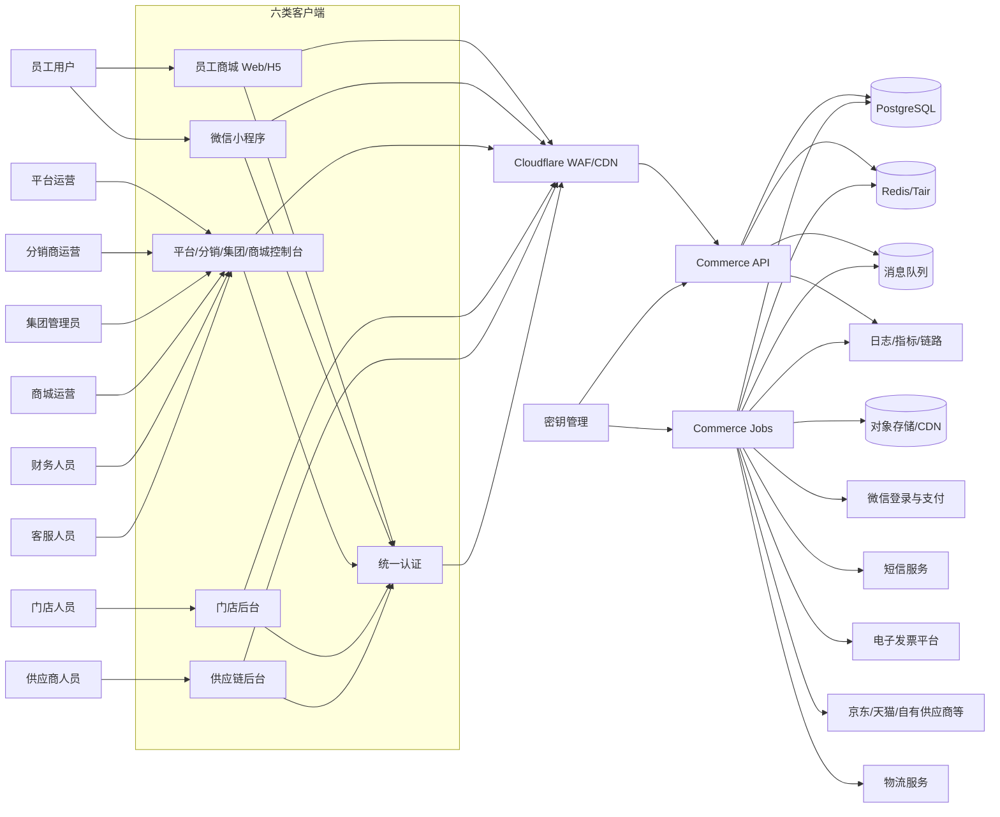

### 3.2 生产部署图

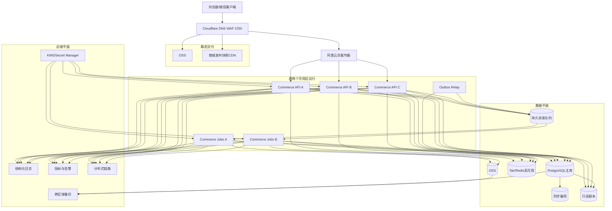

生产环境不再使用Vite Preview或单机PM2作为正式Web服务器。静态前端发布到OSS/CDN，Commerce使用不可变容器镜像运行。

### 3.3 消息与本地集成基础设施唯一合同

- 持久消息队列的目标协议是 AMQP 0-9-1，本地与生产基线实现是 RabbitMQ Quorum Queue；业务模块只依赖`foundation/messaging/MessageBroker.ts`，唯一技术绑定是`adapter/messaging/RabbitMessageBroker.ts`与`bootstrap/Container.ts`。替换 Broker 只允许新增 Adapter 并通过同一 Broker Contract Test，不得修改 Domain/Application。
- PostgreSQL 的 Aggregate、Outbox、Inbox Receipt、Effect Receipt、Job Lease 是业务事实与幂等真值；RabbitMQ 只是至少一次传输媒介，不得用 Broker Ack 代替 Owner 事务或 Consumer Receipt。Relay 按`aggregateKey + aggregateVersion`保序发布，Consumer 先以`consumerId + eventId + sourceEventId`获取 Receipt，再在同一 Owner UoW 中写效果与 Receipt。
- Shop 根唯一本地拓扑文件是`infrastructure/container/compose.yml`，服务名恰好为`postgres`、`redis`、`minio`、`queue`。镜像名与不可变 Digest 只在`infrastructure/container/images.lock.yml`定义；Compose的四个`image`字段只允许`${POSTGRES_IMAGE:?}`、`${REDIS_IMAGE:?}`、`${MINIO_IMAGE:?}`、`${QUEUE_IMAGE:?}`，不复制第二份版本。`Database.ts`验证Lock后把这四值注入临时600权限Env File，`Generated.ts`双向比较Lock Key与Compose变量集合。四服务都必须有健康检查、项目级隔离Volume、本机回环动态端口和有界停止。
- 集成运行器每次生成唯一 Compose Project Name与临时600权限 Env File，启动后用`docker compose port`获取动态端口并通过生成的Test Config传给测试；Env File不进仓库、不进Evidence，finally必须收集脱敏日志后`down --volumes --remove-orphans`。不得依赖已存在的全局容器、固定端口或开发者手工预置队列。
- 原`infrastructure/local/docker-compose.yml`与`postgres-init.sh`是迁移输入，分别重写到`infrastructure/container/compose.yml`与`infrastructure/container/postgres-init.sh`；`.env.local`、`secrets.local.json`、`.tls/**`和`data/**`不进入目标树，在FileDisposition完成Hash/种类登记、所有调用点归零和必要的凭据旋转后删除。

---

## 4. 业务层级和安全边界

### 4.1 唯一组织层级

```text
智慧翼平台 Platform
├─ 分销商 Distributor（可选）
│  └─ 客户平台实例 Tenant
└─ 客户平台实例 Tenant
   └─ 集团 Enterprise
      ├─ 商城 Mall
      └─ 部门 Department
         └─ 子部门
```

- 需求表“平台层”是智慧翼全局运营层。
- “分销层”对应Distributor。
- 平台/分销页面中的“平台中心”实际管理Tenant。
- Tenant是硬安全边界。
- 集团对应Enterprise，商城对应Mall。
- Department只能属于Enterprise或Department。
- Supplier、Brand和Store不是组织树节点。

### 4.2 合作资源图

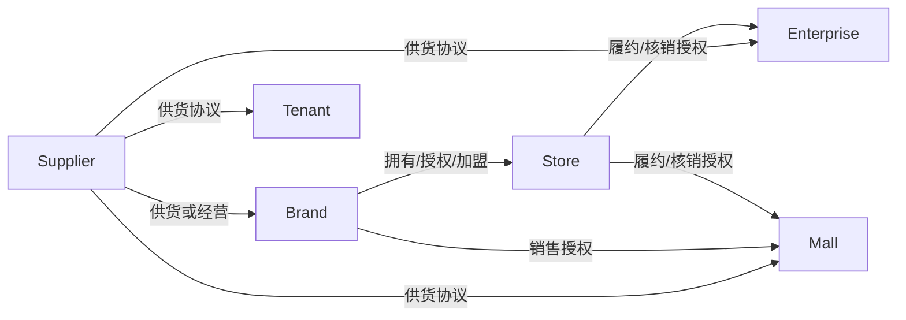

同一个真实供应商、品牌或门店只创建一个全球主体，通过`PartnerEnrollment`、`Agreement`、`BrandAuthorization`和`StoreAuthorization`进入租户范围。

### 4.3 统一访问上下文

```ts
interface AccessContext {
  actorId: string
  membershipId: string
  target: 'console' | 'storefront' | 'store' | 'supplier'
  anchor:
    | 'platform'
    | 'distributor'
    | 'tenant'
    | 'enterprise'
    | 'mall'
    | 'department'
    | 'supplier'
    | 'brand'
    | 'store'
    | 'self'
  anchorId?: string
  tenantId?: string
  permissions: ReadonlySet<string>
  denies: ReadonlySet<string>
  authzVersion: number
  capabilityVersion: number
  assurance: 'basic' | 'verified' | 'stepup'
  requestId: string
}
```

授权公式：

```text
允许 =
有效身份与会话
∧ 有效Membership
∧ 有效组织或合作关系
∧ 套餐能力已开通且配额足够
∧ 角色具有权限
∧ 不存在明确拒绝
∧ 服务端证明资源位于数据范围
∧ 满足StepUp、职责分离和风控要求
```

浏览器只提交资源ID。`tenantId`、`mallId`、角色、权限和组织路径不能作为可信授权依据。

“直接进入下级平台管理”使用短期委托会话：

- 默认只读。
- 记录原身份、目标、原因和有效期。
- 权限是原权限、目标权限和允许委托权限的交集。
- 委托人不能审批自己发起的操作。
- 页面持续显示代管状态。
- 审计同时记录原身份和目标身份。

---

## 5. 限界上下文地图

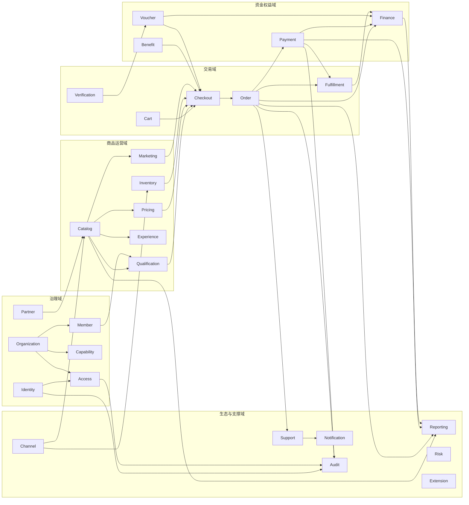

箭头表达公开契约或领域事实的流向，不允许直接读取对方内部表。

---

## 6. 完整模块设计

### 6.1 治理域

| 模块 | 聚合根 | 核心用例 | 主要事件 | 对应需求 |
|---|---|---|---|---|
| `identity` | Identity、Credential、Session、Challenge、Invitation | 注册、登录、微信绑定、改密、找回、OTP、TOTP、撤销会话；消费Access的Enrollment事件创建邀请 | IdentityRegistered、SessionCreated、SessionRevoked | 登录、账号、安全中心、个人信息 |
| `organization` | Tenant、OrgUnit | 平台、分销商、客户平台、集团、商城、部门、管理员绑定 | OrgUnitChanged | 平台中心、分销中心、应用、组织机构 |
| `access` | Membership、MembershipEnrollment、Role、Delegation | 角色、权限、范围、明确拒绝、StepUp、委托、一次入会预授权 | MembershipEnrollmentCreated、AccessVersionChanged | 用户、角色、管理员、数据范围 |
| `capability` | Package、Assignment | 套餐、菜单、功能、配额、启停、下发 | CapabilityChanged | 套餐、菜单授权、功能开通 |
| `partner` | Supplier、Brand、Store、Agreement | 供应商、品牌、门店、商户、合同、授权 | PartnerEnrolled、AgreementChanged | 供应商、门店、自有供应商、线下商户 |
| `member` | MemberProfile、LoyaltyAccount | 会员导入、分组、等级、积分、客户档案 | MemberChanged | 商城用户、客户管理、会员等级 |

Access入会公开决策只有`public/AccessDecisionPort.ts`；旧`AccessPort.ts`不作move而是delete/rewrite。注册链固定为`Access CreateMembershipEnrollmentHandler + Access UoW/Outbox → MembershipEnrollmentCreated(E76) → Identity MembershipEnrollmentCreatedInboxHandler建Invitation → RegisterIdentity/IdentityRegistered(E75) → Access IdentityRegisteredInboxHandler消费Enrollment建Membership`；Member导入则以`MemberImported(E73)`由Access建Invited Membership。Role/Scope快照始终只存Access，Identity只保存opaque enrollmentRef。

### 6.2 商品与运营域

| 模块 | 聚合根 | 核心用例 | 主要事件 | 对应需求 |
|---|---|---|---|---|
| `qualification` | EligibilityPolicy、PurchaseLimit | 资格规则、限售、审批、预览、仿真、回滚 | QualificationDecided、QualificationPolicyChanged | 员工资格、限售、城市/供应商/品牌条件 |
| `catalog` | Product、Sku、CatalogPool、Listing、CategoryTree | 商品、分类、商品池、上下架、组合池 | ProductChanged、ListingPublished、ListingUnpublished | 平台商品、自有商品、分类、商品池 |
| `pricing` | Offer、PriceBook、PriceQuote | 成本、税、服务费、各层加价、利润快照 | PriceQuoted、PriceRulePublished | 一件代发、集采、代理价格、三价查询 |
| `inventory` | StockItem、Reservation | 库存、预占、提交、释放、过期、回补 | StockReserved、StockCommitted、StockChanged | 商品库存、自动上下架、退款回补 |
| `experience` | MallApplication、Page、Form、SceneTemplate | 商城申请、装修、页面、专题、表单、版本发布 | ExperiencePublished | 多商城、装修、微页面、PC首页、场景模板 |
| `marketing` | Campaign、LotteryCampaign、AffiliateProgram | 特惠、优惠券活动规则、抽奖、分销员、奖励；券事实只归Voucher | CampaignChanged、CampaignApplied、CampaignBudgetChanged | 商城营销、分销、金融营销 |

### 6.3 交易域

| 模块 | 聚合根 | 核心用例 | 主要事件 | 对应需求 |
|---|---|---|---|---|
| `cart` | Cart | 加购、改数量、选择、删除、重验 | CartChanged | 购物车 |
| `checkout` | CheckoutQuote | 报价、确认、幂等下单协调 | QuoteCreated、QuoteConfirmed | 资格、价格、库存、券和福利组合结算 |
| `order` | Order、AfterSaleCase | 下单、取消、收货、批量下单、售后 | OrderPlaced、OrderCancelled、AfterSaleOpened、AfterSaleApproved | 商品订单、售后、导出、批量下单 |
| `fulfillment` | FulfillmentOrder、Shipment、Return | 拆单、供应商下单、发货、物流、签收、退货 | FulfillmentRequested、FulfillmentShipped、FulfillmentDelivered、FulfillmentFailed | 供应商订单、门店履约、物流 |
| `verification` | MemberCodeChallenge、VerificationSession | 动态翼码、扫码、券码核验、设备授权 | CodeVerified、CodeRejected | 门店核销、翼码、消费记录 |

### 6.4 资金与权益域

| 模块 | 聚合根 | 核心用例 | 主要事件 | 对应需求 |
|---|---|---|---|---|
| `payment` | PaymentIntent、PaymentAttempt、Refund、RefundLeg、Recovery | 内部支付、微信支付、混合支付、退款、主动查单 | PaymentCaptured、PaymentFailed、PaymentRefunded、LatePaymentRecoveryOpened、RefundRecoveryOpened | 支付、退款、支付渠道配置 |
| `voucher` | VoucherProgram、CardPool、ReserveRequest、IssueBatch、Voucher、Redemption | 卡号池、备券、审批、发行、激活、核销、冲正 | VoucherIssued、VoucherReserved、VoucherRedeemed、VoucherReversed | 全部卡券中心需求 |
| `benefit` | BenefitPlan、Budget、GrantBatch | 福利计划、预算、批量发放、到期、撤销 | BenefitGranted、BenefitDebited、BenefitRestored、BenefitExpired | 移动分发、企业福利发放 |
| `finance` | Account、Journal、Reconciliation、Settlement、Withdrawal、InvoiceRequest | 复式账务、充值、对账、结算、分账、提现、发票 | EntryPosted、DifferenceResolved、SettlementApproved、PeriodClosed、InvoiceIssued | 各层财务、供应商/门店账务 |

Finance内部划分：

```text
finance/
  accounting/
  reconciliation/
  settlement/
  invoice/
```

### 6.5 生态和支撑域

| 模块 | 聚合根 | 核心用例 | 主要事件 | 对应需求 |
|---|---|---|---|---|
| `channel` | ChannelConnection、SyncRun、RemoteOrder | 渠道配置、同步、外部下单、回调、对账 | OfferSynced、StockSynced、ChannelSettlementReceived、SyncCompleted | 接口表20个渠道 |
| `support` | Conversation、Ticket、AssignmentRule | 在线客服、工单、分派、SLA、升级 | TicketOpened、TicketAssigned、TicketEscalated | 客服中心、工单 |
| `notification` | Template、Dispatch、Announcement | 短信、站内信、微信消息、公告、下载通知 | NotificationDelivered、NotificationFailed | 消息提醒、短信、公告 |
| `reporting` | Projection、ExportJob | 各层驾驶舱、排名、统计、异步导出 | ProjectionAdvanced、ExportCompleted | 数据大屏和统计 |
| `risk` | RiskPolicy、RiskCase、WhitelistEntry | 用户、行为、价格和交易风控 | RiskCaseOpened、RiskDecisionMade | 风控、白名单 |
| `audit` | AuditRecord、LoginRecord | 操作、登录、授权和敏感字段审计 | AuditRecorded | 系统日志、审计导出 |
| `extension` | Extension、Installation | 插件注册、安装、启停、健康检查 | ExtensionEnabled、ExtensionDisabled、ExtensionUpgraded | 插件管理、渠道/支付插件 |

---

## 7. 各模块内部数据流

### 7.1 写命令统一时序

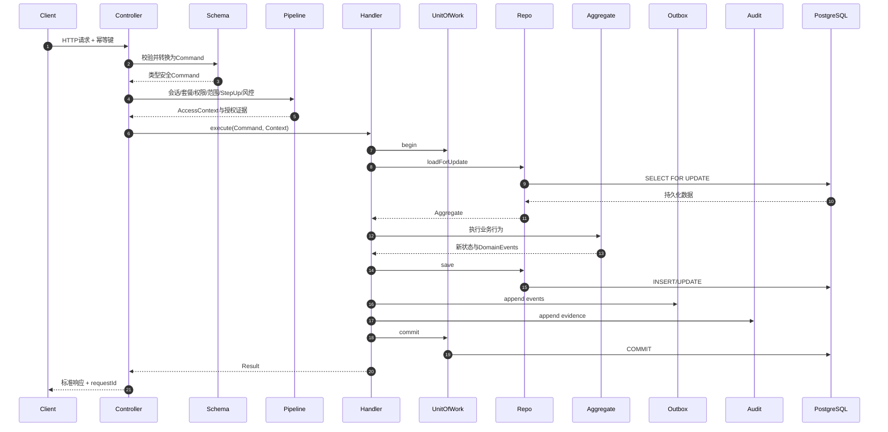

### 7.2 查询统一时序

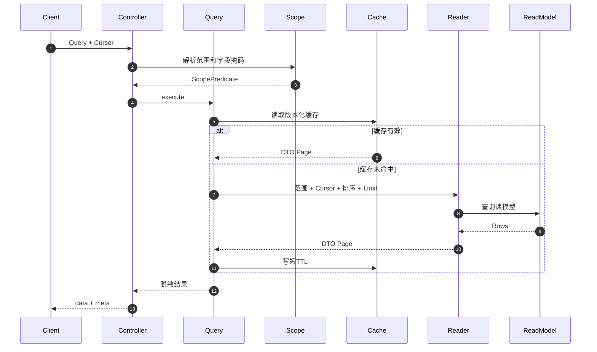

### 7.3 模块流向总表

| 模块 | 输入 | 内部处理 | 权威存储 | 输出 |
|---|---|---|---|---|
| Identity | 凭据、微信Code、OTP | 限流→身份匹配→凭据校验→会话 | identity | SessionCreated |
| Organization | 层级命令 | 父子合法性→防环→增量闭包 | organization | OrgUnitChanged |
| Access | Session和资源ID | Membership→角色→拒绝→范围→StepUp | access | AccessVersionChanged |
| Capability | 套餐和配额 | Assignment→Feature→Quota | capability | CapabilityChanged |
| Partner | 主体和协议 | 主体去重→Enrollment→协议生效 | partner | AgreementChanged |
| Member | 身份ID和租户 | 资料→分组→等级→积分 | member | MemberChanged |
| Qualification | 会员、资源和规则 | Specification→决策→证据快照 | qualification | QualificationDecided |
| Catalog | 自有或渠道商品 | 规范化→去重→分类→审核→Listing | catalog | ListingPublished |
| Pricing | Offer和规则 | 优先级→舍入→毛利→快照 | pricing | PriceQuoted |
| Inventory | 观察和预占命令 | 行锁→可售检查→Reservation状态机 | inventory | StockChanged |
| Experience | 商城草稿 | Schema→资源→商品池→不可变版本 | experience | ExperiencePublished |
| Marketing | 活动和人群 | 资格→预算→优惠/佣金规则 | marketing | CampaignChanged |
| Cart | 商品和数量 | 可见性→数量规范化→合并 | cart | CartChanged |
| Checkout | Cart和确认 | 并行报价→强一致重验→事务协调 | checkout | QuoteConfirmed |
| Order | 快照和状态命令 | 聚合状态机→售后策略 | ordering | OrderPlaced |
| Fulfillment | 已支付订单 | 拆分→异步下单→物流/退货质检 | fulfillment | FulfillmentRequested、ReturnInspected |
| Verification | 动态翼码和设备 | 验签→范围→单次消费→核验 | verification | CodeVerified |
| Payment | 支付意图/回调 | 验签→Inbox→状态机→退款分配 | payment | PaymentCaptured |
| Voucher | 卡号/批次/核销 | 锁券→状态→核销或冲正 | voucher | VoucherRedeemed |
| Benefit | 计划/预算/名单 | 人群快照→审批→分片发放 | benefit | BenefitGranted |
| Finance | 资金和结算事实 | Journal→对账→结算→发票 | finance | EntryPosted |
| Channel | Provider报文 | 验签→防腐转换→游标/映射 | channel | OfferSynced |
| Support | 消息和工单 | 会话→分派→SLA→升级 | support | TicketAssigned |
| Notification | 业务事件 | 模板→偏好→通道→重试 | notification | NotificationDelivered |
| Reporting | 领域事件 | Inbox→事实投影→聚合→缓存 | reporting | ProjectionAdvanced |
| Risk | 行为和规则 | Signal→Policy→Decision→Case | risk | RiskDecisionMade |
| Audit | 命令元数据 | 脱敏→摘要→追加写 | audit | AuditRecorded |
| Extension | 签名Manifest | 校验→安装→能力注册→健康 | extension | ExtensionEnabled |

---

## 8. 关键端到端调用时序

### 8.1 登录与会话

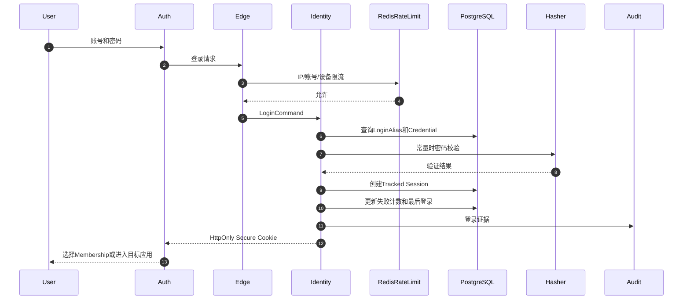

规则：

- 浏览器不得判断OTP、TOTP或StepUp是否正确。
- 浏览器不得生成后台票据。
- 登录错误不能泄露账号是否存在。
- IP、账号和设备三维限流。
- 管理后台与员工商城使用独立Cookie及签名域。
- 会话必须可追踪、旋转和撤销。

### 8.2 每个请求的授权

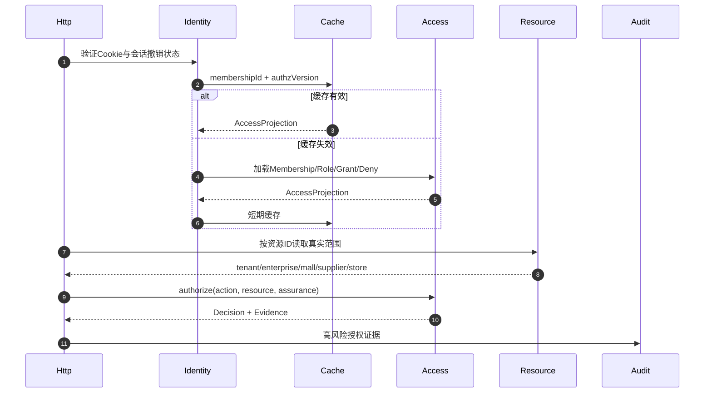

### 8.3 渠道商品同步

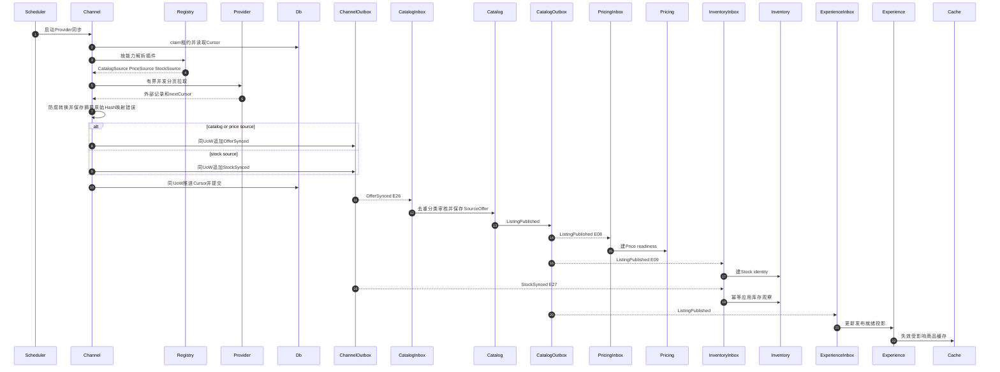

同步规则：

- Product、Sku、供应商Offer、价格和库存必须分离。
- 外部ID只能通过Mapping关联，不能作为内部主键。
- 同一Provider、Mall和资源类型只能有一个活动同步任务。
- 游标与Channel原始证据、规范Event Outbox必须在同一事务推进，不等待下游同步回执。
- 一次供应商缺失只能形成Tombstone或待确认状态，不能直接删除已售商品。
- 渠道数据不得覆盖商城人工治理字段。
- 公共商品查询不得在请求时调用供应商接口。
- Catalog不得同步写Pricing/Inventory，也不得发布未登记`CatalogChanged`；ListingPublished、OfferSynced、StockSynced是唯一跨Owner驱动。
- E09的唯一Inventory消费落点是`services/commerce/src/modules/inventory/application/consumer/ListingPublishedInboxHandler.ts`；`InventoryModule.ts`必须显式注册该Handler，`services/commerce/tests/message/inventory/ListingPublishedInboxHandler.test.ts`覆盖重复投递、乱序、Listing版本推进和只建Stock Identity不覆盖库存事实。Handler、Module注册或测试任一缺失都视为E09断链。

### 8.4 商城草稿与发布

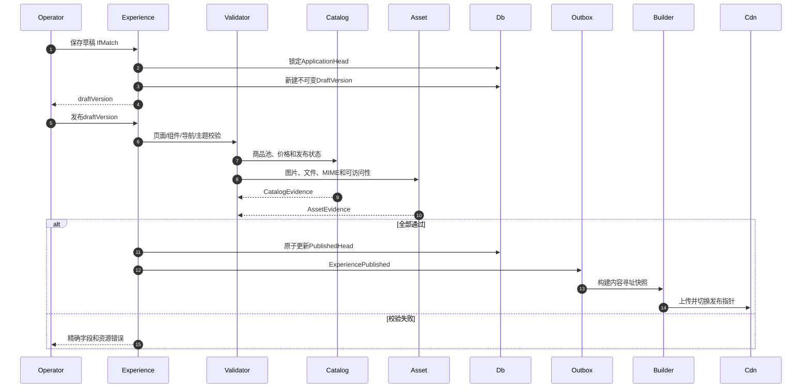

历史恢复不是修改旧版本，而是复制历史内容形成新版本后再次发布。

### 8.5 购物车与结算预览

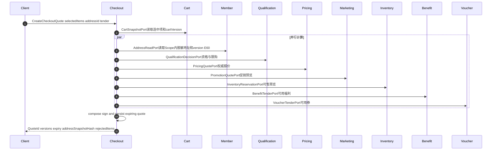

预览只是Checkout报价，Cart不编排其他Owner。Confirm时重新校验Cart/Address/Policy/Price/Promotion/Stock/Tender Version并保存不可变地址快照，不能信任客户端金额或地址正文。

### 8.6 创建订单和库存预占

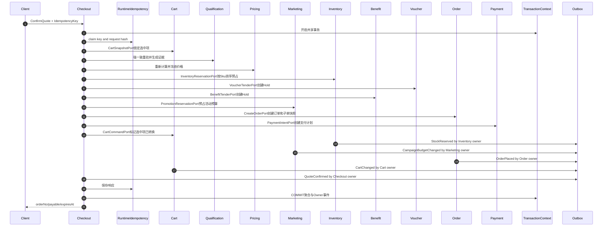

数据库事务中不得调用微信、短信、物流或供应商HTTP接口。Checkout只协调公开Port；E57由Checkout调用Marketing的`PromotionReservationPort`预占预算，E44由Payment在捕获时提交、取消时释放。每个Owner Handler在共享TransactionContext中锁写自己的表并追加自己的事件，Checkout不得直写Cart/Order/Inventory/Marketing表或冒充其Publisher。

### 8.7 混合支付和微信回调

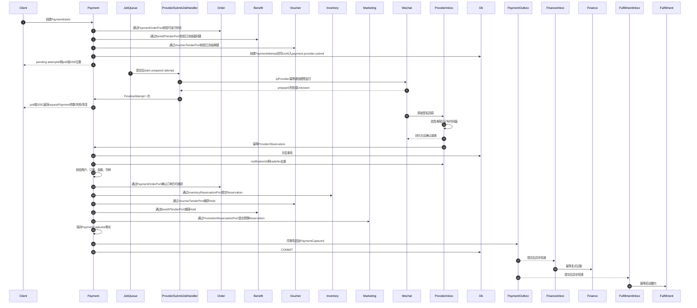

只有Provider Inbox完成持久化后才能向微信确认接收；只有PaymentOrderPort、BenefitTenderPort、VoucherTenderPort、InventoryReservationPort和PromotionReservationPort全部在统一TransactionContext中成功提交，Payment才能发布`PaymentCaptured`。任一腿失败时不得发布最终捕获事件；若Provider已经出现真实入账，则发布`LatePaymentRecoveryOpened`进入Suspense与恢复，而不是让悬挂Hold进入履约。客户端支付成功回调只是观察，不是支付凭证。Payment不改Order表、不写Finance表，Finance与Fulfillment只通过各自Inbox消费规范事件。

### 8.8 取消、超时和迟到支付

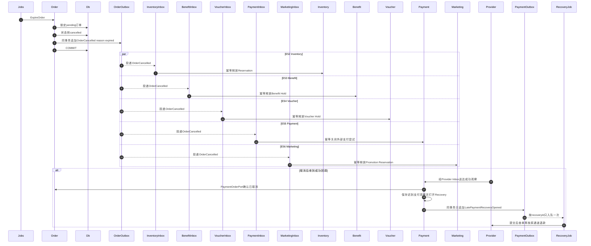

迟到的成功支付不得重新激活已取消订单，只能进入自动退款或人工异常处理。OrderExpiryJob不发布第二个`OrderExpired`别名，只提交`ExpireOrder`并由Order发布`OrderCancelled(reason=expired)`。Inventory、Benefit、Voucher、Payment、Marketing分别通过E52—E56独立Inbox补偿；PurchaseProcess不消费该事件。各Owner只改自己的聚合与表，Duplicate、OutOfOrder、Replay必须证明第二次效果为零。

### 8.9 售后和退款

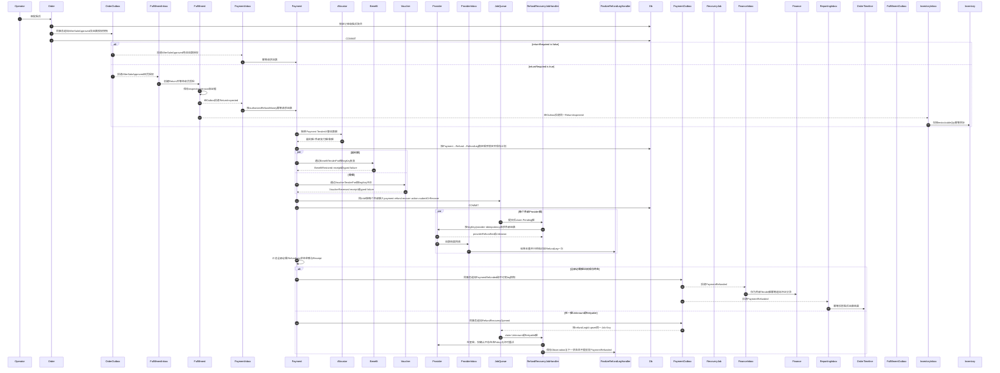

退款累计金额不得超过对应Payment Tender分配；Payment拥有退款事实，Order拥有售后聚合，Fulfillment拥有退货质检事实，Reporting只把`PaymentRefunded`写入非权威订单时间线投影，Inventory只在`ReturnInspected`到达后按restockableQty回补。`AfterSaleApproved`中`returnRequired=false`才可直接触发退款；需退货时必须等质检事件，审核通过绝不等于退款完成。

Finance的Economic Leg Owner固定为：外部Provider捕获/退款只由`PaymentCaptured/PaymentRefunded`记账；券发行/核销/冲正只由`VoucherIssued/VoucherRedeemed/VoucherReversed`记账；福利授予/扣减/恢复只由`BenefitGranted/BenefitDebited/BenefitRestored`记账；迟到真实入账只由`LatePaymentRecoveryOpened`进Suspense。`RefundRecoveryOpened`没有新增资金效果，Finance不得订阅。所有事件可携带全量Tender Snapshot用于对账，但PostingPolicy必须以`economicLegId + accountingOwnerEventId + sourceAggregateVersion`拒绝跨Owner双记账。迟到款最终退款必须在RefundLeg和`PaymentRefunded`带`recoveryId/suspenseJournalId/recoveryKind=latecapture`，Finance只冲原Suspense，不再生成正常收入与普通退款；普通退款必须引用原Capture Journal且`recoveryId=null`。验收要求Suspense归零或保持有Owner/Deadline的Open状态，收入/退款均不重复，Crash/Replay结果不变。任何模块都不得直写另一Owner的表。

### 8.10 福利批量发放

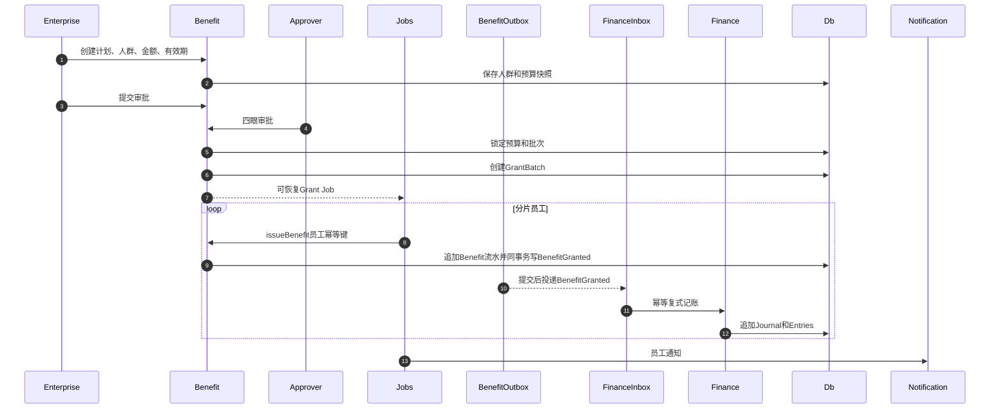

发放批次支持人群快照、预算预检查、分片、断点续跑、逐项失败原因和反向冲正。

### 8.11 卡券发行、翼码与核销

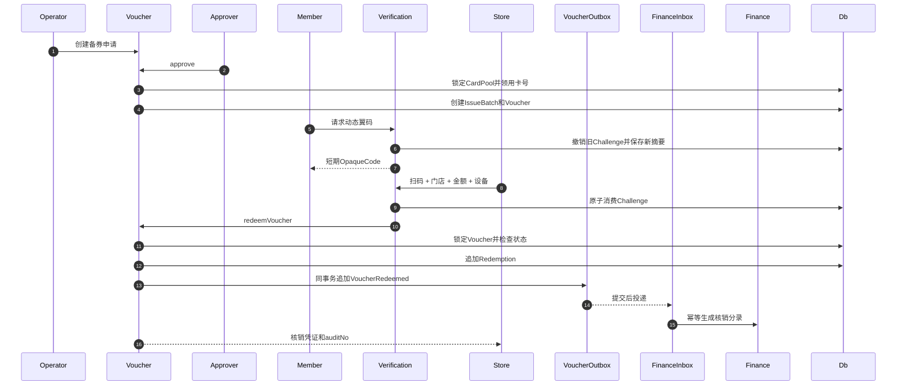

卡号查询索引使用HMAC，可恢复内容使用KMS信封加密，普通列表只显示掩码。

### 8.12 供应商履约

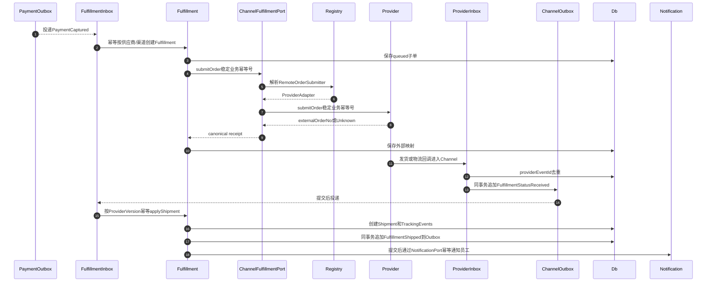

Fulfillment只看Channel拥有的`ChannelFulfillmentPort`与`FulfillmentStatusReceived`，不直接解析Extension或Provider JSON；Channel内部再委托`RemoteOrderSubmitter`。网络超时不能直接判定外部下单失败，应先用稳定业务幂等号主动查询。确定失败由Fulfillment同事务发布`FulfillmentFailed`，Support通过独立Inbox开异常工单，禁止同步跨Owner写Ticket。

### 8.13 对账、结算和发票

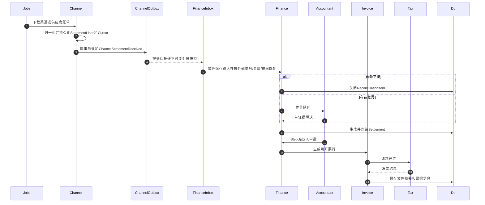

结算行冻结后不能改写，只允许新增Adjustment。发票只能来自已结算且未开票的业务行。

### 8.14 客服

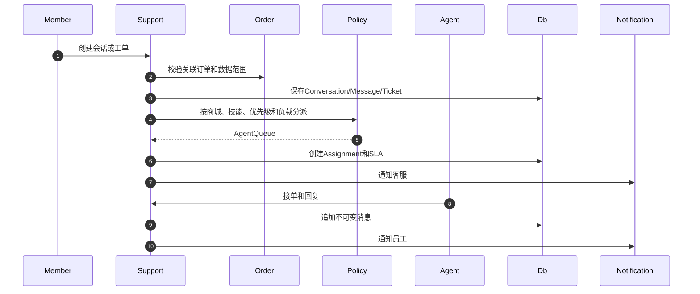

WebSocket或SSE只负责实时提示；数据库消息才是权威事实。

### 8.15 报表

```mermaid
sequenceDiagram
    autonumber
    participant Domain
    participant Outbox
    participant Queue
    participant Projector
    participant ReportDb
    participant Cache
    participant Api
    participant Console

    Domain->>Outbox: 同事务写版本化事件
    Outbox->>Queue: Relay发布
    Queue->>Projector: 至少一次投递
    Projector->>ReportDb: Inbox去重并更新投影
    Projector->>Cache: 失效热点指标
    Console->>Api: 查询驾驶舱
    Api->>Cache: 读取版本化结果
    alt 命中
        Cache-->>Api: Metrics
    else 未命中
        Api->>ReportDb: 查询预聚合
        Api->>Cache: 写短TTL
    end
    Api-->>Console: 指标、口径、截至时间和版本
```

报表不得在请求时扫描订单、支付或流水主表；财务结算也不得读取报表投影。

---

## 9. 状态机与业务不变量

### 9.1 库存预占

```mermaid
stateDiagram-v2
    [*] --> active
    active --> committed: 支付成功
    active --> released: 取消或支付失败
    active --> expired: 超时
    committed --> [*]
    released --> [*]
    expired --> [*]
```

```text
available = onhand - reserved
```

- `active → committed`：`onhand`和`reserved`同时减少。
- `active → released/expired`：只减少`reserved`。
- 退货验收入库：新增Movement并增加`onhand`。
- 重复提交、释放和过期必须幂等。

### 9.2 订单四条正交状态

| 维度 | 状态 |
|---|---|
| OrderState | created、confirmed、cancelled、closed |
| PaymentState | unpaid、partial、paid、refunding、partialrefund、refunded |
| FulfillmentState | unallocated、allocating、awaitingshipment、partialshipment、shipped、delivered |
| AfterSaleState | none、active、completed |

不再用单一`orders.status`表达支付、履约、退款和售后所有组合。

### 9.3 支付状态

```mermaid
stateDiagram-v2
    [*] --> created
    created --> pendingprovider
    pendingprovider --> succeeded
    pendingprovider --> failed
    pendingprovider --> closed
    succeeded --> [*]
    failed --> [*]
    closed --> [*]
```

### 9.4 退款状态

```mermaid
stateDiagram-v2
    [*] --> requested
    requested --> approved
    approved --> processing
    processing --> succeeded
    processing --> partial
    processing --> failed
    succeeded --> [*]
    partial --> processing
    failed --> processing: 重试或人工修复
```

### 9.5 卡券状态

```text
prepared → reserved → issued → activated → redeemed

prepared/reserved/issued/activated → void
issued/activated → disabled
activated → expired
redeemed → reversed
```

任何卡券变化都写不可变状态事件。

### 9.6 其他状态机

| 聚合 | 状态 |
|---|---|
| MallVersion | draft → validating → published → retired |
| Product | draft → reviewing → published → suspended → retired |
| Listing | pending → active → withdrawn |
| AfterSaleCase | requested → reviewing → approved/rejected → returning → refunding → completed |
| Fulfillment | queued → submitted → accepted → shipping → delivered / failed |
| Settlement | draft → calculated → reconciling → reviewed → approved → paying → closed |
| Invoice | requested → reviewing → approved → issuing → issued / rejected / red |
| Ticket | open → assigned → waitingcustomer/waitingagent → resolved → closed / reopened |
| SyncRun | queued → running → completed / partial / failed / dead |
| Extension | available → installed → enabled → disabled → removed |

### 9.7 必须证明的业务不变量

```text
所有Journal借方总额 = 贷方总额
福利余额 = Ledger重放结果
可用库存 = onhand - reserved
onhand >= 0
reserved >= 0
一份active Reservation只能提交或释放一次
一个幂等键只能创建一张订单
一个Provider通知只能产生一次业务效果
退款累计金额 <= 对应支付分配
一张Voucher最多存在一次有效核销
核销冲正不能删除原核销记录
一个订单行不能重复结算
一个订单行不能重复开票
商城PublishedHead必须指向有效不可变版本
Membership不能跨越授权资源范围
Supplier/Store访问必须存在有效Agreement
客户端金额、权限和状态不得作为权威输入
```

---

## 10. 数据库设计

### 10.1 Schema所有权

| Schema | 核心表 |
|---|---|
| `identity` | identities、credentials、login_aliases、sessions、external_identities、challenges、recovery_tokens |
| `organization` | tenants、distributors、org_units、org_closure、manager_bindings |
| `access` | memberships、roles、permissions、role_permissions、scope_grants、permission_denies、delegations |
| `capability` | packages、features、package_features、assignments、quotas、menu_nodes |
| `partner` | partners、supplier_profiles、brand_profiles、store_profiles、enrollments、agreements、authorizations |
| `member` | member_profiles、member_groups、levels、point_accounts、point_entries |
| `qualification` | policies、policy_versions、facts、decisions、purchase_limits、change_requests |
| `catalog` | products、skus、categories、category_closure、pools、pool_items、listings、media、source_mappings |
| `pricing` | offers、price_books、price_entries、markup_rules、service_fee_rules、tax_rules、snapshots |
| `inventory` | stock_items、reservations、movements、observations、sync_states |
| `experience` | applications、versions、pages、components、forms、topics、themes、publications |
| `marketing` | campaigns、campaign_rules、lotteries、affiliates、commission_entries；Voucher Program只保存引用，不复制券事实 |
| `cart` | carts、cart_items |
| `checkout` | checkout_quotes、quote_lines、purchase_processes |
| `ordering` | orders、suborders、order_lines、order_transitions、aftersales、aftersale_items |
| `fulfillment` | fulfillment_orders、supplier_orders、shipments、shipment_items、tracking_events、returns |
| `verification` | devices、challenges、sessions、attempts、verification_records |
| `payment` | intents、attempts、allocations、provider_observations、refunds、refund_legs；运输防重引用runtime.inbox_receipts |
| `voucher` | programs、card_pools、card_secrets、reserve_requests、issue_batches、vouchers、redemptions、reversals |
| `benefit` | plans、budgets、grant_batches、grant_items、benefit_lots |
| `finance` | accounts、holds、journals、entries、reconciliations、settlements、adjustments、payouts、withdrawals |
| `invoice` | profiles、requests、invoice_lines、invoices、red_invoices、documents |
| `channel` | connections、credential_refs、capabilities、sync_runs、cursors、external_mappings、calls、webhook_observations；运输防重引用runtime.inbox_receipts |
| `support` | conversations、messages、tickets、assignments、sla_events |
| `notification` | templates、preferences、dispatches、attempts、announcements |
| `reporting` | facts、daily_metrics、rankings、projections、export_jobs |
| `risk` | policies、signals、decisions、cases、whitelists |
| `audit` | audit_records、login_records、sensitive_access_records |
| `extension` | extensions、manifests、installations、settings、health_records |
| `runtime` | outbox_messages、inbox_receipts、effect_receipts、deadletters、job_leases、idempotency_records、projection_offsets、schema_versions；只拥有运输/租约/幂等元数据，不解释业务Observation |

### 10.2 数据库硬规则

- 所有租户业务表包含`tenant_id`。
- 唯一索引必须包含租户范围。
- 跨租户外键使用包含`tenant_id`的组合约束。
- 应用数据库角色不得拥有`BYPASSRLS`。
- 每个事务设置服务端租户上下文，RLS默认拒绝。
- 新主键使用可排序全局ID，业务号与主键分离。
- 金额使用`bigint`分，时间统一UTC。
- 可编辑聚合拥有`version bigint`。
- Ledger、Audit、Outbox和状态历史只追加。
- PII使用KMS信封加密，可检索字段使用HMAC索引。
- 已发布迁移永远不可原地修改，只允许追加修复迁移。
- 数据库保存约束、锁和原子原语，不复制完整业务状态机。

### 10.3 全局LockRank

| Rank | 可锁资源 | 同类排序键 |
| ---: | --- | --- |
| 10 | Inbox Receipt / Idempotency / PurchaseProcess | semanticKey |
| 20 | Cart | cartId |
| 30 | Qualification Counter | policyId、subjectId |
| 40 | Existing Order / AfterSale / Return | orderId、afterSaleId、returnId |
| 50 | Inventory StockItem / Reservation | skuId、reservationId |
| 60 | Voucher / Voucher Reservation | voucherId |
| 70 | Benefit Account / Lot | accountId、lotId |
| 80 | Marketing Budget / Reservation | campaignId、reservationId |
| 90 | PaymentIntent / Attempt | paymentId、attemptId |
| 100 | Refund / RefundLeg | refundId、legId |
| 110 | Finance Account | accountId |

共享事务先收集LockIntent，再由唯一`LockCoordinator`按Rank和同类ID一次加锁。Pricing Quote、Member Address Snapshot等纯读不加锁；新Order和append-only Journal/Entry/Outbox/Audit只依靠同事务唯一约束，不成为反向锁点。Checkout为`10→20→30→50→60→70→80→新Order→新Payment`，Capture为`10→40→50→60→70→80→90`，Refund为`10→90→100`，Finance独立为`Inbox→110→append`。Rank下降、同类未排序或Consumer跨Owner共享事务都由Runtime Guard和并发测试拒绝。

---

## 11. Outbox、Inbox和异步任务

### 11.1 Outbox结构

```text
id
tenant_id
aggregate_type
aggregate_id
aggregate_version
topic
event_type
event_version
payload
headers
status
available_at
attempts
locked_by
locked_at
created_at
delivered_at
last_error
```

统一事件Envelope：

```ts
interface EventEnvelope<T> {
  eventId: string
  eventType: string
  aggregateId: string
  aggregateVersion: number
  tenantId?: string
  actorId?: string
  occurredAt: string
  correlationId: string
  causationId?: string
  schemaVersion: number
  payload: T
}
```

语义：

- 至少一次投递，不宣称Exactly Once。
- 通过Inbox实现一次业务效果。
- 同一聚合按`aggregateId`保序，不同聚合并行。
- 失败指数退避并加入随机抖动。
- 最大次数后进入Deadletter。
- Deadletter支持查看、重放、忽略和审计。
- 事件不得包含密钥或完整PII。

### 11.2 Canonical Job Catalog与唯一Handler文件

`definitions/jobs.yml`是唯一事实源；下表是其冻结的人读镜像。目标业务Catalog恰好72项，不等于当前代码的32项：当前32项只进入`JobContinuity.ts`逐项标记`kept|moved|replaced|deletedWithRequirementProof`。每个目标`jobId`恰好生成一个Payload Schema、一个JobHandler、一个Registry Binding、一个Lease/Retry/Deadletter策略、一组测试/Metric/Runbook。Handler只放Owner的`application/job`，统一`JobRunner`负责入口适配，不再建立同语义的`interface/job/*Job.ts`第二套实现。Access明确为0项；Runtime技术Job不计入72项。

下表文件路径均相对`services/commerce/src/`：

| Owner | jobId → Handler → 唯一文件 |
| --- | --- |
| Identity | `identity.session.cleanup` → `SessionCleanupJobHandler` → `modules/identity/application/job/SessionCleanupJobHandler.ts`<br>`identity.challenge.expire` → `ChallengeExpiryJobHandler` → `modules/identity/application/job/ChallengeExpiryJobHandler.ts` |
| Organization | `organization.closure.rebuild` → `ClosureRebuildJobHandler` → `modules/organization/application/job/ClosureRebuildJobHandler.ts`<br>`organization.tree.project` → `TreeProjectionJobHandler` → `modules/organization/application/job/TreeProjectionJobHandler.ts` |
| Access | 无；`jobs.yml`不得出现`access.*` |
| Capability | `capability.quota.reset` → `QuotaResetJobHandler` → `modules/capability/application/job/QuotaResetJobHandler.ts`<br>`capability.usage.project` → `UsageProjectionJobHandler` → `modules/capability/application/job/UsageProjectionJobHandler.ts` |
| Partner | `partner.onboarding.review` → `OnboardingReviewJobHandler` → `modules/partner/application/job/OnboardingReviewJobHandler.ts`<br>`partner.agreement.expire` → `AgreementExpiryJobHandler` → `modules/partner/application/job/AgreementExpiryJobHandler.ts` |
| Member | `member.import` → `ImportMemberJobHandler` → `modules/member/application/job/ImportMemberJobHandler.ts`<br>`member.group.project` → `GroupProjectionJobHandler` → `modules/member/application/job/GroupProjectionJobHandler.ts` |
| Qualification | `qualification.policy.compile` → `PolicyCompileJobHandler` → `modules/qualification/application/job/PolicyCompileJobHandler.ts`<br>`qualification.counter.reset` → `CounterResetJobHandler` → `modules/qualification/application/job/CounterResetJobHandler.ts` |
| Catalog | `catalog.import` → `CatalogImportJobHandler` → `modules/catalog/application/job/CatalogImportJobHandler.ts`<br>`catalog.sync` → `CatalogSyncJobHandler` → `modules/catalog/application/job/CatalogSyncJobHandler.ts`<br>`catalog.search.project` → `SearchProjectionJobHandler` → `modules/catalog/application/job/SearchProjectionJobHandler.ts`<br>`catalog.media.process` → `MediaProcessJobHandler` → `modules/catalog/application/job/MediaProcessJobHandler.ts` |
| Pricing | `pricing.sync` → `PriceSyncJobHandler` → `modules/pricing/application/job/PriceSyncJobHandler.ts`<br>`pricing.quote.warm` → `QuoteWarmJobHandler` → `modules/pricing/application/job/QuoteWarmJobHandler.ts`<br>`pricing.rule.activate` → `RuleActivationJobHandler` → `modules/pricing/application/job/RuleActivationJobHandler.ts` |
| Inventory | `inventory.sync` → `InventorySyncJobHandler` → `modules/inventory/application/job/InventorySyncJobHandler.ts`<br>`inventory.import` → `InventoryImportJobHandler` → `modules/inventory/application/job/InventoryImportJobHandler.ts`<br>`inventory.reservation.expire` → `ReservationExpiryJobHandler` → `modules/inventory/application/job/ReservationExpiryJobHandler.ts` |
| Experience | `experience.asset.process` → `AssetProcessJobHandler` → `modules/experience/application/job/AssetProcessJobHandler.ts`<br>`experience.cdn.warm` → `CdnWarmJobHandler` → `modules/experience/application/job/CdnWarmJobHandler.ts`<br>`experience.publication.verify` → `PublicationVerifyJobHandler` → `modules/experience/application/job/PublicationVerifyJobHandler.ts` |
| Marketing | `marketing.campaign.start` → `CampaignStartJobHandler` → `modules/marketing/application/job/CampaignStartJobHandler.ts`<br>`marketing.campaign.stop` → `CampaignStopJobHandler` → `modules/marketing/application/job/CampaignStopJobHandler.ts`<br>`marketing.draw.run` → `DrawRunJobHandler` → `modules/marketing/application/job/DrawRunJobHandler.ts` |
| Cart | `cart.abandoned.expire` → `AbandonedCartExpiryJobHandler` → `modules/cart/application/job/AbandonedCartExpiryJobHandler.ts` |
| Checkout | `checkout.quote.expire` → `QuoteExpiryJobHandler` → `modules/checkout/application/job/QuoteExpiryJobHandler.ts` |
| Order | `order.expire` → `OrderExpiryJobHandler` → `modules/order/application/job/OrderExpiryJobHandler.ts`<br>`order.aftersale.deadline` → `AfterSaleDeadlineJobHandler` → `modules/order/application/job/AfterSaleDeadlineJobHandler.ts` |
| Fulfillment | `fulfillment.dispatch` → `FulfillmentDispatchJobHandler` → `modules/fulfillment/application/job/FulfillmentDispatchJobHandler.ts`<br>`fulfillment.tracking.poll` → `TrackingPollJobHandler` → `modules/fulfillment/application/job/TrackingPollJobHandler.ts`<br>`fulfillment.return.recover` → `ReturnRecoveryJobHandler` → `modules/fulfillment/application/job/ReturnRecoveryJobHandler.ts` |
| Verification | `verification.challenge.rotate` → `ChallengeRotateJobHandler` → `modules/verification/application/job/ChallengeRotateJobHandler.ts`<br>`verification.receipt.project` → `ReceiptProjectionJobHandler` → `modules/verification/application/job/ReceiptProjectionJobHandler.ts` |
| Payment | `payment.provider.submit` → `ProviderSubmitJobHandler` → `modules/payment_zhifu/application/job/ProviderSubmitJobHandler.ts`<br>`payment.query` → `PaymentQueryJobHandler` → `modules/payment_zhifu/application/job/PaymentQueryJobHandler.ts`<br>`payment.refund.recover` → `RefundRecoveryJobHandler` → `modules/payment_zhifu/application/job/RefundRecoveryJobHandler.ts`（`action=submitOrRecover`，唯一处理Pending初次提交、Unknown先查单、Retryable受控重试）<br>`payment.webhook.replay` → `WebhookReplayJobHandler` → `modules/payment_zhifu/application/job/WebhookReplayJobHandler.ts` |
| Voucher | `voucher.card.import` → `CardImportJobHandler` → `modules/voucher/application/job/CardImportJobHandler.ts`<br>`voucher.expire` → `VoucherExpiryJobHandler` → `modules/voucher/application/job/VoucherExpiryJobHandler.ts`<br>`voucher.reservation.recover` → `ReservationRecoveryJobHandler` → `modules/voucher/application/job/ReservationRecoveryJobHandler.ts` |
| Benefit | `benefit.grant` → `BenefitGrantJobHandler` → `modules/benefit/application/job/BenefitGrantJobHandler.ts`<br>`benefit.expire` → `BenefitExpiryJobHandler` → `modules/benefit/application/job/BenefitExpiryJobHandler.ts`<br>`benefit.grant.recover` → `GrantRecoveryJobHandler` → `modules/benefit/application/job/GrantRecoveryJobHandler.ts` |
| Finance | `finance.reconcile` → `ReconciliationJobHandler` → `modules/finance/application/job/ReconciliationJobHandler.ts`<br>`finance.settle` → `SettlementJobHandler` → `modules/finance/application/job/SettlementJobHandler.ts`<br>`finance.invoice` → `InvoiceJobHandler` → `modules/finance/application/job/InvoiceJobHandler.ts`<br>`finance.withdrawal.recover` → `WithdrawalRecoveryJobHandler` → `modules/finance/application/job/WithdrawalRecoveryJobHandler.ts` |
| Channel | `channel.catalog.sync` → `CatalogSyncJobHandler` → `modules/channel/application/job/CatalogSyncJobHandler.ts`<br>`channel.price.sync` → `PriceSyncJobHandler` → `modules/channel/application/job/PriceSyncJobHandler.ts`<br>`channel.inventory.sync` → `InventorySyncJobHandler` → `modules/channel/application/job/InventorySyncJobHandler.ts`<br>`channel.webhook.replay` → `WebhookReplayJobHandler` → `modules/channel/application/job/WebhookReplayJobHandler.ts` |
| Support | `support.sla.tick` → `SlaTickJobHandler` → `modules/support/application/job/SlaTickJobHandler.ts`<br>`support.assignment.auto` → `AutoAssignJobHandler` → `modules/support/application/job/AutoAssignJobHandler.ts`<br>`support.conversation.archive` → `ConversationArchiveJobHandler` → `modules/support/application/job/ConversationArchiveJobHandler.ts` |
| Notification | `notification.dispatch` → `DispatchJobHandler` → `modules/notification/application/job/DispatchJobHandler.ts`<br>`notification.retry` → `RetryJobHandler` → `modules/notification/application/job/RetryJobHandler.ts`<br>`notification.receipt.poll` → `ReceiptPollJobHandler` → `modules/notification/application/job/ReceiptPollJobHandler.ts` |
| Reporting | `reporting.project` → `ProjectionJobHandler` → `modules/reporting/application/job/ProjectionJobHandler.ts`<br>`reporting.backfill` → `BackfillJobHandler` → `modules/reporting/application/job/BackfillJobHandler.ts`<br>`reporting.export` → `ExportJobHandler` → `modules/reporting/application/job/ExportJobHandler.ts` |
| Risk | `risk.scan` → `RiskScanJobHandler` → `modules/risk/application/job/RiskScanJobHandler.ts`<br>`risk.replay` → `RiskReplayJobHandler` → `modules/risk/application/job/RiskReplayJobHandler.ts`<br>`risk.case.escalate` → `CaseEscalationJobHandler` → `modules/risk/application/job/CaseEscalationJobHandler.ts` |
| Audit | `audit.digest` → `DigestJobHandler` → `modules/audit/application/job/DigestJobHandler.ts`<br>`audit.archive` → `ArchiveJobHandler` → `modules/audit/application/job/ArchiveJobHandler.ts`<br>`audit.integrity.scan` → `IntegrityScanJobHandler` → `modules/audit/application/job/IntegrityScanJobHandler.ts` |
| Extension | `extension.health.probe` → `HealthProbeJobHandler` → `modules/extension/application/job/HealthProbeJobHandler.ts`<br>`extension.version.canary` → `VersionCanaryJobHandler` → `modules/extension/application/job/VersionCanaryJobHandler.ts` |

同一`jobs.yml`还包含4项技术Job，使用`kind=technical`，不伪装成第29个业务模块：

| kind / Owner | jobId → Handler → 唯一文件 | 关键语义 |
| --- | --- | --- |
| technical / runtime | `runtime.outbox.relay` → `OutboxRelayJobHandler` → `bootstrap/job/OutboxRelayJobHandler.ts` | 按aggregateKey保序Claim/Publish/Mark；只有当次Publisher Confirm Ack才Mark Published，Confirm Unknown保留Pending并以同一sourceEventId重发，由Owner Inbox Receipt去重 |
| technical / runtime | `runtime.message.recover` → `MessageRecoveryJobHandler` → `bootstrap/job/MessageRecoveryJobHandler.ts` | 回收过期Inbox/Outbox Running Lease；不改变领域状态，只恢复可执行性 |
| technical / runtime | `runtime.idempotency.expire` → `IdempotencyExpiryJobHandler` → `bootstrap/job/IdempotencyExpiryJobHandler.ts` | 仅清理超过Operation Catalog保留期且无活动引用的记录；支付/退款键按最长策略保留 |
| technical / observability | `observability.telemetry.expire` → `TelemetryExpiryJobHandler` → `foundation/telemetry/TelemetryExpiryJobHandler.ts` | 只清理技术Telemetry；Audit、Journal、业务Evidence绝不进入该Job |

CI从`jobs.yml`生成两表并断言`businessJobCount=72`、`technicalJobCount=4`、`totalJobCount=76`及各自Catalog Hash，且`JobRegistry↔JobHandler↔File↔PayloadSchema↔Test↔Metric↔Runbook`全双射。当前32项无论业务或技术都必须进入同一个`JobContinuity.ts`逐项处置；文档中的“PaymentEventJob”“RefundJob”“TrackingJob”或泛化`cleanup`只可出现在历史Source字段，生产目录、Registry和Bundle引用必须为零。

---

## 12. 目标代码目录与命名规范

### 12.1 总体目录

以下是硬切换后的唯一目标结构。目录使用单数、小写英文；TypeScript类、实体、值对象、React组件使用PascalCase；函数、变量、Hook使用camelCase；常量使用UPPERCASE。除工具强制的配置文件、数据库迁移SQL和第三方协议文件外，自有文件及目录名不得出现下划线、连字符、空格或无意义缩写。

~~~text
Shop/
├─ apps/
│  ├─ console/
│  │  ├─ src/
│  │  │  ├─ app/
│  │  │  ├─ route/
│  │  │  ├─ shell/
│  │  │  ├─ feature/
│  │  │  ├─ entity/
│  │  │  ├─ shared/
│  │  │  └─ main.tsx
│  │  ├─ public/
│  │  │  └─ brand/
│  │  │     ├─ brand-mark.svg
│  │  │     ├─ brand-lockup-horizontal.svg
│  │  │     ├─ wing-code-symbol.svg
│  │  │     └─ wing-pattern.svg
│  │  ├─ index.html
│  │  └─ package.json
│  ├─ store/
│  ├─ supplier/
│  ├─ storefront/
│  ├─ auth/
│  │  └─ public/
│  │     └─ brand/
│  │        ├─ brand-mark.svg
│  │        ├─ brand-lockup-horizontal.svg
│  │        ├─ wing-code-symbol.svg
│  │        └─ wing-pattern.svg
│  └─ miniapp/
├─ services/
│  └─ commerce/
│     ├─ src/
│     │  ├─ entry/
│     │  │  ├─ ApiMain.ts
│     │  │  ├─ JobsMain.ts
│     │  │  ├─ MigrationMain.ts
│     │  │  └─ SmokeMain.ts
│     │  ├─ bootstrap/
│     │  │  ├─ Container.ts
│     │  │  ├─ ModuleRegistry.ts
│     │  │  ├─ RouteRegistry.ts
│     │  │  ├─ EventRegistry.ts
│     │  │  ├─ JobRegistry.ts
│     │  │  ├─ ExtensionRegistry.ts
│     │  │  ├─ RuntimeContract.ts
│     │  │  └─ health/
│     │  ├─ foundation/
│     │  │  ├─ application/
│     │  │  ├─ domain/
│     │  │  ├─ persistence/
│     │  │  ├─ messaging/
│     │  │  ├─ interface/
│     │  │  ├─ security/
│     │  │  ├─ performance/
│     │  │  └─ telemetry/
│     │  ├─ adapter/
│     │  │  ├─ database/
│     │  │  ├─ messaging/
│     │  │  ├─ cache/
│     │  │  ├─ network/
│     │  │  ├─ http/
│     │  │  ├─ telemetry/
│     │  │  └─ secret/
│     │  ├─ modules/
│     │  │  ├─ identity/
│     │  │  ├─ organization/
│     │  │  ├─ access/
│     │  │  ├─ capability/
│     │  │  ├─ partner/
│     │  │  ├─ member/
│     │  │  ├─ qualification/
│     │  │  ├─ catalog/
│     │  │  ├─ pricing/
│     │  │  ├─ inventory/
│     │  │  ├─ experience/
│     │  │  ├─ marketing/
│     │  │  ├─ cart/
│     │  │  ├─ checkout/
│     │  │  ├─ order/
│     │  │  ├─ fulfillment/
│     │  │  ├─ verification/
│     │  │  ├─ payment/
│     │  │  ├─ voucher/
│     │  │  ├─ benefit/
│     │  │  ├─ finance/
│     │  │  ├─ channel/
│     │  │  ├─ support/
│     │  │  ├─ notification/
│     │  │  ├─ reporting/
│     │  │  ├─ risk/
│     │  │  ├─ audit/
│     │  │  └─ extension/
│     └─ tests/
│     ├─ package.json
│     ├─ tsconfig.json
│     └─ vitest.config.ts
├─ packages/
│  ├─ contract/
│  ├─ sdk/
│  ├─ kernel/
│  ├─ authz/
│  ├─ design/
│  │  └─ src/
│  │     ├─ tokens.css
│  │     ├─ tokens.json
│  │     ├─ mobile-platforms.json
│  │     └─ brand/
│  │        ├─ brand-mark.svg
│  │        ├─ brand-lockup-horizontal.svg
│  │        ├─ wing-code-symbol.svg
│  │        └─ wing-pattern.svg
│  ├─ telemetry/
│  ├─ config/
│  │  └─ src/
│  │     └─ generated/
│  │        ├─ ApiConfig.ts
│  │        ├─ JobsConfig.ts
│  │        ├─ WebConfig.ts
│  │        ├─ MiniappConfig.ts
│  │        ├─ ProviderConfig.ts
│  │        └─ TestConfig.ts
│  └─ testing/
├─ database/
│  ├─ migrations/
│  ├─ contracts/
│  ├─ fixtures/
│  └─ 04_tools/tools/
├─ extensions/
│  ├─ channel/
│  ├─ payment/
│  ├─ notification/
│  ├─ storage/
│  └─ tax/
├─ tests/
│  ├─ contract/
│  ├─ integration/
│  ├─ journey/
│  ├─ performance/
│  ├─ security/
│  └─ recovery/
├─ infrastructure/
│  ├─ container/
│  ├─ cloud/
│  ├─ network/
│  ├─ monitoring/
│  ├─ backup/
│  └─ security/
├─ 04_tools/tools/
│  ├─ contractgen/
│  ├─ requirementgen/
│  ├─ tokengen/
│  │  ├─ index.ts
│  │  ├─ Generator.ts
│  │  ├─ Schema.ts
│  │  └─ Generator.test.ts
│  └─ quality/
│     ├─ bootstrap.mjs
│     ├─ config/
│     │  ├─ archive.yml
│     │  ├─ bundles.yml
│     │  ├─ cutover.yml
│     │  └─ naming.yml
│     └─ src/
│        ├─ authorization/
│        ├─ authority/
│        ├─ snapshot/
│        ├─ archive/
│        ├─ cutover/
│        ├─ execution/
│        │  ├─ CredentialBroker.ts
│        │  ├─ ProviderCredentialBroker.ts
│        │  ├─ AuthorityMaterializationControl.ts
│        │  └─ ProviderAuthorityMaterializationControl.ts
│        ├─ runtime/
│        ├─ task/
│        └─ audit/
├─ 05_docs_ziliao/docs_wendang/
│  ├─ architecture/
│  ├─ decisions/
│  ├─ operations/
│  │  └─ FileDisposition.yml
│  ├─ requirements/
│  └─ security/
├─ package.json
├─ package-lock.json
├─ tsconfig.json
└─ README.md
~~~

### 12.2 六个客户端的职责

| 应用 | 使用者 | 允许包含 | 禁止包含 |
|---|---|---|---|
| console | 平台、分销商、集团、商城、财务、客服 | 按能力注册工作台；治理、商品、订单、卡券、财务、统计、客服、设置 | 供应商专属操作、门店专属核销、生产Mock |
| store | 门店管理员、店员 | 门店资料、商品、订单、核销、店员、财务、统计、系统设置 | 平台治理、供应商成本、跨门店数据 |
| supplier | 供应商管理员、运营、财务 | 商品、库存、供货订单、物流、售后、对账、结算、人员设置 | 租户内部组织、会员隐私、其他供应商数据 |
| storefront | PC与H5员工用户 | 首页、分类、搜索、详情、购物车、结算、订单、资产、客服 | 管理接口、服务端密钥、本地伪订单 |
| auth | 所有人 | 登录、注册、找回、邀请、强制改密、StepUp、安全中心 | 自行生成可信身份、通用验证码、业务数据 |
| miniapp | 微信用户 | 与storefront同一业务契约，外加微信登录、微信支付、翼码、扫码 | 独立业务规则、与Web不同的状态定义 |

前端共享的是合同、SDK、设计令牌和无业务状态的基础组件；不得共享页面级Store或绕过应用边界直接导入另一应用源码。

### 12.3 前端固定分层

~~~text
src/
├─ app/                 # Provider、错误边界、查询客户端、启动
├─ route/               # 真实URL、守卫、懒加载、404
├─ shell/               # 导航、页框、工作台注册
├─ feature/             # 按用例组织
│  └─ order/
│     ├─ api/
│     ├─ model/
│     ├─ ui/
│     ├─ route/
│     └─ test/
├─ entity/              # 可复用领域展示模型
│  └─ product/
├─ shared/
│  ├─ api/
│  ├─ auth/
│  ├─ config/
│  ├─ form/
│  ├─ i18n/
│  ├─ telemetry/
│  └─ ui/
└─ main.tsx
~~~

依赖方向只能是 app → route/shell → feature → entity → shared。任何反向导入、跨feature深层导入或直接fetch都由静态规则阻断。

### 12.4 后端单模块固定结构

每个限界上下文都使用同一骨架；业务规则不能散落在Controller、SQL拼接器或外部适配器。

~~~text
modules/order/
├─ public/
│  ├─ CreateOrderPort.ts
│  ├─ OrderReadPort.ts
│  ├─ PaymentOrderPort.ts
│  └─ OrderSupportReadPort.ts
├─ domain/
│  ├─ model/
│  │  ├─ Order.ts
│  │  ├─ OrderLine.ts
│  │  └─ AfterSale.ts
│  ├─ value/
│  │  ├─ OrderState.ts
│  │  └─ OrderSnapshot.ts
│  ├─ event/
│  │  ├─ OrderPlaced.ts
│  │  └─ OrderCancelled.ts
│  ├─ policy/
│  │  ├─ OrderPolicy.ts
│  │  └─ AfterSalePolicy.ts
│  ├─ repository/
│  │  ├─ OrderRepository.ts
│  │  └─ AfterSaleRepository.ts
├─ application/
│  ├─ command/
│  │  ├─ CreateOrder.ts
│  │  ├─ CancelOrder.ts
│  │  └─ DecideAfterSale.ts
│  ├─ query/
│  │  ├─ ReadOrders.ts
│  │  ├─ CheckPaymentCapture.ts
│  │  ├─ ReadOrderDetail.ts
│  │  └─ ReadOrderTimeline.ts
│  ├─ handler/
│  │  ├─ CreateOrderHandler.ts
│  │  ├─ CancelOrderHandler.ts
│  │  └─ DecideAfterSaleHandler.ts
│  ├─ dto/
│  │  ├─ OrderPage.ts
│  │  ├─ OrderDetail.ts
│  │  └─ OrderTimeline.ts
│  ├─ port/
│  │  └─ ClockPort.ts
│  └─ job/
│     ├─ OrderExpiryJobHandler.ts
│     └─ AfterSaleDeadlineJobHandler.ts
├─ infrastructure/
│  ├─ persistence/
│  │  ├─ PgOrderRepository.ts
│  │  └─ PgAfterSaleRepository.ts
├─ interface/
│  ├─ http/
│  │  ├─ CancelOrderController.ts
│  │  ├─ DecideAfterSaleController.ts
│  │  ├─ ReadOrdersController.ts
│  │  ├─ ReadOrderDetailController.ts
│  │  ├─ ReadOrderTimelineController.ts
│  │  └─ OrderRoutes.ts
└─ OrderModule.ts
~~~

`CreateOrder`与`CheckPaymentCapture`的Manifest `entryKind=port`，分别只由E19 `CreateOrderPort`与`PaymentOrderPort`绑定Handler；`CreateOrderController.ts`、`CheckPaymentCaptureController.ts`及其Route必须为零。`OrderRoutes.ts`只组合Manifest中`entryKind=http`的`CancelOrderController.ts`、`DecideAfterSaleController.ts`和三个Read Controller，不包含业务判断。Job Catalog直接且仅注册`order.expire→application/job/OrderExpiryJobHandler.ts`和`order.aftersale.deadline→application/job/AfterSaleDeadlineJobHandler.ts`，`OrderModule.ts`在同一注册函数暴露两份Job Definition/Handler Token并断言唯一jobId、唯一Handler和独立幂等键；两者不得经HTTP Route触发。`OrderCommand.ts`、`OrderView.ts`、`OrderEvent.ts`、聚合`OrderController.ts`和`interface/job/OrderExpiryJob.ts`均不是目标文件，OrderModule只公开Manifest声明的operation-specific public Port、Port Token和注册函数，不导出`PgOrderRepository`实例。Order不拥有Checkout、Inventory或Payment Adapter，也没有泛化`OrderEventConsumer`；旧`PlaceOrder`协调器迁到Checkout的`application/process/RunPurchaseProcess.ts`，Order内唯一建单落点是`CreateOrder.ts`→`CreateOrderHandler.ts`。测试统一位于`services/commerce/tests/{domain,contract,integration}/order/`，其中必须包含`CreateOrderHandler.test.ts`、E19合同、唯一约束和Replay测试。

### 12.5 包职责

| 包 | 唯一职责 | 不得包含 |
|---|---|---|
| contract | OpenAPI来源、请求响应Schema、错误码、事件Envelope、枚举 | 数据库客户端、React、业务实现 |
| sdk | 由合同生成的客户端、重试策略、凭据、requestId、幂等键 | 页面状态、业务判断 |
| kernel | Entity、ValueObject、Result、DomainEvent、Money、Clock、Id | 任一具体模块 |
| authz | 唯一权限目录、Scope类型、策略组合器、前后端共享显示元数据 | 数据库查询、第二套权限常量 |
| design | 令牌、基础无状态组件、可访问性原语 | API调用、业务页面 |
| telemetry | 日志、指标、Trace、脱敏器、错误上报接口 | 领域规则 |
| config | 类型化环境配置和启动校验 | 默认生产密钥、静默回退 |
| testing | Builder、Fixture、契约Harness、虚拟Clock | 生产导入 |

---

## 13. 面向对象、SOLID与设计模式约束

### 13.1 必须执行的对象规则

- 聚合根是状态变更入口；外部代码不能直接改聚合内部集合。
- ValueObject不可变，自校验，金额使用最小货币单位或定点Decimal，禁止浮点运算。
- Entity通过稳定ID判断身份；DTO不得承担领域行为。
- 应用服务协调事务和端口，不复制领域规则。
- Repository只服务聚合；复杂列表走专用Reader，不创建万能Repository。
- Controller只做协议转换、输入校验、授权管道调用和Presenter调用。
- Adapter只翻译外部协议，不把渠道字段泄漏进领域。
- 一个用例一个Command或Query；禁止GodService、Utils大全和全局可变单例。
- 类名表达职责；接口只在存在第二实现、隔离基础设施或测试替身时创建。

### 13.2 SOLID落地

| 原则 | 本项目的强制规则 |
|---|---|
| 单一职责 | Controller、Handler、Policy、Repository、Mapper、Provider分离 |
| 开闭原则 | 新渠道、支付、通知、税务、存储通过Manifest和Registry增加，不改核心switch |
| 里氏替换 | 每个Provider必须通过同一合同测试；不能用抛出未支持替代合同承诺 |
| 接口隔离 | CatalogSource、OrderSubmitter、RefundProvider等小接口，禁止万能ChannelClient |
| 依赖倒置 | Domain和Application依赖Port；Infrastructure实现Port并在Bootstrap装配 |

### 13.3 迪米特法则

- 一个模块只认识公开Port、Command、Query、DTO和Event，不认识别的模块Repository或表。
- Order不得调用Payment Repository或泛化PaymentPort；Checkout只经E19 `CreateOrderPort`创建冻结订单，Payment只经`PaymentOrderPort`校验可捕获状态，Order自己发布订单事实。
- 前端feature只能使用SDK公开方法，不能访问SDK内部transport。
- 业务运行时SQL跨Owner Schema读取为零；需要同步事实时调用Owner公开Port，需要组合读取时消费Owner事件建立Projection。
- 报表只通过事件投影读取，禁止稳定跨Schema View、数据库函数或任意JOIN交易内部表成为第二合同。

### 13.4 采用的模式

| 场景 | 模式 | 目的 |
|---|---|---|
| 聚合持久化 | Repository + UnitOfWork | 事务一致性与测试隔离 |
| 命令查询 | 轻量CQRS | 写规则集中，读模型高效 |
| 复杂资格和风控 | Specification + Policy | 可组合、可解释、可版本化 |
| 渠道接入 | Adapter + AntiCorruptionLayer | 隔离外部模型 |
| Provider创建 | AbstractFactory + Registry | 即插即用 |
| 支付与卡券状态 | State Machine | 阻断非法跃迁 |
| 价格组成 | Strategy + Chain | 插件化规则但确定性排序 |
| 跨模块长事务 | ProcessManager | 补偿、重试和可观察状态 |
| 异步可靠投递 | TransactionalOutbox + Inbox | 数据与事件原子性、消费幂等 |
| 外部故障 | CircuitBreaker + Retry + Bulkhead | 限制级联故障 |
| 商城发布 | ImmutableSnapshot | 原子发布与一键回滚 |
| 读性能 | Projection + CacheAside | 热查询不污染写模型 |
| API行为扩展 | Decorator/Pipeline | 统一会话、授权、审计、幂等 |

不采用通用ServiceLocator、运行期猴子补丁、基于字符串的反射扫描和无边界事件总线。

---

## 14. 即插即用扩展架构

### 14.1 扩展合同

扩展只通过宿主SDK和声明的能力运行。Manifest由平台签名；启用前执行兼容性、合同、权限和健康检查。

~~~ts
export interface ExtensionManifest {
  id: string
  kind: 'channel' | 'payment' | 'notification' | 'storage' | 'tax'
  version: string
  apiVersion: number
  capabilities: readonly string[]
  permissions: readonly string[]
  configSchema: object
  eventSubscriptions: readonly string[]
}

export interface Extension {
  manifest(): ExtensionManifest
  health(): Promise<HealthResult>
  start(context: ExtensionContext): Promise<void>
  stop(): Promise<void>
}
~~~

安全边界：

- 扩展不能取得通用数据库连接或服务角色密钥。
- 配置中的Secret只返回引用，不回显明文。
- 每个扩展有独立超时、并发上限、速率限制、熔断和指标。
- 扩展调用携带tenant、request、trace和idempotency上下文。
- Webhook先验签并写Inbox，再返回成功；业务处理异步执行。
- 卸载只停止新任务，不删除审计、映射和财务证据。

### 14.2 渠道能力接口

不要求每个渠道实现所有能力；Manifest准确声明，业务端按能力决定是否显示和调用。

~~~ts
export interface CatalogSource {
  pullCatalog(cursor?: string): Promise<CatalogBatch>
}

export interface StockSource {
  pullStock(keys: readonly SourceSkuKey[]): Promise<StockBatch>
}

export interface RemoteOrderSubmitter {
  submit(order: RemoteOrderDraft): Promise<RemoteOrderReceipt>
}

export interface RemoteOrderCanceller {
  cancel(reference: string, reason: string): Promise<RemoteOrderState>
}

export interface TrackingSource {
  pullTracking(reference: string): Promise<TrackingSnapshot>
}

export interface RemoteRefundProvider {
  refund(request: RemoteRefundRequest): Promise<RemoteRefundReceipt>
}

export interface StatementSource {
  pullStatement(period: StatementPeriod): Promise<StatementFile>
}
~~~

每个渠道必须拥有：

~~~text
extensions/channel/jdproduct/
├─ JdProductExtension.ts
├─ JdProductManifest.ts
├─ JdProductClient.ts
├─ JdProductSigner.ts
├─ JdProductMapper.ts
├─ JdProductThrottle.ts
├─ JdProductError.ts
├─ contract/
├─ fixture/
└─ test/
~~~

### 14.3 需求表20个接口的落位

Excel二十项的唯一落位如下，优先级计数固定为`P1=11、P3=5、P4=4`；不得以旧演示渠道、相似品牌或“自有供应商”名义替换其中任一项。

| # | Excel类型/优先级 | 目标Provider | 必须实现的Capability | 共享Vendor/当前复用 | 必须验收 |
|---:|---|---|---|---|---|
| 1 | 京东/P1 | `channel/jdproduct` | Catalog、Price、Inventory、Order、Cancel、Return、Logistics | `channel/jdproduct/integration`；不复用Whyouye协议 | 全量+增量商品、价库批量、下单幂等、部分退、回调重放 |
| 2 | 京东生鲜/P1 | `channel/jdfresh` | Catalog、GeoStock、TimeSlot、Order、Cancel、Refund、Delivery | 京东共享传输，独立生鲜Mapper | 地址可售、时段过期、称重差异、缺货替换、冷链状态 |
| 3 | 天猫超市/P1 | `channel/tmallmarket` | Catalog、Price、Inventory、Order、Cancel、Return、Logistics | `channel/tmallmarket/integration` | Token刷新并发锁、销售属性映射、价库变更、退货状态 |
| 4 | 自有供应商/P1 | `channel/private` | SupplierCatalog、Inventory、Order、Shipment、Return | 仅复用已有`whyouyeClient.ts`经验证的字段和签名语义，迁入本Provider `integration` | 多供应商租户隔离、导入错误报告、库存时效、发货和对账 |
| 5 | 蛋糕·蛋糕叔叔/P1 | `channel/cake` | Product、GeoStore、TimeSlot、Order、Cancel、Delivery | 蛋糕叔叔共享传输 | 城市/门店范围、制作时间、祝福语、配送时段、改期/退订 |
| 6 | 鲜花·蛋糕叔叔/P1 | `channel/flower` | Product、GeoDelivery、TimeSlot、Order、Substitute、Cancel | 蛋糕叔叔共享传输 | 配送半径、花材替换同意、节日截止、贺卡隐私 |
| 7 | 图书·文轩/P1 | `channel/book` | ISBN Catalog、Inventory、Order、Shipment、Return | 文轩共享传输 | ISBN/版次去重、套装书、分仓发货、退货逆向单 |
| 8 | 虚拟卡券/直充·万联/P1 | `channel/directcharge` | Product、Issue、DirectCharge、Query、Refund | 万联共享传输 | 手机/账号校验、重复充值防护、异步最终态、密文发码、对账 |
| 9 | 虚拟食品提货券·蛋糕叔叔/P1 | `channel/foodvoucher` | Product、Issue、Bind、Verify、Void、Extend | 蛋糕叔叔共享传输 | 券码唯一、绑定、核销冲突、延期/作废补偿、密文存储 |
| 10 | 电影·万联/P1 | `channel/movie` | Cinema、Show、SeatLock、Order、Issue、Refund | 万联共享传输 | 地区影院、场次过期、座位锁超时、票码发放、不可退规则 |
| 11 | 在线点餐·蛋糕叔叔/P1 | `channel/meal` | Brand、Store、Menu、Option、Order、Pickup、Refund | 蛋糕叔叔共享传输；品牌含KFC/麦当劳/瑞幸/星巴克/库迪 | 门店营业、菜单时效、必选加料、取餐码、制作中不可退 |
| 12 | 淘宝闪购/P3 | `channel/taobaonow` | GeoCatalog、TimeSlot、Order、Delivery | 合同到位后在本Provider新增integration | 超时菜单、实时库存、骑手状态、取消窗口 |
| 13 | 小象超市/P3 | `channel/elephantmarket` | GeoCatalog、TimeSlot、Order、Delivery | 合同到位后在本Provider新增integration | 配送范围、供需变价、缺货退款、重量差额 |
| 14 | 美团/P3 | `channel/meituan` | ServiceCatalog、Store、Order、Delivery、Refund | 合同到位后在本Provider新增integration | 应用签名、门店映射、配送事件乱序、部分退款 |
| 15 | 自营家政/P3 | `channel/privatehome` | Service、Worker、TimeSlot、Booking、Reschedule、Refund | 内部Partner Port，无外部Vendor层 | 服务区域、技能匹配、防超卖时段锁、改期和服务证据 |
| 16 | 京东家政/P3 | `channel/jdhome` | Service、TimeSlot、Booking、Dispatch、Refund | 京东共享传输 | 服务SKU、地址校验、派工回调、改期/取消 |
| 17 | 干洗/P4 | `channel/laundry` | Service、PickupSlot、Order、Tracking、Claim | 合同到位后在本Provider新增integration | 件数/重量差异、取送时段、洗护状态、损伤理赔 |
| 18 | 配送跑腿/P4 | `channel/errand` | Quote、Pickup、Delivery、Tracking、Cancel | 合同到位后在本Provider新增integration | 动态计价有效期、物品合规、骑手轨迹脱敏、取消费 |
| 19 | 车咖汽车服务/P4 | `channel/carservice` | Service、Store、Vehicle、TimeSlot、Booking、Verify | 合同到位后在本Provider新增integration | 车型适配、门店范围、车牌脱敏、到店核销、改期 |
| 20 | 大麦演出/P4 | `channel/show` | Event、Session、PriceTier、SeatLock、Order、Issue | 合同到位后在本Provider新增integration | 实名信息加密、座位/价位锁、开票高并发、不可退政策 |

最终Provider名称仍须以各渠道正式开放平台合同为准；开发前必须取得沙箱、字段字典、签名规则、限流、回调、退款和对账规范。P3/P4在合同到位前不得创建空Provider、假成功或占位Manifest。需求文档中出现的凭据不得迁入代码、示例、日志或新文档，必须轮换。

### 14.4 价格规则插件

价格规则不是任意脚本。所有Rule具备：

~~~text
id
version
priority
scope
effectiveAt
expiresAt
predicate
operation
rounding
currency
author
approval
~~~

执行顺序固定为税前成本 → 渠道优惠 → 平台服务费 → 分销加价 → 集团加价 → 商城加价 → 促销 → 券 → 福利抵扣 → 税费与运费。每次报价保存输入摘要、命中规则、逐步金额和最终快照，后续规则变化不得改变历史订单。

---

## 15. API、事件与错误合同

### 15.1 HTTP约定

唯一前缀为 /api/v1。资源使用复数名词；命令型操作只在无法表达成资源状态时使用动作子资源。所有接口由OpenAPI和Schema生成，禁止手写第二套类型。

~~~text
GET    /api/v1/products
GET    /api/v1/products/{productId}
POST   /api/v1/carts/current/items
PATCH  /api/v1/carts/current/items/{itemId}
POST   /api/v1/checkouts
POST   /api/v1/orders
GET    /api/v1/orders/{orderId}
POST   /api/v1/orders/{orderId}/cancellations
POST   /api/v1/orders/{orderId}/receipts
POST   /api/v1/orders/{orderId}/aftersales
POST   /api/v1/payments
POST   /api/v1/payments/wechat/notifications
POST   /api/v1/refunds
POST   /api/v1/verifications
~~~

统一成功Envelope：

~~~json
{
  "data": {},
  "meta": {
    "requestId": "req...",
    "nextCursor": null
  }
}
~~~

统一失败Envelope：

~~~json
{
  "error": {
    "code": "INVENTORY_INSUFFICIENT",
    "message": "库存不足",
    "details": [],
    "retryable": false
  },
  "meta": {
    "requestId": "req..."
  }
}
~~~

### 15.2 协议规则

- POST、PATCH和外部回调必须支持幂等；请求头使用Idempotency-Key。
- requestId由边缘或服务端生成并回传；correlationId贯穿同步与异步链路。
- 列表统一Cursor分页，稳定排序至少包含唯一ID；禁止深Offset分页。
- 金额使用整数最小单位并携带currency；时间使用UTC ISO 8601。
- ETag与IfMatch用于商城草稿、规则、角色等并发编辑。
- 删除默认是业务状态迁移；仅无业务证据的草稿允许物理删除。
- 409表示状态冲突或幂等冲突，422表示业务校验失败，429包含RetryAfter。
- API不返回数据库行、内部错误堆栈、Secret或未脱敏PII。
- 前端SDK统一credentials、超时、Abort、错误映射和一次安全重试。

### 15.3 错误码命名

~~~text
AUTH_SESSION_EXPIRED
AUTH_STEPUP_REQUIRED
ACCESS_DENIED
CAPABILITY_DISABLED
QUALIFICATION_REJECTED
CATALOG_PRODUCT_UNAVAILABLE
PRICE_QUOTE_EXPIRED
INVENTORY_INSUFFICIENT
ORDER_STATE_CONFLICT
PAYMENT_AMOUNT_MISMATCH
VOUCHER_ALREADY_REDEEMED
BENEFIT_BUDGET_EXCEEDED
CHANNEL_RATE_LIMITED
DEPENDENCY_UNAVAILABLE
IDEMPOTENCY_CONFLICT
~~~

错误码是合同，不复用HTTP状态替代业务语义，也不将外部供应商原始错误直接暴露给客户端。

### 15.4 事件版本

- 事件名使用过去式；Payload仅表达已经发生的事实。
- schemaVersion单调递增；消费者按明确版本解析。
- 当前方案硬切换，禁止运行期双Publisher、双Consumer或新旧事件双写。迁移只允许停写后的离线Envelope转换与Consumer Receipt迁移，保留`sourceEventId`/Hash审计证据；原子切换后旧事件ID不得进入Registry、Queue或生产Bundle。
- 事件包含聚合版本；消费者拒绝旧版本覆盖新投影。
- 大Payload保存对象存储引用和摘要，不塞入队列。

---

## 16. 高性能、并发和缓存设计

### 16.1 性能原则

1. 先以正确的数据边界、查询计划和索引解决性能，再使用缓存。
2. 写请求在一个数据库事务内保持最短锁时间；外部HTTP绝不位于数据库事务内。
3. 同一聚合串行，不同聚合并行；批处理分片、限流并支持断点续跑。
4. 目录、商城发布快照和报表使用读模型；订单、库存、支付、余额始终查权威状态。
5. 所有外部调用有连接超时、响应超时、总体Deadline、有限重试、抖动、熔断和并发舱壁。
6. 所有慢查询、N加一、无界列表、无界Promise并发和大对象日志在CI或监控中阻断。

### 16.2 缓存矩阵

| 数据 | 缓存位置 | Key组成 | TTL/失效 | 允许陈旧 |
|---|---|---|---|---|
| 商城发布快照 | CDN + Redis | mall + version | 发布切版本，旧版本保留回滚期 | 是，版本固定 |
| 商品详情读模型 | CDN/Redis | mall + listing + version | 事件失效 + 短TTL | 短时允许 |
| 分类树 | CDN/Redis | mall + categoryversion | 发布失效 | 是 |
| 访问能力快照 | Redis | membership + authzversion + capabilityversion | 版本提升立即失效 | 极短 |
| 搜索结果 | 搜索服务/Redis | mall + queryhash + version | 短TTL | 是 |
| 报表 | Redis/OLAP读模 | scope + metric + period + projectionversion | 投影完成失效 | 是，显示水位 |
| 会话撤销 | Redis + PostgreSQL | session | 撤销即时写穿 | 否 |

禁止缓存：可售库存最终判断、支付最终状态、余额、卡券核销状态、资格最终判断、幂等结果和结算账务。它们可以有展示快照，但命令前必须回权威库重验。

### 16.3 并发控制

- 库存预占使用行锁或带version的条件更新，锁按skuId排序。
- 余额和复式分录按accountId排序锁定。
- 多券锁定按voucherId排序。
- Aggregate保存时带version，更新条件必须包含旧version。
- 商城发布用单一MallPublish锁；草稿用ETag乐观并发。
- Worker领取任务使用SkipLocked和租约；租约超时后可安全重领。
- 所有批量任务记录cursor、成功数、失败数和校验摘要。
- 前端搜索、切页和同步请求用AbortController取消过时请求。

### 16.4 初始服务目标

| 指标 | 目标 |
|---|---:|
| 公共目录缓存命中p95 | ≤ 150ms |
| 普通查询p95 | ≤ 300ms |
| 写命令p95 | ≤ 800ms |
| 创建订单p95 | ≤ 1500ms，不含用户支付 |
| API月可用性 | ≥ 99.95% |
| 支付回调持久化p99 | ≤ 500ms |
| Outbox事件99%投递 | ≤ 30s |
| 库存超卖 | 0 |
| 重复扣款/重复核销 | 0 |
| 财务借贷不平 | 0 |
| RPO | ≤ 5min |
| RTO | ≤ 30min |

上线前以真实数据量建立容量模型：峰值并发用户、商品数、SKU数、订单每秒、支付回调每秒、商城数、会员数、卡券数、报表跨度和渠道限流。没有容量模型不得只凭单机测试宣称高性能。

---

## 17. 安全、隐私和合规设计

### 17.1 身份安全

- 密码使用Argon2id或平台批准的强KDF；独立随机盐；参数可升级。
- 登录、验证码、找回、邀请、StepUp同时按IP、账号、设备和风险分数限流。
- OTP只保存带Pepper摘要并设置用途、次数、过期和单次消费。
- Web使用Secure、HttpOnly、SameSite Cookie；高风险操作要求短期StepUp。
- 会话必须在数据库跟踪并可按单会话、设备、账号和Membership撤销。
- Cookie和Token按客户端域隔离；Auth不向浏览器返回长期服务Token。
- 生产环境禁止万能密码、固定验证码、随机伪Ticket和预填默认账号。

### 17.2 授权安全

- packages/authz是权限、资源和Scope类型的唯一真值。
- 服务端每次通过资源ID解析tenant和scope；忽略客户端声称的归属。
- 明确拒绝优先于允许；套餐能力不能替代权限，权限也不能替代套餐能力。
- 平台、分销、Tenant、集团、商城、部门、供应商、品牌、门店、自身全部纳入统一Scope。
- 导出、退款、调价、结算、密钥查看、代管和批量发放要求StepUp与细粒度审计。
- 发起和审批按职责分离；禁止同一人自批。
- 数据库最小权限；应用角色不能执行迁移，迁移角色不能处理用户请求。

### 17.3 数据保护

| 数据 | 存储 | 展示 | 日志 |
|---|---|---|---|
| 手机、地址、身份证明 | 字段级AEAD加密，密钥KMS托管 | 按角色部分掩码 | 禁止明文 |
| 密码、OTP | 不可逆摘要 | 永不展示 | 禁止 |
| 渠道Secret、支付私钥 | Secret Manager引用 | 只显示状态与尾号 | 禁止 |
| 卡号卡密 | 分字段加密，密钥分离 | 默认掩码，查看需StepUp | 禁止 |
| 支付报文 | 保留最小合规字段和摘要 | 按权限 | 脱敏 |
| 审计证据 | 追加写、完整性摘要、保留策略 | 只读 | 不重复记录敏感值 |

必须定义数据分类、最小收集、用途、保留期限、导出、删除或匿名化、备份中的删除策略和员工离职处理。中国个人信息保护、网络安全、电子商务、支付、发票和财税合规应由法务及财务给出正式口径；代码不得自行宣称合规。

### 17.4 Web与API防护

- 严格CORS允许表、CSRF Token、Origin校验和SameSite Cookie联合使用。
- CSP默认拒绝，脚本使用Nonce；禁止不受控innerHTML。
- 上传采用类型、大小、魔数、恶意内容检查；私有对象使用短期签名URL。
- Webhook校验证书、签名、时间窗、Nonce和重放。
- SQL全部参数化；富文本经过白名单净化；导出防CSV公式注入。
- 错误响应不回显堆栈、SQL和供应商密钥。
- WAF、Bot限制、接口速率限制、异常设备和高风险交易联动。
- 依赖锁定、SBOM、许可证检查、Secret扫描、镜像签名和来源证明纳入发布门。

### 17.5 需求表密钥处置

需求工作簿接口页包含访问凭据或Secret。立刻执行：

1. 由凭据所有者在所有相关平台轮换，旧值失效。
2. 保留一份脱敏需求副本，只展示用途、环境、Secret引用和负责人。
3. 检查Git历史、日志、CI产物、聊天记录和备份是否出现原值。
4. 新值仅存Secret Manager；配置保存引用，不进入数据库普通列。
5. 建立90天或供应商要求的轮换周期、到期告警和紧急吊销流程。

---

## 18. 可观测性、可靠性、发布和灾备

### 18.1 健康探针

| 探针 | 含义 | 检查内容 | 失败后的平台动作 |
|---|---|---|---|
| /health/live | 进程仍可运行 | Event Loop和进程状态，不访问外部依赖 | 重启实例 |
| /health/ready | 可以承接流量 | 配置有效、数据库可用、迁移版本兼容、关键Registry装配完成 | 从负载均衡摘除 |
| /health/startup | 启动已完成 | Bootstrap、合同Hash、Schema检查 | 延迟存活检查 |
| /health/dependency | 运维诊断 | 数据库、Redis、队列、对象存储和渠道健康摘要 | 仅授权运维访问 |

Readiness不能因为非关键渠道故障而整体失败；渠道故障应降低相应能力并显示状态。数据库不可写、必需迁移缺失、权限合同不匹配时必须拒绝Ready。

### 18.2 统一日志字段

~~~text
timestamp
level
service
version
environment
requestId
traceId
spanId
correlationId
actorId
membershipId
tenantId
scopeKind
scopeId
module
operation
resourceType
resourceId
result
errorCode
durationMs
dependency
dependencyDurationMs
~~~

日志只记录标识、摘要和结果，不记录Cookie、Authorization、密码、OTP、支付私钥、卡密、完整手机号或地址。审计日志与技术日志分离；技术日志允许按保留策略清理，审计记录按合规策略保持追加写。

### 18.3 核心指标

- RED：每条API的请求速率、错误率、耗时。
- USE：CPU、内存、连接池、队列消费者、线程或Event Loop使用率和饱和度。
- 数据库：连接、锁等待、死锁、慢查询、复制延迟、事务回滚、表膨胀。
- 队列：积压、最老消息年龄、重试、Deadletter、消费耗时。
- 订单：创建成功率、待付超时、取消、迟到支付、售后时长。
- 库存：预占成功、冲突、过期释放、负库存断言。
- 支付：预下单、回调验签、主动查单、金额不匹配、退款、对账差异。
- 卡券：备券、发行、激活、核销、冲正、重复核销阻断。
- 福利：批次进度、预算占用、到期、撤销、分片失败。
- 渠道：每Provider成功率、p95、429、熔断状态、同步水位和数据新鲜度。
- 财务：借贷不平断言、未对账、结算逾期、发票失败。
- 安全：登录失败、验证码滥用、StepUp失败、越权拒绝、风险阻断。

### 18.4 告警等级

| 等级 | 示例 | 响应 |
|---|---|---|
| P0 | 重复扣款、财务不平、跨租户泄露、库存为负、订单写入全面失败 | 5分钟响应；自动止损；冻结相关写路径 |
| P1 | 支付回调积压、订单失败率超阈、主库不可用、关键渠道熔断 | 15分钟响应；降级或切换 |
| P2 | 报表延迟、非关键渠道同步落后、单个导出失败 | 工作时段处理 |
| P3 | 容量趋势、证书或密钥临近到期 | 纳入计划 |

每个告警必须链接Runbook，写明影响、确认方法、立即止损、恢复、数据修复和复盘负责人。禁止只有“服务异常”而没有业务维度。

### 18.5 部署流水线

~~~mermaid
flowchart LR
    Commit[签名提交] --> Verify[依赖与质量门]
    Verify --> Build[可重复构建]
    Build --> Scan[SBOM与镜像扫描]
    Scan --> Sign[镜像签名]
    Sign --> Stage[预发布]
    Stage --> Smoke[迁移演练与旅程测试]
    Smoke --> Approve[人工批准]
    Approve --> Stop[维护窗摘流并停写]
    Stop --> Migrate[快照后离线转换与最终对账]
    Migrate --> Switch[应用 Schema Contract原子切换]
    Switch --> Canary[新版本5%实例健康验证]
    Canary --> Observe[自动观测]
    Observe --> Rollout[25%到100%]
    Observe -->|异常| Rollback[回滚应用或切回旧快照]
~~~

生产切换采用`预构建目标Schema → 影子只读校验 → 维护窗摘流/停写 → 完整快照 → 最终Delta转换 → Count/Hash/金额/引用对账 → 应用+Schema Contract原子切换 → 新版本分批健康验证`。影子校验不得承接业务写入；旧、新应用实例不得同时写两套Schema。失败时回滚整个应用版本与同一恢复点数据库快照，不保留运行期双路由、兼容View、Trigger、Adapter或旧实例续写。

### 18.6 备份和灾难恢复

| 对象 | 策略 | 验证 |
|---|---|---|
| PostgreSQL | 持续WAL归档 + 每日全备 + 跨区域加密副本 | 每月自动恢复到隔离环境并跑不变量 |
| 对象存储 | 版本控制、生命周期、跨区域复制 | 每季度抽样Hash校验和恢复 |
| Secret配置 | Secret Manager版本与审计，不导出明文备份 | 每季度轮换演练 |
| 商城快照 | 不可变版本和CDN源站双份 | 发布与回滚自动测试 |
| 合同与镜像 | 制品库不可变保存、签名和SBOM | 每次部署验签 |

灾备演练至少覆盖：主库故障切换、误发布回滚、错误迁移恢复、队列重放、Outbox积压、支付回调重放、对象删除恢复、Secret泄漏轮换和单租户数据修复。恢复后必须核验订单金额、支付、库存、余额、卡券和账务不变量。

### 18.7 必备Runbook

~~~text
databasefailover
migrationrollback
paymentincident
refundrepair
inventoryrepair
ledgerrepair
outboxreplay
deadletterreplay
channeldegrade
credentialrotation
crosstenantincident
databackfill
mallrollback
releaserollback
~~~

---

## 19. 测试体系与持续交付门禁

### 19.1 测试分层

| 层级 | 范围 | 工具形态 | 必须证明 |
|---|---|---|---|
| Domain | Entity、ValueObject、Policy、状态机 | 快速单元测试、性质测试 | 边界值、非法跃迁、不变量 |
| Application | Handler、权限管道、编排 | Port替身、虚拟Clock | 用例结果、事务、事件、失败路径 |
| Contract | OpenAPI、事件、Provider、SDK | 生成合同与消费者测试 | 请求响应、错误码、版本、Provider替换 |
| Database | 真实PostgreSQL与全部迁移 | 临时数据库 | fresh replay、约束、RLS、RPC、并发 |
| Integration | 模块和真实基础设施 | 容器化PostgreSQL、Redis、队列 | Outbox、Inbox、锁、回滚 |
| Component | React组件和请求状态 | DOM + MSW | loading、empty、error、权限、a11y |
| Journey | 六客户端关键旅程 | Playwright和微信开发者工具 | 用户能完成真实业务 |
| Performance | API、数据库、同步、队列 | 阶梯压测、浸泡、峰值 | SLO、资源、退化和恢复 |
| Security | 认证、授权、依赖、数据 | SAST、DAST、越权矩阵 | 无跨租户、无高危泄漏 |
| Recovery | 备份、重放、故障注入 | 隔离环境演练 | RPO、RTO、幂等和不变量 |

Shop根必须精确新建`tests/config/integration.vitest.ts`与`tests/config/recovery.vitest.ts`，两者是不同测试集的唯一Vitest入口，不得再生成平行配置：

| 配置 | root/include | exclude | 执行语义 |
|---|---|---|---|
| `tests/config/integration.vitest.ts` | root为Shop；只包含`03_quality_ceshi/tests/integration/**/*.test.ts` | `03_quality_ceshi/tests/recovery/**`、`tests/journey/**`、`**/node_modules/**`、全部构建输出 | Node environment、isolate=true、passWithNoTests=false；30s test timeout、120s hook timeout；工作者数取生成Test Config且每Worker独立Schema/Bucket/Vhost |
| `tests/config/recovery.vitest.ts` | root为Shop；只包含`03_quality_ceshi/tests/recovery/**/*.test.ts` | `03_quality_ceshi/tests/integration/**`、`tests/journey/**`、`**/node_modules/**`、全部构建输出 | Node environment、isolate=true、passWithNoTests=false、fileParallelism=false、maxWorkers=1；120s test timeout、300s hook timeout，避免故障注入和恢复操作互相污染 |

两个配置只导入`packages/config/src/generated/TestConfig.ts`与Vitest API，不读业务Secret、不启动容器、不复制Runtime Config。`04_tools/tools/quality/src/runtime/InfrastructureRun.ts`是基础设施生命周期唯一实现；`Database.ts`与`Migration.ts`分别以不同runId调用它，各自up四服务、读动态端口、注入各自Test Config，并在各自finally脱敏日志、down volume/orphan、删Temp Env；Migration不得连Database已销毁的容器。Vitest配置只负责收集范围和执行预算。

Quality DAG还固定以下制品边：`generated`是install后唯一首节点；Build与Migration都完成后Bundle才生成确定性OCI Release Artifact和Executor ToolBundle，Journey才能启动该不可变Topology，Security/Performance只消费同一Lease，Quality finally统一销毁。普通CI把不可变Commit检出到独占目录；Bootstrap以Node标准库在install前校验HEAD/Tree、staged/unstaged/untracked全空及Node/npm Toolchain Hash，再用捕获的绝对Node+锁定npm-cli执行`ci`，安装成功后才用唯一`CheckoutClaimVerifier.ts`复用TrustPolicy/EvidenceEnvelope/EvidenceStore验平台Claim或Cutover State；禁止Bootstrap复制Decoder或调用PATH npm。无Claim/State的Clean本地调用进入`localSnapshot`，有Claim为`release`，有State为`postApply`；三态共用21节点。local Sign只写`LocalQualitySnapshot(releaseEligible=false)`；release/postApply才发布QualityRun、稳定ReleaseArtifactBlobRef、本次ReleaseArtifactEvidenceRef、确定性Manifest、Signature、ExecutorToolBundle与SignBundle。cutoverPredelete/postApply复用SnapshotCli预先产生的同一SourceSnapshotSet Pair，Sign不得重捕获来源。Generated和CiRunAttestor各自再复验OID/Clean/Toolchain；Attestor以Claim或CutoverState的Discriminated authContext只接受后两态。QualityRun不反向引用SignBundle/Attestation，Manifest不引用run-specific EvidenceRef，Hash图无环。

### 19.2 每个模块的最低测试包

~~~text
aggregate.test.ts
policy.test.ts
handler.test.ts
repository.test.ts
contract.test.ts
integration.test.ts
authorization.test.ts
idempotency.test.ts
concurrency.test.ts
event.test.ts
~~~

文件名最终按本文件命名规范改为PascalCase且不含连接符；上表表达测试种类。覆盖率只能作为提示，合并门以关键分支、突变测试和需求证据为准。

### 19.3 数据库合同测试

必须在全新数据库和生产Schema副本各运行：

- 69个现有迁移及所有新repair迁移可以按序重放。
- 已发布迁移Hash与生产记录一致；禁止改写历史迁移。
- 每个暴露RPC只有一个受支持签名，旧Overload已Drop并Revoke。
- RLS和数据库角色不能跨tenant、enterprise、mall、supplier或store。
- 下单资格、手机号保证、库存预占、订单写入和购物车清理原子完成。
- 支付成功只提交一次库存和账务；回调重放无第二业务效果。
- 取消和超时释放预占；退款按退货策略回补，重复执行无影响。
- 每笔Journal借方等于贷方；账户余额等于已过账分录投影。
- 卡券核销、翼码Challenge和Idempotency Key全局或范围内唯一。
- Outbox与领域写入同事务；Inbox唯一键防重复。

### 19.4 必过的端到端旅程

1. 员工注册/登录 → 绑定微信 → 强制改密 → StepUp → 撤销其他会话。
2. 平台创建分销商、Tenant、集团、商城 → 套餐授权 → 管理员绑定 → 代管审计。
3. 渠道同步 → 去重映射 → 审核 → 商品池 → 定价 → 商城发布 → 前台可见。
4. PC和小程序浏览 → 搜索 → 加购 → 地址 → 资格 → 券/福利 → 混合支付 → 订单详情。
5. 支付成功、支付失败、回调重放、主动查单、金额不符和迟到支付。
6. 待支付超时、主动取消、供应商取消、部分发货、签收、自动收货。
7. 售后申请 → 审批 → 退货 → 供应商退款 → 微信与福利原路退款 → 对账。
8. 福利名单导入 → 预算审批 → 分片发放 → 到期 → 撤销 → 财务分录。
9. 卡号导入 → 备券 → 审批 → 发券 → 激活 → 动态翼码 → 门店核销 → 冲正。
10. 供应商上商品、改库存、接单、发货、售后、对账、结算、发票。
11. 门店创建、店员授权、商品、订单、扫码核销、设备播报、消费记录。
12. 客服会话 → 工单 → SLA升级 → 订单关联 → 用户通知。
13. 统计投影 → 多层范围筛选 → 导出 → 下载权限与过期。
14. 20个Provider合同套件；未取得正式合同的Provider必须标记Unavailable，不得用模拟成功。
15. 全局401、403、404、409、422、429、500、离线、超时和重试界面。

### 19.5 CI流程

~~~mermaid
flowchart TD
    Change[变更] --> Install[install Bootstrap证据]
    Install --> Generated[generated 独占且零Diff]
    Generated --> Secrets[secrets]
    Generated --> Format[format]
    Generated --> Line[linebudget]
    Generated --> Arch[architecture]
    Generated --> Contract[contract]
    Generated --> Docs[docs和Diagram]
    Generated --> Naming[naming]
    Format --> Naming
    Naming --> Type[typecheck]
    Line --> Type
    Arch --> Type
    Contract --> Type
    Type --> Unit[unit]
    Type --> Component[component]
    Type --> Build[build]
    Unit --> Build
    Build --> Bundle[bundle不可变制品]
    Contract --> Database[database独立基础设施]
    Database --> Migration[migration独立基础设施]
    Contract --> Migration
    Migration --> Bundle
    Bundle --> Journey[journey持有ReleaseTopology]
    Database --> Journey
    Component --> Journey
    Journey --> Security[security同一部署]
    Journey --> Performance[performance同一部署]
    Bundle --> Sbom[sbom]
    Secrets --> Sbom
    Docs --> Sign[sign无环并发布EvidenceRef]
    Security --> Sign
    Performance --> Sign
    Bundle --> Sign
    Sbom --> Sign
    Migration --> Sign
~~~

该图是`TaskCatalog.ts`的唯一人读投影，不是另一条CI顺序；节点、依赖、Runner、TaskContext和Evidence输出与根方案23.2逐Hash一致。

质量门：

- package.json与package-lock.json完全同步；使用全新环境执行npm ci。
- 所有Workspace都有typecheck、test和build脚本，并被根脚本覆盖。
- 不扫描归档、断裂Junction和构建产物；归档本身不得留在工作树。
- 合同、数据库Schema、SDK和需求追踪生成后Git必须无漂移。
- 禁止生产依赖图导入Mock、Fixture、Simulation或测试工具。
- 禁止新增重复权限常量、直接fetch、直接service role数据库访问和跨模块Repository导入。
- 关键用例突变测试达到商定阈值；新增业务分支必须有失败路径测试。
- 性能基线下降超过10%、Bundle预算超限或关键a11y失败时阻止合并。

### 19.6 发布验收

每次生产发布必须留存：

~~~text
commit
artifactdigest
sbomdigest
contracthash
migrationhead
requirementset
testreport
securityreport
performancereport
approvals
canarymetrics
rollbackversion
releasedat
~~~

---

## 20. 需求追踪和功能验收总表

### 20.1 数量口径

本文件采用工作簿可命名、可验收需求行的严格口径：

| 工作表 | 独立功能项 |
|---|---:|
| 平台层 | 68 |
| 分销层 | 41 |
| 集团层 | 68 |
| 商城层 | 52 |
| 门店后台 | 20 |
| 供应链后台 | 20 |
| 供应链平台 | 7 |
| 接口 | 20 |
| 合计 | 296 |

MVP工作表的21行是上述范围的阶段标签，不重复计入296条独立需求。如果把“供应链平台”中仅有一级/二级代理且无标题的结构示意行单独计数，原始可见行是297；它不是独立验收对象。本规则必须写入自动校验，避免多人统计出现295、296、297三套口径。

### 20.2 需求到架构映射

| 需求域 | 主客户端 | 主要模块 | 验收证据 |
|---|---|---|---|
| 平台层68 | console | organization、access、capability、voucher、finance、partner、catalog、support、extension、audit、reporting | 平台Scope旅程、API、数据库、审计 |
| 分销层41 | console | 与平台同模块，scope锚定Distributor | 同一实现的范围测试，不复制Handler |
| 集团层68 | console | experience、catalog、pricing、order、voucher、support、partner、risk、finance、reporting | Enterprise范围与跨商城汇总 |
| 商城层52 | console + storefront + miniapp | experience、catalog、member、marketing、order、voucher、benefit、finance、reporting | Mall范围管理与前台旅程 |
| 门店后台20 | store | partner、catalog、order、verification、finance、reporting、access | Store范围、扫码核销、设备和财务 |
| 供应链后台20 | supplier | partner、catalog、inventory、fulfillment、finance、access、reporting | Supplier范围、订单履约与结算 |
| 供应链平台7 | console | channel、catalog、pricing、organization、access | 代理层级、商品池和价格范围 |
| 接口20 | jobs + extension | channel及各Provider | 官方沙箱合同、失败恢复、对账 |

### 20.3 机器可校验追踪

工作簿每一条独立需求生成稳定ID，不由开发者手写改号：

~~~text
Requirement
├─ id
├─ sheet
├─ section
├─ title
├─ description
├─ priority
├─ module
├─ capability
├─ permission
├─ route
├─ commandorquery
├─ tableorprojection
├─ uiroute
├─ tests
├─ owner
├─ status
└─ evidence
~~~

CI必须证明：

1. 工作簿Hash与已生成需求集一致。
2. 可命名独立需求恰好296条，MVP标签恰好21条。
3. 296条每条都有模块、能力、权限、API或纯UI说明、数据所有者和测试。
4. 每条生产Route反向引用至少一个需求ID；内部健康和运维Route允许引用OPS编号。
5. 状态只能是Missing、Designed、Implemented、Integrated、Accepted、Released。
6. Implemented需要代码和自动测试；Integrated需要真实依赖证据；Accepted需要业务签字；Released需要生产制品。
7. 任何“已实现”不得仅由表、不可达组件、Mock、Toast或文档推断。

### 20.4 按层验收面

平台层必须覆盖：数据大屏、Tenant平台中心、分销中心、套餐、卡券、财务、发票、供应商、自有供应商、门店、工单、插件、站点与登录设置、短信与附件、安全设置、员工、角色、菜单、部门。

分销层复用同一实现，但只可见自身及授权下级；必须覆盖下属Tenant、套餐分配、卡券、财务、发票、自有供应商、门店、设置、用户和角色，禁止创建平行代码。

集团层必须覆盖：概况、多商城应用、平台和自有商品、订单售后、场景模板、卡券中心、客服、品牌门店、用户风控、工单、分类模板、日志、短信、财务和多维统计。

商城层必须覆盖：商城数据、装修与版本、商品池和上下架、订单售后、卡券、客服、客户、会员等级与积分、营销、财务、统计、公告、角色员工和商城配置。

门店后台必须覆盖：数据、门店资料、商品、订单、扫码或翼码核销、消费记录、设备、员工角色、财务、结算、提现、发票、统计和系统设置。

供应链后台必须覆盖：数据、供应商资料、商品、分类、价格、库存、订单、物流、售后、预充值、对账、结算、分账、发票、管理员、角色、消息和系统设置。

供应链平台必须覆盖：一级与二级代理规则、商品池、卡号库、价格与数据范围；其组织语义统一落到Distributor或Tenant关系，不能另造一套层级。

接口页20项必须逐一形成Provider能力矩阵。只有完成凭据配置、官方沙箱、错误映射、限流、回调、对账、监控和Runbook，才可标为Integrated。

### 20.5 MVP验收

21个MVP标签的最低闭环为：

- 平台层和分销层的预留层级、商品池、卡号库可由真实Scope访问。
- 集团层的数据大屏、应用、商品池、订单、卡券、财务、统计、客服和设置全部可达。
- 商城层的数据、装修、商品池、订单、卡券、财务、统计、客服和设置全部可达。
- P1接口不是“代码里有客户端”即完成；必须按Provider合同逐项验收。

当前严格证据为：MVP已实现4、部分15、未发现2。若把正式开关与生产凭据纳入完成定义，卡券两行降为部分，则已实现2、部分17、未发现2。目标是在硬切换上线前达到21项全部Released。

---

## 21. 当前可验证状态与主要风险

本节是2026年8月20日本地交付包的只读审查快照，不等于线上系统精确状态。当前根目录、历史交付副本和线上匿名行为不一致，所以任何完成率都必须带证据边界。

### 21.1 需求覆盖快照

按296条独立需求加21条MVP阶段标签，共317个可复核验收对象：

| 状态 | 数量 | 比例 |
|---|---:|---:|
| 已发现当前可达UI、API和数据库链路 | 36 | 11.4% |
| 部分实现 | 161 | 50.8% |
| 未发现实现 | 117 | 36.9% |
| 文档明确不需要 | 3 | 0.9% |
| 未完整 | 278 | 87.7% |

87.7%是等权需求行尚未完整的比例，不是剩余工时。一个“接口对接”可能比一个简单设置项大数十倍。若以本地交付包的生产闭环和风险加权，后端约完成40%至45%，剩余55%至60%；该范围必须在恢复线上对应提交后重新计算。

### 21.2 分端成熟度快照

| 交付面 | 当前可验证状态 | 主要缺口 |
|---|---|---|
| 微信小程序 | 核心约75%至80%；55项现有Node测试通过 | 通知、搜索、扫码、企业切换、资产地址、客服、翼码历史；发布配置 |
| PC商城 | 核心约65%至70%，但当前活动目录有回退 | Mock回落、真实路由、目录同步边界、收货/物流/客服/券/支付结果 |
| 管理后台 | 正式联调约50%至60% | 企业、供应商、财务、系统仍Mock；三个真实工作台存在但未挂载 |
| 认证 | 约45%至55% | OTP、邀请码、StepUp、Ticket仍模拟；会话撤销和强制改密未闭环 |
| 后端 | 本地约40%至45% | 路由断层、库存状态机、支付退款、福利结算、履约、任务、迁移交付 |
| 质量发布 | 低于30% | clean install失败、根测试覆盖不全、无浏览器旅程、部署不可复现 |

这些百分比是工程范围估计，不能替代20.3的逐条状态。

### 21.3 当前根目录不是可信基线

强证据：

1. 根目录.git指向不存在的旧Worktree，无法得到可信的status、commit和branch。
2. package.json已经回退，而package-lock.json来自更完整版本；npm ci在根目录失败。
3. 当前Commerce根路由仍是旧式大路由，只连接少量健康、商品和登录处理；新public、storefront、admin、simulation路由文件存在但未组合。
4. 当前路由引用与新模块导出相互错位，部分源码不能形成一致构建。
5. 线上存在ready和微信会话路由，而本地根无法产生同样行为；历史release cdn副本更接近线上形态。
6. Admin、Storefront和Auth的测试期待较新接口，当前活动源码却缺少对应导出；归档official版本具有这些实现。
7. 迁移并非线性追加：共同文件存在同名内容改写，历史与当前各有独有迁移。

因此第一目标不是继续堆功能，而是找回唯一可构建、可追踪、与生产对应的Canonical Commit。

### 21.4 P0业务正确性风险

| 风险 | 当前证据 | 业务后果 | 目标控制 |
|---|---|---|---|
| 旧下单RPC仍可调用 | orderRoutes调用旧签名；新安全RPC未接入 | 绕过手机号或资格、下单不清车 | 唯一事务命令，Drop/Revoke旧签名 |
| 库存只预占不结转 | 支付、取消、退款没有完整库存写路径 | 永久占库、超卖或账实不符 | Reservation完整状态机 |
| 支付Outbox无消费者 | 表和函数存在，Worker未闭环 | 履约、通知、对账丢失 | Jobs消费、Inbox、Deadletter |
| 微信退款缺失 | 只有正向预下单和回调 | 售后不能原路退款 | Refund状态机与Provider |
| 混合支付不完整 | 内部余额要求全额，微信按剩余额 | 重复或错误结算 | 单PaymentIntent多Tender |
| 会话撤销未贯通 | 普通登录不创建Tracked Session | 被撤销Cookie仍可能有效 | 所有客户端统一会话解析 |
| 生产Mock回退 | API失败保留假商品、用户、订单 | 错误被伪装成成功 | 生产依赖图零Mock |
| 权限双真值 | contract中存在两套PERMISSIONS且scope不全 | UI与服务授权漂移 | authz单一目录 |
| 服务角色边界宽 | HTTP处理器可直接访问广泛数据库能力 | 越权影响面扩大 | 模块Repository和最小DB角色 |
| 凭据在工作簿 | 接口页含Secret | 外部账号泄漏 | 立即轮换与Secret Manager |

### 21.5 关键架构债

- 手写Hash路由和巨型App switch，业务页面没有真实URL或深链。
- MallContext承担会话、目录、购物车、地址、结算等多种状态。
- React本地状态、Singleton和localStorage同时成为事实源。
- Admin依靠activeWorkstation状态和硬编码switch，工作台不可插件化。
- Auth大量内存模拟，浏览器承担本应由服务端证明的安全决策。
- Commerce Router过大且出现新旧路由并存。
- 外部Provider直接fetch，无统一Deadline、重试、熔断、限速和映射。
- 数据库中历史迁移被原地改写，fresh install和生产行为可能不同。
- 测试主要是Mock单元测试，缺少真实PostgreSQL合同和端到端用户旅程。
- README、环境示例与运行端口包含模板残留和过度生产化描述。

---

## 22. 现有代码复用、重写、新增和删除清单

这里的“删除”是目标状态，不代表本次已执行。任何物理删除前必须完成Git基线恢复、Claude变更隔离、制品快照和负责人确认。

### 22.1 先恢复可信基线

- [ ] 暂停向当前根目录合并新的业务功能，但不打断Claude已有任务。
- [ ] 分别保存当前活动目录、Claude工作树、历史official副本和线上制品的Hash清单。
- [ ] 从部署平台取得线上镜像Digest、源码Commit、构建日志、Migration Head和环境版本。
- [ ] 修复根.git，使Git能显示真实工作树；不得通过重新初始化丢失历史。
- [ ] 以线上Commit为首选；若缺失，以release cdn候选和线上路由探测做差异重建。
- [ ] 对current、official、online candidate做逐文件三方比较，保留current only的有效新实现。
- [ ] 建立recovery分支并签名Tag；此后所有迁移、合同和制品都可追踪到Commit。
- [ ] 将历史交付副本和断裂Junction移出Canonical工作树，保存只读制品索引。

基线门：全新目录npm ci成功，全Workspace类型检查、测试和构建可运行，fresh database迁移可重放；不要求此时业务全绿，但失败必须是真实、可定位的测试失败。

以下 `FileDisposition` 六 Source Root 设计仅记录2026-08-25恢复调查，不是当前执行清单，也不得据此扫描、移动、复制或删除任何仓库。历史模型中，每个Root固定`{rootId,path,baseCommitOrNull,sourceSnapshotHash,statusManifestHash,parentRootIdOrNull,parentDelegationHashOrNull,delegatedRoots[]}`；历史路径为`outerShop=.`、`nestedCandidate=smart-wing`、`branchReplica=smart-wing-branch-work`、`shopReplica=../Shop1`、`legacySmart=../smart-wing`、`legacySmartCopy=../smart-wing 2`。当前活动架构只允许本仓库内路径，且需求 Authority、源码、配置、构建和发布输入都不得解析到仓库外。

该YAML的唯一Producer是`04_tools/tools/quality/src/FileDisposition.ts`的Canonical Renderer：读取已签Snapshot与版本化裁决→排序并验证全部Source/Target→渲染不含自身观测Hash的Canonical YAML→同目录临时文件fsync+rename→计算最终Hash，并只把该Hash写入外层`postManifestCandidate`与FileDisposition Report。YAML自身的`create`记录固定`contentRule=canonicalSelf`且禁止`sha256`字段，避免自Hash不动点；其他create按Schema携`sourceHashes`或生成规则。Report Decoder必须证明YAML规范化Hash、外层Manifest Hash与Git最终字节全等，不存在手写副本。

### 22.2 根目录与Workspace调整

| 当前路径 | 目标 | 动作 |
|---|---|---|
| apps/admin-web | apps/console | 三方合并后重命名；恢复Mall、Membership、Qualification工作台 |
| apps/storefront-web | apps/storefront | 以official目录同步边界为基础，保留current only有效代码 |
| apps/auth-web | apps/auth | 恢复Credential Discovery和服务端注册，删除模拟安全逻辑 |
| apps/wechat-miniapp或当前小程序路径 | apps/miniapp | 作为最成熟客户端复用，逐项补缺 |
| 无独立门店后台 | apps/store | 从共享设计与合同新建，不复制console |
| 无独立供应链后台 | apps/supplier | 从共享设计与合同新建 |
| services/commerce-api | services/commerce | 恢复模块化路由后重命名 |
| services/core-read-cache | 删除 | 缓存并入Commerce查询基础设施 |
| packages/api-contract | packages/contract | 合并所有请求、响应、错误和事件真值 |
| packages/design-system | packages/design | 保留令牌和基础组件，移除业务状态 |
| packages/authz | packages/authz | 合并权限真值并补齐全部Scope |
| 无sdk、kernel、telemetry、config | 对应新包 | 从最小接口开始新增 |
| pre-contract-code-merge等归档 | 工作树外制品库 | 不参与搜索、构建、格式、测试和发布 |

目标package scope统一为@shop。一次性更新导入并删除旧@smart-wing别名；不发布长期转发包。

### 22.3 后端可直接复用的能力

| 现有能力 | 复用方式 | 重构后的归属 |
|---|---|---|
| membershipContext及数据库Scope解析 | 保留语义，改为AccessContext和单一策略管道 | access |
| HostOnly签名Cookie和AES GCM PII加密 | 保留经安全复核的实现，补Key版本和轮换 | identity / foundation/security |
| 账号密码登录、注册、找回的较新实现 | 从official候选恢复，移除Demo路径 | identity |
| 自定义角色和权限服务 | 合并权限常量，加入deny、版本和完整scope | access |
| 资格策略与成员保证SQL | 作为Policy与Qualification Decision基础 | qualification |
| 商品Taxonomy和Public Catalog | 迁入Catalog聚合和Reader | catalog |
| 购物车API | 保留DTO和主要数据库能力，统一事务与错误合同 | cart |
| Admin订单查询 | 迁入OrderReader并补scope和Cursor | order |
| 微信Prepay、通知验签和解密 | 保留密码学与金额校验，接入Payment状态机 | payment extension/wechat |
| Voucher Operations及SQL基础 | 迁入Voucher聚合，补Checkout锁券和财务分录 | voucher |
| Mall Application版本基础 | 迁入Experience不可变发布模型 | experience |
| Whyouye商品池接入 | 只复用字段理解和映射测试，改造成Provider | channel/private |
| 现有Outbox表和函数 | 统一EventEnvelope后迁移数据，新增Relay和消费者 | foundation/messaging |
| SQL Contract Tests | 保留思想，扩展到交易、库存、支付和财务 | database/contracts |

“复用”不等于原文件原封不动搬运。所有复用代码必须通过新合同、模块依赖、密钥、超时、幂等和真实数据库测试。

### 22.4 后端必须重写或重接

| 当前对象 | 问题 | 目标修改 |
|---|---|---|
| services/commerce-api/src/api/router.ts | 当前大路由与模块路由断层 | 改为只装配public、storefront、console、store、supplier和webhook Router的薄组合器 |
| routes/publicRouter.ts等 | 导入缺失、命名和职责不统一 | 按Module RouteRegistry注册；一条Route只有一个Handler |
| publicRoutes.ts与session.ts | 当前与较新路由导出不匹配 | 从线上对应提交恢复后分入identity接口和基础设施 |
| orderRoutes.ts | 调旧RPC，不验证新保证、不清购物车 | 下单Route迁Checkout并调用`RunPurchaseProcess`；Checkout经E19 `CreateOrderPort`调用`CreateOrderHandler`，数据库唯一约束保证单Order |
| wechatPaymentRoutes.ts | 只有正向支付骨架 | 接PaymentIntent、Attempt、Tender、主动查单、超时和退款 |
| wechat通知路由 | 根Router未接入，后续事件无消费者 | Public Webhook → Inbox → PaymentHandler → Outbox |
| supabase.ts通用客户端 | 权限过宽、模块边界不清 | 分模块Repository和最小权限连接；服务角色仅后台受控任务 |
| whyouyeProductPool.ts | 直接fetch，无韧性层 | Channel Provider + HttpClient + Mapper + Throttle + Circuit |
| 所有内部HTTP fetch | 超时、重试和错误不统一 | foundation HttpClient；按幂等性决定是否重试 |
| 库存reservedQty逻辑 | 没有预占实体和完整生命周期 | InventoryReservation聚合与过期Job |
| 内部支付RPC | 只支持全额内部余额 | PaymentIntent下多Tender原子分配 |
| 退款SQL | 仅福利或餐补内部退款 | 微信、福利、券、供应商和账务编排 |
| 履约api ship order | 只有简单状态更新 | FulfillmentOrder、Shipment、TrackingEvent和Return |
| account security表 | Web登录未统一使用 | 每次登录建Tracked Session；撤销进入鉴权 |
| payment outbox | 无消费方 | JobsMain中注册Relay、Consumer、重试和Deadletter |
| deploy脚本 | 不执行完整迁移和后台任务 | 制品化迁移Job、Readiness门和Jobs独立部署 |

### 22.5 前端可复用与重写

| 客户端 | 保留 | 必须修改 |
|---|---|---|
| console | 设计、已有订单/商品/卡券工作台、较新的Mall/Membership/Qualification组件与services | 使用WorkstationDefinition Registry；接真实API；删除企业、供应商、财务、系统Mock |
| storefront | 页面视觉、Checkout真实调用、会话/购物车/地址API、official的CatalogSyncStatus和Availability | React Router真实URL；拆MallContext；删除假数据回落、默认第一商品/订单和本地成功Toast |
| auth | 页面和较新的Credential Discovery流程 | OTP、限流、StepUp、邀请、Ticket、强制改密全部服务端化；修正端口和Cookie域 |
| miniapp | 真实API、ETag目录、微信支付轮询、Checkout、动态翼码 | 补搜索、通知、扫码、企业切换、资产地址、客服、历史；urlCheck开启并完成真机验收 |
| store | 现有未纳管目录中的设备适配和页面语义，及共享design、contract、sdk | 先冻结Hash并逐文件收束为独立路由和功能，不Create覆盖，也不从console复制内部Store |
| supplier | 现有未纳管目录中的供应商交互语义，及共享design、contract、sdk | 先冻结Hash并重构为供应商范围页面和真实履约财务流程，不Create覆盖 |

前端具体清理：

- [ ] 用React Router数据路由替换Hash switch和activeWorkstation。
- [ ] 每个工作台声明id、route、permission、capability、scope、loader和dataSource。
- [ ] dataSource在UI明确显示Live、Unavailable；生产不存在Demo状态。
- [ ] 将MallContext拆成Session、Catalog、Cart、Address和Checkout边界。
- [ ] 引入统一Server State Query Cache；localStorage只存非敏感偏好和购物车离线草稿。
- [ ] 所有页面实现Loading、Empty、Denied、NotFound、Conflict、RateLimited、Offline和Retry。
- [ ] 无效商品、订单、商城ID必须显示404，不能替换成第一条样例数据。
- [ ] 收货、催单、客服、优惠券、支付结果都以服务端结果为准。
- [ ] 统一错误边界、Abort、请求超时、requestId和可观测埋点。
- [ ] WCAG 2.2 AA：键盘、焦点、语义、对比度、表单错误和屏幕阅读器。

### 22.6 新增基础文件

以下文件应最先建立，使后续模块遵循同一规则：

~~~text
services/commerce/src/bootstrap/Container.ts
services/commerce/src/bootstrap/ModuleRegistry.ts
services/commerce/src/bootstrap/RouteRegistry.ts
services/commerce/src/bootstrap/EventRegistry.ts
services/commerce/src/bootstrap/JobRegistry.ts
services/commerce/src/bootstrap/ExtensionRegistry.ts
services/commerce/src/bootstrap/RuntimeContract.ts
services/commerce/src/foundation/application/OperationPipeline.ts
services/commerce/src/foundation/application/OperationHandler.ts
services/commerce/src/foundation/application/TransactionContext.ts
services/commerce/src/foundation/application/Idempotency.ts
services/commerce/src/foundation/domain/Aggregate.ts
services/commerce/src/foundation/domain/DomainEvent.ts
services/commerce/src/foundation/domain/DomainError.ts
services/commerce/src/foundation/persistence/UnitOfWork.ts
services/commerce/src/foundation/persistence/DatabaseContext.ts
services/commerce/src/foundation/persistence/Repository.ts
services/commerce/src/foundation/messaging/Outbox.ts
services/commerce/src/foundation/messaging/Inbox.ts
services/commerce/src/foundation/messaging/EventPublisher.ts
services/commerce/src/foundation/messaging/MessageBroker.ts
services/commerce/src/foundation/messaging/JobRunner.ts
services/commerce/src/adapter/database/PgUnitOfWork.ts
services/commerce/src/adapter/database/PgDatabaseContext.ts
services/commerce/src/adapter/messaging/OutboxRelay.ts
services/commerce/src/adapter/messaging/RabbitMessageBroker.ts
services/commerce/src/adapter/cache/RedisCache.ts
services/commerce/src/adapter/network/HttpClient.ts
services/commerce/src/adapter/http/HttpApp.ts
services/commerce/src/foundation/interface/OperationController.ts
services/commerce/src/foundation/interface/ErrorPresenter.ts
services/commerce/src/foundation/interface/ResponsePresenter.ts
services/commerce/src/foundation/security/AccessPipeline.ts
packages/contract/src/Contract.ts
packages/sdk/src/ApiClient.ts
packages/kernel/src/Money.ts
packages/kernel/src/Clock.ts
packages/kernel/src/Result.ts
packages/authz/src/PermissionCatalog.ts
packages/authz/src/Scope.ts
packages/config/src/RuntimeConfig.ts
packages/config/src/generated/ApiConfig.ts
packages/config/src/generated/JobsConfig.ts
packages/config/src/generated/WebConfig.ts
packages/config/src/generated/MiniappConfig.ts
packages/config/src/generated/ProviderConfig.ts
packages/config/src/generated/TestConfig.ts
packages/design/src/tokens.css
packages/design/src/tokens.json
packages/design/src/mobile-platforms.json
packages/design/src/brand/brand-mark.svg
packages/design/src/brand/brand-lockup-horizontal.svg
packages/design/src/brand/wing-code-symbol.svg
packages/design/src/brand/wing-pattern.svg
apps/console/public/brand/brand-mark.svg
apps/console/public/brand/brand-lockup-horizontal.svg
apps/console/public/brand/wing-code-symbol.svg
apps/console/public/brand/wing-pattern.svg
apps/auth/public/brand/brand-mark.svg
apps/auth/public/brand/brand-lockup-horizontal.svg
apps/auth/public/brand/wing-code-symbol.svg
apps/auth/public/brand/wing-pattern.svg
packages/telemetry/src/TelemetryCatalog.ts
packages/telemetry/src/Tracer.ts
packages/telemetry/src/Metrics.ts
packages/telemetry/src/Logger.ts
04_tools/tools/requirementgen/src/RequirementGenerator.ts
04_tools/tools/contractgen/src/ContractGenerator.ts
04_tools/tools/tokengen/index.ts
04_tools/tools/tokengen/Generator.ts
04_tools/tools/tokengen/Schema.ts
04_tools/tools/tokengen/Generator.test.ts
04_tools/tools/quality/bootstrap.mjs
04_tools/tools/quality/src/Quality.ts
04_tools/tools/quality/src/TaskCatalog.ts
04_tools/tools/quality/config/archive.yml
04_tools/tools/quality/config/bundles.yml
04_tools/tools/quality/config/cutover.yml
04_tools/tools/quality/config/naming.yml
04_tools/tools/quality/src/authorization/TrustPolicy.ts
04_tools/tools/quality/src/authorization/AuthorizationReceipt.ts
04_tools/tools/quality/src/authorization/ObjectAuthorizationReceipt.ts
04_tools/tools/quality/src/authorization/EvidenceKind.ts
04_tools/tools/quality/src/authorization/EvidenceEnvelope.ts
04_tools/tools/quality/src/authorization/EvidenceEnvelopeBuilder.ts
04_tools/tools/quality/src/authorization/EvidenceSigner.ts
04_tools/tools/quality/src/authorization/KmsEvidenceSigner.ts
04_tools/tools/quality/src/authorization/CheckoutClaimIssuer.ts
04_tools/tools/quality/src/authorization/EvidenceCheckoutClaimIssuer.ts
04_tools/tools/quality/src/authorization/AuthorizationIssuer.ts
04_tools/tools/quality/src/authorization/EvidenceAuthorizationIssuer.ts
04_tools/tools/quality/src/authorization/CheckoutClaimVerifier.ts
04_tools/tools/quality/src/authorization/EvidenceStore.ts
04_tools/tools/quality/src/authorization/ObjectEvidenceStore.ts
04_tools/tools/quality/src/authorization/RunAttestor.ts
04_tools/tools/quality/src/authorization/CiRunAttestor.ts
04_tools/tools/quality/src/authority/AuthorityAuthorization.ts
04_tools/tools/quality/src/authority/AuthoritySnapshot.ts
04_tools/tools/quality/src/authority/AuthorityCli.ts
04_tools/tools/quality/src/snapshot/SnapshotAuthorization.ts
04_tools/tools/quality/src/snapshot/SourceSnapshot.ts
04_tools/tools/quality/src/snapshot/SnapshotCli.ts
04_tools/tools/quality/src/archive/ArchiveAuthorization.ts
04_tools/tools/quality/src/archive/ArchiveStore.ts
04_tools/tools/quality/src/archive/ObjectArchiveStore.ts
04_tools/tools/quality/src/archive/ArchiveCli.ts
04_tools/tools/quality/src/cutover/CutoverAuthorization.ts
04_tools/tools/quality/src/cutover/CutoverState.ts
04_tools/tools/quality/src/cutover/Forward.ts
04_tools/tools/quality/src/cutover/Repair.ts
04_tools/tools/quality/src/cutover/PostTree.ts
04_tools/tools/quality/src/cutover/CleanClone.ts
04_tools/tools/quality/src/cutover/GitMetadata.ts
04_tools/tools/quality/src/cutover/EphemeralArtifact.ts
04_tools/tools/quality/src/cutover/CanonicalRef.ts
04_tools/tools/quality/src/cutover/GitCanonicalRef.ts
04_tools/tools/quality/src/cutover/CutoverSessionStore.ts
04_tools/tools/quality/src/cutover/ObjectCutoverSessionStore.ts
04_tools/tools/quality/src/cutover/RootActivator.ts
04_tools/tools/quality/src/cutover/DeleteExecutor.ts
04_tools/tools/quality/src/cutover/QuarantineFinalizer.ts
04_tools/tools/quality/src/cutover/CutoverCli.ts
04_tools/tools/quality/src/execution/ToolBundle.ts
04_tools/tools/quality/src/execution/ToolLauncher.ts
04_tools/tools/quality/src/execution/CredentialBroker.ts
04_tools/tools/quality/src/execution/ProviderCredentialBroker.ts
04_tools/tools/quality/src/execution/TelemetryProbe.ts
04_tools/tools/quality/src/execution/ProviderTelemetryProbe.ts
04_tools/tools/quality/src/execution/TrafficControl.ts
04_tools/tools/quality/src/execution/ProviderTrafficControl.ts
04_tools/tools/quality/src/execution/MountControl.ts
04_tools/tools/quality/src/execution/ProviderMountControl.ts
04_tools/tools/quality/src/execution/AuthorityMaterializationControl.ts
04_tools/tools/quality/src/execution/ProviderAuthorityMaterializationControl.ts
04_tools/tools/quality/src/execution/ExecutorIsolationControl.ts
04_tools/tools/quality/src/execution/ProviderExecutorIsolationControl.ts
04_tools/tools/quality/src/execution/DeploymentControl.ts
04_tools/tools/quality/src/execution/ProviderDeploymentControl.ts
04_tools/tools/quality/src/execution/MigrationControl.ts
04_tools/tools/quality/src/execution/ProviderMigrationControl.ts
04_tools/tools/quality/src/execution/ReleaseProbe.ts
04_tools/tools/quality/src/runtime/InfrastructureRun.ts
04_tools/tools/quality/src/runtime/ReleaseTopology.ts
04_tools/tools/quality/src/task/Generated.ts
04_tools/tools/quality/src/task/Secrets.ts
04_tools/tools/quality/src/task/Format.ts
04_tools/tools/quality/src/task/Naming.ts
04_tools/tools/quality/src/task/LineBudget.ts
04_tools/tools/quality/src/task/Architecture.ts
04_tools/tools/quality/src/task/Contract.ts
04_tools/tools/quality/src/task/Docs.ts
04_tools/tools/quality/src/task/Typecheck.ts
04_tools/tools/quality/src/task/Unit.ts
04_tools/tools/quality/src/task/Database.ts
04_tools/tools/quality/src/task/Component.ts
04_tools/tools/quality/src/task/Journey.ts
04_tools/tools/quality/src/task/Security.ts
04_tools/tools/quality/src/task/Performance.ts
04_tools/tools/quality/src/task/Build.ts
04_tools/tools/quality/src/task/Bundle.ts
04_tools/tools/quality/src/task/Sbom.ts
04_tools/tools/quality/src/task/Migration.ts
04_tools/tools/quality/src/task/Sign.ts
04_tools/tools/quality/src/audit/Workspace.ts
04_tools/tools/quality/src/audit/callgraph/Main.ts
04_tools/tools/quality/src/audit/callgraph/Projects.ts
04_tools/tools/quality/src/audit/callgraph/Imports.ts
04_tools/tools/quality/src/audit/callgraph/Operations.ts
04_tools/tools/quality/src/audit/callgraph/Events.ts
04_tools/tools/quality/src/audit/callgraph/Jobs.ts
04_tools/tools/quality/src/audit/callgraph/Extensions.ts
04_tools/tools/quality/src/audit/callgraph/Routes.ts
04_tools/tools/quality/src/audit/callgraph/Database.ts
04_tools/tools/quality/src/audit/callgraph/Report.ts
04_tools/tools/quality/src/audit/Duplicate.ts
04_tools/tools/quality/src/audit/Naming.ts
04_tools/tools/quality/src/audit/Boundary.ts
04_tools/tools/quality/src/audit/Regression.ts
04_tools/tools/quality/src/audit/Database.ts
04_tools/tools/quality/src/audit/LineBudget.ts
04_tools/tools/quality/src/audit/Delivery.ts
04_tools/tools/quality/src/audit/Pzero.ts
04_tools/tools/quality/src/audit/Operation.ts
04_tools/tools/quality/src/audit/Event.ts
04_tools/tools/quality/src/audit/Extension.ts
04_tools/tools/quality/src/audit/Requirement.ts
04_tools/tools/quality/src/audit/Job.ts
04_tools/tools/quality/src/audit/Navigation.ts
04_tools/tools/quality/src/audit/Environment.ts
04_tools/tools/quality/src/audit/Bundle.ts
04_tools/tools/quality/src/audit/Migration.ts
04_tools/tools/quality/src/audit/Generated.ts
04_tools/tools/quality/src/audit/Dependency.ts
04_tools/tools/quality/src/audit/RuntimeGraph.ts
04_tools/tools/quality/src/FileDisposition.ts
05_docs_ziliao/docs_wendang/operations/FileDisposition.yml
infrastructure/container/compose.yml
infrastructure/container/images.lock.yml
infrastructure/container/postgres-init.sh
infrastructure/container/README.md
tests/config/integration.vitest.ts
tests/config/recovery.vitest.ts
03_quality_ceshi/tests/integration/messaging/MessageBroker.test.ts
05_docs_ziliao/docs_wendang/operations/evidence/.gitignore
~~~

这是一条唯一基础链：Contract生成Server Binding与SDK；请求经OperationPipeline进入唯一Typed Handler；`foundation`只含端口与策略，具体技术实现只在`adapter`并由Container绑定。`MessageBroker.ts`不泄漏AMQP类型，`RabbitMessageBroker.ts`是唯一Broker Adapter，Container从Runtime Config绑定，Outbox Relay使用Publisher Confirm，Consumer仍以Owner Inbox Receipt幂等；`MessageBroker.test.ts`对真`queue`服务覆盖Confirm、Duplicate、Redelivery、Order、Reconnect、Deadletter与Shutdown。Quality Bootstrap仅执行锁文件安装并启动Quality，`Quality.ts`仍是唯一编排器，`TaskCatalog.ts`是唯一DAG；三者不是第二质量入口。不得再新增CommandBus、QueryBus、`foundation/infrastructure`、Message型ErrorMapper或第二套Environment Schema。实际新增时，一个文件只承载一个主要公共概念；所有手写可维护生产源码最多299行，达到300行或同时处理协议、业务和持久化就必须按职责拆分，不允许ADR或历史豁免绕过。

#### 22.6.1 精确入口生成与Public面

Module Manifest中的每个用例必须显式声明`entryKind=http|port|event|job|webhook|internal`、read/write、Input/Result、Handler、Caller、Permission、Scope、Idempotency和Version。只有`http`生成逐Operation Controller；`port`只由窄Public Port绑定Handler，`event`只生成Inbox Consumer，`job`只生成Job Handler，`webhook`只生成验签Adapter与内部Handler，`internal`没有网络入口。`FinalizeAttempt`、`FinalizeRefundLeg`、`CheckPaymentCapture`、各Owner Reserve/Commit/Release和Recovery Job均不得生成HTTP Controller。RouteRegistry反向证明一个operationId恰好一个Controller，任何非http用例出现Route或Controller立即失败。

Public文件只来自Manifest的精确`public[]`与本清单逐模块列名；禁止推导`<Module>Port.ts`、`<Module>Command.ts`、`<Module>View.ts`或`<Module>Event.ts`。Access只允许`AccessDecisionPort.ts`，Organization、Pricing、Member等使用本卷已列窄Port，旧泛化入口为零。`IdentityRoutes.ts`仅组合并注册逐Operation Controller，不处理请求或operationId，目标树不保留聚合`IdentityController.ts`。

#### 22.6.2 Quality、归档与硬切闭环

上列新增清单中的每一行，包括20个Task Runner、`05_docs_ziliao/docs_wendang/operations/FileDisposition.yml`、四份Quality Config、六份generated Config、四份tokengen源码、四份Credential/Authority Materialization Port与Adapter，都必须分别是FileDisposition无Source、单Target的精确`create`；不得以目录、brace、glob、`task/*.ts`或未声明基准的`src/...`代替。VI七项Canonical目标固定为`packages/design/src/tokens.css`、`tokens.json`、`mobile-platforms.json`和`brand/`下四个冻结SVG；其中`tokens.css`只能由Generator确定性生成，其余输入不得手改。四个SVG分别复制到`apps/console/public/brand/`和`apps/auth/public/brand/`同名路径，Derived目标恰好八个；每个Derived都必须独立登记Canonical/Derived Path、Hash和mode并证明两Hash相等。

根`package.json`固定唯一`quality`入口、`packageManager=npm@10.9.4`、Node 22.22.3和tsx 4.20.6。Bootstrap先以标准库校验Git Clean、`process.execPath=npm_node_execpath`和Node/npm Resource Hash，再用捕获的绝对Node+npm-cli执行`ci`；安装后唯一`CheckoutClaimVerifier.ts`以TrustPolicy预置的Claim Bootstrap Reader或verify授权预置的State Bootstrap Reader完整Get Claim/State，禁止从尚未读取的Envelope自举Reader。CutoverCli必须以State专用Builder/Signer/Writer发布`CutoverState` Envelope，Launcher完整Get后才0600物化并传Ref+Path+Payload Hash。Quality原子写`mode=localSnapshot|release|postApply`；local没有Claim且Sign只产不可发布Snapshot，`CheckoutClaim.claimMode`固定为`ordinaryRelease|cutoverPredelete|forwardCandidate`三支。`ordinaryRelease`没有Source Snapshot；`cutoverPredelete`绑定既有SourceSnapshotSet Core+ExecutorRunReceipt Pair；`forwardCandidate`另绑定当前forward build Authorization、普通release基线Pair并使用全新的run/Writer/Reader/Signer/Attestor能力。Architecture Runner先产Canonical FileDisposition Report Payload及Hash，Payload内含完整`preManifest/postManifestCandidate`与Hash；Sign后来发布Report Ref并与Task Hash全等，杜绝任务引用未来Ref。

`RunAttestor.ts`固定`attest(...)/findAttestationReceipt(recoveryInvocation)`；`CiRunAttestor.ts`只消费Claim/State中互相独立的Attestor Signer、Attestation Publisher和exact-subject Recovery Reader。它必须在Quality子进程退出、父`sign.json`落盘、Authority已卸载并证明zero后，绑定QualityRun/SignBundle/Artifact/Manifest/ToolBundle、OID/Clean/Toolchain、`AuthorityMaterializationReceipt`、`AuthorityUnmountReceipt`和`authorityZeroHash`发布`RunAttestation`；回包丢失按`runAttestor attest→findAttestationReceipt`恢复，find不得重做签名或Put。普通CI使用PlatformRelease签发的standalone recovery，Cutover使用control-recovery；localSnapshot禁止调用。

Bundle必须同时等待Build与Migration，生成一个按内容地址稳定的OCI `ReleaseArtifactBlobRef={uri,sha256,size,mediaType}`和本次签名`ReleaseArtifactEvidenceRef`。确定性ReleaseManifest只绑定稳定Blob、按componentId排序的ApiMain、JobsMain、六静态组件、MigrationMain oneShot、SmokeMain probe、topologyHash和commit/tree/source/contract/migration/catalog Hash，不含runId/time/signature/EvidenceRef。pre/post只要求Blob Ref/Hash与Manifest Hash相等，两个EvidenceRef分别验签且指向同一Blob。`ToolBundle.ts`把AuthorityCli、SnapshotCli、ArchiveCli、CutoverCli、Launcher与全部Import编成四个自包含ESM入口，同时复制`runtime/node`及完整锁定`runtime/npm` Distribution；Manifest覆盖Node/npm/ABI/入口/Resource Graph。Cutover子进程只能用Bundle内绝对Node/npm-cli，生命周期PATH先指向`runtime`，禁止宿主Node/npm/PATH回退。

`EvidenceKind.ts`闭枚举固定为`BootstrapInstall|Task|SourceSnapshot|SourceSnapshotSet|FileDispositionReport|QualityRun|ReleaseArtifact|ReleaseManifest|QualitySignature|SignBundle|ExecutorToolBundle|ExecutorRunReceipt|CheckoutClaim|AuthorityAuthorization|SnapshotAuthorization|ArchiveAuthorization|CutoverAuthorization|CutoverState|RunAttestation|ArchivePrepared|ArchiveVerified|ArchiveRestore|ArchiveDrillSet|AuthorityBlob|AuthoritySnapshot|PostTreeEvidence|CanonicalPostBundle|CutoverPrepared|CutoverApplied|CutoverVerified|CutoverForwardPrepared|CutoverForwardCleaned|CutoverRepairAttempt|CutoverActivated|CutoverRestored|CutoverFinalized|CanonicalRefProviderReceipt`。每个Kind唯一Decoder/Signer/Producer；SourceSnapshot/Set由Snapshot授权的core signer，不归Quality Publisher。`EvidenceStore.ts`完整Port固定为`putRawIfAbsent/getRaw/putSignedIfAbsent/putSignedSubjectIfAbsent/getSignedBySubject/head/getExpectedKind/findMutationReceipt`：Mutation在首次调用前持久化Intent，`findMutationReceipt`只接受原`putRawIfAbsent|putSignedIfAbsent|putSignedSubjectIfAbsent`的同Store、Target/Subject、Payload Hash、Token与Binding，返回原Receipt或SignedAbsent；SignedAbsent时才允许同Token重试。subject条件写以`(kind,subjectId)`建立唯一索引，exact-subject Reader只能Get，不能Put/List/Delete。四类Authorization及CheckoutClaim分别使用TrustPolicy预置、只读Bootstrap Reader，不能从Envelope内部自举。除独立CAS Receipt外，Telemetry、Traffic、Deployment、Migration、Mount、AuthorityMaterialization、AuthorityUnmount、ExecutorIsolation和Session Receipt保持Provider原签名Canonical Struct并内联Core/Claim/Attestation/Session，不占EvidenceKind。

`cutover.yml`必须版本化七份互相独立、只含非Secret信任与范围模板的Provider Policy：`telemetryPolicy`、`trafficControlPolicy`、`deploymentPolicy`、`migrationPolicy`、`canonicalRefPolicy`、`cutoverSessionPolicy`、`mountPolicy`。每份Policy都固定Provider、Credential Issuer/Verify、Grant Schema/Scope Template/最大TTL、Provider Verify/Receipt Schema及本类动作的精确Target/Token模板；具体短时能力只来自Authorization中的完整`CredentialGrantBinding`，任何裸`credentialRef`、ambient Service Account或跨Policy复用都失败。`CredentialBroker.ts`/`ProviderCredentialBroker.ts`是Generation、Issue、恢复、Grant Set转换/隔离及同步解封handle的唯一Owner，外部Issuer调用必须携可独立验签的CredentialIssuerInvocation。

Authority、Snapshot、Archive、Cutover四类Authorization都以`AuthorizationIssuer`发布EvidenceRef，平台/Launcher只传`--authorization-ref`。每份授权分别签入Authorization Receipt、CLI Core Writer/Reader/Signer、Launcher Receipt Writer/Core Reader/Signer的最小Scope；CLI不能写Receipt，Launcher不能写Core。Authority先捕获工作簿、本文、VI母版、代码规范和根方案五项，产AuthoritySnapshot Core+Receipt。普通release FileDispositionReport存在后，SnapshotAuthorization绑定其Report及两Manifest Hash、六Root真实路径/base commit/status/device/parent和present|deletedTombstone Entry；SnapshotCli在任何Cutover prepare前产六个SourceSnapshot与唯一SourceSnapshotSet Core+Receipt，Set必须同时内嵌已完整回读的GitMetadata Manifest/Bundle与EphemeralArtifact Manifest/Blob、各EntrySet Hash和观察窗。Sign、Archive、PostTree和两次cutover Quality只能复用该Pair，不能重读Live来源。

`AuthorityMaterializationControl.ts`/`ProviderAuthorityMaterializationControl.ts`是Quality读取External Authority的唯一物化链，Port固定`authorityMaterialize/findAuthorityMaterializeReceipt/authorityUnmount/findAuthorityUnmountReceipt`。Request只接受`externalReadonly|snapshotPair`闭Union并绑定operationRun、五项Authority Entry、只读namespace/realpath、动作独立Mutation与Recovery Binding、Provider/Verify/Schema、Deadline和稳定Token；Provider签名Materialization/Unmount Receipt必须回写Request Hash、Token、credentialBindingHash、Provider Identity与Signature，Unmount另证明`mountAbsent/namespaceZero/entryHandlesZero=true`。它与候选Sandbox的`MountControl`不是同一个Port；Claim、State、RunAttestation及相位Core逐Hash绑定两Receipt和zero。

Archive URI固定`archive://source/sha256/<64位小写Hash>`，Blob metadata只含sha256/size，mode/link/root/snapshot写入逐Entry Manifest。Archive四相位`prepare|verify|restore|seal`各有新Nonce并消费Core+Receipt Pair；present从Live重验，deletedTombstone从Snapshot/base blob恢复，Git Metadata另做`git bundle --all`与两次connectivity restore drill。Compliance Retention只能延长；凭据无Delete/List/Bypass。删除顶层门恰好是Prepared、Verified、DrillSet三组Core+Receipt，缺任一项禁止Apply。

PostTree只从FileDispositionReport、SourceSnapshotSet Pair及raw blobs确定性生成postCommit/Tree/CanonicalPostBundle。Prepare授权还必须预签`targetShopRealpath/parent`、`activationCandidateRealpath/parent`、共同`st_dev`和与target/candidate/quarantine/source均不重叠的`sessionJournalRealpath/parent/device`；Journal是Resource Registry中的独立Key，prepare只获精确WAL追加权而无Quarantine Payload权。`CleanClone(mode=initial)`在唯一同父同设备路径检出Candidate，清理签名qualityEphemeralAllowlist后生成穷尽旧目标Root全部物理Entry的`stage=initial` RootActivationManifest，Prepared/Session/apply逐字节传递。Apply先Fence gateway/scheduler/consumer、Drain并在Fence effectiveAt后的完整Telemetry窗口证明trafficZero，再由`RootActivator(mode=initialApply)`把旧targetShop原子rename到Quarantine、Candidate原子rename成唯一targetShop；随后DeleteExecutor按`retiredSourceSet + GitMetadata + EphemeralArtifact`逐项rename，Tombstone只记alreadyAbsent，禁止`rm -rf`/glob/copy-unlink。

`CutoverAuthorization`是`prepare|apply|verify|restore|activate|finalize`六终态相位Union，另有严格Continuation、`postcommit-forward-prepare(operation=build|cleanup)`与`postcommit-repair`分支。Verify直接在已激活的真实targetShop复验inode/device/HEAD/tree/Clean并运行postApply；它只绑定Prepared已有的Manifest/Artifact Blob/Evidence，清除全部allowlist临时项并重证物理Manifest相等，再做确定性相等门、CAS规范Ref、`migrationMode=isolated` canary与Smoke，真实流量始终held。Verified只表示可激活。Activate授权绑定Topology/Artifact/production target、Receipt匹配谓词和Token，不得引用未来component Receipt；dark deploy后从已验Provider Receipt确定性派生Target Map。

`CutoverSessionStore.ts`的完整Port固定为`read/findStateReadReceipt/findReceipt/expireReservation/reserve/attach/claim/renew/refreshAuthorization/expireTakeoverTicket/reserveTakeover/attachTakeover/beginIntermediate/beginForward/commitPoint/reserveForward/commitForwardSwap/releaseForward/completeIntermediate/complete/completeAndRelease`。`read`只接受`session-state-read`最小Authorization并返回`unowned|owned`签名Projection；同Authorization用`findStateReadReceipt`恢复，不预猜state/version/epoch。Mutation的`SessionInvocation.invocationAuthority`是闭Union：`bootstrap`只给reserve/reserveTakeover，`ticketAttach`只给attach/attachTakeover，`phaseHandoff`只给claim，或在调用前active Set为空时给beginIntermediate/beginForward，`owned`只使用调用前active Set，`expiry`只给两种Ticket过期；任何新pending Set都不能授权自己激活。Session Store以强一致Resource Registry一次CAS占有完整Resource Keys，resource claim与takeover都采用“最小reserve授权→Provider Ticket/Fencing Epoch→Issuer签epoch-scoped业务授权→attach”的两步协议；所有WAL/Provider/KMS/Store Mutation先renew并携当前epoch，takeover前必须有Executor Isolation Receipt。顶层状态为`Empty→Preparing→Prepared→Applying→Applied→Verifying→Verified→Activating→Activated→Finalizing→Finalized`；提交前restore的predecessor恰好是`prepareAttempt|preparedCancel|applyAttempt|applied|verifyAttempt|verified|activateAttempt`七分支，Restored/Finalized以`completeAndRelease`同一CAS写终态并释放全部Keys。`activationCommitted`后禁止restore，只能activate-continuation、forward build/cleanup或repair。

Session控制Grant的Canonical闭绑定固定为`CredentialGrant.scope.exactControl.binding=phaseHandoff{action=claim|beginIntermediate|beginForward,previousCompletionOwnershipHash,previousCompletionReceiptHash,expectedState,expectedWorkOrNull,nextState,nextWorkOrNull,pendingGrantSetHash,nextTransitionCapabilityHash,token}`；`attachTakeover{action=attachTakeover,currentOwnershipHash,takeoverTicketHash,attachCapabilityHash,intendedNextWorkPayloadHash,pendingGrantSetHash,normalPhaseHandoffCapabilityHashOrNull,token}`中的最后一项只在同名Payload分支等于上一Completion的`nextTransitionCapabilityHash`，其他分支严格为null。`ticketAttach.handoffProof`同样是`none|normalPhaseHandoff{previousCompletionReceiptRef+hash,previousCompletionOwnershipHash,nextTransitionCapabilityHash,nextPhase,nextPhaseIntentHash}`，普通attach及非normal takeover必须为none。phaseHandoff只能由Issuer在前一`complete|completeIntermediate`已经退休active Set后，依据最新Completion整包Receipt签发；ticketAttach exactControl Grant可凭Ticket Capability位于Set外，phaseHandoff exactControl Grant则只能凭该Completion的一次性`nextTransitionCapability`位于Set外并执行唯一Session动作，在同一CAS消费Capability、激活pending Set和完成状态/工作转换。claim闭边只有正常交接`Prepared→Applying|Applied→Verifying|Verified→Activating|Activated→Finalizing`与已完成取消`Prepared|Applied|Verified→Restoring`七条；Running、Restoring、Finalizing或任何work自环全部拒绝。begin只允许前一`completeIntermediate`已完成且active Set为空；仍有active Set时只能走`owned`。action/Port、Completion、state/work、Set、Capability、Token任一不等，或把该Binding用于renew/refresh/commit/Forward Ledger/complete/业务Provider，均fail closed。

`nextWorkPayload`是八分支封闭Union：`continuation={expectedState=Preparing|Applying|Verifying|Restoring|Activating,expectedWorkOrNull}`、`restore={expectedState=Preparing|Prepared|Applying|Applied|Verifying|Verified|Activating,nextState=Restoring,predecessor}`、`forwardBuild={expectedState=Activating,forwardId,buildAuthorizationHash,candidateRealpathHash}`、`forwardCleanup={expectedState=Activating,forwardId,reason,expectedLedgerStatus}`、`repair={expectedState=Activating,attemptId,parentAttemptPair,forwardReservationOrNull,planKind=databaseRepair|deploymentForwardPatch|configurationTrafficRepair,repairPlanHash,immutableActionSetIntentHash}`、`resumeIntermediate={expectedState=Activating,currentWork=forwardPreparing|forwardCleaning|repairing,forwardIdOrAttemptId,originalAuthorizationRef+hash,intermediateContextHash,terminalWalHash,expectedLedgerStatusOrNull}`、`finalizeContinuation={expectedState=Finalizing}`、`normalPhaseHandoff={previousCompletionReceiptRef+hash,previousCompletionOwnershipHash,nextTransitionCapabilityHash,expectedState,nextPhase,nextState,nextWorkOrNull,nextPhaseIntentHash}`。最后一支的闭边恰好是`Prepared/apply/Applying/null`、`Applied/verify/Verifying/null`、`Verified/activate/Activating/continuing`、`Activated/finalize/Finalizing/null`，且`nextPhaseIntentHash=sha256(JCS({cutoverRunId,previousCompletionReceiptHash,nextPhase,expectedState,nextState,nextWorkOrNull,resourceSetHash,immutableActionSetHash,policyHashSet,pathsHash,targetsHash,tokensHash,prospectiveExecutor}))`，不得纳入尚未产生的Ticket、新epoch、最终Grant Ref或Authorization Ref。takeover-claim Authorization、bootstrapTakeover Grant、reserveTakeover params/Ticket Capability、下一phase Authorization及attachTakeover必须逐字节携同一Payload。

`attachTakeover`的`takeoverMode`只能是`positionResume|domainTransition|normalPhaseHandoff`。`positionResume`只换owner/epoch/Grant Set：continuation只能保持`Preparing|Applying|Verifying|Restoring`且work为null，或保持`Activating/continuing`；finalizeContinuation只能保持`Finalizing/null`；resumeIntermediate只能保持`Activating/forwardPreparing|forwardCleaning|repairing`，逐字节重验原Authorization、intermediateContext、terminal WAL与Ledger，不重建Ledger或重放begin，接管后只跑原工作剩余WAL再走既有complete/completeIntermediate。`domainTransition`只给restore、forwardBuild、forwardCleanup、repair及其闭表状态/工作变化。`normalPhaseHandoff`只给上述四条正常完成边；`CredentialGrantSet.takeoverAttach`和Grant Transition `takeoverAttach`必须同时绑定`takeoverMode`、`previousCompletionReceiptHashOrNull`与`nextTransitionCapabilityHashOrNull`，两项仅normalPhaseHandoff同时非null，其他两种mode同时为null。

完成`Prepared|Applied|Verified|Activated`后原Executor若在下一正常phase前死亡，唯一入口是`ExecutorIsolation(noActiveSet)→takeover-claim(normalPhaseHandoff)→reserveTakeover→下一phase Authorization+pending Set→attachTakeover`，不得复活旧Set或让新Executor使用phaseHandoff Grant。normalPhaseHandoff CAS同时验证旧Executor已隔离、当前Ownership仍等于Completion输出、active Set为空、Completion Capability未消费、Ticket的prospectiveExecutor/newEpoch/generation与新Authorization全等，并原子消费Ticket attach Capability和Completion nextTransitionCapability、安装pending Set及执行四边之一；旧Executor claim与Takeover在同一Ownership ETag/version/Capability上竞争且至多一方成功。运行态`Preparing|Applying|Verifying`及提交前`Activating`转Restoring则只能先隔离，再用restore Payload经reserveTakeover/attachTakeover，claim一律禁止；完成态`Prepared|Applied|Verified`取消时，活Executor可用phaseHandoff claim，死Executor只能用restore domainTransition takeover，不能伪装normalPhaseHandoff；已在Restoring死亡只能positionResume。

`03_quality_ceshi/tests/recovery/CutoverSession.vitest.ts`必须用Issuer、总Decoder、内存线性Store和Provider签名Fake做同一份表驱动/性质测试。正例穷尽四个正常完成边的死亡接管与双Capability同CAS、四类运行态restore takeover、三个完成态取消的live claim/dead restore takeover、continuation/finalizeContinuation/三种resumeIntermediate的位置保持，以及Isolation、reserveTakeover、pending Set seal、attachTakeover和Completion五个丢响应Crash Point的同Receipt恢复。负例至少覆盖Running→Restoring claim、非四边normalPhaseHandoff、nextPhase/Intent/Completion/Capability/Ticket/Set/epoch/generation错配、Capability重复消费、continuation改变state/work、begin自环、positionResume携Completion字段、normalPhaseHandoff缺Completion字段、restore伪装normal phase、Isolation后的旧Executor claim及claim/takeover双赢。性质不变量固定为`owners≤1 ∧ activeSets≤1 ∧ consumedCapabilities不复活 ∧ activeSet.authorization=ownership.authorization ∧ 非终态要么有live owner/active Set，要么存在唯一可恢复Ticket/Completion Capability路径`；遍历state/work/payload/method笛卡尔积，未列组合全部fail closed。Canonical `exactControl.binding`总Decoder还须覆盖phaseHandoff缺字段、非法action、action/Port错位、claim非七闭边、begin未绑定completeIntermediate或active Set非空；合法值往返后`credentialBindingHash`必须稳定，且不得被attachTakeover、refresh、recovery或业务Provider Decoder接受。

Activating内另有`continuing|forwardPreparing|forwardReady|forwardCleaning|repairing|repairCheckpoint`工作态；唯一同态完成接口`completeIntermediate`只接受`CutoverForwardPrepared|CutoverForwardCleaned|CutoverRepairAttempt` Core+ExecutorRunReceipt Pair。`CleanClone(mode=forwardPrepare)`与`RootActivator(mode=forwardRepair)`分别负责签名Remote候选和提交后原子前移。`beginForward`先创建`ledger[forwardId]={status:building,buildAuthorizationHash,candidateRealpathHash}`；build成功只允许`building→prepared`，failedBuild cleanup只允许`building→cleanedBy`，其后才允许`prepared→reservedByRepair→consumedByCompletedRootSwap`或`prepared→cleanedBy`。pre-swap失败的RepairAttempt必须先以`releaseForward`把`reservedByRepair→prepared`，位移已开始则必须续成swap。每份Prepared Pair最终必须恰好完成swap消费或被ForwardCleaned取消，存在building/prepared/reserved悬空候选不得Activated/Finalize。失败修复必须发布CutoverRepairAttempt Pair，下一授权只能绑定该Pair；每份Repair预签当前最终Target专用fence Token，open/reopen后的Live SLI失败必须先fence并把Receipt写入Attempt，下一Repair才能消费。成功后重跑Reconcile、open/reopen和完整Live Window，才产Activated。Finalize只能消费Activated Pair和完整Forward/Cleanup/Attempt链，不能从Verified直达。

`DeploymentControl.deploy`的Request Source是闭Union：`initial`只接受CutoverPrepared Pair，`forwardRepair`只接受CutoverForwardPrepared Pair+Repair Authorization+ActivationCommit+Traffic Held，`configurationRepair`只接受Repair Authorization+ActivationCommit+Traffic Held+当前已验Artifact/Target Map+版本化Config Ref/Hash/Schema+已占用的精确configTargetRef。前两支部署内容地址Artifact；`configurationRepair`只对`deploymentPolicy.configTargetRefs[]`中的版本配置做Provider CAS，禁止任意Route、Artifact替换或伪造`reconcile`动作。三支分别绑定动作独立CredentialGrantBinding、Token、Fencing Epoch、Verify/Schema和Provider签名Receipt；Decoder拒绝跨支字段。

Cutover WAL在同一session Journal中形成Hash Chain，先fsync intent、再动作、再completed，记录initial/forward root swap、rename/alreadyAbsent、Provider Token、commit point和四种cleanup mode。`QuarantineFinalizer.ts`只有`prepareCleanup|forwardCleanup|qualityEphemeralCleanup|finalizePurge`四个Decoder分支：前两者清精确候选且证明targetShop untouched，质量分支只清allowlist可重建项，finalize从RootActivation/retired/Git/Ephemeral/Apply/Forward/Repair总账计算唯一PurgeEntrySet，逐Entry重验后unlink、目录反向深度rmdir；绝不递归删活动targetShop、session Journal或shared Git commonDir。完成后产physicalRootZero、quarantinePayloadZero和内容寻址Journal Blob，CutoverFinalized Core绑定terminalHash/recordCount/purge count/bytes；Launcher用独立Core Reader验证后签Receipt并`completeAndRelease`。CanonicalRef、Deployment、Migration、Traffic和Session所有远端动作均以WAL+稳定幂等Token+Fencing Epoch+Provider findReceipt恢复，禁止force/reset或用本地日志猜测事实。

ordinary release、predelete、forwardCandidate和postApply正常成功时都必须经独立`AuthorityMaterializationControl`显式卸载Authority execution namespace：对应Invocation/Authorization签入互斥的materialize/unmount Mutation Binding、两份find-only Recovery Binding、Provider/Verify/Schema、namespace、两Token和Deadline；所有子进程退出后按WAL intent→Provider authorityUnmount/find恢复→验Provider签名Receipt→completed→`authorityZero`，然后才清qualityEphemeral并seal。Claim/State、RunAttestation、Prepared/ForwardPrepared Pair与Launcher postcheck必须逐Hash绑定Materialization/Unmount Receipt和zero，禁止复用候选`MountControl`、裸Credential Ref或只在失败cleanup中卸载。

Forward Ledger物理位移只允许经Session Port的`reserveForward/commitForwardSwap/releaseForward`三项CAS及其Provider签名Receipt；commit必须绑定RootSwap Pair和completed WAL，release必须绑定CutoverRepairAttempt与无root mutation证明。每份postcommit-repair还要重签完整Telemetry Policy/Query Catalog/Provider Credential/Verify Ref/Receipt Schema/Live Window/Freshness/Gap/expiry，禁止借用已过期activate凭据。

### 22.7 目标删除清单

完成替代并通过门禁后删除：

- [ ] 所有Mock业务数据、Demo登录、固定OTP、万能密码、随机Ticket、Simulation Route。
- [ ] Storefront中失败后保留假用户、假商品、假订单和假支付结果的逻辑。
- [ ] Admin中企业、供应商、财务和系统的本地Mock状态与伪导出。
- [ ] 巨型MallContext、Hash Router、activeWorkstation switch和重复API包装。
- [ ] 旧Commerce大Router、未接线的平行Router和重复Error Mapper。
- [ ] 旧下单RPC Overload、旧权限常量、旧事件版本和转发别名。
- [ ] 独立core read cache服务、PM2生产配置和Vite Preview生产流程。
- [ ] 归档源代码、断裂Junction、重复Shop副本和pre contract交付副本从Canonical工作树移除。
- [ ] AI Studio或Gemini模板残留、失真的端口说明和没有证据的“生产就绪”描述。
- [ ] 一次性离线转换器、只读核对器和回填Runner在原子切换及证据固化后删除；运行期双写器从未进入生产依赖图。

历史数据库迁移文件不删除也不改写；它们是已执行记录。通过新的追加SQL撤销旧对象，这不构成应用兼容层。

---

## 23. 数据库修复与硬切换清单

### 23.1 先做生产事实盘点

- [ ] 导出生产migration history、文件Hash、Schema、函数签名、角色、Grant、RLS Policy和Extension。
- [ ] 对比当前69个迁移、release cdn 63个迁移及线上实际Head。
- [ ] 把仅换行或编码差异、语义差异、当前独有、历史独有分组。
- [ ] 对两个被原地改写的membership迁移恢复已发布原文；新增repair migration承载权限和角色变化。
- [ ] 在生产副本和空库分别重放，生成结构Diff并人工批准。
- [ ] 对测试用户、登录别名和Bootstrap数据做环境隔离，生产不插入测试身份。

### 23.2 新增Repair Migration顺序

SQL文件允许时间戳和下划线，建议按以下逻辑拆分：

~~~text
20260821090000_restore_migration_integrity.sql
20260821100000_unify_access_scope.sql
20260821110000_revoke_legacy_order_rpc.sql
20260821120000_inventory_reservation.sql
20260821130000_checkout_atomic_command.sql
20260821140000_payment_intent_tender.sql
20260821150000_refund_reconciliation.sql
20260821160000_fulfillment_tracking.sql
20260821170000_benefit_grant_budget.sql
20260821180000_finance_journal_settlement.sql
20260821190000_outbox_inbox_deadletter.sql
20260821200000_reporting_projection.sql
~~~

时间戳在真正实施时必须按团队占用情况重新分配，避免与Claude或其他开发者的新迁移碰撞。

### 23.3 唯一下单事务

唯一数据库命令必须在同一事务完成：

1. 解析Tracked Session、Membership和资源Scope。
2. 校验手机号或要求的Identity Assurance。
3. 加载并版本校验Checkout Quote。
4. 重验商城发布版本、Listing、资格、限购、价格、促销、券和福利。
5. 按skuId排序锁库存并创建Reservation。
6. 按voucherId排序锁券；按accountId排序锁福利预算或余额。
7. 写父订单、供应商子单、订单行及全部不可变快照。
8. 写PaymentIntent及Tender计划，但不在事务内调用微信。
9. 标记购物车中已结算项已移除。
10. 写Audit和Outbox。
11. Commit后才调用外部支付；失败可重试或由主动查单恢复。

任何一步失败全部回滚。旧api_create_order_authorized签名必须Drop或Revoke，不能留作Fallback。

### 23.4 库存数据模型

~~~text
stock_item
  sku
  location
  onhand
  safety
  version

inventory_reservation
  reservation
  order
  sku
  quantity
  state
  expiresat
  committedat
  releasedat
  version

stock_movement
  movement
  sku
  kind
  quantity
  reference
  idempotency
  occurredat
~~~

可售量等于onhand减active reservation减safety。Paid提交Reservation并形成Sale Movement；取消或超时形成Release；完成退货并通过质检后按策略形成Restock。所有操作带唯一业务引用。

### 23.5 复式账务

每个业务动作生成平衡Journal：

~~~text
journal
  journal
  type
  reference
  currency
  occurredat
  status

journal_entry
  journal
  account
  side
  amount
  subject
  tenant
  enterprise
  mall
  supplier
  order
~~~

账户余额是已过账Entry的投影，不能成为可任意覆盖的权威字段。充值、福利发放、支付、退款、分账、结算、提现和发票全部引用Journal。后台绝不提供“直接改余额”。

### 23.6 数据回填与核验

- [ ] 为历史订单生成缺失的价格、资格、地址、商品和参与方快照。
- [ ] 为仍有效的待付订单重建或明确释放库存预占。
- [ ] 将历史支付映射为Intent、Attempt和Tender，无法映射的进入人工核验队列。
- [ ] 从账户交易生成复式分录；借贷不平的批次阻止切换。
- [ ] 为卡券、福利和退款补唯一业务引用及幂等键。
- [ ] 为每条外部渠道记录补Connection、Mapping和SyncRun归属。
- [ ] PII重新加密时保留Key Version和校验摘要，不记录明文。
- [ ] 回填脚本可断点、可重跑、可审计；每批输出前后计数与Hash。

切换前后对账：

~~~text
订单数与订单金额
支付成功数与金额
退款数与金额
库存总量与有效预占
福利余额与分录
卡券各状态数量
供应商应付
平台/分销/集团/商城利润
未对账与未结算数量
~~~

---

## 24. 每个模块内部数据流时序

本节描述模块内部的标准主路径。所有失败都返回稳定错误码；所有写路径在同一UnitOfWork内保存聚合、Outbox和审计证据；外部调用只能发生在提交前的只读预检或提交后的异步步骤，不能占用数据库事务。

### 24.1 Identity

~~~mermaid
sequenceDiagram
    autonumber
    participant UI
    participant C as IdentityController
    participant L as LoginLimiter
    participant H as LoginHandler
    participant V as CredentialVerifier
    participant M as IdentityRepository
    participant S as SessionRepository
    participant O as Outbox
    UI->>C: LoginCommand
    C->>L: check(ip, account, device)
    L-->>C: allowance
    C->>H: execute
    H->>M: findIdentity
    H->>V: verify credential and assurance
    V-->>H: verified identity
    H->>S: create tracked session
    H->>O: SessionCreated
    H-->>C: opaque session cookie
    C-->>UI: IdentityView
~~~

关键失败：账号不存在使用统一外部提示；内部区分Locked、CredentialInvalid、OtpExpired、StepUpRequired并审计。退出、改密、风险命中和管理员撤销都提升sessionVersion。

### 24.2 Organization

~~~mermaid
sequenceDiagram
    autonumber
    participant UI
    participant C as OrganizationController
    participant H as MoveOrgUnitHandler
    participant P as HierarchyPolicy
    participant R as OrgRepository
    participant X as ClosureRepository
    participant O as Outbox
    UI->>C: parent and unit ids
    C->>H: MoveOrgUnit
    H->>R: load unit and parent for update
    H->>P: validate kinds, tenant and cycle
    P-->>H: decision
    H->>R: save new parent and version
    H->>X: rebuild affected closure paths
    H->>O: OrgUnitChanged
    H-->>C: OrgUnitView
    C-->>UI: new hierarchy
~~~

Platform、Distributor、Tenant、Enterprise、Mall和Department的父子组合由白名单定义。移动跨Tenant节点一律拒绝；需要迁移时使用单独、审批后的Tenant Migration流程。

### 24.3 Access

~~~mermaid
sequenceDiagram
    autonumber
    participant C as RequestController
    participant S as SessionResolver
    participant M as MembershipReader
    participant K as CapabilityReader
    participant R as ResourceScopeResolver
    participant P as AccessPolicy
    participant A as AuditSink
    C->>S: cookie and target
    S-->>C: tracked session
    C->>M: active membership and role grants
    M-->>C: permissions, denies, scope anchors
    C->>K: feature and quota snapshot
    K-->>C: capabilities
    C->>R: resolve resource ids server side
    R-->>C: resource scopes
    C->>P: evaluate complete context
    P-->>C: allow or deny with reason
    C->>A: decision evidence
~~~

授权结果可极短缓存，但Key必须包含sessionVersion、authzVersion和capabilityVersion。资源Scope解析不可使用客户端tenantId作为事实。

### 24.4 Capability

~~~mermaid
sequenceDiagram
    autonumber
    participant UI
    participant C as CapabilityController
    participant H as AssignPackageHandler
    participant R as PackageRepository
    participant Q as QuotaPolicy
    participant A as AssignmentRepository
    participant O as Outbox
    UI->>C: package, target, effective period
    C->>H: AssignPackage
    H->>R: load published package version
    H->>A: load active assignments
    H->>Q: validate parent entitlement and quota
    Q-->>H: decision
    H->>A: close old and save new assignment
    H->>O: CapabilityChanged
    H-->>C: capability version
    C-->>UI: effective feature tree
~~~

套餐版本不可原地改变历史。菜单显示、Route允许和后台用例执行都基于同一featureCode；配额消耗必须原子、可回退并可审计。

### 24.5 Partner

~~~mermaid
sequenceDiagram
    autonumber
    participant UI
    participant C as PartnerController
    participant H as EnrollPartnerHandler
    participant D as PartnerDeduplicator
    participant R as PartnerRepository
    participant P as AgreementPolicy
    participant A as AgreementRepository
    participant O as Outbox
    UI->>C: legal identity and requested scope
    C->>H: EnrollPartner
    H->>D: match unified credit code and evidence
    D->>R: find global subject
    R-->>D: partner or none
    D-->>H: canonical partner
    H->>P: validate agreement and authorization
    H->>A: save enrollment and effective agreement
    H->>O: PartnerEnrolled
    H-->>C: PartnerView
~~~

Supplier、Brand和Store是全球主体；Tenant可见性由Enrollment与有效协议决定。注销关系不删除历史订单、核销或结算证据。

### 24.6 Member

~~~mermaid
sequenceDiagram
    autonumber
    participant UI
    participant C as MemberController
    participant H as ImportMemberHandler
    participant F as ImportFileReader
    participant D as MemberMatcher
    participant R as MemberRepository
    participant G as GroupPolicy
    participant O as Outbox
    UI->>C: upload reference and mapping
    C->>H: ImportMembers
    H->>F: stream validated rows
    loop each chunk
        F-->>H: member rows
        H->>D: normalize and deduplicate
        H->>R: upsert tenant profile
        H->>G: evaluate groups and level
        H->>O: MemberChanged
    end
    H-->>C: counts and error report
    C-->>UI: import result
~~~

身份主体和Tenant会员档案分离；同一自然人可在多个Tenant有独立会员关系。批量导入不能因单行错误丢掉整个文件，必须输出可下载的行级错误但禁止暴露其他成员信息。

### 24.7 Qualification

~~~mermaid
sequenceDiagram
    autonumber
    participant X as Checkout
    participant S as QualificationService
    participant R as PolicyRepository
    participant M as MemberReader
    participant C as CommercialScopeReader
    participant E as SpecificationEngine
    participant D as DecisionRepository
    X->>S: member, listing, quantity, context
    S->>R: load published policy versions
    S->>M: member attributes and counters
    S->>C: supplier, brand, store, city scopes
    S->>E: evaluate ordered specifications
    E-->>S: allowed, reasons, evidence
    S->>D: save decision snapshot
    S-->>X: QualificationDecision
~~~

规则优先级是显式拒绝 → 法规或合同限制 → 企业资格 → 城市和商业范围 → 限购 → 默认允许。结算预览和创建订单必须使用相同引擎，创建订单时重新计算并保存证据。

### 24.8 Catalog

~~~mermaid
sequenceDiagram
    autonumber
    participant Source
    participant I as CatalogIntake
    participant N as Normalizer
    participant D as ProductMatcher
    participant R as ProductRepository
    participant W as ReviewWorkflow
    participant L as ListingRepository
    participant O as Outbox
    Source->>I: source records and cursor
    I->>N: normalize units, media and attributes
    N-->>I: canonical candidate
    I->>D: match barcode, brand and source key
    D->>R: find canonical product and sku
    R-->>D: match decision
    I->>R: save source mapping and candidate
    I->>W: submit changed fields for review
    W-->>L: approved listing version
    L->>O: ListingPublished
~~~

Canonical Product描述“是什么”，Source Offer描述“谁提供”，Listing描述“在哪个商城卖”。不得把mallId直接塞进全球Product作为唯一归属。

### 24.9 Pricing

~~~mermaid
sequenceDiagram
    autonumber
    participant X as Checkout
    participant Q as PricingService
    participant O as OfferReader
    participant R as RuleRepository
    participant C as PricingChain
    participant M as MarginPolicy
    participant S as QuoteRepository
    X->>Q: listing, quantity, member, channel
    Q->>O: current cost and tax basis
    Q->>R: effective ordered rules
    Q->>C: calculate each component
    C-->>Q: price breakdown
    Q->>M: validate floor and margin
    M-->>Q: approved or review required
    Q->>S: persist immutable quote
    Q-->>X: PriceQuote with expiry
~~~

相同输入、规则版本、舍入和时钟必须得到相同结果。人工改价产生新规则版本，不能修改订单快照。

### 24.10 Inventory

~~~mermaid
sequenceDiagram
    autonumber
    participant X as Checkout
    participant H as ReserveStockHandler
    participant R as StockRepository
    participant A as AvailabilityPolicy
    participant I as ReservationRepository
    participant M as MovementRepository
    participant O as Outbox
    X->>H: order, sku quantities, expiry
    H->>R: lock stock rows in sku order
    R-->>H: onhand, active reserved, safety
    H->>A: validate availability
    A-->>H: decision
    H->>I: create active reservations
    H->>M: append reserve movements
    H->>O: StockReserved
    H-->>X: reservation ids and expiry
~~~

E09由`modules/inventory/application/consumer/ListingPublishedInboxHandler.ts`幂等建立或推进Stock Identity，且只由`InventoryModule.ts`注册；专属消息测试固定为`tests/message/inventory/ListingPublishedInboxHandler.test.ts`。Commit、Release、Expire和Restock都调用同一聚合状态机并使用业务幂等键。任何路径都不能直接修改reservedQty。

### 24.11 Experience

~~~mermaid
sequenceDiagram
    autonumber
    participant UI
    participant C as ExperienceController
    participant H as PublishMallHandler
    participant R as DraftRepository
    participant V as ExperienceValidator
    participant S as SnapshotRepository
    participant P as Publisher
    participant O as Outbox
    UI->>C: draft version and ETag
    C->>H: PublishMall
    H->>R: lock current draft
    H->>V: schema, assets, links, listing visibility
    V-->>H: validation report
    H->>S: create immutable snapshot
    H->>P: stage object manifest
    H->>O: ExperiencePublished
    H-->>C: snapshot version
    C-->>UI: publish result
~~~

CDN切换由事件消费者执行；只有对象完整且预热成功才更新Head。回滚是把Head指向旧快照，不编辑旧快照。

### 24.12 Marketing

~~~mermaid
sequenceDiagram
    autonumber
    participant X as Checkout
    participant S as PromotionService
    participant R as CampaignRepository
    participant A as AudiencePolicy
    participant B as BudgetRepository
    participant E as PromotionEngine
    participant Q as PromotionQuoteRepository
    X->>S: cart and qualification context
    S->>R: effective campaign versions
    S->>A: audience and stacking eligibility
    A-->>S: applicable campaigns
    S->>B: read available campaign budgets
    S->>E: calculate deterministic benefits
    E-->>S: discount and reward breakdown
    S->>Q: save quote evidence
    S-->>X: PromotionQuote
~~~

叠加、互斥、预算、次数和退款返还都由Campaign版本定义。抽奖使用可审计随机源；分销奖励在订单达到策略状态后计提。

### 24.13 Cart

~~~mermaid
sequenceDiagram
    autonumber
    participant UI
    participant C as CartController
    participant H as ChangeCartHandler
    participant R as CartRepository
    participant V as ListingVisibility
    participant Q as QuantityPolicy
    participant O as Outbox
    UI->>C: add or change item
    C->>H: ChangeCart
    H->>R: load current cart
    H->>V: verify listing is visible
    H->>Q: normalize quantity and hard limits
    H->>R: save cart version
    H->>O: CartChanged
    H-->>C: CartView with warnings
    C-->>UI: current cart
~~~

Cart保存意图而不是锁定价格或库存。每次读取可附带轻量可用性提示，真正资格、价格、券、福利和库存由Checkout计算。

### 24.14 Checkout

~~~mermaid
sequenceDiagram
    autonumber
    participant UI
    participant C as CheckoutController
    participant H as CreateQuoteHandler
    participant Cart
    participant Qual as Qualification
    participant Price as Pricing
    participant Promo as Marketing
    participant Voucher
    participant Benefit
    participant Stock as Inventory
    participant R as QuoteRepository
    UI->>C: selected cart items and address
    C->>H: CreateCheckoutQuote
    H->>Cart: load canonical cart
    par independent reads
        H->>Qual: evaluate qualifications
        H->>Price: quote prices and shipping
        H->>Promo: quote promotions
        H->>Voucher: preview usable vouchers
        H->>Benefit: preview balances and rules
        H->>Stock: check display availability
    end
    H->>R: save signed versioned quote
    H-->>C: totals, rejections, expiry
    C-->>UI: CheckoutQuoteView
~~~

预览不持有数据库锁。确认下单使用quoteId和幂等键进入23.3的唯一强一致事务，任何关键版本变化都返回PRICE_QUOTE_EXPIRED或相应重试提示。

### 24.15 Order

~~~mermaid
sequenceDiagram
    autonumber
    participant X as Checkout
    participant P as CreateOrderPort
    participant H as CreateOrderHandler
    participant R as OrderRepository
    participant V as OrderPolicy
    participant S as SnapshotFactory
    participant O as Outbox
    X->>P: frozen facts purchaseProcessId semantic key E19
    P->>H: CreateOrder
    H->>R: find by purchaseProcessId or insert unique
    H->>V: validate order invariants
    H->>S: build immutable business snapshots
    H->>R: save parent order, suborders and lines
    H->>O: OrderPlaced
    H-->>X: OrderReceipt
~~~

Checkout PurchaseProcess拥有客户端幂等Claim与最终响应；Order不再第二次拥有客户端IdempotencyStore。E19携带冻结事实、purchaseProcessId和semanticKey，Order Repository以唯一约束实现恰好一次建单，重复调用只返回同一Order Receipt。Order只管理商业承诺、快照和自身状态，不直接承载库存、支付或物流内部状态。售后是独立聚合，引用原订单行和可售后数量。

### 24.16 Fulfillment

~~~mermaid
sequenceDiagram
    autonumber
    participant E as EventConsumer
    participant H as RequestFulfillmentHandler
    participant R as FulfillmentRepository
    participant P as SplitPolicy
    participant C as ChannelFulfillmentPort
    participant T as TrackingRepository
    participant O as Outbox
    E->>H: PaymentCaptured
    H->>R: load or create fulfillment order
    H->>P: split by supplier, location and delivery
    H->>R: save pending fulfillments
    H->>O: FulfillmentRequested
    Note over H,C: transaction committed
    H->>C: submit remote orders with idempotency
    C-->>H: remote receipts
    H->>R: save references and state
    H->>T: append initial tracking
    alt definitive rejection
        H->>O: FulfillmentFailed
    else accepted or unknown
        H->>R: save receipt or recovery state without new public event
    end
~~~

远程下单失败不能回滚已支付订单；ProcessManager持续重试、主动查询或进入人工处理。发货、部分发货、签收、拒收和退货都以追加Tracking Event驱动。

### 24.17 Verification

~~~mermaid
sequenceDiagram
    autonumber
    participant Store
    participant C as VerificationController
    participant D as DeviceAuthorizer
    participant H as VerifyMemberCodeHandler
    participant R as ChallengeRepository
    participant S as ScopePolicy
    participant V as VoucherRedemptionPort
    participant O as Outbox
    Store->>C: dynamic code, item and amount
    C->>D: authorize device and clerk
    C->>H: VerifyMemberCode
    H->>R: consume challenge once with lock
    H->>S: validate store, mall and agreement
    H->>V: redeem eligible voucher exactly once
    V-->>H: redemption receipt
    H->>O: CodeVerified
    H-->>C: verification receipt
    C-->>Store: success and display data
~~~

用户界面、帮助文案、菜单和测试标题统一使用“翼码”；历史数据库列、协议字段或内部符号允许暂保留`member_code`/`MemberCode`作为迁移兼容标识，但不得继续展示“会员码”。动态翼码短时有效、一次消费并绑定用途。E25的同步`VoucherRedemptionPort`是唯一核销驱动，Voucher在自身UoW发布`VoucherRedeemed`；随后Verification发布的`CodeVerified`只供Reporting/Audit投影验证证据，任何Voucher Consumer都必须为零，重放不得再次核销。店员不能通过修改请求中的mallId扩大范围；金额或商品变化要重新确认并产生新Challenge。

### 24.18 Payment

~~~mermaid
sequenceDiagram
    autonumber
    participant O as CheckoutPurchaseProcess
    participant I as PaymentIntentPort
    participant C as CreatePaymentIntentHandler
    participant H as PreparePaymentHandler
    participant R as PaymentRepository
    participant A as AllocationPolicy
    participant Q as JobQueue
    participant J as ProviderSubmitJobHandler
    participant W as WechatProvider
    participant F as FinalizeAttemptHandler
    O->>I: create intent plan with existing hold references E36
    I->>C: CreatePaymentIntent semantic key order version
    C->>A: allocate immutable tender plan only
    C->>R: insert intent exactly once in PurchaseProcess UoW
    C-->>O: intent id and plan version
    O->>H: prepare existing intent
    H->>R: create one pending attempt by intent client key
    H->>Q: enqueue payment.provider.submit in same UoW
    H-->>O: pending action poll or SSE
    Q->>J: claim after commit
    J->>W: create prepay with provider idempotency key
    W-->>J: token failure or unknown
    J->>F: FinalizeAttempt
    F->>R: persist ready failed or recovery state
~~~

E36只创建Intent/Tender Plan并引用Checkout已经建立的Inventory、Voucher、Benefit和Marketing Hold，不再次授权Hold、不创建Attempt、不调用Provider；`OrderPlaced`没有Payment Consumer。Prepare只针对既有Intent创建Attempt并在同UoW入队，`ProviderSubmitJobHandler`是唯一预支付外调点，结果只经`FinalizeAttemptHandler`推进。回调路径先验签、解密、校验商户、App、订单、金额、币种和openid，再写Inbox。捕获、取消、关闭、查询、退款和迟到支付都是同一状态机命令；Provider回调不得直接改Order表。

### 24.19 Voucher

~~~mermaid
sequenceDiagram
    autonumber
    participant UI
    participant C as VoucherController
    participant H as IssueVoucherHandler
    participant P as CardPoolRepository
    participant A as ApprovalPolicy
    participant R as VoucherRepository
    participant O as Outbox
    UI->>C: approved reserve request
    C->>H: IssueVouchers
    H->>A: verify approval and separation
    H->>P: lock available cards in stable order
    H->>R: create issued vouchers
    H->>P: mark cards allocated
    H->>O: VoucherIssued
    H-->>C: batch receipt
~~~

卡号、券实例和核销记录分离。导入时加密卡密、检测重复；核销与冲正使用唯一外部引用；作废有余额时按明确策略冻结或退款。

### 24.20 Benefit

~~~mermaid
sequenceDiagram
    autonumber
    participant UI
    participant C as BenefitController
    participant H as StartGrantBatchHandler
    participant P as PlanRepository
    participant B as BudgetRepository
    participant M as MemberSnapshot
    participant J as GrantJob
    participant O as Outbox
    UI->>C: plan, audience and amount
    C->>H: StartGrantBatch
    H->>P: load approved plan version
    H->>M: freeze recipient snapshot
    H->>B: reserve total budget
    H-->>C: batch id
    J->>B: claim next recipient chunk
    alt recipient grant committed
        J->>O: BenefitGranted
    else recipient rejected
        J->>B: save typed row failure for retry or review
    end
~~~

批次支持Pause、Resume、Cancel未执行部分和安全重试。预算占用、实发、撤回、过期和退款分别有分录；名单变化不影响已冻结批次。

### 24.21 Finance

~~~mermaid
sequenceDiagram
    autonumber
    participant Source
    participant H as PostJournalHandler
    participant P as PostingPolicy
    participant R as JournalRepository
    participant A as AccountRepository
    participant B as BalanceProjection
    participant O as Outbox
    Source->>H: accounting event and business reference
    H->>R: find by idempotency reference
    H->>P: build balanced entries
    P-->>H: debit and credit entries
    H->>A: lock accounts in stable order
    H->>R: append posted journal
    H->>B: update balance projection
    H->>O: EntryPosted
    H-->>Source: journal receipt
~~~

Reconciliation读取外部Statement与内部Journal匹配并生成差异；Settlement只消费已对账、满足周期和冻结规则的Item；Invoice引用已结算或合规允许的明细，不用发票状态改变账务事实。

### 24.22 Channel

~~~mermaid
sequenceDiagram
    autonumber
    participant Scheduler
    participant H as RunChannelSyncHandler
    participant R as ConnectionRepository
    participant P as ProviderRegistry
    participant C as ChannelProvider
    participant M as AntiCorruptionMapper
    participant S as SyncRepository
    participant O as Outbox
    Scheduler->>H: channel and sync kind
    H->>R: load active connection and secret ref
    H->>P: resolve signed provider capability
    P-->>H: provider
    H->>C: pull batch after cursor
    C-->>H: remote records and next cursor
    H->>M: normalize and validate records
    H->>S: persist mapping, errors and cursor
    alt catalog or price sync
        H->>O: OfferSynced
    else inventory sync
        H->>O: StockSynced
    end
~~~

只有完整批次验证并持久化后才推进Cursor。429遵循RetryAfter；认证失败立即打开熔断并告警；单行脏数据进入错误明细但不污染Canonical Product。

### 24.23 Support

~~~mermaid
sequenceDiagram
    autonumber
    participant User
    participant C as SupportController
    participant H as CreateTicketHandler
    participant R as ConversationRepository
    participant A as AssignmentPolicy
    participant S as SlaPolicy
    participant T as TicketRepository
    participant O as Outbox
    User->>C: message and order reference
    C->>H: CreateOrAppendConversation
    H->>R: load scoped conversation
    H->>A: select qualified available agent
    H->>S: calculate priority and deadlines
    H->>T: save ticket and sanitized message
    H->>O: TicketAssigned
    H-->>C: ticket view
    C-->>User: acknowledgement
~~~

消息附件走私有对象存储；客服只见处理所需最少信息。SLA Job负责提醒、升级和超时，机器人建议不得自动执行退款或泄露个人信息。

### 24.24 Notification

~~~mermaid
sequenceDiagram
    autonumber
    participant E as EventOrNotificationPort
    participant I as CreateDispatchIntentHandler
    participant T as TemplateRepository
    participant P as PreferenceReader
    participant R as DispatchRepository
    participant J as JobQueue
    participant H as DispatchJobHandler
    participant G as ChannelRegistry
    participant C as DeliveryChannel
    participant O as Outbox
    E->>I: event envelope or DispatchIntent
    I->>T: load approved template version
    I->>P: recipient consent and preference
    I->>R: create pending dispatch per semantic key
    I->>J: enqueue notification.dispatch in same UoW
    J->>H: claim dispatch after commit
    H->>G: resolve channel
    G-->>H: delivery adapter
    H->>C: send idempotently
    C-->>H: receipt retryable or permanent error
    H->>R: append attempt and provider reference
    alt delivered
        H->>O: NotificationDelivered once
    else retryable and budget remains
        H->>J: enqueue notification.retry with backoff
    else permanent or retry exhausted
        H->>O: NotificationFailed once
    end
~~~

`NotificationPort`与领域Event Consumer都只能调用`CreateDispatchIntentHandler`；外部SMS/Wechat/Email/Inapp只允许`DispatchJobHandler`通过内部`DeliveryChannel`调用。Retryable单次失败不发布最终事件，Permanent或预算耗尽才发布一次`NotificationFailed`。

模板变量白名单校验，禁止模板读取任意数据库字段。营销通知与交易通知分开处理同意、退订和发送时段。

### 24.25 Reporting

~~~mermaid
sequenceDiagram
    autonumber
    participant I as Inbox
    participant H as ProjectionHandler
    participant S as FactStore
    participant P as ProjectionStore
    participant W as WatermarkRepository
    participant C as Cache
    participant Q as ReportQuery
    I->>H: ordered domain event
    H->>W: check event and aggregate version
    H->>S: append normalized fact
    H->>P: update scoped aggregates
    H->>W: advance projection watermark
    H->>C: invalidate affected keys
    Q->>P: query scope, period and dimensions
    P-->>Q: metrics with watermark
~~~

报表展示数据截至时间和投影版本。回放时从Fact或领域事件重建；导出使用冻结Query参数和Scope证据，文件到期自动删除。

### 24.26 Risk

~~~mermaid
sequenceDiagram
    autonumber
    participant A as AccessRiskGate E31
    participant P as PaymentRiskGate E32
    participant I as IdentityRiskGate E58
    participant L as CatalogRiskGate E59
    participant H as EvaluateRiskHandler
    participant R as RiskPolicyRepository
    participant F as SignalReader
    participant E as RiskEngine
    participant C as RiskCaseRepository
    participant O as Outbox
    alt Access授权动作
        A->>H: typed access purpose and evidence
    else Payment或Refund动作
        P->>H: typed payment purpose amount and evidence
    else Identity登录挑战恢复
        I->>H: typed identity purpose and evidence
    else Catalog发布动作
        L->>H: typed catalog purpose and evidence
    end
    H->>R: load published policy versions
    H->>F: recent velocity device and lists
    H->>E: evaluate deterministic and scored rules
    E-->>H: allow challenge review or deny
    alt review or deny
        H->>C: create or update case
        H->>O: RiskCaseOpened
    end
    H-->>A: typed decision and safe reason when E31 caller
    H-->>P: typed decision and safe reason when E32 caller
    H-->>I: typed decision and safe reason when E58 caller
    H-->>L: typed decision and safe reason when E59 caller
~~~

四个Owner/public Gate是唯一跨模块入口，分别映射同一`EvaluateRiskHandler`但使用不同Request/Decision DTO、Policy Purpose和失败默认；不存在泛化`RiskService`、`RiskCheck`或Risk→Checkout边。风险规则需要版本、灰度、回放和误伤率监控。外部只返回安全理由；内部证据限制给风控角色。模型建议不能绕过确定性上限或人工审批。

### 24.27 Audit

~~~mermaid
sequenceDiagram
    autonumber
    participant Pipeline
    participant H as RecordAuditHandler
    participant D as AuditRedactor
    participant S as EvidenceSigner
    participant R as AuditRepository
    participant A as ArchiveJob
    Pipeline->>H: actor, action, beforeafter hashes
    H->>D: remove secrets and minimize PII
    D-->>H: sanitized evidence
    H->>S: chain previous digest and sign
    S-->>H: integrity digest
    H->>R: append immutable record
    R-->>H: audit id
    A->>R: stream expired hot records
    A->>A: encrypt and archive per retention
~~~

Audit写失败时，高风险写命令失败关闭；低风险读命令可降级但必须告警。查看和导出审计本身也产生审计。

### 24.28 Extension

~~~mermaid
sequenceDiagram
    autonumber
    participant Admin
    participant C as ExtensionController
    participant H as InstallExtensionHandler
    participant V as ManifestVerifier
    participant R as ExtensionRepository
    participant G as ExtensionRegistry
    participant E as Extension
    participant O as Outbox
    Admin->>C: signed package and config refs
    C->>H: InstallExtension
    H->>V: verify signature, api and permissions
    V-->>H: validated manifest
    H->>R: save disabled installation
    H->>G: register declared capabilities
    G->>E: health and contract checks
    E-->>G: healthy
    H->>R: enable installation version
    H->>O: ExtensionEnabled
    H-->>C: installation view
~~~

升级先并行安装新版本并完成合同、健康和少量流量验证，再原子切换Registry。失败立即回旧版本；卸载保留必要映射和业务证据。

---

## 25. 实施顺序、依赖关系与工作量

### 25.1 施工依赖图

~~~mermaid
flowchart LR
    B[可信基线] --> C[合同与质量门]
    C --> A[Identity Access Capability]
    C --> D[数据库Repair]
    A --> G[Organization Partner Member]
    D --> T[Checkout Inventory Order Payment]
    G --> P[Catalog Pricing Qualification Experience]
    P --> T
    T --> F[Fulfillment Refund Finance]
    F --> V[Voucher Benefit Settlement Invoice]
    G --> U[六客户端真实路由]
    P --> U
    T --> U
    V --> U
    C --> X[Extension Host]
    X --> I[20个Provider]
    F --> R[Support Reporting Risk Audit]
    U --> E[全旅程验收]
    I --> E
    R --> E
    E --> H[硬切换]
~~~

不能把先后依赖误解为全部串行。基线和合同稳定后，治理、商品、交易、客户端、Provider、测试和运维可以由独立小队并行，但交易不变量和合同Owner必须唯一。

### 25.2 阶段计划

| 阶段 | 主要交付 | 出口门 |
|---|---|---|
| 0 基线恢复 | Git、线上Commit、依赖锁、归档隔离、构建矩阵 | clean install、全包命令可运行 |
| 1 架构脊柱 | Contract、SDK、Kernel、Config、Telemetry、Module Registry、权限真值 | 无重复合同；依赖边界门生效 |
| 2 身份与治理 | Tracked Session、Access Context、组织树、套餐、伙伴、会员 | 全Scope越权测试通过 |
| 3 交易正确性 | 资格、报价、库存预占、原子下单、混合支付、超时与退款 | 交易不变量和并发测试通过 |
| 4 商品与商城 | 渠道入湖、商品、价格、库存同步、商品池、装修发布、营销 | 从同步到前台发布旅程通过 |
| 5 权益与财务 | 卡券、福利、复式账、对账、结算、提现、发票 | 借贷平衡与端到端资金核对 |
| 6 六端产品 | Console、Store、Supplier、Storefront、Auth、Miniapp | 所有关键页面真实数据、无生产Mock |
| 7 生态支撑 | 履约、客服、通知、报表、风控、审计、插件主机 | SLA、投影水位、故障恢复可见 |
| 8 渠道接入 | 20个Provider逐一合同、沙箱、对账、Runbook | 每Provider独立Integrated证据 |
| 9 生产切换 | 数据回填、全量回归、性能、安全、灾备、金丝雀 | 296需求和21 MVP全部Accepted后Release |

### 25.3 工作量范围

在恢复可信基线前不能给单点工期。以下是风险加权的理想团队估算，不包含等待供应商开放平台、法务或财务确认的日历时间：

| 工作包 | 人周范围 |
|---|---:|
| 基线、依赖和构建恢复 | 6–10 |
| 合同、Kernel、权限和可观测脊柱 | 14–22 |
| 组织、伙伴、会员和资格 | 18–28 |
| 商品、价格、库存和商城发布 | 20–32 |
| 购物车、结算、订单、支付和退款 | 24–38 |
| 卡券、福利、账务、对账、结算和发票 | 28–44 |
| 六客户端补齐和体验统一 | 32–50 |
| 履约、客服、通知、报表、风控和审计 | 18–28 |
| 20个外部Provider | 60–120 |
| 测试、性能、安全、部署和灾备 | 24–38 |
| 合计，不含风险储备 | 244–410 |
| 加20%风险储备 | 293–492 |

约10名稳定全职成员在依赖顺利时，核心闭环可在4至6个月形成，全部296项和20个真实Provider更现实的日历范围是8至14个月；外部合同、资质和沙箱延迟可能继续拉长。上线范围如缩减，必须在需求追踪中明确Deferred，不能伪装为完成。

建议团队：

~~~text
1 产品负责人
1 架构与合同Owner
3 后端领域工程师
2 前端工程师
1 小程序工程师
1 集成工程师
1 自动化测试工程师
1 平台可靠性工程师
兼职 DBA、安全、财务与法务
~~~

### 25.4 每个迭代的完成节奏

1. Requirement ID、业务例子、权限和不变量先评审。
2. 更新OpenAPI、事件和Schema，生成SDK，合同Review通过。
3. Domain测试先写，随后Application和Infrastructure。
4. 前端以MSW合同并行，禁止自造响应字段。
5. 合入真实PostgreSQL与Provider沙箱。
6. Component、Journey、授权、并发和故障路径一起通过。
7. 更新追踪Evidence、Runbook和仪表盘。
8. 预发布业务验收后才进入发布候选。

---

## 26. 优先级补齐修改清单

所有项初始均为未完成。实际执行时在需求系统记录Owner、开始时间、Commit、测试、验收人和Release，不在Markdown中凭感觉打勾。

### 26.1 P0A：可信基线与工程可运行

| ID | 修改项 | 完成证据 |
|---|---|---|
| P0A01 | 找回线上部署Commit或可验证制品源 | Commit、镜像Digest、路由清单和Migration Head一致 |
| P0A02 | 修复根.git与Worktree关系 | status、log、diff可用且历史未丢 |
| P0A03 | 隔离Claude工作与当前恢复工作 | 独立分支或Worktree、文件Owner清单 |
| P0A04 | current、official、online三方合并 | 每个冲突有选择理由和Review |
| P0A05 | 将归档和断裂Junction移出工作树 | 搜索、构建和测试不再遍历归档 |
| P0A06 | 对齐根及所有Workspace package.json | 依赖声明覆盖源码全部Import |
| P0A07 | 重新生成唯一package-lock.json | 全新目录npm ci成功 |
| P0A08 | 补齐每个Workspace脚本 | typecheck、test、build均可被根调用 |
| P0A09 | 修复Quality Workflow覆盖范围 | Auth、Packages、Service、Apps、Miniapp全部纳入 |
| P0A10 | 建立构建与测试失败基线 | 失败列表可重复，不因环境漂移 |
| P0A11 | 建立单一环境Schema | 缺少或非法配置启动即失败 |
| P0A12 | 删除模板默认端口和失真实例 | README、env示例和实际一致 |

### 26.2 P0B：安全与访问脊柱

| ID | 修改项 | 完成证据 |
|---|---|---|
| P0B01 | 合并两套Permission Catalog | 只有packages/authz可导出权限 |
| P0B02 | 补全11种Scope | platform到self全部有包含关系测试 |
| P0B03 | 实现Access Pipeline | Session、Membership、Capability、Deny、Scope、StepUp顺序固定 |
| P0B04 | 所有登录创建Tracked Session | 退出、改密、撤销和风险事件即时失效 |
| P0B05 | OTP、邀请、找回、StepUp服务端化 | 无固定码、万能密码、随机Ticket |
| P0B06 | 实施职责分离 | 发起人不能审批发放、退款、结算和密钥操作 |
| P0B07 | 轮换工作簿暴露凭据 | 旧凭据失效，Secret只以引用存在 |
| P0B08 | 缩小数据库角色 | 每模块最小Grant和跨租户负面测试 |
| P0B09 | 完成Cookie、CORS、CSRF和CSP | 自动安全测试及生产Header证据 |
| P0B10 | 统一PII加密和Key版本 | 轮换演练、日志零明文 |

### 26.3 P0C：路由、合同和模块边界

| ID | 修改项 | 完成证据 |
|---|---|---|
| P0C01 | 建立Contract作为唯一Schema源 | OpenAPI、事件、SDK生成无漂移 |
| P0C02 | 建立Module Registry和Route Registry | 所有Module显式注册且可枚举 |
| P0C03 | 根Router改为薄组合器 | 无业务逻辑、无平行旧Router |
| P0C04 | 建立统一Error Mapper | 全API错误Envelope及requestId一致 |
| P0C05 | 建立Command、Query、Uow和Repository基础 | 示例模块合同测试通过 |
| P0C06 | 建立Outbox、Inbox、Relay和Deadletter | 重放只产生一次业务效果 |
| P0C07 | 建立统一Http Client | 超时、重试、熔断、Bulkhead可配置可观测 |
| P0C08 | 阻止跨模块内部导入 | 静态依赖检查为合并门 |
| P0C09 | 阻止生产Mock导入 | 生产Bundle扫描为零 |
| P0C10 | 生成前端调用到后端Route到RPC矩阵 | 无悬空调用和不可达Handler |

### 26.4 P0D：数据库与交易闭环

| ID | 修改项 | 完成证据 |
|---|---|---|
| P0D01 | 核验所有历史迁移Hash | 生产、源码和恢复库报告 |
| P0D02 | 用Repair Migration替代同名改写 | fresh与生产副本结构一致 |
| P0D03 | Drop并Revoke旧下单RPC | 旧签名不存在且越权测试失败关闭 |
| P0D04 | 实现唯一原子下单命令 | 资格、库存、订单、支付计划、清车同事务 |
| P0D05 | 建立Inventory Reservation | reserve、commit、release、expire、restock全路径 |
| P0D06 | 建立订单正交状态机 | 非法跃迁和并发命令被拒 |
| P0D07 | 建立Payment Intent、Attempt和Tender | 福利、券、微信组合金额守恒 |
| P0D08 | 接通微信Prepay与通知Inbox | 验签、金额、openid、重放测试通过 |
| P0D09 | 建立主动查单和迟到支付处理 | 丢回调和超时竞态测试通过 |
| P0D10 | 建立微信与内部原路退款 | 部分、多次、失败恢复和幂等通过 |
| P0D11 | 接通Payment Outbox消费者 | 履约、通知、账务可靠启动 |
| P0D12 | 建立订单超时和库存释放Job | 无永久预占 |
| P0D13 | 建立复式Journal | 所有样本借贷平衡 |
| P0D14 | 建立交易对账断言 | 订单、支付、退款、库存、余额可核对 |
| P0D15 | 完成真实PostgreSQL并发测试 | 超卖、重复扣款、重复核销均为零 |

### 26.5 P1A：治理、商品和商城

| ID | 修改项 | 完成证据 |
|---|---|---|
| P1A01 | 组织六层模型和Closure | 移动、防环、范围与历史测试 |
| P1A02 | Distributor配额和下属Tenant | 41项分销需求复用同一Handler |
| P1A03 | 套餐、能力、菜单和配额 | 三端同一featureCode且版本化 |
| P1A04 | 短期代管会话 | 默认只读、StepUp、双身份审计 |
| P1A05 | Supplier、Brand、Store全球主体 | 去重、Enrollment、Agreement和授权 |
| P1A06 | 会员导入、分组、等级和积分 | 批量错误报告及跨Tenant隔离 |
| P1A07 | 资格Policy版本和解释 | 预览与下单同引擎 |
| P1A08 | Product、Sku、Offer、Listing分离 | 渠道与商城归属不污染产品 |
| P1A09 | 分类树、商品池和上下架 | 发布、自动规则、批量和搜索 |
| P1A10 | 价格链和利润保护 | 成本、分销、销售三价可追溯 |
| P1A11 | Mall Draft、Snapshot、Publish和Rollback | CDN原子切换与一键回滚 |
| P1A12 | 场景模板、微页面和表单 | Schema验证、版本和权限 |
| P1A13 | 营销、券优惠、抽奖和分销员 | 预算、叠加、退款和奖励闭环 |
| P1A14 | 搜索索引和目录投影 | 数据新鲜度可见、重建可验证 |

### 26.6 P1B：权益、履约和财务

| ID | 修改项 | 完成证据 |
|---|---|---|
| P1B01 | 卡号池加密导入与去重 | 错误报告、无明文、重复阻断 |
| P1B02 | 备券申请、审批和发行 | 职责分离、锁券、批次可恢复 |
| P1B03 | 卡券激活、禁用、延期、作废 | 状态机、批量幂等、余额策略 |
| P1B04 | 动态翼码和门店核销 | 单次Challenge、设备和Scope验证 |
| P1B05 | 福利Plan、Budget和Grant Batch | 审批、分片、暂停、恢复、撤销 |
| P1B06 | 福利有效期和到期清算 | 时区、提醒、分录和争议处理 |
| P1B07 | 供应商订单拆分和远程下单 | 幂等、重试、人工队列 |
| P1B08 | Shipment、Tracking和签收 | 部分发货、物流事件、自动收货 |
| P1B09 | 售后、退货和质检 | 可退数量、责任、库存和退款联动 |
| P1B10 | 充值和预充值 | 支付、额度、告警和账务 |
| P1B11 | Reconciliation | 外部账单、内部事实、差异工作流 |
| P1B12 | Settlement、Split和Withdrawal | 周期、冻结、审批和状态机 |
| P1B13 | Invoice | 抬头、税率聚合、审核、开具、红冲 |
| P1B14 | 历史财务数据回填 | 前后总额、Hash和人工签字 |

### 26.7 P1C：六客户端补齐

| ID | 修改项 | 完成证据 |
|---|---|---|
| P1C01 | Console改为真实URL和Workstation Registry | 深链、刷新、权限裁剪和懒加载通过 |
| P1C02 | 恢复Mall、Membership、Qualification工作台 | 组件、Service、Route和权限均可达 |
| P1C03 | Console企业、供应商、财务和系统去Mock | Network和数据库证据 |
| P1C04 | Storefront改为真实Router | Home、Category、Product、Cart、Checkout、Order均有稳定URL |
| P1C05 | 拆分MallContext | Session、Catalog、Cart、Address、Checkout独立生命周期 |
| P1C06 | 删除Storefront假数据回落 | API失败显示明确状态，不显示假成功 |
| P1C07 | 补收货、物流、催单、客服、券、发票和支付结果 | 真实API旅程 |
| P1C08 | Auth所有安全流程接后端 | 无内存身份真值，强制改密真正写入 |
| P1C09 | 修复跨应用端口、域名和Cookie配置 | 开发、预发、生产矩阵自动验证 |
| P1C10 | Miniapp补搜索和通知 | 真机、弱网、权限拒绝测试 |
| P1C11 | Miniapp补扫码和翼码历史 | Challenge、撤销和历史一致 |
| P1C12 | Miniapp补企业切换、资产和地址 | Tenant Scope和离线状态正确 |
| P1C13 | Miniapp补客服和安全退出 | 会话撤销、消息和工单可验证 |
| P1C14 | 新建Store应用 | 20项门店需求逐条Accepted |
| P1C15 | 新建Supplier应用 | 20项供应链后台需求逐条Accepted |
| P1C16 | 统一Query Cache、错误和Offline UX | 全局状态矩阵Journey通过 |
| P1C17 | 统一设计令牌与响应式布局 | PC、H5、小程序视觉和交互评审 |
| P1C18 | 完成WCAG 2.2 AA | axe、键盘和屏幕阅读器证据 |
| P1C19 | 消除客户端直接fetch和重复类型 | 只允许packages/sdk访问Transport |
| P1C20 | 对每个工作台标识Live或Unavailable | 生产无Demo或误导状态 |

### 26.8 P2A：支撑域

| ID | 修改项 | 完成证据 |
|---|---|---|
| P2A01 | 客服会话、坐席、分派和SLA | 用户与坐席双端旅程 |
| P2A02 | 工单、关联订单、升级和关闭 | 时限、权限和审计测试 |
| P2A03 | 短信、站内信、微信和公告 | 同意、模板、重试和退订 |
| P2A04 | Export Job与安全下载 | Scope冻结、到期和CSV注入测试 |
| P2A05 | 多层报表投影 | Platform到Store各Scope对账 |
| P2A06 | 排名、供应商、分类、客户和客服报表 | 指标字典和水位可见 |
| P2A07 | 用户、电影、价格和交易风控 | 灰度、回放、误伤和Case |
| P2A08 | IP白名单和设备风险 | 代理链、防绕过和紧急开关 |
| P2A09 | 操作与登录审计 | 完整性链、查询、导出和保留 |
| P2A10 | 插件Manifest、安装、启停和健康 | 签名、权限、升级、回滚合同 |
| P2A11 | 附件和对象存储策略 | 私有访问、扫描、生命周期 |
| P2A12 | 语音播报设备 | 绑定、在线、签名事件和重放防护 |

### 26.9 P2B：20个渠道Provider

每项必须独立完成Secret配置、官方沙箱、Catalog或权益映射、价格、库存、下单或充值、取消、物流或核销、退款、Webhook、主动查询、限流、重试、对账、监控和Runbook；不适用能力要有供应商合同证据。

| ID | Provider | 完成证据 |
|---|---|---|
| P2B01 | jdproduct / P1 | 商品、价库、下单、部分退与回调重放 |
| P2B02 | jdfresh / P1 | 地址可售、时段、称重差异、缺货替换与冷链 |
| P2B03 | tmallmarket / P1 | Token并发刷新、销售属性、价库和退货状态 |
| P2B04 | private / P1 | 多供应商隔离、导入、库存、发货和对账 |
| P2B05 | cake / P1 | 城市门店、制作时间、配送时段和退订 |
| P2B06 | flower / P1 | 配送半径、花材替换、节日截止和隐私 |
| P2B07 | book / P1 | ISBN/版次、套装、分仓与逆向退货 |
| P2B08 | directcharge / P1 | 账号校验、异步充值、密文发码和对账 |
| P2B09 | foodvoucher / P1 | 发码、绑定、核销冲突、延期和作废补偿 |
| P2B10 | movie / P1 | 影院场次、座位锁、票码和退款规则 |
| P2B11 | meal / P1 | 门店菜单、加料、取餐码和退款窗口 |
| P2B12 | taobaonow / P3 | 实时菜单库存、配送事件和取消窗口 |
| P2B13 | elephantmarket / P3 | 配送范围、供需变价、缺货和重量差额 |
| P2B14 | meituan / P3 | 应用签名、门店映射、配送乱序和部分退款 |
| P2B15 | privatehome / P3 | 区域、技能、时段防超卖、改期和服务证据 |
| P2B16 | jdhome / P3 | 服务SKU、地址、派工回调和取消改期 |
| P2B17 | laundry / P4 | 件数重量、取送时段、洗护状态和理赔 |
| P2B18 | errand / P4 | 动态报价、合规、轨迹脱敏和取消费 |
| P2B19 | carservice / P4 | 车型、门店、车牌脱敏、核销和改期 |
| P2B20 | show / P4 | 实名加密、座位/价位锁、并发和退票政策 |

### 26.10 P2C：质量、性能和运维

| ID | 修改项 | 完成证据 |
|---|---|---|
| P2C01 | 全包Unit、Contract和Integration测试 | CI报告及关键分支突变结果 |
| P2C02 | React Component与MSW测试 | 状态矩阵、表单和a11y |
| P2C03 | Playwright核心旅程 | 六端适用的真实环境旅程 |
| P2C04 | 小程序开发者工具和真机Smoke | iOS、Android、弱网和支付 |
| P2C05 | 真实PostgreSQL迁移门 | 空库、生产副本和Hash检查 |
| P2C06 | 性能和容量测试 | 第16.4节SLO达标 |
| P2C07 | 安全测试和供应链扫描 | 无未处置Critical或High |
| P2C08 | 结构化日志、Trace和指标 | requestId到异步消费者可追踪 |
| P2C09 | 业务告警和仪表盘 | P0到P3有Runbook和演练 |
| P2C10 | 不可变镜像、SBOM和签名 | 部署前自动验签 |
| P2C11 | Migration Job和Readiness门 | 旧实例与新Schema安全切换 |
| P2C12 | 金丝雀和自动回滚 | 故障注入演练 |
| P2C13 | 备份恢复和灾备 | RPO、RTO实测报告 |
| P2C14 | 数据回填和双边核对 | 财务、订单、库存、卡券签字 |
| P2C15 | 生产能力矩阵和Runbook | 文档与实际Route、Job、告警一致 |

### 26.11 P3：最终硬切换清理

| ID | 修改项 | 完成证据 |
|---|---|---|
| P3A01 | 停止旧版本写流量 | 旧实例为零，队列已排空 |
| P3A02 | 完成最终增量回填 | 前后业务Hash一致 |
| P3A03 | 切换新API、Jobs和六端静态制品 | 金丝雀到100%且SLO稳定 |
| P3A04 | 删除旧路由、RPC、权限、事件和包别名 | 代码搜索、Schema和合同为零 |
| P3A05 | 删除生产Mock、Simulation和Fallback | 生产依赖图扫描为零 |
| P3A06 | 删除独立缓存服务和旧部署脚本 | 运行资源和仓库均不存在 |
| P3A07 | 移除离线转换与回填Runner | 保留签名审计制品，不保留运行路径；运行期双写始终为零 |
| P3A08 | 更新全部文档和能力矩阵 | 只描述Released能力 |
| P3A09 | 关闭旧凭据、域名、队列和数据库角色 | 外部系统和云平台核验 |
| P3A10 | 完成上线后30天复盘 | 缺陷、容量、成本和下一阶段决策 |

---

## 27. 与Claude Code并行修改的隔离规则

当前根Git本身不可用，因此在修复前不能假设普通Branch隔离已经生效。双方应先交换“正在修改的绝对路径清单”，不通过覆盖、还原、格式化全仓或移动目录来解决冲突。

### 27.1 最安全的协作方式

1. Claude保留其当前工作目录和未提交修改，不移动、不重命名、不清理。
2. 本架构恢复工作在新的、已验证Commit创建独立Worktree。
3. 双方在05_docs_ziliao/docs_wendang/workplan中登记Owner、路径、Migration Slot、Contract区域和预计合并顺序。
4. 数据库迁移时间戳必须预留；同一Schema同一时段只有一个Owner。
5. packages/contract、packages/authz、根package文件、锁文件、根Router和数据库基础迁移是高冲突区，由单一Integrator写入。
6. 其他人对高冲突区只提交提案或独立Patch，不直接并行编辑。
7. 每个任务小提交，禁止全仓格式化或顺手修改无关文件。
8. 合并时用三方Diff逐段选择；不能用“最新文件覆盖旧文件”。
9. 每次合并后立即运行合同、类型、迁移和相关旅程，失败在下一次合并前解决。
10. 归档删除、目录大改、锁文件重建和Migration Rewrite属于全团队同步点。

### 27.2 文件所有权建议

| 区域 | 同期唯一Owner |
|---|---|
| 根Git、Workspace、Lock、CI | Build Integrator |
| packages/contract和sdk | Contract Owner |
| packages/authz、Identity、Access | Security Owner |
| database/migrations | Database Owner |
| Checkout、Inventory、Order、Payment、Finance | Transaction Owner小组，按模块分文件 |
| 各客户端feature | 对应客户端Owner |
| extensions/channel各Provider | 每Provider一个Owner，可并行 |
| 本文档 | 架构Owner；业务Review走评论或提案 |

### 27.3 冲突处理优先级

生产可验证事实 > 线上对应Commit > 已签字需求 > 自动合同和数据库不变量 > 较新且测试通过的实现 > 视觉或局部代码偏好。任何冲突都记录Decision；不得为了减少冲突保留两套真值。

本次文档生成只新增并维护05_docs_ziliao/docs_wendang/福利商城架构和补齐修改清单.md，不修改Claude Code的源码或其架构文件。

---

## 28. 必须由业务、财务或法务确认的决策

架构给出推荐默认值，但以下规则不能由开发者猜测。确认结果应形成ADR和可执行测试。

| 决策 | 推荐默认 | 需确认方 |
|---|---|---|
| “平台中心”业务名称与Tenant语义 | UI可沿用客户平台，代码统一Tenant | 产品 |
| 分销商是否可多级 | 核心只支持一级Distributor；更多级用显式Parent和配额，先限制最大深度 | 产品、财务 |
| 订单取消截止 | 未支付可即时取消；已支付按履约状态进入售后 | 运营、供应商 |
| 待支付超时 | 按场景配置，默认15分钟；到期释放库存 | 产品、运营 |
| 迟到支付 | 主动关单前查询；已关单后付款自动原路退并人工告警 | 财务 |
| 混合支付抵扣顺序 | 优先即将到期福利，再券，再现金；用户确认可用规则 | 产品、财务 |
| 退款分配顺序 | 原路、按原Tender比例或明确规则；优惠是否返还版本化 | 财务、法务 |
| 退货库存回补 | 只有签收质检合格后回补；虚拟权益不回补 | 供应链 |
| 福利到期归属 | 预算回企业、平台收入或清零需合同定义 | 财务、法务 |
| 卡券作废余额 | 冻结、退款或转移需产品合同明确 | 卡券运营、财务 |
| 分销和商城加价 | 规则优先级、毛利下限、税基和舍入 | 财务 |
| 发票开具主体 | 按实际销售/服务主体和税率拆分，不以UI层级推断 | 财务、法务 |
| 供应商预充值 | 自动阈值、失败止单和授信额度 | 财务、采购 |
| 门店核销冲正窗口 | 推荐当日且需主管StepUp；跨日走财务流程 | 门店运营、财务 |
| 自动收货 | 按品类与渠道配置，默认物流签收后7天 | 运营、法务 |
| 数据保留与删除 | 按数据分类和法定义务确定，不统一永久保存 | 法务、安全 |
| 报表口径 | 支付、退款、税、运费、券、福利和利润统一指标字典 | 财务、数据 |
| 20渠道的P0/P1顺序 | 京东、京东生鲜、天猫和自有供应商先闭环，其余按合同就绪排 | 产品、商务 |
| RPO、RTO与可用性 | 采用16.4初始目标并按预算批准 | 业务、SRE |
| AI助手权限 | 只读解释与建议；不得自动退款、调价、发放或越权查询 | 产品、安全、法务 |

在决策未签字时，相应Requirement状态最多到Designed，不进入Released。

---

## 29. 最终Definition of Done

### 29.1 单条需求完成

一条需求只有同时满足以下条件才算Released：

- [ ] Requirement ID和原始工作簿行可互相定位。
- [ ] 业务例子、边界、状态、权限、Scope和错误已确认。
- [ ] UI Route、API或纯UI理由、Command或Query、模块和数据Owner已登记。
- [ ] 没有重复实现同一规则，没有生产Mock或Fallback。
- [ ] Domain、Application、Contract、Database和适用的Component测试通过。
- [ ] 正向、拒绝、冲突、重试、幂等、并发和权限路径有证据。
- [ ] Loading、Empty、Denied、NotFound、Offline和Failure状态完成。
- [ ] 日志、指标、Trace、审计和告警足以定位问题。
- [ ] 安全、隐私、性能和可访问性达到相应门。
- [ ] 真实依赖或正式沙箱完成，而不是Mock成功。
- [ ] 业务验收人签字，关联到发布制品和生产版本。

### 29.2 单模块完成

- [ ] 遵守Domain、Application、Infrastructure、Interface依赖方向。
- [ ] 聚合、ValueObject、Policy、Repository和事件边界清晰。
- [ ] 公开Contract版本化，内部表和类不被跨模块导入。
- [ ] 数据迁移可fresh replay、可升级、可恢复。
- [ ] Outbox、Inbox、幂等、重试和Deadletter符合语义。
- [ ] 权限、套餐、Scope、StepUp和审计完整。
- [ ] Runbook、Dashboard、SLO和容量基线存在。
- [ ] Module Owner和维护责任明确。

### 29.3 系统完成

- [ ] 296条独立需求全部为Released，21个MVP标签全部满足。
- [ ] 六客户端全部使用真实URL、统一合同和真实后端。
- [ ] 20个Provider逐一达到Integrated并经业务验收。
- [ ] 没有Mock、Simulation、旧路由、旧RPC、兼容别名、重复权限或断裂归档进入生产依赖图。
- [ ] 订单、支付、退款、库存、卡券、福利和账务不变量在并发与故障下成立。
- [ ] 全新环境可以从Commit和Secret引用自动构建、迁移、部署。
- [ ] 金丝雀、回滚、备份恢复、队列重放和密钥轮换经过演练。
- [ ] 生产能力矩阵、需求追踪、OpenAPI、Schema、Runbook和实际运行一致。
- [ ] 无未处置Critical或High安全问题，无已知跨租户泄露。
- [ ] 业务、财务、安全、法务、运维和产品共同签署上线。

### 29.4 禁止用来宣称完成的证据

- 只有数据库表或迁移。
- 只有不可达组件、未注册Route或未挂载菜单。
- 只有Mock、Fixture、Toast、localStorage或演示数据。
- 只有单元测试且外部集成未联调。
- 只有P1勾选、截图或文档描述。
- 只有本地能跑，clean install、CI或生产制品不可复现。
- 只有线上端点存在，但无法对应源码Commit、合同和迁移。

---

## 30. 架构决策摘要

| 决策 | 结论 |
|---|---|
| 架构形态 | 模块化单体Commerce API + 独立Jobs |
| 一致性权威 | PostgreSQL事务，Redis和Projection可重建 |
| 模块通信 | 同进程Port或事件；禁止跨模块表和Repository |
| 异步可靠性 | Transactional Outbox + Inbox + Deadletter |
| 前端 | 六客户端、真实Router、Feature分层、统一SDK |
| 权限 | 单一Permission Catalog + 统一Access Context |
| 扩展 | 签名Manifest + 小能力接口 + Registry |
| 数据库演进 | 历史Migration不可变，新Repair追加 |
| 切换策略 | 最终硬切换，删除旧路由、Mock、别名和临时双写 |
| 完成标准 | 需求、代码、测试、真实集成、运维和业务验收六证合一 |

这套方案追求的不是文件数量或抽象数量，而是：每个业务事实只有一个Owner，每个写入只有一条受控路径，每个扩展有清晰合同，每个失败可恢复，每条需求都能从工作簿追到生产证据。
