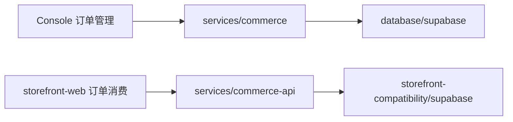
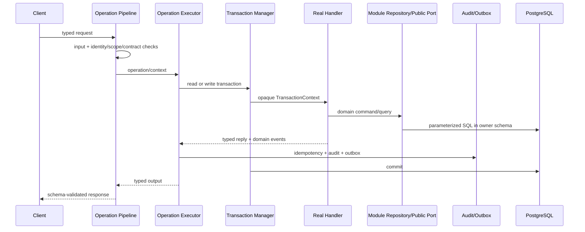
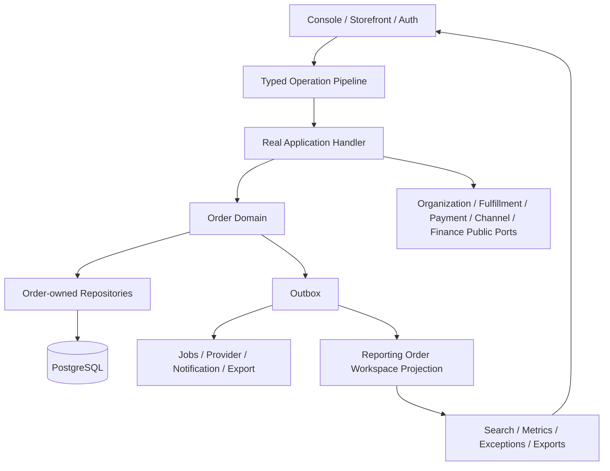

# 智慧翼订单管理升级前详细预案

版本：2026-09-01 / Preflight v1.0

目标公式：`订单 MVP + Smart Wing VI 1.2 + WCHS-MCBS 1.0`

本文性质：升级前事实审计与实施预案；不是代码改动清单，不授权部署，也不改变现有权限策略。

## 0. 一页结论

建议把 `backend-reconstruction` 所体现的后端方法正式命名为：

> **WCHS-MCBS 1.0 — WCHS Modular Commerce Backend Standard**
>
> **WCHS 模块化商业后端标准 1.0**

它的核心不是某种目录命名，而是四件事同时成立：

1. Operation Contract 是接口、权限元数据、Schema、Handler、SDK 和需求追踪的唯一入口；
2. 后端是 DDD 模块化单体，每个模块只写自己的 PostgreSQL Schema；
3. 强一致业务共用不暴露 `query()` 的事务上下文，外部副作用走 Outbox/Inbox 和可恢复 Job；
4. 每个 Operation 都有一个真实单用例 Handler，并通过自动化门禁证明依赖、事务、契约和需求没有漂移。

订单系统的目标名称建议定为：

> **Smart Wing OMS 2.0 / WCHS-MCBS Order Profile 1.0**

当前系统并非“没有订单系统”。它已经有订单、结算、支付、履约、售后、财务、报表等基础域，也有类型化 SDK、Keyset 分页、幂等、Outbox 和组织范围隔离。真正的问题是：

- Console 的 Canonical Order 与 Storefront Compatibility Order 仍处于两条运行链、两套数据库事实；
- 当前 Console 订单页的日期、状态、商城、视图等高级筛选只在本地预览上下文生效，真实 API 只接受内部订单 ID 与游标；
- 批量选择、最终写操作和完整导出没有接通；
- 采购标识、标签、备注、异常订单、批量下单、多模板导出等需求没有领域模型；
- `OrderOperations.ts` 同时承担分派、SQL 和业务编排，跨模块直接传递数据库能力；
- Smart Wing VI 1.2 尚未进入当前工作树，当前 `packages/design` 仍是正在修改的 VI 1.1 基线。

`backend-reconstruction` 值得作为“标准和目标实现素材”，但不适合整分支直接合并。以当前本地 `main` 对比，该分支约涉及 3,423 个文件、+288,100/-125,699 行；而且它自己仍保留 `*Operations.ts`、通用三行 Handler 壳、Public Port 数据库类型泄漏等过渡实现。正确做法是：

> 冻结需求与契约 → 先统一订单事实源 → 建立 WCHS 执行骨架 → 按订单垂直切片选择性移植状态/售后能力 → 接入 VI 1.2 → 单路径硬切。

不建议先做“订单页换皮”。如果先换 UI，页面会继续展示后端不能真实提供的筛选、指标和动作。

## 1. 审计基线与事实裁决

### 1.1 本次使用的事实源

| 事实源 | 固定版本 | 本预案中的用途 |
| --- | --- | --- |
| `/Users/Ethan/Desktop/2026-4-30需求整理.xlsx` | SHA-256 `2d26811cd4fe3fca65f126432a71f176628d12ff262cd0844498abc3fec9e79e` | 订单 MVP、角色与业务范围 |
| 工作表 `20260430需求汇总` | 行 111–131 为订单、财务、数据、客服核心需求 | 主产品需求 |
| 工作表 `20250416需求汇总` | 行 1、8–11 为角色、订单、售后、对账原始意图 | 角色和历史意图补充 |
| `/Users/Ethan/Desktop/Smart-Wing-VI-1.2` | `1.2.0`，Commit `f7b13e239b496111d382190ed1c5a7abb7382dd3` | 视觉和工作台组件权威 |
| VI Token | SHA-256 `ff5b487c106e09ffa1b0d3b04ec087d27122d9a15df3adc97b76f8fe30b44635` | 色彩、排版、间距、响应式约束 |
| 当前本地 `main` | HEAD `dbb5bbb186fbf18a1bf75c9e12b73b5f76637917` + 当前未提交工作树 | “我们现在的代码” |
| GitHub `backend-reconstruction` | 本地与 `origin/backend-reconstruction` 均为 `f6461bcf40f6d1f9b335b7590eebd685350c9a90` | 后端标准和参考实现 |

### 1.2 冲突裁决

1. `20260430需求汇总` 晚于 `20250416需求汇总`，功能细节以 2026 工作表为主。
2. 2025 工作表中的角色继承规则仍有效：平台/超级管理员看全域，机构管理员看机构后代，子机构管理员看本子树，商城管理员只看本商城，供应商只看与自己有关的商品和售后。
3. 2026 工作表没有单独重复中台订单页，不解释为“中台不能看订单”；它由历史角色说明和组织范围继承补足。
4. VI 1.2 的源码、Token 和公开组件是视觉权威；截图只是验收参考，不从截图反推新的样式值。
5. `backend-reconstruction` 中的架构文档代表规范终态；其实际代码代表迁移中的参考实现。两者不一致时，未来代码计划遵循终态规则，不复制过渡债务。
6. 本预案只复用现有身份、权限、Scope、手机验证和审计规则，不新增或收紧任何安全策略；若将来要改变权限模型，必须另行由 Ethan 明确决定。

## 2. 订单 MVP：需求重组

### 2.1 管理面与数据范围

| 管理面 | 订单能力 | 数据范围 |
| --- | --- | --- |
| 平台/中台 Owner | 全域订单、售后、异常、统计和跨机构观察 | 全平台 |
| 机构管理员 | 商品订单、售后订单、异常订单、采购标识、导出、采购对账 | 当前机构及全部后代商城 |
| 子机构管理员 | 同机构能力，但范围缩小 | 当前子机构及后代商城 |
| 商城管理员 | 我的订单、批量下单、订单详情、导出、商城对账 | 当前商城 |
| 供应商/门店 | 发货、退货/售后处理和与自己有关的履约信息 | 自己参与的子订单/履约单 |
| 会员 | 自己下单、付款、确认收货、申请售后、查看进度 | 本人订单 |

### 2.2 可追踪需求 ID

| ID | 工作簿证据 | 能力 | MVP 完成定义 |
| --- | --- | --- | --- |
| `OMS-001` | 2025!A8:C8；2026!H111:K112 | 订单状态分组 | 待支付、待发货、已发货、已完成、已取消/关闭等视图由服务端真实筛选 |
| `OMS-002` | 2025!C8；2026!E111/K112 | 订单详情 | 订单号、价格、收货人、商品行、供应商、账号、机构/商城、支付、履约、售后、发票/核销摘要完整 |
| `OMS-003` | 2025!C8 | 标签与备注 | 可打标签、写内部备注，并支持标签筛选和操作记录 |
| `OMS-004` | 2025!D8:G9 | 层级可见性 | 平台、机构、子机构、商城、供应商和会员的数据范围与组织树一致 |
| `OMS-005` | 2026!E111/K112/K115/K117 | 多维检索 | 时间、订单号、姓名/手机号、收货人、商品、供应商、类型、各状态、商城、核销、开票可组合检索 |
| `OMS-006` | 2026!K111/K114 | 采购标识 | 单条/批量标记已采购，可筛选；与真实 Provider 采购状态分开表达 |
| `OMS-007` | 2026!E112/K113/K116/K118 | 多模板导出 | 订单总表、发货表、自定义发货表、礼包/积分商城/机构对账等由服务端异步生成 |
| `OMS-008` | 2025!B9:C9；2026!J115:K116 | 售后工作台 | 申请、审核、退货、收货、退款、拒绝、完成全时间线可查看和处理 |
| `OMS-009` | 2026!J117:K118 | 异常订单 | 按可解释原因聚合异常，不污染订单主状态，并可筛选、导出、进入恢复流程 |
| `OMS-010` | 2026!D113:E115 | 批量下单 | 下载地址库/模板、上传、完整性校验、选择供应商和下单账号、确认后扣减并建单 |
| `OMS-011` | 2025!B11:G11；2026!H119:K122 | 对账与结算 | 机构、商城、供应商、采购维度账单可追踪到订单和经济腿 |
| `OMS-012` | 2026!F11:F16；2026!J125:K125 | 订单数据中心 | 订单量、GMV、退款、净销售额、客单价、状态分布、趋势和退款原因有 Watermark |
| `OMS-013` | 2026!J130:K131 | 客服关联订单 | 工单详情显示订单快照、物流、历史售后和时间线，不直接改订单事实 |
| `OMS-014` | 2026!C109:E109 | 运费差额 | 用户免邮、Provider 结算门槛和平台垫付被拆成可解释的报价与结算快照 |

### 2.3 MVP 边界建议

首个可上线闭环必须包含：`OMS-001` 至 `OMS-009`。它们共同构成“能查、能看、能标、能处理、能导出”的订单管理系统。

`OMS-010` 批量下单、`OMS-011` 对账、`OMS-012` 数据中心、`OMS-013` 客服联动、`OMS-014` 运费差额属于紧邻订单的第二批能力。它们仍在总目标内，但不应阻塞第一批订单工作台替换现有预览功能。

## 3. 当前订单系统事实

### 3.1 当前运行拓扑



当前 README 明确把第一条称为 Canonical API，把第二条称为 Compatibility BFF。这个结构在迁移期可以解释，但不满足 WCHS-MCBS 的单一订单事实源要求。订单升级前必须先确定 Storefront 何时切入 Canonical Operation API；禁止为过渡方便新增订单双写。

### 3.2 已经可复用的基础

- `services/commerce` 已有 Order、Checkout、Inventory、Payment、Fulfillment、Finance、Reporting、Support 等模块。
- 当前 Operation Contract 共 242 个操作；订单域已有 8 个操作：创建、读取、提醒、导出、售后读取/申请/同意/拒绝。
- `PlaceOrder` 已经在一个数据库事务中完成 Quote 重验、库存/券/福利金/营销预占、订单与支付意图、Outbox。
- 订单数据使用整数分、多维状态、版本号和不可变商品/价格快照。
- 订单读取使用 Keyset 分页，并按会员、供应商、门店或组织 Closure 做范围过滤。
- 前端有订单列表、状态 Tab、筛选区、列设置、当前页选择、详情抽屉、加载/空态/错误态和 Zod 校验。
- 订单样式已经大量使用 `--sw-*` Token，没有在订单 CSS 中散落硬编码色值。

这些基础应该保留并迁移，不应重写为另一套 CRUD 服务。

### 3.3 当前真实能力边界

| 项目 | 当前事实 |
| --- | --- |
| 真实订单筛选 | Canonical `OrderOrdersReadInput` 只支持 `order + pageQuery`；当前实现实际按内部订单 ID 精确匹配 |
| 前端高级筛选 | `placed/lifecycle/payment/fulfillment/mall/view` 只有 `platform:preview` 才发送到 API，真实上下文不发送 |
| 搜索提示 | 预览态提示可搜订单号、商品、会员或手机号后四位；真实态提示准确说明只能输入内部订单 ID |
| 批量选择 | 仅保存当前页选中项；跨页动作等待 Filter Snapshot/Preview 证明 |
| 写操作 | 页面明确写着“发货、退款、售后及其他写操作仍保持关闭” |
| 导出 | 当前页浏览器 CSV，不是需求中的服务端全量、多模板、可恢复导出 |
| 详情 | 基本订单行和状态可用；会员/收货人、组织名称、支付明细、物流、发票、核销、时间线多依赖本地 Preview 或显示不可用 |
| 售后 | 当前 `main` 有基础申请/审核/退款 Job，状态仍是 `requested/processing/...` 的粗粒度版本 |
| 标签/备注 | 没有明确数据库模型、Operation 和服务端筛选 |
| 采购标识 | 没有明确模型、Operation 和筛选 |
| 异常订单 | UI 有 `exception` Tab，但真实服务端没有异常 Projection 或判定规则 |
| 批量下单 | 没有面向工作簿模板的验证、确认和建单流程 |

### 3.4 当前代码结构与 WCHS 的距离

- `services/commerce/src/modules/order/OrderOperations.ts` 包含分派、授权后范围选择、SQL、结果映射和业务编排。
- `PlaceOrder.ts` 直接 import Inventory、Payment、Benefit、Voucher、Marketing、Cart 等模块内部实现。
- `OrderPort.ts` 的公共调用参数是 `OperationDatabase`，也就是调用方可见的裸 SQL 能力。
- Order 模块根有 `OrderModule.ts`、`OrderOperations.ts`、`OrderPort.ts`、`OrderJobs.ts`；WCHS 终态只允许 `Module.ts` 与 `Manifest.ts`。
- 当前没有订单真实 Handler 文件，全部操作仍由模块级分派器执行。
- 当前 `check:operations` 通过；`check:boundaries` 的 5 个发现位于正在修改的 Member/Access 前端，不是订单判断依据；当前分支尚无 `check:transactions` 脚本。

## 4. WCHS-MCBS 1.0 标准提炼

### 4.1 标准定位

WCHS-MCBS 适合强事务、多组织、多供应商、支付与权益交织的商业系统。它选择“模块化单体 + 一个 PostgreSQL 事务事实源”，而不是为了形式先拆微服务。

### 4.2 十二条规范

1. **单运行时事实**：生产只有一个 Commerce 制品，ApiMain、JobsMain、MigrationMain 使用同一代码和 Contract Hash。
2. **单数据库事实**：PostgreSQL 是订单、支付、库存、权益和财务的唯一交易事实；缓存和报表 Projection 可重建。
3. **Operation First**：每个接口先进入 `operations.yml`，登记 owner、method/path、target、permission/capability、scopeKinds、Schema、错误并集、幂等、版本、风险、Handler、SDK 和 Requirement ID。
4. **一 Operation 一真实 Handler**：一个 Handler 只编排一个用例；不能是把请求转给通用 `ModuleOperations` 的三行壳。
5. **固定 DDD 层次**：`interface → application → domain ← port ← infrastructure`；Domain 不反向依赖 Application/Infrastructure。
6. **模块 Schema 所有权**：模块只通过自己的 Repository 写自己的 Schema；跨模块只经 Public Port 或 Event。
7. **不透明事务上下文**：Handler/Public Port 只能接收带品牌的 Read/Write TransactionContext，不得到 `query()`、PG Client 或提交/回滚能力。
8. **强一致与最终一致分开**：下单等强一致流程在同一 Serializable 事务；网络、Provider、导出和通知采用 `prepare → commit → finalize` 与 Outbox/Inbox。
9. **显式状态与版本**：状态维度独立，更新使用 expectedVersion/CAS；金额用整数分；业务快照不可变。
10. **唯一 Catalog 和生成物**：Operation、Event、Error、Permission/Capability、Module、Provider、Runtime、Ownership、Requirement 各自只有一个权威来源；生成文件不能反向成为事实源。
11. **可证明质量**：Handler Unit、Repository Integration、Contract、Journey、Security、Performance、Recovery 和架构门禁组成同一 `quality` 链。
12. **单路径切换**：不在生产保留新旧订单执行路径、双写、Fallback、Simulation 或兼容别名；只允许切换前的只读影子验证。

### 4.3 固定模块骨架

```text
modules/order/
├─ Module.ts
├─ Manifest.ts
├─ public/
│  ├─ index.ts
│  └─ *Port.ts
├─ application/
│  ├─ handler/
│  ├─ port/
│  ├─ service/
│  ├─ process/
│  └─ model/
├─ domain/
│  ├─ model/
│  ├─ value/
│  ├─ policy/
│  ├─ service/
│  ├─ event/
│  └─ error/
├─ infrastructure/
│  ├─ persistence/
│  ├─ adapter/
│  ├─ integration/
│  ├─ cache/
│  ├─ messaging/
│  ├─ registry/
│  └─ security/
├─ interface/
│  ├─ http/
│  ├─ job/
│  ├─ event/
│  └─ webhook/
└─ test/
```

`application/command` 和 `application/query` 不再作为第二套用例层；单用例逻辑直接进入真实 Handler，可复用逻辑才进入 Service/Process。

### 4.4 标准请求时序



### 4.5 `backend-reconstruction` 实际符合度

| 标准项 | 分支事实 | 判断 |
| --- | --- | --- |
| 单 Commerce/单迁移根 | 只有 `services/commerce`、`database/migrations`、`apps/auth|console|storefront` | 已体现 |
| Operation Catalog | YAML 解析为 269 个唯一 Operation，订单 9 个 | 已体现 |
| 类型化 Schema/SDK | 新增 `OrderSchema.ts`，Operation 记录完整元数据并生成 SDK | 已体现 |
| 状态模型 | 新增确认收货、订单状态硬切和完整售后生命周期 | 明显优于当前 main |
| 组织 Public Port | 订单读取通过 Organization Public Port 获取后代 Scope | 已改善 |
| 一 Operation 一真实 Handler | 大量 Handler 仍只是 `defineOperationHandler('...')` 壳，真实逻辑仍在 `OrderOperations.ts` | 未达到终态 |
| 模块根只留两文件 | Order 根仍有 7 个生产 `.ts` 文件 | 未达到终态 |
| Public Port 无 DB 泄漏 | `order/public/index.ts` 仍暴露 `OperationDatabase`；全仓静态扫描约 65 个 public 文件有 DB/PG/query 痕迹 | 未达到终态 |
| SQL 只在 Repository | `OrderOperations.ts`、`AfterSaleService.ts`、`ReceiveOrder.ts` 仍直接 query | 未达到终态 |
| 质量证明 | `check:boundaries` 可运行并为 0；该 worktree 未安装依赖，`check:operations`/`check:transactions` 本次无法执行 | 尚不能认证 |

因此，`backend-reconstruction` 应被称为 **WCHS-MCBS 的规范源和过渡参考实现**，不能把它当前每个文件都当成最终模板。

## 5. 需求、当前系统、兄弟分支三方对比

状态说明：`完整` = 后端、真实数据和用户路径闭环；`部分` = 有基础但缺契约/页面/验收；`缺失` = 没有可靠领域能力。

| 能力 | 当前 main | backend-reconstruction | Smart Wing OMS 2.0 目标 |
| --- | --- | --- | --- |
| 单一订单事实源 | 两条订单链、两套数据库 | 单 Commerce/单迁移根 | 所有订单读写进入 Canonical Commerce，0 双写 |
| 层级可见性 | Order SQL 有会员/供应商/门店/Closure 过滤 | 改为 Organization Public Port 后代 Scope | 平台/机构/子机构/商城/供应商/会员 Journey 全覆盖 |
| 状态分组 | UI 有 Tab；真实 API 不按 Tab 过滤 | 状态模型更细；API 仍只按 ID | 服务端按独立状态维度筛选并返回聚合计数 |
| 多维搜索 | 真实态仅内部订单 ID | 仍仅内部订单 ID | 工作簿全部字段可组合检索，查询来自读 Projection |
| 订单详情 | 基础订单行/状态；多块显示不可用或 Preview | 增强 productType/category，仍缺完整跨域详情 | 订单、支付、履约、售后、采购、发票、核销、组织和时间线统一视图 |
| 标签/备注 | 缺失 | 缺失 | Order Annotation 模型、操作、筛选、记录完整 |
| 采购标识 | 缺失 | 缺失 | MVP 手工标识与 Provider 实际采购状态分离，可批量筛选 |
| 批量动作 | UI 只有当前页选择 | UI 仍关闭最终写操作 | 使用 Filter Snapshot 或显式 ID 集合，命令幂等并返回逐项结果 |
| 订单导出 | 当前页浏览器 CSV；后端有通用队列入口 | 有异步 Export Operation，UI 仍关闭、模板不足 | 服务端快照、多模板、异步状态、对象下载和可恢复 Job |
| 售后 | 基础申请/审批/退款 Job | 行级数量、附件、时间线、退货、收货、退款状态明显完善 | 移植后拆成真实 Handler/Repository，并开放受现有权限控制的 Console 动作 |
| 确认收货 | 缺少 Canonical Order Operation | 新增 `order.orders.receive` | 会员/运营按现有权限调用，CAS、事件和重复调用语义明确 |
| 异常订单 | Preview Tab，没有规则/Projection | 缺失专用异常订单能力 | 从支付、Provider、履约、售后、对账事件生成可解释异常 Projection |
| 批量下单 | 缺失 | 缺失 | 上传验证、确认、分片建单、逐行结果、可恢复，不在浏览器算余额 |
| 机构/供应商对账 | Finance/Reporting 有基础 | Finance 能力更广，但需求专用闭环未证明 | 经济腿到订单/供应商/机构可追踪，对账单有 Watermark |
| 订单数据中心 | 有 Reporting 基础 | 保持 10 个 Reporting 操作 | 指标定义固定、可重建 Projection、Watermark、Excel/CSV |
| 客服关联订单 | Support 有 Order Summary Public Query | 保留 Support/Order 联动 | 客服只引用不可变订单快照和事件，不直接写订单/资金 |
| 运费差额 | Quote/Delivery 有快照基础，未形成需求模型 | 未证明闭环 | 用户运费、Provider 成本、补贴和结算差额分别保存 |
| VI 1.2 | 当前 design 工作树为 1.1，订单 CSS 已 Token 化 | 分支不是本次 VI 权威 | 使用 VI 1.2 公开组件和 Token，无第二套组件源码 |
| WCHS Handler | 模块级 Operations，无真实 Handler | 文件齐但大多为绑定壳 | 订单 Operation 全部真实 Handler，0 OrderOperations 分支 |
| WCHS Repository | SQL 位于 Operations/Application，公共参数为 DB | 仍有同类过渡债务 | SQL 只在 Order/Reporting 自有 PgRepository |

## 6. Smart Wing OMS 2.0 目标设计

### 6.1 目标架构



写路径和读路径的职责不同：

- Order Aggregate 决定订单与售后状态，不为列表页面做跨 Schema Join；
- Reporting Projection 消费事件，组合订单、支付、履约、采购、发票、售后和组织显示字段；
- Console 的高维搜索、指标、异常和导出全部读取 Projection，并返回 Watermark；
- 订单详情需要强事实时，通过窄 Public Read Port 组合，不允许 Reporting 反向写业务表。

### 6.2 模块所有权

| 模块 | 只负责 | 不负责 |
| --- | --- | --- |
| Order | Order/Line/Suborder 快照、订单状态、确认收货、售后、标签/备注、手工采购标识 | 支付扣款、物流承运、财务分录、Provider 网络调用 |
| Checkout | Quote 重验和原子下单编排 | 订单管理列表 |
| Fulfillment | 发货、包裹、物流、签收、退货与质检 | 修改支付/财务事实 |
| Payment | Intent、Attempt、Payment、Refund、Recovery、Webhook Inbox | 直接改 Finance 表 |
| Channel | Provider 采购提交、外部单号、查单、Unknown/Recovery | 直接访问 Order DB |
| Finance | Journal、Statement、Settlement、Invoice、Reconciliation | 作为订单状态权威 |
| Reporting | Order Workspace Projection、指标、异常、导出和 Watermark | 跨 Schema 即席查询和任何业务写入 |
| Organization | 组织树、后代 Scope | 接受浏览器声称的可见范围 |
| Support | 工单、客服消息、订单快照引用 | 直接退款、改库存、改订单 |

### 6.3 状态模型

禁止再用一个“订单状态”承载所有含义。目标至少保留以下独立维度：

| 维度 | 推荐状态 | 权威模块 |
| --- | --- | --- |
| Lifecycle | `created / awaitingpayment / paid / fulfilling / shipped / received / completed / cancelled` | Order |
| Payment | `unpaid / authorizing / paid / partially_refunded / refunded / failed` | Payment 投影到 Order |
| Fulfillment | `unallocated / allocated / processing / shipped / delivered / received / cancelled / returned` | Fulfillment 投影到 Order |
| Aftersale | `none / applied / reviewing / approved / returning / received / refunding / resolved / rejected` | Order Aftersale |
| Procurement Marker | `unmarked / marked`，只表示人工采购确认 | Order Annotation |
| Provider Purchase | `not_required / pending / submitted / accepted / unknown / failed / cancelled` | Channel |
| Invoice | 使用现有 Finance/Invoice 状态 | Finance |
| Exception | 一个订单可有多个 `reasonCode`，不是主状态 | Reporting Projection |

异常原因默认从现有事实推导，例如支付长时间 Pending、Provider Unknown、履约 SLA 超时、售后停滞、对账差异。阈值必须来自现有配置事实，不在 Handler 中硬编码。

### 6.4 订单读 Projection

订单工作台要满足工作簿筛选，读模型至少需要：

- 标识：内部 ID、业务订单号、Provider 外部单号；
- 时间：下单、支付、发货、收货、售后申请/完成、更新时间；
- 组织：平台/机构/子机构/商城 ID 与显示名、Scope Path；
- 人员：会员 ID、下单人显示名、手机号可搜索标识、收货人显示摘要；
- 商品：标题、SKU、商品类型、供应商/Provider、数量和金额；
- 状态：Lifecycle、Payment、Fulfillment、Aftersale、核销、开票、采购、异常；
- 财务：订单总额、优惠、实付、退款、净额、支付方式摘要；
- 运营：标签、备注数量、采购标记人/时间；
- 可靠性：Projection Version、Source Event、Watermark、更新时间。

搜索姓名/手机号时复用项目现有 PII 加密与搜索标识机制，不建立第二套 PII 策略。

### 6.5 候选 Operation Catalog

下表是未来代码计划的冻结候选。正式编码前应写入 Requirement Mapping 并由生成器产出 Schema/SDK；不手写客户端常量。

| Operation | Owner | 模式 | 真实 Handler 职责 |
| --- | --- | --- | --- |
| `order.orders.read` | Order/Reporting Read Adapter | Read | 组合分页、Filter Snapshot、Watermark；替换只按 ID 的旧实现 |
| `order.orders.detail.read` | Order | Read | 返回订单强事实与稳定跨域摘要 |
| `order.orders.receive` | Order | Write | CAS 确认收货并发事件 |
| `order.orders.annotations.create` | Order | Write | 追加备注/标签变更 |
| `order.orders.procurementmarks.batch` | Order | Write | 对显式 ID 集批量标记，逐项返回 |
| `order.orders.export` | Reporting | Durable | 固化 Filter Snapshot 和模板，创建 Export Job |
| `order.aftersales.read` | Order | Read | 售后列表/详情/时间线 |
| `order.aftersales.apply` | Order | Durable | 附件准备、事务内申请、提交后对象处理/补偿 |
| `order.aftersales.approve` | Order | Write | 审核、退货或退款流程分支 |
| `order.aftersales.reject` | Order | Write | 拒绝并释放行级占用 |
| `order.exceptions.read` | Reporting | Read | 返回可解释异常及恢复状态 |
| `order.batchorders.validate` | Order Import Process | Durable | 文件解析、地址和商品行预检，无资金副作用 |
| `order.batchorders.create` | Checkout/Order | Durable | 以已确认 Snapshot 分片建单并返回逐行结果 |
| `order.batchorders.read` | Order | Read | 查看批次进度和失败原因 |

Operation ID 是否新增、复用或由 Reporting owner 承载，应在 Contract 冻结阶段一次决定；发布后不得留旧别名。

### 6.6 数据模型增量

未来 DDL 只能新增受管迁移，不能改写已登记迁移。建议的逻辑对象如下，具体表名在代码计划中经 Ownership Catalog 冻结：

| 逻辑对象 | 作用 |
| --- | --- |
| Order Annotation | 标签、备注、人工采购标识及操作者/时间；与主订单状态分离 |
| Order Tag / Assignment | 机构可用标签和订单标签关系，支持筛选 |
| Batch Order / Batch Row | 上传文件、Snapshot、逐行校验、确认、建单和失败结果 |
| Order Workspace Projection | 工作簿全部检索字段、跨域摘要和 Watermark |
| Order Exception Projection | reasonCode、来源域、首次/最近发生、恢复状态 |
| Export Request / Artifact | 模板、Filter Snapshot、对象引用、Hash、行数和状态 |
| Provider Purchase Projection | 人工采购标识与真实外部采购状态的统一只读展示 |

迁移时若旧状态无法唯一判断，写入 Migration Exception 并在切换前解决；不得凭猜测映射成成功状态。

### 6.7 VI 1.2 页面契约

订单工作台不复制 VI 源码，只从 `@shop/design` 公共 export 使用组件。

桌面结构：

1. `WorkspaceHero`：订单管理标题、当前组织范围、Watermark/更新时间、刷新和导出主动作；内容保持运营工作台语气，不做营销大图。
2. `MetricGrid`：总订单、待发货、售后处理中、异常订单四个指标；金额类使用 Financial Font 和 Tabular Numerals。
3. 筛选 `Surface`：关键词、时间、类型、状态、商城、供应商、采购、核销、开票；高级条件可折叠。
4. 商品订单使用密度适中的 Table/ResourceState，保留多列可比性；不强行把大表塞进窄 Master 列。
5. 售后与异常处理使用 `MasterDetail`：左侧案件/异常列表，右侧订单快照、时间线和动作。
6. 详情使用现有 Dialog/Drawer/ResourcePanel，状态使用 Badge，所有颜色来自语义 Token。

响应式：

- `>64rem`：指标四列，售后/异常主从并排；
- `48–64rem`：主从改单列，筛选两列；
- `<48rem`：Hero、指标、筛选、列表全部单列，主操作可触达，触控目标不小于 44px；
- 不在业务 CSS 写新的品牌色、阴影、圆角、字体值；使用 `--sw-*` Token；
- 页面必须保留 Loading、Empty、Error、Stale、Refreshing、Partial Failure 和 Disabled Reason。

## 7. 升级路线

### 7.1 总体策略

1. 不整分支 merge `backend-reconstruction`；按目标能力选择性移植，并以当前工作树为真实基线。
2. VI 1.2 先作为独立基础交付落地；当前 `packages/design` 有 VI 1.1 未提交改动，必须在隔离 worktree 中解决来源，不允许覆盖复制。
3. 订单写路径只允许一个事实源；可以先构建只读 Projection 做影子核对，但不允许双写两个订单数据库。
4. 每个阶段只迁移一个可验收交付物；共享 Contract、Migration、Module 装配和部署串行。
5. 后端遵循“Contract → Handler → Repository → Migration/Projection → SDK → UI → Journey”的顺序。
6. 实施中不新增权限约束；只映射和复用已经存在的 Permission/Capability/Scope。

### 7.2 阶段与退出条件

#### P0｜冻结事实与产品裁决

交付：Requirement Mapping、状态词典、角色矩阵、导出模板字段表、异常原因表、采购标识语义、当前数据快照。

退出条件：

- `OMS-001` 至 `OMS-014` 都有 Owner、Operation、UI Route、数据对象、测试和发布属性；
- 本文第 9 节决策项全部签字；
- 固定当前 Operation/Requirement/Migration Head 与工作簿 Hash；
- 保存真实数据量、订单状态分布、孤儿/异常数量和关键查询性能基线。

#### P1｜统一订单事实源

交付：Storefront Order API 到 Canonical Commerce 的迁移设计和可执行切换方案。

退出条件：

- 新订单、支付、售后和订单查询都指向同一 PostgreSQL 事实；
- Compatibility DB 不再接收订单写入；
- 无双写、无回写同步、无以 Compatibility 数据覆盖 Canonical 数据；
- 历史订单导入采用一次性受管迁移和可核对 Ledger。

#### P2｜WCHS 执行骨架

交付：HandlerContext、OperationExecutor、TransactionContext/Manager、PgTransactionAccess、真实 Handler 注册、订单架构门禁。

退出条件：

- Order Handler/Public Port 看不到 `query()` 或 DatabasePool；
- Order SQL 只在 `infrastructure/persistence`；
- 一个 Operation 对应一个真实 Handler；
- 当前 Audit、Outbox、幂等和 Serializable Retry 被复用，没有第二套实现；
- 新骨架未接管前可以存在于代码中，但生产中不能同时暴露新旧同一 Operation 路径。

#### P3｜Canonical 状态与数据迁移

选择性移植 `backend-reconstruction` 的订单状态硬切、确认收货和售后数据结构，但重写成 WCHS Repository/Handler 终态。

退出条件：

- 状态映射穷举表覆盖全部旧值；
- 模糊记录进入 Migration Exception，开放异常为 0 才切换；
- 新增迁移通过空库、生产快照副本、回滚兼容和 Ledger 校验；
- 主订单状态、支付、履约、售后状态之间的不变量测试通过。

#### P4｜真实订单读工作台

交付：Order Workspace Projection、指标、全筛选、详情和 Watermark；替换本地 Preview 条件。

退出条件：

- `OMS-001/002/004/005/012` 的筛选与字段由服务端返回；
- 不再根据 `platform:preview` 才发送高级筛选；
- 50 行列表 P95 ≤ 300ms，详情 P95 ≤ 500ms；
- 组织角色 Journey、Supplier 子订单 Journey、会员本人 Journey 全通过；
- UI 删除会误导用户的 Local Preview 假字段，不降低 Loading/Empty/Error 质量。

#### P5｜订单运营动作

交付：标签/备注、采购标识、批量命令、异常订单 Projection。

退出条件：

- `OMS-003/006/009` 完整；
- 人工“已采购”和 Provider 实际采购状态在模型与 UI 上不混为一谈；
- 批量命令对显式 ID 集工作，返回逐项成功/冲突/未找到；
- 异常原因可解释、可追踪来源事件、恢复后可关闭，不创建新的主订单状态。

#### P6｜售后、退货、退款闭环

交付：行级售后数量、附件、审核、退货、质检、退款、时间线和 Console 动作。

退出条件：

- `OMS-008` 的成功、拒绝、无需退货退款、需退货退款、Provider Unknown、重复回调、部分退款全部有 Journey；
- 外部退款/Provider 调用在事务外，提交前后状态可恢复；
- 同一订单行不能超量售后；
- Finance 消费退款经济事件，Order/Payment 不直接写财务表；
- UI 只开放已有权限允许的动作，不新增权限策略。

#### P7｜导出、批量下单、对账

交付：多模板 Export、批量下单 Process、机构/供应商/商城对账。

退出条件：

- `OMS-007/010/011/014` 完整；
- Export 固化 Filter Snapshot、模板版本、Watermark、行数、对象 Hash；
- 批量下单先验证后确认，确认前无资金/库存副作用；
- 每一行可追踪到订单或稳定失败码，重试不重复扣款/建单；
- 运费展示价、Provider 成本和平台补贴分别进入快照与结算，不用一个字段覆盖。

#### P8｜VI 1.2、全链验收与硬切

交付：VI 1.2 订单工作台、视觉证据、全量质量证据、单路径发布与回滚包。

退出条件：

- `WorkspaceHero/MetricGrid/MasterDetail` 按页面语义使用；
- Web Token 生成 `--check` 无漂移，订单业务 CSS 无硬编码品牌值；
- 1440、1024、768、390 宽度视觉和键盘验收通过；
- Contract/Unit/Integration/Journey/Browser/Performance/Recovery/Build 全绿；
- 发布前后 15 域名基线仅目标服务允许变化，其他服务 MainPID 不变；
- 生产只暴露新订单路径，回滚不依赖反向破坏性迁移。

### 7.3 未来代码计划的工作包

每个工作包必须成为独立会话/独立交付物。默认 60–90 分钟时间盒；超过即继续拆成“单 Operation/单 Repository/单页面组合”，不得把下表整行塞进一个长会话。

| 工作包 | 主要文件范围 | 依赖 | 验收 |
| --- | --- | --- | --- |
| `A01` Requirement Trace | `05_docs_ziliao/docs_wendang/requirements/*`、Contract definitions | 无 | 14 个 OMS ID 全链可追踪 |
| `A02` VI 1.2 基线 | `packages/design/*`、Token 生成脚本 | 当前 VI 1.1 收口 | 组件/Token/Story/Test 进入主线且无覆盖 |
| `B01` Transaction Context | `foundation/persistence/*`、`adapter/database/*` | A01 | 不透明上下文和提交后失效测试 |
| `B02` Operation Executor | `foundation/application/*`、bootstrap | B01 | 真实 Handler 注册、幂等/Audit/Outbox 装饰链 |
| `B03` Order 架构门禁 | `04_tools/scripts/check/*` | B01/B02 | Order SQL/根文件/Public DB 泄漏检查先独立通过 |
| `C01` Order Contract | `packages/contract/definitions`、Order Schema、生成物 | A01 | 输入/输出/错误/版本/SDK 一致 |
| `C02` Order Repositories | `modules/order/application/port`、`infrastructure/persistence` | B01/C01 | 参数化 SQL、RLS、CAS、Keyset 集成测试 |
| `C03` 现有 9 Operation Handler | `modules/order/application/handler` | B02/C02 | 9 个真实 Handler，删除对应 Operations 分支 |
| `C04` Order Module Hard Cut | `Module.ts`、`Manifest.ts`、public | C03 | Order 根只留两文件，0 `OrderOperations.ts` |
| `D01` 状态迁移 | 新受管 Migration、Migration Test | C01/C02 | 穷举映射、Exception 清零、Ledger 正确 |
| `D02` 售后迁移 | Order Migration/Repository/Handler | D01 | 行级数量、附件、时间线和状态测试 |
| `E01` Workspace Projection | Reporting Repository/Event Subscriber | C01/D01 | 全字段、Watermark、可重建 |
| `E02` Search/Metrics Operations | Reporting/Order Handler + SDK | E01 | 工作簿筛选矩阵和性能达标 |
| `E03` Order Console Read UI | `apps/console/src/feature/order` | A02/E02 | 删除 Preview 假筛选，真实列表/详情/指标 |
| `F01` Annotation/Tags | Order Domain/Repo/Handler | C04 | 标签、备注和筛选闭环 |
| `F02` Procurement Marker | Order Domain/Repo/Handler | F01 | 单条/批量标记与真实采购状态分离 |
| `F03` Exception Projection | Reporting | E01 | 原因、来源、恢复和导出 |
| `G01` Aftersale Console | Order/Payment/Fulfillment Ports + UI | D02/E03 | 售后全 Journey 和主从 UI |
| `G02` Export Templates | Reporting Process/Job/Object Store + UI | E01 | 多模板异步导出和恢复 |
| `G03` Batch Order Validation | Import Process | C04 | 模板、地址、商品、账号预检，无副作用 |
| `G04` Batch Order Commit | Checkout/Order/Payment Ports | G03 | 分片、幂等、逐行结果和恢复 |
| `G05` Reconciliation | Finance/Reporting + UI | E01/G02 | 机构/商城/供应商对账追踪订单经济腿 |
| `H01` Browser/Visual | Browser tests、VI evidence | E03/G01 | 4 个宽度与关键状态 |
| `H02` Journey/Performance | tests/journey/security/performance/recovery | 全部 | 需求链、性能、恢复证据 |
| `H03` Release/Smoke | release/runbook/evidence | H01/H02 | 单路径部署、15 域名 diff、可回滚 |

## 8. 验收矩阵

### 8.1 后端 Definition of Done

- Order 模块根只有 `Module.ts`、`Manifest.ts`；
- 订单 Operation 与真实 Handler 1:1；
- 0 个 Order Handler 绑定壳，0 个 `OrderOperations.ts`；
- Order Application/Domain 0 SQL、0 `query()`；
- Public Port 0 `OperationDatabase/DatabasePool/QueryResult/PG` 类型；
- 每个 Order Repository 只访问 Order 所有的对象；
- 外部 Provider/支付/对象存储调用不在数据库事务内；
- 写事务同时提交聚合状态、Version、幂等、Audit、Outbox；
- 订单、支付、履约、售后、采购、发票状态维度没有互相冒充；
- Requirement Cell → OMS ID → Route → Operation → Handler → Repository/Projection → Test → Runbook → Release Evidence 可追踪。

### 8.2 产品 Journey

1. 商城管理员只能检索本商城订单，机构管理员能检索后代商城，平台 Owner 可切换范围。
2. 供应商只能看到自己参与的子订单和售后；会员只能看到本人订单。
3. 每个工作簿筛选字段单独、组合、空结果、翻页后都保持一致。
4. 订单详情金额总和、商品行、支付、退款、物流、售后和 Projection Watermark 一致。
5. 标签、备注、采购标识单条与批量操作可重复调用，不产生重复副作用。
6. 售后申请 → 审核 → 退货 → 收货 → 退款 → 完成和拒绝分支都有证据。
7. 异常订单显示原因和来源；恢复后从 Open 进入 Resolved，不改写历史。
8. 导出内容与提交时 Filter Snapshot 一致，翻页或后续订单变化不污染结果。
9. 批量下单坏行不会影响好行；重复确认不重复建单或扣减。
10. 机构、商城、供应商对账金额能追踪到订单和经济腿。

### 8.3 性能与可靠性

沿用 WCHS 基线：

| 场景 | 目标 |
| --- | ---: |
| 订单列表 P95 | ≤300ms |
| 订单详情 P95 | ≤500ms |
| 普通订单命令 P95 | ≤800ms |
| 下单 P95 | ≤1,500ms |
| 列表默认/最大 | 50 / 200，Keyset |
| Outbox P99 | ≤30s |
| 导出/批量下单 | 异步分片，不占用长 API 事务 |

Repository Integration Test 同时记录查询次数、计划成本和返回字节，禁止 N+1、OFFSET 和无界并行。

### 8.4 VI 验收

- 颜色：Primary `#1F5EFF`、Ink `#07182F` 等只能通过 Token 使用；
- 排版：中文字体栈、Financial Font、金额 Tabular Numerals 使用 VI Token；
- 间距：4/8/12/16/24/32/40/48/64 Token；
- 圆角：8/12/16/24 Token；
- 语义状态：Info/Success/Warning/Danger Badge，不自创订单专用颜色；
- `64rem` 和 `48rem` 两级响应式与 VI 1.2 一致；
- Desktop/Mobile 截图只用于验证，不从截图复制样式；
- 所有异步资源有 Loading/Empty/Error/Stale，动作有 Disabled Reason。

## 9. 编码前必须裁决的八件事

| 决策 | 建议默认值 | 不裁决的后果 |
| --- | --- | --- |
| 2026 表未重复中台订单页 | 平台继承全域订单能力 | 平台页面/权限范围会反复返工 |
| “已采购”含义 | MVP 为人工运营标识；Provider Purchase 是独立状态 | 一个布尔值会掩盖真实外部采购失败 |
| 订单类型词典 | 固定商品、话费、虚拟券、自有实物、Provider 等稳定枚举 | 搜索、导出、报表口径不一致 |
| 异常订单规则 | 支付/Provider/履约/售后/对账五类 reasonCode，阈值来自配置 | UI Tab 只能继续依赖假数据 |
| 标签归属 | 标签在机构范围创建，后代商城按产品裁决是否继承 | 跨机构标签污染或重复建设 |
| 备注可见性 | 默认运营内部备注；会员可见回复归 Support | 订单备注与客服消息混在一起 |
| 导出模板字段 | 每个模板独立版本、列清单、数据范围和最大行数 | 开发后仍会因 Excel 格式返工 |
| 批量“合并下单” | 先定义同收货人/同商城/同支付主体/同 Provider 的合并规则 | 订单、运费和对账无法保持确定性 |

## 10. 风险与控制

| 风险 | 当前证据 | 预案处理 |
| --- | --- | --- |
| 当前主工作树已有大量修改 | Order、Design、Requirement 等目标附近均有用户改动 | 每个交付物从明确 working-tree Snapshot 建隔离 worktree；共享文件串行 |
| 本地 main 与远端 main 已分叉 | 本地 HEAD 不是当前 origin/main | 代码计划开始前先固定实际集成基线，不猜目标提交 |
| 整体合并兄弟分支冲突巨大 | 约 3,423 文件变化，分支从旧 merge-base 重建 | 只选择性移植迁移、状态机、售后和架构素材 |
| 参考分支不是完整 WCHS 终态 | Handler 壳、Operations、DB 泄漏仍存在 | 遵循规范终态重写，不复制过渡层 |
| 双订单事实 | Canonical Console 与 Compatibility Storefront 分离 | P1 先统一事实源，禁止新增双写 |
| 高级 UI 超前于真实 API | Preview 条件和本地 CSV 已存在 | P4 用真实 Projection 替换，不继续扩大 Preview |
| 状态硬切有歧义 | 当前粗状态无法总是推导新状态 | 穷举映射 + Migration Exception + 切换前清零 |
| 跨域详情查询性能 | 工作簿要求大量跨域字段 | 事件驱动 Projection，不在列表即时跨 Schema Join |
| VI 1.1/1.2 文件重叠 | 当前 Design 包有未提交 VI 1.1，VI 1.2 在独立 Commit | A02 独立收口，优先合并 Commit，不复制交付目录覆盖 |
| 部署影响共机其他站点 | 生产主机承载 15 域名 | 沿用只重启目标服务、Caddy adapt 归一化 diff、外部基线逐行比对 |

## 11. 预计工作量与并行方式

在不整分支合并、复用现有 Order/Payment/Fulfillment/Reporting 基础的前提下，生产级完整目标的粗估为：

| 工作流 | 工程师日 |
| --- | ---: |
| 事实冻结、Contract 与产品裁决 | 2–4 |
| 单一事实源与 WCHS 执行骨架 | 6–10 |
| 状态/售后迁移与 Order Repository/Handler | 6–9 |
| Projection、搜索、详情、异常、导出 | 6–9 |
| 标签/采购、售后 UI、批量下单、对账 | 7–11 |
| VI 1.2、Journey、性能、发布证据 | 5–8 |
| 合计 | **32–51 工程师日** |

一名工程师约 7–10 周；两名工程师在受控并行、共享 Contract/Migration 串行的前提下约 5–7 周。最大的变量是 Compatibility Storefront 历史数据和导出模板的最终字段裁决。

可并行：VI 组件基线、只读 Projection、测试夹具、导出模板定义。

必须串行：Contract 生成、共享 Module 装配、数据库迁移、状态硬切、生产部署。

## 12. 将来生成代码计划时的模板

每个新会话使用以下信息，不直接把本预案整篇交给一个会话实现：

```text
交付物：<一个明确 Operation / Repository / 页面组合>
依据：OMS-xxx + WCHS-MCBS 条款 + VI 1.2 组件
基线：<commit/worktree snapshot>
允许文件：<精确目录或文件>
禁止范围：不改权限模型；不改已登记迁移；不改其他模块；不部署
输入契约：<Operation ID / Schema / Event>
验收：成功、校验失败、范围拒绝、Not Found、Version Conflict、幂等重放、依赖失败
定向测试：<命令>
最终门禁：typecheck + 一次 build
时间盒：取证 10m / 实现 25m / 定向测试 15m / typecheck+build 10m；超过 75m 停止并回报
```

## 13. 最终完成定义

Smart Wing OMS 2.0 只有同时满足以下条件才算完成：

1. `OMS-001` 至 `OMS-014` 都有可运行证据，不用 Preview/Mock 冒充；
2. Console 与 Storefront 使用同一订单事实源，0 订单双写；
3. 订单列表、详情、售后、异常、导出、批量下单和对账都返回真实服务端数据；
4. Order Operation 全部是真实单用例 Handler，0 `OrderOperations.ts`；
5. Order SQL 只在自有 PgRepository，Public Port 不泄露数据库能力；
6. 状态、金额、版本、幂等、Audit、Outbox 与跨模块所有权符合 WCHS-MCBS；
7. VI 1.2 公共组件和 Token 成为唯一订单视觉基础；
8. 需求、代码、数据、测试、运行手册和发布证据形成完整追踪链；
9. 新旧订单路径没有同时进入生产；
10. 全量质量门禁、浏览器验收、性能、恢复和生产外部冒烟全部通过。

---

本预案的关键裁决是：订单升级不是“把 `backend-reconstruction` 合并过来”，也不是“给现有订单页套 VI”。它是一次有顺序的事实收敛：先把订单变成唯一、可信、可追踪的后端事实，再让 VI 1.2 准确呈现这些事实。
