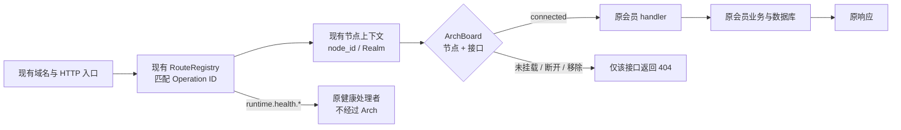

# 星准接线板｜通用接线与会员路径示例

| HTTP 运行入口 | 已插入的会员接口来源 | 节点来源 | 原业务处理者 |
| --- | --- | --- | --- |
| `IdentityRegistrationApiMain` | 已注册的 `IdentityOperatorMemberModule` 接口 | 该运行实例加载的 node manifest | 原 `MemberReadOperations`、`MemberCustomProfileOperations` |
| `WebBusinessApiMain` | 已注册的 `WebMemberModule` 接口 | 该运行实例加载的 node manifest | 原 `WebMemberOperations` 与会员应用动作 |
| `ApiMain` | 已注册的 `MemberModule` 接口 | 现有服务端节点注册表 | 原 `MemberOperations` |

安装发生在 `bootstrapApi` 完成原模块与路由注册之后。它从 `routes.catalog()` 取当前实例实际注册的业务接口，不维护第二份接口清单，也不限定业务板块。每个节点、每个接口分别接断；未安装接口不能旁路。会员的权限、数据范围、业务事实和响应仍由原路径决定。当前结论只证明代码接线，不等同于生产部署；尚未继承的会员新规则也不会因接线自动落地。
