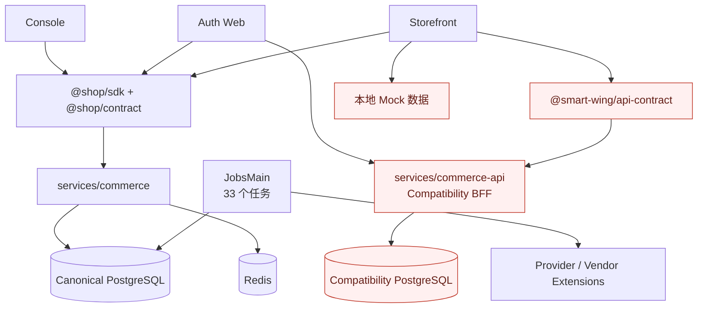
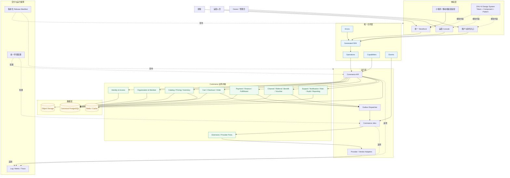
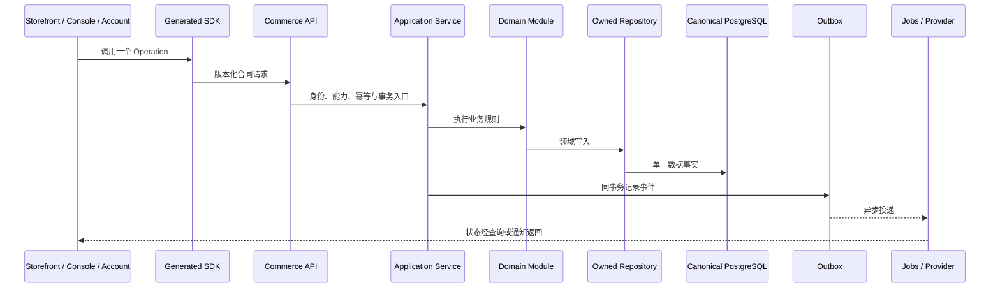
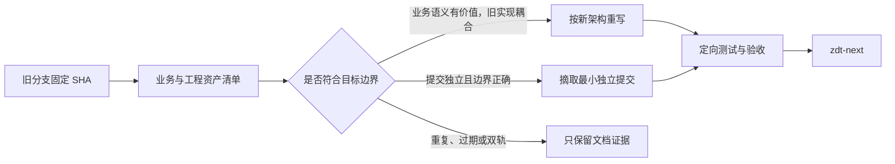
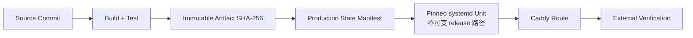

# zdt-next 目标系统架构图

> 版本：架构草图 v0.2
> 日期：2026-09-02
> 状态：供 Ethan 审核，尚未成为最终实现授权
> 依据：`00-zhudatuan-架构审计.md`、`03-阿里云运行真值与生产反推架构.md` 与当前 `ZHU-VI-1.3` 资产

## 一、结论

`zdt-next` 不继承旧 `main` 的代码主线，而是建立一套单一事实来源的新架构。

目标不是把旧系统删小，而是重新确立以下八个“唯一”：

1. 一个共享主轴：`zdt-next`。
2. 一套业务合同：Operation、Capability、Error、Event 只有一个权威来源。
3. 一个业务内核：不再并存 Canonical 与 Compatibility 两套实现。
4. 一个数据事实来源：只有一条受控 Migration Ledger。
5. 一套权限语义：身份、角色、能力和数据范围不重复定义。
6. 一套设计系统：`ZHU-VI-1.3` 作为当前视觉基线继续演进。
7. 一套运行配置：环境、路由、服务清单和发布单元有一个权威入口。
8. 一套验收标准：页面、API、任务、数据库和部署使用同一交付判据。

## 二、旧系统当前结构

旧系统并不是一棵树，而是四套事实来源叠加在一个仓库中。

旧结构的核心问题不是模块少，而是同一个业务问题可能同时经过两份合同、两套权限、两个数据库轨道和多个前端数据源。

## 三、zdt-next 目标逻辑架构

## 四、领域边界

| 领域组 | 负责内容 | 禁止承担 |
|---|---|---|
| Identity & Access | 登录身份、凭据、会话、角色、能力判定 | 直接写会员、订单或财务数据 |
| Organization & Member | 组织、门店、会员、邀请、归属关系 | 自行定义第二套身份和权限 |
| Catalog / Pricing / Inventory | 商品、类目、价格、库存、可售性 | 直接完成支付或财务入账 |
| Cart / Checkout / Order | 购物车、结算、订单状态机 | 直接修改支付通道内部状态 |
| Payment / Finance / Fulfillment | 支付、账务、履约、一致性 | 反向控制商品和会员模型 |
| Growth | 渠道、推荐、权益、券、活动 | 绕过订单与财务边界直接记账 |
| Operations | 客服、通知、风险、审计、报表 | 成为第二套交易内核 |
| Extension / Provider | 外部供应商和平台适配 | 把供应商协议泄漏进核心领域 |

每个领域可以共享一个物理 PostgreSQL，但必须通过明确的 Repository / Port 拥有自己的写入边界。跨领域协作使用 Application Service、Operation 或 Event，不允许任意跨 Schema SQL。

## 五、唯一请求链

## 六、运行与发布单元

目标逻辑上保留五类独立发布单元，具体技术栈由 Ethan 后续确认：

1. Storefront Web / 渠道前端。
2. Console Web。
3. Account / Auth Web。
4. Commerce API。
5. Commerce Jobs 与 Provider Workers。

它们共享合同版本和 Release Manifest，但不能把 Compatibility API 再次嵌入前端发布单元。

## 七、必须保持的架构不变量

1. UI 不直接访问数据库。
2. UI 不绕过 Generated SDK 自行散落请求逻辑。
3. 一个 Operation 只能有一个权威定义。
4. 一个 Capability 只能有一个权威判定入口。
5. 一个领域不能直接写另一个领域拥有的数据。
6. 同一业务事件只通过一个 Outbox 轨道发布。
7. Provider 细节只能存在于 Adapter 一侧。
8. Mock 只能用于测试或 Story，不得成为正式运行数据源。
9. Migration 只有一条 Ledger，不复制第二套同名迁移。
10. VI Token、组件和页面模式只有一个当前版本。
11. API、Jobs 与前端分别部署，统一由 Release Manifest 组合。
12. 可观测性必须有采集出口，不能只停留在类型定义和 stdout。

## 八、旧资产进入新架构的路线

禁止把旧 `main` 或任何旧大分支使用 `--allow-unrelated-histories` 整体合入 `zdt-next`。旧分支的“收回”表示清点、提炼、验证和关闭，不表示把旧目录树原样倒入新主轴。

## 九、生产反推后的交付架构

阿里云取证证明，业务组件可以独立发布，但“一个会移动的全局 `current`”无法准确描述实际运行版本。`zdt-next` 必须增加一个机器可读的 Production State Manifest：

Manifest 至少逐组件记录：

- Source Commit。
- Artifact SHA-256。
- Contract Version。
- Migration Head。
- 实际不可变 release 路径。
- Caddy 路由哈希。
- 启用时间与验证结果。

允许 Storefront、API、Jobs 等组件独立发版，但每个活跃版本都必须被同一个 Manifest 明确描述；不得再通过目录名、全局 symlink 或进程启动时间推断生产真值。完整生产拓扑和迁移保护规则见 `03-阿里云运行真值与生产反推架构.md`。

## 十、尚待 Ethan 定稿的决策

以下内容在本图中只保留逻辑边界，不擅自确定实现：

- 前端框架和单仓库工具。
- Storefront 的多端实现方式。
- PostgreSQL 的物理实例与 Schema 策略。
- 身份服务采用自建还是外部 Provider。
- API 是模块化单体起步还是拆分服务。
- 最终运行平台、发布平台和网络拓扑。
- 消息与任务平台的具体产品。
- 可观测性采集与存储产品。

Ethan 确认这些决策后，应将最终结论写入 `docs/zdt.md`，替代本文件的“草图”状态。
