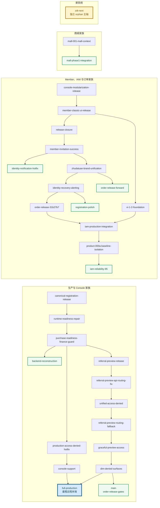
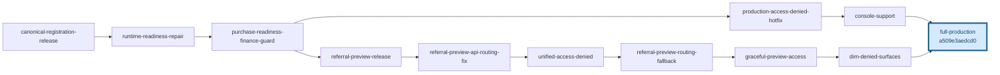
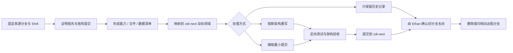

# GitHub 分支谱系与逐支收口图

> 快照日期：2026-09-02
> 远程：`https://github.com/Ethan7586/zhudatuan.git`
> 范围：GitHub `origin/*`，不把本地未推送分支混入远程结论
> 初始状态：只读取证时共有 32 条远程分支

## 状态更新：关闭 001–004

2026-09-02 已关闭 `codex/canonical-registration-release@71280439c5`：

- 远程分支数：32 → 31。
- 独有提交：0。
- 仍由 `full-production`、`backend-reconstruction` 和旧 `main` 承接。
- 详细证据：`branch-closures/001-canonical-registration-release.md`。

同日 Ethan 明确授权再关闭三条“零独有、远古或已完全承接、与阿里云操作无关”的分支。三条均按顺序单独复核和删除：

| 编号 | 关闭分支 | tip SHA | 独有提交 | 分支数变化 | 本地结果 |
|---:|---|---|---:|---:|---|
| 002 | `codex/purchase-readiness-finance-guard` | `9734c2ec06` | 0 | 31 → 30 | 清除 1.3G 干净 worktree 与本地引用 |
| 003 | `codex/graceful-preview-access-20260830` | `433e0b9401` | 0 | 30 → 29 | 本地引用与 worktree 均为 0 |
| 004 | `codex/dim-denied-surfaces-20260830` | `b933686885` | 0 | 29 → 28 | 本地引用与 worktree 均为 0 |

三条 tip 均被 `main` 与 `codex/full-production-20260830` 承接，tip 的阿里云、Caddy、systemd 和部署路径匹配数均为 0。本轮没有连接或修改阿里云。

当前远程分支数为 28。本文件后续谱系图仍保留首次收口前的 32 分支基线，便于追踪每次减少；已关闭的是分支引用，图中的祖先提交仍然存在。

## 一、当前结论

GitHub 首次收口前有 32 条真实远程分支、31 个不同的分支末端 SHA。把已被其他分支包含的祖先折叠后，实际形成 9 个独立末端家族。

按“包含的远程分支节点数 → 可达提交数 → 远程独有提交数”排序，第一条最粗汇聚线是：

```text
codex/full-production-20260830
SHA: a509e3aedcd0
```

它不是单纯文件最多的分支，而是包含旧分支最多、历史最深、独有提交最多的远程汇聚末端。

## 二、“最粗”的判定方法

为避免凭感觉挑主干，本次固定四项指标：

1. **覆盖节点 C**：该末端实际包含多少个不同的远程分支 tip SHA；优先级最高。
2. **历史深度 H**：该末端可达的提交总数。
3. **独有提交 U**：其他远程分支均无法到达的提交数。
4. **树规模 F**：当前文件数与 Blob 大小，只作辅助；生成文件会放大该指标。

选择采用字典序 `C → H → U`，不把文件体积直接当作主干质量。

## 三、九个远程独立末端

| 排名 | 独立末端 | 覆盖节点 C | 最长命名链 | 可达提交 H | 独有提交 U | 文件数 F | 树大小 |
|---:|---|---:|---:|---:|---:|---:|---:|
| 1 | `codex/full-production-20260830` | 12 | 10 | 67 | 24 | 2,380 | 35.9 MiB |
| 2 | `ethan/iam-reliability-95` | 11 | 10 | 57 | 2 | 2,520 | 39.1 MiB |
| 3 | `main` / `ethan/order-release-gates-20260901` | 10 | 10 | 46 | 5 | 2,107 | 29.8 MiB |
| 4 | `ethan/registration-polish-20260901` | 7 | 7 | 45 | 1 | 2,487 | 38.8 MiB |
| 5 | `ethan/order-release-forward-20260901` | 6 | 6 | 36 | 6 | 2,479 | 38.7 MiB |
| 6 | `codex/identity-notification-production-hotfix-20260901` | 5 | 5 | 28 | 2 | 2,456 | 37.9 MiB |
| 7 | `backend-reconstruction` | 4 | 4 | 44 | 16 | 3,557 | 57.7 MiB |
| 8 | `ethan/mall-phase1-integration` | 2 | 2 | 17 | 1 | 1,948 | 28.8 MiB |
| 9 | `zdt-next` | 1 | 1 | 2 | 2 | 131 | 16.7 MiB |

`backend-reconstruction` 的文件最多，但只覆盖 4 个远程分支节点；它是“大文件树”，不是最粗主干。`iam-reliability-95` 当前树略大，但远程独有提交只有 2 个，也弱于 `full-production` 的汇聚能力。

## 四、GitHub 当前完整分支谱系

下图按真实 `git merge-base --is-ancestor` 关系绘制。相同 SHA 的 `main` 与 `ethan/order-release-gates-20260901` 合并显示为一个节点。



## 五、第一条最粗线的内部结构

`codex/full-production-20260830` 实际包含 12 个远程节点。它从 Purchase Readiness 处分成两条能力线，最后汇入 Full Production。



| 顺序 | 远程分支 | tip SHA | 与下一节点关系 |
|---:|---|---|---|
| 1 | `codex/canonical-registration-release` | `71280439c5` | 已被 Runtime Readiness 包含 |
| 2 | `codex/runtime-readiness-repair` | `bd4e16dbd7` | 已被 Purchase Readiness 包含 |
| 3 | `codex/purchase-readiness-finance-guard` | `9734c2ec06` | 两条后续线共同祖先 |
| 4A | `codex/production-access-denied-hotfix-20260830` | `1c77d92c4b` | 已被 Console Support 包含 |
| 5A | `codex/console-support-20260830` | `4f43dccad1` | 已被 Full Production 包含 |
| 4B | `codex/referral-preview-release-20260830` | `801e92ebad` | 已被 API Routing Fix 包含 |
| 5B | `codex/referral-preview-api-routing-fix` | `34e9f7fbbd` | 已被 Unified Access Denied 包含 |
| 6B | `codex/unified-access-denied-20260830` | `58cb532cac` | 已被 Routing Fallback 包含 |
| 7B | `codex/referral-preview-routing-fallback-20260830` | `f226e647ae` | 已被 Graceful Preview 包含 |
| 8B | `codex/graceful-preview-access-20260830` | `433e0b9401` | 已被 Dim Denied Surfaces 包含 |
| 9B | `codex/dim-denied-surfaces-20260830` | `b933686885` | 已被 Full Production 包含 |
| 10 | `codex/full-production-20260830` | `a509e3aedc` | 当前远程末端 |

## 六、为什么现在不能直接合入 zdt-next

`zdt-next` 是独立 orphan 历史，与旧分支没有共同祖先。直接整体合并会产生一个双根巨型提交，并把旧目录、双合同、双数据库、旧部署与失效闸门全部带入新主轴。

此外，`full-production` 相对它与旧 `main` 的分叉点具有以下规模：

- 旧 `main` 独有 5 个提交。
- `full-production` 独有 26 个提交。
- 差异涉及 527 个文件。
- 约 70,309 行新增、8,736 行删除。
- 分叉后第一父链 12 个提交，其中包含 3 个 Merge Commit。
- 主要变化横跨部署、Console Finance、Design、Migration、Commerce Bootstrap、Identity、Support、Access、Provider 和 Contract。

所以第一步是“解剖最粗线”，不是把最粗线整棵倒入新树。

## 七、逐支收回的固定流程



每处理一条分支，都必须记录：

1. 来源分支全名和完整 SHA。
2. 它的父线与后代。
3. 其他分支没有的提交。
4. 涉及的业务领域和关键文件。
5. 选择重写、摘取或放弃的理由。
6. 进入 `zdt-next` 的提交 SHA。
7. 验证结果。
8. Ethan 对旧远程分支删除或保留的决定。

## 八、第一批收口策略

第一批只处理 `full-production` 家族，不同时碰 IAM、商城或 Backend Reconstruction。

1. 固定汇聚末端：`codex/full-production-20260830@a509e3aedcd0`。
2. 对它的 24 个远程独有提交做能力与文件清单。
3. 把 12 个节点按 Identity、Access、Console、Referral、Support、Finance、Contract、Deployment 分类。
4. 对照 `01-zdt-next-目标系统架构图.md` 决定每项资产的去向。
5. 先迁移最小、边界清晰且可独立验证的资产。
6. 每完成一个资产批次，提交到 `zdt-next` 并记录来源 SHA。
7. 首次基线中的 11 条祖先分支已经被 `full-production` 完整包含，不需要再次 Git merge；其中 4 条已按 001–004 账本关闭，剩余 7 条仍须逐条取证和授权。
8. `full-production` 自身最后处理，在其他家族尚未清点前不得删除。

## 九、本地后续线说明

本机存在未推送到 GitHub 的后续末端：

```text
codex/auth-password-recovery-20260831@0fc4993eed8f
```

它比远程 `full-production` 多 19 个提交，当前工作区干净，但没有 upstream。由于本文件专门描述 GitHub 远程收口，它不计入“远程最粗线”排名；处理完远程 `full-production` 的独有资产后，再单独比较这 19 个本地提交，不能静默推送或混入第一批。

## 十、当前决策

第一条最粗远程线已经确定为：

> `codex/full-production-20260830@a509e3aedcd0`

当前已经进入逐支收口阶段：001–004 已完成，但不直接合并旧历史到 `zdt-next`。`full-production` 的 24 个远程独有提交仍须逐项分类；下一条删除必须重新取证并获得 Ethan 授权。
