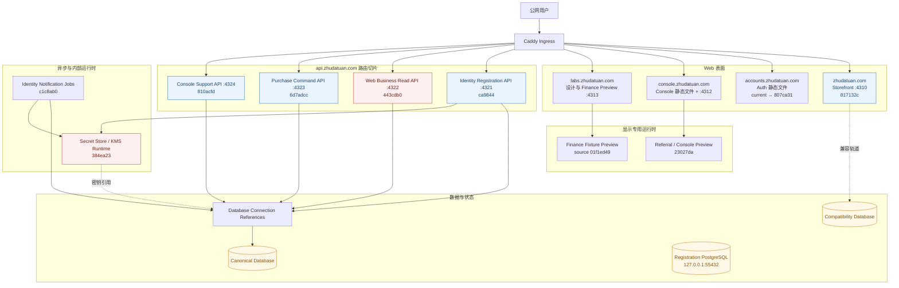
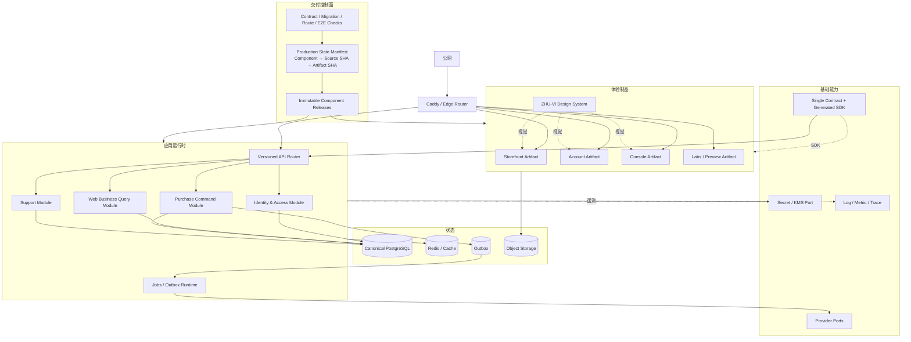
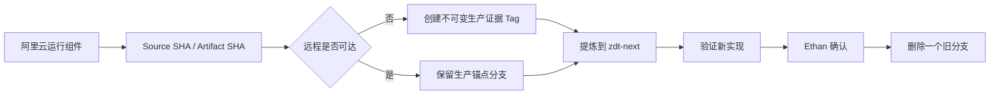

# 阿里云运行真值与生产反推架构

> 取证日期：2026-09-02
> 生产实例：`i-2zeewhay0farxq8lucrd`
> 主机：`123.57.232.253`
> 方法：只读检查 IMDS、Caddy 归一化配置、systemd、进程 CWD、release 元数据、公开源码结构和 Git 祖先关系
> 本轮未执行：部署、重启、配置修改、数据库写入、分支删除、远程标签创建

## 一、核心结论

阿里云不是 GitHub 的“32 条分支同时运行”。生产机采用 release 目录、systemd 服务和 Caddy 路由，运行结构可以被明确还原。

但当前生产也不是“一个 Git SHA 对应整套系统”，而是一个由多份历史 release 共同组成的运行集合：

- 静态 Auth 与 Console 从全局 `current` 目录读取。
- Storefront 进程仍运行在 Order Release 快照。
- 公网 API 按路径拆到四个不同服务和四个不同 release。
- Identity Jobs、Internal Runtime 和预览服务各自运行独立快照。
- 两个活跃进程的原工作目录已经被删除。
- 当前 release 的目录名、`RELEASE-COMMIT`、`RELEASE_COMMIT` 与 `RELEASE-BASE` 指向四个不同提交。

因此后续架构与 GitHub 收口必须以“生产运行集合”为真值，而不能只看 `current`、`main` 或某一个分支名。

## 二、证据优先级

本次机器可读快照保存在：`evidence/production-state-2026-09-02.json`。

后续所有架构提炼和分支关闭按以下顺序判断：

1. 公网域名实际路由。
2. 监听端口与 systemd MainPID。
3. `/proc/<pid>/cwd` 解析出的真实 release，而不是 unit 文件中的 `current` 字符串。
4. release 内的来源提交、Artifact SHA-256 和源码清单。
5. GitHub 对运行提交的可达关系。
6. 旧文档与分支名称。

同一事实发生冲突时，上层证据覆盖下层描述。

## 三、生产入口与运行拓扑



红色节点不是表示当前已宕机，而是表示对应进程仍活跃、原工作目录却已经显示 `(deleted)`，不能在未确认重启输入前随意重启。

## 四、Caddy 公网路由真值

| 公网入口 | 当前处理方式 | 实际来源 |
|---|---|---|
| `zhudatuan.com` | 反向代理 `127.0.0.1:4310` | Storefront Node，实际 CWD 为 `817132c-order-release` |
| `accounts.zhudatuan.com` | 静态文件 | `/opt/zhudatuan/current/apps/auth-web/dist` |
| `console.zhudatuan.com` | 当前 Console 静态文件、Referral 静态文件与 `:4312` Preview 混合 | `current` + `/srv/zhudatuan-display/referral-current` |
| `labs.zhudatuan.com` | 设计快照、Finance 静态文件与 `:4313` Preview | `/srv/zhudatuan-display/*` |
| `api.zhudatuan.com` | 按方法和路径切分到 `:4321`—`:4324` | 四个独立 API Profile |
| `www.zhudatuan.com` | 静态响应 | 重定向入口 |

### API 路由分配

| 请求范围 | 端口 | systemd 服务 |
|---|---:|---|
| `/health/live`、`/health/ready`、`/health/startup` | 4321 | `zhudatuan-api.service` |
| 未被更精确规则命中的 `/api/v1/*` | 4321 | `zhudatuan-api.service` |
| Member、Address、Organization Layers、Dashboard、Catalog、Pricing、Inventory、Cart、Benefit、Order GET | 4322 | `zhudatuan-web-api.service` |
| Checkout Quote、Order、Payment Intent 的 POST / OPTIONS | 4323 | `zhudatuan-purchase-api.service` |
| Support Case 与 Message | 4324 | `zhudatuan-console-support.service` |

这是一种“按能力 Profile 拆分 API”的真实架构，不是四台同构 API 的负载均衡。

## 五、活跃运行单元与真实来源

| 运行单元 | 入口 | MainPID 实际 CWD / 来源 | GitHub 可达性 |
|---|---|---|---|
| `zhudatuan-api` | `IdentityRegistrationApiMain.js` | `ca9844f9...-iam-access-profile` | 被 `ethan/iam-reliability-95` 等远程分支包含 |
| `zhudatuan-web-api` | `WebBusinessApiMain.js` | `443cdb0...-member-invite (deleted)` | **没有任何 GitHub 远程分支包含**；仅本地分支可达 |
| `zhudatuan-purchase-api` | `PurchaseApiMain.js` | `6d7adcc...-brand-unification` | 被 `ethan/iam-reliability-95` 等远程分支包含 |
| `zhudatuan-console-support` | `ConsoleSupportMain.ts` | `810acfd...-invitation-receipt` | 被 IAM、Order、Registration 等远程线包含 |
| `zhudatuan-identity-notification-jobs` | `IdentityNotificationJobsOnlyMain.js` | `c1c8ab0...-identity-sms-recovery` | 被 `ethan/iam-reliability-95` 等远程分支包含 |
| `zhudatuan-internal-runtime` | `InternalRuntimeMain.js` | `384ea23...-full-production (deleted)` | 被 `codex/full-production-20260830` 包含 |
| `zhudatuan-storefront` | Vinext `:4310` | `817132c...-order-release/apps/storefront-web` | 被 `ethan/iam-reliability-95` 等远程分支包含 |
| `zhudatuan-console-preview` | `ConsolePreviewServer.mjs` | `23027da...-graceful-access` | 被 `full-production` 与旧 `main` 包含 |
| `zhudatuan-finance-preview` | `FinancePreviewServer.mjs` | Artifact `2ac8e932...`，source head `01f1ed49...` | Source head 被全部旧远程家族包含 |
| `zhudatuan-registration-database` | Docker Compose | `zhudatuan-registration-postgres` | 独立本机 PostgreSQL，容器健康 |

## 六、数据与内部能力

没有读取任何凭据值。本次仅从环境变量名称和运行结构确认以下边界：

- API 通过 `DATABASE_API_CONNECTION_REF` 获取数据库连接引用。
- Jobs 通过 `DATABASE_JOB_CONNECTION_REF` 获取任务连接引用。
- Identity API 与 Jobs 依赖 Secret Store 和 KMS Endpoint。
- Purchase API 依赖 Secret Store。
- Internal Runtime 承担本地 Secret Store / KMS 运行能力。
- Registration 使用独立 PostgreSQL 容器，监听 `127.0.0.1:55432`。
- Storefront / Auth 的 Compatibility 轨道仍在 release 源码与 Artifact 配置中存在。

“连接引用而非在服务里直接散落连接凭据”是值得保留的设计思想；本地 Secret / KMS 的具体实现是否继续保留，由新架构另行决定。

## 七、部署源码实际组成

当前 `/opt/zhudatuan/current`：

- 指向 `/opt/zhudatuan/releases/807ca31f1999-iam-reliability-95-20260901-213046`。
- 不是 Git 工作区。
- 包含约 63,905 个文件，主要因为 release 自带 `node_modules` 与构建产物。
- 服务器保留 39 个 `/opt/zhudatuan/releases/*` 目录。

当前目录的四个来源标记并不相同：

| 标记位置 | 值 |
|---|---|
| release 目录名 | `807ca31f1999` |
| `RELEASE_COMMIT` | `331460b1761fa0fd1760e5b074bb48b7bf75330b` |
| `RELEASE-COMMIT` | `817132c1638c5049d9789b53ebe8165724a70598` |
| `RELEASE-BASE` | `31b27b78ec88d6f5d24d80c7f3836e54bc8c76e9` |

`.release-input/` 还保存了：

- `source-817132c.tar.gz`
- `auth-dist.tar.gz`
- `console-dist.tar.gz`
- `storefront-dist.tar.gz`
- `commerce-dist.tar.gz`
- Storefront systemd unit输入

这说明当前 release 是组合制品，而不是单一 Git checkout。

### Artifact 清单暴露的双轨

生产源码中的 `config/artifacts.json` 同时声明：

- Canonical：Console、`services/commerce`、Canonical Database。
- Compatibility：Auth、Storefront、`services/commerce-api`、Compatibility Database。
- 两组当前都标记 `releaseEligible: false`。

`SOURCE-MANIFEST.md` 还明确记录，初始源码来自多个 archive 和当时的实体工作树，包含尚未提交的 UI 修改，并非从一个 Git HEAD 重新还原。

因此，阿里云是旧系统最重要的“运行证据”，但不能把整个 `/opt/zhudatuan/current` 原样定义为新架构源码。

## 八、生产运行 SHA 与 GitHub 保护线

### 生产最小远程保护集合

现有生产运行提交主要由两条远程线承接：

1. `ethan/iam-reliability-95@807ca31f19995c7732592ae91bb028d297bd1615`
   - 覆盖 `ca9844`、`810acfd`、`c1c8ab0`、`6d7adcc`、`817132c`、`331460b`、`31b27b7`。
2. `codex/full-production-20260830@a509e3aedcd0`
   - 覆盖 `384ea23` 与 Referral Preview 的 `23027da`。

另有一个必须单独保护的运行提交：

```text
443cdb06d4724ae799e29ee61e97a336d322ec5d
```

它正在承接公网 Web Business API，但 GitHub 没有任何远程分支包含；目前只有本地 `codex/access-center-read-20260830`、`codex/owner-invitation-20260831`、`codex/final-console-integration-20260831` 与 `codex/auth-password-recovery-20260831` 等分支可达。

2026-09-02 已完成远程保护：annotated tag `prod-evidence/2026-09-02/web-business-api-443cdb0` 精确指向该提交。后续仍不得删除该 Tag，直到生产迁移完成并由 Ethan 明确确认。

## 九、从生产反推的业务架构

阿里云当前运行形态已经自然暴露出八个稳定边界：

1. **Experience**：Storefront、Account、Console、Labs。
2. **Identity Entry**：身份注册、会话和访问入口。
3. **Web Business Read**：Member、Organization、Catalog、Pricing、Inventory、Cart、Benefit、Order 查询。
4. **Purchase Command**：Quote、Order、Payment 写入。
5. **Support**：客服 Case 与 Message。
6. **Async Identity**：身份通知任务。
7. **Internal Runtime**：Secret Store 与 KMS 适配。
8. **Preview / Evidence**：Referral、Finance 与设计快照，不应与生产业务 API 混为同一完成状态。

这些边界可以进入 `zdt-next` 的领域设计，但旧系统用“不同历史 release + Caddy 路径切片”实现边界的方式不能直接继承。

## 十、生产反推后的完整目标运行架构



### 目标运行规则

1. 公网运行真值不再由一个含义模糊的全局 `current` 表示，而由机器可读的 Production State Manifest 表示。
2. Manifest 必须逐组件记录 Source Commit、Artifact SHA-256、Contract Version、Migration Head、实际 release 路径和启用时间。
3. systemd 的运行路径必须固定到不可变组件 release；不能让活跃进程依赖后来会移动的全局 symlink。
4. 独立部署组件可以使用不同 Source Commit，但必须由同一 Manifest 声明兼容关系，不能靠目录名猜测。
5. API Profile 可以保留为模块边界；第一阶段优先由一个版本化 API Router 和同一合同承载，减少四份历史 release 的漂移。
6. Preview 和 Fixture 必须使用独立域名、独立 release、独立完成状态，不能作为生产 API 通过的证据。
7. Compatibility 只能作为有截止日期的 Adapter，不能再拥有第二套合同、权限和数据库内核。
8. 每个活跃运行 SHA 都必须有远程不可变 Tag 或 Artifact Archive，不能只存在于本地 worktree。
9. 删除 release 前先确认没有进程 CWD、ExecStart、静态根目录或回滚 Manifest 引用它。
10. 删除 GitHub 分支前先确认其生产提交由其他远程分支或生产证据 Tag 承接。

## 十一、GitHub 逐支收回保护协议



每次最多关闭一条远程分支。关闭前必须同时满足：

1. 分支 tip 和全部独有提交已记录。
2. 它包含的生产 SHA 已由存活远程分支或不可变 Tag 承接。
3. 相关运行能力已被 `zdt-next` 重写、明确延期，或认定只保留证据。
4. 阿里云当前路由与进程不依赖即将清理的 release。
5. Ethan 已看到分支名、tip SHA、承接证据和删除后剩余分支数。

## 十二、已关闭分支 001–004

第一条已完成关闭：

```text
codex/canonical-registration-release@71280439c562e483081fb3412a50ca3eb31f341b
```

理由：

- 它已被 `runtime-readiness-repair`、`full-production`、`backend-reconstruction` 和旧 `main` 后代完整包含。
- 当前生产运行 SHA 不依赖它作为唯一远程引用。
- 删除该分支引用不会删除其提交内容，因为生产锚点分支仍可达。
- 相对 `full-production`、`backend-reconstruction` 与旧 `main` 三个存活末端，它的独有提交数为 `0`。

`443cdb0` 远程证据保护完成后，Ethan 明确授权开始减少第一条分支。该远程分支已删除，分支总数由 32 降为 31；完整记录见 `branch-closures/001-canonical-registration-release.md`。

随后 Ethan 明确授权再关闭三条零独有旧分支，并限定本轮与阿里云无关。执行时逐条完成远端删除、本地清理和删除后验证：

| 编号 | 分支 | tip SHA | 稳定承接线 | 远程分支变化 |
|---:|---|---|---|---:|
| 002 | `codex/purchase-readiness-finance-guard` | `9734c2ec06` | `main`、`full-production`、`backend-reconstruction` | 31 → 30 |
| 003 | `codex/graceful-preview-access-20260830` | `433e0b9401` | `main`、`full-production` | 30 → 29 |
| 004 | `codex/dim-denied-surfaces-20260830` | `b933686885` | `main`、`full-production` | 29 → 28 |

三条分支相对稳定承接线的独有提交均为 `0`，tip 的阿里云/Caddy/systemd/部署路径匹配均为 `0`。本轮未连接生产主机，未检查或修改 release，未重启服务，也未改变 Caddy。详细证据分别见 `branch-closures/002-purchase-readiness-finance-guard.md` 至 `branch-closures/004-dim-denied-surfaces-20260830.md`。

## 十三、当前禁止动作

- 不清理 39 个 release 目录。
- 不重启 `zhudatuan-web-api` 与 `zhudatuan-internal-runtime`。
- 不改变 Caddy 路由。
- 不把 `/opt/zhudatuan/current` 整体复制进 `zdt-next`。
- 不批量清理本地 worktree 或本地分支；每个运行 SHA 仍需逐项核对。
- 不以单个批量命令删除 GitHub 远程分支；即使一次授权多条，也必须按逐支账本顺序执行并逐条验证。

当前正确动作是：持续保存生产证据，逐项提炼架构和迁移能力，并为每一条减少动作建立独立账本。
