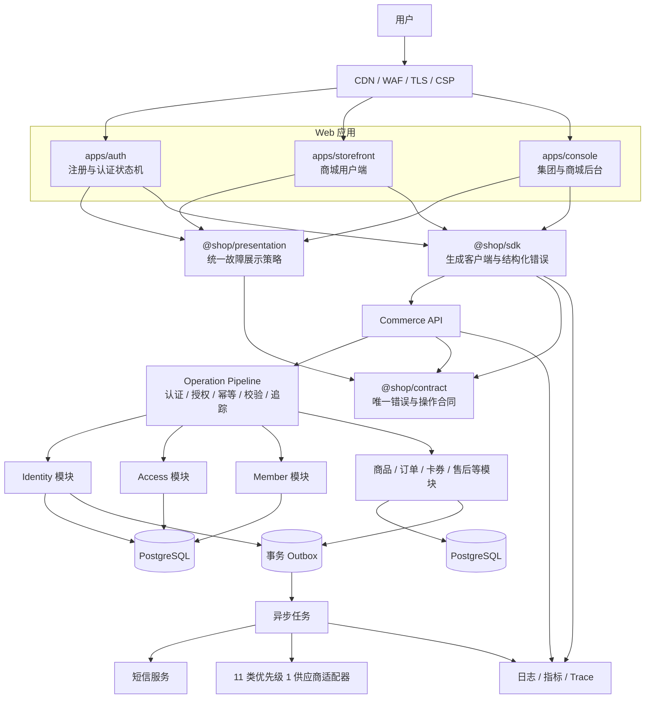
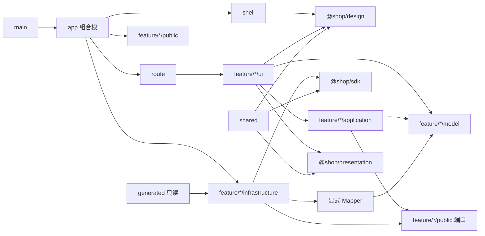
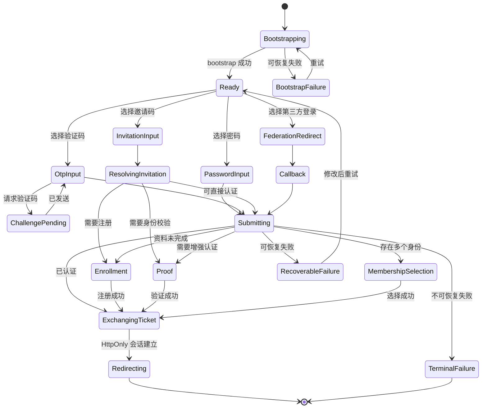
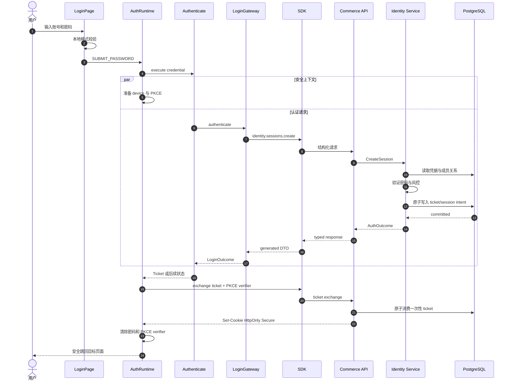
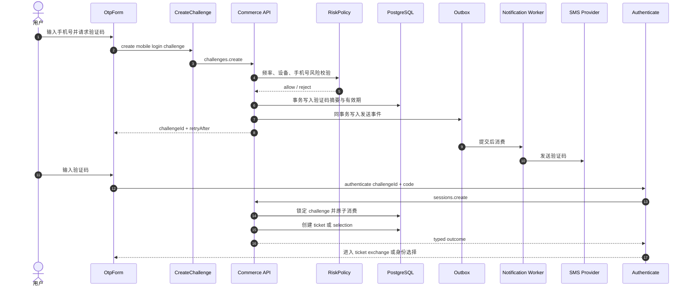
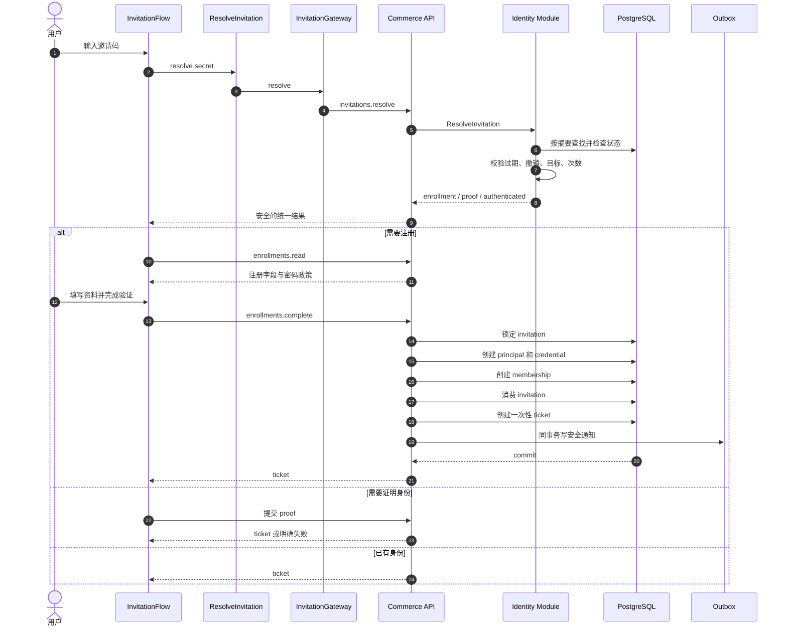
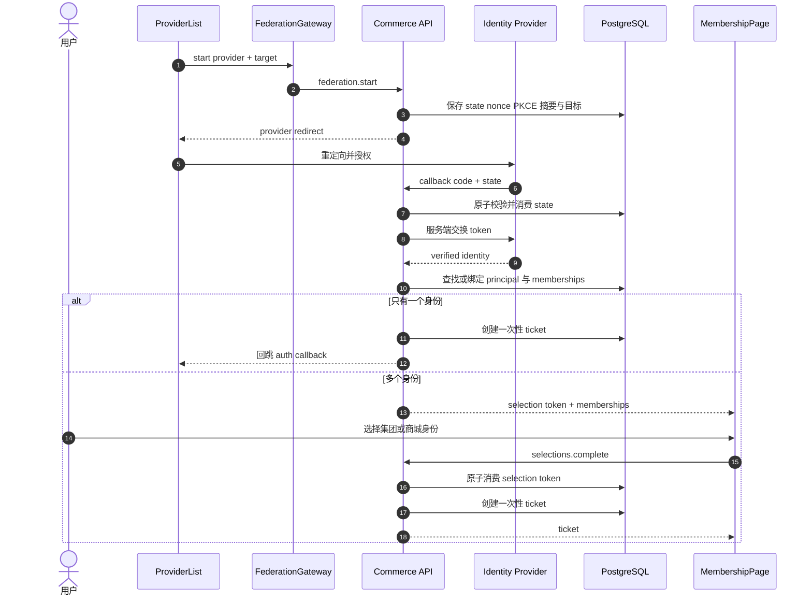
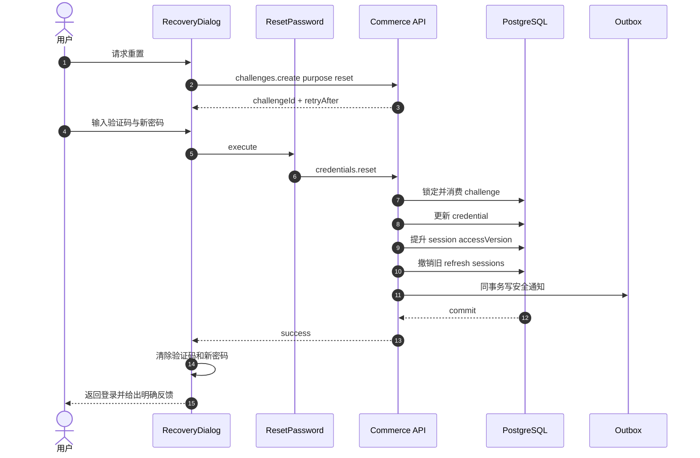
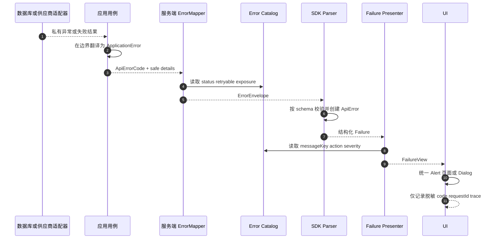

# 结论

是，但需要准确区分“统一”与“照搬”。

1. `apps/auth` 应当与 `apps/storefront` 统一：

   - 顶层目录骨架；
   - 分层语义；
   - 依赖方向；
   - 路由、异常、加载态、空态、对话框等交互规范；
   - 设计令牌和组件体系；
   - TypeScript、测试、构建和架构门禁。

2. `apps/auth` 不应机械复制 `apps/storefront`：

   - 认证是一个安全敏感、短生命周期、命令密集的状态机；
   - 不应为了形式一致而给每个功能强加全部目录；
   - 不应缓存密码、验证码、邀请码、认证票据；
   - 不需要把 React Query 强行引入所有认证命令；
   - storefront 当前也存在应用层耦合 React、未完全使用生成类型等问题，不能作为无条件模板。

3. 所有错误必须统一治理，但不能粗暴压成一个扁平错误枚举：

   - 对外业务错误必须只有一个权威来源；
   - 传输错误、客户端故障、表单校验、用户取消必须有统一分类，但不能伪装成服务端业务错误；
   - 数据库、供应商和程序内部异常不能直接跨越模块或 API 边界；
   - UI 不得解析 `Error.message` 来猜错误码，也不得直接显示任意底层错误文本。

4. 当前项目已经有不错的基础，但还没有达到理想目标：

   - 合同错误目录已有 127 个声明，生成检查和现有门禁通过；
   - `auth` 23 个测试、`storefront` 55 个测试均通过；
   - 命名、边界、重复逻辑、前端边界、视觉和测试拓扑检查均通过；
   - 但是现有检查没有覆盖前端所有 `new Error`、错误消息解析、跨 feature 反向依赖和错误展示策略；
   - MVP 需求追踪目前仍是 `Designed`，没有发布证据，因此只能证明“设计与生成文件一致”，不能证明“MVP 已验收上线”。

本次仅做只读审计，没有修改代码、配置、文档或 Excel。工作区中原有的 `PgAccessRepository.ts`、`AccessPort.test.ts` 和 `outputs/localacceptance/` 变更保持原样，未触碰。

---

# 一、MVP 范围基线

Excel 中“MVP上线功能清单”共有第 3～24 行，认证直接需求在第 23 行，内容是“用户注册、登录（包括密码、验证码、邀请码登录）”。  
:codex-file-citation{path="/Users/changshengwang/Workspace/zhudatuan/docs/福利商城功能清单.xlsx" purpose="source" artifact_kind="workbook" sheet="MVP上线功能清单" range="A23:F23"}

完整 MVP 范围核对如下。  
:codex-file-citation{path="/Users/changshengwang/Workspace/zhudatuan/docs/福利商城功能清单.xlsx" purpose="source" artifact_kind="workbook" sheet="MVP上线功能清单" range="A3:F24"}

| 行 | 范围 | 对本方案的约束 |
|---:|---|---|
| 3 | 平台储备层、商品池、卡券库 | 标记忽略，不因结构治理扩充平台端页面 |
| 4 | 分销层 | 标记忽略 |
| 5 | 集团首页、看板 | 登录后必须正确进入集团作用域 |
| 6 | 集团应用、商城创建/复制/管理/装修 | 认证必须保留企业和商城上下文 |
| 7 | 集团商品池、渠道池、自营池、H5 加价池 | 不改变 storefront/console 的商品域边界 |
| 8 | 集团商品和售后订单 | 错误统一不能抹平订单域具体错误 |
| 9 | 集团卡券中心、客户积分 | 客户、商品及部分积分事项仍待业务确认 |
| 10 | 集团财务 | 标记忽略 |
| 11 | 集团统计 | 保留会话和作用域隔离 |
| 12 | 集团客服配置、聊天和记录 | 身份和权限错误必须可追踪 |
| 13 | 集团管理员、角色、项目、会员、供应商、门店、短信、风控 | 风控事项待确认；不能在本次方案中臆造范围 |
| 14 | 商城首页 | storefront 入口保持不变 |
| 15 | 商城装修 | 登录返回地址需安全保留 |
| 16 | 商城商品池 | 不调整业务能力 |
| 17 | 商城订单 | 不调整业务能力 |
| 18 | 商城卡券和积分 | 积分事项仍待确认 |
| 19 | 商城财务 | 标记忽略 |
| 20 | 商城统计 | 不调整业务能力 |
| 21 | 商城客服 | 不调整业务能力 |
| 22 | 商城设置 | 不调整业务能力 |
| 23 | 用户注册、密码登录、验证码登录、邀请码登录 | 本次 auth 架构的核心硬范围 |
| 24 | 优先级 1 的供应商接口 | 应作为供应链适配器能力，不建立独立用户业务模块 |

接口表中的优先级 1 供应商共 11 类，包括京东、京东生鲜、天猫超市、自有供应商、蛋糕、鲜花、图书、虚拟充值、虚拟餐饮券、电影票和线上餐饮。它们应通过既有供应商端口实现，不应渗入 `auth`。  
:codex-file-citation{path="/Users/changshengwang/Workspace/zhudatuan/docs/福利商城功能清单.xlsx" purpose="source" artifact_kind="workbook" sheet="接口" range="A1:K12"}

生成后的身份需求记录位于 [mvp.yml](/Users/changshengwang/Workspace/zhudatuan/docs/requirements/mvp.yml:3072)，当前状态是 `Designed`，`evidence` 为空，且对应发布证据文件尚不存在。因此最终验收必须补充真实的测试、部署和业务签字证据。

---

# 二、当前架构审计

## 2.1 已经做对的部分

- `storefront` 已经形成 `app/config/feature/generated/route/shared/shell/style` 的宏观结构。
- 大部分 storefront feature 使用 `application/infrastructure/model/public/ui` 分层。
- 后端 identity 模块已基本采用六边形架构：
  - [Manifest.ts](/Users/changshengwang/Workspace/zhudatuan/services/commerce/src/modules/identity/Manifest.ts:1) 声明模块依赖；
  - [Module.ts](/Users/changshengwang/Workspace/zhudatuan/services/commerce/src/modules/identity/Module.ts:137) 作为组合根装配端口、适配器、用例和接口处理器。
- 错误合同已经有中心目录 [errors.yml](/Users/changshengwang/Workspace/zhudatuan/packages/contract/definitions/errors.yml:1)。
- 生成器已经校验格式、HTTP 状态、重试策略、排序及操作错误并集，见 [ContractGenerator.ts](/Users/changshengwang/Workspace/zhudatuan/tools/contractgen/src/ContractGenerator.ts:263)。
- 服务端 [ErrorMapper.ts](/Users/changshengwang/Workspace/zhudatuan/services/commerce/src/foundation/interface/ErrorMapper.ts:6) 已默认把未知错误隐藏为 `INTERNAL_ERROR`，这条安全原则应保留。
- auth 和 storefront 都使用 `@shop/design` 的统一令牌：
  - [auth index.css](/Users/changshengwang/Workspace/zhudatuan/apps/auth/src/index.css:1)
  - [storefront Global.css](/Users/changshengwang/Workspace/zhudatuan/apps/storefront/src/style/Global.css:1)
  - [tokens.json](/Users/changshengwang/Workspace/zhudatuan/packages/design/src/tokens.json:1)

## 2.2 auth 的主要问题

### 结构不统一

目前只有 invitation 接近完整分层；login、membership、selection、callback、link 的组织方式不一致。

更严重的是存在反向依赖：

- [IdentityClient.ts](/Users/changshengwang/Workspace/zhudatuan/apps/auth/src/shared/api/IdentityClient.ts:10) 从 `shared` 导入 invitation feature 的 mapper；
- [AuthenticationState.ts](/Users/changshengwang/Workspace/zhudatuan/apps/auth/src/entity/authentication/AuthenticationState.ts:22) 又导入并重新导出 feature 模型；
- feature 同时反向依赖 entity 中的认证客户端与状态。

这使依赖图不再是单向 DAG，后续增加登录方式、调整 invitation 模型或拆包时容易发生连锁修改。

### `AuthFlow` 承担过多责任

[AuthFlow.tsx](/Users/changshengwang/Workspace/zhudatuan/apps/auth/src/app/AuthFlow.tsx:21) 同时承担：

- 依赖实例化；
- bootstrap 加载；
- 登录方式协调；
- 验证码状态；
- invitation 状态；
- enrollment 状态；
- membership selection；
- 错误转换；
- 页面跳转；
- React 视图渲染。

这是明显的单一职责违背，也导致状态组合不断膨胀。

### `IdentityClient` 成为宽接口

[IdentityClient.ts](/Users/changshengwang/Workspace/zhudatuan/apps/auth/src/shared/api/IdentityClient.ts:32) 包含密码、验证码、邀请码、注册、身份提供商、会员选择、密码重置、bootstrap 和 ticket exchange 等职责。

它还在 [179 行](/Users/changshengwang/Workspace/zhudatuan/apps/auth/src/shared/api/IdentityClient.ts:179) 把已经带有 `code/status/requestId/retryable` 的 `ApiError` 包装成普通 `Error`，导致结构化信息丢失。

### 严格类型配置不一致

- [auth tsconfig](/Users/changshengwang/Workspace/zhudatuan/apps/auth/tsconfig.json:1) 没有继承根配置，也未开启完整 strict 规则；
- [storefront tsconfig](/Users/changshengwang/Workspace/zhudatuan/apps/storefront/tsconfig.json:1) 虽有 `strict`，但也未继承根配置中的 `exactOptionalPropertyTypes`、`noUncheckedIndexedAccess` 等规则。

理想状态是所有应用继承一个根配置，只保留 JSX、DOM、构建输出等真正不同的增量配置。

### UX 存在分裂

- Enrollment 使用 `@shop/design` 的 Dialog/Form/Button；
- PasswordResetDialog 和 TermsDialog 手工实现遮罩与对话框；
- 由此容易产生 Escape、焦点锁定、焦点回归、ARIA、滚动锁定不一致；
- Router 的 Suspense fallback 为 `null`，慢设备会看到短暂空白；
- 身份提供商 bootstrap 失败会被处理成“没有提供商”，用户无法区分“未配置”和“加载失败”；
- membership 只有 `id/target`，界面只能显示泛化名称，多个集团或商城身份难以区分。

## 2.3 storefront 也不是绝对模板

不能把 storefront 当前结构直接复制过去：

- [CartRuntime.ts](/Users/changshengwang/Workspace/zhudatuan/apps/storefront/src/feature/cart/application/CartRuntime.ts:1) 的 application 层导入了 React Router hooks 和其他 feature 的 React hooks，应用层不够纯；
- [SessionRuntime.tsx](/Users/changshengwang/Workspace/zhudatuan/apps/storefront/src/app/SessionRuntime.tsx:54) 使用 `as unknown as BootstrapView`，绕过了生成合同与显式 mapper；
- storefront 与 console 各自维护错误展示映射，存在重复；
- [Failure.ts](/Users/changshengwang/Workspace/zhudatuan/apps/storefront/src/shared/failure/Failure.ts:3) 还通过普通错误消息推断错误码，并可能展示原始消息；
- [QueryState.ts](/Users/changshengwang/Workspace/zhudatuan/apps/console/src/shared/presentation/QueryState.ts:47) 又有另一套错误到 UI 的转换。

因此正确做法是提炼共同规则，同时修正共同缺陷。

---

# 三、目标系统架构



关键原则：

- 浏览器永远不持有数据库或服务供应商凭据；
- `auth` 只负责认证、注册、挑战、选择身份和安全跳转；
- storefront 只消费已经建立的会话；
- identity 模块不直接调用短信和第三方供应商实现，只依赖端口；
- 事务内只写数据库与 outbox，外部发送在事务提交后异步完成；
- 合同、错误码、生成 SDK 和 UI 展示策略形成单向生成链。

---

# 四、统一后的前端依赖规则



必须执行的约束：

- `shared` 禁止导入任何 feature；
- feature 之间只能依赖对方的 `public`；
- `model` 不依赖 React、浏览器 API、SDK DTO 或基础设施；
- `application` 不依赖 React hooks、路由 hooks 或组件；
- `infrastructure` 实现端口并负责 DTO 映射；
- `app` 是唯一依赖装配位置；
- `generated` 文件只能由生成器产生，不允许手改；
- 简单 feature 可以省略没有实际内容的层，不创建形式主义空目录；
- 禁止 `utils`、`helpers`、`managers`、`common` 等职责含糊的目录；
- 生产文件使用有语义的 PascalCase，目录使用简洁小写单词，不出现下划线或连接符。

这体现了：

| 原则 | 落地方式 |
|---|---|
| SRP | 一个用例、端口、mapper、页面各自只承担一个变化原因 |
| OCP | 新登录方式通过策略注册，不修改已有流程分支 |
| LSP | 所有 Gateway 实现同一端口语义和失败约束 |
| ISP | Bootstrap、Challenge、Login、Invitation 等使用小端口，不再依赖巨型 IdentityClient |
| DIP | 用例依赖端口，app 组合根注入 SDK 适配器 |
| 迪米特法则 | UI 只认识 controller/use case/public port，不穿透 SDK 和服务端 DTO |
| 状态模式 | 登录、注册、证明、身份选择使用显式状态机 |
| 策略模式 | 密码、验证码、邀请码、第三方登录实现独立策略 |
| 适配器模式 | SDK、短信、OIDC、供应商均位于边界适配器 |
| Mapper | DTO 与领域/视图模型显式转换 |
| Unit of Work | 注册、邀请码消费、密码重置等保证原子性 |
| Outbox | 外部通知和供应商调用与本地事务可靠衔接 |

---

# 五、建议的 auth 目录结构

下面是最终目标，不要求每层都机械存在；只有承担真实职责时才建立文件。

```text
apps/auth
├── public
├── src
│   ├── app
│   │   ├── App.tsx
│   │   ├── AuthRuntime.tsx
│   │   ├── Dependencies.ts
│   │   └── ErrorBoundary.tsx
│   ├── config
│   │   └── Environment.ts
│   ├── route
│   │   ├── Router.tsx
│   │   ├── Routes.ts
│   │   └── Guard.tsx
│   ├── shell
│   │   ├── AuthShell.tsx
│   │   ├── AuthCard.tsx
│   │   └── AuthFooter.tsx
│   ├── feature
│   │   ├── bootstrap
│   │   │   ├── application
│   │   │   │   └── ReadBootstrap.ts
│   │   │   ├── infrastructure
│   │   │   │   ├── BootstrapGateway.ts
│   │   │   │   └── BootstrapMapper.ts
│   │   │   ├── model
│   │   │   │   └── Bootstrap.ts
│   │   │   └── public
│   │   │       └── BootstrapPort.ts
│   │   ├── login
│   │   │   ├── application
│   │   │   │   ├── Authenticate.ts
│   │   │   │   └── LoginMachine.ts
│   │   │   ├── infrastructure
│   │   │   │   ├── LoginGateway.ts
│   │   │   │   └── LoginMapper.ts
│   │   │   ├── model
│   │   │   │   ├── Credential.ts
│   │   │   │   ├── Login.ts
│   │   │   │   └── LoginState.ts
│   │   │   ├── public
│   │   │   │   └── LoginPort.ts
│   │   │   └── ui
│   │   │       ├── LoginPage.tsx
│   │   │       ├── LoginMethod.tsx
│   │   │       ├── LoginTarget.tsx
│   │   │       ├── PasswordForm.tsx
│   │   │       └── OtpForm.tsx
│   │   ├── challenge
│   │   │   ├── application
│   │   │   │   └── CreateChallenge.ts
│   │   │   ├── infrastructure
│   │   │   │   └── ChallengeGateway.ts
│   │   │   ├── model
│   │   │   │   └── Challenge.ts
│   │   │   ├── public
│   │   │   │   └── ChallengePort.ts
│   │   │   └── ui
│   │   │       └── CodeField.tsx
│   │   ├── invitation
│   │   │   ├── application
│   │   │   │   ├── ResolveInvitation.ts
│   │   │   │   ├── ReadEnrollment.ts
│   │   │   │   └── CompleteEnrollment.ts
│   │   │   ├── infrastructure
│   │   │   │   ├── InvitationGateway.ts
│   │   │   │   └── InvitationMapper.ts
│   │   │   ├── model
│   │   │   │   ├── Invitation.ts
│   │   │   │   ├── Enrollment.ts
│   │   │   │   └── RegistrationPolicy.ts
│   │   │   ├── public
│   │   │   │   └── InvitationPort.ts
│   │   │   └── ui
│   │   │       ├── InvitationForm.tsx
│   │   │       ├── InvitationProof.tsx
│   │   │       ├── EnrollmentPage.tsx
│   │   │       └── InvitationError.tsx
│   │   ├── federation
│   │   │   ├── application
│   │   │   │   ├── ReadProviders.ts
│   │   │   │   └── StartFederation.ts
│   │   │   ├── infrastructure
│   │   │   │   ├── FederationGateway.ts
│   │   │   │   └── FederationMapper.ts
│   │   │   ├── model
│   │   │   │   └── Provider.ts
│   │   │   ├── public
│   │   │   │   └── FederationPort.ts
│   │   │   └── ui
│   │   │       ├── ProviderList.tsx
│   │   │       └── CallbackPage.tsx
│   │   ├── membership
│   │   │   ├── application
│   │   │   │   ├── ReadMemberships.ts
│   │   │   │   └── SelectMembership.ts
│   │   │   ├── infrastructure
│   │   │   │   ├── MembershipGateway.ts
│   │   │   │   └── MembershipMapper.ts
│   │   │   ├── model
│   │   │   │   └── Membership.ts
│   │   │   ├── public
│   │   │   │   └── MembershipPort.ts
│   │   │   └── ui
│   │   │       ├── MembershipPage.tsx
│   │   │       └── MembershipList.tsx
│   │   ├── recovery
│   │   │   ├── application
│   │   │   │   └── ResetPassword.ts
│   │   │   ├── infrastructure
│   │   │   │   └── RecoveryGateway.ts
│   │   │   ├── model
│   │   │   │   └── Recovery.ts
│   │   │   ├── public
│   │   │   │   └── RecoveryPort.ts
│   │   │   └── ui
│   │   │       └── RecoveryDialog.tsx
│   │   └── link
│   │       ├── model
│   │       │   └── Link.ts
│   │       └── ui
│   │           └── LinkPage.tsx
│   ├── shared
│   │   ├── api
│   │   │   ├── Client.ts
│   │   │   └── Context.ts
│   │   ├── security
│   │   │   ├── Device.ts
│   │   │   ├── Secret.ts
│   │   │   └── ReturnTarget.ts
│   │   └── ui
│   │       ├── Alert.tsx
│   │       └── Loading.tsx
│   ├── generated
│   │   └── FeatureBinding.ts
│   ├── style
│   │   └── Auth.css
│   └── main.tsx
├── test
│   ├── contract
│   ├── integration
│   ├── journey
│   └── security
├── package.json
├── tsconfig.json
└── vite.config.ts
```

`packages/presentation` 建议新增为三个 Web 应用共享的纯展示决策包：

```text
packages/presentation
├── src
│   ├── Action.ts
│   ├── Failure.ts
│   ├── Message.ts
│   ├── PresentFailure.ts
│   ├── generated
│   │   └── ErrorPolicy.ts
│   ├── locale
│   │   ├── Chinese.ts
│   │   └── English.ts
│   └── index.ts
├── package.json
└── tsconfig.json
```

该包只生成“展示模型”，不渲染 React，不发请求，也不记录日志：

```text
Failure
→ PresentFailure
→ { title, message, action, severity, requestId, retryable }
→ @shop/design 的 Alert / ResourceState / Dialog
```

## 建议淘汰的旧职责

| 当前文件或目录 | 最终处理 |
|---|---|
| `app/AuthFlow.tsx` | 删除，由 AuthRuntime、LoginMachine 和各 feature UI 分担 |
| `app/Authentication.ts` | 删除，依赖创建集中到 Dependencies |
| `shared/api/IdentityClient.ts` | 删除，拆成各 feature Gateway |
| `entity/authentication/*` | 删除，模型归还对应 feature |
| `feature/selection` | 合并到 membership |
| 手工 PasswordResetDialog | 使用 `@shop/design` Dialog 后由 RecoveryDialog 替换 |
| 手工 TermsDialog | 使用同一 Policy/Dialog 组件替换 |
| 通过错误字符串分支的逻辑 | 全部删除 |
| 旧目录兼容导出和别名 | 不保留 |
| 新旧错误码映射 | 不保留 |
| 新旧路由双运行 | 不保留 |

“彻底抛弃兼容性”应体现在最终切换时只保留一条路径，而不是长期维护 shim、alias、双写或旧 barrel export。

---

# 六、认证状态机



所有状态转换都必须是显式事件，例如：

- `BOOTSTRAP_SUCCEEDED`
- `METHOD_SELECTED`
- `CHALLENGE_CREATED`
- `LOGIN_SUBMITTED`
- `INVITATION_RESOLVED`
- `ENROLLMENT_REQUIRED`
- `MEMBERSHIP_REQUIRED`
- `TICKET_RECEIVED`
- `TICKET_EXCHANGED`
- `RECOVERABLE_FAILED`
- `TERMINAL_FAILED`
- `CANCELLED`

禁止靠多个互相影响的布尔值推断状态。

---

# 七、模块内部数据流

| 模块 | 输入 | 应用层职责 | 基础设施职责 | 输出 | 安全及缓存 |
|---|---|---|---|---|---|
| bootstrap | target、AbortSignal | 校验目标、读取登录能力 | 调 SDK、DTO 映射、singleflight | 品牌、登录方式、供应商、过期时间 | 只缓存非敏感元数据；TTL 取服务端值；失败不能伪装为空列表 |
| login | password/otp/invitation outcome | 本地字段校验、调用认证、驱动状态机 | 调 sessions.create、映射认证结果 | ticket、enrollment、proof、selection | 密码只存在于非受控输入或 Secret 容器；提交后清除 |
| challenge | 手机号、purpose | 防止重复请求、处理倒计时 | 创建 challenge，读取 retryAfter | challengeId、过期时间 | 验证码不缓存；倒计时以服务端时间为准 |
| invitation | 邀请码、proof、资料 | resolve、读取注册策略、完成注册 | 邀请 DTO 映射 | invalid/proof/enrollment/session | 邀请码只通过请求体；服务端存摘要；错误防枚举 |
| federation | provider、return target | 选择策略、启动跳转 | 读取 provider、生成/提交 start 请求 | redirect/callback outcome | state、nonce、PKCE；return target 签名或白名单 |
| membership | selection token、membershipId | 展示和选择可用身份 | 读取列表、提交选择 | ticket | token 一次性；提交使用并发版本控制 |
| recovery | challenge、code、新密码 | 验证政策并执行重置 | 调 reset operation | success/failure | 重置后撤销旧会话并提升 accessVersion |
| link | 已验证 link payload | 解析受支持动作 | 通常不直接联网 | 安全跳转或明确错误 | 禁止任意 URL；未知动作默认拒绝 |
| route | pathname、search、history | 匹配路由和 guard | 无业务请求 | 页面边界 | 返回地址规范化；不接受开放重定向 |
| app | 配置、端口实现 | 组合依赖和生命周期 | 创建 SDK client | AuthRuntime | 不保存业务数据，不包含领域分支 |
| shell | 视图模型 | 布局、焦点、响应式 | 无 | 一致 UI | 不接触 SDK、token 或 secret |
| shared | 通用无业务能力 | 安全工具、API context | 最薄封装 | 可复用原语 | 禁止依赖 feature |
| generated | 合同输入 | 无手写逻辑 | 由生成器覆盖 | 强类型 binding | CI 校验无漂移 |

---

# 八、关键调用时序

## 8.1 密码登录



密码哈希本身应保持足够昂贵，不能为了“高性能”降低安全参数。性能优化应通过受控并发、专用工作池、容量规划和限流实现。

## 8.2 验证码登录



必须做到：

- 同一 challenge 只能消费一次；
- 验证码只存带 pepper 的摘要；
- 服务端控制过期、最大尝试次数和重发间隔；
- 手机号不存在与验证码错误尽量采用一致外部响应，避免枚举；
- UI 不根据本地倒计时擅自允许重发。

## 8.3 邀请码与注册



注册事务必须保证：身份、凭据、成员关系、邀请码消费和 ticket 创建要么全部成功，要么全部失败。

## 8.4 第三方认证与身份选择



membership 合同建议硬切增加：

- `displayName`
- `organizationName`
- `scopeKind`
- `scopeId`
- `roleLabel`
- 可选 `logoUrl`

仅有 `id` 和 `target` 不足以提供友好的多身份选择体验。

## 8.5 密码重置



---

# 九、错误码理想方案

## 9.1 一个权威目录，三个命名空间

建议把现有 `errors.yml` 升级为单一治理源，但分成三类：

| 分类 | 示例 | 是否进入 API 合同 | 是否可直接用于 UI |
|---|---|---:|---:|
| `api` | `CREDENTIAL_INVALID`、`INVITATION_INVALID` | 是 | 经展示策略转换后可以 |
| `transport` | `OFFLINE`、`TIMEOUT`、`UNAVAILABLE`、`CONTRACT_INVALID` | 否 | 经展示策略转换 |
| `client` | `RETURN_TARGET_INVALID`、`ROOT_MISSING`、`SESSION_CONTEXT_MISSING` | 否 | 通常只展示统一内部错误 |
| `FieldIssue` | 手机号格式错误、密码为空 | 否，也不是错误码 | 表单字段附近直接展示 |
| 内部异常 | SQL、Redis、OIDC、供应商原始异常 | 否，不分发稳定码 | 永不直接展示 |

这样既满足“所有命名错误都统一管理”，又不会污染公开 API。

原来的 `ErrorCode` 应明确改名为：

- `ApiErrorCode`
- `TransportErrorCode`
- `ClientErrorCode`
- `FailureCode`，仅作为前三者的联合类型

用户取消、Abort 和页面离开是控制流结果，不应伪造成错误码。

## 9.2 每个 API 错误的必填元数据

| 字段 | 说明 |
|---|---|
| `code` | 永久稳定、唯一、全大写下划线 |
| `owner` | 所属领域模块 |
| `category` | authentication、authorization、validation、conflict、rate、dependency、internal 等 |
| `status` | 唯一规范 HTTP 状态 |
| `retryable` | 客户端是否允许原请求重试 |
| `retryAfter` | 是否允许返回建议等待时间 |
| `audit` | 是否生成安全审计事件 |
| `exposure` | message、generic、hidden |
| `action` | retry、signin、stepup、refresh、contact、none |
| `messageKey` | UI 本地化键 |
| `details` | 允许暴露的详情 schema |
| `operations` | 由 operations.yml 反向校验，不手工重复配置 |

禁止为同一语义在代码里再次配置 status、message、retryable 或 action。

## 9.3 端到端类型传播

当前 [ErrorSchema.ts](/Users/changshengwang/Workspace/zhudatuan/packages/contract/src/ErrorSchema.ts:4) 把 `code` 定义为普通 `string`，[SDK ApiError](/Users/changshengwang/Workspace/zhudatuan/packages/sdk/src/error/index.ts:3) 也使用 `string`，会丢失生成器已经掌握的信息。

理想类型链应为：

```text
errors.yml
→ ApiErrorCodeSchema
→ ApiErrorCode
→ OperationErrorFor<OperationKey>
→ ApiError<TCode>
→ Failure
→ FailureView
```

每个 operation 只能抛出其 `errorUnion` 中声明的公开错误；未知异常只能映射成 `INTERNAL_ERROR`。

## 9.4 错误调用时序



标准响应建议为：

```text
{
  code,
  message,
  requestId,
  retryable,
  retryAfter?,
  details?
}
```

其中 `message` 只能作为安全后备信息，UI 正常情况下使用 `messageKey` 的本地化文本，不直接展示任意服务端或 JavaScript `Error.message`。

## 9.5 必须新增的静态门禁

现有 [errors.mjs](/Users/changshengwang/Workspace/zhudatuan/scripts/check/errors.mjs:41) 应继续保留，但扩展为 AST 级检查：

- 扫描所有生产 TS/TSX 中的 `new Error`；
- 扫描所有错误 switch、映射表 key 和字符串比较；
- 禁止 `error.message.split(...)`、正则提取错误码；
- 禁止前端展示未知 `cause.message`；
- 校验每个公开码存在于目录；
- 校验 handler 只能产生当前 operation 的 errorUnion；
- 校验每个公开错误有展示策略和中文文案；
- 校验 status、action、retryable 不冲突；
- 校验安全详情只包含 schema 允许字段；
- 校验数据库、OIDC、短信和供应商原始异常不会进入响应；
- 未使用的错误必须明确标记 `reserved`，否则删除；
- 不允许别名错误码和兼容映射。

诸如 `AUTHORIZATION_DENIED`、`SCOPE_DENIED`、`PERMISSION_DENIED` 可能在 UI 上呈现为相似文案，但服务端、审计和运维语义不能因此合并。

---

# 十、UI 与 UX 统一方案

## 页面结构

所有认证页面统一为：

```text
品牌区
  └─ Logo、商城/集团名称、简短说明
认证卡片
  ├─ 页面标题
  ├─ 当前目标提示
  ├─ 登录方式切换
  ├─ 表单或流程内容
  ├─ 主操作
  ├─ 次操作
  └─ 安全及隐私说明
页脚
  └─ 协议、隐私、帮助、备案信息
```

## 交互规则

- 首屏永远有 skeleton 或明确加载态，禁止空白 fallback。
- 登录方式切换后保留手机号等非敏感输入，清除密码、验证码和邀请码。
- 提交后按钮进入 loading，防止重复请求。
- 可重试错误保留用户可修正的字段。
- 不可重试或安全错误清除全部秘密数据。
- 网络失败显示“网络不可用/请求超时”，不能显示成账号错误。
- 第三方登录加载失败显示独立错误和重试按钮，不能伪装为无提供商。
- 对话框全部使用 `@shop/design` 的统一 Dialog：
  - Escape 关闭；
  - 焦点锁定；
  - 关闭后焦点回归触发按钮；
  - 移动端避免键盘遮挡；
  - 页面滚动锁定；
  - 正确 `aria-labelledby` 和 `aria-describedby`。
- 错误摘要在卡片顶部，字段问题出现在字段旁边。
- 服务端问题展示 `requestId`，支持复制，但默认不展示内部堆栈。
- 多身份列表显示组织、商城、角色和目标，不让用户根据内部 ID 猜测。
- 返回地址被拒绝时回到明确的默认首页，并说明原因。
- 所有成功、失败、警告、空态使用统一视觉语义。
- 颜色不是唯一信息载体；图标、标题和文字共同表达状态。
- 支持键盘完成全部流程，触控目标不小于 44px。
- 尊重 `prefers-reduced-motion`。
- 中文错误文本采用简单动作语言，例如“验证码已过期，请重新获取”，避免技术术语。

视觉层继续复用现有设计令牌，禁止 auth 和 storefront 各自硬编码新的品牌色、圆角、阴影、间距和字体。

---

# 十一、安全设计

| 范围 | 要求 |
|---|---|
| 会话 | HttpOnly、Secure、Host-only Cookie；合理 SameSite；服务端过期和撤销 |
| CSRF | 所有改变状态的 cookie 请求验证 Origin/CSRF token |
| 联邦认证 | state、nonce、PKCE；state 一次性；callback 严格绑定发起设备 |
| 返回地址 | 相对路径规范化或签名目标；严格白名单；禁止开放重定向 |
| 密码 | 符合政策；服务端强哈希；永不日志记录；提交后立即释放引用 |
| 验证码 | 只存摘要；限时、限次、限频；原子消费 |
| 邀请码 | 请求体提交；数据库只存摘要；统一无效响应；避免状态枚举 |
| Ticket | 短时、一次性、绑定 PKCE/device/target；消费使用事务条件更新 |
| 风控 | 账号、手机号、IP、设备、组织多维限流；可配置策略 |
| 日志 | 自动脱敏 password、code、invitation、token、cookie、authorization |
| 浏览器 | CSP、HSTS、frame-ancestors、Referrer-Policy、Permissions-Policy |
| 第三方脚本 | auth 页面默认禁止动态第三方脚本；统计需走受控白名单 |
| 缓存 | 认证响应 `no-store`；bootstrap 只缓存公开元数据 |
| 枚举攻击 | 登录、注册、重置和邀请码响应在文案与时延上避免暴露存在性 |
| 依赖 | 锁文件固定、漏洞扫描、供应链校验、最小运行权限 |
| 审计 | 登录成功/失败、重置、邀请码、身份切换、管理员操作均产生结构化审计 |

---

# 十二、数据一致性

| 场景 | 一致性边界 |
|---|---|
| 邀请注册 | principal、credential、membership、invitation consumption、ticket、outbox 同事务 |
| 验证码验证 | challenge 锁定、尝试次数、usedAt、ticket 同事务 |
| 身份选择 | selection token 消费与 ticket 创建同事务 |
| 密码重置 | credential 更新、accessVersion 提升、旧会话撤销、outbox 同事务 |
| 会话创建 | ticket/session intent 在数据库提交后才返回 |
| Cookie 建立 | 通过一次性 ticket 桥接数据库提交和浏览器 Set-Cookie |
| 外部通知 | 同事务写 outbox，提交后异步发送 |
| 重复提交 | 使用业务幂等键或条件更新，不依赖前端按钮禁用 |
| 并发更新 | 使用 expectedVersion、唯一约束或行锁 |
| 缓存 | PostgreSQL 是事实源；缓存失败不影响正确性 |
| 前端状态 | 不在 localStorage 保存会话真相、验证码、邀请码或注册 secret |

不得为了高并发引入最终一致性到邀请码消费、验证码消费、密码重置或身份选择这些安全关键路径。

---

# 十三、性能、可用性和可配置性

## 建议性能目标

以下是目标值，不是当前实测结果：

| 指标 | 目标 |
|---|---:|
| Auth LCP，移动 4G，p75 | ≤ 2.0 秒 |
| INP，p75 | ≤ 200 毫秒 |
| CLS | ≤ 0.1 |
| 首屏 JS gzip | ≤ 170 KB |
| bootstrap API p95 | ≤ 300 毫秒 |
| provider 列表 p95 | ≤ 300 毫秒 |
| 密码登录 p95，不含用户交互 | ≤ 800 毫秒 |
| ticket exchange p95 | ≤ 800 毫秒 |
| UI 操作反馈 | ≤ 100 毫秒 |
| 非第三方认证可用性 | ≥ 99.95% |

优化方式：

- bootstrap 与 PKCE/device 初始化并行；
- enrollment、recovery、membership 页面按路由懒加载；
- 同 target 的 bootstrap 使用 singleflight；
- 请求切换时使用 AbortSignal 取消旧请求；
- 防止双击和重复提交；
- provider logo 和非关键帮助内容延迟加载；
- 生成代码启用 tree shaking；
- 不把 console/storefront 依赖打进 auth；
- 服务端连接池、查询索引和容量限制独立调优；
- 密码验证采用受控工作池，防止 CPU 饥饿；
- 慢供应商调用通过超时、熔断和隔离舱保护；
- 密码登录不依赖 provider 列表成功，提供可解释的局部降级。

## 配置原则

- 所有环境变量通过 `@shop/config` 的 schema 校验；
- 同一配置只定义一次；
- 浏览器只接收公开配置；
- repo 只保留 `.env.example`，真实环境配置通过部署平台注入；
- bootstrap TTL 由服务端返回，不在客户端写死；
- 登录方式、密码政策、provider 能力由服务端 bootstrap 提供；
- 安全上限仍由服务端控制，客户端配置不能放宽；
- 不允许运行时到处读取 `import.meta.env`；
- 配置读取只发生在 `config/Environment.ts` 和组合根。

---

# 十四、扩展性设计

新增认证方式时，只需要：

1. 增加新的 `Credential` 变体；
2. 实现对应 `AuthenticationStrategy`；
3. 注册到服务端 provider/strategy registry；
4. 由 bootstrap 返回可用能力；
5. 前端新增 feature UI 或复用现有 UI；
6. 在 operation contract 中声明输入、输出和错误；
7. 生成 SDK；
8. 补充状态机转换和测试。

不允许修改巨型 `switch`、复制 IdentityClient、复制错误映射或复制 Dialog。

插件化应是受控的编译期/服务端注册机制，而不是在认证页动态执行第三方 JavaScript。

---

# 十五、测试与发布门禁

| 层级 | 必须覆盖 |
|---|---|
| 模型单测 | LoginMachine 全部状态和非法转换 |
| 用例单测 | 每个 use case 的成功、公开失败、transport failure、取消 |
| Mapper 单测 | 每个 DTO 分支；未知 discriminator 必须失败 |
| 合同测试 | 每个 operation 的请求、响应、errorUnion |
| 组件测试 | 键盘、焦点、ARIA、loading、错误、重试 |
| 集成测试 | Gateway + mock server + SDK schema |
| 浏览器旅程 | 密码、验证码、邀请码注册、邀请码登录、第三方、身份选择、重置 |
| 安全测试 | CSRF、开放重定向、重放、过期、枚举、日志泄露 |
| 并发测试 | challenge、ticket、invitation、selection 的双消费 |
| 性能测试 | 首屏 bundle、Core Web Vitals、API p95/p99 |
| 故障测试 | DB 超时、SMS 失败、provider 失败、网络断开、重复回调 |
| 视觉回归 | 认证全部状态、37 个既有路由、8 个既有 viewport |
| 可访问性 | axe、键盘旅程、屏幕阅读器关键路径 |
| 需求追踪 | Excel → mvp.yml → route/operation → test → release evidence |

发布阻断条件：

- 任一公开错误无目录声明；
- 任一 UI 错误无统一展示策略；
- 任一 operation 可产生未声明错误；
- 任一秘密进入日志、localStorage 或 URL；
- 任一安全 ticket 可以重复消费；
- 任一 MVP 第 23 行旅程未通过；
- 优先级 1 供应商集成门禁未通过；
- `MVPIDENTITY` 仍没有正式发布证据。

---

# 十六、推荐实施顺序

虽然最终是硬切换，内部实施仍应分阶段完成：

1. **建立基线**

   - 固化现有测试、bundle、性能和视觉基线；
   - 为 MVP 第 23 行建立明确验收用例；
   - 不先移动目录。

2. **升级错误合同**

   - 将错误目录升级为 api/transport/client 三类；
   - 生成强类型错误码和 operation-specific error；
   - 新增 `@shop/presentation`；
   - 扩展错误静态门禁；
   - 先让三个应用共享展示策略。

3. **统一编译配置**

   - auth、storefront 继承根 tsconfig；
   - 清除 `unknown as` 和不安全的 DOM 假设；
   - 开启完整 strict 检查。

4. **拆分 IdentityClient**

   - 建立 Bootstrap、Login、Challenge、Invitation、Federation、Membership、Recovery 小端口；
   - 复用现有 SDK 调用与 mapper；
   - app 组合根完成注入。

5. **拆分 AuthFlow**

   - 引入 LoginMachine；
   - 将 React 渲染移入各 feature UI；
   - 将副作用移入用例和 Gateway；
   - route 和 shell 只做各自职责。

6. **统一 UI/UX**

   - 全部 Dialog 使用 design 组件；
   - 补充 skeleton、错误重试、焦点管理；
   - 丰富 membership 展示合同；
   - 修复 provider 加载失败的静默降级。

7. **安全和一致性验证**

   - 验证 ticket、challenge、invitation、selection 的单次消费；
   - 验证日志脱敏、CSRF、PKCE、return target；
   - 完成双提交和并发测试。

8. **硬切换**

   - 一次性替换入口；
   - 删除旧 AuthFlow、IdentityClient、entity authentication 和 selection；
   - 删除旧错误映射、旧路由与兼容导出；
   - 不留双轨。

9. **正式验收**

   - 运行全部质量门禁；
   - 建立 `MVPIDENTITY` 发布证据；
   - 完成业务、安全、性能和可访问性签字；
   - 只有此时才能把状态从 `Designed` 改为已验收。

---

# 最终裁决

最理想的方向不是“让 auth 看起来像 storefront”，而是让两者服从同一套架构宪法：

- 相同的宏观骨架；
- 相同的依赖方向；
- 相同的质量和错误治理；
- 相同的视觉与交互语言；
- 不同业务域保留最适合自己的内部模型。

错误方面，应当实现“一个治理源、清晰分类、强类型传播、一次边界翻译、统一展示”，而不是“所有东西都叫业务错误”。

按上述方案落地后，`auth` 会从一个由 `AuthFlow + IdentityClient` 集中协调的应用，转变为由小型用例、显式端口、安全状态机和统一展示策略组成的模块化认证前端；同时不会扩张 Excel MVP 范围，也不会复制 storefront 已存在的结构性缺陷。