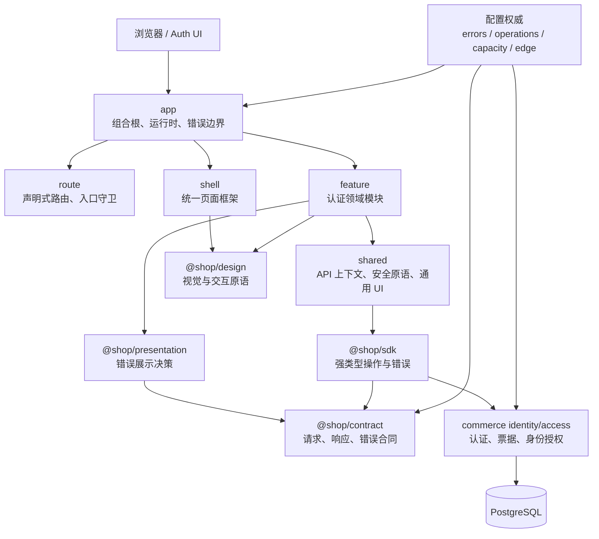
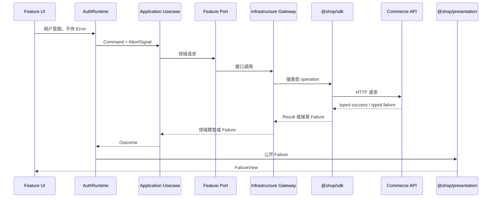
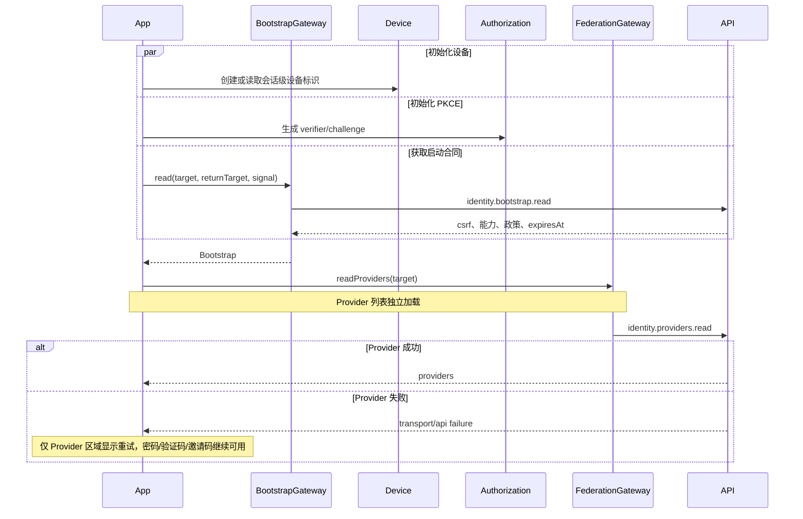
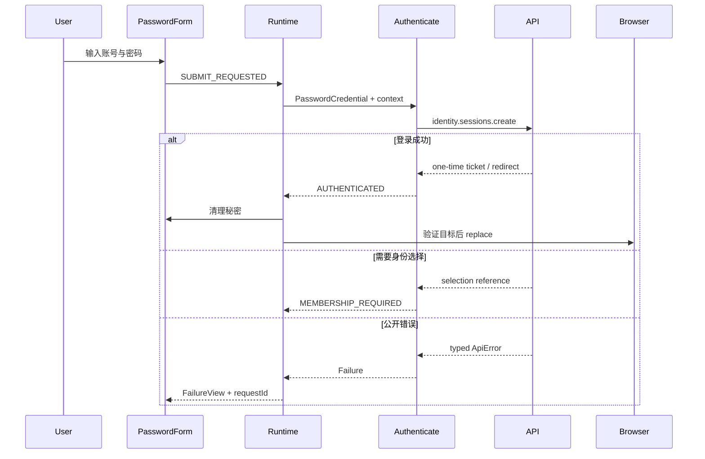
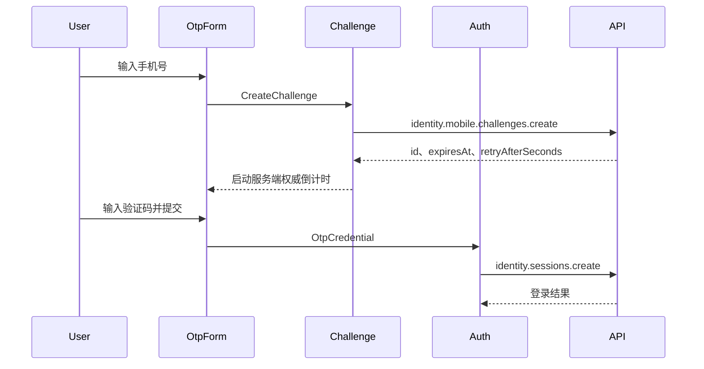
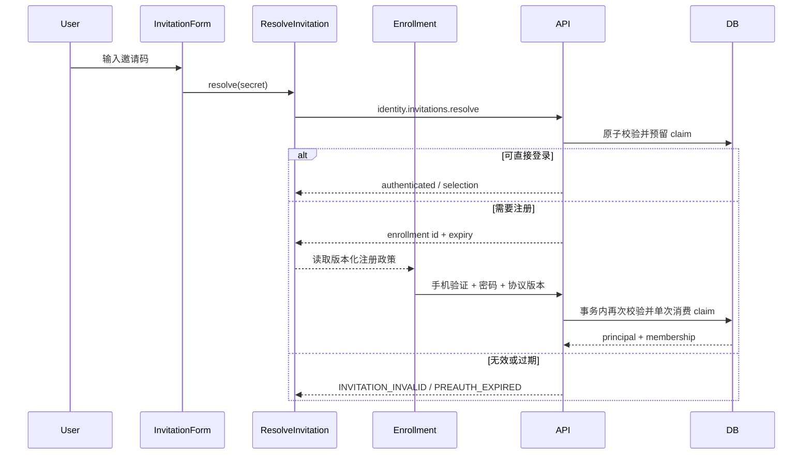
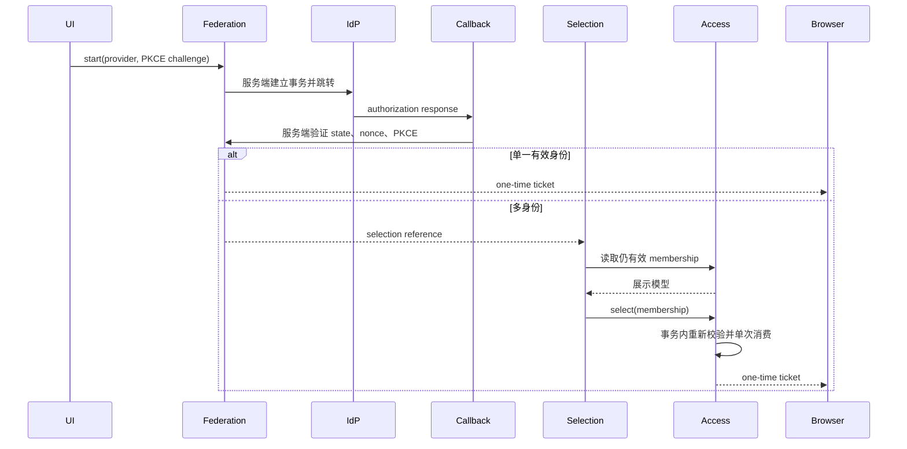
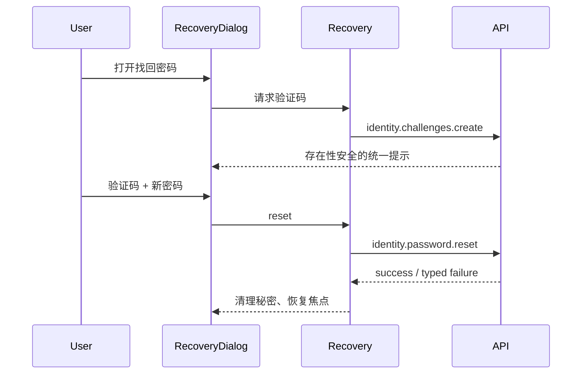

# 结论

应该统一，但必须统一的是“架构规则、依赖方向、错误治理、设计语言、质量门禁和交付证据”，不是把 `apps/storefront` 的目录机械复制到 `apps/auth`。

严格按照 [Auth前端代码结构统一.md](/Users/changshengwang/Workspace/zhudatuan/docs/architecture/Auth前端代码结构统一.md:1)，最终方案应当是：

- `auth` 与 `storefront` 使用相同的宏观架构宪法。
- `auth` 保留认证域独有的状态机、秘密数据管理、PKCE、一次性票据和身份选择模型。
- 所有跨网络、跨模块、需要被 UI 分支处理的错误统一治理。
- 表单字段问题 `FieldIssue`、请求取消和服务端私有异常不能被粗暴塞进公开错误码目录。
- 不保留旧目录兼容导出、旧错误别名、旧路由、双写或双运行。
- 登录页不能继续依赖巨型 `AuthFlow`、全局 `Authentication` 单例和巨型 `IdentityClient`。
- MVP 直接边界以 Excel 第 23 行的“用户注册、登录，包括密码、验证码、邀请码登录”为准；第三方认证、密码找回、身份选择是认证平台已有支撑能力，但不得阻断这三条 MVP 主链路。
- Excel 第 24 行的优先级 1 供应商属于商品/履约接口，不是身份认证 Provider，不能混入 Auth 模块设计。

:codex-file-citation{path="/Users/changshengwang/Workspace/zhudatuan/docs/福利商城功能清单.xlsx" purpose="source" artifact_kind="workbook" sheet="MVP上线功能清单" range="A23:F24"}

:codex-file-citation{path="/Users/changshengwang/Workspace/zhudatuan/docs/福利商城功能清单.xlsx" purpose="source" artifact_kind="workbook" sheet="接口" range="A1:K12"}

---

# 一、当前基线与真实差距

我完成了只读审计，没有修改任何代码。

| 项目 | 当前结果 | 结论 |
|---|---:|---|
| Auth 测试 | 7 个文件、23 个测试通过 | 仅证明现有用例通过 |
| Auth TypeScript 检查 | 通过 | 当前 `tsconfig` 没有完整严格模式，绿灯强度不足 |
| 生成物检查 | 通过 | 未覆盖新增架构文档和未来 `presentation` 包 |
| 错误检查 | 127 个声明、106 个字面量，通过 | 没检查错误保真、UI 原始错误、operation-specific error |
| 前端检查 | 通过 | 没识别 Tailwind 命名色绕过设计令牌 |
| 视觉检查 | 37 个路由、8 个 viewport，通过 | Auth 源文件仍错误指向已退役的 `apps/auth-web` |
| 命名检查 | 通过 | 目标新增文件仍须纳入同一门禁 |
| Auth 源文件 | 53 个 | 文件数量不大，主要问题是职责聚合与边界错误 |

当前最严重的实质问题：

1. [AuthFlow.tsx](/Users/changshengwang/Workspace/zhudatuan/apps/auth/src/app/AuthFlow.tsx) 集中了启动、方法切换、验证、错误文案、身份选择和跳转，存在十多个局部状态，缺少显式状态机。
2. [IdentityClient.ts](/Users/changshengwang/Workspace/zhudatuan/apps/auth/src/shared/api/IdentityClient.ts:183) 捕获 `ApiError` 后重新抛出普通 `Error`，丢失 `code/status/requestId/retryable/details`。
3. 同一文件硬编码 `540000ms` bootstrap TTL，客户端成为错误的配置权威。
4. [AuthProvider.tsx](/Users/changshengwang/Workspace/zhudatuan/apps/auth/src/app/AuthProvider.tsx:28) 和多个页面抛出、展示原始字符串错误。
5. Auth 中存在约 99 处 `slate/blue/rose/amber` 等 Tailwind 原始色类，但现有门禁只禁止 hex/rgb/hsl，因此出现“检查通过但视觉规则被绕过”。
6. [TermsDialog.tsx](/Users/changshengwang/Workspace/zhudatuan/apps/auth/src/shared/ui/TermsDialog.tsx) 手工实现 Dialog 并硬编码法律文本，与服务端注册政策形成双权威。
7. [MembershipPage.tsx](/Users/changshengwang/Workspace/zhudatuan/apps/auth/src/feature/membership/MembershipPage.tsx) 只能展示贫乏的身份信息。
8. [config/visuals.yml](/Users/changshengwang/Workspace/zhudatuan/config/visuals.yml:78) 仍指向不存在的 `apps/auth-web/src/screens/LoginPage.tsx`。
9. [config/authorities.yml](/Users/changshengwang/Workspace/zhudatuan/config/authorities.yml) 只登记了商城架构文档，没有登记新的 Auth 架构权威。
10. [config/requirements.yml](/Users/changshengwang/Workspace/zhudatuan/config/requirements.yml:273) 中 `MVPIDENTITY` 仍是 `Designed`，正式验收证据尚未闭环。

因此，现有绿灯不能作为目标架构已经满足的证据；必须同时修改代码和增强门禁。

---

# 二、目标系统架构

严格遵守文档中“相同宏观骨架、不同领域模型”的原则：



依赖方向固定为：

```text
ui → application → model/public
infrastructure → public
app/Dependencies → infrastructure + application
shared/api → @shop/sdk
presentation → @shop/contract
design → 不依赖业务、SDK 或 presentation
```

禁止：

- `model` 引用 React、SDK、浏览器 API。
- `application` 直接调用 `fetch`、`window.location`、`sessionStorage`。
- 一个 feature 直接引用另一个 feature 的 infrastructure。
- `shared` 反向引用 feature。
- UI 根据错误字符串、HTTP 状态或 SDK 实例自行决定文案。
- 任何组件直接读取 `import.meta.env`。
- 新增 service locator、全局单例或巨型 facade。

---

# 三、最终目录结构

以下结构在原文目标树基础上补齐现有真实职责，没有机械制造空层：

```text
apps/auth
├── public
│   └── 品牌静态资源
├── src
│   ├── app
│   │   ├── App.tsx
│   │   ├── AuthRuntime.tsx
│   │   ├── Dependencies.ts
│   │   └── ErrorBoundary.tsx
│   ├── config
│   │   └── Environment.ts
│   ├── route
│   │   ├── Router.tsx
│   │   ├── Routes.ts
│   │   └── Guard.tsx
│   ├── shell
│   │   ├── AuthShell.tsx
│   │   ├── AuthCard.tsx
│   │   └── AuthFooter.tsx
│   ├── feature
│   │   ├── bootstrap
│   │   │   ├── application
│   │   │   │   └── ReadBootstrap.ts
│   │   │   ├── infrastructure
│   │   │   │   ├── BootstrapGateway.ts
│   │   │   │   └── BootstrapMapper.ts
│   │   │   ├── model
│   │   │   │   └── Bootstrap.ts
│   │   │   └── public
│   │   │       └── BootstrapPort.ts
│   │   ├── login
│   │   │   ├── application
│   │   │   │   ├── Authenticate.ts
│   │   │   │   └── LoginMachine.ts
│   │   │   ├── infrastructure
│   │   │   │   ├── LoginGateway.ts
│   │   │   │   └── LoginMapper.ts
│   │   │   ├── model
│   │   │   │   ├── Credential.ts
│   │   │   │   ├── Login.ts
│   │   │   │   └── LoginState.ts
│   │   │   ├── public
│   │   │   │   └── LoginPort.ts
│   │   │   └── ui
│   │   │       ├── LoginPage.tsx
│   │   │       ├── LoginMethod.tsx
│   │   │       ├── LoginTarget.tsx
│   │   │       ├── PasswordForm.tsx
│   │   │       └── OtpForm.tsx
│   │   ├── challenge
│   │   │   ├── application
│   │   │   │   └── CreateChallenge.ts
│   │   │   ├── infrastructure
│   │   │   │   └── ChallengeGateway.ts
│   │   │   ├── model
│   │   │   │   └── Challenge.ts
│   │   │   ├── public
│   │   │   │   └── ChallengePort.ts
│   │   │   └── ui
│   │   │       ├── CodeField.tsx
│   │   │       └── useCooldown.ts
│   │   ├── invitation
│   │   │   ├── application
│   │   │   │   ├── ResolveInvitation.ts
│   │   │   │   ├── ReadEnrollment.ts
│   │   │   │   └── CompleteEnrollment.ts
│   │   │   ├── infrastructure
│   │   │   │   ├── InvitationGateway.ts
│   │   │   │   └── InvitationMapper.ts
│   │   │   ├── model
│   │   │   │   ├── Invitation.ts
│   │   │   │   ├── Enrollment.ts
│   │   │   │   └── RegistrationPolicy.ts
│   │   │   ├── public
│   │   │   │   └── InvitationPort.ts
│   │   │   └── ui
│   │   │       ├── InvitationForm.tsx
│   │   │       ├── InvitationProof.tsx
│   │   │       ├── MobileProof.tsx
│   │   │       ├── PasswordSetup.tsx
│   │   │       ├── EnrollmentPage.tsx
│   │   │       └── InvitationError.tsx
│   │   ├── federation
│   │   │   ├── application
│   │   │   │   ├── ReadProviders.ts
│   │   │   │   └── StartFederation.ts
│   │   │   ├── infrastructure
│   │   │   │   ├── FederationGateway.ts
│   │   │   │   └── FederationMapper.ts
│   │   │   ├── model
│   │   │   │   └── Provider.ts
│   │   │   ├── public
│   │   │   │   └── FederationPort.ts
│   │   │   └── ui
│   │   │       ├── ProviderList.tsx
│   │   │       └── CallbackPage.tsx
│   │   ├── membership
│   │   │   ├── application
│   │   │   │   ├── ReadMemberships.ts
│   │   │   │   └── SelectMembership.ts
│   │   │   ├── infrastructure
│   │   │   │   ├── MembershipGateway.ts
│   │   │   │   └── MembershipMapper.ts
│   │   │   ├── model
│   │   │   │   └── Membership.ts
│   │   │   ├── public
│   │   │   │   └── MembershipPort.ts
│   │   │   └── ui
│   │   │       ├── MembershipPage.tsx
│   │   │       └── MembershipList.tsx
│   │   ├── recovery
│   │   │   ├── application
│   │   │   │   └── ResetPassword.ts
│   │   │   ├── infrastructure
│   │   │   │   └── RecoveryGateway.ts
│   │   │   ├── model
│   │   │   │   └── Recovery.ts
│   │   │   ├── public
│   │   │   │   └── RecoveryPort.ts
│   │   │   └── ui
│   │   │       └── RecoveryDialog.tsx
│   │   └── link
│   │       ├── model
│   │       │   └── Link.ts
│   │       └── ui
│   │           └── LinkPage.tsx
│   ├── shared
│   │   ├── api
│   │   │   ├── Client.ts
│   │   │   └── Context.ts
│   │   ├── security
│   │   │   ├── Authorization.ts
│   │   │   ├── Device.ts
│   │   │   ├── Secret.ts
│   │   │   └── ReturnTarget.ts
│   │   └── ui
│   │       ├── Alert.tsx
│   │       ├── Loading.tsx
│   │       └── PolicyDialog.tsx
│   ├── generated
│   │   └── FeatureBinding.ts
│   ├── style
│   │   └── Auth.css
│   └── main.tsx
├── test
│   ├── contract
│   ├── integration
│   ├── journey
│   └── security
├── .env.example
├── index.html
├── package.json
├── README.md
├── tsconfig.json
├── vite.config.ts
└── vitest.config.ts
```

`FeatureBinding.ts` 只有在存在真实生成输入、生成器和审计指纹时才创建。不能创建空文件或手写“伪生成物”。登录方式由服务端 bootstrap 返回，不再维护第二份浏览器配置。

共享展示包：

```text
packages/presentation
├── src
│   ├── Action.ts
│   ├── Failure.ts
│   ├── Message.ts
│   ├── PresentFailure.ts
│   ├── generated
│   │   └── ErrorPolicy.ts
│   ├── locale
│   │   ├── Chinese.ts
│   │   └── English.ts
│   └── index.ts
├── package.json
└── tsconfig.json
```

该包只做：

```text
Failure
→ PresentFailure
→ FailureView
  { title, message, severity, action, retryable, requestId }
→ @shop/design 的 Alert / ResourceState / Dialog
```

它不引用 React、不发请求、不记录日志、不读取环境配置。

---

# 四、现有 Auth 文件逐项处理

## 4.1 应用、配置和路由

| 当前文件 | 处理 | 最终落点与修改 |
|---|---|---|
| `app/App.tsx` | 重写保留 | 只负责 `ErrorBoundary → Router → AuthRuntime` 组合 |
| `app/AuthFlow.tsx` | 删除 | 状态进入 `LoginMachine`；副作用进入用例/Gateway；UI 分给各 feature |
| `app/AuthProvider.tsx` | 删除 | 运行时上下文和 reducer 进入 `AuthRuntime.tsx` |
| `app/AuthRouter.tsx` | 删除 | 替换为 React Router 驱动的 `route/Router.tsx` |
| `app/Authentication.ts` | 删除 | 全局单例替换为 `Dependencies.ts` 组合根 |
| `app/MembershipFlow.tsx` | 删除 | 读取/选择逻辑进入 membership application，页面只消费状态 |
| `config/AppConfig.ts` | 移动并重写 | 改为 `config/Environment.ts`；唯一允许读取客户端公开环境的位置 |
| `main.tsx` | 重写 | 验证 root 元素，载入单一 `style/Auth.css`，不使用不安全非空断言 |
| `index.css` | 删除 | 内容迁入 `style/Auth.css`，移除 Tailwind 指令和原始颜色 |
| `index.html` | 修改 | `theme-color` 从设计令牌生成，禁止手写重复品牌色 |

路由改为显式声明：

| 路由 | 页面 | 规则 |
|---|---|---|
| `/` | 登录主页面 | 默认密码或服务端指定的首选方式 |
| `/invitation` | 登录主页面 | 只预选邀请码方法；邀请码本身绝不进入 URL |
| `/membership` | 身份选择 | 服务端核验一次性选择上下文 |
| `/callback` | 第三方回调状态 | 回调主体由服务端处理 |
| `/link` | 身份关联提示 | 不自动合并账号 |
| `*` | 安全未找到页 | 不再静默回退到 `AuthFlow` |

`Guard.tsx` 不能假装读取 HttpOnly Cookie。它只负责：

- 路由形状校验。
- `target`、return target、search 参数净化。
- 拒绝重复参数、超长参数、控制字符和非白名单目标。
- 认证和身份有效性始终交给 API 判断。

内部导航使用 React Router；跨应用跳转只允许经过 `ReturnTarget` 验证后使用完整文档跳转。

## 4.2 认证模型和 API

| 当前文件 | 处理 | 最终落点 |
|---|---|---|
| `entity/authentication/AuthClient.ts` | 删除 | 拆为 Bootstrap/Login/Challenge/Invitation/Federation/Membership/Recovery 七个窄端口 |
| `entity/authentication/AuthenticationState.ts` | 删除 | 登录状态进入 `login/model/LoginState.ts`；其他模型归各 feature |
| `shared/api/IdentityClient.ts` | 删除 | SDK 调用拆入各 feature Gateway |
| `shared/api/IdentityClient.test.ts` | 拆分 | 分别进入 Gateway integration/contract 测试 |
| `shared/api/Client.ts` | 新增 | 只创建、持有强类型 SDK Client |
| `shared/api/Context.ts` | 新增 | 生成 requestId、clientVersion、AbortSignal 等请求上下文 |

不能继续保留一个“所有身份操作都在这里”的兼容 facade，否则只是给巨型类换名字。

## 4.3 Login、Challenge、Invitation

| 当前文件 | 处理 |
|---|---|
| `feature/login/LoginPage.tsx` | 只组织登录 UI；移除流程、跳转和 API 逻辑 |
| `feature/login/LoginTarget.tsx` | 保留并改为纯展示；选项来自 bootstrap |
| `feature/login/PasswordForm.tsx` | 保留但秘密不进入 React reducer/context |
| `feature/login/OtpForm.tsx` | 保留；验证码倒计时取服务端时间 |
| `feature/login/InvitationForm.tsx` | 移入 `invitation/ui`，复用现有 `SecretState` 思路 |
| `feature/login/ProviderList.tsx` | 移入 `federation/ui` |
| `feature/login/PasswordResetDialog.tsx` | 删除，由 `recovery/ui/RecoveryDialog.tsx` 替换 |
| `shared/challenge/ChallengePolicy.ts` | 迁入 `challenge/model/Challenge.ts` |
| `shared/challenge/useChallengeCooldown.ts` | 迁入 `challenge/ui/useCooldown.ts` |
| `invitation/application/CreateChallenge.ts` | 迁入 `challenge/application` |
| `ResolveInvitation.ts` | 保留；依赖 `InvitationPort`，不依赖具体 Gateway |
| `ReadEnrollment.ts` | 保留；输入输出使用领域模型 |
| `CompleteEnrollment.ts` | 保留；加入重复提交与取消约束 |
| `InvitationGateway.ts` | 重写 | 真正实现 `InvitationPort`，不再代理巨型 Client |
| `InvitationMapper.ts` | 保留增强 | 所有未知 discriminator 必须合同失败 |
| `Invitation.ts` | 保留 | 纯不可变领域值 |
| `Enrollment.ts` | 保留 | 不包含页面状态 |
| `RegistrationPolicy.ts` | 保留 | 消费服务端政策描述，不复制密码规则 |
| `MobileProof.tsx` | 保留 | 使用共享 `CodeField` |
| 邀请注册 `PasswordForm.tsx` | 重命名 | `PasswordSetup.tsx`，避免与登录密码表单语义冲突 |
| `Enrollment.css` | 删除 | 语义样式合并进 `style/Auth.css` 对应 cascade layer |
| `InvitationProof.tsx`、`InvitationError.tsx` | 保留 | 输入改为模型/展示模型，不接收原始 Error |

## 4.4 Federation、Membership、Recovery、Link

| 当前文件 | 处理 |
|---|---|
| `feature/callback/CallbackPage.tsx` | 移到 `federation/ui/CallbackPage.tsx` |
| `feature/selection/MembershipSelection.tsx` | 移到 `membership/ui/MembershipList.tsx` |
| `feature/membership/MembershipPage.tsx` | 保留重写，共用 `AuthShell/AuthCard` |
| `feature/link/IdentityLinkPage.tsx` | 移到 `link/ui/LinkPage.tsx` |
| `TermsDialog.tsx` | 删除，替换为 design Dialog 驱动的 `PolicyDialog.tsx` |
| `LoginCard.tsx` | 移为 `shell/AuthCard.tsx` |
| `LoginAlert.tsx` | 替换为消费 `FailureView` 的 `shared/ui/Alert.tsx` |
| `Device.ts` | 保留并增强 |
| `SecretState.ts` | 重命名迁移为 `shared/security/Secret.ts` |
| `ReturnTarget.ts` | 从 `shared/returntarget` 移到 `shared/security` |
| `App.component.test.tsx` | 移到 `test/integration/App.test.tsx` |

`Device.ts` 必须：

- 只使用 `sessionStorage`。
- 对 storage 禁用、配额和异常提供进程内内存回退。
- 不使用 `localStorage`。
- 限制设备标签长度和字符。
- 不保存密码、验证码、邀请码或票据。

`Secret.ts` 必须：

- 支持读取、替换、清理。
- 切换认证方式、切换 target、成功、终止失败、卸载时清理。
- 仅在可恢复字段校验或网络重试时按策略短暂保留。
- 明确说明 JavaScript 字符串无法真正清零，只能做最佳努力缩短生命周期。

---

# 五、显式认证状态机

`AuthRuntime` 使用 `useReducer` 驱动纯 `LoginMachine`。秘密值不能进入状态机，只允许保存“是否已填写”等非敏感状态。

建议状态：

```text
Bootstrapping
BootstrapFailure
Ready
ChallengePending
Submitting
ResolvingInvitation
Enrollment
Proof
MembershipSelection
ExchangingTicket
Redirecting
RecoverableFailure
TerminalFailure
Cancelled
```

关键事件：

```text
BOOTSTRAP_SUCCEEDED
BOOTSTRAP_FAILED
METHOD_CHANGED
TARGET_CHANGED
CHALLENGE_REQUESTED
CHALLENGE_SUCCEEDED
CHALLENGE_FAILED
SUBMIT_REQUESTED
AUTHENTICATED
INVITATION_RESOLVED
ENROLLMENT_REQUIRED
PROOF_REQUIRED
MEMBERSHIP_REQUIRED
TICKET_EXCHANGED
RECOVERABLE_FAILED
TERMINAL_FAILED
CANCELLED
RETRY_REQUESTED
```

必须测试：

- 每一条合法转换。
- 非法状态下的事件必须拒绝或无副作用。
- 连续点击提交只产生一次运行中的命令。
- target 或 method 改变后旧请求被取消。
- 已取消请求的迟到响应不能覆盖新状态。
- `Redirecting` 后不再响应表单事件。
- Terminal failure 不允许直接重试敏感操作，只能重新 bootstrap。

模式应用：

- State：`LoginMachine`。
- Strategy：密码、验证码、邀请码和 federation 认证方式。
- Adapter：各 Gateway 对 SDK 的适配。
- Mapper：DTO 到领域模型。
- Factory/Composition Root：`Dependencies.ts`。
- Presenter：`@shop/presentation`。
- Port：每个 feature 的最小接口。
- Result/Discriminated Union：成功、公开失败、transport failure、cancelled。

这同时落实 SRP、OCP、LSP、ISP、DIP 和迪米特法则。

---

# 六、模块内部数据流

所有 feature 使用同一模式：



UI 不知道：

- API URL。
- HTTP 状态。
- SDK 错误类。
- 数据库存储。
- 错误消息键规则。
- return target 签名实现。
- 会员授权查询方法。

---

# 七、关键调用时序

## 7.1 启动与局部降级



必须新增 `identity.bootstrap.read`，避免当前 `identity.providers.read` 同时承担 CSRF、return target 和 Provider 列表职责。

Bootstrap 返回：

```text
target
signedReturnTarget
expiresAt
csrf
loginMethods
challengePolicy
passwordPolicy
legalPolicy
federationCapability
```

客户端缓存：

- 仅内存。
- singleflight key 为 `target + return request`。
- 过期时间取服务端 `expiresAt` 与客户端安全上限的较小值。
- 失败 Promise 不能缓存。
- 每个消费者支持独立取消。
- 不写 `localStorage/sessionStorage`。
- 不再硬编码 540 秒。

## 7.2 密码登录



## 7.3 验证码登录



禁止浏览器从 `capacity.yml` 直接推导安全限制；服务端使用该权威配置并向浏览器返回可展示的限制。

## 7.4 邀请码与注册



邀请码永远不进入：

- URL。
- reducer/context。
- localStorage。
- analytics 属性。
- console 日志。
- requestId 之外的错误展示。

## 7.5 Federation 与身份选择



身份选择页面不能只显示 ID。合同应增加：

```text
id
target
displayName
organizationName
scopeKind
scopeId
roleLabel
logoUrl?
```

`logoUrl` 没有权威品牌数据时保持可选，UI 使用组织首字或统一 Brand 占位，不得编造数据库字段。

## 7.6 密码重置



无论账号是否存在，初始提示和响应时间分布都应尽量一致，防止账号枚举。

---

# 八、错误码统一的完整修改方案

## 8.1 正确的统一边界

[packages/contract/definitions/errors.yml](/Users/changshengwang/Workspace/zhudatuan/packages/contract/definitions/errors.yml) 升级为一个权威目录、三个命名空间：

```yaml
version: 4
api:
  # 服务端正式公开、可跨网络传播
transport:
  # OFFLINE / TIMEOUT / UNAVAILABLE / CONTRACT_INVALID
client:
  # RETURN_TARGET_INVALID / ROOT_MISSING / SESSION_CONTEXT_MISSING
```

必须统一进入目录的错误：

- 服务端正式 API 错误。
- SDK transport/contract 错误。
- 浏览器稳定、可展示、可分支的客户端错误。
- 三个 Web 应用共同消费的展示策略。

不能作为公开错误码的内容：

- 字段级 `FieldIssue`。
- Abort/cancelled 控制结果。
- 服务端领域内部异常、断言和程序员错误。
- UI 组件局部状态。
- 第三方 SDK 原始消息。

每个公开 API 错误必须定义：

```text
code
owner
category
status
retryable
retryAfter
audit
exposure
action
messageKey
details
reserved
```

其中 `requestId` 是运行时字段，不是目录静态元数据。

## 8.2 合同与生成物

修改：

- [errors.yml](/Users/changshengwang/Workspace/zhudatuan/packages/contract/definitions/errors.yml)：改为三命名空间和完整元数据。
- [operations.yml](/Users/changshengwang/Workspace/zhudatuan/packages/contract/definitions/operations.yml)：每个 operation 明确 `errorUnion`。
- [ErrorSchema.ts](/Users/changshengwang/Workspace/zhudatuan/packages/contract/src/ErrorSchema.ts)：`code` 不再是任意 string。
- [ErrorContract.ts](/Users/changshengwang/Workspace/zhudatuan/packages/contract/src/ErrorContract.ts)：改为生成物并加入受限 details schema。
- [Operation.ts](/Users/changshengwang/Workspace/zhudatuan/packages/contract/src/Operation.ts)：暴露 `OperationErrorFor<TKey>`。
- `tools/contractgen`：生成错误 schema、类型、operation 错误联合和 presentation policy。
- [config/artifacts.json](/Users/changshengwang/Workspace/zhudatuan/config/artifacts.json)：登记新增生成物。

生成类型应至少包括：

```ts
ApiErrorCode
TransportErrorCode
ClientErrorCode
FailureCode
OperationErrorFor<TKey>
```

`FailureCode` 应使用 `{ kind, code }` 判别，避免三个命名空间的同名 code 发生歧义。

## 8.3 SDK 保真

修改：

- [ApiClient.ts](/Users/changshengwang/Workspace/zhudatuan/packages/sdk/src/ApiClient.ts)
- [ErrorCause.ts](/Users/changshengwang/Workspace/zhudatuan/packages/sdk/src/ErrorCause.ts)
- [error/index.ts](/Users/changshengwang/Workspace/zhudatuan/packages/sdk/src/error/index.ts)
- [FetchTransport.ts](/Users/changshengwang/Workspace/zhudatuan/packages/sdk/src/FetchTransport.ts)
- [HttpTransport.ts](/Users/changshengwang/Workspace/zhudatuan/packages/sdk/src/HttpTransport.ts)
- 生成的 operations

目标类型：

```text
ApiError<TCode extends ApiErrorCode>
TransportError<TCode extends TransportErrorCode>
ClientError<TCode extends ClientErrorCode>
Cancelled（控制结果，不是错误）
```

必须完整保留：

```text
code
status
requestId
retryable
retryAfter
details
cause
operation
```

响应 schema 不匹配应映射为 `TransportError(CONTRACT_INVALID)`，不能伪装成服务端 API 错误。

## 8.4 服务端错误映射

修改 [ErrorMapper.ts](/Users/changshengwang/Workspace/zhudatuan/services/commerce/src/foundation/interface/ErrorMapper.ts)：

1. 输入必须包含 `operationId`。
2. 只有该 operation 的 `errorUnion` 中声明的 code 才能出站。
3. 未声明错误统一对外映射为 `INTERNAL`。
4. 同时记录内部真实错误、operation 和 requestId。
5. details 根据目录 allowlist 投影，禁止原样透传。
6. status、retryable、Retry-After、audit 和 exposure 全部由错误目录生成策略决定。
7. Node/启动期没有 operation 的错误只能进入内部故障路径。

## 8.5 三个应用统一展示

新增 `@shop/presentation` 后删除：

- [apps/storefront/src/shared/failure/Failure.ts](/Users/changshengwang/Workspace/zhudatuan/apps/storefront/src/shared/failure/Failure.ts)
- [apps/console/src/shared/presentation/QueryState.ts](/Users/changshengwang/Workspace/zhudatuan/apps/console/src/shared/presentation/QueryState.ts) 中重复的错误策略
- Auth 的 `message(cause, fallback)` 和字符串错误分支

需要迁移的现有原始错误消费点至少包括：

- Console：`ProductActions`、`ProductDrawerPanels`、`ProductRoute`、`VoucherRoute`、`SupportWorkbench`、`SupportSettings`、`RouteError`、`SessionLoader`、`ScopeShell`。
- Storefront：`AddressPanel`、`InvoicePanel`、`AfterSalePage`、`CheckoutPage`、`NotificationPage`、`SupportPage`、`ConversationPage`、`SecurityPage`、`VoucherPage`、`ErrorBoundary`、`ReferralAttribution`。
- Design：[AppBoundary.tsx](/Users/changshengwang/Workspace/zhudatuan/packages/design/src/AppBoundary.tsx) 不再直接展示 `error.message`。

## 8.6 错误静态门禁

增强 [scripts/check/errors.mjs](/Users/changshengwang/Workspace/zhudatuan/scripts/check/errors.mjs)，使用 AST 检查：

- 所有 `new Error`、自定义 Error、throw。
- `.message` 直接渲染。
- `switch(error.code)`、字符串 code 比较和本地映射表。
- 对消息做 `split/regex/includes` 后分支。
- operation 抛出未声明 API 错误。
- 公开错误缺少中文展示政策。
- details 字段不在 allowlist。
- HTTP status、action、retryable 与目录冲突。
- 已删除错误仍被引用。
- 非 reserved 且长期无人引用的错误。
- 新旧错误别名或兼容映射。

---

# 九、服务端与合同修改点

## 9.1 独立 bootstrap

新增：

- `identity.bootstrap.read` operation。
- `IdentityBootstrapReadInput/Output` schema。
- `services/commerce/.../ReadIdentityBootstrap.ts`。
- `services/commerce/.../BootstrapReadHandler.ts`。
- 在 [identity/Module.ts](/Users/changshengwang/Workspace/zhudatuan/services/commerce/src/modules/identity/Module.ts) 注册 handler。

重写：

- [ReadIdentityProviders.ts](/Users/changshengwang/Workspace/zhudatuan/services/commerce/src/modules/identity/application/service/ReadIdentityProviders.ts)：只读 Provider 列表。
- [ProvidersReadHandler.ts](/Users/changshengwang/Workspace/zhudatuan/services/commerce/src/modules/identity/application/handler/ProvidersReadHandler.ts)：不再返回 bootstrap/CSRF/return target 混合结果。
- [IdentitySchema.ts](/Users/changshengwang/Workspace/zhudatuan/packages/contract/src/schema/IdentitySchema.ts)：拆开响应 schema。
- [identity.ts](/Users/changshengwang/Workspace/zhudatuan/packages/sdk/src/operations/identity.ts)：由生成器重建。

登录主表单在 bootstrap 成功后可用；Provider 列表失败只影响第三方登录区域。

## 9.2 密码和验证码策略权威

当前 [PasswordPolicy.ts](/Users/changshengwang/Workspace/zhudatuan/services/commerce/src/modules/identity/domain/policy/PasswordPolicy.ts) 具有硬编码规则。应改为：

- 服务端从唯一 runtime/capacity 配置读取安全上限。
- PasswordPolicy 依赖生成的不可变配置对象。
- bootstrap 只返回可展示的政策描述。
- 客户端不能放宽服务端上限。
- OTP 的过期和重发时间直接来自 challenge 响应。
- CSRF bootstrap Cookie 的 Max-Age 使用同一服务端 TTL，不再写另一份 600 秒。

## 9.3 Identity Provider 配置去重

当前：

- [config/identityproviders.yml](/Users/changshengwang/Workspace/zhudatuan/config/identityproviders.yml) 未发现完整消费链。
- [IdentityProvider.ts](/Users/changshengwang/Workspace/zhudatuan/packages/config/src/IdentityProvider.ts) 又包含代码配置。
- `identityproviders.yml` 与 [Edge.yml](/Users/changshengwang/Workspace/zhudatuan/infrastructure/network/Edge.yml) 的 Auth 域名事实存在偏差。

最终规则：

- `Edge.yml` 是 Auth Origin 唯一权威。
- `identityproviders.yml` 只定义 Provider 身份、能力、发现地址、client 配置引用和策略，不重复 callback host。
- 运行配置生成器把二者组合成服务端使用的 `IdentityProvider.ts`。
- 生成物加入 generated/artifact 审计。
- 删除旧域名 fallback，不保留兼容别名。

## 9.4 会员展示合同和查询

修改：

- [IdentitySchema.ts](/Users/changshengwang/Workspace/zhudatuan/packages/contract/src/schema/IdentitySchema.ts)
- [AccessRepository.ts](/Users/changshengwang/Workspace/zhudatuan/services/commerce/src/modules/access/application/port/AccessRepository.ts)
- [PgAccessMembershipRepository.ts](/Users/changshengwang/Workspace/zhudatuan/services/commerce/src/modules/access/infrastructure/persistence/PgAccessMembershipRepository.ts)
- [IdentityAccessPort.ts](/Users/changshengwang/Workspace/zhudatuan/services/commerce/src/modules/access/public/IdentityAccessPort.ts)
- [AccessPort.ts](/Users/changshengwang/Workspace/zhudatuan/services/commerce/src/modules/access/application/service/AccessPort.ts)
- [MembershipSelectionPort.ts](/Users/changshengwang/Workspace/zhudatuan/services/commerce/src/modules/identity/application/port/MembershipSelectionPort.ts)
- [FederationRepository.ts](/Users/changshengwang/Workspace/zhudatuan/services/commerce/src/modules/identity/application/port/FederationRepository.ts)
- [PgMembershipSelection.ts](/Users/changshengwang/Workspace/zhudatuan/services/commerce/src/modules/identity/infrastructure/persistence/PgMembershipSelection.ts)
- [PgFederationRepository.ts](/Users/changshengwang/Workspace/zhudatuan/services/commerce/src/modules/identity/infrastructure/persistence/PgFederationRepository.ts)
- [ReadMembershipSelection.ts](/Users/changshengwang/Workspace/zhudatuan/services/commerce/src/modules/identity/application/service/ReadMembershipSelection.ts)
- [ReadMemberships.ts](/Users/changshengwang/Workspace/zhudatuan/services/commerce/src/modules/identity/application/service/ReadMemberships.ts)

查询来源：

- `displayName`：`member.profile.display_name`。
- `organizationName/scopeKind/scopeId`：`organization.organization`。
- `roleLabel`：有效的 `access.membershiprole` 联接 `access.role`，使用稳定优先级和排序。
- 没有角色名时返回“已授权成员”这类安全显示值，不暴露内部 ID。
- `logoUrl` 没有权威数据则为 `null`。

新增迁移建议：

```text
database/migrations/20260903100000_enrich_identity_membership.sql
```

仅增加必要查询索引，例如按 `member_id/client/status/id` 的 live membership 索引并 include 展示所需外键；不为了 UI 重复存储 profile 或组织名称。

身份选择引用中的展示快照可以短期保留，但不是授权真相。`MembershipSelector.select` 必须在发票据前重新读取有效 membership、target、accessVersion，并在同一事务中单次消费 selection。

---

# 十、包、构建和命名修改

## 10.1 `apps/auth/package.json`

新增运行依赖：

```text
@shop/presentation
react-router
```

保留：

```text
@shop/config
@shop/contract
@shop/design
@shop/sdk
lucide-react
react
react-dom
```

删除或移动：

- 删除未直接使用的 `zod`。
- 删除 `tailwindcss`、`@tailwindcss/vite`、`autoprefixer`。
- `vite`、React Vite 插件等构建工具只放 devDependencies。
- 删除应用级无必要的 `esbuild` optional compatibility 项，由 workspace 构建环境统一管理。

## 10.2 `tsconfig.json`

[apps/auth/tsconfig.json](/Users/changshengwang/Workspace/zhudatuan/apps/auth/tsconfig.json) 改为继承根严格配置，并确保：

```text
strict
noUncheckedIndexedAccess
exactOptionalPropertyTypes
noImplicitOverride
useUnknownInCatchVariables
noFallthroughCasesInSwitch
noImplicitReturns
```

删除无使用价值的 `allowJs`、本地路径别名和不安全设置。Auth、Storefront、Console 应继承同一基线，而不是各自复制编译选项。

## 10.3 `vite.config.ts`

[apps/auth/vite.config.ts](/Users/changshengwang/Workspace/zhudatuan/apps/auth/vite.config.ts)：

- 删除 Tailwind 插件。
- 删除无实际使用的 `@` 路径别名及 `path` 依赖。
- 保留构建相对 `base`、`networkHtml`、`127.0.0.1` 和明确 allowed hosts。
- 不允许 `allowedHosts: true`。
- 如需同步 `theme-color`，增加正式设计元数据生成/注入，不手写第二份品牌色。

## 10.4 环境变量硬切换

统一把 `VITE_ADMIN_ORIGIN` 改为语义正确的 `VITE_CONSOLE_ORIGIN`：

- [apps/auth/.env.example](/Users/changshengwang/Workspace/zhudatuan/apps/auth/.env.example)
- [ClientEnvironment.ts](/Users/changshengwang/Workspace/zhudatuan/packages/config/src/ClientEnvironment.ts)
- [build-clients.mjs](/Users/changshengwang/Workspace/zhudatuan/scripts/build-clients.mjs)

不读取旧键、不告警后 fallback、不保留双键。

---

# 十一、UI 与 UX 修改点

## 11.1 统一页面框架

所有 `/`、`/membership`、`/callback`、`/link` 页面共享：

```text
AuthShell
 ├── 品牌区
 ├── AuthCard
 │    ├── 页面标题
 │    ├── 说明
 │    ├── 主内容
 │    └── 状态/操作区
 └── AuthFooter
      ├── 服务协议
      ├── 隐私政策
      └── 安全提示
```

禁止每个页面复制 `min-h-screen + rounded card + shadow + background`。

## 11.2 设计令牌和样式

修改 [packages/design](/Users/changshengwang/Workspace/zhudatuan/packages/design)：

- 正式导出 Dialog 所需样式。
- [Dialog.tsx](/Users/changshengwang/Workspace/zhudatuan/packages/design/src/Dialog.tsx) 支持 description、`aria-describedby`、初始焦点和关闭后焦点恢复。
- [Error.tsx](/Users/changshengwang/Workspace/zhudatuan/packages/design/src/Error.tsx) 与 [ResourceState.tsx](/Users/changshengwang/Workspace/zhudatuan/packages/design/src/ResourceState.tsx) 接收安全展示模型，不接收原始 Error。
- Design 不依赖 Presentation，保持底层纯净。

`Auth.css`：

- 引入 design tokens/base/dialog styles。
- 使用 `--sw-brand`、surface、text、muted、border、success、warning、danger、radius、shadow 等语义令牌。
- 删除 Tailwind 命名色和 arbitrary color。
- 使用 cascade layers 区分 reset、shell、component、feature、state。
- 支持 `prefers-reduced-motion`、高对比度和安全区域。
- 点击目标至少 44×44px。
- focus ring 清晰，不能只靠颜色区分状态。
- 移动端单列，桌面端控制卡片宽度；不出现横向滚动。

## 11.3 交互规则

- 首次进入显示真实 skeleton/status，不使用 `Suspense fallback={null}`。
- 密码、验证码、邀请码 tab 使用完整 `tablist/tab/tabpanel` 关联。
- Enter 提交当前方法，Escape 只关闭允许关闭的 Dialog。
- 提交后立即禁用重复操作并提供明确进度。
- 网络失败保留非敏感输入，提供“重试”。
- 安全失败、target 改变、认证方式改变时清理秘密。
- Provider 未配置、加载中、加载失败是三个不同状态。
- 错误显示“发生了什么、用户能做什么、requestId”，不显示堆栈和内部消息。
- requestId 支持复制，但复制按钮具有可访问名称和成功反馈。
- 身份列表展示人员、组织、角色/范围，而不是技术 ID。
- 协议内容来自版本化服务端政策，提交时携带用户接受的版本。
- 回调页、身份关联页、身份选择页与登录页使用同一品牌和视觉层级。
- 失败后焦点移动到错误摘要；字段错误焦点移动到首个无效字段。
- 屏幕阅读器状态使用正确的 `aria-live`，避免重复播报倒计时。

---

# 十二、安全、数据一致性、性能和可用性

## 12.1 安全

必须覆盖：

- Host-only、HttpOnly、Secure、SameSite Cookie。
- CSRF token 只来自 bootstrap。
- Federation 使用 PKCE、state、nonce。
- Return target 限长、拒绝控制字符、userinfo、fragment、非 HTTPS 和非白名单 host。
- 只接受一个 return target 参数，拒绝参数污染。
- 邀请码、密码、OTP、票据不得进入 URL、日志、埋点、持久存储和错误 details。
- 不动态执行第三方 JavaScript；Provider 插件化是编译期/服务端注册。
- 错误 details 严格 allowlist。
- 登录提示防账号枚举。
- challenge、ticket、invitation claim、membership selection 必须单次消费。
- 前端 CSP 不得沿用会阻断 SPA 静态资源的全局 `default-src 'none'`。

[Edge.yml](/Users/changshengwang/Workspace/zhudatuan/infrastructure/network/Edge.yml) 应为 Auth 单独定义：

```text
default-src 'none'
script-src 'self'
style-src 'self'
img-src 'self' data:
font-src 'self'
connect-src 'self' <approved API origin>
form-action 'self'
base-uri 'none'
object-src 'none'
frame-ancestors 'none'
upgrade-insecure-requests
```

同时增加 HSTS、`X-Content-Type-Options: nosniff`、严格 Referrer Policy、Permissions Policy、`Cross-Origin-Opener-Policy: same-origin`。API JSON 响应仍可保持更严格的 `default-src 'none'`。

## 12.2 数据一致性

- 所有一次性资源使用数据库条件更新或行锁完成消费。
- “读取身份列表”和“选择身份”之间允许状态变化；选择时必须重验。
- selection 快照只用于展示，不能作为授权决策。
- ticket exchange 必须原子地标记 consumed。
- enrollment 完成必须在事务内重新校验 invitation/claim/mobile proof。
- 双击只在 UI 层避免体验问题，服务端仍必须保证幂等或单次消费。
- `accessVersion` 必须参与选择和会话签发，防止授权变更后使用旧身份。
- 不在多个表重复存储 displayName/organizationName。
- Abort 只停止客户端等待，不假定服务端事务被撤销。

## 12.3 性能

架构文档目标为首屏 JS gzip ≤170KB，但当前 [config/bundles.yml](/Users/changshengwang/Workspace/zhudatuan/config/bundles.yml) 已设 Auth ≤90KB，应该保留更严格的 90KB，不能为了重构放宽。

措施：

- bootstrap 与设备、PKCE 初始化并行。
- Provider 列表独立加载和局部降级。
- enrollment、recovery、membership、federation 回调按路由懒加载。
- 同 key bootstrap singleflight。
- target/method 改变立即 abort 旧请求。
- Provider logo 懒加载并限定尺寸。
- Presentation 和生成错误表支持 tree shaking。
- Auth 不引用 Console/Storefront feature。
- membership 查询增加针对性索引。
- 密码验证使用受控工作池，不能挤占服务端事件循环。
- 外部 IdP 使用 deadline、熔断和隔离舱。
- 为 bootstrap、provider、登录、ticket exchange 分别采集 p50/p95/p99。

目标：

| 指标 | 阻断目标 |
|---|---:|
| Auth LCP 移动 4G p75 | ≤2.0 秒 |
| INP p75 | ≤200ms |
| CLS | ≤0.1 |
| 首屏 JS gzip | ≤90KB |
| bootstrap p95 | ≤300ms |
| provider p95 | ≤300ms |
| 密码登录 p95 | ≤800ms |
| ticket exchange p95 | ≤800ms |
| UI 操作反馈 | ≤100ms |
| 非第三方认证可用性 | ≥99.95% |

---

# 十三、配置、文档和治理修改点

| 文件 | 修改 |
|---|---|
| [config/authorities.yml](/Users/changshengwang/Workspace/zhudatuan/config/authorities.yml) | `architecture` 改为可登记多个权威，加入 Auth 架构文档、sha256 和版本 |
| [config/artifacts.json](/Users/changshengwang/Workspace/zhudatuan/config/artifacts.json) | 加入 Auth 架构、`packages/presentation`、ErrorPolicy、Provider 配置生成物 |
| [config/visuals.yml](/Users/changshengwang/Workspace/zhudatuan/config/visuals.yml:78) | Auth source 改为真实路径；加入 `/link` 和所有关键状态 |
| [scripts/check/visuals.mjs](/Users/changshengwang/Workspace/zhudatuan/scripts/check/visuals.mjs) | 验证 source 文件存在、Routes 与视觉路由一致、每个 Auth 状态有基线 |
| [scripts/evidence/frontendmanifest.mjs](/Users/changshengwang/Workspace/zhudatuan/scripts/evidence/frontendmanifest.mjs) | 加入 `packages/presentation` 和 Auth 架构权威 |
| [config/requirements.yml](/Users/changshengwang/Workspace/zhudatuan/config/requirements.yml:273) | 把 bootstrap operation 加入 `MVPIDENTITY` 支撑操作，并明确 direct/transitive 操作 |
| [docs/requirements/mvp.yml](/Users/changshengwang/Workspace/zhudatuan/docs/requirements/mvp.yml:3072) | 只能由生成器更新；完成验收前保持 `Designed` |
| `docs/evidence/frontend/files.json` | 由 evidence 生成器重建 |
| `evidence/releases/index.json` | 通过正式验收流程产生，不手工伪造 |
| `apps/auth/README.md` | 记录架构、路由、状态机、安全边界、错误流和本地验证命令 |

`MVPIDENTITY` 的直接需求关系应是：

```text
Excel 第 23 行
→ config/requirements.yml MVPIDENTITY
→ identity operations
→ Auth routes/features
→ contract/integration/browser/security tests
→ release evidence
```

供应商接口第 24 行应保持在 provider/integration 要求中，不把京东、天猫、蛋糕、鲜花等商品 Provider 误当作登录 Provider。

---

# 十四、测试文件和验收场景

## 14.1 Auth 内部测试

```text
test/contract
├── BootstrapContract.test.ts
├── LoginContract.test.ts
├── InvitationContract.test.ts
└── MembershipContract.test.ts

test/integration
├── App.test.tsx
├── BootstrapGateway.test.ts
├── LoginGateway.test.ts
├── ChallengeGateway.test.ts
├── InvitationGateway.test.ts
├── FederationGateway.test.ts
├── MembershipGateway.test.ts
└── RecoveryGateway.test.ts

test/journey
├── PasswordJourney.test.tsx
├── OtpJourney.test.tsx
├── InvitationJourney.test.tsx
├── FederationJourney.test.tsx
├── MembershipJourney.test.tsx
└── RecoveryJourney.test.tsx

test/security
├── Secret.test.ts
├── ReturnTarget.test.ts
├── Authorization.test.ts
├── Enumeration.test.ts
└── Replay.test.ts
```

测试文件允许使用 `.test.ts` 等约定；生产文件名不使用下划线或连接符。

## 14.2 浏览器旅程

现有 [IdentityJourney.spec.ts](/Users/changshengwang/Workspace/zhudatuan/tests/journey/IdentityJourney.spec.ts) 偏向 operation inventory，不能代替真实浏览器验收。

应在 browser 层覆盖：

1. 密码登录成功、失败、限流和多身份。
2. 验证码发送、倒计时、错误验证码、过期、重发、成功。
3. 邀请码直接登录。
4. 邀请注册、绑定手机号注册、共享邀请注册。
5. 邀请无效、过期、已消费、并发消费。
6. Provider 加载失败但密码登录可用。
7. Federation start、callback、state/nonce/PKCE 失败。
8. 多身份选择、过期、权限已撤销、重复选择。
9. 密码找回成功、账号不存在安全提示。
10. 非法 return target、重复 query、超长输入。
11. 离线、超时、503、合同不匹配。
12. 双击登录、双击发送验证码、重复 callback。
13. 秘密不进入 URL、storage、console、telemetry。
14. 键盘、焦点、屏幕阅读器和 reduced motion。
15. 手机、平板、桌面及窄屏视觉回归。

服务端增加真实并发测试，使用并发请求而不是顺序 mock，验证：

```text
challenge 只能被有效消费一次
ticket 只能 exchange 一次
invitation claim 不可超额使用
membership selection 只能选择一次
enrollment 不能重复创建 principal/membership
```

---

# 十五、发布门禁

必须全部通过：

```text
npm run generate
npm run check:generated
npm run check:errors
npm run check:frontend
npm run check:visuals
npm run check:naming
npm run check:boundaries
npm run check:dependencies
npm run check:duplicates
npm run check:artifacts
npm run check:frontendmanifest

npm --workspace @shop/auth run lint
npm --workspace @shop/auth run test
npm --workspace @shop/auth run test:component
npm --workspace @shop/auth run build
npm run check:bundles
```

并增加：

- `@shop/presentation` 单测。
- contract/sdk 错误保真测试。
- ErrorMapper operation allowlist 测试。
- Auth Gateway mock server 集成测试。
- commerce identity/access 单元、合同、数据库和并发测试。
- Auth Playwright journey、axe、视觉、性能测试。
- 日志和 telemetry 秘密扫描。
- CSP/安全头部署验证。
- 数据库索引计划和慢查询验证。
- Excel → requirement → operation → route → test → evidence 完整追踪检查。

任何一项满足下列条件都应阻断发布：

- 公开错误未登记。
- UI 存在本地错误映射或展示原始 `.message`。
- operation 可产生未声明错误。
- 秘密进入日志、URL 或持久存储。
- 一次性资源可重复消费。
- 密码、验证码、邀请码任一 MVP 主旅程未通过。
- Auth 初始 gzip 超过 90KB。
- 视觉源路径、路由与基线不一致。
- `MVPIDENTITY` 没有正式发布证据。

---

# 十六、推荐的硬切换实施顺序

这不是兼容迁移。可以分提交开发，但最终只保留新路径：

1. 固化当前测试、视觉、bundle、安全和性能基线。
2. 登记 Auth 架构权威，修复视觉源路径。
3. 将错误目录升级到 v4，生成三类错误与 operation-specific union。
4. 新增 `@shop/presentation`，先统一三个应用的错误展示。
5. 修复 SDK 错误保真和服务端 ErrorMapper。
6. 增加 `identity.bootstrap.read`，拆开 Provider 读取职责。
7. 统一密码、OTP、bootstrap TTL 和法律政策配置权威。
8. 丰富 membership 合同、查询和索引。
9. 建立 `Dependencies`、`AuthRuntime`、`LoginMachine`。
10. 建立 Router、Guard、Shell。
11. 按 feature 拆分 Gateway、Port、UseCase、Model、UI。
12. 重写秘密生命周期、ReturnTarget 和 PKCE。
13. 统一 Dialog、Alert、ResourceState、颜色和响应式体验。
14. 扩充 contract/integration/journey/security/concurrency/performance 测试。
15. 一次性切换入口。
16. 删除 `AuthFlow`、`Authentication`、`IdentityClient`、旧 entity、selection、旧 Dialog、旧错误映射和旧路由。
17. 删除旧环境变量和旧 Auth 域名，不保留 fallback。
18. 重新生成 SDK、合同、需求、前端清单和证据。
19. 执行完整发布门禁。
20. 只有业务、安全、性能、可访问性和数据一致性验收全部通过，才能生成 `MVPIDENTITY` 正式发布证据并更新状态。

最终结果不是“Auth 看起来像 Storefront”，而是两者服从同一套架构规范，同时 Auth 拥有正确、独立、可测试的认证领域模型。

本次仅完成只读分析；没有修改代码、配置、文档或生成物。当前未跟踪的 `Auth前端代码结构统一.md`、空的同名“修改点清单”文件及 `outputs/localacceptance/` 也没有被我改动。