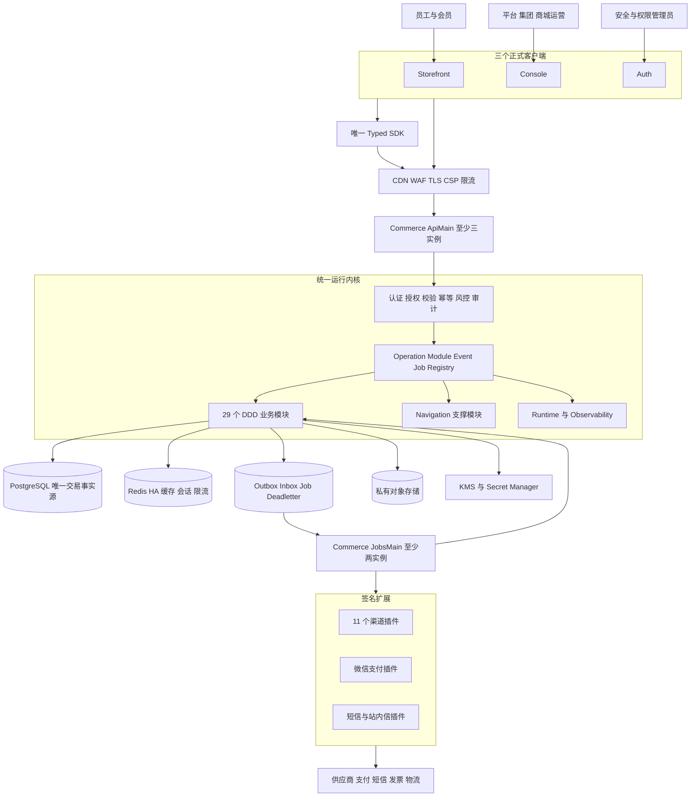
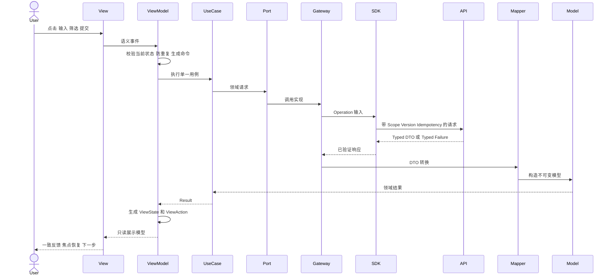
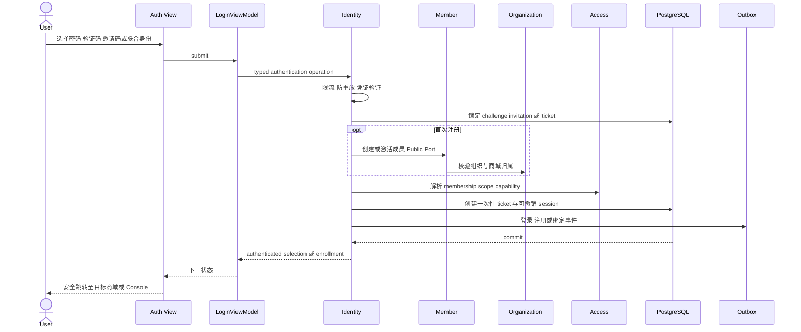
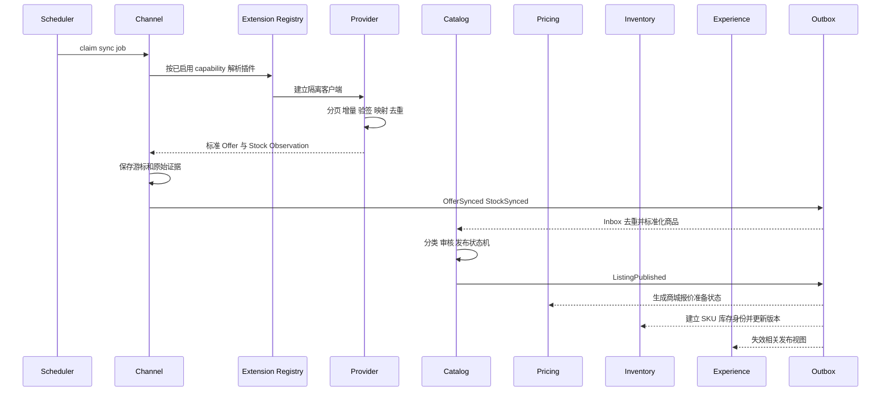
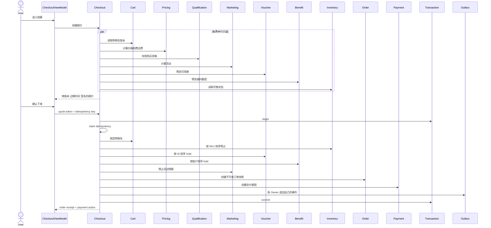
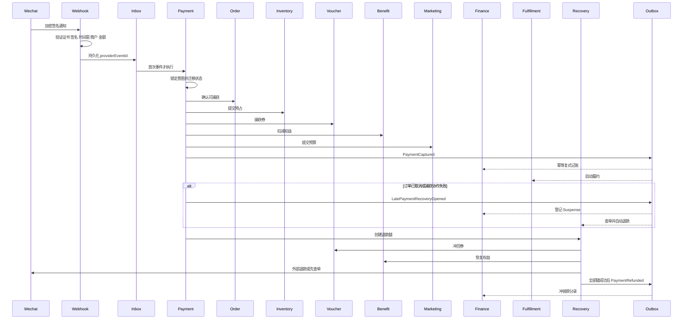
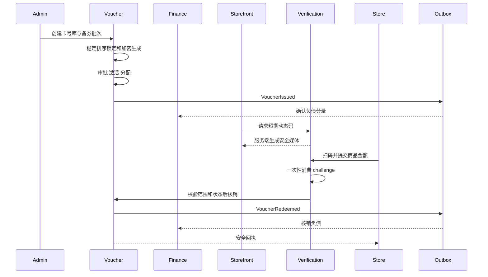
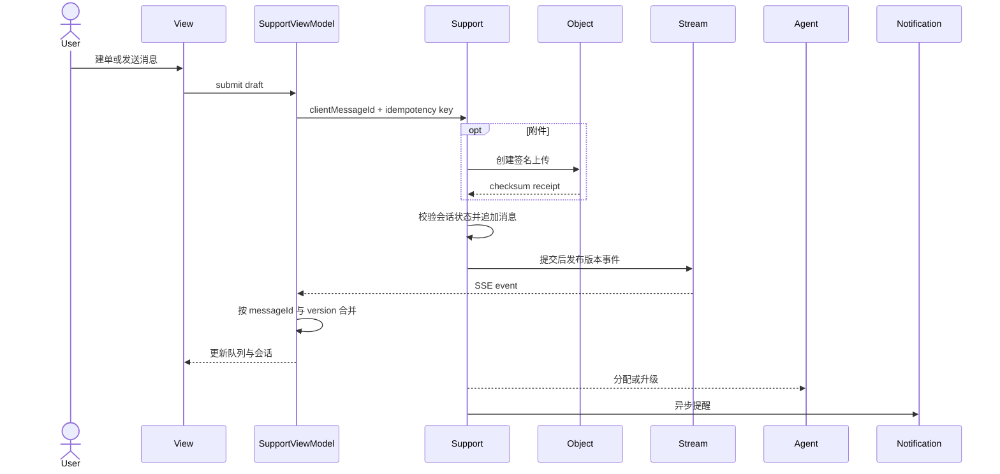
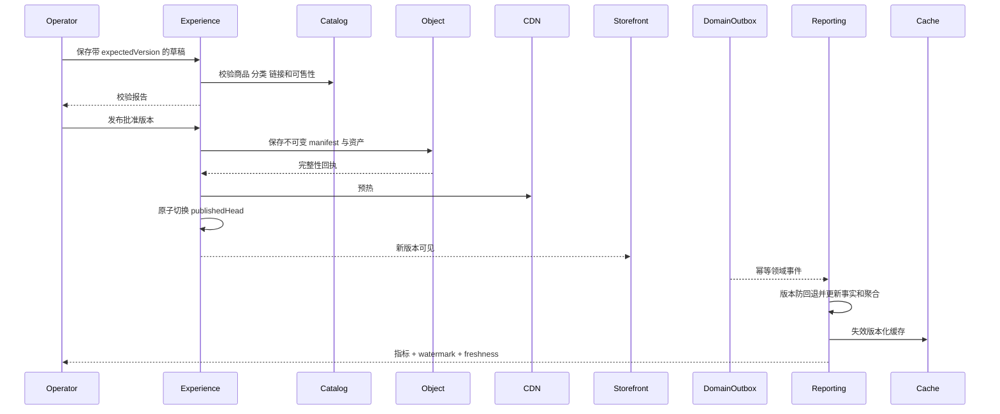
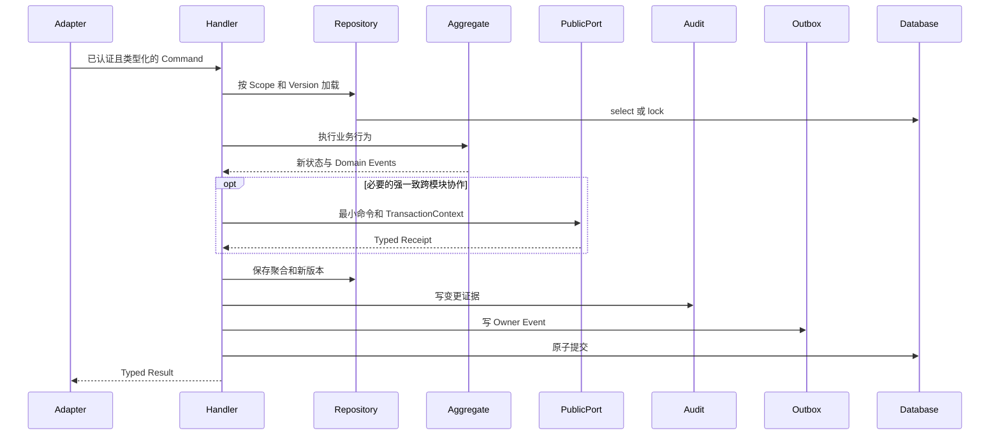

结论：最理想、最贴合当前仓库的目标，不是重写或拆微服务，而是以 `zhudatuan` 为唯一生产主线，在现有 DDD 模块化单体、Operation Contract、Typed SDK、PostgreSQL、Outbox/Inbox、29 个业务模块和 11 个渠道扩展基础上，正式补齐前端 MVVM 边界、统一配置与发布证据，然后一次性硬切；不保留兼容接口、旧路由、双写、Mock、Showcase、Fallback 或第二事实源。

本次为只读审计，没有修改任何代码、配置或文档。

# 一、当前事实与必须先纠正的问题

当前工作簿 SHA-256 为 `48b2a8ea...2e7436`，与 [authorities.yml](/Users/changshengwang/Workspace/zhudatuan/config/authorities.yml:1) 一致。MVP 表共有 22 项，其中 18 项 `required`、4 项 `nonblocking`。:codex-file-citation{path="/Users/changshengwang/Workspace/zhudatuan/docs/福利商城功能清单.xlsx" purpose="source" artifact_kind="workbook" sheet="MVP上线功能清单" range="A3:F24"}

接口表中一期优先级 1 的渠道恰好 11 个。:codex-file-citation{path="/Users/changshengwang/Workspace/zhudatuan/docs/福利商城功能清单.xlsx" purpose="source" artifact_kind="workbook" sheet="接口" range="A2:D12"}

当前代码基础：

- 3 个正式客户端：`auth`、`console`、`storefront`。
- 29 个业务模块、1 个 Navigation 支撑模块、Runtime 和 Observability 两个基础模块，见 [modules.ts](/Users/changshengwang/Workspace/zhudatuan/services/commerce/src/app/modules.ts:1)。
- 275 个 Operation、103 个 Event，权威源分别是 [operations.yml](/Users/changshengwang/Workspace/zhudatuan/packages/contract/definitions/operations.yml:1) 和 [events.yml](/Users/changshengwang/Workspace/zhudatuan/packages/contract/definitions/events.yml:1)。
- 统一模块注册、依赖拓扑和 Public Port 已存在，见 [ModuleRegistry.ts](/Users/changshengwang/Workspace/zhudatuan/services/commerce/src/bootstrap/ModuleRegistry.ts:1)。
- 认证、授权、幂等、Maker-Checker、事务、审计、Outbox 已进入统一执行器，见 [OperationExecutor.ts](/Users/changshengwang/Workspace/zhudatuan/services/commerce/src/foundation/application/OperationExecutor.ts:22)。
- 设计 Token、响应式视口、视觉状态和可访问性基线已经集中配置，见 [visuals.yml](/Users/changshengwang/Workspace/zhudatuan/config/visuals.yml:1)。

但还不能称为已上线：

1. [mvp.yml](/Users/changshengwang/Workspace/zhudatuan/docs/requirements/mvp.yml:1) 的 22 项全部仍为 `Designed`，发布证据均为空。
2. [release index](/Users/changshengwang/Workspace/zhudatuan/evidence/releases/index.json:1) 仍写 `required=21`、`released=0`，与当前 18 个 required 不一致。
3. 当前 Excel 的 D11、D20 明确写“分类销售数据”，没有“粉类”，备注为 `OK`；但 [requirements.yml](/Users/changshengwang/Workspace/zhudatuan/config/requirements.yml:282) 仍注册 `powderclass` 阻断项，Contract、权限、前端选项、投影也沿用了这一旧概念。:codex-file-citation{path="/Users/changshengwang/Workspace/zhudatuan/docs/福利商城功能清单.xlsx" purpose="source" artifact_kind="workbook" sheet="MVP上线功能清单" range="D20:F20"}
4. 真正仍需产品签字的只有两个独立定义：
   - 卡券中心“客户管理、产品档案”，同时影响集团和商城卡券。:codex-file-citation{path="/Users/changshengwang/Workspace/zhudatuan/docs/福利商城功能清单.xlsx" purpose="source" artifact_kind="workbook" sheet="MVP上线功能清单" range="F9"}
   - 集团层风控设置的策略对象、作用范围和审批权限。:codex-file-citation{path="/Users/changshengwang/Workspace/zhudatuan/docs/福利商城功能清单.xlsx" purpose="source" artifact_kind="workbook" sheet="MVP上线功能清单" range="F13"}
5. 前端已有 feature、model、application、infrastructure、public、ui 等良好骨架，但还不是严格 MVVM：
   - [ProductRoute.tsx](/Users/changshengwang/Workspace/zhudatuan/apps/console/src/feature/product/ProductRoute.tsx:29) 同时处理 URL、查询、Mutation、选择、分页和渲染。
   - [SupportWorkbench.tsx](/Users/changshengwang/Workspace/zhudatuan/apps/console/src/feature/support/ui/SupportWorkbench.tsx:41) 同时承担查询、SSE、缓存合并、草稿、上传和界面编排。
   - [CheckoutPage.tsx](/Users/changshengwang/Workspace/zhudatuan/apps/storefront/src/feature/checkout/ui/CheckoutPage.tsx:18) 在 View 中直接查询、计算金额和执行流程。
   - [AuthRuntime.tsx](/Users/changshengwang/Workspace/zhudatuan/apps/auth/src/app/AuthRuntime.tsx:1) 已有状态机思想，但组合根仍包含大量具体业务交互。

# 二、22 项 MVP 的唯一覆盖矩阵

`R` 表示上线阻断项，`NB` 表示工作簿标记“忽略”后形成的非阻断项。非阻断不等于删除底层必要领域能力，也不能计入 required 分母。

| ID | 工作簿能力 | 策略 | 正式入口 | 主要领域 | 完成口径 |
|---|---|---:|---|---|---|
| MVPPLATFORM | 平台层级、商品池、卡号库 | NB | Console 中控、商品、卡券 | Organization、Catalog、Voucher | 保留平台 Scope 和公共能力，不新增独立 MVP 工作台 |
| MVPDISTRIBUTION | 分销层 | NB | Console 中控、Referral | Partner、Channel、Referral | 保留 Scope 与扩展点，不凭空扩充空白需求 |
| MVPGROUPDASHBOARD | 集团数据大屏 | R | `/cockpit` | Reporting | 金额、数量、退单、分应用；实时/昨日/7日/30日；显示水位 |
| MVPGROUPAPPLICATION | 应用创建、复制、管理、装修 | R | `/experience` | Experience、Capability | 创建、复制、停启、草稿、校验、发布、回滚 |
| MVPGROUPPOOL | 集团商品池 | R | `/products` | Catalog、Pricing、Inventory | 整体/渠道/自有/加价池，M:N 投放，CRUD、批量上下架、改价 |
| MVPGROUPORDER | 商品订单、售后订单 | R | `/orders` | Order、Fulfillment、Payment | 查询、详情、状态、售后、退款、导出、审计 |
| MVPGROUPVOUCHER | 集团卡券中心 | R | `/vouchers` | Voucher、Benefit | 备券、审批、激活/禁用/延期/作废、绑定与消费；客户/产品定义待签字 |
| MVPGROUPFINANCE | 集团财务 | NB | `/finance` | Finance | UI 非阻断；支付、退款和复式账本仍是交易必需能力 |
| MVPGROUPREPORT | 集团数据统计 | R | `/reporting` | Reporting | 商品、商城、分类、渠道、卡券消费，不包含“粉类” |
| MVPGROUPSUPPORT | 集团客服 | R | `/support` | Support、Notification | 分配规则、人员账号、聊天、记录查询、SLA |
| MVPGROUPSETTING | 集团设置 | R | `/settings/*` | Access、Member、Partner、Risk | 管理员、会员、供应商、门店、短信；集团风控定义待签字 |
| MVPMALLDASHBOARD | 商城数据大屏 | R | `/cockpit` | Reporting | 强制 Mall Scope，不得显示集团或其他商城数据 |
| MVPMALLDESIGN | 商城装修 | R | `/experience`、Storefront `/` | Experience | 草稿与发布隔离、不可变版本、原子切换 |
| MVPMALLPOOL | 商城商品池 | R | Console `/products`、Storefront `/products` | Catalog、Pricing、Inventory | 只展示已投放、已定价、可售、符合资格的商品 |
| MVPMALLORDER | 商城订单 | R | `/cart`、`/checkout`、`/orders` | Cart、Checkout、Order、Payment | 报价、原子下单、支付、履约、售后、退款完整闭环 |
| MVPMALLVOUCHER | 商城卡券 | R | `/vouchers` | Voucher、Benefit | 与集团共用同一领域代码，仅 Scope 不同；客户/产品定义待签字 |
| MVPMALLFINANCE | 商城财务 | NB | `/benefits`、Console `/finance` | Finance、Benefit | UI 非阻断；商城资产和支付账务不得删除 |
| MVPMALLREPORT | 商城数据统计 | R | `/reporting` | Reporting | 商品、商城、分类、渠道、卡券消费；删除旧 `powderclass` 语义 |
| MVPMALLSUPPORT | 商城客服 | R | `/support`、`/support/:caseId` | Support | 建单、聊天、附件、进度、历史和通知 |
| MVPMALLSETTING | 商城设置 | R | `/settings/*`、`/notifications` | Access、Member、Partner、Notification、Risk | Mall Scope 管理、成员、门店、短信和批准的风控规则 |
| MVPIDENTITY | 密码、验证码、邀请码注册登录 | R | Auth `/`、`/invitation`、`/membership`、`/callback` | Identity、Member、Access | 全登录策略、邀请入职、身份选择、安全回跳、会话轮换 |
| MVPPROVIDER | 优先级 1 接口 | R | `/channels`、Jobs | Channel、Extension | 11 个渠道均完成真实 Contract、沙箱、生产健康和最小交易闭环 |

# 三、目标系统架构



核心裁决：

- 一个仓库、一个 Commerce 制品、一套 Contract、一套 SDK、一套数据库迁移历史。
- API 和 Jobs 使用相同领域代码，但独立进程、独立连接池、独立扩容。
- 浏览器永远不持有数据库、支付、供应商或短信密钥。
- 强一致协作通过窄 Public Port 和共享不可伪造的事务上下文。
- 非强一致副作用通过 Domain Event、Outbox、Inbox、幂等 Consumer。
- 外部 HTTP、短信、支付提交、对象上传和长计算不得发生在数据库事务中。
- `zhudatuan-li` 只用于已批准 UI/UX 参考；视觉基线归档到主仓库后，删除 [visuals.yml](/Users/changshengwang/Workspace/zhudatuan/config/visuals.yml:5) 对外部绝对路径的依赖。

# 四、前端 MVVM 最终模型

## 4.1 层次与职责

| 层 | 允许承担 | 禁止承担 |
|---|---|---|
| View | 结构、语义标签、视觉状态、用户事件上报 | SDK、DTO、业务计算、权限判断、缓存操作 |
| ViewModel | 页面状态、派生展示值、URL 同步、Query/Mutation、命令防重、事件处理 | JSX 布局、数据库概念、供应商 DTO |
| Model | 不可变客户端领域模型、值对象、本地状态机 | React、Router、Fetch、浏览器存储 |
| Application | 单一用例、输入校验、流程编排、依赖 Port | React Hook、组件、直接 SDK 调用 |
| Public | 最小能力端口和跨 feature 契约 | 具体 Gateway、内部 Model 泄露 |
| Infrastructure | SDK Adapter、DTO Mapper、SSE、Upload、缓存适配器 | 页面逻辑、视觉状态、跨模块业务规则 |
| Route | 参数解析、Guard、懒加载、ViewModel 和 View 装配 | 查询细节、业务分支、Mutation |
| App | 组合依赖、Provider、生命周期 | 业务状态、领域计算 |
| Shared | 无领域含义的稳定技术原语 | 引用任何 feature、容纳“顺手复用”的业务逻辑 |

## 4.2 MVVM 数据流



ViewModel 对外只暴露：

- `state`：`loading | ready | empty | stale | denied | failed` 的判别联合。
- `data`：已格式化但未丢失语义的展示对象。
- `actions`：`refresh`、`submit`、`select`、`close` 等语义动作。
- `permissions`：服务端返回的可执行能力，不在浏览器自行推导角色。
- `busy`：操作级繁忙状态，防止重复提交。
- `message`：统一 `@shop/presentation` 产生的安全消息。
- `receipt`：成功后的请求号、业务编号、时间、下一步操作。

状态存储规则：

- 服务端状态：TanStack Query，Query Key 必须包含 `scopeKind + scopeId + accessVersion + resourceVersion + filter`。
- URL 状态：搜索词、筛选、页签、游标、选中详情 ID；可复制链接、刷新后可恢复。
- 临时 UI 状态：Drawer、Dialog、折叠、草稿，由 ViewModel 本地 reducer 管理。
- 密码、验证码、邀请码、Action Proof：仅短时内存，不进入 Query Cache、URL、日志或持久化存储。
- 订单、金额、余额、库存、券状态：服务端唯一权威，浏览器不得计算为最终事实。
- 失败后不得用空数组、默认金额或旧 Mock 伪装成功。

## 4.3 现有前端的复用方式

- Auth 的 `model`、`application`、`public`、`infrastructure`、Mapper 和 LoginMachine 原样优先复用。
- Storefront 已有的 `HomeRuntime`、`ProductRuntime`、`CheckoutRuntime`、`OrderState` 可迁入 `viewmodel`，不重写其有效 Query Key、映射和失效逻辑。
- Console 的 Manifest、RouteRegistry、Schema、Query、Command、Table、Drawer 和 Dialog 保留；只把 `useQuery`、`useMutation`、URL、选择集和 SSE 协调从 Route/View 移入 ViewModel。
- `@shop/design`、`@shop/presentation`、`@shop/sdk` 继续作为唯一设计、错误展示和网络入口。
- 不引入第二套 Redux/Zustand 全局业务状态；跨页面服务端状态继续由 Query Cache 管理。

# 五、模块间关键调用时序

## 5.1 登录、注册与 Scope 建立



## 5.2 Provider 同步、商品治理、定价与投放



没有有效价格、可售库存、投放关系或资格时，Storefront 必须 Fail Closed。

## 5.3 并行报价与原子下单



固定锁顺序：

```text
Idempotency
→ Quote
→ Cart
→ Inventory（SKU 稳定排序）
→ Voucher
→ Benefit
→ Marketing
→ Order
→ PaymentIntent
→ Audit
→ Outbox
```

## 5.4 支付回调、迟到支付与退款



未知状态只能进入查单或人工复核，不能猜测成功、失败，也不能重复提交。

## 5.5 卡券发行与核销



## 5.6 客服消息与实时一致性



断线重连使用事件游标；游标过期时重新读取权威会话，不能把浏览器缓存当事实。

## 5.7 商城装修发布与报表投影



# 六、32 个现有模块的内部数据流

所有业务写入都服从统一骨架：



查询统一为：

```text
HTTP / Job Adapter
→ Query Handler
→ 模块自有 Repository 或 Reporting Projection
→ Tenant 与 Scope Filter
→ DTO Mapper
→ Typed Result + Version + Watermark
```

| 模块 | 内部主数据流 | 核心不变量 |
|---|---|---|
| Identity | 凭证标准化 → 限流/风控 → 策略验证 → Ticket/Session → Outbox | 外部身份唯一；Challenge/Ticket 单次消费；会话可撤销轮换 |
| Organization | 读取父级 → 环检测 → 层级变更 → 目录版本 → 投影 | 无组织环；Mall 有唯一安全锚点；跨租户不可移动 |
| Access | Subject → Membership → Role → Scope → Capability → Explicit Deny | 默认拒绝；客户端角色和 Scope 不可信；授权版本单调递增 |
| Capability | 套餐/应用 → Assignment → 依赖校验 → Effective Capability | 功能开关不能绕过权限；配额不能变成授权 |
| Partner | 资质 → 合作协议 → 品牌/门店/供应关系 → 生效版本 | 无有效协议不得交易；历史协议和审核证据不可删除 |
| Member | Identity 映射 → Profile → Membership → 分组/等级/导入 | 身份主体与租户档案分离；同 Scope 成员唯一；PII 加密 |
| Qualification | 规则快照 → 候选事实 → Specification → Decision | 决策带规则版本；过期和限购原子更新；不由前端最终判定 |
| Catalog | 外部 Offer → ACL 映射 → 去重 → 分类 → 审核 → Listing | SKU/来源标识唯一；有订单商品不物理删除；M:N 关系唯一 |
| Pricing | 价格簿 → 规则匹配 → 冲突裁决 → Money 计算 → Quote | 全部金额整数分；规则确定性；订单保存规则和金额快照 |
| Inventory | StockItem → 稳定排序锁定 → Reserve/Commit/Release | 可售量不为负；重复释放幂等；版本冲突不静默覆盖 |
| Experience | Draft → Schema → 引用校验 → Snapshot → Head 切换 | Published Snapshot 不可变；草稿不可进入 Storefront |
| Marketing | 候选活动 → 范围匹配 → 优先级/互斥 → 预算预占 | 计算确定性；预算不超额；随机行为必须可审计复现 |
| Cart | 用户与 Mall → 合并条目 → 数量校验 → Version 保存 | 每用户每商城一个活动购物车；购物车不锁价、不锁库存 |
| Checkout | 构建 Quote → 签名/过期 → 版本重校验 → Purchase Process | 相同幂等键同一订单；缺任一关键结果即失败关闭 |
| Order | 不可变快照 → 正交状态机 → 取消/收货/售后 | 商品、金额、收货、规则均保留快照；禁止非法跳转 |
| Fulfillment | 支付事件 → 按供应商/地点拆单 → 提交 → 物流/退货 | 履约量不超订单量；外部未知状态先查询、不重复下单 |
| Verification | Challenge → 设备/店员授权 → 尝试计数 → Receipt | 动态码短时、一次性、绑定主体/商城/用途 |
| Payment | Intent → Attempt → Provider Observation → Capture/Refund Legs | 商户、币种、金额一致；回调去重；Unknown 不得推断 |
| Voucher | CardPool → Batch → Approval → Allocation → Hold/Redeem/Reverse | 卡号唯一且加密；状态机不跨级；批量执行可恢复 |
| Benefit | Plan/Budget → Grant → Account → Hold/Debit/Restore | 额度不为负；恢复必须引用原消费；过期任务幂等 |
| Finance | Business Evidence → Posting Policy → Journal/Entry → Reconcile | 永久借贷平衡；只追加；修复只允许冲正和新分录 |
| Channel | Connection → Secret Ref → Sync Cursor → Normalized Observation | 游标只在数据持久化成功后推进；Provider 相互隔离 |
| Support | Ticket → Routing → Assignment → Conversation → SLA/Close | 消息只追加；关闭有结论；转派和 SLA 全部可审计 |
| Notification | Template → Preference → Channel Strategy → Delivery Receipt | 按业务幂等键去重；交易不等待通知；失败持续重试 |
| Reporting | Inbox → Version Guard → Fact → Projection → Watermark → Cache | 不扫交易主表；不伪装实时；只读取批准维度 |
| Referral | 资格 → 首触绑定 → 订单归因 → Commission → Settle/Reverse/Withdraw | 首触不可覆盖；退款等额冲正；提现不可超过已结算收益 |
| Risk | Feature Snapshot → Policy Chain → Decision → Review | 高风险失败关闭；决策含规则版本、输入摘要和解释 |
| Audit | Context → Redaction → Before/After Hash → Hash Chain → Archive | 只追加；PII 脱敏；业务用户不能修改或删除 |
| Extension | Manifest → 签名 → Schema → Factory → Health → Enable | ID/版本/能力唯一；配置或健康失败时拒绝启用 |
| Navigation | 唯一菜单配置 → Scope → Capability → Permission → Tree | 菜单不是授权源；无能力或无权限节点必须消失 |
| Runtime | 启动校验 → 连接池 → Registry → Readiness → Shutdown | Contract/DB/配置版本不匹配时拒绝启动 |
| Observability | Request/Job Context → Log/Metric/Trace → Redaction → Alert | traceId 贯穿；敏感字段禁止进入日志；遥测失败不泄露业务数据 |

# 七、唯一目标代码目录

目录使用简洁小写单词；类、类型和 React 组件使用 PascalCase；变量和函数使用 camelCase。除了脚本、配置、SQL、迁移和测试，文件、目录不使用下划线、连字符或版本后缀。

```text
zhudatuan/
├── apps/
│   ├── auth/
│   │   └── src/
│   │       ├── app/
│   │       ├── route/
│   │       ├── shell/
│   │       ├── feature/
│   │       ├── shared/
│   │       └── main.tsx
│   ├── console/
│   │   └── src/
│   │       ├── app/
│   │       ├── route/
│   │       ├── shell/
│   │       ├── feature/
│   │       ├── entity/
│   │       ├── shared/
│   │       ├── generated/
│   │       └── main.tsx
│   └── storefront/
│       └── src/
│           ├── app/
│           ├── route/
│           ├── shell/
│           ├── feature/
│           ├── entity/
│           ├── shared/
│           ├── generated/
│           └── main.tsx
├── services/
│   └── commerce/
│       └── src/
│           ├── entry/
│           │   ├── ApiMain.ts
│           │   ├── JobsMain.ts
│           │   └── MigrationMain.ts
│           ├── bootstrap/
│           ├── foundation/
│           ├── adapter/
│           ├── modules/
│           ├── generated/
│           └── app/
├── packages/
│   ├── authz/
│   ├── config/
│   ├── contract/
│   ├── design/
│   ├── kernel/
│   ├── presentation/
│   ├── sdk/
│   ├── telemetry/
│   └── testing/
├── extensions/
│   ├── channel/
│   ├── payment/
│   └── notification/
├── database/
│   ├── migrations/
│   ├── contracts/
│   └── tools/
├── config/
├── infrastructure/
├── tests/
│   ├── contract/
│   ├── integration/
│   ├── journey/
│   ├── security/
│   ├── performance/
│   └── recovery/
├── tools/
├── scripts/
└── docs/
```

## 7.1 前端 feature 固定结构

```text
feature/product/
├── public/
│   ├── ProductPort.ts
│   └── index.ts
├── model/
│   ├── Product.ts
│   ├── ProductFilter.ts
│   ├── ProductSelection.ts
│   └── ProductState.ts
├── application/
│   ├── ReadProducts.ts
│   ├── ReadProduct.ts
│   ├── ChangePublication.ts
│   └── ChangePool.ts
├── infrastructure/
│   ├── ProductGateway.ts
│   ├── ProductMapper.ts
│   └── ProductEventSource.ts
├── viewmodel/
│   ├── ProductViewModel.ts
│   ├── ProductQueryKey.ts
│   └── ProductReducer.ts
├── view/
│   ├── ProductPage.tsx
│   ├── ProductHeader.tsx
│   ├── ProductFilter.tsx
│   ├── ProductTable.tsx
│   ├── ProductDrawer.tsx
│   ├── ProductDialog.tsx
│   └── ProductPagination.tsx
├── route/
│   └── ProductRoute.tsx
├── Manifest.ts
└── index.ts
```

规则：

- `ProductRoute.tsx` 最多只解析路由、创建 ViewModel、渲染 View。
- `ProductPage.tsx` 不得导入 TanStack Query、SDK、Gateway 或 Router。
- `ProductViewModel.ts` 不返回 JSX。
- `ProductGateway.ts` 不返回 SDK DTO，只返回 Model。
- Feature 之间只能导入对方 `public`。
- 简单模块可省略无职责目录，禁止生成空壳。
- 禁止 `Utils`、`Helpers`、`Common`、`Manager`、`BaseService`、`Misc` 等抽屉命名。

## 7.2 后端模块固定结构

```text
modules/order/
├── public/
│   ├── OrderReadPort.ts
│   ├── OrderWritePort.ts
│   └── index.ts
├── domain/
│   ├── model/
│   ├── value/
│   ├── policy/
│   ├── event/
│   ├── repository/
│   └── error/
├── application/
│   ├── command/
│   ├── query/
│   ├── handler/
│   ├── process/
│   ├── job/
│   ├── port/
│   └── dto/
├── infrastructure/
│   ├── persistence/
│   └── integration/
├── interface/
│   ├── http/
│   ├── event/
│   └── job/
├── test/
├── Manifest.ts
├── Module.ts
└── index.ts
```

`Module.ts` 只能组合依赖；不得出现 SQL、业务条件或状态迁移。一个 Handler 对应一个 Operation 或一个内部命令。Repository 只访问本模块 Schema。

# 八、DDD、SOLID、迪米特法则和设计模式

| 原则 | 强制落实 |
|---|---|
| DDD | 业务事实归属唯一限界上下文；聚合封装状态迁移；跨上下文只用 Public Port 或 Event |
| SRP | 一个 Handler 一个用例；一个 ViewModel 一个页面/工作区；一个 Mapper 一个边界 |
| OCP | 新 Provider、新登录方式、新通知渠道通过 Manifest 和 Strategy 扩展 |
| LSP | 所有 Port 实现返回相同语义、错误和幂等保证 |
| ISP | 按调用者拆小 Port，Checkout 不依赖完整 Catalog/Payment Service |
| DIP | Domain/Application 依赖接口；PostgreSQL、Redis、SDK、微信均为 Adapter |
| 迪米特法则 | View 只认识 ViewModel；ViewModel 只认识 UseCase；Handler 只认识自身 Repository 和声明过的 Public Port |
| State | 登录、订单、支付、卡券、售后、佣金、履约显式状态机 |
| Strategy | 登录方式、价格、活动、渠道、通知、支付策略 |
| Specification | 资格、Scope、商品投放、优惠适用、风险规则 |
| Repository | 聚合持久化和映射 |
| Unit of Work | 下单、注册、资金确认等跨聚合强一致事务 |
| Process Manager | 支付恢复、退款、履约、对账、卡券批次 |
| Outbox/Inbox | 提交后副作用、可靠事件、去重消费 |
| Anticorruption Layer | 供应商 DTO 不进入 Catalog、Order、Finance |
| Circuit Breaker/Bulkhead | 每个外部 Provider 独立限流、熔断和并发舱壁 |
| Factory | Quote、Order Snapshot、Journal、Commission 的合法创建 |

# 九、唯一配置与禁止重复

| 权威 | 唯一职责 |
|---|---|
| Excel | 原始业务范围、备注和渠道优先级 |
| `config/authorities.yml` | 权威文件、哈希、生成关系 |
| `config/requirements.yml` | 稳定 ID、语义绑定、正式澄清；不得反向改写 Excel |
| `packages/contract/definitions` | Operation、Event、Error、Permission、Capability |
| `config/navigation.yml` | 菜单标题、路由、排序和展示依赖 |
| `config/providers.yml` | 由需求生成的 Provider 注册结果 |
| `packages/design/src/tokens.json` | 唯一 Design Token |
| `config/visuals.yml` | 页面、视口、状态、视觉回归 |
| `config/capacity.yml` | 容量、并发、超时、连接池 |
| `config/cache.yml` | 缓存键、TTL、失效 |
| `config/telemetry.yml` | SLO、告警和脱敏 |
| `config/bundles.yml` | 前端包体预算 |

生成链必须单向：

```text
Excel + 已批准决策
→ Requirement Generator
→ MVP / Provider / Trace
→ Navigation 与 Contract Generator
→ SDK / Server Registry / Client Binding
→ Tests
→ Release Evidence
```

当前 `powderclass` 不在 Excel 中，因此目标方案应硬删除：

- `powderclass` clarification。
- `reporting.powderclass.read` Operation。
- 对应 Permission、Capability 和 SDK。
- Console 的“粉类”筛选。
- Reporting 的 `powderclass` 指标、事件字段和投影。
- 所有仍把它列为 MVP11/MVP20 的当前权威文档。

统一复用 `category`，不保留 alias、redirect 或兼容字段。

# 十、UI 与 UX 标准

## Console

- 一个统一 Shell：Scope 切换、面包屑、页面标题、主操作、全局反馈位置一致。
- 表格统一：搜索、筛选、列配置、Keyset 分页、全选语义、批量操作预览。
- 详情统一用 Drawer；创建/编辑用 Dialog；跨页复杂任务进入独立工作台。
- 高风险操作统一为“预览 → 确认 → Step-up → 执行 → 重读 → 回执”。
- 批量操作必须显示受影响数量、样本、筛选快照和不可逆影响。
- 长任务进入任务中心，不阻塞页面；刷新后仍能恢复。
- 数据大屏必须显示统计时间、时区、Watermark 和“实时/延迟”状态。

## Storefront

- Desktop、Tablet、Mobile 共用真实业务组件和 ViewModel，不维护设备专用业务逻辑。
- 导航、搜索、分类、商品卡、详情、规格、购物车、结算、支付、订单、售后保持统一视觉语言。
- 金额变化必须说明来源：商品、运费、优惠、卡券、福利、应付。
- 下单前显示报价有效期；报价过期时重新计算并明确提示差异。
- 支付未知状态显示“正在确认”，不得显示成功。
- 购物车失效项说明原因并提供可执行动作。
- 实体商品无有效地址时聚焦地址区，不只弹 Toast。
- 空态给出下一步入口；错误态提供安全重试；离线或旧数据明确标注。

## Auth

- 密码、验证码、邀请码和联合身份在一个统一认证旅程中切换。
- 验证码倒计时以服务端 `retryAfter` 为准。
- 密码策略实时、逐条、易理解地反馈。
- 邀请过期、撤销、已使用、需证明、需注册使用不同状态页面。
- 多 Membership 显示组织、商城、角色和目标应用，避免小白选错身份。
- 成功跳转只接受签名或白名单 ReturnTarget。
- 所有失败避免账号、手机号、邀请是否存在的枚举泄露。

## 通用视觉与可访问性

- 继续复用现有智慧翼 Token：品牌蓝、8pt 间距、统一圆角、统一阴影、语义状态色。
- 必测 `loading`、`empty`、`error`、`denied`、`expired`、`partial`、`success`。
- 必测 `hover`、`focus`、`selected`、`disabled`、`submitting`、`success`。
- 360、375、390、768、1024、1366、1440、1920 宽度无溢出或遮挡。
- 键盘完整可达、焦点可见、Dialog 焦点圈闭、错误摘要可被读屏读取。
- 触控目标至少 44×44 CSS 像素。
- 尊重 `prefers-reduced-motion`；非必要动画不超过 200ms。
- 不用颜色作为唯一状态表达。
- 视觉回归必须使用真实 Contract Seed，不使用 Mock Route。

# 十一、数据一致性

- PostgreSQL 是订单、库存、支付、退款、卡券、权益、账本、佣金的唯一事实源。
- 每个表有且仅有一个领域 Owner；跨模块读表、写表均禁止。
- 所有写 Operation 携带 `Idempotency-Key`；同键不同请求 Hash 必须拒绝。
- 聚合使用 `version` 乐观锁；关键资源按固定顺序悲观锁。
- Outbox 与领域变更、审计、幂等响应同事务提交。
- Inbox 使用 `source + eventId + consumer` 唯一约束。
- Consumer 必须通过重复、乱序、Crash After Effect Before Receipt 测试。
- 订单保留商品、价格、税、优惠、收件人、供应商、资格、Tender 快照。
- 财务只从批准的 Economic Event 建账，不从供应商临时响应或 UI 请求建账。
- 账本只追加；修复必须预演、双人审批、追加冲正。
- 报表记录 aggregate version、checkpoint、watermark、freshness。
- 缓存键包含 Scope 和业务版本；失效只能影响性能，不能改变正确性。
- 数据迁移只能是一次性离线迁移：冻结旧写入、快照、导入、核对、签字、硬切、删除工具；禁止长期双读双写。

# 十二、安全方案

- Cookie：Host-only、Secure、HttpOnly、SameSite；会话轮换并支持立即撤销。
- CSRF：所有浏览器写请求和敏感操作强制校验。
- OAuth/OIDC/微信：`state + nonce + PKCE`，回调地址精确白名单。
- OTP：带 Pepper 摘要、过期时间、尝试次数、IP/设备/主体限流。
- 密码：经过审查的内存困难哈希；不得为了性能降低安全参数。
- 授权链：Identity → Tenant → Organization → Mall → Membership → Role → Resource Scope → Capability → Explicit Policy。
- UI 隐藏按钮不代表授权；服务端对每次 Operation 重算 Scope。
- Owner 转移、退款、提现、财务修复、批量作废必须 Step-up；高风险操作要求 Action Proof 和 Maker-Checker。
- PII 分字段加密或 Token 化；日志默认脱敏。
- Secret 只保存引用，真实值进入 KMS/Secret Manager。
- Webhook 校验证书、签名、时间窗、商户、金额、Nonce 和事件去重。
- 上传使用短时签名 URL，校验大小、MIME、扩展名、Hash、病毒和对象路径。
- 出站 URL 执行 SSRF 白名单和 DNS/IP 校验。
- 构建产生 SBOM、依赖锁、许可证报告、漏洞扫描和制品签名。
- 审计日志只追加并形成 Hash Chain。

# 十三、性能、并发和高可用

沿用 [capacity.yml](/Users/changshengwang/Workspace/zhudatuan/config/capacity.yml:1) 的设计容量：

- 1000 商城。
- 1000 万会员。
- 500 万商品。
- 2000 万 SKU。
- API 峰值 5000 QPS。
- 下单 300 TPS。
- 支付回调 600 TPS。
- 单批卡券 100 万张。
- 可用性 99.95%，目标 RPO 0、RTO 15 分钟。

服务端：

- 列表统一 Keyset Pagination，禁止深 OFFSET。
- 查询只取所需字段，建立 Scope + Sort Key 覆盖索引。
- Reporting 走投影表，不扫描交易主表。
- 独立只读通过带 Deadline 和 AbortSignal 的有界并行执行。
- 不使用无界 `Promise.all`；外部并发默认最大 32、队列 128，并支持 Provider 覆盖。
- 相同 Aggregate Key 严格串行；不同聚合允许并行。
- 批量任务分块、检查点、租约、Fencing Token、可重入。
- API 至少三实例，Jobs 至少两实例；PostgreSQL 同步备用并启用 PITR。
- Redis 故障时回源并限流，不影响交易正确性。
- 外部失败使用指数退避、抖动、熔断和独立 Bulkhead。

前端：

- 路由和 feature 懒加载；继续执行 [bundles.yml](/Users/changshengwang/Workspace/zhudatuan/config/bundles.yml:1) 中 90/95/110KB 初始 gzip 预算。
- Query 去重、取消过期请求、搜索防抖、Prefetch 下一页。
- 大列表虚拟化，但表头、键盘导航和读屏语义不能丢失。
- 图片声明尺寸，使用 CDN、WebP/AVIF、懒加载和渐进占位。
- ViewModel 的派生数据使用稳定 selector，避免整页重复渲染。
- 实时客服只更新受影响 Ticket/Message，不全量刷新全部 Query。

降级原则：

| 故障 | 行为 |
|---|---|
| Provider 同步失败 | 展示最后有效版本和新鲜度，停止发布新版本 |
| Reporting 延迟 | 展示 watermark 和延迟状态 |
| Redis 故障 | 回源数据库并限流 |
| 库存、价格、资格未知 | 下单失败关闭 |
| 支付未知 | 主动查单，显示确认中 |
| 通知失败 | 交易成功，通知异步重试 |
| 审计、幂等、财务基础能力失败 | 对应写操作拒绝执行 |
| 单一 Provider 故障 | 熔断该 Provider，不拖垮其他 Provider 或核心交易 |

# 十四、即插即用扩展

每个扩展必须拥有：

```text
Manifest
ConfigSchema
Capabilities
Factory
Client
Mapper
WebhookVerifier
HealthProbe
RatePolicy
RetryPolicy
CircuitPolicy
SecretRefs
ContractTest
MappingTest
FailureTest
SandboxJourney
ProductionSmoke
```

11 个必交付插件：

```text
jdproduct
jdfresh
tmall
supplier
cake
flower
book
charge
foodvoucher
movie
meal
```

新增 Provider 只能新增扩展包和配置，不允许修改 Catalog、Pricing、Checkout、Order、Router 或其他 Provider。优先级 3、4 的九个渠道不进入当前 MVP，不创建假实现、空菜单或占位生产路由。

# 十五、复用、重构、新增与删除

## 直接复用

- 29 个现有业务模块及其有效 Domain、Handler、Port、Repository、Job。
- `ModuleRegistry`、`OperationExecutor`、事务、幂等、Maker-Checker、审计、Outbox/Inbox。
- Contract、SDK 和生成器。
- `@shop/design`、`@shop/presentation`、现有品牌资产。
- Auth 状态机、Gateway、Mapper 和小端口。
- Storefront 的业务 Model、Runtime、Gateway 和响应式 View。
- Console 的 Manifest、Query、Schema、Table、Drawer、Dialog。
- 11 个现有渠道扩展及共享 core。
- `capacity.yml`、`cache.yml`、`telemetry.yml`、`bundles.yml`。

## 必须重构

- Console 的大 Route/Workbench 拆成 ViewModel + View。
- Storefront View 中的查询、金额汇总和流程控制移入 ViewModel/Application。
- AuthRuntime 只保留顶层状态机和依赖组合，各流程下沉到独立 ViewModel。
- 所有前端 Feature 使用相同宏观目录和依赖规则。
- CSS 中重复的视觉常量回收到 Design Token；保留批准的布局和交互。
- Release Evidence 完全由当前 22 项语义 ID 生成。

## 必须新增

- 各主要页面的 `viewmodel` 层及其状态测试。
- Product、Order、Voucher、Finance、Support、Experience 等统一 PageState。
- 两项真实产品澄清的签字记录和验收样例。
- 18 个 required MVP 的不可变发布证据。
- 11 个 P1 Provider 的真实沙箱与生产最小闭环证据。
- 当前代码缺少的视觉、性能、安全和恢复证据。

## 硬切后删除

- `powderclass` 全链路。
- 旧 release ID、旧 required 计数和旧生成证据。
- 任何 `legacy`、`compat`、`compatibility`、`fallback`、`v1/v2` 双轨。
- Mock、Showcase、Demo、设备壳和生产占位页。
- 重复 Contract、SDK、Design、Authz、Provider Registry。
- 旧 Route Redirect 和旧 Cookie。
- 一次性迁移脚本与影子对比工具。
- 指向 `zhudatuan-li` 的运行和视觉依赖。
- 无调用者的 DTO、Adapter、Permission、Operation、Event、Job、表和配置。

历史迁移、账务凭证、支付回执、审计、发布证据不能作为“旧代码”删除。

# 十六、实施顺序与门禁

## 阶段 0：保护现状

当前分支可能存在未提交工作区状态项，实施前必须按实时 `git status` 建立可恢复快照和归属台账。不得覆盖用户现有修改，也不得把瞬时数量写入长期架构基线。

门禁：所有文件都有 `Reuse / Refactor / Replace / Delete / EvidenceOnly` 处置结论。

## 阶段 1：修正需求真源

- 删除 `powderclass` 澄清与全链路绑定。
- 将 required 分母修正为 18。
- 保留 4 个 `nonblocking` 的明确状态。
- 关闭或正式定义 `voucherarchive`、`grouprisk`。
- 重生成 MVP、Provider、Trace、Navigation、Contract 和 Release Index。

门禁：生成器连续执行两次零差异；Excel 哈希变化但未重生成时 CI 失败。

## 阶段 2：冻结前端架构与视觉

- 建立统一 MVVM 依赖规则。
- 把 `visuals.yml` 的外部绝对来源转为主仓库内证据。
- 固定三个应用所有路由、状态、视口、交互和无障碍基线。
- 先拆一个完整垂直切片作为模板：建议 Console Product。

门禁：View 不导入 SDK/Query；Application 不导入 React/Router；Feature 间只依赖 public。

## 阶段 3：批量完成 MVVM 收口

顺序：

1. Auth。
2. Storefront 商品、购物车、结算、订单。
3. Console 商品、订单、应用。
4. 卡券、客服、报表、设置。
5. Finance 和 Referral 非阻断/关联能力。

门禁：Route 只装配；业务状态全部有 ViewModel 测试；视觉回归无明显漂移。

## 阶段 4：交易一致性闭环

- 报价、下单、支付、迟到支付、售后、退货、退款。
- 卡券、福利、库存和活动的 Hold/Capture/Release。
- Finance Economic Leg 唯一记账事件。
- Crash、Replay、Duplicate、Out of Order、Concurrent Submit 测试。

门禁：借贷平衡、无负库存、无重复消费、无重复退款、幂等响应一致。

## 阶段 5：Provider 与异步任务

- 11 个 Provider 完成 Contract、分页、游标、Webhook、错误分类和健康检查。
- Jobs 使用租约和 Fencing Token。
- 外部 Unknown 状态全部进入查询或人工恢复。

门禁：单个 Provider 故障不影响其他渠道；真实沙箱闭环通过。

## 阶段 6：非功能验收

- 容量压测、安全测试、权限越权测试、视觉回归、A11y、备份恢复。
- 验证 5000 QPS、300 下单 TPS、600 回调 TPS。
- 验证 API/Jobs/Redis/PostgreSQL 故障场景。
- 生成 SBOM、签名和漏洞报告。

## 阶段 7：硬切

```text
冻结旧写入
→ 数据快照
→ 前向迁移
→ 数量 金额 状态 外键 哈希核对
→ 发布唯一 Commerce 与三个客户端
→ 18 条 required MVP 冒烟
→ 11 条 Provider 冒烟
→ 原子切换流量
→ 观察 SLO
→ 删除兼容和一次性资产
```

不做按用户、租户或百分比的新旧业务双轨。恢复方式是维护窗口内回滚整个签名制品和数据库快照，不是运行时 Fallback。

# 十七、最终 Definition of Done

只有同时满足以下条件才算完成：

- 22/22 条工作簿记录有可追踪结论。
- 18/18 required 项为 `Released`。
- 4/4 nonblocking 项为 `AcceptedNonblocking` 或已正式交付，不混入 required 分母。
- 11/11 优先级 1 Provider 完成真实闭环。
- 卡券客户/产品档案、集团风控获得产品签字。
- 不再存在 `powderclass` 或其他不在当前 Excel 中的产品语义。
- 一个 Commerce、一个 Contract、一个 SDK、一个导航源、一个权限模型、一套迁移历史。
- 29 个业务模块依赖无环、无跨模块 SQL、无跨模块 Repository。
- View → ViewModel → Application → Port → Infrastructure 单向依赖通过静态门禁。
- 所有金额为整数分；订单、支付、退款、卡券、权益、库存、佣金可完整审计。
- Outbox/Inbox、幂等、锁顺序、乱序和崩溃恢复测试通过。
- 所有正式页面覆盖加载、空、失败、拒绝、过期、部分成功、成功状态。
- 三个客户端的响应式、键盘、读屏、焦点和视觉回归通过。
- 备份恢复演练达到 RPO 0、RTO 15 分钟目标。
- 无高危漏洞、无生产 TODO、无未使用依赖、无重复配置、无兼容运行路径。
- 每个 required MVP 证据包含：Requirement ID、Route、Operation、测试、截图/录像、Trace ID、数据库断言、构建 SHA、工作簿 SHA、负责人和签署时间。

现有 [完整MVP架构方案.md](/Users/changshengwang/Workspace/zhudatuan/docs/architecture/完整MVP架构方案.md:1) 和 [福利商城全系统根治方案.md](/Users/changshengwang/Workspace/zhudatuan/docs/福利商城全系统根治方案.md:1) 可作为大量细节的复用来源，但其中旧 Operation/Event 数量、28 模块、六客户端和“粉类”等口径不能继续作为最终权威；应以当前 Excel、当前 29 业务模块、三个正式客户端以及上述修正后的 MVVM 方案为准。
