# 结论

理想终态应当是：

> 以 `zhudatuan` 为唯一主线，保留现有 PostgreSQL、Operation Contract、模块注册、幂等、审计、Outbox、Provider 扩展和大部分领域代码；彻底删除模块级 `*Operations.ts` 分派层，把 269 个 Operation 全部落成真实的单用例 Application Handler；每个模块只通过自己的 Repository 访问自己的 Schema；跨模块强一致调用只传递不含 `query()` 的不可伪造事务上下文，最终形成可水平扩展的 DDD 模块化单体。

不建议现在拆微服务。下单、库存、卡券、福利金、营销预算、订单、支付意图需要共享一个 PostgreSQL ACID 事务；模块化单体配合窄 Public Port，既能保证一致性，也保留未来拆服务的清晰边界。

本次为只读分析，没有修改任何代码、配置、文档或 Excel。

---

# 一、经审计确认的当前事实

指定工作簿的权威范围是 `MVP上线功能清单!A1:F24`，共 22 项 MVP；`config/authorities.yml` 中登记的 SHA-256 与当前文件一致。[authorities.yml](/Users/changshengwang/Workspace/zhudatuan/config/authorities.yml:2)  
工作簿证据：:codex-file-citation{path="/Users/changshengwang/Workspace/zhudatuan/docs/福利商城功能清单.xlsx" purpose="source" artifact_kind="workbook" sheet="MVP上线功能清单" range="A1:F24"}

接口表优先级 1 的范围是第 2～12 行，共 11 个渠道；工作簿要求优先接入，但不能额外包装成独立业务功能。  
接口证据：:codex-file-citation{path="/Users/changshengwang/Workspace/zhudatuan/docs/福利商城功能清单.xlsx" purpose="source" artifact_kind="workbook" sheet="接口" range="A1:K12"}

当前工作树量化结果：

| 项目                                                   |                当前值 | 结论                                             |
| ------------------------------------------------------ | --------------------: | ------------------------------------------------ |
| `services/commerce/src/modules` 模块目录               |                    30 | 29 个业务模块 + Navigation                       |
| Commerce Module Owner                                  |                    32 | 另有 Runtime、Observability 位于 foundation      |
| 模块根生产 `.ts` 文件                                  |                   125 | 只有 30 个 `Manifest.ts` 符合目标命名            |
| 模块根待迁移生产文件                                   |                    95 | 不含 17 个根目录测试文件                         |
| `*Operations.ts`                                       |       27 个、2,990 行 | 必须全部拆除                                     |
| Contract Operation                                     |                   269 | 最终必须 269:269 映射真实 Handler                |
| Handler 文件                                           |                   269 | 268 个是三行绑定壳，只有 1 个有真实编排          |
| 使用 `OperationDatabase` 的生产文件                    |    218 个、995 次引用 | 数据库能力扩散严重                               |
| public 层直接使用 `OperationDatabase`                  | 46 个文件、221 次引用 | 直接违反目标公共端口约束                         |
| public 层泄露任意 DB/PG 类型                           |             60 个文件 | 包含 `DatabasePool`、`QueryResult`、`query()` 等 |
| 当前 boundary 检查                                     |              3 个发现 | 2 个前端跨 Feature、1 个后端跨模块深导入         |
| naming / operations / calls / duplicates / performance |              当前通过 | 但现有规则尚未覆盖本次三个目标                   |

当前 `OperationDatabase` 本质就是裸 SQL 连接：[ModuleOperations.ts](/Users/changshengwang/Workspace/zhudatuan/services/commerce/src/foundation/application/ModuleOperations.ts:18)。

当前 269 个 Handler 中，典型文件只有 Operation ID 绑定，没有用例逻辑：[AccountsReadHandler.ts](/Users/changshengwang/Workspace/zhudatuan/services/commerce/src/modules/benefit/application/handler/AccountsReadHandler.ts:1)。

现有 Handler 注册实际上仍把同一模块所有请求交给一个通用 `OperationUsecase`：[DefinedModule.ts](/Users/changshengwang/Workspace/zhudatuan/services/commerce/src/bootstrap/DefinedModule.ts:20)。这意味着当前的“一 Operation 一 Handler”主要是文件表象，不是真实应用边界。

唯一较接近目标的是下单编排：[ConfirmQuoteHandler.ts](/Users/changshengwang/Workspace/zhudatuan/services/commerce/src/modules/checkout/application/handler/ConfirmQuoteHandler.ts:47)。它已经包含：

- 固定锁顺序；
- Quote 重验；
- 库存、券、福利金和营销预占；
- 风控；
- 订单与支付意图；
- Audit/Outbox；
- 事务外支付继续处理。

它应成为迁移范式，但仍需去掉 `OperationDatabase`、拆出 Checkout 自有 Repository，并把 `ConfirmQuoteUsecase` 合并为真正的 `ConfirmQuoteHandler`。

---

# 二、MVP 唯一范围

22 项中，18 项是上线阻断项；平台层、分销层、集团财务、商城财务是 `nonblocking`，含义是“不阻断本次发布”，不是删除。

| ID                    | 工作簿功能                       | 发布属性                      | 主要领域所有者                                                      |
| --------------------- | -------------------------------- | ----------------------------- | ------------------------------------------------------------------- |
| `MVPPLATFORM`         | 平台层、逻辑层级、商品池、卡号库 | Nonblocking                   | Organization、Catalog、Voucher                                      |
| `MVPDISTRIBUTION`     | 分销层                           | Nonblocking，需补产品定义     | Organization、Channel、Capability、Partner、Referral                |
| `MVPGROUPDASHBOARD`   | 集团数据大屏                     | Required                      | Reporting                                                           |
| `MVPGROUPAPPLICATION` | 集团应用创建、复制、管理、装修   | Required                      | Experience、Capability、Extension                                   |
| `MVPGROUPPOOL`        | 集团商品池                       | Required                      | Catalog、Pricing、Inventory                                         |
| `MVPGROUPORDER`       | 集团订单和售后                   | Required                      | Order、Fulfillment、Payment                                         |
| `MVPGROUPVOUCHER`     | 集团卡券中心                     | Required，客户/产品档案待确认 | Voucher、Benefit                                                    |
| `MVPGROUPFINANCE`     | 集团财务                         | Nonblocking                   | Finance                                                             |
| `MVPGROUPREPORT`      | 集团数据统计                     | Required                      | Reporting                                                           |
| `MVPGROUPSUPPORT`     | 集团客服中心                     | Required                      | Support、Notification                                               |
| `MVPGROUPSETTING`     | 集团设置                         | Required，集团风控范围待确认  | Access、Identity、Member、Partner、Risk、Notification、Organization |
| `MVPMALLDASHBOARD`    | 商城数据大屏                     | Required                      | Reporting                                                           |
| `MVPMALLDESIGN`       | 商城装修                         | Required                      | Experience                                                          |
| `MVPMALLPOOL`         | 商城商品池                       | Required                      | Catalog、Pricing、Inventory                                         |
| `MVPMALLORDER`        | 商城订单和售后                   | Required                      | Order、Fulfillment、Payment、Finance                                |
| `MVPMALLVOUCHER`      | 商城卡券中心                     | Required，客户/产品档案待确认 | Voucher、Benefit                                                    |
| `MVPMALLFINANCE`      | 商城财务                         | Nonblocking                   | Finance                                                             |
| `MVPMALLREPORT`       | 商城数据统计                     | Required，“粉类”待定义        | Reporting                                                           |
| `MVPMALLSUPPORT`      | 商城客服中心                     | Required                      | Support、Notification                                               |
| `MVPMALLSETTING`      | 商城设置                         | Required                      | Access、Identity、Member、Partner、Risk、Notification、Experience   |
| `MVPIDENTITY`         | 密码、验证码、邀请码注册登录     | Required                      | Identity、Access、Member、Verification、Notification                |
| `MVPPROVIDER`         | 优先级 1 接口接入                | Required                      | Channel、Extension                                                  |

优先级 1 Provider 必须逐个验收：

1. 京东；
2. 京东生鲜；
3. 天猫超市；
4. 自有供应商；
5. 蛋糕；
6. 鲜花；
7. 图书；
8. 虚拟卡券/直充；
9. 虚拟食品提货券；
10. 电影；
11. 在线点餐。

四个尚未闭合的产品词项必须进入发布签字，不允许开发自行猜测：

- 分销层的精确业务定义；
- 卡券中心“客户管理、产品档案”的数据维度和入口；
- 集团风控设置的作用域、策略对象和审批权限；
- “粉类”的业务口径。

---

# 三、目标总体架构

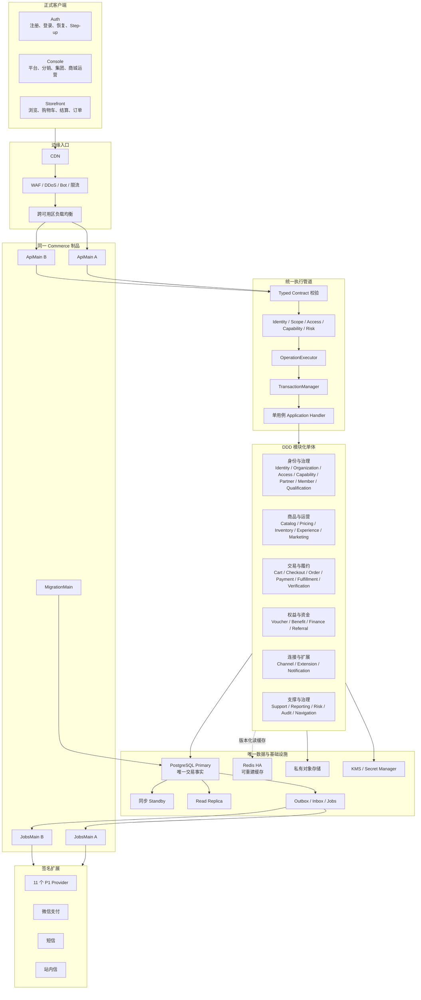

关键裁决：

1. PostgreSQL 是唯一事实源。
2. Redis、搜索、报表投影、队列消费位置都必须可重建。
3. 同一强一致用例通过窄 Public Port 共享一个不透明事务上下文。
4. 非强一致副作用通过 Outbox/Inbox。
5. 外部网络调用永远不位于数据库事务中。
6. 一个模块只能写自己的 Schema。
7. Reporting 只读自身投影，不跨 Schema 拼接业务报表。
8. Finance 只消费经济事件，不允许 Payment、Voucher、Benefit 直接写财务表。
9. Provider 扩展不获得数据库连接。
10. 不保留旧 `ModuleOperations`、旧 Operation 分派或兼容别名。

---

# 四、目标调用方向

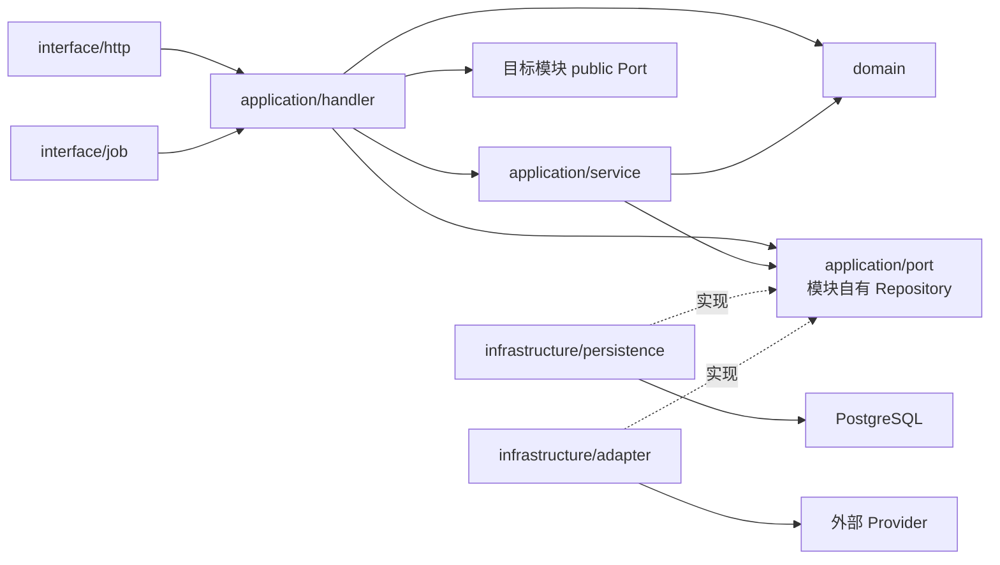

禁止的方向：

```text
domain           -X-> application / infrastructure / interface
application      -X-> infrastructure / interface
public           -X-> pg / DatabasePool / SQL / infrastructure
模块 A           -X-> 模块 B 的 application/domain/infrastructure
Repository A     -X-> Schema B
Handler          -X-> query()
Provider         -X-> TransactionContext
```

---

# 五、无 `query()` 的事务上下文

## 5.1 目标模型

公共端口和 Application Handler 只能看到不可伪造的上下文：

```ts
declare const transactionBrand: unique symbol;

export type TransactionMode = 'read' | 'write';

export interface TransactionContext<TMode extends TransactionMode> {
  readonly [transactionBrand]: TMode;
  readonly id: string;
  readonly mode: TMode;
  readonly tenant: string;
  readonly membership: string;
  readonly scope: string;
  readonly actor: string;
  readonly trace: string;
  readonly operation: OperationId;
  readonly deadline: number;
  readonly signal: AbortSignal;
}

export type ReadTransactionContext = TransactionContext<'read'> | TransactionContext<'write'>;

export type WriteTransactionContext = TransactionContext<'write'>;
```

它明确携带：

- 操作和 Trace 身份；
- Tenant、Membership、Scope、Actor；
- Read/Write 能力；
- Deadline 和 AbortSignal；
- 事务实例身份。

它明确不携带：

- `query()`；
- `DatabasePool`；
- PG Client；
- SQL；
- `QueryResult`；
- `rowCount`；
- Schema 或表名；
- 提交、回滚方法。

## 5.2 底层解包

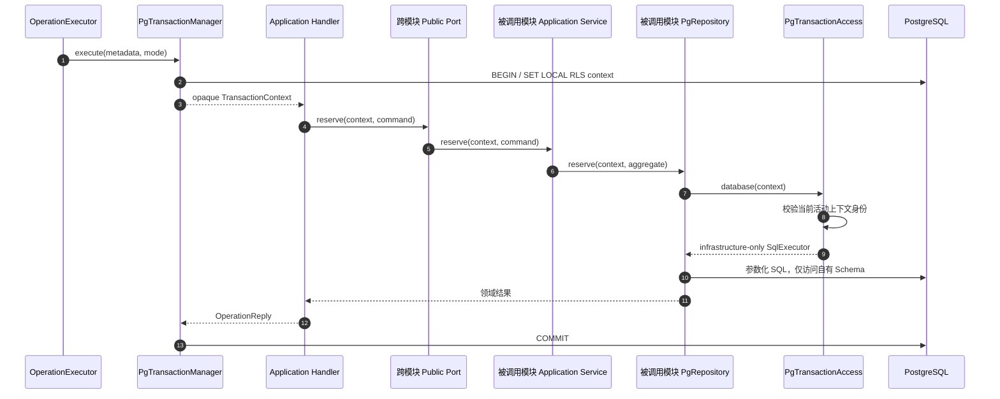

`PgTransactionAccess` 应继续复用当前 `PgUnitOfWork` 的 AsyncLocalStorage、Scope 一致性检查、Serializable 重试等正确基础。[PgUnitOfWork.ts](/Users/changshengwang/Workspace/zhudatuan/services/commerce/src/adapter/database/PgUnitOfWork.ts:1)

但必须增加：

- `active.context === suppliedContext` 的对象身份校验；
- 事务提交后上下文立即失效；
- Write Repository 只接受 `WriteTransactionContext`；
- Read Repository 可接受 Read 或 Write；
- 嵌套事务只能 Join 同一 Tenant、Scope、Actor、Operation；
- 不允许保存上下文供异步任务稍后复用；
- 不允许外部扩展持有上下文；
- Repository 之外禁止导入 `PgTransactionAccess`。

## 5.3 Public Port 示例

```ts
export interface CheckoutInventoryPort {
  availability(context: ReadTransactionContext, scope: string, skus: readonly string[]): Promise<readonly CheckoutStock[]>;

  reserve(context: WriteTransactionContext, command: InventoryReservation): Promise<InventoryReservationReceipt>;
}
```

Public Port 返回领域 DTO，不返回 `QueryResult`。

提供方实现：

```ts
export class InventoryCheckoutService implements CheckoutInventoryPort {
  constructor(private readonly inventory: InventoryRepository) {}

  availability(context, scope, skus) {
    return this.inventory.availability(context, scope, skus);
  }

  reserve(context, command) {
    return this.inventory.reserve(context, command);
  }
}
```

SQL 只存在于：

```text
inventory/infrastructure/persistence/PgInventoryRepository.ts
```

---

# 六、真正的单用例 Application Handler

## 6.1 当前问题

当前 `defineOperationHandler()` 只生成通用包装类：[OperationHandler.ts](/Users/changshengwang/Workspace/zhudatuan/services/commerce/src/foundation/application/OperationHandler.ts:25)。

业务实际仍在：

- `BenefitOperations.ts`；
- `CatalogOperations.ts`；
- `ExperienceOperations.ts`；
- `PaymentOperations.ts`；
- 其他 23 个 Operations 聚合文件；
- 部分 `application/command`、`application/query` 类。

这造成：

- Handler 只绑定名字；
- 用例边界和文件边界不一致；
- Repository 无法按聚合抽离；
- 测试仍需模拟裸 `query()`；
- `ModuleOperations` 同时负责分派、事务、幂等、审计、错误和结果映射，违反 SRP；
- 生成的 `HandlerCatalog.ts` 与 Module 映射形成重复运行时分派。

## 6.2 目标 Handler

每个 Operation 对应一个真实类：

```ts
export class PoolsReadHandler implements OperationHandler<'catalog.pools.read'> {
  readonly operation = 'catalog.pools.read' as const;

  constructor(
    private readonly pools: PoolRepository,
    private readonly organizations: OrganizationReadPort
  ) {}

  async handle(input: OperationInputFor<'catalog.pools.read'>, context: HandlerContext<'catalog.pools.read'>): Promise<OperationReply<OperationOutputFor<'catalog.pools.read'>>> {
    const scope = requireScope(context.security);
    const visible = await this.organizations.descendants(context.transaction, scope.id);
    const page = await this.pools.read(context.transaction, visible, input.query);
    return { status: 200, body: page };
  }
}
```

要求：

- 一个文件只能有一个 Handler；
- 一个 Handler 只能声明一个 Operation；
- Handler 文件路径必须和 `operations.yml` 一致；
- Handler 是业务用例编排者，不是 Controller；
- Handler 不包含 SQL；
- Handler 不返回数据库 Row；
- Handler 只能依赖本模块 Repository、Domain Service、其他模块 Public Port；
- Handler 不通过全局 Container 获取依赖；
- Handler 不直接写 Audit、Idempotency 表；
- Handler 不自行 begin/commit；
- 无业务意义的三行 Handler 判定为失败。

## 6.3 `ModuleOperations.ts` 的拆分

| 当前责任            | 目标组件                                             |
| ------------------- | ---------------------------------------------------- |
| Operation 分派      | `HandlerRegistry` 直接注册真实 Handler               |
| Read/Write 事务     | `OperationExecutor` + `TransactionManager`           |
| 幂等 claim/complete | `IdempotencyRepository`                              |
| Maker/Checker       | `MakerCheckerPolicy` Decorator                       |
| 高风险读审计        | `AuditDecorator`                                     |
| 写审计              | `AuditAppender`                                      |
| Outbox              | Handler 产生领域事件，`OutboxWriter` 同事务持久化    |
| `rowResult()`       | Repository 映射成领域结果，Handler 映射 Contract DTO |
| `pageResult()`      | 类型化 `Page<T>`                                     |
| `reject()`          | 类型化 `ApplicationError`                            |
| durable finalize    | `DurableOperationHandler` 执行协议                   |

最终删除：

- `foundation/application/ModuleOperations.ts`；
- `foundation/application/TransactionRunner.ts`；
- 旧 `OperationExecution`/`OperationUsecase.invoke()` 适配层；
- `generated/HandlerCatalog.ts` 的通用构造器映射；
- 所有模块级 `*Operations.ts`；
- 所有兼容 re-export、旧类型别名。

## 6.4 Durable Handler

支付、上传、Provider、导出等外部副作用使用明确的三阶段协议：

```text
prepare：事务外、无副作用的加载和计算
commit：数据库事务内提交状态、幂等 checkpoint、Audit、Outbox
finalize：提交后调用外部系统
```

`ConfirmQuoteHandler` 的目标接口：

```ts
interface DurableOperationHandler<TKey, TPrepared, TCheckpoint> {
  readonly operation: TKey;
  prepare(input, context): Promise<TPrepared>;
  commit(input, prepared, contextWithWriteTransaction): Promise<TCheckpoint>;
  finalize(input, checkpoint, externalContext): Promise<OperationReply>;
  discard?(prepared, cause): Promise<void>;
}
```

`finalize()` 不含 TransactionContext，因此类型上不能调用 Repository。失败时保持 `checkpointed`，由恢复 Job 重试，绝不能回滚已经提交的订单。

---

# 七、模块根和固定目录

## 7.1 根目录硬规则

每个模块根目录生产代码只允许：

```text
Module.ts
Manifest.ts
```

测试不允许留在模块根，应放到 `test/` 或对应层的相邻测试文件。

建议把 Runtime、Observability 从 foundation 的“伪模块”移动为正式支撑模块，使所有 Operation Owner 都遵循相同规则。最终是 32 个模块目录：

```text
29 个业务模块
+ navigation
+ runtime
+ observability
```

## 7.2 固定模块骨架

```text
modules/catalog
├─ Module.ts
├─ Manifest.ts
├─ public
│  ├─ index.ts
│  ├─ CheckoutCatalogPort.ts
│  ├─ ExperienceCatalogPort.ts
│  └─ ReferralCatalogPort.ts
├─ application
│  ├─ handler
│  │  ├─ PoolsReadHandler.ts
│  │  ├─ PoolsAttachHandler.ts
│  │  ├─ ProductsCreateHandler.ts
│  │  ├─ ListingsPublishHandler.ts
│  │  └─ ImportsCreateHandler.ts
│  ├─ port
│  │  ├─ PoolRepository.ts
│  │  ├─ ProductRepository.ts
│  │  ├─ ListingRepository.ts
│  │  ├─ CatalogImportRepository.ts
│  │  └─ CatalogSource.ts
│  ├─ service
│  │  ├─ ProductMatcher.ts
│  │  └─ ListingPublisher.ts
│  ├─ process
│  │  └─ CatalogImportProcess.ts
│  └─ model
│     └─ CatalogPage.ts
├─ domain
│  ├─ model
│  │  ├─ Product.ts
│  │  ├─ Sku.ts
│  │  ├─ Pool.ts
│  │  └─ Listing.ts
│  ├─ value
│  │  ├─ ProductId.ts
│  │  └─ ListingId.ts
│  ├─ policy
│  │  ├─ ListingPolicy.ts
│  │  └─ ProductArchivePolicy.ts
│  ├─ service
│  │  └─ ProductNormalizer.ts
│  ├─ event
│  │  ├─ ProductChanged.ts
│  │  └─ ListingPublished.ts
│  └─ error
│     └─ CatalogError.ts
├─ infrastructure
│  ├─ persistence
│  │  ├─ PgPoolRepository.ts
│  │  ├─ PgProductRepository.ts
│  │  ├─ PgListingRepository.ts
│  │  └─ PgCatalogImportRepository.ts
│  ├─ adapter
│  ├─ integration
│  ├─ cache
│  ├─ messaging
│  ├─ registry
│  └─ security
├─ interface
│  ├─ http
│  ├─ job
│  ├─ event
│  └─ webhook
└─ test
   ├─ Module.test.ts
   └─ Architecture.test.ts
```

硬性目录约束：

| 层               | 允许的直接子目录                                                                      |
| ---------------- | ------------------------------------------------------------------------------------- |
| `application`    | `handler`、`port`、`service`、`process`、`model`                                      |
| `domain`         | `model`、`value`、`policy`、`service`、`event`、`error`                               |
| `infrastructure` | `persistence`、`adapter`、`integration`、`cache`、`messaging`、`registry`、`security` |
| `interface`      | `http`、`job`、`event`、`webhook`                                                     |
| `public`         | `index.ts`、`*Port.ts`、纯 DTO/Contract 类型                                          |
| `test`           | 模块级测试                                                                            |

不再保留 `application/command`、`application/query` 作为另一套用例层。现有这些目录里的单用例类应合并进真实 Handler；只有被多个 Handler 复用的逻辑才进入 `application/service`。

---

# 八、现有模块根文件处置

所有 `XModule.ts` 统一更名为 `Module.ts`。其余根文件按下表迁移，原文件最终删除，不留别名。

| 模块          | 当前根文件                                                        | 目标                                                                                           |
| ------------- | ----------------------------------------------------------------- | ---------------------------------------------------------------------------------------------- |
| Access        | `AccessOperations.ts`、`AccessPort.ts`                            | 5 个真实 Handler；Repository 接口进 `application/port`；PG 实现进 `infrastructure/persistence` |
| Audit         | `AuditModule.ts`                                                  | 更名 `Module.ts`                                                                               |
| Benefit       | Operations、Jobs、Deadletter、JobSupport、OperationSupport、Port  | Handler；`application/process`；`interface/job`；Repository                                    |
| Capability    | Operations、Port                                                  | 2 个 Handler；Capability Repository                                                            |
| Cart          | Operations                                                        | 3 个 Handler；Cart Repository                                                                  |
| Catalog       | Operations、SourcePort                                            | 14 个 Handler；Pool/Product/Listing/Import Repository                                          |
| Channel       | OperationPort                                                     | 18 个 Handler；Connection/Sync/ProviderOperation Repository；Provider 适配器                   |
| Checkout      | Operations、CheckoutPort、AddressPort                             | 3 个 Handler；Checkout/Quote Repository；地址能力改为 Member Public Port                       |
| Experience    | Operations、Jobs                                                  | 8 个 Handler；Application/Version/Publication Repository；发布 Job                             |
| Extension     | `ExtensionModule.ts`                                              | `Module.ts`；安装、验证和 Registry 分层                                                        |
| Finance       | LifecycleOperations、FinancePort、InvoicePort                     | 35 个 Handler；Journal/Policy/Repair/Invoice Repository                                        |
| Fulfillment   | Operations、Jobs、Port                                            | 4 个 Handler；Fulfillment/Return/Tracking Repository；Jobs 进入 interface                      |
| Identity      | Operations、IdentitySubject                                       | 删除分派器；33 个真实 Handler；Subject 进入 domain/value                                       |
| Inventory     | Operations、Port                                                  | 2 个导入 Handler；补 Stock/Reservation Repository 供 Public Port 使用                          |
| Marketing     | Operations、Port                                                  | 1 个读 Handler；Campaign/Budget/Reservation Repository                                         |
| Member        | Operations、Port                                                  | 8 个 Handler；Member/Address/Favorite/Import Repository                                        |
| Navigation    | `NavigationModule.ts`                                             | `Module.ts`；5 个真实 Handler；只读投影和缓存端口                                              |
| Notification  | `NotificationModule.ts`                                           | `Module.ts`；9 个真实 Handler；Delivery Process                                                |
| Order         | Operations、Jobs、多个 Port                                       | 8 个 Handler；Order/AfterSale/Reminder/Export Repository                                       |
| Organization  | Operations、Port                                                  | 6 个 Handler；Organization/Directory/Sync Repository                                           |
| Partner       | Operations、Port                                                  | 4 个 Handler；Partner/Store Repository                                                         |
| Payment       | Operations、Composition、Webhook、Jobs、Deadletter、Support、Port | 5 个 Handler；Payment/Refund/Recovery/Inbox Repository；外部 Gateway Adapter                   |
| Pricing       | Operations、Port                                                  | 2 个 Handler；Rule/Quote Repository                                                            |
| Qualification | Operations                                                        | 3 个 Handler；Policy/Profile/Decision Repository                                               |
| Referral      | `ReferralModule.ts`                                               | `Module.ts`；保留已有 15 个 Handler，补齐真实逻辑                                              |
| Reporting     | `ReportingModule.ts`                                              | `Module.ts`；10 个真实查询/导出 Handler                                                        |
| Risk          | CheckoutRisk、RiskModule                                          | CheckoutRisk 移到 `application/service` 或 Public Port 实现；模块更名                          |
| Support       | `SupportModule.ts`                                                | `Module.ts`；18 个真实 Handler                                                                 |
| Verification  | Operations                                                        | 6 个 Handler；Challenge/Session/Device Repository                                              |
| Voucher       | 两个 Operations、Queries、Jobs、Deadletter、Support               | 19 个 Handler；CardLibrary/Program/Reserve/Voucher/Batch/Import Repository                     |
| Runtime       | foundation 下的 Runtime Operations                                | 新建 `modules/runtime`，4 个 Health Handler                                                    |
| Observability | `ClientErrorOperations.ts`                                        | 新建 `modules/observability`，2 个真实 Handler                                                 |

---

# 九、每个模块的 Handler 与 Repository 终态

操作总数必须保持 269。

| 模块          | Operation 数 | 模块自有 Repository                                                                           | 关键内部不变量                                                 |
| ------------- | -----------: | --------------------------------------------------------------------------------------------- | -------------------------------------------------------------- |
| Runtime       |            4 | HealthDependencyReader                                                                        | Readiness 必须验证配置 Hash、Contract Hash、迁移 Head、DB Role |
| Observability |            2 | ClientErrorRepository                                                                         | 敏感字段强制脱敏；采样和限流                                   |
| Identity      |           33 | Credential、Session、Invitation、Federation、Provider、Link、Enrollment、Assurance Repository | Principal 唯一；验证码一次性；密码强哈希；会话版本化           |
| Organization  |            6 | Organization、Directory、SyncRun Repository                                                   | 层级无环；Closure 一致；跨租户移动禁止                         |
| Access        |            5 | Access、Authorization、Governance、Membership Repository                                      | 默认拒绝；Deny 优先；AccessVersion 单调递增                    |
| Capability    |            2 | Capability、Assignment Repository                                                             | 套餐版本不可原地修改；配额原子更新                             |
| Partner       |            4 | Partner、Store Repository                                                                     | 主体稳定；协议只追加；停止合作不删历史                         |
| Member        |            8 | Member、Address、Favorite、Import Repository                                                  | Principal 与租户档案分离；PII 加密；导入行幂等                 |
| Qualification |            3 | Policy、Profile、Decision Repository                                                          | 明确拒绝优先；决策保存输入摘要和规则版本                       |
| Channel       |           18 | Connection、Distributor、SyncRun、ProviderOperation Repository                                | Cursor 只在业务数据持久化后推进；外部标识唯一                  |
| Catalog       |           14 | Pool、Product、Listing、Import、SourceMapping Repository                                      | Product/Sku/Listing 分离；被订单引用后只能归档                 |
| Pricing       |            2 | PricingRule、Quote Repository                                                                 | 整数分；确定舍入；最低毛利；Quote 不可变                       |
| Inventory     |            2 | Stock、Reservation、Movement、Import Repository                                               | 可售量公式固定；Reservation 只能提交/释放/过期一次             |
| Marketing     |            1 | Campaign、Budget、Reservation Repository                                                      | 预算原子预占；叠加顺序版本化                                   |
| Reporting     |           10 | Fact、Projection、Watermark、Export Repository                                                | 投影可重建；Watermark 单调；不得跨 Schema 直接查询             |
| Experience    |            8 | Application、Version、Release、Publication Repository                                         | 发布快照不可变；Head CAS；校验通过后才切换                     |
| Cart          |            3 | Cart Repository                                                                               | Cart 只保存意图，不锁最终价和库存；版本冲突显式返回            |
| Checkout      |            3 | Checkout、Quote、Evidence Repository                                                          | Quote 签名、版本、有效期完整；确认时固定顺序重验               |
| Order         |            8 | Order、AfterSale、Reminder、Export Repository                                                 | 商品、价格、地址、资格、参与方形成不可变快照                   |
| Fulfillment   |            4 | Fulfillment、Return、Tracking Repository                                                      | Provider Unknown 先查单；重复回调无第二效果                    |
| Payment       |            5 | Payment、Refund、Recovery、WebhookInbox Repository                                            | Intent/Attempt/Refund 语义键唯一；Unknown 不盲目重扣           |
| Verification  |            6 | Challenge、Session、Device、Attempt Repository                                                | 动态码一次性、短时、绑定设备/门店/用途                         |
| Voucher       |           19 | CardLibrary、Program、Reserve、Voucher、Batch、Import Repository                              | 卡号卡密分离；状态 CAS；核销一次；冲正引用原交易               |
| Benefit       |           12 | Account、Plan、Budget、Grant、Lot、Ledger Repository                                          | 余额由只追加流水归集；批次子项幂等                             |
| Finance       |           35 | Account、Journal、Statement、Settlement、Policy、Repair、Invoice Repository                   | 借贷平衡；经济腿唯一；关账后只允许冲正                         |
| Support       |           18 | Case、Message、Assignment、Agent、Rule、Sla Repository                                        | 客服不可直接修改订单、库存和资金                               |
| Notification  |            9 | Notification、Preference、Template、Endpoint、Attempt Repository                              | 事件+接收人+渠道唯一；重试有上限                               |
| Risk          |            3 | Policy、Case、Decision Repository                                                             | 硬规则优先；保存规则/模型版本；高风险默认关闭                  |
| Audit         |            1 | Audit Repository                                                                              | 只追加；Hash Chain 连续；高风险审计失败则业务失败              |
| Extension     |            1 | Extension Repository                                                                          | Manifest 签名、API 版本、权限白名单、健康检查                  |
| Navigation    |            5 | NavigationProjection Repository、NavigationCache                                              | 只组合 Public Read Port；菜单不等于授权                        |
| Referral      |           15 | Referral、Commission、Withdrawal Repository                                                   | 推荐关系不可重绑；佣金经济腿唯一；提现幂等                     |

---

# 十、统一请求时序

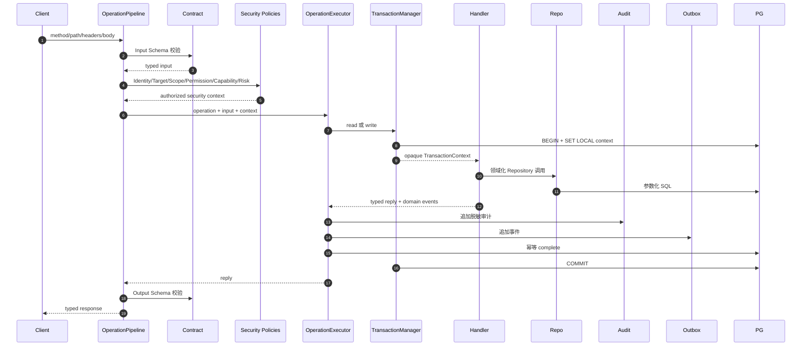

---

# 十一、核心跨模块时序

## 11.1 报价与原子下单

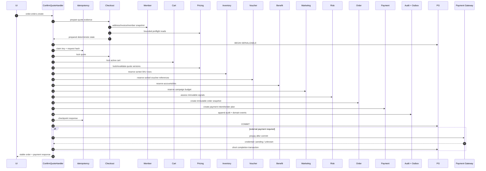

固定锁顺序：

```text
Idempotency
→ CheckoutQuote
→ Cart
→ Pricing evidence
→ Inventory，按 SKU 排序
→ Voucher，按引用排序
→ Benefit Account/Lot，按 ID 排序
→ Marketing Budget，按 Campaign 排序
→ Order
→ PaymentIntent
→ Audit
→ Outbox
```

## 11.2 支付回调

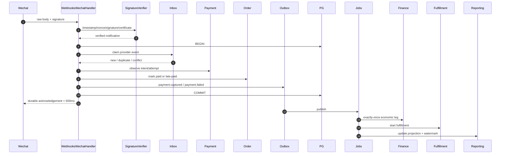

## 11.3 Provider 商品、价格、库存同步

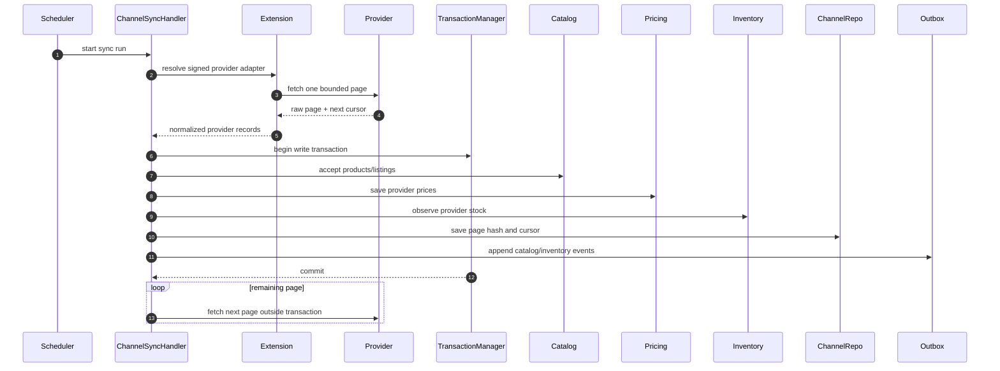

原则：外部 Fetch 在事务外；单页归一化结果、业务数据和 Cursor 在同一事务内提交。

## 11.4 身份注册和登录

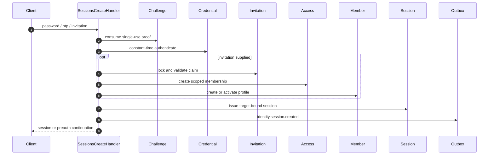

## 11.5 商城装修发布

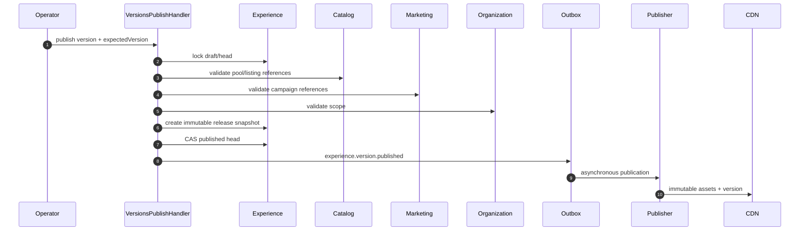

## 11.6 财务与报表

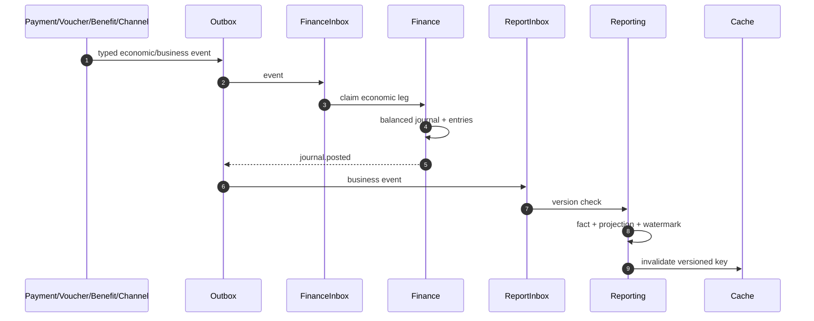

---

# 十二、每个模块内部数据流时序

以下每个片段都是独立用例，不代表模块之间按图示顺序串行。

## 12.1 身份和治理模块

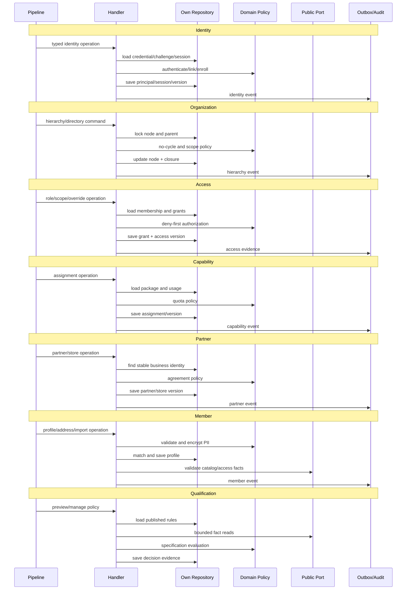

## 12.2 商品和运营模块

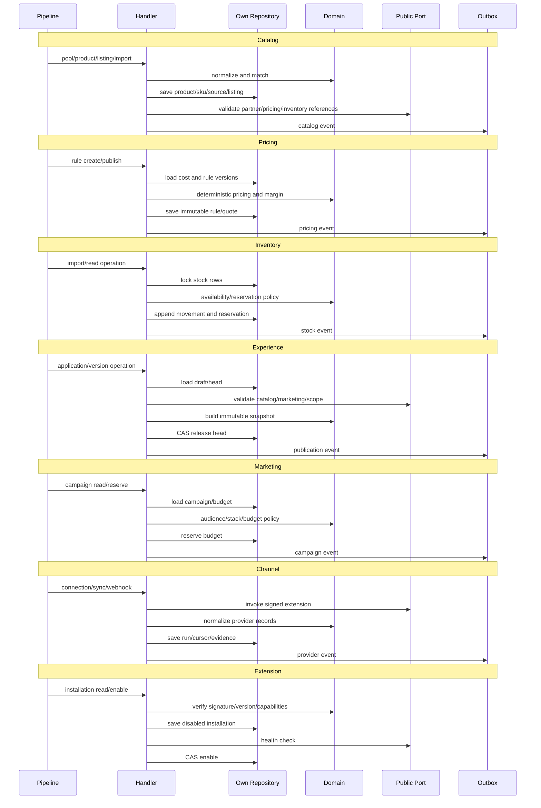

## 12.3 交易和履约模块

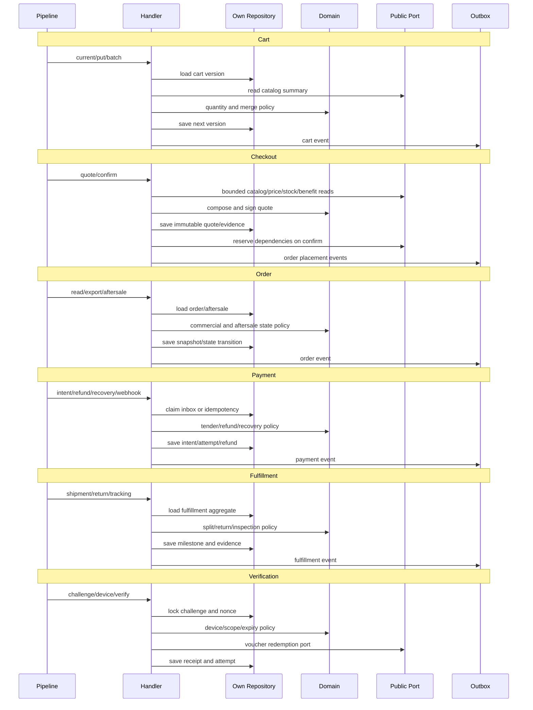

## 12.4 权益、资金和分销模块

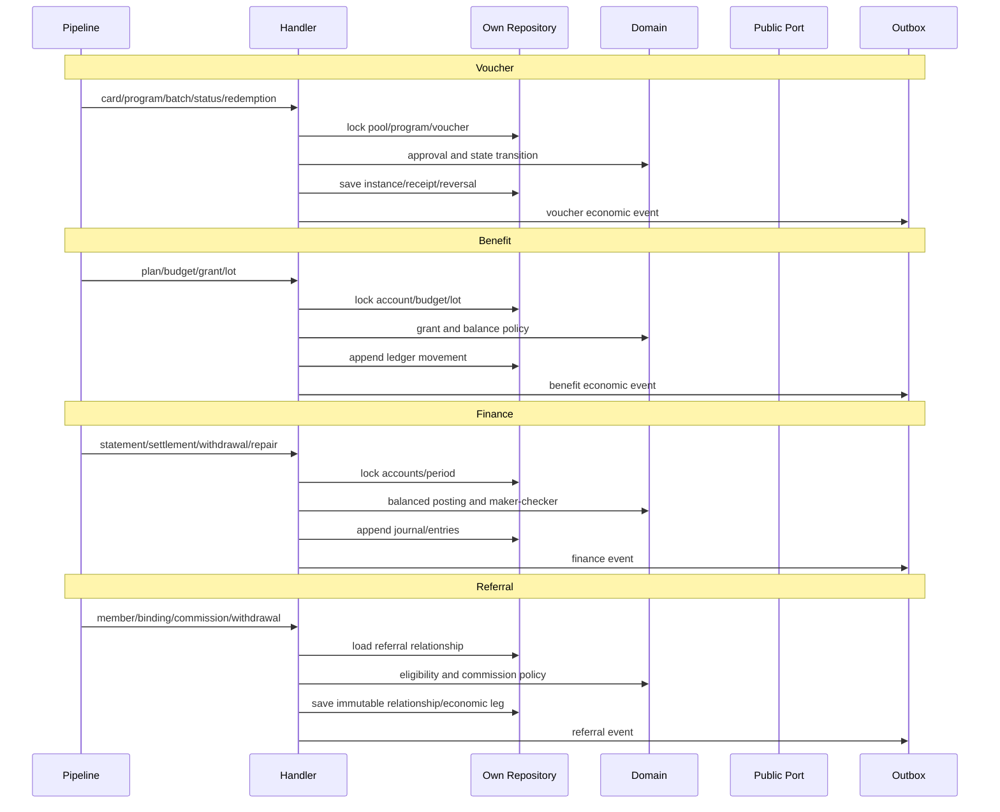

## 12.5 支撑和治理模块

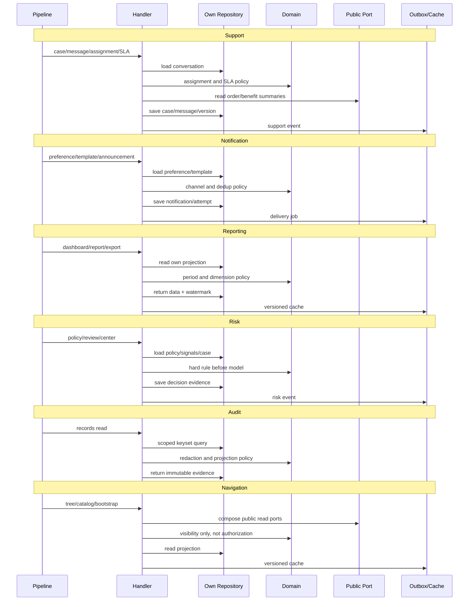

## 12.6 平台支撑模块

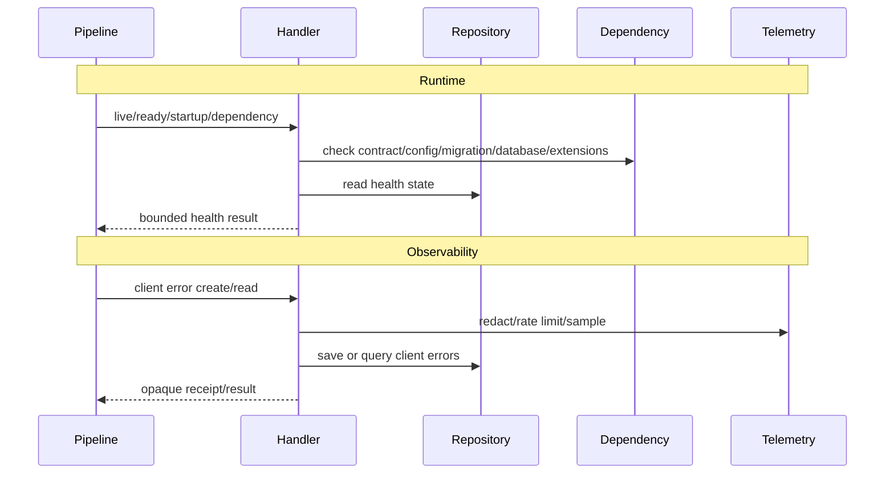

---

# 十三、边界脚本必须新增的规则

当前脚本只识别层方向和跨模块导入：[boundary.mjs](/Users/changshengwang/Workspace/zhudatuan/scripts/audit/boundary.mjs:14)。应改成 TypeScript AST 驱动的 fail-closed 审计。

| 诊断码                               | 触发条件                                               |
| ------------------------------------ | ------------------------------------------------------ |
| `MODULE_ROOT_FILE_FORBIDDEN`         | 模块根出现非 `Module.ts`/`Manifest.ts` 生产文件        |
| `MODULE_ROOT_TEST_FORBIDDEN`         | 模块根出现测试                                         |
| `MODULE_ASSEMBLY_MISSING`            | 缺少 Module 或 Manifest                                |
| `MODULE_LAYER_UNKNOWN`               | 出现未登记的顶层或叶目录                               |
| `MODULE_COMPOSITION_LOGIC_FORBIDDEN` | Module 中出现 SQL、业务条件、领域状态修改              |
| `MANIFEST_SIDE_EFFECT_FORBIDDEN`     | Manifest 除静态声明外执行代码                          |
| `OPERATIONS_AGGREGATOR_FORBIDDEN`    | 任意生产文件名以 `Operations.ts` 结尾                  |
| `HANDLER_PATH_INVALID`               | Handler 不在所属模块的 `application/handler`           |
| `HANDLER_CARDINALITY_INVALID`        | 一个文件零个或多个 Handler                             |
| `HANDLER_OPERATION_MISMATCH`         | Handler 声明的 ID 与 `operations.yml` 不一致           |
| `HANDLER_STUB_FORBIDDEN`             | Handler 仅调用通用分派器或 `defineOperationHandler()`  |
| `HANDLER_SQL_FORBIDDEN`              | Handler 存在 SQL 或 `query()`                          |
| `PUBLIC_DATABASE_TYPE_FORBIDDEN`     | public 导入 `pg`、Pool、Transaction、OperationDatabase |
| `PUBLIC_IMPLEMENTATION_FORBIDDEN`    | public 文件出现 PG 实现或网络实现                      |
| `PUBLIC_RESULT_ROW_FORBIDDEN`        | public 返回 QueryResult/Row/rowCount                   |
| `REPOSITORY_PATH_INVALID`            | Repository 接口/实现不在规定目录                       |
| `REPOSITORY_OWNER_INVALID`           | 模块导入其他模块 Repository                            |
| `CROSS_SCHEMA_SQL_FORBIDDEN`         | Repository SQL 引用非自有 Schema                       |
| `CROSS_MODULE_INTERNAL_IMPORT`       | 跨模块不经 `public/index.ts`                           |
| `TRANSACTION_CONTEXT_ESCAPE`         | 上下文写入字段、缓存、Job Payload 或异步闭包           |
| `RAW_TRANSACTION_IMPORT_FORBIDDEN`   | 非 persistence/adapter 代码导入底层 Transaction        |
| `EXTERNAL_CALL_IN_TRANSACTION`       | Write 事务阶段调用 Gateway/网络/KMS/对象存储           |
| `UNRESOLVED_IMPORT`                  | 相对导入无法解析，禁止静默忽略                         |
| `MODULE_SYMLINK_ESCAPE`              | 文件通过链接逃出模块根                                 |
| `PRODUCTION_NAME_INVALID`            | 生产命名含连接符、下划线、空格或无意义缩写             |

模块 Schema 所有权不能复制到新配置，应读取现有 `database/contracts/objects.yml`。Operation Owner/Handler 路径读取 `operations.yml`，模块依赖读取 `Manifest.ts`，命名读取 `config/naming.yml`。

特别要修复事务检查的盲区：当前 `transactions.mjs` 只扫描文件名以 `Operations.ts` 结尾的文件。[transactions.mjs](/Users/changshengwang/Workspace/zhudatuan/scripts/check/transactions.mjs:37)  
如果直接删除 Operations 文件而不改脚本，事务检查会扫描零文件并错误通过。

新事务检查必须扫描：

- 所有 `application/handler`；
- `application/service`；
- `application/process`；
- `interface/job`；
- 所有 Gateway 调用点；
- Durable Handler 的 `commit()` 与 `finalize()`；
- Public Port 的跨模块调用图。

---

# 十四、数据一致性

| 场景                                             | 机制                                                                   |
| ------------------------------------------------ | ---------------------------------------------------------------------- |
| 下单、库存、券、福利金、营销预算、订单、支付意图 | 同一 PostgreSQL Serializable 事务                                      |
| 写 API 重试                                      | `actor + operation + scope + idempotencyKey` 唯一，并保存 Request Hash |
| Provider Webhook                                 | 原始报文验签 + Inbox 唯一键 + Durable Accept                           |
| 支付、退款                                       | Intent、Attempt、Refund 各自拥有语义唯一键                             |
| Finance                                          | `ownerEventId + economicLegId` 唯一；Journal/Entry 只追加              |
| Outbox                                           | `aggregate + version + eventType` 唯一                                 |
| Inbox                                            | `consumer + eventId` 唯一                                              |
| 状态更新                                         | `id + expectedVersion` CAS                                             |
| 报表                                             | 最终一致，必须返回 Watermark                                           |
| 缓存                                             | 版本化 Key，可丢弃重建                                                 |
| 外部 Unknown                                     | 查单/恢复，不立即重试扣款                                              |
| Job                                              | Lease + Fencing Token；副作用前重新验证租约                            |

任何写事务必须同时提交：

```text
聚合状态
+ 版本
+ 幂等状态
+ Audit
+ Outbox
```

禁止：

- 双写数据库和队列；
- 分布式事务；
- 业务代码跨 Schema Update；
- 删除财务、支付、核销、审计历史；
- 用 Redis 锁代替数据库约束；
- 用“已调用外部接口”推断对方成功。

---

# 十五、安全设计

1. Public Port 不再暴露 SQL 能力，直接缩小跨模块权限面。
2. 数据库角色按 API Query、API Command、Worker、Migration 分离。
3. `SET LOCAL` 设置 Tenant、Membership、Scope、Actor、Trace、Operation，并由 RLS 兜底。
4. 身份不存在、密码错误、验证码错误采用统一外部响应和恒定工作量。
5. Session 必须绑定 Target、Client、Membership、AccessVersion。
6. 写操作统一校验 Origin、CSRF、Idempotency、ExpectedVersion。
7. Critical Operation 要求 Step-up、Action Proof、Maker/Checker。
8. Webhook 使用原始 Body、时间窗、Nonce、签名证书和 Inbox 防重放。
9. PII、卡密、Provider Credential 使用信封加密，密钥仅来自 KMS/Secret Store。
10. 日志脱敏沿用当前 `telemetry.yml` 的 deny 列表。[telemetry.yml](/Users/changshengwang/Workspace/zhudatuan/config/telemetry.yml:14)
11. Extension Manifest 必须签名，并声明版本、能力、配置 Schema、权限和健康检查。
12. Provider 不能访问数据库、文件系统、任意网络目标或全局 Container。
13. Repository 所有 SQL 参数化；表名、排序字段只能来自编译期白名单。
14. 高风险读也写 Audit；Audit 失败时关闭失败，不能静默放行。

---

# 十六、性能和高可用

现有容量基线应直接复用，不新建第二份配置：[capacity.yml](/Users/changshengwang/Workspace/zhudatuan/config/capacity.yml:3)。

| 指标                       |      目标 |
| -------------------------- | --------: |
| 峰值 API                   | 5,000 QPS |
| 峰值订单                   |   300 TPS |
| 峰值支付回调               |   600 TPS |
| 卡券批次                   | 1,000,000 |
| Catalog P95                |    ≤150ms |
| 普通 Query P95             |    ≤300ms |
| Detail P95                 |    ≤500ms |
| Command P95                |    ≤800ms |
| Order P95                  |  ≤1,500ms |
| Webhook Durable Accept P99 |    ≤500ms |
| Outbox P99                 |      ≤30s |
| 可用性                     |    99.95% |
| RPO                        |   ≤5 分钟 |
| RTO                        |  ≤30 分钟 |

性能实现原则：

- Query 事务使用 `READ ONLY`；
- Command 使用 Serializable，最多四次短退避重试；
- 事务外可使用有界并行，事务内按固定锁顺序串行；
- 列表使用 Keyset，默认 50、最大 200；
- Repository 必须提供批量方法，禁止 Handler 循环产生 N+1；
- Catalog、Experience、Access、Reporting 使用现有版本化缓存；
- Reporting 走自身投影和 Read Replica；
- Provider 使用 Bulkhead、Rate Limit、Circuit Breaker；
- 批量发券、导入、导出和同步由 Job 分片；
- API 和 Jobs 使用不同连接池；
- 当前池预算是 69/100，维持最大利用率不超过 70%；
- SQL 门禁继续禁止 `SELECT *`、OFFSET 分页和无界 `Promise.all`；
- 每个 Repository 集成测试记录查询数量、计划成本、返回字节数。

高可用：

- API、Jobs 跨可用区部署；
- API 无状态，可安全 Drain；
- PostgreSQL Primary + 同步 Standby + Read Replica；
- Outbox/Inbox 确保进程崩溃后可恢复；
- Ready 探针验证 Contract、Config、Migration、DB Role、Extension Registry；
- 外部 Provider 故障只能降级对应能力，不能拖垮核心线程池；
- 支付和 Provider Unknown 进入 Recovery，不允许丢单。

---

# 十七、唯一配置体系

| 事实                    | 唯一来源                                       |
| ----------------------- | ---------------------------------------------- |
| MVP 需求                | `docs/福利商城功能清单.xlsx`                   |
| Operation               | `packages/contract/definitions/operations.yml` |
| Event                   | `packages/contract/definitions/events.yml`     |
| Permission/Capability   | 对应 contract definitions                      |
| 模块依赖和基础服务      | 每个模块 `Manifest.ts`                         |
| Handler 实例化          | 每个模块 `Module.ts`                           |
| 数据对象和 Schema Owner | `database/contracts/objects.yml`               |
| 容量                    | `config/capacity.yml`                          |
| SLO 和脱敏              | `config/telemetry.yml`                         |
| 缓存                    | `config/cache.yml`                             |
| 导航                    | `config/navigation.yml`                        |
| Provider 能力           | Extension Manifest                             |
| 密钥值                  | KMS/Secret Store                               |

禁止重复维护：

- Module Operation ID 数组；
- Handler Catalog 手写映射；
- Controller 路由清单；
- 另一个模块依赖 YAML；
- Repository Schema 白名单副本；
- README 中的运行时配置默认值；
- 前端自己的 Permission、Scope、Operation 常量。

生成物只能派生，不能成为事实源；生成检查必须比较内容 Hash。

---

# 十八、实施顺序

所有迁移在独立分支完成，最终以一次硬切发布；不得把新旧执行路径同时部署到生产。

## 阶段 0：冻结证据

- 保存当前工作树状态和 relevant audit 输出；
- 固定工作簿 Hash；
- 固定 269 Operation；
- 固定 22 MVP 和 11 Provider；
- 建立性能、事务、SQL、Journey 基线。

## 阶段 1：先建立新基础协议

新增或重构：

```text
foundation/application/HandlerContext.ts
foundation/application/OperationExecutor.ts
foundation/application/OperationHandler.ts
foundation/application/IdempotencyRepository.ts
foundation/application/AuditDecorator.ts
foundation/persistence/TransactionContext.ts
foundation/persistence/TransactionManager.ts
adapter/database/PgTransactionManager.ts
adapter/database/PgTransactionAccess.ts
```

复用：

- 当前 Pg Pool；
- PgUnitOfWork 的 ALS、Serializable、重试；
- OperationPipeline；
- HandlerRegistry；
- Operation Contract；
- Audit、Outbox；
- LockOrderGuard。

## 阶段 2：强化门禁，但暂不接入正式 quality

先完成脚本和脚本测试，避免尚未迁移的旧代码导致整个分支无法工作。脚本完成后迁移模块，最终再把严格检查接入 `quality`。不保留 baseline allowlist。

## 阶段 3：按依赖波次迁移 269 个 Handler

| 波次 | 模块                                                                                                    | Operation 数 |
| ---- | ------------------------------------------------------------------------------------------------------- | -----------: |
| 1    | Runtime、Observability、Audit、Marketing、Pricing、Inventory、Qualification、Risk、Reporting、Extension |           29 |
| 2    | Organization、Capability、Partner、Access                                                               |           17 |
| 3    | Member、Identity、Notification                                                                          |           50 |
| 4    | Catalog、Experience、Channel、Referral、Navigation                                                      |           60 |
| 5    | Voucher、Benefit、Finance、Verification、Support                                                        |           90 |
| 6    | Cart、Order、Fulfillment、Payment、Checkout                                                             |           23 |
| 合计 | 32 个 Module Owner                                                                                      |          269 |

每迁移一个 Handler：

1. 把 Operations 中对应逻辑移入 Handler；
2. 把 SQL 移入模块自有 Repository；
3. 把可复用规则移入 Domain Policy/Service；
4. 把跨模块调用改成 Public Port；
5. 把裸数据库参数改成 TransactionContext；
6. 写 Handler Unit Test；
7. 写 Repository Integration Test；
8. 更新 `operations.yml` Handler 路径；
9. 删除 Operations 中原分支；
10. 检查无重复逻辑。

Checkout 最后迁移，因为它同时依赖最多的强一致 Public Port。

## 阶段 4：公共端口硬切

完成全部 60 个 public 数据库泄露文件：

- 删除 `OperationDatabase`；
- 删除 `DatabasePool`；
- 删除 `QueryResult`/`QueryResultRow`；
- 删除 public 中的 PG 实现；
- 把读写能力改成 Read/Write TransactionContext；
- 把数据库 Row 转换放入 PgRepository；
- public 只返回稳定、不可变、camelCase DTO。

## 阶段 5：目录硬切

- 30 个现有模块的 `XModule.ts` 改为 `Module.ts`；
- 新增 Runtime、Observability 标准模块；
- 95 个根生产文件全部迁走；
- 17 个根测试迁入 `test/`；
- 模块根最终只有 64 个生产文件：32 个 `Module.ts` + 32 个 `Manifest.ts`。

## 阶段 6：删除旧执行体系

删除：

- 27 个 `*Operations.ts`；
- `ModuleOperations.ts`；
- `TransactionRunner.ts`；
- 通用 `OperationUsecase.invoke()`；
- `defineOperationHandler()` 三行绑定模式；
- `HandlerCatalog.ts` 运行时构造映射；
- 所有兼容 re-export；
- 所有旧类型别名；
- 所有 public PG 实现；
- 所有无引用 Support/Helper/Composition 文件。

## 阶段 7：启用最终门禁

必须同时通过：

```text
check:naming
check:boundaries
check:operations
check:transactions
check:ownership
check:duplicates
check:calls
check:pagination
check:performance
check:requirements
check:runtimegraph
typecheck
unit
contract
integration
journey
security
performance
recovery
```

---

# 十九、测试体系

## Handler Unit Test

每个 Handler 至少覆盖：

- 成功；
- 权限不足；
- Scope 不匹配；
- Validation；
- Repository Not Found；
- Version Conflict；
- 幂等重放；
- Deadline/Abort；
- 领域不变量；
- 依赖 Port 失败；
- 事件生成；
- 返回 Contract Schema。

测试只 Fake Repository/Public Port，不模拟 `query()`。

## Repository Integration Test

每个 PgRepository 覆盖：

- 参数化 SQL；
- RLS；
- Schema Owner；
- 乐观锁；
- 行锁和固定锁序；
- Unique/Check/FK；
- Keyset；
- 空结果；
- 批量边界；
- 事务回滚；
- Serializable Retry；
- Context 提交后失效。

## 架构测试

最终断言：

```text
module roots = 32
Module.ts = 32
Manifest.ts = 32
root other production files = 0
root tests = 0
Operations.ts = 0
operations = 269
real handlers = 269
handler stubs = 0
public OperationDatabase refs = 0
public DatabasePool refs = 0
public pg imports = 0
application/domain query() refs = 0
cross-module repository imports = 0
cross-schema module SQL = 0
```

## MVP Journey

每个 MVP ID 必须形成：

```text
Workbook Cell
→ Requirement ID
→ Route
→ Operation
→ Handler
→ Repository
→ Table/Projection
→ Contract Test
→ Journey Test
→ Runbook
→ Signed Release Evidence
```

11 个 Provider 必须逐个形成：

```text
Extension Manifest 验签
→ Connection Test
→ Catalog Page
→ Price
→ Stock
→ Order/Redemption
→ Callback
→ Retry/Unknown
→ Reconciliation
→ Credential Rotation
→ Disable/Kill Switch
```

---

# 二十、最终 Definition of Done

只有同时满足以下条件，才算完成：

1. 工作簿 22 项映射完整，18 个 required 全部 Released。
2. 4 个待确认词项完成产品签字。
3. 11 个优先级 1 Provider 逐项真实验收。
4. 269 个 Operation 全部对应唯一真实 Handler。
5. 0 个 `*Operations.ts`。
6. 0 个三行 Handler 壳。
7. 模块根只有 `Module.ts`、`Manifest.ts`。
8. Public Port 不包含任何数据库或 PG 类型。
9. Application/Domain 不含 SQL 和 `query()`。
10. 每个模块只通过自己的 Repository 写自己的 Schema。
11. Checkout 强一致路径共享同一不透明 TransactionContext。
12. 外部调用全部位于事务外。
13. 幂等、Audit、Outbox 与业务状态同事务提交。
14. Finance、Payment、Voucher、Benefit、Audit 历史不可变。
15. Reporting 提供 Watermark 且可重建。
16. 5,000 QPS、300 Order TPS、600 Callback TPS 容量测试通过。
17. P95/P99、99.95% 可用性、RPO/RTO 达标。
18. 新旧执行路径没有同时进入生产。
19. 无兼容别名、临时适配层、迁移 allowlist 或无引用辅助文件。
20. `quality` 全绿并生成签名发布证据。

这套方案最大程度复用了当前正确基础，同时真正解决了三个核心问题：目录边界从“约定”变成强制门禁，Handler 从名字绑定变成真实用例，跨模块事务从裸 SQL 能力变成受控、可审计、不可逃逸的上下文。
