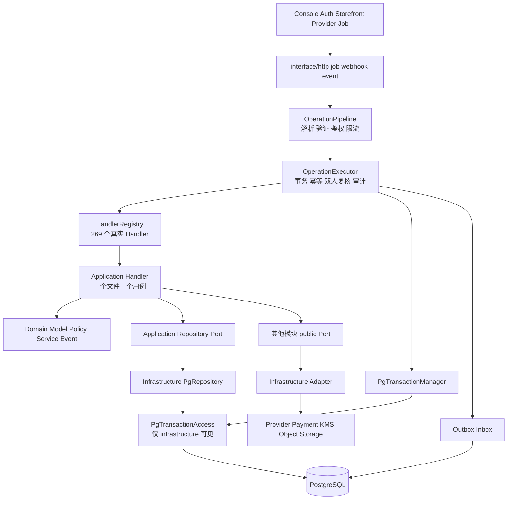
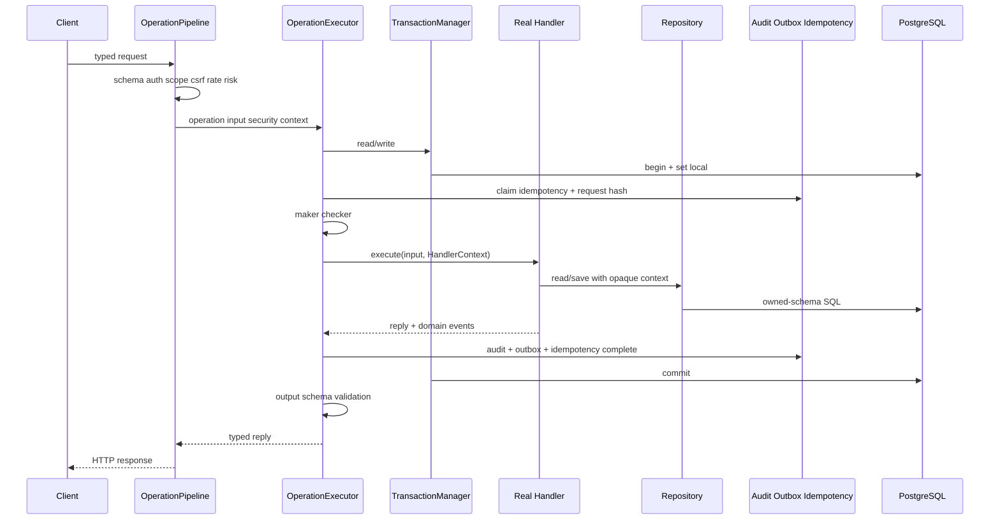
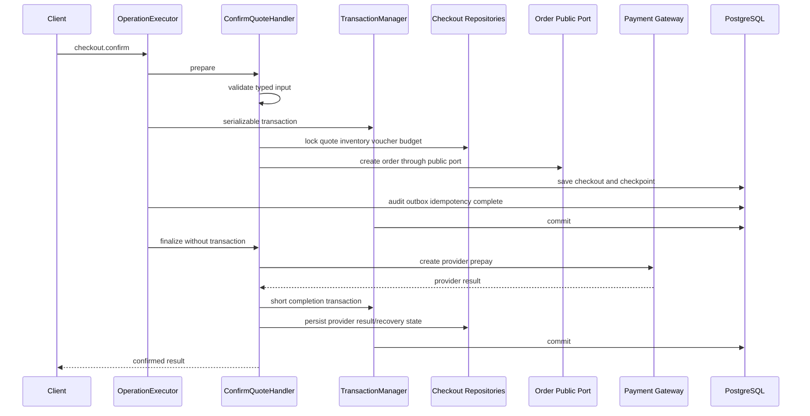
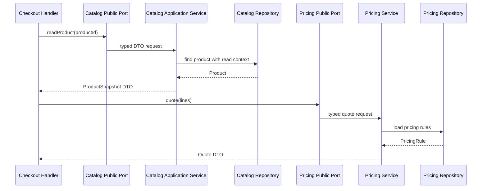

# 结论

严格按[《后端架构优化方案》](/Users/changshengwang/Workspace/zhudatuan/docs/architecture/后端架构优化方案.md:1)落地，这不是三个局部重构，而是一次完整的架构硬切换：

1. 将运行时从“`operations.yml → HandlerCatalog → 通用包装 Handler → ModuleOperations`”改成“`operations.yml → 真实单用例 Handler → 模块自有 Repository`”。
2. 将数据库能力从公共 `OperationDatabase.query()` 改成不透明 `ReadTransactionContext` / `WriteTransactionContext`。
3. 将 30 个现有业务目录加 foundation 中的 runtime、observability，统一为 32 个标准模块。
4. 模块根目录最终只能出现 `Module.ts`、`Manifest.ts`。
5. 269 个 Operation 必须对应 269 个真实 Handler 文件、269 个唯一 Handler 类、269 次唯一装配。
6. 删除所有兼容别名、聚合 Operations、运行时 HandlerCatalog、跨模块 Repository、公共 PG 实现和重复配置。
7. 22 项 MVP、18 项必上能力、4 项“忽略上线阻塞”、11 个 P1 Provider 必须保留完整追踪链。

本次仅完成只读分析，没有修改任何代码。当前工作区有大量既有未提交变更，实施时必须原样保护，不得把它们误当成可删除基线。

---

# 一、现状与理想方案之间的准确差距

当前工作树已经比架构文档冻结时的统计继续演进，因此“阶段 0”必须刷新审计数据，但不得改变文档定义的终态。

| 项目                                   |               当前工作树 |             理想终态 |
| -------------------------------------- | -----------------------: | -------------------: |
| `operations.yml` Operation             |                      269 |                  269 |
| Handler 目标文件                       |                      269 |                  269 |
| 真正符合终态的 Handler                 |                        0 |                  269 |
| 仅调用 `defineOperationHandler()` 的壳 |                      268 |                    0 |
| 有部分业务逻辑但仍是包装器的 Handler   | 1，`ConfirmQuoteHandler` |                    0 |
| 模块目录                               |                       30 |                   32 |
| 模块 Owner                             |                       32 |                   32 |
| 模块根生产 `.ts` 文件                  |                      125 |                   64 |
| 模块根非法生产文件                     |                       95 |                    0 |
| 错放测试                               |                       21 |                    0 |
| 模块范围 `*Operations.ts`              |       27 个、约 2,984 行 |                    0 |
| 全仓 `*Operations.ts`                  |       31 个、约 3,419 行 |                    0 |
| `OperationDatabase` 生产引用           |      约 218 文件、999 处 |                    0 |
| public 中 `OperationDatabase`          |          46 文件、225 处 |                    0 |
| public 中任意数据库/PG 泄漏            |                  61 文件 |                    0 |
| application 层 `.query()`              |          41 文件、178 处 |                    0 |
| Handler 单元测试                       |                        1 |               269 组 |
| Repository 集成测试                    |                        5 | 每个 Repository 均有 |
| 当前边界、事务、Operations、调用图检查 |             全部错误通过 |          fail-closed |

当前核心问题可以直接从以下代码看出：

- [ModuleOperations.ts](/Users/changshengwang/Workspace/zhudatuan/services/commerce/src/foundation/application/ModuleOperations.ts:18)同时承担数据库、事务、幂等、双人复核、审计、通用分派和结果组装，职责严重聚合。
- [DefinedModule.ts](/Users/changshengwang/Workspace/zhudatuan/services/commerce/src/bootstrap/DefinedModule.ts:20)根据生成目录动态创建包装 Handler，而不是由模块装配真实 Handler。
- [OperationHandler.ts](/Users/changshengwang/Workspace/zhudatuan/services/commerce/src/foundation/application/OperationHandler.ts:25)中的 `defineOperationHandler()`制造了“文件存在但用例不存在”的假象。
- [PgUnitOfWork.ts](/Users/changshengwang/Workspace/zhudatuan/services/commerce/src/adapter/database/PgUnitOfWork.ts:15)仍暴露底层 Transaction 语义。
- [transactions.mjs](/Users/changshengwang/Workspace/zhudatuan/scripts/check/transactions.mjs:37)只扫描 `*Operations.ts`；一旦删除这些文件，它会扫描零文件并错误通过。
- [boundary.mjs](/Users/changshengwang/Workspace/zhudatuan/scripts/audit/boundary.mjs:14)目前没有完整验证目录、真实 Handler、Repository 所有权、事务上下文逃逸和外部调用事务边界。

因此必须先修基础设施和审计，再迁移模块，不能先机械删除 `Operations.ts`。

---

# 二、最终系统架构



强制调用方向：

```text
interface
    ↓
application/handler
    ↓
application/port + application/service/process/model
    ↓
domain
    ↑
infrastructure 实现 application/public 端口

跨模块：
模块 A application → 模块 B public/index.ts → 模块 B application/service → 模块 B Repository

禁止：
模块 A → 模块 B application/domain/infrastructure
Handler → pg/Pool/query()
public → pg/Transaction/Repository 实现
Repository A → Repository B
Module.ts → SQL/业务分支/领域状态
```

模式对应关系：

- DDD：聚合、值对象、领域策略、领域事件、模块自有 Repository。
- Hexagonal Architecture：application/public 定义端口，infrastructure 提供适配器。
- SOLID：一个 Handler 一个用例；接口按消费者拆分；模块只依赖抽象。
- 迪米特法则：Handler 只认识自己的 Repository 和 public Port。
- Decorator：幂等、审计、双人复核、事务由 `OperationExecutor`统一包裹。
- Strategy/Registry：Provider、认证方式、支付通道、通知通道即插即用。
- Outbox/Inbox：可靠事件与 Webhook 去重。
- Process Manager：支付、退款、导入、批量发券等长流程。
- Specification/Policy：资格、风控、定价、审批规则。
- CAS/State Pattern：订单、退款、券、结算等状态迁移。
- Bulkhead/Circuit Breaker：API、Job、Provider 独立容量和故障隔离。

---

# 三、事务上下文的完整修改

这部分必须以方案的[不透明事务上下文设计](/Users/changshengwang/Workspace/zhudatuan/docs/architecture/后端架构优化方案.md:248)为唯一依据。

## 3.1 新增文件

```text
services/commerce/src/foundation/persistence/
├── TransactionContext.ts
└── TransactionManager.ts

services/commerce/src/foundation/application/
├── HandlerContext.ts
├── OperationExecutor.ts
├── IdempotencyRepository.ts
├── AuditAppender.ts
└── AuditDecorator.ts

services/commerce/src/adapter/database/
├── PgTransactionManager.ts
├── PgTransactionAccess.ts
├── PgTransactionState.ts
└── PgIdempotencyRepository.ts
```

### `TransactionContext.ts`

只导出不透明能力，不导出 `query()`、client、pool、executor：

```ts
declare const transactionBrand: unique symbol;

interface TransactionContext<M extends 'read' | 'write'> {
  readonly [transactionBrand]: M;
  readonly id: string;
  readonly mode: M;
  readonly tenantId: string;
  readonly membershipId: string;
  readonly scopeKind: ScopeKind;
  readonly scopeId: string;
  readonly actorId: string;
  readonly operationId: string;
  readonly traceId: string;
  readonly deadline: number;
  readonly signal: AbortSignal;
}

export type ReadTransactionContext = TransactionContext<'read'> | TransactionContext<'write'>;

export type WriteTransactionContext = TransactionContext<'write'>;
```

约束：

- brand 不能导出。
- 上下文不能被业务代码构造、clone、序列化或恢复。
- 不包含 HTTP Header、原始 Body、SQL、连接池、PG Client。
- `ReadTransactionContext`可接收写事务，支持写事务内读。
- `WriteTransactionContext`不能由读事务提升得到。

### `TransactionManager.ts`

```ts
export interface TransactionManager {
  read<T>(options: TransactionOptions, work: (context: ReadTransactionContext) => Promise<T>): Promise<T>;

  write<T>(options: TransactionOptions, work: (context: WriteTransactionContext) => Promise<T>): Promise<T>;
}
```

### `PgTransactionAccess.ts`

仅允许 `adapter/database` 和模块 `infrastructure/persistence` 导入。

它返回内部 `SqlExecutor`，但每次执行都必须验证：

- context 确实由当前 Manager 创建；
- `active.context === context`，不能只比较 ID；
- `active.open === true`；
- 当前 AsyncLocalStorage 范围仍然存活；
- 写 SQL 必须持有 `WriteTransactionContext`；
- deadline 未过期；
- signal 未取消；
- tenant、membership、scope、actor、operation 完全一致。

事务提交或回滚前后都将 `active.open = false`，防止捕获的 Repository、Executor 或 Context 在事务后继续使用。

## 3.2 PostgreSQL 语义

`PgTransactionManager`必须实现：

- 查询：`BEGIN READ ONLY`。
- 命令：`BEGIN ISOLATION LEVEL SERIALIZABLE`。
- `SET LOCAL`写入 tenant、membership、scope、actor、operation、trace。
- 仅对 `40001`、`40P01`重试。
- 最多 4 次，指数退避加有界随机抖动。
- 每次重试前重新检查 deadline 和 abort signal。
- 嵌套事务只允许 join，不允许创建隐式 savepoint。
- join 必须校验 tenant、membership、scope、actor、operation 一致。
- 禁止 read → write 提升。
- API Query、API Command、Job 使用既有容量配置中的独立池，不再复制连接数。
- release 前清空上下文，异常路径必须 rollback，rollback 异常不能覆盖原始业务异常。

## 3.3 Repository 签名

```ts
export interface OrderRepository {
  find(context: ReadTransactionContext, id: OrderId): Promise<Order | null>;

  save(context: WriteTransactionContext, order: Order, expectedVersion: number): Promise<void>;
}
```

Repository 实现才可调用：

```ts
const database = this.transactions.database(context);
await database.one(...);
```

禁止以下接口继续存在：

```ts
interface OperationDatabase {
  query(...): Promise<QueryResult>;
}
```

## 3.4 需要删除的旧事务抽象

迁移完成后直接删除：

- `foundation/persistence/UnitOfWork.ts`
- `adapter/database/PgUnitOfWork.ts`
- `foundation/application/TransactionRunner.ts`
- `foundation/application/OperationContext.ts`
- `foundation/application/OperationExecution.ts`
- `OperationDatabase`
- 旧 `Transaction`
- 所有兼容 re-export 和类型别名

同时修改：

- `foundation/messaging/Outbox.ts`
- `foundation/messaging/Inbox.ts`
- `adapter/database/PgOutbox.ts`
- `adapter/database/PgInbox.ts`
- `foundation/infrastructure/DatabaseContext.ts`
- `adapter/database/PgContext.ts`
- `foundation/infrastructure/DeadletterStore.ts`
- `foundation/application/AuditSink.ts`
- `foundation/application/OperationAudit.ts`
- `foundation/security/MakerCheckerPolicy.ts`

Outbox、Inbox、审计、幂等、Deadletter 都改为接收 `WriteTransactionContext`，不得接收原始 PG Transaction。

---

# 四、Operation 执行链修改

## 4.1 `OperationHandler.ts`

删除 `defineOperationHandler()`，改成真实接口：

```ts
export interface OperationHandler<I, O> {
  readonly operation: OperationId;
  readonly mode: 'read' | 'write';

  execute(input: I, context: HandlerContext): Promise<O>;
}
```

Durable 用例单独定义：

```ts
export interface DurableOperationHandler<I, P, C, O> {
  readonly operation: OperationId;

  prepare(input: I, context: PrepareContext): Promise<P>;

  commit(prepared: P, context: CommitContext): Promise<C>;

  finalize(committed: C, context: FinalizeContext): Promise<O>;
}
```

`FinalizeContext`不能包含：

- TransactionContext；
- Repository；
- PgTransactionAccess；
- Container；
- 数据库闭包。

## 4.2 `OperationExecutor.ts`

统一执行顺序：



关键边界：

- Pipeline 负责传输无关的输入验证、安全上下文和限流策略。
- Executor 负责事务、幂等、审计、双人复核和领域事件。
- Handler 负责一个业务用例。
- Handler 不得直接写审计、幂等、Outbox 表。
- Handler 不返回 HTTP Response。
- Repository 不调用外部服务。
- 外部 Gateway 不接收 TransactionContext。

高风险 GET 若要求审计 fail-closed，应作为写事务执行，使业务读取与审计记录保持同一原子提交；普通低风险 GET 仍使用 read-only 事务。

## 4.3 Durable 外部调用

以 `ConfirmQuote` 为例：



外部调用失败时不能回滚已经提交的订单，而应依靠 checkpoint、恢复任务和幂等 Provider Request 继续推进。

---

# 五、模块装配修改

## 5.1 标准目录

依据方案的[模块目录规则](/Users/changshengwang/Workspace/zhudatuan/docs/architecture/后端架构优化方案.md:508)，每个模块只能采用：

```text
modules/<module>/
├── Module.ts
├── Manifest.ts
├── application/
│   ├── handler/
│   ├── port/
│   ├── service/
│   ├── process/
│   └── model/
├── domain/
│   ├── model/
│   ├── value/
│   ├── policy/
│   ├── service/
│   ├── event/
│   └── error/
├── infrastructure/
│   ├── persistence/
│   ├── adapter/
│   ├── integration/
│   ├── cache/
│   ├── messaging/
│   ├── registry/
│   └── security/
├── interface/
│   ├── http/
│   ├── job/
│   ├── event/
│   └── webhook/
├── public/
│   ├── index.ts
│   ├── *Port.ts
│   └── *DTO.ts
└── test/
```

禁止新增：

- `application/command`
- `application/query`
- `domain/repository`
- `interface/handler`
- `infrastructure/signing`
- `infrastructure/catalog`
- 根目录 `Port.ts`
- 根目录 `Jobs.ts`
- 根目录 `Support.ts`
- 根目录 `Composition.ts`
- 根目录测试

## 5.2 `Module.ts`

每个 `Module.ts`只做：

- 读取依赖模块 public Port；
- 构造本模块 Repository；
- 构造本模块 service/process；
- 逐个 `new XxxHandler(...)`；
- 注册 Handler；
- 发布 public Port；
- 注册本模块 Job/Event/Webhook；
- 返回模块装配结果。

禁止：

- SQL；
- if/switch 业务决策；
- 聚合状态修改；
- HTTP 解析；
- 动态扫描 Operations；
- Container 全局查找；
- 生成 Handler；
- 初始化演示或兼容实现。

## 5.3 Bootstrap 文件

修改：

- `bootstrap/DefinedModule.ts`：删除 Operations 扫描和 HandlerCatalog 绑定。
- `bootstrap/ModuleRegistry.ts`：按 Manifest 拓扑排序，装配 `{handlers, ports, jobs, events}`。
- `foundation/application/HandlerRegistry.ts`：`add(owner, handler)`，从 Handler 本身推断 Operation；冻结时与 OperationCatalog 做 269 对 269 校验。
- `bootstrap/ApiBootstrap.ts`：模块装配完成后构造 `OperationExecutor`，注入 Pipeline。
- `bootstrap/JobsBootstrap.ts`：不再调用全局 `registerJobs()`。
- `bootstrap/CommerceRuntime.ts`：只装配平台基础设施，不再直接构造模块内部对象。
- `app/modules.ts`：只导入 32 个模块的 `Module.ts`。

删除：

- `app/jobs.ts`
- `app/providers.ts`
- `generated/HandlerCatalog.ts`
- 所有 `XxxModule.ts`兼容入口

`app/JobCatalog.ts`保留唯一 Job 运行参数来源，但移动到中性位置，例如 `foundation/application/JobCatalog.ts`；模块从该唯一目录选取自己的 Job，不能复制 cron、并发数、超时和重试配置。

---

# 六、所有 `*Operations.ts` 的处理

不是重命名，而是逐分支抽取到 Handler、Repository、Service、Policy 后删除。

## 6.1 Foundation 范围

| 当前文件                                              | 终态                                            |
| ----------------------------------------------------- | ----------------------------------------------- |
| `foundation/application/ModuleOperations.ts`          | 删除；事务、幂等、审计进入 `OperationExecutor`  |
| `foundation/application/ImportOperations.ts`          | 拆为 `ImportObjectService.ts`及模块导入 Handler |
| `foundation/application/runtime/RuntimeOperations.ts` | 拆入 runtime 4 个 Handler                       |
| `foundation/telemetry/ClientErrorOperations.ts`       | 拆入 observability 2 个 Handler                 |

## 6.2 模块范围

全部删除：

```text
access/AccessOperations.ts
benefit/BenefitOperations.ts
capability/CapabilityOperations.ts
cart/CartOperations.ts
catalog/CatalogOperations.ts
catalog/application/CatalogImportOperations.ts
checkout/CheckoutOperations.ts
experience/ExperienceOperations.ts
finance/FinanceLifecycleOperations.ts
fulfillment/FulfillmentOperations.ts
identity/IdentityOperations.ts
inventory/InventoryOperations.ts
inventory/application/InventoryImportOperations.ts
marketing/MarketingOperations.ts
member/MemberOperations.ts
member/application/MemberImportOperations.ts
navigation/application/NavigationOperations.ts
order/OrderOperations.ts
organization/OrganizationOperations.ts
partner/PartnerOperations.ts
payment/PaymentOperations.ts
pricing/PricingOperations.ts
qualification/QualificationOperations.ts
verification/VerificationOperations.ts
voucher/VoucherCatalogOperations.ts
voucher/VoucherOperations.ts
voucher/application/VoucherImportOperations.ts
```

删除条件必须同时满足：

1. 每个 switch/if 分支已有唯一 Handler；
2. SQL 已进入模块自有 Repository；
3. 公共能力已进入 public Port；
4. 领域规则已进入 Policy/Domain Service；
5. Job 路径已进入 `interface/job`；
6. 对应 Handler 和 Repository 测试已通过；
7. `operations.yml`只指向真实 Handler；
8. 审计脚本确认没有残留调用者。

---

# 七、32 个模块的完整终态

以下 Handler 数严格由[operations.yml](/Users/changshengwang/Workspace/zhudatuan/packages/contract/definitions/operations.yml:121)重新计算，总计 269。

| 模块          | Handler | 模块自有 Repository                                                                                                                                                                | 内部数据流                                                                        |
| ------------- | ------: | ---------------------------------------------------------------------------------------------------------------------------------------------------------------------------------- | --------------------------------------------------------------------------------- |
| runtime       |       4 | `HealthDependencyRepository`                                                                                                                                                       | health Handler → dependency reader → readiness state                              |
| observability |       2 | `ClientErrorRepository`                                                                                                                                                            | client error Handler → redact/rate/sample → repository                            |
| audit         |       1 | `AuditRepository`                                                                                                                                                                  | records read → audit query policy → audit repository                              |
| access        |       5 | `AccessRepository`、`AuthorizationRepository`、`GovernanceRepository`、`MembershipRepository`                                                                                      | Handler → authorization/governance policy → repository                            |
| organization  |       6 | `OrganizationRepository`、`DirectoryRepository`、`SyncRunRepository`                                                                                                               | directory Handler → organization aggregate/sync process → repository              |
| capability    |       2 | `CapabilityRepository`、`AssignmentRepository`                                                                                                                                     | assignment Handler → capability policy → repository                               |
| partner       |       4 | `PartnerRepository`、`StoreRepository`                                                                                                                                             | partner/store Handler → aggregate → repository                                    |
| identity      |      33 | `CredentialRepository`、`SessionRepository`、`InvitationRepository`、`FederationRepository`、`ProviderRepository`、`LinkRepository`、`EnrollmentRepository`、`AssuranceRepository` | identity Handler → authentication/federation policy → repository/provider adapter |
| member        |       8 | `MemberRepository`、`AddressRepository`、`FavoriteRepository`、`ImportRepository`                                                                                                  | member Handler → member aggregate → repository                                    |
| notification  |       9 | `NotificationRepository`、`PreferenceRepository`、`TemplateRepository`、`EndpointRepository`、`AttemptRepository`                                                                  | Handler → template/preference policy → repository/outbox                          |
| catalog       |      14 | `PoolRepository`、`ProductRepository`、`ListingRepository`、`ImportRepository`、`SourceMappingRepository`                                                                          | Handler → catalog aggregate → repository                                          |
| experience    |       8 | `ApplicationRepository`、`VersionRepository`、`ReleaseRepository`、`PublicationRepository`                                                                                         | Handler → application/version aggregate → repository                              |
| channel       |      18 | `ConnectionRepository`、`DistributorRepository`、`SyncRunRepository`、`ProviderOperationRepository`                                                                                | Handler → provider registry → repository/provider adapter                         |
| referral      |      15 | `ReferralRepository`、`CommissionRepository`、`WithdrawalRepository`                                                                                                               | Handler → referral/commission policy → repository/finance public port             |
| navigation    |       5 | `NavigationProjectionRepository`、`NavigationCacheRepository`                                                                                                                      | Handler → projection service → repository/cache                                   |
| pricing       |       2 | `PricingRuleRepository`、`QuoteRepository`                                                                                                                                         | Handler → pricing policy → repository                                             |
| inventory     |       2 | `StockRepository`、`ReservationRepository`、`MovementRepository`、`ImportRepository`                                                                                               | import Handler → stock service → repository                                       |
| marketing     |       1 | `CampaignRepository`、`BudgetRepository`、`ReservationRepository`                                                                                                                  | campaign read → campaign projection repository                                    |
| qualification |       3 | `PolicyRepository`、`ProfileRepository`、`DecisionRepository`                                                                                                                      | Handler → qualification policy → repository                                       |
| reporting     |      10 | `FactRepository`、`ProjectionRepository`、`WatermarkRepository`、`ExportRepository`                                                                                                | Handler → projection/query service → reporting schema                             |
| risk          |       3 | `PolicyRepository`、`CaseRepository`、`DecisionRepository`                                                                                                                         | Handler → risk policy → repository                                                |
| extension     |       1 | `ExtensionRepository`                                                                                                                                                              | installations read → extension registry/repository                                |
| cart          |       3 | `CartRepository`                                                                                                                                                                   | Handler → cart aggregate → CAS repository                                         |
| checkout      |       3 | `CheckoutRepository`、`QuoteRepository`、`EvidenceRepository`                                                                                                                      | Handler → checkout policy → catalog/pricing/inventory public ports → repository   |
| order         |       8 | `OrderRepository`、`AfterSaleRepository`、`ReminderRepository`、`ExportRepository`                                                                                                 | Handler → order/after-sale aggregate → repository                                 |
| fulfillment   |       4 | `FulfillmentRepository`、`ReturnRepository`、`TrackingRepository`                                                                                                                  | Handler → fulfillment/return aggregate → repository                               |
| payment       |       5 | `PaymentRepository`、`RefundRepository`、`RecoveryRepository`、`WebhookInboxRepository`                                                                                            | Handler → payment state machine → repository/outbox/provider                      |
| verification  |       6 | `ChallengeRepository`、`SessionRepository`、`DeviceRepository`、`AttemptRepository`                                                                                                | Handler → challenge/session policy → repository                                   |
| voucher       |      19 | `CardLibraryRepository`、`ProgramRepository`、`ReserveRepository`、`VoucherRepository`、`BatchRepository`、`ImportRepository`                                                      | Handler → voucher aggregate/allocation policy → repository                        |
| benefit       |      12 | `AccountRepository`、`PlanRepository`、`BudgetRepository`、`GrantRepository`、`LotRepository`、`LedgerRepository`                                                                  | Handler → grant/budget policy → append-only ledger                                |
| finance       |      35 | `AccountRepository`、`JournalRepository`、`StatementRepository`、`SettlementRepository`、`PolicyRepository`、`RepairRepository`、`InvoiceRepository`                               | Handler → accounting/settlement policy → journal repository                       |
| support       |      18 | `CaseRepository`、`MessageRepository`、`AssignmentRepository`、`AgentRepository`、`RuleRepository`、`SlaRepository`                                                                | Handler → case/SLA policy → repository                                            |

Handler 数按迁移波次闭合：

- 波次 1：29。
- 波次 2：17。
- 波次 3：50。
- 波次 4：60。
- 波次 5：90。
- 波次 6：23。
- 总数：269。

## 7.1 Handler 命名修正

Operation ID 不改，只规范文件名和类名：

| 当前                  | 终态                  |
| --------------------- | --------------------- |
| `Clienterrors*`       | `ClientErrors*`       |
| `Syncruns*`           | `SyncRuns*`           |
| `Stepup*`             | `StepUp*`             |
| `Aftersales*`         | `AfterSales*`         |
| `Cardlibraries*`      | `CardLibraries*`      |
| `Statusbatches*`      | `StatusBatches*`      |
| `DirectorySyncruns*`  | `DirectorySyncRuns*`  |
| `Directoryevents*`    | `DirectoryEvents*`    |
| `Powderclass*`        | `PowderClass*`        |
| `Voucherconsumption*` | `VoucherConsumption*` |
| `RequestsRedHandler`  | `RedInvoiceHandler`   |
| `Slas*`               | `Sla*`                |

必须同步更新 `operations.yml.handler`，不得保留旧文件转发。

---

# 八、模块根目录文件搬迁

## 8.1 通用规则

- `XxxModule.ts` → `Module.ts`。
- `XxxPort.ts` → `public/*Port.ts`或 `application/port/*Port.ts`。
- `XxxJobs.ts` → `interface/job/*Job.ts`。
- Job 编排 → `application/process`。
- `XxxOperationSupport.ts`不得保留，按职责拆进 Repository、Policy、Service。
- `XxxComposition.ts`内容吸收到 `Module.ts`。
- 根目录测试 → `test/`或相邻被测文件。
- 全局架构测试 → `services/commerce/test/architecture`。

## 8.2 特殊文件

- `IdentitySubject.ts` → `domain/value/IdentitySubject.ts`
- `Checkout/AddressPort.ts`：删除，改用 Member public Port。
- `Risk/CheckoutRisk.ts` → `application/service/CheckoutRiskService.ts`
- `Payment/CheckoutPayment.ts` → `application/service/CheckoutPaymentService.ts`
- `Payment/PaymentComposition.ts` → 并入 `Module.ts`
- `Navigation/infrastructure/catalog` → `infrastructure/registry`
- `Checkout/infrastructure/signing` → `infrastructure/security`
- `Finance/domain/repository` → `application/port`
- `Referral/domain/repository` → `application/port`
- `Identity/interface/handler`、`Navigation/interface/handler` → `application/handler`
- `application/command`、`application/query`中的单用例逻辑并入对应 Handler；复用逻辑才能进入 service。

Benefit、Payment、Voucher 当前根目录中 Job、Deadletter、Support、Lifecycle 文件最多，应优先拆成：

```text
interface/job/
application/process/
application/service/
infrastructure/messaging/
infrastructure/persistence/
```

不能用新的 `Helper`、`Support`、`Common`文件再次聚合。

---

# 九、公共 Port 的 61 个数据库泄漏点

这些 public 文件必须全部改成“Token + 接口 + 不可变 DTO”，实现移入提供方模块内部。

| 模块          | 需处理的 public 文件                                                                                                                                                             |
| ------------- | -------------------------------------------------------------------------------------------------------------------------------------------------------------------------------- |
| access        | `AuthorizationPort`、`InvitationAccessPort`、`NavigationAccessPort`、`MemberAccessPort`、`MembershipReadPort`、`MemberImportAccessPort`、`IdentityAccessPort`、`ActionProofPort` |
| benefit       | `BenefitReadPort`、`SupportBenefitPort`                                                                                                                                          |
| capability    | `index`、`NavigationCapabilityPort`                                                                                                                                              |
| cart          | `CartWritePort`、`CartReadPort`                                                                                                                                                  |
| catalog       | `ReferralCatalogPort`、`MemberCatalogPort`、`index`、`CheckoutCatalogPort`、`CatalogReadPort`、`CartCatalogPort`、`ExperienceCatalogPort`                                        |
| channel       | `index`、`FinanceChannelPort`                                                                                                                                                    |
| checkout      | `CheckoutReadPort`、`CheckoutWritePort`                                                                                                                                          |
| experience    | `CheckoutExperiencePort`、`ExperienceReadPort`、`CartExperiencePort`                                                                                                             |
| finance       | `index`、`ReferralFinancePort`                                                                                                                                                   |
| fulfillment   | `index`、`InventoryReturnPort`                                                                                                                                                   |
| identity      | `IdentityPrincipalPort`、`NotificationIdentityPort`、`PaymentIdentityPort`、`IdentityRetentionPort`、`NavigationIdentityPort`                                                    |
| inventory     | `index`、`InventoryReadPort`                                                                                                                                                     |
| marketing     | `index`                                                                                                                                                                          |
| member        | `IdentityMemberPort`、`InvitationMemberPort`、`ReferralMemberPort`、`BenefitMemberPort`、`MemberReadPort`                                                                        |
| order         | `OrderReadPort`、`index`、`OrderReceiptPort`                                                                                                                                     |
| organization  | `index`、`AccessOrganizationPort`、`OrganizationReadPort`、`IdentityOrganizationPort`、`NavigationOrganizationPort`                                                              |
| partner       | `AccessPartnerPort`、`CatalogPartnerPort`                                                                                                                                        |
| payment       | `index`                                                                                                                                                                          |
| pricing       | `index`、`PricingReadPort`                                                                                                                                                       |
| qualification | `AfterSalePolicyPort`、`CheckoutQualificationPort`                                                                                                                               |
| risk          | `CheckoutRiskPort`                                                                                                                                                               |

每个 public Port 修改要求：

- 不导入 `pg`、Pool、Transaction、OperationDatabase。
- 不定义 `PgXxx`实现。
- 不返回 `QueryResult`、Row、`rowCount`。
- 不暴露数据表字段名。
- DTO 字段使用 camelCase。
- 输入输出只包含业务语义。
- `index.ts`只做显式 export。
- 提供方 public Port 的实现位于提供方 `application/service`。
- 该 service 只访问提供方自己的 Repository。
- 消费模块无法绕过 Port 获取 Repository。

跨模块调用时序：



---

# 十、生成器、配置与单一事实来源

## 10.1 Contract Generator

修改 [ContractGenerator.ts](/Users/changshengwang/Workspace/zhudatuan/tools/contractgen/src/ContractGenerator.ts:96)：

- 删除 HandlerCatalog 生成步骤。
- 删除 HandlerCatalog 模板函数。
- 不再生成运行时 Handler 映射。
- 继续生成 Operation Catalog、Schema、SDK、Controller 契约。
- 增加静态验证：269 个 Operation 都必须有合法 Handler 路径。
- 增加路径、Owner、类名规范校验。
- 增加 Handler 文件存在和 operation literal 匹配校验。

修改 `config/artifacts.json`：

- 删除 `services/commerce/src/generated/HandlerCatalog.ts`。
- 不保留忽略项或兼容生成物。

## 10.2 配置只能有一个来源

| 数据                               | 唯一来源                                       |
| ---------------------------------- | ---------------------------------------------- |
| Operation ID、Owner、Handler、路由 | `packages/contract/definitions/operations.yml` |
| Schema Owner                       | `database/contracts/objects.yml`               |
| 模块依赖                           | 各模块 `Manifest.ts`                           |
| 命名规则                           | `config/naming.yml`                            |
| Provider 清单                      | 工作簿生成的 Provider 配置                     |
| Job 容量、超时、并发、重试         | 现有 Job/容量配置                              |
| 性能阈值                           | `config/capacity.yml`与 telemetry 配置         |
| 需求权威哈希                       | `config/authorities.yml`                       |

必须修改：

- `scripts/check/ownership.mjs`：删除硬编码 Schema Owner 和 shared 例外，读取 `objects.yml`。
- `scripts/audit/naming.mjs`：读取 `config/naming.yml`。
- `objects.yml`：把 `invoice → finance`、`ordering → order`的 operational owner 归一化到权威文件，不能再建映射表。
- `RequirementTrace.ts`：删除基于中文正则“猜模块”和“选第一个 GET/POST”的逻辑。当前实现可见于[RequirementTrace.ts](/Users/changshengwang/Workspace/zhudatuan/tools/requirementgen/src/RequirementTrace.ts:1)。
- 需求生成应依据显式配置，不得用启发式推断生产追踪关系。

---

# 十一、边界脚本的完整改造

方案的[边界诊断表](/Users/changshengwang/Workspace/zhudatuan/docs/architecture/后端架构优化方案.md:1268)实际枚举了 **25 个**诊断码，而不是正文口径中的 24 个。实施时应修正文档数字为 25，不能为了维持“24”而漏掉任何一项。

必须支持：

1. `MODULE_ROOT_FILE_FORBIDDEN`
2. `MODULE_ROOT_TEST_FORBIDDEN`
3. `MODULE_ASSEMBLY_MISSING`
4. `MODULE_LAYER_UNKNOWN`
5. `MODULE_COMPOSITION_LOGIC_FORBIDDEN`
6. `MANIFEST_SIDE_EFFECT_FORBIDDEN`
7. `OPERATIONS_AGGREGATOR_FORBIDDEN`
8. `HANDLER_PATH_INVALID`
9. `HANDLER_CARDINALITY_INVALID`
10. `HANDLER_OPERATION_MISMATCH`
11. `HANDLER_STUB_FORBIDDEN`
12. `HANDLER_SQL_FORBIDDEN`
13. `PUBLIC_DATABASE_TYPE_FORBIDDEN`
14. `PUBLIC_IMPLEMENTATION_FORBIDDEN`
15. `PUBLIC_RESULT_ROW_FORBIDDEN`
16. `REPOSITORY_PATH_INVALID`
17. `REPOSITORY_OWNER_INVALID`
18. `CROSS_SCHEMA_SQL_FORBIDDEN`
19. `CROSS_MODULE_INTERNAL_IMPORT`
20. `TRANSACTION_CONTEXT_ESCAPE`
21. `RAW_TRANSACTION_IMPORT_FORBIDDEN`
22. `EXTERNAL_CALL_IN_TRANSACTION`
23. `UNRESOLVED_IMPORT`
24. `MODULE_SYMLINK_ESCAPE`
25. `PRODUCTION_NAME_INVALID`

实现原则：

- 使用 TypeScript AST，不再依赖正则。
- 无法解析 import 必须失败，不能忽略。
- 使用 realpath 检测软链接逃逸。
- 一个 Handler 文件必须恰好导出一个 Handler 类。
- Handler 的 literal Operation ID 必须匹配 `operations.yml`。
- Handler 必须在 `Module.ts`中且只被实例化一次。
- 禁止 `defineOperationHandler`、`.query()`、SQL literal、Container lookup。
- Repository 接口只能位于 `application/port`。
- Pg Repository 只能位于 `infrastructure/persistence`。
- SQL Schema 必须属于当前模块。
- Context 不得进入对象属性、缓存、Job Payload、返回值、异步闭包或序列化函数。
- Durable `finalize()`不得调用 Repository。
- 外部 Port 识别应基于类型和 import graph，不可只靠方法名猜测。
- 每个诊断码必须有正例和反例 fixture。
- 严格门禁只能在对应迁移波次完成后接入 quality，但最终不得保留 baseline allowlist。

---

# 十二、MVP 功能一致性

工作簿权威范围为：  
:codex-file-citation{path="/Users/changshengwang/Workspace/zhudatuan/docs/福利商城功能清单.xlsx" purpose="source" artifact_kind="workbook" sheet="MVP上线功能清单" range="A1:F24"}

共 22 项 MVP，18 项必上，4 项“忽略上线阻塞但不可删除”。

| MVP                 | 上线约束             | 主要后端模块                                                                         |
| ------------------- | -------------------- | ------------------------------------------------------------------------------------ |
| MVPPLATFORM         | 非阻塞项，功能仍保留 | organization、catalog、voucher、runtime                                              |
| MVPDISTRIBUTION     | 非阻塞项，功能仍保留 | organization、channel、capability、partner、referral                                 |
| MVPGROUPDASHBOARD   | 必上                 | reporting                                                                            |
| MVPGROUPAPPLICATION | 必上                 | experience                                                                           |
| MVPGROUPPOOL        | 必上                 | catalog、pricing、inventory、channel                                                 |
| MVPGROUPORDER       | 必上                 | checkout、order、fulfillment、payment                                                |
| MVPGROUPVOUCHER     | 必上                 | voucher、verification、benefit                                                       |
| MVPGROUPFINANCE     | 非阻塞项，功能仍保留 | finance                                                                              |
| MVPGROUPREPORT      | 必上                 | reporting                                                                            |
| MVPGROUPSUPPORT     | 必上                 | support                                                                              |
| MVPGROUPSETTING     | 必上                 | organization、access、member、partner、qualification、notification、risk、capability |
| MVPMALLDASHBOARD    | 必上                 | reporting                                                                            |
| MVPMALLDESIGN       | 必上                 | experience                                                                           |
| MVPMALLPOOL         | 必上                 | catalog、pricing、inventory、channel                                                 |
| MVPMALLORDER        | 必上                 | checkout、order、fulfillment、payment                                                |
| MVPMALLVOUCHER      | 必上                 | voucher、verification、benefit                                                       |
| MVPMALLFINANCE      | 非阻塞项，功能仍保留 | finance                                                                              |
| MVPMALLREPORT       | 必上                 | reporting                                                                            |
| MVPMALLSUPPORT      | 必上                 | support                                                                              |
| MVPMALLSETTING      | 必上                 | organization、access、member、partner、qualification、notification、risk、capability |
| MVPIDENTITY         | 必上                 | identity、member、organization、access、notification、risk                           |
| MVPPROVIDER         | 必上                 | channel、extension                                                                   |

“忽略”只能解释为不阻塞上线，不能解释为删除代码、Operation、路由或数据对象。

仍需产品签字的四个术语不能由开发自行推断：

- 分销定义；
- 卡券客户/产品档案维度；
- 集团风控设置；
- “粉类”的业务含义。

当前需求审计预期它们分别挂在：

- `MVPGROUPSETTING`
- `MVPGROUPVOUCHER`
- `MVPMALLREPORT`
- `MVPMALLVOUCHER`

需求追踪链应从当前：

```text
WorkbookCell → Requirement → Route → Operation → Schema
→ Permission → Capability → Scope → Handler → Owner
→ Table → Test → Runbook → SignedEvidence
```

增强为：

```text
WorkbookCell
→ Requirement
→ Route
→ Operation
→ RequestSchema/ResponseSchema/ErrorUnion
→ Permission/Capability/Scope/Risk/Idempotency
→ Real Handler
→ Repository Port
→ PgRepository
→ Owned Schema/Object/Projection
→ Unit Test
→ Integration Test
→ Journey
→ Runbook
→ Release Evidence
```

当前[requirements.mjs](/Users/changshengwang/Workspace/zhudatuan/scripts/audit/requirements.mjs:1)只验证字段存在，必须增加真实路径、类、Repository、Schema Owner 和测试文件存在性校验。

---

# 十三、11 个 Provider 的处理

Provider 权威范围：  
:codex-file-citation{path="/Users/changshengwang/Workspace/zhudatuan/docs/福利商城功能清单.xlsx" purpose="source" artifact_kind="workbook" sheet="接口" range="A1:K12"}

P1 Provider 恰好 11 个：

1. `jdproduct`
2. `jdfresh`
3. `tmall`
4. `supplier`
5. `cake`
6. `flower`
7. `book`
8. `charge`
9. `foodvoucher`
10. `movie`
11. `meal`

它们继续位于：

```text
extensions/channel/<provider>
```

不要为每个 Provider 创建业务模块。正确方式是：

- Channel 模块定义 Provider SPI。
- Extension 模块维护安装与启停。
- 每个扩展提供 Adapter、Manifest、配置 Schema。
- Module Registry/Provider Registry 负责发现和装配。
- Secret 只通过 Secret Port 获取。
- Provider 接收平台 DTO，不接收 TransactionContext。
- Webhook 先验签，再写 Inbox 唯一键。
- Provider Operation 使用自身幂等键、超时、熔断和重试策略。
- Extension 关闭后不能残留路由、Job、Webhook 或缓存注册。
- `config/providers.yml`继续由权威清单生成，不能手工复制。

---

# 十四、安全、一致性、性能和高可用修改点

## 安全

- 所有 SQL 继续依赖 RLS，并由 TransactionManager 设置完整本地上下文。
- 写操作强制 request hash 幂等，防止相同 key 不同请求复用。
- 高风险操作保留 MFA、step-up、maker-checker。
- 审计必须 fail-closed。
- Webhook 使用原始报文验签、时间窗、nonce、Inbox 唯一键。
- public DTO 禁止携带 secret、SQL row、内部枚举或数据库主键实现细节。
- 日志统一脱敏，不记录 token、验证码、卡密、Provider secret。
- Context 不能进入队列和缓存。
- Repository SQL 使用参数绑定；动态标识符只能来自有界枚举。

## 数据一致性

- 下单主流程的 checkout、库存、营销预算、券、福利金、订单、支付意图在同一 PostgreSQL Serializable 事务内。
- 外部支付调用放到提交后 Durable finalize。
- Finance Journal/Entry 只追加。
- 唯一键使用 `ownerEventId + economicLegId`。
- 写模型使用 expectedVersion/CAS。
- 列表使用稳定 keyset pagination。
- Outbox 与领域数据同事务写入。
- Consumer 用 Inbox 实现至少一次投递下的业务幂等。
- 批量任务分片，单批事务有明确上限。
- 固定锁顺序：scope → budget → inventory → voucher → benefit → order/payment。
- 禁止 Repository 内部开启事务。

## 性能和高可用

复用现有容量与 telemetry 配置，不新增重复数字：

- 目标读取吞吐 5,000 QPS。
- 命令 300 TPS。
- Provider callback 600 TPS。
- API、Job、Webhook、Provider 独立池和 Bulkhead。
- 只读查询走 read-only transaction。
- Projection、Navigation、Catalog 等读模型允许缓存。
- 缓存 key 必须包含 tenant/scope/version。
- 写路径禁止缓存充当事实来源。
- Provider 使用有界并发、连接复用、熔断、超时和指数退避。
- 批量导入使用流式解析和 chunk，不一次性加载。
- 报表从 reporting projection 查询，不能跨模块实时 join。
- 每个 Handler 记录 latency、retry、lock wait、row count、outbox lag、provider latency。
- readiness 必须检查数据库、迁移头、必要 Provider 和 Job 调度状态。

---

# 十五、测试修改点

## 15.1 每个 Handler 的单元测试

269 个 Handler 至少覆盖：

- 成功；
- 输入验证失败；
- 认证失败；
- 权限/Capability/Scope 失败；
- 资源不存在；
- expectedVersion 冲突；
- 幂等重放；
- 相同幂等键不同 request hash；
- deadline/abort；
- Repository 失败；
- public Port 失败；
- 领域事件；
- 输出 Schema；
- maker-checker；
- 高风险审计失败；
- Durable finalize/recovery。

单测只使用 Fake Repository 和 Fake Port，不连接 PostgreSQL。

## 15.2 每个 PgRepository 的集成测试

必须覆盖：

- 参数化 SQL；
- RLS tenant/scope 隔离；
- Schema Owner；
- CAS；
- 唯一键；
- 锁顺序；
- keyset pagination；
- 空结果；
- 批量上限；
- rollback；
- serialization/deadlock retry；
- deadline；
- read context 执行 write 被拒绝；
- context commit 后继续使用被拒绝；
- 伪造 context 被拒绝；
- 跨模块 Schema SQL 被门禁拒绝。

## 15.3 架构测试

必须精确断言：

- 32 个模块；
- 64 个模块根生产文件；
- 269 个 Operation；
- 269 个真实 Handler；
- 269 个唯一 Handler 类；
- 269 个唯一装配；
- 0 个 `*Operations.ts`；
- 0 个 Handler stub；
- 0 个非法 Handler 路径；
- 0 个模块根额外文件；
- 0 个 public 数据库泄漏；
- 0 个 application `.query()`；
- 0 个跨模块内部 import；
- 0 个跨模块 Repository；
- 0 个跨 Schema SQL；
- 0 个 TransactionContext 逃逸；
- 0 个事务内外部调用；
- 0 个未解析 import；
- 0 个命名违规；
- 0 个软链接逃逸。

## 15.4 Journey

保留并完成 22 项 MVP Journey，以及 11 个 Provider 的独立契约清单。每条 Journey 必须落到真实 Handler 和 Repository，而不能仅验证路由返回 2xx。

---

# 十六、推荐实施顺序

严格采用方案的[迁移顺序](/Users/changshengwang/Workspace/zhudatuan/docs/architecture/后端架构优化方案.md:1455)。

## 阶段 0：冻结并刷新事实

- 锁定 workbook SHA、operations SHA、migration head。
- 将当前 95 个根目录非法文件、31 个 Operations、61 个 public 泄漏、269 个 Handler 路径写入临时迁移报告。
- 修正文档中已经漂移的统计。
- 修正“24 个诊断码”为实际 25 个。
- 不创建 baseline allowlist。

## 阶段 1：基础执行模型

- 新增 TransactionContext、TransactionManager、PgTransactionManager、PgTransactionAccess。
- 新增 OperationExecutor。
- 修改 HandlerRegistry、Pipeline、ApiBootstrap。
- 先建立新能力，不立即删除旧实现。

## 阶段 2：审计脚本

- AST 化 boundary、transaction、operations、ownership、naming。
- 新门禁先运行但暂不接入阻塞 quality。
- 为 25 个诊断码补 fixture。
- 确认脚本能发现当前全部问题。

## 阶段 3：六个模块波次

1. runtime、observability、audit、marketing、pricing、inventory、qualification、risk、reporting、extension：29。
2. organization、capability、partner、access：17。
3. member、identity、notification：50。
4. catalog、experience、channel、referral、navigation：60。
5. voucher、benefit、finance、verification、support：90。
6. cart、order、fulfillment、payment、checkout：23。

每个波次必须完成：

- 真 Handler；
- 自有 Repository；
- public Port；
- Module.ts；
- 单测；
- Repository 集成测试；
- Operation 路径更新；
- 该波次门禁清零。

## 阶段 4：公共端口硬切换

- 一次性删除 `OperationDatabase`。
- 删除 public PG 实现。
- 删除 QueryResult/Row。
- 删除所有兼容接口。

## 阶段 5：目录硬切换

- 所有 Module 重命名为 `Module.ts`。
- 清理 command/query/handler 等非法目录。
- 移走所有根目录测试和支持文件。
- Module root 门禁转为阻塞。

## 阶段 6：删除旧运行时

- 删除 31 个 Operations。
- 删除 HandlerCatalog 和生成器。
- 删除旧 Transaction/UnitOfWork/Runner/Execution。
- 删除 `app/jobs.ts`、`app/providers.ts`。
- 删除所有 alias、re-export、兼容 shim。
- 全仓搜索确认零引用。

## 阶段 7：全量质量与发布证据

- typecheck、lint、unit、integration、journey、security、performance。
- 269 对 269 基数校验。
- 22 MVP 追踪链。
- 11 Provider 验收。
- 4 个未决术语签字。
- 生成不可变 release evidence。

---

# 十七、最终完成定义

只有同时满足[方案 DoD](/Users/changshengwang/Workspace/zhudatuan/docs/architecture/后端架构优化方案.md:1683)和以下条件，才算真正完成：

- 22 个 MVP 全部存在。
- 18 个必上项为 Released。
- 4 个非阻塞项未被删除。
- 4 个未决业务术语已有签字结果。
- 11 个 P1 Provider 全部注册并验证。
- 32 个标准模块。
- 模块根恰好 64 个生产文件。
- 269 个真实单用例 Handler。
- 0 个通用 Handler 包装器。
- 0 个 `*Operations.ts`。
- 0 个 HandlerCatalog。
- 0 个公共 `OperationDatabase`。
- 0 个 public PG/SQL 实现。
- 0 个 application/domain/interface SQL。
- 0 个跨模块 Repository。
- 0 个跨 Schema SQL。
- 0 个 TransactionContext 逃逸。
- 0 个事务内外部网络调用。
- 0 个兼容别名、辅助转发和 baseline allowlist。
- 所有容量、安全、一致性、Journey、发布证据检查通过。

这套修改完成后，系统仍是高性能 PostgreSQL 模块化单体，但模块边界、事务能力、真实用例、数据所有权和 MVP 追踪都将由代码结构与 fail-closed 门禁共同保证，而不再依赖开发约定。
