结论：推荐采用“服务端生成唯一商城入口 URL，控制台按需本地渲染二维码，扫码后通过 URL 路径精确解析商城”的方案。二维码不是凭证、不入库、不上传 OSS、不新增二维码 API；商城入口、复制链接、新窗口打开与二维码内容共用同一服务端事实源。

本次仅完成只读分析与方案设计，没有修改任何代码或工作簿。

# 一、需求基线与范围

该需求同时归属于三个需求事实：

1. 集团层明确要求“每个商城展示二维码、商城设置、复制商城、进入项目”。:codex-file-citation{path="/Users/changshengwang/Workspace/zhudatuan/docs/福利商城功能清单.xlsx" purpose="source" artifact_kind="workbook" sheet="3-集团" range="A5:E5"}

2. MVP 的“应用（即商城）”要求多商城创建、复制、管理、装修。二维码是“管理商城并进入商城端”的完整性补充，不新增独立 MVP 菜单。:codex-file-citation{path="/Users/changshengwang/Workspace/zhudatuan/docs/福利商城功能清单.xlsx" purpose="source" artifact_kind="workbook" sheet="MVP上线功能清单" range="A6:F6"}

3. 商城层“装修”是 MVP 必须上线项；二维码打开的必须是该商城当前有效发布版本。:codex-file-citation{path="/Users/changshengwang/Workspace/zhudatuan/docs/福利商城功能清单.xlsx" purpose="source" artifact_kind="workbook" sheet="MVP上线功能清单" range="A15:F15"}

因此，需求应追踪到：

- `GROUP002`
- `MVPGROUPAPPLICATION`
- `MVPMALLDESIGN`

不增加“二维码管理”主菜单，不创建新的独立业务域。

## 明确不做

- 不在二维码中放登录票据、会员 ID、商城数据库 ID、邀请码、手机号或租户信息。
- 不创建 `qrcode`、`mallqrcode` 等业务表。
- 不保存二维码 SVG、PNG 或模块矩阵。
- 不新增 `/qrcode`、`/shortlink`、`/redirect` 类型接口。
- 不为每次扫码生成短期令牌。
- 不将二维码混同于门店核销码、会员码或支付码。
- 不支持旧 URL、新 URL 双轨运行。
- 不把预览草稿暴露给商城端。
- 不在本次 MVP 中扩展自定义域名、营销参数或扫码归因；以后由独立入口策略扩展。

# 二、现状审计结论

现有代码已经具备很好的复用基础：

- 控制台已有商城列表、创建、查看、管理、复制、装修入口，但操作列没有“商城码”。见 [ExperienceTable.tsx](/Users/changshengwang/Workspace/zhudatuan/apps/console/src/feature/experience/ExperienceTable.tsx:98)。
- 控制台已有统一弹窗、抽屉、键盘关闭、焦点恢复和统一视觉 Token，可以直接复用。
- `Experience` 已具备应用、草稿版本、发布版本、商城、商品池等读模型字段。见 [ExperienceSchema.ts](/Users/changshengwang/Workspace/zhudatuan/apps/console/src/feature/experience/ExperienceSchema.ts:5)。
- 后端已经有不可变装修版本、校验、发布、CDN 制品、发布事件、Redis 版本缓存和商城端 Bootstrap。
- 商城端已经根据发布版本加载装修内容，并校验会员所属商城。
- 工程已引入 `qrcode-generator`，但当前放在 Commerce 后端且生产源码未使用。它应迁移到浏览器展示层，避免后端保留无效依赖。

同时存在四个上线阻断问题。

## 1. 当前二维码事实源缺失

控制台读模型只返回 `public_slug`、`domain`、`mall_id`、`pool_id`，没有服务端确认的：

- 完整公开 URL
- 是否可以扫码访问
- 对应的有效发布版本
- 禁用、未发布、发布异常状态

前端若自行拼接 URL，会复制域名、路径和发布规则，违反单一事实源。

## 2. 当前 Host 解析链路无法证明正确商城

[BootstrapQuery.ts](/Users/changshengwang/Workspace/zhudatuan/services/commerce/src/modules/navigation/application/service/BootstrapQuery.ts:29) 从 API 请求 `Host` 解析商城；但商城端 [HomeGateway.ts](/Users/changshengwang/Workspace/zhudatuan/apps/storefront/src/feature/home/infrastructure/HomeGateway.ts:4) 调用独立 API Origin，并未携带商城入口标识。

在“商城页面域名”和“API 域名”分离时，请求 `Host` 是 API 域名，不是用户扫码打开的商城入口，因而不能稳定确定商城。

## 3. 商城域名配置已收敛为单一事实源

[Edge.yml](/Users/changshengwang/Workspace/zhudatuan/infrastructure/network/Edge.yml:8) 是生产网络唯一权威，生成 API、Auth、Console 和 Storefront 的规范 Origin；服务端由 `PUBLIC_STOREFRONT_ORIGIN` 接收 Storefront Origin，浏览器构建由 `VITE_STOREFRONT_ORIGIN` 接收同一值。本地准备脚本只生成明确的 `http://127.0.0.1` 例外。

当前生产示例为 `fufu.wang`、`console.fufu.wang`、`passport.fufu.wang`、`api.fufu.wang`。更换环境只允许修改网络权威并重新生成配置，禁止在业务模块写死域名。

## 4. `GROUP002` 被错误映射到定价模块

[config/requirements.yml](/Users/changshengwang/Workspace/zhudatuan/config/requirements.yml:445) 将明确描述“多商城、二维码、商城设置、复制、装修”的 `GROUP002` 映射到了 `pricing.rules.create`。

必须改为 `experience`、商城应用路由和商城应用旅程，然后通过生成器重建需求图。不能直接手工修改生成的 `docs/requirements/*.yml`。

# 三、核心架构决策

## 3.1 唯一公开入口

统一使用：

```text
https://fufu.wang/s/{publicSlug}
```

示例：

```text
https://fufu.wang/s/zhudatuan-employee
```

选择路径式入口，而不是每商城一个子域名，原因是：

- 保持单一可信 Origin。
- 不需要动态 CORS 白名单。
- 不需要通配 DNS、通配证书和动态认证回跳白名单。
- Host-only Cookie、CSRF、登录回跳更容易保持安全。
- 商城入口路由可以稳定指向同一 Storefront 制品。
- 后续更换商城装修版本不会改变二维码。
- 商城复制只需生成新的全局唯一 `publicSlug`。
- 自定义域名以后可通过入口解析策略扩展，不污染 MVP。

`fufu.wang` 只是当前生产网络权威的示例值。不同环境必须由同一配置源生成前端、后端、认证和部署配置；本地固定使用 `http://127.0.0.1:3000`。

## 3.2 二维码内容

二维码只包含上述规范 URL：

```text
https://fufu.wang/s/zhudatuan-employee
```

不得包含：

```text
?mallId=...
?tenant=...
?token=...
?membershipId=...
?returnUrl=...
#accessToken=...
```

## 3.3 二维码生成位置

二维码在控制台浏览器中按需生成：

```text
服务端应用读模型
    → 返回 entry.url
    → 用户点击“商城码”
    → 浏览器动态加载二维码编码器
    → 生成 SVG/Canvas
```

好处：

- 不产生网络请求。
- 不需要对象存储。
- 不需要缓存二维码图片。
- 不需要清理过期文件。
- URL 与二维码不会产生一致性偏差。
- 相同 URL 的复制、打开、下载天然一致。
- 二维码库不进入 Commerce API 生产依赖。

# 四、目标系统架构图

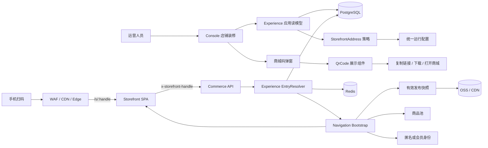

## 模块依赖方向

```mermaid
flowchart TD
    ConsoleFeature[Console Experience Feature] --> DesignQr[Design QrCode]
    ConsoleFeature --> SDK[@shop/sdk]
    SDK --> Contract[@shop/contract]

    Navigation[Navigation Bootstrap] --> ExperiencePort[Experience Public Port]
    Navigation --> IdentityPort[Identity Public Port]
    Navigation --> BenefitPort[Benefit Public Port]
    Navigation --> OrderPort[Order Public Port]

    ExperienceApp[Experience Application] --> ExperienceDomain[Experience Domain]
    ExperienceInfra[Experience Infrastructure] --> ExperienceApp
    ExperienceInfra --> Postgres[(PostgreSQL)]
    ExperienceInfra --> Cache[(Redis)]

    StorefrontRoute[Storefront Route] --> StorefrontRuntime[Storefront Runtime]
    StorefrontRuntime --> SDK
```

约束：

- Console 不拼接公开 URL。
- Navigation 不查询 Experience 私有表。
- Experience 不导入 Navigation 内部实现。
- Storefront 不接受客户端传入 `mallId` 作为权威。
- 跨模块调用只使用 `public` Port。
- 数据库 SQL 仅存在于对应模块的 `infrastructure/persistence`。

# 五、领域设计

## 5.1 聚合和对象

| 对象 | 类型 | 归属 | 职责 |
|---|---|---|---|
| `Application` | 聚合根 | Experience | 商城应用身份、商城归属、经营状态、草稿头、版本 |
| `ExperienceVersion` | 实体 | Experience | 不可变装修文档及校验状态 |
| `Release` | 实体 | Experience | 版本发布生命周期 |
| `Publication` | 实体 | Experience | CDN 制品、Hash、激活状态 |
| `StorefrontAddress` | 值对象 | Experience | 规范化 `handle` 与完整公开 URL |
| `EntryState` | 值对象 | Experience | `ready`、`unpublished`、`disabled`、`invalid` |
| `EntryPolicy` | 领域策略 | Experience | 根据应用、发布、制品状态判定可访问性 |
| `EntryResolver` | 公共端口 | Experience | 从 `handle` 解析可信商城、商品池与发布版本 |
| `QrCode` | 展示组件 | Design | 把已校验字符串编码成二维码 |
| `EntryDialog` | UI | Console | 展示二维码、URL、状态和辅助操作 |

## 5.2 核心不变量

1. 一个 MVP 商城最多存在一个公开 Application。
2. `publicSlug` 全局大小写不敏感唯一。
3. `publicSlug` 创建后不可随意变更。
4. 已发布过的 Application 永远不能修改 `publicSlug`。
5. QR URL 只能由 `StorefrontAddress` 构造。
6. `entry.state=ready` 必须同时满足：

   - Application 为 `active`
   - 存在 `active` Release
   - Version 为 `valid`
   - Publication 为 `active`
   - 商品池发布快照有效
   - CDN 制品 Hash 与 Version Hash 一致

7. `scheduled` Release 不能提前生成可用状态。
8. 草稿不能被 Storefront 读取。
9. 回滚版本不改变公开 URL。
10. 停用后旧二维码不得进入旧发布版本。
11. 客户端 `handle` 只是定位线索，必须由服务端重新解析。
12. 已登录会员的商城范围必须和解析出的商城相同，不一致时明确拒绝，禁止降级成匿名用户。
13. 未知 `handle` 和跨租户资源不能泄露商城信息。

## 5.3 状态机

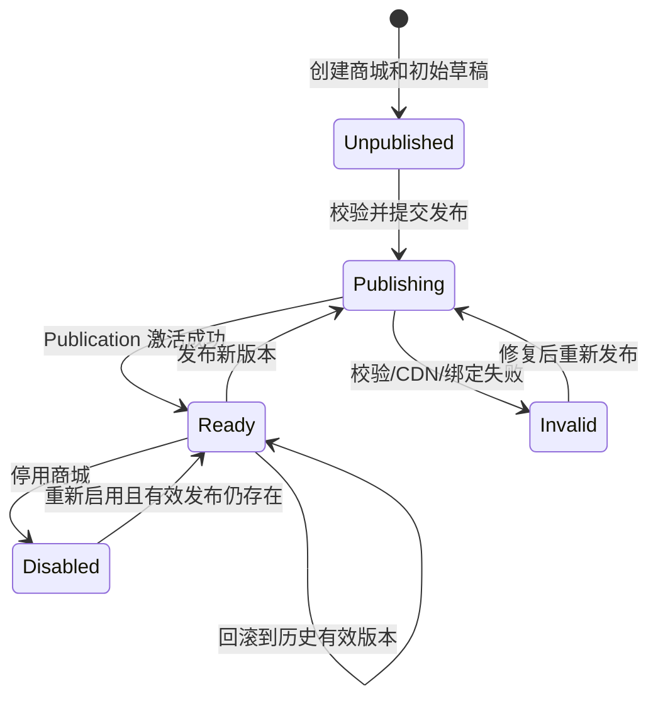

二维码状态与应用状态对应如下：

| 状态 | 弹窗表现 | 扫码表现 |
|---|---|---|
| `ready` | 显示二维码、复制、下载、打开 | 进入对应商城 |
| `unpublished` | 不生成二维码，显示“发布后可扫码” | 入口返回标准未发布页或 404 |
| `disabled` | 显示停用说明，不允许下载 | 入口返回 410 商城已停用 |
| `invalid` | 不生成二维码，显示发布异常和请求 ID | 服务端失败关闭，不读取草稿 |

# 六、数据模型方案

## 6.1 推荐硬切模型

当前 `application.scope_id`、`binding.mall_id` 和 `binding.domain` 存在重复表达。理想模型应收敛为：

```text
experience.application
├── id
├── mall_id
├── code
├── public_slug
├── name
├── status
├── head_version_id
├── version
├── created_at
└── updated_at

experience.release
├── id
├── application_id
├── version_id
├── pool_id
├── state
├── effective_at
├── retired_at
└── published_by
```

处理原则：

- `application.mall_id` 是商城归属唯一事实。
- `application.public_slug` 是公开入口唯一事实。
- `release.pool_id` 是发布时商品池快照。
- 删除 `experience.binding`。
- 删除 `experience.resolve_storefront_host(text)`。
- 新增按 `public_slug` 解析的函数或 Repository 查询。
- 不再保存 `domain`；完整 URL 由公开 Origin 与 `publicSlug` 推导。
- 不创建二维码相关表。

## 6.2 约束和索引

```text
unique index application_public_slug_unique
    on experience.application(lower(public_slug))

unique index application_mall_unique
    on experience.application(mall_id)

index application_scope_page
    on experience.application(mall_id, updated_at desc, id desc)

unique index release_active_unique
    on experience.release(application_id)
    where state = 'active'

unique index publication_active_unique
    on experience.publication(application_id)
    where state = 'active'
```

`publicSlug` 规则：

```text
^[a-z0-9][a-z0-9-]{2,47}$
```

并额外禁止：

- `api`
- `auth`
- `console`
- `admin`
- `assets`
- `health`
- `login`
- `s`
- `www`
- `.`、`..`
- 编码后的 `/`、`\` 或控制字符

## 6.3 数据迁移

使用新增迁移，不改写历史迁移：

```text
<timestamp>_mall_storefront_entry.sql
```

迁移顺序：

1. 检查同名 `public_slug` 冲突。
2. 检查一个 Mall 对应多个 Application 的异常。
3. 检查 `application.scope_id != binding.mall_id` 的异常。
4. 检查没有商品池绑定或没有发布快照的 Release。
5. 将 `mall_id` 回填到 Application。
6. 将 `pool_id` 回填到 Release。
7. 对 Application、Release 新字段加非空约束。
8. 创建全局唯一索引。
9. 切换读写函数。
10. 删除 `experience.binding`。
11. 删除 Host Resolver。
12. 写迁移证据并重放校验。
13. 异常数据不自动猜测，迁移直接阻断。

“抛弃兼容性”不等于修改已经发布的迁移文件。应在维护窗口停掉旧实例，应用一次性迁移和新制品，不部署双写、旧视图或兼容 Resolver。

# 七、API 与契约

## 7.1 商城应用列表

复用：

```text
GET /api/v1/experiences/applications
Operation: experience.applications.read
```

列表响应应改为轻量摘要，不再给每一行返回完整装修文档和全量历史：

```json
{
  "id": "application:...",
  "mallId": "mall:...",
  "code": "ZHUDATUAN_EMPLOYEE",
  "publicSlug": "zhudatuan-employee",
  "name": "主打团员工福利商城",
  "status": "active",
  "version": 8,
  "headSequence": 5,
  "publishedSequence": 4,
  "entry": {
    "handle": "zhudatuan-employee",
    "url": "https://fufu.wang/s/zhudatuan-employee",
    "state": "ready",
    "releaseId": "release:...",
    "releaseVersion": "version:...",
    "contentHash": "..."
  },
  "updatedAt": "2026-09-01T08:00:00.000Z"
}
```

`entry.url` 必须由服务端返回。控制台禁止执行：

```ts
`${window.location.origin}/${publicSlug}`
```

或：

```ts
`${VITE_STOREFRONT_ORIGIN}/s/${publicSlug}`
```

## 7.2 商城详情

为解决当前列表返回所有配置和历史的问题，增加：

```text
GET /api/v1/experiences/applications/{applicationid}
Operation: experience.applications.detail.read
```

仅在用户打开详情或装修时读取：

- 当前草稿文档
- 当前发布文档
- 有限条数的历史摘要
- 发布和校验原因
- 入口状态

历史版本继续使用游标分页，禁止将全部装修 JSON 嵌入 50 行列表。

## 7.3 商城端 Bootstrap

保留：

```text
GET /api/v1/storefront/bootstrap
Operation: storefront.bootstrap.read
```

请求上下文增加：

```http
X-Storefront-Handle: zhudatuan-employee
```

SDK 的 `RequestContext` 增加 `storefrontHandle`，统一自动注入，不允许各 Gateway 自行拼接 Header。

后端处理流程：

1. 校验 Header 仅包含规范 slug。
2. `ExperienceReadPort.resolveEntry(handle)` 查询应用。
3. 校验 Application 状态。
4. 读取有效 Release、Publication、Version、Pool。
5. 若存在 Session，校验 Session Mall 与解析 Mall 完全一致。
6. 并发加载发布装修、导航、福利摘要、订单摘要。
7. 返回绑定版本和装修版本。
8. 公共匿名结果短缓存；会员结果 `private,no-store`。

## 7.4 商城端后续请求

Catalog 等公共读请求必须携带相同 `storefrontHandle`。已登录命令还需同时携带 Session Scope。

服务端每次检查：

```text
handle → mall
session → mall
handle.mall == session.mall
```

禁止只相信任何一个前端值。

## 7.5 不新增二维码接口

以下接口都不应存在：

```text
POST /experiences/applications/{id}/qrcode
GET  /experiences/applications/{id}/qrcode
POST /shortlinks
GET  /redirect/{code}
```

# 八、跨模块调用时序

## 8.1 控制台打开二维码

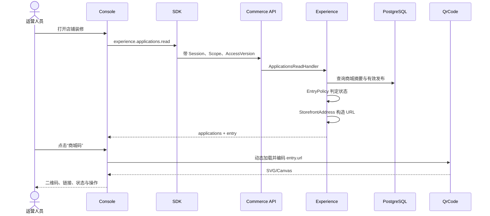

## 8.2 手机扫码打开商城

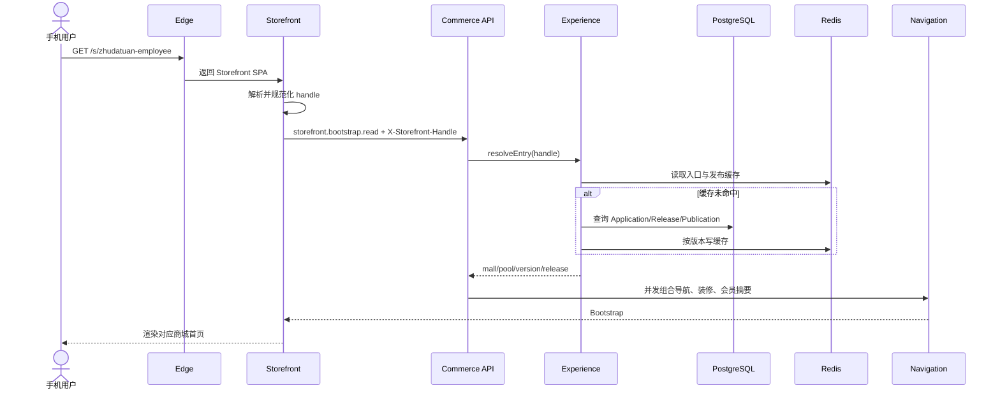

## 8.3 发布后二维码变为可用

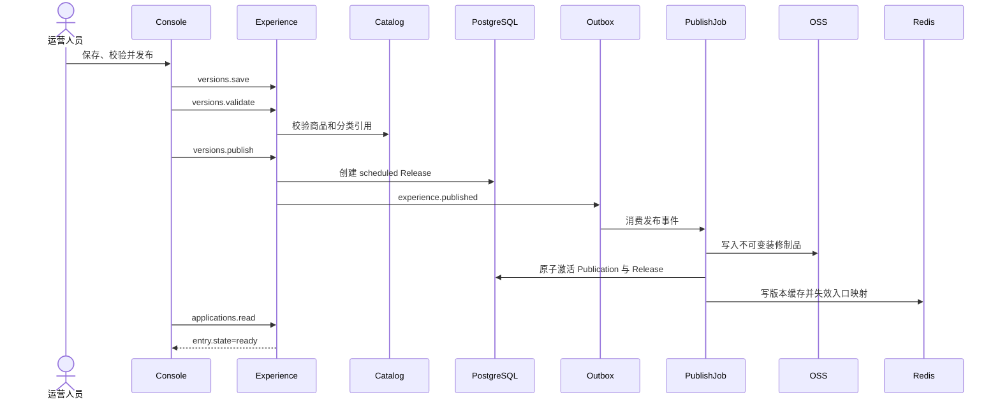

## 8.4 已登录用户扫错商城

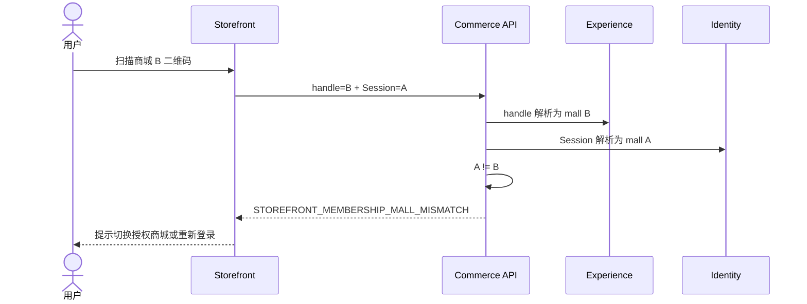

绝不能把该错误降级成匿名浏览，否则会产生权限和购物车串店风险。

# 九、每个模块内部的数据流

## 9.1 Console Experience

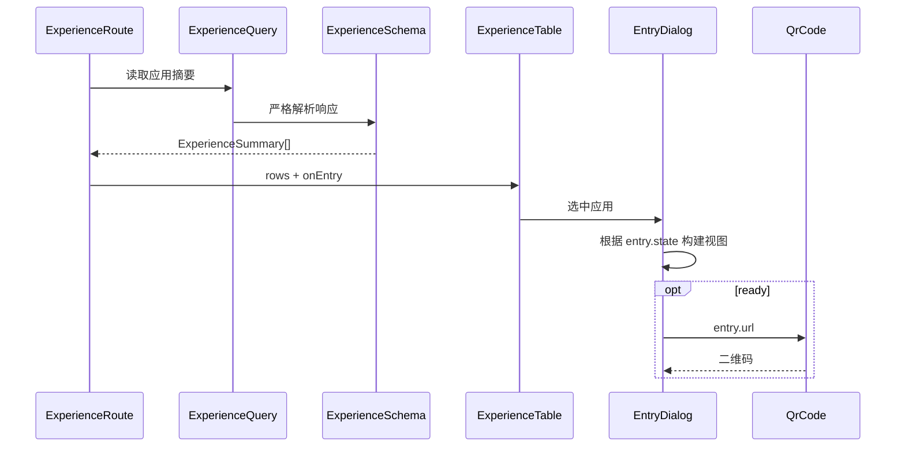

Console 只负责编排和展示，不解析发布表、不判断商品池、不拼 URL。

## 9.2 Experience 后端

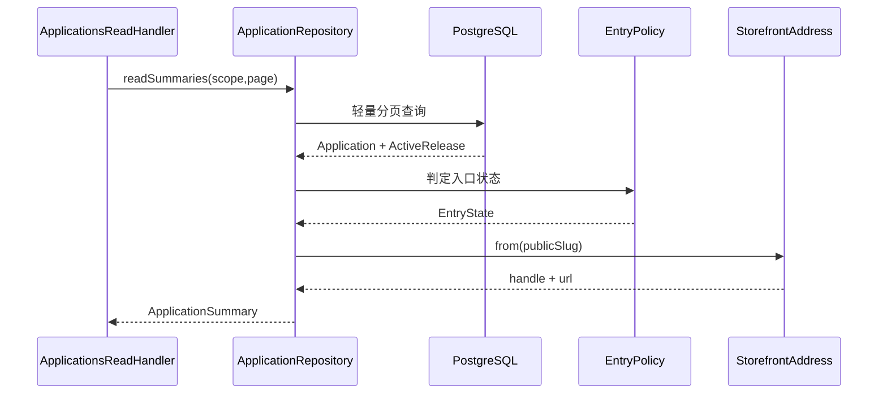

## 9.3 Design QrCode

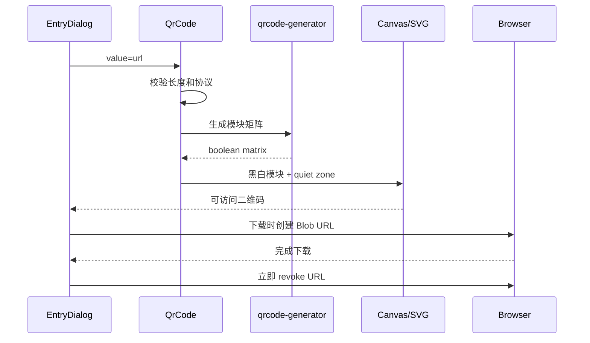

QrCode 不访问 API、不识别商城、不持有业务状态。

## 9.4 Storefront 路由

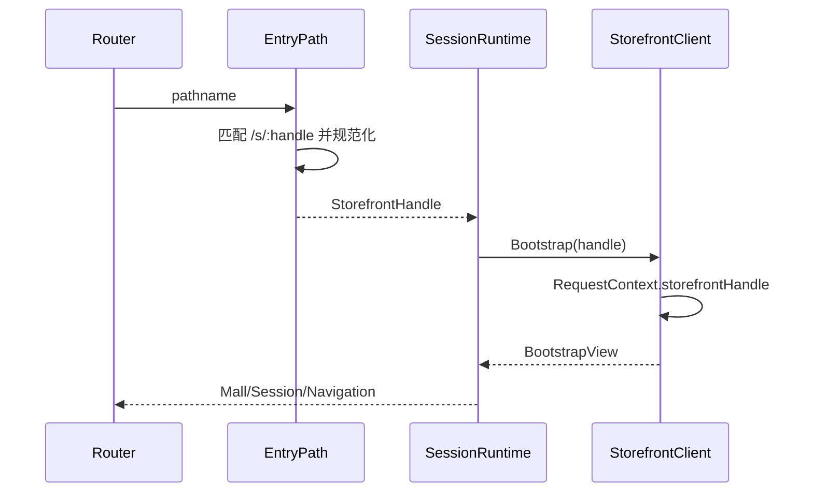

## 9.5 Navigation Bootstrap

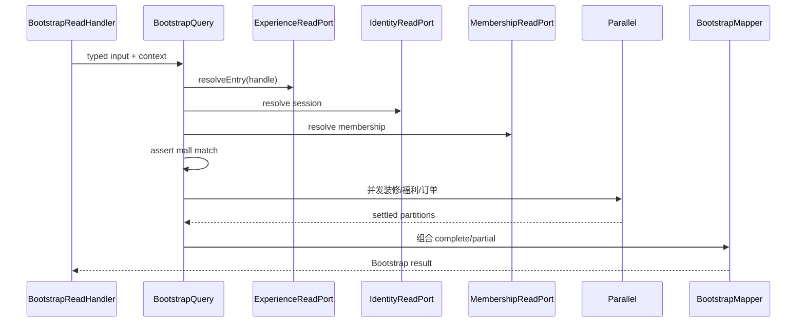

入口解析、身份和发布失败必须整体失败；福利摘要或订单摘要等独立区块允许 `partial`。

## 9.6 配置生成

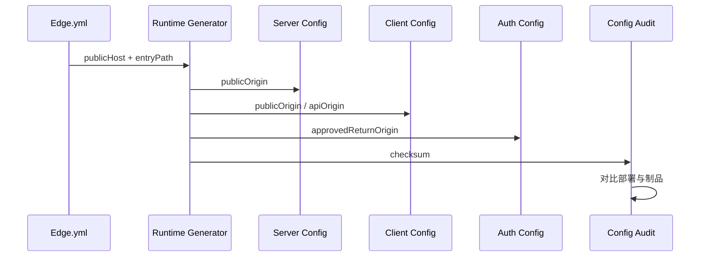

域名和 `/s` 前缀只能有一个权威输入。

# 十、UI 与 UX

## 10.1 商城列表

操作列调整为：

```text
查看 | 商城码 | 管理 | 复制 | 装修
```

“商城码”放在“查看”之后，因为它是只读、低风险且高频的进入动作。

当宽度不足时，保留：

```text
查看 | 商城码 | 更多
```

“管理、复制、装修”进入统一更多菜单，不允许按钮挤压换行导致表格高度失控。

## 10.2 弹窗线框

```text
┌──────────────────────────────────────────────────┐
│ 商城入口                                  ×      │
│ 主打团员工福利商城                               │
│ ● 已发布 · v4                                    │
├──────────────────────────────────────────────────┤
│                                                  │
│              ┌──────────────────┐                │
│              │                  │                │
│              │      QR CODE     │                │
│              │                  │                │
│              └──────────────────┘                │
│                                                  │
│ 手机扫码进入该商城                               │
│ https://fufu.wang/s/zhudatuan-employee            │
│                                                  │
│ [复制链接] [下载二维码] [新窗口打开商城]          │
├──────────────────────────────────────────────────┤
│ 二维码始终进入当前有效发布版本；草稿不会展示。   │
└──────────────────────────────────────────────────┘
```

## 10.3 视觉规范

- 复用现有 `commerceoverlay`、弹窗阴影、圆角、品牌色和 `Button`。
- 二维码本体保持纯黑白，不使用渐变和彩色模块。
- 四周留至少 4 个二维码模块的白色静区。
- 屏幕展示建议 224×224 CSS 像素。
- 下载文件建议 1024×1024 PNG。
- 默认纠错等级 `M`；如果未来嵌入 Logo，才使用 `H`，MVP 不嵌 Logo。
- 二维码外围可使用品牌色边框，但不能侵入静区。
- URL 使用等宽字体、自动折行和选择复制。
- 状态不得只通过颜色表达，必须同时显示文字和图标。
- 弹窗桌面居中，窄屏转底部抽屉。
- 关闭后焦点返回原“商城码”按钮。
- 支持 Escape、Tab 焦点循环和屏幕阅读器。

## 10.4 操作反馈

| 操作 | 成功反馈 | 失败反馈 |
|---|---|---|
| 复制链接 | Toast“商城链接已复制” | 显示可手动选择的 URL |
| 下载二维码 | Toast“二维码已下载” | “浏览器阻止了下载，请重试” |
| 新窗口打开 | 打开同一 `entry.url` | 当前页显示可复制链接 |
| 加载二维码 | 骨架占位，不阻塞弹窗 | “二维码生成失败，可复制链接进入” |

必须保留文本链接，因为无障碍用户、桌面用户和二维码生成失败时仍需进入商城。

## 10.5 文件名

下载文件：

```text
主打团员工福利商城-商城码.png
```

浏览器下载文件属于输出制品，不受生产源码文件连接符规则约束。内部源码文件仍遵守 PascalCase、camelCase 和无连接符规则。

# 十一、目录与文件结构

以下是推荐的落位，不表示本次已经修改。

```text
apps
├── console
│   └── src
│       └── feature
│           └── experience
│               ├── ExperienceRoute.tsx             修改：管理选中的商城码
│               ├── ExperienceTable.tsx             修改：增加商城码动作
│               ├── ExperienceSchema.ts             修改：严格解析 entry
│               ├── ExperienceQuery.ts              修改：只读取轻量摘要
│               ├── Dialogs.css                     修改：复用弹窗样式
│               └── entry
│                   ├── EntryDialog.tsx              新增：商城码弹窗
│                   ├── EntryState.ts                新增：纯展示状态映射
│                   └── Entry.css                    新增：二维码区域样式
│
├── storefront
│   └── src
│       ├── route
│       │   ├── Router.tsx                           修改：/s/:handle/*
│       │   ├── Routes.ts                            修改：入口路由常量
│       │   └── EntryPath.ts                         新增：路径解析与校验
│       ├── app
│       │   └── SessionRuntime.tsx                   修改：入口上下文
│       └── shared
│           ├── api
│           │   ├── Client.ts                        修改：注入 handle
│           │   └── Session.ts                       修改：请求上下文
│           └── runtime
│               └── SessionContext.tsx               修改：暴露 entry
│
packages
├── design
│   └── src
│       ├── QrCode.tsx                               新增：通用二维码组件
│       ├── QrCode.test.tsx                          新增：组件测试
│       └── index.ts                                 修改：导出组件
├── contract
│   ├── definitions
│   │   └── operations.yml                           修改：详情读契约
│   └── src
│       ├── schema
│       │   └── ExperienceSchema.ts                  修改：入口字段
│       └── StorefrontEntry.ts                       新增：共享入口约束
├── sdk
│   └── src
│       ├── RequestContext.ts                        修改：storefrontHandle
│       └── ApiClient.ts                             修改：统一 Header
└── config
    └── src
        └── ClientEnvironment.ts                     修改：消费唯一域名配置

services
└── commerce
    └── src
        └── modules
            ├── experience
            │   ├── Module.ts                        修改：注入入口策略
            │   ├── application
            │   │   ├── handler
            │   │   │   ├── ApplicationsReadHandler.ts
            │   │   │   └── ApplicationDetailHandler.ts
            │   │   ├── port
            │   │   │   └── ApplicationRepository.ts
            │   │   └── model
            │   │       └── ApplicationSummary.ts
            │   ├── domain
            │   │   ├── policy
            │   │   │   └── EntryPolicy.ts
            │   │   └── value
            │   │       └── StorefrontAddress.ts
            │   ├── infrastructure
            │   │   └── persistence
            │   │       ├── PgApplicationRepository.ts
            │   │       └── PgExperienceReadPort.ts
            │   └── public
            │       └── ExperienceReadPort.ts
            └── navigation
                └── application
                    └── service
                        ├── BootstrapQuery.ts
                        └── EntryHandle.ts

database
└── migrations
    └── <timestamp>_mall_storefront_entry.sql

tests
├── journey
│   └── MallEntryJourney.spec.ts
├── security
│   └── MallEntrySecurity.spec.ts
└── performance
    └── MallEntryPerformance.spec.ts
```

## 删除或收敛项

- 从 `services/commerce/package.json` 删除 `qrcode-generator`。
- 将该依赖添加到 `packages/design/package.json`。
- 删除数据库 `experience.binding`。
- 删除数据库 `experience.resolve_storefront_host(text)`。
- 删除 `BootstrapQuery.canonicalHost()`。
- 删除前端、后端散落的商城公开域名硬编码。
- 列表查询删除完整 `head_configuration`、`published_configuration` 和全量 `history` 聚合。
- 生成文件只通过 `npm run generate` 更新，不手工改动。

# 十二、SOLID、DDD 与设计模式落实

| 原则 | 落实方式 |
|---|---|
| 单一职责 | Address 构造 URL；EntryPolicy 判状态；QrCode 只编码；Dialog 只展示 |
| 开闭原则 | 新入口形式通过 Address 策略扩展，不修改二维码组件 |
| 里氏替换 | 所有入口策略返回同一 `StorefrontAddress` 契约 |
| 接口隔离 | Navigation 只依赖 `ExperienceReadPort.resolveEntry/published` |
| 依赖倒置 | Application 依赖 Port，PostgreSQL/Redis 是 Adapter |
| 迪米特法则 | Console 不认识 Release、Publication、Pool 表结构 |
| 工厂模式 | `StorefrontAddress.from(handle, config)` |
| 策略模式 | `EntryPolicy`、未来 `AddressPolicy` |
| 适配器模式 | `PgExperienceReadPort`、浏览器 QR Encoder |
| 状态模式 | EntryState 决定可用动作和页面 |
| CQRS | Console 列表、详情、Storefront Bootstrap 为 Query；发布为 Command |
| 不可变快照 | Storefront 只读取已激活 Publication |
| Outbox | 发布成功后用事件失效入口和装修缓存 |

不建议为二维码创建新的后端 DDD 模块，因为二维码不是业务聚合，也没有独立生命周期。

# 十三、安全设计

## 13.1 URL 安全

- URL 由服务端依据固定 Origin 和合法 slug 构造。
- 不允许运营人员输入完整 URL。
- 不允许 `javascript:`、`data:`、`file:`、`blob:`。
- 不接受用户提供协议、端口、用户名、密码、Query 或 Fragment。
- `window.open` 必须使用 `noopener,noreferrer`。
- URL 文本由 React 转义，不使用 `dangerouslySetInnerHTML`。

## 13.2 权限

展示二维码复用：

```text
experience.application.read
experience.applications.read
```

理由：URL 是公开地址，能够读取该商城应用的人可以查看地址；无需增加无意义的 `qrcode.read` 权限。

仍需保证：

- Group 只能读取下属 Mall。
- Mall 只能读取自身 Application。
- Platform 可以治理但不能绕过发布状态。
- 数据库 RLS 和服务端 Scope 必须同时校验。
- 前端显隐不替代后端授权。

## 13.3 扫码安全

- 二维码不承担认证。
- 扫码默认以匿名身份进入公开商城页面。
- 需要会员权限的操作再进入现有登录流程。
- 登录回跳只能是批准的 Storefront Origin 下 `/s/{handle}` 路径。
- Return Target 必须签名且服务端校验，禁止开放重定向。
- Session Mall 与入口 Mall 不一致时拒绝。
- 未发布页面不能通过猜测 slug 查看。

## 13.4 错误语义

| 场景 | HTTP/错误 |
|---|---|
| 非法 slug | 400 `STOREFRONT_HANDLE_INVALID` |
| 不存在 | 404 `STOREFRONT_NOT_FOUND` |
| 未发布 | 404 `STOREFRONT_NOT_PUBLISHED` |
| 已停用 | 410 `STOREFRONT_DISABLED` |
| 发布制品异常 | 503 `STOREFRONT_PUBLICATION_UNAVAILABLE` |
| 会员商城不一致 | 403 `STOREFRONT_MEMBERSHIP_MALL_MISMATCH` |

生产错误页只显示友好文案和 `requestId`，不泄露 Application、Tenant、数据库或发布路径。

# 十四、性能和可用性

## 14.1 性能目标

| 指标 | 目标 |
|---|---:|
| 商城列表 50 条响应体 | ≤ 80 KB |
| 商城列表 API p95 | ≤ 250 ms |
| 入口解析缓存命中 p95 | ≤ 20 ms |
| 入口解析数据库 p95 | ≤ 80 ms |
| Bootstrap API p95 | ≤ 300 ms |
| 商城首屏 LCP p75 | ≤ 2.5 s |
| QR 首次动态加载 | ≤ 100 KB gzip |
| QR 编码 p95 | ≤ 30 ms |
| QR 弹窗交互响应 INP | ≤ 200 ms |

## 14.2 优化措施

- 仅打开弹窗时动态导入二维码库。
- URL 不变时用 `useMemo` 缓存矩阵。
- 列表不生成 50 个隐藏二维码。
- 列表不返回装修 JSON 和全量历史。
- `publicSlug → entry binding` 使用短期 Redis 缓存。
- 发布、停用、重新启用时由事件精确失效。
- 装修内容继续使用 `releaseVersion + hash` 版本化缓存。
- 查询使用游标分页，不使用 Offset。
- 入口解析只查询一条 Application、Active Release、Publication。
- 不把 Mall ID 作为 Prometheus 高基数 Label。

## 14.3 可用性

- QR 生成失败仍可复制 URL。
- Redis 故障时允许回源 PostgreSQL。
- PostgreSQL 和缓存均不可用时失败关闭，不允许使用过期错误绑定进入其他商城。
- 已加载的静态 Storefront 可展示“商城连接异常”和重试。
- 停用必须即时失效入口缓存。
- 发布新版本不改变 URL，旧二维码继续生效。
- 回滚只切换 Release，不重新生成二维码。

# 十五、配置管理

唯一配置源建议收敛到网络发布权威：

```yaml
storefront:
  host: fufu.wang
  entryPath: /s
```

生成：

- 服务端 `publicOrigin`
- Console 只读展示契约
- Storefront 路由
- Auth 返回 Origin
- Edge SPA 深链
- 测试期望值
- 发布配置 Hash

必须增加审计：

```text
Edge host
== Auth approved storefront origin
== Server public storefront origin
== Storefront build origin
== Console 返回的 entry.url origin
```

任意不一致立即阻断构建或发布。

生产环境不允许用 `VITE_*` 任意覆盖为第二个域名；本地只保留明确的 `127.0.0.1` 例外。

# 十六、测试矩阵

## 16.1 单元测试

- `StorefrontAddress` 生成规范 URL。
- 拒绝保留字、大小写、空白、编码斜杠和超长 slug。
- `EntryPolicy` 覆盖四种状态。
- 发布、停用、恢复、回滚状态转换。
- QR 模块矩阵包含规定静区。
- 下载 Blob 正确释放。
- `EntryPath` 解析 `/s/:handle/*`。

## 16.2 独立二维码解码测试

二维码编码与解码测试必须使用不同实现：

```text
qrcode-generator 负责生成
独立 QR Decoder 负责验收
```

断言解码结果严格等于：

```text
https://fufu.wang/s/zhudatuan-employee
```

不能只断言“SVG 存在”或“Canvas 非空”。

## 16.3 契约测试

- `entry` 字段必填且 `additionalProperties=false`。
- `entry.url` 必须为 HTTPS 公开 Origin。
- `entry.state` 枚举完整。
- `ready` 必须有 Release、Version、Hash。
- 非 `ready` 不得伪造 Release。
- SDK 自动发送 `X-Storefront-Handle`。
- 服务端拒绝未登记 Header。

## 16.4 Repository 集成测试

- 全局 slug 冲突。
- 大小写冲突。
- 跨 Scope 不可见。
- Active Release 优先于 Scheduled。
- Retired Release 不可用。
- Publication Hash 不一致时 `invalid`。
- 停用后缓存即时失效。
- 同时发布时只激活一个 Release。
- 列表游标没有重复或遗漏。
- 列表不返回装修大对象。

## 16.5 组件测试

- Ready 状态显示二维码和三个操作。
- Unpublished 状态不加载二维码库。
- Disabled 状态不允许下载。
- 错误状态显示请求 ID。
- Escape 关闭。
- 焦点返回触发按钮。
- Copy 成功和失败。
- 下载文件名正确。
- `aria-label`、Dialog 标题和状态可读。
- 320、768、1366、1440 宽度布局正常。

## 16.6 安全测试

- 修改 Header 访问其他商城。
- Session A + Handle B。
- Query 中注入 Token、会员 ID。
- `javascript:` URL。
- `%2f`、`%5c`、双重编码、Unicode 同形字符。
- Host Header、Forwarded Host 不再影响商城选择。
- 开放重定向。
- 跨租户 slug 猜测。
- 已停用商城缓存重放。
- 非授权控制台用户读取应用列表。
- 日志不出现 Cookie、Token、完整手机号。

## 16.7 E2E 旅程

主旅程：

```text
集团管理员登录
→ 创建或选择商城
→ 完成装修并发布
→ 返回商城列表
→ 点击商城码
→ 解码二维码
→ 手机视口打开 URL
→ Bootstrap 解析到正确 Mall
→ 首页名称、装修版本、商品池均正确
```

补充旅程：

- 多商城 A/B 二维码不串店。
- 复制商城后产生新 URL。
- 新复制商城未发布前无可用二维码。
- 发布后二维码自动变为可用。
- 发布新装修后旧二维码显示新版本。
- 回滚后旧二维码显示回滚版本。
- 停用后旧二维码进入停用页。
- 登录后回到原商城 URL。
- 错误会员 Scope 不被降级。
- 网络错误后重试成功。

## 16.8 性能和容量测试

- 10、100、1,000、10,000 商城的入口解析。
- 50 行列表中每个商城均有 Entry，但不批量生成二维码。
- 500 并发扫码 Bootstrap。
- Redis 冷缓存和热缓存。
- 发布事件与扫码并发。
- 停用动作与缓存读取并发。
- QR 弹窗连续打开关闭 1,000 次无 Blob/DOM 泄漏。

# 十七、监控与告警

建议指标：

```text
experience.entry.resolve.duration
experience.entry.resolve.failure
experience.entry.state
experience.publication.activate.duration
storefront.bootstrap.duration
storefront.bootstrap.failure
console.entry.dialog.open
console.entry.copy.failure
console.entry.download.failure
```

日志字段：

```text
requestId
traceId
operation
entryState
applicationHash
releaseVersion
errorCode
duration
```

不记录：

```text
完整 IP
Cookie
Access Token
会员 ID
手机号
完整 Application 名称
二维码内容之外的任何用户信息
```

告警：

- 入口解析失败率 5 分钟超过 1%。
- 已发布 Application 出现 `invalid`。
- 多个 Active Release。
- 发布成功但入口缓存未更新。
- Edge 与配置域名不一致。
- QR 解码 Smoke 失败。
- 跨商城 Session 拒绝量异常上升。

# 十八、实施顺序

## Gate 1：需求事实纠偏

- 修正 `GROUP002` 的权威映射。
- 关联 `MVPGROUPAPPLICATION` 与 `MVPMALLDESIGN`。
- 增加 `MallEntryJourney.spec.ts`。
- 运行需求生成器。
- 审核生成的 trace、frontend、mvp 映射。
- 状态仍保持 `Designed`，不得手工写成 `Released`。

## Gate 2：域名与入口决策

- 确认正式 Storefront Origin。
- 清除历史域名与当前环境权威的双轨。
- 确认 `/s/{publicSlug}`。
- Edge、Auth、Console、Storefront、API 使用同一生成配置。
- 配置审计通过后才允许开发二维码。

## Gate 3：数据库硬切准备

- 扫描 slug 冲突。
- 扫描商城与 Application 关系异常。
- 回填 `mall_id` 和 Release `pool_id`。
- 在预发布数据库完整重放。
- 备份与 PITR 验证。
- 不发布兼容 View 或双写。

## Gate 4：后端读模型

- 实现 `StorefrontAddress`。
- 实现 `EntryPolicy`。
- 列表改成轻量摘要。
- 增加详情 Query。
- 实现 `resolveEntry(handle)`。
- 移除 Host Resolver。
- 增加缓存和精确失效。

## Gate 5：商城端入口

- 增加 `/s/:handle/*`。
- SDK 统一携带 handle。
- Bootstrap 和 Catalog 校验 handle。
- Session Mall 与入口 Mall 强校验。
- 登录回跳保留入口路径。

## Gate 6：控制台 UI

- 增加“商城码”操作。
- 复用现有弹窗和 Token。
- 迁移 QR 依赖到 Design。
- 实现复制、下载、打开。
- 补空态、错误态、停用态、未发布态。
- 完成可访问性和响应式测试。

## Gate 7：硬切发布

顺序：

```text
冻结写入
→ 数据库备份
→ 停止旧 API/Jobs
→ 执行新迁移
→ 部署同一签名制品
→ 清理 Redis 旧入口键
→ Edge 深链切换
→ 运行真实二维码 Smoke
→ 恢复流量
```

不允许旧实例与新 Schema 同时运行。

回滚不是运行期兼容，而是：

```text
停止新实例
→ 恢复发布前数据库快照/PITR
→ 恢复上一完整制品与 Edge 配置
→ 重新执行验收
```

# 十九、最终验收标准

只有同时满足以下条件，才能认定完成。

## 功能

- 每个已发布、经营中的商城都显示唯一二维码。
- 每个二维码解码后得到该商城唯一规范 URL。
- A 商城二维码永远不能打开 B 商城。
- 复制、下载、打开使用同一 URL。
- 发布新版本或回滚不改变 URL。
- 草稿、停用、发布异常状态不会生成伪可用二维码。

## MVP

- `GROUP002` 不再错误映射到 Pricing。
- `MVPGROUPAPPLICATION` 有商城码真实旅程证据。
- `MVPMALLDESIGN` 证明扫码消费当前有效发布版本。
- 工作簿中标记“忽略”的功能不被误加为本次阻断项。
- Release 状态只能由签名测试和部署证据推进。

## 安全

- QR 无敏感信息。
- 无开放重定向。
- 无跨商城 Session 降级。
- 无前端自行拼 URL。
- 无动态通配 Origin。
- 无草稿泄露。
- 无高基数敏感监控 Label。

## 性能

- 商城列表不返回全量装修历史。
- 列表不批量生成二维码。
- QR 编码按需加载。
- Bootstrap、列表、入口解析达到目标 p95。
- Redis 失效、冷缓存和数据库回源已验证。

## 工程质量

- 所有新增生产目录和文件无下划线、连字符或空格。
- 单生产源码文件不超过 299 行。
- 跨模块只使用 Public Port。
- 没有重复域名、入口前缀或 URL 构造逻辑。
- 没有二维码表、二维码 API、二维码对象文件。
- `npm run quality` 全绿。
- 真实手机扫码、浏览器 E2E、独立解码器和发布 Smoke 全部通过。

最终形态应当很克制：业务上只新增一个“商城码”入口；架构上则彻底打通“商城应用 → 唯一入口 → 有效发布 → 商城端精确解析”的完整闭环。
