# 结论

最理想的方向不是重写成大量微服务，而是：

> 以 `zhudatuan` 当前的模块化单体、类型化 Contract、PostgreSQL 强事务、Outbox/Inbox、Jobs、Provider 插件和双可用区部署为内核；硬切到唯一的 `apps/storefront`；迁移并保留 `zhudatuan-li` 的视觉、布局、响应式行为和真实业务；删除 mock、showcase、localStorage 业务状态、旧 API、兼容别名、双读双写和“暂不可用”假交互。

当前工程基础已经较强，但仍不能判定为“MVP 已完成”：

- 22 条 MVP 需求当前全部是 `Designed`，不是 `Released`，发布证据均为空。
- 18 条是必选发布项，4 条是工作簿明确标记的非阻塞项。
- 3 个必选需求仍存在产品定义阻塞。
- storefront 虽已接入约 20 个正式操作，但后端实际向 storefront 暴露了 59 个操作，安全中心、卡券、售后、物流/收货、客服、通知等用户旅程尚未完整闭环。
- 当前 Git 快照中 `apps/storefront/` 整体仍是未跟踪目录，旧 `apps/storefront-web/` 处于删除状态，硬切前必须先保护工作区。
- 截至 2026-08-30 23:12 的只读快照，storefront 类型检查通过，13 个测试文件、44 项测试全部通过；本次抽查的需求、命名、边界、重复、事务、调用图、事件、分页、Provider、扩展、Jobs、部署等门禁也全部通过。

全程只读分析，没有修改任何代码、文档或配置。

---

# 一、唯一需求基线

唯一业务需求源必须是 [福利商城功能清单.xlsx](/Users/changshengwang/Workspace/zhudatuan/docs/福利商城功能清单.xlsx)，而不是旧文档、代码现状或 LI 的演示数据。

:codex-file-citation{path="/Users/changshengwang/Workspace/zhudatuan/docs/福利商城功能清单.xlsx" purpose="source" artifact_kind="workbook" sheet="MVP上线功能清单" range="A1:F24"}

|  行 | 语义 ID               | 需求                                           | 发布属性 | 当前判定                                |
| --: | --------------------- | ---------------------------------------------- | -------- | --------------------------------------- |
|   3 | `MVPPLATFORM`         | 平台逻辑层级、商品池接入、卡号库创建           | 非阻塞   | 保留设计，不阻塞 MVP                    |
|   4 | `MVPDISTRIBUTION`     | 分销层                                         | 非阻塞   | 定义待确认，不阻塞 MVP                  |
|   5 | `MVPGROUPDASHBOARD`   | 集团销售金额、数量、退单、分应用及多时间窗口   | 必选     | 需要真实数据旅程和证据                  |
|   6 | `MVPGROUPAPPLICATION` | 应用/商城创建、复制、管理、装修                | 必选     | 需要发布、回滚和 storefront 生效证据    |
|   7 | `MVPGROUPPOOL`        | 集团商品池、商城池、批量上下架和调价           | 必选     | 需要池→商城→Listing 闭环                |
|   8 | `MVPGROUPORDER`       | 集团商品订单及售后订单                         | 必选     | storefront 售后尚未闭环                 |
|   9 | `MVPGROUPVOUCHER`     | 集团卡券、备付、审批、批量状态、绑定、核销明细 | 必选     | `voucherarchive` 阻塞                   |
|  10 | `MVPGROUPFINANCE`     | 集团财务                                       | 非阻塞   | 保留现有能力，不阻塞 MVP                |
|  11 | `MVPGROUPREPORT`      | 商品、商城、分类、渠道、卡券消费统计           | 必选     | 需水位、新鲜度和口径证据                |
|  12 | `MVPGROUPSUPPORT`     | 客服配置、分配、人员、账号、聊天和记录         | 必选     | storefront 客服入口未闭环               |
|  13 | `MVPGROUPSETTING`     | 权限、用户、供应商、门店、短信、风控           | 必选     | `grouprisk` 阻塞                        |
|  14 | `MVPMALLDASHBOARD`    | 商城经营大屏                                   | 必选     | 需按商城范围验证                        |
|  15 | `MVPMALLDESIGN`       | 商城装修                                       | 必选     | 必须与 LI 展示契约一致                  |
|  16 | `MVPMALLPOOL`         | 商城商品池、批量上下架和调价                   | 必选     | 需端到端发布验证                        |
|  17 | `MVPMALLORDER`        | 商城订单、售后                                 | 必选     | storefront 订单操作不完整               |
|  18 | `MVPMALLVOUCHER`      | 商城卡券能力                                   | 必选     | 与行 9 共用 `voucherarchive` 阻塞       |
|  19 | `MVPMALLFINANCE`      | 商城财务                                       | 非阻塞   | 保留现有能力，不阻塞 MVP                |
|  20 | `MVPMALLREPORT`       | 商城销售和分类统计                             | 必选     | “粉类”口径 `powderclass` 阻塞           |
|  21 | `MVPMALLSUPPORT`      | 商城客服                                       | 必选     | 需真实会话与记录旅程                    |
|  22 | `MVPMALLSETTING`      | 商城权限、会员、供应商、门店、短信、风控       | 必选     | 需完整作用域验证                        |
|  23 | `MVPIDENTITY`         | 密码、验证码、邀请码注册登录                   | 必选     | 后端较完整，需 storefront/Auth 完整旅程 |
|  24 | `MVPPROVIDER`         | 接口表优先级 1 的供应商                        | 必选     | 必须正好覆盖 11 个 P1 Provider          |

三个必选阻塞项不能由研发自行猜测：

1. `voucherarchive`：“客户管理与产品档案”的对象、字段、关系、权限、留存和验收定义。
2. `grouprisk`：集团风控策略对象、自动上下架触发条件、审批人和恢复机制。
3. `powderclass`：“粉类”究竟是分类、分销、品类还是其他业务指标。

接口表中优先级 1 必须正好为：

`jdproduct`、`jdfresh`、`tmall`、`supplier`、`cake`、`flower`、`book`、`charge`、`foodvoucher`、`movie`、`meal`。

:codex-file-citation{path="/Users/changshengwang/Workspace/zhudatuan/docs/福利商城功能清单.xlsx" purpose="source" artifact_kind="workbook" sheet="接口" range="A1:K21"}

现有 [config/providers.yml](/Users/changshengwang/Workspace/zhudatuan/config/providers.yml) 已与这 11 个 Provider 一致。

---

# 二、当前架构事实与关键缺口

## 已经值得复用的部分

- 29 个业务模块，加 `Navigation` 支撑模块。
- 263 个正式 Operation，其中 59 个面向 storefront。
- Contract、OpenAPI、SDK、服务端 Handler Catalog 统一生成。
- 31 个数据库 schema、281 张表、3261 个受控数据库对象。
- 模块写入所有权、调用边界、事务边界和 Keyset 分页门禁已经存在。
- Serializable 事务、乐观版本、幂等记录、Outbox、Inbox、Jobs 租约和围栏已经存在。
- API 三副本、Jobs 双副本、双可用区、同步备库、读副本、三节点队列、跨地域对象存储和温备区域已经设计。
- 11 个 Provider 已由唯一配置生成工厂清单。
- 当前 storefront 桌面 UI 与 LI 同名页面的差异较小，大部分变化是 Token、导入路径和语义化改进，适合继续复用。

关键入口包括：

- [StorefrontProvider.tsx](/Users/changshengwang/Workspace/zhudatuan/apps/storefront/src/app/StorefrontProvider.tsx)
- [ProductionSync.ts](/Users/changshengwang/Workspace/zhudatuan/apps/storefront/src/app/ProductionSync.ts)
- [CheckoutGateway.ts](/Users/changshengwang/Workspace/zhudatuan/apps/storefront/src/feature/checkout/CheckoutGateway.ts)
- [modules.ts](/Users/changshengwang/Workspace/zhudatuan/services/commerce/src/app/modules.ts)
- [objects.yml](/Users/changshengwang/Workspace/zhudatuan/database/contracts/objects.yml)
- [Topology.yml](/Users/changshengwang/Workspace/zhudatuan/infrastructure/cloud/Topology.yml)

## storefront 当前必须解决的缺口

| 领域          | 当前情况                                                                                      | 理想结果                                                                    |
| ------------- | --------------------------------------------------------------------------------------------- | --------------------------------------------------------------------------- |
| 全局状态      | `StorefrontProvider` 仍持有用户、商城、商品、订单、购物车、地址、收藏、导航、Toast 等大量状态 | 按 feature 隔离服务端状态；Shell 只持有会话、导航、视口                     |
| 首屏请求      | 会话→档案串行，再并发账户、订单、装修，再查台账和商品                                         | 增加只读 storefront 查询组合器，减少客户端网络往返                          |
| 商品          | 只拉首批 50 条；客户端再并行价格和库存                                                        | 支持游标分页、搜索、筛选、虚拟列表；服务端组合 Listing、Offer、Availability |
| 游客商品      | 当前明确返回空目录                                                                            | 按 Host 解析商城，提供匿名、限流、仅已发布的公开商品查询                    |
| 路由          | 页面状态保存在 React 内存，没有真正的 URL/history/deep link                                   | 使用 Browser Router，URL 是唯一导航状态                                     |
| 购物车选择    | 勾选状态仅在本地，服务端结算上下文是完整购物车                                                | Quote 明确携带选中行、行版本和 Cart Version                                 |
| 下单          | 客户端依次调用 Context→Quote→Order→Payment                                                    | 客户端只提交 Quote 和一次订单 Commit；支付恢复由服务端状态机承担            |
| 外部支付      | 福利余额不足时直接拒绝；只接受立即 `captured`                                                 | 返回安全的待支付动作，支持回调、主动查询、恢复和过期                        |
| 售后          | 后端有正式操作，storefront 未形成申请、物流、退款旅程                                         | 订单详情内完整售后状态机                                                    |
| 卡券          | 页面和真实操作未闭环                                                                          | 卡券中心、绑定、使用记录、核销记录、状态展示                                |
| 安全中心      | 后端有会话、密码、手机、Step-up 操作，页面未接入                                              | 真实会话管理、改密、换手机、撤销其他会话                                    |
| 客服          | 后端有工单、消息、附件、SLA，storefront 未接入                                                | 用户建单、聊天、记录查询和附件上传                                          |
| 收藏          | 当前只提示“即将开放”                                                                          | 要么实现持久化收藏，要么从生产 UI 移除；禁止假功能                          |
| 商城切换      | 当前拒绝切换其他商城                                                                          | 使用真实 Membership Selection，并清空旧作用域缓存                           |
| LI 待接入弹窗 | 原 LI 存在大量 Pending Modal                                                                  | 所有可见入口必须连接真实能力，或在 MVP 设计中明确删除                       |
| 发布证明      | 22 条均为 `Designed`，证据为空                                                                | 每条 required 需求必须到 `Released` 并绑定旅程、截图、指标和回放证据        |

---

# 三、目标系统架构

推荐采用“模块化单体 + CQRS 读模型 + 事件驱动 Jobs + 隔离 Provider Worker”，而不是立即拆微服务。

原因是订单、库存、福利、卡券、财务之间存在强事务要求；当前容量目标为 API 5000 QPS、订单 300 TPS、支付回调 600 TPS，模块化单体配合横向扩展完全能够承载，同时比跨服务分布式事务更可靠、更易维护。

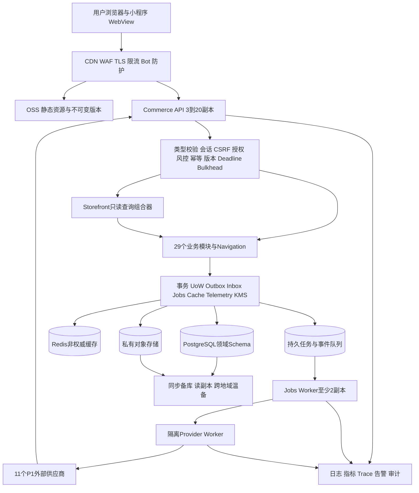
```mermaid
flowchart TB
    User[用户浏览器与小程序 WebView]
    Edge[CDN WAF TLS 限流 Bot 防护]
    Static[OSS 静态资源与不可变版本]
    API[Commerce API 3到20副本]
    Pipe[类型校验 会话 CSRF 授权 风控 幂等 版本 Deadline Bulkhead]
    Compose[Storefront只读查询组合器]
    Modules[29个业务模块与Navigation]
    Foundation[事务 UoW Outbox Inbox Jobs Cache Telemetry KMS]
    PG[(PostgreSQL领域Schema)]
    Redis[(Redis非权威缓存)]
    Queue[(持久任务与事件队列)]
    Jobs[Jobs Worker至少2副本]
    Provider[隔离Provider Worker]
    External[11个P1外部供应商]
    Object[(私有对象存储)]
    Obs[日志 指标 Trace 告警 审计]
    DR[同步备库 读副本 跨地域温备]

    User --> Edge
    Edge --> Static
    Edge --> API
    API --> Pipe
    Pipe --> Compose
    Pipe --> Modules
    Compose --> Modules
    Modules --> Foundation
    Foundation --> PG
    Foundation --> Redis
    Foundation --> Queue
    Foundation --> Object
    Queue --> Jobs
    Jobs --> Provider
    Provider --> External
    External --> API
    API --> Obs
    Jobs --> Obs
    Provider --> Obs
    PG --> DR
    Object --> DR
```

## 部署与高可用

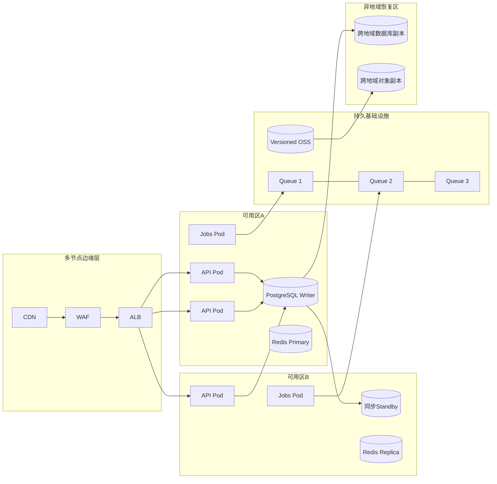
```mermaid
flowchart LR
    subgraph EdgeZone[多节点边缘层]
        CDN[CDN]
        WAF[WAF]
        ALB[ALB]
    end

    subgraph AZ1[可用区A]
        API1[API Pod]
        API2[API Pod]
        Job1[Jobs Pod]
        PG1[(PostgreSQL Writer)]
        Redis1[(Redis Primary)]
    end

    subgraph AZ2[可用区B]
        API3[API Pod]
        Job2[Jobs Pod]
        PG2[(同步Standby)]
        Redis2[(Redis Replica)]
    end

    subgraph Durable[持久基础设施]
        Q1[Queue 1]
        Q2[Queue 2]
        Q3[Queue 3]
        OSS[(Versioned OSS)]
    end

    subgraph Recovery[异地域恢复区]
        PGR[(跨地域数据库副本)]
        OSSR[(跨地域对象副本)]
    end

    CDN --> WAF --> ALB
    ALB --> API1
    ALB --> API2
    ALB --> API3
    API1 --> PG1
    API2 --> PG1
    API3 --> PG1
    PG1 --> PG2
    PG1 --> PGR
    Job1 --> Q1
    Job2 --> Q2
    Q1 --- Q2
    Q2 --- Q3
    OSS --> OSSR
```

要求：

- API 无本地会话、无粘性会话、可随时替换。
- API 正常 3 副本，最少 2，HPA 上限 20；PDB `minAvailable=2`。
- Jobs 至少 2 副本，任务领取必须依赖数据库租约、Fencing Token 和心跳。
- Jobs 增加 backlog、provider latency、outbox lag 驱动的扩缩容，而不只看 CPU。
- Provider 注册表不能只保存在单进程内存；DB 中的 Installation Version 是权威，各实例按版本刷新。
- 可用区故障不得造成写入丢失；区域级灾难按 RPO≤5 分钟、RTO≤30 分钟。
- 支付、财务通过外部对账和不可变凭证支持灾后恢复，而不能只依赖备份。

---

# 四、模块依赖边界

箭头表示“调用方依赖被调用模块的 Public Port”，不能表示跨 schema SQL。

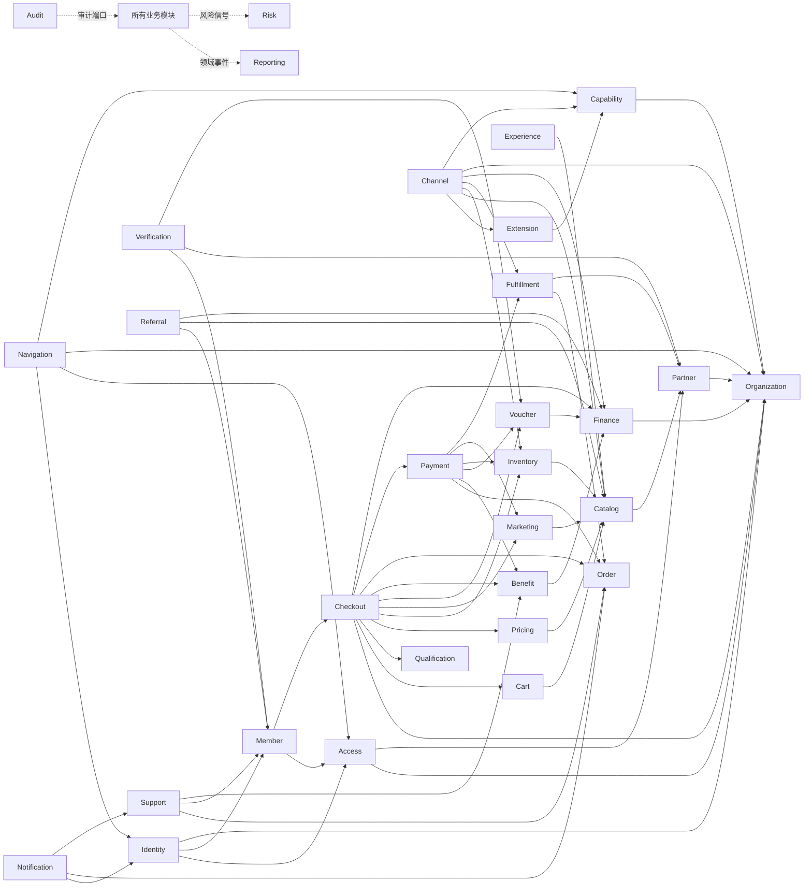
```mermaid
flowchart LR
    Identity --> Access
    Identity --> Member
    Identity --> Organization

    Access --> Organization
    Access --> Partner
    Capability --> Organization
    Partner --> Organization
    Member --> Access
    Member --> Checkout

    Catalog --> Partner
    Pricing --> Catalog
    Inventory --> Catalog
    Experience --> Catalog
    Marketing --> Catalog
    Cart --> Catalog

    Checkout --> Organization
    Checkout --> Cart
    Checkout --> Qualification
    Checkout --> Pricing
    Checkout --> Inventory
    Checkout --> Marketing
    Checkout --> Voucher
    Checkout --> Benefit
    Checkout --> Order
    Checkout --> Payment
    Checkout --> Finance

    Fulfillment --> Order
    Fulfillment --> Partner
    Payment --> Order
    Payment --> Benefit
    Payment --> Voucher
    Payment --> Inventory
    Payment --> Marketing
    Payment --> Fulfillment
    Voucher --> Finance
    Benefit --> Finance
    Finance --> Organization

    Extension --> Capability
    Channel --> Extension
    Channel --> Catalog
    Channel --> Inventory
    Channel --> Fulfillment
    Channel --> Finance
    Channel --> Organization
    Channel --> Capability

    Support --> Order
    Support --> Member
    Support --> Benefit
    Notification --> Identity
    Notification --> Order
    Notification --> Support
    Verification --> Member
    Verification --> Partner
    Verification --> Voucher
    Referral --> Member
    Referral --> Catalog
    Referral --> Finance

    Navigation --> Identity
    Navigation --> Access
    Navigation --> Organization
    Navigation --> Capability

    Audit -.审计端口.-> Modules[所有业务模块]
    Modules -.领域事件.-> Reporting
    Modules -.风险信号.-> Risk
```

边界规则：

- 一个 Handler 对应一个 Operation。
- 一个业务表只有一个模块可写。
- 跨模块命令走 Public Write Port。
- 跨模块查询走 Public Read Port 或 Reporting Projection。
- 异步副作用走 Outbox；消费者使用 Inbox 去重。
- `Navigation` 只计算可见视图，不提供授权。
- `Reporting` 不跨 schema 联表拼报表。
- `Audit` 只追加。
- `Checkout`、`Channel` 是编排者，不拥有其他模块的业务状态。
- Provider 不能直接写 Catalog、Inventory、Finance 表。

---

# 五、关键模块间调用时序

## 1. storefront 首屏与商品加载

新增 `storefront.bootstrap.read` 和 `storefront.catalog.read` 作为只读应用组合器。它们不成为新业务模块、不拥有表、不写事件，只调用 Public Read Port。

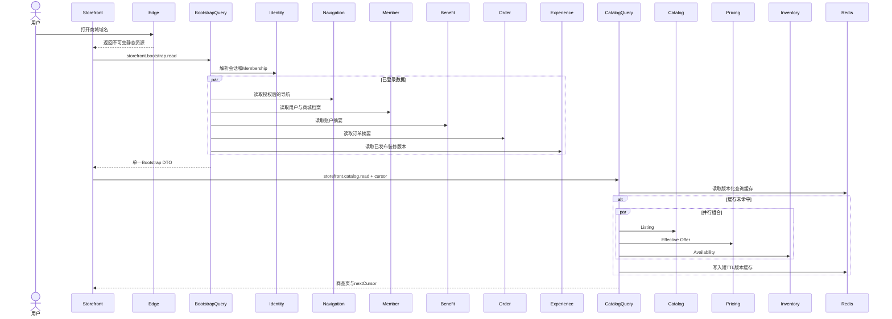
```mermaid
sequenceDiagram
    actor U as 用户
    participant F as Storefront
    participant E as Edge
    participant B as BootstrapQuery
    participant I as Identity
    participant N as Navigation
    participant M as Member
    participant Ben as Benefit
    participant O as Order
    participant X as Experience
    participant C as CatalogQuery
    participant Cat as Catalog
    participant P as Pricing
    participant Inv as Inventory
    participant Cache as Redis

    U->>E: 打开商城域名
    E-->>F: 返回不可变静态资源
    F->>B: storefront.bootstrap.read
    B->>I: 解析会话和Membership
    par 已登录数据
        B->>N: 读取授权后的导航
        B->>M: 读取用户与商城档案
        B->>Ben: 读取账户摘要
        B->>O: 读取订单摘要
        B->>X: 读取已发布装修版本
    end
    B-->>F: 单一Bootstrap DTO
    F->>C: storefront.catalog.read + cursor
    C->>Cache: 读取版本化查询缓存
    alt 缓存未命中
        par 并行组合
            C->>Cat: Listing
            C->>P: Effective Offer
            C->>Inv: Availability
        end
        C->>Cache: 写入短TTL版本缓存
    end
    C-->>F: 商品页与nextCursor
```

游客访问时，由 Edge/Host 映射确定商城范围；客户端不能自由伪造 `mallId`。游客只能读取已发布商品、价格和公开库存，不得访问会员资产。

## 2. 购物车、报价和下单

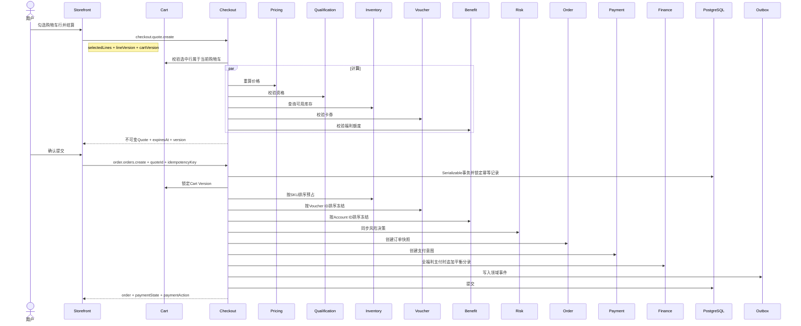
```mermaid
sequenceDiagram
    actor U as 用户
    participant F as Storefront
    participant Cart as Cart
    participant C as Checkout
    participant P as Pricing
    participant Q as Qualification
    participant I as Inventory
    participant V as Voucher
    participant B as Benefit
    participant R as Risk
    participant O as Order
    participant Pay as Payment
    participant Fin as Finance
    participant DB as PostgreSQL
    participant Out as Outbox

    U->>F: 勾选购物车行并结算
    F->>C: checkout.quote.create
    Note right of F: selectedLines + lineVersion + cartVersion
    C->>Cart: 校验选中行属于当前购物车
    par 计算
        C->>P: 重算价格
        C->>Q: 校验资格
        C->>I: 查询可用库存
        C->>V: 校验卡券
        C->>B: 校验福利额度
    end
    C-->>F: 不可变Quote + expiresAt + version

    U->>F: 确认提交
    F->>C: order.orders.create + quoteId + idempotencyKey
    C->>DB: Serializable事务并锁定幂等记录
    C->>Cart: 锁定Cart Version
    C->>I: 按SKU排序预占
    C->>V: 按Voucher ID排序冻结
    C->>B: 按Account ID排序冻结
    C->>R: 同步风险决策
    C->>O: 创建订单快照
    C->>Pay: 创建支付意图
    C->>Fin: 全福利支付时追加平衡分录
    C->>Out: 写入领域事件
    C->>DB: 提交
    C-->>F: order + paymentState + paymentAction
```

正常下单流程中，storefront 不再自行调用一次 `payment.intents.create` 来“补支付”。订单提交必须返回完整支付状态：

- 全福利支付：`captured`。
- 外部支付：`pending` 和受控支付动作。
- Provider 暂时不可用：订单/预占仍可恢复，状态不得伪装为失败或成功。
- 相同幂等键和请求哈希必须返回相同结果；同键不同请求返回冲突。

固定锁顺序：

```text
Idempotency
→ Quote
→ Cart
→ Inventory，按SKU排序
→ Voucher，按Voucher ID排序
→ Benefit，按Account ID排序
→ Order
→ Payment
→ Finance
→ Audit
→ Outbox
```

## 3. 外部支付回调与主动恢复

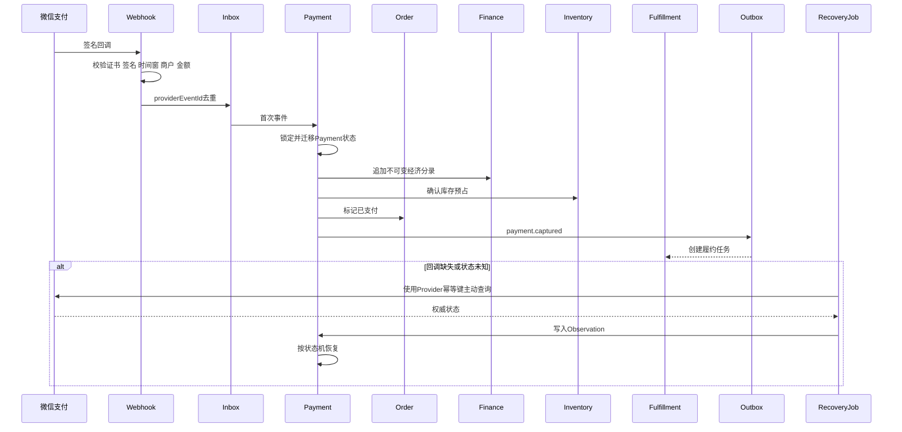
```mermaid
sequenceDiagram
    participant WX as 微信支付
    participant H as Webhook
    participant Inbox as Inbox
    participant P as Payment
    participant O as Order
    participant Fin as Finance
    participant Inv as Inventory
    participant Ful as Fulfillment
    participant Out as Outbox
    participant J as RecoveryJob

    WX->>H: 签名回调
    H->>H: 校验证书 签名 时间窗 商户 金额
    H->>Inbox: providerEventId去重
    Inbox->>P: 首次事件
    P->>P: 锁定并迁移Payment状态
    P->>Fin: 追加不可变经济分录
    P->>Inv: 确认库存预占
    P->>O: 标记已支付
    P->>Out: payment.captured
    Out-->>Ful: 创建履约任务

    alt 回调缺失或状态未知
        J->>WX: 使用Provider幂等键主动查询
        WX-->>J: 权威状态
        J->>P: 写入Observation
        P->>P: 按状态机恢复
    end
```

## 4. 售后、退货和退款

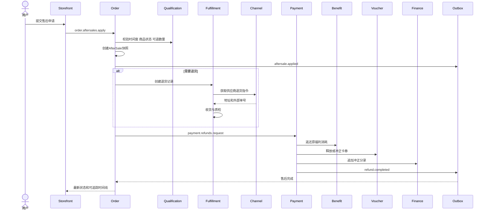
```mermaid
sequenceDiagram
    actor U as 用户
    participant F as Storefront
    participant O as Order
    participant Q as Qualification
    participant Ful as Fulfillment
    participant C as Channel
    participant P as Payment
    participant B as Benefit
    participant V as Voucher
    participant Fin as Finance
    participant Out as Outbox

    U->>F: 提交售后申请
    F->>O: order.aftersales.apply
    O->>Q: 校验时间窗 商品状态 可退数量
    O->>O: 创建AfterSale快照
    O->>Out: aftersale.applied

    alt 需要退货
        O->>Ful: 创建退货记录
        Ful->>C: 获取供应商退货指令
        C-->>Ful: 地址和外部单号
        Ful->>Ful: 收货与质检
    end

    O->>P: payment.refunds.request
    P->>B: 返还原福利消耗
    P->>V: 释放或冲正卡券
    P->>Fin: 追加冲正分录
    P->>Out: refund.completed
    Out-->>O: 售后完成
    O-->>F: 最新状态和可追踪时间线
```

## 5. Provider 商品和库存同步

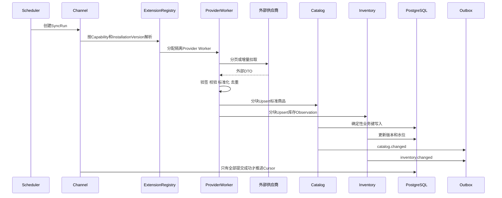
```mermaid
sequenceDiagram
    participant S as Scheduler
    participant C as Channel
    participant R as ExtensionRegistry
    participant W as ProviderWorker
    participant E as 外部供应商
    participant Cat as Catalog
    participant Inv as Inventory
    participant DB as PostgreSQL
    participant Out as Outbox

    S->>C: 创建SyncRun
    C->>R: 按Capability和InstallationVersion解析
    R->>W: 分配隔离Provider Worker
    W->>E: 分页或增量拉取
    E-->>W: 外部DTO
    W->>W: 验签 校验 标准化 去重
    W->>Cat: 分块Upsert标准商品
    W->>Inv: 分块Upsert库存Observation
    Cat->>DB: 确定性业务键写入
    Inv->>DB: 更新版本和水位
    Cat->>Out: catalog.changed
    Inv->>Out: inventory.changed
    C->>DB: 只有全部提交成功才推进Cursor
```

## 6. 身份注册、登录和商城切换

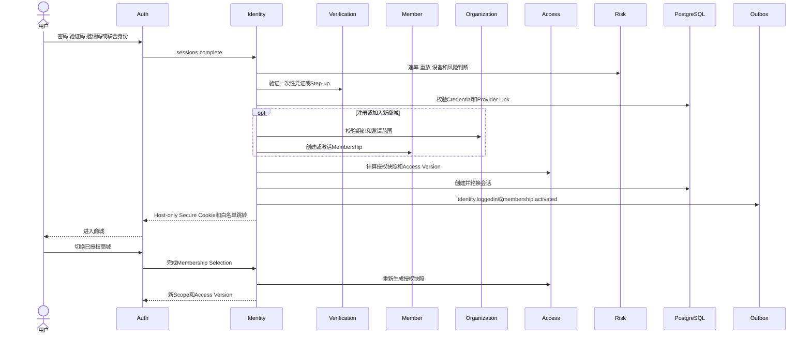
```mermaid
sequenceDiagram
    actor U as 用户
    participant A as Auth
    participant I as Identity
    participant V as Verification
    participant M as Member
    participant Org as Organization
    participant X as Access
    participant R as Risk
    participant DB as PostgreSQL
    participant Out as Outbox

    U->>A: 密码 验证码 邀请码或联合身份
    A->>I: sessions.complete
    I->>R: 速率 重放 设备和风险判断
    I->>V: 验证一次性凭证或Step-up
    I->>DB: 校验Credential和Provider Link
    opt 注册或加入新商城
        I->>Org: 校验组织和邀请范围
        I->>M: 创建或激活Membership
    end
    I->>X: 计算授权快照和Access Version
    I->>DB: 创建并轮换会话
    I->>Out: identity.loggedin或membership.activated
    I-->>A: Host-only Secure Cookie和白名单跳转
    A-->>U: 进入商城

    U->>A: 切换已授权商城
    A->>I: 完成Membership Selection
    I->>X: 重新生成授权快照
    I-->>A: 新Scope和Access Version
```

## 7. 商城装修发布

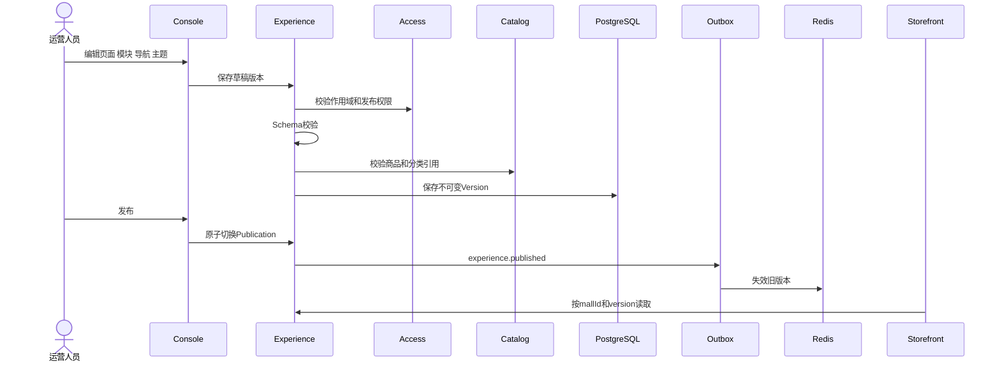
```mermaid
sequenceDiagram
    actor O as 运营人员
    participant C as Console
    participant E as Experience
    participant A as Access
    participant Cat as Catalog
    participant DB as PostgreSQL
    participant Out as Outbox
    participant Cache as Redis
    participant F as Storefront

    O->>C: 编辑页面 模块 导航 主题
    C->>E: 保存草稿版本
    E->>A: 校验作用域和发布权限
    E->>E: Schema校验
    E->>Cat: 校验商品和分类引用
    E->>DB: 保存不可变Version
    O->>C: 发布
    C->>E: 原子切换Publication
    E->>Out: experience.published
    Out->>Cache: 失效旧版本
    F->>E: 按mallId和version读取
```

---

# 六、每个模块的内部数据流

所有命令统一经过：

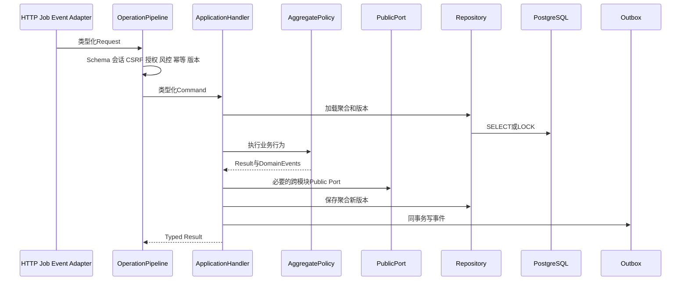
```mermaid
sequenceDiagram
    participant A as HTTP Job Event Adapter
    participant P as OperationPipeline
    participant H as ApplicationHandler
    participant D as AggregatePolicy
    participant X as PublicPort
    participant R as Repository
    participant DB as PostgreSQL
    participant O as Outbox

    A->>P: 类型化Request
    P->>P: Schema 会话 CSRF 授权 风控 幂等 版本
    P->>H: 类型化Command
    H->>R: 加载聚合和版本
    R->>DB: SELECT或LOCK
    H->>D: 执行业务行为
    D-->>H: Result与DomainEvents
    H->>X: 必要的跨模块Public Port
    H->>R: 保存聚合新版本
    H->>O: 同事务写事件
    H-->>P: Typed Result
```

以下是 30 个模块的具体内部时序。

## 身份、组织与授权模块

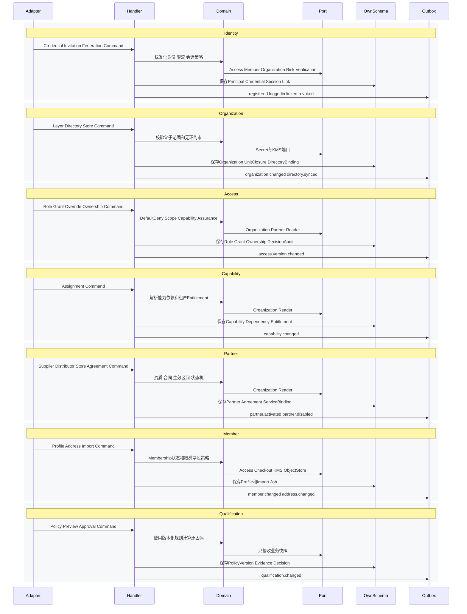
```mermaid
sequenceDiagram
    participant A as Adapter
    participant H as Handler
    participant D as Domain
    participant X as Port
    participant DB as OwnSchema
    participant O as Outbox

    rect rgb(246,248,250)
    Note over A,O: Identity
    A->>H: Credential Invitation Federation Command
    H->>D: 标准化身份 限流 会话策略
    D->>X: Access Member Organization Risk Verification
    H->>DB: 保存Principal Credential Session Link
    H->>O: registered loggedin linked revoked
    end

    rect rgb(246,248,250)
    Note over A,O: Organization
    A->>H: Layer Directory Store Command
    H->>D: 校验父子范围和无环约束
    D->>X: Secret与KMS端口
    H->>DB: 保存Organization UnitClosure DirectoryBinding
    H->>O: organization.changed directory.synced
    end

    rect rgb(246,248,250)
    Note over A,O: Access
    A->>H: Role Grant Override Ownership Command
    H->>D: DefaultDeny Scope Capability Assurance
    D->>X: Organization Partner Reader
    H->>DB: 保存Role Grant Ownership DecisionAudit
    H->>O: access.version.changed
    end

    rect rgb(246,248,250)
    Note over A,O: Capability
    A->>H: Assignment Command
    H->>D: 解析能力依赖和租户Entitlement
    D->>X: Organization Reader
    H->>DB: 保存Capability Dependency Entitlement
    H->>O: capability.changed
    end

    rect rgb(246,248,250)
    Note over A,O: Partner
    A->>H: Supplier Distributor Store Agreement Command
    H->>D: 资质 合同 生效区间 状态机
    D->>X: Organization Reader
    H->>DB: 保存Partner Agreement ServiceBinding
    H->>O: partner.activated partner.disabled
    end

    rect rgb(246,248,250)
    Note over A,O: Member
    A->>H: Profile Address Import Command
    H->>D: Membership状态和敏感字段策略
    D->>X: Access Checkout KMS ObjectStore
    H->>DB: 保存Profile和Import Job
    H->>O: member.changed address.changed
    end

    rect rgb(246,248,250)
    Note over A,O: Qualification
    A->>H: Policy Preview Approval Command
    H->>D: 使用版本化规则计算原因码
    D->>X: 只接收业务快照
    H->>DB: 保存PolicyVersion Evidence Decision
    H->>O: qualification.changed
    end
```

## 商品、价格、库存、装修与营销

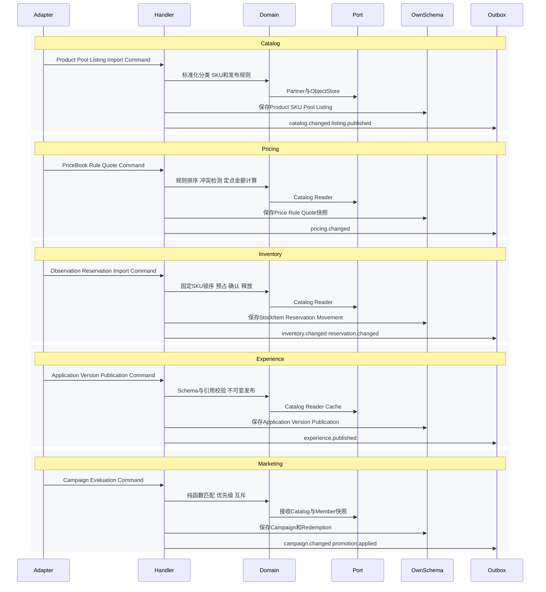
```mermaid
sequenceDiagram
    participant A as Adapter
    participant H as Handler
    participant D as Domain
    participant X as Port
    participant DB as OwnSchema
    participant O as Outbox

    rect rgb(246,248,250)
    Note over A,O: Catalog
    A->>H: Product Pool Listing Import Command
    H->>D: 标准化分类 SKU和发布规则
    D->>X: Partner与ObjectStore
    H->>DB: 保存Product SKU Pool Listing
    H->>O: catalog.changed listing.published
    end

    rect rgb(246,248,250)
    Note over A,O: Pricing
    A->>H: PriceBook Rule Quote Command
    H->>D: 规则排序 冲突检测 定点金额计算
    D->>X: Catalog Reader
    H->>DB: 保存Price Rule Quote快照
    H->>O: pricing.changed
    end

    rect rgb(246,248,250)
    Note over A,O: Inventory
    A->>H: Observation Reservation Import Command
    H->>D: 固定SKU锁序 预占 确认 释放
    D->>X: Catalog Reader
    H->>DB: 保存StockItem Reservation Movement
    H->>O: inventory.changed reservation.changed
    end

    rect rgb(246,248,250)
    Note over A,O: Experience
    A->>H: Application Version Publication Command
    H->>D: Schema与引用校验 不可变发布
    D->>X: Catalog Reader Cache
    H->>DB: 保存Application Version Publication
    H->>O: experience.published
    end

    rect rgb(246,248,250)
    Note over A,O: Marketing
    A->>H: Campaign Evaluation Command
    H->>D: 纯函数匹配 优先级 互斥
    D->>X: 接收Catalog与Member快照
    H->>DB: 保存Campaign和Redemption
    H->>O: campaign.changed promotion.applied
    end
```

## 交易与履约

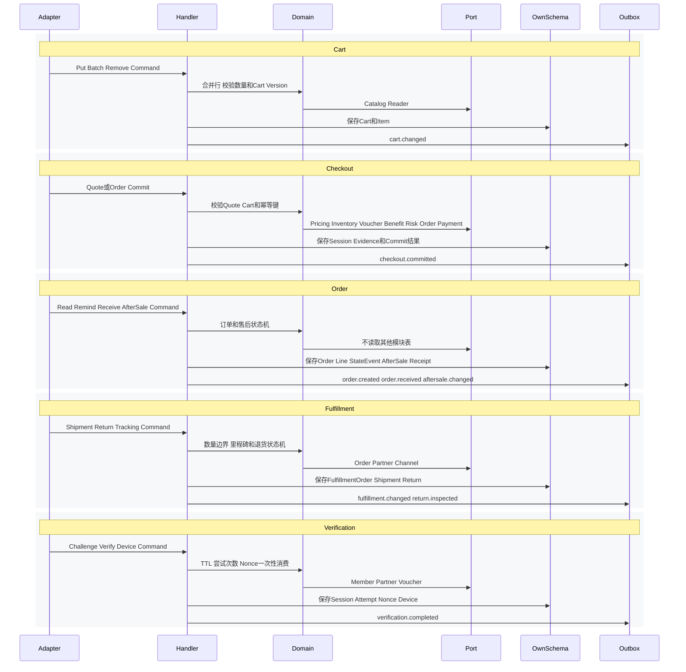
```mermaid
sequenceDiagram
    participant A as Adapter
    participant H as Handler
    participant D as Domain
    participant X as Port
    participant DB as OwnSchema
    participant O as Outbox

    rect rgb(246,248,250)
    Note over A,O: Cart
    A->>H: Put Batch Remove Command
    H->>D: 合并行 校验数量和Cart Version
    D->>X: Catalog Reader
    H->>DB: 保存Cart和Item
    H->>O: cart.changed
    end

    rect rgb(246,248,250)
    Note over A,O: Checkout
    A->>H: Quote或Order Commit
    H->>D: 校验Quote Cart和幂等键
    D->>X: Pricing Inventory Voucher Benefit Risk Order Payment
    H->>DB: 保存Session Evidence和Commit结果
    H->>O: checkout.committed
    end

    rect rgb(246,248,250)
    Note over A,O: Order
    A->>H: Read Remind Receive AfterSale Command
    H->>D: 订单和售后状态机
    D->>X: 不读取其他模块表
    H->>DB: 保存Order Line StateEvent AfterSale Receipt
    H->>O: order.created order.received aftersale.changed
    end

    rect rgb(246,248,250)
    Note over A,O: Fulfillment
    A->>H: Shipment Return Tracking Command
    H->>D: 数量边界 里程碑和退货状态机
    D->>X: Order Partner Channel
    H->>DB: 保存FulfillmentOrder Shipment Return
    H->>O: fulfillment.changed return.inspected
    end

    rect rgb(246,248,250)
    Note over A,O: Verification
    A->>H: Challenge Verify Device Command
    H->>D: TTL 尝试次数 Nonce一次性消费
    D->>X: Member Partner Voucher
    H->>DB: 保存Session Attempt Nonce Device
    H->>O: verification.completed
    end
```

## 支付、卡券、福利与财务

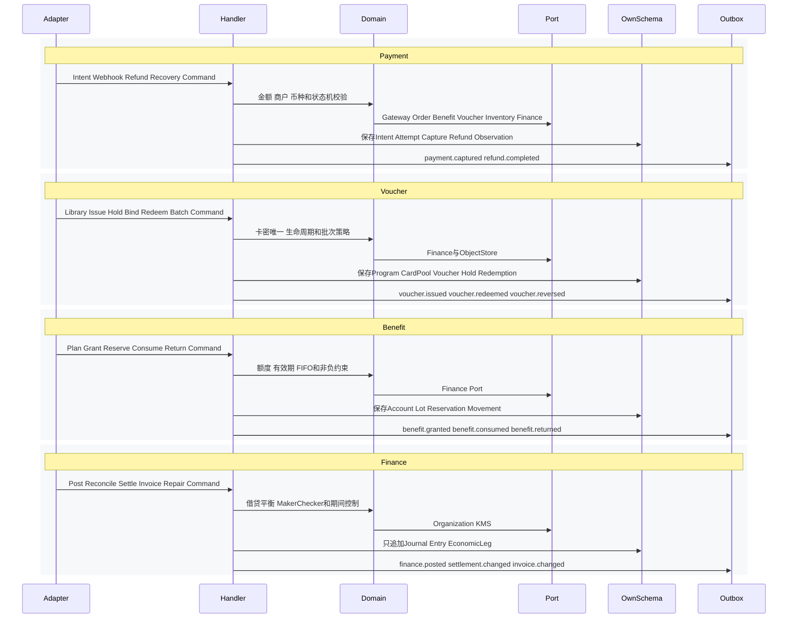
```mermaid
sequenceDiagram
    participant A as Adapter
    participant H as Handler
    participant D as Domain
    participant X as Port
    participant DB as OwnSchema
    participant O as Outbox

    rect rgb(246,248,250)
    Note over A,O: Payment
    A->>H: Intent Webhook Refund Recovery Command
    H->>D: 金额 商户 币种和状态机校验
    D->>X: Gateway Order Benefit Voucher Inventory Finance
    H->>DB: 保存Intent Attempt Capture Refund Observation
    H->>O: payment.captured refund.completed
    end

    rect rgb(246,248,250)
    Note over A,O: Voucher
    A->>H: Library Issue Hold Bind Redeem Batch Command
    H->>D: 卡密唯一 生命周期和批次策略
    D->>X: Finance与ObjectStore
    H->>DB: 保存Program CardPool Voucher Hold Redemption
    H->>O: voucher.issued voucher.redeemed voucher.reversed
    end

    rect rgb(246,248,250)
    Note over A,O: Benefit
    A->>H: Plan Grant Reserve Consume Return Command
    H->>D: 额度 有效期 FIFO和非负约束
    D->>X: Finance Port
    H->>DB: 保存Account Lot Reservation Movement
    H->>O: benefit.granted benefit.consumed benefit.returned
    end

    rect rgb(246,248,250)
    Note over A,O: Finance
    A->>H: Post Reconcile Settle Invoice Repair Command
    H->>D: 借贷平衡 MakerChecker和期间控制
    D->>X: Organization KMS
    H->>DB: 只追加Journal Entry EconomicLeg
    H->>O: finance.posted settlement.changed invoice.changed
    end
```

## 渠道、扩展和分销

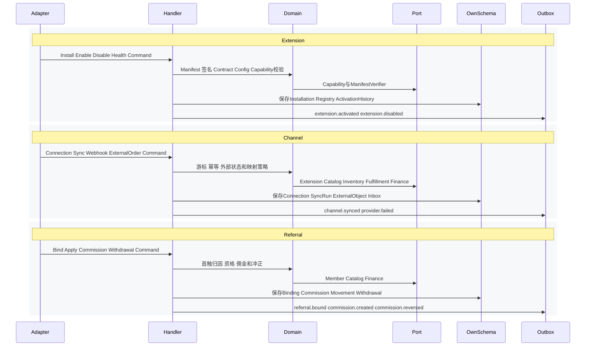
```mermaid
sequenceDiagram
    participant A as Adapter
    participant H as Handler
    participant D as Domain
    participant X as Port
    participant DB as OwnSchema
    participant O as Outbox

    rect rgb(246,248,250)
    Note over A,O: Extension
    A->>H: Install Enable Disable Health Command
    H->>D: Manifest 签名 Contract Config Capability校验
    D->>X: Capability与ManifestVerifier
    H->>DB: 保存Installation Registry ActivationHistory
    H->>O: extension.activated extension.disabled
    end

    rect rgb(246,248,250)
    Note over A,O: Channel
    A->>H: Connection Sync Webhook ExternalOrder Command
    H->>D: 游标 幂等 外部状态和映射策略
    D->>X: Extension Catalog Inventory Fulfillment Finance
    H->>DB: 保存Connection SyncRun ExternalObject Inbox
    H->>O: channel.synced provider.failed
    end

    rect rgb(246,248,250)
    Note over A,O: Referral
    A->>H: Bind Apply Commission Withdrawal Command
    H->>D: 首触归因 资格 佣金和冲正
    D->>X: Member Catalog Finance
    H->>DB: 保存Binding Commission Movement Withdrawal
    H->>O: referral.bound commission.created commission.reversed
    end
```

## 服务、治理与可观测性

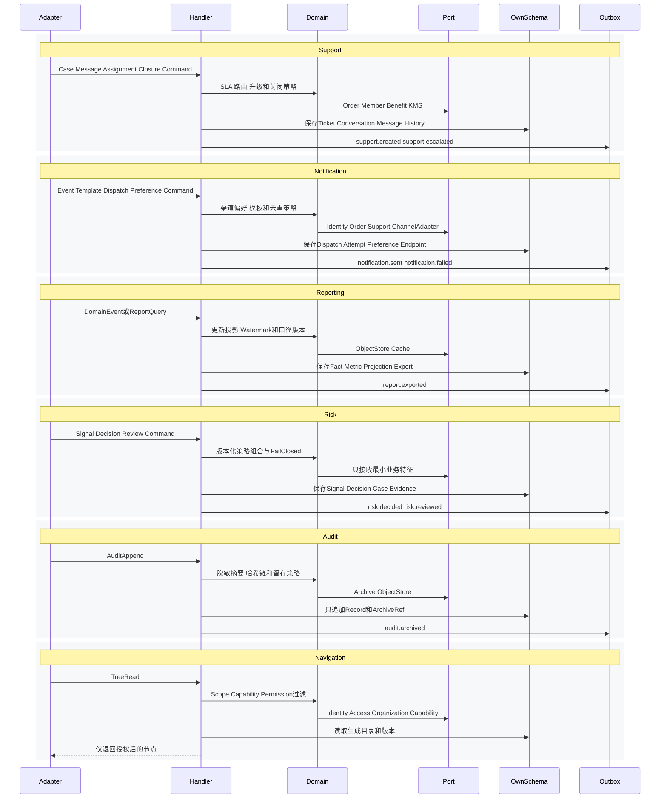
```mermaid
sequenceDiagram
    participant A as Adapter
    participant H as Handler
    participant D as Domain
    participant X as Port
    participant DB as OwnSchema
    participant O as Outbox

    rect rgb(246,248,250)
    Note over A,O: Support
    A->>H: Case Message Assignment Closure Command
    H->>D: SLA 路由 升级和关闭策略
    D->>X: Order Member Benefit KMS
    H->>DB: 保存Ticket Conversation Message History
    H->>O: support.created support.escalated
    end

    rect rgb(246,248,250)
    Note over A,O: Notification
    A->>H: Event Template Dispatch Preference Command
    H->>D: 渠道偏好 模板和去重策略
    D->>X: Identity Order Support ChannelAdapter
    H->>DB: 保存Dispatch Attempt Preference Endpoint
    H->>O: notification.sent notification.failed
    end

    rect rgb(246,248,250)
    Note over A,O: Reporting
    A->>H: DomainEvent或ReportQuery
    H->>D: 更新投影 Watermark和口径版本
    D->>X: ObjectStore Cache
    H->>DB: 保存Fact Metric Projection Export
    H->>O: report.exported
    end

    rect rgb(246,248,250)
    Note over A,O: Risk
    A->>H: Signal Decision Review Command
    H->>D: 版本化策略组合与FailClosed
    D->>X: 只接收最小业务特征
    H->>DB: 保存Signal Decision Case Evidence
    H->>O: risk.decided risk.reviewed
    end

    rect rgb(246,248,250)
    Note over A,O: Audit
    A->>H: AuditAppend
    H->>D: 脱敏摘要 哈希链和留存策略
    D->>X: Archive ObjectStore
    H->>DB: 只追加Record和ArchiveRef
    H->>O: audit.archived
    end

    rect rgb(246,248,250)
    Note over A,O: Navigation
    A->>H: TreeRead
    H->>D: Scope Capability Permission过滤
    D->>X: Identity Access Organization Capability
    H->>DB: 读取生成目录和版本
    H-->>A: 仅返回授权后的节点
    end
```

Runtime 和 Observability 是 Foundation，不是空业务模块：

- Runtime：配置装载、连接池、生命周期、健康检查、Deadline、Bulkhead、任务执行。
- Observability：结构化日志、Trace、指标、客户端错误、脱敏、告警和 Release ID 关联。

---

# 七、数据所有权和核心不变量

| 模块          | 核心数据                                                      | 必须保持的不变量                                 |
| ------------- | ------------------------------------------------------------- | ------------------------------------------------ |
| Identity      | Principal、Credential、Session、Invitation、FederatedIdentity | 外部身份唯一绑定；会话不可复用；凭证不可明文存储 |
| Organization  | Organization、UnitClosure、DirectoryBinding                   | 组织树无环；目录同步有来源和版本                 |
| Access        | Role、Grant、Ownership、Override、DecisionAudit               | 默认拒绝；权限、作用域、能力和认证强度同时满足   |
| Capability    | Capability、Dependency、Entitlement                           | Feature 开关不能绕过授权                         |
| Partner       | Partner、Agreement、Store、ServiceBinding                     | 无有效资质和协议不能交易                         |
| Member        | Profile、Address、Import                                      | 敏感数据加密；作用域内成员唯一                   |
| Qualification | PolicyVersion、Evidence、Decision                             | 决策绑定规则版本；历史决定不可覆盖               |
| Catalog       | Product、Sku、Pool、Listing、Category                         | SKU 业务键唯一；未发布内容不可进入 storefront    |
| Pricing       | PriceBook、Rule、Price、Quote                                 | 金额使用整数分；生效区间不重叠                   |
| Inventory     | StockItem、Reservation、Movement、Observation                 | 可售库存不得为负；释放、确认幂等                 |
| Experience    | Application、Version、Publication                             | 发布版本不可变；切换 Publication 原子化          |
| Marketing     | Campaign、Redemption                                          | 同一快照得到确定性优惠结果                       |
| Cart          | Cart、Item                                                    | 每用户每商城唯一活动购物车；版本并发控制         |
| Checkout      | Session、Evidence、Quote                                      | Quote 过期、Cart 变化或价格变化必须重新报价      |
| Order         | OrderRecord、Line、StateEvent、AfterSale、Receipt             | 商品、价格、地址、权益均是不可变下单快照         |
| Fulfillment   | FulfillmentOrder、Line、Milestone、Return                     | 履约数量不能超过订单数量                         |
| Verification  | Session、Attempt、Nonce、Device                               | 一次性凭证只能成功消费一次                       |
| Payment       | Intent、Attempt、Capture、Refund、Observation                 | 商户、币种、金额必须匹配；未知状态不得猜测       |
| Voucher       | Program、CardPool、Voucher、Hold、Redemption                  | 卡密唯一；状态迁移合法；核销只能成功一次         |
| Benefit       | Account、Lot、Reservation、Movement                           | 可用额度非负；返还关联原消费                     |
| Finance       | Journal、Entry、EconomicLeg、Settlement、Invoice              | 借贷平衡；账本只追加；修复通过冲正               |
| Extension     | Manifest、Installation、Registry、Health                      | 签名、合同、能力和配置缺一不可                   |
| Channel       | Connection、SyncRun、ExternalObject、WebhookInbox             | 先提交数据，后推进 Cursor                        |
| Referral      | Binding、Commission、Movement、Withdrawal                     | 首触绑定不可覆盖；退款等额冲正                   |
| Support       | Ticket、Conversation、Message、Assignment、SLA                | 关闭必须有解决结论和完整时间线                   |
| Notification  | Template、Dispatch、Attempt、Preference                       | 业务通知按幂等键去重                             |
| Reporting     | Fact、Metric、Projection、Watermark、Export                   | 展示数据水位；不得伪装实时                       |
| Risk          | PolicyVersion、Signal、Decision、Case                         | 高风险操作默认失败关闭                           |
| Audit         | Record、HashChain、Archive                                    | 只追加、不可业务修改、敏感字段脱敏               |
| Navigation    | 生成目录和授权后树                                            | 菜单显隐不能代替后端授权                         |

`ordering` schema 对应 Order 模块，`invoice` schema 由 Finance 拥有；应通过数据库所有权清单明确这种映射，禁止凭 schema 名猜测写权限。

---

# 八、目标 storefront 代码目录

```text
apps/storefront/
├── package.json
├── index.html
├── vite.config.ts
├── tsconfig.json
└── src/
    ├── app/
    │   ├── App.tsx
    │   ├── ErrorBoundary.tsx
    │   ├── QueryRuntime.tsx
    │   ├── SessionRuntime.tsx
    │   └── StorefrontRuntime.ts
    ├── route/
    │   ├── Router.tsx
    │   ├── Routes.ts
    │   ├── Guard.tsx
    │   └── Scroll.tsx
    ├── shell/
    │   ├── DesktopShell.tsx
    │   ├── MobileShell.tsx
    │   ├── TabletShell.tsx
    │   ├── Header.tsx
    │   ├── Footer.tsx
    │   ├── Navigation.tsx
    │   └── ChannelChrome.tsx
    ├── feature/
    │   ├── home/
    │   │   ├── application/
    │   │   ├── model/
    │   │   ├── infrastructure/
    │   │   └── ui/
    │   ├── catalog/
    │   ├── product/
    │   ├── cart/
    │   ├── checkout/
    │   ├── payment/
    │   ├── order/
    │   ├── aftersale/
    │   ├── voucher/
    │   ├── benefit/
    │   ├── account/
    │   ├── security/
    │   ├── support/
    │   ├── notification/
    │   └── referral/
    ├── shared/
    │   ├── api/
    │   │   ├── Client.ts
    │   │   ├── Error.ts
    │   │   ├── Query.ts
    │   │   └── Session.ts
    │   ├── config/
    │   ├── format/
    │   ├── manifest/
    │   ├── telemetry/
    │   └── ui/
    ├── generated/
    │   └── NavigationBinding.ts
    ├── style/
    │   ├── Global.css
    │   ├── Desktop.css
    │   ├── Mobile.css
    │   └── Tablet.css
    ├── main.tsx
    └── index.css
```

每个复杂 feature 统一使用：

```text
feature/checkout/
├── application/
│   ├── CreateQuote.ts
│   ├── CommitOrder.ts
│   └── CheckoutState.ts
├── model/
│   ├── Checkout.ts
│   ├── Quote.ts
│   └── Tender.ts
├── infrastructure/
│   ├── CheckoutGateway.ts
│   └── CheckoutMapper.ts
├── ui/
│   ├── CheckoutPage.tsx
│   ├── AddressPanel.tsx
│   ├── TenderPanel.tsx
│   └── OrderSummary.tsx
└── Checkout.test.ts
```

前端规则：

- 使用真实 Browser Router，禁止内存页码代替 URL。
- 使用一套 Query Runtime 管理缓存、去重、取消、重试和失效；不再在巨型 Context 里复制服务器状态。
- Context 仅保留 Session、Scope、Navigation、Toast 等真正跨页面状态。
- 页面不直接调用网络；网络调用只存在于 `infrastructure`。
- Mapper 只出现一次，不允许 `ProductMapper`、`PresentationMapper`、页面内再映射三套逻辑。
- 金额在 API/model 中使用整数分；只在 UI Format 层转换显示。
- 禁止 `utils`、`helpers`、`common`、`misc`、`legacy`、`compatibility`、`temp` 等目录。
- 生产目录小写且无连接符；TS 文件使用有意义的 PascalCase。
- 测试、SQL、脚本和配置按已有例外规则命名。

## 后端标准模块目录

```text
services/commerce/src/modules/catalog/
├── public/
│   ├── CatalogReadPort.ts
│   └── CatalogWritePort.ts
├── domain/
│   ├── model/
│   ├── value/
│   ├── policy/
│   ├── event/
│   ├── repository/
│   └── error/
├── application/
│   ├── command/
│   ├── query/
│   ├── handler/
│   ├── dto/
│   ├── process/
│   └── job/
├── infrastructure/
│   ├── persistence/
│   └── integration/
├── interface/
│   ├── http/
│   ├── event/
│   └── job/
├── CatalogModule.ts
└── Manifest.ts
```

只读 storefront 查询组合器放在：

```text
services/commerce/src/app/storefront/
├── BootstrapQuery.ts
├── CatalogQuery.ts
├── BootstrapMapper.ts
└── CatalogMapper.ts
```

该目录不能有 Aggregate、Repository、数据库表或业务事件。

---

# 九、UI/UX 保留策略

视觉权威是 [config/visuals.yml](/Users/changshengwang/Workspace/zhudatuan/config/visuals.yml)，源为 `zhudatuan-li`。

必须保留：

- 桌面 1366×768、1440×900、1920×1080。
- 平板横屏 1024×768、竖屏 768×1024。
- 移动端 360×800、375×812、390×844。
- LI 的首页、分类、商品详情、购物车/结算、订单、账户页布局。
- Banner、商品卡、头部商城信息、购物车反馈、快捷查看、底部导航。
- Android 与小程序的状态栏、胶囊、底部导航差异。

但不能保留：

- `/[device]`、`showcase`、`preview` 等生产演示路由。
- mock 商品、mock 账户、随机订单、localStorage 余额和卡券。
- 同源旧 API fallback。
- 假支付、假退款、假核销、假商城切换。
- “接口待接入”“功能即将开放”等代替业务结果的弹窗。

Android/小程序差异应由 `ChannelChrome` 和显式 Channel 配置处理，共用同一套业务组件，不能复制整套业务页面。

目标路由：

```text
/
 /products
 /products/:productId
 /cart
 /checkout
 /payments/:paymentId/result
 /orders
 /orders/:orderId
 /orders/:orderId/aftersales
 /vouchers
 /benefits
 /profile
 /profile/security
 /support
 /support/:caseId
 /notifications
```

视觉回归必须覆盖：

- `loading`
- `empty`
- `error`
- `denied`
- `expired`
- `partial`
- `success`
- hover、focus、selected、disabled、submitting、success
- 键盘导航、可见焦点、屏幕阅读标签、WCAG AA 对比度、Reduced Motion

---

# 十、数据一致性设计

## 一致性分级

| 场景          | 一致性   | 实现                                          |
| ------------- | -------- | --------------------------------------------- |
| Cart 更新     | 强一致   | Cart Version + Idempotency                    |
| Quote         | 快照一致 | Cart/Price/Qualification/Benefit Version      |
| 下单          | 强一致   | Serializable UoW + 固定锁顺序                 |
| 福利全额支付  | 强一致   | Order、Reservation、Benefit、Finance 同事务   |
| 外部支付      | Saga     | 本地意图先持久化，回调/主动查询恢复           |
| 库存          | 强一致   | Reservation 状态机和确定性锁顺序              |
| 卡券核销      | 强一致   | 唯一约束 + 行锁 + 状态机                      |
| 售后退款      | Saga     | Order、Fulfillment、Payment、Finance 事件编排 |
| Provider 同步 | 最终一致 | 分块事务，成功后推进 Cursor                   |
| 报表          | 最终一致 | Outbox→Inbox→Projection→Watermark             |
| 通知          | 最终一致 | Inbox 去重和重试                              |
| 缓存          | 最终一致 | Versioned Key + Event Invalidation            |
| 审计          | 强追加   | 同业务事务写不可变记录或 Outbox               |

## 状态机

```text
Order
created
→ awaitingpayment
→ paid
→ fulfilling
→ shipped
→ received
→ completed

created或awaitingpayment → cancelled
paid之后只能通过aftersale和refund处理
```

```text
Payment
created
→ preparing
→ pending
→ captured
→ partiallyrefunded
→ refunded

preparing或pending → failed
preparing或pending → expired
unknown → recovery，不得直接推断
```

```text
InventoryReservation
reserved
→ committed
→ released
→ expired
```

```text
Voucher
inactive
→ active
→ held
→ redeemed
→ reversed

active → disabled
active或disabled → void
active → expired
```

```text
AfterSale
applied
→ reviewing
→ approved
→ returning
→ received
→ refunding
→ resolved

reviewing → rejected
```

统一要求：

- 金额使用 `int64` 最小货币单位，禁止浮点。
- 比率使用整数基点或定点 Decimal。
- 时间统一 UTC，展示层转 `Asia/Shanghai`。
- 外部 ID 必须带 Provider 和 Tenant 范围。
- 所有可变 Aggregate 都有单调递增 `version`。
- 所有写操作都有幂等键、请求哈希和作用域。
- 同一幂等键重复请求返回首次结果；请求体不同返回冲突。
- Outbox 和业务状态同事务。
- Inbox 以 `provider + eventId` 或 `consumer + messageId` 唯一。
- 分配金额采用确定性的最大余数法；总和必须严格等于订单金额。
- 历史迁移不可重写；“抛弃兼容性”不意味着破坏迁移可回放性。

---

# 十一、Provider 即插即用

每个 Provider 包必须只实现声明的能力接口：

```text
CatalogPort
InventoryPort
OrderPort
FulfillmentPort
RefundPort
WebhookPort
HealthPort
```

标准结构：

```text
extensions/channel/jdproduct/
├── src/
│   ├── Provider.ts
│   ├── Client.ts
│   ├── Mapper.ts
│   ├── Config.ts
│   ├── Signature.ts
│   ├── Health.ts
│   └── Error.ts
├── contract/
│   └── Manifest.json
├── test/
│   ├── Contract.test.ts
│   ├── Mapping.test.ts
│   ├── Failure.test.ts
│   └── Sandbox.test.ts
└── package.json
```

启用流程：

```text
安装包签名验证
→ Manifest Schema校验
→ Contract Version校验
→ Capability依赖校验
→ Secret Reference解析
→ Sandbox健康检查
→ Mapping Contract Suite
→ Canary 1%
→ 10%
→ 50%
→ 100%
→ 原子切换Installation Version
```

隔离要求：

- Provider 代码编入签名的不可变镜像，不允许运行时下载任意代码。
- Provider 密钥只保存 Secret Reference，不进入配置、日志和 DB 明文列。
- 每个 Provider 独立限流、并发、队列、Deadline、重试、熔断和指标。
- 异步同步在 Provider Worker 执行，不能阻塞 API。
- 同步询价等必须通过严格 Bulkhead。
- Adapter 只做防腐映射，不允许 Provider DTO 渗入领域模型。
- 禁止旧 Provider ID alias、双读、双写和自动转换。

---

# 十二、安全设计

## 浏览器与身份

- 会话使用 `HttpOnly + Secure + SameSite` Host-only Cookie。
- 登录、邀请、Step-up、换手机、改密统一经过 Identity 和 Verification。
- CSRF Token 绑定 Session、Origin、Target 和过期时间。
- 登录回调和 Return Target 使用固定白名单。
- 登录、验证码、邀请码、联合身份回调都做速率限制和重放保护。
- 敏感操作要求 Step-up 和 Maker-checker。
- 退出时先使本地状态失效，再撤销服务器会话；撤销失败必须可见并可重试。

## 授权

授权顺序必须固定：

```text
Session
→ Membership Active
→ Credential Version
→ Access Version
→ Role Permission
→ Resource Scope
→ Capability
→ Assurance
→ Risk
→ Decision Audit
```

- 默认拒绝。
- RLS 是纵深防御，不是唯一授权。
- 每次请求的 Tenant、Membership、Scope 写入 DB Session Context。
- 缓存键必须包含 `membership + authzversion + capabilityversion`。
- Scope 切换必须清空前一商城的用户、商品、订单、购物车和导航缓存。

## 数据与供应链

- PII 字段使用 KMS Envelope Encryption；搜索字段单独保存不可逆指纹。
- 日志禁止出现 Authorization、Cookie、Password、OTP、Secret、Card Secret、Invite、Token Hash、Recipient 等字段。
- Webhook 校验证书、签名、时间窗、Nonce、商户和金额。
- 上传文件使用私有对象存储、短期签名 URL、MIME/尺寸校验、病毒扫描。
- CSP 默认拒绝，按真实资源逐项开放。
- 禁止在 `dangerouslySetInnerHTML` 中渲染未净化装修内容。
- CI 使用 OIDC；产物包含 SBOM、许可证报告、签名和 Provenance。
- 源码、Git 历史、日志、备份、退休产物全部进行秘密扫描。

---

# 十三、性能与高并发

沿用 [config/capacity.yml](/Users/changshengwang/Workspace/zhudatuan/config/capacity.yml) 和 [config/telemetry.yml](/Users/changshengwang/Workspace/zhudatuan/config/telemetry.yml) 的容量基线：

- 1000 商城。
- 1000 万会员。
- 500 万商品。
- 2000 万 SKU。
- 峰值 API 5000 QPS。
- 订单 300 TPS。
- 支付回调 600 TPS。
- 卡券批次 100 万。
- 年增长 80%。

SLO：

| 请求                 |     目标 |
| -------------------- | -------: |
| Catalog P95          |  ≤150 ms |
| 普通 Query P95       |  ≤300 ms |
| Detail P95           |  ≤500 ms |
| Command P95          |  ≤800 ms |
| Order P95            | ≤1500 ms |
| Webhook 持久接收 P99 |  ≤500 ms |
| Outbox P99           |   ≤30 秒 |
| 可用性               |  ≥99.95% |
| RPO                  |  ≤5 分钟 |
| RTO                  | ≤30 分钟 |

关键优化：

- storefront 初始 Gzip ≤110 KB；单个懒加载 feature ≤100 KB。
- Route 和大型页面按需加载。
- 图片使用多尺寸、WebP/AVIF、懒加载和 CDN。
- 商品列表使用游标分页和虚拟滚动。
- Bootstrap 和 Catalog 使用服务端组合，避免浏览器 6～10 次往返。
- 查询默认 50 行、最大 200 行、响应最大 2 MB。
- 数据库连接总预算 100，常态最多使用 70%；当前 Query 24、Command 20、Worker 24、Migration 1，总和 69。
- 热路径禁止 OFFSET、N+1、无界数组、无界 `Promise.all` 和全表导出。
- 所有外部调用使用 Deadline、Bulkhead、Retry、Circuit Breaker。
- Retry 只用于幂等操作，并增加抖动。
- Cache 只缓存可重建数据；Session、Access 不允许 Stale。
- Catalog、Experience 使用版本化缓存键。
- 报表导出全部异步，结果写对象存储。
- 大批量卡券、会员、商品导入使用分块、检查点、暂停和恢复。

---

# 十四、配置唯一性

| 内容                                        | 唯一权威                        |
| ------------------------------------------- | ------------------------------- |
| MVP 需求                                    | `docs/福利商城功能清单.xlsx`    |
| 需求解析规则                                | `config/requirements.yml`       |
| 权威文件哈希                                | `config/authorities.yml`        |
| Operation/Error/Event/Permission/Capability | `packages/contract/definitions` |
| 导航                                        | `config/navigation.yml`         |
| UI/UX 视觉契约                              | `config/visuals.yml`            |
| Provider 清单                               | `config/providers.yml`          |
| 身份提供商                                  | `config/identityproviders.yml`  |
| 容量                                        | `config/capacity.yml`           |
| 缓存                                        | `config/cache.yml`              |
| SLO 与脱敏                                  | `config/telemetry.yml`          |
| Bundle 预算                                 | `config/bundles.yml`            |
| 命名规则                                    | `config/naming.yml`             |
| Secret                                      | KMS/Secret Manager，仅保存引用  |
| 运行输出                                    | 由生成器生成，禁止手改          |

禁止：

- 在 storefront 内重新定义 API URL、Provider 名称、路由、权限和容量。
- 在 `.env`、YAML、TS 常量中重复同一配置。
- 手改 Generated SDK、Handler Catalog 和 Navigation Binding。
- 在页面内复制权限判断。
- 使用 Feature Flag 绕过授权。
- 使用环境变量承载复杂业务策略。

---

# 十五、复用、新增与删除

## 直接复用

- 当前 `apps/storefront` 的 LI 风格页面、Shell、Token、Mapper 和无障碍改进。
- `packages/contract`、`packages/sdk`、`packages/design`、`packages/config`。
- 29 个业务模块与 Navigation。
- Transaction、OperationPipeline、Outbox、Inbox、Jobs、Bulkhead、Circuit Breaker。
- 31 个 schema 及对象所有权合同。
- 11 个 Provider 工厂和核心适配器。
- 双可用区部署、备份、监控和供应链配置。
- LI 中经过测试的纯算法，例如分类映射、确定性金额分摊、设备导航意图。

## 必须新增或补齐

- storefront 只读 Bootstrap/Catalog 查询组合器。
- Browser Router 和真实深链接。
- 游客公开商品操作。
- 选中购物车行的服务端 Quote 语义。
- 单次 Order Commit 返回支付状态。
- 外部支付动作、结果页和恢复。
- 售后、物流、收货、卡券、安全中心、客服、通知页面。
- 真实商城 Membership 切换。
- Provider Worker 隔离与队列扩缩容。
- 每条 MVP 需求的 Journey、视觉和发布证据。

## 最终删除

- `apps/storefront-web`，但只能在 UI/UX 和业务迁移证据完成后删除。
- LI 的 `mock`、`showcase`、设备预览路由、随机数据和 localStorage 业务状态。
- 旧同源 API facade。
- 兼容 Provider ID、Alias、双写、双读、旧列和迁移期转换器。
- `triggerPendingFeature` 以及所有“即将开放”生产逻辑。
- 重复 Mapper、重复 Query State、重复导航定义。
- 无含义的 `Manager`、`Service`、`Helper` 和 `Utils`。
- 一次性迁移代码；历史 SQL Migration 本身保留。

---

# 十六、实施顺序

## 阶段 0：保护当前工作区

- 记录 Git Status、分支、HEAD、未跟踪文件清单和关键文件哈希。
- 将 `apps/storefront` 纳入受控提交。
- 确认旧 storefront 删除属于预期硬切。
- 禁止在当前脏工作区执行批量覆盖、Reset 或机械格式化。

## 阶段 1：冻结需求和产品定义

- 产品负责人签字确认 `voucherarchive`、`grouprisk`、`powderclass`。
- 确认分销层定义，但保持非阻塞。
- 每条需求建立 Operation、Route、Module、Table、Test、Runbook、Dashboard、Evidence 映射。

## 阶段 2：冻结 UI/UX 契约

- 在 8 个视口建立黄金截图。
- 建立交互和可访问性快照。
- 标注 LI 的真实业务、展示数据、假功能和待接入口。
- 只迁移真实业务和交互意图。

## 阶段 3：收口 storefront 基础

- 引入 Browser Router。
- 拆分 `StorefrontProvider`。
- 建立统一 Query Runtime。
- 完成真实 Scope/Membership 切换。
- 完成 Bootstrap 和 Catalog 查询组合。
- 完成游客公开商品。

## 阶段 4：交易闭环

- 修正选中购物车行语义。
- 服务端单次 Order Commit。
- 福利支付、外部支付、失败恢复、过期释放。
- 订单详情、物流、收货。
- 售后、退货、退款。

## 阶段 5：用户资产与服务

- 卡券中心。
- 福利账户和台账。
- 安全中心。
- 客服工单与消息。
- 通知中心和偏好。
- 收藏若确定保留，则实现服务端持久化。

## 阶段 6：Provider 与后台闭环

- 11 个 P1 Provider 全部通过 Sandbox Contract。
- 商品、库存、订单、履约、退款和 Webhook 逐项验证。
- 集团/商城的商品池、订单、卡券、报表、客服和设置与 storefront 形成闭环。

## 阶段 7：非功能验收

- 空库回放和生产快照回放。
- 300 TPS 下单、600 TPS 回调、5000 QPS 查询压测。
- 数据库故障、Redis 故障、队列积压、Provider 超时、Pod 驱逐、可用区故障演练。
- RPO/RTO 恢复演练。
- 安全扫描、越权测试、重放测试、秘密扫描。
- 8 视口视觉回归。

## 阶段 8：硬切发布

- 1%→10%→50%→100% Canary。
- 每阶段检查错误预算、订单一致性、支付恢复、Outbox Lag、Provider Breaker。
- 切换不可变静态资源指针。
- 不保留旧 storefront 流量分支。
- 不双写、不双读、不长期保留回退 API。

## 阶段 9：清理与证据归档

- 删除旧应用、mock、showcase、compatibility 和迁移期代码。
- 生成最终 SBOM、签名、Provenance 和许可证报告。
- 22 条需求逐项归档发布证据。

---

# 十七、最终验收标准

只有同时满足以下条件，才可以称为完成。

## 需求

- 18 条 required MVP 全部为 `Released`。
- 4 条 nonblocking 明确记录“不阻塞”而非误删。
- 3 个阻塞定义全部签字。
- 11 个 P1 Provider 数量、ID、能力完全一致。
- 每条需求至少有一个真实 Journey Evidence。

## storefront

- 所有正式路由可深链接、刷新和前进后退。
- 不存在 mock、localStorage 业务状态和假成功。
- 不存在可点击但只提示“暂不可用”的入口。
- 游客、登录、无权限、会话过期、部分失败均有明确状态。
- 购物车选中结算、支付恢复、售后、卡券、安全、客服完整闭环。
- LI 的 8 个视口和交互契约全部通过。

## 架构

- 模块边界、所有权、调用图、重复逻辑、事务、分页门禁零违规。
- 前端 UI 不直接发网络请求。
- 跨模块不直接写表。
- 所有副作用通过事务或 Outbox。
- Provider 不进入领域内核。
- 没有兼容目录、旧 API Alias、双读或双写。

## 数据

- 空库 Migration Replay 成功。
- 生产快照迁移前后行数、金额、状态和哈希核对成功。
- 财务借贷平衡。
- 库存、卡券、福利账户不出现负数或重复消费。
- Outbox、Inbox、Job、Audit、Reporting 水位可核对。
- 支付和退款可通过 Provider 权威数据对账恢复。

## 性能和可用性

- 达到 5000 QPS、300 TPS 订单、600 TPS 回调目标。
- P95/P99、Outbox Lag 和 Bundle 预算达标。
- 任一 API Pod、Jobs Pod、Redis 副本或单可用区故障不中断核心交易。
- RPO≤5 分钟、RTO≤30 分钟恢复演练通过。

## 发布证据

每条 required 需求必须绑定：

```text
Requirement ID
→ Operation Contract
→ Handler
→ Module
→ Database Objects
→ Unit Test
→ Contract Test
→ Journey Test
→ Visual Evidence
→ Performance Evidence
→ Security Evidence
→ Dashboard
→ Runbook
→ Release ID
```

现有 [docs/requirements/mvp.yml](/Users/changshengwang/Workspace/zhudatuan/docs/requirements/mvp.yml) 已经提供了这条追踪链的骨架，但 `status: Designed` 和空 `evidence` 必须被真实发布证据替换。

已有 [完整MVP架构方案.md](/Users/changshengwang/Workspace/zhudatuan/docs/architecture/完整MVP架构方案.md) 和 [完整MVP架构方案修改点清单.md](/Users/changshengwang/Workspace/zhudatuan/docs/architecture/完整MVP架构方案修改点清单.md) 可继续作为长文基线；其中关于 Referral、Finance、22 条需求和 Provider ID 的部分需要以当前仓库事实为准，因为这些能力和配置已经继续演进。
