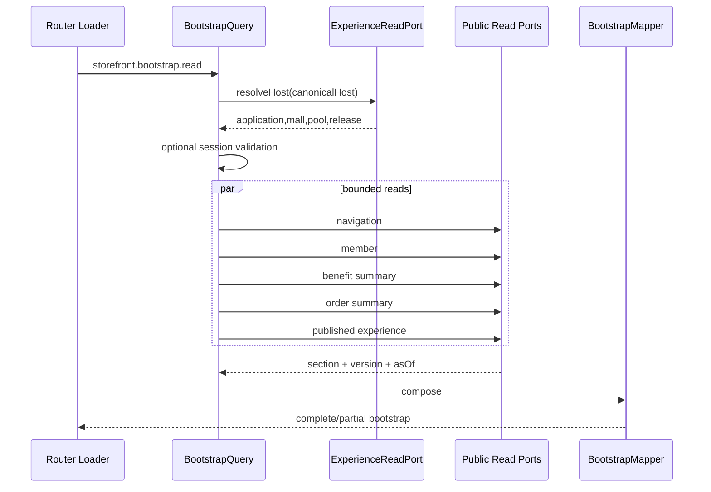

结论：当前代码与[《商城优化方案》](/Users/changshengwang/Workspace/zhudatuan/docs/architecture/商城优化方案.md)仍有明显差距，不能直接认定为“理想方案已落地”或“MVP 已可发布”。下面给出按架构方案落到文件、类、方法、契约、SQL、配置、部署、测试和发布证据的完整修改清单。

本次仅进行了只读分析，没有修改任何代码或配置。当前 `storefront` 类型检查通过，现有 13 个测试文件、44 个测试全部通过；但这些测试只证明当前代码自洽，不代表下述目标能力已经实现。

## 一、必须先冻结的事实

### 1. 唯一权威顺序

实施时必须按以下优先级解决冲突：

1. [商城优化方案.md](/Users/changshengwang/Workspace/zhudatuan/docs/architecture/商城优化方案.md)：目标架构、模块边界、事务、状态机、目录、性能、安全、发布标准的唯一权威。
2. `docs/福利商城功能清单.xlsx` 的“MVP上线功能清单”：功能范围唯一权威。
3. `zhudatuan-li`：UI、UX、交互意图和既有业务行为参考。
4. 当前 `zhudatuan` 代码：可复用实现，不得反向覆盖前两项。

我通过工作簿工具直接读取了完整 MVP 工作表，确认是 22 条：18 条 required、4 条 nonblocking。

:codex-file-citation{path="/Users/changshengwang/Workspace/zhudatuan/docs/福利商城功能清单.xlsx" purpose="source" artifact_kind="workbook" sheet="MVP上线功能清单" range="A1:F24"}

P1 Provider 必须恰好为 11 个：`jdproduct`、`jdfresh`、`tmall`、`supplier`、`cake`、`flower`、`book`、`charge`、`foodvoucher`、`movie`、`meal`。

:codex-file-citation{path="/Users/changshengwang/Workspace/zhudatuan/docs/福利商城功能清单.xlsx" purpose="source" artifact_kind="workbook" sheet="接口" range="A1:K21"}

### 2. 当前发布阻断

| 阻断项            | 当前事实                                                                                                                                | 必须修改                                                                         |
| ----------------- | --------------------------------------------------------------------------------------------------------------------------------------- | -------------------------------------------------------------------------------- |
| 架构权威错误      | [config/authorities.yml](/Users/changshengwang/Workspace/zhudatuan/config/authorities.yml:16)仍指向《完整MVP架构方案》                  | 改为《商城优化方案》，重新计算 SHA，并重新生成所有派生物                         |
| Artifact 权威错误 | [config/artifacts.json](/Users/changshengwang/Workspace/zhudatuan/config/artifacts.json:9)仍收录旧架构文档                              | 替换权威路径，禁止两个架构文档同时作为发布权威                                   |
| 视觉运行源错误    | [config/visuals.yml](/Users/changshengwang/Workspace/zhudatuan/config/visuals.yml:103)仍指向已删除的 `apps/storefront-web/src`          | 生产源改为 `apps/storefront/src`；`zhudatuan-li`仅保留为视觉参考源               |
| 工作区不安全      | `apps/storefront/` 整体未跟踪；当前约 470 个文件存在改动                                                                                | 第一批提交前保存分支、HEAD、状态、未跟踪文件清单及关键哈希，禁止覆盖或机械格式化 |
| MVP 无发布证据    | [docs/requirements/mvp.yml](/Users/changshengwang/Workspace/zhudatuan/docs/requirements/mvp.yml)中 22 条均为 `Designed`，`evidence: []` | 不得手工改成 Released；必须在真实证据产生后由生成器更新                          |
| 产品定义未签字    | `voucherarchive`、`grouprisk`、`powderclass` 未闭合                                                                                     | 三项是发布阻断；`distributiondefinition`只记录为 nonblocking，不阻断             |
| 旧应用删除未验收  | `apps/storefront-web` 已处于删除状态                                                                                                    | 必须先证明 LI 的八视口、交互和业务均已迁移，才能确认删除                         |

---

## 二、不可再讨论的架构决策

| 主题           | 强制方案                                                                                          |
| -------------- | ------------------------------------------------------------------------------------------------- |
| 总体形态       | 模块化单体 + CQRS 读组合 + 事件驱动 Jobs + 隔离 Provider Worker                                   |
| 微服务         | 本期不拆；避免分布式事务和网络复杂度                                                              |
| storefront BFF | 只增加 `storefront.bootstrap.read`、`storefront.catalog.read` 两个应用级查询组合器                |
| BFF 所有权     | 不得拥有聚合、表、Repository、领域事件；只能调用模块 Public Read Port                             |
| 路由           | Browser Router；URL 是唯一导航状态，禁止 React 内存页码                                           |
| 服务端状态     | 只使用一套 TanStack Query Runtime                                                                 |
| Context        | 仅允许 Session、Scope、Navigation、Toast，不保存商品、购物车、订单等服务器状态                    |
| 游客访问       | 根据可信 Host 解析 Application/Mall/Pool；浏览器不得提交 `mallId` 决定数据边界                    |
| 数据写入       | 前端只调用生成 SDK；页面组件禁止直接请求网络                                                      |
| 购物车         | `cartVersion + lineVersion + selectedLines`                                                       |
| 报价           | 服务端验证并签名用户选中的精确购物车行                                                            |
| 下单           | 一次 `order.orders.create` 返回订单和当前支付状态/动作                                            |
| 外部支付       | 本地意图先持久化；回调、主动查询、超时恢复组成 Saga                                               |
| Provider       | Provider Worker 独立进程、网络、密钥、队列、限流和扩缩容                                          |
| 跨模块         | 只通过 Public Port 和事件，禁止跨模块写表                                                         |
| 缓存           | Redis 非权威；Versioned Key + Singleflight + Event Invalidation                                   |
| 硬切           | 不保留兼容 API、Alias、双读、双写、旧 Provider ID、旧状态转换器                                   |
| 历史迁移       | 历史 SQL 保留；所有数据库调整追加新 Migration                                                     |
| 命名           | 生产目录小写且无连接符；TS 文件 PascalCase；禁止 `common/utils/helpers/legacy/compatibility/temp` |

SOLID 对应关系必须明确：

- 单一职责：一个用例类完成一个业务动作。
- 开闭原则：Provider、支付渠道、配送渠道通过 Port/Strategy/Factory 扩展。
- 里氏替换：每个适配器必须通过同一套 Provider/Port Contract Test。
- 接口隔离：读、写、管理、Provider 操作使用小型 Public Port，禁止万能接口。
- 依赖倒置：应用层依赖 Port，不依赖 PostgreSQL、微信、京东等实现。
- 迪米特法则：模块只了解直接 Public Port，不穿透到别的模块 Repository。
- 使用 Repository、Specification、State、Strategy、Adapter、Factory、Unit of Work、Outbox、Inbox、Saga、Circuit Breaker、Bulkhead；禁止无边界的 `Manager`、`Service`、`Helper`。

---

## 三、storefront 最终目录和逐文件动作

### 1. 基础目录

目标目录严格按方案收口：

```text
apps/storefront/src/
├── app/
│   ├── App.tsx
│   ├── ErrorBoundary.tsx
│   ├── QueryRuntime.tsx
│   ├── SessionRuntime.tsx
│   └── StorefrontRuntime.ts
├── route/
│   ├── Router.tsx
│   ├── Routes.ts
│   ├── Guard.tsx
│   └── Scroll.tsx
├── shell/
│   ├── DesktopShell.tsx
│   ├── MobileShell.tsx
│   ├── TabletShell.tsx
│   ├── Header.tsx
│   ├── Footer.tsx
│   ├── Navigation.tsx
│   └── ChannelChrome.tsx
├── feature/
│   ├── home/
│   ├── catalog/
│   ├── product/
│   ├── cart/
│   ├── checkout/
│   ├── payment/
│   ├── order/
│   ├── aftersale/
│   ├── voucher/
│   ├── benefit/
│   ├── account/
│   ├── security/
│   ├── support/
│   ├── notification/
│   └── referral/
├── shared/
│   ├── api/
│   ├── config/
│   ├── format/
│   ├── manifest/
│   ├── telemetry/
│   └── ui/
├── generated/
│   └── NavigationBinding.ts
├── style/
│   ├── Global.css
│   ├── Desktop.css
│   ├── Mobile.css
│   └── Tablet.css
├── main.tsx
└── index.css
```

不得为了“看起来分层”创建空目录。简单 feature 可以少层；一旦包含远程数据、领域状态和多个 UI 组件，就必须使用 `application/model/infrastructure/ui`。

### 2. 现有基础文件处理

| 当前文件                                                                                                           | 动作                           | 修改点                                                                         |
| ------------------------------------------------------------------------------------------------------------------ | ------------------------------ | ------------------------------------------------------------------------------ |
| [StorefrontApp.tsx](/Users/changshengwang/Workspace/zhudatuan/apps/storefront/src/app/StorefrontApp.tsx)           | 重写并重命名为 `App.tsx`       | 只组合 ErrorBoundary、QueryRuntime、SessionRuntime、Router                     |
| [StorefrontProvider.tsx](/Users/changshengwang/Workspace/zhudatuan/apps/storefront/src/app/StorefrontProvider.tsx) | 拆分后删除                     | 删除商品、购物车、订单、账户等服务器状态；不得继续暴露大批 setter              |
| [ProductionSync.ts](/Users/changshengwang/Workspace/zhudatuan/apps/storefront/src/app/ProductionSync.ts)           | 删除                           | 由 Bootstrap Query 和各 feature Query 接管；禁止客户端 fan-out                 |
| [StorefrontRouter.ts](/Users/changshengwang/Workspace/zhudatuan/apps/storefront/src/app/StorefrontRouter.ts)       | 删除                           | 由 `route/Router.tsx` 使用 Browser Router 接管                                 |
| `shared/manifest/RouteRegistry.ts`                                                                                 | 删除                           | 路由只能由 `config/navigation.yml → NavigationBinding.ts → Routes.ts`生成/消费 |
| `shared/navigation/NavigationQuery.ts`                                                                             | 删除或并入 Bootstrap           | 导航是 Bootstrap 一部分，不再单独重复请求                                      |
| `shared/api/ContractShape.ts`                                                                                      | 删除                           | 使用 `@shop/sdk` 和生成的 Zod Contract，不再维护通用 Shape 解析器              |
| `shared/api/CommerceClient.ts`                                                                                     | 重构为 `Client.ts`             | 删除模块级可变 `activeSession`；Session 必须由 Runtime 显式注入                |
| `index.css`                                                                                                        | 只保留样式入口                 | 具体样式移动到 `style` 四个文件                                                |
| `MobileStorefront.tsx`                                                                                             | 拆成 `MobileShell.tsx`         | 删除 Android/小程序的生产环境手工切换按钮                                      |
| `TabletStorefront.tsx`                                                                                             | 重命名 `TabletShell.tsx`       | 只承担布局                                                                     |
| `StorefrontShell.tsx`                                                                                              | 重命名 `DesktopShell.tsx`      | 不承担请求和业务状态                                                           |
| `StorefrontHeader.tsx`                                                                                             | 重命名 `Header.tsx`            | 商城切换、搜索、客服、通知均改为真实操作/路由                                  |
| `StorefrontFooter.tsx`                                                                                             | 重命名 `Footer.tsx`            | 保留 LI 视觉                                                                   |
| `StorefrontNavigation.tsx`                                                                                         | 重命名 `Navigation.tsx`        | 只消费生成导航                                                                 |
| `StorefrontChannel.ts`                                                                                             | 并入 `ChannelChrome.tsx`及配置 | 只处理视觉壳差异，不复制页面                                                   |
| 所有 `entity/*Contract.ts`                                                                                         | 删除                           | Contract 只能来自 `@shop/contract`                                             |
| 重复 Mapper                                                                                                        | 合并                           | 一个 API DTO 到领域 Model 只能存在一个 Mapper                                  |

[apps/storefront/package.json](/Users/changshengwang/Workspace/zhudatuan/apps/storefront/package.json)增加与仓库现有版本一致的：

```json
{
  "@tanstack/react-query": "5.102.4",
  "react-router": "8.3.0"
}
```

不得再引入第二套路由、请求缓存、状态同步框架。

### 3. 各 feature 精确结构

| Feature        | application                                                                      | model                                                      | infrastructure                                    | ui                                                                 |
| -------------- | -------------------------------------------------------------------------------- | ---------------------------------------------------------- | ------------------------------------------------- | ------------------------------------------------------------------ |
| `home`         | `ReadHome.ts`                                                                    | `Home.ts`、`HomeSection.ts`                                | `HomeGateway.ts`、`HomeMapper.ts`                 | 复用 `LaptopHomePage1366/1440`、`MobileHomePage`、`TabletHomePage` |
| `catalog`      | `ReadCatalog.ts`、`SearchCatalog.ts`                                             | `CatalogPage.ts`、`CatalogItem.ts`、`CatalogFilter.ts`     | `CatalogGateway.ts`、`CatalogMapper.ts`           | 复用分类页和商品栅格                                               |
| `product`      | `ReadProduct.ts`、`ShareProduct.ts`                                              | `Product.ts`、`ProductSku.ts`                              | `ProductGateway.ts`、`ProductMapper.ts`           | 复用详情页和 `QuickViewModal`                                      |
| `cart`         | `ReadCart.ts`、`ChangeCart.ts`、`CartSelection.ts`                               | `Cart.ts`、`CartLine.ts`                                   | `CartGateway.ts`、`CartMapper.ts`                 | 移动、平板、桌面购物车                                             |
| `checkout`     | `CreateQuote.ts`、`CommitOrder.ts`、`CheckoutState.ts`                           | `Checkout.ts`、`Quote.ts`、`Tender.ts`                     | `CheckoutGateway.ts`、`CheckoutMapper.ts`         | `CheckoutPage`、`AddressPanel`、`TenderPanel`、`OrderSummary`      |
| `payment`      | `ReadPayment.ts`、`ContinuePayment.ts`                                           | `Payment.ts`、`PaymentAction.ts`                           | `PaymentGateway.ts`、`PaymentMapper.ts`           | `PaymentResultPage.tsx`                                            |
| `order`        | `ReadOrders.ts`、`ReadOrder.ts`、`ReceiveOrder.ts`、`RemindOrder.ts`             | `Order.ts`、`OrderLine.ts`、`Timeline.ts`                  | `OrderGateway.ts`、`OrderMapper.ts`               | 列表、详情、物流时间线                                             |
| `aftersale`    | `ApplyAfterSale.ts`、`ReadAfterSale.ts`                                          | `AfterSale.ts`、`AfterSaleLine.ts`、`Return.ts`            | `AfterSaleGateway.ts`、`AfterSaleMapper.ts`       | 申请表、详情、时间线                                               |
| `voucher`      | `ReadVouchers.ts`、`ReadRedemptions.ts`                                          | `Voucher.ts`、`Redemption.ts`                              | `VoucherGateway.ts`、`VoucherMapper.ts`           | 卡券中心、详情、核销历史                                           |
| `benefit`      | `ReadBenefits.ts`、`ReadLedger.ts`                                               | `BenefitAccount.ts`、`BenefitEntry.ts`                     | `BenefitGateway.ts`、`BenefitMapper.ts`           | 福利账户、台账                                                     |
| `account`      | `ReadProfile.ts`、`ChangeAddress.ts`、`SwitchMembership.ts`、`ChangeFavorite.ts` | `Profile.ts`、`Address.ts`、`Membership.ts`、`Favorite.ts` | `AccountGateway.ts`、`AccountMapper.ts`           | 账户、地址、收藏、商城选择、发票入口                               |
| `security`     | `ReadSecurity.ts`、`ChangePassword.ts`、`ChangeMobile.ts`、`RevokeSession.ts`    | `Security.ts`、`DeviceSession.ts`                          | `SecurityGateway.ts`、`SecurityMapper.ts`         | 安全中心                                                           |
| `support`      | `ReadCases.ts`、`CreateCase.ts`、`SendMessage.ts`、`UploadAttachment.ts`         | `SupportCase.ts`、`Message.ts`、`Attachment.ts`            | `SupportGateway.ts`、`SupportMapper.ts`           | 工单列表、会话页                                                   |
| `notification` | `ReadNotifications.ts`、`MarkNotification.ts`、`ChangePreference.ts`             | `Notification.ts`、`NotificationPreference.ts`             | `NotificationGateway.ts`、`NotificationMapper.ts` | 通知中心、偏好                                                     |
| `referral`     | 保留现有归因算法                                                                 | `Referral.ts`                                              | `ReferralGateway.ts`                              | 仅保留真实入口                                                     |

统一规则：

- `application`负责用例编排，不写 JSX、不写 SQL。
- `model`不引用 React、SDK、HTTP。
- `infrastructure`是唯一允许调用 SDK 的位置。
- `ui`只接收 Model 和用例函数。
- Query Key 只能由 `shared/api/Query.ts`创建。
- GET 只对可重试错误重试一次；写操作不自动重试，依赖稳定 Idempotency Key。
- 页面切换和 Membership 切换必须取消旧请求。
- 金额在 Contract 和 Model 中只能是整数分。
- 收藏必须服务端持久化，因为 LI 已经存在收藏业务入口。
- 商品分享可使用 Web Share/Clipboard，不增加伪业务状态。
- 删除 `triggerPendingFeature` 及所有“即将开放”“待接入”生产行为。

### 4. 正式路由

`route/Routes.ts`必须只声明以下正式路由：

```text
/
 /products
 /products/:productId
 /cart
 /checkout
 /payments/:paymentId/result
 /orders
 /orders/:orderId
 /orders/:orderId/aftersales
 /vouchers
 /benefits
 /profile
 /profile/security
 /support
 /support/:caseId
 /notifications
```

每条路由必须满足：

- 可直接输入 URL。
- 刷新不丢失状态。
- 前进、后退正常。
- 路由参数严格校验。
- 受保护路由通过 `Guard.tsx`处理。
- 会话过期保留安全 Return Target，不保留敏感表单数据。
- 路由级懒加载并满足 110KB gzip 首包预算。
- `/[device]`、`showcase`、`preview`等生产演示路由全部删除。

---

## 四、storefront 查询组合器

严格只新增这四个文件：

```text
services/commerce/src/app/storefront/
├── BootstrapQuery.ts
├── CatalogQuery.ts
├── BootstrapMapper.ts
└── CatalogMapper.ts
```

不得在该目录增加 Aggregate、Repository、表、领域事件。

### `BootstrapQuery.ts`

职责：

1. 从可信代理头取得规范化 Host。
2. 调用 `ExperienceReadPort.resolveHost()`解析 Application、Mall、Pool、发布版本。
3. 可选解析 Session：
   - 没有 Cookie：匿名。
   - 有 Cookie：必须验证。
   - Cookie 无效、过期或 Membership 不匹配：返回明确错误，禁止降级成匿名。
4. 使用有界并发读取导航、会员、福利摘要、订单摘要、装修。
5. 每个分区返回 `state`、`version`、`asOf`。
6. 独立分区失败可返回 `partial`，但身份、Host Binding、发布状态失败必须整体失败。
7. 不返回原始手机号、地址、证件等 PII。

需要增加或补齐的 Public Read Port：

```text
identity/public/IdentityReadPort.ts
navigation/public/NavigationReadPort.ts
member/public/MemberReadPort.ts
benefit/public/BenefitReadPort.ts
order/public/OrderReadPort.ts
experience/public/ExperienceReadPort.ts
```

### `CatalogQuery.ts`

职责：

1. 使用 Bootstrap 已解析的 Mall/Pool，不接受客户端 `mallId`。
2. 先分页读取已发布 Listing。
3. 对当前页 SKU 批量、并发读取 Price 和 Availability。
4. 合并成一个 Catalog DTO。
5. 返回不透明签名 Cursor 和组合版本。
6. `limit`范围 1–50。
7. 禁止逐商品查询价格和库存。
8. Product Detail 使用同一个操作的 `productId`过滤，不再另造重复聚合 API。

需要增加：

```text
catalog/public/CatalogReadPort.ts
pricing/public/PricingReadPort.ts
inventory/public/InventoryReadPort.ts
```

这些 Port 各自封装模块所有的只读 SQL；组合器不得知道表名。

PostgreSQL 单连接不会真正并行执行多个查询，所以不能在同一个 `pg` Client 上调用 `Promise.all`冒充并发。各 Public Read Port应通过 query pool 建立独立只读事务，设置相同授权上下文，使用有界 Executor 并发；Bootstrap 建议上限 6，Catalog 第二阶段上限 2。

### 代码级调用链



---

## 五、Contract 和 SDK 修改

### 1. 新增操作

| Operation                         | Target     | 说明                         |
| --------------------------------- | ---------- | ---------------------------- |
| `storefront.bootstrap.read`       | storefront | Host 绑定的游客/会员首屏     |
| `storefront.catalog.read`         | storefront | 商品、价格、库存批量组合     |
| `payment.intents.read`            | storefront | 支付结果和恢复状态           |
| `identity.memberships.read`       | storefront | 当前主体可切换商城           |
| `identity.memberships.switch`     | storefront | 真实商城切换并旋转 Session   |
| `checkout.quotes.current.read`    | storefront | 刷新结算页后恢复当前有效报价 |
| `member.favorites.read`           | storefront | 收藏列表                     |
| `member.favorites.put`            | storefront | 收藏/取消收藏                |
| `notification.notifications.read` | storefront | 通知中心                     |
| `notification.notifications.ack`  | storefront | 标记已读                     |

已有客服、物流、发票等操作优先扩展目标和资源授权，不重复创建同义 Operation：

- `support.cases.read`
- `support.messages.read`
- `support.messages.send`
- `support.attachments.create`
- `fulfillment.tracking.read`
- `order.orders.read`
- `order.orders.receive`
- `finance.invoices.read`
- `finance.invoices.download`

### 2. 修改现有操作

#### `cart.items.put`

输入必须包含：

```text
listingId
quantity
lineVersion | null
```

HTTP `If-Match`必须携带预期 `cartVersion`。响应返回完整 Cart Snapshot，包括新的 `cartVersion`和每行 `lineVersion`。

#### `cart.items.batch`

- `If-Match`从可选改为必填。
- 每项包含 `listingId`、`quantity`、`lineVersion|null`。
- 最大 100 行。
- 同一 Listing 不能重复。
- `quantity=0`表示删除。
- 整批原子成功或失败。

#### `checkout.quote.create`

输入改为：

```text
cartVersion
lines[]:
  listingId
  quantity
  lineVersion
addressId?
invoiceId?
delivery
voucherIds[]
benefits[]:
  accountId
  amountMinor
paymentScene
```

报价输出必须包含：

- `quoteId`
- `expiresAt`
- `quoteVersion`
- 精确行快照
- 商品、价格、库存、资格、福利、卡券版本
- 商品金额、优惠、运费、福利、个人支付金额
- 不可结算原因
- 服务端签名

#### `order.orders.create`

输入只允许：

```text
quoteId
paymentScene
```

输出改成判别联合：

```text
order
payment:
  captured:
    paymentId
    state
  pending:
    paymentId
    state
    action
    expiresAt
  recovery:
    paymentId
    state
    retryAfter
```

不再返回“请客户端调用 `payment.intents.create`”。

### 3. 删除操作或 storefront 暴露

- 删除 storefront 正常链路的 `payment.intents.create`。
- `catalog.listings.read`保留给 Console，storefront 不直接调用。
- `pricing.offers.read`和`inventory.availability.read`不再向 storefront 暴露。
- `experience.published.read`不得再接受浏览器传入 `mall`；若无后台独立消费者则删除，由 Bootstrap 组合器代替。
- 删除旧 storefront facade、旧操作别名和兼容 schema。

### 4. Optional Session Assurance

在以下文件增加且只增加一种正式语义，例如 `optionalsession`：

- `packages/contract/src/Operation.ts`
- `tools/contractgen/src/ClientArtifacts.ts`
- `services/commerce/src/foundation/application/OperationPolicy.ts`
- OpenAPI/SDK 生成逻辑
- OperationPolicy、HttpApp、Contract 测试

约束：

- 只允许 GET。
- 只允许 storefront。
- 无 Cookie 可匿名。
- 有 Cookie 必须验证。
- 过期 Cookie 返回 401/会话过期，不允许静默匿名。
- Host 与 Session Membership 必须匹配。
- OpenAPI 明确表达“可选 Cookie”，不能生成两个同义接口。

---

## 六、购物车、报价、下单精确修改

### 1. Cart 模块

把当前集中在 `CartOperations.ts`的逻辑拆为：

```text
modules/cart/
├── public/
│   ├── CartReadPort.ts
│   └── CartWritePort.ts
├── domain/
│   ├── model/Cart.ts
│   ├── model/CartLine.ts
│   ├── policy/CartPolicy.ts
│   └── error/CartError.ts
├── application/
│   ├── command/PutCartItem.ts
│   ├── command/BatchCartItems.ts
│   ├── query/ReadCurrentCart.ts
│   └── handler/...
├── infrastructure/
│   └── persistence/PgCartRepository.ts
├── CartModule.ts
└── Manifest.ts
```

修改要求：

- 锁活动 Cart `FOR UPDATE`。
- 比较 `If-Match`与数据库 `cart.version`。
- 批量验证 Listing 属于当前 Host 解析出的 Mall 且仍发布。
- 按 `listingId`稳定排序锁购物车行。
- 一条 SQL/CTE 完成批量增、改、删。
- 每条受影响行版本只增加一次。
- Cart 版本整批只增加一次。
- 返回数据库权威快照。
- 冲突返回专用错误，不做最后写入者覆盖。
- Idempotency Key 在一次用户动作开始时生成，网络重试必须复用，禁止每次请求 `randomUUID()`。

前端 `CartState.ts`必须删除把 `productId`、`listingId`混用的逻辑；`CartMapper`不得默认所有行 `selected=true`。选择态可以是当前页面 UI 状态，但必须通过 Quote 提交和服务端签名，禁止写 localStorage。

### 2. Checkout 模块

重构为：

```text
modules/checkout/
├── public/
│   ├── CheckoutReadPort.ts
│   └── CheckoutWritePort.ts
├── domain/
│   ├── model/CheckoutQuote.ts
│   ├── model/CheckoutSelection.ts
│   ├── policy/CheckoutPolicy.ts
│   └── error/CheckoutError.ts
├── application/
│   ├── command/CreateQuote.ts
│   ├── query/ReadCurrentQuote.ts
│   └── handler/...
├── infrastructure/
│   ├── persistence/PgCheckoutRepository.ts
│   └── signing/QuoteSigner.ts
├── CheckoutModule.ts
└── Manifest.ts
```

必须删除“读取整个购物车后默认全部结算”的行为。`QuoteReader`只读取请求中的精确 Listing 集合，并逐项校验：

- Cart Version。
- Listing 存在且属于当前 Mall。
- 行仍存在。
- Quantity 一致。
- Line Version 一致。
- 商品已发布。
- Price Version。
- Inventory Version。
- Qualification Version。
- Voucher Version。
- Benefit Account Version。

同一 Cart 同时只允许一个“当前有效 quoted session”；新报价原子失效旧报价。

### 3. Order Commit

固定锁顺序必须逐字落实：

```text
Idempotency
→ Quote
→ Cart
→ Inventory（按 SKU 排序）
→ Voucher（按 Voucher ID 排序）
→ Benefit（按 Account ID 排序）
→ Order
→ Payment
→ Finance
→ Audit
→ Outbox
```

外部网络调用不能持有数据库锁，因此实现成：

1. 事务 A：
   - Claim Idempotency。
   - 验证 Quote 和 Cart。
   - 锁并预留库存、卡券、福利。
   - 创建 Order。
   - 创建 Payment Intent。
   - 福利全额支付时，同事务完成 Benefit Capture、Finance、Audit、Outbox。
   - 外部支付时持久化 `preparing`意图、Audit、Outbox。
2. 提交事务 A。
3. 事务外调用支付 Provider。
4. 事务 B：
   - 成功：写入 `pending`和支付动作。
   - 明确失败：写入 `failed`并触发释放。
   - 超时或结果不明：写入 `recovery`，由主动查询恢复。
5. 返回 Order 和最新 Payment 状态。

`runtime.idempotency`需要持久化执行检查点和资源引用，确保进程在事务 A 后崩溃时，同一 Key 可以从 Order/Payment 继续，而不是重复创建订单。

下单时风险判定必须同步、失败关闭；风险服务只返回版本化决策，不能跨模块写 Order 表。

---

## 七、支付、退款和售后

### 1. Payment

复用现有 `PaymentGateway`、Webhook、主动查询、Deadletter、RefundPlanner，但重构：

- 从 `PaymentOperations.create`抽出 `PreparePayment`应用用例。
- Order Commit 直接调用 Payment Public Port。
- storefront 不再二次创建支付意图。
- 增加会员范围的 `payment.intents.read`。
- Webhook 必须验证原始请求体签名、商户、应用、币种、金额。
- Provider Event ID 写 Inbox 唯一键。
- 回调和主动查询可以竞争，但只能有一个状态转移成功。
- 晚到支付必须根据订单状态退款或人工处理，不能重新激活已取消订单。
- `unknown`属于恢复状态，不能伪装为失败。

事件硬切：

- `payment.succeeded`统一改为`payment.captured`。
- `payment.refunded`统一改为`refund.completed`。
- 更新 `events.yml`、生成事件类型、订阅者、Jobs、Runbook 和测试。
- 不保留旧事件 Alias。

### 2. AfterSale

当前“申请后直接进入退款”不足，必须增加完整状态和退货分支：

```text
applied
→ reviewing
→ approved
→ returning
→ received
→ refunding
→ resolved

reviewing → rejected
```

修改点：

- Qualification 增加 `AfterSalePolicyPort`。
- 校验售后窗口、已履约数量、已售后数量、商品性质、Provider 规则。
- 实物商品批准后由 Fulfillment 创建退货指令。
- 收货并验收通过后才能进入退款。
- 无需退货的数字商品可从 approved 进入 refunding。
- Payment 按原支付媒介精确拆分退款。
- Benefit、Voucher、Finance 分别执行冲正。
- Order 只持有售后聚合和状态，不直接写其他模块表。
- 所有状态变化写不可变时间线和 Outbox。

前端必须提供：

- 可售后行和最大数量。
- 原因、说明、图片/附件。
- 预计退款拆分。
- 审核、退货、收货、退款时间线。
- 不可申请原因。
- 重复提交保护。

---

## 八、数据库追加迁移

当前最新迁移是 `20260830153000_issue_action_proof.sql`。不得修改历史迁移，建议按依赖顺序追加：

```text
20260831010000_add_storefront_queries.sql
20260831011000_hardcut_commerce_states.sql
20260831012000_enforce_cart_checkout_versions.sql
20260831013000_complete_payment_action.sql
20260831014000_complete_aftersale_lifecycle.sql
20260831015000_add_member_favorites.sql
20260831016000_isolate_provider_workload.sql
20260831017000_publish_storefront_contract.sql
```

### 具体数据库对象

| Schema         | 修改                                                                                                                            |
| -------------- | ------------------------------------------------------------------------------------------------------------------------------- |
| `experience`   | Host Binding 增加规范化域名和大小写不敏感唯一约束；一个正式域名只能绑定一个有效发布                                             |
| `cart`         | 强制 `version >= 0`；Line 唯一键；版本非负；数量范围；活动 Cart 唯一                                                            |
| `checkout`     | 新增标准化 `quoteline`；保存 Listing、SKU、数量、Line Version、Price、各依赖版本；增加每 Cart 一个当前有效 Quote 的部分唯一索引 |
| `runtime`      | Idempotency 增加 `state`、`checkpoint`、`resource_type`、`resource_id`、`response_hash`                                         |
| `order`        | 规范化订单生命周期及 CHECK；售后数量不得超过已履约数量                                                                          |
| `inventory`    | Reservation 状态统一为 `reserved/committed/released/expired`；库存和可用量不得为负                                              |
| `voucher`      | 生命周期统一为 `inactive/active/held/redeemed/reversed/disabled/expired/void`                                                   |
| `payment`      | Intent、Attempt、Action、Observation 分离；Provider Event 唯一；Refund 与 AfterSale 唯一关联                                    |
| `fulfillment`  | 增加 Return、ReturnLine、Inspection；退货状态和 Provider 引用唯一                                                               |
| `member`       | 新增 `favorite(member_id, listing_id, created_at)`，复合主键                                                                    |
| `notification` | 增加 Member Receipt/Read 状态，避免修改不可变通知主体                                                                           |
| `finance`      | 每笔 Journal 必须借贷平衡；退款冲正引用原分录                                                                                   |
| `audit`        | 订单提交、支付、退款、商城切换写不可变审计                                                                                      |
| `outbox/inbox` | Event ID、Consumer ID 唯一；失败重试不重复副作用                                                                                |

现有状态必须硬切映射：

- Inventory `active → reserved`。
- Voucher `created → inactive`、`bound → active`、`reserved → held`。
- Payment `authorizing/authorized`按真实 Provider 证据映射到 `preparing/pending`。
- AfterSale `requested → applied/reviewing`；`processing`必须按真实业务分支映射，禁止一律猜测。
- Order 从当前维度字段推导 `awaitingpayment/paid/fulfilling/shipped/received/completed`。
- 不能自动确定的行进入迁移异常表并阻断发布，不能默认成功。

[database/contracts/current.sql](/Users/changshengwang/Workspace/zhudatuan/database/contracts/current.sql)是生成物，禁止手改。应修改 Migration 和对象所有权定义，随后由生成器更新：

- `database/contracts/objects.yml`
- `database/contracts/current.sql`
- `database/contracts/history.json`

---

## 九、真实 Membership 切换

当前 Header 的商城切换是 UI 状态，必须变成服务端安全操作：

1. 查询当前 Principal 的所有 active storefront Membership。
2. 用户选择目标 Membership。
3. 服务端验证：
   - 同一 Principal。
   - Membership active。
   - 目标 Application/Mall 与当前 Host 允许的商城范围一致。
   - 不允许浏览器提交任意 scope 获得权限。
4. 原子撤销旧 Session，签发新 Session 和 CSRF。
5. 发布 `membership.switched`。
6. 返回新的 Scope、Capability Version、Session。
7. 前端：
   - 取消旧 Query。
   - 清空旧商城的 Bootstrap、Catalog、Cart、Order、Account 缓存。
   - 替换 Session Runtime。
   - 重新请求 Bootstrap。
   - 禁止在旧商城响应回来后覆盖新商城状态。

商城切换、退出登录、Session 过期共用一个 Scope Generation 机制，所有异步响应提交前比较 generation。

---

## 十、Provider Worker 隔离

### 1. 代码

新增：

```text
services/commerce/src/app/ProviderMain.ts
services/commerce/src/app/providers.ts
services/commerce/src/bootstrap/ProviderBootstrap.ts
```

修改：

- `ModuleContext`从 `api | jobs`扩展为 `api | jobs | provider`。
- `JobsMain.ts`移除所有外部 Provider 任务。
- Provider Worker 只注册：
  - Catalog Sync
  - Price Sync
  - Inventory Sync
  - Statement Sync
  - Channel Webhook
  - Fulfillment Submission
  - Tracking Sync
  - Extension Health
- API 进程不加载 Provider 密钥。
- 普通 Jobs 进程不拥有 Provider 网络出口。
- Provider 只能通过 Catalog/Inventory/Order/Fulfillment/Payment Public Port 写领域，不得直接写领域表。

### 2. 部署

新增：

```text
infrastructure/container/Provider.yml
```

修改：

- `Runtime.yml`：只保留 API 和普通 Jobs。
- `Topology.yml`：Provider 跨双可用区，最少 2 副本。
- `Policy.yml`：API、Jobs、Provider 独立 NetworkPolicy。
- `Deploy.sh`：加入 Provider rollout、readiness、canary、回滚检查。
- SecretStore：密钥按 Provider、环境、用途分隔。
- HPA：基于队列深度、最老消息年龄、执行并发和 Provider 限流。
- PDB：`minAvailable: 1`。
- 对每个 Provider 设置独立 Bulkhead、Circuit Breaker、RPS、并发、队列和超时。

数据库连接预算建议从当前共享 Worker 24 拆为：

```text
API query      24
API command    20
Jobs           16
Provider        8
Migration       1
Total          69
```

保持在 `100 × 70% = 70`的连接预算内。

11 个 P1 Provider 保持由 [config/providers.yml](/Users/changshengwang/Workspace/zhudatuan/config/providers.yml)生成；`config/requirements.yml`可继续记录完整 20 个来源，但生产 P1 Catalog 必须只生成 11 个，不得混入 P2 或保留 Alias。

---

## 十一、配置唯一事实源修改

| 文件                        | 修改点                                                                                      |
| --------------------------- | ------------------------------------------------------------------------------------------- |
| `config/authorities.yml`    | 架构权威改为《商城优化方案》及其 SHA                                                        |
| `config/artifacts.json`     | 删除旧架构权威，加入新架构路径                                                              |
| `config/visuals.yml`        | 生产源改为 `apps/storefront/src`；补齐 15 条正式路由、八视口和所有状态                      |
| `config/navigation.yml`     | 补齐商品详情、结算、支付结果、订单详情、售后、卡券、福利、安全、客服、通知节点              |
| `config/cache.yml`          | 新增 Bootstrap/Catalog Versioned Key、TTL、Singleflight 和失效事件                          |
| `config/capacity.yml`       | 增加 Bootstrap 并发、Catalog 页上限、Provider Pool/Queue/RPS；拆分连接池                    |
| `config/telemetry.yml`      | 增加 Bootstrap/Catalog P95/P99、partial、Quote/Commit、恢复年龄、售后年龄、Provider Breaker |
| `config/bundles.yml`        | 增加路由 chunk 预算，保持首包 110KB gzip                                                    |
| `config/providers.yml`      | 继续生成，禁止手工编辑                                                                      |
| `docs/requirements/mvp.yml` | 继续生成，证据形成前保持 Designed                                                           |

导航路径不得同时硬编码在 `Routes.ts`和手写数组中。唯一链路：

```text
config/navigation.yml
→ contract generator
→ generated/NavigationBinding.ts
→ route/Routes.ts
```

权限显隐不能代替后端授权。匿名节点不需要权限，但后端仍必须执行 Host、发布状态、资源范围和速率限制。

---

## 十二、UI/UX 保留与替换边界

必须保留 `zhudatuan-li` 的：

- 1366×768、1440×900、1920×1080 桌面布局。
- 1024×768、768×1024 平板布局。
- 360×800、375×812、390×844 移动布局。
- 首页 Banner、分类入口、商品卡、快捷查看。
- Header 商城信息、搜索、购物车反馈。
- 购物车、结算、订单、账户的布局和操作顺序。
- Android 与小程序状态栏、胶囊、底部导航差异。
- 键盘操作、焦点、屏幕阅读标签、Reduced Motion。
- 当前 `apps/storefront`中已经迁入的 LI 页面和可访问性改进。

必须替换：

| LI/当前行为               | 正确实现                                     |
| ------------------------- | -------------------------------------------- |
| mock 商品                 | `storefront.catalog.read`                    |
| mock 账户/余额/卡券       | Member、Benefit、Voucher API                 |
| localStorage 业务状态     | 服务端表和 Query Cache                       |
| 随机订单/随机支付         | Order Commit                                 |
| 假商城切换                | Membership Switch                            |
| 假退款/核销               | AfterSale/Payment/Voucher 状态机             |
| “待接入”弹窗              | 正式页面、明确 denied/empty/error 或移除入口 |
| 客户端 Mall ID            | Host Binding                                 |
| 手工设备预览路由          | `ChannelChrome`和真实运行渠道                |
| 移动端硬编码分类 fallback | 服务器 Taxonomy                              |
| 收藏 Toast                | Member Favorite                              |
| 物流/发票占位按钮         | Fulfillment/Finance 真实能力                 |

不迁移 Vinext/Next/Cloudflare 框架，不迁移旧 API facade；只复用视觉、组件结构、纯算法和交互意图。确定性金额分摊即使来源于 LI，也必须移动到服务端经济计算中，浏览器只显示结果。

---

## 十三、22 条 MVP 逐条代码闭环

| 行/ID                   | 发布性      | 代码闭环                                                                             |
| ----------------------- | ----------- | ------------------------------------------------------------------------------------ |
| 3 `MVPPLATFORM`         | nonblocking | 保留 Organization 层、Catalog Pool、Voucher Card Library；不得因 storefront 改造删除 |
| 4 `MVPDISTRIBUTION`     | nonblocking | 保留 Channel/Referral 扩展位；签字确认定义后再扩展                                   |
| 5 `MVPGROUPDASHBOARD`   | required    | Reporting Projection 消费订单/退款事件；集团实时、昨日、7/30日维度                   |
| 6 `MVPGROUPAPPLICATION` | required    | Experience Application 创建、复制、管理、装修发布；Storefront Bootstrap 消费正式发布 |
| 7 `MVPGROUPPOOL`        | required    | Catalog Pool/Binding M:N、批量上下架、改价；Catalog Read 只读有效发布                |
| 8 `MVPGROUPORDER`       | required    | Order/Aftersale 管理和时间线；后台操作通过 Public Port                               |
| 9 `MVPGROUPVOUCHER`     | required    | 卡号库、审批策略、启停延期作废、核销；`voucherarchive`签字                           |
| 10 `MVPGROUPFINANCE`    | nonblocking | 不作为 MVP 发布阻断，但不能删除 Finance 核心台账                                     |
| 11 `MVPGROUPREPORT`     | required    | 商品/商城/分类、供应链、卡券报表，Watermark 可验证                                   |
| 12 `MVPGROUPSUPPORT`    | required    | 分配策略、客服人员、会话、历史；与 storefront 工单连通                               |
| 13 `MVPGROUPSETTING`    | required    | 角色权限、会员、供应商、门店、短信、风险下架；`grouprisk`签字                        |
| 14 `MVPMALLDASHBOARD`   | required    | Mall 范围实时、昨日、7/30日数据                                                      |
| 15 `MVPMALLDESIGN`      | required    | 商城装修发布后 Host Bootstrap 可见，版本和 CDN Hash 可追踪                           |
| 16 `MVPMALLPOOL`        | required    | Mall Pool 范围和商品上下架严格隔离                                                   |
| 17 `MVPMALLORDER`       | required    | Mall 订单和售后范围隔离                                                              |
| 18 `MVPMALLVOUCHER`     | required    | Mall 卡券全生命周期；复用同一个 `voucherarchive`定义                                 |
| 19 `MVPMALLFINANCE`     | nonblocking | 不阻断，但退款和福利支付仍必须进入 Finance 台账                                      |
| 20 `MVPMALLREPORT`      | required    | 商品/商城/分类、供应链、卡券；`powderclass`签字                                      |
| 21 `MVPMALLSUPPORT`     | required    | Mall 客服、工单、会话和历史范围隔离                                                  |
| 22 `MVPMALLSETTING`     | required    | Mall 角色、会员、供应商、门店、短信、风险配置                                        |
| 23 `MVPIDENTITY`        | required    | 密码、OTP、邀请码注册登录；Session、CSRF、Membership 完整                            |
| 24 `MVPPROVIDER`        | required    | 11 个 P1 Provider 全部通过 Sandbox Contract 和真实 Journey                           |

集团、商城后台功能不应复制到 storefront。`apps/console`继续负责管理端；storefront 只消费其发布结果、订单履约结果、卡券、客服等闭环数据。

---

## 十四、测试和验收文件

### 1. 前端

至少新增：

```text
apps/storefront/src/route/Router.test.tsx
apps/storefront/src/app/QueryRuntime.test.tsx
apps/storefront/src/app/SessionRuntime.test.tsx
apps/storefront/src/feature/cart/Cart.test.ts
apps/storefront/src/feature/checkout/Checkout.test.ts
apps/storefront/src/feature/payment/Payment.test.ts
apps/storefront/src/feature/order/Order.test.ts
apps/storefront/src/feature/aftersale/AfterSale.test.ts
apps/storefront/src/feature/account/Membership.test.ts
apps/storefront/src/feature/support/Support.test.ts
apps/storefront/src/feature/notification/Notification.test.ts
```

覆盖：

- 深链接、刷新、前进后退。
- Scope 切换取消旧请求。
- Query 去重、失效、部分失败。
- Cart/Line Version 冲突。
- 选中部分购物车行。
- Quote 过期、价格变化、库存不足。
- 福利全额、混合、外部支付。
- 支付 recovery。
- 售后退货与无需退货分支。
- 会话过期、无权限、匿名。
- 禁止 mock、localStorage、随机业务状态。

### 2. 后端集成

至少新增：

```text
tests/integration/storefrontbootstrap.spec.ts
tests/integration/storefrontcatalog.spec.ts
tests/integration/cartversion.spec.ts
tests/integration/checkoutselection.spec.ts
tests/integration/ordercommit.spec.ts
tests/integration/paymentrecovery.spec.ts
tests/integration/aftersalerefund.spec.ts
tests/integration/membershipswitch.spec.ts
tests/integration/providerisolation.spec.ts
```

并发测试必须验证：

- 同 Cart 并发写只有一个版本成功。
- 同 Quote 并发 Commit 只有一个 Order。
- 相同 Idempotency Key + 相同请求得到同一资源。
- 相同 Key + 不同请求 Hash 冲突。
- 库存、卡券、福利不会双重消费。
- 固定锁顺序没有死锁。
- 回调和主动查询竞争只结算一次。
- 退款和退货事件重放无重复副作用。

### 3. Journey

现有 22 类后台 Journey 保留，增加 storefront 真实旅程：

```text
StorefrontGuestJourney.spec.ts
StorefrontMemberJourney.spec.ts
StorefrontCartJourney.spec.ts
StorefrontPaymentJourney.spec.ts
StorefrontRecoveryJourney.spec.ts
StorefrontOrderJourney.spec.ts
StorefrontAftersaleJourney.spec.ts
StorefrontAssetJourney.spec.ts
StorefrontSecurityJourney.spec.ts
StorefrontSupportJourney.spec.ts
StorefrontProviderJourney.spec.ts
```

### 4. 安全测试

必须覆盖：

- Host Header 伪造、X-Forwarded-Host 信任边界。
- Mall/Member/Order/Case/Invoice IDOR。
- CSRF、Origin、SameSite。
- 有无 Cookie 的 Optional Session 降级攻击。
- Idempotency 重放和 Action Proof。
- 支付/Provider Webhook 签名、时间窗、金额不一致。
- Provider SSRF、DNS Rebinding、响应体超限。
- PII 不进入 URL、日志、Trace、缓存。
- 对象存储附件类型、大小、恶意文件状态。
- API 进程无法读取 Provider Secret。

### 5. 性能和恢复

必须实际通过：

- 查询 5000 QPS。
- 下单 300 TPS。
- 支付回调 600 TPS。
- Cache Stampede。
- Redis 全失效。
- Provider 超时/熔断。
- 队列积压。
- 任一 API/Jobs/Provider Pod 驱逐。
- 单可用区故障。
- PostgreSQL 故障转移。
- RPO ≤ 5 分钟。
- RTO ≤ 30 分钟。

现有 storefront 检查结果仅为：

```text
TypeScript: passed
Test files: 13 passed
Tests: 44 passed
```

它不是上述发布验收的替代品。

---

## 十五、实施顺序和提交边界

### 阶段 0：保护工作区

- 固化分支 `architectural-optimization`、HEAD `13781f10e8f98e9d1ecf8d543c88398c1de5c108`。
- 保存完整 Git Status、未跟踪清单和文件哈希。
- 单独提交当前 storefront 基线。
- 确认旧 storefront 删除是有意硬切。

### 阶段 1：权威和定义

- 修正 `authorities.yml`、`artifacts.json`、`visuals.yml`。
- 签字三项产品定义。
- 重新生成需求、导航、Contract 和 Provider Catalog。
- 建立八视口黄金截图。

### 阶段 2：前端基础

- Browser Router。
- Query Runtime。
- Session Runtime。
- Host Bootstrap。
- Guest Catalog。
- Membership Switch。
- 删除 ProductionSync 和巨型 Provider。

### 阶段 3：交易闭环

- Cart Version。
- Selected Lines Quote。
- Order Commit。
- 福利和外部支付。
- 支付恢复。
- 订单详情、物流、收货。

### 阶段 4：售后和用户服务

- AfterSale/Return/Refund。
- Voucher。
- Benefit Ledger。
- Favorite。
- Security。
- Support。
- Notification。

### 阶段 5：Provider 隔离

- Provider Worker。
- 网络和 Secret 隔离。
- 11 个 Provider Sandbox Contract。
- 商品、库存、履约、退款、Webhook 闭环。

### 阶段 6：硬切和清理

- 1% → 10% → 50% → 100% Canary。
- 每阶段检查错误预算、支付恢复、Outbox Lag、Provider Breaker、订单对账。
- 切换不可变静态资源指针。
- 不保留旧 storefront 流量分支。
- 删除：
  - `apps/storefront-web`
  - `database/storefront-compatibility`
  - mock/showcase/preview
  - 旧 API facade
  - `triggerPendingFeature`
  - `ContractShape`
  - 重复 Mapper
  - 重复导航
  - 旧事件和状态 Alias
  - 一次性迁移转换代码
- 历史 SQL Migration 保留。

### 阶段 7：证据归档

每条 required 需求必须形成：

```text
Requirement
→ Operation
→ Handler
→ Module
→ Database Object
→ Unit Test
→ Contract Test
→ Journey Test
→ Visual Evidence
→ Performance Evidence
→ Security Evidence
→ Dashboard
→ Runbook
→ Release ID
```

只有 18 条 required 全部为 `Released`、4 条 nonblocking 有明确记录、3 项定义签字、11 个 Provider 完整通过，才可以把方案称为完成。

本次没有修改任何文件；以上是严格依据当前仓库事实、目标架构和 MVP 工作簿形成的代码级实施清单。
