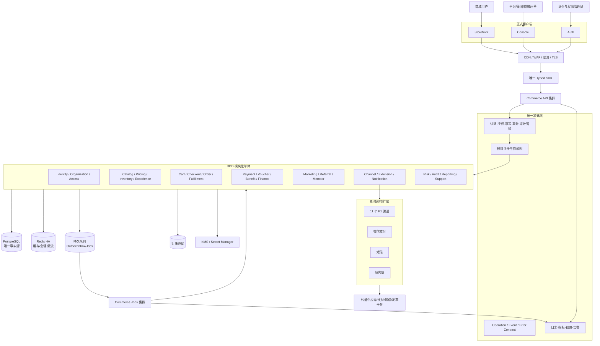
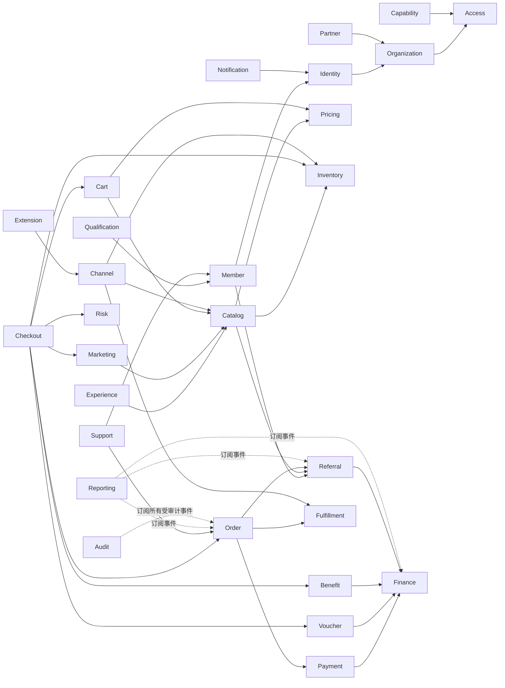
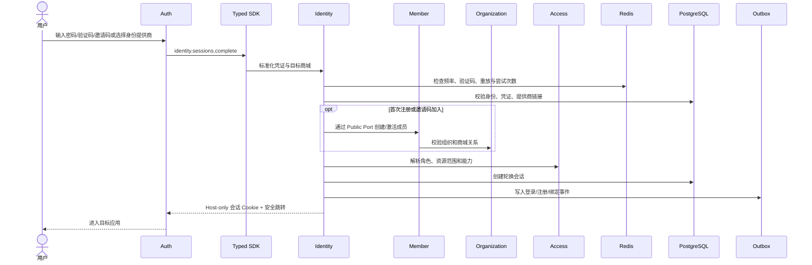
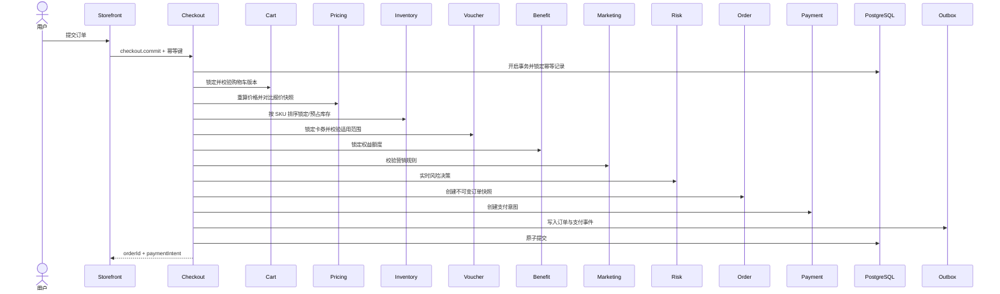
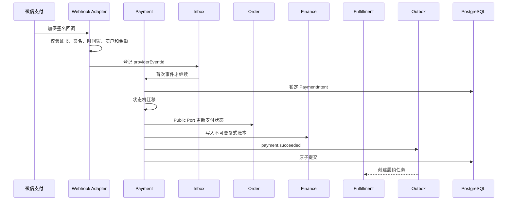
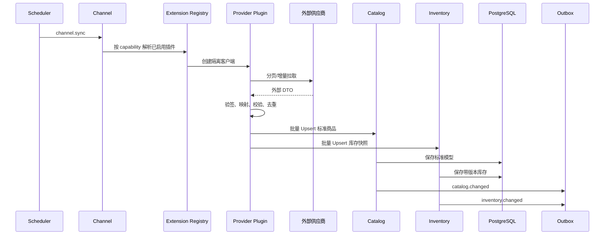
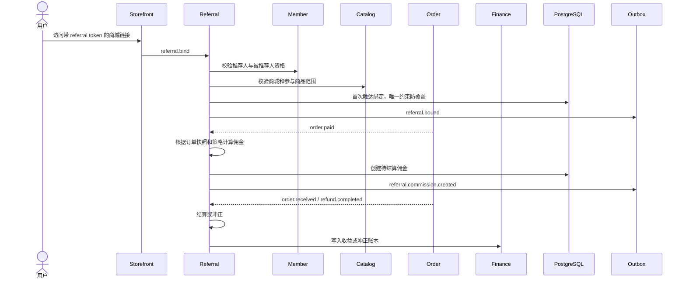
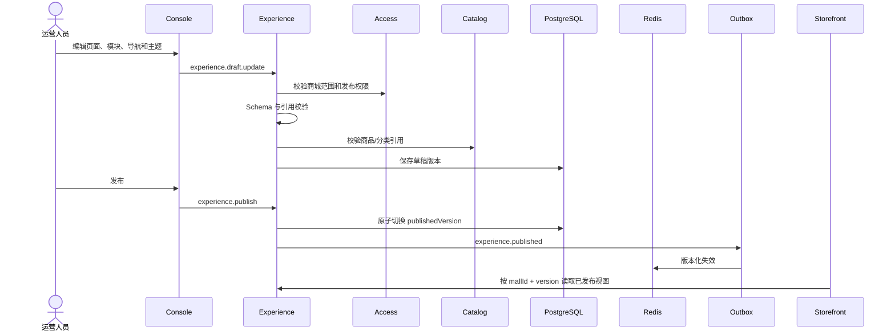
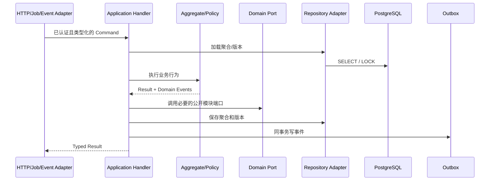

结论先说：这不应做成一次普通 Git 合并，而应做成一次“以 `zhudatuan` 为唯一生产主线、对 `zhudatuan-li` 进行语义级能力迁移、最终硬切换”的融合。

原因是 `zhudatuan-li` 当前提交本身就是 `zhudatuan` 当前提交的祖先；机械合并不会恢复后来被删掉或被简化的 UI、Referral、财务策略等能力。正确做法是逐项迁回需要保留的 UI、交互、业务语义和数据，再彻底删除兼容服务、双契约、双数据库、Mock、Showcase 和重复实现。

本次仅做了只读分析，没有修改任何代码或仓库文件。

---

# 一、审计后的关键结论

## 1. 主线选择

唯一生产根目录：

```text
/Users/changshengwang/Workspace/zhudatuan
```

`zhudatuan-li` 只作为迁移来源和视觉/业务参考，完成迁移后不再承担任何构建、运行、发布或数据职责。

最终不允许存在：

- 两个 API 服务。
- 两套 Contract/SDK。
- 两个认证应用。
- 两个商城应用。
- 两套数据库迁移历史。
- 新旧路由并存。
- 请求失败后自动调用旧接口。
- 双写、双读、影子生产流量。
- Legacy、Compatibility、Fallback、V1/V2 并存。
- Mock 数据进入生产路径。
- Showcase、Demo、设备壳进入正式路由。
- 两套权限、菜单、供应商注册表或配置中心。

## 2. Git 事实

`zhudatuan-li` 的 `01f1ed49...` 是主线当前提交的祖先，因此：

```text
zhudatuan-li ───────▶ zhudatuan 当前主线
```

融合本质是“恢复被主线后续变更遗漏的能力”，不是把两条独立分支拼起来。

当前主线工作区还有约：

- 998 个删除项。
- 711 个修改项。
- 342 个未跟踪项。
- 合计约 2051 个状态项。

因此真正实施前，第一道门禁不是写代码，而是固定当前工作成果：创建可恢复快照、确认哪些改动属于用户、生成文件处置清单。禁止使用 `git reset --hard`、批量 checkout 或覆盖式复制。

## 3. 工作簿存在严重基线漂移

当前工作簿 `MVP上线功能清单` 已经是 `A1:F24`，有效需求为 `A3:F24`，共 22 项；但主线生成配置仍按旧版 `A3:F23`、21 项处理。

当前工作簿 SHA-256：

```text
929adc27d86deca640af17329cd9413b4e8dd5b850f1c596de98f1d1272d7750
```

而主线配置仍记录旧哈希。这会产生两个直接错误：

1. 新增的“用户注册、登录（密码、验证码、邀请码）”没有进入正式 MVP 追踪。
2. 原来的接口优先级说明仍被错误映射成旧的第 23 项。

这不是文档小问题，而是发布范围、测试生成、证据收集和上线门禁全部错位。

工作簿基线：

:codex-file-citation{path="/Users/changshengwang/Workspace/zhudatuan/docs/福利商城功能清单.xlsx" purpose="source" artifact_kind="workbook" sheet="MVP上线功能清单" range="A1:F24"}

接口优先级基线：

:codex-file-citation{path="/Users/changshengwang/Workspace/zhudatuan/docs/福利商城功能清单.xlsx" purpose="source" artifact_kind="workbook" sheet="接口" range="A1:K21"}

相关主线配置可见：

- [requirements.yml](/Users/changshengwang/Workspace/zhudatuan/config/requirements.yml)
- [authorities.yml](/Users/changshengwang/Workspace/zhudatuan/config/authorities.yml)

## 4. 主线已经具备的基础

主线不是推倒重来。它已经具备比较完整的目标骨架：

- 三个正式前端：Auth、Console、Storefront。
- 一个 Commerce 服务。
- 一套 Operation Contract 和 SDK。
- 一套数据库迁移历史。
- 28 个业务模块。
- 239 个正式操作契约。
- 79 个领域事件。
- 导航、权限、容量、缓存、可观测性等集中配置。
- 11 个优先级 1 的供应商/渠道扩展。
- Outbox、Inbox、幂等、审计、任务和可观测基础设施。
- 边界、命名、重复逻辑、调用、事务、性能等质量检查。

主模块清单见 [modules.ts](/Users/changshengwang/Workspace/zhudatuan/services/commerce/src/app/modules.ts)。

因此理想方案是：

> 保留主线基础设施和规范，补回 `zhudatuan-li` 被遗漏的 UI、Referral、财务操作、部分身份与收货业务语义，随后删除全部重复和兼容实现。

## 5. 主线目前真正遗漏的业务

对两套操作契约逐项比对后，`zhudatuan-li` 中有 29 个操作未直接出现在主线：

### 必须恢复的 Referral 操作，共 15 个

- 推荐设置查询、管理。
- 推荐商品查询、管理。
- 推荐会员查询、申请、审批、取消资格。
- 首次触达绑定查询、创建。
- 佣金查询。
- 收益查询。
- 推荐链接查询。
- 提现查询、创建。

Referral 不是 Marketing 的一个小函数。它拥有独立的资格、绑定、佣金、收益、结算、撤销和提现生命周期，应作为第 29 个正式限界上下文。

### 必须恢复的财务操作，共 9 个

- 对账修复查询、预演、提交、审批、撤销。
- 财务策略预演、查询。
- 财务审计查询。
- 发票操作员档案查询。

这些能力的后端语义和 `zhudatuan-li` Console UI 都应迁回主线 Finance 模块。

### 需要语义迁移、但不保留旧操作名的身份能力

- `identity.members.create`
- `identity.members.reset`
- `identity.wechat.session`
- `identity.wechat.bind`

主线已有更明确的邀请、注册、成员加入、密码重置、身份提供商和联合身份绑定能力。应以新模型覆盖旧用户旅程，不保留旧接口别名。

### 必须补回的事件语义

- 会员重置事件。
- 订单确认收货事件 `order.received` 或含义完全等价的新正式事件。

---

# 二、需求权威与冲突裁决

最终权威顺序必须固定为：

1. 当前工作簿内容与哈希。
2. 用户明确要求：保留 `zhudatuan-li` UI/UX 和全部业务能力。
3. `zhudatuan` 的单主线架构和工程规范。
4. `zhudatuan-li` 的实现，仅作为迁移来源。
5. 旧文档、旧截图、旧生成文件只能作为证据，不能反向覆盖当前工作簿。

## 22 项 MVP 的稳定标识

禁止继续使用 `MVP01`、`MVP23` 这类绑定 Excel 行号的身份。Excel 新增一行就会造成整体错位。应使用稳定语义 ID：

| 稳定 ID               | 工作簿能力                       | 发布策略                | 主要模块                           |
| --------------------- | -------------------------------- | ----------------------- | ---------------------------------- |
| `MVPPLATFORM`         | 平台层                           | 保留，当前非 MVP 阻断项 | Capability、Organization、Access   |
| `MVPDISTRIBUTION`     | 分销层                           | 保留，当前非 MVP 阻断项 | Partner、Organization、Referral    |
| `MVPGROUPDASHBOARD`   | 集团仪表盘                       | MVP                     | Reporting                          |
| `MVPGROUPAPPLICATION` | 集团应用中心                     | MVP                     | Capability、Extension              |
| `MVPGROUPPOOL`        | 集团商品池                       | MVP                     | Catalog、Pricing、Inventory        |
| `MVPGROUPORDER`       | 集团订单                         | MVP                     | Order、Fulfillment、Payment        |
| `MVPGROUPVOUCHER`     | 集团卡券                         | MVP                     | Voucher、Benefit                   |
| `MVPGROUPFINANCE`     | 集团财务                         | 功能保留，当前非阻断项  | Finance                            |
| `MVPGROUPREPORT`      | 集团报表                         | MVP                     | Reporting                          |
| `MVPGROUPSUPPORT`     | 集团客服                         | MVP                     | Support、Notification              |
| `MVPGROUPSETTING`     | 集团设置                         | MVP                     | Organization、Access、Member、Risk |
| `MVPMALLDASHBOARD`    | 商城仪表盘                       | MVP                     | Reporting                          |
| `MVPMALLDESIGN`       | 商城装修                         | MVP                     | Experience                         |
| `MVPMALLPOOL`         | 商城商品池                       | MVP                     | Catalog、Pricing、Inventory        |
| `MVPMALLORDER`        | 商城订单                         | MVP                     | Order、Fulfillment、Payment        |
| `MVPMALLVOUCHER`      | 商城卡券                         | MVP                     | Voucher、Benefit                   |
| `MVPMALLFINANCE`      | 商城财务                         | 功能保留，当前非阻断项  | Finance                            |
| `MVPMALLREPORT`       | 商城报表                         | MVP                     | Reporting                          |
| `MVPMALLSUPPORT`      | 商城客服                         | MVP                     | Support、Notification              |
| `MVPMALLSETTING`      | 商城设置                         | MVP                     | Experience、Access、Member         |
| `MVPIDENTITY`         | 注册、登录、密码、验证码、邀请码 | MVP                     | Identity、Member                   |
| `MVPPROVIDER`         | 优先级 1 接口接入                | MVP                     | Channel、Extension                 |

“忽略”只能解释成“不作为本次 MVP 上线阻断项”，不能解释成删除功能。否则会与“保留 `zhudatuan-li` 业务功能”的要求冲突。

当前还有三个必须形成产品验收定义、不能靠开发猜测的词项：

- “粉类”的准确业务定义。
- 卡券中心“客户/商品”的具体维度与入口。
- 集团风险设置的范围、策略对象和审批权限。

实施时可以并行开发其他能力，但这三项在签字前不能标记为 Released。

---

# 三、目标系统架构



## 架构选择

采用 DDD 模块化单体，而不是立刻拆微服务：

- 订单、库存、卡券、权益、支付具有大量强一致事务。
- 单体内通过公共端口调用，可以共享事务上下文，又不破坏模块边界。
- Outbox/Inbox 保留未来拆服务所需的异步契约。
- 模块具有独立所有权、接口、事件、数据和测试，可以按容量热点逐个拆出。
- 当前规模下，模块化单体比微服务更快、更可靠、更易维护。

---

# 四、模块依赖关系



图中箭头代表依赖公共端口或事件，不代表可以直接访问对方 Repository、数据库表或内部对象。

硬规则：

- 不允许循环依赖。
- 不允许跨模块 SQL。
- 不允许跨模块导入 `domain`、`infrastructure`。
- 不允许模块 A 取得模块 B 的 Entity 后继续深层调用。
- 强一致场景调用目标模块的 Public Write Port。
- 异步副作用使用领域事件和 Outbox。
- 跨模块查询优先使用 Public Read Port 或 Reporting 投影。
- 任何模块都不能依赖具体供应商实现。

---

# 五、模块间关键调用时序

## 1. 密码、验证码、邀请码与联合身份登录



要求：

- 密码、验证码、邀请码是同一个正式登录流程的不同策略。
- 微信身份通过标准 Provider/Link 模型接入。
- 不保留 `wechat.session` 和 `wechat.bind` 兼容接口。
- 邀请码只能在指定商城、组织、成员类型和有效期内使用。
- 回调跳转目标必须白名单化。

## 2. 下单强一致事务



统一锁顺序：

```text
Idempotency
→ CheckoutQuote
→ Cart
→ Inventory（按 SKU 稳定排序）
→ Voucher
→ Benefit
→ Marketing
→ Order
→ PaymentIntent
→ Audit / Outbox
```

任何代码不得自行发明另一套锁顺序。

## 3. 支付回调、入账与履约



未知支付状态不得推断为成功或失败，必须进入主动查询与人工复核流程。

## 4. 供应商商品和库存同步



每个 Provider 必须有独立：

- Manifest。
- Config Schema。
- Capability 声明。
- Client。
- Mapper。
- 健康检查。
- Webhook 验证器。
- 限流、重试、熔断、Bulkhead。
- Contract/Mapping/Failure 测试。

## 5. 推荐关系与佣金



推荐归因只能由服务端确定；浏览器参数只是一条待验证线索，不能直接成为财务事实。

## 6. 商城装修发布



发布采用不可变版本，不得在生产请求中读取半完成草稿。

---

# 六、逐模块内部数据流

所有模块统一遵循两条内部管线：



查询统一为：

```text
HTTP/Job Adapter
→ Query Handler
→ 模块自有 Repository 或 Reporting Projection
→ Scope Filter
→ DTO Mapper
→ Typed Result
```

各模块的具体内部流如下：

| 模块          | 自有聚合/数据                                           | 内部命令流                                                   | 关键不变量与事件                                                             |
| ------------- | ------------------------------------------------------- | ------------------------------------------------------------ | ---------------------------------------------------------------------------- |
| Identity      | Identity、Credential、Session、Invitation、ProviderLink | 凭证标准化 → 限流 → 验证策略 → 会话轮换 → Outbox             | 同一外部身份唯一绑定；会话不可复用；发出 registered、loggedin、linked、reset |
| Organization  | Organization、Mall、Department、DirectoryBinding        | 校验层级 → 校验父子范围 → 更新目录版本 → 投影                | 禁止组织环；商城必须有唯一所属关系                                           |
| Access        | Role、Grant、Scope、Ownership、Override                 | Subject → Role → Resource Scope → Capability → Explicit Deny | 默认拒绝；所有越权均记录审计                                                 |
| Capability    | Application、Entitlement、FeatureSwitch                 | 解析租户订阅 → 环境开关 → 依赖能力 → 可用能力集              | 开关不能绕过权限；发出 capability.changed                                    |
| Partner       | Distributor、Supplier、Agreement                        | 资质校验 → 协议状态机 → 商城/渠道绑定                        | 无生效协议不得交易                                                           |
| Member        | Member、Profile、Membership                             | 身份解析 → 成员类型 → 组织关系 → 状态迁移                    | 同一作用域成员唯一；敏感字段加密                                             |
| Qualification | Rule、Submission、Decision                              | 规则快照 → 材料校验 → 审批 → 有效期                          | 审批决定不可原地篡改，只能新版本                                             |
| Catalog       | Product、Sku、Category、Pool                            | 外部映射 → 标准化 → 规则校验 → 版本保存                      | SKU 唯一；发布商品必须有有效分类                                             |
| Pricing       | PriceBook、PriceRule、Quote                             | 匹配范围 → 规则排序 → 金额计算 → 报价快照                    | 金额使用定点数；规则冲突必须显式拒绝                                         |
| Inventory     | StockItem、Reservation                                  | 读取版本 → 排序加锁 → 预占/释放/扣减                         | 可售量不得为负；重复释放幂等                                                 |
| Experience    | Site、Page、Block、Theme、Release                       | 草稿编辑 → Schema 校验 → 引用校验 → 发布版本                 | 已发布版本不可变；草稿不能进入商城                                           |
| Marketing     | Campaign、Promotion、Rule                               | 候选活动 → 规格匹配 → 优先级/互斥 → 优惠结果                 | 优惠计算确定性；订单保留规则快照                                             |
| Cart          | Cart、CartItem                                          | 加载购物车 → 校验商品 → 合并条目 → 版本保存                  | 每个用户/商城唯一活动购物车                                                  |
| Checkout      | CheckoutQuote、Commit                                   | 构建报价 → 校验版本 → 强一致编排 → 提交结果                  | 相同幂等键必须得到同一订单结果                                               |
| Order         | Order、OrderLine、StatusHistory                         | 创建快照 → 状态机 → 售后/取消/收货                           | 金额、商品、收件信息均为下单快照                                             |
| Fulfillment   | Fulfillment、Shipment、Delivery                         | 路由策略 → 创建履约 → 外部单号 → 发货/签收                   | 一个订单行的履约数量不得超订购量                                             |
| Verification  | VerificationCode、Redemption                            | 签发 → 加密存储 → 尝试次数 → 核销                            | 一次性凭证只成功一次；防暴力尝试                                             |
| Payment       | PaymentIntent、Payment、Refund                          | 创建意图 → 回调去重 → 状态机 → 退款                          | 币种、金额、商户必须一致                                                     |
| Voucher       | VoucherBatch、Voucher、Redemption                       | 批量生成 → 分配 → 锁定 → 使用/撤销                           | 卡号/密文唯一；状态迁移不可逆跳跃                                            |
| Benefit       | BenefitAccount、Grant、Consumption                      | 额度授予 → 有效期 → 锁定 → 消耗/返还                         | 可用额度不为负；返还关联原消费                                               |
| Finance       | Ledger、Entry、Settlement、Invoice、RepairCase          | 业务凭证 → 分录模板 → 借贷校验 → 结算/开票/修复审批          | 借贷永远平衡；修复只能追加冲正分录                                           |
| Channel       | ChannelAccount、SyncCursor、ExternalOrder               | 解析插件 → 外部调用 → 标准映射 → 游标提交                    | 游标只在成功持久化后推进                                                     |
| Support       | Case、Conversation、Assignment、Sla                     | 建单 → 路由 → 会话 → 升级/关闭                               | SLA 计时可审计；关闭需解决结论                                               |
| Notification  | Template、Message、Delivery                             | 模板渲染 → 渠道策略 → 发送 → 回执                            | 同一业务通知按幂等键去重                                                     |
| Reporting     | Projection、Metric、Export                              | 消费事件 → Checkpoint → 投影 → 查询/导出                     | 记录数据水位和新鲜度，不伪装实时                                             |
| Risk          | Policy、Decision、Review                                | 特征提取 → 策略组合 → 决策 → 人审                            | 高风险默认失败关闭；决策带策略版本                                           |
| Audit         | AuditRecord、Archive                                    | 请求上下文 → 变更摘要 → 哈希链 → 归档                        | 只追加；不能被业务用户修改或删除                                             |
| Extension     | ExtensionManifest、Installation、Health                 | Manifest 校验 → 配置校验 → 启用 → 健康探测                   | 能力、版本、配置缺失时拒绝启动                                               |
| Referral      | ReferralPolicy、Member、Binding、Commission、Withdrawal | 资格 → 首触绑定 → 订单归因 → 佣金 → 结算/冲正/提现           | 首触不可覆盖；退款必须等额冲正                                               |
| Navigation    | NavigationTree、RouteRequirement                        | 读取唯一菜单配置 → 能力过滤 → 权限过滤 → 路由输出            | 菜单不是权限来源，只是权限后的视图                                           |

Runtime 与 Observability 不作为空业务模块存在，而是 Foundation：

- Runtime：启动、生命周期、健康、配置、连接池、任务执行器。
- Observability：日志、指标、Tracing、告警和审计关联 ID。

---

# 七、目标代码目录

以下是建议的最终结构。生产目录使用简洁、全小写、无连接符名称；TypeScript 类型和类文件使用 PascalCase。脚本、配置、SQL、测试文件可按约定例外处理。

```text
zhudatuan/
├── apps/
│   ├── auth/
│   │   └── src/
│   │       ├── app/
│   │       ├── feature/
│   │       ├── entity/
│   │       ├── shared/
│   │       └── main.tsx
│   ├── console/
│   │   └── src/
│   │       ├── app/
│   │       ├── shell/
│   │       ├── route/
│   │       ├── feature/
│   │       │   ├── access/
│   │       │   ├── application/
│   │       │   ├── channel/
│   │       │   ├── cockpit/
│   │       │   ├── experience/
│   │       │   ├── finance/
│   │       │   ├── member/
│   │       │   ├── order/
│   │       │   ├── product/
│   │       │   ├── referral/
│   │       │   ├── reporting/
│   │       │   ├── support/
│   │       │   └── voucher/
│   │       ├── entity/
│   │       ├── shared/
│   │       └── main.tsx
│   └── storefront/
│       └── src/
│           ├── app/
│           ├── shell/
│           ├── route/
│           ├── feature/
│           │   ├── account/
│           │   ├── cart/
│           │   ├── catalog/
│           │   ├── checkout/
│           │   ├── home/
│           │   ├── order/
│           │   ├── product/
│           │   ├── referral/
│           │   └── voucher/
│           ├── entity/
│           ├── shared/
│           └── main.tsx
├── services/
│   └── commerce/
│       └── src/
│           ├── entry/
│           │   ├── ApiMain.ts
│           │   └── JobsMain.ts
│           ├── bootstrap/
│           ├── foundation/
│           │   ├── auth/
│           │   ├── cache/
│           │   ├── clock/
│           │   ├── config/
│           │   ├── database/
│           │   ├── event/
│           │   ├── idempotency/
│           │   ├── lock/
│           │   ├── request/
│           │   ├── secret/
│           │   ├── telemetry/
│           │   └── transaction/
│           ├── adapter/
│           │   ├── http/
│           │   ├── job/
│           │   └── event/
│           ├── modules/
│           │   ├── identity/
│           │   ├── organization/
│           │   ├── access/
│           │   ├── capability/
│           │   ├── partner/
│           │   ├── member/
│           │   ├── qualification/
│           │   ├── catalog/
│           │   ├── pricing/
│           │   ├── inventory/
│           │   ├── experience/
│           │   ├── marketing/
│           │   ├── cart/
│           │   ├── checkout/
│           │   ├── order/
│           │   ├── fulfillment/
│           │   ├── verification/
│           │   ├── payment/
│           │   ├── voucher/
│           │   ├── benefit/
│           │   ├── finance/
│           │   ├── channel/
│           │   ├── support/
│           │   ├── notification/
│           │   ├── reporting/
│           │   ├── risk/
│           │   ├── audit/
│           │   ├── extension/
│           │   ├── referral/
│           │   └── navigation/
│           └── app/
│               ├── ModuleCatalog.ts
│               ├── OperationCatalog.ts
│               └── JobCatalog.ts
├── packages/
│   ├── authz/
│   ├── config/
│   ├── contract/
│   ├── design/
│   ├── kernel/
│   ├── sdk/
│   ├── telemetry/
│   └── testing/
├── extensions/
│   ├── channel/
│   │   ├── core/
│   │   ├── jdcore/
│   │   ├── jdproduct/
│   │   ├── jdfresh/
│   │   ├── tmall/
│   │   ├── supplier/
│   │   ├── cake/
│   │   ├── flower/
│   │   ├── book/
│   │   ├── charge/
│   │   ├── foodvoucher/
│   │   ├── movie/
│   │   └── meal/
│   ├── payment/
│   │   └── wechat/
│   └── notification/
│       ├── sms/
│       └── inapp/
├── database/
│   ├── migrations/
│   ├── contracts/
│   └── tools/
├── config/
│   ├── artifacts.json
│   ├── authorities.yml
│   ├── requirements.yml
│   ├── navigation.yml
│   ├── visuals.yml
│   ├── capacity.yml
│   ├── cache.yml
│   ├── telemetry.yml
│   ├── identityproviders.yml
│   └── naming.yml
├── infrastructure/
│   ├── backup/
│   ├── cloud/
│   ├── container/
│   ├── monitoring/
│   ├── network/
│   └── security/
├── tests/
│   ├── contract/
│   ├── component/
│   ├── integration/
│   ├── journey/
│   ├── visual/
│   ├── security/
│   ├── performance/
│   └── recovery/
├── tools/
│   ├── contractgen/
│   ├── requirementgen/
│   ├── navigationgen/
│   ├── quality/
│   └── seed/
└── docs/
    ├── architecture/
    ├── decisions/
    ├── operations/
    ├── requirements/
    ├── security/
    └── evidence/
```

## 每个后端模块的固定内部结构

```text
modules/referral/
├── public/
│   ├── ReferralReadPort.ts
│   └── ReferralWritePort.ts
├── domain/
│   ├── model/
│   ├── value/
│   ├── policy/
│   ├── event/
│   ├── repository/
│   └── error/
├── application/
│   ├── command/
│   ├── query/
│   ├── handler/
│   ├── dto/
│   ├── port/
│   ├── process/
│   └── job/
├── infrastructure/
│   ├── persistence/
│   └── integration/
├── interface/
│   ├── http/
│   ├── job/
│   └── event/
├── ReferralManifest.ts
└── ReferralModule.ts
```

命名禁止：

- `utils/`
- `helpers/`
- `common/`
- `misc/`
- `new/`
- `old/`
- `legacy/`
- `compatibility/`
- `v2/`
- `temp/`
- 无具体含义的 `Manager`、`Processor`、`Service`。

只有确实表达业务角色时才使用 `Service`，例如无自然聚合归属的领域服务。

---

# 八、DDD、SOLID、迪米特法则与设计模式落实

## DDD

- 每个模块拥有自己的聚合、Repository 接口、数据表、事件和错误。
- 跨模块只依赖 `public`。
- 聚合负责维护状态和不变量，Handler 只负责编排。
- 金额、身份、作用域、版本、外部 ID、幂等键等建成 Value Object。
- 订单、支付、库存、卡券、佣金必须使用显式状态机。
- 报表是事件驱动投影，不从多个业务表任意联表。

## SOLID

- 单一职责：一个 Handler 对应一个 Operation。
- 开闭原则：新增供应商通过 Manifest 和 Port 注册，不修改 Channel 核心流程。
- 里氏替换：任何 Provider 实现必须通过同一 Contract Suite。
- 接口隔离：拆分 Read Port、Write Port、Health Port、Webhook Port。
- 依赖倒置：领域和应用层依赖接口，数据库、Redis、HTTP、供应商只是 Adapter。

## 迪米特法则

错误示例：

```text
Order → Customer → Organization → Policy → Provider
```

正确示例：

```text
Order → AccessReadPort.can(...)
Order → ChannelWritePort.fulfill(...)
```

模块只知道直接协作者及其最窄接口，不能遍历别的模块对象树。

## 设计模式

| 场景                       | 模式                        |
| -------------------------- | --------------------------- |
| 供应商、支付、短信实现     | Strategy + Adapter          |
| 扩展加载                   | Factory + Manifest Registry |
| 数据访问                   | Repository                  |
| 跨聚合原子事务             | Unit of Work                |
| 资质、范围、活动匹配       | Specification               |
| 订单、支付、卡券、佣金     | State Machine               |
| 异步跨模块流程             | Process Manager             |
| 事件分发                   | Observer + Outbox           |
| 请求认证、授权、幂等、审计 | Decorator/Pipeline          |
| 外部模型隔离               | Anticorruption Layer        |
| 价格、佣金、账务创建       | Domain Factory              |
| 多供应商隔离               | Circuit Breaker + Bulkhead  |

---

# 九、UI/UX 保留方案

`zhudatuan-li` 的视觉批准清单见 [owner-approved-ui.json](/Users/changshengwang/Workspace/zhudatuan-li/config/owner-approved-ui.json)。

主线当前 Storefront 已经变成较简化的数据型页面，不能认为满足“保留 UI/UX”。理想迁移方法不是复制整个旧应用，而是：

1. 以 `zhudatuan-li` 的页面布局、主题、组件、状态和交互为视觉基准。
2. 将页面组件迁入当前 `apps/storefront`、`apps/console`、`apps/auth`。
3. 保留主线的 Router、Manifest、Typed SDK、认证、权限和数据协议。
4. 把旧 UI 内直接请求、Mock Service 和兼容 API 替换成 Feature API Adapter。
5. 视觉迁移完成后删除旧应用目录，不保留第二份 UI。

## 必须保留的视觉和交互

### Storefront

- 顶部导航、搜索、分类、主题和品牌资产。
- 首页区块、商品卡、商品详情、规格选择。
- 购物车、金额汇总、空状态、失效商品状态。
- 报价和结算确认。
- 待支付、支付结果、订单详情。
- Footer、Modal、Toast。
- Desktop、Tablet、Mobile、小程序视觉布局。

旧线中的 Tablet/Mobile/小程序部分原本属于 Showcase/Mock。应保留其实际 UI 设计，但必须改造成真实数据驱动的生产响应式组件；Showcase 路由、设备边框、工具条和 Mock 服务不保留。

### Console

- 运营驾驶舱。
- 应用中心。
- 商品池、订单、卡券、报表。
- 财务策略编辑、策略预演、对账修复审批。
- 客服会话、工单、分配和 SLA。
- 会员邀请、重置、组织和权限设置。
- Referral 管理、资格、商品、佣金、收益和提现。
- 数据表格的筛选、列配置、分页、批量操作。
- Dialog、Drawer、Tabs、表单校验、快捷键和焦点行为。

### Auth

- 密码登录。
- 验证码登录。
- 邀请码注册。
- 身份提供商登录与绑定。
- 成员身份选择。
- 回调、失败、过期、限流和重新发送状态。

## 视觉权威

新增唯一 `config/visuals.yml`，记录：

- route。
- viewport。
- theme。
- locale。
- seed 场景。
- baseline 名称。
- 动态区域 mask。
- 允许误差。
- 交互状态。
- 无障碍要求。

它替代旧的文件哈希式 UI 权威。源文件重构后哈希必然变化，视觉、交互和可访问性才是需要保留的契约。

建议基线：

- Desktop：1920×1080、1440×900、1366×768。
- Tablet：1024×768、768×1024。
- Mobile：390×844、375×812、360×800。
- Light/Dark 如果产品均支持。
- 正常、加载、空、错误、拒绝、过期、部分失败。
- Hover、Focus、Selected、Disabled、Submitting、Success。
- 键盘完整操作和屏幕阅读器标签。

---

# 十、文件与代码去留

| 分类     | 内容                                                                          | 处理                           |
| -------- | ----------------------------------------------------------------------------- | ------------------------------ |
| 直接复用 | 主线 Commerce 基础设施、请求管线、Outbox/Inbox、审计、配置、SDK、现有 28 模块 | 保留并补齐                     |
| 直接复用 | 主线 Auth 新邀请/注册/联合身份模型                                            | 作为身份唯一实现               |
| 直接复用 | 主线 11 个 P1 Provider 扩展                                                   | 完善 Contract Suite            |
| 迁移     | 旧 Storefront 的已批准 UI、组件、主题和交互                                   | 迁入当前 Storefront            |
| 迁移     | 旧 Console 财务、客服、会员、Referral 等丰富 UI                               | 迁入当前 Console               |
| 迁移     | 旧 Referral 领域语义、规则、归因、佣金、提现                                  | 重建为正式 Referral 模块       |
| 迁移     | 旧财务策略、对账修复、操作员档案                                              | 合并到 Finance                 |
| 语义替换 | 旧成员创建、重置、微信登录/绑定操作                                           | 由主线正式 Identity 操作覆盖   |
| 删除     | `services/commerce-api` 兼容 BFF                                              | 能力迁完后删除                 |
| 删除     | `database/storefront-compatibility`                                           | 数据迁完后删除                 |
| 删除     | 重复 Contract、Design、Authz 包                                               | 全部指向主线唯一包             |
| 删除     | `extensions/vendors` 第二注册体系                                             | 协议代码迁入唯一扩展体系后删除 |
| 删除     | `auth-web`、`storefront-web` 旧应用路径                                       | UI 迁完后删除                  |
| 删除     | Mock、Showcase、Demo、设备壳、兼容 Cookie/Route                               | 不进入正式树                   |
| 保留     | 历史数据库迁移、财务凭证、支付回执、审计、发布证据                            | 永不当作“旧代码”删除           |

不得直接批量复制 `zhudatuan-li`。每个来源文件都必须在迁移台账中标记：

```text
Reuse
Refactor
Replace
Delete
EvidenceOnly
```

每项同时记录：

- 来源路径。
- 目标路径。
- 业务能力。
- 数据所有者。
- 依赖。
- 对应操作。
- 对应测试。
- 对应 MVP。
- 删除前置条件。

---

# 十一、数据一致性和数据库融合

## 唯一事实源

最终只有：

```text
PostgreSQL canonical schema
+ database/migrations 唯一前向迁移历史
```

禁止：

- 新旧库双写。
- 兼容 View 长期存在。
- 运行期查询旧库。
- 同一业务数据存在两个 owner。
- 从外部供应商响应直接生成财务事实。
- 手工更新账本余额。
- 删除历史迁移后重新编号。

## 数据迁移方式

兼容库的数据只能通过一次性、离线、可核对迁移进入主库：

```text
冻结旧写入
→ 导出带哈希快照
→ 字段和主键映射
→ 分批导入暂存表
→ 行数/金额/状态/外键核对
→ 写入正式模块表
→ 业务级重算
→ 生成差异报告
→ 签字
→ 硬切正式服务
→ 删除一次性导入工具和兼容库
```

一次性迁移工具不进入生产运行时；签字和恢复窗口结束后删除。

## 一致性机制

- 所有命令强制幂等键。
- 聚合采用 `version` 乐观锁。
- 库存、卡券、权益、订单提交采用稳定悲观锁顺序。
- Outbox 与业务数据同事务写入。
- Inbox 以 `source + eventId` 唯一去重。
- 消费者必须可安全重试。
- 财务采用不可变复式分录。
- 修复采用预演、审批、追加冲正，禁止直接修改历史。
- 订单保存商品、价格、优惠、收件、供应商和规则快照。
- Reporting 保存 checkpoint 和 freshness watermark。
- 缓存键包含租户、商城、资源版本和配置版本。
- 缓存只加速读取，不能成为订单、库存或财务事实源。

---

# 十二、扩展即插即用

扩展 Manifest 至少包含：

```ts
interface ExtensionManifest {
  id: string;
  kind: 'channel' | 'payment' | 'notification';
  version: string;
  capabilities: readonly string[];
  configSchema: Schema;
  factory: ExtensionFactory;
  health: HealthProbe;
}
```

新增供应商时，只新增扩展包和配置，不修改：

- Channel 核心。
- Checkout。
- Order。
- Catalog。
- App Router。
- Contract 生成器。
- 其他供应商代码。

接口表中优先级 1 的 11 类必须全部通过上线门禁：

1. 京东。
2. 京东生鲜。
3. 天猫超市。
4. 自有供应商。
5. 蛋糕。
6. 鲜花。
7. 图书。
8. 虚拟卡券/直充。
9. 虚拟食品提货券。
10. 电影。
11. 在线点餐。

每个扩展必须验证：

- 配置 Schema。
- 凭证和密钥来源。
- 超时。
- 限流。
- 重试退避。
- 熔断。
- 并发隔离。
- 分页和增量游标。
- Webhook 验签。
- 重放保护。
- DTO 映射。
- 错误分类。
- 健康检查。
- 沙箱 Contract Suite。
- 生产最小闭环 Journey。

---

# 十三、安全设计

## 身份与会话

- Host-only、Secure、HttpOnly、SameSite Cookie。
- 登录和敏感操作强制 CSRF 防护。
- 会话轮换，旧 Refresh Token 立即失效。
- 验证码只存摘要，限制次数、时间窗、IP、设备和主体。
- 邀请码绑定组织、商城、成员类型、有效期和使用次数。
- 密码使用经过审查的内存困难哈希。
- 重置、绑定、解绑、提现、退款、权限转移要求 Step-up。
- 回调地址使用精确白名单。

## 授权

```text
Identity
→ Tenant
→ Organization
→ Mall
→ Role
→ Resource Scope
→ Capability
→ Explicit Policy
```

- 前端隐藏按钮不等于授权。
- 所有命令在服务端重新验证 Scope。
- 数据库查询必须显式附加资源范围。
- 平台 Owner 转移、财务修复、退款、提现采用多人审批或 Action Proof。
- 菜单配置不能创造权限。

## 数据与供应链

- PII 字段加密或 Token 化。
- 日志默认脱敏。
- Secrets 只引用 Secret Manager/KMS。
- Webhook 强制签名、证书、时间窗和事件去重。
- 文件上传校验扩展名、MIME、大小、病毒和存储路径。
- 出站请求防 SSRF。
- CSP、依赖锁、SBOM、漏洞扫描、构建来源证明。
- 审计日志只追加并建立哈希关联。
- 生产数据库不得由应用账户执行 DDL。

---

# 十四、性能、并发和高可用

主线现有容量目标应继续作为最低基线：

- 1000 个商城。
- 1000 万会员。
- 500 万商品。
- 2000 万 SKU。
- API 峰值 5000 QPS。
- 下单 300 TPS。
- 支付回调 600 TPS。
- 单批卡券 100 万张。
- 可用性 99.95%。

## 性能原则

- 列表统一 Keyset Pagination。
- 精确查询建立覆盖索引。
- 高频商品详情和装修视图使用版本化缓存。
- 报表走投影表，不扫交易主表。
- 批量导入按固定块大小并有限并发。
- 外部供应商按 Provider 设置 Semaphore，不允许无界 `Promise.all`。
- 相同订单、SKU、卡券、会员、佣金 Key 的写入保持串行。
- 无关联的健康检查、报表分片、对象上传可以受控并发。
- 大表 Schema 变更使用低锁迁移和回填检查点。
- 前端按路由拆包、表格虚拟化、搜索防抖、图片尺寸固定。
- 禁止 N+1、全量导出入内存、同步等待通知或报表刷新。

## 高可用

- API 至少 3 实例、跨可用区。
- Jobs 至少 2 实例，通过租约/队列保证单任务语义。
- PostgreSQL 主库、同步备用、读副本。
- Redis 高可用，缓存丢失不影响交易正确性。
- 队列持久化，重复投递由 Inbox 吸收。
- 对象存储开启版本和生命周期。
- RPO ≤ 5 分钟，RTO ≤ 30 分钟。
- 备份必须定期恢复演练，而不只是检查备份文件存在。

降级规则：

- 商品同步失败：继续展示最后一个有效版本，同时显示新鲜度。
- 报表延迟：显示水位，不伪装实时。
- Redis 故障：回源数据库并限流。
- 支付状态未知：查询支付平台，不猜测。
- 库存、支付、优惠无法确认：下单失败关闭。
- 通知失败：交易成功，通知重试。
- 审计、财务、幂等基础能力失败：对应写操作不得继续。

---

# 十五、实施顺序

## 阶段 0：保护现状

交付：

- 当前工作区安全快照。
- 用户修改归属清单。
- 两套仓库提交、文件、工作簿、生成物哈希。
- 文件处置台账。
- 禁止覆盖和删除的路径名单。

门禁：

- 任一未归属改动都不得被批量覆盖。
- 确认没有把用户修改误判为旧线垃圾。

## 阶段 1：修正需求权威

交付：

- 工作簿哈希更新为当前值。
- 范围更新为 `A1:F24`。
- 22 个稳定语义 ID。
- MVP、路由、Operation、测试、Evidence 的生成关系。
- 三个歧义项的产品定义。

门禁：

- 生成器二次执行零差异。
- 工作簿变化未重新生成时 CI 必须失败。
- 不允许手工维护第二份需求源。

## 阶段 2：建立 UI 视觉契约

交付：

- `visuals.yml`。
- 三个应用的页面/状态/交互清单。
- LI 基准截图和交互录像。
- 响应式、键盘、无障碍验收矩阵。

门禁：

- UI 迁移前先固定基线。
- Mock/Showcase 不得被登记为生产路由。

## 阶段 3：冻结目标 Contract

交付：

- 现有主线契约。
- Referral 15 项。
- Finance 9 项。
- 身份语义映射。
- `order.received`。
- 完整 Request/Response/Error/Event Schema。
- 自动生成 SDK 和操作注册表。

门禁：

- 前端不得依赖未注册操作。
- 后端不得存在无契约入口。
- 不允许旧别名和兼容路由。

## 阶段 4：数据库和数据所有权

交付：

- Referral 正式 Schema。
- 财务修复、策略、操作员档案 Schema。
- 数据 owner 目录。
- 前向迁移、升级测试、全新安装测试。
- 一次性数据迁移和核对报告。

门禁：

- 无跨模块写表。
- 无孤儿外键。
- 账务借贷平衡。
- 新旧数据总量、金额和状态核对一致。

## 阶段 5：后端能力迁移

顺序：

1. Identity 语义补齐。
2. Finance 缺失操作。
3. Referral 新模块。
4. Order 收货和退款联动。
5. Provider 能力验证。
6. Reporting、Audit、Notification 投影与订阅。

门禁：

- 单元、组件、集成、契约测试通过。
- 模块依赖图无环。
- 重复逻辑扫描通过。
- 所有跨模块调用都经过 Public Port 或 Event。

## 阶段 6：前端融合

顺序：

1. Design Token、公共组件和应用 Shell。
2. Storefront UI。
3. Auth UI。
4. Console 基础页面。
5. Finance、Support、Member、Referral 等丰富页面。
6. Mobile/Tablet/小程序布局接入真实数据。
7. 删除所有 Mock 和 Showcase。

门禁：

- Typed SDK 是唯一网络入口。
- 视觉回归通过。
- 键盘和屏幕阅读器通过。
- 无旧接口、旧 Cookie、旧 Route、静态假数据。

## 阶段 7：供应商与非功能验收

交付：

- 11 个 P1 Provider Contract Suite。
- 沙箱/生产健康检查。
- 压测、安全测试、恢复演练。
- SLO 和告警规则。

门禁：

- 5000 QPS、300 下单 TPS、600 回调 TPS 基线通过。
- 无高危漏洞。
- Provider 故障不会拖垮核心线程池。

## 阶段 8：硬切换

顺序：

```text
停止旧写入
→ 最终数据快照
→ 执行正式迁移
→ 全量核对
→ 部署唯一 Commerce 和三个客户端
→ 运行 22 条 MVP 冒烟
→ 运行 11 条 Provider 冒烟
→ 开放流量
→ 观察 SLO
→ 删除旧运行时与兼容资产
```

不设置新旧服务按用户分流，不长期保留回退路由。回退只能是维护窗口内恢复整个应用和数据库快照。

## 阶段 9：彻底清理

只有在签署 Evidence 后才删除：

- 兼容 BFF。
- 兼容数据库。
- 重复应用。
- 重复 Contract/SDK/Design/Authz。
- 第二扩展注册表。
- Mock、Showcase、Demo。
- 一次性导入工具。
- 旧构建和部署配置。

删除后重新运行全仓搜索，确保以下词不再出现在生产路径：

```text
legacy
compat
compatibility
fallback
mock
showcase
demo
oldapi
v1
```

测试夹具和历史决策文档中的解释性文本可例外，但必须明确不参与运行。

---

# 十六、最终验收标准

系统只有同时满足以下条件才算融合完成：

## 功能

- 22/22 当前 MVP 条目状态为 `Released`。
- 11/11 优先级 1 Provider 完成真实闭环。
- `zhudatuan-li` 的 Referral、财务策略、对账修复、客服、邀请、重置等能力全部有正式替代。
- 没有旧线独有且未处置的 Operation、Event、Route、Job 或数据表。

## UI/UX

- Storefront、Console、Auth 与 LI 基准视觉一致。
- 核心交互、状态、快捷键、响应式和无障碍一致。
- UI 使用真实 Contract 和 SDK。
- 主线当前简化页面不能作为最终验收基准。

## 架构

- 一个 Commerce 服务。
- 一个 Contract。
- 一个 SDK。
- 一套迁移历史。
- 一个权限模型。
- 一个导航来源。
- 一个扩展注册表。
- 29 个业务限界上下文加 Navigation 支持模块。
- 模块依赖无环、无跨模块 Repository/SQL。

## 数据

- 强一致事务和锁顺序测试通过。
- Outbox/Inbox 重试与重复投递测试通过。
- 财务借贷平衡。
- 库存、卡券、权益不出现负数或重复消费。
- 订单、支付、退款、推荐佣金全部可审计。
- 备份恢复演练通过。

## 工程质量

- 命名、边界、重复逻辑、调用、事务、性能检查全部通过。
- Fresh Database 与 Upgrade Database 都能成功。
- Contract/SDK/Docs/DB Registry 生成后零差异。
- 无未使用依赖、无循环依赖、无生产 TODO。
- 无手工复制的重复配置。
- SBOM、漏洞扫描、许可证和构建来源证明通过。

## 证据

每一个稳定 MVP ID 必须绑定：

- 对应 Operation。
- 对应 Route。
- 自动化 Journey。
- 截图或录像。
- 日志和 Trace ID。
- 数据库断言。
- 负责人。
- 构建 SHA。
- 工作簿 SHA。
- 签署时间。

当前主线的 21 项旧 Evidence 索引不能直接沿用，必须按新 22 项基线重新生成和签署。

---

# 最终目标状态

```text
zhudatuan
├── 保留 LI 的产品外观、交互与业务价值
├── 保留主线的正式架构、契约、数据和工程能力
├── 补回 Referral、财务和身份/订单遗漏语义
├── 严格对应当前 22 项 MVP 与 11 个 P1 接口
├── 只存在一个运行时、一套数据、一套配置和一套契约
└── 不存在兼容层、辅助生产路径、Mock、Showcase 或重复实现
```

已有的 [整体架构优化方案.md](/Users/changshengwang/Workspace/zhudatuan/docs/architecture/整体架构优化方案.md) 可以继续作为技术背景，但其中“21 项 MVP、A1:F23、工作区干净”等信息已经过期，应以本方案核对出的当前工作簿、Git 状态和能力差异为准。
