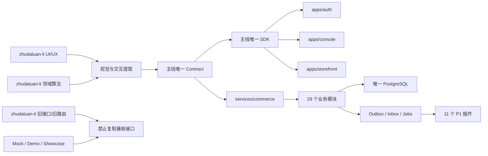
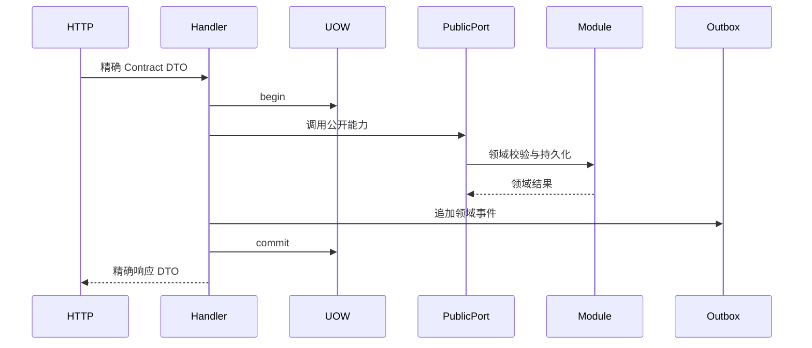

结论：不能把 `zhudatuan-li` 当作第二套工程整体合并，也不能执行机械 Git merge。正确方案是以 [完整MVP架构方案.md](/Users/changshengwang/Workspace/zhudatuan/docs/architecture/完整MVP架构方案.md) 为唯一架构基准，以 `zhudatuan` 为唯一运行主线，只提取 `zhudatuan-li` 中仍有价值的 UI/UX、领域算法和缺失业务，再按主线现有契约、模块、数据库和前端边界重构接入。

本次只做了只读审计和修改点设计，没有修改任何代码，也没有运行会改变仓库状态的命令。

---

# 一、必须先修正的四个基线偏差

## 1. MVP 不是当前配置里的 21 项，而是 22 项

Excel 中 `MVP上线功能清单!A3:F24` 一共是 22 条有效需求，现有配置仍使用 21 条、`A3:F23` 和 `MVP03...MVP23` 行号型 ID，已经与权威工作簿不一致。`:codex-file-citation{path="/Users/changshengwang/Workspace/zhudatuan/docs/福利商城功能清单.xlsx" purpose="source" artifact_kind="workbook" sheet="MVP上线功能清单" range="A1:F24"}`

必须改为稳定语义 ID：

| Excel 行 | 稳定 ID               | 业务含义                   | 发布口径                 |
| -------: | --------------------- | -------------------------- | ------------------------ |
|        3 | `MVPPLATFORM`         | 平台基础                   | MVP                      |
|        4 | `MVPDISTRIBUTION`     | 分销                       | 原表忽略，不阻塞发布     |
|        5 | `MVPGROUPDASHBOARD`   | 集团工作台                 | MVP                      |
|        6 | `MVPGROUPAPPLICATION` | 集团应用管理               | MVP                      |
|        7 | `MVPGROUPPOOL`        | 集团商品池                 | MVP                      |
|        8 | `MVPGROUPORDER`       | 集团订单                   | MVP                      |
|        9 | `MVPGROUPVOUCHER`     | 集团卡券                   | MVP                      |
|       10 | `MVPGROUPFINANCE`     | 集团财务                   | 原表忽略，不作为独立缺口 |
|       11 | `MVPGROUPREPORT`      | 集团报表                   | MVP                      |
|       12 | `MVPGROUPSUPPORT`     | 集团客服                   | MVP                      |
|       13 | `MVPGROUPSETTING`     | 集团设置                   | MVP                      |
|       14 | `MVPMALLDASHBOARD`    | 商城工作台                 | MVP                      |
|       15 | `MVPMALLDESIGN`       | 商城设计                   | MVP                      |
|       16 | `MVPMALLPOOL`         | 商城商品池                 | MVP                      |
|       17 | `MVPMALLORDER`        | 商城订单                   | MVP                      |
|       18 | `MVPMALLVOUCHER`      | 商城卡券                   | MVP                      |
|       19 | `MVPMALLFINANCE`      | 商城财务                   | 原表忽略，不作为独立缺口 |
|       20 | `MVPMALLREPORT`       | 商城报表                   | MVP                      |
|       21 | `MVPMALLSUPPORT`      | 商城客服                   | MVP                      |
|       22 | `MVPMALLSETTING`      | 商城设置                   | MVP                      |
|       23 | `MVPIDENTITY`         | 注册、密码、验证码、邀请码 | MVP                      |
|       24 | `MVPPROVIDER`         | P1 接口优先接入            | MVP                      |

必须保留三类待业务确认项，并通过配置化 `clarifications` 管理，而不是写死在生成器里：

- 卡券需求中“客户管理、产品档案”的范围。
- 集团侧风控能力的精确定义。
- 商城报表中“粉类”的业务定义。
- 分销行虽然内容空白，但因为原表明确忽略，只记录为非阻塞澄清项。

## 2. P1 渠道接口必须正好是 11 个

P1 权威范围是：京东、京东生鲜、天猫超市、自有供应商、蛋糕、鲜花、图书、直充、食品券、电影票、餐饮，共 11 个；P3/P4 不得进入 MVP 发布阻塞范围。`:codex-file-citation{path="/Users/changshengwang/Workspace/zhudatuan/docs/福利商城功能清单.xlsx" purpose="source" artifact_kind="workbook" sheet="接口" range="A1:K21"}`

## 3. 目标是 29 个业务模块，加 1 个支撑模块

当前主线是 28 个业务模块；融合后新增 `Referral`，变成：

- 29 个业务模块。
- `Navigation` 仍是支撑模块，不计入业务模块数量。
- `Runtime`、`Observability` 保持在基础设施层，不得作为空业务模块占位。

## 4. 当前工作区非常脏

审计时观察到约 2051 条 Git 状态变更，包括删除、修改和未跟踪文件。真正实施前必须先保存：

- 当前 commit、branch、merge-base。
- `git status --porcelain=v1` 完整快照。
- 需求工作簿 SHA-256。
- 架构文档 SHA-256。
- 生成物清单。
- 已存在用户修改的文件归属。

不得通过 `reset --hard`、整目录覆盖或机械合并消除这些变更。

---

# 二、最终工程形态

```text
zhudatuan/
├── apps/
│   ├── auth/
│   ├── console/
│   └── storefront/
├── services/
│   └── commerce/
│       └── src/
│           ├── app/
│           ├── bootstrap/
│           ├── foundation/
│           └── modules/
├── packages/
│   ├── authz/
│   ├── cache/
│   ├── config/
│   ├── contract/
│   ├── design/
│   ├── errors/
│   ├── observability/
│   └── sdk/
├── extensions/
│   └── channel/
├── config/
├── database/
│   ├── contracts/
│   ├── migrations/
│   └── seed/
├── infrastructure/
├── scripts/
├── tests/
├── tools/
└── docs/
```

融合关系必须固定为：



---

# 三、修改实施顺序

实施顺序不能随意调整：

1. 工作区和权威输入冻结。
2. 需求 ID、配置权威、生成器修正。
3. Contract、SDK、权限、错误和事件调整。
4. 模块注册、事务和跨模块端口基础设施。
5. Referral、Finance、Identity、Order 后端能力。
6. 数据库前向迁移。
7. Console/Auth/Storefront UI/UX 融合。
8. 11 个 P1 插件重构。
9. 安全、性能、可观测性、灾备。
10. 全量生成、测试、发布证据和删除旧项。

如果先移 UI、后补契约，会产生第二套 API；如果先复制 LI 数据库，会引入跨模块外键和兼容表；如果先删除旧 UI，会丢失视觉基线。

---

# 四、需求权威与生成器修改点

## 4.1 `config/requirements.yml`

修改 [requirements.yml](/Users/changshengwang/Workspace/zhudatuan/config/requirements.yml)：

- `version: 2` 改为 `version: 3`。
- 删除 `MVP03...MVP23`。
- 写入上述 22 个语义 ID。
- 每条同时保存：
  - `id`
  - `title`
  - `source.sheet`
  - `source.row`
  - `source.range`
  - `status`
  - `release`
  - `modules`
  - `operations`
  - `journeys`
  - `providers`
  - `clarifications`
- 第 23 行必须属于 `MVPIDENTITY`，不能再被当成渠道接口。
- 第 24 行必须属于 `MVPPROVIDER`。
- `clarifications` 不允许固定为 3 条；数量由配置决定。
- 行号只能作为来源定位，不能成为需求身份。

## 4.2 `config/authorities.yml`

修改 [authorities.yml](/Users/changshengwang/Workspace/zhudatuan/config/authorities.yml)：

- 工作簿范围从 `A1:F23` 改为 `A1:F24`。
- `mvp: 21` 改为 `mvp: 22`。
- 更新当前工作簿 SHA-256。
- 增加架构文档 SHA-256。
- 增加 `config/visuals.yml` 权威声明。
- 发布审计必须同时检查文件哈希、Sheet、范围和需求数。

## 4.3 `config/artifacts.json`

修改 [artifacts.json](/Users/changshengwang/Workspace/zhudatuan/config/artifacts.json)：

权威输入应包括：

- `docs/福利商城功能清单.xlsx`
- `docs/architecture/完整MVP架构方案.md`
- `config/requirements.yml`
- `config/visuals.yml`
- `config/navigation.yml`
- `config/capacity.yml`
- `config/cache.yml`
- `config/telemetry.yml`
- `config/naming.yml`
- Contract 五类定义文件

生成物应包括：

- RequirementCatalog
- NavigationCatalog
- PermissionCatalog
- Operations
- Schemas
- SDK
- OpenAPI
- 数据库 Contract
- 前端覆盖清单
- 发布证据

任何文件只能属于“权威输入”或“生成物”之一，禁止双重维护。

## 4.4 Requirement 生成器

修改：

- [RequirementSource.ts](/Users/changshengwang/Workspace/zhudatuan/tools/requirementgen/src/RequirementSource.ts)
- [RequirementGenerator.ts](/Users/changshengwang/Workspace/zhudatuan/tools/requirementgen/src/RequirementGenerator.ts)
- [RequirementTrace.ts](/Users/changshengwang/Workspace/zhudatuan/tools/requirementgen/src/RequirementTrace.ts)
- [FrontendTrace.ts](/Users/changshengwang/Workspace/zhudatuan/tools/requirementgen/src/FrontendTrace.ts)

具体修改：

- 删除 `MVP${number}` 类型约束。
- 删除 `mvp.length !== 21`。
- 删除“ID 必须等于行号”的验证。
- 删除 `row === 23` 即渠道的判断。
- 读取范围改为 `A3:F24`。
- 按 `MVPPROVIDER` 识别接口需求。
- Journey 文件名来自语义 ID 或显式 `journey` 字段。
- 允许一个澄清项关联多个需求。
- 检测 ID、源行和输出文件的唯一性。
- 检测 22/22 覆盖，不以数组顺序推断业务含义。
- 重新生成 `packages/contract/src/RequirementCatalog.ts`。
- 将导航、Operations、测试和发布证据中的数字 ID 全部替换为语义 ID。

---

# 五、Contract、SDK 和权限修改点

## 5.1 Operations

修改 [operations.yml](/Users/changshengwang/Workspace/zhudatuan/packages/contract/definitions/operations.yml)。

### 新增 Referral 15 个正式操作

```text
referral.settings.read
referral.settings.manage
referral.products.read
referral.products.manage
referral.members.read
referral.members.apply
referral.members.approve
referral.members.disqualify
referral.bindings.read
referral.bindings.create
referral.commissions.read
referral.earnings.read
referral.links.read
referral.withdrawals.read
referral.withdrawals.create
```

### 新增 Finance 7 个正式操作

```text
finance.policies.read
finance.policies.preview
finance.reconciliationrepairs.read
finance.reconciliationrepairs.preview
finance.reconciliationrepairs.submit
finance.reconciliationrepairs.decide
finance.reconciliationrepairs.reverse
```

### 新增 Order 操作

```text
order.orders.receive
```

要求：

- `expectedVersion` 必填。
- `Idempotency-Key` 必填。
- 只有已发货/已送达状态可以确认收货。
- 重复确认返回相同结果，不重复发事件。
- 成功后发布 `order.received`。

### 新增 Checkout 一致性查询

```text
checkout.context.read
```

一次返回：

- 购物车版本。
- 商品和价格快照。
- 地址。
- 可用卡券。
- 可用福利。
- 发票配置。
- 库存和资格判断结果。
- 结算上下文版本。

Storefront 不得再自行并发拼接多个不同时刻的读结果。

### 不得恢复的 LI 旧操作

以下旧名字不能作为兼容别名重新加入：

```text
identity.members.create
identity.members.reset
identity.wechat.session
identity.wechat.bind
invoice.operatorprofiles.read
finance.audit.read
```

语义映射必须使用主线现有能力：

- 注册/邀请：`identity.invitations.*`、`identity.enrollments.*`。
- 密码重置：当前 Password Reset/Member Manage 操作。
- 微信：`identity.federations.*`、`identity.links.*`。
- 开票主体：`invoice.profiles.read`。
- 财务审计：`audit.records.read`，增加资源和 Owner 过滤条件。

按当前 239 个操作计算，明确新增 15+7+1+1 后，目标应为 263 个操作；最终数字必须由生成器根据定义文件计算，禁止另设手工常量。

## 5.2 Schema

当前 [schema/index.ts](/Users/changshengwang/Workspace/zhudatuan/packages/contract/src/schema/index.ts) 只为部分操作提供精确 Schema，其余存在通用 JSON 回退。必须删除回退。

目标结构：

```text
packages/contract/src/schema/
├── AccessSchema.ts
├── BenefitSchema.ts
├── CartSchema.ts
├── CatalogSchema.ts
├── CheckoutSchema.ts
├── FinanceSchema.ts
├── IdentitySchema.ts
├── OrderSchema.ts
├── ReferralSchema.ts
├── SupportSchema.ts
├── VoucherSchema.ts
└── SchemaCatalog.ts
```

修改要求：

- 每个操作必须有精确的 Body、Query、Path、Output Schema。
- 无请求体也必须显式声明 Empty Schema。
- 金额使用整数最小货币单位或精确 Decimal 字符串，禁止浮点数。
- 时间统一 ISO-8601 UTC。
- ID 使用品牌类型。
- 版本、幂等键、游标、权限 Scope 都必须进入契约。
- Contract Generator 发现任何缺失 Schema 时直接失败。
- 生成文件只允许生成器修改。

## 5.3 Events

修改 [events.yml](/Users/changshengwang/Workspace/zhudatuan/packages/contract/definitions/events.yml)：

必须增加：

```text
identity.member.reset
order.received
referral.setting.changed
referral.product.changed
referral.member.applied
referral.member.approved
referral.member.disqualified
referral.binding.created
referral.commission.created
referral.commission.settled
referral.commission.reversed
referral.withdrawal.requested
referral.withdrawal.paid
referral.withdrawal.failed
```

每个事件必须有：

- `eventId`
- `eventType`
- `occurredAt`
- `aggregateId`
- `aggregateVersion`
- `scopeId`
- `actorId`
- `correlationId`
- `causationId`
- `payloadVersion`
- 精确 Payload Schema

## 5.4 Permissions

修改 [permissions.yml](/Users/changshengwang/Workspace/zhudatuan/packages/contract/definitions/permissions.yml)：

增加 Referral 权限：

```text
referral.setting.read
referral.setting.manage
referral.product.read
referral.product.manage
referral.member.read
referral.member.apply
referral.member.decide
referral.binding.read
referral.binding.create
referral.commission.read
referral.earning.readself
referral.withdrawal.readself
referral.withdrawal.create
```

增加 Finance/Order 权限：

```text
finance.policy.read
finance.policy.preview
finance.repair.read
finance.repair.preview
finance.repair.submit
finance.repair.decide
finance.repair.reverse
order.receive
```

高风险操作必须启用：

- Step-up Authentication。
- Action Proof。
- Maker-checker。
- Scope 校验。
- 审计记录。
- 幂等性。
- 乐观锁。

[PermissionCatalog.ts](/Users/changshengwang/Workspace/zhudatuan/packages/authz/src/PermissionCatalog.ts) 只能重新生成，不能手改。

## 5.5 Errors

修改 [errors.yml](/Users/changshengwang/Workspace/zhudatuan/packages/contract/definitions/errors.yml)，增加明确错误：

```text
REFERRAL_NOT_ELIGIBLE
REFERRAL_ALREADY_BOUND
REFERRAL_INVALID_TOKEN
REFERRAL_RATE_INVALID
REFERRAL_PRODUCT_DISABLED
REFERRAL_WITHDRAWAL_TOO_SMALL
REFERRAL_WITHDRAWAL_CONFLICT
FINANCE_POLICY_INVALID
FINANCE_REPAIR_CONFLICT
FINANCE_REPAIR_ALREADY_DECIDED
FINANCE_REPAIR_HASH_MISMATCH
ORDER_RECEIPT_STATE_INVALID
VERSION_CONFLICT
IDEMPOTENCY_CONFLICT
```

禁止把上述业务错误映射成通用 `Error` 或 HTTP 500。

---

# 六、模块内核和跨模块调用修改点

修改：

- [modules.ts](/Users/changshengwang/Workspace/zhudatuan/services/commerce/src/app/modules.ts)
- [jobs.ts](/Users/changshengwang/Workspace/zhudatuan/services/commerce/src/app/jobs.ts)
- 当前 Module Registry、Public Port Registry 和 Manifest 实现

具体要求：

1. 注册 `ReferralModule`。
2. 业务模块数量断言从 28 改为 29。
3. `Navigation` 单独作为支撑模块注册。
4. 删除空的：
   - `services/commerce/src/modules/runtime`
   - `services/commerce/src/modules/observability`
5. 每个模块只能暴露 `public` 目录中的 Port。
6. 禁止其他模块导入其：
   - `domain`
   - `application`
   - `infrastructure`
   - `interface`
7. 禁止跨模块 Repository 和跨 Schema SQL。
8. 同步调用走 Public Port。
9. 异步调用走 Outbox/Event。
10. 多模块写操作使用统一 `TransactionContext`/`UnitOfWork`，不得暴露底层数据库客户端。
11. 固定锁顺序，至少统一为：
    - scope
    - cart/order
    - inventory reservation
    - voucher/benefit
    - finance ledger
    - outbox

跨模块调用必须收敛为：



---

# 七、Referral 模块完整修改点

不能直接复制 LI 的巨型 `ReferralOperations.ts`。可复用的是算法和行为，不是其跨模块 SQL 和单文件操作表。

可复用来源：

- [ReferralCommissionPolicy.ts](/Users/changshengwang/Workspace/zhudatuan-li/services/commerce/src/modules/referral/domain/policy/ReferralCommissionPolicy.ts)
- [ProcessReferralEvent.ts](/Users/changshengwang/Workspace/zhudatuan-li/services/commerce/src/modules/referral/application/command/ProcessReferralEvent.ts)
- [SettleReferralCommissions.ts](/Users/changshengwang/Workspace/zhudatuan-li/services/commerce/src/modules/referral/application/command/SettleReferralCommissions.ts)
- [ReferralEventJob.ts](/Users/changshengwang/Workspace/zhudatuan-li/services/commerce/src/modules/referral/interface/job/ReferralEventJob.ts)

目标目录：

```text
services/commerce/src/modules/referral/
├── Manifest.ts
├── ReferralModule.ts
├── public/
│   ├── ReferralReadPort.ts
│   ├── ReferralWritePort.ts
│   └── index.ts
├── domain/
│   ├── model/
│   │   ├── ReferralSetting.ts
│   │   ├── ReferralProduct.ts
│   │   ├── ReferralMember.ts
│   │   ├── ReferralBinding.ts
│   │   ├── Commission.ts
│   │   └── Withdrawal.ts
│   ├── value/
│   │   ├── ReferralRate.ts
│   │   ├── ReferralToken.ts
│   │   └── ReferralMoney.ts
│   ├── policy/
│   │   ├── AttributionPolicy.ts
│   │   ├── CommissionPolicy.ts
│   │   ├── SettlementPolicy.ts
│   │   └── WithdrawalPolicy.ts
│   ├── repository/
│   │   ├── ReferralRepository.ts
│   │   ├── CommissionRepository.ts
│   │   └── WithdrawalRepository.ts
│   └── event/
│       └── ReferralEvents.ts
├── application/
│   ├── handler/
│   │   ├── SettingsReadHandler.ts
│   │   ├── SettingsManageHandler.ts
│   │   ├── ProductsReadHandler.ts
│   │   ├── ProductsManageHandler.ts
│   │   ├── MembersReadHandler.ts
│   │   ├── MembersApplyHandler.ts
│   │   ├── MembersApproveHandler.ts
│   │   ├── MembersDisqualifyHandler.ts
│   │   ├── BindingsReadHandler.ts
│   │   ├── BindingsCreateHandler.ts
│   │   ├── CommissionsReadHandler.ts
│   │   ├── EarningsReadHandler.ts
│   │   ├── LinksReadHandler.ts
│   │   ├── WithdrawalsReadHandler.ts
│   │   └── WithdrawalsCreateHandler.ts
│   ├── command/
│   │   ├── ProcessOrderEvent.ts
│   │   ├── SettleCommissions.ts
│   │   └── ReverseCommissions.ts
│   └── port/
│       ├── MemberReader.ts
│       ├── CatalogReader.ts
│       ├── FinancePoster.ts
│       ├── Clock.ts
│       └── Identifier.ts
├── infrastructure/
│   └── persistence/
│       ├── PgReferralRepository.ts
│       ├── PgCommissionRepository.ts
│       └── PgWithdrawalRepository.ts
└── interface/
    ├── http/
    │   └── ReferralRoutes.ts
    ├── event/
    │   ├── OrderPaidSubscriber.ts
    │   ├── OrderReceivedSubscriber.ts
    │   └── RefundCompletedSubscriber.ts
    └── job/
        ├── ReferralEventJob.ts
        └── ReferralSettlementJob.ts
```

领域约束：

- 首次有效归因；`scopeId + customerId` 只能产生一个生效绑定。
- 已建立绑定不可被后续链接覆盖。
- 邀请 Token 必须签名、限时、限 Scope、可撤销。
- 佣金金额使用整数最小货币单位。
- 比例采用 basis point，不用浮点数。
- 多受益人分摊必须精确处理尾差。
- 退款按累计已退金额计算，不得重复冲销。
- 佣金和冲销使用确定性业务键。
- 提现申请不可原地覆盖，状态变更追加 Movement。
- 财务入账只能调用 `FinancePoster`，不能写 `finance.*` 表。
- 产品验证只能调用 `CatalogReader`。
- 会员验证只能调用 `MemberReader`。
- Referral 自有表只保存外部 ID 和必要快照，不建立跨模块外键。

任务注册：

- `referralevent`：消费订单、退款事件并创建/冲销佣金。
- `referralsettlement`：结算到期佣金和提现。
- 同一 Scope/Order 串行。
- 不同 Scope 可受控并发。
- 重试依赖 Inbox 幂等。
- Dead-letter 必须带事件 ID、Scope、重试次数和最后错误码。

---

# 八、Finance、Identity、Order 修改点

## 8.1 Finance

修改现有：

- [FinanceRoutes.ts](/Users/changshengwang/Workspace/zhudatuan/services/commerce/src/modules/finance/interface/http/FinanceRoutes.ts)
- [PgFinanceRepository.ts](/Users/changshengwang/Workspace/zhudatuan/services/commerce/src/modules/finance/infrastructure/persistence/PgFinanceRepository.ts)
- [FinanceLifecycleOperations.ts](/Users/changshengwang/Workspace/zhudatuan/services/commerce/src/modules/finance/FinanceLifecycleOperations.ts)
- [FinanceModule.ts](/Users/changshengwang/Workspace/zhudatuan/services/commerce/src/modules/finance/FinanceModule.ts)

新增：

```text
domain/model/FinancePolicy.ts
domain/model/RepairCase.ts
domain/policy/PolicyPreview.ts
domain/policy/RepairPolicy.ts
domain/repository/PolicyRepository.ts
domain/repository/RepairRepository.ts
application/handler/PoliciesReadHandler.ts
application/handler/PoliciesPreviewHandler.ts
application/handler/RepairsReadHandler.ts
application/handler/RepairsPreviewHandler.ts
application/handler/RepairsSubmitHandler.ts
application/handler/RepairsDecideHandler.ts
application/handler/RepairsReverseHandler.ts
infrastructure/persistence/PgPolicyRepository.ts
infrastructure/persistence/PgRepairRepository.ts
```

要求：

- 将 `FinanceRoutes.ts` 中直接 SQL 下沉到 Repository。
- 删除对 `organization.*` 的直接 Join。
- 组织范围通过 `OrganizationReadPort` 或已验证的 Scope Snapshot 提供。
- Repair Preview 生成不可变 `previewHash`。
- Submit 必须绑定源对账记录版本和 Preview Hash。
- Decide 要求 Maker 与 Checker 不同。
- Reverse 只能追加反向分录，不能删除或修改原分录。
- Audit 使用现有 `audit.records.read`，通过过滤参数读取，不增加 `finance.audit.read`。
- `invoice.operatorprofiles.read` 映射到现有 `invoice.profiles.read`。

## 8.2 Identity

保留主线现有邀请、注册、联合身份、链接和密码重置模型。

修改点：

- 密码重置成功后追加 `identity.member.reset`。
- LI 的会员注册邀请 UI 调用当前 `identity.invitations.*` 和 `identity.enrollments.*`。
- LI 的微信 Session/Bind 语义迁移到 Federation/Link。
- 不创建旧路由，不创建兼容 Adapter。
- 身份事件中不得包含密码、验证码原文或完整 Token。
- 验证码只保存强哈希，必须有 TTL、尝试次数和 Scope。

## 8.3 Order

新增：

```text
domain/policy/ReceiptPolicy.ts
application/handler/OrdersReceiveHandler.ts
public/OrderReceiptPort.ts
```

修改订单状态机：

- 允许 `shipped/delivered -> received`。
- `cancelled/refunded/closed` 禁止确认。
- 并发确认依赖版本号。
- 成功后同事务写入 `order.received` Outbox。
- Referral 只订阅事件，不读取 Order 表。

---

# 九、29 个业务模块逐模块整改表

| 模块          | 必须修改的代码点                                                                                                                                      |
| ------------- | ----------------------------------------------------------------------------------------------------------------------------------------------------- |
| Access        | 拆分 `AccessOperations.ts`；Ownership、Override、Scope 各自 Handler；公开 `AuthorizationPort`；其他模块不得读 Access 表；保留默认拒绝和权限快照版本。 |
| Audit         | 保持只追加；公开 `AuditWriter`；增加 Owner、Resource、Scope 精确过滤；任何模块不得更新、删除审计记录。                                                |
| Benefit       | 拆分 Operations/Jobs；通过 Member、Finance、Voucher Port 交互；领取、冻结、核销都需要版本和幂等键。                                                   |
| Capability    | 能力启停改为声明式 Manifest；清除散落 Feature Flag；能力与权限分离，不能用前端隐藏代替授权。                                                          |
| Cart          | 删除 Catalog/Member 等跨 Schema SQL；保存商品和价格必要快照；库存只查询不直接扣减；公开 `CartReadPort`。                                              |
| Catalog       | 商品池、商品、Listing 分离 Aggregate；P1 插件只能调用 Catalog Import Port；批量写使用分块事务和确定性 Upsert Key。                                    |
| Channel       | 删除直接写 Catalog/Pricing/Inventory/Finance 的 SQL；拆成同步协调器；所有落库调用相应模块 Public Port。                                               |
| Checkout      | 建立 Process Manager；通过统一 UoW 锁定 Cart、库存、卡券、福利和订单；新增一致性 `checkout.context.read`。                                            |
| Experience    | 继续作为应用/商城设计模块；吸收 LI Application UI 行为，不再新建 Application 业务模块；发布版本不可变。                                               |
| Extension     | 只负责安装、启停、健康和 Manifest；不包含具体供应商协议实现；启停状态必须可审计。                                                                     |
| Finance       | 增加 Policy Preview 和 Repair；Ledger 只追加；Maker-checker；跨组织范围使用 Port。                                                                    |
| Fulfillment   | 发货、收货、取消使用状态机；Provider Ref 唯一；回调通过 Inbox 幂等；不得直接更新 Order。                                                              |
| Identity      | 保留当前邀请/注册/联合身份模型；补 reset 事件；旧 LI API 全部语义映射，不兼容。                                                                       |
| Inventory     | Reservation 为 Aggregate；预占、确认、释放幂等；按 SKU/Scope 固定锁顺序；禁止负库存。                                                                 |
| Marketing     | 促销计算为纯 Policy；输入使用商品、会员和时间快照；不得在计算器里访问数据库。                                                                         |
| Member        | 会员档案和身份凭据分离；Referral 仅通过 Member Reader 查询资格；敏感字段加密和脱敏。                                                                  |
| Notification  | 模板、投递、回执分离；消费事件使用 Inbox；重试与业务事务隔离；避免重复通知。                                                                          |
| Order         | 增加 Receive Handler/Event；订单项使用不可变快照；状态转换集中在 Aggregate。                                                                          |
| Organization  | 公开 Scope/Directory Port；禁止 Finance、Checkout 直接 Join；组织树查询使用闭包表或物化路径。                                                         |
| Partner       | 合作方资质、合同和状态分离；Channel 只能读取已生效伙伴；变更必须审计。                                                                                |
| Payment       | 删除对 Order/Inventory/Voucher 等表的直接写入；支付 Process Manager 调用 Public Port；回调验签、去重。                                                |
| Pricing       | 价格规则和值对象集中；货币精度统一；插件导价只调用 Pricing Port；生效时间区间禁止重叠。                                                               |
| Qualification | 资格判断封装 Policy；返回原因码和版本；Checkout 不直接读资格表。                                                                                      |
| Reporting     | 只消费领域事件建立投影；查询只读自身投影；“粉类”定义未确认前通过 Clarification 阻断对应验收。                                                         |
| Risk          | 规则、决策、证据分离；高风险操作同步决策；集团风控未确认项进入配置化阻塞。                                                                            |
| Support       | 移植 LI 三栏客服工作区；命令仍调用 Contract/SDK；工单、会话、上下文各自有读写模型。                                                                   |
| Verification  | 验证码、Action Proof 和 Step-up 分离；哈希保存、TTL、速率限制、一次性消费。                                                                           |
| Voucher       | 卡券批次、实例、核销分离；核销原子更新；客户管理/产品档案范围未确认前保持明确缺口。                                                                   |
| Referral      | 新增完整领域模块；首次归因、佣金、退款冲销、提现、事件任务和 Console/Storefront 接入。                                                                |

Navigation 单独整改：

- 从 `config/navigation.yml` 生成导航。
- 新增 Referral 菜单。
- Requirement 引用改为语义 ID。
- 菜单显隐只用于体验，不替代后端权限。
- 禁止业务模块直接依赖 Navigation。

---

# 十、数据库修改点

不能复制 LI 的旧 Referral Migration；它包含与旧模块结构绑定的约束和跨边界设计。只能复用字段含义、约束思想和佣金算法。

在当前最新 `20260830143000` 之后增加：

```text
database/migrations/
├── 20260830144000_create_referral_domain.sql
├── 20260830145000_secure_referral_domain.sql
├── 20260830146000_publish_referral_contract.sql
├── 20260830147000_create_finance_repair.sql
├── 20260830148000_publish_finance_repair_contract.sql
├── 20260830149000_publish_order_receipt.sql
├── 20260830150000_hardcut_provider_ids.sql
├── 20260830151000_publish_checkout_context.sql
└── 20260830152000_publish_mvp_authority.sql
```

Referral 自有表：

```text
referral.setting
referral.product
referral.member
referral.binding
referral.commission
referral.commissionmovement
referral.recoverymovement
referral.withdrawalclaim
```

关键约束：

- `binding(scopeid, customerid)` 唯一。
- Token 指纹唯一。
- 佣金业务键唯一。
- Movement 幂等键唯一。
- 金额非负；冲销使用相反方向 Movement。
- 提现状态机用 Check Constraint。
- 所有可变 Aggregate 有 `version`。
- 所有表有 `scopeid`。
- 财务/订单/会员/商品只存 ID，不跨模块建外键。
- 热查询建立覆盖索引。
- 列表全部使用 Keyset Pagination。
- Outbox/Inbox/Job/Audit/Reporting 数据按容量配置决定分区。
- RLS 是纵深防御，不作为唯一授权。

Provider ID 执行一次性硬切：

```text
private       -> supplier
directcharge  -> charge
tmallmarket   -> tmall
```

迁移完成后：

- 旧 ID 不得继续识别。
- 不得保留 Alias。
- 不得双写。
- 不得双读。
- 不得永久保留旧列。
- 数据校验报告通过后删除一次性迁移脚本之外的转换代码。

历史 Migration 不删除、不重写；“抛弃兼容性”不等于破坏已发布迁移链。

---

# 十一、Console UI/UX 融合点

## 11.1 Referral

从 LI 的 [feature/referral](/Users/changshengwang/Workspace/zhudatuan-li/apps/console/src/feature/referral) 提取视觉和交互，迁入：

```text
apps/console/src/feature/referral/
├── Manifest.ts
├── ReferralRoute.tsx
├── ReferralQuery.ts
├── ReferralCommand.ts
├── ReferralSchema.ts
├── SettingsPanel.tsx
├── ProductTable.tsx
├── MemberTable.tsx
├── BindingTable.tsx
├── CommissionTable.tsx
├── WithdrawalTable.tsx
└── Referral.css
```

修改要求：

- Query/Command 改用当前 `@shop/sdk`。
- 权限来自生成的 Permission Catalog。
- 路由来自 Manifest。
- 移除旧 API、旧类型、手写 fetch。
- Apply/Approve/Disqualify、提现动作显示版本冲突。
- 管理操作必须弹 Step-up/Action Proof。
- 保留 LI 页面布局、操作入口、筛选、表格密度和反馈节奏。

## 11.2 Finance

从 LI 的 [feature/finance](/Users/changshengwang/Workspace/zhudatuan-li/apps/console/src/feature/finance) 提取：

- Finance Authority 工作台。
- Policy Editor。
- Workflow Dialog。
- 列设置。
- 筛选、Tab、Drawer、Review 交互。

但必须：

- 合并到当前 `feature/finance`，不能并存第二个 Finance Route。
- Schema 改为生成 Contract Schema 或其前端表单投影。
- Preview、Submit、Decide、Reverse 使用新操作。
- Maker 和 Checker 冲突必须在 UI 和后端同时校验。
- 不复制旧 Router、旧主题和旧权限配置。

## 11.3 Support

从 LI 的 [feature/support](/Users/changshengwang/Workspace/zhudatuan-li/apps/console/src/feature/support) 移植：

- `SupportCaseRail`
- `SupportConversation`
- `SupportContextPanel`
- `SupportPresentation`

保留三栏工作区 UX，但：

- 工单写命令接主线 Support Contract。
- 上下文来自只读投影，不跨模块在前端拼接敏感数据。
- 桌面、平板、小屏分别有稳定布局。
- CSS 合并为单个 `Support.css` 或明确的组件 CSS，删除四套重复响应式规则。

## 11.4 Member/Identity

LI 的邀请和注册重置界面迁移到当前设置模块：

- Invitation UI → `settings/access`。
- Registration Reset UI → `settings/member`。
- 邀请调用当前 Invitations/Enrollments。
- 重置调用当前 Password Reset。
- 不恢复 LI 的 Identity Operations。

## 11.5 CSS 和 Design System

当前 Console 存在大量 Feature/Responsive/Shell/Theme CSS 重叠，必须：

- 颜色、间距、字体、圆角、阴影迁入 `@shop/design` Token。
- 表格、Drawer、Dialog、Tabs、Filter 使用共享 Primitive。
- 业务 CSS 只描述业务布局，不重复基础样式。
- 视觉迁移完成并通过截图基线后再删除重复 CSS。
- `apps/console/src/app/providers.tsx` 重命名为 `Providers.tsx`。
- 不导入 `legacy-admin-theme.css`、Demo Theme 或设计参考运行时代码。

---

# 十二、Storefront UI/UX 融合点

LI 来源是 [apps/storefront-web](/Users/changshengwang/Workspace/zhudatuan-li/apps/storefront-web)，目标只能是主线 `apps/storefront`，不能保留第二个 Storefront App。

目标结构：

```text
apps/storefront/src/
├── app/
│   ├── StorefrontApp.tsx
│   ├── StorefrontProvider.tsx
│   └── StorefrontRouter.tsx
├── shell/
│   ├── StorefrontShell.tsx
│   ├── StorefrontHeader.tsx
│   ├── StorefrontFooter.tsx
│   └── StorefrontNavigation.tsx
├── feature/
│   ├── home/
│   ├── catalog/
│   ├── product/
│   ├── cart/
│   ├── checkout/
│   ├── order/
│   ├── account/
│   └── referral/
├── entity/
│   ├── product/
│   ├── inventory/
│   ├── cart/
│   └── order/
└── shared/
    ├── api/
    └── ui/
```

具体迁移：

- `StorefrontRoot.tsx` → `app/StorefrontApp.tsx`
- `LaptopFrame.tsx` → `shell/StorefrontShell.tsx`
- Header/Footer/Switcher → `shell`
- Laptop/Mobile/Tablet 页面 → 相应业务 `feature/*/ui`
- Modal/Toast → `shared/ui`
- `MallContext.tsx` 拆成 Provider、Feature State 和 Query Hook
- `productionApi.ts` 拆成每个 Feature 的 Gateway
- `canonicalApiClient.ts` → `shared/api/CommerceClient.ts`
- `productionApi.error.ts` → `CommerceError.ts`
- DTO 类型归属相应 Feature/Entity
- `utils/inventory.ts` → `entity/inventory/Availability.ts`
- `frontendData.ts` 按业务拆成 Mapper，随后删除总 Adapter
- `referralAttribution.ts` → `feature/referral/ReferralAttribution.ts`

必须保留的视觉：

- 1366/1440 桌面布局。
- Android 风格首页、搜索、详情、结算、个人中心。
- 小程序风格首页、分类、商品流、详情、购物车、个人中心。
- Tablet 横竖屏首页、分类、详情、结算、订单和账号面板。
- LI 的切换器、导航、反馈、空态和错误态体验。

但这些应作为同一个生产 Storefront 的响应式/渠道呈现，不保留设备展示壳。

明确禁止迁入：

```text
src/config/productionDemoAuth.ts
src/config/showcaseAccess.ts
src/mock/*
src/showcase/*
src/services/mallService.ts
src/services/mallCatalogCart.ts
src/services/mallOrders.ts
app/[device]/*
app/desktop-1920/*
.wrangler/*
```

小程序风格 UI 可以保留；旧 `apps/miniapp` 运行时不进入目标三应用架构，除非未来出现独立且经过权威需求确认的小程序发布目标。

---

# 十三、Auth UI 修改点

主线 Auth 的安全和流程模型优先，LI 只提供视觉参考。

需要：

- 将 LI Login Page 的布局、品牌、错误提示、验证码和邀请码交互融合进当前 Auth 页面。
- 注册、登录、密码、验证码、邀请码全部使用主线 Identity Contract。
- Return Target 必须由服务端签名验证。
- 登录前后 Scope 选择不可由 URL 任意注入。
- 删除 Auth 中通用 `services`、`types` 大桶目录，迁入 `shared/api` 和业务 Entity。
- 不保留旧 Cookie、旧 Token 或旧 Callback 兼容解析。

---

# 十四、11 个 P1 插件修改点

当前 [ProviderFactories.ts](/Users/changshengwang/Workspace/zhudatuan/services/commerce/src/bootstrap/ProviderFactories.ts) 使用中心 Switch 导入所有供应商，不符合即插即用和 OCP。

必须改为：

```text
config/providers.yml
        ↓ generator
packages/contract/src/provider/ProviderCatalog.ts
        ↓ bootstrap
ExtensionRegistry
        ↓
各 Provider Manifest
```

建议结构：

```text
extensions/channel/
├── jdcore/
├── cakecore/
├── wanliancore/
├── tmallcore/
├── bookcore/
├── jdproduct/
├── jdfresh/
├── tmall/
├── supplier/
├── cake/
├── flower/
├── book/
├── charge/
├── foodvoucher/
├── movie/
└── meal/
```

规则：

- Core 包只封装协议、签名、重试、序列化，不注册业务插件。
- 只有 11 个业务 Provider 包提供 Manifest。
- `jdproduct`、`jdfresh` 复用 `jdcore`。
- 蛋糕、鲜花、食品券、餐饮复用 `cakecore`。
- 直充、电影复用 `wanliancore`。
- 新增 Provider 时只增加包、Manifest 和配置；不修改 Commerce 核心 Switch。
- 构建期生成静态注册表，禁止运行时加载任意模块。
- 每个 Provider 必须有：
  - Manifest 测试
  - Contract 测试
  - Mapping 测试
  - Failure 测试
  - Webhook 验签测试
  - 健康检查测试
  - 超时/重试/熔断测试
- P3/P4 Provider 可以保留为未来源码，但不得注册、发布或进入 MVP 证据。

---

# 十五、配置、安全、性能和高可用修改点

## 配置唯一性

| 事项     | 唯一权威                  |
| -------- | ------------------------- |
| MVP      | `config/requirements.yml` |
| 视觉     | `config/visuals.yml`      |
| API      | Contract definitions      |
| 权限     | `permissions.yml`         |
| 导航     | `config/navigation.yml`   |
| 容量     | `config/capacity.yml`     |
| 缓存     | `config/cache.yml`        |
| 可观测性 | `config/telemetry.yml`    |
| 命名     | `config/naming.yml`       |
| Provider | Provider Manifest/Catalog |
| 数据结构 | Forward Migration         |
| 运行环境 | Typed Runtime Config      |

禁止在代码里重复写：

- Provider 列表。
- MVP 数量。
- 模块数量以外的业务常量。
- Permission Code。
- Operation ID。
- 超时、重试、并发度。
- 缓存 TTL。
- 货币精度。
- URL 和 Callback 域名。

## 安全

必须补齐：

- 生产配置检测 `.example`、localhost、回环地址和占位 Secret。
- CSP、CSRF、SameSite、Secure Cookie。
- 登录、验证码、邀请、Referral Link、提现的多维限流。
- Webhook 签名、时间窗和重放防护。
- PII 字段加密和日志脱敏。
- Action Proof 一次性消费。
- Maker-checker 身份隔离。
- 所有列表查询绑定 Scope。
- 所有跨租户资源返回一致拒绝语义。
- 审计日志不可变。
- 依赖和镜像供应链检查。
- 前端隐藏菜单不能替代授权。

## 性能

必须补齐：

- 全部业务列表改为 Keyset Pagination。
- 禁止无上限 `Promise.all`。
- Provider、Job、Webhook 使用配置化 Semaphore。
- Checkout 使用一次事务和固定锁顺序。
- Storefront 首页使用 `experience.published.read`。
- Checkout 使用 `checkout.context.read`，避免前端拼装快照。
- 热点读模型使用版本化缓存。
- 余额、佣金、财务分录不缓存为权威数据。
- Provider 导入批处理设置批次大小和背压。
- Outbox、Inbox、Jobs 建立合适索引和归档策略。
- PostgreSQL 主库、只读副本、Redis 和 Queue 拓扑写入 Infrastructure 配置。
- API 至少 3 副本、Job 至少 2 副本；实际数量由容量配置决定，不写死在代码。

---

# 十六、命名和删除清单

## 命名

生产目录只能使用简洁小写字母和数字，例如：

```text
referral
reconciliation
withdrawal
storefront
```

生产 TypeScript 文件使用有意义的 PascalCase：

```text
ReferralModule.ts
WithdrawalPolicy.ts
FinanceRepairHandler.ts
```

禁止：

```text
utils
helpers
common
misc
legacy
compatibility
new
old
temp
v2
Manager
Processor
GeneralService
productionApi.types.ts
MallContext.types.ts
```

`common` 只有真正跨业务、稳定且没有业务语义的 UI Primitive 才可存在；优先使用 `shared/ui`。

## 完成迁移后删除

- 空 `runtime`、`observability` 业务模块目录。
- 巨型 `ReferralOperations.ts`。
- 被拆分后的巨型 `*Operations.ts`。
- 前端 `mock`、`showcase`、Demo Auth、设备预览路由。
- 泛化 `services`、`utils`、重复 `components` 根目录。
- 旧 Provider Switch。
- 旧数字 MVP ID 和行号 Journey。
- 旧 Provider ID 兼容 Alias。
- 通用 Contract JSON Schema 回退。
- 过期前端基线和发布证据，重新生成后删除旧文件。
- `.DS_Store`、误入源码的 `dist` 和构建缓存。
- LI 整套旧 Router、旧 API Client、旧 Theme、旧数据库运行时。

不能删除：

- 已应用的历史 Migration。
- 主线现有更成熟的 Identity、Access、Contract 和 Module Registry。
- MVP 中的 Support 模块；“辅助项”不能误解成删除客服业务。

---

# 十七、测试与发布门槛

最终必须使用 [package.json](/Users/changshengwang/Workspace/zhudatuan/package.json) 现有质量框架，并补充缺失检查。

必过门槛：

1. 需求覆盖 `22/22`。
2. P1 Provider `11/11`。
3. 业务模块 `29`，Navigation 支撑模块 `1`。
4. Operations 全部具有精确输入/输出 Schema。
5. 跨模块 SQL 数量为 `0`。
6. 跨模块 Repository 导入数量为 `0`。
7. Compat/Alias/Dual-read/Dual-write 数量为 `0`。
8. Mock/Showcase/Demo 生产依赖数量为 `0`。
9. 22 个 Journey 测试全部通过。
10. 11 个 Provider Contract Suite 全部通过。
11. Referral 首次归因、退款冲销、结算、提现并发测试通过。
12. Finance Repair Maker-checker 和 Reverse 测试通过。
13. Order Receive 幂等和并发版本测试通过。
14. Migration fresh replay 和已有数据升级路径都通过。
15. Auth/Console/Storefront 视觉回归通过。
16. 桌面、平板、手机、小程序风格视口全部通过。
17. 键盘、Focus、ARIA、对比度测试通过。
18. Security、Performance、Recovery 测试通过。
19. `npm run generate` 后 Git 无未预期 Diff。
20. `npm run quality` 完整通过。
21. 发布证据只能由生成器生成。
22. 所有未决 Clarification 均有 Owner、结论和证据；忽略项不得误阻塞发布。

建议新增视觉权威：

```text
config/visuals.yml
tests/visual/AuthVisual.spec.ts
tests/visual/ConsoleVisual.spec.ts
tests/visual/StorefrontVisual.spec.ts
tests/visual/baseline/
```

视觉权威记录：

- Route。
- Viewport。
- Theme。
- Loading/Empty/Error/Success。
- Dialog/Drawer/Toast。
- Keyboard/Focus。
- Owner。
- Baseline Hash。
- 允许变化范围。

---

# 十八、最终验收定义

只有同时满足以下条件才算真正融合完成：

- `zhudatuan` 是唯一源码和运行主线。
- `zhudatuan-li` 不再作为运行依赖。
- LI 的有效 UI/UX 已在三个主线应用中复现。
- LI 的 Referral、Finance Repair、身份补充和 Support 体验已经通过主线 Contract 落地。
- 没有旧 API、旧 Provider ID、旧路由、旧数据库运行时或兼容桥。
- 需求范围与 Excel 的 22 项 MVP、11 个 P1 接口完全一致。
- 架构与 [完整MVP架构方案.md](/Users/changshengwang/Workspace/zhudatuan/docs/architecture/完整MVP架构方案.md) 一致。
- 29 个业务模块均满足 DDD、SOLID、迪米特法则、模块边界和插件式扩展要求。
- 数据写入只有一个权威路径。
- 配置和生成物没有重复来源。
- 安全、性能、可用性、一致性、可维护性都有自动化证据。
- 当前脏工作区中的用户修改没有被覆盖或误删。
