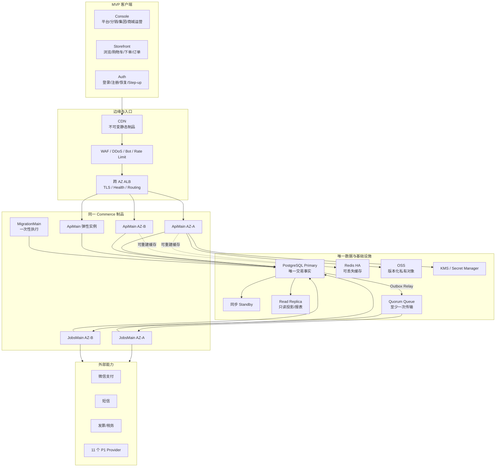
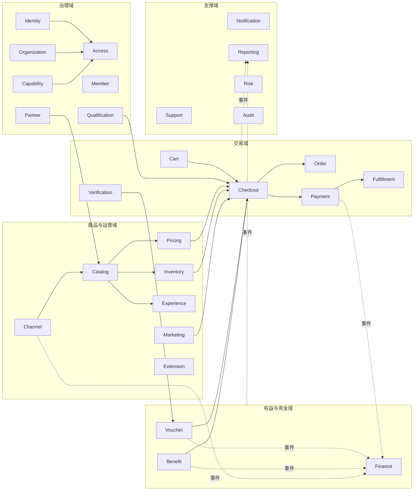
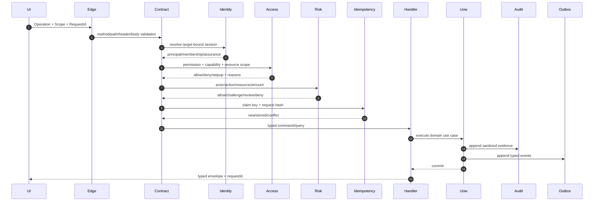
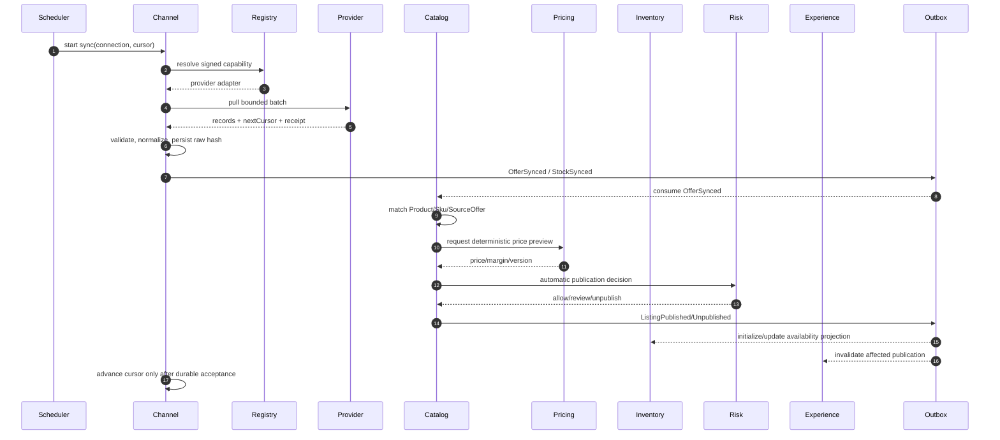
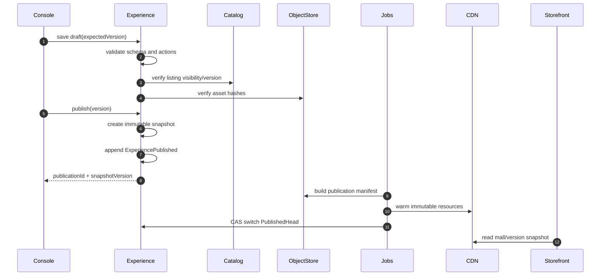
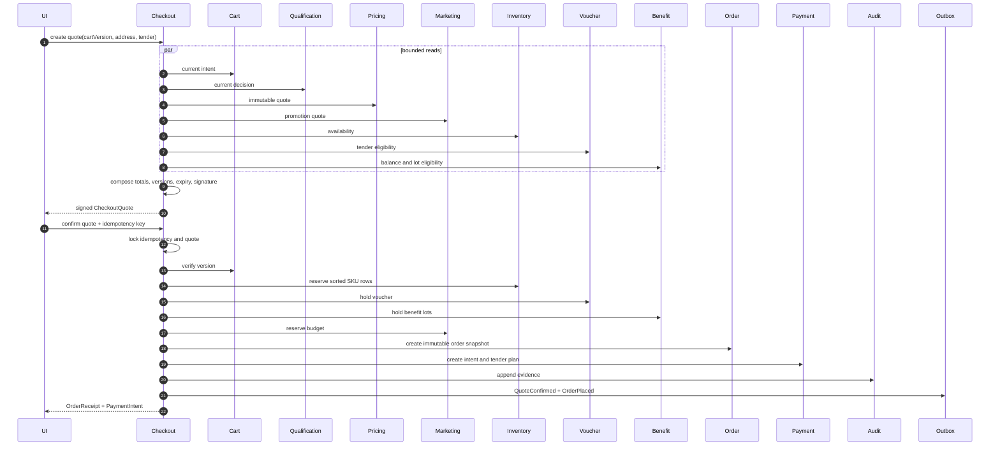
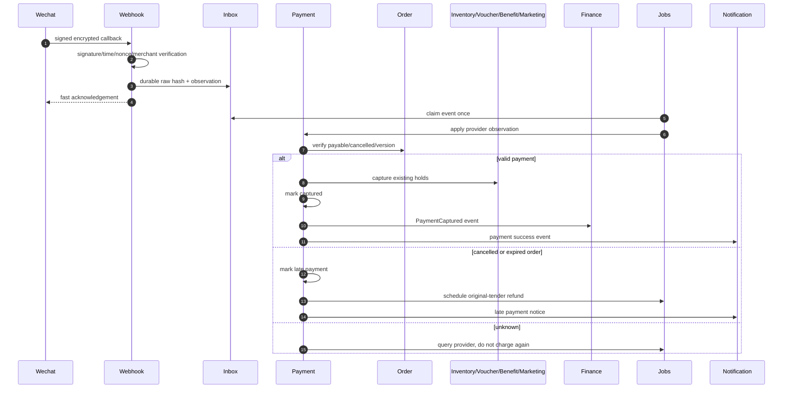
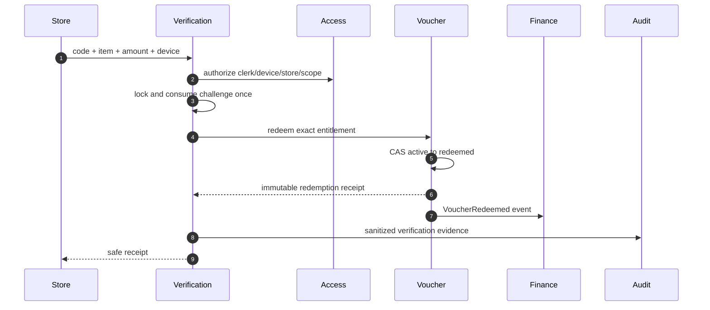
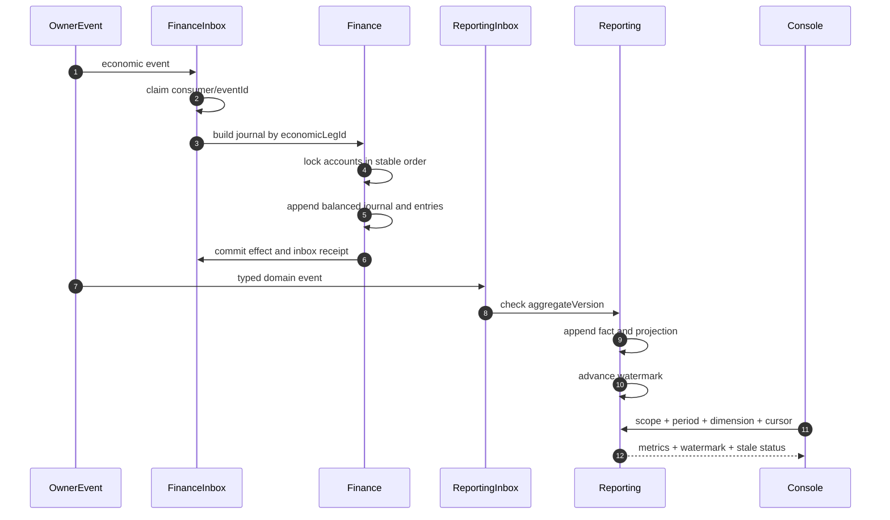
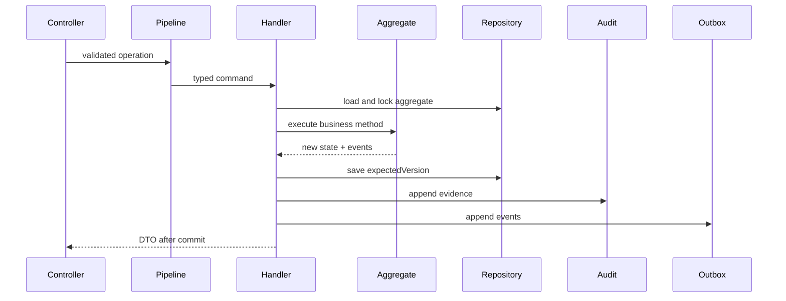

# 结论

最理想、最稳妥的终态不是继续维护现有两条 API/数据库链路，也不是立即拆成几十个微服务，而是：

> 以 PostgreSQL 为唯一交易事实源，建设一个可水平扩展的 DDD 模块化单体；生产只保留一套 Canonical Contract、一套 Commerce 制品、一套数据库迁移历史、一套权限模型，通过多个无状态 API 实例和 Jobs 实例实现高并发、高可用，通过窄 Port、领域事件和签名 Extension Manifest 实现即插即用扩展。

本次只读检查未修改任何代码、配置、SQL 或文档，Git 工作树保持干净。

指定工作簿的“MVP上线功能清单”共 21 个发布标签：平台层、分销层、集团 9 项、商城 9 项、优先级 1 接口。指定文件和 `260821` 文件二进制哈希不同，但该工作表 A1:F23 的单元格内容完全相同。需求基准来源为：:codex-file-citation{path="../福利商城功能清单.xlsx" purpose="source" artifact_kind="workbook" sheet="MVP上线功能清单" range="A1:F23"}

现有工程有相当不错的后端骨架，但不能认定为 MVP 已完成：

- 28 个业务模块、217 个 Operation、58 个领域事件、32 个 Job 已存在。
- 11 个一期 Provider 包已存在。
- 296 条需求全部仍为 `Designed`，证据数组全部为空。
- 21 个 MVP 标签全部仍为 `Designed`，没有 `Released` 证据。
- 前端需求映射 296/296 为 `Missing`。
- Canonical 与 Compatibility 两套服务、数据库、合同仍并存。[README.md](../../README.md:11)
- 两条制品轨道都明确为 `releaseEligible=false`。[artifacts.json](../../config/artifacts.json:4)
- 购买公开切流仍因缺少真实 PostgreSQL E2E Receipt 而被阻断。[delivery.yml](../../infrastructure/zhudatuan/aliyun/delivery.yml:138)
- 当前阿里云配置是单机 ECS 验收栈，不是生产高可用拓扑。
- 当前 MVP 生成物指向 `福利商城功能清单260821.xlsx`，没有指向用户本次指定文件。[mvp.yml](../requirements/mvp.yml:1)

因此，正确策略是“保留领域能力，硬切事实源和运行链路；不保留永久兼容层”。

---

# 一、MVP 唯一需求矩阵

| ID    | 工作簿功能    | 主要模块                                                               | 必须通过的真实验收                                                                                         |
| ----- | ------------- | ---------------------------------------------------------------------- | ---------------------------------------------------------------------------------------------------------- |
| MVP03 | 平台层        | Organization、Catalog、Voucher、Access、Audit                          | 平台逻辑层存在；商品池可绑定；卡号库可创建；跨租户访问失败                                                 |
| MVP04 | 分销层        | Organization、Channel、Capability、Access                              | 工作簿本行没有功能细节，不能擅自扩充；至少证明分销 Scope 隔离、配额和下属范围。正式发布前必须补验收定义    |
| MVP05 | 集团数据大屏  | Reporting                                                              | 实时、昨日、近 7 天、近 30 天；金额、数量、退单、分应用；返回水位线                                        |
| MVP06 | 集团应用      | Experience                                                             | 多商城创建、复制、管理、装修、校验、发布、回滚；快照不可变                                                 |
| MVP07 | 集团商品池    | Catalog、Pricing、Inventory、Channel                                   | 整体/渠道/自有/H5 加价商品池；查询、增改、批量上下架、改价                                                 |
| MVP08 | 集团订单      | Order、Payment、Fulfillment                                            | 商品订单、售后订单、状态时间线、权限范围、导出                                                             |
| MVP09 | 集团卡券      | Voucher、Verification、Finance                                         | 客户、产品档案、备券、审批、发券、激活、禁用、延期、作废、查询、消费明细                                   |
| MVP10 | 集团财务      | Finance、Payment、Channel                                              | 财务总览、商城财务、支付配置、账单、发票；账务借贷平衡                                                     |
| MVP11 | 集团数据统计  | Reporting                                                              | 商品、商城、分类、供应链渠道、“粉类”与卡券消费数据；工作簿中的“粉类”应作为待澄清术语，不能静默改义         |
| MVP12 | 集团客服      | Support、Notification                                                  | 分配规则、人员、账号、聊天、记录查询、SLA                                                                  |
| MVP13 | 集团设置      | Access、Capability、Member、Partner、Qualification、Risk、Notification | 管理员、角色、权限、项目、会员、供应商、门店、短信、风控                                                   |
| MVP14 | 商城数据大屏  | Reporting                                                              | 商城范围销售、金额、数量、退单、实时及各时间窗；禁止读取其他商城                                           |
| MVP15 | 商城装修      | Experience                                                             | 草稿、预览、校验、发布、历史版本、回滚、多端消费                                                           |
| MVP16 | 商城商品池    | Catalog、Pricing、Inventory                                            | 商城范围商品池、上下架、批量操作、价格治理                                                                 |
| MVP17 | 商城订单      | Order、Payment、Fulfillment、Finance                                   | 商品订单、售后、退款、履约状态与证据                                                                       |
| MVP18 | 商城卡券      | Voucher、Verification                                                  | 商城范围卡号池、审批、发券、状态操作、核销与冲正                                                           |
| MVP19 | 商城财务      | Finance                                                                | 商城账户、交易、账单、支付配置、发票；只能访问本商城                                                       |
| MVP20 | 商城数据统计  | Reporting                                                              | 商品、商城、分类、渠道、粉类、卡券数据；带投影水位线                                                       |
| MVP21 | 商城客服      | Support                                                                | 商城客服配置、对话、记录、分配和 SLA                                                                       |
| MVP22 | 商城设置      | Access、Member、Partner、Risk、Notification                            | 管理员、会员、供应商、门店、短信、自动上下架风控                                                           |
| MVP23 | 优先级 1 接口 | Channel、Extension                                                     | 京东、京东生鲜、天猫超市、自有供应商、蛋糕、鲜花、图书、直充、食品提货券、电影、在线点餐共 11 项逐能力验收 |

每一项必须具备：

```text
Workbook Cell
→ Requirement ID
→ Route
→ Operation
→ Request/Response/Error Schema
→ Permission/Capability/Scope
→ Handler
→ Domain Owner
→ Table/Projection
→ Tests
→ Runbook
→ Signed Release Evidence
```

缺少任一环节只能是 `Designed` 或 `Implemented`，不得标记 `Released`。

---

# 二、现状与目标差距

| 维度     | 当前事实                                                                                         | 目标                                                                                      |
| -------- | ------------------------------------------------------------------------------------------------ | ----------------------------------------------------------------------------------------- |
| API      | Canonical、Compatibility、Registration、WebBusiness、Purchase 多入口                             | 一个 `ApiMain`，按 Operation、Audience、Permission 控制能力                               |
| 数据库   | Canonical 171 个迁移；Compatibility 57 个迁移                                                    | 一个 PostgreSQL 集群、一份只追加迁移历史                                                  |
| 客户端   | Console、Auth Web、Storefront Web                                                                | MVP 只保留 Console、Auth、Storefront；Store、Supplier、Miniapp 等需求正式进入范围后再新增 |
| 前端路由 | 实际为 `/scopes/:scopeKind/:scopeId/*`；生成映射仍写 `/platform`、`/enterprises/current/*` 等    | Workspace Manifest 生成路由和需求映射，两者不能漂移                                       |
| 合同     | 217 个 Operation，但部分输入输出仍是结构性/弱类型合同                                            | Contract v2 全部具有强类型 Input、Output、ErrorUnion                                      |
| DDD      | 28 模块存在，但层次完整度不一致，部分模块仍是三五个大文件                                        | 每个模块采用统一 public/domain/application/infrastructure/interface 骨架                  |
| 依赖     | 部分 Module 直接声明较宽依赖，如 Order 同时依赖 Checkout、Inventory、Benefit、Voucher、Reporting | 跨模块只允许 Operation-specific Port 或事件                                               |
| Provider | 11 个 Provider 和 6 个 Vendor 层并存                                                             | 每个 Provider 自带 integration；删除重复 Vendor 插件层                                    |
| 包       | `design`/`design-system`、`authz`/`smart-wing-authz` 重复                                        | 每类事实只保留一个包                                                                      |
| 发布     | `releaseEligible=false`；Purchase 公开切流 blocked                                               | 真数据库、真短信、真 Provider、真支付、恢复演练全部形成签名证据                           |
| 可用性   | 单机验收拓扑                                                                                     | 跨 AZ Active/Active API、Active/Active Jobs、数据库同步备机                               |
| 命名     | `auth-web`、`storefront-web`、`commerce-api` 等连接符和兼容语义仍存在                            | 自有生产目录小写单词，TS 文件 PascalCase，不使用连接符、下划线及含糊名称                  |

当前 28 个业务模块目录已经有唯一目录清单，可作为重构起点，而不是推倒重写。[modules.ts](../../services/commerce/src/app/modules.ts:34)

---

# 三、总体系统架构



核心裁决：

1. 模块化单体，不立即拆 28 个微服务。
2. API 和 Jobs 使用同一镜像、同一 Contract Hash、同一 Migration Head。
3. API 无状态，可跨 AZ 横向扩容。
4. PostgreSQL 是唯一交易事实；Redis、Queue、搜索、报表投影全部可重建。
5. 外部 Provider 调用不占用数据库长事务。
6. 写事务同时提交聚合、幂等记录、Audit 和 Outbox。
7. 异步消费者同时提交 Inbox、业务效果和新的 Outbox。
8. 不采用分布式事务或双写补丁。

现有目标入口文档已经表达了“一份 Commerce 制品、多实例 API/Jobs”的正确方向。[ARCHITECTURE.md](../ARCHITECTURE.md:5)

---

# 四、DDD 限界上下文



跨模块调用规则：

- 同一强一致用例：通过窄 Public Port，并传递显式 `TransactionContext`。
- 非强一致副作用：通过领域事件、Outbox、Inbox。
- 查询组合：通过 Read Port 或 Reporting Projection。
- 禁止导入其他模块的 Repository、SQL、数据库 Row、内部聚合和基础设施类。
- 禁止一个模块直接写另一个模块的 Schema。
- 不允许名为 `Common`、`Utils`、`Helper`、`SharedService` 的业务垃圾抽屉。

---

# 五、统一请求管道



统一协议：

```text
Operation
  id
  owner
  method
  path
  audience
  permission
  capability
  scopeKinds
  assuranceLevel
  makerChecker
  requestSchema
  responseSchema
  errorUnion
  idempotencyScope
  expectedVersion
  timeout
  rateClass
  requirementIds
```

金额只使用 `amountMinor + currency`；时间使用 UTC ISO 8601；列表全部 Keyset Cursor；写操作必须携带 `Idempotency-Key`；修改现有资源必须携带 `expectedVersion` 或 `If-Match`。

---

# 六、核心模块间时序

## 6.1 Provider 同步、商品治理和投放



Provider 的外部 JSON 永远止于 Anti-Corruption Mapper；Catalog、Pricing、Inventory 和 Finance 不读取 Provider 原始结构。

## 6.2 商城装修发布



CDN 失败不能生成半发布状态；回滚只是将 `PublishedHead` 原子切回历史快照，历史快照本身不可修改。

## 6.3 结算预览与原子下单



固定锁顺序：

```text
Idempotency
→ CheckoutQuote
→ Cart
→ Inventory StockItem（SKU ID 排序）
→ Voucher
→ Benefit Account/Lot
→ Marketing Budget
→ 新 Order
→ 新 PaymentIntent
→ Append-only Audit/Outbox
```

任何路径出现锁顺序下降都应被架构测试和运行时 Guard 拒绝。

## 6.4 支付回调、迟到支付和退款



退款必须按原支付承担额执行；累计退款不得超过实付；任何一条退款 Leg 未达到确定终态时，整体不得错误标记为 `Refunded`。

## 6.5 动态码核销



重复请求返回原收据，不产生第二次核销；冲正必须引用原核销收据。

## 6.6 财务与报表



Reporting 的“实时”必须显示水位线，不能冒充交易库零延迟实时。

---

# 七、28 个模块内部数据流

所有写命令遵守统一模板：



逐模块特化如下：

| 模块          | 内部主时序                                                                                                        | 核心不变量与失败处理                                                                   |
| ------------- | ----------------------------------------------------------------------------------------------------------------- | -------------------------------------------------------------------------------------- |
| Identity      | Controller → Login/Register Handler → Credential Policy → Principal/Session Repository → Outbox                   | Principal 唯一；验证码一次性；密码强哈希；不存在用户也执行恒定工作量；失败不创建半会话 |
| Organization  | Controller → Hierarchy Handler → lock node/parent → Hierarchy Policy → Closure Repository → Outbox                | 禁止环、跨租户移动、无安全锚点组织；并发移动使用版本检查                               |
| Access        | Session Resolver → Membership → Grant/Deny → Resource Scope Resolver → Capability → Access Policy → Decision Sink | 默认拒绝；Deny 优先；Scope 取交集；每次变更递增 AccessVersion                          |
| Capability    | Handler → Package Version → Assignment → Quota Policy → Usage Counter → Outbox                                    | 套餐版本不可原地修改；配额计数原子更新；菜单可见不等于后端授权                         |
| Partner       | Handler → Deduplicator → Partner Repository → Agreement Policy → Enrollment → Outbox                              | Supplier/Brand/Store 主体稳定；协议版本只追加；结束合作不删历史                        |
| Member        | Handler → PII Validator/Crypto → Member Matcher → Profile Repository → Group/Level Policy → Outbox                | 自然人 Principal 与租户档案分离；PII 加密；导入行级幂等                                |
| Qualification | Handler → published policies → bounded fact ports → Specification Engine → Decision Repository                    | 明确拒绝优先；保存规则版本、输入摘要、解释；未知依赖默认不授予                         |
| Catalog       | Intake → Normalizer → Product Matcher → Product/Sku/Offer Repository → Review Policy → Listing Snapshot → Outbox  | Product、SourceOffer、Listing 分离；外部映射唯一；有订单引用时只能归档                 |
| Pricing       | Handler → Catalog Cost Port → Rule Versions → Pricing Engine → Margin Policy → immutable Quote                    | 整数分；确定性舍入；最低毛利；规则冲突拒绝；前端不得计算最终价                         |
| Inventory     | Handler → lock Stock rows → Availability Policy → Reservation → Movement → Outbox                                 | `available=onhand-activeReservation-safety`；Reservation 只能提交/释放/过期一次        |
| Experience    | Handler → Draft → Validator → Snapshot → Outbox → async CDN publish                                               | 快照不可变；Head 使用 CAS；资产/链接/商品可见性全部通过才切换                          |
| Marketing     | Handler → Campaign Versions → Audience → Budget → Promotion Engine → Quote                                        | 预算原子预占；叠加顺序版本化；抽奖随机证据可重放                                       |
| Cart          | Controller → Cart Handler → load version → Catalog Summary → Quantity Policy → save → Outbox                      | 只保存意图，不锁价格库存；多端冲突返回新版本                                           |
| Checkout      | Controller → bounded parallel Ports → Composer → Signer → immutable Quote Repository                              | Quote 包含全部版本和失效时间；确认时全部重验                                           |
| Order         | Create Handler → Commercial Policy → Snapshot Factory → Order/Suborder/Line Repository → Outbox                   | 商品、价格、地址、参与方、资格、商城版本全部冻结；订单、支付、履约状态正交             |
| Fulfillment   | Event Inbox → Split Policy → Fulfillment Repository → async Provider Submit → Tracking Repository                 | 外部 Unknown 先查单；重复回调无第二效果；失败不回滚已支付订单                          |
| Verification  | Device Authorizer → Challenge Repository → Scope Policy → Voucher Redemption Port → Receipt                       | 动态码一次性、短时、绑定用途/门店/设备；请求 Scope 不能扩大权限                        |
| Payment       | Create Intent → immutable Tender Plan → Prepare Attempt → Job Queue → Provider Call → Observation                 | Provider 调用在事务外；Intent/Attempt 语义键唯一；Unknown 不盲目重扣                   |
| Voucher       | Approval → CardPool lock → Voucher instances → status CAS → Redemption/Reverse Receipt → Outbox                   | 卡号和卡密分离；卡密加密；核销一次；冲正引用原交易                                     |
| Benefit       | Grant Batch → recipient snapshot → budget reserve → chunk jobs → append ledger → Outbox                           | 余额由只追加流水归集；批次子项幂等；撤回/过期/回补各有独立分录                         |
| Finance       | Inbox → accounting handler → Posting Policy → account locks → Journal/Entries → projection → Outbox               | 借贷平衡；Maker≠Checker；关账差异为零；Journal 不更新不删除                            |
| Channel       | Scheduler/Webhook → Connection → Extension Registry → Provider → Mapper → SyncRun/Cursor → Outbox                 | Cursor 只在数据持久化后推进；原始报文 Hash 留证；外部标识映射唯一                      |
| Support       | Controller → Conversation → Assignment Policy → SLA Policy → Ticket → Outbox                                      | 最小 PII；客服不能直接修改订单或资金；Ticket 使用版本状态机                            |
| Notification  | Event/Port → Template → Preference → Dispatch → Job → Delivery Adapter → Attempt → Outbox                         | 事件+接收人+渠道唯一；仅永久失败或重试耗尽才发布最终失败                               |
| Reporting     | Inbox → Version Check → Fact → Projection → Watermark → Cache Invalidation                                        | 只读自身 Fact/Projection；水位线单调；可从事件全量重建                                 |
| Risk          | Handler → Policy Versions → Signal Ports → Rule Engine → Case Repository → Outbox                                 | 硬规则优先于模型分数；保存规则/模型版本；高风险默认关闭                                |
| Audit         | Pipeline → Redactor → Evidence Signer → Hash Chain → Repository → Archive Job                                     | 只追加；PrevHash 连续；高风险 Audit 失败必须让业务失败关闭                             |
| Extension     | Controller → Manifest Verifier → disabled Installation → Registry → Contract/Health → CAS enable → Outbox         | 签名、API 版本、能力、权限白名单；无通用数据库连接；升级原子切换                       |

---

# 八、数据一致性设计

## 8.1 一致性分类

| 场景                                                         | 一致性                                                     |
| ------------------------------------------------------------ | ---------------------------------------------------------- |
| 下单、库存预占、券冻结、福利金冻结、营销预算、订单、支付意图 | 同一 PostgreSQL ACID 事务                                  |
| 支付回调落地                                                 | Durable Inbox 强一致落库后快速应答                         |
| 履约、通知、Provider 同步                                    | Outbox/Inbox 最终一致                                      |
| 财务记账                                                     | 经济事件到 Finance Inbox 后，每个经济 Leg 恰好一次业务效果 |
| 报表                                                         | 最终一致，必须暴露 Watermark                               |
| Redis/CDN/搜索                                               | 可重建，不参与正确性判定                                   |
| 跨地域灾备                                                   | 单地域写；人工受控切换，不做双地域交易双写                 |

## 8.2 幂等

- 写 API：`actor + operation + scope + idempotencyKey` 唯一。
- Provider 写：`provider + connection + semanticKey` 唯一。
- Inbox：`consumer + eventId` 唯一。
- Outbox：`aggregateId + aggregateVersion + eventType` 唯一。
- Finance：`ownerEventId + economicLegId` 唯一。
- Voucher：外部核销号和冲正号唯一。
- 支付：商户订单号、支付意图、支付尝试、退款单号分别唯一。
- 请求键复用但请求 Hash 不同，返回冲突，不覆盖旧结果。

## 8.3 乐观锁与状态机

```sql
update owner.aggregate
set state = :next, version = version + 1
where id = :id and version = :expectedVersion;
```

更新零行统一返回 `VERSION_CONFLICT`。

订单至少拆为四条正交状态：

```text
commercialState
paymentState
fulfillmentState
afterSaleState
```

不得用一个巨大 `status` 表达所有组合。

## 8.4 不可变快照

下单时冻结：

- Product、SKU、标题、媒体和属性。
- Listing、Mall、Supplier、Store。
- 成本、税、各层加价、促销、券、福利金、支付承担额。
- Qualification Decision 与所有规则版本。
- 地址加密信封及安全摘要。
- Provider Mapping、Published Experience Snapshot。
- 请求、相关 ID、审计 Hash。

历史订单绝不回查当前商品覆盖旧事实。

---

# 九、高性能与高并发

当前配置已经给出可用的容量基线：[capacity.yml](../../config/capacity.yml:1)

```text
商城数             1,000
会员数        10,000,000
商品数         5,000,000
SKU 数        20,000,000
峰值 API QPS        5,000
峰值下单 TPS          300
支付回调 TPS           600
单券批次          1,000,000
```

目标 SLO：

| 能力                             |     目标 |
| -------------------------------- | -------: |
| 月度可用性                       |  ≥99.95% |
| 缓存命中目录读取 p95             |   ≤150ms |
| 普通查询 p95                     |   ≤300ms |
| 详情查询 p95                     |   ≤500ms |
| 普通命令 p95                     |   ≤800ms |
| 原子下单 p95                     |  ≤1500ms |
| Webhook durable accept p99       |   ≤500ms |
| Outbox 99% 延迟                  |   ≤30 秒 |
| RPO                              |  ≤5 分钟 |
| RTO                              | ≤30 分钟 |
| 超卖、重复扣款、重复核销、不平账 |        0 |

关键手段：

- 所有大列表使用 Keyset Cursor，默认 50，最大 200。
- 报表和导出走异步 Export Job，不循环分页拼接。
- PostgreSQL 前增加事务级连接池；总连接数满足：

```text
所有 API/Jobs 实例池总和 ≤ 数据库 max_connections × 70%
```

- SQL 必须有 Row、Byte、Time、Plan Budget。
- 禁止 `SELECT *`、无界数组聚合、N+1、全表 Offset。
- 高频筛选索引使用 `scope + state/time + id`。
- 搜索采用 FTS/Trigram 或独立搜索投影，搜索索引不是交易真相。
- Checkout 只并发执行互不依赖的只读 Port，并设置 concurrency、deadline、AbortSignal。
- Provider 按连接和能力设置独立 Bulkhead、限流器、熔断器。
- 无界输入禁止裸 `Promise.all`。
- 批量任务分块，支持暂停、恢复、取消未执行项、只重试失败项。
- 前端路由懒加载、表格虚拟化、请求取消、图片尺寸固定、搜索防抖 200–300ms。

缓存 Key 必须包含版本：

```text
Access: sessionVersion + accessVersion + capabilityVersion + resourceHash
Catalog: scope + listingVersion + locale
Experience: mall + publicationVersion
Reporting: scope + period + dimension + projectionVersion
```

余额、最终库存、支付状态、核销资格不能作为命令判断的缓存事实。

---

# 十、高可用与灾备

| 组件       | 生产模式                                         | 故障行为                                        |
| ---------- | ------------------------------------------------ | ----------------------------------------------- |
| Edge       | Cloudflare 多 PoP                                | 自动摘除不健康源站                              |
| API        | 跨两个 AZ Active/Active，最少 2，建议常态 3      | 单实例或单 AZ 故障不影响已提交交易              |
| Jobs       | 跨 AZ Active/Active                              | PostgreSQL Lease + 单调 Fencing Token 接管      |
| PostgreSQL | 单写 Primary + 跨 AZ 同步 Standby + Read Replica | 新 Timeline Ready 前暂停写，禁止用 Redis 接管写 |
| Redis      | 跨 AZ Primary/Replica                            | 失败时回源并保守限流，正确性不变                |
| Queue      | 三节点 Quorum 或托管同等级能力                   | 重投递由 Inbox 吸收                             |
| OSS        | 版本化、私有、跨区域复制                         | DR Bucket 读取，重新签发 URL                    |
| Region DR  | 第二地域 Warm Standby                            | Incident Commander 发起、第二人复核，不做双活写 |

必须具备四种探针：

- `live`：只证明进程事件循环正常。
- `ready`：配置、合同、数据库角色、迁移 Head、Registry 全部匹配。
- `startup`：允许冷启动和 Schema 检查。
- `dependency`：仅授权中控台查看，不用于 LB Live。

必须季度演练：

- PostgreSQL Failover。
- Redis 全丢失。
- Worker 崩溃和 Lease 接管。
- Queue 重投递。
- Outbox/Deadletter Replay。
- Projection 全量重建。
- PITR 恢复及账务、订单、券、审计核验。
- 区域切换和回切。

---

# 十一、安全设计

## 身份与会话

- 密码采用版本化内存困难 KDF 和独立 Salt。
- Cookie 为 HttpOnly、Secure、Host-only、SameSite Strict，并绑定 Console/Storefront Target。
- Console 与 Storefront 会话完全隔离。
- 改密、撤销、风险命中递增 Session Version。
- 高风险操作必须 Step-up，绑定具体 Operation、资源、金额、Nonce 和短时窗。
- 登录、找回、OTP 按账号/IP/设备/风险多维限流。
- OTP 只存 Hash，单次消费，日志不出现明文。

## 授权

```text
Session
∩ Active Membership
∩ Role Permission
∩ Explicit Scope
∩ Capability
∩ Resource Ownership
∩ Assurance
∩ Risk Decision
− Explicit Deny
```

客户端提交的 Tenant、Role、Permission、Scope 一律不可信。服务端从资源 Owner 反解 Scope。

## Web 与 API

- 精确 CORS 白名单，禁止 `*` 搭配凭证。
- CSRF 绑定 Origin、Session、Target 和时窗。
- CSP 默认拒绝；HSTS、Frame Ancestors、Permissions Policy。
- URL 不携带 Token、完整手机号、身份证、Membership ID。
- 错误不暴露账号是否存在、SQL、堆栈、Provider 原始异常。
- 高风险接口按用户、Scope、资源、金额分级限速。

## Webhook

```text
TLS
→ Content Length
→ Provider Routing
→ Certificate/Key Version
→ Signature
→ Timestamp Window
→ Nonce Replay Check
→ Merchant/App Binding
→ Decrypt
→ Order/Amount/Currency Verify
→ Durable Inbox
→ Fast Ack
→ Async State Machine
```

## 数据与财务

- PII 字段级或信封加密，默认掩码。
- 地址仅履约需要时短时解密。
- PII 查看、解密、导出本身写 Audit。
- 财务采用 Maker/Checker、金额额度和职责分离。
- Journal、Audit、支付回执无后台删除能力。
- CSV 导出防公式注入。
- 上传文件做 MIME、大小、Hash 和病毒扫描。

## Secret 与供应链

- 代码和数据库只保存 `SecretRef`。
- Secret 仅在 KMS/Secret Manager。
- 环境完全隔离，轮换版本短时并存，旧版本及时撤销。
- CI 使用 OIDC 短期凭据。
- 生成 SBOM、依赖许可报告、制品签名和 Provenance。
- 工作簿当前虽然已出现“已轮换、见密钥库”占位，但仍应扫描 Git 历史、备份、日志和旧制品，确认旧凭据真正撤销。

---

# 十二、Provider 即插即用

目标目录：

```text
extensions
├─ channel
│  ├─ core
│  ├─ jdproduct
│  ├─ jdfresh
│  ├─ tmallmarket
│  ├─ private
│  ├─ cake
│  ├─ flower
│  ├─ book
│  ├─ directcharge
│  ├─ foodvoucher
│  ├─ movie
│  └─ meal
├─ payment
│  └─ wechat
└─ notification
   ├─ sms
   └─ inapp
```

每个 Provider 只实现它声明的窄能力：

```text
Manifest.ts
Factory.ts
Config.ts
Mapper.ts
Client.ts
Health.ts
capability/
integration/
```

Manifest 至少包含：

```text
id
version
apiVersion
contractVersion
signature
capabilities
permissions
configSchema
secretRefs
rateLimits
timeout
retryPolicy
webhookContract
healthOperation
```

安装过程：

```text
验证签名
→ 验证 API 版本
→ 验证权限和 SecretRef
→ Disabled 状态落库
→ Contract Suite
→ Health Check
→ Sandbox Probe
→ 小流量
→ Registry CAS 切换
→ Enabled
```

插件不得：

- 获取通用数据库连接。
- 直接写 Catalog、Inventory、Order、Payment 或 Finance 表。
- 返回未规范化 Provider JSON。
- 自己决定租户和权限。
- 在核心代码中增加 `if provider === ...` 分支。

现有 `extensions/providers/*` 能复用；`extensions/vendors/*` 的协议、鉴权、签名和限流逻辑应合并到相应 Provider 的 `integration`，完成后删除 Vendor 第二层插件体系。

---

# 十三、唯一配置体系

每类事实只保留一个来源：

| 事实                  | 唯一来源                         |
| --------------------- | -------------------------------- |
| Requirement/MVP       | 指定工作簿 + 固定 SHA-256        |
| Operation             | Contract Definition              |
| Event                 | Event Definition                 |
| Error                 | Error Catalog                    |
| Permission/Capability | Access Catalog                   |
| Module/依赖           | Module Manifest                  |
| 前端路由/标题/权限    | Workspace Manifest               |
| Provider              | Extension Manifest               |
| VI                    | Design Token 和 Canonical Assets |
| Runtime               | Typed Runtime Config             |
| 数据所有权            | Ownership Catalog                |
| 指标/SLO/告警         | Telemetry Catalog                |

环境配置只允许改变地址、凭据引用、容量和开关值，不能改变业务一致性模型。

启动时应核对：

```text
contractHash
operationHash
eventHash
jobHash
requirementHash
migrationHead
ownershipHash
extensionHash
runtimeConfigHash
```

任何不一致直接 `ready=false`，不能使用默认值降级启动。

“配置开关”只能用于：

- Capability 分配。
- Extension 启停。
- 临时发布金丝雀。

禁止使用开关长期保留旧 API、双写、Mock、兼容路由或旧业务算法。

---

# 十四、目标代码目录

严格遵守用户的命名要求：自有生产目录使用简洁小写单词；TypeScript 文件用 PascalCase；函数和变量用 camelCase；除脚本、配置、SQL、测试外不使用下划线或连接符。

```text
zhudatuan
├─ apps
│  ├─ console
│  │  └─ src
│  │     ├─ app
│  │     ├─ route
│  │     ├─ shell
│  │     ├─ feature
│  │     ├─ entity
│  │     └─ shared
│  ├─ storefront
│  └─ auth
├─ services
│  └─ commerce
│     └─ src
│        ├─ entry
│        │  ├─ ApiMain.ts
│        │  ├─ JobsMain.ts
│        │  ├─ MigrationMain.ts
│        │  └─ SmokeMain.ts
│        ├─ bootstrap
│        │  ├─ Container.ts
│        │  ├─ ModuleRegistry.ts
│        │  ├─ RouteRegistry.ts
│        │  ├─ EventRegistry.ts
│        │  ├─ JobRegistry.ts
│        │  ├─ ExtensionRegistry.ts
│        │  └─ RuntimeContract.ts
│        ├─ foundation
│        │  ├─ application
│        │  ├─ domain
│        │  ├─ persistence
│        │  ├─ messaging
│        │  ├─ security
│        │  ├─ performance
│        │  ├─ interface
│        │  └─ telemetry
│        ├─ adapter
│        │  ├─ database
│        │  ├─ messaging
│        │  ├─ cache
│        │  ├─ network
│        │  ├─ object
│        │  └─ secret
│        └─ modules
│           ├─ identity
│           ├─ organization
│           ├─ access
│           ├─ capability
│           ├─ partner
│           ├─ member
│           ├─ qualification
│           ├─ catalog
│           ├─ pricing
│           ├─ inventory
│           ├─ experience
│           ├─ marketing
│           ├─ cart
│           ├─ checkout
│           ├─ order
│           ├─ fulfillment
│           ├─ verification
│           ├─ payment
│           ├─ voucher
│           ├─ benefit
│           ├─ finance
│           ├─ channel
│           ├─ support
│           ├─ notification
│           ├─ reporting
│           ├─ risk
│           ├─ audit
│           └─ extension
├─ packages
│  ├─ contract
│  ├─ sdk
│  ├─ kernel
│  ├─ authz
│  ├─ design
│  ├─ telemetry
│  ├─ config
│  └─ testing
├─ database
│  ├─ migrations
│  ├─ contracts
│  ├─ fixtures
│  └─ tools
├─ extensions
│  ├─ channel
│  ├─ payment
│  └─ notification
├─ tests
│  ├─ contract
│  ├─ integration
│  ├─ component
│  ├─ journey
│  ├─ security
│  ├─ performance
│  └─ recovery
├─ infrastructure
│  ├─ container
│  ├─ cloud
│  ├─ network
│  ├─ monitoring
│  ├─ backup
│  └─ security
├─ tools
│  ├─ contractgen
│  ├─ requirementgen
│  ├─ tokengen
│  └─ quality
├─ docs
│  ├─ architecture
│  ├─ decisions
│  ├─ operations
│  ├─ requirements
│  └─ security
├─ package.json
├─ package-lock.json
└─ tsconfig.json
```

单模块固定骨架：

```text
modules/order
├─ public
│  ├─ CreateOrderPort.ts
│  ├─ OrderReadPort.ts
│  └─ PaymentOrderPort.ts
├─ domain
│  ├─ model
│  ├─ value
│  ├─ policy
│  ├─ event
│  ├─ repository
│  └─ error
├─ application
│  ├─ command
│  ├─ query
│  ├─ handler
│  ├─ dto
│  ├─ port
│  ├─ process
│  └─ job
├─ infrastructure
│  ├─ persistence
│  └─ integration
├─ interface
│  ├─ http
│  └─ job
├─ Manifest.ts
└─ OrderModule.ts
```

前端 Feature 固定骨架：

```text
feature/product
├─ Manifest.ts
├─ index.ts
├─ route
│  └─ WorkspaceRoute.tsx
├─ api
│  ├─ ProductQuery.ts
│  ├─ ProductCommand.ts
│  └─ ProductKey.ts
├─ model
│  ├─ ProductState.ts
│  ├─ ProductFilter.ts
│  └─ ProductViewModel.ts
└─ ui
   ├─ ProductPage.tsx
   ├─ ProductTable.tsx
   ├─ ProductDrawer.tsx
   └─ ProductBatchDialog.tsx
```

UI 组件不得导入 SDK、`fetch` 或环境变量。唯一调用方向：

```text
app
→ route/shell
→ feature
→ entity
→ shared
→ typed SDK
```

---

# 十五、现有代码处置建议

## 直接复用

- `services/commerce` 的 28 模块目录和大部分领域不变量。
- Operation/Event/Capability 合同源。
- `packages/kernel` 的 Money、ID、Clock、Result、并发与韧性类型。
- `packages/sdk` 的 Transport、RequestContext 和生成客户端。
- `packages/authz`。
- `packages/telemetry` 的脱敏、日志、Metric、Trace 接口。
- Console 已实现的商品、订单、财务、应用、卡券、客服等页面交互。
- Storefront 已确认的 UI/VI。
- 微信支付签名、通知、查单和退款协议实现。
- 11 个 P1 Provider 包。
- Canonical 数据库历史迁移作为不可修改 Ledger。
- 现有安全、合同、旅程、恢复测试的可复用语义。
- 已有 Runbook 和容量/SLO 配置。

## 必须重构

- Contract v2：补齐所有 Input、Output、ErrorUnion、Resource Resolver。
- 28 个模块统一分层。
- 宽 Module 依赖改为窄 Port/Event。
- Console 路由和 Requirement Mapping 由同一 Workspace Manifest 生成。
- Provider 与 Vendor 两级体系合并。
- `foundation/infrastructure`、`foundation/http`、`foundation/cache` 收敛为稳定 Foundation Port 与 Adapter。
- Job、Event、Operation、Error、Permission、配置全部改为单一生成真值。
- MVP Journey 从“源文件存在检查”升级为真实 API、数据库、浏览器和外部沙箱证据。

## 硬切后删除

- `services/commerce-api`
- `database/storefront-compatibility`
- `packages/api-contract`
- `packages/design-system`
- `packages/smart-wing-authz`
- `extensions/vendors`
- Compatibility BFF、REST/RPC 旧合同和旧 SDK
- `IdentityRegistrationApiMain`、`WebBusinessApiMain`、`PurchaseApiMain` 等临时拆分入口
- `purchase`、`webbusiness` 等过渡编排模块
- 生产 Mock、Fixture 回退、Demo Session
- Console 生产制品中的 `design-references`、`demo`、labs 辅助入口
- 旧域名、旧 Cookie、旧数据库角色、旧 Secret、旧部署脚本
- 手写重复路由、权限表、模块表、配置默认值
- 长期 Feature Flag、双写和别名

不能删除：

- 历史 Canonical Migration。
- 财务 Ledger。
- Audit。
- 支付、退款、核销和外部回执。
- 已签名的 Release Evidence。
- 法定保留期内的安全证据。

---

# 十六、测试与发布门禁

测试金字塔：

```text
Domain Unit
→ Policy/State Machine Property
→ Port Contract
→ Repository Integration
→ Handler/UoW
→ Database Constraint/RLS
→ Event Duplicate/OutOfOrder
→ Job Crash/Resume
→ Provider Sandbox
→ Component
→ 21 MVP Journeys
→ Security Negative
→ Performance/Soak
→ Failover/Restore
→ Production Smoke/Canary
```

每个 Command 至少测试：

- 正常路径。
- 输入边界。
- 无权限和错误 Scope。
- 缺少 Step-up。
- 重复 Idempotency Key。
- 相同 Key 不同请求体。
- 版本冲突。
- 并发竞争。
- 外部超时。
- 重试和重启。
- Audit/Outbox 原子性。
- PII/Secret 不进入错误、日志和 Trace。

发布流水线：


数据库不使用 Down Migration。发生问题时：

- Additive Schema 窗口内回滚应用镜像。
- 已写入新格式但旧镜像不可读时，停止流量并前向修复。
- 外部支付、退款、发券等副作用使用领域补偿或冲正，不通过代码回滚撤销。

---

# 十七、实施顺序

1. **需求权威门**

   - 将本次指定 `docs/福利商城功能清单.xlsx` 设为唯一 MVP 来源。
   - 固定 SHA-256。
   - 对两个工作簿做全表 Added/Removed/Changed/Moved/Ambiguous 差异。
   - 重新生成 Requirement、MVP、Provider、Mapping。
   - 解决 `/platform` 与实际 Scope Router 的路由漂移。
   - 补充分销层和“粉类”业务口径。

2. **合同门**

   - Contract v2。
   - 一个 Operation 一个 Handler。
   - Typed SDK。
   - Typed Event Envelope。
   - 稳定错误码，不再根据 `Error.message` 推断协议。

3. **DDD 边界门**

   - 统一 28 个模块骨架。
   - 建立公开 Port。
   - 消除跨模块 Repository/SQL。
   - 生成 Module Dependency Graph，并证明无环。

4. **交易一致性门**

   - 原子下单。
   - 全局锁序。
   - Payment Intent 唯一创建点。
   - Outbox/Inbox。
   - Finance 事件记账。
   - 订单、退款、库存、券、福利金并发与属性测试。

5. **MVP 页面门**

   - 用一个 Scope Console 承载平台、分销、集团、商城。
   - 完成 21 个标签的真实页面、权限、数据和异常状态。
   - 前端禁止 Mock 回退。
   - Storefront、Auth 只访问 Canonical SDK。

6. **Provider 门**

   - 11 个 Provider 逐能力 Contract Suite 和沙箱验证。
   - Provider Unknown/Timeout/Retry/Query Recovery。
   - 凭据轮换和最小权限。
   - 删除 Vendor 第二插件层。

7. **高可用与生产门**

   - 跨 AZ API/Jobs、PostgreSQL HA、Redis HA、Quorum Queue。
   - 真短信、真支付、真 Provider、真数据库 E2E。
   - PITR、故障转移、恢复演练。
   - 满足 SLO 和安全门。

8. **硬切门**

   - 影子读比对。
   - 禁止双写。
   - 金丝雀切流。
   - 稳定窗口。
   - 删除 Compatibility 服务、数据库、域名、角色、Secret 和旧包。
   - 代码与发布制品中兼容引用为零。

---

# 十八、最终完成定义

只有以下条件全部满足，才能称为“与 MVP 上线功能清单一致并达到生产级”：

- 21 个 MVP 标签全部为 `Released`，每项都有签名证据。
- 分销层空白需求已形成正式 Acceptance。
- 11 个 P1 Provider 逐能力通过，不以包或接口文件存在代替验收。
- 前端映射不再有 `Missing`。
- 一个 Canonical Contract、一个 API、一个数据库迁移树。
- Compatibility、Mock、Fallback、双写、旧路由引用为零。
- 28 个模块所有权唯一，依赖无环，跨 Schema 写为零。
- Operation、Event、Job、Permission、Route、Config 均只有一个真值源。
- 超卖、重复支付、重复核销、不平账为零。
- Redis、Queue、Provider 单点故障不破坏交易正确性。
- 月度可用性、延迟、Outbox、RPO、RTO 达标。
- PostgreSQL Failover 和 PITR Restore 有真实演练证据。
- PII、Secret、支付、Webhook、RLS、Step-up、Maker/Checker 安全测试通过。
- 每个 Release 绑定 Commit、Source Tree、Contract、Migration、Requirement、制品 Digest、SBOM 和质量证据。
- 自有生产目录和文件名符合无连接符、无下划线的命名约束。
- Git、部署目录和生产运行时只剩唯一正式实现。

仓库内已经有更长的架构卷、逐模块时序和目录设计，可作为后续执行索引：[福利商城全系统根治方案.md](../福利商城全系统根治方案.md:258)、[福利商城架构和补齐修改清单.md](../福利商城架构和补齐修改清单.md:108)、[福利商城根治实施方案.md](../福利商城根治实施方案.md:50)。本次结论以当前仓库事实和用户指定工作簿为准，没有把这些历史文档中的“设计完成”误当成“代码和生产已经完成”。
