# 主打团福利商城完美理想方案

版本：2026-09-04
主线：`zhudatuan`
融合来源：`zhudatuan_li`
交付性质：产品、体验、架构、数据、代码组织、迁移与验收的完整目标蓝图。本轮只新增本文档，不修改任何业务代码、配置、数据库或运行环境。

---

## 0. 最终结论

最终系统采用“单一 Commerce 模块化单体 + 六个职责清晰的客户端 + PostgreSQL 单一交易真相 + Outbox/Inbox 异步事实流 + Manifest 即插即用扩展”的形态。`zhudatuan` 作为唯一代码主线，保留其已经形成的合同生成、模块注册、依赖审计、数据库所有权、幂等、事务、作业与质量门；把 `zhudatuan_li` 已获认可的 UI/UX、消费者商城、多端交互、细分业务操作和新版凭证能力按主线边界移植，而不是并排保留第二套实现。

最终体验保留智慧翼视觉语言：深海军蓝导航、智慧蓝主操作、白色内容面、克制阴影、12/16 像素圆角、清晰状态色、中文业务术语和宽屏工作台。三套建店方案保留为同一装修器中的三个主题预设，不再是三套相互割裂的产品。所有可见按钮必须满足二选一：完成真实闭环，或从生产界面删除。禁止“预览成功”“已载入”“即将开放”等文案冒充业务完成。

系统最终必须同时达到以下结果：

1. `docs/福利商城功能清单.xlsx` 的 `MVP上线功能清单` 22 条逐条可追踪，其中原表 18 条 `required` 与 4 条 `nonblocking` 在本方案最终验收中全部视为必过，只允许实施顺序不同，不允许以“忽略”永久跳过。
2. `当前代码业务功能清单-20260904.md` 中“已开放、部分开放、后台具备、自动执行、仅设计、占位”的全部业务语义均有唯一去向；最终生产状态只允许“已开放”或“自动执行”。
3. `zhudatuan_li` 的视觉、交互与现有能力全部得到语义承接；不保留 `zhudatuan_li` 作为生产运行时、兼容服务、Fallback 或第二事实源。
4. 商品、订单、财务总入口不再进入错误边界；成员、商品、卡券三类既有导入任务完整可用；商品、订单、财务页面上的导入按钮要么接入真实服务，要么在业务裁决后删除，绝不保留本地预览占位。
5. 权限、财务与装修三个高认知负荷工作台按格式塔原则、希克定律、原子设计和认知负荷理论统一收敛，让第一次使用的业务人员能在不理解权限代码、英文状态、内部 ID 或技术错误的前提下完成任务。
6. 所有写操作具备授权、能力、范围、风险、二次核验、幂等、版本并发控制、审计与可恢复状态；所有资金、库存、权益、卡券、订单事实可对账、可重放、可证明。

### 0.1 完成后的目标评分

| 维度 | 当前评价 | 最终门槛 | 可验证标准 |
| --- | ---: | ---: | --- |
| UI 统一性 | 7/10 | ≥ 9/10 | 同一 Token、组件、页面模板与反馈规则；无第二主题系统 |
| 操作流畅度 | 5/10 | ≥ 9/10 | 核心入口零崩溃；主要任务 3 步内进入；写操作有明确进度和结果 |
| 简洁程度 | 5/10 | ≥ 9/10 | 首屏只呈现决策必需信息；高级信息渐进展开 |
| 小白友好度 | 4/10 | ≥ 9/10 | 中文术语、解释性状态、下一步动作、无裸 ID/代码/堆栈 |
| 功能可验收度 | 4/10 | 10/10 | 每个入口都有真实 Operation、持久事实、结果页和自动化旅程 |

---

## 1. 权威来源与冲突裁决

### 1.1 权威顺序

发生冲突时按以下顺序裁决：

1. 本次用户明确要求。
2. `zhudatuan/docs/福利商城功能清单.xlsx` 的 `MVP上线功能清单` 与 `接口` 工作表。
3. `zhudatuan_li/docs/当前代码业务功能清单-20260904.md` 的业务语义与状态事实。
4. `zhudatuan_li/docs/zhudatuan-console-UX-acceptance-report-20260904.md` 的实测问题与交互证据。
5. `zhudatuan` 当前合同、模块、数据库与质量门，作为目标主线可复用工程事实。
6. `zhudatuan_li` 当前代码，作为功能与视觉迁移来源，不作为目标架构事实源。

### 1.2 已核对的源事实

| 项目 | 主线事实 | 方案含义 |
| --- | --- | --- |
| 主线工作簿 | SHA-256 `48b2a8ea94b9b20d2599772d8fe1871637f48dbbbc3408e09e0ea8a1822e7436` | 与主线生成的 `docs/requirements/mvp.yml` 一致，作为权威版本 |
| MVP 范围 | A3:F24，共 22 条；18 条 required，4 条 nonblocking | nonblocking 只影响发布排序，不影响最终全功能验收 |
| 一期接口 | `接口` 表中优先级 1 共 11 类 | 京东、京东生鲜、天猫超市、自有供应商、蛋糕、鲜花、图书、直充、食品提货券、电影、在线点餐 |
| 主线后端 | 32 个模块、276 个 Operation、103 个事件 | 作为目标骨架继续演进 |
| 融合来源 | 328 个 Operation，其中与主线共享 231 个，97 个只有 `zhudatuan_li` 同名合同 | 逐项做语义承接，不复制旧运行时 |
| 已有扩展 | 11 个 `extensions/channel/*` 扩展 | 与一期接口一一对应，补齐真实凭据与沙箱/生产验收 |
| UI 基线 | 智慧蓝 `#1F5EFF`、深海军蓝 `#07182F`、画布 `#F5F7FA`、表面 `#FFFFFF` | 直接保留，统一由 `packages/design` 生成和消费 |

注意：`zhudatuan_li/docs/福利商城功能清单.xlsx` 的哈希与主线不同，且缺少主线工作簿第 24 行完整口径，因此不能混作权威输入。该文件只用于追溯，不参与最终生成。

### 1.3 明确排除

- 不维持旧 API、旧数据库、旧路由、旧 CSS 主题、旧 Provider、Mock、Demo、Fallback、Simulation 或双写。
- 不把“代码存在”“按钮可见”“能打开弹层”“有接口名称”“有设计契约”当作功能完成。
- 不把浏览器缓存、URL 查询参数、iframe `load` 事件或本地 CSV 解析当作服务端业务事实。
- 不修改已部署迁移；所有结构调整都用追加迁移、回填、核对、硬切和删除完成。
- 不让前端、报表、客服或渠道模块直接修改订单、资金、库存、权益或凭证事实。

---

## 2. 当前基线与根因诊断

### 2.1 已经成熟、应直接复用的主线能力

| 能力 | 当前落点 | 保留方式 |
| --- | --- | --- |
| Operation 单一目录 | `packages/contract/definitions/operations.yml` | 继续作为方法、路径、权限、能力、风险、超时、幂等、Schema 的唯一源 |
| Event 单一目录 | `packages/contract/definitions/events.yml` | 继续生成事件类型、序列化、Publisher/Consumer 与测试 |
| 错误目录 | `packages/contract/definitions/errors.yml` | 统一中文呈现策略，禁止按字符串猜错误 |
| 需求追踪 | `docs/requirements/mvp.yml`、`trace.yml` | 从权威 Excel 生成，不手写重复映射 |
| 动态导航 | `config/navigation.yml` 与 Navigation 模块 | 菜单由范围、权限、能力和运行健康共同决定 |
| 后端边界 | `services/commerce/src/modules/*` | 保留 interface → application → domain ← port ← infrastructure 方向 |
| 请求管道 | `OperationPipeline`、`AccessPipeline`、`OperationExecutor` | 继续统一校验、授权、风险、事务、幂等、审计与 Outbox |
| 可靠任务 | `JobRunner`、租约、心跳、重试、Deadletter | 作为导入、同步、支付、履约、报表与通知的唯一异步执行框架 |
| 即插即用渠道 | `extensions/channel/*/Manifest.ts` | 强化签名、能力协商、配置 Schema、健康、限流和熔断 |
| 设计资产 | `packages/design/src/tokens.*` 与品牌 SVG | 作为所有客户端的唯一视觉母版 |
| 中文呈现 | `packages/presentation` | 扩充状态、错误、业务引用与帮助文本，禁止各页面自造词典 |

### 2.2 阻断的共同根因

当前问题不是单独几个 CSS 瑕疵，而是“可见性、可操作性和已交付状态没有使用同一份事实”。典型表现如下：

1. 页面有按钮，但 Operation、权限、能力或持久化链没有同时准备好。
2. 前端用本地预览替代服务端命令，导致用户无法区分演示与真实提交。
3. 读模型 Schema 与真实返回不一致时，页面直接进入路由错误边界，缺少局部降级与可诊断错误。
4. 财务子路由存在，但导航 Catalog 未把它们作为同一域的可发现入口。
5. 权限页面直接暴露 184 个权限与 33 个分类，把系统复杂度原样转嫁给用户。
6. 三套建店方案拥有各自的布局、术语、交互和固定画布，缺少统一的装修领域模型。
7. 导入的文件选择、预览、任务、进度、错误报告分散在多个页面，技术骨架重复、业务语义却没有闭环。
8. `zhudatuan_li` 的新版凭证、审批和建店细分合同未全部进入主线；主线新增的身份联邦、目录同步、收藏、导航和客服实时能力也不能在融合时丢失。

### 2.3 所有可见能力的最终状态规则

| 最终状态 | 用户可见行为 | 系统证据 |
| --- | --- | --- |
| 可操作 | 控件可用，说明影响，提交后有进度与结果 | Operation、权限、能力、Handler、事务、审计、测试全部存在 |
| 只读 | 明确标注“只读”，不呈现伪写按钮 | 真实 Query 与数据水位，原因说明和获得权限/完成前置的路径 |
| 无权限 | 导航按策略隐藏；直接访问时展示业务化拒绝页 | 服务端再次拒绝，保留审计，不泄露资源存在性 |
| 暂不可用 | 仅因短期依赖故障出现，可重试 | 健康状态、请求编号、重试建议、告警与恢复记录 |
| 不存在 | 不进入生产菜单和 DOM | 无占位按钮、无灰色“敬请期待”、无隐藏可点击热区 |

---

## 3. 体验设计总原则

### 3.1 格式塔原则的落地

| 原则 | 系统化应用 | 禁止事项 | 验收方式 |
| --- | --- | --- | --- |
| 接近性 | 标签与值、筛选与结果、主操作与影响说明组成固定间距组 | 用空白随机分隔；操作与对象相距过远 | 8/16/24/32 间距网格快照 |
| 相似性 | 同级按钮、状态、表格、抽屉、弹窗使用同一组件和视觉语义 | 同一“提交”在不同模块使用不同颜色/尺寸 | 组件快照与 Token 审计 |
| 共同区域 | 一个业务任务只占一个卡片或工作区；高级配置独立折叠区 | 在同一卡片混入不相关统计和设置 | 信息架构评审 |
| 连续性 | 页面顺序固定为标题→状态→筛选→结果→分页；向导固定为前置→配置→确认→结果 | 跳跃式布局、二层弹窗加 iframe | 关键旅程录像 |
| 图形背景 | 主任务为高对比前景；辅助说明、技术信息退居次级层 | 让内部 ID、权限代码抢占视觉主位 | 首屏注意力测试 |
| 闭合 | 步骤条、进度、状态机明确开始、当前、完成和失败 | 提交后只关弹窗，无结果收据 | 状态闭环测试 |
| 共同命运 | 批量选中行与批量工具条同步出现、同步消失 | 未选中仍显示危险批量操作 | 交互测试 |
| 对称与平衡 | 左侧主导航、顶部范围、中心工作台、右侧详情抽屉形成稳定框架 | 不同页面任意改变主框架宽度 | 多路由视觉差异阈值 |

### 3.2 希克定律：减少“此刻必须做的选择”

- 一级导航每个范围最多 8 个业务组；低频项进入“设置”，不会把 20 多个模块平铺。
- 单个页面主操作最多 1 个，次操作最多 3 个；其余进入明确命名的“更多操作”。
- 权限创建首屏只展示 6—10 个岗位模板；184 个细粒度权限进入“高级权限”。
- 财务顶层使用 6 个任务组，而不是把 10 个技术对象全部作为同级标签。
- 建店方案先选“品牌气质”，再选页面结构；一次只比较最多 3 个候选。
- 筛选首屏最多 5 个高频条件；低频条件进入“更多筛选”，并显示已生效数量。
- 空状态只给一个推荐下一步和一个帮助入口，不同时展示多个互相竞争的 CTA。

### 3.3 认知负荷预算

| 负荷 | 处理方式 |
| --- | --- |
| 内在负荷 | 保留业务本身必要复杂度，例如借贷平衡、审批分离和范围继承；通过步骤化和可视化解释 |
| 外在负荷 | 删除裸权限代码、英文状态、重复卡片、不可用筛选、原始 ISO 时间、内部 UUID、技术错误和无意义刷新 |
| 促进性负荷 | 使用岗位模板、示例、预览影响、差异对比、状态时间线和上下文帮助，让用户形成可复用心智模型 |

明确预算：

- 页面首屏业务概念不超过 7±2 组。
- 弹窗一次只完成一个不可分割任务；字段超过 8 个时使用分步向导或分区。
- 表格默认列不超过 9 个；其余列由列设置按角色记忆。
- 状态词不超过 2—4 个汉字，必要解释放在悬浮帮助或详情。
- 错误提示必须包含“发生了什么、数据是否保存、下一步怎么做、请求编号”，不包含堆栈或数据库对象名。

### 3.4 原子设计分层


| 层 | 示例 | 责任 | 禁止 |
| --- | --- | --- | --- |
| Token | 色彩、字体、间距、圆角、阴影、动效、层级 | 跨端唯一视觉值 | 页面散落十六进制色或私有间距 |
| Atom | Button、Input、Icon、Badge、Spinner、Text | 单一基础交互 | API 调用、业务状态机 |
| Molecule | SearchField、DateRange、StatusSelect、FieldError、Amount | 小型可复用组合 | 领域写操作 |
| Organism | FilterBar、DataTable、CommandDialog、DetailDrawer、ImportPanel | 完整交互区 | 绑定某一模块私有 DTO |
| Template | ListWorkspace、DetailWorkspace、WizardWorkspace、EditorWorkspace | 固定信息层级与响应式布局 | 硬编码业务术语 |
| Feature Page | ProductPage、FinancePage、AccessPage | 领域 ViewModel 与模板组合 | 重写基础控件和反馈规则 |
| Journey | 发布商品、退款、发券、建店 | 跨页面用户目标 | 用单组件测试替代端到端证明 |

依赖只能自上而下；Token 和基础组件不知道业务，业务页面不能复制基础组件源码。

---

## 4. 视觉系统与全局 Shell

### 4.1 必须保留的 `zhudatuan_li` 视觉资产

| 类别 | 目标值或规则 |
| --- | --- |
| 品牌主色 | `#1F5EFF`，Hover `#174ED1`，深色 `#143A8F` |
| 夜空/导航 | `#07182F`、`#10294D` 的深色层级 |
| 页面画布 | `#F5F7FA`；卡片 `#FFFFFF`；弱表面 `#F8FAFC` |
| 正文 | 主文 `#172033`；次文 `#475569`；弱文 `#5F6F82` |
| 状态 | 成功 `#0F9F6E`；警告 `#F59E0B`；危险 `#DC2626` |
| 字体 | Inter、苹方、Noto Sans SC、微软雅黑、Arial 的单一回退链 |
| 圆角 | 控件 8/12，面板 12，卡片 16，大容器 24 |
| 阴影 | 普通卡片近似平面；只给 Drawer、Modal、Command 提升层级 |
| 动效 | 120/200/320ms；尊重 `prefers-reduced-motion` |
| 图标 | 24px ViewBox、2px 圆角线；只在 Hero 使用更大尺寸 |

这些值只存在于 `packages/design/src/tokens.json`，CSS、Tailwind、Miniapp 主题与原生端常量全部生成。`smart-wing-vi.css` 和 `legacy-admin-theme.css` 只作为迁移输入，完成组件迁移后删除，禁止长期作为覆盖层叠加。

### 4.2 唯一 Shell

```text
┌──────────────────────────────────────────────────────────────────────┐
│ 顶栏：当前位置 / 全局搜索 / 任务 / 通知 / 帮助 / 账号               │
├──────────────┬───────────────────────────────────────────────────────┤
│              │ 范围栏：平台 › 分销 › 集团 › 商城  +  数据更新时间  │
│ 主导航       ├───────────────────────────────────────────────────────┤
│              │ 页面标题、用途说明、状态、主操作                     │
│              ├───────────────────────────────────────────────────────┤
│              │ 页面工作区：筛选 / 结果 / 详情 / 命令                │
│              ├───────────────────────────────────────────────────────┤
│ 客服 / 帮助  │ 页脚：服务状态、Scope 摘要、版本、请求帮助           │
└──────────────┴───────────────────────────────────────────────────────┘
```

Shell 不保存业务状态。切换 Scope 时必须取消旧请求、清除旧选择、使用新 `accessVersion` 生成 Query Key，并把用户带到该 Scope 第一个可用工作台。导航来自服务端 Navigation Tree；前端隐藏不等于授权，服务端每次仍重新校验。

### 4.3 响应式规则

| 宽度 | 导航 | 页面 | 详情 |
| --- | --- | --- | --- |
| ≥ 1440 | 展开侧栏 220—240px | 最大内容宽度 1600px，表格优先 | 右侧 480—640px Drawer |
| 1024—1439 | 可折叠侧栏 72/220px | 保留高频列，次列可横向滚动 | 右侧 420—520px Drawer |
| 768—1023 | 图标侧栏或顶级菜单 | 筛选折叠为摘要条 | 全屏 Sheet，不裁切内容 |
| < 768 | 底部/抽屉导航 | 单列卡片，触控目标 ≥ 44px | 全屏页面，返回键可恢复上下文 |

装修预览不使用固定宽度 iframe 硬塞进容器。预览画布按设备基准尺寸等比缩放并显示完整边界；用户可在“适合窗口、100%、横向滚动”之间明确切换。

---

## 5. 信息架构与导航

### 5.1 范围模型

唯一组织层级：

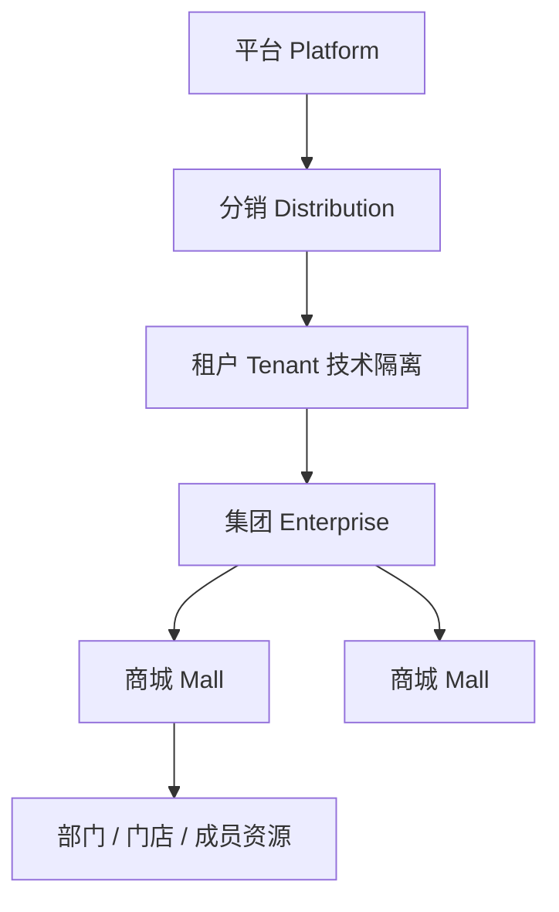

平台、分销、集团和商城是用户可理解的业务范围；Tenant 是数据隔离锚点，可在普通界面隐藏但不能从模型、RLS 或审计中移除。所有资源必须解析到一个权威 Scope；前端提交的 `scopeId` 只是请求上下文，不能扩大授权。

### 5.2 各范围主导航

| 范围 | 一级导航 | 二级入口 |
| --- | --- | --- |
| 平台 | 中控、商品池、卡券、渠道、设置 | 平台层级、全局能力、扩展健康、卡号库 |
| 分销 | 中控、分销、渠道、设置 | 分销商、绑定、配额、佣金、集团范围 |
| 集团 | 数据大屏、应用、商品、订单、卡券、财务、数据统计、客服、设置 | 对应 MVP 5—13 |
| 商城 | 数据、装修、商品、订单、卡券、财务、数据统计、客服、设置 | 对应 MVP 14—22 |

“设置”内部固定分组：

1. 组织与人员：成员、邀请、角色与权限、所有者转移、企业目录。
2. 业务资源：供应商、品牌、门店、商品资格、城市专区。
3. 连接：身份提供商、渠道连接、短信/通知端点。
4. 安全：风险策略、设备、会话、审计。
5. 系统：站点、域名、品牌、附件、服务健康。

### 5.3 财务信息架构

财务只保留一个顶级入口，内部按用户任务分成六组：

| 任务组 | 子页面 | 主要对象 |
| --- | --- | --- |
| 看经营资金 | 总览、资金账户、账本分录 | Account、Journal、Entry |
| 找差异 | 账单、支付对账、退款对账、对账批次、修复 | Statement、Reconciliation、Repair |
| 做结算 | 结算单、调整、审批 | Settlement、SettlementLine |
| 管提现 | 提现、付款、异常恢复、暂扣 | Withdrawal、Hold |
| 管发票 | 开票资料、申请、开具、下载、红冲 | InvoiceProfile、InvoiceRequest、Document |
| 管规则 | 财务策略、税务规则、期间、回补、审计 | Policy、Period、Backfill、Audit |

所有现有子路由进入上述页内导航；禁止存在可直达但主导航不可发现的“孤儿页面”。每组共享同一 `FinanceHeader`、`FinanceTabs`、`FilterBar`、`DataTable`、`DetailDrawer` 与状态词典。

---

## 6. 全局交互合同

### 6.1 页面固定骨架

每个业务页按以下顺序渲染：

1. `PageHeader`：中文标题、一句话用途、数据状态、一个主操作。
2. `ContextNotice`：只在确有权限、前置、延迟或风险信息时出现。
3. `ViewTabs`：只表达同一对象的不同视图，不承担主导航。
4. `FilterBar`：高频筛选、更多筛选、重置、已应用条件摘要。
5. `ResourceState`：加载、刷新、空、错误、拒绝、过期。
6. `DataTable` 或业务画布。
7. `Pagination`：游标分页、每页条数、当前加载数量。
8. `DetailDrawer`：详情与相关动作，不把必要主流程藏在二层弹窗。

### 6.2 异步状态

| 状态 | 必须显示 | 禁止 |
| --- | --- | --- |
| 首次加载 | 与最终布局同形的 Skeleton | 全屏旋转器导致布局跳变 |
| 后台刷新 | 保留旧数据、显示“正在更新”和最后成功时间 | 清空表格；无反馈刷新 |
| 空数据 | 原因、数据范围、推荐动作 | 只写“暂无数据” |
| 可恢复错误 | 中文原因、重试、请求编号 | 原始 Error、SQL、堆栈、英文代码 |
| 权限拒绝 | 所需角色/范围的业务解释和申请路径 | 暴露不存在资源或权限代码 |
| 合同过期 | “页面版本已更新，请刷新” | 继续使用旧 DTO 提交 |
| 局部失败 | 只替换失败区域，保留页面其余部分 | 整页进入错误边界 |

路由错误边界只处理无法恢复的装载错误；商品、订单、财务的数据错误必须先由 Feature Boundary 转成局部 `ResourceState`。Schema 解析失败上报 `observability.clienterrors.create`，页面显示安全提示和请求编号。

### 6.3 写操作状态机

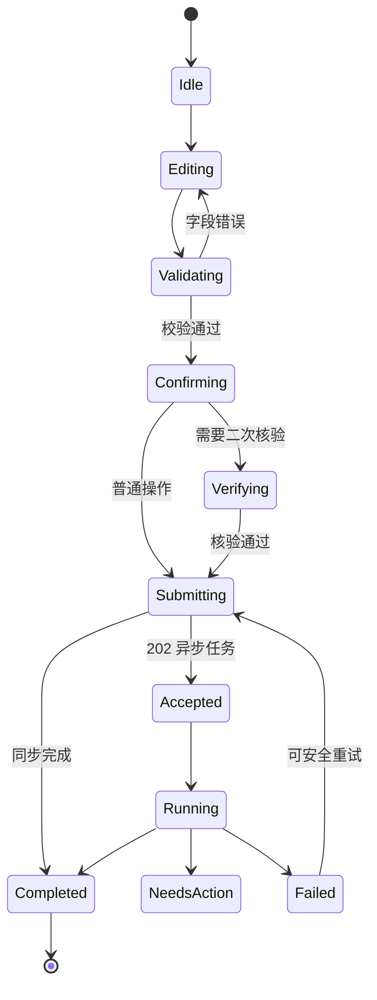

提交期间禁用重复提交但允许取消尚未发送的编辑；发送后关闭弹窗不能取消服务端任务。成功必须返回收据，包含业务对象、结果、影响范围、时间和后续入口。危险操作使用对象名称确认，不要求用户输入内部 ID。

### 6.4 未保存数据

- 表单草稿存入带 `scopeId + operation + resourceId + schemaVersion` 的本地草稿仓，敏感字段和密码不落本地。
- 离开页面、切换标签、切换 Scope、关闭浏览器前显示统一未保存提示。
- 服务端草稿使用 `expectedVersion` 与自动保存；冲突时展示字段级差异，不静默覆盖。
- 成功提交后才删除草稿；失败、掉线、刷新均可恢复。

### 6.5 筛选、表格与搜索

- 所有筛选选项来自服务端 Facet 或权威枚举，不渲染没有选项的下拉框。
- 搜索同时支持中文名、业务别名、编号后四位和技术代码；技术代码只在“高级信息”中显示。
- URL 保存可分享的查询条件，但不保存文件、密钥、PII 或未提交业务草稿。
- 表格默认按业务优先级展示 7—9 列；金额右对齐，状态居中，文本左对齐。
- 排序必须由服务端执行并显示当前排序；禁止只排序当前页却让用户误以为全量排序。
- 批量工具条只在选择行后出现；跨页全选必须明确范围和总数。
- CSV/Excel 导出由服务端冻结查询、水位、权限与列定义，生成任务和带时效签名下载地址。

### 6.6 中文化与业务引用

- 时间统一显示 `2026-09-04 14:30`，相对时间只作补充；详情可查看 UTC 原值。
- `draft`、`active`、`failed` 等状态全部通过 `packages/presentation` 翻译。
- UUID、Membership ID、Scope ID、Provider Reference 默认缩写为稳定业务引用，例如“成员 · 7B3A”；完整值只能复制，不作为主标题。
- 权限代码、事件 ID、请求 Hash、版本号集中在“技术详情”，普通用户默认看不到。
- 每个错误码只有一个中文标题、一个解释、一个推荐动作和一个是否可重试定义。

### 6.7 可访问性与键盘

- 所有交互使用语义元素；焦点顺序与视觉顺序一致。
- 弹窗打开后焦点进入标题或首字段，关闭后回到触发器；Drawer 不形成焦点陷阱。
- 表单错误通过 `aria-describedby` 关联；提交结果进入 Live Region。
- 颜色不是唯一状态信号；状态同时有图标和文本。
- 文本对比度 ≥ 4.5:1，大文本 ≥ 3:1；键盘焦点环始终可见。
- 200% 缩放、窄屏、减少动效和高对比模式均可完成主要旅程。

---

## 7. 五类关键阻断的根治方案

### 7.1 权限中心

#### 信息结构

```text
权限中心
├─ 成员与权限
├─ 岗位角色
├─ 项目范围
├─ 邀请
├─ 审批与例外
└─ 所有者转移
```

“新建角色”改为三步：

1. 选择岗位模板：商城运营、商品运营、订单客服、财务经办、财务复核、管理员、自定义。
2. 选择管理范围：集团、商城、部门、门店；页面用业务树，不要求填写 Scope ID。
3. 复核差异：新增、移除、显式拒绝、关键权限与需要二次核验的动作。

184 个权限和 33 个分类只在“自定义 → 高级权限”中出现。分类默认折叠，按中文业务域排序。搜索索引包含中文标题、同义词、对象、动作、权限代码和帮助文本；搜索“退款”必须匹配退款申请、退款审批、退款恢复等权限。

#### 草稿与安全

- Role Editor 每 2 秒或失焦自动保存非敏感草稿。
- 跨标签、路由和 Scope 离开前统一拦截。
- 保存前显示影响人数、影响范围、关键权限和职责分离冲突。
- 高风险变更使用 Step-up、`If-Match`、`Idempotency-Key` 和 Action Proof。
- Owner、财务经办/复核、发放申请/审批等互斥职责由服务端拒绝，不只在 UI 警告。
- 保存后重新读取 `accessVersion`，旧会话按策略失效。

#### 验收

- 新手从模板创建角色不超过 3 分钟、3 个页面步骤。
- 搜索中文业务词命中率 100%；无结果时提供同义词和高级代码搜索。
- 任意离开路径不丢草稿。
- 直接构造越权请求仍被服务端拒绝并审计。

### 7.2 商品总入口

- `/products` 首次读取只依赖一个聚合 Read Model，不由浏览器并发拼接供应商、价格、库存和范围数据。
- 列表必须返回 `productId`、名称、SKU 摘要、来源、商品池、商城覆盖、有效价、可售库存、状态、更新时间、版本和数据缺口。
- 单商品详情 `catalog.product.detail.read` 是权威详情，不再用列表快照假装详情。
- 新建、编辑、归档、投池、移池、发布、下架、批量上/下架、批量改价全部使用真实 Operation。
- 缺价格、库存、供应商协议或资格时显示具体缺口和修复入口，不让整页崩溃。
- 商品导入进入统一任务中心，服务端保存文件 Hash、映射、行结果和错误报告。

### 7.3 订单总入口

- `/orders` 使用 Order 聚合读模型，一次返回订单、支付、退款、履约和售后摘要及各自数据水位。
- 详情页是真实路由，不用只存在于 Drawer 的临时快照；Drawer 作为快速查看，详情页负责完整操作。
- 发货、售后审批、退货收货、质检、退款、支付恢复和提醒全部接入已有领域 Operation。
- 四条正交状态分别展示：订单、支付、履约、售后；禁止把“已支付”等同于“待发货”。
- 任何缺失读模型只影响对应面板，并显示“数据尚未同步/需要处理”，不制造默认成功状态。
- 如果保留“导入订单”，必须定义为受控的外部订单接入业务，创建 `order.imports.create/read`，只允许导入来源证明完整、未在系统存在且不可伪造资金的订单；否则从生产 UI 删除按钮。本方案默认保留并实现，以满足“所有可见功能补齐”。

### 7.4 财务总入口

- 根路由直接读取总览，不依赖某个标签的返回形状；每个子页面有独立 Schema 和局部错误边界。
- 账期、渠道、商城、状态、差异类型五个筛选由 `finance.facets.read` 返回；无选项时显示原因，不显示空 Select。
- 刷新显示加载态、最后成功时间和刷新结果；重复刷新合并为 Singleflight。
- 财务导入升级为 `finance.statementimports.create/read`，只导入支付/供应商账单，不允许导入账本分录或直接改余额。
- “开始对账”执行真实异步任务；差异修复遵循预览→提交→复核→执行→重新对账。
- 对账、结算、提现、发票、关账和回补均执行经办/复核分离。

### 7.5 三主题建店与装修

三套方案保留视觉差异，但共享一个产品模型：

| 主题 | 保留气质 | 只允许变化 | 不允许变化 |
| --- | --- | --- | --- |
| 静序 | 克制、秩序、留白 | 配色、字体尺度、模块编排 | 保存/发布语义、控件行为、状态词 |
| 东方策展 | 东方意象、策展式节奏 | 装饰、材质、版式比例 | 固定画布裁切、独立术语、独立按钮系统 |
| 暖筑工坊 | 温暖、模块化、亲和 | 卡片质感、色温、内容密度 | 二层弹窗、独立装修器、URL 假保存 |

统一装修器包含：页面树、组件库、中心画布、属性面板、版本与发布栏。动作链为“自动保存草稿→校验→预览→发布→查看版本→恢复”。预览与发布都读取相同不可变版本；候选主题保存为 `ExperienceVersion`，不是 URL 参数。历史、预览、发布按钮必须有真实结果、加载和错误状态。

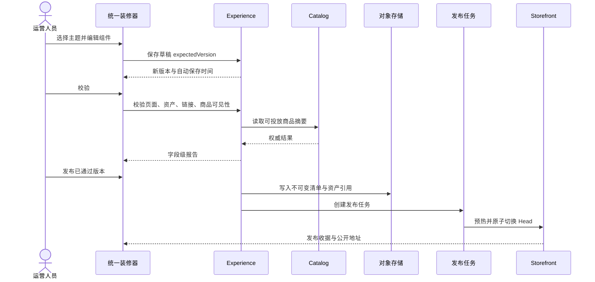

---

## 8. 全量功能闭环与需求追踪

### 8.1 “完成”的统一定义

每个需求必须形成如下追踪链，任何一环缺失都不能标记完成：

```text
Excel 行 → Requirement ID → 用户旅程 → 页面/入口 → Operation → Handler
→ 聚合与状态机 → 数据表/外部端口 → Event/Job → 审计/指标 → 自动化验收
```

完成状态由证据计算，不手工填写：

- `designed`：只有说明、原型或合同。
- `implemented`：生产代码存在并通过模块测试，但未证明跨模块闭环。
- `integrated`：真实依赖、权限、持久化、异步任务与错误恢复均已联通。
- `verified`：自动化旅程、视觉、可访问性、性能、安全与数据核对全部通过。
- `released`：生产配置、迁移、监控、回滚和负责人已就绪。

最终文档和生产界面不再使用“部分开放”。发布门只接受 `verified` 或 `released`。

### 8.2 MVP 上线清单逐条落点

下表覆盖权威工作簿 `MVP上线功能清单` A3:F24。原表中的“忽略”与“待定”只作为历史标记；本方案遵从全量验收要求，为每条给出最终落点。

| ID | 范围/主题 | 最终入口 | 主责模块 | 必须形成的真实闭环 | 最小验收证据 |
| --- | --- | --- | --- | --- | --- |
| MVPPLATFORM | 平台层级与卡号库 | 平台/设置/层级；平台/卡券/卡号库 | organization、voucher | 预留层级可配置；商品池绑定到层级；创建、导入、查询和停用卡号库 | 创建层级→建库→生成凭证→审计可追踪 |
| MVPDISTRIBUTION | 分销层 | 分销/分销商；分销/设置 | organization、partner、referral | 分销商建档、集团绑定、配额、范围、状态与结算关系 | 新建分销商→绑定集团→范围立即生效 |
| MVPGROUPDASHBOARD | 集团数据大屏 | 集团/数据大屏 | reporting | 销售金额、单量、退款、应用分布；实时、昨日、7/30 日；口径和水位可见 | 与订单/退款权威事实抽样核对一致 |
| MVPGROUPAPPLICATION | 集团应用 | 集团/应用 | experience、organization | 多应用创建、复制、管理、装修、域名与发布 | 创建→复制→装修→发布→消费者端可见 |
| MVPGROUPPOOL | 集团商品池 | 集团/商品 | catalog、pricing、inventory、qualification | 总池、渠道池、自有池、加价池；H5；增删改查、批量上下架、调价；池与商城/商品关联 | 批量投池后目标商城可售且价格库存正确 |
| MVPGROUPORDER | 集团订单售后 | 集团/订单 | order、fulfillment、payment、verification | 查询、详情、发货、退货、售后审批、退款、收货与恢复 | 下单→支付→发货→售后→退款全链路 |
| MVPGROUPVOUCHER | 集团卡券中心 | 集团/卡券 | voucher、approval、partner | 客户、产品、卡号库、审批、发放、激活/停用/延期/作废、绑定、核销、记录、统计 | 百万级生成/导入→审批→发放→核销→退款 |
| MVPGROUPFINANCE | 集团财务 | 集团/财务 | finance、payment、approval | 总览、商城财务、配置、对账单、发票、提现、结算与审计 | 对账差异→修复审批→结算→发票下载 |
| MVPGROUPREPORT | 集团数据统计 | 集团/数据统计 | reporting | 商品、商城、品类、渠道、卡券消耗报表及真实导出 | 冻结查询导出与页面口径一致 |
| MVPGROUPSUPPORT | 集团客服 | 集团/客服 | support、notification | 客服配置、会话、历史、分配、附件、关闭/重开 | 消费者发起→分配→回复→关闭→重开 |
| MVPGROUPSETTING | 集团设置 | 集团/设置 | identity、organization、access、partner、notification、risk | 管理员、角色权限、项目/范围、成员、供应商/门店、短信、风险自动上下架 | 新成员从邀请到有权操作；风险命中自动下架 |
| MVPMALLDASHBOARD | 商城数据 | 商城/数据 | reporting | 商城范围指标、趋势、商品与订单钻取 | Scope 隔离、口径水位和集团汇总可核对 |
| MVPMALLDESIGN | 商城装修 | 商城/装修 | experience | 统一装修器、三主题、草稿、校验、预览、发布、回滚 | 任意主题编辑后多端不裁切且可恢复版本 |
| MVPMALLPOOL | 商城商品 | 商城/商品 | catalog、pricing、inventory、qualification | 商品池选择、商城定价、上下架、库存和资格 | 无资格/无价/无库存均阻止发布并给修复入口 |
| MVPMALLORDER | 商城订单 | 商城/订单 | order、fulfillment、payment | 商城范围订单和售后处理 | 越权不可见；合法操作完整留痕 |
| MVPMALLVOUCHER | 商城卡券 | 商城/卡券 | voucher、approval | 商城范围发券、绑定、核销、查询与统计 | 集团策略内发放，跨商城不可越权 |
| MVPMALLFINANCE | 商城财务 | 商城/财务 | finance | 商城账单、对账、结算、提现、发票 | 集团汇总与商城明细金额恒等 |
| MVPMALLREPORT | 商城统计 | 商城/数据统计 | reporting | 商品、品类、渠道、订单和卡券报表 | 同一口径按 Scope 聚合，无跨租户泄露 |
| MVPMALLSUPPORT | 商城客服 | 商城/客服 | support | 商城队列、会话、历史与 SLA | 正确路由到商城队列，集团可监督 |
| MVPMALLSETTING | 商城设置 | 商城/设置 | organization、access、experience、partner、risk | 成员、角色、门店、供应商、品牌、短信、风险策略 | 设置变更版本化并影响对应 Scope |
| MVPIDENTITY | 用户注册登录 | 认证中心、消费者端 | identity、member、notification、risk | 密码、验证码、邀请注册、会话、换号、多成员身份、企业微信/微信绑定 | 注册→验证→登录→选身份→切换→注销 |
| MVPPROVIDER | 一期接口 | 平台/渠道；供应链后台 | channel、extension | 11 类供应商能力协商、配置、测试、同步、下单、履约、退款、账单和回调 | 沙箱合同套件与生产探针全部通过 |

### 8.3 当前业务功能清单的最终归宿

| 业务域 | 必须保留并补齐的能力 | 当前缺口的最终处理 |
| --- | --- | --- |
| 身份与登录 | 启动、密码/验证码登录、刷新、登出、邀请注册、多成员身份选择、成员身份切换、设备与会话、身份联邦、企业微信/微信绑定 | 邀请接受和二维码/SSO 接真实 Provider；多成员切换接主线 Operation；不再展示占位二维码 |
| 组织与商城 | 平台/分销/集团/商城、成员范围、应用、域名、品牌、站点、目录同步、所有者转移 | 建商城扩展字段进入聚合并持久化；服务中心做真实导航/任务聚合，不保留占位页 |
| 消费者商城 | 首页、搜索、分类、详情、报价、购物车、结算、订单、地址、收藏、卡包、账单、发票、通知、客服 | 地址编辑/删除、收藏、完整订单、物流、收货、售后、电子发票、卡包和账单全部接 Operation |
| 商品与商品池 | 供应商、类目、SPU/SKU、详情、价格、库存、资格、商品池、商城投放、上下架、归档、同步与导入 | 新建/编辑/归档/投池/调价/上下架接主线；Drawer 只快速预览，详情页读取权威详情 |
| 订单与履约 | 下单、支付、渠道单、发货、物流、收货、售后、退货、质检、退款、异常恢复 | 控制台全部写按钮接命令；订单导入转为受控业务；本地预览不算完成 |
| 商品资格 | 资格登记、审查、发布、撤销、到期和风险联动 | “发布”接真实命令；到期自动阻止商品可售并触发通知 |
| 推荐与佣金 | 推荐关系、归因、规则、佣金、锁定、结算、冲正、提现关联 | 使用 referral 聚合与财务事件，不在订单页重复计算 |
| 卡券与凭证 | 客户、产品、卡号库、凭证生成/导入/导出、库存申请、审批、发放批次、激活/停用/延期/作废、绑定、持有、冻结、核销、退款、统一检索、统计 | 采用新版丰富模型硬切；旧简化模型回填核对后删除；所有控制台按钮接真实命令 |
| 福利 | 福利计划、权益包、受益人、发放、领取、核销、撤销、过期 | 保留 benefit，与 voucher 明确边界：福利定义资格，卡券提供一种履约载体 |
| 渠道与供应商 | 连接、凭据、能力、连通性测试、启停、目录/库存/价格同步、下单、回调、补偿、重放 | 读页升级为完整工作台；密钥只在 Secret Store；重放必须幂等并审计 |
| 财务 | 账户、账本、账单、对账、差异修复、结算、调整、提现、暂扣、发票、期间、回补、审计 | 空筛选接 Facet；导入/对账/修复接任务；所有资金变更双录、不可变、可对账 |
| 风险与审计 | 风险策略、评估、阻断、自动上下架、设备、操作/数据/安全审计 | “风险规则待定”落为规则 DSL + 人工例外；审计不可修改且支持合规导出 |
| 客服 | 队列、会话、消息、附件、分配、转交、关联订单、关闭、重开、SLA | 附件、分配、关闭/重开全部补齐；会话消息实时化并保留持久历史 |
| 通知 | 模板、端点、偏好、任务、发布、发送、回执、失败重试 | 写入与发布接真实审批；禁止页面直接调用短信/邮件供应商 |
| 报表 | 实时/离线指标、口径、查询、导出、商品/商城/品类/渠道/卡券报表 | 导出接真实冻结任务；粉类等旧报表归并为配置化维度，不保留私有端点 |
| 自动化 | 作业、租约、心跳、重试、死信、回补、定时任务、Webhook | 统一进入 runtime；禁止每个模块各造队列/重试/导入表 |

### 8.4 所有可见占位的处理清单

| 位置 | 当前表现 | 最终处理 | 验收断言 |
| --- | --- | --- | --- |
| 消费者收藏 | 占位/静态 | member 收藏聚合，详情/列表可增删 | 跨设备同步，失效商品解释明确 |
| 地址编辑删除 | 部分开放 | member 地址版本化 CRUD 与默认地址约束 | 并发编辑不覆盖；默认地址唯一 |
| 完整订单详情 | 局部快照 | 订单详情路由与聚合读模型 | 刷新、深链、返回列表均保持上下文 |
| 收货/物流/售后 | 占位 | fulfillment/support/order 命令 | 每个状态转换满足前置并有事件 |
| 电子发票 | 占位 | finance 发票申请、开具、下载、红冲 | 文档可验证、下载授权限时 |
| 卡包/账单 | 占位 | voucher 持有视图、finance 消费者账单 | 金额/凭证与后台可核对 |
| 通知中心 | 占位 | notification 偏好、列表、已读 | 未读数一致，退订规则有效 |
| 客服/位置/分享 | Mock | support 实时会话；地址/门店位置；受控深链分享 | 真机旅程通过，链接不泄露 Scope |
| Android 原生示例 | Sample | 纳入 store/miniapp 的真实构建，或从产品矩阵删除 | 生产包无 Sample/Mock 文案 |
| 控制台快捷命令 | 无结果 | 映射真实导航或命令 | 每条结果可执行并受权限控制 |
| 任务与通知入口 | 静态角标 | runtime/notification 聚合 | 状态实时、数量可核对 |
| 商家服务中心 | 占位 | 组织、渠道、客服、任务的角色化入口 | 不重复实现业务，只做聚合导航 |
| 装修历史/预览/发布 | URL/提示 | Experience 版本状态机 | 保存、预览、发布、回滚有收据 |
| 商品新建/导入/详情 | 禁用/快照 | 真实命令、统一导入、详情 Query | 数据持久化并可再次读取 |
| 订单写操作 | 未接入 | 发货、售后、退款等 Operation | 故障、重试、并发场景通过 |
| 渠道管理 | 只读 | 建连、测试、启停、同步、重放 | 凭据脱敏，能力与健康可见 |
| 卡券操作 | 预览 | 新版凭证全生命周期 | 百万批次、审计、核销、退款通过 |
| 资格发布 | 禁用 | qualification 发布状态机 | 无资格商品不能变为可售 |
| 通知发布 | 禁用 | 模板版本、审批、发布、回滚 | 渲染快照与发送版本一致 |
| 报表导出 | 禁用 | reporting 冻结快照导出 | 大文件异步、权限与水印正确 |
| 财务导入/对账/修复 | 本地/提示 | 统一任务、对账引擎、审批执行 | 账本不被导入直接篡改 |

### 8.5 `zhudatuan_li` 独有能力的硬切映射

融合不按接口名称机械复制，而按业务语义归一：

| 来源语义 | 目标模块/聚合 | 处理决策 |
| --- | --- | --- |
| 所有者转移读取、预览、创建、取消、接受 | access / OwnershipTransfer | 与主线单一转移命令合并成完整状态机；保留预览与取消/接受 |
| 通用审批模板、任务、实例 | approval / Template、Instance、Task | 新增独立审批域；领域模块只提交请求、接收决定并完成自己的状态转换 |
| 已发布装修读取 | experience / PublishedExperience | 纳入公开只读模型和缓存失效，不保留私有路由 |
| 财务审计读取 | audit + finance projection | 审计事实归 audit，财务页只读投影 |
| 成员创建/重置、手机挑战、商城列表、微信绑定/会话 | identity、organization | 合并到身份生命周期和 Provider Port；删除重复挑战实现 |
| 库存可用量、定价 Offer | inventory、pricing | 保留为权威 Query；前端不得自行计算可售量和最终价 |
| 开票经办资料 | finance / InvoiceProfile | 纳入发票域模型 |
| 成员邀请读取 | identity / Invitation | 与主线邀请命令、接受流程统一 |
| 客户 CRUD/选项 | partner / Customer | 作为卡券客户、渠道客户与企业客户唯一主数据 |
| 支付意图创建 | payment / PaymentIntent | 与主线查询、回调和恢复组成闭环 |
| 商城创建/读取 Provisioning | organization + experience | 组织聚合创建资源，Experience 初始化站点；不保留 provisioning 模块 |
| 粉类报表 | reporting / DimensionPreset | 转为报表维度预设，删除专名 Operation |
| 约 74 个新版卡券 Operation | voucher + approval + partner | 完整保留语义，按目标聚合重命名和生成；旧卡券 API 硬切删除 |

### 8.6 新版凭证模型

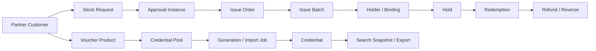

核心不变量：

- 一个凭证只属于一个卡号库和产品；明文密钥从不持久化或回显。
- 库存申请批准后才能发放；申请人与审批人不能是同一主体。
- 发放、激活、绑定、冻结、核销、退款均使用单调版本和幂等业务键。
- 同一凭证同时最多有一个有效 Hold；核销必须消费有效 Hold 或执行原子校验。
- 批量动作记录逐行结果，部分失败可重试但不会重做已成功行。
- 统一检索使用脱敏投影；全文索引、导出与主表之间有明确水位。
- 旧 `cardlibraries/programs/reserves/batches/status/bindings` 只在迁移期读取校验；切换日不双写，核对通过后删除表、合同和代码。

### 8.7 统一导入能力

导入框架属于 `runtime/importing` 技术内核，字段解释和逐行处理器属于对应业务模块。框架只负责对象存储、Hash、解析、分片、租约、进度、错误文件和重试，不知道“商品”或“卡券”的业务规则。

| 导入类型 | 所有者 | 输入 | 预检 | 提交结果 |
| --- | --- | --- | --- | --- |
| 成员 | identity/member | XLSX/CSV | 手机号、外部号、组织路径、重复身份 | Invitation/Member 创建或更新 |
| 商品 | catalog | XLSX/CSV | 类目、SPU/SKU、供应商、图片、必填属性 | Product/SKU 草稿及行级错误 |
| 库存 | inventory | XLSX/CSV/API 批次 | SKU、仓/门店、数量、时间水位 | StockLedger 追加记录 |
| 卡券凭证 | voucher | 加密文件/安全 API | 产品、卡号库、密文格式、重复指纹 | Credential 批次与安全收据 |
| 财务账单 | finance | Provider 文件/API | 渠道、账期、币种、总额、行 Hash | Statement，仅触发对账，不写账本 |
| 外部订单 | order | XLSX/CSV/API | 来源证明、去重键、金额分解、支付事实引用 | ImportedOrder；资金仍须 payment 证明 |

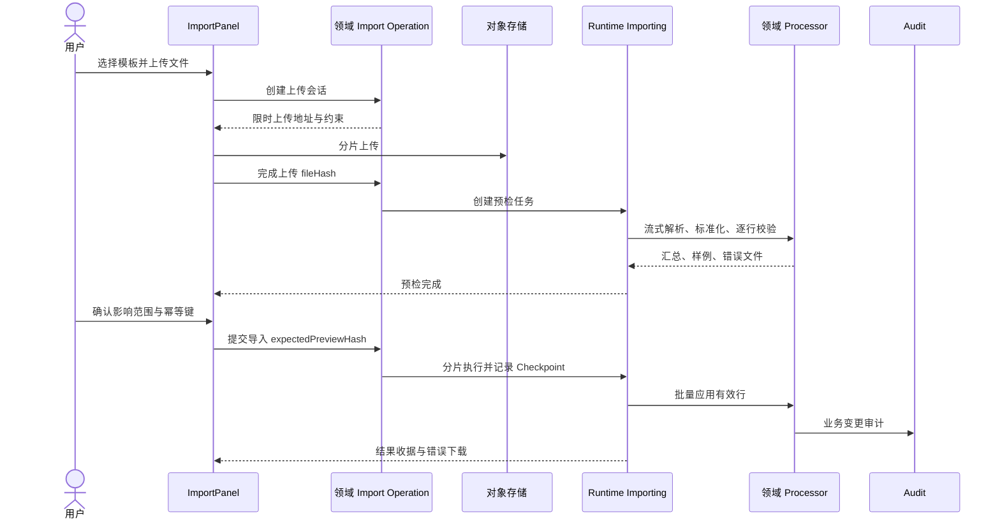

要求：上传会话与预检结果 24 小时过期；文件做恶意内容扫描；公式单元格按值读取且禁止注入；每个分片有内存/时间预算；百万行走流式解析；进度是已持久化记录，不由浏览器估算。

### 8.8 一期渠道扩展能力矩阵

| 扩展 | 必备能力 |
| --- | --- |
| 京东实物 `jdproduct` | Catalog、Price、Inventory、Order、Cancel、Return、Logistics、Refund、Statement、Webhook |
| 京东生鲜 `jdfresh` | Catalog、GeoStock、TimeSlot、Order、Cancel、Refund、Delivery、Statement、Webhook |
| 天猫超市 `tmall` | Catalog、Price、Inventory、Order、Cancel、Return、Logistics、Refund、Statement、Webhook |
| 自有供应商 `supplier` | Catalog、Inventory、Order、Shipment、Return、Refund、Statement |
| 蛋糕 `cake` | Catalog、GeoStore、TimeSlot、Order、Cancel、Delivery、Refund、Statement、Webhook |
| 鲜花 `flower` | Catalog、GeoDelivery、TimeSlot、Order、Substitute、Cancel、Delivery、Refund、Statement、Webhook |
| 图书 `book` | Catalog、Price、Inventory、Order、Cancel、Return、Shipment、Refund、Statement、Webhook |
| 虚拟直充 `charge` | Catalog、Issue、DirectCharge、Query、Refund、Statement、Verify、Webhook |
| 食品提货券 `foodvoucher` | Catalog、Issue、Bind、Verify、Void、Extend、Refund、Statement、Webhook |
| 电影 `movie` | Cinema、Show、SeatLock、Order、Issue、Cancel、Refund、Statement、Verify、Webhook |
| 在线点餐 `meal` | Brand、Store、Menu、Option、Price、Inventory、Order、Pickup、Cancel、Refund、Statement、Verify、Webhook |

每个扩展必须提供 `Manifest`、配置 Schema、凭据引用、能力列表、Sandbox、Contract Test、Health Probe、限流、熔断、Webhook 验签、幂等映射、错误分类和运维手册。扩展不能依赖领域模块实现；领域只依赖能力 Port。

---

## 9. 目标系统架构

### 9.1 系统上下文

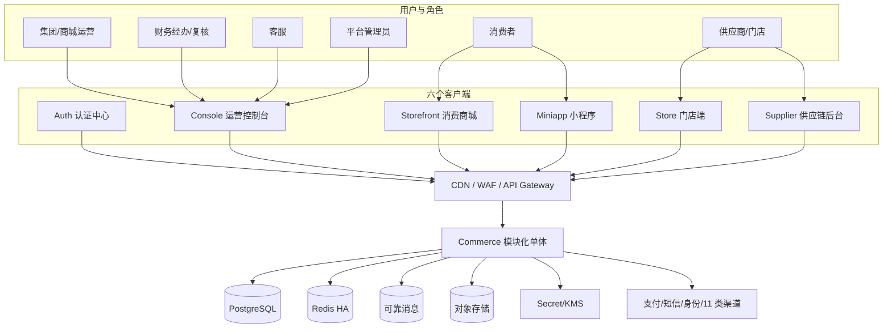

选择模块化单体而不是立即拆微服务，原因是订单、支付、卡券、库存、财务之间需要大量强一致本地事务；当前吞吐目标可由横向 API 副本、独立 Worker 池、分区与缓存满足。模块边界、Outbox 和 Port 已为未来按真实瓶颈拆分准备好，但不提前支付分布式复杂度。

### 9.2 逻辑分层与依赖方向

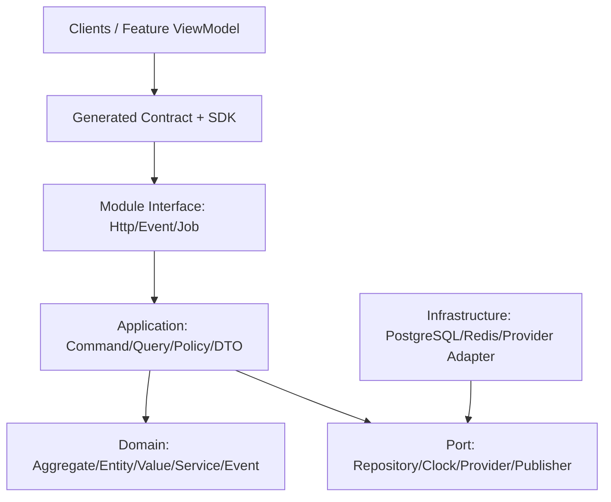

约束：

- Domain 不依赖框架、ORM、HTTP、队列、其他模块或生成 DTO。
- Application 编排一个用例，调用自己的聚合和显式外部 Port，不直接读其他模块表。
- Interface 只做协议适配；不含业务分支。
- Infrastructure 实现 Port；Provider 错误先转成领域可理解错误。
- 跨模块同步只调用对方 `public` Facade/Query；异步只消费发布的 Integration Event。
- 前端只调用生成 SDK；禁止手写路径、DTO 和权限字符串。

### 9.3 限界上下文地图

```mermaid
flowchart LR
    subgraph Governance[治理与主数据]
        identity --> organization --> access
        access --> capability
        access --> approval
        organization --> partner
        identity --> member
    end
    subgraph Trade[交易]
        qualification --> catalog --> pricing
        catalog --> inventory
        experience --> catalog
        marketing --> pricing
        referral --> checkout
        member --> cart --> checkout --> order --> fulfillment
    end
    subgraph Asset[资金与权益]
        checkout --> verification
        order --> payment
        order --> voucher
        benefit --> voucher
        payment --> finance
        voucher --> finance
        fulfillment --> finance
    end
    subgraph Ecosystem[生态]
        channel --> extension
        catalog --> channel
        order --> channel
        fulfillment --> channel
        finance --> channel
    end
    subgraph Platform[支撑]
        support
        notification
        reporting
        risk
        audit
        navigation
        runtime
        observability
    end
    order --> support
    Governance --> navigation
    Trade --> reporting
    Asset --> reporting
    Ecosystem --> reporting
    Governance --> audit
    Trade --> audit
    Asset --> audit
    Ecosystem --> audit
    risk --> access
    runtime --> notification
```

箭头只表示显式合同依赖，不代表表级访问。`audit`、`reporting` 等下游通过事件和只读接口获知事实；它们绝不能回写源聚合。

### 9.4 运行与部署拓扑

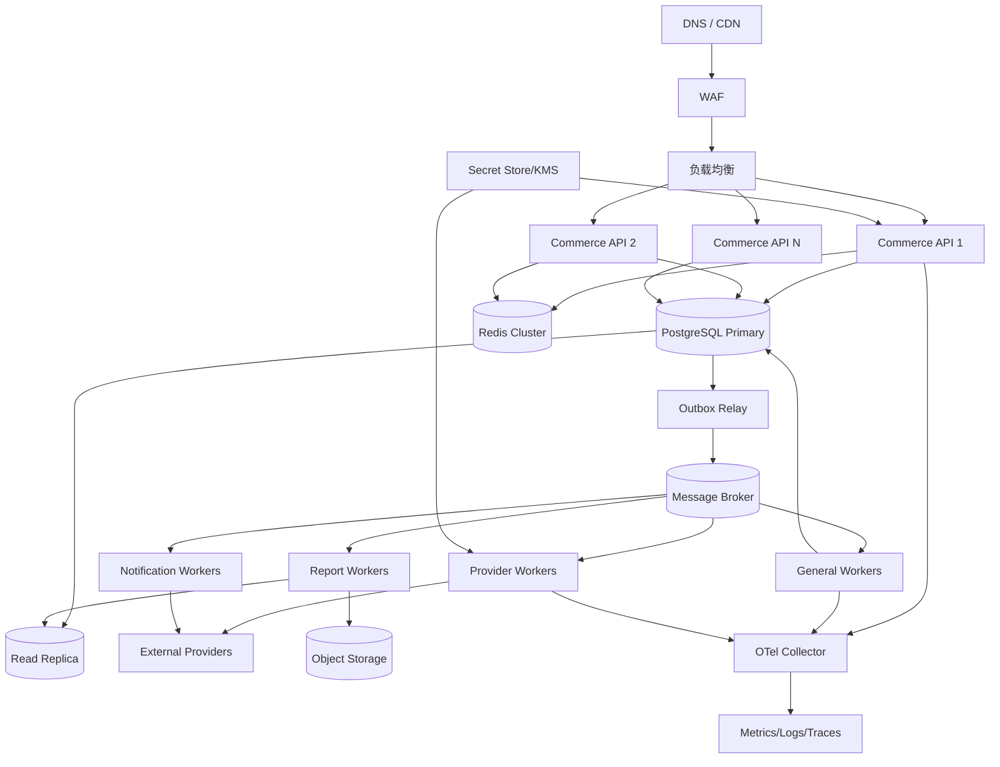

同一 OCI 镜像暴露四个显式入口：`ApiMain`、`JobsMain`、`ProviderMain`、`MigrationMain`。API 无本地会话状态；定时和异步任务由租约保证单一拥有者；Migration 作为一次性发布步骤运行。Provider Worker 与通用 Worker 分池，避免慢供应商拖垮订单核心。

### 9.5 关键请求执行管道

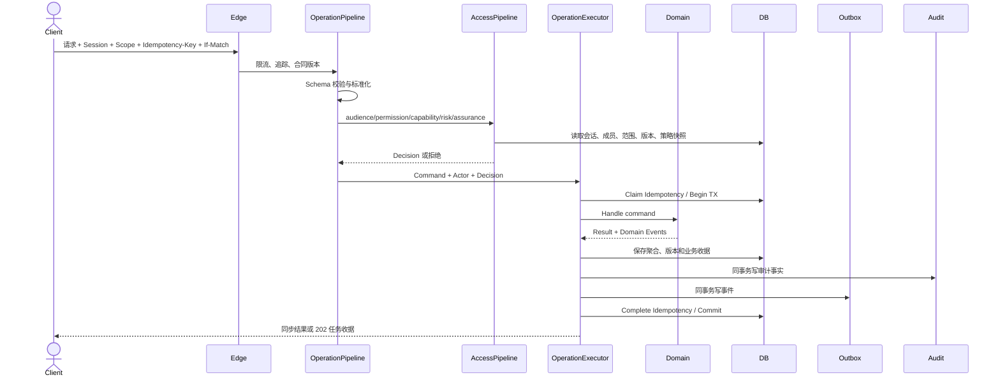

外部副作用使用 Prepare→Commit→Finalize：事务中只持久化意图与 Checkpoint，提交后执行外部调用；超时可按外部幂等键重试；回调和轮询共同收敛到相同状态机。

---

## 10. 跨模块端到端调用时序

### 10.1 注册、邀请与多成员身份登录

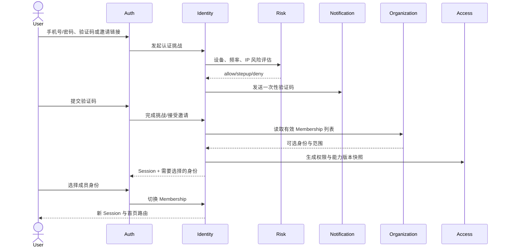

### 10.2 控制台启动与 Scope 切换

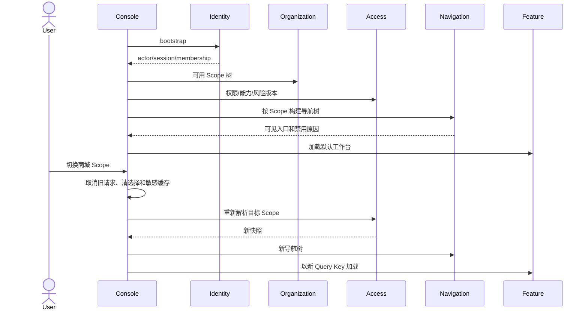

### 10.3 创建商城、复制应用并发布三主题站点

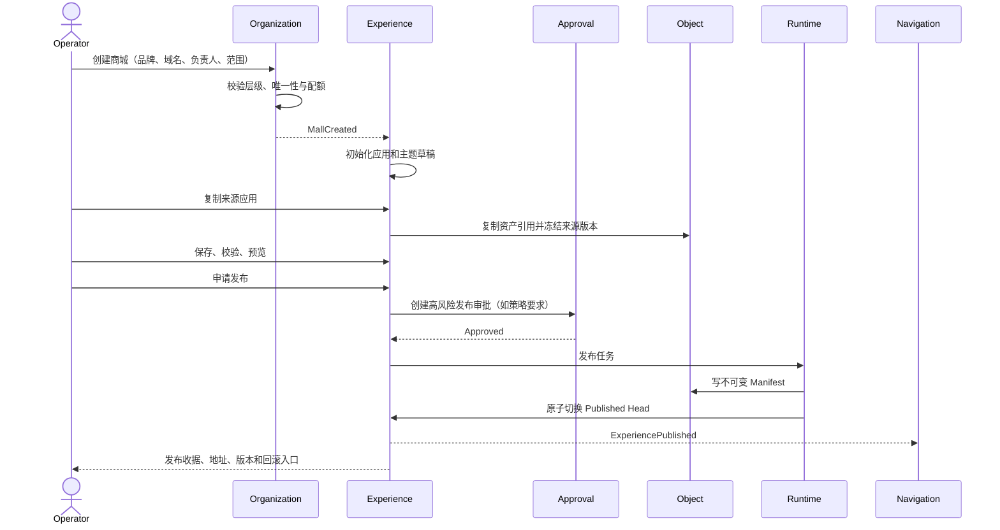

### 10.4 渠道商品同步、资格、价格与投池

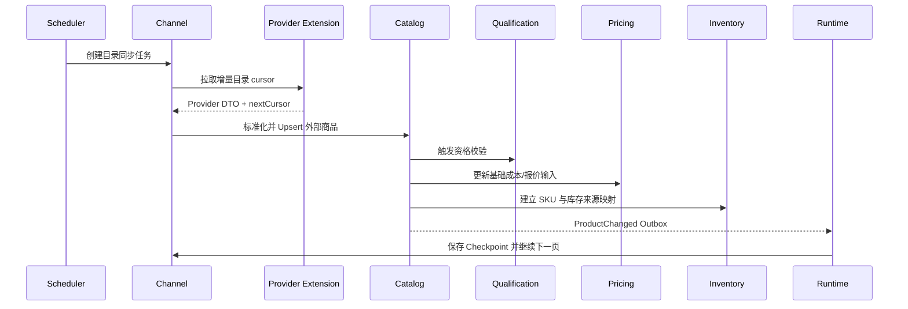

### 10.5 商品导入到可售发布

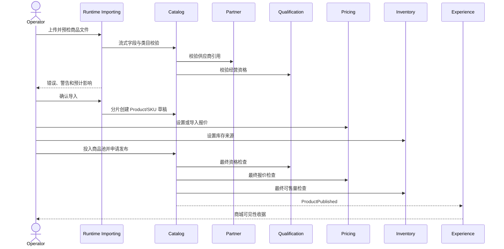

### 10.6 结算页并行报价与原子下单

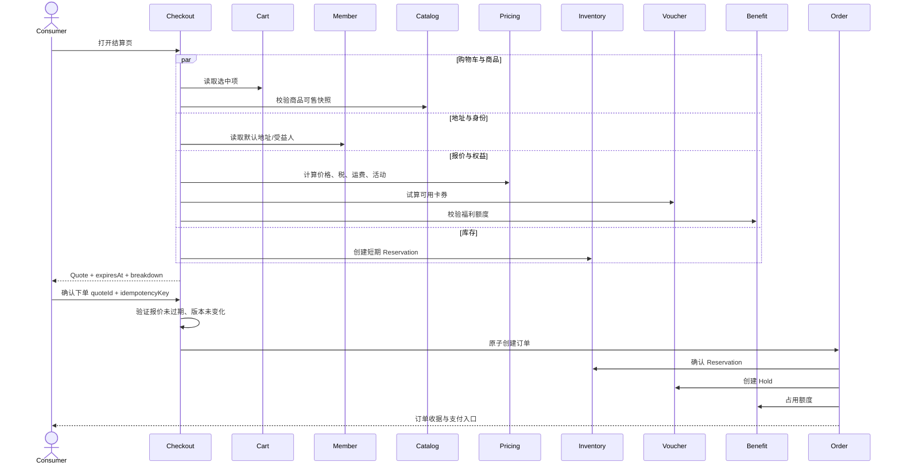

### 10.7 支付、迟到回调与恢复

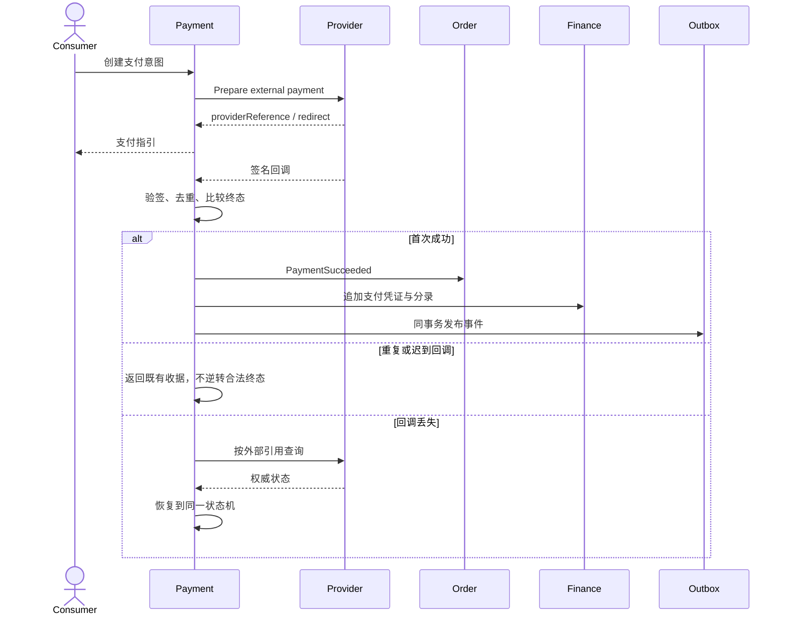

### 10.8 渠道下单与履约

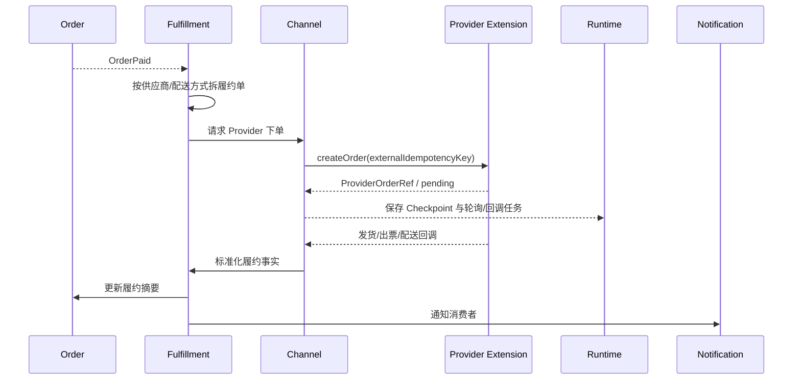

### 10.9 售后、退货、退款与权益释放

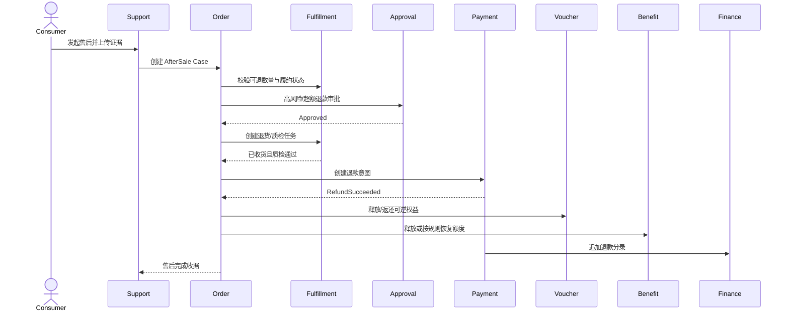

### 10.10 卡券申请、审批、发放与核销

```mermaid
sequenceDiagram
    actor Operator
    participant Partner
    participant Voucher
    participant Approval
    participant Runtime
    participant Notify as Notification
    participant Verify as Verification
    participant Finance
    Operator->>Partner: 选择客户与发放范围
    Operator->>Voucher: 创建库存申请/发放申请
    Voucher->>Voucher: 校验产品、库存、额度、重复对象
    Voucher->>Approval: 创建审批实例
    Approval-->>Voucher: Approved + proof
    Voucher->>Runtime: 创建发放批次
    Runtime->>Voucher: 分片分配 Credential 并建立 Holder
    Voucher->>Notify: 发送领取/到账通知
    Verify->>Voucher: 创建核销 Hold
    Voucher-->>Verify: 一次性验证令牌
    Verify->>Voucher: Commit redemption
    Voucher->>Finance: 发布卡券消费事实
```

### 10.11 财务账单导入、对账、修复与结算

```mermaid
sequenceDiagram
    actor Maker as 财务经办
    actor Checker as 财务复核
    participant Finance
    participant Import as Runtime Importing
    participant Payment
    participant Channel
    participant Approval
    participant Audit
    Maker->>Finance: 上传渠道/支付账单
    Finance->>Import: 预检并导入 Statement
    Maker->>Finance: 启动对账任务
    Finance->>Payment: 读取支付/退款事实快照
    Finance->>Channel: 读取供应商订单/退款映射
    Finance->>Finance: 按规则匹配并形成 Difference
    Finance-->>Maker: 差异分类、金额和证据
    Maker->>Finance: 创建修复建议
    Finance->>Approval: 请求复核
    Checker->>Approval: 审批
    Approval-->>Finance: Approved
    Finance->>Finance: 追加修复分录并重新对账
    Finance->>Audit: 写入完整证据链
    Finance-->>Maker: 对账/结算收据
```

### 10.12 客服会话与订单协同

```mermaid
sequenceDiagram
    actor Consumer
    actor Agent as 客服
    participant Support
    participant Order
    participant Member
    participant Notify as Notification
    Consumer->>Support: 创建会话/发送消息/附件
    Support->>Support: 路由商城队列并计算 SLA
    Support-->>Agent: 实时待接入通知
    Agent->>Support: 认领并回复
    Support->>Member: 读取脱敏客户摘要
    Support->>Order: 读取关联订单只读摘要
    Agent->>Support: 发起领域动作链接而非直接改订单
    Support-->>Order: 带上下文跳转到授权命令
    Agent->>Support: 关闭会话
    Support->>Notify: 满意度通知
    Consumer->>Support: 在策略时限内重开
```

### 10.13 报表冻结、生成与导出

```mermaid
sequenceDiagram
    actor User
    participant Reporting
    participant Access
    participant Replica as Read Replica
    participant Runtime
    participant Object
    participant Audit
    User->>Reporting: 提交报表条件与列
    Reporting->>Access: 固化 Actor/Scope/权限快照
    Reporting->>Reporting: 固化口径版本与数据水位
    Reporting->>Runtime: 创建导出任务
    Runtime->>Replica: 按游标分片查询投影
    Runtime->>Object: 流式写文件、压缩、加水印
    Runtime->>Audit: 记录导出范围与敏感等级
    Reporting-->>User: 限时签名下载地址
```

---

## 11. 每个模块内部的数据流与状态时序

### 11.0 模块内部统一模板

33 个业务/平台模块一律使用同一骨架：`public` 暴露 Facade 与合同，`application` 放用例，`domain` 放模型和规则，`port` 放外部抽象，`infrastructure` 放适配器，`interface` 放 HTTP/Event/Job 入口。Query 可以使用本模块投影，但不得越过所有权直接查询他域表。下列每条“事件”都先写本模块 Outbox，再由 Relay 发布；为避免图表重复，不在每张图中展开同事务 Outbox 细节。

### 11.1 Identity 身份

责任：认证主体、凭据、挑战、邀请接受、会话、设备、身份联邦、多成员身份选择与切换。聚合：`Principal`、`Credential`、`Challenge`、`Session`、`Invitation`、`FederationLink`。不变量：认证主体不等于组织成员；挑战一次性且过期；刷新令牌轮换；切换成员必须重新生成授权上下文。

```mermaid
sequenceDiagram
    participant I as Interface
    participant A as Application
    participant R as Risk Port
    participant P as Provider Port
    participant D as Identity Domain
    participant Repo
    I->>A: Authenticate / SwitchMembership
    A->>R: evaluate(context)
    A->>P: verifyCredential/challenge
    A->>Repo: load principal/session
    A->>D: authenticate/rotate/switch
    D-->>A: session + events
    A->>Repo: save with version
    A-->>I: session receipt
```

### 11.2 Organization 组织

责任：平台、分销、租户、集团、商城、部门、门店的层级与成员归属；商城创建和企业目录同步。聚合：`Organization`、`Mall`、`Membership`、`DirectoryConnection`。不变量：层级无环；资源只有一个归属根；商城编码/域名唯一；成员范围不得越出上级范围。

```mermaid
sequenceDiagram
    participant I as Interface
    participant A as Application
    participant Access as Access Facade
    participant D as Organization Domain
    participant Repo
    participant Experience as Experience Port
    I->>A: CreateMall command
    A->>Access: assert parent scope and quota
    A->>Repo: load parent/version
    A->>D: create mall with full profile
    D-->>A: MallCreated
    A->>Repo: save hierarchy + mall
    A->>Experience: initialize application asynchronously
    A-->>I: mall receipt
```

### 11.3 Access 访问控制

责任：角色、权限、策略、范围授权、显式拒绝、所有者转移、Action Proof 与职责分离。聚合：`Role`、`Grant`、`Policy`、`OwnershipTransfer`、`ActionProof`。不变量：默认拒绝；显式拒绝优先；权限与 Scope 同时满足；Owner 转移双边确认；高风险动作证明一次性。

```mermaid
sequenceDiagram
    participant I as Interface
    participant A as Application
    participant Org as Organization Query
    participant D as Access Domain
    participant Repo
    participant Audit
    I->>A: UpdateRole expectedVersion
    A->>Org: resolve scope descendants
    A->>Repo: load role/grants
    A->>D: validate SoD and compute diff
    D-->>A: new role + impact + event
    A->>Repo: save and bump accessVersion
    A->>Audit: record before/after proof
    A-->>I: change receipt
```

### 11.4 Capability 能力开关

责任：按环境、租户、集团、商城授予可发布能力，并表达依赖健康和配额；不代替权限。聚合：`CapabilitySet`、`Entitlement`。不变量：子级不能打开父级未授予能力；能力关闭后写入口立即拒绝；关闭不删除历史数据。

```mermaid
sequenceDiagram
    participant A as Application
    participant Catalog as Capability Catalog
    participant D as Capability Domain
    participant Repo
    participant Nav as Navigation Consumer
    A->>Catalog: validate key/dependencies
    A->>Repo: load inherited set
    A->>D: enable/disable with scope
    D->>D: enforce parent and quota
    A->>Repo: save version
    A-->>Nav: CapabilityChanged
```

### 11.5 Approval 审批

责任：可配置审批模板、实例、任务、经办/复核、升级、超时和决定证明。聚合：`ApprovalTemplate`、`ApprovalInstance`、`ApprovalTask`。不变量：审批人不能是受约束的申请人；已决定实例不可重开；模板版本在实例创建时冻结；审批只给决定，最终领域变更仍由请求域执行。

```mermaid
sequenceDiagram
    participant Domain as Requesting Domain
    participant A as Approval Application
    participant D as Approval Domain
    participant Repo
    participant Notify
    Domain->>A: request(subject, action, evidence)
    A->>Repo: load active template version
    A->>D: create instance and tasks
    A->>Repo: save
    A->>Notify: task assigned
    Notify-->>A: approver decision
    A->>D: decide with SoD check
    A->>Repo: save immutable proof
    A-->>Domain: ApprovalDecided
```

### 11.6 Partner 合作方

责任：供应商、分销商、企业客户、卡券客户、合同关系和业务选项的唯一主数据。聚合：`Partner`、`Customer`、`Agreement`。不变量：统一社会/外部标识在租户内唯一；停用合作方阻止新交易但保留历史；敏感联系人按字段授权。

```mermaid
sequenceDiagram
    participant I as Interface
    participant A as Application
    participant D as Partner Domain
    participant Repo
    participant Qual as Qualification Port
    I->>A: Create/Update Partner
    A->>Repo: check identity and version
    A->>D: validate profile/agreement
    A->>Qual: verify required qualification
    Qual-->>A: result
    A->>Repo: save partner
    A-->>I: business reference receipt
```

### 11.7 Member 成员与消费者资料

责任：个人资料、地址、收藏、偏好、受益人关系和脱敏展示。聚合：`MemberProfile`、`AddressBook`、`FavoriteList`、`Preference`。不变量：一个主体在同租户只有一个成员档案；默认地址唯一；收藏按成员+商品唯一；删除采用业务失效而非抹除审计。

```mermaid
sequenceDiagram
    participant UI
    participant A as Member Application
    participant D as Member Domain
    participant Repo
    participant Catalog as Catalog Query
    UI->>A: SaveAddress / ToggleFavorite
    A->>Repo: load profile + version
    opt Favorite
        A->>Catalog: verify product visibility
    end
    A->>D: apply command
    D-->>A: state + event
    A->>Repo: save
    A-->>UI: updated view
```

### 11.8 Qualification 经营资格

责任：主体/商品/类目/区域资格材料、审查、发布、撤销和到期。聚合：`QualificationCase`、`Evidence`。不变量：只有已核验且未过期资格可发布；材料对象不可被任意覆盖；撤销立即影响新交易并触发商品风险处理。

```mermaid
sequenceDiagram
    participant A as Application
    participant D as Qualification Domain
    participant Object
    participant Repo
    participant Risk
    participant Catalog
    A->>Object: verify evidence hashes
    A->>Repo: load case/version
    A->>D: review/publish/revoke
    D-->>A: QualificationChanged
    A->>Repo: save
    A-->>Risk: changed event
    Risk-->>Catalog: block/unlist affected products
```

### 11.9 Catalog 商品目录

责任：类目、品牌、属性、商品、SKU、商品池、投放关系、来源映射、导入和生命周期。聚合：`Product`、`Category`、`Pool`、`Listing`。不变量：SKU 编码作用域唯一；归档商品不可新投放；可售 Listing 必须同时满足资格、价格、库存和渠道约束。

```mermaid
sequenceDiagram
    participant I as Interface
    participant A as Catalog Application
    participant D as Catalog Domain
    participant Qual as Qualification Query
    participant Price as Pricing Query
    participant Stock as Inventory Query
    participant Repo
    I->>A: PublishListing
    A->>Repo: load product/pool/listing
    par dependencies
        A->>Qual: assert valid
        A->>Price: assert effective offer
        A->>Stock: assert source available
    end
    A->>D: publish(expectedVersion)
    A->>Repo: save + projection
    A-->>I: publication receipt
```

### 11.10 Pricing 定价

责任：成本、报价、加价、促销叠加、税费、运费和最终价格快照。聚合：`PriceBook`、`Offer`、`PricingRule`。不变量：金额使用整数最小货币单位；规则有生效区间和优先级；订单只引用冻结 Quote，不重新解释历史规则。

```mermaid
sequenceDiagram
    participant C as Caller
    participant A as Pricing Application
    participant D as Pricing Engine
    participant Repo
    participant Marketing
    A->>Repo: load offers/rules at watermark
    A->>Marketing: eligible adjustments
    A->>D: calculate(items, scope, member, time)
    D->>D: cost + markup + discount + tax + freight
    D-->>A: immutable Quote + breakdown
    A->>Repo: save quote with expiry/hash
    A-->>C: quote
```

### 11.11 Inventory 库存

责任：库存来源、账本、可用量、预占、释放、确认、同步水位和库存导入。聚合：`StockItem`、`Reservation`、`StockSource`。不变量：可用量=在手−有效预占−安全库存；账本只追加；预占有 TTL；确认/释放幂等且不能同时成功。

```mermaid
sequenceDiagram
    participant C as Checkout/Order
    participant A as Inventory Application
    participant D as Inventory Domain
    participant Repo
    participant Runtime
    C->>A: reserve(sku, qty, quoteId)
    A->>Repo: lock stock item
    A->>D: reserve with TTL
    D-->>A: reservation or insufficient
    A->>Repo: append ledger + save reservation
    A->>Runtime: schedule expiry
    A-->>C: reservation receipt
    Runtime->>A: expire if still active
```

### 11.12 Experience 应用与装修

责任：应用、页面树、组件配置、主题、资产、草稿、校验、预览、发布 Head 与版本恢复。聚合：`Application`、`ExperienceVersion`、`Publication`。不变量：发布版本不可变；预览和发布使用同一清单；恢复产生新版本而非改历史；组件配置必须通过版本化 Schema。

```mermaid
sequenceDiagram
    participant Editor
    participant A as Experience Application
    participant D as Experience Domain
    participant Catalog
    participant Object
    participant Repo
    Editor->>A: SaveDraft expectedVersion
    A->>D: normalize component tree
    A->>Catalog: validate referenced listings
    A->>Object: verify asset hashes
    D-->>A: version + validation result
    A->>Repo: append immutable version
    Editor->>A: Publish(versionId)
    A->>D: move published head
    A->>Repo: save publication atomically
```

### 11.13 Marketing 营销

责任：活动、优惠规则、资格、预算和叠加/互斥策略；不拥有最终订单价格。聚合：`Campaign`、`PromotionRule`、`Budget`。不变量：规则在有效期和 Scope 内生效；预算原子占用；同组互斥；历史订单引用规则快照。

```mermaid
sequenceDiagram
    participant Pricing
    participant A as Marketing Application
    participant D as Eligibility Engine
    participant Repo
    participant Budget
    Pricing->>A: evaluate(context, items)
    A->>Repo: load active rule snapshot
    A->>D: filter and resolve stacking
    D->>Budget: check/reserve limits
    Budget-->>D: reservation
    D-->>Pricing: adjustments + evidence
```

### 11.14 Referral 推荐与佣金

责任：推荐关系、归因、佣金规则、计算、锁定、释放、冲正和结算引用。聚合：`ReferralRelation`、`Attribution`、`Commission`、`CommissionRule`。不变量：归因窗口固定；禁止自推荐和关系环；同订单行同规则只计一次；退款按原计算证据冲正。

```mermaid
sequenceDiagram
    participant Order
    participant A as Referral Application
    participant D as Commission Domain
    participant Repo
    participant Finance
    Order-->>A: OrderPaid
    A->>Repo: load attribution/rule snapshot
    A->>D: calculate and lock commission
    A->>Repo: save commission evidence
    Order-->>A: RefundSucceeded
    A->>D: reverse proportional amount
    A->>Repo: append reversal
    A-->>Finance: CommissionReady/Adjusted
```

### 11.15 Cart 购物车

责任：消费者选品、数量、选中状态和轻量商品引用。聚合：`Cart`。不变量：购物车不冻结价格和库存；商品失效不静默删除；合并匿名/登录购物车按业务键去重。

```mermaid
sequenceDiagram
    participant UI
    participant A as Cart Application
    participant Catalog
    participant D as Cart Domain
    participant Repo
    UI->>A: Add/Update/Remove item
    A->>Catalog: read listing summary
    A->>Repo: load cart/version
    A->>D: apply item command
    A->>Repo: save
    A-->>UI: cart with validity hints
```

### 11.16 Checkout 结算

责任：汇聚购物车、地址、商品、价格、库存、卡券和福利，生成短时不可变 Quote，并把确认转成订单命令。聚合：`CheckoutSession`、`Quote`。不变量：Quote 有 Hash/版本/过期时间；确认必须匹配原上下文；失败需释放预占和 Hold。

```mermaid
sequenceDiagram
    participant UI
    participant A as Checkout Application
    participant Price
    participant Stock
    participant Voucher
    participant D as Checkout Domain
    participant Repo
    participant Order
    UI->>A: CreateQuote
    par calculate
        A->>Price: quote
        A->>Stock: reserve
        A->>Voucher: preview/hold
    end
    A->>D: assemble and hash quote
    A->>Repo: save with TTL
    UI->>A: ConfirmQuote
    A->>D: assert current and unchanged
    A->>Order: create from frozen quote
```

### 11.17 Order 订单

责任：订单、订单项、金额分解、渠道路由、取消、售后 Case、外部订单接入和生命周期摘要。聚合：`Order`、`AfterSaleCase`、`OrderImport`。不变量：订单金额守恒；状态转换单调且受前置约束；业务订单号唯一；支付、履约、售后是正交状态；导入不可伪造资金。

```mermaid
sequenceDiagram
    participant C as Checkout/Console
    participant A as Order Application
    participant D as Order Domain
    participant Repo
    participant Inventory
    participant Payment
    participant Fulfill as Fulfillment
    C->>A: Create/Cancel/AfterSale command
    A->>Repo: load order/version
    A->>D: validate transition and amounts
    D-->>A: state + domain events
    A->>Repo: save aggregate/read summary
    A-->>Inventory: confirm/release event
    A-->>Payment: payment/refund intent event
    A-->>Fulfill: fulfillment action event
    A-->>C: order receipt
```

### 11.18 Fulfillment 履约

责任：履约单拆分、供应商下单、发货、配送、虚拟发放、退货、收货和质检。聚合：`FulfillmentOrder`、`Shipment`、`Return`、`Inspection`。不变量：订单项履约数量守恒；Provider 回调幂等；退货不能超过已履约可退数量；收货不等于退款成功。

```mermaid
sequenceDiagram
    participant Event as Order Events
    participant A as Fulfillment Application
    participant D as Fulfillment Domain
    participant Channel
    participant Repo
    participant Order
    Event->>A: OrderPaid/ReturnApproved
    A->>Repo: load fulfillment
    A->>D: split/ship/receive/inspect
    A->>Channel: invoke provider capability
    Channel-->>A: normalized result
    A->>Repo: save state + provider refs
    A-->>Order: FulfillmentChanged
```

### 11.19 Verification 核验

责任：门店/服务端核验挑战、一次性令牌、二维码、防重放和提交核销。聚合：`VerificationSession`、`VerificationToken`。不变量：令牌短时、一次性、绑定对象/门店/操作员；预检不产生核销；提交必须引用当前 Hold。

```mermaid
sequenceDiagram
    actor Clerk
    participant A as Verification Application
    participant Risk
    participant D as Verification Domain
    participant Voucher
    participant Repo
    Clerk->>A: Scan/Enter token
    A->>Risk: device/operator evaluation
    A->>D: verify signature, scope and expiry
    A->>Voucher: preview redeemable object
    A-->>Clerk: masked details and impact
    Clerk->>A: Confirm
    A->>Voucher: commit redemption with nonce
    A->>Repo: consume token
```

### 11.20 Payment 支付

责任：支付意图、外部支付、回调、查询恢复、退款、路由和支付凭证。聚合：`PaymentIntent`、`PaymentAttempt`、`RefundIntent`。不变量：同订单同支付目的的活动意图唯一；金额不可超过应付/可退；终态不被迟到消息逆转；外部请求有稳定幂等键。

```mermaid
sequenceDiagram
    participant I as Interface
    participant A as Payment Application
    participant D as Payment Domain
    participant Provider
    participant Repo
    participant Finance
    I->>A: CreateIntent/HandleCallback/Refund
    A->>Repo: load intent/version
    A->>D: prepare transition
    A->>Repo: save pending + checkpoint
    A->>Provider: execute/query by external key
    Provider-->>A: signed result
    A->>D: finalize monotonically
    A->>Repo: save final state
    A-->>Finance: Payment/Refund Succeeded
```

### 11.21 Voucher 卡券与凭证

责任：卡券客户引用、产品、卡号库、凭证、库存申请、发放、生命周期、持有人、冻结、核销、退款、检索、批次和导出。聚合：`VoucherProduct`、`CredentialPool`、`Credential`、`StockRequest`、`IssueOrder`、`IssueBatch`、`Holder`、`Redemption`。不变量见 8.6，特别是密钥不可逆保护、发放审批、单一有效 Hold 和批量逐行幂等。

```mermaid
sequenceDiagram
    participant C as Console/Verification
    participant A as Voucher Application
    participant Approval
    participant D as Voucher Domain
    participant Repo
    participant Crypto
    participant Runtime
    C->>A: Generate/Import/Issue/Redeem command
    A->>Approval: require proof when configured
    A->>Repo: load product/pool/credential
    A->>Crypto: tokenize/hash sensitive material
    A->>D: apply lifecycle transition
    D-->>A: result + per-item events
    A->>Repo: save versioned aggregate
    A->>Runtime: schedule bulk continuation
    A-->>C: receipt/job
```

### 11.22 Benefit 福利

责任：福利计划、权益包、受益资格、额度、发放、领取、消费和撤销；可把卡券作为履约载体。聚合：`BenefitPlan`、`EntitlementPackage`、`BeneficiaryAccount`、`BenefitGrant`。不变量：计划范围和有效期固定；额度不超发；同来源发放幂等；福利撤销不直接篡改已完成资金事实。

```mermaid
sequenceDiagram
    participant Operator
    participant A as Benefit Application
    participant D as Benefit Domain
    participant Member
    participant Voucher
    participant Repo
    Operator->>A: PublishPlan/Grant
    A->>Member: resolve eligible beneficiaries
    A->>Repo: load plan/accounts
    A->>D: allocate within budget
    A->>Repo: save grants and balances
    opt voucher carrier
        A->>Voucher: issue from approved product
    end
    A-->>Operator: grant job receipt
```

### 11.23 Finance 财务

责任：资金账户、复式账本、分录、账单、对账、差异、修复、结算、调整、提现、暂扣、发票、期间和回补。聚合：`Ledger`、`Journal`、`Statement`、`Reconciliation`、`Settlement`、`Withdrawal`、`InvoiceRequest`、`FinancialPeriod`。不变量：每个 Journal 借贷平衡；分录只追加；币种不混算；关账期间不可直接写；人工修复与资金流经办复核分离。

```mermaid
sequenceDiagram
    participant Event as Payment/Order/Voucher Event
    participant A as Finance Application
    participant D as Finance Domain
    participant Repo
    participant Approval
    participant Runtime
    Event->>A: Recognize financial fact
    A->>Repo: load policy/account/idempotency ref
    A->>D: build balanced journal
    D->>D: assert debit equals credit
    A->>Repo: append journal/entries
    opt reconciliation or payout
        A->>Approval: request checker proof
        A->>Runtime: execute approved job
    end
```

### 11.24 Channel 渠道编排

责任：渠道连接、能力选择、同步游标、外部订单映射、调用策略、回调接收和重放。聚合：`Connection`、`SyncCursor`、`ExternalMapping`、`WebhookReceipt`。不变量：凭据只保存 Secret 引用；连接只有在测试通过后启用；外部引用在 Provider 内唯一；回调先验签再落 Inbox。

```mermaid
sequenceDiagram
    participant Domain as Calling Domain
    participant A as Channel Application
    participant Registry as Extension Registry
    participant D as Channel Domain
    participant Secret
    participant Ext as Extension
    participant Repo
    Domain->>A: invoke required capability
    A->>Registry: resolve enabled extension
    A->>Repo: load connection/rate policy
    A->>Secret: lease credential
    A->>Ext: normalized request + idempotency
    Ext-->>A: normalized result/error
    A->>D: update cursor/mapping/health
    A->>Repo: save checkpoint
    A-->>Domain: domain result
```

### 11.25 Extension 扩展注册

责任：Manifest 发现、版本与能力协商、配置 Schema、生命周期、沙箱与合同测试；不承载业务数据。聚合：`ExtensionRegistration`、`ExtensionRelease`。不变量：签名和版本兼容通过才能启用；能力声明与可执行端口一致；一个连接固定到可审计版本。

```mermaid
sequenceDiagram
    participant Deploy
    participant A as Extension Application
    participant D as Registry Domain
    participant Test as Contract Test Runner
    participant Repo
    participant Channel
    Deploy->>A: Register signed manifest
    A->>D: validate id/version/schema/capabilities
    A->>Test: run sandbox contract suite
    Test-->>A: evidence bundle
    A->>D: approve release
    A->>Repo: save registration/evidence
    A-->>Channel: ExtensionAvailable
```

### 11.26 Support 客服

责任：队列、会话、消息、附件、分配、转交、SLA、关联资源、关闭和重开。聚合：`Conversation`、`Queue`、`Message`、`Attachment`。不变量：消息顺序有服务端序号；附件先扫描后可见；客服读取按分配与 Scope；关闭/重开遵循策略窗口。

```mermaid
sequenceDiagram
    participant Client
    participant A as Support Application
    participant D as Support Domain
    participant Object
    participant Repo
    participant Notify
    Client->>A: SendMessage/Assign/Close
    opt attachment
        A->>Object: scan and seal object
    end
    A->>Repo: load conversation/version
    A->>D: append ordered message/transition
    A->>Repo: save + update SLA projection
    A->>Notify: publish recipient update
    A-->>Client: sequence and receipt
```

### 11.27 Notification 通知

责任：模板与版本、偏好、端点、投递任务、渠道选择、回执、退订、失败分类和重试。聚合：`Template`、`Endpoint`、`Delivery`、`Preference`。不变量：发送使用冻结模板版本；用户退订优先于营销任务；事务类消息只受合法强制规则影响；Provider 回执幂等。

```mermaid
sequenceDiagram
    participant Event
    participant A as Notification Application
    participant D as Notification Domain
    participant Repo
    participant Provider
    participant Runtime
    Event->>A: request notification
    A->>Repo: load template/preference/endpoint
    A->>D: render and choose channel
    A->>Repo: save delivery pending
    A->>Provider: send with external key
    Provider-->>A: accepted/failed/receipt
    A->>D: classify result
    A->>Runtime: retry recoverable failure
```

### 11.28 Reporting 报表

责任：指标与维度目录、口径版本、投影、水位、查询、快照、导出和数据质量。聚合：`MetricDefinition`、`ReportQuery`、`ExportJob`、`DataWatermark`。不变量：指标口径版本化；查询绑定 Scope 和数据水位；导出不扩大当前权限；报表不成为交易事实源。

```mermaid
sequenceDiagram
    participant Event as Integration Events
    participant Projector
    participant Projection
    participant A as Reporting Application
    participant Access
    participant Runtime
    Event->>Projector: consume with inbox id
    Projector->>Projection: idempotent upsert + watermark
    A->>Access: authorize scope/fields
    A->>Projection: execute governed query
    alt large export
        A->>Runtime: create frozen export job
    else interactive
        A-->>A: return data + definition + watermark
    end
```

### 11.29 Risk 风险

责任：规则、信号、决策、名单、频率、设备/IP 风险、自动上下架与人工例外。聚合：`RiskPolicy`、`RiskDecision`、`RiskException`。不变量：策略版本随决定冻结；高风险默认失败关闭；人工例外有期限和审批；风险不直接改他域表，只发出有证据的动作请求。

```mermaid
sequenceDiagram
    participant Caller
    participant A as Risk Application
    participant D as Risk Engine
    participant Repo
    participant Approval
    participant Target as Catalog/Access
    Caller->>A: evaluate signals/context
    A->>Repo: load policy/version/lists
    A->>D: evaluate deterministic rules
    D-->>A: allow/stepup/deny/action + evidence
    opt automated action
        A->>Target: request block/unlist with proof
    end
    opt exception
        A->>Approval: require time-bounded approval
    end
    A->>Repo: append decision
```

### 11.30 Audit 审计

责任：操作、数据、身份、安全、审批和导出的不可变审计事实、证据包与合规检索。聚合：`AuditRecord`、`EvidenceBundle`。不变量：只追加、防篡改 Hash 链、统一 Actor/Scope/Request/Operation；敏感字段脱敏；普通管理员不能删除或修改。

```mermaid
sequenceDiagram
    participant Pipeline
    participant A as Audit Application
    participant D as Audit Domain
    participant Repo
    participant Archive
    Pipeline->>A: append decision/change/evidence
    A->>D: canonicalize and redact
    D->>D: calculate previousHash/currentHash
    A->>Repo: append record in transaction
    A->>Archive: seal periodic evidence bundle
    A-->>Pipeline: audit id
```

### 11.31 Navigation 导航

责任：导航目录、路由元数据、范围适用性、权限/能力/健康过滤、面包屑和默认入口。聚合：`NavigationCatalog`、`NavigationSnapshot`。不变量：导航不是授权；无真实页面/Operation 的入口不能发布；所有深链可反向解析面包屑；同 Scope 输出稳定排序。

```mermaid
sequenceDiagram
    participant Shell
    participant A as Navigation Application
    participant Catalog
    participant Access
    participant Capability
    participant Health
    participant D as Navigation Domain
    Shell->>A: tree(scope, actor)
    A->>Catalog: load generated routes
    par filters
        A->>Access: permission snapshot
        A->>Capability: capability snapshot
        A->>Health: dependency status
    end
    A->>D: filter/group/order/explain
    D-->>Shell: tree + default route + disabled reasons
```

### 11.32 Runtime 运行时

责任：幂等、事务执行、Outbox/Inbox、作业、租约、调度、导入、回补、Deadletter、限流与分布式协调。聚合：`IdempotencyRecord`、`Job`、`Lease`、`ImportJob`、`Backfill`。不变量：同幂等键同请求只产生一次效果；租约有 fencing token；任务状态单调；重试只针对可恢复错误；Deadletter 不自动丢弃。

```mermaid
sequenceDiagram
    participant Queue
    participant Runner as JobRunner
    participant Repo
    participant Handler
    participant Outbox
    Queue->>Runner: job available
    Runner->>Repo: claim lease + fencing token
    loop bounded chunks
        Runner->>Handler: execute(checkpoint, deadline)
        Handler-->>Runner: progress/result/error
        Runner->>Repo: heartbeat + checkpoint
    end
    alt complete
        Runner->>Repo: mark completed
        Runner->>Outbox: JobCompleted
    else retryable
        Runner->>Repo: schedule backoff
    else permanent/exhausted
        Runner->>Repo: move deadletter with evidence
    end
```

### 11.33 Observability 可观测性

责任：指标、结构化日志、追踪、客户端错误、SLO、告警、运行健康和诊断关联；不保存业务真相。聚合：`ServiceLevelObjective`、`IncidentSignal`。不变量：每条请求、任务和 Provider 调用共享 Correlation；日志不含密钥/完整 PII；标签基数有上限；告警必须可行动。

```mermaid
sequenceDiagram
    participant Client
    participant API
    participant Worker
    participant OTel
    participant Store as Metrics/Logs/Traces
    participant Alert
    Client->>API: request traceparent
    API->>OTel: spans/metrics/structured events
    API-->>Worker: propagate correlation in event
    Worker->>OTel: job/provider spans
    OTel->>Store: scrub, sample, aggregate
    Store->>Alert: evaluate SLO burn/error budget
    Alert-->>Alert: route to owning module/runbook
```

### 11.34 模块所有权总表

| 模块 | 唯一拥有的事实 | 只能从外部读取 |
| --- | --- | --- |
| identity | principal、credential、session、challenge、federation | membership 摘要、risk decision |
| organization | scope tree、mall、membership、directory | principal 引用 |
| access | role、grant、policy、action proof、ownership transfer | organization scope、risk decision |
| capability | capability entitlement | scope、dependency health |
| approval | template、instance、task、decision proof | actor/scope、业务对象摘要 |
| partner | supplier/distributor/customer/agreement | qualification 摘要 |
| member | profile、address、favorite、preference | principal、listing 摘要 |
| qualification | case、evidence、review state | partner/catalog 引用 |
| catalog | category、product、sku、pool、listing | price/stock/qualification 摘要 |
| pricing | pricebook、offer、quote | catalog、marketing inputs |
| inventory | stock ledger、reservation、availability | SKU、provider stock signal |
| experience | application、page/version、publication | listing 摘要、asset reference |
| marketing | campaign、rule、budget reservation | member/item context |
| referral | relation、attribution、commission | order/refund facts |
| cart | cart and item selections | listing 摘要 |
| checkout | checkout session、quote | cart/member/price/stock/benefit/voucher |
| order | order、line、aftersale、import proof | quote/payment/fulfillment summaries |
| fulfillment | fulfillment、shipment、return、inspection | order lines、provider results |
| verification | verification session/token | voucher/order redeemable summary |
| payment | payment/refund intent and attempts | order payable facts |
| voucher | product、pool、credential、holder、hold、redemption | customer、approval proof |
| benefit | plan、package、grant、beneficiary balance | member、voucher issue result |
| finance | account、journal、statement、reconciliation、settlement、withdrawal、invoice | payment/order/provider facts |
| channel | connection、cursor、mapping、webhook receipt | extension manifest、business request |
| extension | registration、release、capability contract | contract-test evidence |
| support | queue、conversation、message、SLA | member/order read summaries |
| notification | template、endpoint、preference、delivery | business notification request |
| reporting | metric definition、projection、query/export snapshot | published integration facts |
| risk | policy、decision、exception | request and behavior signals |
| audit | immutable audit/evidence records | actor/scope/operation context |
| navigation | catalog/snapshot | route/access/capability/health |
| runtime | idempotency、job、lease、inbox/outbox、import/backfill | domain handler progress |
| observability | telemetry metadata、SLO、incident signal | scrubbed runtime telemetry |

---

## 12. 数据架构、状态机与一致性

### 12.1 PostgreSQL 是唯一交易真相

- 每个模块拥有独立 Schema 和迁移目录；数据库角色只能写自己的 Schema。
- 跨模块引用保存稳定 ID 和必要历史快照，不建立跨所有权写耦合；Query 经公开接口或投影完成。
- Redis 只用于缓存、短锁、限流、会话加速和瞬态信号；清空 Redis 不能丢业务事实。
- 搜索引擎、报表库和对象存储均是可重建派生；其水位与来源事件 ID 对用户可见。
- 金额统一 `BIGINT minor_unit + currency`；数量使用定义明确的精度；时间统一 UTC 存储、显式时区展示。
- 所有业务表具备 `tenant_id`、业务 Scope、版本、创建/更新时间、创建/更新 Actor；具体归属按模块约束。
- PII 与密钥按字段分类；高敏值使用信封加密或 Tokenization，搜索使用独立归一化 Hash。

### 12.2 表命名与数据库所有权

数据库、迁移、SQL 属于命名例外，可使用 `snake_case`。推荐族如下：

| Schema | 核心表族 |
| --- | --- |
| identity | `principals`、`credentials`、`challenges`、`sessions`、`devices`、`invitations`、`federation_links` |
| organization | `organizations`、`scopes`、`scope_closure`、`malls`、`memberships`、`directories`、`directory_runs` |
| access | `roles`、`role_permissions`、`grants`、`denies`、`policies`、`action_proofs`、`ownership_transfers` |
| approval | `templates`、`template_versions`、`instances`、`tasks`、`decisions`、`proofs` |
| partner | `partners`、`customers`、`agreements`、`contacts` |
| member | `profiles`、`addresses`、`favorites`、`preferences` |
| catalog | `categories`、`brands`、`products`、`skus`、`pools`、`pool_items`、`listings`、`external_products` |
| pricing | `pricebooks`、`offers`、`rules`、`quotes`、`quote_lines` |
| inventory | `stock_sources`、`stock_items`、`stock_ledger`、`reservations`、`sync_watermarks` |
| experience | `applications`、`pages`、`versions`、`assets`、`publications` |
| order | `orders`、`order_lines`、`amount_breakdowns`、`aftersales`、`aftersale_lines`、`imports` |
| fulfillment | `fulfillments`、`shipments`、`shipment_lines`、`returns`、`inspections` |
| payment | `payment_intents`、`payment_attempts`、`refund_intents`、`provider_receipts` |
| voucher | `products`、`credential_pools`、`credentials`、`stock_requests`、`issue_orders`、`issue_batches`、`holders`、`holds`、`redemptions`、`refunds`、`action_batches`、`search_snapshots` |
| finance | `accounts`、`journals`、`entries`、`statements`、`statement_lines`、`reconciliations`、`differences`、`repairs`、`settlements`、`withdrawals`、`holds`、`invoice_profiles`、`invoice_requests`、`periods` |
| runtime | `idempotency_records`、`outbox_messages`、`inbox_messages`、`jobs`、`job_attempts`、`leases`、`imports`、`import_chunks`、`backfills`、`deadletters` |
| reporting | `metric_definitions`、`dimensions`、`facts_*`、`watermarks`、`report_queries`、`exports` |
| audit | `records`、`evidence_bundles`、`hash_heads`、`archives` |

其余 Schema 沿用 11.34 的所有权。`runtime.imports` 只保存技术任务；例如商品行的规范化草稿仍写 `catalog`，不能把业务数据塞进 Runtime JSON。

### 12.3 事务边界

一个本地事务只包含：

1. 幂等 Claim/重放检查。
2. 本模块聚合读取与 `expectedVersion` 校验。
3. 状态转换、业务表和模块内投影写入。
4. Action Proof 消耗（高风险动作）。
5. 审计事实、业务收据和 Outbox 写入。
6. 幂等完成标记。

事务中禁止 HTTP、短信、对象大文件、长报表和未知延迟 Provider 调用。外部操作在事务提交后 Finalize；失败由 Checkpoint 继续，不回滚已经成立的内部事实，而是进入补偿状态。

### 12.4 并发控制

| 对象 | 策略 | 冲突反馈 |
| --- | --- | --- |
| 普通配置/资料 | 乐观锁 `version` + `If-Match` | 展示字段差异，用户决定合并/重载 |
| 库存预占 | 行锁或原子条件更新 + 账本 | 明确剩余可售量，不超卖 |
| 卡券核销 | Credential/Hold 条件更新 + 唯一约束 | 返回既有核销收据或“已被核销” |
| 订单状态 | 聚合版本 + 合法状态迁移 | 返回当前状态和可做动作 |
| 支付/退款回调 | Provider 事件唯一键 + 单调终态 | 重复回调返回 2xx 和既有收据 |
| 财务分录 | 业务事实唯一键 + Journal 平衡约束 | 拒绝重复记账，不覆盖原分录 |
| 批量任务 | 租约 + fencing token + 分片幂等键 | 失去租约的 Worker 不能继续提交 |
| 发布 Head | 原子比较当前版本 | 发布冲突需重新校验目标版本 |

### 12.5 关键状态机

#### 商品

```mermaid
stateDiagram-v2
    [*] --> Draft
    Draft --> Reviewing: 提交审查
    Reviewing --> Draft: 退回
    Reviewing --> Ready: 通过且依赖齐全
    Ready --> Published: 发布投放
    Published --> Suspended: 人工/风险/资格/渠道阻断
    Suspended --> Published: 原因消除并复核
    Draft --> Archived
    Ready --> Archived
    Suspended --> Archived
```

`Published` 仍不等于消费者一定可购；实时可售还需要有效报价、可用库存、商城范围和渠道健康。

#### 订单与售后

```mermaid
stateDiagram-v2
    [*] --> PendingPayment
    PendingPayment --> Paid
    PendingPayment --> Cancelled
    Paid --> Fulfilling
    Fulfilling --> Fulfilled
    Fulfilled --> Completed
    Paid --> AfterSale
    Fulfilling --> AfterSale
    Fulfilled --> AfterSale
    AfterSale --> Completed: 拒绝/部分处理后继续
    AfterSale --> Closed: 全额退款并终止
```

支付状态独立为 `Pending/Succeeded/Failed/Refunding/PartiallyRefunded/Refunded`；履约状态独立为 `Pending/Processing/Shipped/Delivered/Returned`；售后状态独立为 `None/Requested/Reviewing/Returning/Inspecting/Refunding/Resolved/Rejected`。

#### 支付意图

```mermaid
stateDiagram-v2
    [*] --> Created
    Created --> Pending: 已提交 Provider
    Pending --> Succeeded
    Pending --> Failed
    Pending --> Unknown: 超时且无法确认
    Unknown --> Pending: 恢复查询
    Unknown --> Succeeded
    Unknown --> Failed
    Succeeded --> Refunding
    Refunding --> PartiallyRefunded
    Refunding --> Refunded
    PartiallyRefunded --> Refunding
```

#### 卡券凭证

```mermaid
stateDiagram-v2
    [*] --> Generated
    Generated --> Available: 校验入库
    Available --> Allocated: 批次分配
    Allocated --> Bound: 绑定持有人
    Bound --> Active: 激活
    Active --> Held: 核销预占
    Held --> Active: Hold 释放/过期
    Held --> Redeemed: 核销提交
    Active --> Disabled
    Disabled --> Active: 恢复
    Available --> Voided
    Allocated --> Voided
    Bound --> Voided: 规则允许且审批
    Redeemed --> Reversed: 退款/冲正
    Active --> Expired
    Disabled --> Expired
```

#### 财务期间与对账

```mermaid
stateDiagram-v2
    [*] --> Open
    Open --> Closing: 发起关账
    Closing --> Open: 校验失败/撤回
    Closing --> Closed: 对账与审批通过
    Closed --> Reopening: 特批重开
    Reopening --> Open: 生成重开证明
```

对账批次：`Created → Importing → Matching → NeedsReview/Matched → Repairing → Rechecking → Completed/Failed`。任何失败都保留已完成 Checkpoint 和差异证据。

### 12.6 Outbox、Inbox 与一致性级别

| 场景 | 一致性 | 机制 | 用户表达 |
| --- | --- | --- | --- |
| 同聚合写入 | 强一致 | 单事务+乐观锁 | 立即完成 |
| 订单创建与金额 | 强一致 | 冻结 Quote，订单本地事务 | 订单收据 |
| 库存预占 | 强一致到单库存项 | 条件更新/锁+TTL | 保留至具体时间 |
| 支付外部结果 | 最终一致 | Checkpoint+回调+查询恢复 | 支付处理中/结果时间线 |
| 渠道履约 | 最终一致 | 外部幂等+Inbox+轮询 | 供应商处理中/最近同步 |
| 报表投影 | 最终一致 | Event+水位 | 数据更新至某时刻 |
| 搜索索引 | 最终一致 | Event+重建 | 索引水位，不冒充实时 |
| 通知 | 最终一致 | Delivery Job+回执 | 已提交/已送达/失败 |
| 财务账本 | 强一致 | 复式分录本地事务 | 已入账凭证 |
| 对账/结算 | 可恢复长事务 | Job+Checkpoint+审批 | 任务进度与差异收据 |

### 12.7 删除、保留与归档

- 业务“删除”默认是状态失效；订单、支付、账本、卡券核销、审计不做物理删除。
- PII 删除请求使用去标识化工作流：先判定法定保留，再替换可识别字段，保留财务与审计证明。
- 大表按 `tenant/time` 合理分区：Outbox/Inbox、审计、订单事件、库存账本、财务分录、通知、Webhook。
- 热数据留主库，温数据只读分区，冷证据包进入 WORM 归档；归档仍可通过业务引用检索。
- 任何归档/清理 Job 先生成 Dry-run 清单与 Hash，执行后核对数量和边界。

---

## 13. 合同、配置与单一事实源

### 13.1 唯一源矩阵

| 事实 | 唯一源 | 生成/消费对象 | 明确删除的重复物 |
| --- | --- | --- | --- |
| API/Operation | `packages/contract/definitions/operations.yml` | Route、Schema、SDK、权限审计、文档、测试 | 手写 fetch URL、私有 DTO、页面权限字符串 |
| Integration Event | `events.yml` | 类型、序列化、Publisher、Consumer Skeleton、兼容测试 | 各模块自造 Event 名和 Envelope |
| Error | `errors.yml` | HTTP 映射、可重试性、中文呈现、告警分类 | `throw new Error` 用户直出、字符串匹配 |
| 权限 | `config/permissions.yml` | Access、角色模板、中文搜索词典 | 页面内硬编码权限数组 |
| 能力 | `config/capabilities.yml` | Capability、Navigation、发布门 | Feature 私有开关 |
| 导航/路由 | `config/navigation.yml` + Feature Manifest | Shell、面包屑、默认页、深链检查 | 页面自维护侧栏和孤儿路由 |
| 状态词典 | `packages/presentation` | Console、Storefront、Miniapp、通知、导出 | 各页面 switch 翻译 |
| Design Token | `packages/design/src/tokens.json` | Web CSS、Tailwind、Miniapp、Store 端 | 散落颜色/圆角/阴影、第二套主题 CSS |
| 模块注册 | `config/modules.yml` 或生成 Registry | Composition Root、健康、依赖审计 | 手写多处 import 列表 |
| Extension | 各扩展 `Manifest.ts` | Registry、控制台表单、Contract Test | 中央 if/else Provider 分支 |
| MVP | 权威 XLSX | `mvp.yml`、`trace.yml`、验收看板 | 人工复制的清单状态 |
| 环境配置 | 类型化 Config Catalog | 服务启动、前端公开配置、运维校验 | `.env` 自由字符串和代码默认值重复 |

### 13.2 Operation 定义必须包含

每个 Operation 条目至少包含：稳定 ID、版本、业务标题、Owner 模块、Audience、HTTP 方法/路径、输入/输出 Schema、权限、Scope 解析器、Capability、风险级别、Assurance、幂等策略、并发策略、同步/异步、超时、限流类、审计级别、敏感字段、错误集合和弃用状态。生成器必须拒绝缺 Owner、写操作缺幂等、危险操作缺证明、路径冲突或 Schema 不可达。

### 13.3 配置优先级与启动校验

优先级从低到高：代码内无害默认值 → 版本化静态配置 → 环境配置 → Secret 引用 → 受审计的租户/Scope 配置。高层只覆盖 Catalog 明确允许的字段；未知键启动失败，不静默忽略。

每项配置声明：类型、单位、边界、默认、是否敏感、热更新能力、Scope、Owner、变更权限和回滚策略。启动时执行以下校验：

1. 所有必需键存在且类型正确。
2. URL、域名、时区、货币、并发数和超时在安全边界。
3. Secret 值从未出现在普通环境、日志或前端 Bundle。
4. 能力依赖、模块依赖和 Extension 版本无环且可满足。
5. Production 禁止 Demo Provider、内存数据库、Mock 身份和默认管理员密码。

### 13.4 DTO 与防腐层

- 公共 DTO 只从合同生成；Domain 使用自己的 Value Object。
- Interface Mapper 是公共 DTO 与 Application Input 的唯一转换点。
- Extension Adapter 把每家 Provider DTO 转成统一能力模型，保留原始响应的加密证据引用，不把 Provider 字段扩散到订单。
- Read Model 是页面需要的稳定投影，不把 ORM Entity 暴露给客户端。
- 所有时间、金额、枚举和分页都有统一 Scalar；禁止同义字段 `mallId/appId/storeId` 随意互换。

---

## 14. 即插即用扩展架构

### 14.1 扩展点

| 扩展点 | 插件能力 | 领域调用方 |
| --- | --- | --- |
| `channel.catalog` | 目录全量/增量、类目和属性映射 | catalog |
| `channel.price` | 报价、成本、阶梯价 | pricing |
| `channel.inventory` | 库存查询、订阅、地理库存 | inventory |
| `channel.order` | 下单、取消、修改、查询 | fulfillment/order |
| `channel.delivery` | 发货、物流、配送时段、门店自提 | fulfillment |
| `channel.digital` | 直充、出票、券码发放 | fulfillment/voucher |
| `channel.return` | 退货、质检、逆向物流 | fulfillment |
| `channel.refund` | 供应商退款 | payment/finance |
| `channel.statement` | 账单、结算和对账文件 | finance |
| `channel.webhook` | 回调验签、解包、事件映射 | channel/runtime |
| `identity.provider` | 企业微信/微信/OIDC/SAML | identity |
| `payment.provider` | 支付、查询、退款、回调 | payment |
| `notification.provider` | 短信、邮件、Push、企业消息 | notification |

### 14.2 Manifest 示例结构

```text
id                  稳定且全局唯一
name                中文显示名
version             SemVer
runtime             最低/最高合同版本
capabilities        能力与各自版本
configSchema        非敏感配置 JSON Schema
secretSchema        Secret 引用 Schema
permissions         扩展运行需要的最小权限
health              探针、超时与降级规则
limits              并发、速率、批次和负载边界
webhooks            路径、签名方案、重放窗口
idempotency         外部键与冲突规则
errors              Provider 错误映射
tests               Sandbox 与 Contract Suite
operations          运维手册、负责人、告警
signature           发布包签名和来源
```

### 14.3 装载流程

```mermaid
sequenceDiagram
    participant Deploy
    participant Registry
    participant Verify as Signature/Schema
    participant Sandbox
    participant Config
    participant Health
    participant Router
    Deploy->>Registry: 提交扩展包与 Manifest
    Registry->>Verify: 签名、版本、依赖、能力校验
    Verify-->>Registry: verified
    Registry->>Sandbox: 运行隔离合同测试
    Sandbox-->>Registry: evidence
    Registry->>Config: 生成配置表单并保存 Secret 引用
    Config->>Health: 连通性/权限/配额探针
    Health-->>Registry: ready
    Registry->>Router: 原子启用指定版本
```

升级必须先旁路验证新版本，再对新请求原子切换；旧请求由旧版本排空。用户明确要求抛弃兼容性，因此内部只支持“发布时受控切换”，不保留长期版本路由、双写或兼容 Adapter。失败时回退部署版本，不回退数据语义；有破坏性 Schema 变更时使用 Expand→Backfill→Cutover→Contract 的单次迁移窗口。

### 14.4 故障隔离

- 每 Provider 独立 Bulkhead、Rate Limiter、Circuit Breaker 和队列优先级。
- 订单/支付实时调用与目录/报表批任务分离；批任务不能耗尽实时预算。
- 熔断时显示“该供应商暂不可用”及可替代商品，不把整个商城打入错误页。
- Webhook 先持久化、验签、去重，再异步处理；响应不等待完整业务链。
- Provider 原始错误不直接给用户；保留加密证据和可检索 Correlation。
- 控制台健康页显示能力级状态、最近成功、延迟、限额和可执行 Runbook。

---

## 15. 目标代码目录与文件结构

### 15.1 命名规则

1. 目录使用小写单个业务词：`catalog`、`experience`、`notification`；不使用 `product-management`、`product_management`。
2. TypeScript/TSX 生产文件使用有职责的 PascalCase：`PublishProduct.ts`、`ProductRepository.ts`、`ProductPage.tsx`。
3. 变量和函数使用 camelCase；类型/类使用 PascalCase；常量使用 UPPER_SNAKE_CASE。
4. Operation/Event ID 使用点分层级：`catalog.products.publish`、`order.aftersale.approved`。
5. 数据库、迁移、SQL、脚本、测试和工具配置可按生态要求使用下划线、短横线或后缀。
6. 禁止无语义名称：`New`、`Old`、`Final`、`V2`、`Copy`、`Temp`、`Helper`、`Helpers`、`Utils`、`Common`、`Misc`、`Manager`。
7. 接口按能力命名：`ProductRepository`、`PaymentProvider`；实现按技术命名：`PostgresProductRepository`、`WechatPaymentProvider`。
8. 一个文件一个主要导出；仅真正不可分割的值对象或 Schema 可同文件共置。

### 15.2 Monorepo 总树

```text
zhudatuan/
├─ apps/
│  ├─ auth/
│  ├─ console/
│  ├─ storefront/
│  ├─ miniapp/
│  ├─ store/
│  └─ supplier/
├─ services/
│  └─ commerce/
├─ packages/
│  ├─ contract/
│  ├─ sdk/
│  ├─ design/
│  ├─ presentation/
│  ├─ authz/
│  ├─ config/
│  ├─ kernel/
│  ├─ telemetry/
│  └─ testing/
├─ extensions/
│  ├─ channel/
│  │  ├─ jdproduct/
│  │  ├─ jdfresh/
│  │  ├─ tmall/
│  │  ├─ supplier/
│  │  ├─ cake/
│  │  ├─ flower/
│  │  ├─ book/
│  │  ├─ charge/
│  │  ├─ foodvoucher/
│  │  ├─ movie/
│  │  └─ meal/
│  ├─ identity/
│  ├─ payment/
│  └─ notification/
├─ config/
├─ database/
│  ├─ migrations/
│  ├─ seeds/
│  └─ sql/
├─ docs/
│  ├─ architecture/
│  ├─ operations/
│  ├─ product/
│  ├─ requirements/
│  ├─ runbooks/
│  └─ decisions/
├─ scripts/
├─ tests/
│  ├─ contract/
│  ├─ integration/
│  ├─ journey/
│  ├─ performance/
│  ├─ security/
│  └─ visual/
└─ package.json
```

仓库只有一个锁文件、一个 TypeScript 基线、一个 Lint/Format 基线和一套工作区脚本。客户端不得创建自己的通用设计系统、认证 SDK、错误词典或请求封装。

### 15.3 客户端通用结构

```text
apps/console/src/
├─ app/
│  ├─ App.tsx
│  ├─ Bootstrap.tsx
│  ├─ Composition.ts
│  ├─ Router.tsx
│  └─ ErrorBoundary.tsx
├─ shell/
│  ├─ WorkspaceShell.tsx
│  ├─ Topbar.tsx
│  ├─ Sidebar.tsx
│  ├─ Scopebar.tsx
│  ├─ TaskCenter.tsx
│  └─ HelpCenter.tsx
├─ platform/
│  ├─ ApiClient.ts
│  ├─ SessionStore.ts
│  ├─ ScopeStore.ts
│  ├─ DraftStore.ts
│  ├─ QueryClient.ts
│  └─ Telemetry.ts
├─ feature/
│  ├─ access/
│  ├─ application/
│  ├─ channel/
│  ├─ cockpit/
│  ├─ experience/
│  ├─ finance/
│  ├─ order/
│  ├─ product/
│  ├─ referral/
│  ├─ reporting/
│  ├─ settings/
│  ├─ support/
│  ├─ task/
│  └─ voucher/
└─ main.tsx
```

每个 Console Feature 固定结构：

```text
feature/product/
├─ public/
│  ├─ ProductManifest.ts
│  └─ index.ts
├─ model/
│  ├─ ProductFilter.ts
│  ├─ ProductRoute.ts
│  └─ ProductView.ts
├─ application/
│  ├─ LoadProducts.ts
│  ├─ LoadProduct.ts
│  ├─ PublishProduct.ts
│  └─ ImportProducts.ts
├─ infrastructure/
│  ├─ ProductGateway.ts
│  └─ ProductMapper.ts
├─ viewmodel/
│  ├─ ProductListModel.ts
│  ├─ ProductDetailModel.ts
│  └─ ProductImportModel.ts
├─ view/
│  ├─ ProductPage.tsx
│  ├─ ProductTable.tsx
│  ├─ ProductDetail.tsx
│  ├─ ProductCommand.tsx
│  └─ ProductImport.tsx
└─ route/
   ├─ ProductRoute.tsx
   └─ ProductLoader.ts
```

`Manifest` 是 Feature 的唯一装载点，声明路由、导航节点、权限、能力、帮助主题、错误边界和预取；`RouteRegistry` 只装载 Manifest，不认识 Product、Finance 等具体业务。

### 15.4 Design System 原子结构

```text
packages/design/src/
├─ token/
│  ├─ Color.ts
│  ├─ Type.ts
│  ├─ Space.ts
│  ├─ Radius.ts
│  ├─ Shadow.ts
│  ├─ Motion.ts
│  └─ Layer.ts
├─ atom/
│  ├─ Button.tsx
│  ├─ Input.tsx
│  ├─ Select.tsx
│  ├─ Icon.tsx
│  ├─ Badge.tsx
│  ├─ Text.tsx
│  ├─ Spinner.tsx
│  └─ Skeleton.tsx
├─ molecule/
│  ├─ SearchField.tsx
│  ├─ DateRange.tsx
│  ├─ StatusSelect.tsx
│  ├─ Field.tsx
│  ├─ Amount.tsx
│  ├─ BusinessRef.tsx
│  └─ Progress.tsx
├─ organism/
│  ├─ PageHeader.tsx
│  ├─ FilterBar.tsx
│  ├─ DataTable.tsx
│  ├─ DetailDrawer.tsx
│  ├─ CommandDialog.tsx
│  ├─ ImportPanel.tsx
│  ├─ ResourceState.tsx
│  ├─ Timeline.tsx
│  └─ Receipt.tsx
├─ template/
│  ├─ ListWorkspace.tsx
│  ├─ DetailWorkspace.tsx
│  ├─ WizardWorkspace.tsx
│  ├─ EditorWorkspace.tsx
│  └─ DashboardWorkspace.tsx
├─ theme/
│  ├─ SmartWing.ts
│  ├─ QuietOrder.ts
│  ├─ EasternGallery.ts
│  └─ WarmWorkshop.ts
├─ accessibility/
│  ├─ Focus.ts
│  ├─ LiveRegion.tsx
│  └─ Contrast.ts
├─ index.ts
└─ tokens.json
```

三个装修主题放在 `theme`，但只能改变体验 Token 与内容布局变量；不能替换基础交互组件。组件文档必须覆盖 Anatomy、状态、键盘、响应式、内容规则、Do/Don't 和代码示例。

### 15.5 Commerce 组合根

```text
services/commerce/src/
├─ entry/
│  ├─ ApiMain.ts
│  ├─ JobsMain.ts
│  ├─ ProviderMain.ts
│  └─ MigrationMain.ts
├─ composition/
│  ├─ Application.ts
│  ├─ ModuleRegistry.ts
│  ├─ RouteRegistry.ts
│  ├─ EventRegistry.ts
│  ├─ JobRegistry.ts
│  └─ ExtensionRegistry.ts
├─ platform/
│  ├─ database/
│  ├─ cache/
│  ├─ messaging/
│  ├─ object/
│  ├─ secret/
│  ├─ clock/
│  └─ crypto/
├─ pipeline/
│  ├─ OperationPipeline.ts
│  ├─ AccessPipeline.ts
│  ├─ OperationExecutor.ts
│  └─ ErrorPresenter.ts
└─ modules/
   ├─ access/
   ├─ approval/
   ├─ audit/
   ├─ benefit/
   ├─ capability/
   ├─ cart/
   ├─ catalog/
   ├─ channel/
   ├─ checkout/
   ├─ experience/
   ├─ extension/
   ├─ finance/
   ├─ fulfillment/
   ├─ identity/
   ├─ inventory/
   ├─ marketing/
   ├─ member/
   ├─ navigation/
   ├─ notification/
   ├─ observability/
   ├─ order/
   ├─ organization/
   ├─ partner/
   ├─ payment/
   ├─ pricing/
   ├─ qualification/
   ├─ referral/
   ├─ reporting/
   ├─ risk/
   ├─ runtime/
   ├─ support/
   ├─ verification/
   └─ voucher/
```

### 15.6 后端模块标准骨架

```text
modules/catalog/
├─ public/
│  ├─ CatalogFacade.ts
│  ├─ CatalogQueries.ts
│  ├─ CatalogEvents.ts
│  └─ index.ts
├─ interface/
│  ├─ http/
│  │  ├─ ReadProduct.ts
│  │  └─ PublishProduct.ts
│  ├─ event/
│  │  ├─ QualificationChanged.ts
│  │  └─ ProviderProductChanged.ts
│  └─ job/
│     └─ ImportCatalog.ts
├─ application/
│  ├─ command/
│  │  ├─ CreateProduct.ts
│  │  ├─ UpdateProduct.ts
│  │  ├─ PublishListing.ts
│  │  └─ ArchiveProduct.ts
│  ├─ query/
│  │  ├─ ReadProduct.ts
│  │  ├─ SearchProducts.ts
│  │  └─ ReadProductFacets.ts
│  ├─ policy/
│  │  └─ PublicationPolicy.ts
│  └─ dto/
│     └─ ProductView.ts
├─ domain/
│  ├─ model/
│  │  ├─ Product.ts
│  │  ├─ Sku.ts
│  │  ├─ Pool.ts
│  │  └─ Listing.ts
│  ├─ value/
│  │  ├─ ProductId.ts
│  │  ├─ SkuCode.ts
│  │  └─ PublicationState.ts
│  ├─ service/
│  │  └─ ListingEligibility.ts
│  ├─ event/
│  │  ├─ ProductChanged.ts
│  │  └─ ListingPublished.ts
│  └─ error/
│     └─ CatalogError.ts
├─ port/
│  ├─ ProductRepository.ts
│  ├─ CatalogProjection.ts
│  ├─ QualificationReader.ts
│  ├─ PricingReader.ts
│  └─ InventoryReader.ts
├─ infrastructure/
│  ├─ postgres/
│  │  ├─ PostgresProductRepository.ts
│  │  └─ PostgresCatalogProjection.ts
│  └─ mapper/
│     └─ ProductRecordMapper.ts
├─ CatalogModule.ts
└─ index.ts
```

唯一允许其他模块导入的是 `modules/catalog/public`。依赖审计必须拒绝 `other/infrastructure`、`other/domain`、跨 Schema SQL 和深层相对路径。

### 15.7 Voucher 模块细化

```text
modules/voucher/
├─ public/
├─ interface/
│  ├─ http/
│  ├─ event/
│  └─ job/
├─ application/
│  ├─ product/
│  ├─ pool/
│  ├─ credential/
│  ├─ stock/
│  ├─ issue/
│  ├─ lifecycle/
│  ├─ redemption/
│  ├─ search/
│  └─ export/
├─ domain/
│  ├─ product/
│  ├─ pool/
│  ├─ credential/
│  ├─ issue/
│  ├─ holder/
│  └─ redemption/
├─ port/
├─ infrastructure/
├─ VoucherModule.ts
└─ index.ts
```

这里的二级目录按子域拆分，不按 Controller/Service 大杂烩拆分。跨子域仍通过 Application 协作；凭证加密能力只经 `CredentialProtector` Port 进入。

### 15.8 Extension 标准骨架

```text
extensions/channel/jdproduct/
├─ src/
│  ├─ Manifest.ts
│  ├─ Client.ts
│  ├─ Auth.ts
│  ├─ Mapper.ts
│  ├─ ErrorMap.ts
│  ├─ Catalog.ts
│  ├─ Price.ts
│  ├─ Inventory.ts
│  ├─ Order.ts
│  ├─ Delivery.ts
│  ├─ Return.ts
│  ├─ Refund.ts
│  ├─ Statement.ts
│  ├─ Webhook.ts
│  └─ index.ts
├─ tests/
│  ├─ contract.test.ts
│  ├─ sandbox.test.ts
│  └─ fixtures/
├─ docs/
│  └─ runbook.md
├─ package.json
└─ tsconfig.json
```

### 15.9 设计模式的明确使用边界

| 模式 | 使用位置 | 解决问题 | 禁止误用 |
| --- | --- | --- | --- |
| Aggregate | 订单、支付、凭证、账本等状态一致性边界 | 把不变量放到模型内部 | 巨型聚合跨越多个模块 |
| Repository | 聚合持久化 | 隔离 ORM/SQL | 通用 Repository 暴露任意查询 |
| Specification | 商品可售、权限范围、营销资格 | 可组合业务谓词 | 在 UI 重复规则 |
| Strategy | 定价、风险、对账匹配、渠道路由 | 可配置算法 | 用 if/else 按 Provider 名称分支 |
| State | 订单、支付、凭证、审批、任务 | 显式合法迁移 | 用任意字符串改状态 |
| Factory | 聚合创建和复杂 Value Object | 保证初始化不变量 | 无逻辑对象滥用 Factory |
| Adapter | Provider、数据库、对象存储 | 防腐与可替换基础设施 | 为旧系统长期兼容建 Adapter |
| Facade | 模块 `public` | 最小跨模块表面 | 暴露内部 Repository |
| Command | 写 Operation | 清晰副作用、幂等、审计 | 一个 Command 做多个无关目标 |
| Query | 读 Operation | 面向页面的稳定投影 | 通过 Query 绕过权限或写数据 |
| Saga/Process | 支付、渠道履约、退款、发布 | 可恢复跨边界流程 | 可本地事务完成时也使用 Saga |
| Outbox/Inbox | 事件可靠传递 | 事务与消息一致 | 直接 publish 后再写库 |
| Circuit Breaker | 外部 Provider | 故障隔离 | 包住本地确定性业务错误 |
| Template Method | Import/Export Job 骨架 | 统一阶段与检查点 | 把领域校验塞进 Runtime 基类 |

SOLID 具体门禁：每个类只有一个变更原因；新增 Provider 不修改领域；子类型必须通过同一 Contract Suite；接口按能力拆小；高层只依赖 Port。Law of Demeter 通过“Application→本模块聚合/Port/他模块 Facade”实现，禁止链式穿透对象图和数据库。

---

## 16. 代码复用、替换、删除与迁移

### 16.1 复用优先矩阵

| 资产 | 来源 | 决策 | 验证后动作 |
| --- | --- | --- | --- |
| Operation/Event/Error 生成链 | `zhudatuan/packages/contract` | 原样保留并扩充 Owner/风险/证据字段 | 删除手写合同 |
| Access/Operation/Executor 管道 | `zhudatuan/services/commerce` | 保留，接入 approval 和新版 voucher | 统一所有写入口 |
| JobRunner/Outbox/Inbox | `zhudatuan/runtime` | 保留，增加 importing、分池和 fencing | 删除各 Feature 本地任务器 |
| 32 个模块骨架 | `zhudatuan/modules` | 保留边界，新增 approval，丰富现有模型 | 继续依赖审计 |
| 11 个 Channel Extension | `zhudatuan/extensions/channel` | 保留能力实现，补真实连接、沙箱与运维证据 | 删除 Mock/Simulation |
| Console Feature 分层 | `zhudatuan/apps/console/src/feature` | 保留 Manifest/Application/ViewModel 方向 | 将残余直连 API 收敛 |
| 智慧翼 Token/组件资产 | 两仓共有、`zhudatuan_li` 体验更完整 | 以主线 design 为唯一实现，迁移 LI 视觉细节 | 删除 LI/legacy CSS 覆盖 |
| 三套建店视觉 | `zhudatuan_li` | 保留为统一装修器主题 | 删除三套独立业务骨架 |
| 消费者商城/小程序细节 | `zhudatuan_li` | 按生成 SDK、Design Token 和主线状态模型移植 | 删除旧数据层与 Mock |
| 新版凭证合同与流程 | `zhudatuan_li` | 语义完整移植并按新聚合重构 | 删除旧简化卡券模型 |
| 通用审批 | `zhudatuan_li` | 形成新 approval 模块 | 删除各域私有审批表/逻辑 |
| 身份联邦、商品真详情、收藏、导航、客服实时 | `zhudatuan` | 必须保留 | 补客户端入口与旅程 |

### 16.2 明确删除清单

在对应替代能力通过自动化旅程、数据核对和生产切换后删除：

- `zhudatuan_li` 的独立生产 Runtime、重复包、重复合同和重复数据库迁移。
- 所有 `Mock`、`Demo`、`Sample`、`Simulation`、`Fallback`、`ComingSoon` 组件和路由。
- 本地导入预览对话框、页面私有 CSV 解析器、浏览器伪任务状态。
- 商品列表快照伪详情、订单 Drawer-only 详情、iframe `load` 成功提示。
- 三套装修器的重复 Shell、按钮、状态词和固定宽度布局。
- 空选项 Select、无行为按钮、灰色占位菜单、隐藏孤儿路由。
- 页面硬编码的权限/状态/错误/导航/颜色/Provider 分支。
- 旧卡券 `cardlibraries/programs/reserves/batches/status/bindings` 合同、表和适配层。
- `smart-wing-vi.css`、`legacy-admin-theme.css` 等迁移覆盖层。
- 旧 API 版本、双写、兼容 Mapper 和临时 Feature Flag；切换完成立即 Contract。

删除不是第一步：先由依赖搜索和运行遥测证明无调用，再删除代码/合同/表并让质量门拒绝回归。

### 16.3 硬切迁移原则

用户明确要求彻底抛弃兼容性，因此迁移只允许短期、内部、不可被最终客户端依赖的施工状态：

```mermaid
flowchart LR
    I[Inventory 盘点] --> E[Expand 新表/新合同]
    E --> B[Backfill 可重启回填]
    B --> V[Verify 双向数量/金额/Hash]
    V --> F[Freeze 旧写入口]
    F --> C[Cutover 客户端与 Worker]
    C --> O[Observe 稳定窗口]
    O --> D[Delete 旧合同/代码/表]
```

- 不做双写；Backfill 读取旧事实，切换点冻结旧写入，增量尾部由事件位点补齐。
- 不公开兼容端点；新客户端与新服务同一发布列车切换。
- 回退仅允许在删除前把流量切回旧发布版本，并重放冻结后未确认的命令；不能让两套持续并行。
- 每次切换前生成对象数、关键金额、库存、凭证状态、外部引用、事件水位和 Hash 清单；切换后同口径比较。

### 16.4 数据迁移核对矩阵

| 领域 | 核对项 | 必须恒等 |
| --- | --- | --- |
| 身份 | principal、成员身份、邀请、会话撤销、Provider link | 主体与有效 Membership 关系无丢失 |
| 组织 | 层级、商城、负责人、范围闭包 | 无环；每资源唯一归属 |
| 商品 | SPU/SKU、商品池、Listing、外部映射 | 计数、业务键、状态和引用一致 |
| 库存 | 在手、预占、安全库存、账本 | 按 SKU/来源重算可用量一致 |
| 订单 | 订单/行/金额/状态/外部引用 | 行汇总=订单金额；状态可解释 |
| 支付 | 意图、尝试、退款、Provider 收据 | 成功/退款金额与订单一致 |
| 卡券 | 产品、卡号库、凭证、持有人、核销/退款 | 每张凭证状态唯一；密钥不泄露 |
| 财务 | 账户、Journal、Entry、账单、结算 | 每 Journal 借贷平衡；余额重算一致 |
| 客服 | 会话、消息序号、附件、状态 | 无消息断档、附件 Hash 一致 |
| 审计 | Actor、Scope、Operation、Hash 链 | 记录数和链头可验证 |

### 16.5 UI 迁移方式

1. 先固化 Token 和组件可视回归基线。
2. 建唯一 Shell、Navigation 和 ResourceState，不改业务页视觉。
3. 按商品→订单→财务→权限→装修顺序，把页面接到统一模板和生成 SDK。
4. 每迁移一个 Feature，逐路由对比 `zhudatuan_li` 的视觉与交互，保留已获认可细节。
5. 替换所有占位动作并运行旅程；只有真实闭环通过才删除旧页。
6. 完成全端响应式、键盘、屏幕阅读器和中文内容复核后删除 Legacy CSS。

---

## 17. 安全与隐私设计

### 17.1 零信任请求检查

每个请求都必须重新证明：主体有效、会话有效、成员身份有效、Audience 正确、Scope 可达、Permission 允许、Capability 开启、Risk 可接受、Assurance 足够、资源版本匹配。任何一个失败均 Fail Closed。客户端隐藏菜单只是体验优化，不能替代服务端校验。

### 17.2 身份安全

- 密码使用当前安全参数的内存困难 Hash；参数版本化并在登录成功后渐进升级。
- 验证码只保存 Hash、目的、次数、过期和消费状态；发送与校验分别限频。
- Refresh Token 轮换并检测重放；发现旧 Token 重用时撤销整个 Token Family。
- 会话绑定设备风险摘要，支持用户查看和主动下线；高风险变更要求重新认证。
- 企业微信、微信、OIDC/SAML 使用 PKCE、state、nonce、Issuer/Audience 校验和签名密钥轮换。
- 邀请 Token 一次性、短时、绑定目标 Scope/角色；接受时不能由客户端扩展角色。
- Account Enumeration、验证码轰炸、撞库和暴力登录统一进入 Risk，外部响应不泄露账号是否存在。

### 17.3 租户与 Scope 隔离

- 数据库连接设置不可伪造的 Actor/Tenant/Scope 上下文；关键表使用 RLS 作为纵深防御。
- Repository 的查询必须显式传 `TenantId`；静态扫描拒绝无租户条件的数据访问。
- 超级管理员采用单独 Audience、短会话、强 MFA、工单原因和更高审计级别，不以布尔 `isAdmin` 绕过策略。
- 对象存储 Key 带租户和分类前缀；下载先授权再签发短时 URL，不能猜路径直取。
- 缓存键包含 Tenant、Scope、权限/能力版本；切换 Scope 清除内存数据与未完成敏感请求。
- 报表、导出、搜索和后台任务保存创建时授权快照，执行时再次校验账户仍有效。

### 17.4 授权与职责分离

必须内建的互斥：

| 高风险动作 | 申请/经办 | 审批/复核 | 额外证明 |
| --- | --- | --- | --- |
| 所有者转移 | 当前 Owner | 新 Owner 接受 | 双方 Step-up |
| 角色关键权限 | 权限管理员 | 安全复核或 Owner | 影响预览+Action Proof |
| 大额卡券生成/发放 | 卡券运营 | 独立审批人 | 批次 Hash、额度与对象清单 |
| 对账差异修复 | 财务经办 | 财务复核 | 修复前后分录预览 |
| 结算/提现 | 财务经办 | 财务复核/负责人 | 收款资料、限额、二次核验 |
| 财务关账/重开 | 财务负责人 | 更高层复核 | 期间证据包 |
| 高额退款 | 售后经办 | 订单/财务复核 | 原订单、履约、退款上限 |
| Provider 凭据变更 | 渠道管理员 | 安全复核 | Secret 轮换证明、连通测试 |
| 风险例外 | 业务负责人 | 风险负责人 | 原决定、期限和适用 Scope |

Approval 决定不携带任意权限，只携带特定对象、动作、版本、额度、期限和证据 Hash 的一次性 Proof。

### 17.5 输入、输出与内容安全

- 所有输入在合同边界做长度、类型、枚举、Unicode 归一化和结构校验；领域再次校验业务不变量。
- 数据库全部参数化；排序字段、列名和筛选操作符只能来自允许列表。
- 富文本使用允许列表 Sanitizer；装修组件禁止任意脚本、事件属性、未知 iframe 和非允许域资源。
- 上传执行 MIME/魔数/扩展名三重校验、恶意内容扫描、大小/页数/压缩比限制和对象隔离。
- CSV/Excel 导出对以 `= + - @` 开头的文本做公式注入防护。
- 前端默认 CSP、Trusted Types、严格 SameSite Cookie、CSRF Token、Frame Ancestors 与 Referrer Policy。
- 错误输出只包含安全业务信息和请求编号；Provider 原文、SQL、路径、堆栈与 Secret 禁止返回。

### 17.6 密钥、凭证与卡号安全

- Secret Store/KMS 是唯一密钥源；数据库只保存 Secret Version Reference。
- 服务按最小身份租赁短时凭据；密钥每 90 天或按供应商要求轮换，轮换支持双 Key 验证窗口但不形成长期双配置。
- 卡券码采用 Tokenization 或信封加密；列表和日志只显示尾号；搜索使用带 Pepper 的 Hash。
- 原始导入文件独立密钥加密、严格 ACL、短生命周期；处理后按策略删除并保留文件 Hash/行数/结果证明。
- Webhook Secret、支付私钥、供应商密码永不出现在配置表单回显、日志、异常和浏览器。

### 17.7 审计与合规

审计记录至少包含 `auditId`、时间、Actor/Delegation、Session/Device、Tenant/Scope、Operation、Resource、Before/After 摘要、Decision、Reason、ActionProof、Request/Trace、IP 风险摘要、结果和 Hash 链。查看、搜索和导出审计本身也被审计。

数据分类：公开、内部、敏感、受限。每个 DTO 字段在合同中标记分类与脱敏策略；CI 拒绝未分类的新敏感字段。保留期、导出、水印、法务冻结和去标识化按分类执行。

### 17.8 安全质量门

- SAST、依赖与许可证扫描、Secret Scan、IaC Scan、容器镜像扫描均无阻断级问题。
- 对 Access、支付、退款、凭证核销、导入、上传、Webhook 做属性测试和模糊测试。
- 发布前执行 OWASP ASVS 对应控制核验、越权矩阵、租户逃逸测试、重放/竞态测试。
- 高风险问题零容忍；中风险必须有负责人、期限和临时控制，不能用“已知问题”永久放行。

---

## 18. 性能、可用性与可运维性

### 18.1 容量基线

目标按主线已有容量假设设计并留增长空间：1,000 商城、1,000 万成员、500 万商品、2,000 万 SKU；峰值 API 5,000 QPS、下单 300 TPS、支付回调 600 TPS；单卡券批次 100 万、报表跨度 366 天、年增长 80%。容量测试使用接近真实的字段宽度、索引基数、租户倾斜和 Provider 延迟，不能只用空壳对象。

### 18.2 SLO 与性能预算

| 能力 | 可用性目标 | 延迟目标 | 其他门槛 |
| --- | ---: | ---: | --- |
| 认证与会话 | 99.99% | P95 < 300ms，P99 < 800ms | 登录 Provider 故障可明确降级，不绕过认证 |
| 商品/搜索读取 | 99.95% | P95 < 300ms，P99 < 900ms | 首屏 API ≤ 3 个；搜索新鲜度 < 60s |
| 购物车/结算 | 99.99% | P95 < 500ms，P99 < 1.5s | 并行依赖有总 Deadline |
| 下单 | 99.99% | P95 < 800ms，P99 < 2s | 300 TPS，无重复订单/超卖 |
| 支付回调 | 99.99% | P95 < 500ms，P99 < 1.5s | 600 TPS，重复回调安全 |
| 控制台普通查询 | 99.9% | P95 < 800ms，P99 < 2s | 首屏交互可用 < 2.5s |
| 财务账本写入 | 99.99% | P95 < 800ms | 借贷永远平衡 |
| 导入/报表任务 | 99.9% | 创建 P95 < 500ms | 可恢复；进度延迟 < 10s |
| 渠道实时调用 | 按 Provider SLO 隔离 | 自有开销 P95 < 100ms | 外部耗时单独计量 |

Web 体验目标：LCP < 2.5s、INP < 200ms、CLS < 0.1（P75，真实用户监控）。关键 Console 路由首包按 Feature 拆分；初始 JS 压缩后预算 250KB，单 Feature 增量建议不超过 120KB，超出需架构说明。

### 18.3 并发与背压

- API 全局最大并发 256、等待队列 1,024、总等待 15 秒；不同 Operation 按成本分类分配子预算。
- 外部调用默认超时 15 秒、每 Provider 并发 32、等待 128、速率 100 RPS、最多 2 次自动尝试；具体由 Manifest 向下收紧。
- 数据库连接池上限 100，常态预算不超过 70%；Query、Command、Worker、Migration 分池，Worker 默认 24。
- Checkout 的价格、库存、福利、卡券并行执行，但共享 Deadline/取消信号，禁止无边界 `Promise.all`。
- 批量任务使用自适应分片；按数据库延迟、队列深度、错误率调小/调大，不以固定 10,000 行压垮事务。
- 队列达到高水位时拒绝低优先级导出/回补，保留支付、订单、库存和安全任务容量。

### 18.4 数据库性能

- 索引从真实 Query Shape 生成并用 `EXPLAIN ANALYZE` 验证；避免“给每列建索引”。
- 列表使用稳定复合游标，不用深页 `OFFSET`；游标含排序值、业务 ID 和筛选 Hash。
- 商品、订单、财务总入口读取专用投影，避免浏览器 N+1 拼装；详情按面板并发且局部失败。
- 订单、审计、Outbox、库存账本、分录和通知按时间/租户分区；分区创建和归档自动化。
- 报表长查询走只读副本/专用投影，设置 Statement Timeout；交易 API 不运行跨年聚合。
- 防止 ORM N+1、无上限 IN、全表 `%keyword%`、不带租户条件和大事务；CI/性能测试设置查询计数预算。

### 18.5 缓存策略

| 数据 | 缓存 | 失效 |
| --- | --- | --- |
| 导航树 | Actor/Scope/AccessVersion/CapabilityVersion | 权限/能力/导航事件 |
| 商品详情 | Tenant/Mall/Listing/Version | Listing/Product/Price 事件 |
| 发布 Experience | Domain/PublishedVersion | Head 原子切换 |
| 权限快照 | Session/Membership/AccessVersion | AccessVersion 变化 |
| Provider 能力/健康 | Connection/ManifestVersion | 配置、探针事件，短 TTL |
| 报表小查询 | QueryHash/Watermark/Scope | 新水位或 TTL |

资金余额、一次性验证码、幂等最终结果和核销状态不能依赖“缓存正确”；缓存只加速，源事实仍在 PostgreSQL。

### 18.6 可用性、恢复与灾备

- API 多副本跨故障域，无状态滚动发布；数据库高可用、自动故障转移、PITR 和定期恢复演练。
- 核心交易 RPO ≤ 5 分钟、RTO ≤ 30 分钟；非核心报表 RPO ≤ 24 小时、RTO ≤ 4 小时。
- Outbox Relay、Worker、Scheduler 多副本，租约和 fencing 防双执行；Deadletter 有 Owner、SLA、重放工具和证据。
- 对象存储版本化、加密和生命周期管理；发布 Manifest、发票与审计证据启用不可变保留。
- 降级顺序：关闭低价值实时统计→延迟导出/同步→只读部分 Provider 商品→限制新营销；绝不能为了可用性跳过授权、幂等、库存或账本约束。

### 18.7 可观测性与告警

每个 Operation 自动产生 RED 指标，每个资源产生 USE 指标，每个业务链产生结果指标。核心业务指标包括：下单成功率、支付未知率、库存冲突率、Provider 下单失败率、发券完成率、核销冲突率、对账差异金额、账本不平衡数（必须为 0）、导入错误率、客服超 SLA 数。

告警以 SLO Burn Rate 和业务影响为主，不以单机 CPU 抖动骚扰。每个告警必须链接 Dashboard、最近变更、Trace 示例、Runbook、Owner 和可安全执行的缓解动作。

### 18.8 发布与回滚

发布顺序：合同/生成物校验→追加迁移→后端兼容新结构的单版本部署→回填核对→客户端切换→观察→删除旧结构。这里“兼容新结构”只指同一次施工窗口内的 Expand，不提供旧业务 API 兼容。

- Canary 按内部租户/商城逐步放量，关键不变量实时核对。
- Feature Capability 只控制尚未发布的新能力，不用来永久维护两套代码路径。
- 回滚包、数据库前向修复脚本、事件重放位点和 Provider 降级开关发布前准备好。
- 迁移失败自动停止发布；账本、订单、库存、凭证核对不一致时禁止继续放量。

---

## 19. 测试体系与全功能验收

### 19.1 测试金字塔与职责

| 层 | 范围 | 重点 | 阻断条件 |
| --- | --- | --- | --- |
| Domain Unit | 聚合、值对象、Specification、State | 不变量、边界、状态组合 | 任一失败 |
| Property | 金额、库存、卡券、权限、对账 | 随机序列后守恒/幂等 | 出现反例 |
| Contract | Operation/Event/Error/Extension | Schema、版本、错误、Provider 能力 | 合同漂移 |
| Module Integration | Module+真实 PostgreSQL/Redis/Queue | 事务、锁、迁移、Outbox/Inbox | 数据结果不符 |
| Cross Module | 公开 Facade/Event | 依赖方向、重放、补偿 | 跨表访问/重复效果 |
| UI Component | Design System | 状态、键盘、可访问性、主题 | 严重 a11y/视觉回归 |
| Journey E2E | 六客户端+真实 Commerce | 用户目标、权限、失败恢复 | 任一 required 旅程失败 |
| Performance | API/Job/Provider/DB | 峰值、倾斜、长稳、故障注入 | 超 SLO/不变量破坏 |
| Security | AuthN/AuthZ/Scope/输入/密钥 | 越权、重放、注入、上传、泄露 | 高风险问题 |
| Recovery | 备份、PITR、重放、回补 | RPO/RTO、核对 | 无法在目标内恢复 |

单元测试不 Mock 聚合；模块集成测试使用真实数据库事务和迁移；E2E 不 Mock 自己的后端。外部 Provider 在 CI 使用符合相同 Contract Suite 的 Sandbox，预发布还要跑供应商真实沙箱和签名回调。

### 19.2 需求追踪自动生成

`scripts/requirements/generate.ts` 从工作簿只读生成 `mvp.yml`；`trace.yml` 将 Requirement 关联 Operation、Event、Page、Journey、Owner 和证据。CI 验证：

- 每个最终必过 Requirement 至少有一个成功旅程、一个关键失败旅程和一个授权旅程。
- 每个可见主操作至少关联一个写 Operation 和结果断言。
- 每个写 Operation 至少有关联权限、幂等、审计和模块测试。
- 每个 Event 至少有 Owner、Schema、发布点、Consumer 或“无消费者”的显式声明。
- 页面 Manifest、Navigation 和 Route 一一对应，不允许孤儿入口。

### 19.3 必跑端到端旅程

| 编号 | 角色/入口 | 旅程 | 关键断言 |
| --- | --- | --- | --- |
| J01 | 新用户/Auth | 验证码注册、登录、退出 | Challenge 一次性；退出后 Token 失效 |
| J02 | 被邀请成员/Auth | 接受邀请、选择身份、进入商城 | 角色/Scope 正确，邀请不可重放 |
| J03 | 多成员用户/Auth | 在两个组织身份间切换 | 新 Session 生效，旧 Scope 数据清除 |
| J04 | 管理员/设置 | 模板创建角色、中文搜“退款”、保存 | 命中权限；草稿不丢；影响摘要正确 |
| J05 | Owner/设置 | 发起、取消、重新发起并接受所有者转移 | 双方核验、版本与审计正确 |
| J06 | 集团运营/应用 | 创建商城和应用、复制三主题之一 | 全字段持久化，应用初始化完成 |
| J07 | 设计运营/装修 | 编辑、自动保存、校验、预览、发布、恢复 | 同一版本清单，多端无裁切 |
| J08 | 商品运营/商品 | 新建 SPU/SKU、资格、价格、库存、投池、发布 | 消费端可购；缺任一前置均阻止 |
| J09 | 商品运营/任务 | 下载模板、上传商品、预检、修错、提交 | Hash 固定、逐行结果、错误文件可用 |
| J10 | 成员管理员/任务 | 批量导入成员并发送邀请 | 重复行幂等，失败行可单独重试 |
| J11 | 卡券运营/任务 | 安全导入凭证 | 明文不回显，重复指纹拒绝 |
| J12 | 库存运营/任务 | 批量导入库存 | 账本追加，可用量重算一致 |
| J13 | 消费者/Storefront | 搜索、分类、详情、收藏、购物车 | 中文搜索、收藏跨设备、失效提示 |
| J14 | 消费者/Checkout | 地址编辑、选权益、并行报价、下单 | Quote 分解、库存预占、幂等订单 |
| J15 | 消费者/Payment | 支付成功、重复与迟到回调 | 只有一个支付事实和一套分录 |
| J16 | 订单运营/Console | 查看真实详情、发货、物流、收货 | 四状态正交、深链和返回上下文正确 |
| J17 | 消费者+客服 | 发起售后、附件、分配、回复、关闭/重开 | 消息序号、SLA、权限和状态正确 |
| J18 | 售后+财务 | 退货、质检、部分退款 | 可退量/金额受限，权益和分录按比例恢复 |
| J19 | 外部订单运营 | 预检并导入有支付证明的外部订单 | 去重、来源证据、资金不可伪造 |
| J20 | 卡券运营 | 创建客户、产品、卡号库和百万凭证任务 | 分片、进度、重试、总数/Hash 一致 |
| J21 | 经办+审批人 | 库存申请、审批、发放批次 | 职责分离；重复提交不重复发放 |
| J22 | 消费者+门店 | 绑定、激活、扫码预检、确认核销 | Token 防重放，Hold 唯一，结果实时可查 |
| J23 | 卡券客服 | 停用、恢复、延期、作废、退款/冲正 | 每个前置和审计证据正确 |
| J24 | 福利运营 | 建计划、批量发放、领取、核销、撤销 | 额度守恒，卡券载体不重复发放 |
| J25 | 渠道管理员 | 新建连接、填 Secret、测试、启停 | Secret 不回显，失败分类可行动 |
| J26 | 渠道任务 | 目录/库存同步中断后续跑 | Cursor/Checkpoint 不丢不重 |
| J27 | 渠道运维 | 回调重放、Provider 熔断与恢复 | 回调幂等，核心系统不被拖垮 |
| J28 | 财务经办 | 导入支付账单并开始对账 | Facet 真值，任务进度，差异可解释 |
| J29 | 财务经办+复核 | 差异修复、重新对账、结算 | Maker/Checker；借贷平衡；金额恒等 |
| J30 | 财务经办+复核 | 提现、暂扣、恢复 | 限额/账户/Proof 正确，无重复付款 |
| J31 | 财务/消费者 | 开票资料、申请、开具、下载、红冲 | 文件真实，下载授权与金额正确 |
| J32 | 财务负责人 | 关账、阻止迟到写、特批重开、回补 | 期间规则和证据包完整 |
| J33 | 数据用户 | 大屏 4 时间窗、钻取、商城/集团核对 | 指标定义、水位和聚合恒等 |
| J34 | 数据用户 | 六类报表筛选并导出大文件 | 冻结条件、列、权限、水印和总计 |
| J35 | 风险负责人 | 规则命中自动下架、审批例外、到期恢复 | 风险证据、时限和 Listing 状态正确 |
| J36 | 支持负责人 | 配置队列、分配、转交、SLA 告警 | 集团监督，商城隔离 |
| J37 | 通知运营 | 模板编辑、审批、发布、发送和失败重试 | 冻结版本、偏好/退订、回执正确 |
| J38 | 平台管理员 | 平台层级、卡号库、分销商、集团绑定 | 层级无环、配额和范围正确 |
| J39 | 供应商/Supplier | 商品、订单、发货、退货、账单 | 最小 Scope，动作同步到主线事实 |
| J40 | 门店/Store | 接单、备货、扫码核销、交付 | 设备/人员/门店绑定，离线冲突安全 |
| J41 | 小程序/Miniapp | 登录、购物、支付、订单、客服 | 与 Web 同合同/状态，真机兼容 |
| J42 | 任意受限角色 | 直接访问、篡改 Scope、重放命令 | 服务端拒绝，不泄露资源存在性 |
| J43 | 运维 | 数据库故障转移、队列积压、Provider 超时 | 在 RTO 内恢复，任务可续跑 |
| J44 | 恢复演练 | PITR 后重放 Outbox/Inbox 并核对 | 订单/资金/库存/凭证无重复和缺失 |

### 19.4 UI/UX 验收矩阵

- 核心入口商品、订单、财务、权限、装修在 Desktop/Tablet/Mobile 四档均无未捕获异常、固定宽度裁切和二层弹窗。
- 页面首次加载、刷新、空、无权限、可恢复错误、离线、合同过期、局部失败均有视觉快照。
- 每个按钮在 Hover/Focus/Pressed/Disabled/Loading/Success/Error 状态有一致反馈。
- 184 权限中文搜索覆盖词典，`退款` 等业务词必须通过；技术代码只在高级模式。
- 财务所有 Select 在真实范围下有权威选项或解释性空状态，没有空白占位。
- 原始 ISO、英文状态、UUID、堆栈、SQL、Provider 原文在普通视图出现次数为 0。
- 200% 缩放、键盘、屏幕阅读器、减少动效、高对比、中文长文本和异常金额均可完成旅程。
- 视觉差异工具仅允许动态内容区域白名单；Shell/组件偏差超过阈值阻断。

### 19.5 数据不变量自动核对

每次发布、迁移、回补与灾备演练运行以下核对：

1. 所有订单：订单总额=行金额+运费+税−优惠，已退金额≤已支付金额。
2. 所有库存：账本重放结果=在手；有效预占唯一；可用量不为非法负数。
3. 所有支付：成功 Provider 引用唯一；订单支付汇总与 Payment Intent 一致。
4. 所有 Journal：借方总额=贷方总额；账户余额可由分录重算。
5. 所有凭证：有效状态唯一；活动 Hold 至多一个；核销/退款链完整。
6. 所有佣金/福利：发放−消费−冲正=余额；来源业务键唯一。
7. 所有 Scope：层级无环；资源归属唯一；RLS 抽样与授权决策一致。
8. Outbox/Inbox：无永久卡住消息；重复消费不产生重复业务效果。
9. 报表：投影水位不倒退；抽样与交易事实同口径相等。
10. 审计：Hash 链连续；高风险写均有 Action Proof/Approval Evidence。

### 19.6 禁止发布的缺陷

任何一个条件命中即停止发布：核心路由错误边界；可见占位/无行为按钮；required 或最终 nonblocking 旅程失败；跨租户越权；资金不平；超卖；重复扣款/发券/核销；迁移核对不等；生产存在 Mock/默认密钥；P0/P1 安全漏洞；关键 SLO 压测失败；无可执行回滚/恢复方案。

---

## 20. 实施路线、依赖与并行组织

### 20.1 总体依赖

```mermaid
flowchart LR
    W0[0 基线冻结] --> W1[1 合同与设计基座]
    W1 --> W2[2 身份/组织/权限/审批]
    W1 --> W3[3 Runtime/导入/观测]
    W2 --> W4[4 商品/库存/价格/资格]
    W3 --> W4
    W4 --> W5[5 Checkout/订单/支付/履约]
    W2 --> W6[6 新版卡券/福利/推荐]
    W3 --> W6
    W5 --> W7[7 财务/渠道/报表]
    W6 --> W7
    W2 --> W8[8 Console/装修/多端体验]
    W4 --> W8
    W5 --> W8
    W6 --> W8
    W7 --> W9[9 全旅程与迁移硬切]
    W8 --> W9
    W9 --> W10[10 删除旧实现与上线]
```

### 20.2 工作包 0：冻结事实与建立证据

输入：两仓代码、两份 2026-09-04 文档、主线 Excel。动作：冻结哈希、生成 Operation/Event/Page/Requirement 清单、截图所有路由与状态、记录数据库计数/金额/水位、建立 44 条旅程空骨架。出口：每项现状只有一个状态和 Owner，任何未映射能力数为 0。

### 20.3 工作包 1：合同、设计与 Shell 基座

- 扩充 Operation 元数据、错误呈现、状态词典和 Requirement Trace。
- 重组 Design System 为 Token→Atom→Molecule→Organism→Template。
- 落唯一 Shell、Scope、Navigation、ResourceState、Command、Receipt、Draft 和 Feature Boundary。
- 添加静态门：手写 URL/权限/颜色/跨模块深导入/跨 Schema SQL/禁用命名。

出口：空业务 Feature 也能以真实权限、加载、错误、空状态运行；视觉基准、键盘和中文内容规则通过。

### 20.4 工作包 2：身份、组织、权限与审批

- 完成邀请、多身份切换、企业微信/微信、目录同步和商城完整字段。
- 权限模板、高级权限、中文搜索、草稿、影响预览和所有者转移。
- 新建 Approval 模块，迁移财务、卡券、退款、风险例外和发布审批。

出口：J01—J06、J42 通过；AccessVersion/Scope 切换无陈旧数据；经办复核约束由服务端证明。

### 20.5 工作包 3：Runtime、导入与可观测性

- 统一 Job/Lease/Fencing/Retry/Deadletter/Backfill。
- 建对象上传、恶意扫描、预检、分片、Checkpoint、错误报告的 Import Kernel。
- 把成员、商品、库存、卡券、财务、外部订单接入对应业务 Processor。
- 建 Operation/Job/Provider 的 Trace、SLO 和业务不变量仪表盘。

出口：任务被中断、进程重启、重复提交、同文件重传均不产生重复效果；进度和错误可恢复。

### 20.6 工作包 4：商品可售链

- 商品真实详情、新建/编辑/归档、商品池、投放、批量上下架和调价。
- 资格发布、到期/撤销联动；价格 Offer；库存可用量/预占；渠道目录同步。
- 建 Product Read Model 和消费者搜索/详情投影。

出口：J08—J09、J12、J26 通过；商品页不崩，任何不可售原因可解释并可修复。

### 20.7 工作包 5：交易、支付与履约

- Checkout 并行 Quote、库存预占、卡券 Hold、福利额度和原子下单。
- 订单真实详情、外部订单导入、发货、物流、收货、售后、退货/质检。
- Payment Intent、回调、查询恢复、部分/全额退款；11 扩展的订单/履约能力。

出口：J13—J19、J27 通过；300 TPS 下无超卖、重复订单和重复支付。

### 20.8 工作包 6：新版卡券、福利与推荐

- 建 Partner Customer、Approval 连接和 8.6 全模型。
- 生成/导入/导出、库存申请、发放/动作批次、绑定、生命周期、Hold、核销、退款、统一检索。
- 福利计划/额度与卡券载体解耦；推荐归因、佣金与退款冲正联通财务。

出口：J20—J24 通过；百万批次可续跑；旧/新数据全量核对；切换后删除旧卡券接口。

### 20.9 工作包 7：财务、渠道与报表

- 重做唯一财务入口和 Facet；账单、对账、修复、结算、提现、发票、期间/回补闭环。
- 11 个 Provider 完成配置、测试、启停、同步、下单、回调、重放、账单和能力健康。
- 指标定义、水位、大屏、六类报表、真实导出和数据质量。

出口：J25—J34 通过；财务分录全平；集团/商城汇总恒等；所有 Provider 沙箱合同通过。

### 20.10 工作包 8：全端体验收敛

- 把 `zhudatuan_li` 的视觉细节、消费者端、小程序和主题体验移植到主线 Design/SDK。
- 统一权限、商品、订单、财务、客服、报表和设置页面模板。
- 建三主题统一装修器；补收藏、地址、卡包、账单、通知、客服、分享、门店和供应链端。
- 删除所有占位、Mock、禁用动作和 Legacy Theme。

出口：J07、J35—J41 通过；UI/UX 矩阵全绿；生产 DOM 和 Bundle 搜索不到占位标记。

### 20.11 工作包 9：全量核对与硬切

- 运行全量回填、双向数量/金额/状态/Hash 核对和长稳压测。
- 冻结旧写入口、补齐事件尾部、切新客户端和 Worker、逐 Scope Canary。
- 监控 SLO、不变量、Provider、支持工单和用户行为；只在证明安全后扩大流量。

出口：44 条旅程、所有 MVP Trace、安全、性能、恢复和数据核对通过；旧系统流量为 0。

### 20.12 工作包 10：删除与上线

- 删除 `zhudatuan_li` 运行时、旧合同/表/路由、兼容层、旧卡券模型、Mock、Legacy CSS 和临时 Capability。
- 更新运行手册、值班、培训、数据字典、故障演练和业务收据说明。
- 执行最终生产演练和上线签字。

出口：代码和配置只有一个事实源；依赖扫描确认无旧引用；生产所有功能为“已开放/自动执行”。

### 20.13 并行团队划分

| Stream | 负责范围 | 必须同步的接口点 |
| --- | --- | --- |
| Foundation | Contract、Config、Design、SDK、Shell、CI | 给所有 Stream 发布生成物和门禁 |
| Governance | identity、organization、access、capability、approval、partner | Scope/Actor/Proof 合同 |
| Catalog | qualification、catalog、pricing、inventory、experience | Listing/Quote/Availability/Publication |
| Trade | cart、checkout、order、fulfillment、verification、payment | Order/Payment/Fulfillment 状态事实 |
| Asset | voucher、benefit、referral、finance | Issue/Redemption/Journal/Commission |
| Ecosystem | channel、extension、notification | Provider Manifest、错误和回调 |
| Insight | reporting、risk、audit、observability | Event、Watermark、Evidence、SLO |
| Experience | 六客户端和 44 条 Journey | Manifest/SDK/Design，不自造业务逻辑 |

团队按模块所有权并行，不按“前端/后端/测试”长期割裂。一个工作包的 Owner 同时对合同、业务、数据、UI 接口、监控和旅程负责；专业人员作为横向 Guild 提供标准与评审。

### 20.14 变更评审清单

每个 PR 必须回答：属于哪个 Requirement/Operation/Module；是否改变聚合不变量；数据所有者是谁；幂等/并发/审计如何处理；错误如何呈现；是否新增配置/权限/能力；是否影响 Provider/事件；迁移与回填如何恢复；性能预算；安全分类；测试与可观测证据；是否新增重复逻辑。无法回答则不合并。

---

## 21. 已裁决的业务与架构决策

本节把源材料里的“忽略、待定、部分开放”和容易造成二义性的内容全部裁决，不把关键选择留给实施人员自行发挥。

### 21.1 工作簿中四条 nonblocking

平台层、分销层、集团财务、商城财务可以排在首批消费者交易之后发布，但最终验收全部是强制项。原因：用户要求保留所有功能并完成全链路；“nonblocking/忽略”只能表示不阻塞某一阶段上线，不能解释为永久删除。

### 21.2 卡券“客户”含义

统一定义为 `partner.Customer`：购买、领取或被分配卡券库存的企业/机构客户，不等于最终消费者 Member。最终消费者由 `voucher.Holder` 引用 `member.MemberProfile`；二者不能共用一张模糊 `customers` 表。卡券产品属于 Voucher，客户主数据属于 Partner，审批属于 Approval。

### 21.3 风险自动上下架

采用可版本化规则而非硬编码开关。规则输入包括资格过期、Provider 健康、价格异常、库存水位、投诉率、退款率和人工名单；输出为 `warn/block/unlist/review`。Risk 生成有证据的动作请求，Catalog 执行合法状态转换。自动动作可配置恢复策略；人工例外必须审批且有期限。

### 21.4 外部订单导入

保留可见功能并实现，因为用户要求补齐而不是删除。它只用于历史切换或被批准的线下/外部渠道订单，不允许把文件中的“已支付”直接变成支付事实。每行必须有来源、外部唯一号、金额明细、时间、消费者映射和可验证 Payment/Statement Reference；无法证明资金的订单进入“待核验”，不能履约、开票或结算。

### 21.5 平台卡号库

“卡号库”统一命名为用户层的卡号库、领域层的 `CredentialPool`。平台可以创建跨集团可授权的库，但凭证分配到集团/商城必须经过库存申请和审批；平台 Scope 不代表业务人员能查看明文卡号。

### 21.6 三套建店方案

三套方案作为 `QuietOrder`、`EasternGallery`、`WarmWorkshop` 主题预设全部保留。业务对象、字段 Schema、组件协议、保存/发布、响应式和可访问性必须完全一致；主题不允许 Fork 领域代码。东方主题固定宽度裁切作为 P1 根治，任何设备必须显示完整画布。

### 21.7 财务信息架构

账单、对账批次、提现、发票等现有直接子路由全部纳入一个财务入口；保留深链但由同一页内导航可发现。对账、结算、提现、发票、规则和审计不是各自风格的孤岛 Feature，而是 Finance 模块内的任务型子域。

### 21.8 微服务与模块化单体

目标不是按 33 个模块拆 33 个微服务，而是保持单一 Commerce 模块化单体。只有在生产遥测证明某模块需要独立扩缩、故障隔离或合规隔离，且已经具备无跨表事务、稳定事件合同、独立数据归属、独立 SLO 与团队 Owner 后，才可提交拆分 ADR。拆分不能以“模块很多”作为理由。

### 21.9 兼容性

不提供旧接口、旧页面、旧数据库语义和旧 Provider 的长期兼容。施工期 Expand/Backfill 是数据迁移技术，不是产品兼容承诺。硬切完成后必须 Contract/Delete；质量门要阻止旧依赖重新出现。

### 21.10 辅助项与占位

“彻底抛弃辅助项”解释为：删除不能形成业务结果的装饰性辅助入口、Demo、Mock、样例、Fallback、重复快速入口和说明性假按钮；保留并完善真正帮助任务完成的可访问性、帮助、错误恢复、草稿、审计、可观测、Runbook 和安全控制。这些不是占位，而是生产可用性的组成部分。

---

## 22. 最终 Definition of Done

### 22.1 产品与范围

- [ ] 权威工作簿 A3:F24 的 22 条需求均达到 `verified/released`，Trace 无缺口。
- [ ] 当前代码业务功能清单中的每条“部分开放、后台具备、仅设计、占位”均转为已开放/自动执行或由明确业务裁决删除，且生产无入口残留。
- [ ] `zhudatuan_li` 的 97 个独有 Operation 语义全部有目标 Operation/聚合/迁移/删除记录。
- [ ] 11 类一期 Provider 每个能力均有真实 Sandbox/Production 证据。
- [ ] 六客户端职责完整；相同业务语义使用同一合同和状态词。

### 22.2 UI 与 UX

- [ ] 完整保留智慧翼色彩、字体、图标、卡片、表格和品牌气质，并由唯一 Design System 输出。
- [ ] 权限、商品、订单、财务、装修五类关键入口零路由崩溃。
- [ ] 184 权限默认隐藏在模板后的高级区；中文业务搜索、草稿、影响预览和职责分离完整。
- [ ] 财务五类筛选均来自真实 Facet；所有财务子路由可发现且风格一致。
- [ ] 三主题在同一装修器中保存、校验、预览、发布、历史和恢复；Tablet/Desktop 无裁切。
- [ ] 所有可见按钮均有真实业务结果；生产无占位、Demo、Mock 和“即将开放”。
- [ ] 加载、刷新、空、拒绝、错误、离线、冲突、进行中、成功均使用统一反馈。
- [ ] 普通界面无技术代码、英文状态、裸 UUID、原始 ISO、堆栈、SQL 和 Provider 原文。
- [ ] WCAG 2.2 AA、键盘、屏幕阅读器、200% 缩放、减少动效和四档响应式全部通过。

### 22.3 领域与代码

- [ ] 33 个模块只有明确 `public` 表面，依赖图无环、无跨模块深导入和跨 Schema 写。
- [ ] Domain 不依赖框架；Application 只编排用例；Infrastructure 只实现 Port。
- [ ] 新增 Provider/支付/身份/通知适配器不需要修改领域分支，Contract Suite 即可装载。
- [ ] Operation/Event/Error/Permission/Capability/Navigation/Token/Config/MVP 各自只有一个事实源。
- [ ] 禁用名称、重复工具类、重复配置、重复状态词、手写 URL/DTO/权限/颜色数量为 0。
- [ ] 旧卡券模型、旧运行时、旧主题 CSS、私有任务器和兼容代码已经删除。
- [ ] 生产 Bundle、容器、迁移和路由中不存在 Mock、Sample、Simulation、Fallback、ComingSoon。

### 22.4 数据与一致性

- [ ] 每个表有唯一模块 Owner 和最小数据库权限；关键表 Tenant/Scope 隔离通过。
- [ ] 所有写操作具备幂等、版本控制、审计；高风险操作具备 Assurance/Action Proof/Approval。
- [ ] 订单金额、库存、支付、卡券、福利/佣金、财务账本和报表的十项不变量全量核对通过。
- [ ] 同一事务内业务事实、审计、收据、Outbox 和幂等结果原子提交。
- [ ] 所有 Event 可重复消费，Inbox 防重；所有 Job 可在任意 Checkpoint 恢复。
- [ ] Backfill、迁移、归档和重放均有 Dry-run、Hash、数量、金额和可恢复证据。
- [ ] Redis、搜索和报表投影全部可从 PostgreSQL/事件重建。

### 22.5 安全与隐私

- [ ] AuthN、Audience、Membership、Scope、Permission、Capability、Risk、Assurance 全链路 Fail Closed。
- [ ] 关键职责分离矩阵由服务端强制；申请人不能审批自己的动作。
- [ ] Secret/KMS、卡券 Tokenization、上传扫描、Webhook 验签和日志脱敏通过专项测试。
- [ ] 租户逃逸、IDOR、重放、CSRF、XSS、SQL 注入、公式注入和并发竞态测试全部通过。
- [ ] 高风险安全缺陷为 0；审计 Hash 链完整且普通管理员不可篡改。

### 22.6 性能与运维

- [ ] 容量基线、P95/P99、5,000 QPS、300 下单 TPS、600 回调 TPS、百万卡券批次和 366 天报表全部通过。
- [ ] API/数据库/Provider/Worker 有独立并发、超时、限流、熔断和背压预算。
- [ ] 商品、订单、财务首屏无 N+1 和浏览器多域拼装；深分页使用游标。
- [ ] 核心 SLO、业务不变量、Provider 和队列告警都有 Dashboard、Owner 和 Runbook。
- [ ] 数据库故障转移、PITR、Outbox/Inbox 重放和 Deadletter 演练达到 RPO/RTO。
- [ ] Canary、前向修复、回滚包、事件位点和 Provider 降级在上线前验证。

### 22.7 测试与发布签字

- [ ] 44 条主旅程及各关键失败/越权变体全绿；无跳过、`todo` 或仅截图“人工通过”。
- [ ] Domain、Property、Contract、Integration、E2E、Visual、Accessibility、Performance、Security、Recovery 门全部通过。
- [ ] 用户验收由集团运营、商城运营、商品、订单、卡券、财务经办、财务复核、客服、供应商、门店与平台管理员共同签字。
- [ ] 生产观察窗口内错误预算、业务不变量、支持工单和转换漏斗无异常。
- [ ] 删除旧实现后再次执行依赖审计、全量核对和关键旅程，结果仍全部通过。

只有 22.1—22.7 全部满足，才能宣称完成“所有功能端到端验收”。

---

## 23. 附录：交付物与追踪文件

最终实施应持续维护以下可执行交付物；本文负责定义目标，不把静态叙述当作运行证据。

| 交付物 | 位置 | 生成/维护方式 |
| --- | --- | --- |
| MVP 源清单 | `docs/福利商城功能清单.xlsx` | 产品 Owner 管理，流水线只读 |
| 需求目录 | `docs/requirements/mvp.yml` | 从 Excel 生成 |
| 追踪图 | `docs/requirements/trace.yml` | Requirement→Operation/Event/Page/Journey/Owner |
| Operation 目录 | `packages/contract/definitions/operations.yml` | 合同评审后生成代码 |
| Event 目录 | `packages/contract/definitions/events.yml` | 领域评审后生成代码 |
| Error 目录 | `packages/contract/definitions/errors.yml` | 业务/技术/UX 联合维护 |
| 权限/能力/导航 | `config/*.yml` | 各自唯一目录+启动校验 |
| 模块依赖图 | `docs/architecture/modules.md` | CI 从 Import/Manifest 生成 |
| 数据所有权图 | `docs/architecture/data.md` | CI 从迁移注解/数据库权限生成 |
| Provider 能力矩阵 | `docs/operations/providers.md` | Manifest 自动汇总 |
| 设计系统文档 | `packages/design` 组件站 | 从组件、Token、a11y 测试生成 |
| 状态与错误词典 | `packages/presentation` 预览站 | 从生成目录输出 |
| Journey 报告 | `tests/journey` 报告 | 每次发布自动运行并归档 |
| 数据核对报告 | 发布证据包 | Migration/Backfill 脚本生成 Hash 与统计 |
| 性能/安全/恢复证据 | 发布证据包 | 测试环境与演练自动归档 |
| Runbook | `docs/runbooks` | 告警 Owner 审核，演练后更新 |
| ADR | `docs/decisions` | 每个不可逆架构决策一份 |

### 23.1 源材料索引

- 主线权威范围：`zhudatuan/docs/福利商城功能清单.xlsx`，重点是 `MVP上线功能清单` 与 `接口`。
- 现状业务能力：`zhudatuan_li/docs/当前代码业务功能清单-20260904.md`。
- 现状 UX 证据：`zhudatuan_li/docs/zhudatuan-console-UX-acceptance-report-20260904.md`。
- 主线工程基线：`zhudatuan/apps`、`services/commerce`、`packages`、`extensions`、`config`、`database` 与 `tests`。
- 融合来源：`zhudatuan_li` 的 UI/UX、消费者端/小程序、审批、建店和新版卡券语义。

### 23.2 方案一句话原则

**一个入口表达一个用户任务，一个按钮对应一个真实 Operation，一个业务事实只由一个模块拥有，一个配置只从一个目录生成，一次提交只产生一次效果，一条跨模块消息可以安全重放，每个错误都告诉用户下一步，每项需求都能由自动化证据证明。**
