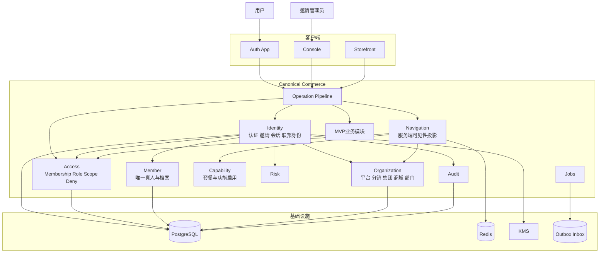
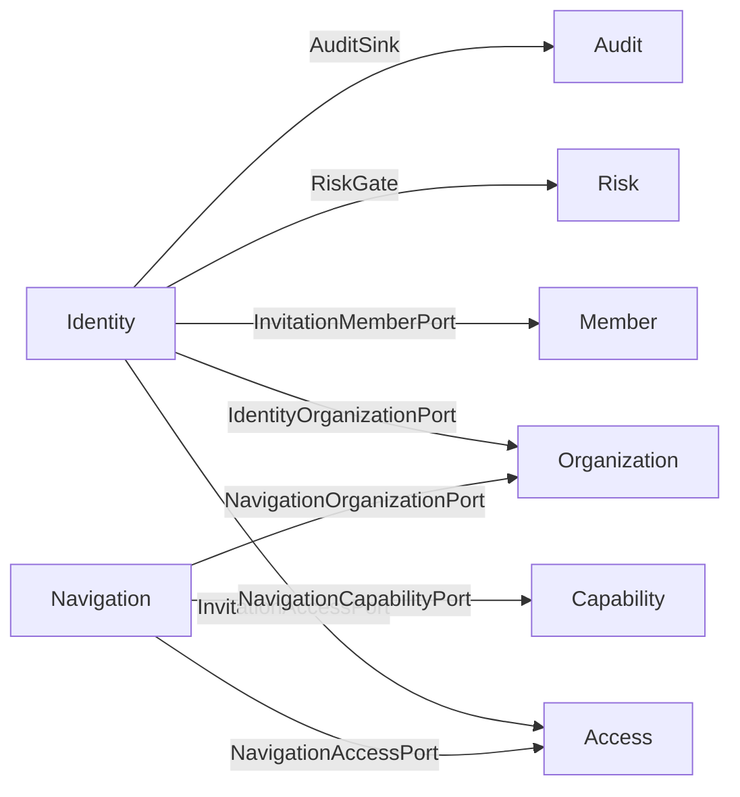
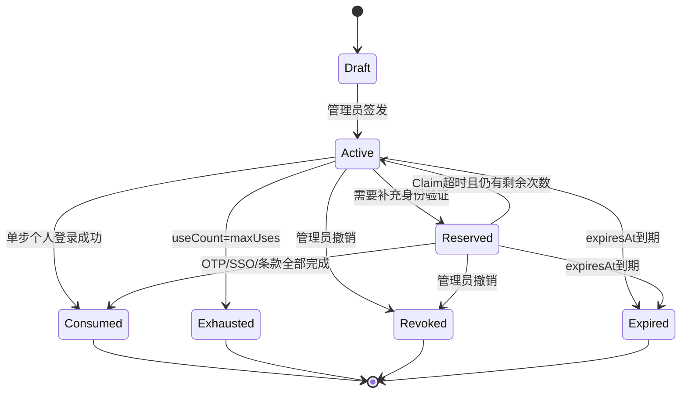
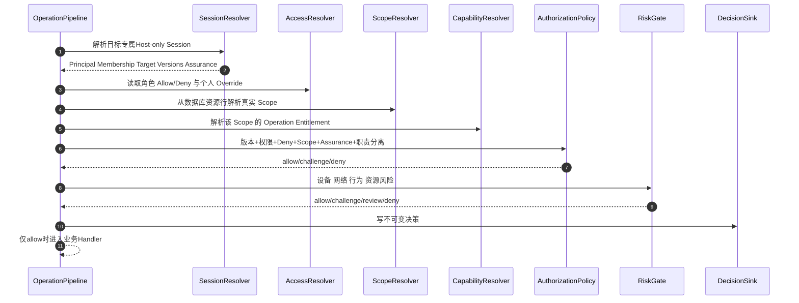
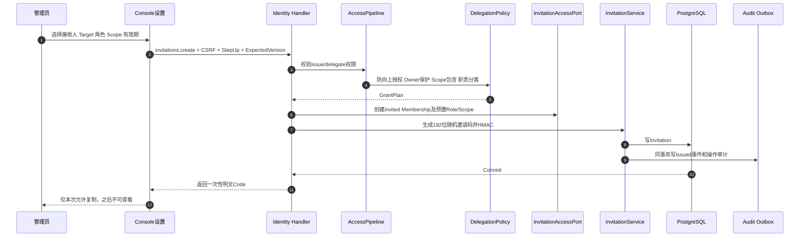
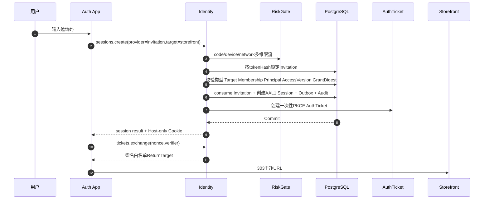
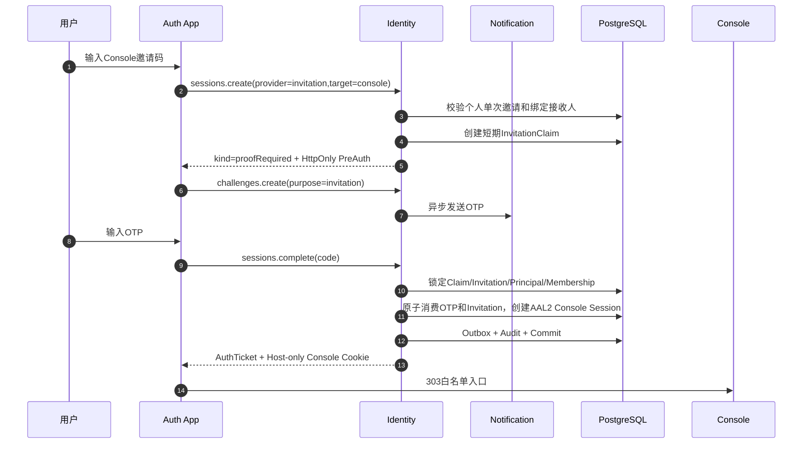
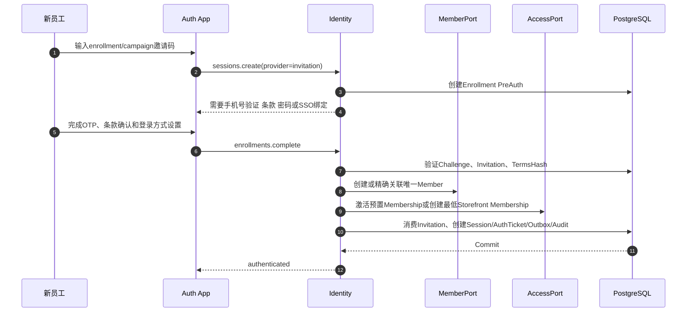
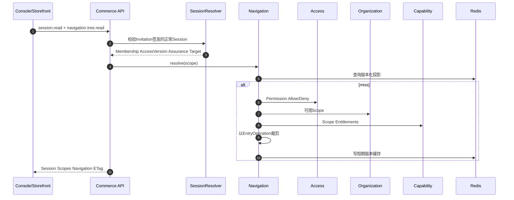
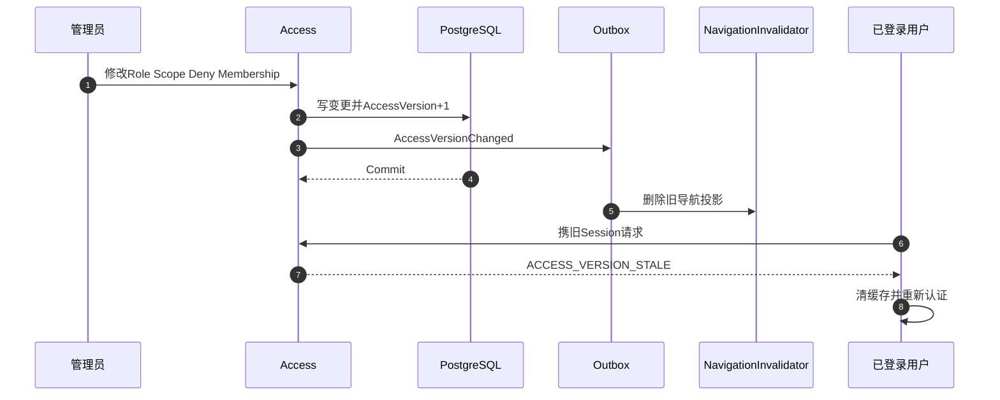

结论先说：应支持“邀请码登录”，但绝不能把现有可多人使用的邀请码直接当作长期密码。

理想目标是把邀请码拆成两类：

- 个人登录邀请：绑定唯一 Target、Membership、Principal/待激活成员和接收人，单次、短时、可撤销。它可以进入登录流程。
- 批量注册邀请：仅用于员工商城开户，允许多次使用，但只能获得最低员工角色，不能直接登录后台，也不能直接授予高权限。

邀请码只负责证明“持有邀请”，绝不直接携带或决定 Role、Permission、Scope、Capability。所有权限必须在服务端根据 Canonical RBAC 重新计算。

本轮只做了只读分析，没有修改任何代码、配置、SQL、测试或文档。

# 一、权威范围与现状结论

工作簿当前 SHA-256 为 `6f5a79542814d8f1de87ed740f52508584a00f66886a0dba09b4aeaaba99f641`，与 [config/authorities.yml](/Users/changshengwang/Workspace/zhudatuan/config/authorities.yml:1) 一致。

权威 MVP 是“MVP上线功能清单”A1:F23，共 21 个业务项；集团和商城各 9 类功能，另含平台、分销和 P1 接口。:codex-file-citation{path="/Users/changshengwang/Workspace/zhudatuan/docs/福利商城功能清单.xlsx" purpose="source" artifact_kind="workbook" sheet="MVP上线功能清单" range="A1:F23"}

接口页中一期优先级 1 的 Provider 精确为 11 个：京东、京东生鲜、天猫超市、自有供应商、蛋糕、鲜花、图书、虚拟卡券/直充、虚拟食品提货券、电影、在线点餐。:codex-file-citation{path="/Users/changshengwang/Workspace/zhudatuan/docs/福利商城功能清单.xlsx" purpose="source" artifact_kind="workbook" sheet="接口" range="A1:K21"}

基线方案来自 [统一导航与单点登录方案](/Users/changshengwang/Workspace/zhudatuan/docs/统一导航与单点登录方案.md:1)，RBAC 边界来自 [会员权限系统](/Users/changshengwang/Workspace/zhudatuan/docs/membership-permissions/README.md:1)、[四类边界模型](/Users/changshengwang/Workspace/zhudatuan/docs/membership-permissions/00-BOUNDARY-MODELS.md:1) 和 [MVP权限矩阵](/Users/changshengwang/Workspace/zhudatuan/docs/membership-permissions/MVP-PERMISSION-MATRIX.md:1)。

## 当前真实实现

| 事项         | 当前状态                                                                                  | 证据                                                                                                                                                          | 目标                          |
| ------------ | ----------------------------------------------------------------------------------------- | ------------------------------------------------------------------------------------------------------------------------------------------------------------- | ----------------------------- |
| 登录方式     | 只支持密码、OTP                                                                           | [IdentityCore.ts](/Users/changshengwang/Workspace/zhudatuan/services/commerce/src/modules/identity/application/IdentityCore.ts:79)                            | 增加 `invitation` 策略        |
| 前端登录凭据 | 类型只有 password/otp                                                                     | [canonicalIdentity.ts](/Users/changshengwang/Workspace/zhudatuan/apps/auth/src/services/canonicalIdentity.ts:44)                                              | 增加邀请码登录表单和响应状态  |
| 邀请码用途   | 仅用于注册                                                                                | [canonicalRegistration.ts](/Users/changshengwang/Workspace/zhudatuan/apps/auth/src/services/canonicalRegistration.ts:76)                                      | 注册邀请与登录邀请严格分型    |
| 邀请对象     | 固定商城、固定员工角色                                                                    | [MemberPort.ts](/Users/changshengwang/Workspace/zhudatuan/services/commerce/src/modules/member/MemberPort.ts:44)                                              | 个人邀请可绑定预置 Membership |
| 邀请消费     | 行锁、有效期、使用次数、原子递增                                                          | [MemberPort.ts](/Users/changshengwang/Workspace/zhudatuan/services/commerce/src/modules/member/MemberPort.ts:72)                                              | 直接复用                      |
| 邀请码存储   | 只存 HMAC Hash                                                                            | [IdentityCore.ts](/Users/changshengwang/Workspace/zhudatuan/services/commerce/src/modules/identity/application/IdentityCore.ts:358)                           | 保留并独立 Invitation Key     |
| 注册安全     | 邀请 + 短信验证码 + 条款版本绑定                                                          | [IdentityCore.ts](/Users/changshengwang/Workspace/zhudatuan/services/commerce/src/modules/identity/application/IdentityCore.ts:386)                           | 保留                          |
| 会话安全     | Host-only Cookie、AuthTicket、PKCE、CSRF、AccessVersion                                   | [canonicalIdentity.ts](/Users/changshengwang/Workspace/zhudatuan/apps/auth/src/services/canonicalIdentity.ts:83)                                              | 统一复用                      |
| API 授权     | Session → Membership → Version → Scope → Capability → Permission → Step-Up → Risk → Audit | [AccessPipeline.ts](/Users/changshengwang/Workspace/zhudatuan/services/commerce/src/foundation/security/AccessPipeline.ts:35)                                 | 保留并补齐 Deny/Delegation    |
| 导航         | 服务端按权限、能力、范围投影                                                              | [NavigationProjector.ts](/Users/changshengwang/Workspace/zhudatuan/services/commerce/src/modules/navigation/application/projection/NavigationProjector.ts:22) | 邀请登录后直接复用            |

## 必须纠正的当前差距

1. `identity.sessions.create` 的合同 Audience 目前标为 `storefront`，但实际还承载 Console 登录，目标态应改成明确的 Public Authentication Operation，再由 Target Policy 精确约束。

2. 当前邀请码创建默认产生开放式、可多次使用的邀请码，没有绑定接收人、Principal 或 Membership，不允许直接升级为登录凭据。

3. 当前邀请码管理只有统一的 `identity.invitation.manage`，应拆分为查看、签发、撤销和委派权限。

4. `access.membershipoverride` 已有表结构，但当前主要授权 SQL 没有完整纳入个人 allow/deny。

5. Scope Deny 已进入导航范围查询，但主要 API `resolve_membership` 没有完整执行“Allow 命中且不存在更具体 Deny”的规则。可能出现菜单隐藏但直接 API 仍被允许的风险，必须统一。

6. 当前角色管理可以按输入重建角色权限，但没有完整执行“不能授予自己没有的权限”“不能授予更大的 Scope”“不能日常授予 Owner”等 Delegation Policy。

7. 当前角色 ID 在 `role-employee` 与 `role-zhudatuan-storefront-member` 之间存在不一致，应只保留 Canonical Role ID。

8. 邀请撤销没有把撤销原因、撤销者、撤销时间作为 Invitation 聚合事实保存。

9. [canonicalRegistration.ts](/Users/changshengwang/Workspace/zhudatuan/apps/auth/src/services/canonicalRegistration.ts:9) 使用模块级 `activeInvitation` 保存当前邀请码流程，目标态应改成服务端 HttpOnly PreAuth，不在浏览器模块变量中保存邀请码上下文。

10. [IdentityCore.ts](/Users/changshengwang/Workspace/zhudatuan/services/commerce/src/modules/identity/application/IdentityCore.ts:1) 667 行、[LoginPage.tsx](/Users/changshengwang/Workspace/zhudatuan/apps/auth/src/screens/LoginPage.tsx:1) 1234 行，职责过多，必须按用例拆分。

# 二、不可破坏的系统不变量

1. 邀请码不等于权限。

2. 邀请码不从客户端接收 Role、Permission、Scope、Organization 或 Membership。

3. 个人登录邀请必须绑定唯一 Target 和唯一 Membership；禁止登录后再让用户任选其他 Membership。

4. Console 登录邀请必须绑定接收人并完成第二因素，邀请码本身最多是 AAL1。

5. 多人、多次使用的活动邀请码只能进入注册流程，不能直接创建业务 Session。

6. 新用户输入邀请码后首先获得受限的 Enrollment PreAuth，而不是完整业务 Session。

7. Membership、Role、ScopeGrant 必须在邀请签发时由 Access 模块预置；兑换时只激活，不临时计算高权限。

8. Owner 只能通过独立 Owner Transfer 仪式变更，日常邀请接口永远不能签发 Owner。

9. 邀请码只返回一次；列表、日志、审计、错误、Trace、URL、Referer、LocalStorage 中永不出现明文邀请码。

10. 邀请消费、Membership 激活、Session 创建、AuthTicket 创建、Outbox 和安全审计必须在同一个数据库事务中提交。

11. 权限、角色、Scope 或 Membership 变化必须提升 AccessVersion，旧 Session 下一请求失效。

12. 导航只做显示裁剪，每个 API 仍重新鉴权。

13. Storefront RBAC、员工商品资格和套餐 Capability 是三套独立判定，不能混为一体。

14. 邀请码登录不得新增 Excel 之外的顶层菜单；管理入口归入 MVP13/MVP22 的“设置”。

# 三、目标总体架构



部署形态仍采用“模块化单体 + 独立 API/Jobs 工作负载”，不为邀请码登录再建微服务。

# 四、DDD 边界与所有权

| 模块          | 唯一拥有的事实                                                                                                 | 禁止拥有                     |
| ------------- | -------------------------------------------------------------------------------------------------------------- | ---------------------------- |
| Identity      | Principal、Credential、Invitation、InvitationClaim、PreAuth、Session、Assurance、AuthTicket、FederatedIdentity | Role、业务 Scope、会员资产   |
| Access        | Membership、Role、RolePermission、MembershipRole、ScopeGrant、Override、AccessVersion、DelegationPolicy        | 密码、邀请码明文、Member PII |
| Member        | Member、Profile、手机号密文、员工信息、会员生命周期                                                            | Session、角色定义            |
| Organization  | 平台/分销/租户/集团/商城/部门树和闭包                                                                          | 供应商品牌门店多对多关系     |
| Capability    | Operation Capability、Entitlement、套餐启用和配额                                                              | 人员授权                     |
| Navigation    | 静态 Catalog 和用户可见树投影                                                                                  | 授权写入、React 组件路径     |
| Risk          | 登录、委派、兑换、批量操作的风险决策                                                                           | 最终业务状态                 |
| Audit         | Append-only 安全和操作审计                                                                                     | 业务命令执行                 |
| Partner       | 供应商、品牌、门店及商业关系                                                                                   | 严格行政树                   |
| Qualification | 员工看见/购买商品的资格                                                                                        | Console 后台 RBAC            |

模块只能通过 Public Port 或 Domain Event 交互：



# 五、邀请码领域模型

## 5.1 邀请类型

| 类型         | 用途                   | 绑定对象                            | 最大使用次数 | 能否直接登录                      |
| ------------ | ---------------------- | ----------------------------------- | -----------: | --------------------------------- |
| `signin`     | 已存在成员的临时登录   | 精确 Membership、Target、Principal  |            1 | Storefront 可；Console 需第二因素 |
| `enrollment` | 新员工或待激活成员开户 | 精确接收人、组织、待激活 Membership |            1 | 先进入 Enrollment PreAuth         |
| `campaign`   | 批量员工商城注册       | Mall、最低员工角色、可选接收人      |       可配置 | 不可以                            |
| `recovery`   | 管理员批准的一次性恢复 | 精确 Principal、Membership、Target  |            1 | 必须强校验；默认不开放            |

MVP 只启用 `signin`、`enrollment` 和现有 `campaign`。`recovery` 保留领域类型但默认未 Entitle、无 UI，不进入生产运行图。

## 5.2 Invitation 聚合

```text
Invitation
├─ id
├─ kind                    signin | enrollment | campaign
├─ target                  console | storefront
├─ organizationId
├─ membershipId?           signin/enrollment 必填
├─ principalId?            signin 必填
├─ recipientHash?          Console/enrollment 必填
├─ tokenHash
├─ tokenKeyVersion
├─ issuerMembershipId
├─ issuerAccessVersion
├─ grantDigest
├─ minimumAssurance
├─ maxUses
├─ useCount
├─ notBefore
├─ expiresAt
├─ status                  draft | active | exhausted | revoked | expired
├─ policyId
├─ termsHash?
├─ reason
├─ createdAt
├─ revokedAt?
├─ revokedBy?
├─ revokeReason?
└─ version
```

`grantDigest` 是签发时预置 MembershipRole、ScopeGrant、Target 和角色版本的稳定摘要。兑换时重算；不一致则拒绝，不允许悄悄使用变化后的授权。

## 5.3 InvitationClaim

```text
InvitationClaim
├─ id
├─ invitationId
├─ browserHash
├─ deviceHash
├─ target
├─ recipientHash?
├─ state
├─ expiresAt
├─ consumedAt?
└─ version
```

Claim 只服务于需要 OTP、SSO 或条款确认的多步骤流程。它通过 `__Host-preauth` HttpOnly Cookie 绑定浏览器，不把 Claim Token 放进 URL。

## 5.4 状态机



# 六、RBAC 最终判定模型

## 6.1 权限公式

```text
RoleAllow = 所有有效角色 allow 的并集
RoleDeny = 所有有效角色 deny 的并集
OverrideAllow = 当前有效个人 allow
OverrideDeny = 当前有效个人 deny

EffectiveAllow = RoleAllow ∪ OverrideAllow
EffectiveDeny = RoleDeny ∪ OverrideDeny
EffectivePermission = EffectiveAllow - EffectiveDeny
```

资源范围：

```text
ScopeAllowed
  = 存在有效 AllowScope 包含 ResourceScope
  ∧ 不存在有效 DenyScope 包含 ResourceScope
```

最终决策：

```text
Allow
  = Principal active
  ∧ Session active
  ∧ Session target matches
  ∧ CredentialVersion current
  ∧ Membership active
  ∧ AccessVersion current
  ∧ Capability enabled
  ∧ Permission in EffectivePermission
  ∧ ScopeAllowed
  ∧ Assurance sufficient
  ∧ MakerChecker satisfied
  ∧ Risk outcome = allow
```

任何 Deny 都优先于 Allow；更具体 Deny 也必须覆盖上级平台 Allow。

## 6.2 固定授权顺序



## 6.3 邀请委派规则

签发邀请时必须执行比普通业务授权更严格的 Delegation Policy：

1. 邀请者拥有 `identity.invitation.issue`。

2. 邀请者拥有 `access.role.delegate`。

3. 被邀请角色的每项有效 Permission 都是邀请者 EffectivePermission 的子集。

4. 被邀请 Scope 是邀请者有效 AllowScope 的后代，并且不命中邀请者任何 DenyScope。

5. 邀请者不能签发比自身更高的最小 Assurance Policy。

6. 不能邀请自己、不能修改自己的 Role、不能通过邀请复制 Owner。

7. Console 邀请必须是个人、单次、绑定接收人。

8. Platform、Distributor、Enterprise、Mall 之间均按真实组织闭包验证，浏览器路径无效。

9. Supplier、Brand、Store 必须通过显式商业关系验证，不能按名字或组织祖先推断。

10. 邀请签发后若邀请者 AccessVersion、Role Version 或 Grant Digest 变化，未兑换邀请进入 `stale`，必须重新签发或由另一名有权管理员复核。

## 6.4 邀请权限拆分

| Permission                   | 风险     | 用途                                           |
| ---------------------------- | -------- | ---------------------------------------------- |
| `identity.invitation.read`   | elevated | 查看脱敏邀请列表                               |
| `identity.invitation.issue`  | critical | 签发邀请                                       |
| `identity.invitation.revoke` | high     | 撤销邀请                                       |
| `identity.invitation.audit`  | high     | 查看兑换与失败记录                             |
| `access.role.delegate`       | critical | 委派角色                                       |
| `access.scope.delegate`      | critical | 委派数据范围                                   |
| `access.membership.activate` | critical | 激活待加入 Membership，仅由 Identity Port 调用 |

管理 Operation 需要新鲜 AAL3 Step-Up、ExpectedVersion、Idempotency 和变更原因。

# 七、核心调用时序

## 7.1 管理员签发个人邀请



## 7.2 已存在 Storefront 成员使用邀请码登录



第二个并发请求在锁后看到 `consumed`，只能得到泛化的 `INVITATION_INVALID`，绝不再次签发 Session。

## 7.3 Console 邀请登录



邀请码和 OTP 若投递到同一不安全渠道，不能被算成独立双因素；因而 Console 邀请默认绑定企业手机号、企业微信或批准的第二因素。

## 7.4 新成员通过邀请码进入



任何已有手机号、姓名、邮箱或微信显示名都不能触发自动合并；冲突进入 LinkCase。

## 7.5 邀请登录后的导航启动



邀请码登录不会产生特殊导航分支。

## 7.6 权限变化立即失效



# 八、各模块内部数据流

所有模块必须统一采用以下写链路：

```text
Handler
→ Schema/Deadline/Idempotency/ExpectedVersion
→ Application UseCase
→ Domain Aggregate/Policy
→ Public Port
→ UnitOfWork
→ Repository条件写
→ Outbox + Audit
→ Commit
```

读链路：

```text
Handler
→ Query/Scope/Page校验
→ QueryService
→ Versioned Cache
→ Scope-filtered Repository
→ Projection/Redaction
→ ETag/Watermark
```

逐模块内部链路如下：

| 模块          | 内部执行链                                                                                                                                                  |
| ------------- | ----------------------------------------------------------------------------------------------------------------------------------------------------------- |
| identity      | Session/Invitation Handler → Authentication Strategy → InvitationPolicy/SessionPolicy → Identity/Access/Member Port → Repository → Session/AuthTicket/Audit |
| access        | Access Handler → DelegationPolicy/AuthorizationPolicy → Role/Scope Aggregate → Repository → AccessVersion+1 → Outbox                                        |
| member        | Member Handler → MemberPolicy → PII KMS Port → Member Repository → MemberChanged                                                                            |
| organization  | Organization/Directory Handler → HierarchyPolicy → Closure Repository → OrganizationChanged                                                                 |
| capability    | Assignment Handler → EntitlementPolicy → Versioned Assignment Repository → CapabilityChanged                                                                |
| navigation    | Tree Handler → Canonical Scope → Cache → NavigationProjector → VisibilityPolicy → Stable Tree                                                               |
| qualification | Preview/Manage Handler → Facts → QualificationPolicy → Versioned Decision/Revision                                                                          |
| catalog       | Pool/Product/Listing Handler → CatalogPolicy → Catalog Repository → CatalogChanged                                                                          |
| pricing       | Offer/Rule Handler → PricingPolicy → Immutable Rule Revision → PricingPublished                                                                             |
| inventory     | Stock/Reservation Handler → InventoryPolicy → Ordered Lock → Stock Repository → InventoryChanged                                                            |
| experience    | Application/Version Handler → ExperiencePolicy → Release Repository → Publish Job                                                                           |
| marketing     | Campaign Handler → MarketingPolicy → Budget/Reservation Repository → CampaignChanged                                                                        |
| cart          | Cart Handler → Cart Aggregate → Versioned Cart Repository → CartChanged                                                                                     |
| checkout      | Quote Handler → Qualification/Pricing/Inventory/Voucher/Benefit Ports → CheckoutPolicy → Signed Quote                                                       |
| order         | Order/Aftersale Handler → OrderPolicy → Order Repository → StateChanged                                                                                     |
| fulfillment   | Shipment/Return Handler → FulfillmentPolicy → Partner Port → Fulfillment Repository                                                                         |
| verification  | Challenge/Device Handler → VerificationPolicy → KMS → Verification Repository                                                                               |
| payment       | Intent/Refund Handler → PaymentPolicy → Gateway Port → Observation/Outbox                                                                                   |
| voucher       | Program/Issue/Redeem Handler → VoucherPolicy → Finance/KMS Port → Voucher Ledger                                                                            |
| benefit       | Plan/Grant/Consume Handler → GrantPolicy → Append-only Benefit Ledger                                                                                       |
| finance       | Journal/Reconciliation/Settlement Handler → FinancePolicy → Append-only Journal → Projection                                                                |
| invoice       | Request Handler → InvoicePolicy → Gateway/ObjectStore → Artifact Reference                                                                                  |
| channel       | Connection/Sync Handler → ChannelPolicy → Extension Registry → Checkpoint/Receipt                                                                           |
| extension     | Installation Handler → SignatureVerifier → Candidate Health → Atomic Registry Switch                                                                        |
| partner       | Partner/Store/Supplier Handler → RelationshipPolicy → Partner Repository                                                                                    |
| support       | Case/Message Handler → Assignment/SLA Policy → Member/Order/Notification Ports                                                                              |
| notification  | Template/Dispatch Handler → NotificationPolicy → SMS/WeCom Provider → Delivery Receipt                                                                      |
| reporting     | Query Handler → Fact Projection/Watermark → Cache；事件侧 Inbox → Fact Upsert                                                                               |
| risk          | Evaluate/Review Handler → Signal/Policy Revision → RiskEngine → Decision/Case                                                                               |
| audit         | Record Handler → Redaction/HashChain Policy → Append-only Repository/WORM Archive                                                                           |
| runtime       | Operation/Event/Job Handler → RuntimePolicy → Lease/Inbox/Outbox/Idempotency                                                                                |
| observability | Adapter → Redaction → Metrics/Logs/Traces；永不回写业务状态                                                                                                 |

# 九、API 与合同

## 9.1 登录输入使用严格判别联合

```json
{
  "provider": "invitation",
  "code": "ABCD-EFGH-JKMN-PQRS-TVWX-YZ12",
  "target": "console",
  "authorization": {
    "state": "...",
    "nonce": "...",
    "challenge": "..."
  }
}
```

禁止同时携带 `subject`、`role`、`scope`、`membership` 或 `permission`。

## 9.2 统一结果

```json
{
  "kind": "session",
  "membership": "membership:...",
  "target": "storefront",
  "expiresIn": 43200,
  "callback": {
    "ticket": "...",
    "state": "..."
  }
}
```

或者：

```json
{
  "kind": "proofRequired",
  "methods": ["otp", "wecom"],
  "expiresAt": "..."
}
```

或者：

```json
{
  "kind": "enrollment",
  "requirements": ["recipientProof", "terms", "credential"],
  "expiresAt": "..."
}
```

## 9.3 Operation 清单

| Operation                       | Method/Path                                 | Audience              | Assurance       |
| ------------------------------- | ------------------------------------------- | --------------------- | --------------- |
| `identity.sessions.create`      | `POST /api/v1/identity/sessions`            | Public + exact Target | Anonymous       |
| `identity.sessions.complete`    | `POST /api/v1/identity/sessions/complete`   | PreAuth               | OTP/SSO         |
| `identity.invitations.resolve`  | `POST /api/v1/identity/invitations/resolve` | Public                | Anonymous       |
| `identity.invitations.read`     | `GET /api/v1/identity/invitations`          | Console               | Session         |
| `identity.invitations.create`   | `POST /api/v1/identity/invitations`         | Console               | Fresh Step-Up   |
| `identity.invitations.revoke`   | `DELETE /api/v1/identity/invitations/{id}`  | Console               | Fresh Step-Up   |
| `identity.enrollments.read`     | `GET /api/v1/identity/enrollments/current`  | PreAuth               | PreAuth         |
| `identity.enrollments.complete` | `POST /api/v1/identity/enrollments/current` | PreAuth               | Recipient proof |

Public Resolve 只返回最小展示信息。对错误邀请码、已过期、已撤销、Target 错误、接收人错误和已使用，全部返回相同外观和耗时类别。

# 十、数据模型

## 10.1 复用

- `identity.principal`
- `identity.credential`
- `identity.session`
- `identity.challenge`
- `identity.assurance`
- `identity.loginattempt`
- `identity.authticket`
- `identity.registrationpolicy`
- `access.membership`
- `access.role`
- `access.rolepermission`
- `access.membershiprole`
- `access.scopegrant`
- `access.membershipoverride`
- `access.decisionaudit`

## 10.2 新目标表

### `identity.invitation`

| 字段                    | 约束                                   |
| ----------------------- | -------------------------------------- |
| `id`                    | 主键                                   |
| `kind`                  | signin/enrollment/campaign             |
| `target`                | console/storefront                     |
| `organization_id`       | 必须 Active                            |
| `membership_id`         | signin/enrollment 必填                 |
| `principal_id`          | signin 必填                            |
| `recipient_hash`        | Console/enrollment 必填                |
| `token_hash`            | 唯一，HMAC                             |
| `token_key_version`     | 支持 Pepper Rotation                   |
| `issuer_membership_id`  | 必填                                   |
| `issuer_access_version` | 必填                                   |
| `grant_digest`          | 必填                                   |
| `minimum_assurance`     | 1–3                                    |
| `max_uses/use_count`    | `0 ≤ use_count ≤ max_uses`             |
| `not_before/expires_at` | expires > notBefore                    |
| `status`                | draft/active/exhausted/revoked/expired |
| `policy_id/terms_hash`  | enrollment/campaign 必填               |
| `reason`                | 管理变更理由                           |
| `version`               | 乐观锁                                 |

### `identity.invitationclaim`

保存多步骤兑换状态，单次、短期、绑定浏览器和 Target。

### `identity.invitationreceipt`

保存每次成功兑换的不可变收据：

- invitationId
- principalId
- membershipId
- sessionId
- assurance
- issuerAccessVersion
- grantDigest
- redeemedAt
- traceId

不保存邀请码 Hash 或明文。

## 10.3 索引

```text
unique identity.invitation(token_hash)
identity.invitation(status, expires_at, id)
identity.invitation(issuer_membership_id, status, created_at)
identity.invitation(membership_id, target, status)
unique personal active invitation on (membership_id,target)
identity.invitationclaim(invitation_id,state,expires_at)
unique active claim on personal invitation
identity.invitationreceipt(invitation_id,redeemed_at)
identity.loginattempt(subject_hash,client_hash)
access.membership(status,organization_id,client,id)
access.membershiprole(membership_id,effective_at,expires_at,role_id)
access.scopegrant(membership_id,effect,effective_at,expires_at,scope_kind,scope_id)
```

邀请码校验热路径必须是唯一索引命中，不允许扫描状态表。

# 十一、事件、一致性和缓存

| Event                          | Producer | Consumer                           |
| ------------------------------ | -------- | ---------------------------------- |
| `identity.invitation.issued`   | Identity | Audit、Notification、Observability |
| `identity.invitation.reserved` | Identity | Observability                      |
| `identity.invitation.redeemed` | Identity | Audit、Access、Notification        |
| `identity.invitation.revoked`  | Identity | Claim Cleanup、Notification、Audit |
| `identity.invitation.rejected` | Identity | Risk、Audit                        |
| `access.membership.invited`    | Access   | Member、Notification               |
| `access.membership.activated`  | Access   | Navigation、Reporting              |
| `access.version.changed`       | Access   | Session、Navigation Cache          |
| `identity.session.created`     | Identity | Audit、Observability               |

缓存规则：

- 邀请码有效性绝不缓存为授权事实。
- Redis 可以缓存管理列表的非敏感投影，但 Key 必须含 Invitation Version 和 AccessVersion。
- Session 不存明文 Token。
- Invitation Claim 可以存 PostgreSQL；Redis 只能做加速，不做唯一真相。
- Redis 故障时邀请码登录回源 PostgreSQL并受并发限制，不能放开校验。
- 权限和导航缓存必须绑定 CatalogVersion、AccessVersion、CapabilityVersion、Scope 和 Target。

# 十二、安全设计

## 12.1 邀请码格式

建议使用至少 128 位有效熵、Crockford Base32、带校验字符的分段码，例如：

```text
ABCD-EFGH-JKMN-PQRS-TVWX-YZ12
```

规则：

- 去除易混淆字符 `I/L/O/U`。
- 输入时只做大小写和分隔符标准化。
- 存储 `HMAC-SHA256(invitationKey, normalizedCode)`。
- 不使用递增编号、手机号、企业编码、时间戳或可预测随机数。
- Code 创建后只返回一次。
- 不支持把 Code 放进 Query、Path、Fragment 或二维码 URL。

## 12.2 威胁控制

| 威胁             | 控制                                                         |
| ---------------- | ------------------------------------------------------------ |
| 暴力猜码         | 128 位熵、Code/Device/Network 多维限流                       |
| 重放             | 行锁、条件更新、单次状态机、Receipt 唯一约束                 |
| 并发双登录       | Invitation 与 Claim 行锁；Session 和消费同事务               |
| 邀请泄露         | 短有效期、单次、Target/Recipient/Membership 绑定             |
| 跨 Target 使用   | Invitation Target 与请求、Cookie、AuthTicket 三重绑定        |
| 权限提升         | GrantPlan 预置、DelegationPolicy、GrantDigest、AccessVersion |
| 旧邀请者权限     | 兑换时重校验 issuerAccessVersion                             |
| Owner 复制       | Owner Role 永不允许进入普通 Delegation                       |
| 邀请枚举         | Public 错误泛化，不返回组织和成员是否存在                    |
| Session Fixation | 登录完成后生成新 Session Token；旧 Claim 销毁                |
| CSRF             | SameSite Cookie、Origin、State、CSRF、Browser Binding        |
| 日志泄露         | Redactor 禁止 Code、TokenHash、Recipient PII                 |
| 数据库泄露       | 只存 HMAC；Pepper 由 KMS/Secret Store 管理                   |
| 浏览器窃取       | HttpOnly Cookie；不使用 LocalStorage                         |
| 管理员误操作     | Step-Up、ExpectedVersion、Reason、风险预览、审计             |
| 僵尸邀请         | 到期 Job、AccessVersion 事件自动失效、日常核对               |
| OTP 通道失败     | 不消费邀请码；禁止自动降级到 Code-only Console 登录          |

## 12.3 Assurance

| 登录方式                           |                      基础等级 |
| ---------------------------------- | ----------------------------: |
| 个人 Storefront 邀请码             |                          AAL1 |
| 密码                               |                          AAL1 |
| 手机 OTP                           |                          AAL2 |
| 企业微信/OIDC                      | 按 Provider Policy，通常 AAL2 |
| Console 邀请码 + 独立 OTP/企业身份 |                          AAL2 |
| 新鲜 Step-Up/硬件因素              |                          AAL3 |

邀请码不能用于权限、退款、财务、Provider Secret、角色、Scope、批量作废等 Step-Up。

# 十三、性能、并发和可用性

## 13.1 目标预算

| 链路                             |                  P95 |
| -------------------------------- | -------------------: |
| Invitation Hash + Indexed Lookup |                20 ms |
| Storefront 个人邀请登录本地处理  |               150 ms |
| Console 邀请第一阶段             |               150 ms |
| Console 邀请完成阶段             | 200 ms，不含通知投递 |
| Navigation Cache Hit             |                20 ms |
| Navigation Cache Miss            |                80 ms |
| 权限单次聚合解析                 |                60 ms |

## 13.2 并发控制

- 个人邀请：每个 Invitation 独立行锁，不使用全局锁。
- Campaign：Claim Reservation + TTL，避免 `useCount` 超卖。
- 同一个 Code 的重复请求使用数据库状态机，不把 Idempotency 当成再次签发 Session 的理由。
- Notification 异步发送，不持有数据库事务等待短信或企业微信。
- 邀请清理 Job 使用 Keyset Pagination。
- 邀请兑换不执行昂贵密码 Hash；HMAC 很快，但仍必须限流。
- Session/AuthTicket/Receipt 一个事务完成。
- 数据库连接池和登录回调使用独立 Bulkhead。

## 13.3 降级

| 故障                 | 行为                                                         |
| -------------------- | ------------------------------------------------------------ |
| Redis 故障           | 回源 PostgreSQL，降低并发；不放宽校验                        |
| Notification 故障    | Console/enrollment 停在 ProofRequired，邀请码不消费          |
| KMS 故障             | 新 Enrollment 失败关闭；已加载 HMAC Key 仅按密钥策略短时工作 |
| PostgreSQL 故障      | 不签发 Session；禁止 Redis 代替                              |
| Audit/Outbox 写失败  | 整个兑换事务回滚                                             |
| Navigation 故障      | 同版本最近树仅用于显示，API 仍鉴权                           |
| Risk 服务故障        | Console 邀请失败关闭；低风险 Storefront 按本地基础策略执行   |
| AccessVersion 不一致 | 立即拒绝并要求重新登录                                       |

# 十四、可观测性

核心指标：

```text
identity_invitation_issued_total{kind,target,outcome}
identity_invitation_redeemed_total{kind,target,assurance,outcome}
identity_invitation_rejected_total{reason,target}
identity_invitation_replay_total{target}
identity_invitation_claim_active{kind,target}
identity_invitation_seconds{phase,target}
identity_invitation_stale_total{reason}
identity_session_created_total{provider=invitation,target}
access_delegation_decision_total{outcome,reason}
navigation_request_seconds{cache,scopeKind}
```

允许日志字段：

- invitationId 的不可逆短标识
- target
- kind
- outcome
- errorCode
- issuerMembership 的不可逆短标识
- scopeKind
- traceId/requestId
- duration

禁止：

- 明文 Code
- tokenHash -手机号、邮箱、姓名
- Session/AuthTicket/PreAuth Token
- OTP
- 完整请求体

告警：

- 重放或错误码突增。
- 同一网络高频猜码。
- Console Code-only Session 被错误创建。
- Invitation 已兑换但没有 Receipt/Audit。
- Invitation 消费与 Session 数量不一致。
- Issuer AccessVersion 变化后仍有邀请成功兑换。
- 邀请签发量、最大使用次数或有效期异常。
- Owner Role 出现在普通 Invitation GrantPlan。

# 十五、目标代码目录

所有生产目录使用简洁的小写单词；生产 TypeScript 文件使用有意义的 PascalCase/camelCase，不出现下划线或连接符。

```text
services/commerce/src/modules/identity/
├─ Manifest.ts
├─ IdentityModule.ts
├─ IdentityOperations.ts
├─ application/
│  ├─ authentication/
│  │  ├─ AuthenticationService.ts
│  │  ├─ AuthenticationStrategy.ts
│  │  ├─ PasswordAuthenticator.ts
│  │  ├─ OtpAuthenticator.ts
│  │  ├─ InvitationAuthenticator.ts
│  │  └─ FederationAuthenticator.ts
│  ├─ command/
│  │  ├─ CreateSession.ts
│  │  ├─ CompleteSession.ts
│  │  ├─ CreateInvitation.ts
│  │  ├─ RevokeInvitation.ts
│  │  ├─ CompleteEnrollment.ts
│  │  └─ RevokeSession.ts
│  ├─ query/
│  │  ├─ ReadSession.ts
│  │  ├─ ReadInvitations.ts
│  │  ├─ ResolveInvitation.ts
│  │  └─ ReadEnrollment.ts
│  ├─ service/
│  │  ├─ SessionIssuer.ts
│  │  ├─ InvitationRedeemer.ts
│  │  ├─ EnrollmentService.ts
│  │  └─ MembershipSelector.ts
│  └─ port/
│     ├─ InvitationRepository.ts
│     ├─ InvitationAccessPort.ts
│     ├─ InvitationMemberPort.ts
│     ├─ SessionRepository.ts
│     └─ ProviderSecret.ts
├─ domain/
│  ├─ model/
│  │  ├─ Invitation.ts
│  │  ├─ InvitationClaim.ts
│  │  ├─ InvitationCode.ts
│  │  ├─ InvitationReceipt.ts
│  │  ├─ Preauth.ts
│  │  └─ Session.ts
│  └─ policy/
│     ├─ InvitationPolicy.ts
│     ├─ EnrollmentPolicy.ts
│     ├─ SessionPolicy.ts
│     └─ AuthenticationPolicy.ts
├─ infrastructure/
│  ├─ persistence/
│  │  ├─ PgInvitationRepository.ts
│  │  ├─ PgSessionRepository.ts
│  │  └─ PgAuthTicket.ts
│  ├─ security/
│  │  ├─ InvitationHasher.ts
│  │  ├─ InvitationGenerator.ts
│  │  ├─ SessionCookie.ts
│  │  ├─ ReturnTargetCatalog.ts
│  │  └─ ReturnTargetSigner.ts
│  └─ registry/
│     └─ AuthenticationRegistry.ts
└─ interface/
   └─ handler/
      ├─ SessionsCreateHandler.ts
      ├─ SessionsCompleteHandler.ts
      ├─ InvitationsReadHandler.ts
      ├─ InvitationsResolveHandler.ts
      ├─ InvitationsCreateHandler.ts
      ├─ InvitationsRevokeHandler.ts
      └─ EnrollmentsCompleteHandler.ts
```

Access 模块新增：

```text
services/commerce/src/modules/access/
├─ application/
│  └─ service/
│     └─ DelegationService.ts
├─ domain/
│  └─ policy/
│     ├─ DelegationPolicy.ts
│     ├─ PermissionPolicy.ts
│     ├─ ScopePolicy.ts
│     └─ OwnerPolicy.ts
├─ infrastructure/
│  └─ PgInvitationAccess.ts
└─ public/
   ├─ InvitationAccessPort.ts
   └─ NavigationAccessPort.ts
```

Auth App：

```text
apps/auth/src/
├─ app/
│  ├─ AuthRouter.tsx
│  └─ AuthProvider.tsx
├─ feature/
│  ├─ login/
│  │  ├─ LoginPage.tsx
│  │  ├─ PasswordForm.tsx
│  │  ├─ OtpForm.tsx
│  │  ├─ InvitationForm.tsx
│  │  └─ ProviderList.tsx
│  ├─ invitation/
│  │  ├─ InvitationProof.tsx
│  │  ├─ InvitationError.tsx
│  │  └─ EnrollmentPage.tsx
│  └─ selection/
│     └─ MembershipSelection.tsx
├─ entity/
│  ├─ authentication/
│  │  └─ Authentication.ts
│  └─ invitation/
│     └─ Invitation.ts
└─ shared/
   ├─ api/
   │  ├─ IdentityClient.ts
   │  └─ IdentitySchema.ts
   └─ security/
      └─ ReturnTarget.ts
```

Console 管理入口：

```text
apps/console/src/feature/settings/access/
├─ AccessRoute.tsx
├─ InvitationPanel.tsx
├─ InvitationCreateDialog.tsx
├─ InvitationRevokeDialog.tsx
├─ InvitationQuery.ts
└─ InvitationSchema.ts
```

不新增 Sidebar 节点，仍属于 `groupadmin`/`malladmin` 页面。

Contract：

```text
packages/contract/
├─ definitions/
│  ├─ operations.yml
│  ├─ permissions.yml
│  ├─ capabilities.yml
│  ├─ errors.yml
│  ├─ events.yml
│  └─ navigation.yml
└─ src/
   └─ generated/
```

数据库：

```text
database/migrations/
├─ 2026..._add_invitation_login.sql
├─ 2026..._backfill_invitations.sql
├─ 2026..._cutover_invitation_owner.sql
└─ 2026..._retire_registration_endpoint.sql
```

# 十六、复用、新增、删除

## 直接复用

- `AuthTransaction`
- `PgAuthTicket`
- `ReturnTargetCatalog`
- `ReturnTargetSigner`
- Host-only Session Cookie
- CSRF/Origin 校验
- Challenge/OTP
- PasswordPolicy
- AccessPipeline
- RiskGate
- AuditSink
- `member.invite` 中有效期、使用次数、条款绑定和行锁消费思想
- AccessVersion
- Navigation Catalog/Projection/Cache
- Operation/SDK Generator
- KMS 和 Secret Store
- Outbox/Inbox/JobRunner

## 新增

- Invitation 登录策略。
- Personal/Campaign 类型隔离。
- InvitationClaim/Receipt。
- DelegationPolicy。
- Scope Deny 和 Membership Override 的统一判定。
- 管理列表、一次性返回、撤销审计。
- Console 邀请第二因素。
- 邀请指标、告警、Runbook。
- 邀请登录的合同、Journey、安全和并发测试。

## 重构

- `IdentityCore.ts` 拆成认证策略、会话、邀请、注册、Challenge 用例。
- `LoginPage.tsx` 拆成独立表单和状态页面。
- `canonicalIdentity.ts` 改为严格判别联合。
- `canonicalRegistration.ts` 的客户端 `activeInvitation` 改为服务端 PreAuth。
- Permission Catalog 从手写 TypeScript 收敛为生成物。
- `AccessOperations.ts` 中角色和 Scope 管理交给 Domain Policy。
- `MemberPort` 不再拥有 Invitation Repository。

## 硬切后删除

- `member.invite`，数据迁入 `identity.invitation` 后删除。
- 旧的开放式“解析邀请码后依赖客户端模块变量”流程。
- 旧 `identity.members.create` 注册端点；由 Enrollment 完成端点取代。
- `services/commerce-api`
- `packages/smart-wing-authz`
- `packages/api-contract`
- `database/storefront-compatibility`
- `infrastructure/storefront-compatibility`
- 旧 Auth Compatibility Proxy、旧 Cookie、旧数据库 Role、旧 Secret 和双 Session 分支。

删除只在数据校验和切流通过后执行，但目标运行时不保留双读、双写或自动回退。

# 十七、MVP 对齐

| MVP   | Excel 功能   | Entry Operation                | 邀请/RBAC影响                    |
| ----- | ------------ | ------------------------------ | -------------------------------- |
| MVP03 | 平台层       | `organization.layers.read`     | 平台授权模型预留；不新增邀请菜单 |
| MVP04 | 分销层       | `channel.distributors.read`    | 定义未确认，继续 Release Blocker |
| MVP05 | 集团数据大屏 | `reporting.dashboard.read`     | Enterprise Scope                 |
| MVP06 | 集团应用     | `experience.applications.read` | Role/Scope 控制发布              |
| MVP07 | 集团商品池   | `catalog.pools.read`           | 批量改价/上下架需高权限          |
| MVP08 | 集团订单     | `order.orders.read`            | 售后审批需 Step-Up/SoD           |
| MVP09 | 集团卡券     | `voucher.cardlibraries.read`   | 发行/作废/核销独立权限           |
| MVP10 | 集团财务     | `finance.overview.read`        | 邀请 AAL1 不可执行财务写入       |
| MVP11 | 集团统计     | `reporting.sales.read`         | Scope + Watermark                |
| MVP12 | 集团客服     | `support.cases.read`           | Case Assignment + 最小 PII       |
| MVP13 | 集团设置     | `access.center.read`           | 集团邀请管理入口归此项           |
| MVP14 | 商城数据     | `reporting.dashboard.read`     | Mall Scope                       |
| MVP15 | 商城装修     | `experience.applications.read` | 发布需 Step-Up                   |
| MVP16 | 商城商品池   | `catalog.pools.read`           | Mall Scope                       |
| MVP17 | 商城订单     | `order.orders.read`            | Mall/Owner Scope                 |
| MVP18 | 商城卡券     | `voucher.cardlibraries.read`   | Mall Scope                       |
| MVP19 | 商城财务     | `finance.overview.read`        | 财务权限独立                     |
| MVP20 | 商城统计     | `reporting.sales.read`         | Mall Scope                       |
| MVP21 | 商城客服     | `support.cases.read`           | Mall Case Scope                  |
| MVP22 | 商城设置     | `access.center.read`           | 商城管理员/员工邀请管理入口      |
| MVP23 | 11个P1接口   | `channel.connections.read`     | 邀请系统不改变Provider数量与范围 |

因此，邀请码登录是横向身份能力，不是新增 MVP24，也不改变现有 Navigation Catalog 顶层结构。

# 十八、测试体系

## 单元测试

- Invitation 所有状态迁移。
- Signin/Enrollment/Campaign 不可混用。
- Console Code-only 必须拒绝。
- Target、Membership、Principal、Recipient 绑定。
- GrantDigest、IssuerAccessVersion 失效。
- Owner 禁止、向上授权禁止、跨 Scope 禁止。
- Role Allow/Deny、Override Allow/Deny、Scope Allow/Deny。
- Code 标准化、熵、HMAC、Rotation。
- Effective/notBefore/expiry/maxUses。
- 第二次消费失败。
- 条款版本变化。
- Enrollment 与现有 Member 冲突。

## 合同测试

- 输入使用严格 Discriminated Union。
- 不允许多余字段。
- Public 错误不泄露状态。
- Management 错误可精确定位但不返回秘密。
- SDK、服务端 Handler、OpenAPI 完全一致。
- Audience、TargetPolicy、CSRF、Origin、Idempotency、ExpectedVersion 正确。

## Repository/并发测试

- 100 个并发请求只能成功 1 个。
- Campaign 不超过 maxUses。
- Claim 过期恢复容量。
- Session 写失败时 Invitation 不消费。
- Audit/Outbox 写失败时全部回滚。
- AccessVersion 变化时兑换失败。
- Role Version 变化时兑换失败。
- PostgreSQL Failover 后不重复兑换。

## 安全测试

- Brute Force、Replay、Fixation、CSRF、Open Redirect。
- Code 在日志、Trace、错误、Bundle、LocalStorage、URL 中均不存在。
- 跨 Target、跨组织、跨商城、跨供应商。
- Owner Role 注入。
- 客户端伪造 Membership、Role、Scope、Assurance。
- 邀请撤销与并发兑换竞争。
- OTP 同通道不算独立因素。
- Redis 故障时仍 Fail Closed。
- 旧 Session AccessVersion Stale。
- 邀请登录后直达隐藏 Route 仍被 API 拒绝。

## Journey

至少增加：

```text
invite01_storefront_existing_login
invite02_console_login_with_proof
invite03_new_member_enrollment
invite04_campaign_cannot_login
invite05_replay_rejected
invite06_revoked_rejected
invite07_expired_rejected
invite08_wrong_target_rejected
invite09_scope_delegation_rejected
invite10_owner_delegation_rejected
invite11_accessversion_stale
invite12_navigation_after_login
invite13_permission_change_invalidates_session
invite14_concurrent_single_use
invite15_notification_failure_preserves_invite
```

现有 RBAC 与邀请/导航定向测试共 19 项已在本次只读核查中通过；这证明当前基线可运行，但不代表上述新增邀请码登录能力已经实现。

# 十九、硬切实施顺序

1. 冻结工作簿、Operation、Permission、Navigation 和 Error Catalog。

2. 明确产品语义：个人登录邀请、个人入职邀请、批量注册邀请。

3. 先补齐 Access Deny、Override、Delegation 和 Owner Policy。

4. 新增 `identity.invitation`、Claim、Receipt 和索引。

5. 将现有 `member.invite` 全部迁为 `campaign/storefront`，明确标记“不可登录”。

6. 增加 Personal Invitation，仅绑定预置 Membership。

7. 把密码、OTP、邀请码、Federation 收敛到 Authentication Strategy Registry。

8. Auth UI 上线邀请码入口，但 Console Code-only 保持失败关闭。

9. 增加管理面签发、列表、撤销和审计。

10. 执行数据计数、Hash、状态、使用次数和条款版本核对。

11. 停止旧注册写入，完成最后增量迁移。

12. 原子切换到新合同，不做双写。

13. 删除旧端点、旧表、旧 `MemberPort` 邀请逻辑和客户端模块状态。

14. 完成真实浏览器、并发、安全、恢复和 Owner 签名验收。

一旦新系统产生第一条 Invitation Receipt 或新 Session，不允许恢复旧邀请码写主；只能 Forward Fix。

# 二十、最终验收标准

- [ ] 邀请码登录仅接受 Personal Invitation。
- [ ] Campaign Invitation 无法创建 Session。
- [ ] Console 必须完成独立第二因素。
- [ ] 邀请不携带客户端 Role/Permission/Scope。
- [ ] Membership 和 GrantPlan 在签发时预置。
- [ ] Owner 无法通过普通邀请授予。
- [ ] 邀请者只能委派自身有效权限和范围的子集。
- [ ] Role Deny、Override Deny、Scope Deny 在导航和 API 完全一致。
- [ ] Session 创建和 Invitation 消费原子提交。
- [ ] 第二次并发兑换失败。
- [ ] Code 不出现在 URL、日志、Trace、缓存和浏览器存储。
- [ ] AccessVersion 变化后旧 Session 下一请求失败。
- [ ] 邀请登录后 Navigation 只显示真实可进入的 Entry Operation。
- [ ] MVP03–MVP23 仍精确为 21 项。
- [ ] P1 Provider 仍精确为 11 个。
- [ ] 无 Compatibility Service、旧数据库、旧 Package、旧 Session 或双写。
- [ ] 数据库迁移可从空库重放。
- [ ] 真实浏览器、并发、安全、容灾和审计证据全部通过。

最终目标态只有一套 Canonical Identity、一套 Invitation、一套 Membership/RBAC、一套 Session、一份 Operation Catalog、一份 Navigation Catalog 和一条数据库迁移链。邀请码成为可插拔的 Authentication Strategy，但永远不能绕过本地 Membership、Role、Scope、Capability、Assurance、Risk 和 Audit。
