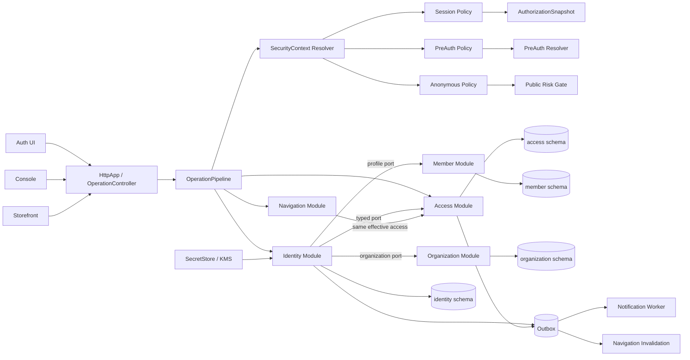
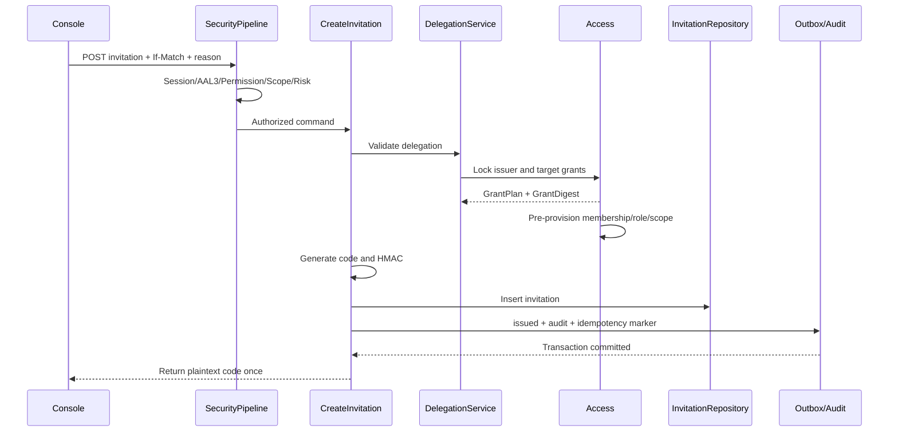
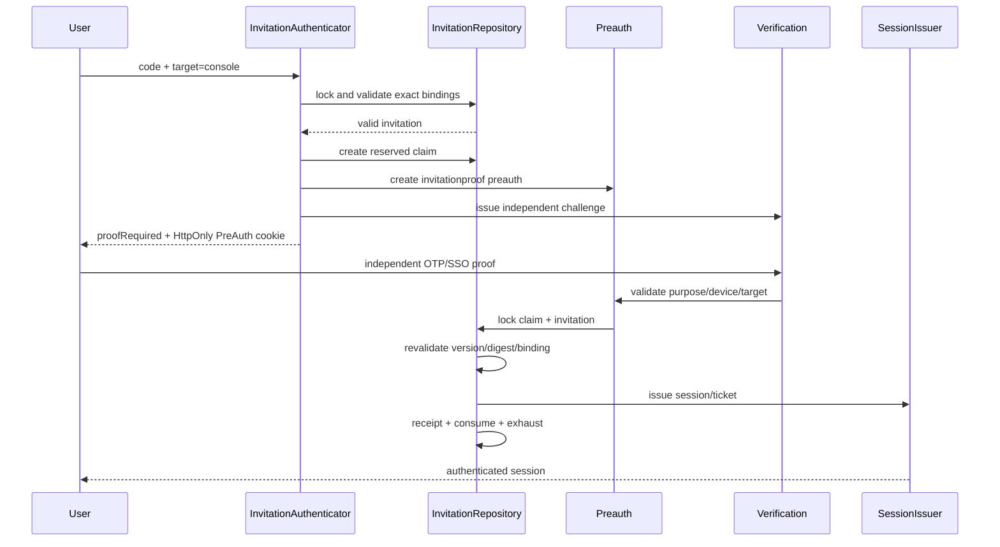
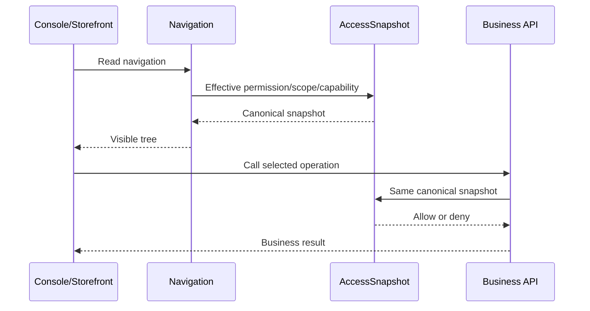

结论：严格落地这套方案，不能只在登录页增加一个“邀请码登录”入口，而要执行一次 Contract v3 级别的统一权限硬切换：邀请码只负责身份举证，RBAC 始终由 Access 模块提供；匿名、PreAuth、Session 三种安全上下文必须全部受控；导航与 API 必须共享同一套 Allow/Deny/Override/Scope 决策；旧 `member.invite`、`identity.members.create` 和前端旧注册链路必须整体退役。

以下是基于当前工作区快照给出的逐文件实施清单。本轮只做了只读分析，没有修改仓库代码、配置或文档。

---

# 一、实施边界和必须钉死的决策

方案基准是 [统一权限系统方案](/Users/changshengwang/Workspace/zhudatuan/docs/architecture/统一权限系统方案.md:1)，重点包括：

- 核心不变量：[第 59 行](/Users/changshengwang/Workspace/zhudatuan/docs/architecture/统一权限系统方案.md:59)
- DDD 边界：[第 155 行](/Users/changshengwang/Workspace/zhudatuan/docs/architecture/统一权限系统方案.md:155)
- 邀请模型：[第 184 行](/Users/changshengwang/Workspace/zhudatuan/docs/architecture/统一权限系统方案.md:184)
- RBAC 模型：[第 270 行](/Users/changshengwang/Workspace/zhudatuan/docs/architecture/统一权限系统方案.md:270)
- 接口契约：[第 614 行](/Users/changshengwang/Workspace/zhudatuan/docs/architecture/统一权限系统方案.md:614)
- 数据模型：[第 683 行](/Users/changshengwang/Workspace/zhudatuan/docs/architecture/统一权限系统方案.md:683)
- 性能目标：[第 845 行](/Users/changshengwang/Workspace/zhudatuan/docs/architecture/统一权限系统方案.md:845)
- 目标目录：[第 932 行](/Users/changshengwang/Workspace/zhudatuan/docs/architecture/统一权限系统方案.md:932)
- 删除项：[第 1101 行](/Users/changshengwang/Workspace/zhudatuan/docs/architecture/统一权限系统方案.md:1101)
- MVP 对齐：[第 1159 行](/Users/changshengwang/Workspace/zhudatuan/docs/architecture/统一权限系统方案.md:1159)
- 测试矩阵：[第 1187 行](/Users/changshengwang/Workspace/zhudatuan/docs/architecture/统一权限系统方案.md:1187)
- 切换步骤：[第 1261 行](/Users/changshengwang/Workspace/zhudatuan/docs/architecture/统一权限系统方案.md:1261)

必须在编码前统一以下口径，否则一定产生第二套兼容逻辑：

1. `Reserved` 不是 `identity.invitation.status`。

   它属于 `identity.invitationclaim.state`。邀请持久化状态仅为：

   `draft → active → exhausted/revoked/expired`

2. `Consumed` 不作为邀请状态。

   消费成功由不可变 `identity.invitationreceipt` 表示；同时 `use_count + 1`。个人邀请达到上限后变成 `exhausted`。

3. `stale` 不增加为第六个持久化状态。

   它是基于 `issuer_access_version`、角色版本和 `grant_digest` 动态推导出的失效结果。管理端可显示“已失效”，但数据库状态仍保留原始生命周期状态。

4. 邀请码至少具有 128 bit 随机熵。

   Crockford Base32 至少使用 26 个有效字符，再附加校验字符。方案里的短示例只能作为展示格式，不能直接成为长度实现。

5. `audience=public` 与“精确 Target”不能再混为一个字段。

   Operation 契约增加 `targets`：

   ```yaml
   audience: public
   targets:
     - console
     - storefront
   targetPolicy: exact
   ```

   `HttpApp` 校验 `X-Client-Target ∈ targets`，同时要求请求体 `target` 与请求头完全一致。

6. PreAuth 只有一套。

   现有 Federation PreAuth 扩展成带 `purpose` 的判别联合，不得再创建 InvitationPreAuth、EnrollmentPreAuth 两张表或两套 Cookie。

7. Contract 直接升级 v3。

   不保留 v2 端点别名、不保留 DTO 转换器、不双写、不双读、不提供 `identity.members.create` 兼容门面。

8. 旧邀请码不能无损换密钥。

   旧 `member.invite.token_hash` 使用旧身份密钥生成，而明文已不可恢复。又因为新邀请码必须使用独立 invitation key，所以禁止将旧 Hash 标记成“新 KeyVersion”继续使用。硬切换时应：

   - 将旧记录迁移成仅供审计的 revoked/expired campaign 记录；
   - 需要继续运行的活动必须批量重新签发新邀请码；
   - 不保留 `legacy-identity` Hash 验证分支。

9. 邀请码永远不携带授权能力。

   客户端请求中禁止出现 `roleId`、`scopeId`、`permission`、`membershipId` 等可影响最终授权的数据。登录邀请只能绑定服务端已经存在的 Principal、Membership 和 Target。

10. Console 邀请码必须有独立第二因子。

    “收到邀请码的同一渠道”不能同时作为第二因子。第二因子必须由服务端绑定的手机号、邮箱、企业身份或已登记凭据完成。

---

# 二、当前代码必须优先解决的 P0 差距

| P0                           | 当前实现                                                                                                                                        | 必须修改为                                                                     |
| ---------------------------- | ----------------------------------------------------------------------------------------------------------------------------------------------- | ------------------------------------------------------------------------------ |
| 匿名/PreAuth 绕过            | `SecureOperationPolicy` 对匿名和 PreAuth 都返回空上下文                                                                                         | 使用 `anonymous / preauth / session` 判别联合，每种都执行自己的强制策略        |
| 邀请归属错误                 | [MemberPort.ts](/Users/changshengwang/Workspace/zhudatuan/services/commerce/src/modules/member/MemberPort.ts:44) 持有邀请码读写消费逻辑         | Invitation 全部迁入 Identity；Member 只管理会员资料                            |
| 认证入口不统一               | [IdentityCore.ts](/Users/changshengwang/Workspace/zhudatuan/services/commerce/src/modules/identity/IdentityCore.ts:79) 主要按 password/otp 分支 | Strategy + Registry，新增 InvitationAuthenticator，Federation 也接入同一注册表 |
| 客户端可参与选择授权         | 现有认证链路允许提交 subject/membership 等信息                                                                                                  | 邀请登录只接受 `code + target + returnTarget`，绑定关系完全由服务端解析        |
| RBAC 不完整                  | [Policy.ts](/Users/changshengwang/Workspace/zhudatuan/packages/authz/src/Policy.ts:1) 没有完整 Role/Override Allow/Deny 合并                    | `Effective = (RoleAllow ∪ OverrideAllow) - (RoleDeny ∪ OverrideDeny)`          |
| Scope Deny 漂移              | API、Capability、Navigation 使用不同 SQL 公式                                                                                                   | 三者调用同一个 canonical authorization snapshot                                |
| Maker-checker 只停留在元数据 | 没有运行时消费 ActionProof                                                                                                                      | 增加一次性 ActionProof 校验、异人检查、请求摘要绑定和事务内消费                |
| 旧邀请码安全不足             | 多次使用、角色固定、旧 Hash Key、Member 持有                                                                                                    | 独立 KeyRing、单次返回、精确绑定、行锁消费、Identity 持有                      |
| Identity 单体过大            | [IdentityCore.ts](/Users/changshengwang/Workspace/zhudatuan/services/commerce/src/modules/identity/IdentityCore.ts:1) 超出职责和行数边界        | 删除单体，拆成 command/query/service/policy/repository/handler                 |
| Auth 页面单体过大            | [LoginPage.tsx](/Users/changshengwang/Workspace/zhudatuan/apps/auth/src/screens/LoginPage.tsx:1) 同时承担页面、状态、请求和表单                 | 保持 DOM、样式和文案，拆分 Router、Provider 和独立表单                         |
| Schema 不严格                | 生成请求体允许额外字段                                                                                                                          | 所有敏感请求使用严格判别联合，`additionalProperties: false`                    |
| 旧注册口仍可激活权限         | `identity.members.create` 能创建身份和 Membership                                                                                               | 完全删除；Enrollment 只通过绑定邀请码完成                                      |

---

# 三、目标系统结构



边界规则：

- Identity 不直接执行 Access Schema SQL。
- Access 不写 Identity、Member 数据。
- Member 不创建或激活 Membership。
- Navigation 不自行推导权限，只消费 Access 的统一快照。
- Interface 只能依赖 Application。
- Application 只能依赖 Domain 和 Port。
- Infrastructure 实现 Port。
- 跨模块只允许依赖 `public` 目录中的接口和 Token。
- Use Case 不得使用 Service Locator。
- Composition 只允许出现在 `IdentityModule.ts`、`AccessModule.ts` 等模块装配文件。

---

# 四、契约和唯一事实源修改

## 4.1 Contract definitions

### 修改 `packages/contract/definitions/operations.yml`

升级为 v3，新增或重定义：

| Operation                       | HTTP                                       | 安全上下文 | Target                   | 权限/保障                                      |
| ------------------------------- | ------------------------------------------ | ---------- | ------------------------ | ---------------------------------------------- |
| `identity.sessions.create`      | `POST /identity/sessions`                  | anonymous  | exact console/storefront | Origin、CSRF、限流、幂等                       |
| `identity.sessions.complete`    | `POST /identity/sessions/complete`         | preauth    | exact                    | PreAuth purpose、OTP/SSO proof                 |
| `identity.invitations.resolve`  | `POST /identity/invitations/resolve`       | anonymous  | exact                    | 通用错误、限流、幂等                           |
| `identity.invitations.read`     | `GET /identity/invitations`                | session    | console                  | `identity.invitation.read`                     |
| `identity.invitations.create`   | `POST /identity/invitations`               | session    | console                  | AAL3、issue、delegate、expectedVersion、reason |
| `identity.invitations.revoke`   | `DELETE /identity/invitations/{id}`        | session    | console                  | AAL3、revoke、If-Match、reason、幂等           |
| `identity.enrollments.read`     | `GET /identity/enrollments/{id}`           | preauth    | exact                    | purpose=enrollment                             |
| `identity.enrollments.complete` | `POST /identity/enrollments/{id}/complete` | preauth    | exact                    | recipient proof、terms、credential、幂等       |

删除：

- `identity.members.create`
- 旧邀请码解析/注册端点
- 所有旧路径别名
- 所有旧请求 DTO

`identity.sessions.create` 请求体使用严格判别联合：

```ts
type SessionCreateRequest = PasswordSessionRequest | OtpSessionRequest | InvitationSessionRequest | FederationSessionRequest;
```

邀请码分支只允许：

```ts
{
  method: "invitation";
  code: string;
  target: "console" | "storefront";
  returnTarget?: string;
}
```

禁止额外字段，尤其禁止：

- `principalId`
- `membershipId`
- `roleId`
- `scopeId`
- `permission`
- `organizationId`
- `assurance`

认证结果统一为：

```ts
type AuthenticationResult =
  | { kind: 'session'; ticket: string; returnTarget: string }
  | { kind: 'selection'; transaction: string; memberships: SelectableMembership[] }
  | { kind: 'proofRequired'; proof: ProofView }
  | { kind: 'enrollment'; enrollment: EnrollmentView };
```

保留 `selection` 是为了保留现有密码、OTP、Federation 多 Membership UX；邀请码绑定精确 Membership，不进入选择页。

### 新增 `packages/contract/definitions/permissions.yml`

迁移所有手写权限定义，作为唯一权限事实源。邀请码权限至少包括：

```text
identity.invitation.read
identity.invitation.issue
identity.invitation.revoke
identity.invitation.audit
access.role.delegate
access.scope.delegate
access.membership.activate
```

每项应包含：

- code
- module
- category
- risk
- minimumAssurance
- delegatable
- allowedScopeKinds
- makerChecker
- description

删除 `identity.invitation.manage` 这类过粗权限。

### 修改 `capabilities.yml`

- 增加新 Operation 对应 Capability。
- 删除 `identity.members.create`。
- 确保邀请管理只映射到现有 MVP 设置中心。
- 不创建新顶级 Capability 或新顶级菜单。

### 修改 `errors.yml`

公开邀请码接口只暴露统一错误：

```text
INVITATION_INVALID
PREAUTH_REQUIRED
PREAUTH_EXPIRED
PROOF_REQUIRED
RATE_LIMITED
```

无效、过期、撤销、错误 Target、错误 Recipient、已使用、Principal 不匹配等对公开端统一为相同 HTTP 状态、错误消息和近似耗时。

管理端可返回：

```text
INVITATION_NOT_FOUND
INVITATION_STALE
DELEGATION_DENIED
OWNER_TRANSFER_REQUIRED
VERSION_CONFLICT
MEMBERSHIP_NOT_INVITED
```

删除 `INVITE_INVALID` 等旧名称。

### 修改 `events.yml`

新增：

```text
identity.invitation.issued
identity.invitation.reserved
identity.invitation.redeemed
identity.invitation.revoked
identity.invitation.expired
identity.invitation.failed
identity.enrollment.completed
access.membership.invited
access.membership.activated
access.version.changed
```

事件载荷不得包含邀请码、Token Hash、Recipient 明文、Cookie、Ticket、OTP。

### 新增 `packages/contract/definitions/navigation.yml`

将 [config/navigation.yml](/Users/changshengwang/Workspace/zhudatuan/config/navigation.yml:1) 移入 Contract definitions，旧文件删除，不复制。

结果是：

- Operation、Permission、Capability、Error、Event、Navigation 均只存在一份权威定义。
- 前后端、OpenAPI、SDK、审计脚本和导航投影全部由生成器消费。

## 4.2 生成器

修改 [ClientArtifacts.ts](/Users/changshengwang/Workspace/zhudatuan/tools/contractgen/src/ClientArtifacts.ts:1) 及 Contract Generator：

- 解析 `permissions.yml` 和 `navigation.yml`。
- 校验 Operation 引用的 Permission 必须存在。
- 校验 `audience`、`targets`、`targetPolicy` 一致。
- 对所有 body 生成 `additionalProperties: false`。
- 生成严格 Zod 判别联合。
- 校验匿名接口不得声明 Role/Scope 输入。
- 校验管理写操作必须声明：
  - idempotency
  - CSRF
  - Origin
  - expectedVersion
  - reason
  - assurance
- 校验一次性 Secret 响应不得进入可重放幂等结果。
- Contract 版本从 authority 自动推导，禁止硬编码 `2.0`。

修改：

- `tools/navigationgen/src/NavigationGenerator.ts`
- `tools/navigationgen/src/NavigationSchema.ts`
- `tools/navigationgen/src/NavigationValidator.ts`
- `scripts/audit/navigation.mjs`
- `scripts/audit/operations.mjs`
- `scripts/check/callgraph/operations.mjs`
- `config/authorities.yml`
- `config/artifacts.json`
- `database/contracts/objects.yml`

生成但禁止手工编辑：

- `packages/contract/openapi.json`
- `packages/contract/src/OperationCatalog.ts`
- `packages/contract/src/operations/CommerceOperations.ts`
- `packages/contract/src/operations/CommerceSchemas.ts`
- `packages/contract/src/ContractIdentity.ts`
- `packages/authz/src/generated/PermissionCatalog.ts`
- `packages/sdk/src/operations/CommerceClient.ts`
- `packages/sdk/src/operations/identity.ts`
- `packages/sdk/src/operations/access.ts`
- `services/commerce/src/foundation/interface/OperationController.ts`
- `apps/console/src/generated/NavigationBinding.ts`
- `database/contracts/current.sql`
- `evidence/navigation/catalog.json`

旧手写 `PermissionCatalog` 删除，前端不得再复制一份 Operation Schema。

---

# 五、Foundation 安全管线修改

## 5.1 安全上下文

修改：

- `services/commerce/src/foundation/application/OperationContext.ts`
- `services/commerce/src/foundation/application/OperationExecution.ts`
- `services/commerce/src/foundation/application/OperationPolicy.ts`
- `services/commerce/src/foundation/application/OperationPipeline.ts`
- `services/commerce/src/foundation/application/ModuleOperations.ts`

新增：

```text
foundation/security/OperationSecurityContext.ts
foundation/security/PreauthResolver.ts
foundation/security/MakerCheckerPolicy.ts
foundation/security/AuthorizationSnapshot.ts
```

安全上下文必须是：

```ts
type OperationSecurityContext = AnonymousSecurityContext | PreauthSecurityContext | SessionSecurityContext;
```

不得继续使用 `AccessContext | null` 表示匿名和 PreAuth，因为两者的策略完全不同。

增加统一方法：

```text
requireAnonymous()
requirePreauth(purpose)
requireSession()
requireExactTarget()
requireActionProof()
```

### Anonymous policy

校验：

- Origin
- CSRF bootstrap
- exact target
- IP、device、code、recipient 的限流
- 风险策略
- 请求体无未知字段
- URL 不含敏感参数

### PreAuth policy

校验：

- `__Host-preauth` HttpOnly、Secure、SameSite=Strict Cookie
- Hash
- purpose
- target
- browser/device binding
- state
- expiry
- claim/enrollment reference
- 一次性消费状态

禁止将 PreAuth Token 放入：

- URL
- localStorage
- sessionStorage
- React Query key
- 日志 -错误消息

### Session policy

继续复用现有 `AccessPipeline`，但改为一次性获取 `AuthorizationSnapshot`，避免目前按 Membership、Version、Scope、Capability、Permission 多次串行访问数据库。

推荐快照：

```ts
interface AuthorizationSnapshot {
  principal: PrincipalAccess;
  session: SessionAccess;
  membership: MembershipAccess;
  permissions: {
    allows: ReadonlySet<Permission>;
    denies: ReadonlySet<Permission>;
  };
  scopes: readonly EffectiveScope[];
  capabilities: ReadonlySet<OperationId>;
  accessVersion: number;
}
```

运行顺序固定为：

```text
session active
→ target
→ membership active
→ credential version
→ access version
→ deny
→ allow
→ scope allow
→ scope deny
→ capability
→ assurance
→ maker-checker
→ risk
→ audit
```

Deny 必须先于 Allow 生效。

## 5.2 Maker-checker

当前仅声明元数据但不执行是不安全的。新增 `MakerCheckerPolicy`：

- ActionProof 一次性。
- 绑定：
  - operationId
  - resourceId
  - canonical body hash
  - expectedVersion
  - target
  - scope
  - maker membership
  - checker membership
  - expiry
- checker 不能等于 maker。
- checker 权限和 AccessVersion 必须在消费时重新校验。
- ActionProof 与业务写入在同一个事务中消费。
- 重试不得重复消费。
- 适用于角色、Scope、Owner、关键资金或方案中标记的敏感操作。

邀请码普通签发可以不要求双人审批，但必须拒绝：

- Owner 角色
- 不可委托权限
- 超出签发者有效权限的 Role
- 超出签发者有效 Scope 的 Scope

## 5.3 HTTP 安全

修改实际 `HttpApp`：

- `targetPolicy=exact` 改为读取 Operation 的 `targets`。
- `X-Client-Target` 必填并与 body target 一致。
- 敏感 URL 关键字增加：
  - invitation
  - invite
  - code
  - claim
  - preauth
  - recipient
  - token
- GET Query 禁止传邀请码或 PreAuth。
- 登录、resolve、complete 继续执行 Origin 和 CSRF 校验。
- 不允许因 `audience=public` 跳过安全管线。
- 登录 Cookie 必须在事务提交后写出。
- 任何下游失败时不得产生半成功 Session。

## 5.4 幂等

`ModuleOperations` 保留现有 UnitOfWork + Audit + Outbox 结构，但增加“不可重放响应”类型。

邀请码签发时：

- 幂等表只保存邀请 ID、结果摘要和完成标志。
- 不保存邀请码明文。
- 相同 Idempotency-Key 重放返回 `409 IDEMPOTENCY_REPLAY_FORBIDDEN`。
- 如果客户端在提交后、收到响应前断线，只能撤销并重新签发。
- 不允许通过幂等记录恢复邀请码。

公开接口的幂等 Actor 不能统一写成 `public:operation`，否则不同用户会冲突。应使用服务端盲化组合：

```text
HMAC(target + deviceId + normalizedIpPrefix + codeFingerprint)
```

该值只用于隔离幂等空间，不可反向识别用户。

---

# 六、Authz 与 Access 模块修改

## 6.1 Authz 模型

修改：

- [packages/authz/src/Policy.ts](/Users/changshengwang/Workspace/zhudatuan/packages/authz/src/Policy.ts:1)
- [packages/authz/src/Scope.ts](/Users/changshengwang/Workspace/zhudatuan/packages/authz/src/Scope.ts:1)
- `packages/authz/src/index.ts`

目标模型：

```ts
interface PermissionSet {
  allows: ReadonlySet<PermissionCode>;
  denies: ReadonlySet<PermissionCode>;
}

interface EffectiveScope {
  effect: 'allow' | 'deny';
  kind: ScopeKind;
  resource: ScopeResource;
  path: string;
  effectiveAt: Date;
  expiresAt?: Date;
}
```

权限公式只能实现一次：

```text
allows = RoleAllow ∪ OverrideAllow
denies = RoleDeny ∪ OverrideDeny
effective = allows - denies
```

权限成立条件：

```text
permission ∈ allows
AND permission ∉ denies
```

Scope 成立条件：

```text
存在一个有效 Allow Scope 包含资源
AND 不存在一个有效 Deny Scope 包含资源
AND ScopeKind 在 Permission 允许的 ScopeKind 中
```

删除任何“先遇到 Allow 就返回 true”的短路逻辑。

## 6.2 Access 应用层

现有 [AccessOperations.ts](/Users/changshengwang/Workspace/zhudatuan/services/commerce/src/modules/access/AccessOperations.ts:1) 只保留 Operation 注册和装配，业务逻辑拆出。

新增：

```text
modules/access/
  application/
    command/
      CreateInvitationGrant.ts
      ActivateMembership.ts
      ManageRole.ts
      ManageScope.ts
      ManageOverride.ts
      TransferOwner.ts
    query/
      ReadAccessCenter.ts
      ReadAuthorizationSnapshot.ts
    service/
      DelegationService.ts
      AccessVersionService.ts
    port/
      AccessRepository.ts
      AuthorizationRepository.ts
  domain/
    model/
      GrantPlan.ts
      Membership.ts
      Role.ts
      Scope.ts
      Override.ts
    policy/
      DelegationPolicy.ts
      PermissionPolicy.ts
      ScopePolicy.ts
      OwnerPolicy.ts
  infrastructure/
    persistence/
      PgAccessRepository.ts
      PgAuthorizationRepository.ts
      PgInvitationAccess.ts
  public/
    IdentityAccessPort.ts
    NavigationAccessPort.ts
    index.ts
```

### `GrantPlan`

由 Access 创建并标准化，至少包含：

- target
- organizationId
- membershipId
- principalId
- role IDs 和 role versions
- allow/deny permission closure
- scope grants
- scope effects
- scope paths
- effective/expiry
- minimum assurance
- policy/terms hash

按固定键顺序序列化后计算 SHA-256 `grantDigest`。

Identity 只保存和校验 `grantDigest`，不重新构造授权规则。

### `DelegationService`

签发邀请前必须验证：

- 签发者 Membership active。
- AccessVersion 与 `If-Match` 一致。
- 目标组织和 Target 合法。
- 目标 Role 可委托。
- 目标 Permission 是签发者 Effective Permission 子集。
- 目标 Allow Scope 是签发者 Effective Scope 子集。
- 不穿透签发者 Deny Scope。
- 不能授予 Owner。
- 不能邀请自己。
- 不能修改自己的角色。
- 不能向上授权。
- 商家、供应商、品牌、门店等组织关系真实存在。
- 角色、权限、Scope 在邀请有效期内不会先过期。
- Target 与 Membership 类型一致。

### `AccessVersionService`

所有会改变有效权限的操作必须只经过这一服务：

- Membership 状态变化
- Role assignment 变化
- Role allow/deny 变化
- Override allow/deny 变化
- Scope allow/deny 变化
- Owner 转移

每次逻辑变更：

- AccessVersion 精确 `+1`
- 写一条 `access.version.changed`
- 使旧 Session 失效
- 使旧 Navigation Cache Key 自动失效
- 不允许多个 Repository 各自递增

### `ActivateMembership`

只通过 `IdentityAccessPort` 暴露，不注册成公开 HTTP Operation。

事务内：

- 锁定 Membership。
- 状态必须是 invited。
- Invitation、Principal、Target、Organization、Membership 必须完全匹配。
- GrantDigest 必须相等。
- 状态改为 active。
- 写 `joined_at`。
- AccessVersion `+1`。
- 发出 `access.membership.activated` 和 `access.version.changed`。

## 6.3 Owner

Access Role 增加 `kind`：

```text
custom
system
owner
```

禁止依赖 `role-owner` 这类字符串识别 Owner。

数据库增加：

- Organization 内 Owner Role 唯一约束。
- Owner Membership 唯一或符合业务要求的约束。
- `OwnerPolicy`。
- `TransferOwner` 专用命令。

普通邀请、普通角色管理、Override 都不得赋予或移除 Owner。

## 6.4 Public exports

修改：

- `services/commerce/src/modules/access/public/index.ts`
- `IdentityAccessPort.ts`
- `NavigationAccessPort.ts`

只导出接口、输入输出值对象和注入 Token，不导出：

- `AccessPort` 具体类
- PG Repository
- SQL 实现
- Domain Aggregate 内部状态

删除当前 Identity 对旧 registration 方法的依赖。

---

# 七、Identity 模块逐文件修改

## 7.1 删除单体

最终删除：

- [IdentityCore.ts](/Users/changshengwang/Workspace/zhudatuan/services/commerce/src/modules/identity/IdentityCore.ts:1)

[IdentityOperations.ts](/Users/changshengwang/Workspace/zhudatuan/services/commerce/src/modules/identity/IdentityOperations.ts:1) 只负责注册生成 Operation 和 Handler，不再持有 SQL、密码认证、邀请码消费或 Cookie 逻辑。

[IdentityModule.ts](/Users/changshengwang/Workspace/zhudatuan/services/commerce/src/modules/identity/IdentityModule.ts:1) 成为唯一 Composition Root。

## 7.2 目标目录

```text
services/commerce/src/modules/identity/
  IdentityModule.ts
  IdentityOperations.ts

  application/
    authentication/
      AuthenticationService.ts
      AuthenticationStrategy.ts
      PasswordAuthenticator.ts
      OtpAuthenticator.ts
      InvitationAuthenticator.ts
      FederationAuthenticator.ts
    command/
      CreateSession.ts
      CompleteSession.ts
      CreateInvitation.ts
      RevokeInvitation.ts
      CompleteEnrollment.ts
      RevokeSession.ts
    query/
      ReadSession.ts
      ReadInvitations.ts
      ResolveInvitation.ts
      ReadEnrollment.ts
    service/
      SessionIssuer.ts
      DefaultSessionIssuer.ts
      InvitationRedeemer.ts
      EnrollmentService.ts
      MembershipSelector.ts
    port/
      InvitationRepository.ts
      InvitationAccessPort.ts
      InvitationMemberPort.ts
      SessionRepository.ts
      ProviderSecret.ts

  domain/
    model/
      Invitation.ts
      InvitationClaim.ts
      InvitationCode.ts
      InvitationReceipt.ts
      Preauth.ts
      Session.ts
    policy/
      InvitationPolicy.ts
      EnrollmentPolicy.ts
      SessionPolicy.ts
      AuthenticationPolicy.ts

  infrastructure/
    persistence/
      PgInvitationRepository.ts
      PgSessionRepository.ts
      PgAuthTicket.ts
    security/
      InvitationHasher.ts
      InvitationGenerator.ts
      SessionCookie.ts
      ReturnTargetCatalog.ts
      ReturnTargetSigner.ts
    registry/
      AuthenticationRegistry.ts

  interface/
    handler/
      SessionsCreateHandler.ts
      SessionsCompleteHandler.ts
      InvitationsReadHandler.ts
      InvitationsResolveHandler.ts
      InvitationsCreateHandler.ts
      InvitationsRevokeHandler.ts
      EnrollmentsReadHandler.ts
      EnrollmentsCompleteHandler.ts
    job/
      InvitationCleanupJob.ts
```

生产源码命名全部为有意义的 PascalCase/camelCase，不出现下划线和连接符。每个生产源码不超过现有 299 行预算，建议控制在 200 行以内。

## 7.3 Authentication Strategy

`AuthenticationStrategy`：

```ts
interface AuthenticationStrategy {
  readonly method: AuthenticationMethod;
  authenticate(command: AuthenticationCommand, context: AuthenticationContext): Promise<AuthenticationResult>;
}
```

`AuthenticationRegistry`：

- 启动时一次性注册。
- 重复 method 直接启动失败。
- 注册完成后冻结，不允许运行时修改。
- 新认证方式通过新增 Strategy 即插即用。
- `AuthenticationService` 不写 switch/case。
- Registry 只在 Module 装配，Use Case 不得访问容器。

复用：

- 现有密码校验和 Attempt Limit。
- OTP Challenge。
- `DefaultSessionIssuer.ts`
- `MembershipSelector.ts`
- `PgAuthTicket.ts`
- Federation Service/Broker 内部能力。
- ReturnTarget 校验。
- Session Cookie。
- Risk、Audit、Outbox。

`IdentityBroker.ts` 的 Provider 分发最终并入或适配 `FederationAuthenticator`，不再形成平行认证入口。

## 7.4 Invitation Aggregate

`Invitation.ts` 只暴露行为：

```text
activate()
assertResolvable()
reserve()
assertRedeemable()
consume()
revoke()
expire()
deriveValidity()
```

不允许 Handler 直接修改 status/useCount。

`InvitationPolicy` 校验：

- kind
- target
- time window
- status
- max uses
- principal binding
- membership binding
- recipient binding
- issuer access version
- role version
- grant digest
- minimum assurance
- claim state
- campaign/enrollment policy
- terms hash

`InvitationCode`：

- normalize
- format
- checksum validation
- constant-time comparison support
- 不实现授权解析
- `toString()` 不返回明文
- JSON serialization 直接禁止或输出 `[REDACTED]`

`InvitationReceipt`：

- 创建后不可更新、不可删除。
- 不保存 token hash。
- 保存 trace、session、membership、principal、assurance、grant digest、issuer access version。

## 7.5 InvitationHasher 和 KeyRing

增加独立 Secret：

```text
INVITATION_KEY_REF
```

更新：

- `packages/config/src/ApiEnvironment.ts`
- `packages/config/src/JobsEnvironment.ts`
- `packages/config/src/LocalEnvironment.ts`
- `services/commerce/src/foundation/infrastructure/SecretStore.ts`
- Identity Security Keys

KeyRing：

- current key
- 至多两个 previous active keys
- 每个 Key 有不可变 version
- Invitation Hash 使用 HMAC-SHA256
- 与 Session、Password、Federation、ReturnTarget Key 完全分离

由于邀请码本身不暴露 KeyVersion，解析时针对最多三个活跃 Key 计算候选 Hash，然后执行一次：

```sql
WHERE token_hash = ANY($candidateHashes)
```

命中后校验 `token_key_version`。候选数必须有硬上限，避免轮换后线性退化。

## 7.6 邀请签发事务



代码明文只存在于命令执行内存和一次 HTTP Response 中。

## 7.7 Storefront 登录邀请

事务步骤：

1. 规范化邀请码。
2. 校验校验字符。
3. 计算 bounded KeyRing Hash candidates。
4. `SELECT ... FOR UPDATE` 锁 Invitation。
5. 校验 target=storefront。
6. 校验 kind=signin。
7. 校验 status、时间、次数。
8. 校验 exact principal、membership、organization。
9. 锁 Principal 和 Membership。
10. 校验 Membership active。
11. 校验 issuer AccessVersion。
12. 重新计算 GrantDigest。
13. 校验 AAL1 足够。
14. 创建 Session。
15. 创建一次性 AuthTicket。
16. 插入 Receipt。
17. `use_count + 1`，个人邀请变为 exhausted。
18. 写 Audit 和 Outbox。
19. 事务提交。
20. 写入 Session Cookie。
21. 明文 code 从内存清除。

任何一步失败，Session、Receipt、use_count、Outbox 全部回滚。

## 7.8 Console 两阶段登录



第一阶段完成后：

- 前端立即清除邀请码输入值。
- 后续请求只依赖 PreAuth Cookie。
- Claim 超时后自动释放。
- 第二因子失败不消费邀请码。
- Claim 已消费后重放必须失败。
- Console 风险服务异常时 Fail Closed。

## 7.9 Enrollment

`EnrollmentService` 负责：

- 读取服务端绑定的 Recipient。
- 创建 purpose=enrollment 的 PreAuth。
- 展示服务端版本化条款。
- 验证 Recipient Proof。
- 接受条款 Hash。
- 创建或绑定 Principal。
- 创建 Credential。
- 调用 Member Profile Port 创建资料。
- 调用 Access 激活预建 Membership。
- 创建 Session、Ticket、Receipt。
- 发出 enrollment completed 事件。

若手机号/邮箱已存在 Principal：

- 不创建重复 Principal。
- 必须完成现有身份验证。
- 合并逻辑必须有审计。
- 不允许通过邀请码接管已有账号。

Campaign 邀请只负责注册或活动容量，不允许直接创建 Session。

---

# 八、Member 模块修改

修改：

- [MemberPort.ts](/Users/changshengwang/Workspace/zhudatuan/services/commerce/src/modules/member/MemberPort.ts:1)
- `services/commerce/src/modules/member/public/IdentityMemberPort.ts`
- `services/commerce/src/modules/member/public/index.ts`
- `services/commerce/src/modules/member/MemberModule.ts`
- `services/commerce/src/modules/member/MemberPort.test.ts`

删除所有邀请职责：

```text
readInvite
assertInvite
consumeInvite
createInvite
revokeInvite
InvitationView
InviteStatus
```

保留或新增纯资料接口：

```text
findProfile()
createProfile()
updateProfile()
bindContact()
```

如需要 Enrollment 专用端口，应命名为 `InvitationMemberPort`，但只允许创建/读取 Profile，不得访问 Invitation 或 Access Membership。

旧 `member.invite` Repository、SQL、测试和 Module Binding 全部删除。

---

# 九、数据库逐表修改

## 9.1 `identity.invitation`

建议字段：

```text
id
kind                      signin | enrollment | campaign
target                    console | storefront
organization_id
membership_id
principal_id
recipient_hash
token_hash
token_key_version
issuer_membership_id
issuer_access_version
grant_digest
minimum_assurance
max_uses
use_count
not_before
expires_at
status                    draft | active | exhausted | revoked | expired
policy_id
terms_hash
reason
created_at
created_by
updated_at
revoked_at
revoked_by
revoked_reason
version
```

约束：

- `token_hash` 固定 32 bytes、唯一。
- `max_uses > 0`。
- `0 <= use_count <= max_uses`。
- `expires_at > not_before`。
- signin 必须绑定 Principal 和 Membership。
- enrollment 必须绑定预建 Membership 和 Recipient。
- campaign 不得直接绑定 Session 能力。
- console signin 必须配置 independent proof policy。
- status 与时间、次数一致。
- invitation target 与 membership target 一致。
- `version >= 1`。

索引：

```text
unique(token_hash)
(organization_id, created_at desc, id desc)
(status, expires_at, id)
(membership_id, status)
(principal_id, status)
(issuer_membership_id, created_at desc)
```

## 9.2 `identity.invitationclaim`

字段：

```text
id
invitation_id
target
recipient_hash
browser_hash
device_hash
state
proof_method
expires_at
proved_at
consumed_at
created_at
updated_at
version
```

状态：

```text
reserved
proofpending
proved
consumed
expired
revoked
```

增加个人邀请活跃 Claim 的部分唯一索引：

```sql
UNIQUE (invitation_id)
WHERE state IN ('reserved', 'proofpending', 'proved')
```

Campaign 容量通过行锁、活跃 Claim 和 TTL 控制；只有最终完成才增加 `use_count`。

## 9.3 `identity.invitationreceipt`

字段：

```text
id
invitation_id
principal_id
membership_id
session_id
assurance
issuer_access_version
grant_digest
redeemed_at
trace_id
```

要求：

- Insert only。
- 禁止 UPDATE。
- 禁止 DELETE。
- 不保存邀请码 Hash。
- 数据库 Trigger 和权限共同保证不可变。
- RLS 仅允许 Identity 写，审计角色只读。

## 9.4 `identity.preauth`

扩展现有表，不新建第二套：

```text
purpose:
  federationselection
  invitationproof
  enrollment
```

通用字段：

```text
id
purpose
target
principal_id
reference_id
token_hash
browser_hash
device_hash
state
expires_at
consumed_at
created_at
version
```

Federation 专用字段允许为空，但用 CHECK 约束不同 purpose 的必填组合。

例如：

- federationselection 必须有 transaction/candidate memberships。
- invitationproof 必须有 invitation claim。
- enrollment 必须有 invitation claim 或 enrollment reference。
- 不允许混合字段组合。

## 9.5 Access SQL

增加唯一的 SQL 权限计算入口，推荐：

```text
access.authorization_snapshot(membership_id, target)
access.effective_permissions(membership_id)
access.effective_scopes(membership_id)
```

然后统一改造：

- `access.resolve_membership`
- `access.navigation_access`
- `capability.membership_operations`

三者必须调用相同的 Allow/Deny/Override/Scope 公式。

数据库结果必须包含：

- Membership 状态
- AccessVersion
- CredentialVersion
- Role assignment validity
- Role active/version
- Permission allow/deny
- Override allow/deny
- Scope allow/deny
- Effective/expiry
- Target
- Organization

## 9.6 锁顺序

所有相关事务固定：

```text
invitation
→ invitationclaim
→ challenge/proof
→ principal
→ membership
→ session
→ ticket
→ receipt
→ outbox
→ audit
```

不得在不同 Command 中颠倒，否则并发领取、撤销和完成证明时会产生死锁。

---

# 十、数据库迁移顺序

历史迁移只读，不修改。新增迁移建议：

```text
database/migrations/
  20260830100000_unify_access_policy.sql
  20260830101000_add_invitation_login.sql
  20260830102000_backfill_invitations.sql
  20260830103000_cutover_invitation_owner.sql
  20260830104000_retire_registration_endpoint.sql
```

## 10.1 `unify_access_policy`

- Role 增加 kind。
- 增加 owner 约束。
- 补齐 Override Allow/Deny。
- 补齐 Scope Deny。
- 创建 canonical authorization functions。
- 重写 membership/navigation/capability 查询。
- 增加必要索引。
- 回放现有角色权限，验证前后非邀请业务结果。

## 10.2 `add_invitation_login`

- 创建 invitation、claim、receipt。
- 扩展 preauth。
- 创建 RLS、Trigger、索引和数据库权限。
- 注册新事件、Job、Operation Contract 对象。
- 增加 Invitation KeyVersion 数据约束。

## 10.3 `backfill_invitations`

- 读取旧 `member.invite`。
- 迁移业务元数据、次数、状态、有效期、条款。
- 旧邀请码统一不可继续兑换。
- 记录旧 ID 与新审计 ID 的映射，仅供迁移核对。
- 需要继续生效的 Campaign 重新签发。
- 校验总数、状态数、活动数、使用数和条款 Hash。

## 10.4 `cutover_invitation_owner`

- 停止旧入口。
- 启用新 Contract v3。
- 切换 Runtime Privileges。
- 切换 RLS。
- 启用新 Job。
- 对账 Invitation/Claim/Receipt/Membership。
- 清空旧连接池计划缓存。
- 不进行双写、双读。

## 10.5 `retire_registration_endpoint`

删除：

- `member.invite`
- 旧函数
- 旧 Policy
- 旧数据库角色授权
- `identity.members.create`
- 旧 Capability
- 旧 Contract 对象
- 旧 Secret 引用
- 旧测试 Fixture

一旦产生第一张新 Receipt 或新 Session，禁止回滚旧版本；只能前向修复。

---

# 十一、Auth UI 修改：保留现有 UI 和 UX

现有 [LoginPage.tsx](/Users/changshengwang/Workspace/zhudatuan/apps/auth/src/screens/LoginPage.tsx:1) 的视觉结构、颜色、尺寸、文案基调、条款、Footer、弹窗和现有交互保持不变，只拆职责并增加同风格邀请码入口。

目标目录：

```text
apps/auth/src/
  app/
    AuthRouter.tsx
    AuthProvider.tsx

  feature/
    login/
      LoginPage.tsx
      PasswordForm.tsx
      OtpForm.tsx
      InvitationForm.tsx
      ProviderList.tsx
    invitation/
      InvitationProof.tsx
      InvitationError.tsx
      EnrollmentPage.tsx
    selection/
      MembershipSelection.tsx

  entity/
    authentication/
      AuthenticationState.ts
      AuthenticationResult.ts

  shared/
    api/
      IdentityClient.ts
    ui/
      LoginCard.tsx
      LoginAlert.tsx
      TermsDialog.tsx
```

具体修改：

1. 当前两列 Tab 改为三列：

   ```text
   密码登录 | 验证码登录 | 邀请码登录
   ```

2. 不改变：

   - Login Card 宽高
   - Logo
   - 背景
   - 输入框高度
   - Button 风格
   - 移动端断点
   - 条款入口
   - Footer
   - 原有错误提示样式

3. `InvitationForm` 只显示：

   - 邀请码
   - 登录按钮
   - 通用错误
   - 必要的服务条款提示

4. 邀请码 Input：

   - `autoComplete="off"`
   - 不写入 URL
   - 不写入 storage
   - 不进入埋点
   - 提交第一阶段成功后立即清空
   - 组件卸载时清空
   - 不在 React DevTools 可长期保留的全局 Context 中存储

5. Console 收到 `proofRequired` 后，继续复用现有 Login Card 显示 OTP/SSO Proof。

6. Enrollment 复用现有注册弹窗视觉，但状态来源改成 PreAuth：

   - 不再保存 `activeInvitation`
   - 不再把原邀请码传给后续步骤
   - Terms 从服务端读取
   - Credential 只在最终步骤提交

7. 保留现有 Membership Selection：

   - 密码、OTP、Federation 仍可进入。
   - 邀请码精确绑定 Membership，直接跳过。

8. `canonicalIdentity.ts` 改成生成 SDK 的薄适配层，或直接替换为 `shared/api/IdentityClient.ts`。

9. 不再存在 `canonicalRegistration`、旧注册请求、旧 invitation DTO。

10. `App.tsx` 只挂载 `AuthProvider` 和 `AuthRouter`。

11. 增加无障碍：

- Tab 键顺序
- 输入 Label
- 错误 `aria-live`
- OTP 自动聚焦
- 粘贴完整邀请码
- Enter 提交
- Proof 返回后的焦点恢复

---

# 十二、Console 修改：不新增顶级菜单

现有 [AccessRoute.tsx](/Users/changshengwang/Workspace/zhudatuan/apps/console/src/feature/settings/access/AccessRoute.tsx:1) 保持现有 Route、PagedResource、标题、间距、导航层级。

目录调整：

```text
apps/console/src/feature/settings/access/
  AccessRoute.tsx
  AccessQuery.ts
  AccessSchema.ts
  Manifest.ts
  InvitationPanel.tsx
  InvitationTable.tsx
  InvitationCreateDialog.tsx
  InvitationCodeDialog.tsx
  InvitationRevokeDialog.tsx
```

具体修改：

- `AccessRoute` 内增加二级 Tab：
  - 成员与权限
  - 邀请
- 不增加 Sidebar 顶级节点。
- 集团端挂在 MVP13 设置。
- 商城端挂在 MVP22 设置。

Invitation 表格字段：

```text
类型
Target
Recipient 脱敏值
状态
已用/上限
生效时间
失效时间
签发者
签发者版本
创建时间
```

不得显示：

- 邀请码
- Token Hash
- Recipient 明文
- Claim Token
- PreAuth
- Session
- Credential

创建弹窗：

- 类型
- Target
- Recipient
- 精确 Role
- 精确 Scope
- 生效/过期
- 原因
- 授权预览
- 风险提示

服务端返回一次性邀请码后：

- 使用独立 `InvitationCodeDialog` 展示。
- 只允许复制。
- 关闭后永久丢弃。
- 不写入 React Query Cache。
- 不写入浏览器存储。
- 不进入列表响应。
- 刷新不能恢复。

撤销弹窗：

- 必填原因。
- 使用当前 Invitation `version` 作为 `If-Match`。
- 成功后使 Query 失效并重新读取。
- 版本冲突显示现有冲突视觉，不做静默覆盖。

Query Key 至少包含：

```text
target
organization
accessVersion
status filter
kind filter
cursor
```

按钮同时受 Permission 和 Capability 控制；隐藏按钮不是安全边界。

---

# 十三、Navigation 修改

不增加邀请码专用菜单。

修改：

- `services/commerce/src/modules/navigation/application/projection/NavigationProjector.ts`
- `NavigationFilter.ts`
- `NavigationInvalidator.ts`
- `PgNavigationAccess.ts`
- 生成的 Console Navigation Binding

要求：

- Navigation Access 改用 canonical AuthorizationSnapshot。
- Override Deny 和 Scope Deny 必须影响导航。
- `access.membership.activated` 触发缓存失效。
- `access.version.changed` 触发版本化 Key 自然失效。
- 缓存 Key 包含：
  - catalogVersion
  - accessVersion
  - capabilityVersion
  - scopeVersion
  - target
- Redis 仅缓存投影，不作为授权真相。
- Redis 故障时可降级从 PG 读取并降低并发。
- API 授权不得因 Redis 或导航降级而放宽。
- 旧 Session 即使保留了旧导航，也必须被 AccessVersion 拒绝 API。

统一调用关系：



---

# 十四、Job、事件与可观测性

新增：

```text
services/commerce/src/modules/identity/interface/job/InvitationCleanupJob.ts
docs/operations/invitationcleanup.md
```

修改：

- `services/commerce/src/app/jobs.ts`
- `services/commerce/src/bootstrap/JobRegistry.ts`
- `scripts/audit/jobs.mjs`
- `packages/config/src/JobsEnvironment.ts`

Job 注册：

```text
id: invitationcleanup
owner: identity
class: maintenance
concurrency: 2
timeout: 60s
```

处理方式：

- Keyset pagination。
- 索引顺序 `status, expires_at, id`。
- `FOR UPDATE SKIP LOCKED`。
- 每批独立短事务。
- 过期：
  - active invitation
  - reserved/proofpending claim
  - invitationproof/enrollment preauth
- 不做全表锁。
- 不同步发送通知。
- 通知通过 Outbox 异步执行。

指标：

```text
identity_invitation_resolve_total
identity_invitation_redeem_total
identity_invitation_redeem_duration_ms
identity_invitation_failure_total
identity_invitation_claim_active
identity_invitation_stale_total
identity_invitation_replay_total
identity_invitation_rate_limited_total
identity_enrollment_complete_total
access_authorization_snapshot_duration_ms
```

日志只允许：

- blinded invitation ID
- target
- kind
- outcome
- error code
- scope kind
- trace ID
- duration

禁止：

- code
- token hash
- recipient
- phone/email
- request body
- Cookie
- ticket
- OTP
- preauth token

修改 `packages/telemetry/src/Redactor.ts` 和 telemetry 配置，将 `invite/code/claim/preauth/recipient/tokenhash` 加入拒绝字段。

告警：

- 爆破率异常
- 重放激增
- Console Proof 失败率
- stale 邀请激增
- Claim 堆积
- Cleanup 延迟
- Authz Snapshot P95 超标
- Invitation Key 不可用
- Receipt 与 use_count 不一致
- Session 创建与 Receipt 不一致
- Navigation/API 决策差异

Runbook 必须包含：

- 触发条件
- 影响范围
- Owner
- 止损
- 诊断 SQL
- 恢复流程
- 数据修复
- 对账
- 验证
- 升级路径
- 审计取证
- 复盘模板

---

# 十五、性能和可用性修改

硬指标：

| 路径                  |                  P95 |
| --------------------- | -------------------: |
| HMAC + 索引查找       |                ≤20ms |
| Storefront 邀请登录   |               ≤150ms |
| Console 第一阶段      |               ≤150ms |
| Console 第二阶段      | ≤200ms，不含异步通知 |
| Navigation 缓存命中   |                ≤20ms |
| Navigation 缓存未命中 |                ≤80ms |
| API 授权              |                ≤60ms |

实施点：

- Authorization Snapshot 一次 DB Roundtrip。
- Invitation Hash 使用唯一索引，不允许扫描。
- 列表使用 Keyset，不用深分页 Offset。
- KeyRing 候选最多三个。
- 通知不在登录事务内发送。
- 登录使用独立 Bulkhead 和连接池配额。
- 按 code、IP、device、recipient、target 多维限流。
- Console 风险依赖异常时 Fail Closed。
- Storefront 低风险路径可执行本地保守规则，但不能绕过数据库状态。
- PG 不可用时禁止创建 Session。
- Secret/KMS 不可用时禁止解析新邀请码。
- 邀请登录不执行无意义的 Password Hash。
- 公开错误使用统一索引路径和响应时间均衡，防止状态枚举。
- 所有并发消费依赖数据库行锁和唯一约束，不依赖 Redis 锁。

---

# 十六、需要删除的文件和逻辑

确定删除：

- `services/commerce/src/modules/identity/IdentityCore.ts`
- Identity 旧 `MembersCreateHandler.ts`
- `identity.members.create` Operation/Capability/SDK/Handler/Test
- Member 邀请方法和测试
- `member.invite`
- 旧邀请码 SQL Function、Privilege、Policy
- 旧 invitation manage 粗粒度权限
- 旧前端 registration DTO/Service
- `activeInvitation` 客户端状态
- 旧导航配置 `config/navigation.yml`
- 手写 PermissionCatalog
- 旧 Contract v2 邀请 Schema
- 旧 Session 创建双实现
- 旧邀请码 Secret 引用
- 空 compatibility/service/package 目录
- Auth README 中旧兼容 BFF 描述
- 所有旧 Cookie 名称、旧 Role 字符串判断和旧 Endpoint Alias

不得新增：

- LegacyInvitationService
- InvitationCompatAdapter
- v2/v3 双路由
- MemberInvitationFacade
- DualWriteRepository
- Feature Flag 双实现
- 旧 Hash Key 回退
- 客户端 Role/Scope 兼容字段

---

# 十七、DDD、SOLID 和模式落地检查

使用的模式必须有明确边界：

- Strategy + Registry：认证方式扩展。
- Aggregate + State：Invitation、Claim、PreAuth 生命周期。
- Repository：数据库持久化。
- Policy/Specification：授权、Scope、Owner、Enrollment。
- Unit of Work：单事务。
- Transactional Outbox：可靠事件。
- Adapter/ACL：Identity 调 Access、Member、Organization。
- Factory：InvitationCode、Session、PreAuth 创建。
- Value Object：Code、Target、GrantDigest、RecipientHash。
- Optimistic Lock：Invitation 和 Access 管理。
- Pessimistic Lock：邀请码消费和容量预留。

SOLID：

- SRP：Handler 只做协议映射，Command 负责编排，Aggregate 保护状态。
- OCP：新增认证方式只新增 Strategy 和注册。
- LSP：所有 Strategy 返回同一 AuthenticationResult。
- ISP：IdentityAccessPort 只暴露邀请所需能力。
- DIP：Application 依赖 Port，不依赖 PG。
- 迪米特法则：Handler 不拿 Repository 拼业务；Identity 不穿透 Access Aggregate；UI 不拼授权字段。

代码质量：

- 生产文件名禁止 `_`、`-` 和空格。
- SQL、配置、脚本、测试可按仓库例外规则命名。
- 生产源码每文件不超过 299 行。
- 禁止跨模块深路径导入。
- 禁止重复枚举 Operation、Permission、Navigation、Error。
- 禁止前后端各写一套校验公式。

---

# 十八、MVP 上线清单对齐

本次只在现有设置中心增加邀请管理，不新增 MVP 功能和顶级菜单。

| MVP   | 模块         | 本次影响                                 |
| ----- | ------------ | ---------------------------------------- |
| MVP03 | 平台组织层级 | 作为 Organization/Scope 基础，不改变功能 |
| MVP04 | 分销商       | 保持原发布阻塞条件，不通过权限改造掩盖   |
| MVP05 | 集团看板     | 仅统一授权                               |
| MVP06 | 集团应用     | 仅统一授权                               |
| MVP07 | 集团商品池   | 仅统一授权                               |
| MVP08 | 集团订单     | 仅统一授权                               |
| MVP09 | 集团券码     | 仅统一授权                               |
| MVP10 | 集团财务     | 仅统一授权                               |
| MVP11 | 集团报表     | 保留现有“粉类”等业务阻塞                 |
| MVP12 | 集团客服     | 仅统一授权                               |
| MVP13 | 集团设置     | 承载集团邀请管理                         |
| MVP14 | 商城看板     | 仅统一授权                               |
| MVP15 | 商城设计     | 仅统一授权                               |
| MVP16 | 商城商品池   | 仅统一授权                               |
| MVP17 | 商城订单     | 仅统一授权                               |
| MVP18 | 商城券码     | 仅统一授权                               |
| MVP19 | 商城财务     | 仅统一授权                               |
| MVP20 | 商城报表     | 保留现有业务阻塞                         |
| MVP21 | 商城客服     | 仅统一授权                               |
| MVP22 | 商城设置     | 承载商城邀请管理                         |
| MVP23 | P1 接口      | 不改变供应商数量、接口范围和导航         |

MVP 功能范围依据：:codex-file-citation{path="/Users/changshengwang/Workspace/zhudatuan/docs/福利商城功能清单.xlsx" purpose="source" artifact_kind="workbook" sheet="MVP上线功能清单" range="A1:F23"}

P1 接口继续严格保持 11 类：

- 京东
- 京东生鲜
- 天猫超市
- 私域供应商
- 蛋糕
- 鲜花
- 图书
- 直充
- 美食券
- 电影
- 在线点餐

不得因统一权限改造增加或删除渠道 Provider、路由或菜单。接口范围依据：:codex-file-citation{path="/Users/changshengwang/Workspace/zhudatuan/docs/福利商城功能清单.xlsx" purpose="source" artifact_kind="workbook" sheet="接口" range="A1:K21"}

---

# 十九、完整测试矩阵

## 单元测试

- Invitation 全状态转换。
- signin/enrollment/campaign 字段约束。
- Target/Principal/Membership/Recipient 精确绑定。
- GrantDigest 确定性。
- Issuer AccessVersion 失效。
- RoleVersion 失效。
- Owner 禁止委托。
- 自邀请禁止。
- 向上授权禁止。
- Role Allow/Deny。
- Override Allow/Deny。
- Deny 优先。
- Scope 包含关系。
- Scope Deny 优先。
- 时间窗口。
- maxUses。
- Claim TTL。
- Terms Hash。
- Code normalization/checksum。
- HMAC Key rotation。
- Hash collision 防御。
- PreAuth purpose 隔离。
- ActionProof body/version 绑定。

## Contract 测试

- 所有请求拒绝未知字段。
- Invitation 登录拒绝 role/scope/membership 注入。
- audience/targets/targetPolicy 一致。
- SDK、Handler、OpenAPI 完全一致。
- 管理写操作必须 CSRF、幂等、AAL3、expectedVersion、reason。
- 公开错误不泄露状态。
- 一次性 Secret 不进入幂等存储。
- 删除的 Operation 无生成产物和路由。

## Repository 和并发测试

- 100 个并发请求消费个人邀请，只能成功 1 次。
- Campaign 达到 maxUses 后不超发。
- Claim 过期释放容量。
- Revoke 与 Redeem 并发。
- Proof Complete 与 Cleanup 并发。
- Session 写失败整事务回滚。
- Receipt 写失败整事务回滚。
- Audit 写失败整事务回滚。
- Outbox 写失败整事务回滚。
- stale issuer/version/digest。
- Key rotation 新旧有效窗口。
- Receipt 不可更新删除。
- RLS 跨组织隔离。

## 安全测试

- 暴力枚举。
- 时间侧信道。
- 重放。
- Session fixation。
- CSRF。
- Open Redirect。
- URL/日志/埋点/Cache 泄漏扫描。
- 跨 Target。
- 跨组织。
- 跨商城。
- 跨供应商。
- Owner 注入。
- Role/Scope 客户端伪造。
- 同一第二因子渠道绕过。
- PreAuth purpose 混用。
- PreAuth 跨设备。
- Cookie 降级。
- Redis 失效。
- Risk 失效。
- 旧 Session AccessVersion。
- 直接调用隐藏菜单对应 API。
- ActionProof maker=checker。
- ActionProof 请求体变化。
- ActionProof 重放。

## 前端测试

- 三 Tab 视觉回归。
- 密码登录无回归。
- OTP 登录无回归。
- Federation 无回归。
- 邀请码粘贴和提交。
- 成功后清空邀请码。
- Proof 页返回。
- Enrollment Terms。
- 一次性 Code Dialog。
- 关闭后不可恢复。
- Query Cache 不含 Code。
- 浏览器 Storage 不含 Code。
- 键盘和读屏。
- 手机和桌面布局截图比对。

## Journey

至少保留方案的 15 条 Journey：

```text
invite01_storefront_signin_success
invite02_console_signin_proof_success
invite03_enrollment_success
invite04_invalid_code
invite05_expired_code
invite06_revoked_code
invite07_replayed_code
invite08_wrong_target
invite09_wrong_recipient
invite10_stale_issuer
invite11_stale_role
invite12_scope_escalation_denied
invite13_owner_delegation_denied
invite14_concurrent_redeem_one_wins
invite15_navigation_api_consistency
```

## 性能测试

- HMAC lookup P95。
- Storefront signin P95。
- Console phase 1/2 P95。
- Authorization Snapshot P95。
- Navigation hit/miss。
- 100/500/1000 并发兑换。
- Cleanup 与登录并行。
- Key rotation 三 Key 候选。
- Redis 故障降级。
- PG 连接池饱和保护。

## 执行顺序

```bash
npm run generate
npm run check:generated
npm run check:navigation
npm run check:contracts
npm run typecheck
npm run lint
npm run test
npm run database:replay
npm run test:security
npm run test:performance
npm run test:journey
npm run quality
```

本轮没有实际执行这些命令，因为用户要求的是代码修改点而非代码实施。

---

# 二十、推荐实施批次

1. Contract v3、Permission、Navigation 唯一事实源。
2. Authz Allow/Deny/Override/Scope 统一。
3. Foundation 三态安全上下文和 Snapshot。
4. Access Delegation、Owner、GrantDigest、Membership Activation。
5. Identity Invitation/Claim/Receipt/PreAuth Domain。
6. 新数据库表和 append-only migration。
7. Storefront 邀请登录。
8. Console 两阶段邀请登录。
9. Enrollment。
10. Auth UI 拆分并增加第三 Tab。
11. Console 设置中心邀请管理。
12. Navigation 统一决策和失效。
13. Cleanup、事件、指标、Runbook。
14. 旧数据硬切。
15. 删除 `member.invite`、`identity.members.create`、旧 DTO 和兼容逻辑。
16. 全量安全、并发、性能、MVP 回归验收。

最终上线门槛不是“邀请码能登录”，而是同时满足：

- 邀请证明与授权彻底分离。
- Console 独立第二因子。
- Membership 只能由 Access 激活。
- Deny 在 API 和导航中始终优先。
- AccessVersion 能立即淘汰旧 Session。
- 一次性 Code 不可恢复和重放。
- 全链路无敏感信息泄漏。
- 旧注册和旧邀请实现彻底不存在。
- MVP03–MVP23 和 11 类 P1 接口无功能漂移。
- 所有质量门禁、并发、安全、性能和 Journey 测试通过。
