结论：最理想的落地方式不是合并两个仓库，也不是保留两套运行链路，而是以 `zhudatuan` 为唯一主线和唯一运行时，复用它现有的 Identity、Member、Access、Support、Contract、SDK、RLS、事务与 Outbox 基础；只把 `zhudatuan-li` 已验证过的三栏客服工作台、邀请弹窗、信息层级、交互细节和视觉语言“语义移植”到主线。旧 BFF、旧数据库、兼容接口、双写、桥接层、演示数据和辅助入口全部不进入目标架构。

本次仅完成分析与方案设计，没有修改任何代码、配置、SQL 或文档。

# 一、MVP 范围与最终边界

Excel 中与本次需求直接对应的内容是：

- 集团控制台客服中心：客服设置、分配规则、人员、账号、聊天框、聊天记录。
- 商城控制台客服中心：同上。
- 用户注册/登录：密码、验证码、邀请码登录。

:codex-file-citation{path="/Users/changshengwang/Workspace/zhudatuan/docs/福利商城功能清单.xlsx" purpose="source" artifact_kind="workbook" sheet="MVP上线功能清单" range="A12:F12"}

:codex-file-citation{path="/Users/changshengwang/Workspace/zhudatuan/docs/福利商城功能清单.xlsx" purpose="source" artifact_kind="workbook" sheet="MVP上线功能清单" range="A21:F21"}

:codex-file-citation{path="/Users/changshengwang/Workspace/zhudatuan/docs/福利商城功能清单.xlsx" purpose="source" artifact_kind="workbook" sheet="MVP上线功能清单" range="A23:F23"}

因此最终范围严格限定为：

| 能力 | MVP 结论 |
|---|---|
| 个人员工邀请码 | 必须 |
| 批量员工邀请码 | 保留现有业务价值，但必须明确为商城员工注册，不能授予控制台权限 |
| 邀请码登录 | 保留现有 `signin` 语义，用于已存在身份，不与新员工注册混用 |
| 手机验证码 | 必须 |
| 密码设置 | 必须 |
| 员工成员关系激活 | 必须 |
| 商城用户发起客服会话 | 必须 |
| 商城用户发送文字、附件 | 必须 |
| 控制台客服回复 | 必须 |
| 分配规则、客服人员、客服账号 | 必须 |
| SLA 与聊天历史 | 属于“客服设置/聊天记录”的必要内部能力 |
| 工单内部备注、机器人、AI 摘要、电话客服 | 不进入 MVP |
| 财务、平台、分销扩展 | 不因本次需求扩大范围 |

集团和商城客服不是两套实现，而是同一个 Support bounded context，靠 `target + scope` 区分：

- `target=groupconsole`：集团级客服。
- `target=mallconsole`：商城级客服。
- `scopeId`：当前集团或商城组织。
- 所有查询、命令、RLS、事件流都必须绑定当前 scope。
- 禁止复制出 `groupsupport`、`mallsupport` 两套领域代码。

# 二、现状判断

## 2.1 应当直接保留的 `zhudatuan` 主线能力

主线已经具备：

- Auth、Console、Storefront 三个正式前端。
- 单一 `services/commerce` 模块化单体。
- Identity 邀请、预认证、OTP、密码、会话、AAL。
- Member 待激活成员与正式成员。
- Access 邀请授权计划、成员激活、权限与范围。
- Support 工单、会话、消息、附件、客服人员、账号、规则、SLA、历史。
- PostgreSQL RLS、乐观版本、追加式历史、KMS 加密、Outbox。
- Contract 驱动的 operation、schema、SDK。
- 统一设计系统与遥测。

关键实现入口包括：

- [Identity Invitation 模型](/Users/changshengwang/Workspace/zhudatuan/services/commerce/src/modules/identity/domain/model/Invitation.ts)
- [邀请创建应用服务](/Users/changshengwang/Workspace/zhudatuan/services/commerce/src/modules/identity/application/service/CreateInvitation.ts)
- [员工注册事务服务](/Users/changshengwang/Workspace/zhudatuan/services/commerce/src/modules/identity/application/service/EnrollmentService.ts)
- [邀请兑换并发控制](/Users/changshengwang/Workspace/zhudatuan/services/commerce/src/modules/identity/infrastructure/persistence/PgInvitationRedemption.ts)
- [Member 邀请公共端口](/Users/changshengwang/Workspace/zhudatuan/services/commerce/src/modules/member/public/InvitationMemberPort.ts)
- [Access 邀请公共端口](/Users/changshengwang/Workspace/zhudatuan/services/commerce/src/modules/access/public/InvitationAccessPort.ts)
- [邀请领域迁移](/Users/changshengwang/Workspace/zhudatuan/database/migrations/20260830104000_create_invitation_domain.sql)
- [Support 模块装配](/Users/changshengwang/Workspace/zhudatuan/services/commerce/src/modules/support/Module.ts)
- [客服消息写入](/Users/changshengwang/Workspace/zhudatuan/services/commerce/src/modules/support/infrastructure/persistence/SupportMessageActions.ts)
- [客服会话查询](/Users/changshengwang/Workspace/zhudatuan/services/commerce/src/modules/support/infrastructure/persistence/SupportConversationQueries.ts)
- [客服生命周期迁移](/Users/changshengwang/Workspace/zhudatuan/database/migrations/20260821046000_support_lifecycle.sql)
- [统一操作契约](/Users/changshengwang/Workspace/zhudatuan/packages/contract/definitions/operations.yml)

这些都应该继续作为目标实现的基础，不能用 `zhudatuan-li` 的旧服务替换。

## 2.2 `zhudatuan-li` 应保留什么

`zhudatuan-li` 的价值主要在前端体验：

- 三栏客服工作台。
- 工单队列、当前会话、右侧上下文的清晰信息架构。
- 历史消息向上加载。
- 回复失败保留草稿。
- 发送权限和工单状态联动。
- 邀请码生成后的“一次展示、复制反馈”。
- Smart Wing 视觉体系、间距、状态色、风险信息呈现。

参考实现：

- [旧版客服工作台入口](/Users/changshengwang/Workspace/zhudatuan-li/apps/console/src/feature/support/SupportRoute.tsx)
- [工单队列](/Users/changshengwang/Workspace/zhudatuan-li/apps/console/src/feature/support/SupportCaseRail.tsx)
- [会话区域](/Users/changshengwang/Workspace/zhudatuan-li/apps/console/src/feature/support/SupportConversation.tsx)
- [上下文侧栏](/Users/changshengwang/Workspace/zhudatuan-li/apps/console/src/feature/support/SupportContextPanel.tsx)
- [邀请弹窗](/Users/changshengwang/Workspace/zhudatuan-li/apps/console/src/feature/member/MemberInvitationDialog.tsx)
- [旧版 VI 规范](/Users/changshengwang/Workspace/zhudatuan-li/docs/brand/ZHUDATUAN-DESIGN-SYSTEM-VI-1.1.md)

应当移植的是视觉语义和交互行为，不是旧接口、旧权限名、旧 BFF 或旧数据库结构。

## 2.3 当前必须补齐的缺口

1. 主线控制台的 [SupportRoute](/Users/changshengwang/Workspace/zhudatuan/apps/console/src/feature/support/SupportRoute.tsx) 仍偏通用资源列表，回复、分配、关闭、配置等写操作没有形成完整客服工作台。

2. 主线邀请后端已经很完整，但个人 `enrollment` 当前更适合“已有 invited membership，再发邀请码”。理想的“邀请员工注册”必须成为一次原子业务操作：创建待激活 Principal、Member、Membership、固定员工授权计划和 Invitation，不能让控制台先建成员、再发邀请两次调用。

3. 客服发送命令必须真正执行 `expectedVersion` 校验。仅在请求中携带版本、但更新时没有锁定并比较版本，仍会造成客服并发回复、关闭工单和转派之间的丢失更新。

4. 主线需加入正式实时事件通道。消息写入仍走 HTTP 命令，消息更新走 SSE；不能让用户刷新页面才能看到客服回复。

5. 队列过滤必须后端化。不能只过滤当前加载的一页工单。

# 三、目标系统架构

## 3.1 总体架构

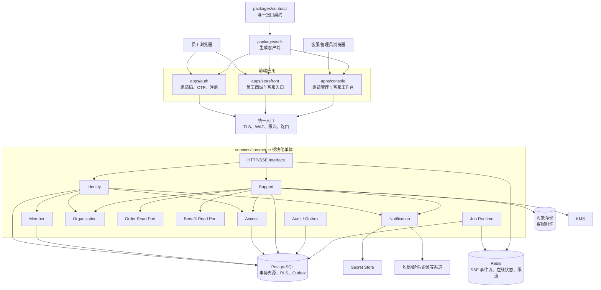

核心决策：

- 仍是模块化单体，不拆微服务。
- API 和 Jobs 可以独立扩容，但共享同一份领域模块代码。
- PostgreSQL 是唯一业务真源。
- Redis 只承载瞬时事件、在线状态和限流，不保存权威工单或邀请状态。
- 模块间只能调用 `public` port，不允许跨模块直接查询对方表。
- 前端只能调用生成 SDK，不手写第二套请求协议。
- 一切写操作只有一个正式 command path。

## 3.2 模块依赖

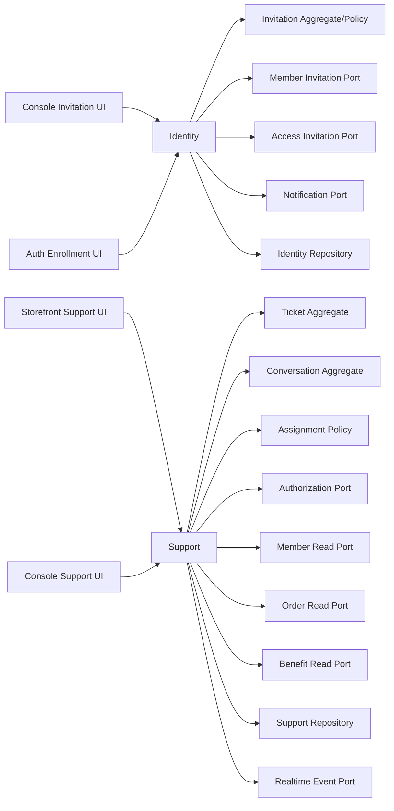

依赖规则：

| 模块 | 负责 | 不负责 |
|---|---|---|
| Identity | 邀请码、Claim、预认证、OTP、凭据、注册、会话 | 直接修改 Access 或 Member 表 |
| Member | 员工档案、待激活成员、成员状态 | 登录凭据、验证码、角色授权 |
| Access | 谁可以邀请、固定角色计划、scope、客服权限 | 生成邀请码、存员工资料 |
| Support | 工单、会话、消息、分配、客服配置、SLA、历史 | 直接实现订单或福利业务 |
| Notification | 发送渠道、模板、投递状态 | 决定谁有资格注册或回复 |
| Organization | 集团/商城组织层级和 scope | 认证和聊天 |
| Order/Benefit | 提供客服右侧上下文只读数据 | 反向依赖 Support |
| Runtime | HTTP、SSE、Job、事务、遥测 | 承载领域规则 |

# 四、功能一：通过邀请码邀请员工注册

## 4.1 业务语义必须分清

采用三个明确、互斥的邀请种类：

| 类型 | 用途 | 最大使用次数 | 目标 | 注册时创建成员 |
|---|---|---:|---|---|
| `enrollment` | 邀请一个指定员工注册 | 1 | `storefront` | 邀请发出时预创建待激活成员 |
| `campaign` | 一批员工共享注册码 | 可配置 | `storefront` | 每次成功注册时创建 |
| `signin` | 已存在成员用邀请码登录 | 1 | `storefront` 或受控 `console` | 不创建 |

默认入口只展示“邀请员工”，即 `enrollment`。

共享注册码放在次级入口，并显示明显风险提示。员工注册码永远不能赋予：

- 控制台管理员权限。
- 客服回复权限。
- 任意可由发起人选择的角色集合。
- 超出当前组织的 scope。
- 发起人自己没有的权限。

注册成功后只授予服务器配置的固定员工角色，例如 `employee`。客服人员或管理员权限必须走独立 Access 管理流程。

## 4.2 管理员端 UX

入口：控制台 → 员工 → 邀请员工。

流程：

1. 点击“邀请员工”。
2. 弹窗显示当前集团/商城 scope，scope 不允许静默切换。
3. 输入：
   - 员工姓名。
   - 手机号。
   - 员工编号，可选但组织内唯一。
   - 部门，可选。
   - 有效期，默认 72 小时，管理员可在策略允许范围内调整。
   - 邀请原因，必填，用于审计。
4. 系统显示注册后固定获得的“商城员工”身份，不提供角色多选器。
5. 提交前检查 AAL；不足则在原弹窗完成 step-up。
6. 提交成功显示一次性邀请码：
   - 分段展示，例如 `ABCD EFGH JKLM...`。
   - 一键复制。
   - 明确提示“关闭后无法再次查看”。
   - 显示有效期、手机号掩码、员工姓名、组织。
7. 列表中只能看到邀请码元数据和掩码，不能重新查看明文。
8. 可撤销未消费的邀请码；撤销需要高保证等级和原因。
9. 可以重新邀请，但其语义是“撤销旧邀请并创建新邀请”，不是重新显示旧邀请码。

保留 `zhudatuan-li` 邀请弹窗的层次、复制反馈和一次展示体验，但不保留旧的“零权限控制台管理员邀请码”语义。

## 4.3 员工端 UX

入口统一为 `/join`，邀请码不放在 URL query、path 或日志中。

步骤：

1. 输入邀请码。
2. 后端验证成功后设置短时、HttpOnly、SameSite 严格的预认证 Cookie。
3. 页面只展示最少必要信息：
   - 商城/企业名称。
   - 手机号掩码。
   - 邀请有效期。
   - 用户协议版本。
4. 向绑定手机号发送 OTP。
5. 输入验证码。
6. 设置密码并确认。
7. 勾选当前版本协议与隐私政策。
8. 完成注册。
9. 自动签发商城会话并进入商城首页。
10. 若发现手机号已对应其他身份，进入明确的身份关联处理，不自动覆盖、不重复创建。

所有敏感错误在 UI 上使用统一表达，例如“邀请码无效或已失效”，避免泄露某个邀请码是否存在、手机号是否注册。

## 4.4 邀请状态机

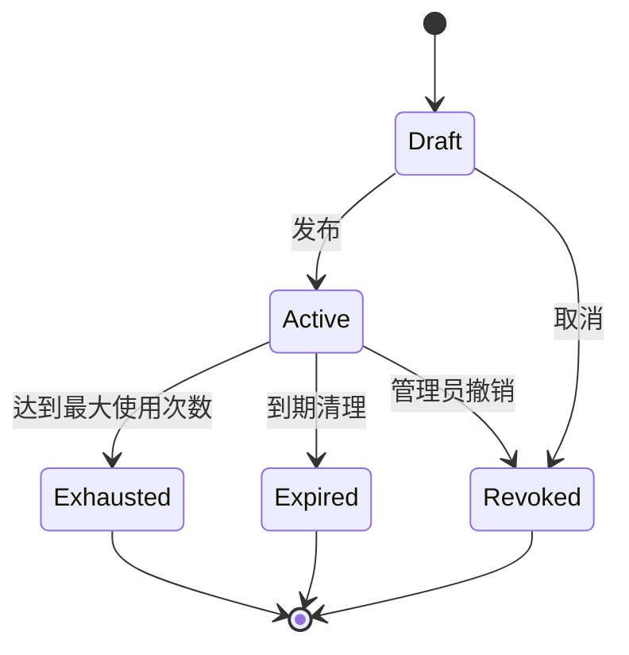

Claim 独立建模：

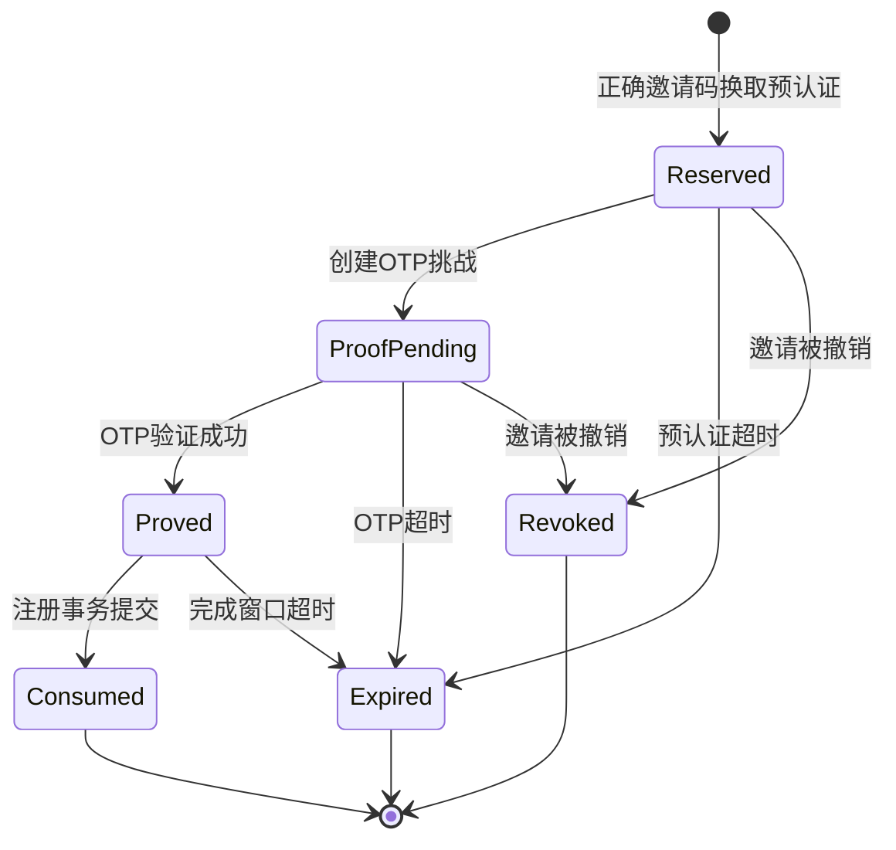

不允许状态回退，不允许重新激活同一个邀请码。

## 4.5 创建邀请的模块调用时序

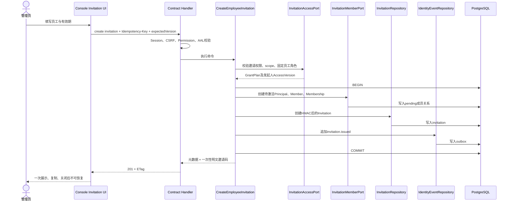

关键要求：

- `Principal + Member + Membership + Invitation + Outbox` 必须在同一数据库事务提交。
- 任何一步失败均不得残留半成品员工。
- 通过 Identity 调用 Member/Access 公共端口，禁止 Identity 直接操作它们的表。
- `expectedVersion` 同时保护组织授权版本和邀请人授权版本。
- 重试相同 `Idempotency-Key` 返回同一业务结果，但不能再次返回邀请码明文。若首次响应是否到达不确定，应返回“已创建但密钥不可恢复”，由管理员撤销并重新邀请，不能泄露旧值。

## 4.6 员工兑换与注册时序

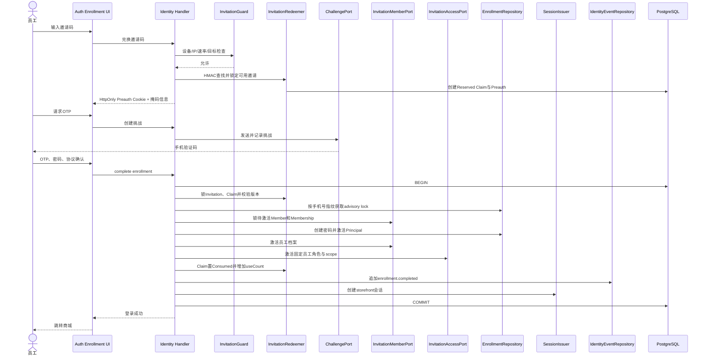

## 4.7 邀请领域内部数据流

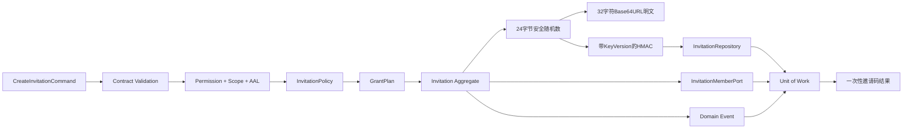

## 4.8 邀请数据模型

继续复用现有表，目标语义如下：

### `identity.invitation`

| 字段 | 说明 |
|---|---|
| `id` | UUID 业务 ID |
| `kind` | `signin/enrollment/campaign` |
| `target` | `storefront/console` |
| `organization_id` | 强制 scope |
| `membership_id` | 个人邀请对应待激活 Membership |
| `principal_id` | 待激活或已存在 Principal |
| `recipient_hash` | 规范化手机号的不可逆指纹 |
| `token_hash` | 邀请码 HMAC，不存明文 |
| `token_key_version` | HMAC 密钥版本 |
| `issuer_membership_id` | 发起人 |
| `issuer_access_version` | 发起时权限快照版本 |
| `grant_digest` | 固定授权计划摘要 |
| `minimum_assurance` | 兑换要求 |
| `max_uses/use_count` | 使用限制 |
| `status` | 状态机 |
| `expires_at` | 到期时间 |
| `policy_id/terms_hash` | 注册政策和协议版本 |
| `reason` | 审计理由 |
| `version` | 乐观锁版本 |
| `revoked_by/revoked_at` | 撤销信息 |

### `identity.invitationclaim`

保存预认证、Proof、过期时间和状态，不保存 OTP 明文。

### `identity.invitationreceipt`

成功消费后的不可变收据，记录 Invitation、Claim、Principal、Membership、时间、授权摘要和 trace。禁止 UPDATE/DELETE。

### `member.profile` / `member.membership`

个人邀请发出时创建为 `pending/invited`；成功注册时原子转换为 `active`。

### 邀请码安全

- 使用 24 字节 CSPRNG，Base64URL 后为 32 字符，约 192 位熵。
- 数据库只保存带版本的 HMAC。
- 日志、URL、追踪属性、分析事件、错误详情中禁止出现邀请码。
- 手机号数据库存密文、不可逆检索指纹和掩码三种用途分离的数据。
- OTP 与邀请码是两项独立证明。
- 预认证默认 5 分钟，OTP 默认 5 分钟，邀请默认 72 小时，全部通过类型化配置控制。
- 单邀请码、单手机号、单 IP、单设备分别限流。
- 撤销与注册完成竞争时，依靠固定锁顺序串行化；只有一个状态能提交。

# 五、功能二：控制台客服系统

## 5.1 最终 UI 结构

桌面端使用 `zhudatuan-li` 已验证的三栏工作台：

```text
┌─────────────────────────────────────────────────────────────────┐
│ 客服中心   当前Scope   我的队列/全部   搜索   筛选   设置         │
├───────────────┬───────────────────────────┬─────────────────────┤
│ 工单队列      │ 当前会话                  │ 用户与业务上下文    │
│               │                           │                     │
│ 未分配        │ 工单标题/状态/SLA         │ 员工资料            │
│ 我的工单      │ 消息历史                  │ 最近订单            │
│ 等待用户      │                           │ 福利权益             │
│ 已解决        │ 附件                      │ 分配记录             │
│               │                           │ 工单历史             │
│ 搜索/优先级   │ 回复输入框                │ 快捷动作             │
└───────────────┴───────────────────────────┴─────────────────────┘
```

推荐尺寸：

- 主侧栏沿用控制台 220px。
- 工单队列 304–336px。
- 上下文栏 336–384px。
- 会话区占剩余空间，最小 480px。
- 顶部 56px，scope bar 40px。
- 8px 网格。
- 主色 `#1F5EFF`，深色 `#143A8F`，正文 `#07182F`。
- 所有颜色、圆角、阴影、层级必须来自 `packages/design` token，不能在业务 CSS 中任意新增。

响应式：

- `>=1280px`：完整三栏。
- `1024–1279px`：右侧上下文变 Drawer。
- `768–1023px`：队列与会话两级页面，返回按钮明确。
- `<768px`：单列，会话输入框固定底部，触控区域至少 44px。
- 不通过缩小字体硬塞三栏。

## 5.2 工作台主要状态

工单队列支持服务器端过滤：

- scope。
- 未分配/分配给我/全部。
- 工单状态。
- 优先级。
- 客服技能。
- 是否未读。
- 用户手机号/姓名/员工编号。
- 工单号。
- 更新时间范围。
- 游标分页。

会话区：

- 加载最近一页消息。
- 向上滚动加载历史，不改变当前视口位置。
- 新消息仅在用户位于底部时自动滚动。
- 不在底部时显示“有新消息”浮动提示。
- 每条消息显示发送者、时间、投递状态、附件状态。
- 客服发送失败保留原草稿和附件。
- 同一次重试复用同一个 `clientMessageId` 和 `Idempotency-Key`，避免重复消息。
- 工单已关闭、无权限、scope 已切换时禁用输入框，并显示具体原因。
- 客服开始输入时不将草稿上传服务端。
- 切换工单时按工单保存内存草稿；退出页面前提示未发送内容。

右侧上下文：

- 用户基础资料。
- 当前组织和员工编号。
- 最近订单。
- 相关福利权益。
- 当前分配客服。
- SLA 截止时间。
- 工单状态操作。
- 历史事件。
- 所有数据通过 Support 的只读组合服务获取，Console 不能直接跨模块请求各业务表。

客服设置：

- 客服人员。
- 渠道账号。
- 分配规则。
- SLA。
- 历史记录查询。

可以使用页签或右侧设置路由，但与客服工作台共享同一 `feature/support`，禁止再次生成一套“客服管理”模块。

## 5.3 工单状态机

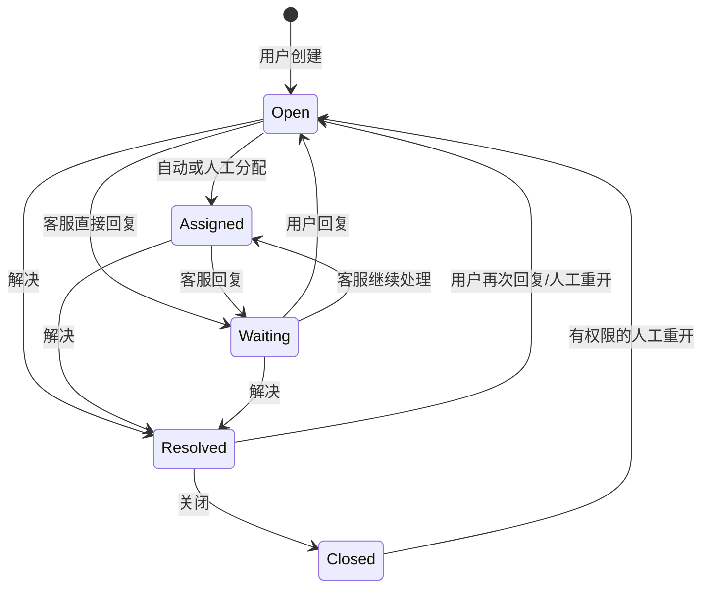

行为约束：

- 用户消息将状态变为 `open`。
- 客服消息将状态变为 `waiting`。
- `closed` 工单不能直接发送消息，必须先显式 reopen。
- `resolved` 收到用户消息可以重开。
- 状态变化、消息、分配、SLA 升级都追加 `support.history`。
- 每次状态变化增加 Ticket version。

## 5.4 用户发消息、客服实时收到

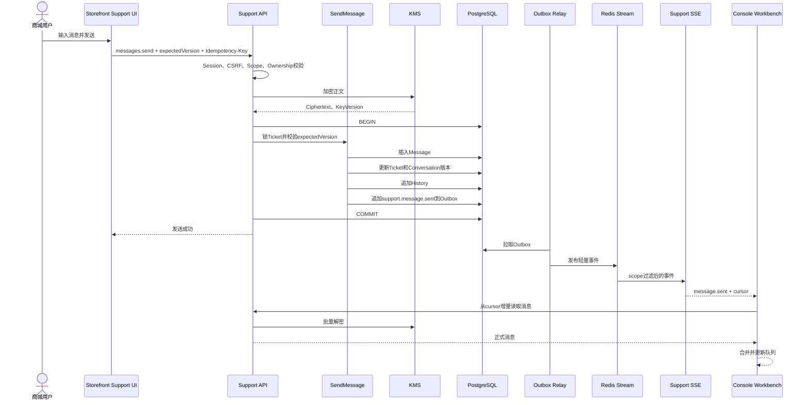

SSE 中只传：

- event id。
- scope id。
- conversation id。
- ticket id。
- message id。
- event type。
- occurredAt。
- 最新 version。

不在 Redis 或 SSE 中传消息明文、手机号、订单明细。

客户端断线恢复：

1. 浏览器带 `Last-Event-ID` 重连。
2. 服务端从保留窗口内继续投递。
3. 事件游标已超出保留窗口时，返回 `resync`。
4. 客户端调用正式增量查询重新对齐。
5. 这是同一协议的恢复机制，不是第二套业务链路。

## 5.5 客服回复时序

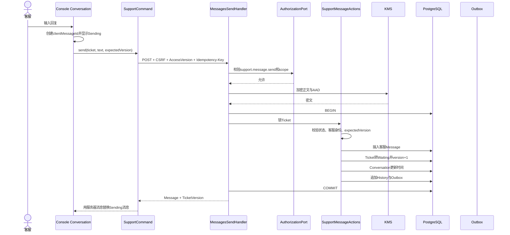

冲突处理：

- `expectedVersion` 不一致返回 `409 VERSION_CONFLICT`。
- UI 不自动覆盖服务器状态。
- 先刷新工单和消息。
- 若消息内容尚未提交，草稿继续保留。
- 工单已经关闭时提示“工单已关闭，请先重新打开”。
- 同一个 `clientMessageId` 只允许产生一条正式消息。

## 5.6 Support 内部数据流

```mermaid
flowchart LR
    Request["MessagesSendCommand"] --> Contract["Contract Validation"]
    Contract --> Session["Session / CSRF"]
    Session --> Authorization["Permission + Scope + Target"]
    Authorization --> Load["Lock Ticket Aggregate"]
    Load --> Version["ExpectedVersion"]
    Version --> Transition["Ticket Transition Policy"]
    Transition --> Encrypt["KMS Encryption"]
    Encrypt --> Message["Message Entity"]
    Message --> Persist["Message + Ticket + Conversation"]
    Persist --> History["Append History"]
    History --> Outbox["Append Outbox"]
    Outbox --> Commit["Commit"]
    Commit --> Response["Message DTO + Version"]
    Commit --> Relay["Event Relay"]
```

## 5.7 自动分配

分配规则使用 `AssignmentStrategy` 策略接口，默认正式策略：

1. 过滤 scope 不匹配的客服。
2. 过滤非 `active` 状态。
3. 过滤缺少指定技能的客服。
4. 过滤超过并发容量的客服。
5. 排除暂停接单和离线超过阈值的客服。
6. 按优先级、技能匹配度、当前活跃工单数、最后分配时间计算。
7. 得分相同时稳定按客服 ID 排序，保证确定性。
8. 在同一事务中通过活动分配唯一约束避免重复分配。
9. 没有可用客服时留在未分配队列并产生告警，不静默分配给错误 scope。

Redis 在线状态只是候选权重，不能决定权限；数据库中的人员状态和容量才是权威数据。

人工转派必须：

- 校验目标客服属于当前 scope。
- 校验目标客服具备技能和回复权限。
- 锁 Ticket 与当前 Assignment。
- 关闭旧 Assignment。
- 创建新 Assignment。
- 追加历史和 Outbox。
- 一次事务提交。

## 5.8 客服数据模型

| 表/聚合 | 主要职责 |
|---|---|
| `support.conversation` | 用户与客服的长期会话容器 |
| `support.ticket` | 当前服务事项、状态、优先级、SLA、版本 |
| `support.message` | 加密的用户/客服消息，追加式 |
| `support.history` | 工单所有业务事件，严格递增 sequence |
| `support.assignment` | 当前和历史分配 |
| `support.agent` | 客服人员、技能、容量、状态 |
| `support.account` | 渠道账号，只有 `secret_ref` |
| `support.assignmentrule` | scope 级自动分配规则 |
| `support.sla` | scope 与优先级对应的响应/解决时限 |
| `support.evidence` | 附件元数据、扫描状态、对象引用 |
| `support.escalation` | SLA 升级记录 |
| `support.readstate` | 新增：成员在会话中的最后已读位置 |

### Message 必要字段

- `id`
- `conversation_id`
- `ticket_id`
- `scope_id`
- `author_kind`
- `author_id`
- `content_ciphertext`
- `content_hash`
- `key_version`
- `client_message_id`
- `created_at`
- `sequence`
- `version`

唯一约束：

- `(conversation_id, client_message_id, author_id)`。
- 消息不可更新和删除。
- 展示顺序使用 `(created_at, id)` 或单会话递增 `sequence`，不能只依赖客户端时间。

### ReadState

- `(conversation_id, membership_id)` 唯一。
- `last_read_message_id`
- `last_read_sequence`
- `read_at`
- `version`

未读数应根据服务器 sequence 计算，不由浏览器本地猜测。

## 5.9 附件链路

1. 客户端向 Support 请求上传意图。
2. 后端检查 MIME 白名单、数量、大小和工单权限。
3. 创建 `pending` Evidence。
4. 返回短时签名上传地址。
5. 客户端直传对象存储。
6. Job 校验真实 magic bytes、大小、摘要并做恶意文件扫描。
7. 扫描通过后 Evidence 转 `clean`。
8. 消息只能引用 `clean` 附件。
9. 拒绝文件进入隔离区并按保留策略删除。
10. 下载必须再次校验 scope、工单访问权，并返回短时签名地址。

禁止：

- 仅信任文件扩展名。
- 把 Base64 大文件塞进聊天命令。
- 永久公开对象 URL。
- 让浏览器提交任意对象 key。
- 在日志中记录附件原始内容。

# 六、操作契约

优先保留现有 operation ID，硬切 schema，不并存旧版字段。

## 6.1 邀请契约

| Operation | 说明 |
|---|---|
| `identity.invitations.read` | 邀请列表和详情，不返回明文 |
| `identity.invitations.create` | 创建个人、共享或登录邀请 |
| `identity.invitations.revoke` | 撤销邀请 |
| `identity.invitations.resolve` | 邀请码换取预认证；不得只是无状态“查一下” |
| `identity.enrollments.read` | 读取预认证注册信息 |
| `identity.challenges.create` | 创建 OTP |
| `identity.enrollments.complete` | 原子完成注册 |
| `identity.sessions.create` | 已有身份登录；不重复承担注册兑换 |

`identity.invitations.create` 使用判别联合：

```ts
type CreateInvitationInput =
  | {
      kind: 'enrollment'
      target: 'storefront'
      organizationId: string
      employee: {
        displayName: string
        mobile: string
        employeeNo?: string
        departmentId?: string
      }
      expiresAt: string
      reason: string
      expectedVersion: number
    }
  | {
      kind: 'campaign'
      target: 'storefront'
      organizationId: string
      maxUses: number
      expiresAt: string
      reason: string
      expectedVersion: number
    }
  | {
      kind: 'signin'
      target: 'storefront' | 'console'
      membershipId: string
      expiresAt: string
      reason: string
      expectedVersion: number
    }
```

个人员工邀请不再接受 UI 提交的任意 `membershipId` 或角色列表；这些资源由后端一次性准备。

## 6.2 客服契约

继续使用现有能力：

- `support.cases.create`
- `support.cases.read`
- `support.cases.update`
- `support.cases.close`
- `support.cases.reopen`
- `support.messages.send`
- `support.messages.read`
- `support.attachments.create`
- `support.assignments.manage`
- `support.agents.manage`
- `support.agents.read`
- `support.accounts.manage`
- `support.accounts.read`
- `support.rules.manage`
- `support.rules.read`
- `support.slas.manage`
- `support.slas.read`
- `support.history.read`

新增两个必要 operation：

| Operation | 协议 |
|---|---|
| `support.events.read` | SSE，按 target、scope、membership 鉴权，支持 `Last-Event-ID` |
| `support.readstates.manage` | 更新最后已读 sequence，幂等且单调递增 |

队列读取扩展正式查询参数：

```ts
type SupportQueueQuery = {
  target: 'groupconsole' | 'mallconsole'
  scopeId: string
  ownership?: 'mine' | 'unassigned' | 'all'
  states?: SupportTicketState[]
  priorities?: SupportPriority[]
  agentId?: string
  skill?: string
  unread?: boolean
  keyword?: string
  updatedAfter?: string
  updatedBefore?: string
  cursor?: string
  limit: number
}
```

所有请求和响应 schema 只在 Contract 中定义一次，随后生成 SDK、Mock 类型和测试 fixture 类型；业务模块不得复制 DTO 类型。

# 七、逐模块内部数据流

| 模块 | 输入 | 内部顺序 | 输出 |
|---|---|---|---|
| Console Invitation | 表单 | 本地校验 → AAL → SDK command → receipt state | 一次性邀请码或结构化错误 |
| Auth Invitation | 邀请码/OTP/密码 | 兑换 → preauth → OTP → complete → session | 商城登录态 |
| Identity | command | handler → policy → aggregate → ports → repository → outbox | Invitation/Enrollment DTO |
| Member | Identity port call | 锁手机号指纹 → pending/activate invariant → repository | Member/Membership reference |
| Access | Identity/Support port call | membership → role → permission → scope → version | 授权计划或拒绝 |
| Console Support | 路由状态 | queue query → selection → message pages → commands → SSE reconcile | 客服工作台状态 |
| Storefront Support | 用户输入 | case query/create → optimistic message → command → reconcile | 用户会话 |
| Support | command/query | auth → aggregate/policy → encryption → persistence → history/outbox | ticket/message/config DTO |
| Notification | outbox event | template → provider registry → secret lookup → delivery → receipt | 投递状态 |
| Realtime | outbox | relay → Redis stream → scope filter → SSE | 轻量事件 |
| Jobs | schedule/outbox | lease → execute → checkpoint → metrics | SLA升级、清理、事件投递 |
| Audit | domain event | canonical payload → actor/scope/trace → append | 不可变审计记录 |

跨模块调用只能传领域所需的最小数据，不传数据库 row，也不能让上层知道下层表结构。

# 八、目标代码目录

以下是本次相关范围的目标完整结构。未列出的现有领域模块保持主线结构不变。

```text
zhudatuan/
├── apps/
│   ├── auth/
│   │   └── src/
│   │       └── feature/
│   │           └── invitation/
│   │               ├── application/
│   │               │   ├── CompleteEnrollment.ts
│   │               │   ├── CreateChallenge.ts
│   │               │   ├── ReadEnrollment.ts
│   │               │   └── ResolveInvitation.ts
│   │               ├── infrastructure/
│   │               │   ├── InvitationGateway.ts
│   │               │   └── InvitationMapper.ts
│   │               ├── model/
│   │               │   ├── Enrollment.ts
│   │               │   ├── Invitation.ts
│   │               │   └── RegistrationPolicy.ts
│   │               └── ui/
│   │                   ├── EnrollmentPage.tsx
│   │                   ├── InvitationError.tsx
│   │                   ├── InvitationProof.tsx
│   │                   ├── MobileProof.tsx
│   │                   ├── PasswordForm.tsx
│   │                   └── Enrollment.css
│   ├── console/
│   │   └── src/
│   │       └── feature/
│   │           ├── invitation/
│   │           │   ├── application/
│   │           │   │   ├── CreateInvitation.ts
│   │           │   │   ├── ReadInvitations.ts
│   │           │   │   └── RevokeInvitation.ts
│   │           │   ├── infrastructure/
│   │           │   │   ├── InvitationGateway.ts
│   │           │   │   └── InvitationMapper.ts
│   │           │   ├── model/
│   │           │   │   ├── Invitation.ts
│   │           │   │   └── InvitationDraft.ts
│   │           │   └── ui/
│   │           │       ├── EmployeeInvitationDialog.tsx
│   │           │       ├── CampaignInvitationDialog.tsx
│   │           │       ├── InvitationReceiptDialog.tsx
│   │           │       ├── InvitationRevokeDialog.tsx
│   │           │       ├── InvitationTable.tsx
│   │           │       ├── InvitationRoute.tsx
│   │           │       └── Invitation.css
│   │           └── support/
│   │               ├── application/
│   │               │   ├── AssignTicket.ts
│   │               │   ├── CloseTicket.ts
│   │               │   ├── ReadConversation.ts
│   │               │   ├── ReadQueue.ts
│   │               │   ├── ReadSupportContext.ts
│   │               │   ├── ReopenTicket.ts
│   │               │   ├── SendMessage.ts
│   │               │   └── UpdateReadState.ts
│   │               ├── infrastructure/
│   │               │   ├── SupportEventSource.ts
│   │               │   ├── SupportGateway.ts
│   │               │   └── SupportMapper.ts
│   │               ├── model/
│   │               │   ├── Agent.ts
│   │               │   ├── Conversation.ts
│   │               │   ├── Message.ts
│   │               │   ├── SupportContext.ts
│   │               │   ├── Ticket.ts
│   │               │   └── TicketFilter.ts
│   │               └── ui/
│   │                   ├── SupportRoute.tsx
│   │                   ├── SupportWorkbench.tsx
│   │                   ├── SupportQueue.tsx
│   │                   ├── SupportConversation.tsx
│   │                   ├── SupportComposer.tsx
│   │                   ├── SupportContextPanel.tsx
│   │                   ├── SupportHeader.tsx
│   │                   ├── SupportSettings.tsx
│   │                   ├── AgentSettings.tsx
│   │                   ├── AccountSettings.tsx
│   │                   ├── RuleSettings.tsx
│   │                   ├── SlaSettings.tsx
│   │                   ├── HistoryPanel.tsx
│   │                   ├── SupportLayout.css
│   │                   └── SupportConversation.css
│   └── storefront/
│       └── src/
│           └── feature/
│               └── support/
│                   ├── application/
│                   │   ├── CreateCase.ts
│                   │   ├── ReadCases.ts
│                   │   ├── ReadConversation.ts
│                   │   ├── SendMessage.ts
│                   │   └── UploadAttachment.ts
│                   ├── infrastructure/
│                   │   ├── SupportEventSource.ts
│                   │   ├── SupportGateway.ts
│                   │   └── SupportMapper.ts
│                   ├── model/
│                   │   ├── Attachment.ts
│                   │   ├── Message.ts
│                   │   └── SupportCase.ts
│                   └── ui/
│                       ├── ConversationPage.tsx
│                       ├── SupportPage.tsx
│                       ├── SupportComposer.tsx
│                       └── Support.css
├── services/
│   └── commerce/
│       └── src/
│           └── modules/
│               ├── identity/
│               │   ├── application/
│               │   │   ├── handler/
│               │   │   ├── port/
│               │   │   ├── process/
│               │   │   └── service/
│               │   │       ├── CreateInvitation.ts
│               │   │       ├── PrepareEmployeeInvitation.ts
│               │   │       ├── ResolveInvitation.ts
│               │   │       ├── InvitationRedeemer.ts
│               │   │       └── EnrollmentService.ts
│               │   ├── domain/
│               │   │   ├── model/
│               │   │   │   ├── Invitation.ts
│               │   │   │   ├── InvitationClaim.ts
│               │   │   │   ├── InvitationCode.ts
│               │   │   │   └── InvitationReceipt.ts
│               │   │   ├── policy/
│               │   │   │   ├── EnrollmentPolicy.ts
│               │   │   │   ├── InvitationPolicy.ts
│               │   │   │   └── InvitationRatePolicy.ts
│               │   │   └── value/
│               │   │       └── IdentitySubject.ts
│               │   ├── infrastructure/
│               │   │   ├── persistence/
│               │   │   └── security/
│               │   └── interface/
│               │       └── job/
│               ├── member/
│               │   └── public/
│               │       └── InvitationMemberPort.ts
│               ├── access/
│               │   └── public/
│               │       └── InvitationAccessPort.ts
│               └── support/
│                   ├── application/
│                   │   ├── handler/
│                   │   │   ├── EventsReadHandler.ts
│                   │   │   └── ReadStatesManageHandler.ts
│                   │   ├── port/
│                   │   │   ├── AttachmentScanPort.ts
│                   │   │   ├── RealtimePort.ts
│                   │   │   ├── SupportJobRepository.ts
│                   │   │   └── SupportRepositories.ts
│                   │   ├── process/
│                   │   │   ├── EvaluateSla.ts
│                   │   │   ├── RelaySupportEvents.ts
│                   │   │   └── RunSupportJob.ts
│                   │   └── service/
│                   │       ├── ManageAssignment.ts
│                   │       ├── ManageReadState.ts
│                   │       ├── ReadSupportContext.ts
│                   │       └── SendSupportMessage.ts
│                   ├── domain/
│                   │   ├── model/
│                   │   │   ├── AssignmentRule.ts
│                   │   │   ├── Conversation.ts
│                   │   │   ├── Message.ts
│                   │   │   ├── ReadState.ts
│                   │   │   ├── Sla.ts
│                   │   │   └── Ticket.ts
│                   │   └── policy/
│                   │       ├── AssignmentPolicy.ts
│                   │       ├── MessagePolicy.ts
│                   │       └── TicketPolicy.ts
│                   ├── infrastructure/
│                   │   ├── persistence/
│                   │   ├── security/
│                   │   └── stream/
│                   │       └── RedisSupportStream.ts
│                   └── interface/
│                       ├── http/
│                       ├── job/
│                       └── stream/
│                           └── SupportEventStream.ts
├── packages/
│   ├── contract/
│   │   └── definitions/
│   │       ├── operations.yml
│   │       └── schemas/
│   ├── design/
│   ├── sdk/
│   ├── authz/
│   ├── telemetry/
│   └── testing/
├── database/
│   └── migrations/
└── docs/
    ├── requirements/
    │   └── mvp.yml
    └── 福利商城功能清单.xlsx
```

命名要求：

- 业务源码目录和文件不使用 `_`、`-` 等连接符。
- React 组件 PascalCase。
- TypeScript 领域类和服务 PascalCase。
- 非组件模块按明确名词或动词命名。
- SQL migration、脚本、配置、测试允许遵循工具要求。
- 禁止 `Helper`、`Utils`、`CommonService`、`Misc`、`Temp` 等无领域意义名称。

# 九、复用、重构与淘汰清单

| 处理 | 内容 |
|---|---|
| 原样保留 | 主线模块化单体、Identity 注册事务、邀请码 HMAC、Claim/Receipt、Member/Access 公共端口、Support 表和领域模型、RLS、KMS、Outbox、Contract、SDK |
| 扩展 | `identity.invitations.create` 支持一次性准备个人员工；Support SSE、ReadState、严格 expectedVersion、服务端队列过滤 |
| 视觉移植 | `zhudatuan-li` 三栏客服布局、邀请结果弹窗、消息气泡、上下文面板、状态与响应式体验 |
| 重新实现 | Console 客服工作台的数据层必须改接主线 SDK，不能复制旧请求层 |
| 删除/替换 | 主线当前只读式通用 Support 页面实现，替换为工作台；不能与新页面并存 |
| 永不引入 | `zhudatuan-li` 的 `commerce-api` 兼容 BFF、旧数据库、旧权限 `identity.invitation.manage`、双写、代理接口、旧数据映射层 |
| 永不保留 | mock 业务路径、demo/showcase、无生产意义 fixture 入口、运行时兼容判断、旧新版开关 |
| 发布后清理 | 所有不再被 Manifest、Route、Contract、SDK 引用的旧文件和 CSS |

“保留 UI/UX”不等于保留旧 DOM 和 CSS 原文件；目标是保证视觉、信息架构、行为和可用性不退化，同时把组件接到主线设计 token、SDK 和权限模型上。

# 十、DDD、SOLID、LoD 与设计模式

## 10.1 聚合边界

- `Invitation` 是邀请生命周期聚合根。
- `InvitationClaim` 是独立并发实体，通过 Invitation ID 关联。
- `InvitationReceipt` 是不可变事实。
- `Ticket` 是客服状态和分配规则的聚合根。
- `Conversation` 管理消息序列和参与者。
- `Message` 是追加式实体，创建后不可变。
- `AssignmentRule` 和 `Sla` 是独立版本化配置聚合。

## 10.2 SOLID

- 单一职责：Handler 适配协议，Application Service 编排，Domain Policy 决策，Repository 持久化。
- 开闭原则：新通知渠道、新分配策略通过 Port/Registry 加入，不修改核心状态机。
- 里氏替换：所有 Provider adapter 遵守同一错误与超时语义。
- 接口隔离：Invitation、Authorization、Member Read、Order Read 使用不同小端口。
- 依赖倒置：领域和应用层依赖 port，不依赖 PostgreSQL、Redis、短信 SDK。

## 10.3 LoD

允许：

```text
Console → SDK → Handler → Application Service → Public Port → Adapter
```

禁止：

```text
Console → 手写fetch → 数据库字段
Support → MemberRepository
Identity → Access表
Notification → Invitation内部状态
```

## 10.4 使用的模式

| 模式 | 用途 |
|---|---|
| Repository | 聚合持久化 |
| Unit of Work | 跨模块单库原子事务 |
| Strategy | 分配策略、认证提供方、通知渠道 |
| Factory | Invitation、Message、Ticket 创建 |
| State Machine | 邀请、Claim、工单生命周期 |
| Transactional Outbox | DB 提交后可靠发布事件 |
| Idempotent Consumer | Job 和消息命令防重复 |
| Registry | 外部渠道和认证 Provider |
| Specification | 客服队列过滤条件 |
| Anti Corruption Layer | 短信、邮件、企微、对象存储适配 |
| Circuit Breaker/Bulkhead | 外部通知和对象服务隔离 |
| Optimistic Concurrency | 配置和工单版本 |
| Advisory Lock | 手机号身份去重 |

# 十一、一致性、并发和故障语义

## 11.1 强一致事务

必须单事务完成：

- 个人员工邀请资源准备。
- 员工注册激活。
- 消息写入、工单状态、会话更新时间、历史和 Outbox。
- 工单转派。
- 邀请撤销。
- 客服规则和 SLA 更新。

## 11.2 锁顺序

统一锁顺序，避免死锁：

```text
Organization/Scope
→ Invitation
→ InvitationClaim
→ Principal subject advisory lock
→ Member
→ Membership
→ Ticket
→ Assignment
```

一次 use case 只锁实际需要的子集，但相对顺序不可变化。

## 11.3 版本控制

- 所有可修改聚合都有 `version`。
- HTTP 使用 `ETag` 和 `If-Match`，或者生成 SDK 的 `expectedVersion`，两者映射到同一个契约字段。
- 数据库更新必须带 `WHERE id=? AND version=?`。
- 更新成功后 `version=version+1`。
- 影响 0 行统一映射为 `VERSION_CONFLICT`。
- 禁止最后写入者静默覆盖。

## 11.4 幂等

必须支持：

- 创建邀请。
- 完成注册。
- 发送客服消息。
- 创建工单。
- 转派。
- 关闭/重开。
- 更新已读位置。
- Job 消费 Outbox。

幂等键必须与 actor、operation、scope 绑定；不能让另一个用户复用键读取结果。

# 十二、安全设计

## 12.1 权限拆分

继续使用细粒度权限：

- `identity.invitation.read`
- `identity.invitation.issue`
- `identity.invitation.revoke`
- `support.case.read`
- `support.case.manage`
- `support.message.read`
- `support.message.send`
- `support.assignment.manage`
- `support.agent.read/manage`
- `support.account.read/manage`
- `support.rule.read/manage`
- `support.sla.read/manage`
- `support.history.read`

禁止恢复单一的 `identity.invitation.manage` 或 `support.manage` 超大权限。

## 12.2 高风险操作

以下需要 AAL3 或重新验证：

- 发控制台登录邀请。
- 发共享批量邀请码。
- 撤销邀请码。
- 管理客服账号密钥。
- 修改全局分配规则或 SLA。
- 导出聊天记录。
- 跨客服强制转派。

普通单员工商城邀请至少要求 AAL2。

## 12.3 消息安全

- 正文 KMS 信封加密。
- AAD 包含 scope、conversation、message ID。
- 前端按纯文本渲染；富文本必须使用严格白名单 AST，不接受任意 HTML。
- 禁止消息内容进入日志和 metrics label。
- 查询时批量、限并发解密。
- 客服记录导出需单独权限、脱敏和完整审计。
- PostgreSQL 对所有 scope 表启用并强制 RLS。
- Agent 不能仅凭 ticket ID 读取其他 scope。
- Storefront 用户只能读取自己的 conversation。

## 12.4 外部账号

`support.account` 只存：

- provider。
- display name。
- scope。
- secret reference。
- 状态。
- 版本。
- 最近验证结果。

API 密钥、Webhook secret、短信密钥不能落业务库。

# 十三、性能与可用性目标

这些是实施验收目标，不是对当前系统的既有承诺：

| 指标 | 目标 |
|---|---:|
| 创建个人邀请 p95 | < 300ms，不含外部通知 |
| 邀请码兑换 p95 | < 300ms |
| 注册完成 p95 | < 800ms |
| 客服发送消息 p95 | < 300ms，不含附件上传 |
| 会话首屏 p95 | < 500ms |
| SSE 事件到达 p95 | < 1s |
| 队列查询 p95 | < 500ms |
| API 可用性 | 99.95% |
| 数据库 RPO | 0，采用同步或同城半同步策略 |
| 服务 RTO | ≤15 分钟 |

数据库索引至少覆盖：

- `invitation(token_hash, status, expires_at)`。
- `invitation(organization_id, created_at desc, id desc)`。
- `claim(invitation_id, state, expires_at)`。
- `conversation(scope_id, updated_at desc, id desc)`。
- `ticket(scope_id, state, priority, updated_at desc, id desc)`。
- `message(conversation_id, sequence)`。
- `history(ticket_id, sequence)`。
- 活动 Assignment 唯一部分索引。
- `readstate(conversation_id, membership_id)` 唯一索引。

列表一律使用 keyset cursor，不使用深页 offset。

消息和历史达到容量阈值后按月分区；在规模未达到前不提前增加分区复杂度。归档策略只能移动已关闭且超过保留期的数据，不能删除仍受审计保留要求约束的数据。

# 十四、可观测性

每个请求贯穿：

- `traceId`
- `requestId`
- `operation`
- `actorMembership`
- `scope`
- `resourceId`
- `result`
- `errorCode`
- `duration`

禁止把手机号、邀请码、消息正文、OTP、密码、附件内容放入属性。

关键指标：

- 邀请签发、兑换、失效、撤销、冲突次数。
- OTP 发送和验证结果。
- 注册成功率及各阶段耗时。
- 待分配工单数。
- 首次响应时间。
- 解决时间。
- SLA 即将超时和已超时数。
- 客服活跃工单数。
- 消息发送失败和版本冲突。
- Outbox 延迟。
- SSE 在线连接、重连、事件积压。
- KMS、对象存储、通知 Provider 延迟和错误率。

关键告警：

- Outbox 最老未处理事件超过 60 秒。
- 未分配高优先级工单超过阈值。
- SLA 超时率异常。
- 邀请码暴力尝试。
- 单个 scope 消息失败率突增。
- KMS 解密错误。
- SSE 事件积压超过保留窗口。
- RLS 或权限拒绝率突增。

# 十五、测试与验收

## 15.1 邀请测试矩阵

必须覆盖：

- 单员工邀请正常注册。
- 邀请创建事务任一步失败无残留。
- 邀请码错误、过期、撤销、已消费。
- 邀请码并发双消费，只有一个成功。
- OTP 错误、过期、重放。
- 手机号已绑定其他 Principal。
- 相同手机号并发注册。
- 发起人权限在兑换前被撤销。
- scope 被禁用。
- 注册协议版本变化。
- 客服/管理员角色不能通过员工邀请码获得。
- 控制台邀请码不能在 Storefront 使用，反之亦然。
- 一次性邀请码关闭后无法重新读取。
- 日志和遥测不出现邀请码与手机号明文。
- Idempotency-Key 重试不产生第二个成员。
- AAL 不足时拒绝高风险邀请。
- 共享注册码达到 `maxUses` 后原子转为 exhausted。

## 15.2 客服测试矩阵

必须覆盖：

- 用户创建工单并发送消息。
- 客服工作台收到 SSE 并增量拉取。
- 客服回复后用户实时收到。
- 双击发送只产生一条消息。
- 网络超时重试不重复。
- 两名客服同时回复。
- 回复和关闭同时发生。
- 回复和转派同时发生。
- 已关闭工单不能回复。
- 用户回复 resolved 工单后重开。
- 用户不能读取其他用户会话。
- 集团客服不能读取不在 scope 的商城工单。
- 无 `support.message.send` 权限时输入框禁用，后端仍拒绝伪造请求。
- 规则无候选客服时进入未分配队列。
- 人工转派写完整历史。
- SLA 继承取最近有效 scope。
- 附件伪造 MIME、超限、恶意文件。
- 历史向上分页无重复、无丢失。
- SSE 断线、恢复、游标过期重新同步。
- KMS 暂时不可用时写入失败且不产生半条消息。
- Redis 不可用时业务写入仍可靠进入 Outbox，恢复后继续发布。
- 工单队列过滤跨页正确。
- 读状态只允许单调前进。

## 15.3 前端质量

- 组件单元测试。
- SDK 契约测试。
- Story/视觉快照。
- 1440、1280、1024、768、390 宽度截图。
- 键盘完整操作。
- 焦点顺序。
- 屏幕阅读器 label。
- 颜色对比度。
- reduced motion。
- 中文超长姓名、长工单标题、长消息、空状态、错误状态。
- 弱网和离线恢复。
- 无权限、scope 切换、会话过期。

## 15.4 发布门禁

只有全部满足才允许上线：

1. Excel MVP requirement 与 Contract operation 建立唯一映射。
2. Contract、SDK、后端 Handler 和前端调用一致。
3. 没有旧 BFF 和兼容 route。
4. 没有双写和运行时 feature flag。
5. 数据迁移在生产影子数据上验证。
6. RLS、权限、CSRF、AAL、限流安全测试通过。
7. 邀请并发和客服并发测试通过。
8. UI 视觉回归通过。
9. 性能目标通过。
10. 灾备恢复演练通过。
11. 代码搜索确认旧 operation ID、旧权限名和旧表名零引用。
12. `SOURCE-MANIFEST` 只指向主线正式路径。

# 十六、推荐实施顺序

虽然本次不改代码，后续实施应严格按以下顺序推进：

1. 锁定 Excel MVP 行与 requirement ID。
2. 冻结 `zhudatuan-li` 邀请弹窗、三栏客服工作台的视觉基线截图。
3. 在 Contract 中一次性确定最终邀请判别联合、客服 SSE、ReadState 和队列过滤。
4. 生成 SDK；不手写临时类型。
5. 扩展 Member/Access 公共端口，实现个人员工邀请原子准备。
6. 补强 `CreateInvitation`、`EnrollmentService` 的事务与并发测试。
7. 给 Support 消息写入补上数据库级 `expectedVersion`。
8. 增加 ReadState、SSE、Outbox relay 和必要索引。
9. 将 `zhudatuan-li` 客服工作台交互移植到主线 Console，并完全接入主线 SDK。
10. 重构主线 Auth 邀请注册页。
11. 增强 Storefront 客服会话实时更新和附件体验。
12. 接入客服人员、账号、规则、SLA、历史配置页面。
13. 完成安全、并发、性能、视觉、无障碍和旅程测试。
14. 硬切新契约。
15. 删除旧 Support 通用页面实现、旧邀请 UI、旧权限名及所有未引用文件。
16. 用代码搜索、依赖图和路由清单确认不存在第二条运行路径。

最终形态应当是：一个主仓库、一个服务运行时、一份数据库、一套契约、一套 SDK、一套 Design Token、一个邀请领域真源、一个客服领域真源；`zhudatuan-li` 只作为产品体验参考，不再承担任何运行责任。