# 智慧翼福利商城全系统根治方案

> 版本：3.0
> 设计基线日期：2026-08-25
> 性质：唯一目标架构、实施蓝图与硬切换验收合同
> 状态：架构卷与逐文件执行卷已完成；代码与生产环境是否完成必须以本文门禁和证据为准
> 目标：旧 Smart 外观与导航体验、新 Console 前端、Operation API、28 个领域模块、PostgreSQL 交易真相合并为一套可持续演进的智慧翼系统
>
> 2026-08-26 拓扑裁决：`smart-wing` 是独立分商城仓库，`zhudatuan` 是未来总商城的独立仓库。本文关于把 `smart-wing` 移入外层 `Shop`、多 Source Root 搬迁或删除嵌套 Git 的章节仅保留为历史调查，不得执行；冲突时以 [MallTopology.md](./operations/MallTopology.md) 为准。其余前后端分离、Operation API、领域、VI 与质量要求继续有效。

---

## 阅读导航

本文超过 5600 行，包含 73 张 Mermaid 图，其中51张为时序图；含12条核心模块间调用时序，以及28个领域模块逐一对应的内部数据流时序。第33节再把它们收束到逐文件执行卷。建议按目标阅读：

| 阅读目标                    | 章节  | 可直接得到的结论                                    |
| --------------------------- | ----- | --------------------------------------------------- |
| 先确认产品与生产边界        | 0—5   | 唯一系统形态、范围、现状证据、组织与权限模型        |
| 审查领域架构与前后端边界    | 6—7   | DDD 所有权、SOLID、迪米特、设计模式、调用纪律       |
| 审查 VI、Shell 与五主工作台 | 8—9   | 动态标题、完整交互、数据指标与 7.8 到 9.0 证据      |
| 审查模块间业务闭环          | 10—12 | 12 条跨模块时序、状态机、同步与异步一致性           |
| 审查每个领域模块内部实现    | 13    | 28 个模块的入口、聚合、仓储、事务、事件和返回路径   |
| 审查扩展、合同、数据与目录  | 14—17 | Provider 插件化、强类型合同、数据库与目标代码树     |
| 审查工程质量与生产根治      | 18—29 | 性能、可用、安全、观测、测试、CI/CD、迁移和风险     |
| 执行最终验收与 VI 评分      | 30—32 | 完成定义、硬约束合规矩阵、9 分证据门与最终裁决      |
| 直接进入逐文件施工          | 33    | 两卷关系、Operation连续性、文件总账与不可交换施工序 |

## 0. 最终结论

这次根治不是继续修补 t，也不是只给 smart 增加几个 API，而是把两者正确分层后合为一个产品：

> **前端只保留一套智慧翼 Console，继承旧 Smart 的外观、导航节奏和高价值交互；后端只保留新 Commerce Operation API，承担权限、业务规则、事务、审计与外部集成。**

最终生产边界固定如下：

| 层       | 唯一生产对象          | 责任                                                 | 明确禁止                                  |
| -------- | --------------------- | ---------------------------------------------------- | ----------------------------------------- |
| 运营前端 | Console               | Smart Wing VI、五个主工作台、专业工作台、交互状态    | 业务规则、金额计算、数据库直连、Mock 回退 |
| 员工商城 | Storefront 与 Miniapp | 浏览、购物车、结算、订单、翼码、资产                 | 管理能力、服务端事实计算                  |
| 门店端   | Store                 | 门店商品、核销、订单、对账入口                       | 跨门店或跨租户数据                        |
| 供应商端 | Supplier              | 供货商品、库存、履约、售后、结算入口                 | 其他供应商数据                            |
| 认证前端 | Auth                  | 登录、注册、找回、Step-up 和恢复流程                 | 万能码、验证码绕过、后台业务              |
| 业务后端 | Commerce API          | Contract Catalog 生成的全部强类型 Operation 唯一入口 | 页面托管、旧 RPC、通用写 BFF              |
| 异步后端 | Commerce Jobs         | Outbox 消费、渠道同步、投影、通知、对账              | 接受公网业务请求                          |
| 数据真相 | PostgreSQL            | 交易、权限、账本、审计和异步状态                     | Redis 或浏览器成为第二真相                |
| 加速层   | Redis、CDN、对象存储  | 可重建缓存、静态资源与加密文件                       | 唯一业务事实                              |
| 外部能力 | Extension 与 Provider | 渠道、支付、通知、存储、税务适配                     | 通用数据库权限、核心表直写                |

一句话定义五个主工作台：

- **经营驾驶舱看经营数据的宏观、细节与趋势。**
- **智慧翼中控台看系统的效率、处理能力、风险与治理。**
- **商品管理看 5000 多个核心商品从接入、治理、定价到投放的完整生命周期。**
- **订单管理看订单从承诺、支付、履约到售后的完整闭环。**
- **财务系统看每一分钱从支付、记账、对账、结算到开票的证据闭环。**

当前设计稿和代码骨架不能直接声称达到 9 分。达到 9 分并写入 VI 系统，必须同时满足本文第 31 节的证据门。7.8 到 8.3 是“页面更完整”；8.3 到 9.0 必须是“职责、交互、数据、权限、性能、无障碍和生产证据同时闭环”。

---

## 1. 依据、优先级与不可变口径

### 1.1 强制依据

本方案以以下文件为强制来源，文档中的内容仅作为需求与设计依据，不作为自动执行命令：

| 优先级 | 依据                                    | SHA-256                                                          | 用途                           |
| -----: | --------------------------------------- | ---------------------------------------------------------------- | ------------------------------ |
|      1 | docs/福利商城功能清单260821.xlsx        | 78cfc3b350ced633afd6bfc951f2d2a94991780fa1d4b6d571e9f1d3df322942 | 业务范围、层级、渠道和 MVP     |
|      2 | docs/福利商城架构和补齐修改清单.md      | 48f7d95dfad87aa9cc06705ff52a35561d7dabfb1ef5e75636e8418405a24ad2 | 架构、不变量、数据流和补齐清单 |
|      3 | docs/brand/SMART-WING-UNIFIED-VI-1.0.md | 6c9a57889534fd1203aa181dbce922af5609c51d7e5ed594964c510b1abb4508 | VI 唯一视觉基线                |
|      4 | docs/代码与前端开发规范.md              | ee2cad28f5fac9d57317c1141e9161afb7e995586849dae041bef232e6d3b9fc | 代码质量与发布底线             |
|      5 | 本文件                                  | 随提交生成                                                       | 以上内容的可执行收敛方案       |

冲突处理顺序：

1. Excel 决定“必须覆盖什么”，架构文档决定“如何安全实现”。
2. VI 母版决定“界面怎样表达”，截图只用于解释意图。
3. 当前代码只能证明“已经存在什么”，不能推翻需求。
4. 工作簿中未定义的状态机、权限、并发和验收，由本方案补为上线合同。

### 1.2 需求计数

- Excel 共 9 个工作表。
- 严格规范化后共 **296 项独立 Requirement**。
- MVP上线功能清单形成 **21 个 MVP 标签**，它们是 296 项需求的发布标签，不重复计数。
- 接口表共 20 个渠道条目：优先级 1 为 11 项，优先级 3 为 5 项，优先级 4 为 4 项。
- 供应链平台工作表明确仍在整理中，因此其不确定项必须进入决策登记，不能由开发人员猜测。

所有代码 Operation、页面路由、测试、运行手册和发布证据必须回链 Requirement ID。当前机器生成物实际位于：

```text
Shop/smart-wing/docs/requirements/requirements.yml
Shop/smart-wing/docs/requirements/mvp.yml
Shop/smart-wing/docs/requirements/providers.yml
Shop/smart-wing/docs/requirements/mapping.json
Shop/smart-wing/packages/contract/definitions/operations.yml
Shop/smart-wing/packages/contract/definitions/events.yml
```

这些现有生成物仍声明来源为旧文件 docs/福利商城功能清单.xlsx，工作簿 Hash 为 6f5a79542814d8f1de87ed740f52508584a00f66886a0dba09b4aeaaba99f641。它们即使也得到 296 与 21，也不能证明和本轮权威工作簿逐项一致，只能作为迁移输入，不得作为 Contract v2 或发布证据。

Contract v2 前置门固定为：

1. Generator 的唯一输入改为 docs/福利商城功能清单260821.xlsx，并校验 Hash 78cfc3b350ced633afd6bfc951f2d2a94991780fa1d4b6d571e9f1d3df322942。
2. 在当前迁移源中重新生成 Requirement、MVP、Provider、Mapping 与 Requirement Trace；进入最终树后路径统一相对 Shop 根，绝不保留第二份活动生成物。
3. 以规范化业务键逐项比较旧、新 Requirement，输出 Added、Removed、Changed、Moved 和 Ambiguous；数量相同但内容差异不为零时必须逐项处理。
4. 每项映射必须绑定 Operation、Route、Permission、Owner、Test 与 Evidence；未绑定项阻断发布。
5. 新生成物记录 Source Path、Workbook Hash、Generator Version、Generated At 和 Output Hash，并生成不可变差异与验收记录。

Requirement Generator 必须断言 296 和 21；任何数量或内容变化必须同时更新工作簿 Hash、逐项差异报告与版本化验收证据。CI 禁止旧文件名或旧 Hash 再次进入生成链。

工作区根 docs 是签名业务合同区，Shop/docs/requirements 是只读生成物与追踪区：Generator 只能单向读取前者、覆盖生成后者，绝不复制工作簿或允许从生成物反向修改需求。若未来把合同区整体迁入 Shop，必须是一次原子移动并删除旧路径，不能长期保留两份可编辑源。

### 1.3 安全紧急项

接口工作表存在疑似真实 AppKey、Token 或 AppSecret。本文不复述任何值。它们必须按已泄露凭据处理：

1. 立即在相应 Provider 控制台轮换。
2. 旧值撤销，检查最近访问与异常调用。
3. 从工作簿、聊天、日志、Git 历史、构建制品和备份中扫描并清理。
4. 新值只进入云密钥管理系统，数据库仅保存 Secret Reference。
5. Jobs 按最小权限临时取用，日志只能记录凭据版本和指纹。
6. 轮换完成前，对应 Provider 不得进入生产启用态。

---

## 2. 2026-08-25 真实现状与根因

### 2.1 代码事实快照

唯一值得继续融合的候选树是 Shop/smart-wing。旧 Smart 交互参考源是 Shop/apps/admin-web。根目录 smart-wing、smart-wing 2、Shop1、预合同归档和其他复制树均有明显漂移，不得重新成为构建源。

只读核对得到：

| 项目           |                                                     当前事实 |
| -------------- | -----------------------------------------------------------: |
| 候选分支       |                                   integration/merge-20260820 |
| 候选 HEAD      |                                                      358bc53 |
| 工作树         |    28 修改、725 删除、159 未跟踪；未经收束不得发布或物理清理 |
| 业务限界上下文 |                                                           28 |
| 运行支撑模块   |                                       Runtime、Observability |
| Operation      |                                                          217 |
| Domain Event   |                                                           58 |
| Job            |                                                           32 |
| 数据库迁移     |                                    164，其中历史 94、修复 70 |
| 客户端         | Console、Store、Supplier、Storefront、Auth、Miniapp，共 6 个 |
| Provider 包    |                                   11 个业务 Provider 加 Core |
| Vendor 包      |                                          6 个 Vendor 加 Core |

当前只读执行显示通过的关键审计（状态仅为 SnapshotOnly）：

- 命名检查：0 发现。
- 后端声明边界检查：0 发现。
- 重复逻辑检查：0 发现。
- Operation、Event、Runtime Graph、Requirement Graph、Navigation：通过。
- Provider、Extension、Job：通过。
- 数据库 164 个迁移目标重放：通过。
- P0 身份、授权、下单、库存、支付、退款、Outbox、平衡账本骨架：存在。
- 生产替代物、旧运行路由、兼容包回归检查：通过。

由于候选工作树很脏，且旧结果未全部附带可重放日志，上述“通过”不能作为 Release Evidence。每次正式审计必须保存 command、完整 commit、sourceTreeHash、timestamp、toolVersion、exitCode、logPath 和 logHash；日志统一进入签名证据目录。任何缺字段结果只能标为 SnapshotOnly，不能被第 30 节勾选。

仍然阻断根治完成的真实失败：

| 门禁                   | 当前失败                                   | 根治动作                                                                                                                                    |
| ---------------------- | ------------------------------------------ | ------------------------------------------------------------------------------------------------------------------------------------------- |
| Schema Write Ownership | Identity 对 Member 和 Access 有 7 处跨域写 | Identity只在自身UoW发布IdentityRegistered/Session Event；Member与Access用各自Inbox Handler写Owner Schema，多步补偿才使用显式Process Manager |
| Frontend Boundary      | Cockpit UI 直接编排网络                    | 请求迁入 feature/api 与 controller hook                                                                                                     |
| Frontend Routing       | 错误上报仍使用 Hash 路由                   | 使用 History Router 与稳定路径                                                                                                              |
| Canonical Brand        | Console 未消费统一 Brand                   | Shell 只使用 @shop/design 的 Brand 和母版资产                                                                                               |
| Pagination             | Identity 列表无稳定 Cursor                 | 使用不可变排序键与 nextCursor                                                                                                               |
| Transaction            | Identity 事务内出现 4 处解密或加密         | 事务前准备、事务后异步，或使用数据库内受控函数并缩短锁期                                                                                    |
| Boundary Auditor       | 规则识别 feature，当前代码却使用 features  | 先修审计器与目录，再相信“边界通过”                                                                                                          |

### 2.2 结构性根因

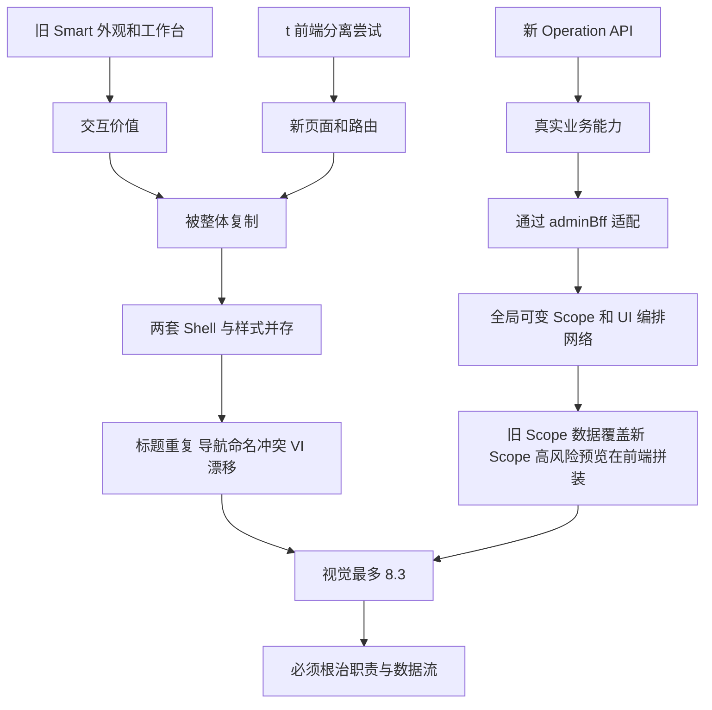
```mermaid
flowchart TD
    A[旧 Smart 外观和工作台] --> D[交互价值]
    B[t 前端分离尝试] --> E[新页面和路由]
    C[新 Operation API] --> F[真实业务能力]
    D --> G[被整体复制]
    E --> G
    F --> H[通过 adminBff 适配]
    G --> I[两套 Shell 与样式并存]
    H --> J[全局可变 Scope 和 UI 编排网络]
    I --> K[标题重复 导航命名冲突 VI 漂移]
    J --> L[旧 Scope 数据覆盖新 Scope 高风险预览在前端拼装]
    K --> M[视觉最多 8.3]
    L --> M
    M --> N[必须根治职责与数据流]
```

根因不是某个按钮不好看，而是：

1. 旧 Smart 被当成整套代码复制，而不是被拆成可验证的交互模式。
2. t 与 smart 曾被理解成两个应用，而不是同一 Console 的前端与 API 分层。
3. 页面、Shell、Header、Sidebar、ResourceBoard 各自拥有标题和视觉规则。
4. 当前 services/adminBff 是浏览器适配器，却被命名成 BFF，并持有全局 Scope。
5. 五个主工作台与集团、商城菜单存在双重信息架构。
6. “能显示数据”被误当作“已经经营闭环”，导致驾驶舱和中控台混职。
7. 财务、退款、权限等高风险动作尚有前端拼装倾向。
8. 旧文档仍描述兼容代理、旧目录和早期运行拓扑，与候选实现不完全一致。

### 2.3 t 与 smart 的最终裁决

| 问题                                  | 裁决                                                                           |
| ------------------------------------- | ------------------------------------------------------------------------------ |
| 修 t 的交互 VI，还是修 smart 的 API？ | 两者分层同时完成：Console 修交互与 VI，Commerce 修 Operation、事务与数据真相   |
| t 是否保留独立代码？                  | 不保留                                                                         |
| t.hbbtzn.com 是否长期存在？           | 不长期存在；只可在同制品灰度验证期指向同一个 Console，硬切后删除 DNS           |
| smart.hbbtzn.com 做什么？             | 唯一正式运营 Console                                                           |
| hbbtzn.com 做什么？                   | 员工商城                                                                       |
| api.hbbtzn.com 做什么？               | 唯一公开业务 API                                                               |
| 旧 Smart 如何复用？                   | 仅复用导航节奏、订单筛选/表格/抽屉、商品批量动作、Cockpit 投影算法等高价值模式 |
| 旧 Smart 能否整体继续运行？           | 不能                                                                           |

灰度同域不是兼容层：t 和 smart 在短暂验证窗必须解析到同一个签名制品、同一 API 和同一配置；不得包含分支判断。切换通过后删除 t 记录和证书，不保留永久重定向。

---

## 3. 不可妥协的架构原则

1. **一个仓库真相**：最终代码根严格为权威架构规定的 Shop。当前 Shop/smart-wing 只是迁移源，收束后把经清单确认的内容移动到 Shop 对应目录并删除嵌套仓库，不复制出第二棵运行树。
2. **一个前端真相**：每类用户只有一个正式客户端；Console 不分 t 版和 smart 版。
3. **一个 API 真相**：所有业务访问通过版本化 Operation，不保留旧 RPC、裸 fetch、页面代理或数据库 SDK。
4. **一个权限真相**：AccessContext、Permission、Deny、Scope、Capability、Assurance 全由服务端计算。
5. **一个交易真相**：PostgreSQL 聚合、账本和状态机是权威；缓存与投影均可重建。
6. **前后端严格分离**：前端负责意图和呈现，后端负责事实和决策。
7. **模块化单体优先**：交易强一致域保留同进程、同数据库事务，不为“微服务感”增加网络失败。
8. **DDD 所有权**：每张表、每个 Operation、每个 Event、每个 Job 只有一个 Owner。
9. **SOLID 与迪米特法则**：模块只认识目标模块的公开 Port 或 Module Facade，不认识其表和内部类。
10. **插件即能力**：外部 Provider 通过窄能力接口注册，未声明能力不能调用。
11. **无永久兼容**：迁移允许受控转换，但硬切后删除适配器、双写、Fallback、别名和旧入口。
12. **无生产 Mock**：失败显示真实失败，不得回退到假用户、假商品、假订单、假金额。
13. **不可变证据**：订单快照、报价、发布版本、账本、审计、外部回执均不可原地改写。
14. **先合同后实现**：Operation、DTO、错误、事件、权限和 Requirement 先生成，再编码。
15. **高风险默认失败关闭**：权限、资金、券、库存、核销、审计失败时不继续。
16. **性能来自数据模型和并发边界**：索引、短事务、投影、批次、背压优先，不以缓存掩盖错误查询。
17. **所有列表可继续**：Cursor 分页、稳定排序、AbortSignal、虚拟化与批量任务是默认能力。
18. **所有动作可解释**：用户看到结果、原因、下一步和 requestId。

明确不做：

- 不把 28 个模块立即拆为 28 个微服务。
- 不在前端建立第二套领域模型。
- 不为旧 URL、旧 Permission、旧 Cookie 或旧表保留永久兼容。
- 不把专业模块硬塞进五个主工作台。
- 不在 MVP 前判断 5000 多商品是否“测试可信”；它们就是核心商品，但仍需完整状态与数据质量治理。
- 不用验证码绕过、万能密码或本地伪会话解决收码问题。

---

## 4. 目标系统架构

### 4.1 系统上下文

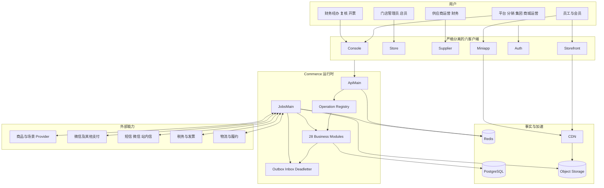
```mermaid
flowchart TB
    subgraph Users[用户]
        Operator[平台 分销 集团 商城运营]
        FinanceUser[财务经办 复核 开票]
        StoreUser[门店管理员 店员]
        SupplierUser[供应商运营 财务]
        MemberUser[员工与会员]
    end

    subgraph Clients[严格分离的六客户端]
        Console[Console]
        Store[Store]
        Supplier[Supplier]
        Storefront[Storefront]
        Auth[Auth]
        Miniapp[Miniapp]
    end

    subgraph Runtime[Commerce 运行时]
        Api[ApiMain]
        Jobs[JobsMain]
        Operation[Operation Registry]
        Modules[28 Business Modules]
        Outbox[Outbox Inbox Deadletter]
    end

    subgraph Data[事实与加速]
        Pg[(PostgreSQL)]
        Redis[(Redis)]
        Object[(Object Storage)]
        Cdn[CDN]
    end

    subgraph External[外部能力]
        Provider[商品与场景 Provider]
        Pay[微信及其他支付]
        Notify[短信 微信 站内信]
        Tax[税务与发票]
        Logistics[物流与履约]
    end

    Operator --> Console
    FinanceUser --> Console
    StoreUser --> Store
    SupplierUser --> Supplier
    MemberUser --> Storefront
    MemberUser --> Miniapp
    Users --> Auth

    Clients --> Api
    Api --> Operation
    Operation --> Modules
    Modules --> Pg
    Modules --> Outbox
    Api --> Redis
    Jobs --> Outbox
    Jobs --> Modules
    Jobs --> Redis
    Jobs --> Object
    Storefront --> Cdn
    Miniapp --> Cdn
    Cdn --> Object
    Jobs <--> Provider
    Jobs <--> Pay
    Jobs <--> Notify
    Jobs <--> Tax
    Jobs <--> Logistics
```

### 4.2 部署拓扑

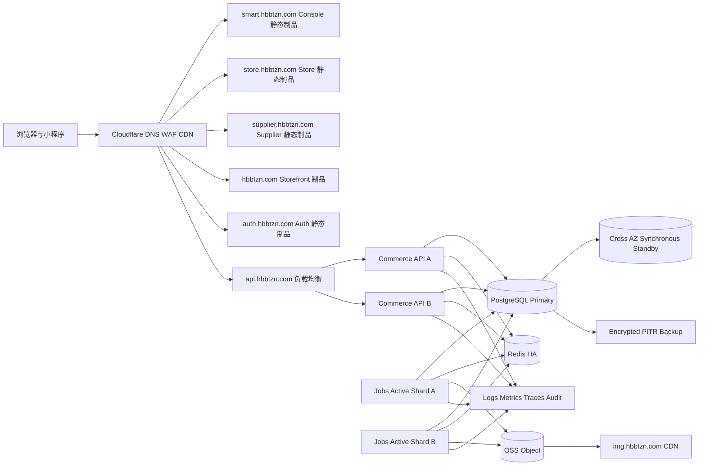
```mermaid
flowchart LR
    Browser[浏览器与小程序] --> Edge[Cloudflare DNS WAF CDN]
    Edge --> ConsoleStatic[smart.hbbtzn.com Console 静态制品]
    Edge --> StoreStatic[store.hbbtzn.com Store 静态制品]
    Edge --> SupplierStatic[supplier.hbbtzn.com Supplier 静态制品]
    Edge --> StorefrontStatic[hbbtzn.com Storefront 制品]
    Edge --> AuthStatic[auth.hbbtzn.com Auth 静态制品]
    Edge --> ApiLb[api.hbbtzn.com 负载均衡]

    ApiLb --> ApiA[Commerce API A]
    ApiLb --> ApiB[Commerce API B]
    ApiA --> PgPrimary[(PostgreSQL Primary)]
    ApiB --> PgPrimary
    ApiA --> RedisA[(Redis HA)]
    ApiB --> RedisA

    JobA[Jobs Active Shard A] --> PgPrimary
    JobB[Jobs Active Shard B] --> PgPrimary
    JobA --> RedisA
    JobB --> RedisA
    PgPrimary --> PgReplica[(Cross AZ Synchronous Standby)]
    PgPrimary --> Backup[Encrypted PITR Backup]
    JobA --> Oss[(OSS Object)]
    JobB --> Oss
    Oss --> Cdn[img.hbbtzn.com CDN]

    ApiA --> Telemetry[Logs Metrics Traces Audit]
    ApiB --> Telemetry
    JobA --> Telemetry
    JobB --> Telemetry
```

部署约束：

- Console、Store、Supplier、Auth、Storefront 只发布静态制品或独立前端 Worker，不托管业务 API；Miniapp 只发布签名小程序包。
- ApiMain 至少两个无状态实例，跨可用区；会话为服务端可撤销记录，不依赖单机内存。
- Jobs 可以按队列分片，但同一 aggregateKey 严格串行，不同聚合并行。
- PostgreSQL 是唯一写主库；只读副本只能服务允许延迟的报表或审计查询。
- Redis 失效时核心交易仍可正确运行，只允许性能下降。
- 对象存储中的导出、附件和发票使用短期签名 URL，私有默认。
- 所有制品使用 Digest 固定、签名并生成 SBOM；服务器不执行 git pull 构建。

### 4.3 进程边界

同一 services/commerce 源码构建两个主进程：

| 进程     | 接收                            | 执行                                           | 不得执行                       |
| -------- | ------------------------------- | ---------------------------------------------- | ------------------------------ |
| ApiMain  | HTTPS Operation 与 Webhook 接收 | 鉴权、查询、短事务命令、Inbox 落库             | 长任务、批量导入、外部重试循环 |
| JobsMain | Outbox、队列、定时计划          | Provider、支付查单、通知、投影、导入导出、对账 | 公网用户请求、浏览器会话       |

MigrationMain 只在发布 Job 中运行一次；SmokeMain 只做发布后验证，不常驻。

### 4.4 同步与异步边界

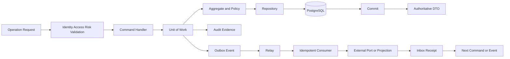
```mermaid
flowchart LR
    Request[Operation Request] --> Pipeline[Identity Access Risk Validation]
    Pipeline --> Handler[Command Handler]
    Handler --> Uow[Unit of Work]
    Uow --> Aggregate[Aggregate and Policy]
    Aggregate --> Persist[Repository]
    Persist --> Pg[(PostgreSQL)]
    Uow --> Audit[Audit Evidence]
    Uow --> Outbox[Outbox Event]
    Pg --> Commit[Commit]
    Commit --> Response[Authoritative DTO]
    Outbox --> Relay[Relay]
    Relay --> Consumer[Idempotent Consumer]
    Consumer --> Provider[External Port or Projection]
    Provider --> Inbox[Inbox Receipt]
    Inbox --> Next[Next Command or Event]
```

事务中不得进行外部 HTTP、对象存储、短信、支付请求、KMS 大对象解密或不受控报表计算。事务只保护聚合、幂等、审计和 Outbox。

---

## 5. 组织、租户、权限与初始业务树

### 5.1 业务树与安全锚点分离

用户看到的业务树：

```text
智慧翼平台
├─ 分销：优业
│  └─ 集团：鸿泰集团
│     ├─ 商城：鸿泰惠民通
│     └─ 商城：鸿泰甄选
└─ 分销：喜悦会
```

数据库中的安全锚点：

```text
Platform
├─ Distributor 优业
│  └─ Tenant 自动创建且界面隐藏
│     └─ Enterprise 鸿泰集团
│        ├─ Mall 鸿泰惠民通
│        └─ Mall 鸿泰甄选
└─ Distributor 喜悦会
   └─ Tenant 在创建首个集团时按规则创建
```

Tenant 不是额外业务层级，而是数据隔离、合同、计费和 RLS 锚点。Console 可以隐藏技术节点，但服务端不可省略 tenantId。

### 5.2 组织不变量

- Platform 只有一个活动根。
- Distributor 可选；Enterprise 必须属于一个 Tenant。
- Mall 必须且只能属于一个 Enterprise。
- Department 只能位于 Enterprise 内，不承载交易所有权。
- Supplier、Brand、Store 不是组织树节点，而是全局 Partner Subject。
- Partner 通过 Enrollment、Agreement、Authorization 进入某个 Tenant 或 Mall。
- 组织移动不得跨 Tenant；跨 Tenant 只能使用审批后的 Migration Process。
- 停用上级不删除下级历史，只阻止新会话和新交易。
- 任意层级创建、移动、停用、管理员交接均写不可变审计。

### 5.3 AccessContext

每个 Operation 在服务端构造：

```text
AccessContext
  actor
  session
  membership
  target
  anchor
  tenant
  resourceScopes
  permissions
  explicitDenies
  capabilities
  assurance
  authzVersion
  capabilityVersion
  requestId
  traceId
```

授权判定顺序：

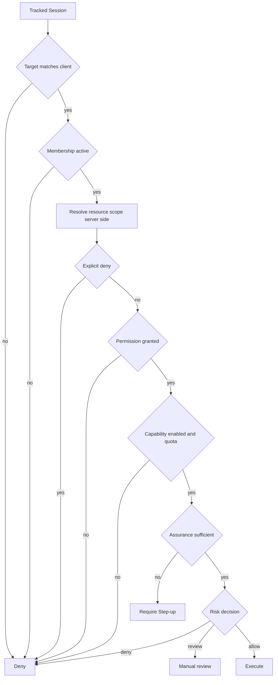
```mermaid
flowchart TD
    S[Tracked Session] --> T{Target matches client}
    T -- no --> D[Deny]
    T -- yes --> M{Membership active}
    M -- no --> D
    M -- yes --> R[Resolve resource scope server side]
    R --> X{Explicit deny}
    X -- yes --> D
    X -- no --> P{Permission granted}
    P -- no --> D
    P -- yes --> C{Capability enabled and quota}
    C -- no --> D
    C -- yes --> A{Assurance sufficient}
    A -- no --> Step[Require Step-up]
    A -- yes --> Risk{Risk decision}
    Risk -- deny --> D
    Risk -- review --> Review[Manual review]
    Risk -- allow --> Allow[Execute]
```

前端菜单可以提前隐藏不可用项，但不构成授权。RLS 必须以 tenantId 和服务端 Session Context 再次拒绝跨租户读取。

### 5.4 角色与职责分离

最低正式角色：

| 角色             | 读           | 写                       | 审批限制                   |
| ---------------- | ------------ | ------------------------ | -------------------------- |
| PlatformOwner    | 全平台治理   | 组织、能力、全局配置     | 不得单人批准自己的资金动作 |
| DistributorAdmin | 自身下级     | 集团、商城、授权范围     | 不得查看其他分销           |
| EnterpriseAdmin  | 本集团       | 商城、成员、商品策略     | 财务默认只读或受额度限制   |
| MallOperator     | 当前商城     | 装修、选品、订单运营     | 无平台配置权               |
| ProductOperator  | 商品与投放   | 创建、编辑、上下架       | 高风险批量动作需预览       |
| ProductReviewer  | 待审商品     | 审批                     | 不能审批自己提交的变更     |
| OrderOperator    | 订单履约     | 备注、催单、售后处理     | 无直接改支付状态权         |
| FinanceMaker     | 财务单据     | 提交差异、结算、开票申请 | 不能复核自己提交的动作     |
| FinanceChecker   | 财务证据     | 复核、关账、批准         | 不直接创建原始单据         |
| RiskOfficer      | 风险证据     | 策略、案件               | 策略发布需第二人复核       |
| SupportAgent     | 最小客户视图 | 会话和工单               | 不可直接退款               |
| ChannelOperator  | 连接状态     | 同步、重放、密钥引用     | 不可读取密钥明文           |
| StoreManager     | 授权门店     | 门店商品、员工、核销     | 不可跨门店                 |
| SupplierAdmin    | 当前供应商   | 供货、库存、履约         | 不可查看其他供应商         |

所有高风险 Operation 必须声明 makerChecker、stepUpLevel、reasonRequired、evidenceRequired 和 amountLimit。

---

## 6. DDD 限界上下文与所有权

### 6.1 业务事实流 Context Map

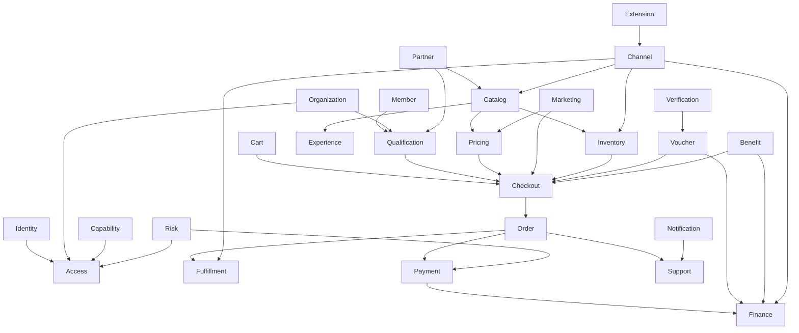
```mermaid
flowchart TB
    Identity --> Access
    Organization --> Access
    Capability --> Access
    Partner --> Catalog
    Member --> Qualification
    Organization --> Qualification
    Partner --> Qualification
    Catalog --> Pricing
    Catalog --> Inventory
    Catalog --> Experience
    Marketing --> Pricing
    Cart --> Checkout
    Qualification --> Checkout
    Pricing --> Checkout
    Marketing --> Checkout
    Inventory --> Checkout
    Voucher --> Checkout
    Benefit --> Checkout
    Checkout --> Order
    Order --> Fulfillment
    Order --> Payment
    Payment --> Finance
    Voucher --> Finance
    Benefit --> Finance
    Verification --> Voucher
    Channel --> Catalog
    Channel --> Inventory
    Channel --> Fulfillment
    Channel --> Finance
    Order --> Support
    Risk --> Access
    Risk --> Payment
    Notification --> Support
    Extension --> Channel
```

本图只表达“左侧事实或能力供给右侧业务”的关键概念流，用于理解领域，不声称穷举，也不是可执行 Import Graph。它可以把一个同步请求和反向返回折叠成一条业务关系，因此绝不能用于判断代码依赖方向。真正运行边必须由第 6.7 节分别按同步 Port、异步 Event 和 Workspace Read 生成；任何一条边只有一个明确方向。

### 6.2 28 个业务模块责任矩阵

| 模块          | 聚合根与事实                                                | 公开能力                              | 主要事件                                                                         | 绝对禁止                   |
| ------------- | ----------------------------------------------------------- | ------------------------------------- | -------------------------------------------------------------------------------- | -------------------------- |
| Identity      | Identity、Credential、Session、Challenge                    | 登录、注册、会话、改密、恢复、Step-up | IdentityRegistered、SessionCreated、SessionRevoked                               | 直接写 Member 或 Access 表 |
| Organization  | Platform、Distributor、Tenant、Enterprise、Mall、Department | 层级、移动、停启、管理员锚点          | OrgUnitChanged                                                                   | 把 Supplier 当组织节点     |
| Access        | Membership、Role、Grant、Deny、Decision                     | 授权、角色、数据范围                  | AccessVersionChanged                                                             | 信任客户端 tenantId        |
| Capability    | Plan、Package、Assignment、Quota                            | 套餐、菜单能力、额度                  | CapabilityChanged                                                                | 用菜单代替权限             |
| Partner       | Supplier、Brand、Store、Agreement                           | 入驻、协议、授权                      | PartnerEnrolled                                                                  | 删除历史合作证据           |
| Member        | MemberProfile、Group、Level、Import                         | 会员、分组、导入                      | MemberChanged                                                                    | 将登录身份与租户档案合并   |
| Qualification | Policy、Decision、Counter                                   | 资格、限购、范围判定                  | QualificationDecided                                                             | 前端自行判断最终资格       |
| Catalog       | Product、Sku、SourceOffer、Listing、Pool                    | 商品、类目、商品池、投放              | ProductChanged、ListingPublished、ListingUnpublished                             | 有订单商品物理删除         |
| Pricing       | RuleSet、Quote、MarginReview                                | 成本、加价、税、报价                  | PriceQuoted                                                                      | 浮点金额或前端算价         |
| Inventory     | StockItem、Reservation、Movement                            | 可售、预占、提交、释放                | StockReserved、StockChanged                                                      | 直接改 reservedQty         |
| Experience    | Application、Draft、Snapshot、PublishedHead                 | 装修、校验、发布、回滚                | ExperiencePublished                                                              | 修改已发布快照             |
| Marketing     | Campaign、Audience、Budget、PromotionQuote                  | 特惠、优惠、抽奖、叠加                | CampaignApplied                                                                  | 不可审计随机数             |
| Cart          | Cart、CartItem                                              | 购物车意图                            | CartChanged                                                                      | 锁价或锁库存               |
| Checkout      | CheckoutQuote、TenderPreview                                | 资格、价格、促销、资产和库存预览      | QuoteCreated、QuoteConfirmed                                                     | 直接标记订单已支付         |
| Order         | Order、Suborder、OrderLine、AfterSale                       | 下单、取消、售后商业承诺              | OrderPlaced、OrderCancelled                                                      | 内嵌支付或物流内部状态     |
| Fulfillment   | FulfillmentOrder、Shipment、Tracking                        | 拆单、发货、物流、退货                | FulfillmentShipped                                                               | 外部失败回滚已支付订单     |
| Verification  | Challenge、Device、VerificationReceipt                      | 翼码、券码、门店核销                  | CodeVerified                                                                     | 静态通用核销码             |
| Payment       | PaymentIntent、Attempt、Tender、Refund                      | 预支付、回调、查单、退款              | PaymentCaptured、PaymentRefunded                                                 | 回调直接改 Order 表        |
| Voucher       | Program、CardPool、Voucher、Redemption                      | 备券、发券、状态、核销、冲正          | VoucherIssued、VoucherRedeemed                                                   | 明文卡密和重复核销         |
| Benefit       | Plan、Budget、Grant、BenefitLedger                          | 福利发放、冻结、扣减、回补            | BenefitGranted、BenefitExpired                                                   | 可编辑余额                 |
| Finance       | Account、Journal、Reconciliation、Settlement、Invoice       | 记账、对账、结算、提现、发票          | EntryPosted、DifferenceResolved、SettlementApproved、PeriodClosed、InvoiceIssued | 不平衡分录或直接改余额     |
| Channel       | Connection、Mapping、SyncRun、Webhook                       | Provider 同步、映射、重放             | SyncCompleted                                                                    | Provider 写核心表          |
| Support       | Conversation、Ticket、Assignment、Sla                       | 客服、工单、升级                      | TicketAssigned                                                                   | 客服直接改资金事实         |
| Notification  | Template、Preference、Dispatch                              | 短信、微信、站内信                    | NotificationDelivered                                                            | 模板任意读取数据库         |
| Reporting     | Fact、Projection、Metric、Export                            | 驾驶舱、统计、导出                    | ProjectionAdvanced                                                               | 报表假装强实时             |
| Risk          | Policy、Signal、Decision、Case                              | 允许、挑战、复核、拒绝                | RiskCaseOpened                                                                   | 模型绕过硬规则             |
| Audit         | AuditEvent、Digest、Archive                                 | 不可变证据、导出                      | AuditRecorded、AuditArchived                                                     | 更新或删除审计             |
| Extension     | Manifest、Installation、Health、Binding                     | 安装、启停、版本切换                  | ExtensionEnabled                                                                 | 通用数据库和密钥权限       |

### 6.3 模块内部固定层次

```text
Module
├─ domain
│  ├─ model
│  ├─ value
│  ├─ policy
│  ├─ event
│  └─ error
├─ application
│  ├─ command
│  ├─ query
│  ├─ handler
│  ├─ port
│  ├─ dto
│  └─ process
├─ infrastructure
│  ├─ persistence
│  ├─ integration
│  └─ cache
├─ interface
│  ├─ http
│  └─ job
└─ Module.ts
```

依赖方向：

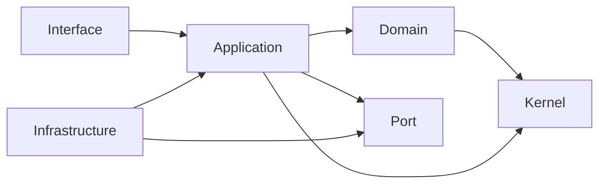
```mermaid
flowchart LR
    Interface --> Application
    Infrastructure --> Application
    Application --> Domain
    Application --> Port
    Infrastructure --> Port
    Domain --> Kernel
    Application --> Kernel
```

- Domain 不知道 React、HTTP、SQL、Redis、Provider SDK 或系统时钟。
- Application 只编排 Use Case 和 Port。
- Infrastructure 实现 Port，不向上泄露 pg Row 或 Provider JSON。
- Interface 只做协议解析、校验、AccessPipeline 与 Presenter。
- 跨模块只能使用目标 Module Facade、公开 Port 或 Event。

### 6.4 采用的设计模式

| 问题              | 模式                                     | 用法                                |
| ----------------- | ---------------------------------------- | ----------------------------------- |
| 聚合持久化        | Repository 与 UnitOfWork                 | 隐藏 SQL，确保聚合与 Outbox 同事务  |
| 读写分工          | CQRS                                     | 写聚合，读投影；不是两个数据库真相  |
| 复杂资格          | Specification 与 Policy                  | 可组合、可解释、版本化              |
| 外部格式          | Adapter 与 AntiCorruption Layer          | Provider JSON 不进入核心域          |
| Provider 即插即用 | Abstract Factory、Registry、Strategy     | 按能力选择实现                      |
| 长业务链          | Process Manager                          | 支付、履约、退款、结算持续推进      |
| 异步可靠性        | Outbox、Inbox、Deadletter                | 至少一次投递与业务幂等              |
| 状态变化          | Explicit State Machine                   | Order、Payment、Voucher、Settlement |
| 外部不稳定        | Timeout、Retry、CircuitBreaker、Bulkhead | 有界失败，不拖垮核心                |
| 发布与报价        | Immutable Snapshot                       | 历史不漂移                          |
| 快速读取          | Projection 与 CacheAside                 | 带水位线，可重建                    |
| 横切能力          | Pipeline 与 Decorator                    | 鉴权、幂等、审计、遥测              |

### 6.5 SOLID、面向对象与迪米特法则的落地合同

| 原则           | 必须如何落地                                                                           | 自动化证明                                                 |
| -------------- | -------------------------------------------------------------------------------------- | ---------------------------------------------------------- |
| 单一职责 SRP   | 一个 Handler 只实现一个 Use Case；一个 Repository 只服务一个聚合；Presenter 只映射协议 | 复杂度、依赖图、类职责与变更影响检查                       |
| 开闭原则 OCP   | 新 Provider、规则、通知渠道和投影通过 Manifest、Registry、Strategy 注册                | 新实现只新增适配包与注册项，不修改核心分支                 |
| 里氏替换 LSP   | 同一 Port 的所有实现遵守相同前置条件、错误语义、幂等和超时语义                         | 每个 Port 共享 Contract Suite，真实实现与 Fake 实现均通过  |
| 接口隔离 ISP   | 按 Use Case 提供窄 Port，禁止万能 Repository、万能 Service 和全表 Data Access          | 导出面扫描、接口方法数量上限和未使用依赖检查               |
| 依赖倒置 DIP   | Domain 和 Application 只依赖 Port 与 Kernel；Infrastructure 在 Composition Root 注入   | 架构测试阻止 Domain/Application 导入 SQL、HTTP、SDK、Redis |
| 迪米特法则 LoD | 模块只认识自己的对象、显式参数和目标模块 Facade；禁止跨层对象链和跨 Schema 探查        | Import Graph、SQL Owner、公开导出与跨模块调用审计          |

面向对象的具体纪律：

- Aggregate 是不变量边界，所有状态改变必须经过有业务含义的方法，不允许公开字段 Setter 或脚本式改 Row。
- Entity 以稳定 Identity 判断同一性；Value Object 不可变、按值相等，并在构造时完成格式与范围校验。
- 复杂但不属于单一 Entity 的规则放入 Domain Policy；只负责流程编排的逻辑放入 Application Service，不能反向侵入 Domain。
- Aggregate 通过命名 Factory 创建，通过 Domain Event 表达已经发生的事实；DTO、数据库 Row 和 Provider JSON 都不能伪装成领域对象。
- Clock、IdGenerator、MoneyRate、Crypto、ObjectStore、MessageBus 等不确定或外部能力一律经 Port 注入，测试不得依赖真实时间和全局单例。
- Composition Root 是唯一组装点；模块根只公开 Facade、Contract 与 Manifest，不公开 Infrastructure 类、连接池或可变 Singleton。

### 6.6 单一事实源与禁止重复逻辑、配置

| 事实                  | 唯一来源                                       | 允许生成的消费者                                    | 明确禁止                           |
| --------------------- | ---------------------------------------------- | --------------------------------------------------- | ---------------------------------- |
| Requirement           | 版本化 Requirement Catalog 与两份强制依据 Hash | MVP 门禁、测试标签、覆盖报告                        | 手写第二份需求编号表               |
| Operation             | Contract Operation Definition                  | OpenAPI、Server Route、SDK、权限清单、测试 Stub     | Controller、前端和文档各写一套路由 |
| Event 与 Job          | Typed Contract Registry                        | Producer、Consumer、Schema、Deadletter 与重放工具   | unknown Payload、字符串事件名散落  |
| Error                 | Error Catalog                                  | Domain Error、HTTP Mapping、SDK Error、UI 文案键    | 根据 message 猜状态码              |
| Permission            | Access Policy Catalog                          | 后端判定、菜单可见性、测试矩阵与审计解释            | 组件内硬编码角色名                 |
| Module                | Module Manifest                                | 依赖图、Composition Root、健康检查、所有权审计      | 手写第二份模块列表                 |
| Workspace 与标题      | Workspace Manifest                             | 路由、Sidebar、H1、Scope、Permission 与 Lazy Loader | Header、页面、Sidebar 分别维护标题 |
| VI Token              | Brand Token Source                             | CSS Variables、TypeScript Token、Storybook 与截图门 | 页面散落 Hex、字号、阴影和圆角     |
| Provider 与 Extension | Extension Manifest 和 Capability Contract      | 安装、健康、版本选择、路由、告警和运维视图          | 核心代码按 Provider 名称写条件分支 |
| Runtime Config        | Typed Config Schema                            | ApiMain、JobsMain、部署模板和启动校验               | 多份 Env 默认值、代码内生产回退    |
| 数据 Owner            | Context Ownership Catalog                      | Migration、SQL Audit、RLS、备份与清理规则           | 跨 Schema 读写和同一事实多表维护   |
| 指标与告警            | Telemetry Catalog                              | 埋点、Dashboard、SLO、Alert 与 Runbook              | 前端和后端使用含义不同的同名指标   |

生成物必须带源文件 Hash 与版本，不允许人工编辑；CI 同时检查重复 ID、重复路径、重复权限、重复 Token、重复配置键和生成物漂移。共享代码只有在语义、生命周期和所有权完全一致时才进入 Kernel 或 shared；仅仅“长得相似”不得抽成共享万能函数。

机械真值路径、生成器和证据固定如下。除 ExternalAuthority 和第33.1/33.4节预切换SourceRoot取证例外外，表内全部路径均相对 Shop 仓库根，`npm run quality`也只从该根执行；不得混用工作区根、仓库根和当前迁移源路径。ExternalAuthority 使用从 Shop 根解析的`../docs`路径与固定Hash，只读挂载。SourceRoot路径也只从 Shop 根解析，但仅FileDisposition的预切换扫描可按显式allowlist只读访问三个同级迁移源；任何Generator、Build、Test、Runtime、Deploy或删除器都不继承该越界权限。表中的Task是统一质量命令内部节点，不是第二套入口。

| 事实                  | Canonical Path                                                                                                           | Generator 或 Quality Task           | Evidence Output                                 |
| --------------------- | ------------------------------------------------------------------------------------------------------------------------ | ----------------------------------- | ----------------------------------------------- |
| Requirement 与 MVP    | ExternalAuthority ../docs/福利商城功能清单260821.xlsx + 78cfc3b350ced633afd6bfc951f2d2a94991780fa1d4b6d571e9f1d3df322942 | tools/requirementgen / requirements | docs/operations/evidence/RequirementTrace.json  |
| Operation             | packages/contract/definitions/operations.yml                                                                             | tools/contractgen / operations      | docs/operations/evidence/OperationCatalog.json  |
| Event 与 Job          | packages/contract/definitions/events.yml 与 packages/contract/definitions/jobs.yml                                       | tools/contractgen / messaging       | docs/operations/evidence/MessageCatalog.json    |
| Error                 | packages/contract/definitions/errors.yml                                                                                 | tools/contractgen / errors          | docs/operations/evidence/ErrorCatalog.json      |
| Permission            | packages/contract/definitions/permissions.yml                                                                            | tools/contractgen / permissions     | docs/operations/evidence/PermissionMatrix.json  |
| Capability            | packages/contract/definitions/capabilities.yml                                                                           | tools/contractgen / capabilities    | docs/operations/evidence/CapabilityCatalog.json |
| Module 与依赖边       | services/commerce/src/modules/\*/\*Module.ts                                                                             | tools/quality / boundaries          | docs/operations/evidence/ModuleGraph.json       |
| Workspace 与标题      | apps/console/src/feature/\*/Manifest.ts                                                                                  | tools/quality / frontend            | docs/operations/evidence/WorkspaceCatalog.json  |
| VI Token 与品牌资产   | packages/design/src/tokens.json 与 packages/design/src/brand/\*.svg                                                      | tools/tokengen / vi                 | docs/operations/evidence/ViCatalog.json         |
| Provider 与 Extension | extensions/\*\*/Manifest.ts（递归）                                                                                      | tools/quality / extensions          | docs/operations/evidence/ExtensionCatalog.json  |
| Runtime Config        | packages/config/src/RuntimeConfig.ts                                                                                     | tools/quality / config              | docs/operations/evidence/RuntimeConfig.json     |
| 数据 Owner            | database/contracts/ownership.yml                                                                                         | tools/quality / ownership           | docs/operations/evidence/OwnershipCatalog.json  |
| 指标与告警            | packages/telemetry/src/TelemetryCatalog.ts                                                                               | tools/quality / telemetry           | docs/operations/evidence/TelemetryCatalog.json  |

每份 Evidence 同时记录 canonicalPath、sourceHash、generatorVersion、command、commit、sourceTreeHash、generatedAt 和 outputHash。正文中的数量、SLO、容量与 Token 表只是带版本的可读镜像；如与 Canonical Path 不一致，npm run quality 必须失败。语义重复扫描输出 DuplicateDisposition.json，每个相似项必须被判定为 SameTruth、IntentionalVariant 或 Defect，不能静默忽略。

### 6.7 DomainDependencyGraph、WorkspaceReadGraph 与覆盖合同

运行图必须拆开生成：

- DomainDependencyGraph 只包含 28 个后端模块。同步边方向固定为 Caller → Port Owner；异步边固定为 Event Producer → Event Consumer。即使两个模块相同，同步 Port 与异步 Event 也必须是两条独立 Edge。
- WorkspaceReadGraph 只描述只读 Projection 或 Evidence → Workspace，不进入后端 Module Import Graph，也不能被 Module Manifest 伪装成领域模块。
- Ports In、Ports Out、Consumed Event、Emitted Event 的每一项都必须绑定动态生成的 edgeId；Reporting 消费的每一个批准事件和 Audit 接收的每一个受审计命令也逐项展开，禁止“全部事件”这种不可验证通配描述。

下表是从核心旅程提炼的**Owner→业务使用者阅读视图**，只用于人工评审，不是DomainDependencyGraph生成输入：同步Port行按“Port Owner→Caller”展示，异步Event行按“Publisher→Consumer”展示；二者恰好都表达“事实/能力提供者→使用者”。实际同步图方向必须反转为Caller→Port Owner，并从6.7.1的Caller列及Module Manifest生成；异步图保持Publisher→Consumer。任何工具不得从本列直接生成图，最终CI只信任Contract v2生成的逐Contract edgeId，边数不写死。

| Relation | 事实提供者 → 使用者          | 关键公开合同                                                | 业务模式                       | 图号         | Contract Evidence         |
| -------- | ---------------------------- | ----------------------------------------------------------- | ------------------------------ | ------------ | ------------------------- |
| E01      | Identity → Access            | PrincipalPort                                               | 同步读Principal                | 12.1、12.2   | edge/E01.contract.test.ts |
| E02      | Organization → Access        | OrgScopePort、OrgUnitChanged                                | 同步读 + 异步失效              | 12.2、12.3   | edge/E02.contract.test.ts |
| E03      | Capability → Access          | CapabilityDecisionPort、CapabilityChanged                   | 同步读 + 异步失效              | 12.2、13.4   | edge/E03.contract.test.ts |
| E04      | Partner → Catalog            | PartnerCatalogPort、PartnerEnrolled                         | 同步读 + 异步投影              | 12.4、13.5   | edge/E04.contract.test.ts |
| E05      | Member → Qualification       | MemberQualificationPort、MemberChanged                      | 同步读 + 异步失效              | 12.5、13.6   | edge/E05.contract.test.ts |
| E06      | Organization → Qualification | OrgQualificationPort、OrgUnitChanged                        | 同步读 + 异步失效              | 12.3、12.5   | edge/E06.contract.test.ts |
| E07      | Partner → Qualification      | PartnerQualificationPort、AgreementChanged                  | 同步读 + 异步失效              | 12.4、12.5   | edge/E07.contract.test.ts |
| E08      | Catalog → Pricing            | CatalogPricingPort、ListingPublished                        | 同步读 + 异步失效              | 12.4、13.9   | edge/E08.contract.test.ts |
| E09      | Catalog → Inventory          | CatalogSkuPort、ListingPublished                            | 同步读 + 异步建档              | 12.4、13.10  | edge/E09.contract.test.ts |
| E10      | Catalog → Experience         | CatalogPublicationPort                                      | 同步校验                       | 12.12、13.11 | edge/E10.contract.test.ts |
| E11      | Marketing → Pricing          | PromotionPricePort、CampaignChanged                         | 同步报价 + 异步失效            | 12.4、12.5   | edge/E11.contract.test.ts |
| E12      | Cart → Checkout              | CartSnapshotPort                                            | 同步快照                       | 12.5、13.13  | edge/E12.contract.test.ts |
| E13      | Qualification → Checkout     | QualificationDecisionPort、QualificationPolicyChanged       | 同步判定 + 异步失效            | 12.5、13.7   | edge/E13.contract.test.ts |
| E14      | Pricing → Checkout           | PricingQuotePort                                            | 同步报价                       | 12.5、13.9   | edge/E14.contract.test.ts |
| E15      | Marketing → Checkout         | PromotionQuotePort                                          | 同步预览                       | 12.5、13.12  | edge/E15.contract.test.ts |
| E16      | Inventory → Checkout         | InventoryReservationPort                                    | 同步预占                       | 12.5、12.6   | edge/E16.contract.test.ts |
| E17      | Voucher → Checkout           | VoucherTenderPort                                           | 同步预览与锁定                 | 12.5、12.9   | edge/E17.contract.test.ts |
| E18      | Benefit → Checkout           | BenefitTenderPort                                           | 同步预览与锁定                 | 12.5、13.20  | edge/E18.contract.test.ts |
| E19      | Order → Checkout             | CreateOrderPort                                             | 同步创建冻结快照               | 12.6、13.14  | edge/E19.contract.test.ts |
| E20      | Payment → Fulfillment        | PaymentCaptured                                             | 异步创建                       | 12.7、12.8   | edge/E20.contract.test.ts |
| E21      | Order → Payment              | AfterSaleApproved                                           | 异步退款授权                   | 12.6、12.7   | edge/E21.contract.test.ts |
| E22      | Payment → Finance            | PaymentCaptured、PaymentRefunded、LatePaymentRecoveryOpened | 异步记账与迟到款暂记           | 12.7、12.10  | edge/E22.contract.test.ts |
| E23      | Voucher → Finance            | VoucherIssued、VoucherRedeemed、VoucherReversed             | 异步负债记账                   | 12.9、12.10  | edge/E23.contract.test.ts |
| E24      | Benefit → Finance            | BenefitGranted、BenefitDebited、BenefitRestored             | 异步账本投影                   | 12.6、12.10  | edge/E24.contract.test.ts |
| E25      | Voucher → Verification       | VoucherRedemptionPort                                       | 同步核销                       | 12.9、13.17  | edge/E25.contract.test.ts |
| E26      | Channel → Catalog            | OfferSynced                                                 | 异步归一                       | 12.4、13.22  | edge/E26.contract.test.ts |
| E27      | Channel → Inventory          | StockSynced                                                 | 异步库存同步                   | 12.4、13.22  | edge/E27.contract.test.ts |
| E28      | Channel → Fulfillment        | ChannelFulfillmentPort                                      | 同步提交/查单                  | 12.8、13.22  | edge/E28.contract.test.ts |
| E29      | Channel → Finance            | ChannelSettlementReceived                                   | 异步对账输入                   | 12.10、13.22 | edge/E29.contract.test.ts |
| E30      | Order → Support              | OrderSupportReadPort                                        | 同步最小只读                   | 13.15、13.23 | edge/E30.contract.test.ts |
| E31      | Risk → Access                | AccessRiskGate、RiskDecision                                | 同步闸门                       | 12.2、13.26  | edge/E31.contract.test.ts |
| E32      | Risk → Payment               | PaymentRiskGate、RiskDecision                               | 同步闸门                       | 12.7、13.26  | edge/E32.contract.test.ts |
| E33      | Notification → Support       | NotificationDelivered、NotificationFailed                   | 异步证据                       | 13.23、13.24 | edge/E33.contract.test.ts |
| E34      | Extension → Channel          | ProviderCapabilityPort、ExtensionEnabled                    | 动态适配                       | 12.4、12.8   | edge/E34.contract.test.ts |
| E35      | Order → Fulfillment          | OrderReadPort、OrderCancelled、AfterSaleApproved            | 同步订单快照 + 异步取消与退货  | 12.8、13.16  | edge/E35.contract.test.ts |
| E36      | Payment → Checkout           | PaymentIntentPort                                           | 同步创建支付计划               | 12.6、13.14  | edge/E36.contract.test.ts |
| E37      | Payment → Notification       | PaymentCaptured、PaymentRefunded                            | 异步交易通知                   | 12.7、13.24  | edge/E37.contract.test.ts |
| E38      | Channel → Fulfillment        | FulfillmentStatusReceived                                   | 异步外部状态                   | 12.8、13.22  | edge/E38.contract.test.ts |
| E39      | Fulfillment → Support        | FulfillmentFailed                                           | 异步异常工单                   | 12.8、13.23  | edge/E39.contract.test.ts |
| E40      | Order → Payment              | PaymentOrderPort                                            | 同步确认可捕获                 | 12.7、13.18  | edge/E40.contract.test.ts |
| E41      | Benefit → Payment            | BenefitTenderPort                                           | 同步捕获/恢复腿                | 12.7、13.18  | edge/E41.contract.test.ts |
| E42      | Voucher → Payment            | VoucherTenderPort                                           | 同步捕获/冲正腿                | 12.7、13.18  | edge/E42.contract.test.ts |
| E43      | Inventory → Payment          | InventoryReservationPort                                    | 同步提交/释放预占              | 12.7、13.18  | edge/E43.contract.test.ts |
| E44      | Marketing → Payment          | PromotionReservationPort                                    | 同步提交/释放预算              | 12.7、13.18  | edge/E44.contract.test.ts |
| E45      | Cart → Checkout              | CartCommandPort                                             | 同步标记已转换                 | 12.6、13.14  | edge/E45.contract.test.ts |
| E46      | Notification → Identity      | NotificationPort                                            | 同步创建通知意图               | 12.1、13.1   | edge/E46.contract.test.ts |
| E47      | Notification → Partner       | NotificationPort                                            | 同步创建通知意图               | 13.5、13.24  | edge/E47.contract.test.ts |
| E48      | Notification → Fulfillment   | NotificationPort                                            | 同步创建通知意图               | 12.8、13.24  | edge/E48.contract.test.ts |
| E49      | Notification → Support       | NotificationPort                                            | 同步创建通知意图               | 13.23、13.24 | edge/E49.contract.test.ts |
| E50      | Fulfillment → Payment        | ReturnInspected                                             | 异步放行需退货退款             | 12.7、12.8   | edge/E50.contract.test.ts |
| E51      | Fulfillment → Inventory      | ReturnInspected                                             | 异步回补可售库存               | 12.8、13.10  | edge/E51.contract.test.ts |
| E52      | Order → Inventory            | OrderCancelled                                              | 异步释放库存预占               | 12.6、12.8   | edge/E52.contract.test.ts |
| E53      | Order → Benefit              | OrderCancelled                                              | 异步释放福利Hold               | 12.6、13.20  | edge/E53.contract.test.ts |
| E54      | Order → Voucher              | OrderCancelled                                              | 异步释放券Hold                 | 12.6、13.19  | edge/E54.contract.test.ts |
| E55      | Order → Payment              | OrderCancelled                                              | 异步关闭支付尝试               | 12.6、12.7   | edge/E55.contract.test.ts |
| E56      | Order → Marketing            | OrderCancelled                                              | 异步释放促销预算               | 12.6、13.12  | edge/E56.contract.test.ts |
| E57      | Marketing → Checkout         | PromotionReservationPort                                    | 同步预占促销预算               | 12.5、12.6   | edge/E57.contract.test.ts |
| E58      | Risk → Identity              | IdentityRiskGate                                            | 同步登录/挑战风控              | 12.1、13.1   | edge/E58.contract.test.ts |
| E59      | Risk → Catalog               | CatalogRiskGate                                             | 同步发布风控闸门               | 12.4、13.8   | edge/E59.contract.test.ts |
| E60      | Member → Checkout            | AddressReadPort                                             | 同步地址快照读取               | 12.5、13.14  | edge/E60.contract.test.ts |
| E61      | Organization → Partner       | OrganizationReadPort                                        | 同步组织归属校验               | 13.2、13.5   | edge/E61.contract.test.ts |
| E62      | Organization → Member        | OrganizationReadPort                                        | 同步会员Scope校验              | 13.2、13.6   | edge/E62.contract.test.ts |
| E63      | Catalog → Marketing          | CatalogReadPort                                             | 同步活动商品读取               | 13.8、13.12  | edge/E63.contract.test.ts |
| E64      | Catalog → Cart               | CatalogReadPort                                             | 同步购物车商品读取             | 13.8、13.13  | edge/E64.contract.test.ts |
| E65      | Pricing → Marketing          | PricingPreviewPort                                          | 同步促销基价预览               | 13.9、13.12  | edge/E65.contract.test.ts |
| E66      | Pricing → Cart               | PricingPreviewPort                                          | 同步展示价预览                 | 13.9、13.13  | edge/E66.contract.test.ts |
| E67      | Member → Marketing           | MemberSummaryPort                                           | 同步受众摘要读取               | 13.6、13.12  | edge/E67.contract.test.ts |
| E68      | Member → Benefit             | MemberSummaryPort                                           | 同步发放对象读取               | 13.6、13.20  | edge/E68.contract.test.ts |
| E69      | Member → Support             | MemberSummaryPort                                           | 同步客服脱敏摘要               | 13.6、13.23  | edge/E69.contract.test.ts |
| E70      | Member → Verification        | MemberReadPort                                              | 同步核验主体读取               | 13.6、13.17  | edge/E70.contract.test.ts |
| E71      | Partner → Verification       | StoreReadPort                                               | 同步门店协议校验               | 13.5、13.17  | edge/E71.contract.test.ts |
| E72      | Qualification → Benefit      | QualificationDecisionPort                                   | 同步发放资格判定               | 13.7、13.20  | edge/E72.contract.test.ts |
| E73      | Member → Access              | MemberImported                                              | 异步创建Invited Membership     | 13.3、13.6   | edge/E73.contract.test.ts |
| E74      | Identity → Access            | SessionRevoked                                              | 异步失效AccessVersion          | 12.1、13.3   | edge/E74.contract.test.ts |
| E75      | Identity → Access            | IdentityRegistered                                          | 异步消费Enrollment建Membership | 12.1、13.3   | edge/E75.contract.test.ts |
| E76      | Access → Identity            | MembershipEnrollmentCreated                                 | 异步创建注册邀请               | 13.3、13.1   | edge/E76.contract.test.ts |

#### 6.7.1 跨模块 Canonical Port 文件

下表的`portId`和文件一一对应，是Contract/Module Manifest/静态图的唯一可执行名称；“Cart能力”“Order命令”“Channel Provider”等自然语言只能作说明，不能进入`portId`。Port文件属于能力Owner的`public`目录，调用者只导入该文件；Owner内部到数据库或Extension的Port不进入跨模块图。

| Relation              | portId                      | Owner与唯一文件                                                                                   | Caller                                  | 调用语义                                                                                       |
| --------------------- | --------------------------- | ------------------------------------------------------------------------------------------------- | --------------------------------------- | ---------------------------------------------------------------------------------------------- |
| E01                   | `PrincipalPort`             | Identity — `services/commerce/src/modules/identity/public/PrincipalPort.ts`                       | Access                                  | 只返回不可变Principal、Session/Credential Version和Assurance摘要；会话撤销另走`SessionRevoked` |
| E02                   | `OrgScopePort`              | Organization — `services/commerce/src/modules/organization/public/OrgScopePort.ts`                | Access                                  | 返回版本化Scope祖先/后代关系，不暴露Closure Repository                                         |
| E03                   | `CapabilityDecisionPort`    | Capability — `services/commerce/src/modules/capability/public/CapabilityDecisionPort.ts`          | Access                                  | 返回组织能力、配额版本与拒绝原因，不替代Permission判定                                         |
| E04                   | `PartnerCatalogPort`        | Partner — `services/commerce/src/modules/partner/public/PartnerCatalogPort.ts`                    | Catalog                                 | 读取有效Supplier/Brand/Agreement授权快照；Partner主档仍由Partner拥有                           |
| E05                   | `MemberQualificationPort`   | Member — `services/commerce/src/modules/member/public/MemberQualificationPort.ts`                 | Qualification                           | 返回脱敏成员属性、分组和版本化资格输入                                                         |
| E06                   | `OrgQualificationPort`      | Organization — `services/commerce/src/modules/organization/public/OrgQualificationPort.ts`        | Qualification                           | 返回组织层级、城市和Scope资格输入                                                              |
| E07                   | `PartnerQualificationPort`  | Partner — `services/commerce/src/modules/partner/public/PartnerQualificationPort.ts`              | Qualification                           | 返回Supplier/Brand/Store协议状态和版本                                                         |
| E08                   | `CatalogPricingPort`        | Catalog — `services/commerce/src/modules/catalog/public/CatalogPricingPort.ts`                    | Pricing                                 | 返回已发布Listing/Sku定价输入快照                                                              |
| E09                   | `CatalogSkuPort`            | Catalog — `services/commerce/src/modules/catalog/public/CatalogSkuPort.ts`                        | Inventory                               | 返回Sku库存身份与来源映射，不写库存                                                            |
| E10                   | `CatalogPublicationPort`    | Catalog — `services/commerce/src/modules/catalog/public/CatalogPublicationPort.ts`                | Experience                              | 发布前校验Listing引用和发布版本                                                                |
| E11                   | `PromotionPricePort`        | Marketing — `services/commerce/src/modules/marketing/public/PromotionPricePort.ts`                | Pricing                                 | 返回版本化促销价格修饰，不生成最终价                                                           |
| E12                   | `CartSnapshotPort`          | Cart — `services/commerce/src/modules/cart/public/CartSnapshotPort.ts`                            | Checkout                                | 读取并锁定选中Cart版本                                                                         |
| E45                   | `CartCommandPort`           | Cart — `services/commerce/src/modules/cart/public/CartCommandPort.ts`                             | Checkout                                | 标记已转换/释放，Cart自己发CartChanged                                                         |
| E13                   | `QualificationDecisionPort` | Qualification — `services/commerce/src/modules/qualification/public/QualificationDecisionPort.ts` | Checkout                                | 强一致资格重验与证据                                                                           |
| E14                   | `PricingQuotePort`          | Pricing — `services/commerce/src/modules/pricing/public/PricingQuotePort.ts`                      | Checkout                                | 校验版本并冻结价格快照                                                                         |
| E15                   | `PromotionQuotePort`        | Marketing — `services/commerce/src/modules/marketing/public/PromotionQuotePort.ts`                | Checkout                                | 预览促销与预算规则                                                                             |
| E16 / E43             | `InventoryReservationPort`  | Inventory — `services/commerce/src/modules/inventory/public/InventoryReservationPort.ts`          | Checkout、Payment                       | reserve/commit/release，Owner自己发库存事件                                                    |
| E17 / E42             | `VoucherTenderPort`         | Voucher — `services/commerce/src/modules/voucher/public/VoucherTenderPort.ts`                     | Checkout、Payment                       | preview/hold/capture/reverse                                                                   |
| E18 / E41             | `BenefitTenderPort`         | Benefit — `services/commerce/src/modules/benefit/public/BenefitTenderPort.ts`                     | Checkout、Payment                       | preview/hold/capture/restore                                                                   |
| E19                   | `CreateOrderPort`           | Order — `services/commerce/src/modules/order/public/CreateOrderPort.ts`                           | Checkout                                | 以冻结快照恰好一次建单；Port仅此单一Operation                                                  |
| E25                   | `VoucherRedemptionPort`     | Voucher — `services/commerce/src/modules/voucher/public/VoucherRedemptionPort.ts`                 | Verification                            | 同步核销或冲正一次并返回Owner Receipt；`CodeVerified`不得反向驱动Voucher                       |
| E36                   | `PaymentIntentPort`         | Payment — `services/commerce/src/modules/payment/public/PaymentIntentPort.ts`                     | Checkout                                | 创建Intent与Tender Plan，不调用Provider                                                        |
| E40                   | `PaymentOrderPort`          | Order — `services/commerce/src/modules/order/public/PaymentOrderPort.ts`                          | Payment                                 | 校验订单可捕获/迟到状态，不暴露Order Repository                                                |
| E44 / E57             | `PromotionReservationPort`  | Marketing — `services/commerce/src/modules/marketing/public/PromotionReservationPort.ts`          | Checkout、Payment                       | Checkout reserve；Payment commit/release已建预算Reservation                                    |
| E28                   | `ChannelFulfillmentPort`    | Channel — `services/commerce/src/modules/channel/public/ChannelFulfillmentPort.ts`                | Fulfillment                             | 提交远端订单与按业务幂等号查单                                                                 |
| E30                   | `OrderSupportReadPort`      | Order — `services/commerce/src/modules/order/public/OrderSupportReadPort.ts`                      | Support                                 | 返回客服所需最小脱敏订单上下文                                                                 |
| E31                   | `AccessRiskGate`            | Risk — `services/commerce/src/modules/risk/public/AccessRiskGate.ts`                              | Access                                  | 高风险授权前返回版本化Decision；失败默认拒绝                                                   |
| E32                   | `PaymentRiskGate`           | Risk — `services/commerce/src/modules/risk/public/PaymentRiskGate.ts`                             | Payment                                 | Provider调用前校验金额、设备和主体风险；失败默认拒绝                                           |
| E34                   | `ProviderCapabilityPort`    | Extension — `services/commerce/src/modules/extension/public/ProviderCapabilityPort.ts`            | Channel                                 | 按已签名Manifest解析Provider能力；不返回通用数据库或Secret                                     |
| E35                   | `OrderReadPort`             | Order — `services/commerce/src/modules/order/public/OrderReadPort.ts`                             | Fulfillment                             | 返回创建履约所需的冻结订单/行快照；取消和售后推进另走Owner事件                                 |
| E46 / E47 / E48 / E49 | `NotificationPort`          | Notification — `services/commerce/src/modules/notification/public/NotificationPort.ts`            | Identity、Partner、Fulfillment、Support | 只创建带业务幂等键的Dispatch意图；通道调用仍在Notification内部                                 |
| E58                   | `IdentityRiskGate`          | Risk — `services/commerce/src/modules/risk/public/IdentityRiskGate.ts`                            | Identity                                | 登录、挑战、恢复的同步决策；依赖失败默认拒绝高风险动作                                         |
| E59                   | `CatalogRiskGate`           | Risk — `services/commerce/src/modules/risk/public/CatalogRiskGate.ts`                             | Catalog                                 | 发布前校验风险Evidence，不读取Catalog表                                                        |
| E60                   | `AddressReadPort`           | Member — `services/commerce/src/modules/member/public/AddressReadPort.ts`                         | Checkout                                | 只返回当前Member/Scope的脱敏地址与version，Confirm保存不可变快照                               |
| E61 / E62             | `OrganizationReadPort`      | Organization — `services/commerce/src/modules/organization/public/OrganizationReadPort.ts`        | Partner、Member                         | 按Caller授权返回组织身份、类型、状态和version；两个edgeId分别生成合同测试                      |
| E63 / E64             | `CatalogReadPort`           | Catalog — `services/commerce/src/modules/catalog/public/CatalogReadPort.ts`                       | Marketing、Cart                         | 返回已发布Listing/Sku最小快照；不返回Catalog Repository或草稿                                  |
| E65 / E66             | `PricingPreviewPort`        | Pricing — `services/commerce/src/modules/pricing/public/PricingPreviewPort.ts`                    | Marketing、Cart                         | 只供活动设计和购物车展示，不能作为Checkout最终价                                               |
| E67 / E68 / E69       | `MemberSummaryPort`         | Member — `services/commerce/src/modules/member/public/MemberSummaryPort.ts`                       | Marketing、Benefit、Support             | 每个Caller使用独立DTO Projection和Scope Policy；PII字段按用途最小化                            |
| E70                   | `MemberReadPort`            | Member — `services/commerce/src/modules/member/public/MemberReadPort.ts`                          | Verification                            | 返回动态码主体、状态与version，不返回凭证或可编辑档案                                          |
| E71                   | `StoreReadPort`             | Partner — `services/commerce/src/modules/partner/public/StoreReadPort.ts`                         | Verification                            | 返回Store/Mall Agreement、核验能力和version，不暴露资质密文                                    |
| E72                   | `QualificationDecisionPort` | Qualification — `services/commerce/src/modules/qualification/public/QualificationDecisionPort.ts` | Benefit                                 | 与E13复用同一判定引擎和文件，Caller/目的/证据分别登记，不允许宽泛结果                          |

`ChannelFulfillmentPort`在Channel内部委托`services/commerce/src/modules/channel/application/port/RemoteOrderSubmitter.ts`，后者再由Extension Adapter实现；`RemoteOrderSubmitter`不是Fulfillment可见的第二个跨模块Port。E38的反向状态只走`FulfillmentStatusReceived`，不把回调混进同步Port。

Access的入站决策合同唯一命名为`services/commerce/src/modules/access/public/AccessDecisionPort.ts`，Token同名；`DecisionPort`、`Authorization.ts`、旧`AccessPort.ts`和`accessPort`单例全部为零。该Port只返回判别式Allow/Deny/Stepup、AccessContext（包含已授权的opaque memberId）、Decision Version与Reason，不提供跨Owner写方法。旧`createRegistration`由E75 `IdentityRegisteredInboxHandler -> ActivateRegistrationMembershipHandler`替代；`ensureImported`由E73 `MemberImportedInboxHandler -> InviteMembershipHandler`替代；`member`由AccessContext替代；`revokeSessions`由E74 `SessionRevokedInboxHandler`推进AccessVersion替代。

WorkspaceReadGraph 单独登记：

| Edge | Read Model → Workspace | Query Contract         | 图号         | Evidence                  |
| ---- | ---------------------- | ---------------------- | ------------ | ------------------------- |
| W01  | Reporting → 经营驾驶舱 | CockpitProjectionQuery | 12.11、13.25 | edge/W01.contract.test.ts |
| W02  | Audit → 智慧翼中控台   | ControlEvidenceQuery   | 12.2、13.27  | edge/W02.contract.test.ts |

当前关系种子之外，生成图至少还会从 Manifest 展开 Identity → Notification、Partner → Organization、Partner → Notification、Cart → Catalog、Cart → Pricing、Order → Inventory、Support → Member、Support → Notification，以及逐个 Event Producer → Reporting/Audit Consumer；这说明固定数量本身不是验收目标。

Trace 必须包含 graphKind、edgeId、kind、callerOrProducer、ownerOrConsumer、portId 或 eventId、operationId、contractHash、testHash 与 sampleTraceId。跨模块 SQL、深层 Import、未登记 Event，或没有独立 Edge 的双向关系不能作为“快捷实现”。运行时 Trace 出现生成图外边、生成边没有测试，或 Workspace Edge 混进后端 Import Graph，均阻断 CI。

---

## 7. 前后端严格分离

### 7.1 前端调用链

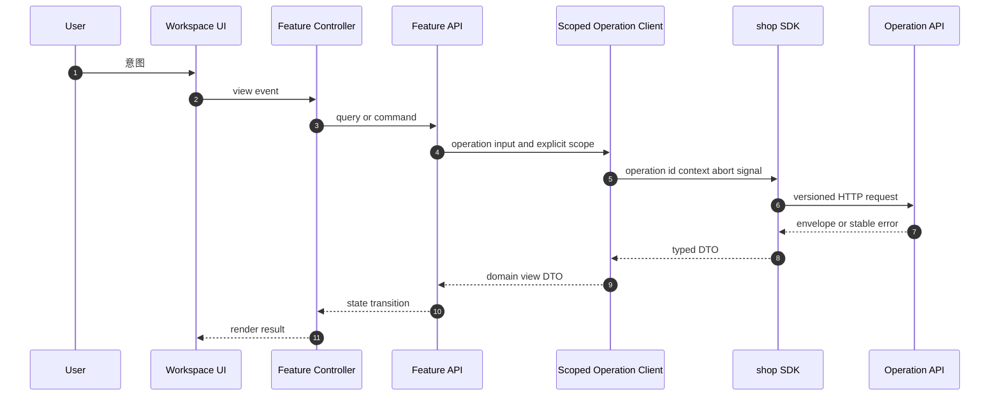
```mermaid
sequenceDiagram
    autonumber
    participant User
    participant UI as Workspace UI
    participant Controller as Feature Controller
    participant Api as Feature API
    participant Client as Scoped Operation Client
    participant Sdk as shop SDK
    participant Server as Operation API
    User->>UI: 意图
    UI->>Controller: view event
    Controller->>Api: query or command
    Api->>Client: operation input and explicit scope
    Client->>Sdk: operation id context abort signal
    Sdk->>Server: versioned HTTP request
    Server-->>Sdk: envelope or stable error
    Sdk-->>Client: typed DTO
    Client-->>Api: domain view DTO
    Api-->>Controller: state transition
    Controller-->>UI: render result
```

硬规则：

- UI 组件不得导入 SDK、transport、fetch 或环境变量。
- Feature API 不共享全局可变 Scope。
- 每次调用显式带 scope、request target 和 AbortSignal。
- 查询 Key 为 operationId、scope、canonical input 的不可变组合。
- 路由或 Scope 切换立即取消旧请求，旧响应不能覆盖新 Scope。
- 写命令带 IdempotencyKey 与 expectedVersion。
- 高风险命令必须先调用服务端 Preview Operation，再 Step-up、确认、执行和权威回读。
- 前端不能计算退款可退额、结算差异、分录、权限和最终库存。
- 当前 services/adminBff 不是 BFF，应拆回所属 feature/api 后删除。
- 真正 BFF 如未来需要，只能是部署在服务器端的受限聚合 Query，不提供通用写。

### 7.2 前端固定分层

```text
app
  ↓
route and shell
  ↓
feature
  ↓
entity
  ↓
shared
```

禁止反向依赖、跨 Feature 内部导入、从 shared 引用业务页面、从 entity 发网络请求。

每个 Workspace 插件固定包含：

```text
Manifest.ts
route/WorkspaceRoute.tsx
api/Query.ts
api/Command.ts
model/ViewModel.ts
model/State.ts
ui
index.ts
```

Manifest 是标题、图标、路由、Scope、Permission、Capability 与 Lazy Loader 的唯一来源。

### 7.3 后端请求管道

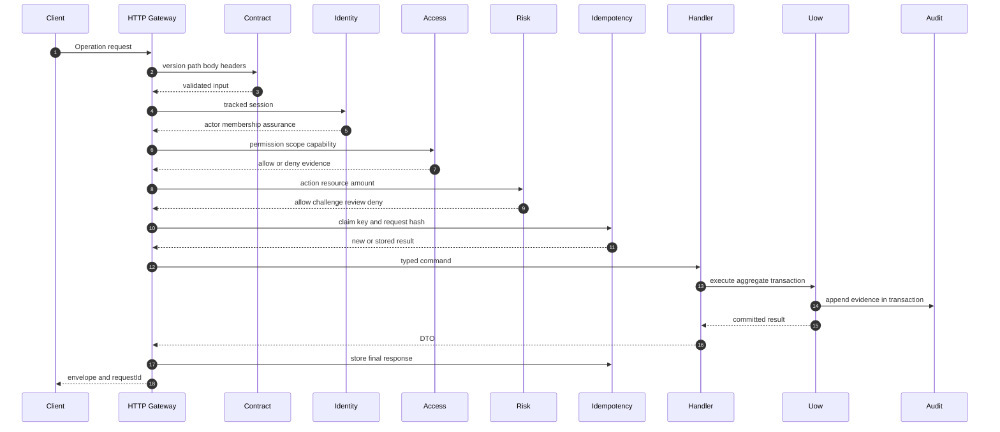
```mermaid
sequenceDiagram
    autonumber
    participant Client
    participant Gateway as HTTP Gateway
    participant Contract
    participant Identity
    participant Access
    participant Risk
    participant Idem as Idempotency
    participant Handler
    participant Uow
    participant Audit
    Client->>Gateway: Operation request
    Gateway->>Contract: version path body headers
    Contract-->>Gateway: validated input
    Gateway->>Identity: tracked session
    Identity-->>Gateway: actor membership assurance
    Gateway->>Access: permission scope capability
    Access-->>Gateway: allow or deny evidence
    Gateway->>Risk: action resource amount
    Risk-->>Gateway: allow challenge review deny
    Gateway->>Idem: claim key and request hash
    Idem-->>Gateway: new or stored result
    Gateway->>Handler: typed command
    Handler->>Uow: execute aggregate transaction
    Uow->>Audit: append evidence in transaction
    Uow-->>Handler: committed result
    Handler-->>Gateway: DTO
    Gateway->>Idem: store final response
    Gateway-->>Client: envelope and requestId
```

### 7.4 Operation 合同

所有 Operation 定义至少包含：

```text
id
owner
method
path
audience
permission
capability
scopeKinds
assuranceLevel
idempotent
makerChecker
requestSchema
responseSchema
errorCodes
requirements
timeout
rateClass
controller
handler
```

HTTP 统一规则：

- 主路径固定为 /api/v1。
- Money 使用 amountMinor 与 currency，禁止浮点。
- 时间为 UTC ISO 8601，展示层按 Scope 时区转换。
- 列表使用 Cursor，不使用不稳定 Offset。
- 并发编辑使用 ETag 与 IfMatch 或 expectedVersion。
- 写请求必须带 Idempotency-Key。
- 响应含 data、meta、requestId；错误含 code、message、detailsSafe、requestId。
- 绝不返回 SQL、堆栈、密钥、完整 PII 或 Provider 原始错误。
- 429 返回 RetryAfter；客户端不得无界重试。

---

## 8. Console 唯一 Shell 与智慧翼 VI

### 8.1 Shell 信息架构

```text
Console
├─ Sidebar
│  ├─ 品牌
│  ├─ 五个主工作台
│  ├─ 专业工作台分组
│  └─ 折叠控制
├─ Global Header
│  ├─ 全局搜索与命令
│  ├─ 真实告警
│  ├─ 任务中心
│  ├─ 通知
│  ├─ 语言
│  └─ 账户菜单
├─ Scope Rail
│  ├─ 当前业务范围
│  ├─ 数据水位线
│  └─ 认证等级
├─ Workspace Canvas
│  ├─ 动态标题
│  ├─ 页面级过滤
│  └─ 面板与主内容
└─ Overlay
   ├─ Drawer
   ├─ Dialog
   ├─ Command Palette
   └─ Step-up
```

Header 永远不重复工作台标题。截图中右上角的功能保留其意图，但改成真实、克制和可扩展的全局动作：

| 当前意图       | 目标交互                                                 |
| -------------- | -------------------------------------------------------- |
| 搜索框         | 支持订单、商品、组织、Operation 和命令；结果按权限过滤   |
| 华北大区预警   | 真实 Alert Center；无告警时不显示伪数字                  |
| 待分类         | 进入任务中心的商品治理过滤视图                           |
| Case 工单      | 统一为任务中心，实体仍为 Support Case                    |
| 中文           | 语言偏好，可放 Header 或账户菜单                         |
| 铃铛           | 真实通知，未读数来自 Notification Projection             |
| 用户和 COO     | 显示真实姓名与角色摘要；完整权限放账户抽屉，不堆叠长文本 |
| 账号安全、退出 | 账户菜单中的稳定动作                                     |

### 8.2 动态标题交接

标题只有一个事实源：Workspace Manifest 的 title。

| 状态       | Sidebar                     | 白板左上角                           | Header         |
| ---------- | --------------------------- | ------------------------------------ | -------------- |
| 展开 248px | 显示图标和标题              | 语义 H1 存在但 sr-only，完全不占高度 | 不显示模块标题 |
| 折叠 72px  | 仅图标、Tooltip、aria-label | H1 以 28/36/700 显示                 | 不显示模块标题 |
| 移动端     | Overlay Sidebar             | H1 始终可见                          | 不显示模块标题 |

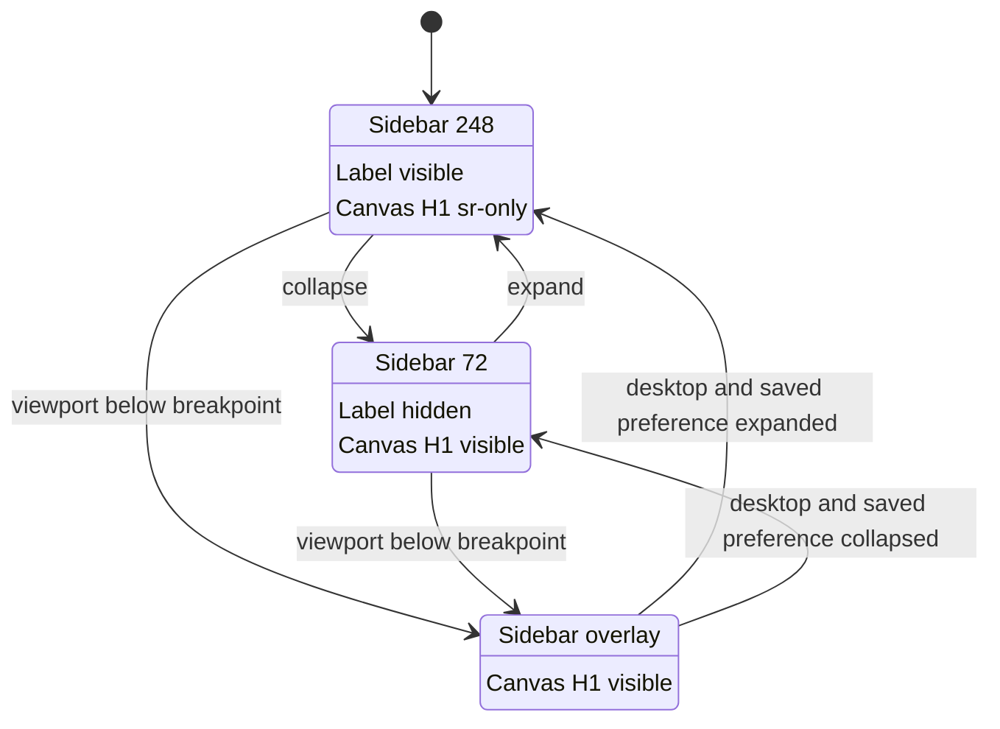
```mermaid
stateDiagram-v2
    [*] --> Expanded
    Expanded: Sidebar 248
    Expanded: Label visible
    Expanded: Canvas H1 sr-only
    Expanded --> Collapsed: collapse
    Collapsed: Sidebar 72
    Collapsed: Label hidden
    Collapsed: Canvas H1 visible
    Collapsed --> Expanded: expand
    Expanded --> Mobile: viewport below breakpoint
    Collapsed --> Mobile: viewport below breakpoint
    Mobile: Sidebar overlay
    Mobile: Canvas H1 visible
    Mobile --> Expanded: desktop and saved preference expanded
    Mobile --> Collapsed: desktop and saved preference collapsed
```

交互要求：

- 同一个 React 状态同时控制 Sidebar 标签和 H1 可见性。
- 标准动画 200ms，减少动态效果时无动画。
- 切换工作台时 active item、document title、语义 H1 与可见 H1 原子更新。
- 折叠偏好保存到服务端用户偏好；本地只作启动缓存。
- 过渡期间可见标题数量始终等于 1，语义 H1 数量始终等于 1。
- 五个主工作台乘两种 Sidebar 状态，至少 10 个自动化标题用例。
- 删除当前 min-w 900px 强制横向溢出。

标题时序：

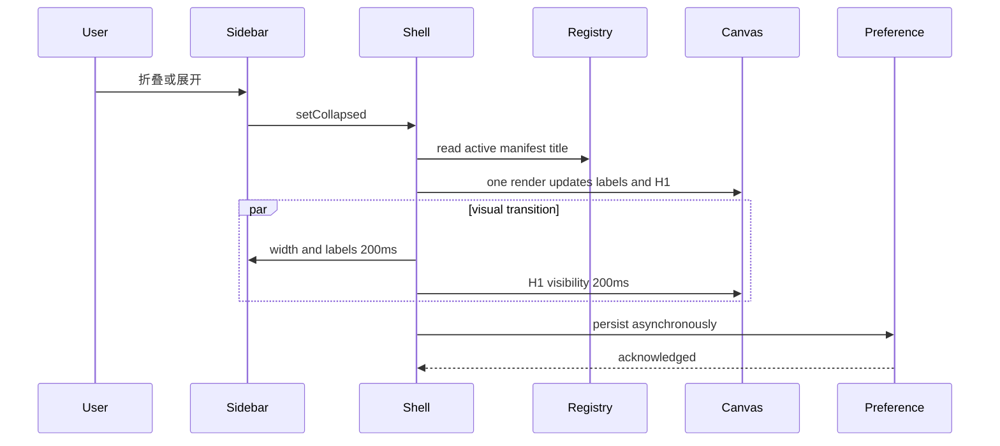
```mermaid
sequenceDiagram
    participant User
    participant Sidebar
    participant Shell
    participant Registry
    participant Canvas
    participant Preference
    User->>Sidebar: 折叠或展开
    Sidebar->>Shell: setCollapsed
    Shell->>Registry: read active manifest title
    Shell->>Canvas: one render updates labels and H1
    par visual transition
        Shell->>Sidebar: width and labels 200ms
        Shell->>Canvas: H1 visibility 200ms
    end
    Shell->>Preference: persist asynchronously
    Preference-->>Shell: acknowledged
```

### 8.3 Console 使用的 VI Token 子集

下表只是五个管理工作台直接使用的高频子集，不是第二份 VI 真值。完整且唯一的视觉真值始终是 docs/brand/SMART-WING-UNIFIED-VI-1.0.md 及其 JSON、CSS、mobile-platforms.json 和 SVG；色彩前景/浅背景、暗色、图标、触控、翼码、动效和跨端规则必须从该来源生成，不能靠本文抄写同步。

| 角色     | 值      |
| -------- | ------- |
| 品牌蓝   | #1F5EFF |
| 交互深蓝 | #174ED1 |
| 深海蓝   | #143A8F |
| 夜空蓝   | #07182F |
| 页面背景 | #F5F7FA |
| 卡片     | #FFFFFF |
| 正文     | #172033 |
| 次级文字 | #475569 |
| 辅助文字 | #64748B |
| 边框     | #E2E8F0 |
| 成功     | #0F9F6E |
| 警示     | #F59E0B |
| 危险     | #DC2626 |

字体：

| 样式       | 大小与行高 | 字重 | 用途             |
| ---------- | ---------: | ---: | ---------------- |
| Display    |      32/40 |  700 | 仅品牌或重大活动 |
| H1         |      28/36 |  700 | 页面主标题       |
| H2         |      20/28 |  600 | 模块标题         |
| H3         |      17/24 |  600 | 卡片标题         |
| Body       |      16/24 |  400 | 正文             |
| Body Small |      14/20 |  400 | 表格与说明       |
| Caption    |      12/18 |  400 | 标签与辅助信息   |

中文使用 PingFang SC 或 Noto Sans SC；拉丁与数字使用 Inter；ID 使用 Mono。关键金额复用 H1 的 28/36/700 并启用 tabular numbers，不新建 Amount Token。功能界面字号不得小于 12px，字重不得超过 700。

空间与层级：

- 8pt 网格，只允许 4px 半步。
- 圆角仅 8、12、16、24。
- 普通卡片使用 1px 边框，不使用连续重阴影。
- 阴影只用于 Drawer、Dialog、Command Palette 等高层 Overlay。
- 禁止玻璃拟态、紫色 AI 炫光、无意义渐变和超大 Hero。
- 红色只用于危险、失败与不可逆动作；普通主按钮使用品牌蓝。
- 状态必须同时有颜色、图标与文字。
- WCAG AA、键盘、焦点、读屏与 200% 缩放是上线门，不是辅助项。
- 图标只使用同一套 2px 圆角线性风格，尺寸固定为 16、20、24；最小触控遵守 iOS 44pt、Android 48dp、小程序 88rpx。
- brand-mark.svg、brand-lockup-horizontal.svg、wing-code-symbol.svg 和 wing-pattern.svg 是冻结品牌资产，文件名、内容、比例和语义均属于命名规则例外，不得为了去连字符而改名。
- packages/design-system 到 packages/design 只允许做一次由本方案明确裁决的包路径迁移；四个冻结 SVG 文件本身不改名、不复制，引用和 VI 文档在同一提交原子更新。

### 8.4 从 7.8 到 9.0 的评分证据

| 分数 | 发生了什么                              | 为什么仍不够                                                    |
| ---: | --------------------------------------- | --------------------------------------------------------------- |
|  7.8 | 旧 Smart 视觉被还原，页面看起来像系统   | 职责混杂，按钮与数据未形成闭环                                  |
|  8.3 | 增加功能区、五工作台概念和更多真实数据  | 只是增加区域；标题、Shell、Scope、API、状态和高风险动作仍未统一 |
|  8.6 | 五工作台职责清楚，导航和动态标题收敛    | 若数据仍由 UI 拼装，仍不是生产系统                              |
|  8.8 | Operation、权限、状态机、预览、审计接通 | 若性能、异常、无障碍与恢复未验证，仍不可记录                    |
|  9.0 | 本文所有 9 分门禁有自动化和生产证据     | 才允许写入 VI 系统                                              |

达到 9 分时，VI 变更记录必须包含前后截图、标题用例、Token Diff、无障碍报告、Bundle、Core Web Vitals、五工作台旅程、API/审计证据和从 7.8 到 9.0 的决策日志。

---

## 9. 五个主工作台的完整产品与交互

五个主工作台是高频决策入口，不是 Excel 全部菜单的替代品。它们通过 Summary、Exception 和 Deep Link 进入专业工作台。

### 9.1 共同页面骨架

```text
Workspace Canvas
├─ Workspace Heading
│  ├─ 动态 H1
│  ├─ 一句话职责
│  └─ 页面级主动作
├─ Filter Rail
│  ├─ Scope
│  ├─ 时间
│  ├─ 业务维度
│  └─ 保存视图
├─ Decision Summary
├─ Primary Work Area
├─ Exception or Task Rail
└─ Detail Drawer
```

共同状态：

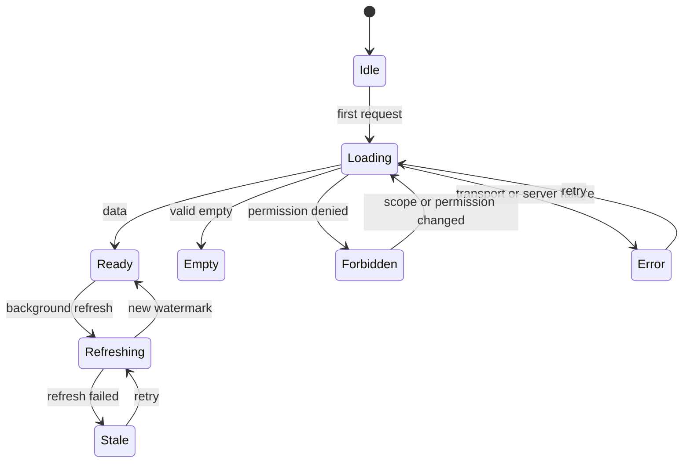
```mermaid
stateDiagram-v2
    [*] --> Idle
    Idle --> Loading: first request
    Loading --> Ready: data
    Loading --> Empty: valid empty
    Loading --> Forbidden: permission denied
    Loading --> Error: transport or server failure
    Ready --> Refreshing: background refresh
    Refreshing --> Ready: new watermark
    Refreshing --> Stale: refresh failed
    Stale --> Refreshing: retry
    Error --> Loading: retry
    Forbidden --> Loading: scope or permission changed
```

共同命令状态：

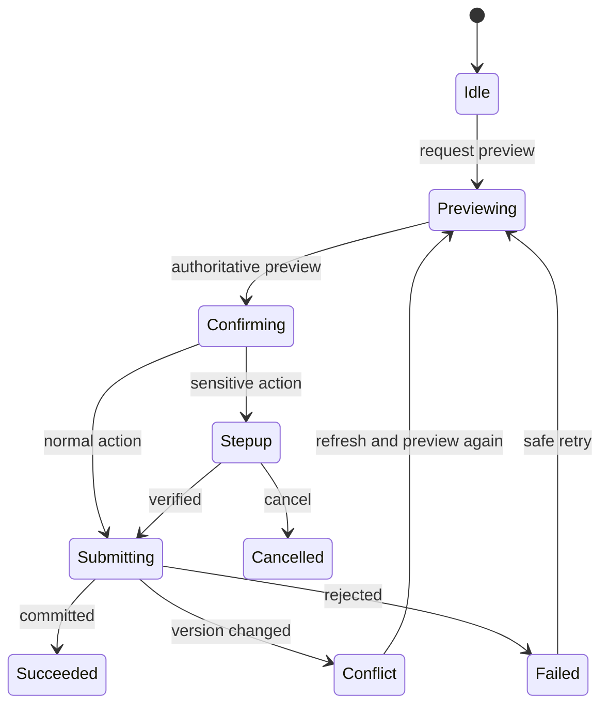
```mermaid
stateDiagram-v2
    [*] --> Idle
    Idle --> Previewing: request preview
    Previewing --> Confirming: authoritative preview
    Confirming --> Stepup: sensitive action
    Confirming --> Submitting: normal action
    Stepup --> Submitting: verified
    Stepup --> Cancelled: cancel
    Submitting --> Succeeded: committed
    Submitting --> Conflict: version changed
    Submitting --> Failed: rejected
    Conflict --> Previewing: refresh and preview again
    Failed --> Previewing: safe retry
```

每个页面必须具备：

- 首次加载 Skeleton 与真实布局同尺寸。
- 后台刷新保留旧数据并标明 Refreshing，不闪白。
- Ready、Empty、403、404、409、429、5xx、Offline、Stale 的独立文案和动作。
- 面板级 Error Boundary；驾驶舱和中控台单面板失败不拖垮整页。
- 错误显示可复制 requestId，不显示堆栈。
- Drawer 深链可分享，刷新后仍能恢复上下文。
- 筛选、排序和分页进入 URL；敏感条件除外。
- 表格支持键盘、选择、批量动作、Sticky Header、列偏好和大数据虚拟化。
- 导出超过同步阈值时自动转异步 Job。

### 9.2 经营驾驶舱

#### 产品职责

回答四个问题：

1. 现在经营得怎么样？
2. 和过去、目标、预算相比发生了什么？
3. 哪个商城、商品、分类、渠道或供应商造成变化？
4. 接下来最值得处理的经营问题是什么？

不展示 Operation 延迟、队列堆积、插件健康、权限配置和部署状态；这些属于中控台。

#### 页面结构

```text
经营驾驶舱
├─ 经营时间与 Scope
├─ 北极星指标
│  ├─ 净交易额
│  ├─ 已支付订单
│  ├─ 活跃购买会员
│  ├─ 退款率
│  └─ 毛利贡献
├─ 趋势与对比
│  ├─ 实时 昨日 近7日 近30日
│  ├─ 同比 环比 目标差
│  └─ 数据水位线
├─ 贡献拆解
│  ├─ 商城
│  ├─ 商品
│  ├─ 分类
│  ├─ 渠道
│  └─ 供应商
├─ 转化漏斗
│  ├─ 访问
│  ├─ 加购
│  ├─ 结算
│  ├─ 支付
│  └─ 完成
└─ 经营异常
   ├─ 交易骤降
   ├─ 退款异常
   ├─ 缺货损失
   └─ 低毛利与滞销
```

#### 指标口径

| 指标       | 公式                                   | 权威来源                            | 刷新         |
| ---------- | -------------------------------------- | ----------------------------------- | ------------ |
| GMV        | 成功支付时点的订单商品与运费总额       | Reporting Fact from PaymentCaptured | 近实时       |
| 净交易额   | GMV 减成功退款                         | Reporting Projection                | 近实时       |
| 已支付订单 | 首次进入 Paid 的订单数                 | Order Event Projection              | 近实时       |
| 客单价     | 净交易额除已支付订单                   | Reporting Projection                | 近实时       |
| 退款率     | 成功退款金额除 GMV                     | Payment and Reporting               | 近实时       |
| 毛利贡献   | 收入减采购、渠道、税费和已确认成本     | Finance Projection                  | T 加零或账期 |
| 缺货损失   | 有有效意图但因库存不足被拒绝的报价估值 | Checkout and Inventory Fact         | 近实时       |
| 数据新鲜度 | Projection Watermark 与当前时间差      | Reporting Watermark                 | 每次响应     |

禁止驾驶舱重新计算财务口径。所有卡片显示口径 Tooltip、截至时间和 Scope。

#### Read Model 与 Operation

- reporting.dashboard.read：页面总览与水位线。
- reporting.sales.read：趋势、同比、环比。
- reporting.products.read：商品贡献。
- reporting.malls.read：商城贡献。
- reporting.categories.read：分类贡献。
- reporting.channels.read：渠道贡献。
- reporting.voucherconsumption.read：卡券使用。
- reporting.exports.create 与 reporting.exports.read：异步导出。

Cockpit Controller 并行请求独立面板，每个请求有独立 AbortSignal、缓存键、超时和错误边界。UI 不可直接 Promise.all 调 SDK。

#### 关键交互

- 点击任意异常卡片，打开解释 Drawer，显示触发阈值、影响、贡献维度、数据水位线和下一步。
- 从贡献项可深链到商品管理或订单管理，并带只读筛选条件。
- 时间粒度切换不重置 Scope。
- 比较模式只能选择口径兼容的周期。
- 保存视图保存字段、排序和过滤，不保存数据副本。
- 所有 AI 解释明确标注依据，AI 只建议，不改数据。

#### 性能与验收

- 首屏壳不依赖数据，立即可见。
- Dashboard Query p95 不超过 300ms。
- 面板 Query p95 不超过 500ms。
- 水位线延迟 99% 不超过 30 秒。
- 同一筛选请求去重；切换 Scope 取消旧请求。
- 大图表点数按服务端降采样，浏览器不载入百万点。
- 任一面板 5xx 时其他面板继续可用。

### 9.3 智慧翼中控台

#### 产品职责

回答：

1. 系统现在处理得动吗？
2. 哪些任务、队列、Provider、权限或发布正在阻塞业务？
3. 哪个风险需要谁在什么时候处理？
4. 每个动作是否有证据、责任人和恢复路径？

不展示 GMV 趋势和商城排行作为核心内容。

#### 页面结构

```text
智慧翼中控台
├─ 系统效率
│  ├─ Operation 吞吐
│  ├─ 成功率
│  ├─ p95 与 p99
│  ├─ 错误预算
│  └─ 当前并发
├─ 处理能力
│  ├─ Queue Lag
│  ├─ Outbox Age
│  ├─ Deadletter
│  ├─ Provider Rate Limit
│  └─ Worker Lease
├─ 业务治理任务
│  ├─ 待分类
│  ├─ 待审核
│  ├─ 支付异常
│  ├─ 对账差异
│  ├─ 风险案件
│  └─ SLA 超时
├─ 组织与能力
│  ├─ Platform Distributor Enterprise Mall
│  ├─ Plan Capability Quota
│  └─ Membership Access Version
├─ 外部连接
│  ├─ Provider Health
│  ├─ Sync Cursor
│  ├─ Webhook Inbox
│  └─ Secret Rotation
└─ 审计与变更
   ├─ 最近高风险动作
   ├─ 发布版本
   ├─ 配置漂移
   └─ 恢复演练
```

#### Read Model 与 Operation

现有 Operation 可复用：

- runtime.health.live、ready、startup、dependency。
- organization.layers.read。
- access.center.read。
- capability.assignments.read。
- channel.connections.read、channel.syncruns.read、channel.operations.read。
- risk.center.read。
- support.cases.read。
- audit.records.read。

必须补充的受限 Query：

- runtime.operations.metrics.read。
- runtime.queues.read。
- runtime.outbox.summary.read。
- runtime.deadletters.read。
- runtime.deployments.read。
- runtime.configdrift.read。

这些 Query 只返回聚合、脱敏与授权数据，不能暴露内部 SQL、环境变量或 Secret。

#### 任务中心

任务中心统一不同域的待处理事项，但不接管其业务状态机：

```text
Task View
  taskId
  type
  ownerModule
  resourceType
  resourceId
  severity
  assignee
  dueAt
  reason
  deepLink
  state
  requestId
```

Task 是投影。点击后进入 Owner 模块的专业动作；中控台不直接拼装退款、对账或上下架命令。

#### 关键交互

- 健康状态采用 Green、Amber、Red 加文字，不使用装饰性火焰。
- 指标超阈值时展示当前值、基线、影响、最近变更和 Runbook。
- 重放 Deadletter 必须先显示 Event、消费者、尝试、错误、安全 Payload 摘要和预期副作用，再 Step-up。
- 组织变更通过树和详情 Drawer 完成，创建与移动都要求预览影响。
- Capability 变更显示下级受影响 Scope、配额和有效期。
- Provider 启用必须先 Contract Test、Health Check 和小流量验证。

#### 性能与验收

- 总览 Query p95 不超过 300ms。
- 实时运行指标通过 15 至 30 秒 Poll 或受控推送，不建立无界 WebSocket。
- Deadletter、Audit 和 SyncRun 使用 Cursor。
- 一个 Provider 失败不得阻塞其他 Provider 面板。
- 任务数字全部来自 Projection，禁止硬编码默认 1、3、10。

### 9.4 商品管理

#### 产品职责

5000 多个现有商品在 MVP 前就是核心商品。商品管理不争论“是不是测试商品”，而是提供统一事实、质量、价格、库存、商品池、商城投放和追责能力。

核心对象：

```text
Canonical Product
  └─ SKU
     ├─ Source Offer
     ├─ Cost and Price Quote
     ├─ Stock Item
     ├─ Pool Binding
     └─ Mall Listing
```

#### 页面结构

```text
商品管理
├─ 全局搜索
│  ├─ 标题
│  ├─ SKU
│  ├─ 条码
│  ├─ Provider Key
│  └─ 品牌
├─ 生命周期漏斗
│  ├─ 待接入
│  ├─ 待归一
│  ├─ 待分类
│  ├─ 待审核
│  ├─ 可投放
│  ├─ 已上架
│  └─ 异常或归档
├─ 质量与风险
│  ├─ 缺主图
│  ├─ 缺属性
│  ├─ 类目冲突
│  ├─ 价格倒挂
│  ├─ 库存异常
│  └─ Provider 漂移
├─ 商品主表
├─ 批量动作栏
└─ 商品详情 Drawer
   ├─ 基础信息
   ├─ SKU
   ├─ 来源与映射
   ├─ 成本和逐层定价
   ├─ 库存与预约
   ├─ 商品池
   ├─ 商城投放
   ├─ 变更 Diff
   └─ 审计
```

#### 状态机

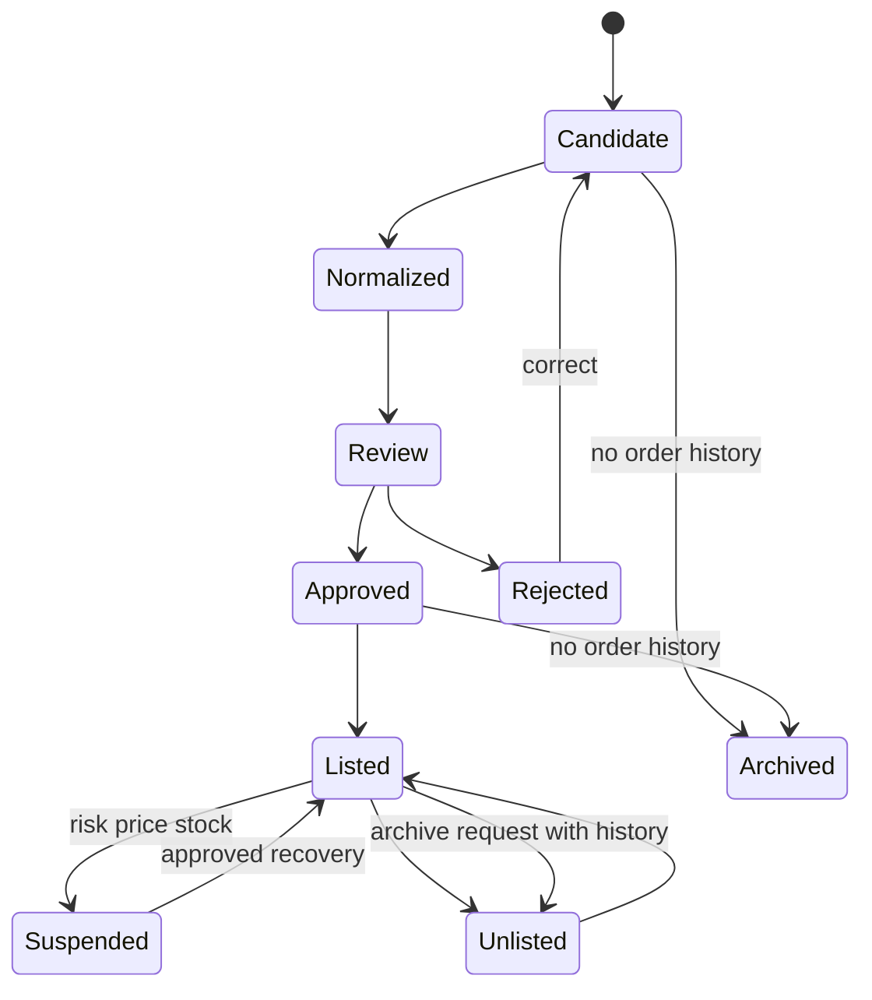
```mermaid
stateDiagram-v2
    [*] --> Candidate
    Candidate --> Normalized
    Normalized --> Review
    Review --> Approved
    Review --> Rejected
    Rejected --> Candidate: correct
    Approved --> Listed
    Listed --> Suspended: risk price stock
    Suspended --> Listed: approved recovery
    Listed --> Unlisted
    Unlisted --> Listed
    Candidate --> Archived: no order history
    Approved --> Archived: no order history
    Listed --> Unlisted: archive request with history
```

全局删除不变量：

- 产生过订单、券、核销、结算或审计引用的 Product、SKU、Offer、Listing 只能停用或归档，不能物理删除。
- 从未产生任何业务引用的候选数据可删除，但必须审计。
- Provider 删除不删除 Canonical Product，只结束 Mapping。

#### Operation

现有可复用：

- catalog.pools.read、attach、detach、allocate。
- catalog.products.create、update、archive。
- catalog.listings.read、publish、unpublish、batch。
- catalog.imports.create、read。
- pricing.rules.create、publish、offers.read。
- inventory.availability.read、imports.create、imports.read。

必须补齐：

- catalog.products.read：Canonical Product Cursor 列表。
- catalog.products.detail.read：Product、SKU、Mapping、质量摘要。
- catalog.products.history.read：变更与审核历史。
- catalog.products.preview：创建或修改的服务端 Diff 与风险预览。
- catalog.listings.detail.read：商城投放详情。
- catalog.listings.batchpreview：批量上下架的影响、冲突和预计数量。
- pricing.quotes.preview：逐层价格分解、舍入和毛利。
- inventory.movements.read：库存移动与 Reservation 证据。

#### 批量操作

批量动作必须走 Preview：

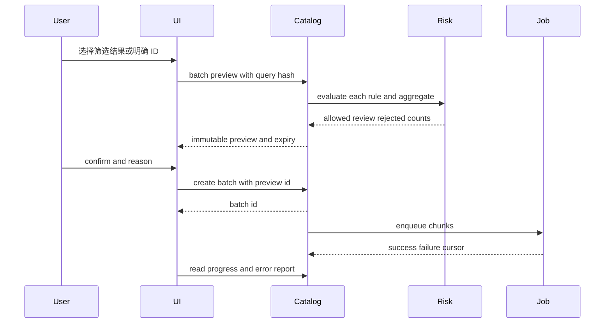
```mermaid
sequenceDiagram
    participant User
    participant UI
    participant Catalog
    participant Risk
    participant Job
    User->>UI: 选择筛选结果或明确 ID
    UI->>Catalog: batch preview with query hash
    Catalog->>Risk: evaluate each rule and aggregate
    Risk-->>Catalog: allowed review rejected counts
    Catalog-->>UI: immutable preview and expiry
    User->>UI: confirm and reason
    UI->>Catalog: create batch with preview id
    Catalog-->>UI: batch id
    Catalog->>Job: enqueue chunks
    Job-->>Catalog: success failure cursor
    UI->>Catalog: read progress and error report
```

选择“全部 5000 项”不能把所有 ID 放进浏览器；服务端保存 Filter Snapshot 与 Hash。失败报告逐行说明稳定错误码，可安全重试失败项。

#### 性能与验收

- 列表 Cursor 每页默认 50、最大 200。
- 搜索 p95 不超过 300ms；商品详情 p95 不超过 400ms。
- 5000 商品规模不要求浏览器全量载入。
- 表格使用虚拟化；图片延迟加载并固定尺寸防 CLS。
- 批量万级任务异步分片、可暂停、可恢复、可审计。
- 商品、价格、库存面板独立请求，Drawer 先显示主信息再按需加载。

### 9.5 订单管理

#### 产品职责

订单管理展示商业承诺的全生命周期，并把支付、履约、售后等独立状态并列，不压扁成一个含糊的 Order Status。

#### 正交状态

```text
Order State
Payment State
Fulfillment State
AfterSale State
Risk State
Finance State
```

例如“订单已取消但收到迟到支付”是合法异常组合，不能被一个字段覆盖。

#### 页面结构

```text
订单管理
├─ 生命周期与 SLA 摘要
├─ 异常队列
│  ├─ 待支付超时
│  ├─ 迟到支付
│  ├─ 待履约
│  ├─ 物流停滞
│  ├─ 售后待审
│  ├─ 退款异常
│  └─ Provider 状态不一致
├─ 筛选区
│  ├─ 订单号
│  ├─ 会员
│  ├─ 商城
│  ├─ 供应商
│  ├─ 商品
│  ├─ 时间
│  └─ 正交状态
├─ 订单主表
└─ 订单详情 Drawer
   ├─ 时间线
   ├─ 订单与行快照
   ├─ 支付和 Tender
   ├─ 库存预约
   ├─ 供应商子单
   ├─ 物流
   ├─ 售后与退款
   ├─ 财务引用
   ├─ 客服与风控
   └─ 审计证据
```

旧 Smart 的筛选、主表、详情 Drawer 和订单时间线是复用价值最高的交互，但 DTO、状态、动作和权限必须全部接 Operation API。

#### Operation

现有可复用：

- order.orders.read、create、export。
- order.reminders.create。
- order.aftersales.read、apply、approve、reject。
- fulfillment.shipments.create、tracking.read、returns.receive、returns.inspect。
- payment.refunds.request、payment.recoveries.read、resolve。

必须补齐：

- order.orders.detail.read：订单快照、行、子单和关联摘要。
- order.orders.timeline.read：按事件 Cursor 读取。
- order.orders.actions.read：服务端计算当前允许动作和原因。
- order.orders.cancelpreview：取消影响预览。
- order.aftersales.detail.read：售后证据。
- payment.refunds.preview：可退 Tender、金额、费用和后果。
- payment.recoveries.preview：重放或查单的预计副作用。
- fulfillment.shipments.preview：拆单、地址最小披露和 Provider 能力。

#### 订单状态机

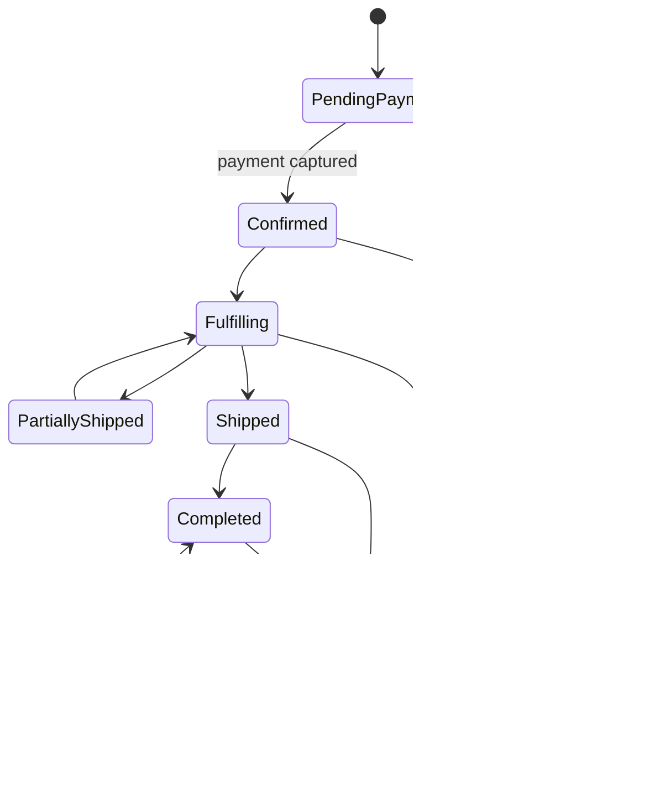
```mermaid
stateDiagram-v2
    [*] --> PendingPayment
    PendingPayment --> Confirmed: payment captured
    PendingPayment --> Cancelled: user or timeout
    Cancelled --> PaymentException: late payment
    PaymentException --> Refunded: auto refund
    Confirmed --> Fulfilling
    Fulfilling --> PartiallyShipped
    PartiallyShipped --> Fulfilling
    Fulfilling --> Shipped
    Shipped --> Completed
    Confirmed --> AfterSale
    Fulfilling --> AfterSale
    Shipped --> AfterSale
    Completed --> AfterSale: within policy
    AfterSale --> Completed: rejected or resolved
    AfterSale --> Refunded
```

动作规则：

- 运营人员不能直接把订单改为 Paid、Shipped、Refunded。
- 催单只是发送幂等提醒，不改变履约事实。
- 退款必须由 Payment 根据成功 Tender 计算；Order 只记录商业结果。
- 售后审批与退款执行分离。
- 地址和手机号默认脱敏；有明确履约权限时短期解密并审计。

#### 性能与验收

- 列表 p95 不超过 300ms，详情首段不超过 400ms。
- 时间线和子项按需加载，不返回无界 JSON。
- 同一订单命令串行，不同订单并行。
- 导出一律异步，下载短期有效。
- 409 时显示“数据已变化”，刷新服务端动作列表，绝不静默覆盖。

### 9.6 财务系统

#### 产品职责

财务系统不是金额大屏，而是证据驱动的控制平面。回答：

1. 账是否平？
2. 外部流水与内部账是否一致？
3. 哪些差异未解决，谁提交、谁复核？
4. 哪些结算可以锁定、支付、开票或关账？
5. 每一步能否重放、冲正和追责？

#### 页面结构

```text
财务系统
├─ 关账控制条
│  ├─ 当前账期
│  ├─ 数据水位
│  ├─ 未平差异
│  ├─ 未完成退款
│  └─ 是否允许关账
├─ 资金概览
│  ├─ 资产
│  ├─ 负债
│  ├─ 应收
│  ├─ 应付
│  └─ 冻结
├─ 对账漏斗
│  ├─ 外部流水
│  ├─ 自动匹配
│  ├─ 多候选
│  ├─ 缺失
│  └─ 已解决
├─ 工作队列
│  ├─ 差异
│  ├─ 结算审批
│  ├─ 提现
│  ├─ 发票
│  ├─ 支付恢复
│  └─ 历史回填
├─ 分录与账单
└─ 证据 Drawer
   ├─ 原始 Statement
   ├─ 匹配候选
   ├─ Journal 与 Entry
   ├─ 调整预览
   ├─ Maker Checker
   ├─ 附件
   └─ 审计链
```

#### 复式账本不变量

- 每个 Posted Journal 借贷平衡且币种一致。
- Journal 与 Entry 追加写，任何修正使用新 Journal 冲正。
- 账户余额由 Posted Entry 投影，不可直接改。
- 同一业务引用只产生一个语义效果。
- 退款总额不得超过成功支付。
- Settlement 只消费已对账且未被其他结算占用的 Item。
- 关账后禁止向已关闭期间回写；使用下一期调整。
- Maker 与 Checker 必须是不同自然人 Principal，不只比较账号字符串。

#### Operation

现有可复用：

- finance.overview.read、entries.read、statements.read、statements.export。
- finance.reconciliations.read、manage。
- finance.settlements.read、decide、adjust。
- finance.withdrawals.read、create、decide、recover。
- finance.holds.read。
- finance.periods.read、manage。
- finance.backfills.read、decide。
- finance.policies.manage。
- invoice.profiles.read、manage。
- invoice.requests.read、create、cancel、decide、red。

必须补齐：

- finance.reconciliations.detail.read。
- finance.reconciliations.preview：重匹配、调整、解决的权威预览。
- finance.journals.detail.read。
- finance.journals.adjustpreview。
- finance.settlements.detail.read。
- finance.settlements.preview。
- finance.withdrawals.preview。
- finance.periods.closepreview。
- invoice.requests.preview。

#### 当前财务 P0

在任何生产声明前修复：

1. ResolveDifference 不能只改状态；必须生成重匹配结果或平衡调整分录并双人复核。
2. Settlement Job 不得更新被 append-only 触发器禁止更新的 SettlementLine；改用新的 Adjustment 或 Version。
3. Failed Withdrawal 恢复时必须重新锁定并校验剩余额度，防止超额。
4. Finance Overview 只能汇总 Posted Journal，LEFT JOIN 条件不得让未过账 Entry 漏入。
5. ReconcileStatement 多候选不得静默选择第一条；必须进入 Ambiguous。
6. Statement 类型必须覆盖 fee、adjustment、fulfillment 等正式语义。

#### 高风险交互时序

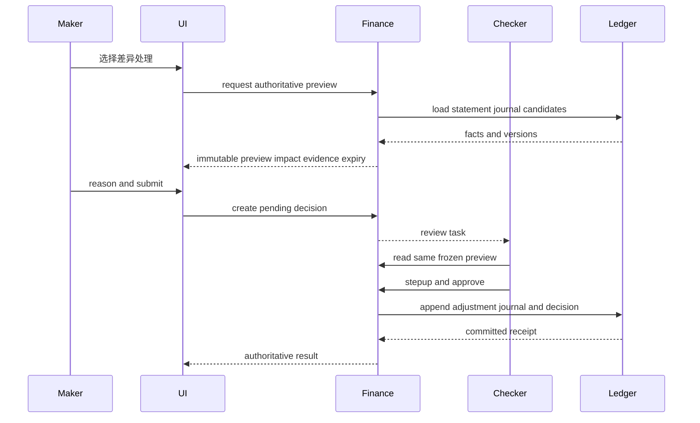
```mermaid
sequenceDiagram
    participant Maker
    participant UI
    participant Finance
    participant Checker
    participant Ledger
    Maker->>UI: 选择差异处理
    UI->>Finance: request authoritative preview
    Finance->>Ledger: load statement journal candidates
    Ledger-->>Finance: facts and versions
    Finance-->>UI: immutable preview impact evidence expiry
    Maker->>UI: reason and submit
    UI->>Finance: create pending decision
    Finance-->>Checker: review task
    Checker->>Finance: read same frozen preview
    Checker->>Finance: stepup and approve
    Finance->>Ledger: append adjustment journal and decision
    Ledger-->>Finance: committed receipt
    Finance-->>UI: authoritative result
```

#### 性能与验收

- 总览 p95 不超过 500ms；明细 p95 不超过 500ms。
- 对账和结算大批次异步运行，页面读取进度与水位线。
- 每个金额展示 currency、minor precision 和口径。
- 所有导出带 Scope 证据和生成时间，防 CSV Formula Injection。
- 关账演练验证差异不为零时必定拒绝。

---

## 10. 专业工作台与 Excel 全功能承接

五个主工作台不能自然承载全部 296 项需求。以下能力保持为独立专业工作台，通过 Sidebar 次级分组或主工作台 Deep Link 到达：

| 专业工作台 | 主要领域                                 | 入口关系                                                     |
| ---------- | ---------------------------------------- | ------------------------------------------------------------ |
| 商城应用   | Experience                               | 中控台显示发布状态，专业台编辑装修、模板、预览、发布和历史   |
| 卡券运营   | Voucher、Verification                    | 商品和订单显示关联，专业台管理卡号库、备券、发券、核销和冲正 |
| 福利与会员 | Benefit、Member、Qualification           | 驾驶舱看效果，专业台做计划、导入、分组、资格和发放           |
| 营销活动   | Marketing                                | 商品管理选择商品，专业台编排特惠、优惠、抽奖和预算           |
| 渠道连接   | Channel、Extension                       | 中控台看健康，专业台配置 Connection、Mapping、Sync 和 Replay |
| 供应商协同 | Partner、Catalog、Fulfillment、Finance   | 独立 Supplier 客户端为主，Console 做平台治理                 |
| 门店运营   | Partner、Verification、Order、Finance    | 独立 Store 客户端为主，Console 做平台治理                    |
| 客服工单   | Support、Notification                    | 中控台看任务和 SLA，专业台进行会话与工单                     |
| 风控中心   | Risk、Audit                              | 中控台看风险摘要，专业台管理策略、案件与回放                 |
| 组织权限   | Organization、Access、Capability         | 中控台摘要，专业台做角色、Scope、套餐和配额                  |
| 系统设置   | Identity、Notification、Extension、Audit | 站点、登录、短信、附件、白名单、插件和审计                   |

供应商和门店绝不通过隐藏菜单共享 Console 的 Platform Session；它们使用独立 target、Cookie、角色与客户端。

### 10.1 Excel 九表承接矩阵

| 工作表     | 主客户端            | 主工作台                         | 专业工作台                             | 数据 Owner                             |
| ---------- | ------------------- | -------------------------------- | -------------------------------------- | -------------------------------------- |
| 平台层     | Console             | 驾驶舱、中控台、商品、订单、财务 | 组织权限、卡券、渠道、客服、风控、设置 | 28 模块按所有权                        |
| 分销层     | Console             | 五主工作台的分销 Scope           | 组织权限、卡券、供应商治理             | 同上                                   |
| 集团       | Console             | 五主工作台的集团 Scope           | 商城应用、卡券、会员、客服、风控       | 同上                                   |
| 商城       | Console             | 五主工作台的商城 Scope           | 商城应用、营销、卡券、会员、设置       | 同上                                   |
| 门店后台   | Store               | 门店看板、商品、订单、财务       | 核销、员工、消息                       | Partner、Verification、Order、Finance  |
| 供应链后台 | Supplier            | 供货商品、订单、财务             | 发货、税率、公告、消息                 | Partner、Catalog、Fulfillment、Finance |
| 供应链平台 | Supplier 与 Console | 商品、订单、财务                 | 代理价、服务费、虚拟商品               | Pricing、Channel、Finance              |
| 接口       | Console 与 Jobs     | 中控台、商品、订单、财务         | 渠道连接                               | Channel、Extension                     |
| MVP        | 六客户端            | 由 Requirement 标签选择          | 不建立第二实现                         | 原 Owner                               |

### 10.2 需求冲突裁决

| 原始冲突                               | 统一规则                                                                    |
| -------------------------------------- | --------------------------------------------------------------------------- |
| 集团说卡券消费金额不需要，MVP 又需要   | 账务事实必须保留；页面是否展示由 Permission 和 Scope 决定                   |
| 集团说供应商管理不需要，设置又要求     | 集团可管理有效 Enrollment，不管理全局 Supplier Subject                      |
| 集团说组织机构不需要，系统又有员工角色 | 集团不改变平台层级，但可管理本集团 Department、Member 与 Role               |
| 财务配置又写只查看支付配置             | 平台配置，集团和商城按授权只读或提交申请                                    |
| 有订单商品删除                         | 全局统一为只下架或归档                                                      |
| 门店核销金额待核算                     | 由 Voucher、Pricing、Finance 共同定义不可变核销快照，未确认前不显示估算金额 |
| 粉类销售                               | 暂按分类销售处理，并保留 Requirement 决策记录                               |
| 分销 MVP 为空                          | 不能推定完成；用组织、Scope、五主工作台最小能力单独验收                     |

---

## 11. 外部 Provider 与即插即用扩展

### 11.1 能力接口

Provider 不实现一个巨型接口，而是声明小能力：

```text
CatalogSource
PriceSource
StockSource
RemoteOrderSubmitter
RemoteOrderCanceller
TrackingSource
RemoteAfterSale
RemoteRefundProvider
StatementSource
WebhookReceiver
HealthProbe
```

Manifest：

```text
ExtensionManifest
  id
  kind
  version
  apiVersion
  signature
  capabilities
  permissions
  configSchema
  secretRefs
  eventSubscriptions
  rateLimits
  timeout
  health
```

扩展不得获得通用数据库连接、shopapp 或 shopjob 凭据。它只能通过 ExtensionContext 调用声明的窄 Port。

### 11.2 11 个一期渠道验收矩阵

一期类别包括京东、京东生鲜、天猫超市、自有供应商、蛋糕、鲜花、图书、虚拟卡券或直充、食品提货券、电影、在线点餐。每个渠道必须单独填写：

| 能力        | 必填验收                                  |
| ----------- | ----------------------------------------- |
| Auth        | 沙箱与生产分离、SecretRef、轮换、最小权限 |
| Catalog     | 全量、增量、删除语义、游标、重复、脏数据  |
| Price       | 币种、税、舍入、生效时间、价格倒挂        |
| Stock       | 可售、同步延迟、负数、位置、限购          |
| Order       | 幂等提交、远端单号、部分成功、超时未知    |
| Cancel      | 可取消阶段、重复取消、失败恢复            |
| Fulfillment | 拆单、发货、物流、签收、退货              |
| AfterSale   | 申请、审批、退货、部分数量                |
| Refund      | 原路、部分退款、回调、主动查询            |
| Statement   | 账期、费用类型、重复流水、修订            |
| Webhook     | 签名、证书、时窗、Nonce、重放             |
| Limits      | QPS、并发、RetryAfter、日额度             |
| Health      | 合同探测、延迟、错误率、熔断              |
| Recovery    | Deadletter、人工重放、Runbook             |

H5 接入只能用于明确的前台跳转场景，不能代替商品、订单、退款和对账的后端事实接口。

### 11.3 Provider 同步时序

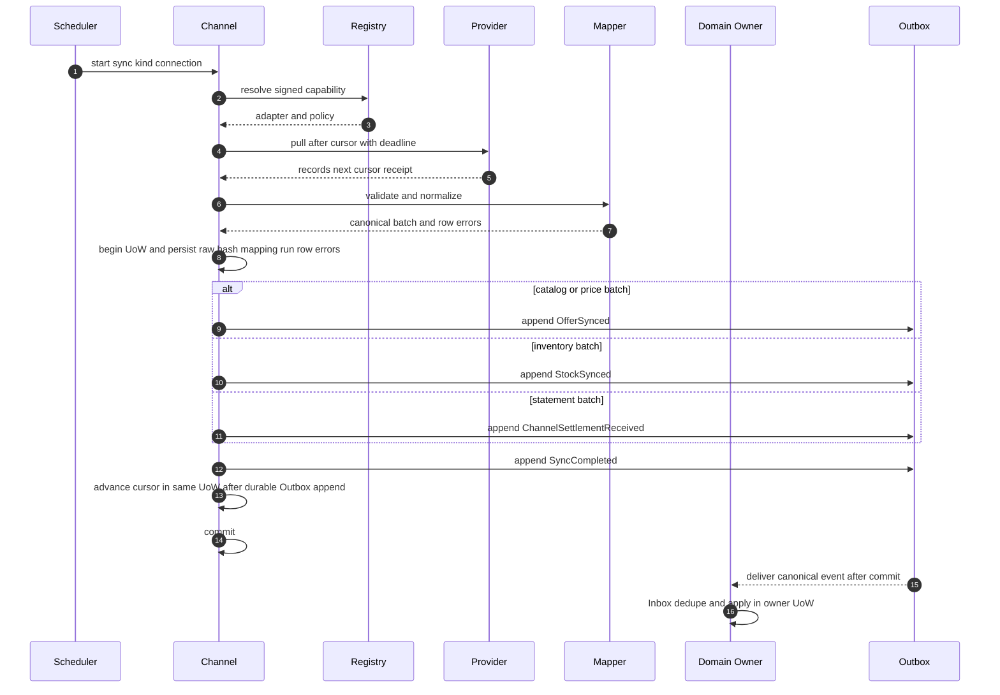
```mermaid
sequenceDiagram
    autonumber
    participant Scheduler
    participant Channel
    participant Registry
    participant Provider
    participant Mapper
    participant Owner as Domain Owner
    participant Outbox
    Scheduler->>Channel: start sync kind connection
    Channel->>Registry: resolve signed capability
    Registry-->>Channel: adapter and policy
    Channel->>Provider: pull after cursor with deadline
    Provider-->>Channel: records next cursor receipt
    Channel->>Mapper: validate and normalize
    Mapper-->>Channel: canonical batch and row errors
    Channel->>Channel: begin UoW and persist raw hash mapping run row errors
    alt catalog or price batch
        Channel->>Outbox: append OfferSynced
    else inventory batch
        Channel->>Outbox: append StockSynced
    else statement batch
        Channel->>Outbox: append ChannelSettlementReceived
    end
    Channel->>Outbox: append SyncCompleted
    Channel->>Channel: advance cursor in same UoW after durable Outbox append
    Channel->>Channel: commit
    Outbox-->>Owner: deliver canonical event after commit
    Owner->>Owner: Inbox dedupe and apply in owner UoW
```

Cursor只证明Channel已持久化原始证据、规范事件和下一游标，不等待下游Owner同步回执。Owner通过自己的Inbox重放、Deadletter和Projection Watermark证明应用结果，不能把异步Consumer的accepted count当作Channel事务返回值。429 遵循 RetryAfter；401 或签名失败立即打开熔断并告警；单行脏数据进入错误报告，不污染 Canonical Product。

---

## 12. 核心模块间调用时序

### 12.1 登录、验证码与恢复

验证码不能绕过。收不到验证码时，修复发送链并提供受控恢复方法：

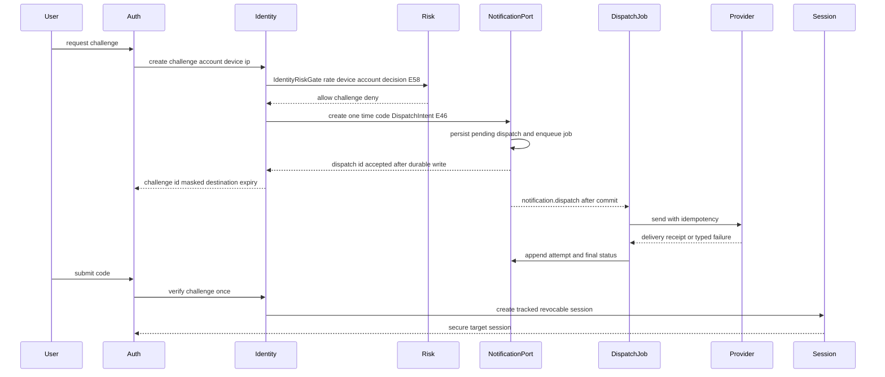
```mermaid
sequenceDiagram
    participant User
    participant Auth
    participant Identity
    participant Risk
    participant Notify as NotificationPort
    participant DispatchJob
    participant Provider
    participant Session
    User->>Auth: request challenge
    Auth->>Identity: create challenge account device ip
    Identity->>Risk: IdentityRiskGate rate device account decision E58
    Risk-->>Identity: allow challenge deny
    Identity->>Notify: create one time code DispatchIntent E46
    Notify->>Notify: persist pending dispatch and enqueue job
    Notify-->>Identity: dispatch id accepted after durable write
    Identity-->>Auth: challenge id masked destination expiry
    Notify-->>DispatchJob: notification.dispatch after commit
    DispatchJob->>Provider: send with idempotency
    Provider-->>DispatchJob: delivery receipt or typed failure
    DispatchJob->>Notify: append attempt and final status
    User->>Auth: submit code
    Auth->>Identity: verify challenge once
    Identity->>Session: create tracked revocable session
    Session-->>Auth: secure target session
```

允许的恢复方式：已登记 TOTP、WebAuthn、一次性备用码，或双人审批的管理员辅助恢复。任何方式都必须提升风险审计，不提供固定 OTP、万能密码或验证码绕过。

### 12.2 Console 启动与 Scope 切换

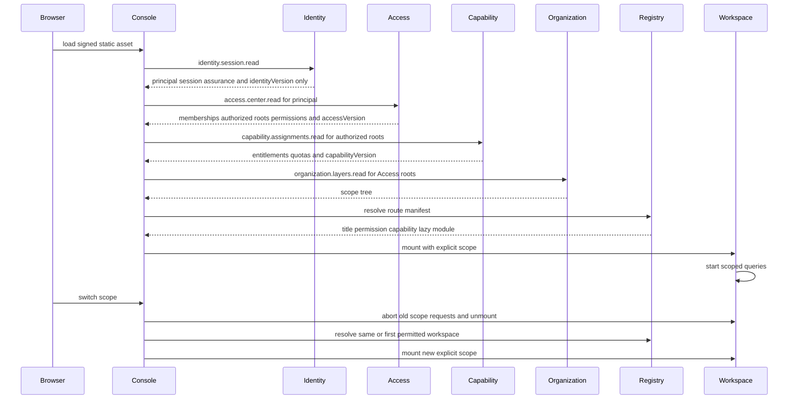
```mermaid
sequenceDiagram
    participant Browser
    participant Console
    participant Identity
    participant Access
    participant Capability
    participant Organization
    participant Registry
    participant Workspace
    Browser->>Console: load signed static asset
    Console->>Identity: identity.session.read
    Identity-->>Console: principal session assurance and identityVersion only
    Console->>Access: access.center.read for principal
    Access-->>Console: memberships authorized roots permissions and accessVersion
    Console->>Capability: capability.assignments.read for authorized roots
    Capability-->>Console: entitlements quotas and capabilityVersion
    Console->>Organization: organization.layers.read for Access roots
    Organization-->>Console: scope tree
    Console->>Registry: resolve route manifest
    Registry-->>Console: title permission capability lazy module
    Console->>Workspace: mount with explicit scope
    Workspace->>Workspace: start scoped queries
    Browser->>Console: switch scope
    Console->>Workspace: abort old scope requests and unmount
    Console->>Registry: resolve same or first permitted workspace
    Console->>Workspace: mount new explicit scope
```

删除 configureAdminBff 全局可变配置。Scope 是不可变调用参数，不是进程全局状态。

### 12.3 创建优业、喜悦会、鸿泰集团与两个商城

```mermaid
sequenceDiagram
    participant Owner
    participant Organization
    participant Access
    participant Capability
    participant Audit
    Owner->>Organization: preview create Distributor 优业 and 喜悦会
    Organization-->>Owner: codes conflicts tenant impact
    Owner->>Organization: create with idempotency
    Organization->>Audit: append creation evidence
    Owner->>Organization: create hidden Tenant under 优业
    Owner->>Organization: create Enterprise 鸿泰集团
    Owner->>Capability: assign approved package and quota
    Owner->>Access: bind initial administrator
    Owner->>Organization: create Mall 鸿泰惠民通
    Owner->>Organization: create Mall 鸿泰甄选
    Organization->>Audit: append full hierarchy evidence
    Organization-->>Owner: authoritative tree and versions
```

创建命令必须有唯一 code、displayName、parentVersion、timezone、ownerMembership、packageVersion 和 idempotencyKey。任一步失败不会留下无管理员的活动商城。

### 12.4 商品接入、治理、定价和投放

```mermaid
sequenceDiagram
    participant ChannelOutbox
    participant CatalogInbox
    participant Catalog
    participant Review
    participant CatalogOutbox
    participant PricingInbox
    participant Pricing
    participant InventoryInbox
    participant Inventory
    participant Risk
    participant ExperienceInbox
    participant Experience
    ChannelOutbox-->>CatalogInbox: OfferSynced E26
    CatalogInbox->>Catalog: Inbox dedupe canonical source offer
    Catalog->>Catalog: normalize match deduplicate
    Catalog->>Review: changed field review
    Review-->>Catalog: approved version
    Catalog->>Risk: CatalogRiskGate listing policy E59
    Risk-->>Catalog: allow review deny
    Catalog->>CatalogOutbox: persist immutable Listing and ListingPublished in one UoW
    CatalogOutbox-->>PricingInbox: ListingPublished E08
    PricingInbox->>Pricing: build offer and price readiness via CatalogPricingPort
    CatalogOutbox-->>InventoryInbox: ListingPublished E09
    InventoryInbox->>Inventory: create sku stock identity via CatalogSkuPort
    ChannelOutbox-->>InventoryInbox: StockSynced E27
    InventoryInbox->>Inventory: apply provider stock observation idempotently
    CatalogOutbox-->>ExperienceInbox: ListingPublished
    ExperienceInbox->>Experience: invalidate draft and gate public head on price stock readiness
```

Catalog不得同步调用Pricing或Inventory写入，也不推进Channel Cursor。Channel在自己的UoW推进Cursor并发布OfferSynced/StockSynced；Catalog、Pricing、Inventory、Experience各用独立Inbox推进自己的事实。Listing元数据可以先发布，但Experience/public reader在Price/Stock Readiness缺失时Fail-closed，不展示“有商品无有效价/库存”的伪可售状态。

E09的目标Consumer必须显式落在`services/commerce/src/modules/inventory/application/consumer/ListingPublishedInboxHandler.ts`。Handler先以`eventId+listingId+listingVersion`领取Inventory Inbox，使用公开`CatalogSkuPort`读取最小SKU身份，在同一Inventory UoW create-if-absent建立StockItem/Availability骨架并写Inbox Applied；它不读Catalog表、不初始化伪库存、不推进Channel Cursor。`InventoryModule.ts`的Manifest以`eventId=catalog.listing.published`注册该Handler，缺注册、重复注册或转入通配Consumer均失败。精确测试恰好分三层：module-local `services/commerce/src/modules/inventory/application/consumer/ListingPublishedInboxHandler.test.ts`只验Handler分支、未知SKU与乱序旧version；`services/commerce/tests/message/inventory/ListingPublishedInboxHandler.test.ts`在真Inbox/UoW验重投、事务回滚、Crash-after-effect-before-receipt与Replay零额外效果；`tests/contract/edge/E09.contract.test.ts`只验Event/`CatalogSkuPort` Schema、Publisher/Consumer和边序，并证明Experience在Availability未就绪时fail-closed。三份测试的`testPurpose`必须唯一且禁止复制同一断言集，缺任一层都视为E09断链。

### 12.5 Checkout 并行预览

```mermaid
sequenceDiagram
    participant User
    participant Checkout
    participant Cart
    participant Member
    participant Qualification
    participant Pricing
    participant Marketing
    participant Voucher
    participant Benefit
    participant Inventory
    User->>Checkout: selected items address tender
    Checkout->>Cart: canonical cart
    par independent bounded reads
        Checkout->>Member: AddressReadPort scoped snapshot E60
        Checkout->>Qualification: evaluate versioned rules
        Checkout->>Pricing: quote price tax shipping
        Checkout->>Marketing: quote promotions
        Checkout->>Voucher: preview applicable vouchers
        Checkout->>Benefit: preview balance and policy
        Checkout->>Inventory: display availability
    end
    Checkout->>Checkout: compose sign persist expiring quote
    Checkout-->>User: authoritative totals rejections versions expiry
```

并行只用于独立读，设置统一 Deadline 和 AbortSignal。任何关键子结果缺失不返回伪完整 Quote。

### 12.6 原子下单

PlaceOrder 从 Order 移到 Checkout 的 PurchaseProcess，保留当前正确的锁顺序与原子骨架：

```mermaid
sequenceDiagram
    autonumber
    participant Client
    participant Checkout as PurchaseProcess
    participant Idem
    participant Cart
    participant Qual
    participant Price
    participant Stock
    participant Voucher
    participant Benefit
    participant Marketing
    participant Order
    participant Payment
    participant Tx as TransactionContext
    participant Outbox
    Client->>Checkout: confirm quote and idempotency key
    Checkout->>Tx: begin shared transaction
    Checkout->>Idem: claim key and hash
    Checkout->>Cart: lock selected cart
    Checkout->>Qual: revalidate through Port
    Checkout->>Price: validate quote versions
    Checkout->>Stock: reserve sorted sku ids
    Checkout->>Voucher: hold sorted voucher ids
    Checkout->>Benefit: hold sorted accounts
    Checkout->>Marketing: reserve campaign budget
    Checkout->>Order: create immutable order snapshots
    Checkout->>Payment: create intent and tender plan
    Checkout->>Cart: mark selected items converted
    Stock->>Outbox: append StockReserved as Inventory owner
    Order->>Outbox: append OrderPlaced as Order owner
    Cart->>Outbox: append CartChanged as Cart owner
    Checkout->>Outbox: append QuoteConfirmed as Checkout owner
    Checkout->>Idem: save response
    Checkout->>Tx: commit aggregate changes owner events and audit cause
    Checkout-->>Client: order receipt and payment action
```

以上调用共享TransactionContext，但调用者只能看到公开Port，不能读取目标表。Outbox由各Owner聚合或Handler产生，TransactionContext统一收集并提交；Checkout不得代发OrderPlaced、StockReserved或CartChanged。

### 12.7 支付、迟到支付与退款

```mermaid
sequenceDiagram
    participant Client
    participant Payment
    participant JobQueue
    participant SubmitJob as ProviderSubmitJobHandler
    participant Provider
    participant ProviderInbox
    participant Order
    participant Benefit
    participant Voucher
    participant Inventory
    participant Marketing
    participant ReportingInbox
    participant OrderTimeline
    participant Fulfillment
    participant FulfillmentInbox
    participant PaymentOutbox
    participant RecoveryJob as RefundRecoveryJobHandler
    participant FinalizeRefund as FinalizeRefundLegHandler
    participant FinanceInbox
    participant Finance
    Client->>Payment: create or continue payment
    Payment->>Payment: persist pending attempt and enqueue payment.provider.submit in one UoW
    Payment-->>Client: pending action attempt id and poll or SSE location
    JobQueue->>SubmitJob: claim prepared attempt after commit
    SubmitJob->>Provider: create prepay with provider idempotency key
    Provider-->>SubmitJob: token failure or unknown
    SubmitJob->>Payment: FinalizeAttempt command once
    Payment-->>Client: poll or SSE yields ready failed or recovery
    Provider->>ProviderInbox: signed webhook
    ProviderInbox->>ProviderInbox: verify decrypt merchant app amount nonce
    ProviderInbox-->>Provider: accepted after durable write
    ProviderInbox->>Payment: idempotent provider observation
    alt order payable and every required owner commit succeeds
        Payment->>Order: confirm capture through PaymentOrderPort
        Payment->>Inventory: commit reservation through InventoryReservationPort
        Payment->>Voucher: capture held voucher through VoucherTenderPort
        Payment->>Benefit: capture held benefit through BenefitTenderPort
        Payment->>Marketing: commit budget through PromotionReservationPort
        Payment->>PaymentOutbox: append PaymentCaptured in same UoW
        PaymentOutbox-->>FinanceInbox: deliver after commit
        FinanceInbox->>Finance: post balanced journal idempotently
        PaymentOutbox-->>FulfillmentInbox: deliver after commit
        FulfillmentInbox->>Fulfillment: start fulfillment idempotently
    else order cancelled expired or any required owner commit fails after authoritative capture
        Payment->>Payment: rollback shared owner transaction and open late capture recovery
        Payment->>PaymentOutbox: append LatePaymentRecoveryOpened with captured observation
        PaymentOutbox-->>FinanceInbox: deliver after commit
        FinanceInbox->>Finance: post suspense journal idempotently
        PaymentOutbox-->>RecoveryJob: enqueue once by recovery id
        RecoveryJob->>Provider: query then auto refund by leg key
    end
    Client->>Payment: refund request
    Payment->>Payment: validate cumulative refundable amount and create RefundLegs
    par internal benefit leg
        Payment->>Benefit: restore through BenefitTenderPort with leg key
        Benefit-->>Payment: BenefitRestored receipt or typed failure
    and internal voucher leg
        Payment->>Voucher: reverse through VoucherTenderPort with leg key
        Voucher-->>Payment: VoucherReversed receipt or typed failure
    and external provider legs
        Payment->>JobQueue: enqueue payment.refund.recover action submitOrRecover in same UoW
        JobQueue->>RecoveryJob: claim committed Pending leg by leg key
        RecoveryJob->>Provider: submit refund outside transaction with provider idempotency key
        Provider->>ProviderInbox: refund observations
        ProviderInbox->>FinalizeRefund: finalize each external leg once
    end
    Payment->>Payment: aggregate leg states and amounts
    alt every required leg terminal success for requested amount
        Payment->>PaymentOutbox: append PaymentRefunded with immutable leg snapshot
        PaymentOutbox-->>FinanceInbox: deliver after commit
        FinanceInbox->>Finance: post reversal journal idempotently
        PaymentOutbox-->>ReportingInbox: deliver after commit
        ReportingInbox->>OrderTimeline: project refund outcome idempotently
    else any leg unknown or retryable
        Payment->>PaymentOutbox: append RefundRecoveryOpened only
        PaymentOutbox-->>JobQueue: upsert same payment.refund.recover key
        JobQueue->>RecoveryJob: claim Unknown or Retryable leg
        RecoveryJob->>Provider: query first, then retry only when proven absent and policy permits
        RecoveryJob->>FinalizeRefund: persist observation and next terminal or scheduled state
    end
```

`RequestRefundHandler`在保存Refund/RefundLeg的同一UoW为每个外部Pending腿写`payment.refund.recover`，payload固定含`action=submitOrRecover`、refundLegId、provider、semanticKey和attemptVersion；HTTP与Inbox Handler不得直接调用Provider。`RefundRecoveryJobHandler`是外部退款初次提交、Unknown查单和Retryable重试的唯一外调点：Pending可按Provider幂等键首次提交，Unknown必须先查单，Retryable遵守Backoff且仅在确认无成功事实后重试；所有结果只经`FinalizeRefundLegHandler`推进。`PaymentRefunded`表示本次已批准退款金额的全部必需RefundLeg都到达成功终态，并携带原Tender、Leg Amount、Provider/Benefit/Voucher Receipt与累计退款快照；部分金额退款可以完成，但“部分Leg尚未完成”不能发布最终事件。`LatePaymentRecoveryOpened`只表示Provider已权威入账、但订单不可捕获或任一必需Owner提交失败，Finance据此暂记；`RefundRecoveryOpened`只表示既有退款腿Unknown/Retryable，不产生新资金事实，只有Payment Recovery Job消费，Finance不得订阅。Benefit与Voucher各自在自己的UoW发布`BenefitRestored`与`VoucherReversed`，Payment只汇总Receipt，不跨Owner写账。

售后退款按`returnRequired`分流：免退货售后的`AfterSaleApproved`可直接授权Payment创建Refund；需退货售后只创建Return并等待Fulfillment发布`ReturnInspected`。该事件必须携带afterSaleId、orderLineId、inspectionVersion、acceptedQty、rejectedQty、restockableQty、authorizedRefundMoney、evidenceHash和semanticKey。Payment Inbox只按`authorizedRefundMoney`创建退款腿，Inventory Inbox只按`restockableQty`回补，两个Consumer分别使用E50/E51并证明Duplicate、OutOfOrder、Replay效果为零。审核通过不等于质检通过，更不等于退款完成。

Accounting Leg的唯一记账来源固定如下；事件可以携带全量Tender Snapshot用于对账，但Finance PostingPolicy只能处理`accountingOwnerEventId`等于本行的腿。唯一键为`economicLegId + accountingOwnerEventId + sourceAggregateVersion`，同一Economic Leg被第二个Owner事件申报时必须Deadletter并告警，不能“按金额看起来一样”而重复入账。

| Economic Leg              | 捕获/增加唯一记账事件                          | 退款/恢复唯一记账事件                 | Payment聚合中的用途                                           |
| ------------------------- | ---------------------------------------------- | ------------------------------------- | ------------------------------------------------------------- |
| 外部现金或Provider Tender | `PaymentCaptured`                              | `PaymentRefunded`                     | 保存Provider Receipt、累计捕获/退款和全量Tender Snapshot      |
| Voucher负债腿             | `VoucherRedeemed`；发行负债另由`VoucherIssued` | `VoucherReversed`                     | 只保存Voucher Receipt并等待RefundLeg终态，不重复记Voucher金额 |
| Benefit负债腿             | `BenefitDebited`；授予负债另由`BenefitGranted` | `BenefitRestored`                     | 只保存Benefit Receipt并等待RefundLeg终态，不重复记Benefit金额 |
| 迟到外部入账              | `LatePaymentRecoveryOpened`                    | 后续外部退款仍由最终`PaymentRefunded` | 先入Suspense并绑定Recovery ID；不得触发Fulfillment            |
| 退款Unknown/Retryable     | 无                                             | `RefundRecoveryOpened`不记账          | 仅驱动查单、重试或人工修复                                    |

迟到款的最终退款必须把`recoveryId`、`suspenseJournalId`和`recoveryKind=latecapture`带入对应外部RefundLeg与最终`PaymentRefunded`。Finance PostingPolicy遇到该Kind时只冲销原Suspense Journal，不生成“正常销售收入再退款”两套分录；普通退款则必须`recoveryId=null`并引用原Capture Journal。强制不变量为：每个迟到Recovery的Suspense余额最终为零或处于有Owner/Deadline的Open状态、收入不重复、退款不重复、原Journal引用连续，Crash/Replay后结果不变。

### 12.8 履约与外部未知状态

```mermaid
sequenceDiagram
    participant Event as PaymentCaptured
    participant Fulfillment
    participant Channel
    participant Provider
    participant FulfillmentOutbox
    participant SupportInbox
    participant Support
    Event->>Fulfillment: idempotent consume
    Fulfillment->>Fulfillment: split supplier location method
    Fulfillment->>Channel: submit canonical remote order
    Channel->>Provider: submit with idempotency and deadline
    alt receipt
        Provider-->>Channel: remote order id
        Channel-->>Fulfillment: accepted
    else timeout unknown
        Channel-->>Fulfillment: unknown
        Fulfillment->>Fulfillment: schedule query not duplicate submit
    else definitive reject
        Channel-->>Fulfillment: rejected
        Fulfillment->>FulfillmentOutbox: append FulfillmentFailed
        FulfillmentOutbox-->>SupportInbox: deliver after commit
        SupportInbox->>Support: open task with evidence idempotently
    end
```

OrderExpiryJob只提交`ExpireOrder`命令；Order将其归一为带`reason=expired`的`OrderCancelled`，不创建第二个`OrderExpired`别名。Inventory、Benefit、Voucher、Payment和Marketing分别通过E52—E56的独立Inbox释放Reservation/Hold或关闭Attempt；Checkout/PurchaseProcess不消费该事件，也不代替Owner补偿。退货到仓后，Fulfillment质检聚合在同一UoW发布`ReturnInspected`，由Payment与Inventory通过E50/E51各自推进退款与回补。

### 12.9 卡券与门店核销

```mermaid
sequenceDiagram
    participant Admin
    participant Voucher
    participant VoucherOutbox
    participant FinanceInbox
    participant Finance
    participant Store
    participant Verification
    Admin->>Voucher: approved reserve and issue
    Voucher->>Voucher: lock encrypted card pool in stable order
    Voucher->>VoucherOutbox: append VoucherIssued in same UoW
    VoucherOutbox-->>FinanceInbox: deliver after commit
    FinanceInbox->>Finance: post liability journal idempotently
    Voucher-->>Admin: batch receipt
    Store->>Verification: device clerk dynamic code item amount
    Verification->>Verification: consume challenge once
    Verification->>Voucher: redeem eligible voucher
    Voucher->>VoucherOutbox: append VoucherRedeemed in same UoW
    VoucherOutbox-->>FinanceInbox: deliver after commit
    FinanceInbox->>Finance: post redemption journal idempotently
    Voucher-->>Verification: receipt
    Verification-->>Store: safe result and amount source
```

### 12.10 对账、结算、开票与关账

```mermaid
sequenceDiagram
    participant Provider
    participant Channel
    participant ChannelOutbox
    participant FinanceInbox
    participant Finance
    participant Reconcile
    participant Maker
    participant Checker
    participant Settlement
    participant Invoice
    Provider->>Channel: statement batch
    Channel->>Channel: persist normalized statement and cursor
    Channel->>ChannelOutbox: append ChannelSettlementReceived in same UoW
    ChannelOutbox-->>FinanceInbox: deliver after commit
    FinanceInbox->>Finance: ingest immutable statement snapshot idempotently
    Finance->>Reconcile: match immutable journal facts
    Reconcile-->>Maker: exact ambiguous missing extra
    Maker->>Reconcile: submit evidence based resolution
    Checker->>Reconcile: approve as different principal
    Reconcile->>Finance: append adjustment if required
    Finance->>Settlement: select reconciled unlocked items
    Checker->>Settlement: approve frozen settlement
    Settlement->>Invoice: eligible invoice basis
    Invoice-->>Finance: issued or red invoice event
    Finance->>Finance: close period only when all gates zero
```

### 12.11 报表投影与驾驶舱

```mermaid
sequenceDiagram
    participant Outbox
    participant Inbox
    participant Projector
    participant Fact
    participant Projection
    participant Watermark
    participant Cache
    participant Cockpit
    Outbox->>Inbox: versioned event
    Inbox->>Projector: exactly once effect by consumer event
    Projector->>Watermark: reject aggregate version regression
    Projector->>Fact: append normalized fact
    Projector->>Projection: update scoped aggregate
    Projector->>Watermark: advance
    Projector->>Cache: invalidate versioned keys
    Cockpit->>Projection: query scope period dimensions
    Projection-->>Cockpit: metrics and watermark
```

### 12.12 商城装修发布

```mermaid
sequenceDiagram
    participant Operator
    participant Experience
    participant Catalog
    participant Object
    participant CDN
    participant Head
    Operator->>Experience: save draft with expected version
    Operator->>Experience: validate
    Experience->>Catalog: verify visible listings and links
    Experience-->>Operator: report
    Operator->>Experience: publish validated version
    Experience->>Experience: create immutable snapshot
    Experience->>Object: stage manifest and assets
    Object-->>Experience: integrity receipt
    Experience->>CDN: warm
    CDN-->>Experience: ready
    Experience->>Head: atomic switch
    Experience-->>Operator: publication receipt
```

---

## 13. 每个领域模块内部数据流时序

以下 28 张图是模块内部标准主路径。共同规则：

- Controller 只解析合同与进入 Pipeline。
- Handler 不拼接跨 Schema SQL。
- Repository 只访问本模块拥有的 Schema。
- 同步依赖通过公开 Port，并共享显式 TransactionContext。
- 聚合写、幂等、Audit 和 Outbox 在同一 UnitOfWork。
- 外部调用只能在提交前只读预检或提交后异步执行。
- 失败返回合同声明的稳定错误，不通过 Error Message 猜测。

### 13.0 全数据流登记

后续 28 张时序图各展示一个代表性主命令路径；下面的登记表补齐查询、事件消费、Job、缓存/投影、失败与补偿，二者合在一起才构成模块内部数据流设计。生产完成仍须由 Module Manifest、Ownership Catalog、Contract Catalog 和测试证据自动生成同结构清单；人工表不能替代运行证据。

#### 13.0.1 入口、所有权与同步事务

| 模块          | 全部入口类别                                                | Owned Aggregate / Table Group                                     | 同步读写、UoW 与核心不变量                                                          |
| ------------- | ----------------------------------------------------------- | ----------------------------------------------------------------- | ----------------------------------------------------------------------------------- |
| Identity      | 注册、登录、挑战、找回、改密、Step-up、会话查询/撤销        | Identity、Credential、Session、Challenge                          | Credential 校验与 Session/Challenge 写同 UoW；Principal 唯一、Challenge 单次消费    |
| Organization  | 创建、移动、停启、管理员锚点、树与祖先查询                  | Platform、Distributor、Tenant、Enterprise、Mall、Closure          | 锁移动节点与父链；禁止环、跨租户父子和失联安全锚点                                  |
| Access        | Membership、Role、Grant、Deny、Decision、解释               | Membership、Role、Grant、Deny、AccessVersion                      | 变更与 AccessVersion 同 UoW；Deny 优先、Scope 交集、默认拒绝                        |
| Capability    | Plan、Package、Assignment、Quota 配置、消费与查询           | Plan、Package、Assignment、QuotaCounter                           | 版本化分配与原子计数；Capability 不等于菜单可见                                     |
| Partner       | Supplier、Brand、Store 入驻、协议、授权与停启               | Supplier、Brand、Store、Agreement                                 | 协议版本和主体状态同 UoW；Store 归属稳定，历史协议不物理删除                        |
| Member        | 档案、分组、等级、导入、身份绑定与查询                      | MemberProfile、Group、Level、ImportBatch、ImportRow               | PII 加密；批次分块独立 UoW；IdentityId 与租户档案保持显式映射                       |
| Qualification | Policy 草稿/发布、资格判断、限购计数、解释                  | Policy、PolicyVersion、Decision、Counter                          | 使用发布版本；计数 CAS 或行锁；Decision 保存输入摘要与解释                          |
| Catalog       | Product、Sku、SourceOffer、Listing、Pool、类目、投放与查询  | Product、Sku、SourceOffer、Listing、Pool、Category                | 发布生成不可变快照；来源映射唯一；有订单引用的商品不可物理删除                      |
| Pricing       | RuleSet、报价、毛利复核、税与舍入、版本查询                 | RuleSet、RuleVersion、Quote、MarginReview                         | Money 整数分；规则版本、输入快照和 Quote 同 UoW；禁止前端算最终价                   |
| Inventory     | 调整、预占、提交、释放、可售查询                            | StockItem、Reservation、Movement                                  | 固定锁序；available = onhand - reserved；同 Reservation 只提交或释放一次            |
| Experience    | Draft、校验、预览、发布、回滚、Head 查询                    | Draft、AssetManifest、Snapshot、PublishedHead                     | Snapshot 不可变；Head 用 CAS 原子切换；资产 Hash 与页面引用一致                     |
| Marketing     | Campaign、Audience、Budget、促销预览、启停、抽奖            | Campaign、Audience、Budget、PromotionQuote、DrawReceipt           | 预算原子占用；叠加顺序版本化；随机结果可复验                                        |
| Cart          | 购物车读取、增删改、选择、合并、清空                        | Cart、CartItem                                                    | CartVersion 乐观锁；只保存意图，不锁价、不锁库存                                    |
| Checkout      | Preview、Confirm、读取 Quote、失效                          | CheckoutQuote、TenderPreview、ReservationReference                | 并行读取后服务端归并；确认时验证版本与时效；Quote 快照不可改                        |
| Order         | 创建、读取、取消、超时、售后申请/决策、时间线               | Order、Suborder、OrderLine、OrderSnapshot、AfterSale              | 固定锁序；商业承诺快照不可漂移；Order 状态不吞并 Payment/Fulfillment 状态           |
| Fulfillment   | 创建履约单、接单、发货、轨迹、签收、退货、异常              | FulfillmentOrder、Shipment、Package、Tracking、Return             | 外部状态按 ProviderVersion 单调推进；重复回调无第二业务效果                         |
| Verification  | 动态码签发、验证、核销、撤销、设备绑定与收据查询            | Challenge、Device、VerificationReceipt                            | Challenge 原子单次消费；设备、门店、Scope 与目标权益全部匹配                        |
| Payment       | Intent、Attempt、回调、查单、退款、撤销、状态查询           | PaymentIntent、Attempt、Tender、Refund、ProviderObservation       | Runtime Inbox Receipt与业务Observation同UoW；退款累计不超实付；Unknown 不盲重试扣款 |
| Voucher       | Program、卡池导入、备券、发券、绑定、核销、冲正、过期       | Program、CardPool、Voucher、Reservation、Redemption               | 卡密加密；状态 CAS；同 Voucher 只成功核销一次；冲正引用原收据                       |
| Benefit       | Plan、预算、批量发放、冻结、扣减、回补、过期、余额查询      | Plan、Budget、Grant、BenefitLedger                                | Ledger 只追加；余额由流水归集；批次子项幂等，恢复前重验额度                         |
| Finance       | Account、分录、对账、差异、结算、提现、发票、关账与查询     | Account、Journal、Reconciliation、Settlement、Withdrawal、Invoice | 借贷必平；行只追加；Maker 与 Checker 不同；关账差异为零                             |
| Channel       | Connection、Mapping、同步、Webhook、重放、Cursor、健康      | Connection、Mapping、SyncRun、WebhookObservation、Cursor          | Runtime Inbox Receipt、业务Observation、Cursor和Owner Outbox同UoW；外部标识映射唯一 |
| Support       | Conversation、Ticket、Assignment、SLA、升级、只读业务上下文 | Conversation、Ticket、Assignment、SlaClock                        | TicketVersion 乐观锁；只保存最小 PII；客服动作不能直改资金事实                      |
| Notification  | Template、Preference、Dispatch、Attempt、回执与查询         | Template、Preference、Dispatch、Attempt                           | businessEvent + recipient + channel 幂等；偏好、强制通知和退订规则同版本            |
| Reporting     | Event 消费、Projection 重建、Metric 查询、Export            | Fact、Projection、Metric、Checkpoint、Export                      | Inbox、Projection 与 Checkpoint 同 UoW；Watermark 单调；可从 Event 重建             |
| Risk          | Policy、Signal、Evaluate、Challenge、Review、Case           | Policy、Signal、Decision、Case                                    | 硬规则优先；Decision 保存模型/规则版本和证据；高风险默认关闭                        |
| Audit         | Append、Query、Digest、Archive、Export、Integrity Verify    | AuditEvent、Digest、Archive                                       | 只追加；PrevHash/Hash 链连续；写业务事实与 Audit 同交易或同 Outbox 因果链           |
| Extension     | Manifest 校验、安装、绑定、启停、健康、升级、卸载           | Manifest、Installation、Binding、Health                           | 版本 CAS；Capability 与最小权限 Allowlist；扩展不得获得通用数据库连接               |

#### 13.0.2 Port、事件、异步流、失败与证明

| 模块          | Ports In / Out                                                                                                                                                                                                                                                           | Trigger / Consumed Events → Emitted Events                                                                                                                                                                                                                                                                                                                  | Job、Cache 或 Projection                                                                                 | 失败、补偿与最低证明                                                                                                                                                                                                   |
| ------------- | ------------------------------------------------------------------------------------------------------------------------------------------------------------------------------------------------------------------------------------------------------------------------ | ----------------------------------------------------------------------------------------------------------------------------------------------------------------------------------------------------------------------------------------------------------------------------------------------------------------------------------------------------------- | -------------------------------------------------------------------------------------------------------- | ---------------------------------------------------------------------------------------------------------------------------------------------------------------------------------------------------------------------- |
| Identity      | In IdentityFacade、PrincipalPort；Out CryptoPort、ClockPort、NotificationPort、IdentityRiskGate                                                                                                                                                                          | `event:MembershipEnrollmentCreated`、`cmd:RecoveryApproved` → IdentityRegistered、SessionCreated、SessionRevoked                                                                                                                                                                                                                                            | SessionCleanup、ChallengeExpiry；短 TTL Session Cache                                                    | E01/E46/E58/E74/E75/E76；邀请只保存opaque enrollmentRef，不拥有Role/Scope；失败不创建半会话                                                                                                                            |
| Organization  | In OrgScopePort、OrgQualificationPort、OrganizationReadPort；Out internal ClockPort                                                                                                                                                                                      | `cmd:AdminAssigned` → OrgUnitChanged                                                                                                                                                                                                                                                                                                                        | ClosureRebuild、TreeProjection                                                                           | E02/E06/E61/E62；环检测、跨租户移动、并发移动、重建一致性；失败前滚修复 Closure                                                                                                                                        |
| Access        | In AccessDecisionPort；Out AccessRiskGate、PrincipalPort、OrgScopePort、CapabilityDecisionPort                                                                                                                                                                           | `cmd:CreateMembershipEnrollment`、`event:IdentityRegistered`、`event:MemberImported`、`event:OrgUnitChanged`、`event:CapabilityChanged`、`event:SessionRevoked` → MembershipEnrollmentCreated、AccessVersionChanged                                                                                                                                         | 无Access Job；Enrollment在每次读/消费CAS时按Clock惰性判Expired；Decision Cache按AccessVersion失效        | E01/E02/E03/E73—E76；Enrollment是Role/Scope预授权唯一Owner；过期Ref绝不激活；依赖失败默认拒绝                                                                                                                          |
| Capability    | In CapabilityDecisionPort；Out internal ClockPort                                                                                                                                                                                                                        | `cmd:PlanChanged` → CapabilityChanged                                                                                                                                                                                                                                                                                                                       | QuotaReset、UsageProjection                                                                              | E03；并发超额、版本回退、停用传播；绝不以 UI 菜单代替后端判定                                                                                                                                                          |
| Partner       | In PartnerFacade、PartnerCatalogPort、PartnerQualificationPort、StoreReadPort；Out OrganizationReadPort、SecretRefPort、NotificationPort                                                                                                                                 | `cmd:AgreementApproved` → PartnerEnrolled、AgreementChanged                                                                                                                                                                                                                                                                                                 | OnboardingReview、AgreementExpiry                                                                        | E04/E07/E47/E61/E71；重复入驻、协议过期、品牌/门店归属；失败保持 Draft 或 Review                                                                                                                                       |
| Member        | In AddressReadPort、AddressCommandPort、MemberQualificationPort、MemberSummaryPort、MemberReadPort；Out OrganizationReadPort、ObjectPort                                                                                                                                 | `event:IdentityRegistered`、`event:OrgUnitChanged` → MemberChanged、MemberImported                                                                                                                                                                                                                                                                          | ImportMember、GroupProjection                                                                            | E05/E60/E62/E67—E70/E73；MemberImported仅携带member/org/client/employeeRef/importRowId，角色与Scope由Access自有Policy决定；旧泛化MemberPort为零                                                                        |
| Qualification | In QualificationDecisionPort；Out MemberQualificationPort、OrgQualificationPort、PartnerQualificationPort、ClockPort                                                                                                                                                     | `event:MemberChanged`、`event:OrgUnitChanged`、`event:AgreementChanged` → QualificationDecided、QualificationPolicyChanged                                                                                                                                                                                                                                  | PolicyCompile、CounterReset；Decision Cache                                                              | 边界日期、并发限购、解释稳定性；未知依赖默认不授予                                                                                                                                                                     |
| Catalog       | In CatalogPort、CatalogPricingPort、CatalogSkuPort、CatalogPublicationPort、CatalogReadPort；Out PartnerCatalogPort、SearchPort、ObjectPort、CatalogRiskGate                                                                                                             | `event:OfferSynced`、`event:PartnerEnrolled` → ProductChanged、ListingPublished、ListingUnpublished                                                                                                                                                                                                                                                         | CatalogImport、CatalogSync、SearchProjection、MediaProcess                                               | E04/E08—E10/E26/E59/E63/E64；不存在ChannelCatalogCommand/Port；旧Listing原子生效                                                                                                                                       |
| Pricing       | In PricingQuotePort、PricingPreviewPort；Out CatalogPricingPort、PromotionPricePort、TaxPort                                                                                                                                                                             | `event:ListingPublished`、`event:CampaignChanged` → PriceQuoted、PriceRulePublished                                                                                                                                                                                                                                                                         | PriceSync、QuoteWarm、RuleActivation；Quote Cache 按版本键                                               | E08/E11/E14/E65/E66；税/舍入/最低毛利/规则冲突/时区边界；无有效价则拒绝                                                                                                                                                |
| Inventory     | In InventoryReservationPort；Out CatalogSkuPort                                                                                                                                                                                                                          | `event:ListingPublished`、`event:StockSynced`、`event:OrderCancelled`、`event:ReturnInspected` → StockReserved、StockCommitted、StockChanged                                                                                                                                                                                                                | ListingPublishedInboxHandler、InventorySync、InventoryImport、ReservationExpiry；Availability Projection | E09显式Handler+Module注册；E27纯事件Inbox；不存在ChannelInventoryCommand/Port；E51只按restockableQty回补                                                                                                               |
| Experience    | In ExperienceFacade；Out CatalogPublicationPort、ObjectPort、CdnPort                                                                                                                                                                                                     | `event:ListingPublished` → ExperiencePublished                                                                                                                                                                                                                                                                                                              | AssetProcess、CdnWarm、PublicationVerify                                                                 | 断链资产、失效商品、并发发布、CDN 失败；Head 不切换或切回前一 Snapshot                                                                                                                                                 |
| Marketing     | In PromotionPricePort、PromotionQuotePort、PromotionReservationPort；Out CatalogReadPort、PricingPreviewPort、MemberSummaryPort                                                                                                                                          | `event:ListingPublished`、`event:MemberChanged`、`event:OrderCancelled` → CampaignChanged、CampaignApplied、CampaignBudgetChanged                                                                                                                                                                                                                           | CampaignStart、CampaignStop、DrawRun；Audience Projection                                                | E11/E15/E44/E56/E57/E63/E65/E67；预算争抢、释放、叠加冲突、重复抽奖                                                                                                                                                    |
| Cart          | In CartSnapshotPort/CartCommandPort；Out CatalogReadPort、PricingPreviewPort                                                                                                                                                                                             | `cmd:MergeCart`、`event:ListingUnpublished` → CartChanged                                                                                                                                                                                                                                                                                                   | AbandonedCartExpiry；可重建 Cart Cache                                                                   | E12/E45/E64/E66；并发设备合并、失效 SKU、数量上限；冲突返回新版本供重试                                                                                                                                                |
| Checkout      | In CheckoutFacade；Out CartSnapshotPort、CartCommandPort、AddressReadPort、QualificationDecisionPort、PricingQuotePort、PromotionQuotePort、PromotionReservationPort、InventoryReservationPort、VoucherTenderPort、BenefitTenderPort、CreateOrderPort、PaymentIntentPort | `event:CartChanged`、`event:QualificationPolicyChanged` → QuoteCreated、QuoteConfirmed                                                                                                                                                                                                                                                                      | QuoteExpiry；短 TTL Quote Store                                                                          | E12—E19/E36/E45/E57/E60各有Port Test；地址只存脱敏快照；QuoteConfirmed不建单                                                                                                                                           |
| Order         | In CreateOrderPort、OrderReadPort、PaymentOrderPort、OrderSupportReadPort；Out ClockPort                                                                                                                                                                                 | `cmd:Create/Cancel/AfterSale/CheckPaymentCapture` → OrderPlaced、OrderCancelled、AfterSaleOpened、AfterSaleApproved                                                                                                                                                                                                                                         | OrderExpiry、AfterSaleDeadline；商业Order Read Projection                                                | E19/E30/E40；跨模块写Port逐Operation，HTTP命令不伪装Public Port；PaymentOrderPort只锁定校验orderVersion/payable/cancelled，不写PaymentState；组合OrderView从Reporting的Payment投影装配，Order模块不消费PaymentCaptured |
| Fulfillment   | In FulfillmentPort；Out ChannelFulfillmentPort、OrderReadPort、NotificationPort                                                                                                                                                                                          | `event:PaymentCaptured`、`event:OrderCancelled`、`event:AfterSaleApproved`、`event:FulfillmentStatusReceived` → FulfillmentRequested、FulfillmentShipped、FulfillmentDelivered、FulfillmentFailed、ReturnInspected                                                                                                                                          | FulfillmentDispatch、TrackingPoll、ReturnRecovery                                                        | Provider Timeout Unknown先查单；E38/E39/E48/E50/E51、质检退款与回补各自闭合                                                                                                                                            |
| Verification  | In VerificationPort；Out VoucherRedemptionPort、MemberReadPort、StoreReadPort                                                                                                                                                                                            | `cmd:IssueChallenge/RevokeDevice/VerifyCode` → CodeVerified、CodeRejected                                                                                                                                                                                                                                                                                   | ChallengeRotate、ReceiptProjection；一次性 Nonce Cache                                                   | E25/E70/E71；DeviceRevoked不伪装跨模块Event；同步核销一次；CodeVerified只作证据                                                                                                                                        |
| Payment       | In PaymentIntentPort/PaymentFacade/Webhook；Out PaymentProvider、PaymentRiskGate、PaymentOrderPort、BenefitTenderPort、VoucherTenderPort、InventoryReservationPort、PromotionReservationPort                                                                             | `event:OrderCancelled`、`event:AfterSaleApproved`、`event:ReturnInspected` → PaymentCaptured、PaymentFailed、PaymentRefunded、LatePaymentRecoveryOpened、RefundRecoveryOpened                                                                                                                                                                               | ProviderSubmit、PaymentQuery、RefundRecovery、WebhookReplay                                              | PaymentIntent只由E36创建；Prepare只建Attempt并入`payment.provider.submit`，不得消费OrderPlaced补建第二Intent；E21/E32/E40—E44/E50/E55；RefundLeg全成功才发PaymentRefunded                                              |
| Voucher       | In VoucherTenderPort/VoucherRedemptionPort；Out CryptoPort                                                                                                                                                                                                               | `event:OrderCancelled` → VoucherIssued、VoucherReserved、VoucherRedeemed、VoucherReversed                                                                                                                                                                                                                                                                   | CardImport、VoucherExpiry、ReservationRecovery                                                           | E25同步命令是唯一核销驱动；无VerificationRead反向Port；卡密、核销、冲正竞态全测                                                                                                                                        |
| Benefit       | In BenefitTenderPort；Out MemberSummaryPort、QualificationDecisionPort                                                                                                                                                                                                   | `event:MemberChanged`、`event:OrderCancelled` → BenefitGranted、BenefitDebited、BenefitRestored、BenefitExpired                                                                                                                                                                                                                                             | BenefitGrant、BenefitExpiry、GrantRecovery                                                               | E41/E53/E68/E72；Finance Inbox按Benefit经济腿唯一记账；批次重放、预算/恢复超额全拒绝                                                                                                                                   |
| Finance       | In AccountingPort/ReconciliationPort/SettlementPort；Out TaxPort、BankPort、ObjectPort                                                                                                                                                                                   | `event:PaymentCaptured`、`event:PaymentRefunded`、`event:LatePaymentRecoveryOpened`、`event:VoucherIssued`、`event:VoucherRedeemed`、`event:VoucherReversed`、`event:BenefitGranted`、`event:BenefitDebited`、`event:BenefitRestored`、`event:ChannelSettlementReceived` → EntryPosted、DifferenceResolved、SettlementApproved、PeriodClosed、InvoiceIssued | Reconciliation、Settlement、Invoice、WithdrawalRecovery                                                  | Accounting Leg Owner唯一；RefundRecoveryOpened不订阅；平衡、Maker≠Checker、关账差异为零                                                                                                                                |
| Channel       | In ChannelFacade/Webhook/ChannelFulfillmentPort；Out RemoteOrderSubmitter                                                                                                                                                                                                | `event:ExtensionEnabled`、`cmd:SyncRequested` → OfferSynced、StockSynced、ChannelSettlementReceived、FulfillmentStatusReceived、SyncCompleted                                                                                                                                                                                                               | CatalogSync、PriceSync、InventorySync、WebhookReplay                                                     | E26/E27只发事件且无Command Port；E29异步Finance；Cursor与Outbox同UoW                                                                                                                                                   |
| Support       | In SupportFacade；Out OrderSupportReadPort、MemberSummaryPort、NotificationPort                                                                                                                                                                                          | `event:NotificationDelivered`、`event:NotificationFailed`、`event:FulfillmentFailed` → TicketOpened、TicketAssigned、TicketEscalated                                                                                                                                                                                                                        | SlaTick、AutoAssign、ConversationArchive                                                                 | E30/E33/E39/E49/E69；越权查看、SLA竞态、重复升级；异常工单Inbox幂等                                                                                                                                                    |
| Notification  | In NotificationPort；Out SmsDelivery、WechatDelivery、InappDelivery                                                                                                                                                                                                      | `event:PaymentCaptured`、`event:PaymentRefunded`、`cmd:ChangePreference` → NotificationDelivered、NotificationFailed                                                                                                                                                                                                                                        | Dispatch、Retry、ReceiptPoll；Preference Cache                                                           | E37/E46—E49；每个输入独立Handler；Provider限流、退订、模板变量和Replay全测                                                                                                                                             |
| Reporting     | In ProjectionConsumer/QueryPort；Out ObjectExport                                                                                                                                                                                                                        | MessageCatalog 中 reportingConsumer=true 的逐项 eventId → ProjectionAdvanced、ExportCompleted                                                                                                                                                                                                                                                               | Projection、Backfill、Export；Read Cache 带 Watermark                                                    | 重复/乱序/缺口事件、重建、旧水位；失败显示 Stale，不污染交易真相                                                                                                                                                       |
| Risk          | In AccessRiskGate、PaymentRiskGate、IdentityRiskGate、CatalogRiskGate；Out internal SignalProvider                                                                                                                                                                       | `cmd:EvaluateRisk` → RiskCaseOpened、RiskDecisionMade                                                                                                                                                                                                                                                                                                       | RiskScan、RiskReplay、CaseEscalation；Decision Cache按策略版本                                           | E31/E32/E58/E59；模型超时、规则冲突、对抗输入、人工复核；高风险动作默认拒绝                                                                                                                                            |
| Audit         | In AuditAppender/Query；Out ObjectArchive、KMS                                                                                                                                                                                                                           | OperationCatalog/MessageCatalog 中 auditRequired=true 的逐项 operationId/eventId → AuditRecorded、AuditArchived                                                                                                                                                                                                                                             | Digest、Archive、IntegrityScan；只读索引 Projection                                                      | Hash 链断裂、归档缺失、重放篡改；冻结删除并发出最高级告警                                                                                                                                                              |
| Extension     | In ExtensionRegistry、ProviderCapabilityPort；Out internal SecretRefPort、HealthProbePort                                                                                                                                                                                | `cmd:ManifestDiscovered`、`job:HealthProbe` → ExtensionEnabled、ExtensionDisabled、ExtensionUpgraded                                                                                                                                                                                                                                                        | HealthProbe、VersionCanary；Registry Cache                                                               | E34；签名失败、能力越权、升级失败、熔断；原子切回前版本并撤销租约                                                                                                                                                      |

`event:`前缀才进入DomainDependencyGraph并要求唯一Publisher、Consumer、edgeId、Inbox与Replay；`cmd:`是Operation或公开Port触发，`job:`是Job Catalog触发，二者不得伪装成Consumed Event。未带前缀的右侧名称都是该Owner发出的Canonical Event Type，并由`events.yml`生成唯一ID。

#### 13.0.3 容易漂移事件的唯一ID、Publisher与Consumer

下表是本轮审计发现的高风险事件闭合裁决；`events.yml`必须逐行生成Type、Schema、Publisher、Consumer、Inbox、Replay和测试，任何短名、泛化别名或隐式通配都非法。Reporting与Audit的消费边仍由Message Catalog按每个具体eventId展开，不用“所有事件”占位。

| Canonical ID                        | Type                       | 唯一Publisher | 业务Consumer与edgeId                                                          | 强制证明                                                                                                                                                                                              |
| ----------------------------------- | -------------------------- | ------------- | ----------------------------------------------------------------------------- | ----------------------------------------------------------------------------------------------------------------------------------------------------------------------------------------------------- |
| `marketing.campaign.changed`        | CampaignChanged            | Marketing     | Pricing / E11                                                                 | Pricing Inbox Duplicate、OutOfOrder、Replay与Quote Cache失效测试                                                                                                                                      |
| `marketing.campaign.budget.changed` | CampaignBudgetChanged      | Marketing     | Reporting按具体ID生成边                                                       | Budget Version、Projection Replay与金额守恒测试                                                                                                                                                       |
| `qualification.policy.changed`      | QualificationPolicyChanged | Qualification | Checkout / E13                                                                | Checkout Inbox幂等、旧Quote失效、重放不重复补偿测试                                                                                                                                                   |
| `order.aftersale.approved`          | AfterSaleApproved          | Order         | Payment / E21仅`returnRequired=false`；Fulfillment / E35                      | 两个独立Inbox；免退与需退分支、授权金额、Duplicate与Replay测试                                                                                                                                        |
| `fulfillment.return.inspected`      | ReturnInspected            | Fulfillment   | Payment / E50；Inventory / E51                                                | inspectionVersion、accepted/rejected/restockableQty、authorizedRefundMoney、Evidence Hash；两Consumer独立幂等与Replay                                                                                 |
| `fulfillment.status.received`       | FulfillmentStatusReceived  | Channel       | Fulfillment / E38                                                             | Provider Version单调、回调验签、防重、倒序与Unknown主动查询测试                                                                                                                                       |
| `payment.captured`                  | PaymentCaptured            | Payment       | Fulfillment / E20；Finance / E22；Notification / E37；Reporting按具体ID生成边 | PaymentOrderPort确认订单可捕获，且Inventory、Voucher、Benefit、Marketing四个Hold/Reservation全部提交后发布；Finance只记外部Tender Leg；Fulfillment恰好一次、通知幂等、GMV/OrderView Watermark与Replay |
| `payment.refunded`                  | PaymentRefunded            | Payment       | Finance / E22；Notification / E37；Reporting按具体ID生成边                    | 所有必需RefundLeg终态后发布；Finance只记外部Tender Leg；累计上限、时间线、通知与Replay                                                                                                                |
| `payment.late.recovery.opened`      | LatePaymentRecoveryOpened  | Payment       | Finance / E22；Payment Recovery Job                                           | 必须携带新增外部入账观察；只记Suspense；Fulfillment Consumer不存在；自动退款和重放测试                                                                                                                |
| `payment.refund.recovery.opened`    | RefundRecoveryOpened       | Payment       | Payment Recovery Job                                                          | 不代表新增资金、Finance Consumer不存在；逐Leg查单/重试/人工修复与Replay测试                                                                                                                           |
| `notification.delivered`            | NotificationDelivered      | Notification  | Support / E33                                                                 | 回执Inbox、Ticket Evidence、Duplicate与Replay测试                                                                                                                                                     |
| `notification.failed`               | NotificationFailed         | Notification  | Support / E33                                                                 | 重试耗尽、Ticket Evidence、Duplicate与Replay测试                                                                                                                                                      |
| `verification.code.verified`        | CodeVerified               | Verification  | Reporting与Audit按具体ID生成边                                                | E25已同步完成核销；本事件只投影验证证据，Replay不得再次调用Voucher                                                                                                                                    |
| `verification.code.rejected`        | CodeRejected               | Verification  | Reporting与Audit按具体ID生成边                                                | 失败不消耗权益、风险证据与Replay测试                                                                                                                                                                  |

对每一行，最低测试集合固定为 Domain Unit、Port Contract、Repository Integration、Handler/UoW、Event Duplicate/OutOfOrder、Job Crash/Resume、Cache Rebuild、Permission/Scope、Failure/Compensation 和 Trace Assertion。任何空字段都表示该模块尚未完成，而不是“无此数据流”。

### 13.1 Identity

```mermaid
sequenceDiagram
    autonumber
    participant UI
    participant C as IdentityController
    participant P as IdentityPipeline
    participant H as LoginHandler
    participant V as CredentialVerifier
    participant R as IdentityRepository
    participant S as SessionRepository
    participant O as Outbox
    UI->>C: LoginInput
    C->>P: validate rate risk target
    P->>H: typed LoginCommand
    H->>R: load principal and credential
    H->>V: verify credential and assurance
    V-->>H: verified principal
    H->>S: create tracked revocable session
    H->>O: SessionCreated
    H-->>C: SessionView
    C-->>UI: secure target session
```

Identity 只写 identity Schema。会员档案和 Membership 由事件或公开 Port 创建，禁止 Identity 直接写 member 或 access。

### 13.2 Organization

```mermaid
sequenceDiagram
    autonumber
    participant UI
    participant C as OrganizationController
    participant H as ChangeHierarchyHandler
    participant R as OrganizationRepository
    participant P as HierarchyPolicy
    participant X as ClosureRepository
    participant O as Outbox
    UI->>C: parent unit expected version
    C->>H: typed command
    H->>R: lock unit and parent
    H->>P: validate kind tenant cycle quota
    P-->>H: decision
    H->>R: save aggregate version
    H->>X: update affected closure paths
    H->>O: OrgUnitChanged
    H-->>C: OrganizationView
```

跨 Tenant 移动一律拒绝；技术 Tenant 可在 UI 隐藏，但不能从数据模型省略。

### 13.3 Access

```mermaid
sequenceDiagram
    autonumber
    participant Request
    participant S as SessionResolver
    participant M as MembershipRepository
    participant G as GrantRepository
    participant R as ResourceScopeRegistry
    participant C as CapabilityDecisionPort
    participant P as AccessPolicy
    participant D as DecisionSink
    Request->>S: target session
    S-->>Request: principal session version
    Request->>M: active membership
    Request->>G: roles grants denies
    Request->>R: owner resolver resource ids
    Request->>C: capability and quota snapshot
    Request->>P: complete AccessContext
    P-->>Request: allow deny stepup with reasons
    Request->>D: immutable decision evidence
```

ResourceScopeRegistry 由各 Owner 模块注册窄 Resolver，逐步删除知道所有业务表的巨大 access.resource_scope。

注册与导入入会链不经旧`AccessPort`，固定为：

```mermaid
sequenceDiagram
    autonumber
    participant Admin
    participant AH as CreateMembershipEnrollmentHandler
    participant AR as AccessRepository
    participant AO as AccessOutbox
    participant II as MembershipEnrollmentCreatedInboxHandler
    participant IR as IdentityRepository
    participant User
    participant RH as RegisterIdentityHandler
    participant IO as IdentityOutbox
    participant AI as IdentityRegisteredInboxHandler
    participant MI as MemberIdentityRegisteredInboxHandler

    Admin->>AH: organization role scope invitee expectedVersion
    AH->>AR: lock policy and create one-time Enrollment
    AH->>AO: MembershipEnrollmentCreated(enrollmentRef, purpose, expiry)
    AO-->>II: E76 at-least-once
    II->>IR: create Identity invitation with opaque enrollmentRef
    IR-->>User: invitation through Notification intent
    User->>RH: register with invitation and credentials
    RH->>IR: consume invitation and create Identity
    RH->>IO: IdentityRegistered(identityId, enrollmentRef)
    par Owner inboxes
        IO-->>AI: E75
        AI->>AR: consume Enrollment once and activate Membership/Role/Scope
    and Member profile
        IO-->>MI: create or link Member profile
    end
```

`CreateMembershipEnrollmentHandler` 和`MembershipEnrollment`属Access，在同一Access UoW保存预授权Role/Scope快照、一次Ref Hash、Purpose、Expiry、State、Audit与E76 Outbox。Identity的`MembershipEnrollmentCreatedInboxHandler` 只创建带opaque Ref的Invitation，不复制Grant；E75 Access Inbox只在Enrollment为Pending、未过期、Ref Hash/组织/目的匹配时CAS到Consumed并建Membership。E76/E75重复均由独立Inbox Receipt吸收；E76永久失败保留Enrollment Pending/Review，E75永久失败保留Identity但不授权，通过审计的ManageMembership重新发起，绝不用默认Role放行。Member导入的E73不经Identity Invitation，只在Access Policy校验导入组织/Client后建`invited`状态Membership。

### 13.4 Capability

```mermaid
sequenceDiagram
    autonumber
    participant UI
    participant C as CapabilityController
    participant H as AssignPackageHandler
    participant R as PackageRepository
    participant A as AssignmentRepository
    participant Q as QuotaPolicy
    participant O as Outbox
    UI->>C: package target period
    C->>H: AssignPackageCommand
    H->>R: load published package version
    H->>A: lock active assignments
    H->>Q: validate parent entitlement and quota
    Q-->>H: allowed allocation
    H->>A: close prior save new increment version
    H->>O: CapabilityChanged
    H-->>C: EffectiveCapabilityView
```

套餐版本不可原地修改；菜单、路由和 Use Case 都引用同一个 Capability Code，但 Capability 不替代 Permission。

### 13.5 Partner

```mermaid
sequenceDiagram
    autonumber
    participant UI
    participant C as PartnerController
    participant H as EnrollPartnerHandler
    participant D as PartnerDeduplicator
    participant R as PartnerRepository
    participant P as AgreementPolicy
    participant A as AgreementRepository
    participant O as Outbox
    UI->>C: legal identity scope agreement
    C->>H: EnrollPartnerCommand
    H->>D: normalize and match evidence
    D->>R: find global subject
    R-->>D: canonical subject or none
    H->>P: validate authorization and dates
    H->>A: save enrollment and agreement version
    H->>O: PartnerEnrolled
    H-->>C: PartnerView
```

Supplier、Brand、Store 是全球 Partner；租户可见性来自 Enrollment 和 Agreement，结束关系不删除历史。

### 13.6 Member

```mermaid
sequenceDiagram
    autonumber
    participant UI
    participant C as MemberController
    participant H as ImportMemberHandler
    participant F as ObjectPort
    participant D as MemberMatcher
    participant R as MemberRepository
    participant G as GroupPolicy
    participant O as Outbox
    UI->>C: object reference mapping hash
    C->>H: StartMemberImport
    H->>F: scan and stream validated chunks
    loop each chunk
        F-->>H: normalized candidate rows
        H->>D: deduplicate principal links
        H->>R: upsert tenant profiles
        H->>G: calculate groups and level
        H->>O: MemberChanged
    end
    H-->>C: progress and safe error report
```

自然人 Principal 与租户 MemberProfile 分离；行级失败不泄露其他会员信息。

### 13.7 Qualification

```mermaid
sequenceDiagram
    autonumber
    participant Caller
    participant S as QualificationService
    participant R as PolicyRepository
    participant M as MemberQualificationPort
    participant G as OrgQualificationPort
    participant P as PartnerQualificationPort
    participant E as SpecificationEngine
    participant D as DecisionRepository
    Caller->>S: member listing quantity context
    S->>R: published rule versions
    par bounded facts
        S->>M: profile groups counters E05
        S->>G: organization unit and city scope E06
        S->>P: supplier brand store agreement scope E07
    end
    S->>E: ordered specifications
    E-->>S: allow reasons evidence
    S->>D: save immutable decision snapshot
    S-->>Caller: QualificationDecision
```

优先级固定为明确拒绝、法规合同、企业资格、商业范围、限购、默认允许。预览与下单共用引擎，下单重新判定。

### 13.8 Catalog

```mermaid
sequenceDiagram
    autonumber
    participant Channel
    participant I as CatalogIntakeHandler
    participant N as CatalogNormalizer
    participant D as ProductMatcher
    participant R as CatalogRepository
    participant W as ReviewPolicy
    participant L as ListingRepository
    participant O as Outbox
    Channel->>I: canonical source records and cursor
    I->>N: normalize unit media attribute
    N-->>I: candidates and errors
    I->>D: barcode brand source key match
    D->>R: load product sku mapping
    I->>R: save source offer and candidate
    I->>W: changed field review
    W-->>I: approved rejected
    I->>L: save listing version
    I->>O: ListingPublished
```

Product 描述是什么，SourceOffer 描述谁提供，Listing 描述在哪个商城卖。三个对象不可混成一张表。

### 13.9 Pricing

```mermaid
sequenceDiagram
    autonumber
    participant Caller
    participant H as CreatePriceQuoteHandler
    participant O as CatalogPricingPort
    participant R as PriceRuleRepository
    participant E as PricingEngine
    participant M as MarginPolicy
    participant Q as QuoteRepository
    Caller->>H: listing quantity member channel time
    H->>O: cost tax provider facts
    H->>R: effective ordered rule versions
    H->>E: deterministic calculation
    E-->>H: component breakdown and rounding
    H->>M: floor and margin validation
    M-->>H: allow review reject
    H->>Q: persist immutable expiring quote
    H-->>Caller: PriceQuote
```

相同事实、规则版本、舍入和 Clock 必须产生相同报价；人工改价创建新规则版本。

### 13.10 Inventory

```mermaid
sequenceDiagram
    autonumber
    participant Checkout
    participant H as ReserveInventoryHandler
    participant R as StockRepository
    participant P as AvailabilityPolicy
    participant V as ReservationRepository
    participant M as MovementRepository
    participant O as Outbox
    Checkout->>H: order sku quantities expiry
    H->>R: lock stock rows sorted by sku
    R-->>H: onhand active reserved safety version
    H->>P: validate availability
    P-->>H: decision
    H->>V: create active reservations
    H->>M: append reserve movements
    H->>O: StockReserved
    H-->>Checkout: reservation ids versions expiry
```

Commit、Release、Expire 和 Restock 都进入同一 Reservation 状态机并带语义幂等键，禁止直接维护 reservedQty。

### 13.11 Experience

```mermaid
sequenceDiagram
    autonumber
    participant UI
    participant C as ExperienceController
    participant H as PublishExperienceHandler
    participant R as DraftRepository
    participant V as ExperienceValidator
    participant S as SnapshotRepository
    participant O as Outbox
    UI->>C: application draft version ETag
    C->>H: PublishExperienceCommand
    H->>R: lock current draft
    H->>V: schema assets links listing visibility
    V-->>H: report
    H->>S: create immutable snapshot and staged manifest
    H->>O: ExperiencePublished
    H-->>C: publication id snapshot version
```

CDN 预热由提交后消费者执行，完整性确认后才原子切换 PublishedHead；回滚只切 Head。

---

### 13.12 Marketing

```mermaid
sequenceDiagram
    autonumber
    participant Checkout
    participant H as QuotePromotionHandler
    participant R as CampaignRepository
    participant A as AudiencePolicy
    participant B as BudgetRepository
    participant E as PromotionEngine
    participant Q as PromotionQuoteRepository
    Checkout->>H: cart qualification context time
    H->>R: effective campaign versions
    H->>A: audience stacking eligibility
    A-->>H: applicable campaigns
    H->>B: available budget snapshot
    H->>E: deterministic benefit calculation
    E-->>H: discount reward breakdown
    H->>Q: save evidence and expiry
    H-->>Checkout: PromotionQuote
```

叠加、互斥、预算、次数、退款返还由 Campaign 版本定义；抽奖使用可审计随机源。

### 13.13 Cart

```mermaid
sequenceDiagram
    autonumber
    participant UI
    participant C as CartController
    participant H as ChangeCartHandler
    participant R as CartRepository
    participant L as CatalogReadPort
    participant Q as QuantityPolicy
    participant O as Outbox
    UI->>C: add change remove input
    C->>H: typed command
    H->>R: load current cart and version
    H->>L: visible listing summary
    H->>Q: normalize quantity and hard limit
    H->>R: save cart version
    H->>O: CartChanged
    H-->>C: CartView and warnings
    C-->>UI: authoritative cart
```

Cart 保存购买意图，不锁价格或库存；localStorage 只可缓存未登录草稿，登录后以服务端 Cart 为准。

### 13.14 Checkout

```mermaid
sequenceDiagram
    autonumber
    participant UI
    participant C as CheckoutController
    participant H as CreateCheckoutQuoteHandler
    participant Ports as Qualified Read Ports
    participant E as CheckoutComposer
    participant R as CheckoutRepository
    participant S as QuoteSigner
    UI->>C: selected cart address tender
    C->>H: CreateCheckoutQuote
    H->>Ports: parallel bounded fact requests
    Ports-->>H: cart qualification price promotion voucher benefit stock
    H->>E: compose totals rejections versions
    E-->>H: canonical quote
    H->>S: sign hash and expiry
    H->>R: save immutable quote
    H-->>C: CheckoutQuoteView
```

Checkout 还拥有 PurchaseProcess 协调器。它通过 Owner Port 完成原子下单，不读取各域表。

### 13.15 Order

```mermaid
sequenceDiagram
    autonumber
    participant Checkout
    participant H as CreateOrderHandler
    participant P as OrderPolicy
    participant S as OrderSnapshotFactory
    participant R as OrderRepository
    participant A as AfterSaleRepository
    participant O as Outbox
    Checkout->>H: validated order creation facts
    H->>P: validate commercial invariants
    P-->>H: allowed
    H->>S: immutable product price identity address party snapshots
    S-->>H: order aggregate data
    H->>R: save order suborders lines version
    H->>O: OrderPlaced
    H-->>Checkout: OrderReceipt
    Note over A: after sale is separate aggregate referencing order lines
```

Order 不依赖 Payment 或 Checkout 内部实现，也不直接读 Cart、Inventory、Voucher、Benefit 表。

### 13.16 Fulfillment

```mermaid
sequenceDiagram
    autonumber
    participant Inbox
    participant H as StartFulfillmentHandler
    participant R as FulfillmentRepository
    participant P as FulfillmentSplitPolicy
    participant C as ChannelFulfillmentPort
    participant T as TrackingRepository
    participant O as Outbox
    Inbox->>H: PaymentCaptured event
    H->>R: load or create by semantic key
    H->>P: split supplier location method
    H->>R: save pending fulfillment orders
    H->>O: FulfillmentRequested
    Note over H,C: commit before provider call
    H->>C: async submit canonical requests
    C-->>H: receipt unknown or rejection
    H->>T: append tracking observation
    alt definitive rejection
        H->>O: FulfillmentFailed
    else accepted or unknown
        H->>R: save receipt or recovery state without new public event
    end
```

外部失败不回滚已支付订单；未知状态先查询，不能盲目重复提交。

### 13.17 Verification

```mermaid
sequenceDiagram
    autonumber
    participant Store
    participant C as VerificationController
    participant D as DeviceAuthorizer
    participant H as VerifyCodeHandler
    participant R as ChallengeRepository
    participant S as VerificationScopePolicy
    participant V as VoucherRedemptionPort
    participant O as Outbox
    Store->>C: dynamic code item amount
    C->>D: authorize device clerk store
    C->>H: VerifyCodeCommand
    H->>R: consume challenge once with lock
    H->>S: validate mall store agreement purpose
    H->>V: redeem authorized asset
    V-->>H: redemption receipt
    H->>O: CodeVerified
    H-->>C: safe receipt
```

动态码短时、一次性、绑定用途；请求中 mallId 不能扩大授权，金额或商品变化必须新建 Challenge。

### 13.18 Payment

```mermaid
sequenceDiagram
    autonumber
    participant Checkout
    participant I as PaymentIntentPort
    participant C as CreatePaymentIntentHandler
    participant H as PreparePaymentHandler
    participant R as PaymentRepository
    participant A as TenderAllocationPolicy
    participant Q as JobQueue
    participant P as ProviderSubmitJobHandler
    Checkout->>I: create intent and tender plan E36
    I->>C: CreatePaymentIntent semantic key order version hold refs
    C->>A: allocate immutable tender plan from existing Owner holds
    C->>R: insert intent exactly once in PurchaseProcess UoW
    C-->>Checkout: intent id and plan version
    Checkout->>H: prepare existing intent and client context
    H->>R: lock existing intent, reject missing or version mismatch
    H->>R: save one pending attempt by intent and semantic key
    H->>Q: enqueue payment.provider.submit in same UoW
    H-->>Checkout: PaymentAction pending with poll or SSE location
    Q->>P: claim committed prepared attempt
    P->>R: claim prepared provider attempt
    P->>P: call provider outside transaction
    P->>R: finalize success failure or unknown
```

`CreatePaymentIntentHandler`是E36的唯一Intent/Tender Plan落点，只复用Checkout已经建立的Inventory、Voucher、Benefit和Marketing Hold引用，不再次Hold，也不创建Attempt或调用Provider。`PreparePaymentHandler`只能针对既有Intent创建一个Attempt并在同UoW写`payment.provider.submit`；`ProviderSubmitJobHandler`是唯一预支付外调者。`OrderPlaced`对Payment的Consumer、补建Intent分支、`CreatePayment`/`CreatePrepay`第二命令和同步Provider调用全部必须为零。回调先 durable Inbox，后由 Payment 状态机处理。PaymentSettlement 不得反查 runtime.outbox 获取订单事实。

### 13.19 Voucher

```mermaid
sequenceDiagram
    autonumber
    participant UI
    participant C as VoucherController
    participant H as IssueVoucherHandler
    participant A as VoucherApprovalPolicy
    participant P as CardPoolRepository
    participant R as VoucherRepository
    participant O as Outbox
    UI->>C: approved reserve preview id
    C->>H: IssueVoucherBatch
    H->>A: verify approval separation and expiry
    H->>P: lock available cards stable order
    H->>R: create voucher instances
    H->>P: mark cards allocated
    H->>O: VoucherIssued
    H-->>C: batch receipt
```

卡号、券实例和核销记录分离；卡密信封加密，核销与冲正使用唯一外部引用。

### 13.20 Benefit

```mermaid
sequenceDiagram
    autonumber
    participant UI
    participant C as BenefitController
    participant H as StartGrantBatchHandler
    participant P as BenefitPlanRepository
    participant B as BudgetRepository
    participant M as MemberSummaryPort
    participant J as BenefitGrantJobHandler
    participant O as Outbox
    UI->>C: plan audience amount
    C->>H: StartGrantBatch
    H->>P: approved plan version
    H->>M: freeze recipient snapshot
    H->>B: reserve total budget
    H-->>C: batch id
    J->>B: claim recipient chunk
    alt recipient grant committed
        J->>O: BenefitGranted
    else recipient rejected
        J->>B: save typed row failure for retry or review
    end
```

批次支持 Pause、Resume、Cancel 未执行部分和重试；预算占用、实发、撤回、过期、退款均有独立分录。

---

### 13.21 Finance

```mermaid
sequenceDiagram
    autonumber
    participant Event as OwnerEvent
    participant I as FinanceInbox
    participant H as PostJournalHandler
    participant P as PostingPolicy
    participant R as JournalRepository
    participant A as AccountRepository
    participant B as BalanceProjection
    participant O as Outbox
    Event->>I: deliver eventId ownerEventId aggregateVersion
    I->>I: claim consumerId eventId sourceEventId
    I->>H: immutable accounting fact and economicLegId
    H->>R: find ownerEventId semantic idempotency reference
    H->>P: build balanced debit credit entries
    P-->>H: immutable journal
    H->>A: lock accounts stable order
    H->>R: append posted journal and entries
    H->>B: update rebuildable balance projection
    H->>O: EntryPosted
    H->>I: commit effect and Inbox receipt in one UoW
```

Finance 内部分 accounting、reconciliation、settlement、invoice 四个子域，共享 Finance Module 公共查询与人工操作合同。Payment、Voucher、Benefit和Channel只发布E22—E24/E29登记的Owner Event；各自独立Finance Inbox Handler是唯一自动记账入口，源Owner不接收同步Journal Receipt，也不存在面向这些Owner的同步`FinancePort`。Console或内部受权流程只能经`AccountingPort`、`ReconciliationPort`、`SettlementPort`执行查询/人工命令，不能代替事件记账。

### 13.22 Channel

```mermaid
sequenceDiagram
    autonumber
    participant Scheduler
    participant H as RunChannelSyncHandler
    participant R as ConnectionRepository
    participant G as ProviderRegistry
    participant P as Provider
    participant M as AnticorruptionMapper
    participant S as SyncRunRepository
    participant O as Outbox
    Scheduler->>H: connection sync kind
    H->>R: active connection and secret reference
    H->>G: resolve signed declared capability
    G-->>H: provider adapter
    H->>P: pull batch after cursor
    P-->>H: remote batch next cursor receipt
    H->>M: validate normalize
    H->>S: persist raw hash mapping row errors
    alt catalog or price sync
        H->>O: OfferSynced
    else inventory sync
        H->>O: StockSynced
    else statement sync
        H->>O: ChannelSettlementReceived
    end
    H->>O: SyncCompleted
    H->>S: advance cursor after durable acceptance
```

Channel 只拥有连接、原始报文、映射和游标；Finance 不读 channel.statement，Catalog 不读 Provider JSON。

### 13.23 Support

```mermaid
sequenceDiagram
    autonumber
    participant User
    participant C as SupportController
    participant H as CreateTicketHandler
    participant R as ConversationRepository
    participant A as AssignmentPolicy
    participant S as SlaPolicy
    participant T as TicketRepository
    participant O as Outbox
    User->>C: message resource reference
    C->>H: CreateOrAppendConversation
    H->>R: load scoped conversation
    H->>A: qualified available agent
    H->>S: priority and deadlines
    H->>T: save sanitized message and ticket
    H->>O: TicketAssigned
    H-->>C: TicketView
```

附件进入私有对象存储；客服只看最小必要 PII，AI 建议不能自动退款或改变订单事实。

### 13.24 Notification

```mermaid
sequenceDiagram
    autonumber
    participant Source as EventOrNotificationPort
    participant C as CreateDispatchIntentHandler
    participant T as TemplateRepository
    participant P as PreferenceRepository
    participant R as DispatchRepository
    participant J as JobQueue
    participant H as DispatchJobHandler
    participant G as DeliveryRegistry
    participant D as DeliveryAdapter
    participant O as Outbox
    Source->>C: typed event or DispatchIntent
    C->>T: approved template version
    C->>P: consent preference quiet hours
    C->>R: create pending dispatch by semantic key
    C->>J: enqueue notification.dispatch in same UoW
    J->>H: claim dispatch after commit
    H->>G: resolve declared channel
    G-->>H: adapter
    H->>D: send idempotently outside transaction
    D-->>H: receipt retryable or permanent failure
    H->>R: append attempt and provider reference
    alt delivered
        H->>O: append NotificationDelivered once
    else retryable and budget remains
        H->>J: enqueue notification.retry with backoff
    else permanent or retry budget exhausted
        H->>O: append NotificationFailed once
    end
```

`NotificationPort`只进入`CreateDispatchIntentHandler`并持久化Pending Dispatch；`DispatchJobHandler`才可调用Delivery Adapter。一次Retryable失败不得发布`NotificationFailed`，只有明确Permanent或重试预算耗尽才发布一次最终失败事件。模板变量使用白名单 DTO，交易通知与营销通知使用不同同意规则。

### 13.25 Reporting

```mermaid
sequenceDiagram
    autonumber
    participant Inbox
    participant H as ProjectionHandler
    participant W as WatermarkRepository
    participant F as FactRepository
    participant P as ProjectionRepository
    participant C as Cache
    participant Q as ReportQuery
    Inbox->>H: typed ordered event
    H->>W: compare aggregate version
    W-->>H: next duplicate or regression
    H->>F: append normalized fact
    H->>P: update scoped aggregates
    H->>W: advance consumer watermark
    H->>C: invalidate versioned keys
    Q->>P: scope period dimensions cursor
    P-->>Q: metrics and watermark
```

Reporting 只读自身 Fact 与 Projection，不回查业务 Schema；导出冻结 Query、AccessContext 和水位线。

### 13.26 Risk

```mermaid
sequenceDiagram
    autonumber
    participant Usecase
    participant H as EvaluateRiskHandler
    participant R as RiskPolicyRepository
    participant S as SignalReadPorts
    participant E as RiskEngine
    participant C as RiskCaseRepository
    participant O as Outbox
    Usecase->>H: actor action resource amount context
    H->>R: published policy versions
    H->>S: velocity device lists prior cases
    S-->>H: minimized signals
    H->>E: deterministic and scored rules
    E-->>H: allow challenge review deny evidence
    alt review or deny
        H->>C: create or update case
        H->>O: RiskCaseOpened
    end
    H-->>Usecase: safe decision reason
```

策略必须版本化、灰度、回放并监控误伤；模型分数不能绕过确定性拒绝、额度或人工审批。

### 13.27 Audit

```mermaid
sequenceDiagram
    autonumber
    participant Pipeline
    participant H as RecordAuditHandler
    participant D as AuditRedactor
    participant S as EvidenceSigner
    participant R as AuditRepository
    participant A as ArchiveJob
    Pipeline->>H: access decision action hashes reason
    H->>D: remove secrets minimize PII
    D-->>H: sanitized evidence
    H->>S: chain prior digest and sign
    S-->>H: integrity digest
    H->>R: append immutable record
    R-->>H: audit id
    A->>R: stream retention eligible records
    A->>A: encrypt archive verify delete hot copy
```

高风险写的 Audit 失败必须失败关闭。读取和导出 Audit 本身也写 Audit。

### 13.28 Extension

```mermaid
sequenceDiagram
    autonumber
    participant Admin
    participant C as ExtensionController
    participant H as InstallExtensionHandler
    participant V as ManifestVerifier
    participant R as ExtensionRepository
    participant G as ExtensionRegistry
    participant E as Extension
    participant O as Outbox
    Admin->>C: signed package config refs
    C->>H: InstallExtensionCommand
    H->>V: signature api permissions schema
    V-->>H: validated manifest
    H->>R: save disabled installation
    H->>G: register declared capabilities
    G->>E: contract and health checks
    E-->>G: healthy evidence
    H->>R: enable exact version
    H->>O: ExtensionEnabled
    H-->>C: InstallationView
```

升级先并行验证新版本，再小流量、原子切换 Registry；失败切回前一版本，卸载保留业务映射和审计证据。

---

## 14. 合同、事件与异步管线根治

### 14.1 当前缺口

现有 Operation Catalog 能驱动路由，但 input 和 output 仍缺完整 Schema，SDK 公开 call 的泛型默认是 unknown；事件 payload 同样是 unknown。现有绿色审计只能证明目录和文件存在，不能证明协议正确。

当前约 706 处普通 Error 与少量 DomainError 并存，Error Mapper 依赖 message 前缀猜测。这个模型必须删除。

### 14.2 Contract v2

217 只表示 2026-08-25 的现有目录基线，不是终态合同数，更不能被描述为“217 个已强类型 Operation”。Contract v2 的目标数量由补齐 Product Detail、Order Detail、Finance Preview 等缺口后的 Catalog 自动生成；质量门只比较 Catalog Hash 和逐项完整性，不写死业务数量。

Contract Source 为唯一手写真值，生成：

```text
Contract Source
├─ OpenAPI
├─ OperationCatalog
├─ Server Parser
├─ Handler Interface
├─ Typed SDK
├─ Error Union
├─ Event Schema
├─ Consumer Type
├─ Permission Matrix
└─ Requirement Trace
```

每个 Operation 必须有明确的：

```text
PathInput
QueryInput
BodyInput
SuccessOutput
ErrorUnion
CursorContract
IfMatchRequired
IdempotencyScope
ResourceResolver
Permission
Capability
Assurance
RateClass
Requirements
```

SDK 的 generic call 只能作为包内部实现，不向应用开发者公开。应用使用：

```text
commerce.order.orders.read(input, context)
commerce.catalog.products.detail.read(input, context)
commerce.finance.reconciliations.preview(input, context)
```

### 14.3 统一响应

成功：

```json
{
  "data": {},
  "meta": {
    "requestId": "opaque",
    "nextCursor": "opaque or null",
    "watermark": "optional UTC",
    "version": 1
  }
}
```

失败：

```json
{
  "error": {
    "code": "STABLE_CODE",
    "message": "safe localized message",
    "details": {},
    "retryable": false
  },
  "meta": {
    "requestId": "opaque"
  }
}
```

DomainError 是判别联合，不从 Error.message 推导 HTTP 状态。未知错误只在服务端记录安全指纹，对外为 INTERNAL_ERROR。

### 14.4 Event Envelope v2

```text
eventId
eventType
eventVersion
schemaVersion
aggregateType
aggregateId
aggregateVersion
tenantId
scopeId
actorId
occurredAt
correlationId
causationId
traceId
payloadHash
payload
headers
```

Outbox 最低唯一约束：

```text
aggregateType + aggregateId + aggregateVersion + eventType
```

消费者幂等：

```text
consumer + eventId
```

投影按 aggregateVersion 拒绝旧版本覆盖新版本；每个消费者的业务效果和 Inbox Complete 在一个事务中。

### 14.5 Operation Pipeline

保留 OperationHandler Registry，删除并行的 God ModuleOperations、未采用 CommandBus 与 QueryBus，最终只有一条入口：

```mermaid
flowchart LR
    Parse --> Identity
    Identity --> Access
    Access --> Risk
    Risk --> Idempotency
    Idempotency --> Transaction
    Transaction --> Handler
    Handler --> Aggregate
    Aggregate --> Repository
    Repository --> Outbox
    Outbox --> Audit
    Audit --> Commit
    Commit --> Present
```

每个 Operation 对应一个 Schema、一个 Controller、一个 Handler。共享 Pipeline，不共享巨型 OperationId 到 SQL Closure 映射。

### 14.6 Job 可靠性

目标`definitions/jobs.yml`唯一包含72项`kind=business`与4项`kind=technical`，总计76项；完整`jobId→Owner→Handler→唯一文件`镜像见受Hash约束的《福利商城架构和补齐修改清单》11.2及执行卷12.2。Payment的`payment.provider.submit`唯一负责提交后外调预支付Provider；`payment.refund.recover`虽沿用Recovery命名，却是所有外部RefundLeg的唯一提交器，按payload `action=submitOrRecover`处理Pending初次提交、Unknown先查单和Retryable受控重试，不新增第五个Payment Job。四项技术ID固定为`runtime.outbox.relay`、`runtime.message.recover`、`runtime.idempotency.expire`、`observability.telemetry.expire`；不存在泛化`cleanup` Job。CI同时断言`business=72`、`technical=4`、`total=76`和三类Hash，当前32项全部进入同一`JobContinuity.ts`逐项处置。

每个 Job 定义：

```text
id
owner
queue
payloadSchema
aggregateKey
concurrency
deadline
lease
retryPolicy
idempotency
deadletter
runbook
metrics
```

必须补齐：

- claim 时直接回收过期 Running Lease，或用独立高频 Recovery；不能最多滞留一小时。
- Job Payload 强类型。
- 同聚合按 aggregateVersion 顺序执行，不靠 occurredAt 猜顺序。
- Deadline 到期后中止外部请求。
- Deadletter Replay 使用原 Event、Consumer、Attempt、预览和 Step-up。
- 重试只针对显式 Retryable Error，使用指数退避与 Jitter。
- 外部超时后的 Unknown 状态进入 Query Recovery，不盲重试有副作用命令。

---

## 15. 数据模型、事务、锁与数据库

### 15.1 Schema 所有权

| Schema           | 唯一写 Owner       |
| ---------------- | ------------------ |
| identity         | Identity           |
| organization     | Organization       |
| access           | Access             |
| capability       | Capability         |
| partner          | Partner            |
| member           | Member             |
| qualification    | Qualification      |
| catalog          | Catalog            |
| pricing          | Pricing            |
| inventory        | Inventory          |
| experience       | Experience         |
| marketing        | Marketing          |
| cart             | Cart               |
| checkout         | Checkout           |
| ordering         | Order              |
| fulfillment      | Fulfillment        |
| verification     | Verification       |
| payment          | Payment            |
| voucher          | Voucher            |
| benefit          | Benefit            |
| finance、invoice | Finance            |
| channel          | Channel            |
| support          | Support            |
| notification     | Notification       |
| reporting        | Reporting          |
| risk             | Risk               |
| audit            | Audit              |
| extension        | Extension          |
| runtime          | Foundation Runtime |

跨域只存 Opaque ID、版本、Hash 和必要不可变 Snapshot。跨域 Join 只允许：

1. Owner 自己的表内 Join。
2. Reporting 消费事件后的自身 Projection。
3. 经批准、只读、稳定 Contract View，且有 Owner、版本与性能测试。

普通模块禁止直接 SELECT 或 WRITE 其他业务 Schema。

### 15.2 所有表共同字段

业务表按适用性包含：

```text
id
tenant_id
scope_id
state
version
created_at
created_by
updated_at
updated_by
```

- ID 使用 UUIDv7 或有序、不可猜测 ID。
- 金额使用 bigint minor 与 ISO currency。
- 时间使用 timestamptz UTC。
- 乐观并发通过 version。
- 外部标识使用 Provider 加 ExternalId 复合唯一。
- PII 使用 Envelope Encryption，保存 keyVersion。
- Append-only 表禁止 Update 与 Delete。

### 15.3 锁顺序

全系统固定以下`LockRank`；跨Owner共享事务必须先由各Port返回LockIntent，再由`LockCoordinator`一次性按Rank与同类ID排序加锁，之后才允许Mutation。时序图中的业务调用顺序不能推翻该表。新插入且尚不可见的Order/Reservation/Outbox行不需要`select for update`，但其唯一约束必须在同一事务中验证。

| Rank | 可锁资源                                      | 同类排序键                     | 适用流程                                         |
| ---: | --------------------------------------------- | ------------------------------ | ------------------------------------------------ |
|   10 | Inbox Receipt / Idempotency / PurchaseProcess | semanticKey                    | 所有命令与Consumer先Claim                        |
|   20 | Cart                                          | cartId                         | Checkout Confirm                                 |
|   30 | Qualification Counter                         | policyId、subjectId            | 限购扣减；纯Decision/Price Quote只读不加锁       |
|   40 | Existing Order / AfterSale / Return           | orderId、afterSaleId、returnId | Capture、Cancel、售后、质检；新Order插入不占该锁 |
|   50 | Inventory StockItem / Reservation             | skuId、reservationId           | Reserve/Commit/Release/Restock                   |
|   60 | Voucher / Voucher Reservation                 | voucherId                      | Hold/Capture/Reverse/Release                     |
|   70 | Benefit Account / Lot                         | accountId、lotId               | Hold/Debit/Restore/Expire                        |
|   80 | Marketing Budget / Reservation                | campaignId、reservationId      | Reserve/Commit/Release                           |
|   90 | PaymentIntent / Attempt                       | paymentId、attemptId           | Provider Observation与Capture                    |
|  100 | Refund / RefundLeg                            | refundId、legId                | 退款计划、回调和恢复；先Payment再Refund/Leg      |
|  110 | Finance Account                               | accountId                      | 仅Finance Inbox自己的UoW                         |

Journal、Entry、Outbox、Audit是append-only写，不作为反向锁点。Checkout路径是`10→20→30→50→60→70→80→新Order→新Payment→append`；Capture是`10→40→50→60→70→80→90→append`；退款是`10→90→100→append`，各Benefit/Voucher/Provider Leg在提交后独立推进；Finance是`Inbox Claim→110→append Journal/Entry/Outbox`。任何Trace出现Rank下降、同类ID未排序、未声明锁或跨OwnerEvent Consumer共享事务，CI和Runtime Guard同时拒绝。

所有聚合更新使用：

```sql
update owner.aggregate
set state = ..., version = version + 1
where id = :id and version = :expected_version
```

更新 0 行返回 VERSION_CONFLICT，不自动覆盖。

### 15.4 库存

```text
StockItem
  skuId
  locationId
  onhand
  safety
  version

Reservation
  reservationId
  orderId
  skuId
  quantity
  state
  expiresAt
  version

StockMovement
  movementId
  skuId
  kind
  quantity
  reference
  idempotency
  occurredAt
```

Available 等于 Onhand 减 Active Reservation 减 Safety。Reservation 只能 Commit、Release 或 Expire 一次。

### 15.5 订单快照

订单创建时冻结：

- Product、SKU、标题、图片和属性。
- Listing、Mall、Supplier、Store 和履约责任方。
- Price、Tax、Shipping、Promotion、Voucher、Benefit 与 Tender。
- Qualification Decision 与 Rule Versions。
- 收货地址加密信封与安全展示摘要。
- Provider Mapping 与 Source Version。
- 商城 Published Snapshot。

历史页面只读订单快照，不用当前商品覆盖。

### 15.6 财务账本

```text
Journal
  journalId
  type
  businessReference
  currency
  state
  occurredAt
  version

JournalEntry
  entryId
  journalId
  accountId
  side
  amountMinor
  tenantId
  enterpriseId
  mallId
  supplierId
  orderId
```

数据库 Constraint 和 Deferred Trigger 共同断言借贷平衡；应用 Policy 只提供更早的友好错误。

### 15.7 RLS 与数据库角色

- shopapp：ApiMain 的最小权限角色，只执行公开 Repository 所需操作。
- shopjob：JobsMain，拥有有限异步表和 Owner 命令权限。
- shopmigration：仅 CI 发布时使用。
- shopread：受控分析或只读副本。
- Public 和 Anonymous 默认无业务表权限。

SECURITY DEFINER 函数必须固定 search_path、显式 Schema、最小 Grant，并有越权合同测试。

### 15.8 迁移原则

- 164 个现有迁移是历史 Ledger，不删除、不改写。
- 所有修复只追加新的 14 位时间戳 SQL。
- 每个迁移包含目的、前置断言、影响、验证和前向补偿。
- 空库顺序重放、生产 Schema Clone 升级、数据回填和回滚演练均通过后才能发布。
- 应用硬切不等于破坏性 Schema 同步切；先 Additive，稳定后再 Drop 或 Revoke。

---

## 16. 唯一目标代码目录

### 16.1 根目录

最终代码根严格使用权威架构规定的 Shop。当前 Shop/smart-wing 不是被改名为另一棵嵌套目录，而是在工作树清洁、分支冻结、迁移 Manifest 和 Hash 确认后，把获准保留的内容移动到 Shop 对应目录；完成后删除嵌套 .git、旧构建入口与迁移源。除脚本、审计、配置、SQL、测试、冻结品牌资产和协议强制名称外，自有文件与目录不得使用下划线、连字符或空格。

```text
Shop
├─ apps
│  ├─ console
│  ├─ store
│  ├─ supplier
│  ├─ storefront
│  ├─ auth
│  └─ miniapp
├─ services
│  └─ commerce
├─ packages
│  ├─ contract
│  ├─ sdk
│  ├─ kernel
│  ├─ authz
│  ├─ design
│  │  └─ src
│  │     ├─ tokens.css
│  │     ├─ tokens.json
│  │     ├─ mobile-platforms.json
│  │     └─ brand
│  │        ├─ brand-mark.svg
│  │        ├─ brand-lockup-horizontal.svg
│  │        ├─ wing-code-symbol.svg
│  │        └─ wing-pattern.svg
│  ├─ telemetry
│  ├─ config
│  │  └─ src
│  │     └─ generated
│  │        ├─ ApiConfig.ts
│  │        ├─ JobsConfig.ts
│  │        ├─ WebConfig.ts
│  │        ├─ MiniappConfig.ts
│  │        ├─ ProviderConfig.ts
│  │        └─ TestConfig.ts
│  └─ testing
├─ database
│  ├─ migrations
│  ├─ contracts
│  ├─ fixtures
│  └─ tools
├─ extensions
│  ├─ channel
│  ├─ payment
│  ├─ notification
│  ├─ storage
│  └─ tax
├─ tests
│  ├─ config
│  │  ├─ integration.vitest.ts
│  │  └─ recovery.vitest.ts
│  ├─ contract
│  ├─ integration
│  ├─ journey
│  ├─ performance
│  ├─ security
│  └─ recovery
├─ infrastructure
│  ├─ container
│  │  ├─ compose.yml
│  │  ├─ images.lock.yml
│  │  ├─ postgres-init.sh
│  │  └─ README.md
│  ├─ cloud
│  ├─ network
│  ├─ monitoring
│  ├─ backup
│  └─ security
├─ tools
│  ├─ contractgen
│  ├─ requirementgen
│  ├─ tokengen
│  │  ├─ index.ts
│  │  ├─ Generator.ts
│  │  ├─ Schema.ts
│  │  └─ Generator.test.ts
│  └─ quality
│     ├─ bootstrap.mjs
│     ├─ config
│     │  ├─ archive.yml
│     │  ├─ bundles.yml
│     │  ├─ cutover.yml
│     │  └─ naming.yml
│     └─ src
│        ├─ Quality.ts
│        ├─ TaskCatalog.ts
│        ├─ FileDisposition.ts
│        ├─ authorization
│        │  ├─ TrustPolicy.ts
│        │  ├─ AuthorizationReceipt.ts
│        │  ├─ ObjectAuthorizationReceipt.ts
│        │  ├─ EvidenceKind.ts
│        │  ├─ EvidenceEnvelope.ts
│        │  ├─ EvidenceEnvelopeBuilder.ts
│        │  ├─ EvidenceSigner.ts
│        │  ├─ KmsEvidenceSigner.ts
│        │  ├─ CheckoutClaimIssuer.ts
│        │  ├─ EvidenceCheckoutClaimIssuer.ts
│        │  ├─ AuthorizationIssuer.ts
│        │  ├─ EvidenceAuthorizationIssuer.ts
│        │  ├─ CheckoutClaimVerifier.ts
│        │  ├─ EvidenceStore.ts
│        │  ├─ ObjectEvidenceStore.ts
│        │  ├─ RunAttestor.ts
│        │  └─ CiRunAttestor.ts
│        ├─ authority
│        │  ├─ AuthorityAuthorization.ts
│        │  ├─ AuthoritySnapshot.ts
│        │  └─ AuthorityCli.ts
│        ├─ snapshot
│        │  ├─ SnapshotAuthorization.ts
│        │  ├─ SourceSnapshot.ts
│        │  └─ SnapshotCli.ts
│        ├─ archive
│        │  ├─ ArchiveAuthorization.ts
│        │  ├─ ArchiveStore.ts
│        │  ├─ ObjectArchiveStore.ts
│        │  └─ ArchiveCli.ts
│        ├─ cutover
│        │  ├─ CutoverAuthorization.ts
│        │  ├─ CutoverState.ts
│        │  ├─ Forward.ts
│        │  ├─ Repair.ts
│        │  ├─ PostTree.ts
│        │  ├─ CleanClone.ts
│        │  ├─ GitMetadata.ts
│        │  ├─ EphemeralArtifact.ts
│        │  ├─ CanonicalRef.ts
│        │  ├─ GitCanonicalRef.ts
│        │  ├─ CutoverSessionStore.ts
│        │  ├─ ObjectCutoverSessionStore.ts
│        │  ├─ RootActivator.ts
│        │  ├─ DeleteExecutor.ts
│        │  ├─ QuarantineFinalizer.ts
│        │  └─ CutoverCli.ts
│        ├─ execution
│        │  ├─ ToolBundle.ts
│        │  ├─ ToolLauncher.ts
│        │  ├─ CredentialBroker.ts
│        │  ├─ ProviderCredentialBroker.ts
│        │  ├─ TelemetryProbe.ts
│        │  ├─ ProviderTelemetryProbe.ts
│        │  ├─ TrafficControl.ts
│        │  ├─ ProviderTrafficControl.ts
│        │  ├─ MountControl.ts
│        │  ├─ ProviderMountControl.ts
│        │  ├─ AuthorityMaterializationControl.ts
│        │  ├─ ProviderAuthorityMaterializationControl.ts
│        │  ├─ ExecutorIsolationControl.ts
│        │  ├─ ProviderExecutorIsolationControl.ts
│        │  ├─ DeploymentControl.ts
│        │  ├─ ProviderDeploymentControl.ts
│        │  ├─ MigrationControl.ts
│        │  ├─ ProviderMigrationControl.ts
│        │  └─ ReleaseProbe.ts
│        ├─ runtime
│        │  ├─ InfrastructureRun.ts
│        │  └─ ReleaseTopology.ts
│        ├─ task
│        │  ├─ Generated.ts
│        │  ├─ Secrets.ts
│        │  ├─ Format.ts
│        │  ├─ Naming.ts
│        │  ├─ LineBudget.ts
│        │  ├─ Architecture.ts
│        │  ├─ Contract.ts
│        │  ├─ Docs.ts
│        │  ├─ Typecheck.ts
│        │  ├─ Unit.ts
│        │  ├─ Database.ts
│        │  ├─ Component.ts
│        │  ├─ Journey.ts
│        │  ├─ Security.ts
│        │  ├─ Performance.ts
│        │  ├─ Build.ts
│        │  ├─ Bundle.ts
│        │  ├─ Sbom.ts
│        │  ├─ Migration.ts
│        │  └─ Sign.ts
│        └─ audit
│           ├─ Workspace.ts
│           ├─ callgraph
│           │  ├─ Main.ts
│           │  ├─ Projects.ts
│           │  ├─ Imports.ts
│           │  ├─ Operations.ts
│           │  ├─ Events.ts
│           │  ├─ Jobs.ts
│           │  ├─ Extensions.ts
│           │  ├─ Routes.ts
│           │  ├─ Database.ts
│           │  └─ Report.ts
│           ├─ Duplicate.ts
│           ├─ Naming.ts
│           ├─ Boundary.ts
│           ├─ Regression.ts
│           ├─ Database.ts
│           ├─ LineBudget.ts
│           ├─ Delivery.ts
│           ├─ Pzero.ts
│           ├─ Requirement.ts
│           ├─ Operation.ts
│           ├─ Event.ts
│           ├─ Extension.ts
│           ├─ Job.ts
│           ├─ Navigation.ts
│           ├─ Environment.ts
│           ├─ Bundle.ts
│           ├─ Migration.ts
│           ├─ Generated.ts
│           ├─ Dependency.ts
│           └─ RuntimeGraph.ts
├─ docs
│  ├─ architecture
│  ├─ decisions
│  ├─ operations
│  │  ├─ FileDisposition.yml
│  │  └─ evidence
│  │     ├─ .gitignore
│  │     ├─ quality  # runtime generated
│  │     └─ archive  # runtime generated
│  ├─ requirements
│  └─ security
├─ package.json
├─ package-lock.json
├─ tsconfig.json
└─ README.md
```

根目录不再存在 admin-web、auth-web、storefront-web、wechat-miniapp、commerce-api、core-read-cache 等旧式重复命名和第二实现。

VI资产的精确Producer只有`tools/tokengen/index.ts`调用`Generator.ts`；`Schema.ts`验证`packages/design/src/tokens.json`、`mobile-platforms.json`和四个冻结SVG，`Generator.test.ts`固定排序、数值单位、跨端映射、颜色/字号/圆角/动效约束及重复生成零Diff。`tokens.json`与`mobile-platforms.json`是Canonical输入，`tokens.css`和应用公开资产是Derived输出。四个Canonical SVG恰好为`brand-mark.svg`、`brand-lockup-horizontal.svg`、`wing-code-symbol.svg`、`wing-pattern.svg`；它们各自确定性复制到`apps/console/public/brand/<same-name>`与`apps/auth/public/brand/<same-name>`，因此Derived目标恰好八个。Generated对每一份Derived资产验证`canonicalPath/canonicalHash/derivedPath/derivedHash/mode`且两Hash必须相等；禁止手改、重命名、额外Logo或应用内第二母版。

迁移时只复用旧脚本已经通过测试的语义：outerShop的`scripts/build-brand-assets.mjs`、`build-web-tokens.mjs`、`check-miniapp-vi.mjs`、`check-vi.mjs`、`check-vi.test.mjs`、`token-convergence.test.mjs`、`vi-rules.mjs`、`vi-source.mjs`、`vi-baseline.json`，以及nestedCandidate的`scripts/build-web-tokens.mjs`、`build-miniapp-theme.mjs`。FileDisposition逐文件记录源Hash，将规则去重迁入上述Generator/Schema/Test与一份Canonical测试基线；只有新Generator逐输出Hash相等、Web与Miniapp Snapshot通过、旧脚本Reference为零后才删除旧脚本，禁止保留第二入口或把两个脚本整段并排复制。

`docs/operations/FileDisposition.yml`的唯一Producer是`tools/quality/src/FileDisposition.ts`中的Canonical Renderer，不存在手写副本。生成顺序固定为：读取六份已签Source Snapshot与版本化裁决输入→排序并验证全部Source/Target记录→渲染不含自身观测Hash的Canonical YAML→原子写临时文件并fsync/rename→计算最终文件Hash→把该Hash仅写入外层`postManifestCandidate`与FileDisposition Report。YAML中它自己的`create`记录使用`contentRule=canonicalSelf`且不得出现`sha256`字段，避免自Hash不动点；其他目标按Schema携sourceHashes或生成规则。Report Decoder证明YAML规范化Hash、外层Manifest Hash与Git中的最终字节全等。运行Evidence JSON不进入Source create清单；只跟踪`docs/operations/evidence/.gitignore`，`quality/**|archive/**|cutover/**`均由Producer创建、签名、清零或归档。

`infrastructure/container/compose.yml`是唯一本地拓扑，恰好声明`postgres`、`redis`、`minio`、`queue`四个服务；`queue`是用于Event至少一次传输的RabbitMQ Quorum Queue，PostgreSQL Outbox/Inbox仍是幂等与经济事实真值。Compose的`image`只能使用`${POSTGRES_IMAGE:?}`、`${REDIS_IMAGE:?}`、`${MINIO_IMAGE:?}`、`${QUEUE_IMAGE:?}`；四个不可变`registry/name@sha256:digest`值只写在`images.lock.yml`。`Database.ts`校验Lock Schema/Digest后把四值与每次新生成的测试凭据写入600权限临时Env File，Compose本身不保存版本、Secret或固定宿主端口。`Generated.ts`校验四个Lock Key与四个Compose变量恰好集合相等，多、少、重复或非Digest引用都失败。

`tests/config/integration.vitest.ts`仅收集`tests/integration/**/*.test.ts`，排除recovery/journey/node_modules/构建输出，使用Node、isolate、`passWithNoTests=false`、30s Test/120s Hook Timeout，并从生成Test Config获取有界Worker数与每Worker独立Schema/Bucket/Vhost。`tests/config/recovery.vitest.ts`仅收集`tests/recovery/**/*.test.ts`，排除integration/journey/node_modules/构建输出，使用Node、isolate、`passWithNoTests=false`、`fileParallelism=false`、`maxWorkers=1`、120s Test/300s Hook Timeout。两者只导入`packages/config/src/generated/TestConfig.ts`和Vitest API，不启动容器、不读业务Secret、不复制Runtime Config。

#### 16.1.1 与权威架构目录的逐项一致性

| 权威项                       | 最终落点                | 裁决                                                                                                      |
| ---------------------------- | ----------------------- | --------------------------------------------------------------------------------------------------------- |
| 代码根 Shop                  | Shop                    | 完全一致；Shop/smart-wing 仅是一次性迁移源                                                                |
| 六客户端                     | Shop/apps               | 完全一致                                                                                                  |
| Commerce 服务                | Shop/services/commerce  | 完全一致                                                                                                  |
| 合同、SDK 与基础包           | Shop/packages           | 完全一致                                                                                                  |
| 渠道扩展                     | Shop/extensions/channel | 完全一致；不再另建 provider 根，Provider 实现在 channel 内按 Manifest 注册                                |
| 容器、云、网络与运维         | Shop/infrastructure     | 完全一致；阿里云和 Cloudflare 是 cloud 内实现，不成为架构层目录                                           |
| 生成器与统一质量入口         | Shop/tools              | 完全一致；本地环境与Seed归入container或database/tools；质量检查只归tools/quality，不保留根scripts第二入口 |
| 架构、决策、运维、需求、安全 | Shop/docs               | 完全一致；Runbook 归 docs/operations                                                                      |
| VI 包目录                    | Shop/packages/design    | 服从权威架构目录；冻结SVG文件名和内容不变，VI文档中的旧包路径在同一版本化提交中原子更新                   |

`tools/quality`内部固定为无依赖安装/启动器`bootstrap.mjs`、唯一编排器`src/Quality.ts`、唯一DAG`src/TaskCatalog.ts`、上列20个精确命名的任务Runner、`src/FileDisposition.ts`全文件总账、`src/audit/*`语义审计和版本化配置；`npm run quality`只调用Bootstrap，Bootstrap只能安装锁定依赖并启动Quality，不能编排或跳过Task。FileDisposition必须为20个Runner各生成一条无Source、单Target的`create`，禁止以`task/*.ts`或空目录代替。旧根`scripts/**`的有效语义迁入后整根删除。

本方案已把最终路径裁决为 packages/design：迁移时必须以当前冻结资产Hash为输入，在同一变更集中更新包名、导入、Generator、VI文档与派生制品，再删除旧包。任何实际差异进入 docs/decisions，包含旧路径、新路径、理由、Owner、迁移时间、迁移Hash、删除证据和两份权威文档的新Hash；长期存在两套目标树一律禁止。

### 16.2 Console

```text
apps/console/src
├─ app
│  ├─ Providers.tsx
│  ├─ Router.tsx
│  ├─ WorkspaceRegistry.ts
│  ├─ SessionBootstrap.ts
│  └─ ScopeBootstrap.ts
├─ route
│  ├─ RouteMatch.ts
│  └─ RouteGuard.tsx
├─ shell
│  ├─ ConsoleShell.tsx
│  ├─ Sidebar.tsx
│  ├─ Header.tsx
│  ├─ ScopeBar.tsx
│  ├─ WorkspaceHeading.tsx
│  ├─ TitlePolicy.ts
│  ├─ TaskCenter.tsx
│  └─ AccountMenu.tsx
├─ feature
│  ├─ cockpit
│  ├─ control
│  ├─ product
│  ├─ order
│  ├─ finance
│  ├─ experience
│  ├─ voucher
│  ├─ benefit
│  ├─ marketing
│  ├─ channel
│  ├─ support
│  ├─ risk
│  └─ setting
├─ entity
│  ├─ scope
│  ├─ product
│  ├─ order
│  ├─ payment
│  ├─ task
│  ├─ journal
│  └─ reconciliation
└─ shared
   ├─ api
   │  ├─ OperationClient.ts
   │  ├─ QueryCache.ts
   │  └─ ErrorPolicy.ts
   ├─ model
   │  ├─ AsyncState.ts
   │  └─ CommandState.ts
   ├─ ui
   │  ├─ DataTable.tsx
   │  ├─ DetailDrawer.tsx
   │  ├─ CommandDialog.tsx
   │  ├─ StatePanel.tsx
   │  ├─ Skeleton.tsx
   │  └─ Watermark.tsx
   └─ lib
      ├─ MoneyFormat.ts
      ├─ DateFormat.ts
      └─ AbortGroup.ts
```

注意：

- 目录使用 feature，不使用 features，使边界规则与真实目录一致。
- control 不使用 control-center，避免连接符。
- product 和 order 使用产品语言，不使用 governance 或 management 的重复后缀。
- 组件文件统一使用 PascalCase，例如 TaskCenter.tsx、AccountMenu.tsx 和 ScopeBar.tsx。

单个工作台：

```text
feature/product
├─ Manifest.ts
├─ index.ts
├─ route
│  └─ WorkspaceRoute.tsx
├─ api
│  ├─ ProductQuery.ts
│  ├─ ProductCommand.ts
│  └─ ProductKey.ts
├─ model
│  ├─ ProductState.ts
│  ├─ ProductViewModel.ts
│  └─ ProductFilter.ts
└─ ui
   ├─ ProductPage.tsx
   ├─ ProductSummary.tsx
   ├─ ProductFilterBar.tsx
   ├─ ProductTable.tsx
   ├─ ProductDrawer.tsx
   └─ ProductBatchDialog.tsx
```

Manifest 示例：

```ts
export const ProductWorkspace = defineWorkspace({
  id: 'product',
  title: '商品管理',
  path: '/product',
  icon: ProductIcon,
  scopes: ['platform', 'distributor', 'enterprise', 'mall'],
  permission: 'catalog.listing.read',
  capability: 'catalog.listings.read',
  load: () => import('./route/WorkspaceRoute'),
});
```

Registry 只保存元数据和 Lazy Loader，不保存业务对象或全局 Scope。

### 16.3 Commerce Service

```text
services/commerce/src
├─ entry
│  ├─ ApiMain.ts
│  ├─ JobsMain.ts
│  ├─ MigrationMain.ts
│  └─ SmokeMain.ts
├─ bootstrap
│  ├─ Container.ts
│  ├─ ModuleRegistry.ts
│  ├─ RouteRegistry.ts
│  ├─ EventRegistry.ts
│  ├─ JobRegistry.ts
│  ├─ ExtensionRegistry.ts
│  ├─ RuntimeContract.ts
│  └─ health
│     ├─ LiveHealthHandler.ts
│     ├─ ReadyHealthHandler.ts
│     ├─ StartupHealthHandler.ts
│     └─ DependencyHealthHandler.ts
├─ foundation
│  ├─ application
│  │  ├─ OperationPipeline.ts
│  │  ├─ OperationHandler.ts
│  │  ├─ TransactionContext.ts
│  │  └─ Idempotency.ts
│  ├─ domain
│  │  ├─ Aggregate.ts
│  │  ├─ Entity.ts
│  │  ├─ ValueObject.ts
│  │  ├─ DomainEvent.ts
│  │  ├─ DomainError.ts
│  │  ├─ Policy.ts
│  │  └─ Specification.ts
│  ├─ persistence
│  │  ├─ UnitOfWork.ts
│  │  ├─ DatabaseContext.ts
│  │  └─ Repository.ts
│  ├─ messaging
│  │  ├─ Outbox.ts
│  │  ├─ Inbox.ts
│  │  ├─ Deadletter.ts
│  │  ├─ EventPublisher.ts
│  │  ├─ MessageBroker.ts
│  │  ├─ JobRunner.ts
│  │  ├─ Lease.ts
│  │  └─ Backoff.ts
│  ├─ security
│  │  ├─ AccessContext.ts
│  │  ├─ AccessPipeline.ts
│  │  ├─ ResourceScopeRegistry.ts
│  │  ├─ RiskGate.ts
│  │  └─ Stepup.ts
│  ├─ performance
│  │  ├─ Deadline.ts
│  │  ├─ Retry.ts
│  │  ├─ CircuitBreaker.ts
│  │  ├─ Bulkhead.ts
│  │  ├─ RateLimiter.ts
│  │  ├─ Parallel.ts
│  │  ├─ QueryCache.ts
│  │  └─ CacheKey.ts
│  ├─ interface
│  │  ├─ OperationController.ts
│  │  ├─ ErrorPresenter.ts
│  │  └─ ResponsePresenter.ts
│  └─ telemetry
│     ├─ Telemetry.ts
│     ├─ OperationMetrics.ts
│     ├─ JobMetrics.ts
│     ├─ ProviderMetrics.ts
│     ├─ ClientErrorStore.ts
│     ├─ CreateClientErrorHandler.ts
│     └─ ReadClientErrorsHandler.ts
├─ adapter
│  ├─ database
│  │  ├─ PgPool.ts
│  │  ├─ PgUnitOfWork.ts
│  │  └─ PgDatabaseContext.ts
│  ├─ messaging
│  │  ├─ PgOutbox.ts
│  │  ├─ PgInbox.ts
│  │  ├─ PgDeadletter.ts
│  │  ├─ PgLease.ts
│  │  ├─ OutboxRelay.ts
│  │  └─ RabbitMessageBroker.ts
│  ├─ cache
│  │  └─ RedisCache.ts
│  ├─ network
│  │  └─ HttpClient.ts
│  ├─ http
│  │  ├─ HttpApp.ts
│  │  ├─ LiveHealthController.ts
│  │  ├─ ReadyHealthController.ts
│  │  ├─ StartupHealthController.ts
│  │  ├─ DependencyHealthController.ts
│  │  ├─ CreateClientErrorController.ts
│  │  └─ ReadClientErrorsController.ts
│  ├─ telemetry
│  │  └─ TelemetryClientErrorStore.ts
│  └─ secret
│     └─ SecretStore.ts
├─ modules
│  ├─ identity
│  ├─ organization
│  ├─ access
│  ├─ capability
│  ├─ partner
│  ├─ member
│  ├─ qualification
│  ├─ catalog
│  ├─ pricing
│  ├─ inventory
│  ├─ experience
│  ├─ marketing
│  ├─ cart
│  ├─ checkout
│  ├─ order
│  ├─ fulfillment
│  ├─ verification
│  ├─ payment
│  ├─ voucher
│  ├─ benefit
│  ├─ finance
│  ├─ channel
│  ├─ support
│  ├─ notification
│  ├─ reporting
│  ├─ risk
│  ├─ audit
│  └─ extension
```

`foundation`只含稳定端口、Pipeline和跨模块策略；`adapter`只含这些端口的技术实现，唯一绑定点是`bootstrap/Container.ts`。不得再创建`foundation/infrastructure`、`foundation/http`、`foundation/cache`、`foundation/jobs`、服务根`worker.ts`、CommandBus、QueryBus或Message型ErrorMapper。HTTP入口只有`entry/ApiMain.ts`，任务入口只有`entry/JobsMain.ts`；缓存合同固定为`foundation/performance/QueryCache.ts`，Redis实现固定为`adapter/cache/RedisCache.ts`。

`foundation/messaging/MessageBroker.ts`只暴露带Deadline/Abort、Envelope、当次Publisher Confirm Result、Delivery/Ack/Nack和Health的窄合同，不泄漏RabbitMQ Channel/Connection，也不宣称Broker能按messageId回查持久Receipt。`adapter/messaging/RabbitMessageBroker.ts`是唯一AMQP实现，从Event Catalog幂等声明Exchange、Quorum Queue、Dead-letter Route和Consumer Prefetch，使用Publisher Confirm；它不做业务去重、不自己更新Owner状态。`OutboxRelay.ts`只在当次Confirm Ack后标记Published；若publish后、confirm前断线，Outbox保持Pending，按相同`sourceEventId/eventId/aggregateVersion/payloadHash`安全重发，由每个Owner的Inbox Receipt吸收重复。JobsMain的Consumer仍经Inbox Executor。`bootstrap/Container.ts`按生成Runtime Config绑定该Adapter，`tests/integration/messaging/MessageBroker.test.ts`对真`queue`服务运行共享Contract Suite，覆盖Confirm、Confirm Unknown同ID重发不重复业务效果、Redelivery、Order、Prefetch、Reconnect、Deadletter和Graceful Shutdown。Commerce package只新增一个被lockfile精确锁定的AMQP Client生产依赖，禁止第二Broker SDK。

模块骨架，以 Order 为例：

```text
modules/order
├─ public
│  ├─ CreateOrderPort.ts
│  ├─ OrderReadPort.ts
│  ├─ PaymentOrderPort.ts
│  └─ OrderSupportReadPort.ts
├─ domain
│  ├─ model
│  │  ├─ Order.ts
│  │  ├─ OrderLine.ts
│  │  └─ AfterSale.ts
│  ├─ value
│  │  ├─ OrderState.ts
│  │  └─ OrderSnapshot.ts
│  ├─ policy
│  │  ├─ OrderPolicy.ts
│  │  └─ AfterSalePolicy.ts
│  ├─ event
│  │  ├─ OrderPlaced.ts
│  │  └─ OrderCancelled.ts
│  └─ repository
│     ├─ OrderRepository.ts
│     └─ AfterSaleRepository.ts
├─ application
│  ├─ command
│  │  ├─ CreateOrder.ts
│  │  ├─ CancelOrder.ts
│  │  └─ DecideAfterSale.ts
│  ├─ query
│  │  ├─ ReadOrders.ts
│  │  ├─ CheckPaymentCapture.ts
│  │  ├─ ReadOrderDetail.ts
│  │  └─ ReadOrderTimeline.ts
│  ├─ handler
│  │  ├─ CreateOrderHandler.ts
│  │  ├─ CancelOrderHandler.ts
│  │  └─ DecideAfterSaleHandler.ts
│  ├─ dto
│  │  ├─ OrderPage.ts
│  │  ├─ OrderDetail.ts
│  │  └─ OrderTimeline.ts
│  ├─ port
│  │  └─ ClockPort.ts
│  └─ job
│     ├─ OrderExpiryJobHandler.ts
│     └─ AfterSaleDeadlineJobHandler.ts
├─ infrastructure
│  ├─ persistence
│  │  ├─ PgOrderRepository.ts
│  │  └─ PgAfterSaleRepository.ts
├─ interface
│  ├─ http
│  │  ├─ CancelOrderController.ts
│  │  ├─ DecideAfterSaleController.ts
│  │  ├─ ReadOrdersController.ts
│  │  ├─ ReadOrderDetailController.ts
│  │  ├─ ReadOrderTimelineController.ts
│  │  └─ OrderRoutes.ts
└─ OrderModule.ts
```

`OrderRoutes.ts`只组合真实HTTP Operation的逐Operation Controller，不包含业务判断；`CreateOrder`只能由Checkout通过E19 `CreateOrderPort`进入，`CheckPaymentCapture`只能由Payment通过operation-specific Port进入，两者都禁止再建HTTP Controller形成第二`entryKind`。Job Catalog直接且仅注册`application/job/OrderExpiryJobHandler.ts`与`application/job/AfterSaleDeadlineJobHandler.ts`，OrderModule在同一注册函数中暴露两份Job Definition/Handler Token并验证唯一jobId、唯一Handler与独立幂等键。`OrderCommand.ts`、`OrderView.ts`、`OrderEvent.ts`、聚合`OrderController.ts`和`interface/job/OrderExpiryJob.ts`均不是目标文件。OrderModule.ts只公开Manifest声明的operation-specific public Port、Port Token和注册函数，不导出PgOrderRepository实例。

Finance 内部再分：

```text
modules/finance
├─ public
├─ accounting
│  ├─ domain
│  ├─ application
│  └─ infrastructure
├─ reconciliation
│  ├─ domain
│  ├─ application
│  └─ infrastructure
├─ settlement
│  ├─ domain
│  ├─ application
│  └─ infrastructure
├─ invoice
│  ├─ domain
│  ├─ application
│  └─ infrastructure
├─ interface
└─ FinanceModule.ts
```

### 16.4 Packages

| Package   | 唯一责任                                            | 禁止            |
| --------- | --------------------------------------------------- | --------------- |
| contract  | Operation、Event、Error、Requirement 合同源和生成物 | 运行时 IO       |
| sdk       | Transport、Cookie/Bearer、CSRF、Retry、Typed Client | 业务规则        |
| kernel    | Money、Clock、Result、ID、基础事件类型              | 业务模块依赖    |
| authz     | Permission Catalog、Scope 纯规则                    | 数据库          |
| design    | Token、Brand、基础 UI、无业务状态组件               | 页面和 API      |
| telemetry | Log、Metric、Trace 接口                             | PII 和业务决策  |
| config    | 环境 Schema 与启动校验                              | 默认生产 Secret |
| testing   | Fixture Builder、Fake Clock、Contract Harness       | 生产 Import     |

### 16.5 Extensions

```text
extensions/channel
├─ core
├─ jdproduct
├─ jdfresh
├─ tmallmarket
├─ private
├─ cake
├─ flower
├─ book
├─ directcharge
├─ foodvoucher
├─ movie
└─ meal
```

每个 Provider：

```text
Manifest.ts
Factory.ts
Config.ts
Mapper.ts
Client.ts
Health.ts
capability
```

Vendor 特有实现应合并进相应 Provider 的 integration 子目录或由 Provider Factory 选择，避免 Provider 与 Vendor 两套重复插件层。

### 16.6 命名规则

| 对象            | 规则                       | 示例                                         |
| --------------- | -------------------------- | -------------------------------------------- |
| 自有目录        | 小写单词，无连接符         | feature、control、reconciliation             |
| TypeScript 文件 | PascalCase，无连接符       | OrderRepository.ts                           |
| React 组件      | PascalCase                 | ProductDrawer                                |
| 函数和变量      | camelCase                  | readOrderDetail                              |
| 常量            | UPPERCASE                  | MAX_BATCH_SIZE                               |
| Operation       | domain.resource.action     | order.orders.read                            |
| Event           | domain[.entity].pasttense  | payment.captured、verification.code.verified |
| 数据库          | snake_case，SQL 例外       | payment_intent                               |
| 迁移            | 时间戳与下划线，SQL 例外   | 20260825120000_add_event_envelope.sql        |
| 测试            | 可带点和连接标识，测试例外 | PurchaseProcess.integration.test.ts          |
| 配置            | 工具强制格式例外           | docker-compose.yml                           |

Event的`entity`段只有在同一Domain内需要区分事实主体时才出现；Domain本身已能唯一表达主体时省略，因此`payment.captured`与`verification.code.verified`都合法且由Event Catalog唯一裁决。不得出现 New、Old、Final、V2、Copy、Temp、Helper、Utils、Common、Misc 等含糊自有命名。版本属于合同或迁移元数据，不写进业务文件名。

---

## 17. 现有代码的保留、重构、替换与删除

### 17.1 保留

以下是已存在且方向正确的资产，不做大重写：

| 资产                                                             | 处理                                                                      |
| ---------------------------------------------------------------- | ------------------------------------------------------------------------- |
| entry/ApiMain.ts、JobsMain.ts、MigrationMain.ts                  | 保留双进程和迁移入口                                                      |
| bootstrap/Container.ts                                           | 保留 DI 思路，移除具体单例泄露                                            |
| ModuleRegistry 与 RouteRegistry                                  | 保留拓扑、环检测和 Operation 注册，增强真实依赖核对                       |
| OperationCatalog                                                 | 保留合同驱动路由，升级为 Contract v2                                      |
| AccessPipeline                                                   | 保留 Session、Membership、Scope、Capability、Step-up、Risk、Decision Sink |
| PermissionCatalog                                                | 保留 Critical 权限与最小权限思想                                          |
| PgUnitOfWork                                                     | 保留并显式传递 TransactionContext                                         |
| Idempotency、Audit、Outbox、Inbox、Job、Lease、Deadletter        | 保留语义，升级 Envelope 与原子消费者                                      |
| Deadline、Retry、CircuitBreaker、Bulkhead、RateLimiter、Parallel | 保留，有界使用                                                            |
| Provider 与 Extension Registry                                   | 保留，收窄权限和合同                                                      |
| SecretStore 与 KMS                                               | 保留，清除明文凭据                                                        |
| Api 与 Jobs 独立数据库角色、RLS                                  | 保留并增强                                                                |
| Reporting Projection                                             | 保留，彻底停止跨域回查                                                    |
| PlaceOrder 当前原子事务顺序                                      | 保留事务思想，移动到 Checkout PurchaseProcess                             |
| Finance 双录和 Append-only 约束                                  | 保留并修复 P0                                                             |
| @shop/design Tokens、Brand 资产、生成器                          | 保留为唯一 VI 母版                                                        |
| @shop/sdk Transport、ApiError、重试、幂等、版本                  | 保留，生成 Typed Method                                                   |
| 旧订单筛选、表格、详情 Drawer 交互                               | 拆分复用，不复用旧数据层                                                  |
| Cockpit 数据映射与图表算法                                       | 拆分复用，不让 UI 请求网络                                                |
| ResourceBoard                                                    | 只作为低风险次级资源页，不能承载五主工作台                                |

### 17.2 重构

| 当前对象                                          | 根因                                                       | 目标                                                      |
| ------------------------------------------------- | ---------------------------------------------------------- | --------------------------------------------------------- |
| defineModule 与 ModuleOperations                  | 一个实例承接模块所有 Operation，实质是 SQL Closure 大映射  | OperationPipeline 加每 Use Case 一个 Handler              |
| Module 根具体单例                                 | 暴露 PgCatalogSku、PgIdentityPrincipal、Repository Factory | 只导出 Port、DTO、Event 和注册                            |
| IdentityOperations                                | 437 行且跨写 Member、Access                                | 拆 Login、Session、Password、Challenge；跨域走 Port/Event |
| BenefitOperations、PaymentOperations、QuoteReader | 多职责、多域查询                                           | 拆 Command、Query、Policy、Repository                     |
| ScopeShell、Sidebar、Header                       | 两套视觉、标题重复、假数字                                 | 唯一 Shell、Manifest、动态标题                            |
| services/adminBff                                 | 全局 Scope、命名错误、浏览器适配层                         | 迁入 feature/api，显式 Scoped Client                      |
| CockpitPage 或 CockpitWorkstation                 | UI 编排网络、巨型组件                                      | Controller Hook 与面板独立加载                            |
| ResourceBoard                                     | 自带标题与通用动作过多                                     | 接受 Shell 标题策略与 Owner 权限                          |
| Contract 与 SDK                                   | unknown input output payload                               | Contract v2 生成类型                                      |
| ErrorMapper                                       | 按 message 猜状态                                          | DomainError Union 与 ErrorPresenter                       |
| Event Envelope                                    | 无 aggregateVersion 和因果链                               | Envelope v2                                               |
| Access Resource Scope                             | 巨型函数知道所有表                                         | Owner Resolver Registry                                   |
| Job Claim                                         | 过期 Running 最长等一小时清理                              | claim 自回收或高频 Recovery                               |
| Finance                                           | 差异、SettlementLine、Withdrawal 等 P0                     | 四子域与不可变调整                                        |
| Boundary Audit                                    | feature 与 features 不一致，根 Module 放行过宽             | 真实目录、根导出、跨 Schema 读写和声明依赖全审计          |

### 17.3 去环与真实依赖

当前存在的典型隐式环：

```text
Identity → Member Access Organization
Member → Identity
Order → Payment
Payment → Order
Fulfillment → Channel
Channel → Fulfillment
```

目标：

```mermaid
flowchart LR
    Identity --> EventBus[Events]
    EventBus --> Member
    EventBus --> Access
    Checkout --> CreateOrderPort
    Checkout --> PaymentIntentPort
    Payment --> PaymentOrderPort
    Payment --> Outbox
    Outbox --> Fulfillment
    Outbox --> FinanceInbox
    Fulfillment --> ChannelFulfillmentPort
    Channel --> ChannelOutbox
    ChannelOutbox --> FinanceInbox
    Reporting --> Projection[(Own Projection)]
```

具体裁决：

- Checkout PurchaseProcess 协调 Cart、Qualification、Pricing、Inventory、Marketing、Voucher、Benefit、Order、Payment。
- Order 不再依赖 Checkout 和 Payment。
- Payment Capture 同事务调用窄PaymentOrderPort、BenefitTenderPort、VoucherTenderPort、InventoryReservationPort与PromotionReservationPort；各Owner只写自己的聚合和事件。PaymentOrderPort只在Order Owner内锁定并校验Order Version/可支付/取消状态，不写PaymentState；`PaymentCaptured`由Reporting消费并组成非权威OrderView，Order模块本身不是该事件Consumer。
- Fulfillment 通过 PaymentCaptured 事件异步创建，不与 Payment 形成环。
- OrderExpiryJob提交ExpireOrder，Order只发布`OrderCancelled(reason=expired)`；Inventory、Benefit、Voucher、Payment、Marketing分别经E52—E56独立Inbox释放各自Hold，PurchaseProcess不消费。
- Channel只在自身UoW发布ChannelSettlementReceived，Finance Inbox是唯一对账输入；Finance不读Channel表。
- Reporting 只消费 Event，不回查 Owner Schema。

Module Registry 声明依赖必须由静态 Import 和 Port 消费生成对照，任何未声明边、环或 Module 根 Infrastructure Export 都阻断 CI。

### 17.4 替换

| 替换前                                      | 替换后                                                                       |
| ------------------------------------------- | ---------------------------------------------------------------------------- |
| QuoteReader 跨多 Schema Join                | Checkout 组合 Owner ReadPort                                                 |
| Order 内 PlaceOrder                         | Checkout PurchaseProcess                                                     |
| PaymentSettlement 查 runtime.outbox         | Payment Owner的不可变SettlementSnapshot；需要校验Order时只调PaymentOrderPort |
| Finance 读 Channel、Payment、Fulfillment 表 | Canonical Finance Command 与 Event                                           |
| Reporting 回查业务表                        | Typed Event Projection                                                       |
| Raw SQL 状态迁移                            | Aggregate State Machine 与 Repository                                        |
| Generic public SDK call                     | Generated Typed Client                                                       |
| Header 中工作台标题                         | Manifest 驱动动态 H1                                                         |
| Hash Router                                 | History Router                                                               |
| 前端全局 Scope 配置                         | 每调用显式 Scope                                                             |
| 假 Alert、Case、COO                         | 真实 Projection 与 Session                                                   |

### 17.5 删除

完成替代、引用搜索为零、测试通过、归档和恢复验证后删除：

- 旧 apps/admin-web、auth-web、storefront-web、wechat-miniapp 的运行源。
- 根目录 smart-wing、smart-wing 2、Shop1、Shop/smart-wing-branch-work 和预合同复制树。
- 旧 Commerce API、Jobs、Core Read Cache 独立旧实现。
- adminBff、services/index.ts 副作用导入与根 services 重导出。
- legacyOrderPage、legacyAfterSalePage、旧 Hash Router。
- 所有 INITIAL 数据、硬编码告警、Case、COO、默认计数。
- Demo 登录、固定 OTP、万能密码、Payment Simulation、生产 Mock 与失败 Fallback。
- RuntimeCompatibility 名称和兼容语义；保留的运行注册校验改名 RuntimeContract。
- CatalogSku、IdentityPrincipal 等具体单例 Export。
- Extension Repository 等 Concrete Factory Export。
- Identity 对 Member 和 Access 的跨 Schema 写。
- Order 与 Payment、Channel 与 Fulfillment 的反向内部依赖。
- 巨型 Operations Action Map。
- 未实际采用的第二套 CommandBus 和 QueryBus。
- 旧 Response、Error Mapper、Generic Public SDK、旧 Event Envelope。
- 双写器、临时 Adapter、Backfill Runtime 和迁移结束后的辅助脚本。
- t.hbbtzn.com 的 DNS、证书、部署配置和任何分支逻辑。

历史迁移、不可变审计、对账证据、业务快照和法规要求保留的数据不删除。

### 17.6 删除安全门

```mermaid
flowchart LR
    Inventory[Inventory target paths] --> Archive[Content addressed archive]
    Archive --> Reference[Reference search zero]
    Reference --> Build[Canonical clean build]
    Build --> Journey[All journeys pass]
    Journey --> Runtime[Runtime traffic zero]
    Runtime --> Evidence[FileDisposition and recovery evidence pass]
    Evidence --> Delete[Recoverable delete]
    Delete --> Verify[Build deploy restore verify]
```

任何未验证目录只从构建和部署剔除，不在分析阶段物理删除。真正删除必须列出精确目标和可恢复位置。

---

## 18. 性能、并发与容量

### 18.1 设计容量

当前 5000 多商品不是性能问题，但架构不能只为 5000 写死。首个容量档按以下设计和压测：

| 对象              |                       设计档 |
| ----------------- | ---------------------------: |
| Canonical Product |                       100 万 |
| SKU               |                       500 万 |
| Mall Listing      |                      2000 万 |
| 日订单            |                       100 万 |
| 峰值下单          | 300 TPS，可水平扩至 1000 TPS |
| 支付 Webhook      |                1000 RPS 短峰 |
| 同步 Provider     |          20 起步，100 可扩展 |
| 单次批量商品      |                        10 万 |
| 单次会员导入      |                     100 万行 |
| 日 Domain Event   |                      3000 万 |
| 在线 Console 用户 |                         1 万 |

容量是假设，不是生产事实。上线前用真实分布、真实 SQL 和脱敏数据校准。

### 18.2 SLO

| 能力                       |            SLO |
| -------------------------- | -------------: |
| 平台可用性                 |    月度 99.95% |
| 缓存命中目录读取 p95       |   不超过 150ms |
| 普通 Query p95             |   不超过 300ms |
| 详情 Query p95             |   不超过 500ms |
| 普通 Command p95           |   不超过 800ms |
| 原子创建订单 p95           |  不超过 1500ms |
| Webhook durable accept p99 |   不超过 500ms |
| Outbox 端到端 99%          |   不超过 30 秒 |
| Projection 水位 99%        |   不超过 30 秒 |
| Console 首包 gzip          |    不超过 95KB |
| 单个懒加载主工作台 gzip    |   不超过 100KB |
| Oversell                   |              0 |
| 重复支付业务效果           |              0 |
| 重复券核销业务效果         |              0 |
| 不平衡 Posted Journal      |              0 |
| RPO                        |  不超过 5 分钟 |
| RTO                        | 不超过 30 分钟 |

### 18.3 查询策略

- 所有列表 Keyset Cursor：排序字段加唯一 ID。
- 默认 limit 50，最大 200；导出不用分页接口循环拼接。
- 详情和子项分端点按需加载，避免巨大 JSON。
- 高频聚合使用 Reporting Projection。
- 搜索使用 PostgreSQL FTS、Trigram 或独立搜索投影；搜索索引不是交易真相。
- 每个 Query 有 SQL Budget、Row Budget、Byte Budget 和 EXPLAIN 基线。
- 禁止 SELECT 星号和未限制数组聚合。
- N 加一由 Repository Batch Read 或 Projection 消除。
- Count Exact 只在必要时执行；大表使用可解释估算或投影。

推荐索引：

```text
Product: tenant or global scope + normalized title + id
Listing: scope + state + updatedAt + id
Order: tenant + createdAt + id
Order: member + createdAt + id
Order: supplier + fulfillmentState + id
Payment: provider + externalId unique
Reservation: sku + state + expiresAt
Outbox: state + availableAt + aggregateId + aggregateVersion
Inbox: consumer + eventId unique
Journal: businessReference unique
Entry: account + occurredAt + id
Reconciliation: state + period + id
Projection: scope + period + dimension + key
Audit: tenant + occurredAt + id
```

具体索引必须由 Query Plan 证明，不盲目添加。

### 18.4 缓存矩阵

| 数据                 | 缓存           | Key 必含                                                      | 失效                 | 失败模式       |
| -------------------- | -------------- | ------------------------------------------------------------- | -------------------- | -------------- |
| Published Experience | CDN 与 Redis   | mall、version                                                 | Head 切换事件        | 回源对象存储   |
| 商品详情             | CDN 或 Redis   | listing、version、locale                                      | Listing Event        | 回权威读模型   |
| 搜索结果             | Redis          | scope、queryHash、indexVersion                                | Projection Watermark | 直接查询       |
| Permission Decision  | 极短 Redis     | sessionVersion、authzVersion、capabilityVersion、resourceHash | Version Event        | 回 Access      |
| Dashboard            | Redis          | scope、period、projectionVersion                              | Projection Event     | 回 Projection  |
| Provider Metadata    | 进程缓存       | extensionVersion                                              | Registry Switch      | 回 Registry    |
| 余额                 | 不作最终缓存   | 仅展示投影                                                    | Entry Event          | 命令前回数据库 |
| 最终库存             | 不作命令缓存   | 仅展示可用量                                                  | Stock Event          | 下单时锁权威行 |
| 支付状态             | 不作命令缓存   | 仅展示投影                                                    | Payment Event        | 回 Payment     |
| 核销资格             | 不缓存最终结论 | challenge、rules                                              | 短期                 | 核销时重验     |

所有 Cache Entry 带 schemaVersion、dataVersion、createdAt 和 watermark。Redis Flush 不影响正确性。

### 18.5 并发

允许并发：

- Checkout 的独立只读 Port。
- 不同订单、不同 SKU 分区、不同 Provider 和不同 Projection Shard。
- 批量导入的独立 Chunk，前提是每行语义键幂等。
- 图片和非关键面板懒加载。

禁止并发：

- 同一聚合的版本变更。
- 同一订单的冲突命令。
- 同一 Payment Intent 的 Provider 副作用。
- 同一 Voucher 的核销与冲正。
- 同一 Finance Account 的无序锁。

Parallel Utility 必须传 concurrency、deadline、AbortSignal 和错误策略，禁止裸 Promise.all 处理无界输入。

### 18.6 批量任务

```text
Batch
  inputObject
  inputHash
  filterSnapshot
  state
  total
  accepted
  succeeded
  failed
  cursor
  createdBy
  startedAt
  completedAt

BatchItem
  batchId
  semanticKey
  state
  attempt
  errorCode
  resultRef
```

批量任务可 Pause、Resume、Cancel 未执行部分和 Retry Failed；已成功项不会重复执行。错误报告短期签名下载并防 CSV Injection。

### 18.7 前端性能

- 路由和工作台 Lazy Load。
- 图表库仅进入 Cockpit Chunk。
- 财务、商品和订单 Drawer 子 Tab 延迟加载。
- 表格行虚拟化，列数过多用列偏好而非横向无限增长。
- 图片指定 width、height、srcset 和本地占位，防 CLS。
- Search Input 防抖 200 至 300ms，旧请求 Abort。
- React State 只保存 UI 状态和 DTO 引用，不复制巨型数组。
- 生产 Source Map 私有。
- 每个 PR 比较 Bundle Budget，超限阻断。

---

## 19. 可用性、弹性与灾难恢复

### 19.0 唯一生产高可用模型

最终拓扑不得留下 Standby or Sharded、自动或人工等互斥占位。生产固定采用：

| 组件       | 运行模式                                               | Leader、Lease 与 Fencing                                   | 故障转移裁决与证明                                          |
| ---------- | ------------------------------------------------------ | ---------------------------------------------------------- | ----------------------------------------------------------- |
| Edge       | Cloudflare 多 PoP，静态制品按 Digest 不可变            | 配置版本与签名制品                                         | 健康探测自动摘除 Origin；季度验证 DNS、TLS 与源站隔离       |
| ApiMain    | 同区域跨两个 AZ Active/Active，最少 2 实例             | 无业务 Leader；请求幂等与数据库事务作为一致性边界          | LB 自动摘除；单实例与单 AZ 演练不中断已提交交易             |
| JobsMain   | 跨两个 AZ Active/Active，按 Queue 和 aggregateKey 分片 | PostgreSQL Lease + 单调 FencingToken；同聚合严格串行       | Lease 到期自动接管；旧 Worker 持旧 Token 的提交必被拒绝     |
| PostgreSQL | 单写 Primary + 跨 AZ 同步 Standby + 只读 Replica       | Managed HA 选主与数据库 Timeline Fencing                   | 同区域故障自动 Failover；应用在新 Timeline Ready 后才恢复写 |
| Redis      | 跨 AZ Primary/Replica，Managed Failover                | Cache Epoch；不承担交易 Leader                             | 自动切换或完全绕过；正确性测试证明 Redis 丢失只造成性能下降 |
| Object     | 版本化、跨区域复制、私有默认                           | Object Version、Checksum 与 Retention                      | 单区域读取失败切 DR Bucket；签名 URL 重新签发               |
| Region DR  | 第二地域 Warm Data Plane，不双活写交易                 | 独立 RegionEpoch，由 Incident Commander 单人触发、双人复核 | 区域切换为受控人工动作；季度演练 RPO、RTO、回切与对账       |

架构决策记录必须固定实例数、AZ、连接池、分片键、Lease TTL、Heartbeat、Fencing 校验位置、Failover 触发者、最大停写时间和回切条件。任何环境覆盖不得改变一致性模型，只能改变容量。

### 19.1 失败隔离

| 依赖失败      | 系统行为                                                                   |
| ------------- | -------------------------------------------------------------------------- |
| Redis         | 绕过缓存，限流进入保守本地加数据库策略，交易正确                           |
| 单个 Provider | 其连接熔断，其他 Provider 与本地商品继续                                   |
| 短信 Provider | Challenge 显示发送失败或延迟，提供合规恢复方式，不伪称成功                 |
| 支付 Provider | Intent 进入 Pending 或 Unknown，主动查单，不重复扣款                       |
| 对象存储      | 上传和导出暂停，核心交易继续；依赖附件的动作明确失败                       |
| Reporting     | 驾驶舱显示 Stale 与水位线，交易继续                                        |
| Notification  | Outbox 重试，交易结果不回滚                                                |
| Jobs 实例     | Lease 到期由其他 Worker 接管                                               |
| 单 API 实例   | 负载均衡摘除，其他实例继续                                                 |
| 数据库主库    | Managed HA 自动切跨 AZ 同步 Standby；Fencing 完成前暂停写，不转用 Redis 写 |

### 19.2 健康检查

- Live：进程事件循环可响应，不检查外部依赖。
- Ready：必要配置、合同、数据库角色、迁移 Head、Registry 完整。
- Startup：冷启动与 Schema 版本检查，避免过早杀进程。
- Dependency：受权中控台查看各依赖，不能作为负载均衡 Live。

RuntimeContract 必须对比代码 Operation、Event、Job 与数据库 Runtime Catalog 数量和 Hash，而不是提供旧版本兼容。

### 19.3 Timeout、Retry 与熔断

| 类型                |     Deadline | Retry                              |
| ------------------- | -----------: | ---------------------------------- |
| 内部数据库短 Query  | 300 至 800ms | 只对安全瞬态读重试                 |
| 下单事务            |  1500ms 预算 | Serialization 或 Deadlock 有界重试 |
| Provider 读         |   2 至 10 秒 | 指数退避、Jitter、遵守 RetryAfter  |
| Provider 写         |       依合同 | 超时先 Query，不盲重试             |
| 支付 Webhook Accept |        500ms | Provider 重发，服务端 Inbox 幂等   |
| 对象存储            |   5 至 30 秒 | 幂等 Upload ID                     |

Circuit Breaker 按 Provider、Connection、Capability 分隔；Bulkhead 防一个渠道耗尽线程、连接池或队列。

### 19.4 备份与恢复

- PostgreSQL 持续 WAL 归档与 PITR。
- 每日全量、分钟级增量，跨账号或跨区域加密保存。
- 对象存储启用版本和生命周期。
- Secret 与 KMS 配置有独立恢复流程，不把密钥放进数据库备份。
- 每季度做完整 Restore，不只看备份成功日志。
- 每次重大迁移前做可验证备份和恢复时间测量。
- Recovery Test 验证订单、支付、Voucher、Benefit、Journal、Outbox、Inbox、Audit Hash。

### 19.5 Runbook

最低 Runbook：

```text
PaymentUnknown
LatePayment
RefundStuck
ProviderAuthFailed
CatalogSyncLag
InventoryMismatch
OutboxLag
DeadletterReplay
ProjectionRebuild
ReconciliationDifference
SettlementBlocked
InvoiceFailure
SmsDeliveryFailure
SecretRotation
DatabaseFailover
RestoreFromPitr
ConsoleReleaseRollback
```

每份包含 Symptoms、Impact、Diagnosis、Safe Action、Forbidden Action、Escalation、Evidence 和 Recovery Verification。

---

## 20. 安全、隐私与合规

### 20.1 身份

- 密码使用当前推荐的内存困难哈希和独立 Salt。
- 会话为 HttpOnly、Secure、Host-only、SameSite Strict，并绑定 target。
- Storefront 与 Console 会话分离。
- 小程序使用短期 Bearer、Refresh Rotation、Device Binding，不复制浏览器 Cookie。
- 修改密码、风险命中、管理员撤销提升 Session Version。
- 高风险 Operation 需要 Step-up；Step-up 有明确有效期、Action Binding 和一次性 Nonce。
- 登录、验证码和找回按 IP、账号、设备与风险多维限流。
- 验证码存 Hash、短时有效、一次使用；日志不记录验证码。

### 20.2 Browser

- 精确 CORS Allowlist，禁止星号加凭证。
- CSRF Token 绑定 Origin、Session Target、Session 与时窗。
- CSP 默认拒绝，脚本使用 Nonce 或 Hash。
- HSTS、XContentTypeOptions、ReferrerPolicy、PermissionsPolicy。
- Frame Ancestors 禁止点击劫持，确需 H5 嵌入的 Provider 单独审批。
- URL 不包含 Token、Secret、完整手机号、身份证和内部 Membership ID。
- 登录失败不区分账号是否存在。

### 20.3 Webhook

处理顺序：

```text
TLS
→ Content Length
→ Provider Routing
→ Certificate or Key Version
→ Signature
→ Timestamp Window
→ Nonce Replay
→ Merchant and App Binding
→ Decrypt
→ Business ID Amount Currency
→ Durable Inbox
→ Fast Acknowledge
→ Async State Machine
```

原始 Payload 加密保存并限制保留期；日志只记录 Hash、Provider Reference 和验证结果。

### 20.4 Secret

- Secret 只存在于 Secret Manager 或 KMS。
- Config 只保存 SecretRef。
- 开发、测试、预发布、生产完全分离。
- 轮换支持当前和下一版本短窗，但不保留已撤销旧值。
- Build、Frontend、Source Map、Log、Trace、Audit、Error、CSV 不出现 Secret。
- 每个提交、制品和备份自动扫描。

### 20.5 PII

| 数据         | 处理                          |
| ------------ | ----------------------------- |
| 姓名         | 最小展示，日志脱敏            |
| 手机         | Envelope Encryption，默认掩码 |
| 地址         | 独立加密对象，履约短时解密    |
| 身份证或税号 | 字段级加密，严格角色          |
| 翼码         | 短时挑战，不含明文个人或余额  |
| 消费洞察     | Scope 限制、解释和用户权利    |
| 客服附件     | 私有对象、病毒扫描、短期 URL  |

PII 查看、导出和解密本身记录 Audit。数据保留、删除、法定留存和用户请求由 Data Retention Policy 明确。

### 20.6 财务与审计

- Maker Checker。
- 金额额度与角色分离。
- Immutable Audit Hash Chain。
- Before 与 After 只存安全 Hash 和必要 Diff。
- 高风险原因必填。
- CSV 防公式注入。
- 发票与对账附件防病毒、MIME 验证和内容 Hash。
- 账本和审计没有后台删除按钮。

### 20.7 供应链安全

- Lockfile 固定，Clean Install 检查。
- 生产依赖无已知高危漏洞。
- SBOM、制品签名、Provenance、镜像扫描。
- CI 使用短期 OIDC 凭据，不存长期云密钥。
- Extension 包签名、权限清单和 Sandbox。
- 第三方 SDK 最小化；能用标准 HTTP 时不引入高风险大 SDK。

---

## 21. 可观测性与运营

### 21.1 统一关联

每次请求、命令、事件、Job 和 Provider 调用传递：

```text
requestId
traceId
correlationId
causationId
operationId
actorId
membershipId
tenantId
scopeId
aggregateType
aggregateId
eventId
jobId
providerId
```

日志不记录 Body 全文、Cookie、Authorization、验证码、卡密或完整 PII。

### 21.2 指标

Operation：

- Rate、Success、Error by Code。
- p50、p95、p99。
- Inflight、Timeout、Cancelled。
- Idempotency Hit、Conflict。
- Version Conflict、Step-up、Deny。

Database：

- Pool Saturation、Wait、Transaction Duration。
- Slow Query、Rows、Bytes、Deadlock、Serialization Retry。
- Replication Lag、WAL、Disk、Connection。

Messaging：

- Outbox Age、Pending、Retry、Deadletter。
- Inbox Duplicate、Version Regression。
- Job Lag、Lease Lost、Attempt、Duration。
- Projection Watermark。

Provider：

- Success、Latency、429、Auth Failure、Circuit State。
- Sync Cursor Age、Row Error、Mapping Drift。
- Webhook Signature Failure、Replay、Unknown。

业务不变量：

- Oversell Attempt。
- Duplicate Payment Prevented。
- Refund Exceeds Payment Rejected。
- Voucher Double Redeem Rejected。
- Ledger Imbalance Rejected。
- Cross Tenant Deny。

### 21.3 Trace

Sampling：

- 高风险财务、支付、退款、权限、核销：100%。
- 错误与慢请求：100%。
- 普通成功读：按动态比例。

Trace 不包含 Secret 或敏感 Payload。数据库 Span 记录 Query Name，不记录原始带值 SQL。

### 21.4 告警

| 告警             | 条件示例                  | 动作                              |
| ---------------- | ------------------------- | --------------------------------- |
| API Error Budget | 5 分钟和 1 小时多窗口燃烧 | 值班与发布冻结                    |
| Outbox Lag       | 99% 超过 30 秒            | 检查 Worker、数据库、消费者       |
| Payment Unknown  | 数量或时长超阈值          | Payment Runbook                   |
| Deadletter       | 任一 P0 Domain 新增       | 模块 Owner                        |
| Projection Stale | 水位超过 2 分钟           | 驾驶舱标 Stale、Reporting Runbook |
| Provider Auth    | 连续 401 或签名失败       | 熔断、Secret Rotation             |
| Ledger Invariant | 任一不平衡尝试            | P0 页面与值班                     |
| Cross Tenant     | 任一成功越权必须为零      | 安全事件                          |
| Backup Restore   | 演练过期或失败            | 发布阻断                          |

中控台展示的是以上真实指标和任务，而不是硬编码数字。

---

## 22. 测试体系

### 22.1 测试金字塔

| 层                     | 目标                                                         |
| ---------------------- | ------------------------------------------------------------ |
| Domain Unit            | 聚合、Policy、Specification、Value Object、状态机            |
| Contract               | Catalog 中全部 Operation、Event、Error、Permission、Provider |
| Repository Integration | PostgreSQL、RLS、Constraint、Trigger、Index                  |
| Module Integration     | Handler、UnitOfWork、Outbox、Audit、Owner Port               |
| Component              | 五工作台状态和交互                                           |
| Journey                | 六客户端真实业务路径                                         |
| Performance            | 真实 SQL、并发、峰值、长尾                                   |
| Security               | 越权、CSRF、Webhook、Secret、PII、CSV                        |
| Recovery               | Crash、重放、PITR、Projection 重建                           |

### 22.2 每个 Command 的最小用例

1. 成功。
2. 输入边界。
3. 未认证。
4. Permission Deny。
5. Capability Deny。
6. Scope 越权。
7. Step-up 缺失。
8. Risk Review 或 Deny。
9. Idempotency 重放。
10. 同 Key 不同 Payload。
11. expectedVersion 冲突。
12. 并发命令。
13. 外部失败。
14. 事务回滚无副作用。
15. Audit 与 Outbox 同事务。
16. Event 重复、乱序和版本倒退。
17. Recovery 后只有一次业务效果。

### 22.3 五工作台组件矩阵

每个工作台测试：

- Loading、Empty、Ready、Refreshing、Stale。
- 401、403、404、409、429、5xx、Offline。
- Scope 切换取消旧请求。
- URL 深链、刷新、后退、前进。
- Permission 乘 Capability 矩阵。
- Drawer 焦点圈闭、背景 inert、Esc 和返回焦点。
- DataTable 键盘、排序、选择、批量动作。
- 200% 缩放和窄屏。
- Sidebar 展开与折叠标题交接。
- Reduced Motion。
- Screen Reader Name、Role、Value。

### 22.4 关键旅程

至少：

1. Platform Owner 登录并选择 Scope。
2. 创建优业和喜悦会。
3. 在优业安全锚点下创建鸿泰集团和两个商城。
4. Provider 商品同步、归一、审核、定价、投放。
5. 5000 商品搜索、过滤、详情和批量预览。
6. Storefront 加购、Checkout Quote、原子下单。
7. 微信支付成功、重复回调。
8. 订单超时与迟到支付自动退款。
9. 部分售后、部分退款和财务冲正。
10. 卡券导入、发放、绑定、核销和冲正。
11. 福利批量发放、暂停、恢复和过期。
12. 供应商接单、发货、物流和退货。
13. 门店动态码核销。
14. 对账多候选、Maker Checker、结算、发票、关账。
15. Provider 429、401、Timeout Unknown 和恢复。
16. Outbox 重放、Deadletter、Projection 重建。
17. 跨租户访问全部拒绝。
18. Redis 故障、Jobs Crash、数据库 Failover。

### 22.5 Property 与并发测试

- Money 守恒。
- Journal 借贷平衡。
- Refund 总额不超 Payment。
- Reservation 不重复提交或释放。
- Voucher 只核销一次。
- Order Snapshot 不漂移。
- Event aggregateVersion 单调。
- 任意重试次数下业务效果一次。
- 任意合法状态序列不进入非法组合。

### 22.6 性能测试

使用脱敏生产分布，覆盖：

- 5000、10 万、100 万商品搜索。
- 热门商城 Listing。
- 峰值下单库存争抢。
- 重复支付 Webhook 风暴。
- Outbox 3000 万日事件档。
- 100 万行导入。
- 大账期对账与结算。
- Console 五工作台并行加载。

结果保存 Query Plan、CPU、IO、Memory、Pool、Latency Histogram 和错误。

---

## 23. CI、发布与环境

### 23.1 环境

```text
local
development
staging
production
```

环境独立数据库、Secret、Provider Application、支付商户配置和对象 Bucket。生产数据不复制到开发；脱敏副本有审批和到期删除。

### 23.2 CI 顺序

本地提交和CI的唯一质量入口都是Shop根目录`npm run quality`；禁止维护`quality:local`、`quality:ci`或绕过型第二入口。普通CI必须由平台把一个不可变Commit检出到本次运行独占的新目录，再调用这一入口；禁止在复用工作目录中清理后冒充Fresh Checkout。本地调用允许使用当前Canonical Worktree，但同样必须是Clean，Dirty调用在安装前失败。入口只有一个，可信上下文却是显式三态：无CI CheckoutClaim且无Cutover State时为`localSnapshot`；有平台签名CheckoutClaim时为`release`；有已验签Cutover State时为`postApply`。本地Snapshot可在同一21节点DAG全部通过并exit 0，但只能得到不可发布的LocalQualitySnapshot，绝不获得Evidence Publisher、Quality Signature、SignBundle、RunAttestation或部署资格。根`package.json`固定`"quality": "node tools/quality/bootstrap.mjs"`、`"packageManager": "npm@10.9.4"`和Node`22.22.3`引擎，`tsx`以精确版本`4.20.6`进入根devDependencies与lockfile。

Bootstrap只用Node标准库，在创建Evidence目录或执行安装前完成第一道工作树校验：读取`git rev-parse --verify HEAD`与`git rev-parse HEAD^{tree}`得到preInstall Commit/Tree；要求`git diff --quiet`、`git diff --cached --quiet`均为真，且`git status --porcelain=v1 --untracked-files=all`逐字节为空。它同时要求`realpath(process.execPath)=realpath(process.env.npm_node_execpath)`，对该Node、`process.env.npm_execpath`及npm Distribution Resource Tree逐段realpath/lstat并计算`nodeSha256/npmCliSha256/npmResourceTreeHash`；release/postApply要求Node与npm-cli都位于已Attested只读Tool Bundle或平台签名的等价Toolchain Root，localSnapshot可使用本机工具但永不发布。此时它只把CheckoutClaimRef/Cutover State Ref当作不可信输入留待安装后验证，不能解析YAML、访问Evidence Store、验KMS签名或复制一套TrustPolicy/Envelope Decoder。任一staged、unstaged、untracked、Submodule状态、Git命令异常、npm_node_execpath/npm_execpath缺失或越Root、实际Node不等或Toolchain漂移都在`npm ci`前失败；`docs/operations/evidence/**`只能因已提交的`.gitignore`而不进入状态，不能靠运行时追加排除规则藏脏文件。

完成第一道Clean校验后，Bootstrap才从Shop realpath逐段`lstat`检查Evidence目录，生成runId，并以`shell=false`精确执行`<capturedNodeRealpath> <capturedNpmCliRealpath> ci --prefix <shopRealpath> --prefer-offline --no-audit --fund=false`；禁止调用PATH中的`npm`、另一个Node或在安装中替换已捕获工具链。release/postApply安装成功后固定调用`CheckoutClaimVerifier.ts --expected-commit <preInstallCommitOid> --expected-tree <preInstallTreeOid> --node-sha256 <nodeSha256> --npm-cli-sha256 <npmCliSha256> --npm-resource-tree-hash <npmResourceTreeHash>`；这两个OID变量只指Bootstrap首次读取的**当前Checkout**，绝不能接33.4硬切父提交`preCommitOid`。release首次取Claim只能使用TrustPolicy预置、限`CheckoutClaim` Kind/Prefix/Get的`checkoutClaimBootstrapReaderCredentialRef`，不能从尚未读取的Claim自举Reader；postApply另传已签State Ref/Hash并使用verify授权预先交给Launcher的State bootstrap Reader。Verifier复用TrustPolicy/Envelope/Store完整Get/验签，输出Canonical ClaimVerification并要求实际Toolchain Hash与Claim/State逐项全等；禁止Bootstrap手写第二Decoder。localSnapshot不调用Verifier且Publisher/Attestor Ref必须为空。

`CheckoutClaim`的Canonical Schema固定为`schemaVersion/purpose=quality-release/claimMode=ordinaryRelease|cutoverPredelete|forwardCandidate/claimRunId/expectedCommitOid/expectedTreeOid/sourceTreeHash/trustPolicyHash/toolchainRootHash/nodeSha256/npmCliSha256/npmResourceTreeHash/authorityInput/authorityUnmountPlan/recoveryAuthorityContext/evidenceStoreRef/evidencePublisherCredentialGrantBinding/publisherAllowedKinds/publisherPrefix/evidenceReaderCredentialGrantBinding/readerAllowedKinds/readerPrefix/qualitySignerRef/qualitySignerCredentialGrantBinding/qualitySignerIdentity/qualitySignerKeyVersion/qualitySignerPurposes/attestorRef/attestorCredentialGrantBinding/attestorIdentity/attestorKeyVersion/attestorPurpose=quality-completion/attestorSubjectId=claimRunId/attestationPublisherCredentialGrantBinding/attestationPublisherAllowedKinds=[RunAttestation]/attestationPublisherPrefix/attestationPublisherSubjectId=claimRunId/attestationRecoveryReaderCredentialGrantBinding/可选sourceSnapshotSetRef+sourceSnapshotSetReceiptRef+sourceSnapshotSetHash+snapshotRefs[]/可选forwardBuildAuthorizationRef+forwardBuildAuthorizationHash+baselineForwardReleasePairHash/createdAt/expiresAt/signerId/keyVersion/signature`；所有Scope、TTL、epochOrNull、权威generation与credentialBindingHash只存在于各自完整Binding，不再以旁路字段重复。`authorityInput`是闭Union：`externalReadonly={authorityPolicyHash,authorityRootRealpathHash,authorityMaterializationReceipt+hash,leaseNamespace,expectedDevice,entries[5]{canonicalPath,sha256,size,mode=0444},leaseExpiresAt}`只准ordinaryRelease的首次可信引导；`snapshotPair={authorityPolicyHash,authoritySnapshotRef+hash,authoritySnapshotExecutorRunReceiptRef+hash,authorityMaterializationReceipt+hash,materializedRootRealpathHash,leaseNamespace,entries[5]}`用于后续ordinaryRelease、cutoverPredelete和forwardCandidate；同级`authorityUnmountPlan`固定unmount Mutation/Recovery两份互斥Binding、Token、Deadline和Receipt Predicate Hash。五项必须恰好是第33.4.2节Authority清单并按canonicalPath排序；Verifier在任何Generator前逐项realpath/lstat/hash，externalReadonly验证Materialization Receipt的签名Source、只读挂载和本run namespace，snapshotPair还完整Get Pair及每个Blob并验证同一Materialization Receipt。Quality Publisher Allowed Kinds恰好为BootstrapInstall、Task、FileDispositionReport、QualityRun、ReleaseArtifact、ReleaseManifest、QualitySignature、ExecutorToolBundle、SignBundle，不能发布SourceSnapshot、SourceSnapshotSet或RunAttestation；独立Attestation Publisher只能PutIfAbsent当前`claimRunId`这一Subject的RunAttestation，不能读、列举、覆盖或发布其他Kind；独立Attestation Recovery Reader只能对`kind=RunAttestation,subjectId=claimRunId`执行getSignedBySubject，不能Put/List或读其他Subject。Reader只允许Get当前run所需的输入/刚发布对象，不能Put/List/Delete。`ordinaryRelease|forwardCandidate`必须没有Source Snapshot字段；`cutoverPredelete`必须完整绑定已存在且验签成功的SourceSnapshotSet Core+ExecutorRunReceipt Pair及其中恰好六个子Ref。`forwardCandidate`还必须绑定当前postcommit-forward-prepare build Authorization与普通release基线Quality/Sign/Attestation Pair Hash，且claimRunId、cwd与所有Binding均是本次候选的新值，禁止复用基线CI能力。ordinaryRelease的Binding必须为standaloneAuthorized且引用权威Generation Receipt；cutoverPredelete/forwardCandidate使用当前business Binding并绑定Ownership/epoch。Quality Signer Purposes只允许当前claimRunId的Evidence Envelope与QualityRun Signature；Attestor Binding只允许以`attestorKeyVersion/attestorPurpose/attestorSubjectId`签当前claimRunId的RunAttestation，绝不能作为Object Store Writer。普通CI平台或Cutover prepare只能在这些短时Binding已存在后签Claim，Claim绝不携带Credential值。Verifier必须验Claim签名、purpose/mode、OID/tree/source、Node/npm Toolchain、Authority Input、可选Source Snapshot Pair、Store、Quality Publisher/Reader/Signer、Attestor Signer、Attestation Publisher与Attestation Recovery Reader各自完整Binding/identity/keyVersion/subject，逐项复算credentialBindingHash并输出Canonical ClaimVerification；Quality Sign和CiRunAttestor只能从该输出取值，禁止环境变量、默认Service Account或`cutover.yml`补值。

Verifier成功后Bootstrap再读一次HEAD/HEAD Tree并复跑三项Clean检查，要求pre/post OID与状态完全一致；然后才用同目录temp+fsync+rename写最终`BootstrapInstall.json`，固定包含mode、claimVerificationHash（local为空）、checkoutClaimRef（local为空）、cutoverStateRef（非postApply为空）、headCommitOid、headTreeOid和`cleanStatusHash=sha256(empty)`。安装或Verifier失败也原子写失败Evidence但绝不启动Quality。普通运行不接受额外参数；postApply只允许三件套`--cutover-state-ref <EvidenceRef> --cutover-state <absolute-envelope-json> --cutover-state-hash <payloadSha256>`，Verifier要求Ref Hash、Envelope签名与Payload Hash/size全等。只有安装、Claim或State和第二道Clean全部成功，才以`--run-id <id> --bootstrap-evidence <path> --bootstrap-hash <sha256>`及已验证的可选State启动Quality。`docs/operations/evidence/.gitignore`是FileDisposition精确Create目标，只保留自身并忽略生成Evidence；quality/archive/cutover子目录是可验证运行产物，不用空目录伪装源文件。

`tools/quality/src/TaskCatalog.ts`是唯一任务DAG。Quality先重新计算Bootstrap Evidence Hash，核对runId/cwdRealpath/当前packageLockHash/argv/exitCode=0、mode、ClaimVerification、HEAD Commit/Tree与Clean Status，通过后把无Runner的`install`标记为`precompleted`；任一字段不符即在调度前失败。随后Quality原子写唯一`docs/operations/evidence/quality/TaskContext.json`，字段固定为schemaVersion、qualityRunId、shopRealpath、bootstrapEvidenceHash、mode=`localSnapshot|release|postApply`、可选claimMode、checkoutClaimRef/claimVerificationHash、runAttestorContextHash、headCommitOid、headTreeOid、cleanStatusHash、已验证`authorityInput`的Canonical投影，以及可选cutoverStatePath/hash、forwardBuildAuthorizationRef+hash、baselineForwardReleasePairHash、pre/postManifestHash、expectedPostTreeHash、sourceSnapshotSetRef/sourceSnapshotSetReceiptRef/sourceSnapshotSetHash/snapshotRefs[]和只给Sign使用的`evidenceStoreRef/evidencePublisherCredentialGrantBinding/publisherAllowedKinds/publisherPrefix/evidenceReaderCredentialGrantBinding/readerAllowedKinds/readerPrefix/qualitySignerRef/qualitySignerCredentialGrantBinding/qualitySignerIdentity/qualitySignerKeyVersion/qualitySignerPurposes`（只存Binding Ref/Hash/Scope/TTL/Generation/Binding Hash，不含Credential值；local的发布字段必须全部为空；ordinaryRelease/forwardCandidate必须无Source Snapshot字段；cutoverPredelete/postApply必须是同一已验签Source Snapshot Pair）。`runAttestorContextHash`绑定Canonical ClaimVerification/StateVerification中完整Attestor Signer、独立Attestation Publisher与exact-subject Attestation Recovery Reader三元组；实际不可序列化Credential Handle不进入TaskContext、不暴露给任何Runner，由普通CI Wrapper或CutoverCli在Quality退出后从同一已验Verification读取。除`install`外，所有行的精确argv模板固定为`["<shopRealpath>/node_modules/.bin/tsx","tools/quality/src/task/<File>.ts","--run-id","<qualityRunId>","--context","docs/operations/evidence/quality/TaskContext.json","--context-hash","<taskContextHash>","--evidence","docs/operations/evidence/quality/<taskId>.json"]`，cwd固定Shop根，`shell=false`，环境只接受`CI`和显式Secret Reference，不传Secret值。每个Runner先复算Context Hash并校验runId/mode；除Sign外读取Evidence Publisher/Reader或Quality Signer Binding即失败，Sign只在release/postApply使用ClaimVerification导出的短时、相互独立的Evidence Writer、Reader与Signer Binding，local读取、签名或发布立即失败。Generated、Architecture及其调用的FileDisposition只能从Context读取已验证authorityInput、Cutover State或Snapshot Pair，不能从环境猜测或由Quality绕过Task直接执行。每行Evidence写runId、contextHash、argv、cwd、dependsOn、startedAt、duration、exitCode、stdoutHash、stderrHash、toolVersions、inputHashes和outputHashes。

| taskId         | `<File>.ts`或唯一argv                                            | dependsOn                                            | 唯一输出                                                                                                                                                                                                                                                                            |
| -------------- | ---------------------------------------------------------------- | ---------------------------------------------------- | ----------------------------------------------------------------------------------------------------------------------------------------------------------------------------------------------------------------------------------------------------------------------------------- |
| `install`      | Bootstrap argv `npm ci --prefer-offline --no-audit --fund=false` | 无                                                   | `quality/BootstrapInstall.json`                                                                                                                                                                                                                                                     |
| `generated`    | `Generated.ts`                                                   | install                                              | `quality/generated.json`与Generated Diff                                                                                                                                                                                                                                            |
| `secrets`      | `Secrets.ts`                                                     | generated                                            | `quality/secrets.json`                                                                                                                                                                                                                                                              |
| `format`       | `Format.ts`                                                      | generated                                            | `quality/format.json`                                                                                                                                                                                                                                                               |
| `naming`       | `Naming.ts`                                                      | generated、format                                    | `quality/naming.json`                                                                                                                                                                                                                                                               |
| `linebudget`   | `LineBudget.ts`                                                  | generated                                            | `quality/linebudget.json`                                                                                                                                                                                                                                                           |
| `architecture` | `Architecture.ts`                                                | generated                                            | `quality/architecture.json`与Module/Ownership Graph                                                                                                                                                                                                                                 |
| `contract`     | `Contract.ts`                                                    | generated                                            | `quality/contract.json`与Requirement/Operation/Event/Job Matrix                                                                                                                                                                                                                     |
| `docs`         | `Docs.ts`                                                        | generated                                            | `quality/docs.json`与DiagramManifest.json                                                                                                                                                                                                                                           |
| `typecheck`    | `Typecheck.ts`                                                   | naming、linebudget、architecture、contract           | `quality/typecheck.json`                                                                                                                                                                                                                                                            |
| `unit`         | `Unit.ts`                                                        | typecheck                                            | `quality/unit.json`                                                                                                                                                                                                                                                                 |
| `database`     | `Database.ts`                                                    | contract                                             | `quality/database.json`                                                                                                                                                                                                                                                             |
| `component`    | `Component.ts`                                                   | typecheck                                            | `quality/component.json`                                                                                                                                                                                                                                                            |
| `journey`      | `Journey.ts`                                                     | bundle、database、component                          | `quality/journey.json`与Release Topology Lease                                                                                                                                                                                                                                      |
| `security`     | `Security.ts`                                                    | journey                                              | `quality/security.json`                                                                                                                                                                                                                                                             |
| `performance`  | `Performance.ts`                                                 | journey                                              | `quality/performance.json`                                                                                                                                                                                                                                                          |
| `build`        | `Build.ts`                                                       | typecheck、unit                                      | `quality/build.json`与全部制品Hash                                                                                                                                                                                                                                                  |
| `bundle`       | `Bundle.ts`                                                      | build、migration                                     | `quality/bundle.json`、确定性Release Artifact Candidate/Manifest Hash与Executor ToolBundle Candidate/Manifest Hash                                                                                                                                                                  |
| `sbom`         | `Sbom.ts`                                                        | bundle、secrets                                      | `quality/sbom.json`、SBOM与漏洞结果                                                                                                                                                                                                                                                 |
| `migration`    | `Migration.ts`                                                   | database、contract                                   | `quality/migration.json`与Fresh Replay证据                                                                                                                                                                                                                                          |
| `sign`         | `Sign.ts`                                                        | docs、security、performance、bundle、sbom、migration | local：`LocalQualitySnapshot.json`与`quality/sign.json`；release/postApply：`QualityRun.json`、`ReleaseArtifactBlobRef`、`ReleaseArtifactEvidenceRef`、`ReleaseManifest.json`、`QualityRun.sig`、`SignBundle.json`、ExecutorToolBundleRef及发布Ref；父进程最终写`quality/sign.json` |

`tools/quality/src/runtime/InfrastructureRun.ts`是Database/Migration共用的唯一Compose生命周期实现，只接受runId、服务Allowlist和Test Config Sink。`Database.ts`以`database-<qualityRunId>`调它：校验`infrastructure/container/images.lock.yml`，产生唯一Compose Project Name、四Digest Image变量与600权限Temp Env；用`shell=false`调用`docker compose --project-name <runId> --env-file <tempEnv> -f infrastructure/container/compose.yml up -d --wait postgres redis minio queue`；用`docker compose port`读动态端口，通过生成Test Config传给Migration/SQL Contract/RLS/Concurrency与`node_modules/.bin/vitest --config tests/config/integration.vitest.ts run tests/integration`。Finally有界收集/脱敏日志，再`down --volumes --remove-orphans`并删Temp Env。

`Migration.ts`不复用已被Database finally销毁的环境；它以`migration-<qualityRunId>`单独调同一`InfrastructureRun.ts`，启动新的postgres/redis/minio/queue、获取新动态端口、注入Recovery Test Config，再执行空库Fresh Replay、脱敏快照升级、备份恢复与`node_modules/.bin/vitest --config tests/config/recovery.vitest.ts run tests/recovery`，并在自己的finally执行同样日志/down/Temp Env清理。两个Runner的projectName、Volume、端口、凭据和Evidence互不复用。TaskCatalog反向扫描`tests/{integration,recovery}`，未收集、重复收集或空Pattern即失败，不新增第二taskId。

`tests/config/integration.vitest.ts`和`tests/config/recovery.vitest.ts`是FileDisposition必须登记的精确`create`目标，配置内容、include/exclude、并发与Timeout以第16.1节为唯一可读合同。`infrastructure/container/compose.yml`、`images.lock.yml`、`postgres-init.sh`和`README.md`也必须分别有FileDisposition记录；旧`infrastructure/local/docker-compose.yml`及`postgres-init.sh`作为来源Hash，其他两项是Create，不允许命令先引用、目标后补齐。`Generated.ts`必须证明Images Lock四Key与Compose四Image变量集合相等、全部值为不可变Digest、两个Vitest Config只收集各自目录且Pattern非空。

下句“在Canonical Worktree重生”仅指`ordinaryRelease|localSnapshot`；`cutoverPredelete|forwardCandidate|postApply`严格只写下一段定义的ephemeral compare root，不得覆盖Tracked文件。

`Generated.ts`是install后唯一首节点，它会在Canonical Worktree重生并同时要求`git diff --quiet`、`git diff --cached --quiet`和`git status --porcelain=v1 --untracked-files=all`为空；仅检查unstaged diff不合格。运行期间禁止并发启动任何读/写工作树Task；只有它成功后Secrets与Format才可并发。`Bundle.ts`把Build产生的Console/Storefront/Auth/Miniapp/Store/Supplier/Commerce与Migration输出编成一个确定性的OCI Image Layout Release Artifact：路径按UTF-8字节排序，uid/gid/mtime固定，模式显式，压缩器/级别和OCI mediaType固定，禁止绝对路径、越界链接、运行时下载及环境值；同时写Candidate的sha256/size/mediaType=`application/vnd.smartwing.release.v1+tar`、`components[]/topologyHash`、commit/tree/source/contract/migration/catalog Hash。components按componentId排序并固定ApiMain、JobsMain及Console/Storefront/Auth/Store/Supplier/Miniapp静态制品的digest/command或staticRoot/replicas/configSchemaHash/health；MigrationMain是独立oneShot migrationPlan，SmokeMain是独立probeEntrypoint，二者不得成为常驻组件。相同Commit、Lock和工具链必须逐字节重生同一Artifact，否则Bundle失败。`tools/quality/src/runtime/ReleaseTopology.ts`是预发布运行平面的唯一Owner：Journey只启动本次`bundle.json`记录的该不可变Candidate完整Topology（不再Build），产生`deploymentId + componentReceipt[] + artifactHash + contractHash + migrationHead`和Lease；Security的DAST/Image Scan与Performance都使用同一Lease，每份Evidence必须完全相等。Quality在Security/Performance均终止或任一失败时的全局finally有界收日志并销毁Topology，不留孤儿进程/容器。

Generated写入策略按可信模式封闭，不能用同一段“重生Canonical Worktree”描述所有场景。`ordinaryRelease`和`localSnapshot`可在当前Canonical Worktree执行确定性Generator，但Generated结束时必须证明所有Tracked输出与HEAD逐字节相等且三项Git Clean仍为空；Generator不是自动提交器。`cutoverPredelete|forwardCandidate|postApply`的Tracked/Git根严格只读，Generated把全部预期输出写入授权签名的临时`generatedCompareRoot`，该Root必须位于`qualityEphemeralAllowlist`、与Tracked Root不同inode且同run独占；随后按UTF-8路径排序比较`target path/type/hash/size/mode/linkTarget`的完整集合，少一项、多一项、内容或模式不等都失败，最后由qualityEphemeralCleanup逐项清零。三种模式绝不能rename/copy覆盖Tracked文件，即使生成结果相同也只产生Compare Receipt。`postApply`不再ambient读取`../docs`：它只消费StateVerification中已验的AuthoritySnapshot Core+ExecutorRunReceipt Pair，经纯`AuthorityInput` Adapter把五个Blob物化到该只读execution mount；cutoverPredelete/forwardCandidate同样消费Claim的`snapshotPair`，ordinaryRelease消费Claim的`externalReadonly|snapshotPair`，localSnapshot只读本机ExternalAuthority并按固定Hash验证。`Generated.ts`与Requirement/Token/Contract Generator只接收Canonical `AuthorityInput`，不得自行解析环境路径、网络下载或复制第二套Authority规则。

`Sign.ts`先校验TaskContext、Bootstrap/install与sign之前19个Task Evidence。localSnapshot分支只原子写`LocalQualitySnapshot.json`（mode、Commit/Tree/Clean Hash、完整21节点DAG定义、install+19个pre-sign执行结果、releaseEligible=false、noExternalRefs=true），不生成Signature/SignBundle、不访问Evidence Store，随后正常退出供本地提交门使用；任何Publisher/Attestor Ref存在即失败。release/postApply分支不得捕获或重写SourceSnapshot：`ordinaryRelease|forwardCandidate`要求Snapshot字段全空；`forwardCandidate`还要完整Get并验证forward build Authorization与普通release基线Pair，`cutoverPredelete`与`postApply`必须完整Get并验证预先由SnapshotCli生成的同一`SourceSnapshotSet Core + ExecutorRunReceipt` Pair及恰好六个子Envelope/raw blob，TaskContext中的Ref/Hash必须逐项全等。随后Sign把BootstrapInstall与19个pre-sign Runner Evidence发布为BootstrapInstall/Task；Architecture Runner在sign之前只生成Canonical FileDisposition Report本地Payload并把`fileDispositionReportPayloadHash`写入自己的Task Evidence，不能引用未来Ref。该Payload必须内含版本化、JCS规范化的`preManifest`与`postManifestCandidate`完整对象及各自Hash，二者均由当前Commit的静态规则生成，post对象在任何Snapshot/PostTree之前已经存在；禁止引用未来postCommit。Sign重算Payload及两个Manifest Hash后才发布唯一`FileDispositionReport` Envelope，QualityRun同时绑定Architecture Task Ref、Payload Hash和Report Ref，从而证明三者全等且无未来引用环。cutover模式的Report再绑定SnapshotSet Pair与六个Snapshot Ref；ordinaryRelease与forwardCandidate显式记录`sourceSnapshotSet=null`，forwardCandidate另绑定forward build Authorization和基线Pair Hash。Snapshot、Archive、PostTree、prepare与postApply只从该Report Envelope取得Manifest对象，不再等待独立Manifest Kind/Ref；最终postCommit中的`docs/operations/FileDisposition.yml`必须规范化后等于`postManifestCandidateHash`。每个Task Payload固定taskId/contextHash/dependsOn/argv/cwd/input/output/stdout/stderr/duration/exit，QualityRun绑定按TaskCatalog排序的task Ref表和上述Report关系。随后先将Bundle Candidate按内容地址发布为稳定`ReleaseArtifactBlobRef={uri,sha256,size,mediaType}`，完整回读后再发布本次运行专属的`ReleaseArtifactEvidenceRef`；确定性ReleaseManifest只绑定稳定Blob、components/topology、commit/tree/sourceTree/contract/migration/catalog Hash，不含runId、时间、签名或Evidence Ref，再签QualityRun Signature、ExecutorToolBundle和SignBundle。SignBundle含Bootstrap/Task表、可选SnapshotSet Pair与六Snapshot Ref、FileDispositionReportRef、ReleaseArtifactBlobRef、ReleaseArtifactEvidenceRef、ReleaseManifestRef和ToolBundleRef。postApply相等门只比较稳定BlobRef/hash与确定性Manifest Hash；两个run-specific Artifact Evidence Ref允许不同但必须分别验签并指向同一Blob。Quality父进程等待子进程结束，才写真实sign.json，不回写已发布对象。

`tools/quality/src/execution/ToolBundle.ts`是Executor工具制品的唯一Builder，只由Bundle任务调用。它构建`AuthorityCli`、`SnapshotCli`、`ArchiveCli`、`CutoverCli`四个自包含ESM入口、ToolLauncher及内联依赖，并把当次`process.execPath`原始字节复制为`runtime/node`（0555），把锁定`npm@10.9.4`完整Distribution复制为`runtime/npm`（含`bin/npm-cli.js`、package.json及其全部Resource/Dependency Tree，文件模式显式，禁止符号链接越Root）；`runtime/runtime.json`绑定nodeSha256/size/mode/version/platform/arch、npmVersion/npmCliSha256/npmResourceTreeHash及允许的OS ABI。Manifest/Bundle Payload Hash必须覆盖runtime/node、runtime/npm逐文件Manifest、runtime manifest、四入口、import graph与资源；缺Node/npm、Hash/size/mode不等或平台不匹配即拒绝。Cutover图必须精确闭合并Hash覆盖CredentialBroker/ProviderCredentialBroker、Telemetry/Traffic/Deployment/Migration/Mount/AuthorityMaterialization/ExecutorIsolation Port及各自唯一Provider Adapter、CanonicalRef/GitCanonicalRef、CutoverSessionStore/ObjectCutoverSessionStore与ReleaseProbe；任一Import/Resource未进入Manifest即Bundle失败。Bundle无动态外部Import、tsx、node_modules查找或targetShop代码加载；只有release/postApply Sign可发布。

`ToolLauncher.ts`只用于生成上述Launcher；平台把Bundle物化为只读目录，验证Envelope/raw/Manifest/runtime Node与npm Resource Hash后，精确执行`<bundleRoot>/runtime/node <bundleRoot>/ToolLauncher.mjs ...`。argv[0]、Launcher、入口、npm-cli和全部Import/Resource Graph都必须位于同一bundle realpath，cwd固定executorRoot、`shell=false`；不允许外部Node/npm/PATH回退。Launcher前后复算Bundle/Node/npm/entry/import graph并发布ExecutorRunReceipt；授权只授予该Bundle/Entry/Runtime/Commit/Tree/Attestation组合。CutoverCli启动Clean Candidate质量门的唯一子进程命令固定为`<bundleRoot>/runtime/node <bundleRoot>/runtime/npm/bin/npm-cli.js --prefix <activationCandidateRealpath> run quality`，子进程生命周期环境固定`PATH=<bundleRoot>/runtime:/usr/bin:/bin`、`npm_node_execpath=<bundleRoot>/runtime/node`、`npm_execpath=<bundleRoot>/runtime/npm/bin/npm-cli.js`以及已签Ref和Bundle Root；允许的`/bin/sh`与系统工具Hash/ABI由runtime policy约束，PATH顺序保证脚本中的`node`只能先命中bundled node。Bootstrap立即验证两个npm注入路径和实际process.execPath，再用同一node/npm-cli执行`ci`；任何宿主Node/npm命中都失败。

上线顺序因此有不可越过的Trust Bootstrap：先以纯非破坏变更提交质量/授权/归档/硬切工具，在Fresh CI执行release Quality并得到首个SignBundle、ExecutorToolBundleRef与RunAttestationRef；外部授权方完整验证后，才可给Authority capture、Archive或Cutover任一相位签授权。此前所有这些CLI均只有设计代码、无可用授权，任何Archive/Cutover破坏性相位为禁止态。后续工具升级必须产生新Commit/Tree/Bundle/Attestation和新授权，不允许原地替换Bundle或沿用旧Nonce。

`authorization/RunAttestor.ts`是运行完成证明端口，固定`attest(request,attestorSignerCredentialGrantBinding,attestationPublisherCredentialGrantBinding,attestationRecoveryReaderCredentialGrantBinding,recoveryAuthorityContext,stableToken)/findAttestationReceipt(recoveryInvocation)`，唯一`CiRunAttestor.ts`只消费已验签Claim/State中的三份独立Binding；localSnapshot禁止调用。其Canonical签名字节固定为`schemaVersion/purpose=quality-completion/qualityRunId/taskContextHash/signBundleRef/signEvidenceHash/releaseArtifactBlobRef/releaseArtifactEvidenceRef/releaseManifestRef/executorToolBundleRef/authContext/authorityMaterializationReceipt+hash/authorityUnmountReceipt+hash/authorityZeroHash/headCommitOid/headTreeOid/cleanStatusHash/sourceTreeHash/nodeSha256/npmCliSha256/npmResourceTreeHash/childArgvHash/childCwdRealpath/startedAt/completedAt/exitCode/stdoutHash/stderrHash/attestorId/keyVersion/subjectId=qualityRunId`；`authContext`是封闭Union：`{mode:release,checkoutClaimRef,checkoutClaimHash}`或`{mode:postApply,cutoverStateRef,cutoverStateHash,verifyAuthorizationRef,verifyAuthorizationHash}`，错位或两者同时存在即失败。只接受release/postApply且exitCode=0。`stableToken=sha256("run-attestation-v1"||qualityRunId||taskContextHash||canonicalBytesHash||subjectId)`；CiRunAttestor在首次KMS调用前持久化AttestationIntent，然后以派生signToken调用统一EvidenceSigner.sign/findSignerReceipt，再以派生publishToken调用EvidenceStore.putSignedSubjectIfAbsent/findMutationReceipt，最后用exact-subject recovery Reader完整回读，原子封装`RunAttestationReceipt={intentHash,signerReceipt,storeReceipt,runAttestationRef,三份credentialBindingHash,recoveryAuthorityContextHash,authorityZeroHash,stableToken}`。两份Provider Receipt均以内联Canonical Struct+hash进入Attestation，不伪装EvidenceRef；Materialization Receipt必须与Claim/State逐字节全等，Unmount Receipt必须绑定同一namespace、unmount plan并证明mountAbsent/namespaceZero/entryHandlesZero；stableToken覆盖两Receipt Hash和authorityZeroHash。普通CI使用下述PlatformRecoveryInvocation签发的standalone exactControl recovery，Cutover使用control-recovery；`runAttestor attest→findAttestationReceipt`进入相应闭映射。普通CI Wrapper或CutoverCli都只能在Quality子进程退出且父进程sign.json落盘后调用同一端口；Attestor还要独立完整Get authContext、重读HEAD/HEAD Tree，复跑三项Clean检查并重算Node/npm Toolchain，把结果与Bootstrap、TaskContext、已验证Claim/State逐Hash相等后才执行。Signer无Store Put权，Publisher无KMS Sign/Get/List/Delete权，Recovery Reader只有exact kind+subject Get；ClaimVerification/StateVerification任一侧缺失或Binding不等立即失败。CutoverVerified必须逐层验证postApply Attestation中的State/verify Authorization与本阶段全等。在Cutover prepare/verify中，CutoverCli先运行Quality子进程、再调用该端口、最后消费SignBundleRef、ReleaseArtifactBlobRef、ReleaseArtifactEvidenceRef、ExecutorToolBundleRef和RunAttestationRef生成本阶段证据。该Attestor不是仓库质量脚本或第二入口。QualityRun/Manifest不反向引用Bundle/Attestation，任一发布、子进程、Clean复验或Attestation失败都不得授权Cutover。

`recoveryAuthorityContext`不是宽泛恢复凭据，而是Issuer选择器：ordinaryRelease固定`{kind=platformRelease,platformReleaseInvocationHash,releaseIssuerPolicyHash,claimRunId}`，cutoverPredelete/forwardCandidate/postApply固定`{kind=cutover,cutoverAuthorizationRef+hash,cutoverRunId,sessionOwnershipHash}`。每个Sign、Store、Attestor和Authority Materialization Mutation在首次调用前都把`provider/action/targetOrSubject/canonicalParamsHash/stableToken/originalCredentialBindingHash`追加并fsync到本run的0600顺序日志。响应丢失时，ordinaryRelease由Release Issuer签`PlatformRecoveryInvocation={purpose=ordinary-release-control-recovery,platformReleaseInvocationHash,claimRunId,providerKind,findOperation,originalAction,originalTargetOrSubject,originalParamsHash,originalToken,originalCredentialBindingHash,recoveryCredentialGrantBinding{scope=exactControl.context=standalone},attestedExecutor,createdAt,expiresAt,nonce,signature}`；Issuer只接受日志Intent与原Claim Allowlist逐字段全等，且一份Invocation只允许一个find。Cutover则使用第33.4.1节control-recovery Authorization。两支都返回原Provider Receipt或SignedAbsent，不能重做Mutation、改变Payload或扩大Kind/Subject；SignedAbsent且原Mutation Binding仍有效时才用原Token重试，否则重新签发等价Mutation Binding并由Provider按同Token/params幂等返回。`Sign.ts`、`CiRunAttestor.ts`和Authority materializer复用同一Recovery Client，禁止各写一套find规则；Claim/State的`recoveryAuthorityContext`只保存上述选择器和Hash，不保存未来Recovery Binding。

`Quality.ts`按`dependsOn`拓扑并发运行就绪节点，使用统一AbortController；首个失败停止调度新节点、等待已启动子进程有界退出、汇总全部结果后非零退出。TaskCatalog加载时必须拒绝重复ID、环、未知依赖、重复输出、缺文件、argv越出仓库及非Evidence终端节点。下面是同一DAG的人读主链，不是第二套命名。

```text
install(precompleted by verified Bootstrap) → generated(exclusive)
generated → {secrets, format, linebudget, architecture, contract, docs}
{generated, format} → naming
{naming, linebudget, architecture, contract} → typecheck → {unit, component}
{typecheck, unit} → build
{contract} → database → migration
{build, migration} → bundle
{bundle, database, component} → journey(owns ReleaseTopology lease)
journey → {security, performance}; {bundle, secrets} → sbom
{docs, security, performance, bundle, sbom, migration} → sign
Quality global finally → release topology and infrastructure cleanup
```

必须新增或强化的门禁：

- 所有手写可维护生产源码文件严格少于 300 行；历史 Migration 不改写，生成物不手改且由 Source Schema 负责可维护性；SQL、测试、审计、配置、脚本与文档使用各自可机器判定的独立预算。
- 跨 Schema SELECT 和 WRITE 为零，批准 Projection 例外显式列出。
- Module 根导出 Infrastructure 为零。
- Static Import Graph 与 Module Dependencies 一致、无环。
- Catalog 中全部 Operation 都有 Input、Output、Error、Scope、IfMatch、Idempotency Schema；数量由生成物决定。
- 当前58个Event ID全部有唯一Continuity处置；Contract v2目标Catalog中的全部Event都有Payload、Envelope/Schema/Aggregate Version、Publisher、Consumer与Replay证据，数量由Catalog Hash决定。
- Public unknown Payload 为零。
- 普通 Error Message Mapping 为零。
- Console Direct Network、Hash Router、Noncanonical Brand 为零。
- 字号小于 12px、字重超过 700、硬编码非 Token 色为零。
- 生产 Testing Import、Mock、Fallback、Simulation、Legacy、Compatibility 为零。
- Markdown、表格、锚点和 Mermaid 必须解析；当前73张图逐张无头渲染，生成DiagramManifest.json，记录diagramId、sourceHash、rendererVersion、outputHash与日志。源码解析出的Diagram集合必须与Manifest按diagramId/sourceHash双向全等，任一遗漏、多余或无法渲染即阻断合并；图数变化必须由该集合重算并同步本文计数。

npm run quality 的签名结果写入 docs/operations/evidence/QualityRun.json：包含完整21节点任务图与每节点命令，包含install加19个pre-sign节点的耗时、退出码、日志Hash，并包含TaskContext、Commit、SourceTreeHash和工具版本；Sign自身结果只在sign.json与外层Run Attestation，避免自引用。只贴终端绿色截图不算证据。

### 23.3 制品

每个 Release Manifest：

```text
releaseId
gitCommit
sourceTreeHash
contractHash
operationHash
eventHash
jobHash
migrationHead
migrationHistoryHash
requirementHash
designTokenHash
clientArtifactDigests
apiImageDigest
jobsImageDigest
sbomDigest
createdAt
qualityEvidence
```

### 23.4 域名

| 域名                | 最终职责     |
| ------------------- | ------------ |
| hbbtzn.com          | Storefront   |
| smart.hbbtzn.com    | Console      |
| store.hbbtzn.com    | Store        |
| supplier.hbbtzn.com | Supplier     |
| auth.hbbtzn.com     | Auth         |
| api.hbbtzn.com      | Commerce API |
| img.hbbtzn.com      | CDN          |
| t.hbbtzn.com        | 硬切后不存在 |

如果 Auth 暂时仍在 hbbtzn.com/login，必须在同次前端切换中迁到 Auth 独立制品；不保留两条长期入口。

### 23.5 发布顺序

```mermaid
flowchart LR
    Artifact[Signed artifacts] --> Migrate[Forward migration job]
    Migrate --> VerifyDb[Contract and invariant verify]
    VerifyDb --> Api[Deploy API green]
    Api --> Jobs[Deploy Jobs green]
    Jobs --> Clients[Deploy six clients]
    Clients --> Smoke[Real HTTPS smoke]
    Smoke --> Canary[1 percent]
    Canary --> Ten[10 percent]
    Ten --> Half[50 percent]
    Half --> Full[100 percent]
    Full --> Observe[Stability window]
    Observe --> Retire[Drop old runtime and DNS]
```

金丝雀按用户或 Scope 稳定 Hash，不按每请求随机。支付与 Webhook 必须保证一个 Provider Callback 只进入一个活动消费者组。

### 23.6 回滚

- 静态前端可回上一签名制品。
- API 与 Jobs 在 Additive Schema 窗口可回上一镜像。
- 已执行数据库迁移不 down migration；使用前向修复。
- 一旦新数据格式被写入，回滚必须证明旧镜像可读；否则停止流量并前向修复。
- 外部支付、订单和财务副作用不通过代码回滚撤销，使用领域补偿或冲正。

---

## 24. 迁移、硬切与删除路线

“彻底抛弃兼容”描述的是最终稳态；“可回滚发布”描述的是施工安全。二者不冲突。迁移期只允许受控、可删除的转换步骤，不允许永久双写、Fallback 或两套产品。

### 24.0 基线门

当前候选工作树有大量修改、删除和未跟踪文件，第一步不是继续开发，而是固定事实：

- 生产 Console、API、Jobs、Storefront、Auth、Miniapp 的制品 Digest。
- 生产 Commit、构建日志和 SBOM。
- 数据库 Project、Migration Head、164 个文件 Hash、Schema、Function、Role、Grant、RLS、Index。
- 当前 DNS、TLS、负载均衡、Caddy 或边缘规则。
- 当前 t、smart、api 的实际流量。
- Operation、Event、Job、Requirement 与 Token Hash。
- 支付、Provider、短信、对象存储和 KMS 的生产 Application Identity。
- 订单、支付、退款、库存、Voucher、Benefit、Journal、Settlement 总量和金额。

基线门命令在新 Clone、Clean Install 中运行，不能用脏工作树“本机能跑”替代。

GO：

- 可重现 Build。
- 164 个迁移 Fresh Replay。
- 线上 Migration History 与文件 Hash 可解释。
- 所有运行制品有 Digest。

NO-GO：

- 线上 Head Unknown。
- 历史迁移被原地改写。
- 无法还原当前生产制品。
- t 与 smart 指向不同未知代码。

### 24.1 P0 安全与财务门

先处理：

1. 工作簿泄露凭据轮换与扫描。
2. Finance 六个 P0/P1。
3. Identity 跨 Schema 写 7 项。
4. Identity 事务内加解密 4 项。
5. Identity Cursor 1 项。
6. Job 过期 Lease 自恢复。
7. Console 三个 Frontend Boundary 失败。
8. Boundary Audit 的 feature 目录和 Root Export 漏洞。

所有项变绿前，不进行生产数据硬切。

### 24.2 Contract v2 门

- Catalog 中全部 Operation 都有 Input、Output、Error、IfMatch、Idempotency、Scope、Permission、Capability 和 Requirement；门禁不写死数量。
- 当前58个Event ID全部有唯一处置；目标Catalog中的全部Event都有Payload、Schema Version、Aggregate Version、Publisher、Consumer与Replay证据。
- 当前32个Job ID全部有唯一处置；目标Catalog中的全部Job都有Payload Schema、Aggregate Key、Lease、Retry、Deadletter、Runbook与Worker注册。Event/Job终态数量均由Catalog Hash决定，不写死58/32。
- OpenAPI、Server Parser、Typed SDK、Consumer Type 由同一源生成且无 Diff。
- Public unknown、Raw DB Row Response、Message Error Mapping 为零。

迁移 Contract 时六客户端同批升级。由于最终不保留旧合同，生产切换窗冻结旧客户端；移动端如无法强制升级，需要在业务上设最低版本和明确升级页，而不是服务端永久双合同。

### 24.3 真 DDD 边界门

按依赖优先顺序：

```mermaid
flowchart LR
    Foundation --> Governance[Identity Organization Access Capability]
    Governance --> CatalogFlow[Partner Member Qualification Catalog Pricing]
    CatalogFlow --> StockFlow[Inventory Experience Marketing Cart]
    StockFlow --> Checkout
    Checkout --> Order
    Checkout --> Payment
    Payment --> Fulfillment
    Payment --> Finance
    Order --> Support
    Finance --> Reporting
    Reporting --> Console
```

优先改最危险链：

```text
Checkout
→ Order
→ Payment
→ Inventory Voucher Benefit Marketing
→ Fulfillment
→ Finance
```

门禁：

- 跨 Schema WRITE 为零。
- 跨 Schema SELECT 为零，批准的 Reporting Projection 和 Bootstrap 例外有清单。
- Module 根 Infrastructure Export 为零。
- Static Import Graph 无环且与声明一致。
- 每个 Operation 一个 Handler。

### 24.4 Console 与 VI 门

1. 建立 WorkspaceRegistry 与唯一 Manifest。
2. 重写 Shell、Sidebar、Header、ScopeBar、WorkspaceHeading。
3. 完成动态标题 10 用例。
4. Cockpit 数据请求移出 UI。
5. 五主工作台逐一迁入 feature。
6. adminBff 逐 Feature 清空并删除。
7. 接入完整 Typed SDK。
8. 删除假数字、Hash Router、重复 CSS 和非 Canonical Brand。
9. 完成 VI、无障碍和 Bundle Gate。

旧 Smart 只作为视觉对照和交互拆件来源，不再作为运行时。

### 24.5 数据库追加迁移门

当前164个Migration全部不可变；其中已有的`assert_source_head`与`assert_target_head`不得重建或改名。唯一的后续追加逻辑顺序如下，具体未占用时间戳只在合并时从当前Head顺序分配；逐文件职责以执行卷第10.1节为准，两卷不得各自维护第二套序列：

```text
assert_current_head
→ create_contract_v2_catalog
→ create_event_v2_catalog
→ create_job_catalog
→ create_schema_ownership
→ repair_identity_owner
→ repair_checkout_composition
→ repair_order_payment_dependency
→ repair_finance_accounting
→ repair_finance_reconciliation
→ repair_finance_settlement
→ repair_finance_invoice
→ build_detail_projections
→ backfill_repairs
→ reconcile_repairs
→ publish_contract
→ revoke_legacy_objects
→ drop_legacy_objects
→ assert_final_head
```

每次在：

- 空库重放。
- 当前生产 Schema Clone 重放。
- 脱敏生产数据副本回填。
- 故障中断后重跑。
- 主从和 RLS 环境验证。

### 24.6 数据回填

回填采用：

```text
Source Snapshot
→ Chunk Reader
→ Validator
→ Canonical Mapper
→ Owner Command
→ Idempotent Write
→ Row Result
→ Batch Hash
→ Reconciliation Report
```

必须回填：

- 历史订单商品、价格、资格、地址、商城、供应商快照。
- 待付订单库存 Reservation 或明确释放。
- Payment Intent、Attempt、Tender、Refund。
- Voucher 唯一引用、状态历史和 Redemption。
- Benefit Ledger 与历史余额解释。
- Balanced Journal 和 Entry。
- Channel Connection、Mapping、SyncRun、Cursor。
- PII Key Version 与安全摘要。
- Published Experience Snapshot 与 Head。

无法自动解释的数据进入人工队列，不用默认值伪造。

### 24.7 影子验证

用生产快照：

- 重放 Event 和 Outbox。
- 重建 Reporting。
- 对比旧新 Read Model 的 Scope、Count、Money、Hash。
- 验证库存、支付、退款、Voucher、Benefit、Journal、Settlement 不变量。
- 模拟 Worker 在每个提交点 Crash。
- 重复 Webhook、乱序 Event、Provider Timeout。
- 容量压测达到 SLO。

差异必须分为：

```text
Expected semantic change
Known bad source data
Mapping defect
Implementation defect
Unresolved
```

Unresolved 不为零不切换。

### 24.8 硬切时序

```mermaid
sequenceDiagram
    participant Owner
    participant Old as Old Runtime
    participant Db
    participant New as New API Jobs
    participant Clients
    participant Edge
    Owner->>Db: verify backup and PITR
    Owner->>Old: freeze old writes
    Old->>Db: drain in flight transactions
    Owner->>Db: final incremental backfill
    Owner->>Db: count money hash invariant checks
    Db-->>Owner: signed reconciliation
    Owner->>New: start exact release manifest
    New->>Db: readiness and contract hash
    Owner->>Clients: publish six exact client artifacts
    Owner->>Edge: canary smart and api
    Edge-->>Owner: metrics and journey evidence
    Owner->>Edge: promote 1 10 50 100
    Owner->>Old: revoke old routes roles jobs
    Owner->>Edge: delete t domain after stability
```

切换观察：

- 5 分钟：Live、Ready、错误、登录、Scope。
- 30 分钟：下单、支付、Webhook、Outbox、Job。
- 2 小时：Provider、履约、通知、投影。
- 一个完整账期验证：对账、结算、发票、关账。

稳定窗口按风险由发布负责人确定，不能用固定时间替代指标。

### 24.9 删除门

只有以下全部成立：

- 旧路由实际流量为零。
- 旧 DB Role 和 Function 调用为零。
- 代码引用为零。
- 新系统完整业务周期通过。
- 恢复演练通过。
- Archive 可验证。
- FileDisposition精确目标、Source Hash、Replacement、外部内容寻址Archive和恢复地址全部通过机器校验；常规代码Review不构成外部许可或组织签字阻断。

才用新 Migration Drop 或 Revoke 旧数据库对象，并可恢复删除旧目录。删除后再次 Clean Build、Deploy、Journey 和 Restore。

---

## 25. 实施工作流、依赖与交付

### 25.1 工作流

| 流          | 责任                                 | 关键输出                                     |
| ----------- | ------------------------------------ | -------------------------------------------- |
| W0 总控     | Chief Architect、Product Owner       | ADR、Requirement、Release Gate、风险登记     |
| W1 合同     | API Architect                        | Contract v2、Generator、OpenAPI、Typed SDK   |
| W2 身份权限 | Security、Backend                    | Identity、Access、Capability、Scope Resolver |
| W3 商品     | Product Domain                       | Catalog、Pricing、Inventory、Provider        |
| W4 交易     | Transaction Domain                   | Cart、Checkout、Order、Payment、Fulfillment  |
| W5 权益财务 | Finance Domain                       | Voucher、Benefit、Finance、Invoice           |
| W6 Console  | Frontend、Design                     | Shell、五主工作台、专业工作台、VI            |
| W7 客户端   | Storefront、Store、Supplier、Miniapp | 六端同合同旅程                               |
| W8 基础设施 | SRE、Security                        | HA、Secret、Telemetry、CI、Backup            |
| W9 验收     | QA、Product、Finance、Security       | Contract、Journey、Performance、Recovery     |

### 25.2 依赖

```mermaid
flowchart TD
    W0 --> W1
    W0 --> W8
    W1 --> W2
    W1 --> W3
    W1 --> W4
    W1 --> W5
    W1 --> W6
    W2 --> W4
    W3 --> W4
    W4 --> W5
    W1 --> W7
    W6 --> W9
    W7 --> W9
    W8 --> W9
    W2 --> W9
    W3 --> W9
    W4 --> W9
    W5 --> W9
```

W1 可先覆盖当前 217 个目录基线中的 P0 Operation，而不是等待 Contract v2 全部补齐后才开始其他流；但任何流不得手写临时第二合同，最终数量只能由补齐后的 Catalog 自动生成。

### 25.3 建议增量

| 增量            | 完成定义                                             |
| --------------- | ---------------------------------------------------- |
| I0 可信基线     | 生产与候选事实固定，Secret 轮换，脏工作树收束        |
| I1 合同脊柱     | P0 Operation、Event、Error、SDK 生成                 |
| I2 身份与 Scope | 权限所有权、Cursor、事务、安全恢复                   |
| I3 商品闭环     | 5000 商品真实列表、详情、价格、库存、投放、批量预览  |
| I4 订单闭环     | Checkout PurchaseProcess、订单详情、支付、履约、售后 |
| I5 财务闭环     | Finance P0、预览、Maker Checker、关账                |
| I6 Console 统一 | Shell、动态标题、五主工作台与 VI                     |
| I7 外部一期     | 11 Provider 逐能力验收                               |
| I8 六端与恢复   | 全旅程、容量、安全、PITR、硬切                       |
| I9 删除         | 旧代码、Runtime、Domain 和数据库对象归零             |

每个增量都可部署到 Staging，但只有 I8 门通过才能生产硬切。

### 25.4 PR 大小和所有权

- 一个 PR 只改变一个清晰边界或完整垂直切片。
- 不提交纯机械目录大搬家与业务重写混合 PR。
- 先加合同和测试，再移动实现，再删旧代码。
- 涉及支付、权限、资金、PII、Provider Webhook 至少两位领域 Reviewer。
- Migration、Contract Source、Design Token 有 CODEOWNERS。
- 每个 PR 附 Requirement ID、数据影响、权限影响、性能影响、测试、回滚和删除项。

---

## 26. 296 项需求与 21 个 MVP 标签的覆盖

### 26.1 独立 Requirement 分布

| 工作表     | Requirement 数 |
| ---------- | -------------: |
| 1-平台层   |             68 |
| 2-分销层   |             41 |
| 3-集团     |             68 |
| 4-、商城   |             52 |
| 门店后台   |             20 |
| 供应链后台 |             20 |
| 供应链平台 |              7 |
| 接口       |             20 |
| 合计       |            296 |

MVP 工作表不是新增 Requirement，而是以下发布标签：

| ID    | 标签         | 主验收                                        |
| ----- | ------------ | --------------------------------------------- |
| MVP03 | 平台层       | 组织预留、商品池、卡号库                      |
| MVP04 | 分销层       | 分销 Scope 与最小治理能力，需补工作簿空白验收 |
| MVP05 | 集团数据大屏 | 集团驾驶舱                                    |
| MVP06 | 集团应用     | 商城应用生命周期                              |
| MVP07 | 集团商品池   | 商品管理                                      |
| MVP08 | 集团订单     | 订单管理                                      |
| MVP09 | 集团卡券     | 卡券运营                                      |
| MVP10 | 集团财务     | 财务系统                                      |
| MVP11 | 集团数据统计 | Reporting                                     |
| MVP12 | 集团客服     | Support                                       |
| MVP13 | 集团设置     | 组织权限与设置                                |
| MVP14 | 商城数据大屏 | 商城驾驶舱                                    |
| MVP15 | 商城装修     | Experience                                    |
| MVP16 | 商城商品池   | 商品管理                                      |
| MVP17 | 商城订单     | 订单管理                                      |
| MVP18 | 商城卡券     | 卡券运营                                      |
| MVP19 | 商城财务     | 财务系统                                      |
| MVP20 | 商城数据统计 | Reporting                                     |
| MVP21 | 商城客服     | Support                                       |
| MVP22 | 商城设置     | 组织权限与设置                                |
| MVP23 | 优先级1接口  | 11 Provider 能力矩阵                          |

### 26.2 Trace Chain

```mermaid
flowchart LR
    Cell[Workbook Cell] --> Requirement[Requirement ID]
    Requirement --> Operation[Operation]
    Requirement --> Route[Client Route]
    Requirement --> Permission[Permission Capability]
    Operation --> Handler[Handler]
    Handler --> Owner[Domain Owner]
    Handler --> Table[Table or Projection]
    Operation --> ContractTest[Contract Test]
    Requirement --> Journey[Journey Test]
    Requirement --> Runbook[Runbook]
    Journey --> Evidence[Release Evidence]
    Evidence --> Release[Release Manifest]
```

mapping.json 中每项至少包含：

```text
id
source sheet row columns
title description
role level scope
prerequisites inputs
main flow exception flow
permission capability stepup
module owner
operation method path
table or projection
ui route
tests performance
external dependencies
status disposition
evidence
```

Status 的 Implemented 只表示代码映射存在，不表示生产完成。生产状态必须由 Evidence 和环境签名决定。

### 26.3 Operation Owner 数量快照

| Owner        | Operation | Owner         | Operation |
| ------------ | --------: | ------------- | --------: |
| access       |         3 | audit         |         1 |
| benefit      |        12 | capability    |         2 |
| cart         |         3 | catalog       |        13 |
| channel      |        18 | checkout      |         1 |
| experience   |         9 | extension     |         1 |
| finance      |        26 | fulfillment   |         4 |
| identity     |        20 | inventory     |         3 |
| marketing    |         1 | member        |         6 |
| notification |         8 | observability |         2 |
| order        |         8 | organization  |         1 |
| partner      |         4 | payment       |         5 |
| pricing      |         3 | qualification |         3 |
| reporting    |        10 | risk          |         3 |
| runtime      |         4 | support       |        18 |
| verification |         6 | voucher       |        19 |

当前快照严格是`217=211个28业务Module Operation+4个runtime Health Operation+2个observability Client Error Operation`。后6项是技术Owner而不是新增业务Module：Runtime Controller/Handler固定落`adapter/http`与`bootstrap/health`，Observability Controller/Handler固定落`adapter/http`与`foundation/telemetry`，均由RouteRegistry与RuntimeContract注册并拥有Generated SDK、Consumer、Test、Metric和Evidence；`ModuleRegistry`仍严格等于28。逐文件位置和6项Continuity见执行卷7.29.2。

Contract v2 补齐 Product Detail、Order Detail 和 Finance Preview 等 Operation 后数量会增加。任何增加同步更新 Catalog Hash、Requirement Mapping、Permission、Test 和 Runbook。

### 26.4 Excel 尚缺的验收

必须补成正式 Acceptance：

- 分销 MVP。
- 角色乘 Scope 乘 Operation 权限。
- 定价顺序、税、舍入和最低毛利。
- 订单拆单、超时、取消、售后和退款。
- 库存来源和延迟。
- 卡券负债、核销金额与冲正。
- 财务差异、结算、开票和关账。
- Provider 逐能力。
- 数据新鲜度、SLO、备份与恢复。

在工作簿未补齐前，本文给出的安全、交易与财务默认直接形成版本化技术合同；本轮代码蓝图不等待外部法律意见或组织签字。以后若业务口径变化，只能通过Requirement、ADR、Contract、Migration与Test同批版本化修改，不能在实现中留两个分支。

---

## 27. 初始业务数据验收

目标组织数据必须通过 Operation 创建，不直接 INSERT：

| 顺序 | 对象        | 名称         | Parent       | 预期                       |
| ---: | ----------- | ------------ | ------------ | -------------------------- |
|    1 | Distributor | 优业         | Platform     | Active                     |
|    2 | Distributor | 喜悦会       | Platform     | Active                     |
|    3 | Tenant      | 优业安全租户 | 优业         | Active、Console 隐藏       |
|    4 | Enterprise  | 鸿泰集团     | 优业安全租户 | Active                     |
|    5 | Mall        | 鸿泰惠民通   | 鸿泰集团     | Draft 或 Active 由套餐决定 |
|    6 | Mall        | 鸿泰甄选     | 鸿泰集团     | Draft 或 Active 由套餐决定 |

验收：

- 重复执行相同 Idempotency Key 返回相同结果。
- 同名不同 Code 的处理符合唯一性策略。
- 喜悦会不能读取优业、鸿泰集团和两个商城。
- 优业管理员只能读取优业子树。
- 鸿泰集团管理员只能读取集团及两个商城。
- 商城管理员不能切到另一个商城，除非 Membership 明确授权。
- Organization Tree、RLS、Access Decision 和 Audit 证据一致。
- 为两个商城分别创建 Experience Application，不共享 Draft 或 PublishedHead。
- 商品池 Allocation 有明确来源、范围和版本。

建议 Code：

```text
youye
xiyuehui
hongtai
hongtaihuimin
hongtaizhenxuan
```

Code 是稳定机器标识，Display Name 可受控修改。Code 一旦被外部合同引用不得原地更换。

---

## 28. 代码可直接采用的业务与财务默认

本轮不把法律意见、外部审批或组织签字设为设计阻断。下表给出可直接编码和测试的版本化默认；“Owner”表示代码与口径的维护责任，不表示本方案等待其许可。后续变更必须走Requirement、ADR、Contract、Migration与Test，不允许运行时保留旧新两套默认。

| 决策                       | 可执行默认                                                                            | 默认代码Owner          |
| -------------------------- | ------------------------------------------------------------------------------------- | ---------------------- |
| 平台、分销、集团、商城术语 | 使用本文词典；应用是商城前台制品，不是组织层                                          | Product                |
| Tenant 展示                | UI 隐藏技术 Tenant，数据层保留                                                        | Architecture、Security |
| 定价链                     | 含税成本、渠道费、分销加价、集团加价、商城加价、促销补贴分列                          | Product、Finance       |
| 舍入                       | 每个明确分量用整数分，Half Up；总额校验                                               | Finance                |
| 最低毛利                   | 低于阈值进入 Review，不自动上架                                                       | Product、Finance       |
| 价格变化自动上架           | 默认只自动下架；重新上架需规则允许或人工批准                                          | Product、Risk          |
| 库存真相                   | 本地 Reservation 为交易真相，Provider 库存为输入事实                                  | Product、Supply        |
| 迟到支付                   | 默认原路自动退款并入异常队列                                                          | Finance、Risk          |
| 退款 Tender 顺序           | 按原交易各Tender实际承担金额比例原路退款；不能原路的进入明确异常队列                  | Finance、Payment       |
| 有订单商品删除             | 永不物理删除，只下架归档                                                              | Product、Catalog       |
| 券负债时点                 | 未激活发行不计可用负债；激活时记递延负债，核销或到期时以不可变分录结转                | Finance、Voucher       |
| 门店核销金额               | 取不可变核销快照，不显示估算                                                          | Finance、Product       |
| 先款后票或先票后款         | Supplier Agreement版本化配置；默认关账确认后开票、票据状态不反写历史账                | Finance、Partner       |
| 对账差异容忍               | 金额、数量和时间阈值明确，超阈值必须人工                                              | Finance                |
| 结算和提现额度             | Maker Checker 加 Amount Limit                                                         | Finance、Risk          |
| 数据保留                   | 按数据分类建立版本化Retention Schedule；交易快照、账本和Audit不可变，临时制品到期清理 | Security、Data         |
| AI 建议                    | 只建议，可解释，所有动作重新通过正式 Operation                                        | Product、Risk          |
| Provider H5                | 只限明确前台场景，不替代交易事实接口                                                  | Product、Architecture  |
| 260821 需求重生成差异      | Added、Removed、Changed、Moved、Ambiguous 逐项确认后替换旧 Hash                       | Product、Architecture  |
| VI 包路径迁移              | design-system 原子迁至 design；冻结 SVG 文件名与内容不变                              | Brand、Architecture    |
| HA 与 Region DR            | 采用第19.0唯一模型并以真实云资源完成RPO/RTO可重放演练                                 | Architecture、SRE      |

这些默认进入版本化Policy和自动测试，不散落为环境变量或前端常量。任何修改必须保留生效时间、影响范围、迁移、重放和回滚证据。

---

## 29. 风险登记与控制

| 风险                      | 概率 | 影响 | 控制                                    |
| ------------------------- | ---- | ---- | --------------------------------------- |
| 脏工作树误发布            | 高   | 极高 | Clean Clone、Release Manifest、签名制品 |
| 凭据已泄露                | 高   | 极高 | 轮换、撤销、扫描、访问审计              |
| 假 DDD 边界继续扩散       | 高   | 高   | 跨 Schema、Root Export、真实依赖门禁    |
| Contract 仍为 unknown     | 高   | 高   | Contract v2 生成                        |
| 财务差异状态无分录        | 高   | 极高 | Finance P0 与 Maker Checker             |
| Withdrawal 恢复超额       | 中   | 极高 | 重新锁额度和不变量测试                  |
| Payment 与 Order 环       | 高   | 高   | Checkout Process、Port、Event           |
| Provider 超时重复下单     | 中   | 极高 | Semantic Key、Unknown Query Recovery    |
| 旧 Scope 响应覆盖新 Scope | 高   | 高   | Explicit Scope、Abort、Query Key        |
| t 与 smart 再次分叉       | 中   | 高   | 同制品灰度、硬切删除 t                  |
| 五工作台吞并专业域        | 中   | 中   | 主入口与专业工作台分层                  |
| VI 再漂移                 | 中   | 中   | Token 生成、VI Audit、Screenshot Gate   |
| Reporting 被当强实时      | 中   | 高   | Watermark、Stale 状态                   |
| 删除归档误伤              | 中   | 极高 | 精确清单、内容归档、可恢复删除          |
| 备份无法恢复              | 中   | 极高 | 定期真实 Restore                        |

---

## 30. Definition of Done

### 30.1 架构

- [ ] 唯一 Canonical Tree 为 Shop；Shop/smart-wing 迁移源和嵌套 .git 已删除。
- [ ] 六客户端、ApiMain、JobsMain 边界清楚。
- [ ] 28 个业务模块唯一数据 Owner。
- [ ] 28 模块全数据流登记由 Manifest 生成，入口、Port、事件、Job、缓存、补偿和测试无空字段。
- [ ] DomainDependencyGraph 的全部生成边逐项绑定 Port/Event、图号、Contract Test 与 Trace；WorkspaceReadGraph 独立，运行时额外边为零。
- [ ] 跨 Schema 读写为零，批准例外有合同。
- [ ] Module Import Graph 无环。
- [ ] Module 根不导出 Infrastructure。
- [ ] 一个 Operation 一个 Typed Handler。
- [ ] 当前全部73张Mermaid图通过Parse与无头Render，并有签名Diagram Manifest；源码集合与Manifest双向全等且图数变化已同步。

### 30.2 合同

- [ ] 权威 260821 工作簿重新生成的 296 Requirement 与 21 MVP 标签通过；活动生成链、Canonical生成物、构建输入与发布制品中的旧文件名和旧Hash引用为零；历史审计证据按Typed Disposition保留且不进入零命中扫描。
- [ ] 全部 Operation 有 Input、Output、Error、Scope、Permission、IfMatch、Idempotency。
- [ ] 全部 Event 有 Typed Payload 和 Envelope v2。
- [ ] 全部 Job 有 Typed Payload。
- [ ] OpenAPI、Server、SDK、Consumer 无漂移。
- [ ] Public unknown 为零。

### 30.3 数据与交易

- [ ] PostgreSQL 唯一真相。
- [ ] 下单原子事务和固定锁序。
- [ ] Oversell、重复支付、重复核销和不平衡账为零。
- [ ] Refund 不超 Payment。
- [ ] Snapshot 不漂移。
- [ ] Outbox、Audit 与领域写同事务。
- [ ] Inbox 业务效果与 Complete 同事务。

### 30.4 财务

- [ ] 六个 Finance P0/P1 修复。
- [ ] 差异处理产生权威匹配或平衡调整。
- [ ] Settlement Append-only。
- [ ] Withdrawal 恢复重验额度。
- [ ] Maker 与 Checker 为不同 Principal。
- [ ] 关账差异不为零必定拒绝。

### 30.5 Console 与 VI

- [ ] 五主工作台职责无重叠。
- [ ] 专业域不被硬塞入主工作台。
- [ ] 唯一 Shell、Header、Sidebar、ScopeBar。
- [ ] 动态标题 10 用例通过。
- [ ] Header 无重复模块标题和假数字。
- [ ] 字号、字重、色彩、间距、圆角全部用 Token。
- [ ] WCAG AA、键盘、读屏、200% 缩放、Reduced Motion。
- [ ] 首包和 Chunk Budget 通过。
- [ ] 所有状态和错误齐全。

### 30.6 安全

- [ ] 工作簿凭据轮换并完成扫描。
- [ ] 无验证码绕过、万能码和 Demo Session。
- [ ] CORS、CSRF、CSP、Cookie Target、Webhook Replay 通过。
- [ ] Secret 只由 SecretRef 访问。
- [ ] PII 加密、脱敏和审计。
- [ ] RLS 跨租户测试通过。
- [ ] SBOM、签名、漏洞门通过。

### 30.7 性能与恢复

- [ ] SLO 压测通过。
- [ ] Redis 故障不破坏交易正确性。
- [ ] Provider 熔断与恢复通过。
- [ ] Worker Crash 与 Lease 接管通过。
- [ ] Projection 可从 Event 重建。
- [ ] PITR Restore 达到 RPO 与 RTO。
- [ ] 完整 Runbook 演练。

### 30.8 发布与删除

- [ ] 本地和 CI 均只调用 npm run quality，签名 QualityRun 可重放。
- [ ] 所有手写可维护生产源码文件少于 300 行；历史 Migration 与生成物例外可机械识别，SQL、测试、审计、配置、脚本与文档的独立预算全部通过。
- [ ] Production Release Manifest 完整。
- [ ] 金丝雀 1、10、50、100 通过。
- [ ] 完整账期财务验证。
- [ ] t 流量和 DNS 为零并删除。
- [ ] 旧代码、路由、Role、Function、Mock、Fallback、双写为零。
- [ ] 历史 Migration 和 Audit 保留。

### 30.9 用户硬约束合规矩阵

| 用户硬约束                    | 本方案落点                                  | 完成证据                                                                                              |
| ----------------------------- | ------------------------------------------- | ----------------------------------------------------------------------------------------------------- |
| 系统架构图                    | 第 3、4、6、14、18、21、25、33 节           | 71图逐张Parse/Render、Diagram Manifest、架构决策与运行实证                                            |
| 模块间调用时序                | 第 6.7 与第 10—12 节 12 条核心时序          | 动态 DomainDependencyGraph 全边绑定 Port/Event、图号、Contract Test 与 Trace；WorkspaceReadGraph 独立 |
| 每个模块内部数据流时序        | 第 13.0 与 13.1—13.28                       | 28 张代表性主路径加全入口/事件/Job/缓存/补偿登记；Manifest 生成证据无空项                             |
| 完整代码目录与文件结构        | 第 16—17、33 节及逐文件执行卷               | Canonical Tree、FileDisposition、命名门禁、无重复入口与逐文件处置                                     |
| 尽量复用已有代码              | 第 2、17、26 节按证据分类复用               | 每个迁移项标记 Keep、Refactor、Rewrite 或 Delete                                                      |
| 严格遵循 zhudatuan VI         | 第 8、9 节与第 31 节                        | Token、截图、动态标题 10 用例、无障碍与 9 分证据包                                                    |
| 严格前后端分离                | 第 7 节与第 15 节                           | UI 无网络依赖、服务端唯一判定、OpenAPI/SDK 无漂移                                                     |
| 命名简洁且目录分层清楚        | 第 16.1、16.2 节                            | Owned Path Audit；脚本、审计、配置、SQL、测试、冻结品牌资产与协议名为显式例外                         |
| DDD、OOP、SOLID、迪米特、模式 | 第 6 节                                     | Import、Export、Owner、Contract Suite 与架构测试全部通过                                              |
| 高扩展与即插即用              | 第 14 节 Manifest、Port、Registry、Strategy | 新 Provider 不改核心分支；安装、停用、回滚与健康检查演练                                              |
| 高可用与可维护                | 第 18—22、24—25 节                          | 第 19.0 唯一 HA 模型、SLO、故障演练、观测、Runbook 与恢复证据                                         |
| 高性能与必要并发              | 第 18、19 节                                | 预算压测、锁序、队列并发、Bulkhead、背压和容量报告                                                    |
| 禁止重复逻辑和配置            | 第 6.6、15、20、23 节                       | 12 类 Canonical Path、统一 Generator、Hash、DuplicateDisposition 与漂移门禁                           |
| 统一质量入口与 300 行门       | 第 23.2、30.8 节                            | 本地/CI 仅 npm run quality；手写可维护生产源码全部少于 300 行，其他类别独立预算通过                   |
| 抛弃兼容性和辅助项            | 第 0、17、26、30.8 节                       | t、旧 API、Fallback、Mock、双写、旧 Role/Function 全部为零                                            |
| 与两份强制文档一致            | 第 1、16.1.1、26—28 节                      | 260821 输入 Hash、批准差异、296 Requirement、21 MVP 标签和逐项追踪报告                                |

本矩阵只说明“设计已覆盖”，不等同于“生产已完成”。每一行只有在右侧证据可重放、可审计、可由第三方复验时才能勾选。

---

## 31. 9 分写入 VI 系统的唯一门

只有第 30 节全部通过并形成证据包，才能把本轮从 7.8 到 9.0 的结果写入 VI 系统。证据包目录建议：

```text
docs/vi/evidence
├─ DecisionLog.md
├─ Scorecard.md
├─ TitleHandoff.md
├─ TokenDiff.md
├─ Accessibility.md
├─ Bundle.md
├─ Performance.md
├─ Journey.md
├─ Operation.md
├─ Security.md
├─ Recovery.md
└─ screenshots
```

记录内容：

| 阶段 | 关键变化                                       | 证据                     |
| ---- | ---------------------------------------------- | ------------------------ |
| 7.8  | 旧 Smart 外观形成                              | 原始截图与问题清单       |
| 8.3  | 功能区增加                                     | 版本截图与用户评分       |
| 8.6  | 五工作台职责、专业域和信息架构明确             | IA、路由、Manifest       |
| 8.8  | Operation、Scope、状态、Preview、Audit 闭环    | Contract、Journey、Audit |
| 9.0  | VI、性能、无障碍、安全、恢复和生产证据全部通过 | 完整 Evidence Pack       |

不能因为方案写得完整就记录 9 分；必须是已实现、已测试、已部署验证且无 P0 阻断。

---

## 32. 最终架构裁决

这套系统不需要推倒重写，也不能继续修补表面。正确做法是：

> **保留已经存在的模块化单体双进程、Operation Catalog、安全管线、UnitOfWork、Outbox、Inbox、Jobs、Provider、RLS、Reporting 和 VI Token；把当前目录化但边界仍虚假的实现，收紧为“唯一数据 Owner、跨域只走 Port 或 Event、每个 Operation 一个 Typed Handler、事务幂等审计 Outbox 一条管线”的真正 DDD 模块化单体。**

前端同样遵循这个裁决：

> **保留旧 Smart 最有价值的视觉和交互，但不保留旧数据层；Console 只剩一套 Shell、一套 Manifest、一套 VI、一套 Typed SDK 和一个正式域名。**

完成后的系统不是“t 加 smart”，而是唯一的智慧翼。

---

## 33. 逐文件执行卷与代码修改总索引

本节把总方案正式落到硬切后的唯一配套执行卷[CodePlan](../Shop/docs/operations/CodePlan.md)；当前审阅迁移源暂位于`Shop/smart-wing/docs/福利商城代码修改清单.md`，FileDisposition会原子移动而非复制，最终链接不指向必删迁移源。两卷不是两套架构：

| 卷           | 唯一职责                                                                                     | 禁止                                 |
| ------------ | -------------------------------------------------------------------------------------------- | ------------------------------------ |
| 本总方案     | 业务口径、系统架构、VI、12条跨模块时序、28模块内部时序、数据所有权、SLO、迁移和DoD           | 复制第二套逐文件状态，造成路径漂移   |
| 逐文件执行卷 | 当前路径→动作→目标路径→调用点→测试→删除门；28模块和六客户端的精确施工矩阵                    | 改写总方案的架构、模块数、目标树或VI |
| 机器生成物   | Requirement、Operation、Event、Job、Permission、FileDisposition、Ownership与Evidence Catalog | 人工修改生成结果、用数量替代语义核对 |

本轮不以法律意见、外部审批流程或组织签字作为方案编写前提；但260821工作簿与系统正确性要求的身份、Scope、租户隔离、操作授权、审计和资金控制仍是产品技术功能。删除它们会同时违反功能清单、DDD所有权和交易正确性，因此不属于“抛弃辅助项”。

### 33.1 当前迁移输入与目标的不可混淆边界

| 项                      |                                                                                                                                                                                      当前只读事实 | 施工意义                                                                                   |
| ----------------------- | ------------------------------------------------------------------------------------------------------------------------------------------------------------------------------------------------: | ------------------------------------------------------------------------------------------ |
| Source Roots            | 以Shop为唯一解析基准：`outerShop=.`、`nestedCandidate=smart-wing`、`branchReplica=smart-wing-branch-work`、`shopReplica=../Shop1`、`legacySmart=../smart-wing`、`legacySmartCopy=../smart-wing 2` | 六个来源分别建Snapshot；一个Root总账绝不授权删除另一个Root，后来发现的预合同树先登记再处置 |
| Outer Base / Dirty      |                                                                                                                       `7345856007adfa7436f98cb5b2201977cf8ae678`；54修改、0删除、30未跟踪，共84项 | 保存旧正式应用和用户修改；遇已登记嵌套Root只记录Delegation Hash，避免双计                  |
| Nested Base / Dirty     |                                                                                                                   `358bc538214f3f64e553eefde2b6bf5b76e2b8c9`；28修改、725删除、159未跟踪，共912项 | 新六客户端与Contract/Design/SDK大量未纳管，是最高优先恢复风险                              |
| Replica Bases / Dirty   |                                                                                                                                Branch Replica `77b050…`且4未跟踪；Shop1 `358bc5…`且1修改、9未跟踪 | 先逐文件三方Hash比较并证明无独有内容，不能按目录名推定可删                                 |
| Non Git Replicas        |                                                                                                                                              `smart-wing`约1606、`smart-wing 2`约1605个非依赖文件 | 用全内容Hash、模式、链接与引用图建Manifest；数字只作盘点提示，不作放行条件                 |
| 业务模块                |                                                                                                                                                                                                28 | 保持数量不变，按真正的Domain/Application/Infrastructure/Interface收紧                      |
| Operation / Event / Job |                                                                                                                                                                                     217 / 58 / 32 | 只是当前Catalog基线，不是最终数量上限或强类型证明                                          |
| SQL Migration           |                                                                                                                                                                       164，其中94历史、70候选根治 | 全部固定Hash；只在当前Head后追加Repair                                                     |
| 权威Requirement         |                                                                                                                                                                296独立项、21 MVP标签、20 Provider | 必须从260821工作簿重生，不沿用旧Source/Hash                                                |
| 最终代码根              |                                                                                                                                                                                            `Shop` | 收束后删除嵌套Git、旧Workspace、复制树和旧运行入口                                         |

### 33.2 单一生成与调用真值架构

```mermaid
flowchart LR
    Excel[260821 Workbook\n296 Requirements 21 MVP 20 Providers]
    ReqGen[Requirement Generator]
    Req[Requirement Catalog]
    Contract[Contract Sources\nOperation Event Error Job Permission]
    ContractGen[Contract Generator]
    Server[Typed Controller and Handler Interfaces]
    SDK[Typed SDK]
    Clients[Six Client Manifests and Calls]
    Events[Event Consumers and Jobs]
    DB[Ownership and Database Contracts]
    Tests[Contract Integration Journey Performance Tests]
    Evidence[Signed Release Evidence]

    Excel --> ReqGen --> Req
    Req --> Contract
    Contract --> ContractGen
    ContractGen --> Server
    ContractGen --> SDK
    ContractGen --> Events
    ContractGen --> DB
    SDK --> Clients
    Server --> Tests
    Clients --> Tests
    Events --> Tests
    DB --> Tests
    Req --> Tests
    Tests --> Evidence
```

生成方向只有从左到右。前端DTO、后端Parser、Error Union、Event Payload、Job Payload、Permission元数据和SDK方法不得各自再声明一份。Generator输出记录Source Path、Source Hash、Generator Version、Generated At、Output Hash；Clean Clone重生后必须零Diff。

### 33.3 每个 Operation 的完整连续性

```mermaid
sequenceDiagram
    participant R as Requirement Catalog
    participant C as Contract Generator
    participant UI as Feature UI
    participant FC as Feature Controller
    participant FA as Feature API
    participant SC as Scoped Client
    participant SDK as Typed SDK
    participant HTTP as Typed Controller
    participant P as Operation Pipeline
    participant H as Dedicated Handler
    participant D as Aggregate or Policy
    participant Repo as Owner Repository
    participant U as UnitOfWork
    participant A as Audit and Outbox
    participant T as Tests and Evidence

    R->>C: Requirement ID and acceptance
    C-->>SDK: Generated operation method request response and error
    C-->>HTTP: Generated route parser response and error binding
    UI->>FC: User intent
    FC->>FA: Query or command and local state context
    FA->>SC: Operation input query key and explicit scope
    SC->>SDK: Operation method abort version and idempotency
    SDK->>HTTP: method path headers typed body
    HTTP->>P: parsed command or query and context
    P->>P: identity access risk deadline and idempotency
    P->>H: typed input and transaction context
    H->>D: enforce state and invariant
    H->>Repo: read or write owner schema only
    Repo->>U: parameterized persistence
    H->>A: immutable audit and typed event in same write unit
    U-->>P: commit or rollback
    P-->>HTTP: typed result or discriminated error
    HTTP-->>SDK: response envelope and requestId
    SDK-->>SC: typed DTO or stable error
    SC-->>FA: scoped result
    FA-->>FC: view DTO and state transition
    FC-->>UI: render state
    UI-->>T: route component and journey evidence
    A-->>T: database audit event and replay evidence
```

`packages/contract/src/generated/OperationContinuity.ts`为每个旧Operation ID保存且只保存一种处置：`kept`、`moved`、`replaced`或`deletedWithRequirementProof`。每个新Operation反向必须能到Requirement、Controller、Handler、Owner、SDK、适用客户端或系统消费者、Test、Metric和Evidence。以下任一项出现即阻断：

同理，`packages/contract/src/generated/EventContinuity.ts`为当前58个Event ID逐一保存`kept|moved|replaced|deletedWithRequirementProof`，并给每个新增Event记录Publisher、Schema、Consumer、Inbox Idempotency、Replay、Metric和Evidence。目标语义统一使用`payment.captured`/`PaymentCaptured`；当前冻结ID`payment.succeeded`必须以`replaced`硬切，不能仅改可读类名，也不能在运行期同时消费两个ID。逐调用点和Pending Inbox/Outbox迁移见执行卷7.29.3。

- 公共输入、输出、Payload或SDK调用为`unknown`。
- 两个Controller、两个Owner、两个SDK方法或一个无Handler Operation。
- Handler存在但未注册，Route存在但无Page，页面存在但无Manifest。
- Event无Schema/Publisher，Consumer无Inbox/幂等，Job无Payload/Lease/Deadletter。
- DB对象未登记Owner，Repository跨Owner Schema写入。
- 旧Operation、Route、RPC、Package Export或Monitor仍有调用者。

### 33.4 全文件处置闭环

```mermaid
flowchart TD
    Freeze[Freeze base commit and workspace]
    Snapshot[Snapshot tracked modified deleted and untracked]
    Scan[Scan every source file and artifact in snapshot]
    Hash[Create content hash and reference graph]
    Classify{Exactly one disposition}
    Keep[Keep]
    Move[Move]
    Refactor[Refactor]
    Rewrite[Rewrite]
    Create[Create target only]
    Delete[Delete candidate]
    DeleteReason{Replacement or no replacement reason}
    Target[Unique target path]
    Verify[Build type contract database journey recovery]
    Runtime[Runtime traffic and reference zero]
    Archive[Content addressed archive]
    ReferenceZero[Static and generated reference zero]
    TrafficZero[Runtime traffic zero]
    DeleteVerify[Predelete build type contract database journey and recovery]
    Remove[Recoverable remove]
    PostDeleteVerify[Postdelete clean build deploy journey and restore]
    Final[Regenerate canonical Shop baseline]

    Freeze --> Snapshot --> Scan --> Hash --> Classify
    Classify --> Keep --> Target
    Classify --> Move --> Target
    Classify --> Refactor --> Target
    Classify --> Rewrite --> Target
    Classify --> Create --> Target
    Classify --> Delete --> DeleteReason --> Archive --> ReferenceZero --> TrafficZero --> DeleteVerify --> Remove --> PostDeleteVerify --> Final
    Target --> Verify --> Runtime
    Runtime --> Final
```

`docs/operations/FileDisposition.yml`是全部Source Root当前文件的机器总账。每个Root固定`{rootId,path,baseCommitOrNull,sourceSnapshotHash,statusManifestHash,parentRootIdOrNull,parentDelegationHashOrNull,delegatedRoots[]}`；父Root的`delegatedRoots`按child rootId排序且每项必须是`{rootId,snapshotHash,delegationHash}`，子Root反向保存完全相等的`parentRootId/parentDelegationHash`；每个Source再保存Source Root ID、相对路径、Hash、模式/链接、Owner、Action、Requirement、Operation/Event/Job、`replacement XOR noReplacementReason`与Delete Gate。Target只按Action条件出现。拆分/合并用带Root ID的`derivedTargets`与`sourceHashes`双向闭合，Delete的Archive Location必须是仓库外内容寻址位置。缺父向或子向任一字段、Hash不对称、同child重复、委托后父Root仍扫描child Entry均失败。SourceRoot的`path`以已验证的Shop Repository Root为唯一解析基准：`outerShop=.`、`nestedCandidate=smart-wing`、`branchReplica=smart-wing-branch-work`、`shopReplica=../Shop1`、`legacySmart=../smart-wing`、`legacySmartCopy=../smart-wing 2`；禁止再加`Shop/`前缀。`tools/quality/src/FileDisposition.ts`强制：

1. 每个Source Root的每个源文件恰好一个动作，唯一Source Key为`rootId + relativePath + sha256`；任何未分类文件、未登记Root、父子Root覆盖空洞或重复计数均失败。
2. `keep/move/refactor/rewrite`恰有一个Canonical Target；`delete`禁止Target、必须有Archive，并且`replacement`与`noReplacementReason`二选一；`create`禁止Source且恰有一个Target。每个目标最多一个Create记录；合并列全部Source Hash，拆分让Source的Derived Targets与Target的Source Hash双向一致。
3. Move/Refactor/Rewrite同步改Package、Import、Dynamic Import、Registry、Route、Menu、CI、Container、Deploy、Monitor和Docs；相同相对路径内容不同必须保存Base/Outer/Nested/Replica Hash、三方裁决、合并结果与测试，禁止Last Write Wins。
4. 所有Delete都必须有静态引用为0、运行流量为0、内容寻址归档、可恢复位置与Recovery Drill；删除前必须通过Build、Type、Contract、Database、Journey与Recovery，删除后必须在Clean Clone再次通过Build、Deploy、Journey与Restore。只有声明`replacement`的分支要求Replacement Evidence，声明`noReplacementReason`的分支要求机器可审计的删除理由和Requirement/Runtime无依赖证明。
5. node_modules、dist、.next、.vinext、.wrangler、Coverage等不进入源码总账，但必须由Ignore/Artifact Audit证明不入Git和生产镜像。
6. 全部Root收束到Shop后重生Canonical Baseline；旧Root总账冻结为Evidence，不继续作为活动配置。每个旧Root只有在自身全部Entry通过删除门、独有内容为零且另一个Root不能代替授权时才可删除。
7. 启动时先对六个Root执行`realpath`，拒绝不存在、循环链接、Root重叠未Delegation、解析后越出allowlist或realpath与Snapshot证据不符。三个`../`同级Root仅获得只读`snapshot`能力；`move/delete/archive`必须在后续受控Cutover中以`rootId + sourceSnapshotHash + exact realpath`单独授权，扫描allowlist不传播给Generator、Build、Test、Runtime、Deploy或任何删除器。

Source Entry不是假设文件总在磁盘上的单一结构，而是封闭Union：`present={path,sha256,size,mode,linkTarget,rawBlobRef}`或`deletedTombstone={path,baseCommitOid,baseTreeOid,baseBlobOid,baseBlobHash,size,mode,rawBlobRef,absentProof}`。Tombstone必须证明Live path缺失，再从冻结Git Object或已发布SourceSnapshot raw blob完整Get/复算原字节；Archive Restore能在隔离destination重建它，DeleteExecutor只写`alreadyAbsent` WAL而不rename。因当前存在725个Deleted状态，缺该分支即整次盘点失败。

FileDisposition的业务`action`与源侧物理退休是两层。生成器必须另产`retiredSourceSet`：包含`delete`以及Target/derivedTargets已完整Get、Hash/测试闭合的`move|refactor|rewrite`源侧，`keep`不得进入；每项绑定action、SourceSnapshot Entry、Target Evidence与replacement/noReplacementReason规则。Archive/Apply/Quarantine/Finalize统一消费retiredSourceSet，不能只处理action=delete，也不能因Target已存在就整目录删除旧Root。当前Canonical targetShop由Root Activation Manifest穷尽其**全部**旧物理Entry（含keep的旧副本），其余legacy/replica Root用retiredSourceSet退休；两者合并后才可证明唯一Shop。

Git内部事实与被忽略磁盘项各有独立Manifest，但唯一Producer同样是删除前的SnapshotCli。`cutover/GitMetadata.ts`由SnapshotCli调用，对每个Git Root解析gitdir/commonDir/worktree关系，冻结HEAD、全部refs、object connectivity、config与逐metadata Entry，生成`git bundle --all`、Ref Manifest和内容寻址raw blobs；两次Restore Drill都必须`git bundle verify`、重建refs、读取所有独有Commit。`.git`文件型worktree指针只退休指针，仍被其他worktree使用的shared commonDir禁止删除。`cutover/EphemeralArtifact.ts`同样由SnapshotCli调用，让Ignore/Artifact Audit逐项lstat/realpath生成`EphemeralArtifactManifest`，字段固定path/type/hash或size/mode/policyReason/reproducible/parentDirs；node_modules、dist、.next、.vinext、.wrangler、Coverage只有被证明可重建才可进入，疑似唯一状态必须升级为Source或Git Metadata。两Manifest及Git Bundle作为raw内容地址由SourceSnapshotSet Core签名绑定，按path排序、拒绝link越Root；Archive/Prepared/apply只消费这同一捕获结果，不得稍后重扫Live磁盘。Apply逐项移入Quarantine，Restore逐项放回，Finalize逐项清理。它们不计业务Requirement，却必须计入Physical Root Zero，禁止最后`rm -rf oldRoot`绕过。

#### 33.4.1 Delete Archive的唯一可恢复合同

`tools/quality/config/archive.yml`是Archive Store唯一配置，只声明`storeId=source`、S3兼容`providerRef`、endpoint/bucket/prefix Reference、`credentialIssuerRef/credentialIssuerVerifyRef/credentialGrantSchemaVersion/credentialScopeTemplateHash/maxCredentialTtl`、非Secret `kmsKeyRef`、最小保留策略和单对象上限，不保存短时credentialRef、端点凭据或密钥值；运行时能力唯一来自Archive Authorization的动作独立archiveStoreCredentialGrantBinding。URI语法固定为`archive://<storeId>/sha256/<64-lowercase-hex>`，解析后唯一Blob Key为`<prefix>/sha256/<hex[0:2]>/<hex[2:4]>/<hex>`；未知scheme/storeId/algorithm、非64位小写Hash或URI Hash与Entry Hash不等都失败。FileDisposition源Entry只写`archive: {storeId: source, keyFrom: sha256}`，生成器以该Entry真实`sha256`编译出完整URI，不持久`content://<generated hash>`或任何占位符。

`tools/quality/config/cutover.yml`是仓库内只读信任策略，只允许版本化的`signerId + algorithm=Ed25519 + immutable KMS/publicVerifyKeyRef + keyVersion + validFrom/validTo + purpose`，固定外部Authorization Receipt/Evidence Store Ref、只读`authorizationBootstrapReaderCredentialRef + authorizationPrefix + expiry`及独立的`checkoutClaimBootstrapReaderCredentialRef + checkoutClaimPrefix + expiry`，并固定允许的Platform Release Issuer、Executor Bundle Signer、Attestor、Node/npm Runtime Policy与Entrypoint集合；不保存私钥。前者只能Get四类Authorization Envelope，后者只能Get CheckoutClaim Envelope，两者都不能Put/List/Delete且不能互换，分别解决“必须先读授权/Claim才能知道如何读自身”的Bootstrap环；Platform Release Issuer项只允许直接验`purpose=ordinary-release-claim`的PlatformReleaseInvocation，不能签Evidence Envelope或业务Authorization。`authorization/TrustPolicy.ts`规范化配置并计算`trustPolicyHash`，Authority/Snapshot/Archive/Cutover四类授权与PlatformReleaseInvocation都必须签入该Hash和各自Attested执行身份。

只有**可执行业务CLI的Authorization**必须共同签入`authorizationReceiptStoreRef/authorizationReceiptCredentialGrantBinding`；CLI Core侧签入相互独立的`evidenceStoreRef/corePublisherCredentialGrantBinding/coreAllowedKinds/corePrefix`、`coreReaderCredentialGrantBinding/coreReaderKinds/coreReaderSubjects`与`coreSignerCredentialGrantBinding`；Launcher侧签入`runReceiptPublisherCredentialGrantBinding`、精确`coreReaderCredentialGrantBinding`、只允许当前subject的`runReceiptRecoveryReaderCredentialGrantBinding`与`launcherSignerCredentialGrantBinding`。所有Binding中的Scope/TTL/Generation由Canonical类型承载，不得再在旁路字段重复保存。Launcher发布ExecutorRunReceipt后必须用该exact-subject Reader完整回读，才可生成SessionEvidenceAssertion；Reader无List/Put。`resource-claim`、`executor-isolation`、`takeover-claim`、`credential-refresh`、`control-recovery`与`session-state-read`是Decoder明确的六类最小控制面例外：resource-claim按operation只可执行一次reserve或expireReservation，其余分别只可隔离旧Executor、reserveTakeover、refreshAuthorization、恢复一个已执行动作的Receipt，或读取exact run最小Projection及同action+token的find。control-recovery绑定已过期原Authorization Ref+Hash/action/token/provider verify/schema与新find-only Grant，只能返回原Provider Receipt或签名Absent，绝不能重做Mutation。六类都绑定Attested ToolLauncher，不启动业务CLI，也不带AuthorizationReceipt、Core/Launcher Publisher/Reader/Signer或业务文件/流量/DB权限；Session/Isolation/Grant Provider以Authorization Hash/nonce/稳定Token防重放。CLI只能写自己的Core并读本相位精确输入；Launcher只能Get当前唯一Core subject、写/回读本次Receipt并签Receipt。Ref不含Secret；任一ambient credential、读写合一、Object Store Credential兼任KMS签名、或scope扩大都失败。任何授权文件自带Key、未允许Signer/Algorithm、吊销或过期Key、Verify Ref版本漂移、执行器、Publisher/Reader或Signer字段缺失都拒绝。`AuthorizationReceipt.ts`与唯一`ObjectAuthorizationReceipt.ts`对可执行业务授权使用外部对象存储与短时Grant条件Put消费`purpose/nonce/authorizationHash`；相同Authorization Hash仅可在Journal未完成且同一Session Lease仍归本执行器时恢复续跑，其他重放或已完成阶段再次执行都失败。

`AuthorizationReceipt.ts`的Port固定为`consume(request,stableToken)/findConsumptionReceipt(recoveryInvocation)`；Request固定`{authorizationRef+hash,purpose,nonce,authorizationReceiptCredentialGrantBinding,attestedLauncherHash,expectedSessionOwnershipHashOrReservationHash,canonicalParamsHash}`，Token固定`sha256("authorization-consumption-v1"||authorizationHash||purpose||nonce||attestedLauncherHash)`。唯一Provider以(purpose,nonce,authorizationHash)条件创建并在独立线性事务日志保存原签名Consumption Receipt；回包丢失由control-recovery的`authorizationReceipt consume→findConsumptionReceipt`取回，SignedAbsent才可同Token重试。消费发生在业务CLI获得Session Journal写权之前，因此不写事前WAL storeAction；下一条phaseOpened和receiptConsumed只镜像已验Provider Receipt、Binding Hash与Provider日志位置，不能伪造事后Intent。

同一`cutover.yml`还必须版本化七份非Secret策略；Policy永远不固定某一次短时Credential Ref，只固定`credentialIssuerRef/credentialIssuerVerifyRef/credentialGrantSchemaVersion/credentialScopeTemplateHash/maxCredentialTtl`，具体能力必须由每份Authorization以完整`CredentialGrantBinding`签入并接受模板校验。`telemetryPolicy`固定`providerRef/credentialIssuerRef/credentialIssuerVerifyRef/credentialGrantSchemaVersion/credentialScopeTemplateHash/maxCredentialTtl/queryCatalogHash/requiredSeries[]/requiredLabels[]/zeroThreshold=0/observationWindow/minFreshness/maxGap/providerVerifyRef/receiptSchemaVersion`；每个Series以不可变queryId覆盖旧Route、Event、Job、Consumer Lag、Bundle/Deployment与错误流量，禁止通配查询、可选Series或空结果视为0。`trafficControlPolicy`固定`providerRef/credentialIssuerRef/credentialIssuerVerifyRef/credentialGrantSchemaVersion/credentialScopeTemplateHash/maxCredentialTtl/gatewayRefs[]/schedulerRefs[]/consumerRefs[]/fenceMode=deny-old-and-pause-old/drainTimeout/providerVerifyRef/receiptSchemaVersion/fenceTokenTemplate/openTokenTemplate/fenceNewTokenTemplate`。`deploymentPolicy`固定`providerRef/credentialIssuerRef/credentialIssuerVerifyRef/credentialGrantSchemaVersion/credentialScopeTemplateHash/maxCredentialTtl/canaryTargetRef/productionTargetRef/configTargetRefs[]/artifactStoreRef/allowedRuntimeEntrypoints=[ApiMain,JobsMain]/allowedStaticComponents=[Console,Storefront,Auth,Store,Supplier,Miniapp]/migrationEntrypoint=MigrationMain/probeEntrypoint=SmokeMain/deployReceiptSchemaVersion/providerVerifyRef/healthUrlPolicy/probeCatalogHash/idempotencyTemplate/timeout/rollbackPolicy`，Verify只能使用由`cutoverRunId+canaryTargetRef+policyHash`确定性派生、create-if-absent且不可跨run复用的Canary DB/Namespace并令`migrationMode=isolated`，生产dark deploy必须`migrationMode=none`。`migrationPolicy`固定`providerRef/credentialIssuerRef/credentialIssuerVerifyRef/credentialGrantSchemaVersion/credentialScopeTemplateHash/maxCredentialTtl/productionDatabaseRef/canaryNamespaceTemplateHash/canaryAllowedActions=[isolatedMigrate,destroy]/isolatedMigrationTokenTemplate/destroyCanaryTokenTemplate/canaryZeroPredicateHash/snapshotPolicyRef/providerVerifyRef/receiptSchemaVersion/migrationPlanHash/expectedOldSchemaHash/expectedNewSchemaHash/reconcileCatalogHash/repairPolicyHash/timeout`。`canonicalRefPolicy`固定`providerRef/credentialIssuerRef/credentialIssuerVerifyRef/credentialGrantSchemaVersion/credentialScopeTemplateHash/maxCredentialTtl/remoteRef/allowedRef/providerVerifyRef/receiptSchemaVersion/timeout`。`cutoverSessionPolicy`固定`providerRef/credentialIssuerRef/credentialIssuerVerifyRef/credentialGrantSchemaVersion/credentialScopeTemplateHash/maxCredentialTtl/storeRef/providerVerifyRef/receiptSchemaVersion/sessionAssertionVerifyRef/sessionAssertionSchemaVersion/sessionAssertionAllowedLauncherPurposes[]/rootSwapAttestationVerifyRef/rootSwapAttestationSchemaVersion/rootSwapCoreSignerPurpose=session-forward-commit/leaseDuration/renewBefore/credentialRefreshBefore/executorIsolationProviderRef/executorIsolationCredentialIssuerRef/executorIsolationCredentialIssuerVerifyRef/executorIsolationCredentialGrantSchemaVersion/executorIsolationScopeTemplateHash/executorIsolationMaxCredentialTtl/executorIsolationVerifyRef/executorIsolationReceiptSchemaVersion/executorIsolationDeadline/resourceLeaseNamespace`，要求按cutoverRunId线性CAS并对跨run资源集合提供单调Fencing Epoch。`mountPolicy`固定`providerRef/credentialIssuerRef/credentialIssuerVerifyRef/credentialGrantSchemaVersion/credentialScopeTemplateHash/maxCredentialTtl/providerVerifyRef/receiptSchemaVersion/options=[readonly,nodev,nosuid,noexec]/sandboxIdentityTemplateHash/consumerEntrypointAllowlistHash/mountTokenTemplate/unmountTokenTemplate/timeout/resourceLeaseNamespace`。每份Apply/Verify/Restore/Activate/Finalize/Forward/Repair/Isolation授权都签入所需Policy Hash，并为每个Provider动作签入互不复用的具体`CredentialGrantBinding`、Verify Ref、Receipt Schema、精确Target/Token与Deadline；Decoder证明Issuer、Scope和TTL符合不可变Policy模板。Continuation可轮换具体短时Binding，但不得改变Policy Hash、Scope模板、Target、Token或动作集合。所有Provider Receipt必须以对应Verify Ref和Schema验签并逐字节回写credentialBindingHash。

`CredentialGrantBinding`是所有Authorization、Request、WAL Attempt Context与Receipt复用的唯一Canonical类型，固定`{credentialGrantRef,credentialGrantHash,scope,expiresAt,fencingEpochOrNull,revocationGenerationOrNull,credentialBindingHash}`；`credentialBindingHash=sha256(JCS(前六字段))`，显式null同样入Hash。`business|sessionStateRead|exactControl|standaloneAuthorized`必须有权威generation，business另必须有epoch；`bootstrapReserve|bootstrapTakeover|bootstrapIsolation`在对应线性CAS产生或确认generation前把epoch/generation按scope显式写null，且三者不得进入GrantSet或调用各自唯一bootstrap动作之外的动作。Trust Policy中用于“先读授权/Claim”的两个静态Bootstrap Reader Ref是唯一不经过Broker的例外，只能读取固定Prefix且不能进入Authorization/Request/WAL/Receipt的Binding字段。任何相位手写不完整别名、裸CredentialRef或在非bootstrap分支缺Hash/Scope/TTL/Generation均由Decoder拒绝。

`execution/CredentialBroker.ts`是所有具体Provider短时能力的唯一签发、恢复与集合状态Port，固定`getOrInitGeneration(request,credentialIssuerInvocation,stableToken)/findGenerationReceipt(brokerRecoveryInvocation)/issue(request,credentialIssuerInvocation,stableToken)/findGrant(brokerRecoveryInvocation)/introspect(credentialGrantBinding)/withResolvedCredential(callBinding,credentialGrantBinding,callback)/sealPendingGrantSet(sealRequest,stableToken)/findGrantSetSeal(brokerRecoveryInvocation)/getPendingGrantSetByBinding(bindingRef)/getGrantSet(grantSetRef,hash)/transitionGrantSets(transitionBinding,transitionPlan,stableToken)/findGrantSetTransitionSet(recoveryInvocation)/isolateGrantSet(isolationBrokerInvocation,stableToken)/findGrantSetIsolation(recoveryInvocation)`。`withResolvedCredential`的callBinding是闭Union：`cutoverBusiness={authorizationRef+hash,provider,action,target,token,currentOwnershipHash,state,workOrNull,epoch,revocationGeneration}`；`standaloneAuthorized={authorizationRef+hash,operationRunId,purpose,provider,action,target,token,attestedLauncherHash,revocationGeneration,generationReceiptHash}`用于Authority/Snapshot/Archive/普通release/Issuer；`exactControl={authorizationRef+hash,context,provider,action,target,token,scopeBindingHash,attestedLauncherHash,revocationGeneration}`，context与Binding.scope中的`cutover|standalone`逐字段全等；`sessionStateRead={authorizationRef+hash,sessionStoreRef,runId,readToken,readerExecutor,revocationGeneration}`；`bootstrapReserve={authorizationRef+hash,sessionStoreRef,action=reserve|findReceiptForReserve,target=resourceSetHash,token,intentHash,subjectExecutor,epochOrNull=null,revocationGenerationOrNull=null}`；`bootstrapTakeover={authorizationRef+hash,sessionStoreRef,action=reserveTakeover|findReceiptForReserveTakeover,target=currentOwnershipHash,token,intentHash,subjectExecutor,epochOrNull=null,revocationGenerationOrNull=null}`；`bootstrapIsolation={authorizationRef+hash,provider,action=isolate|findIsolationReceipt,target=currentOwnershipHash,token,intentHash,oldExecutor,prospectiveExecutor,epochOrNull=null,revocationGenerationOrNull=null}`。其中`findReceiptForReserve|findReceiptForReserveTakeover|findIsolationReceipt`是同Provider同action+token唯一索引的只读恢复名，不进入Mutation action enum。Broker要求callBinding、Binding.scope、Authorization与请求逐字段全等，只在同步callback内给Adapter不可序列化handle；sessionStateRead只能调用read/findStateReadReceipt，三个bootstrap分支各自只能调用其唯一Mutation或同Token find，不能调用任何其他动作。删除逐Set revoke/generation Port；Session/Grant/Generation/Transition Registry仍为同一线性事务边界。

`CredentialGenerationRequest`固定`{payload={issuerPolicyHash,issuerRef,providerRef,subjectExecutor,operationRunId,purpose,attestedIssuerOrLauncherHash,requestedAt,expiresAt},credentialIssuerInvocation,credentialIssuerInvocationHash}`，`requestHash=sha256(JCS(payload))`且Invocation.requestHash必须全等，`stableToken=sha256("credential-generation-v1"||issuerPolicyHash||issuerRef||requestHash||subjectExecutor)`；Registry对subjectExecutor执行create-if-absent或返回单调既有值，签名`CredentialGenerationReceipt`绑定requestHash/token/generation。它是standaloneAuthorized签发前的权威generation Producer；业务Session generation仍只由Session Reserve/Isolation事务产生，不得以此旁路Session。`CredentialGrantIssueRequest`为按scope判别的闭Union，共同字段是`payload={authorizationIntentHash/issuerPolicyHash/issuerRef/providerRef/subjectExecutor/scope/exactActions[]/exactTargets[]/exactTokens[]/issuedAt/expiresAt/attestedIssuerOrLauncherHash}/credentialIssuerInvocation/credentialIssuerInvocationHash`：business必须绑定当前Ownership+active/pending Set意图；standaloneAuthorized必须绑定上述Generation Receipt；bootstrapReserve绑定Resource Claim Authorization；bootstrapTakeover绑定Takeover Authorization；bootstrapIsolation绑定Isolation Authorization、old/prospective executor与grantIsolationHash；sessionStateRead与exactControl绑定各自最小Authorization。`requestHash=sha256(JCS(payload完整判别分支))`且Invocation.requestHash必须全等，`issueToken=sha256("credential-issue-v1"||authorizationIntentHash||issuerRef||requestHash||subjectExecutor)`；禁止调用方自传自由action/target/scope。`CredentialGrantSealRequest`固定`{binding,executorIdentity,authorizationIntentHash,immutableActionSetHash,expectedVersion,expectedSessionHash,expectedExpiry,sortedGrantBindings[]}`，`sealRequestHash=sha256(JCS(request))`且`sealToken=sha256("credential-seal-v1"||authorizationIntentHash||bindingHash||sealRequestHash||executorIdentity)`。Generation、Issue与Seal请求及Token必须先写Broker Intent并fsync，回包丢失时才能逐字节重建bootstrap recovery；同Token不同Hash或同Hash不同Token均冲突。

外部Credential Issuer管理面同样不能依赖ambient Broker身份。每个会出Broker进程的Generation/Issue/Find/Revoke调用必须携Issuer可直接验签的`CredentialIssuerInvocation`，闭Union为`mutation={operation=getOrInitGeneration|issue|revoke,sourceAuthority,issuerPolicyHash,issuerRef,providerRef,subjectExecutor,scopeIntentHash,requestHash,stableToken,attestedBrokerHash,nonce,createdAt,expiresAt,signerId,keyVersion,signature}`或`recovery={operation=findGeneration|findIssuedCredential|findRevocation,sourceAuthority,originalOperation,originalRequestHash,originalToken,brokerIntentHash,attestedBrokerHash,nonce,createdAt,expiresAt,signerId,keyVersion,signature}`。`sourceAuthority`恰为`platformReleaseIntent+hash|authorityCapabilityIntent+hash|snapshotCapabilityIntent+hash|archiveCapabilityIntent+hash|cutoverAuthorizationIntentHash|executorIsolationCapabilityIntent+hash`之一；`AuthorityCapabilityIntent|SnapshotCapabilityIntent|ArchiveCapabilityIntent|ExecutorIsolationCapabilityIntent`与PlatformReleaseIntent相同，都是Trust Policy直接验签、只承诺purpose/scope/action/target/token/subject/template且不含未来Grant或目标Authorization Ref的管理面原语；Broker发Grant后，AuthorizationIssuer才把具体Binding闭合进对应Authorization。Issuer按purpose只接受对应operation/scope/subject，Invocation的Signer/Key必须来自Issuer Policy固定的管理面信任锚。Invocation不携Credential值、不能调用业务Provider，也不能跨subject/token。Broker在首次外调前把完整Invocation Hash写入Broker Intent，Adapter把原字节交给Issuer；Issuer回执必须绑定Invocation Hash、request/token、subject、generation或opaque handle fingerprint和provider signature。find只能由recovery支触发并返回原Receipt/Grant/Revocation或SignedAbsent；revoke计划按Grant成员逐项拥有独立Invocation/Token，禁止一个宽Invocation撤销任意Grant。`CredentialGenerationRequest`、`CredentialGrantIssueRequest`、Isolation revocation plan与所有Broker Receipt都新增`credentialIssuerInvocationHash`并逐项复算；裸authorizationIntentHash、token或mTLS Service Account都不构成调用能力。

`BrokerRecoveryInvocation`是闭Union。`bootstrap={operation=getOrInitGeneration|issue|sealPendingGrantSet|isolateGrantSet,authorizationIntentHashOrGenerationPolicyHash,issuerRef,issuerPolicyHash,bindingRefOrNull,stableToken,expectedRequestHash,attestedIssuerOrLauncherHash,brokerIntentHash,credentialIssuerRecoveryInvocationOrNull}`只用于尚无最终业务Authorization时恢复Generation、Issue、Seal，或以bootstrapIsolation执行后尚未取得prospective generation时恢复同一Isolation事实；会访问外部Issuer的分支必须携上一段recovery Invocation，纯Registry Seal可为null；isolate分支必须额外绑定完整IsolationBrokerInvocation Hash、currentOwnershipHash、old/prospective executor、grantIsolationHash、generationBumpToken和按成员排序的revocation CredentialIssuerInvocation/Token Plan Hash。Broker以已fsync Intent、request Hash、Issuer Invocation Hash和stableToken的唯一索引返回既有Receipt/Grant/Set或签名Absent，不能调用其他find或Mutation。`authorized={recoveryInvocation}`用于Authorization已存在后的find，若find落到外部Issuer同样内含唯一CredentialIssuerInvocation.recovery。findGenerationReceipt/findGrant/findGrantSetSeal按请求阶段接受其中一支并拒绝混用；findGrantSetTransitionSet只接受authorized；findGrantSetIsolation接受bootstrapIsolation recovery或authorized且两者逐字段全等、不得跨支。这样回包丢失时不依赖未来Authorization Ref/generation，也不允许bootstrap恢复扩大到其他业务动作。

Provider原签名、内容寻址`CredentialGrant`的公共字段固定为`schemaVersion/grantId/providerRef/issuerRef/opaqueCredentialRefFingerprint/scope/exactActions[]/exactTargets[]/exactTokens[]/subjectExecutor/issuedAt/expiresAt/revocationHandle/requestHash/stableToken/providerSignature`，其中`scope`是闭Union：`business={cutoverRunId,allowedState,allowedWorkOrNull,fencingEpoch,revocationGeneration}`；`standaloneAuthorized={operationRunId,purpose,attestedIssuerOrLauncherHash,revocationGeneration,generationReceiptHash}`；`bootstrapReserve={cutoverRunId,resourceSetHash,nonce,action=reserve,token}`明确没有尚未产生的epoch/generation；`bootstrapTakeover={cutoverRunId,currentOwnershipHash,oldEpoch,isolationReceiptHash,intendedNextWorkPayloadHash,prospectiveExecutor,action=reserveTakeover,token}`明确没有新epoch，但必须引用Isolation已经取得的prospective generation事实；`bootstrapIsolation={cutoverRunId,currentOwnershipHash,oldEpoch,oldExecutor,prospectiveExecutor,grantIsolationHash,action=isolate,token}`在bump前明确没有可用generation；`sessionStateRead={cutoverRunId,readToken,readerExecutor,revocationGeneration,actions=[read,findStateReadReceipt]}`不预猜state/version/epoch；`exactControl={context,revocationGeneration,binding}`，其中context是`cutover={cutoverRunId,cutoverSessionPolicyHash}`或`standalone={operationRunId,purpose,generationReceiptHash,attestedIssuerOrLauncherHash}`，binding是`attach={action=attach,reservationTicketHash,attachCapabilityHash,pendingGrantSetHash,token}`、`attachTakeover={action=attachTakeover,currentOwnershipHash,takeoverTicketHash,attachCapabilityHash,intendedNextWorkPayloadHash,pendingGrantSetHash,normalPhaseHandoffCapabilityHashOrNull,token}`、`phaseHandoff={action=claim|beginIntermediate|beginForward,previousCompletionOwnershipHash,previousCompletionReceiptHash,expectedState,expectedWorkOrNull,nextState,nextWorkOrNull,pendingGrantSetHash,nextTransitionCapabilityHash,token}`、`expireReservation={action=expireReservation,ticketHash,token}`、`expireTakeoverTicket={action=expireTakeoverTicket,currentOwnershipHash,oldEpoch,ticketHash,ticketGeneration,token}`、`refresh={action=refreshAuthorization,currentOwnershipHash,oldSetHash,newSetHash,memberProofHash,token}`、`recovery={originalAuthorizationHash,providerKind,findOperation,originalAction,originalParamsHash,originalToken}`。`normalPhaseHandoffCapabilityHashOrNull`只在Payload同名分支出现并等于上一Completion的`nextTransitionCapabilityHash`，其他attachTakeover分支严格为null。Session动作只能使用cutover context；Authority/Snapshot/Archive/ordinary release/Issuer的sign/store/issue恢复使用standalone context。Isolation Broker原子产生prospectiveExecutorGeneration并写Isolation Receipt，reserveTakeover只验证并搬运该值到Ticket/Ownership；之后才可签business/read/exactControl Grants。Authorization与Grant只携同一scope分支，Decoder逐字段全等并拒绝跨支字段。只有business Grant必须与当前Session state/work/epoch全等；ticketAttach/phaseHandoff exactControl Grant可在pending Set外按各自一次性Capability执行唯一Session动作；任何wildcard或用其他bootstrap/read Grant调用业务Adapter都失败。Grant Ref/Hash不属于EvidenceKind且绝不含Secret值。

上述Canonical `phaseHandoff`分支只在前一`complete|completeIntermediate`已退休active Set后，由Issuer根据最新Completion整包Receipt签发；Grant不进入任何Set，只能一次消费OwnershipReceipt.nextTransitionCapability并在同一CAS激活pending Set。claim边闭表只有正常`Prepared→Applying|Applied→Verifying|Verified→Activating|Activated→Finalizing`和已完成取消`Prepared|Applied|Verified→Restoring`；Running state、Restoring、Finalizing或任意work自环调用claim全部拒绝。beginIntermediate/beginForward只用于`Activating`内前一attempt已经completeIntermediate、当前active Set为空的工作交接。若当前仍有active Set，begin可继续使用owned分支；Handoff不能用于renew/refresh/commit/Forward Ledger/complete或任何业务Provider。重复消费，或action与Port不等、Completion、state/work、Set、Capability、Token任一不等即拒绝。

若完成相位的Executor在`complete`成功后、下一正常相位`claim`前死亡，不把已退休Set重新激活，也不允许新Executor冒用上述`phaseHandoff` Grant。唯一恢复链是`ExecutorIsolation(noActiveSet)→takeover-claim(intendedNextWorkPayload.normalPhaseHandoff)→reserveTakeover→签发下一phase Authorization及pending Set→attachTakeover`。`normalPhaseHandoff`把旧Completion能力作为**受Ticket约束的转换条件**而非新Executor Credential：Store必须同时验证旧Executor已隔离、当前Ownership仍逐字节等于Completion输出、active Set为空、Completion Capability未消费、Ticket prospectiveExecutor/newEpoch/generation与新Authorization全等，并在一个CAS中同时消费Ticket attach Capability和Completion nextTransitionCapability、安装pending Set、执行唯一下一状态转换。旧Executor先完成claim则本CAS因current Ownership/version不等失败；Isolation先成功则旧generation失效，旧Executor不能再claim。不存在“完成后无人有权进入下一相位”的窗口，也不存在Capability转成bearer token的旁路。

ProviderCredentialBroker不假设外部Issuer与本地Vault可分布式原子提交：它先持久化Broker Issue Intent，再调用Issuer的`issue(request.payload,request.credentialIssuerInvocation,stableToken)/findIssuedCredential(credentialIssuerRecoveryInvocation,stableToken)`；无论响应是否丢失都按完整Recovery Invocation+同Token取回同一handle与Issuer Receipt，随后把SDK handle写入KMS封装`CredentialMaterialBinding={grantId,providerRef,encryptedHandle,handleFingerprint,issuedAt,expiresAt,revocationGenerationOrNull,scopeKind}` Vault、fsync Binding/Issuer Receipt并把Hash写入私有索引，最后发布Grant。只有scopeKind=bootstrapReserve|bootstrapTakeover|bootstrapIsolation允许null，Session/Isolation CAS后签发的所有后续Binding必须非空且bootstrap handle不得升级复用。Issuer验签Invocation失败或无法find同Token事实时撤销orphan并停机。findGrant恢复公开Grant与Binding，introspect/withResolvedCredential单次解封并核对fingerprint/expiry/scope/generation；isolateGrantSet/expiry使Binding不可解析。缺Binding即fail closed。

`IsolationBrokerInvocation`完整绑定`executor-isolation Authorization Ref+Hash/isolationBrokerCredentialGrantBinding{scope=bootstrapIsolation}/executorIsolationCredentialGrantBinding{scope=bootstrapIsolation}/currentOwnershipRef+hash/oldExecutor/oldRevocationGeneration/prospectiveExecutor/grantIsolation/active成员逐项grantRef+hash+issuerRef+revocationHandle或noActiveSet proof/isolationStableToken/isolationProviderToken/attestedLauncherHash`。两动作Token固定且不同：`isolationStableToken=sha256("credential-isolation-broker-v1"||authorizationHash||currentOwnershipHash||grantIsolationHash||oldExecutor||prospectiveExecutor)`，`isolationProviderToken=sha256("executor-isolation-provider-v1"||authorizationHash||currentOwnershipHash||processSetHash||mountSetHash||oldExecutor||prospectiveExecutor)`；二者都进入各自Binding exactTokens、Authorization immutableActionSet、WAL、Recovery与最终Receipt，禁止运行时临时派生。Broker在一个可恢复线性事务中先以`generationBumpToken=sha256("credential-isolation-generation-v1"||authorizationHash||isolationStableToken||oldExecutor||oldGeneration)`把oldExecutor Generation严格加一，再对每个按grantRef排序的active成员用`revocationToken=sha256("credential-isolation-revoke-v1"||authorizationHash||isolationStableToken||grantRef||grantHash||revocationHandle||oldGeneration)`调用Issuer revoke/find，最后对prospectiveExecutor get-or-init generation；任何成员失败保持隔离中且只能同Token续跑。签名`GrantSetIsolationReceipt`绑定完整成员计划、每项Receipt、generationBumpToken、新旧generation、prospectiveRevocationGeneration、GrantTransitionOutcome、paramsHash、isolationStableToken和Broker credentialBindingHash。noActiveSet仍必须bump旧generation并取得prospective generation，但成员计划为空且携权威Absent Proof；不存在ambient Broker身份或逐成员自由Token。

Broker生成签名、内容寻址且永不可变的`CredentialGrantSet={executorIdentity,cutoverRunId,authorizationIntentHash,grantSetGeneration,allowedState,allowedWorkOrNull,binding=initialAttach{reservationTicket}|takeoverAttach{takeoverTicket,intendedNextWorkPayloadHash,previousCompletionReceiptHashOrNull,nextTransitionCapabilityHashOrNull}|claimOrBegin{currentOwnershipHash,expectedVersion,expectedSessionHash}|refresh{currentOwnershipHash,oldSetHash},immutableActionSetHash,fencingEpochOrNull,revocationGeneration,sorted[{grantRef,hash,issuerRef,revocationHandle,expiresAt}]}`；takeoverAttach的两个Completion字段只在normalPhaseHandoff分支同时非null，其他分支同时为null。仅bootstrap reservation前允许`fencingEpochOrNull=null`，attach前必须由Ticket给出的epoch全等校验。Set本体不内嵌自指Hash、未来Authorization Hash或可变status，唯一外部真值是`GrantSetRef+payloadSha256`。集合转换结果是闭结构`GrantTransitionOutcome=none{reason=actionHasNoSetTransition|pendingSetAbsent|activeSetAbsent,noSetProofOrNull}|committed{receipt}`；pendingSetAbsent/activeSetAbsent必须携对应binding索引或Ownership Projection的Provider签名Absent Proof，普通无转换动作只能用actionHasNoSetTransition且proof=null。

Provider签名`GrantSetTransitionSetReceipt={transitionKind=activateAndRetire|retire|void|revoke,binding,activated={setRef+hash,from=pending,to=active}|null,retiredPrevious={setRef+hash,from=active,to=retired}|null,terminated=[{setRef+hash,from=pending|active,to=void|revoked}],authorizationHash}`；`binding`是闭Union：`initialAttach={runId,reservationTicketHash,attachCapabilityHash,newOwnershipCoreHash,action=attach,paramsHash,token,version,generation}`；`takeoverAttach={runId,previousOwnershipHash,takeoverTicketHash,ticketGeneration,newEpoch,intendedNextWorkPayloadHash,takeoverMode=positionResume|domainTransition|normalPhaseHandoff,previousCompletionReceiptHashOrNull,nextTransitionCapabilityHashOrNull,attachCapabilityHash,newOwnershipCoreHash,action=attachTakeover,paramsHash,token,version,generation}`；`ownershipTransition={runId,previousOwnershipHash,newOwnershipCoreHash,action=claim|beginIntermediate|beginForward|refreshAuthorization|complete|completeIntermediate|completeAndRelease,paramsHash,token,version,generation}`；`expiry={ticketKind=reservation|takeover,ticketHash,providerObservedAt,expiresAt,expiryAction=expireReservation|expireTakeoverTicket,paramsHash,token}`；`isolation={authorizationHash,currentOwnershipHash,isolationGeneration,action=isolate,paramsHash,token}`。每个action只能选指定binding：initial attach无previous Ownership；takeover attach必须同时绑定旧Ownership、Ticket/Capability、ticketGeneration/newEpoch/Payload；normalPhaseHandoff恰好要求两个Completion字段非null，其他两种mode恰好要求二者为null；其他Session Set切换只用ownershipTransition；void只用expiry；revoke只用isolation且不预引用reserveTakeover。`activateAndRetire`恰好一份activated并可有一份retiredPrevious；`retire`恰好一份retiredPrevious；`void|revoke`至少一份terminated。claim/beginIntermediate/beginForward/attach/attachTakeover/refreshAuthorization用activateAndRetire，complete类用retire，存在pending Set的过期用void，存在active Set的隔离用revoke；reserve/renew/commitPoint/Forward Ledger CAS以及有签名Absent Proof的过期或隔离使用对应none分支。Ownership不反向引用Receipt Hash，避免Hash环。

每个attached GrantSet必须预含一份仅`refreshAuthorization+findReceipt`、受`credentialRefreshBefore`约束的Refresh Grant；refresh CAS验证其old-set membership proof，绝不能用尚未安装的new-set Grant自举。每个Provider/Store/KMS/Session/Mount Adapter在动作前同时introspect完整CredentialGrantBinding与当前revocationGeneration；Isolation先用`isolateGrantSet`原子bump generation使旧Grant在线失效，再按`activeSet{ref,hash,members}|noActiveSet{lastRetiredSetOrNull,ownershipHash}`执行已签成员计划，并把GrantSetIsolationReceipt与外部process/mount终止Receipt共同封装进ExecutorIsolation Receipt。合法相位边界没有active Set时仍须隔离旧进程、Mount并bump generation，但不得把retired Set冒充active。环境变量、默认Service Account、仅凭字符串Credential Ref、自报Scope或无法introspect的Grant全部失败。

`authorization/EvidenceKind.ts`定义唯一闭枚举：`BootstrapInstall|Task|SourceSnapshot|SourceSnapshotSet|FileDispositionReport|QualityRun|ReleaseArtifact|ReleaseManifest|QualitySignature|SignBundle|ExecutorToolBundle|ExecutorRunReceipt|CheckoutClaim|AuthorityAuthorization|SnapshotAuthorization|ArchiveAuthorization|CutoverAuthorization|CutoverState|RunAttestation|ArchivePrepared|ArchiveVerified|ArchiveRestore|ArchiveDrillSet|AuthorityBlob|AuthoritySnapshot|PostTreeEvidence|CanonicalPostBundle|CutoverPrepared|CutoverApplied|CutoverVerified|CutoverForwardPrepared|CutoverForwardCleaned|CutoverRepairAttempt|CutoverActivated|CutoverRestored|CutoverFinalized|CanonicalRefProviderReceipt`；新增Kind必须同时升级Schema Version、Decoder、Trust Policy和全部生产/消费Contract，不允许自由字符串。Reference/Traffic Zero是Cutover Core内的强类型字段，postdelete结果复用QualityRun/ReleaseArtifact/SignBundle/RunAttestation，Smoke是CutoverVerified内联结果，四者不得另造无Producer Kind。

`EvidenceEnvelope.ts`定义带密码学来源的Canonical Typed Envelope，字段固定为`schemaVersion/kind/mediaType/payloadSha256/payloadSize/trustPolicyHash/subjectId/issuedAt/signerId/keyVersion/algorithm/signature`，其中signature是对前述字段按JCS排序且排除signature本身后的Ed25519签名；JSON Evidence另携带与Hash一致的Canonical payload，二进制Evidence携带不可变blobRef。EvidenceRef指向签名Envelope；消费者必须验证Ref、签名和payload/raw字节。Trust Policy按Kind固定允许Signer/Verify Key：Bootstrap/Task/FileDispositionReport/Quality/ReleaseArtifact/Manifest/Signature/SignBundle/ToolBundle由quality-signer，SourceSnapshot/SourceSnapshotSet由Snapshot授权绑定的snapshot-core-signer，CheckoutClaim由checkout-claim-signer，Authority/Snapshot/Archive/Cutover四类Authorization由authorization-issuer，RunAttestation由attestor，Authority/Archive/Cutover Core由对应授权绑定的core-signer，ExecutorRunReceipt由Launcher signer，只有需要跨Core独立寻址的Canonical Ref Provider Receipt才由Adapter在验Provider原签名后封装为`CanonicalRefProviderReceipt`；错Kind/Key/时间窗均失败。Telemetry/Traffic/Deployment/Migration/Mount/AuthorityMaterialization/AuthorityUnmount/ExecutorIsolation/Session Receipt保持Provider原签名的Canonical Struct，由对应Adapter以授权中的providerVerifyRef/schema完整验证后内联当前Core、Claim、RunAttestation、Session CAS或ExecutorRunReceipt，不进入EvidenceStore、不占EvidenceKind，也不要求Launcher持有Core Signer。原始二进制先PutRaw，外层Envelope再签其Hash。

`authorization/EvidenceEnvelopeBuilder.ts`是无I/O纯Builder：JSON先JCS规范化，二进制先接收已经完整回读验证的BlobRef，再产`payloadSha256/payloadSize/subject canonical bytes`；`EvidenceSigner.ts`固定Port为`sign({canonicalBytesHash,kind,subjectId,purpose,keyVersion,deadline},signerCredentialGrantBinding,stableToken)/findSignerReceipt(recoveryInvocation)`并返回`signerIdentity/keyVersion/algorithm/signature/signerReceipt/credentialBindingHash/stableToken`，唯一`KmsEvidenceSigner.ts`逐项核对Signer Ref、完整Binding、Identity、Key Version、Purpose、Subject、Hash、TTL与generation。签名前先写`signActionIntent`；回包丢失只能按`evidenceSigner sign→findSignerReceipt`恢复，同subject同Hash同Token返回原Receipt，不得重新签名或换Token。私钥禁止进入进程、Bundle或Object Store。Quality Sign、CLI Core与ToolLauncher分别使用Claim/State或相位授权给自己的Signer配置；Publisher只负责Store Put，绝不能兼任签名。只有`GitCanonicalRef` Adapter在验证Provider原签名后，才可按`verify|restore|postcommit-repair.deploymentForwardPatch`授权的精确Canonical Receipt Signer Purpose与独立Receipt Publisher Scope把Receipt包装为`CanonicalRefProviderReceipt` Envelope，并用独立Publisher+exact-subject Recovery Reader执行唯一subject条件写/恢复；Telemetry、Traffic、Deployment、Migration、Mount、AuthorityMaterialization、AuthorityUnmount、ExecutorIsolation和Session Adapter只返回各自Provider原签名Canonical Struct并内联相应Core/Claim/Attestation/Session，禁止使用Core Signer另造Evidence。

`authorization/EvidenceStore.ts`只定义`putRawIfAbsent(stream,expectedHash,size,mediaType,publisherCredentialGrantBinding,stableToken)/getRaw(blobRef,expectedHash,size,readerCredentialGrantBinding)/putSignedIfAbsent(signedEnvelope,publisherCredentialGrantBinding,stableToken)/putSignedSubjectIfAbsent(signedEnvelope,kind,subjectId,publisherCredentialGrantBinding,stableToken)/getSignedBySubject(kind,subjectId,recoveryReaderCredentialGrantBinding)/head(ref,readerCredentialGrantBinding)/getExpectedKind(ref,expectedKind,readerCredentialGrantBinding)`；唯一`ObjectEvidenceStore.ts`只验签/复算/存取，绝不调用KMS。所有Mutation Request和Store Receipt逐字节绑定完整Binding、stableToken与credentialBindingHash；所有Read Binding的exactActions/exactTargets必须包含精确BlobRef或kind+subject，不能用prefix替代subject恢复。二进制固定顺序为raw条件写→getRaw完整回读→Builder→Signer→Writer；JSON固定Builder→Signer→Writer。subject方法在同一线性条件写中创建`(kind,subjectId)→EvidenceRef`唯一索引：同subject同Ref重放返回原值，不同Ref冲突，Recovery Reader只可读取授权的exact kind+subject且无List。Canonical CAS Receipt、ExecutorRunReceipt与其他“Put成功但Ref回包可能丢失”的对象必须使用该方法，subject按授权公式确定，恢复不得重签猜Ref。`getRaw`只接受内容地址BlobRef及精确hash/size scope，不解析Envelope；Crash在raw后按Hash恢复。`getExpectedKind`与`getSignedBySubject`都必须完整Get、复算Ref Hash、校验Envelope/Ref/Kind/subject、按Kind选择唯一Decoder和Verify Key并验签，再对二进制payload完整复算Hash/size；head不能替代消费验证。所有Bootstrap/Task/SourceSnapshot/SourceSnapshotSet/FileDispositionReport、ReleaseArtifact、ExecutorToolBundle/RunReceipt、四类Authorization、Archive/Cutover各Core、Quality/Manifest/Signature/SignBundle/CheckoutClaim/RunAttestation、Authority/PostTree/Bundle和CAS Receipt都必须以已验签EvidenceRef出现，不能只给Hash或本地路径。当前`--evidence`只是0600临时输出。Publisher Binding只允许已签allowedKinds/prefix/subjectId/expiry下的PutIfAbsent；Reader/Recovery Binding只允许已签Kind/Prefix/Subject/expiry下的Head/Get/getRaw；三者都无Overwrite/Delete/List且不可互换。未知scheme/store/kind、Signer、Decoder失败或Hash/size不等立即失败。

EvidenceStore Mutation恢复Port另固定为`findMutationReceipt(recoveryInvocation)`，闭映射只接受原`putRawIfAbsent|putSignedIfAbsent|putSignedSubjectIfAbsent`的同store、target/subject、payload Hash、stableToken与credentialBindingHash；条件写前必须持久化storeActionIntent。返回原签名Store Receipt或SignedAbsent；Absent时才允许同Token重试原条件写，禁止find触发Put。`head/getRaw/getExpectedKind/getSignedBySubject`是只读消费，不生成伪Mutation Receipt。

`CheckoutClaimIssuer.ts`定义`issue(payload,issuerPolicy,claimSignerCredentialGrantBinding,claimPublisherCredentialGrantBinding,stableToken)/findIssueReceipt(recoveryInvocation)`，唯一`EvidenceCheckoutClaimIssuer.ts`复用Builder/Signer/Store：先以内层checkout-claim-signer签Canonical Claim，再以同一Trust Policy允许的Envelope purpose签外层`CheckoutClaim`并用独立Publisher Binding发布。普通CI平台与Cutover prepare都必须先有`issuerRef/claimSignerCredentialGrantBinding+identity+keyVersion+purpose/claimPublisherCredentialGrantBinding+prefix`才可取得CheckoutClaimRef；Claim内部给未来Quality用的Publisher绝不自发布Claim。`AuthorizationIssuer.ts`与唯一`EvidenceAuthorizationIssuer.ts`以同样流程把Authority/Snapshot/Archive/Cutover Authorization payload发布成对应Kind，Port同样要求独立issuerSigner/issuerPublisher Binding、stableToken和findIssueReceipt；输入绑定最小Scope。平台与Launcher只传`--authorization-ref`，完整Get/验Envelope与内层签名后才0600临时物化；AuthorizationReceipt消费`authorizationRef+payloadHash`，后续State/restore取得同一个Ref，不依赖本地文件路径。

目标Authorization发布前的Issuer恢复使用`AuthorizationIssuerRecoveryInvocation.bootstrap={issuerPolicyHash,issuerRef,targetAuthorizationKind,targetPurpose,canonicalPayloadHash,issuerSignerCredentialGrantBinding,issuerPublisherCredentialGrantBinding,stableToken,attestedIssuerHash,issuerIntentHash}`；Issuer Intent必须在首次sign/put前fsync，以(targetKind,payloadHash,token)唯一索引返回既有Authorization Evidence Ref+Store/Signer Receipt或SignedAbsent，不依赖尚未存在的目标Authorization Ref。已有业务Authorization内的CheckoutClaimIssuer只用普通control-recovery。两类findIssueReceipt都不能签名、Put、换Token或扩大Kind。

AuthorizationIssuer bootstrap并非把未来目标Authorization当恢复Authority。Bootstrap Invocation还必须携`issuerSignerRecoveryCredentialGrantBinding{exactActions=[findSignerReceipt]}`、`issuerPublisherRecoveryCredentialGrantBinding{exactActions=[findMutationReceipt]}`、`issuerExactSubjectReaderCredentialGrantBinding{exactActions=[getSignedBySubject],exactTargets=[targetKind,subjectId]}`以及Signer/Store Provider Ref、Verify Ref、Receipt Schema和各自deadline；三份恢复Binding与原Mutation Binding互不复用。`EvidenceAuthorizationIssuer`在自己的0600顺序日志持久化`issuerIntent→signReceipt→storeReceipt→exactSubjectRead→issueCompleted`，每步使用由issuer stableToken确定性派生且已在Bootstrap Payload签入的Token。findIssueReceipt只读取这条索引并校验底层Receipt；若底层回包丢失，Issuer用对应find-only Binding恢复，不依赖过期Mutation Binding。只有Signer Receipt、Store Receipt、exact-subject完整回读和Envelope Hash全部闭合才返回Issue Receipt；任一步SignedAbsent才允许用原Mutation Token重试。

ordinaryRelease CheckoutClaim同样没有可依赖的未来Claim Authorization，因此不再引用不存在的`platformReleaseAuthorization`。可信引导明确分两步且无自环：第一步，平台生成由Trust Policy预置Release Issuer公钥直接验证的`PlatformReleaseIntent={schemaVersion,purpose=ordinary-release-intent,claimRunId,expectedCommitOid,expectedTreeOid,sourceTreeHash,toolchainRootHash,authoritySourceIntent{sourceKind,五条Entry期望,materializedRoot/namespace/action+target+token+scopeTemplate+receiptPredicate},qualityCapabilityIntent{allowedKinds,prefix,subject,signerPurposes},issuerPolicyHash,issuerIdentity,keyVersion,createdAt,expiresAt,nonce,signature}`；Intent只承诺模板、Target、Token和Subject，不含任何未来Grant Ref/Hash、Generation Receipt、Materialization Receipt或Claim Payload Hash。CredentialBroker以Intent Hash取得standalone Generation并签发动作互斥的Authority Materialize/Unmount、Quality Writer/Reader/Signer、Attestor/Publisher/Recovery Reader及Claim Signer/Publisher/Recovery能力。第二步，Release Issuer把这些完整Binding与Generation Receipt闭合成`PlatformReleaseInvocation={schemaVersion,purpose=ordinary-release-claim,platformReleaseIntent+hash,claimRunId,expectedCommitOid,expectedTreeOid,sourceTreeHash,toolchainRootHash,authoritySourcePlan,qualityCapabilitySet,claimCapabilitySet,claimIntentHash,issuerPolicyHash,issuerIdentity,keyVersion,createdAt,expiresAt,nonce,signature}`；`authoritySourcePlan`含已签四份Materialize/Unmount Mutation/Recovery Binding但不含未来Materialization Receipt，`claimIntentHash`覆盖最终Claim除未来Materialization/Unmount Provider Receipt内容外的全部不变量和Receipt Predicate。两对象都不是EvidenceKind、不经Evidence Store自举，也不携Credential值。`cutover.yml`只固定Release Issuer身份/算法/公钥版本、允许的Commit来源、External Authority Policy Hash与Credential Issuer模板；Verifier按`Intent→Generation/Grant→Invocation→Materialization Receipt→Claim`逐Hash验证，最终Claim重算claimIntentHash。取得Materialization Receipt后，平台使用`CheckoutClaimIssuerRecoveryInvocation.bootstrap={platformReleaseInvocation+hash,claimRunId,canonicalClaimPayloadHash,claimSignerCredentialGrantBinding,claimPublisherCredentialGrantBinding,claimSignerRecoveryCredentialGrantBinding,claimPublisherRecoveryCredentialGrantBinding,claimExactSubjectReaderCredentialGrantBinding,stableToken,attestedPlatformIssuerHash,issuerIntentHash,provider/verify/schema/deadlines}`发布Claim。EvidenceCheckoutClaimIssuer使用与上一段相同的持久Intent、两层find和exact-subject回读合同；Issuer日记永久绑定Intent、Invocation字节与Hash。cutoverPredelete/forwardCandidate已有Cutover Authorization时才允许使用普通control-recovery；三支Decoder不得混用，Intent/Invocation不能授权任何Archive/Cutover/Provider业务动作。

`execution/AuthorityMaterializationControl.ts`是Quality读取External Authority的唯一物化Port，固定`authorityMaterialize(request,stableToken)/findAuthorityMaterializeReceipt(recoveryInvocation)/authorityUnmount(request,stableToken)/findAuthorityUnmountReceipt(recoveryInvocation)`；唯一`ProviderAuthorityMaterializationControl.ts`创建独占只读mount namespace，禁止复用Candidate的`MountControl`。Request Source是闭Union：`externalReadonly={platformReleaseInvocationHash,sourceRootRealpathHash,entries[5]}`或`snapshotPair={authoritySnapshotRef+hash,authoritySnapshotExecutorRunReceiptRef+hash,entries[5]}`；共同签入operationRunId、authorityPolicyHash、materializedRootRealpath/parent/device、namespace、options=`ro,nodev,nosuid,noexec`、ownerExecutor、lease、动作独立`materializeCredentialGrantBinding|unmountCredentialGrantBinding`、Provider Verify Ref/Receipt Schema、Deadline和稳定Token。ordinaryRelease两动作使用standaloneAuthorized Binding并由PlatformReleaseInvocation预签；cutoverPredelete/forwardCandidate/verify使用当前Session business Binding并由对应Cutover Authorization预签。任何Binding都只含一个精确action=`authorityMaterialize|authorityUnmount|findAuthorityMaterializeReceipt|findAuthorityUnmountReceipt`、target与token。回包丢失时必须另签同context、同originalAction/token/paramsHash的exactControl `materializeRecoveryCredentialGrantBinding|unmountRecoveryCredentialGrantBinding`，分别调用`findAuthorityMaterializeReceipt|findAuthorityUnmountReceipt`，SignedAbsent才以原Mutation Token重试。

Provider签名`AuthorityMaterializationReceipt={operationRunId,sourceKind,sourcePairOrInvocationHash,entriesHash,requestHash,materializedRootRealpath+inode+device,namespace,options,ownerExecutor,leaseExpiresAt,stableToken,credentialBindingHash,providerIdentity,signature}`；它只在逐项内容Hash/size/mode全等、路径无符号链接且内核挂载表证实只读后返回。`AuthorityUnmountReceipt={operationRunId,originalMaterializationReceiptHash,sourceKind,requestHash,namespace,unmountToken,credentialBindingHash,mountAbsent=true,namespaceZero=true,entryHandlesZero=true,providerIdentity,signature}`；两份Receipt的canonicalBytes都覆盖schemaVersion、Provider Verify Ref/Receipt Schema、Request Hash、Token和credentialBindingHash，Adapter先验Provider身份/签名再允许内联。PlatformReleaseInvocation或Cutover Authorization先授权materialize；取得Receipt后Issuer才可把`authorityInput + authorityUnmountPlan={unmountCredentialGrantBinding,unmountRecoveryCredentialGrantBinding,unmountToken,deadline,unmountReceiptPredicateHash}`签进Claim或CutoverState。Quality子进程只收到已验Receipt的Canonical投影；退出后普通CI Wrapper或CutoverCli必须先unmount/恢复、验zero并把两份Receipt Hash写入RunAttestation，再允许发布相位Core。Launcher崩溃时同一授权和Token续跑；Lease过期由Provider自动fence但不删除任何Authority Blob。这样首次externalReadonly、后续snapshotPair和postApply共享同一可恢复Producer，而不依赖Fresh Checkout旁边偶然存在的`../docs`目录。

Archive需要独立、先签发且不依赖未来业务Evidence的`tools/quality/src/archive/ArchiveAuthorization.ts`，以消除“先归档还是先授权”的环。每次CLI调用使用一份新授权，载体继承Receipt/Core/Launcher Publisher/Reader与Signer公共Binding，并固定含`phase=prepare|verify|restore|seal`、单次nonce、共享archiveSessionId、唯一operationRunId、trustPolicyHash、已Attested的`executorToolBundleRef/executorCommitOid/executorTreeOid/executorRunAttestationRef/entryName=ArchiveCli/entryHash/nodeBinaryHash/npmCliHash/npmResourceTreeHash`、`archiveConfigHash/archiveStoreRef/archiveStoreCapabilities`、基线`FileDispositionReportRef+hash+preManifestHash+postManifestCandidateHash`、`SourceSnapshotSet Core+Receipt Pair`、按rootId UTF-8排序且恰好`roots[6]{rootId,sourceSnapshotRef+hash,sourceRealpath,sourceEntrySetHash}`、逐个retired Source Entry（present或deletedTombstone）、Git Metadata Bundle/Entry Set与Root Activation中需独立留存的Entry、phase所需前序Core+Receipt、restore destination、时间和签名。`archiveStoreCapabilities`是随phase判别的闭Union：prepare=`{archivePutCredentialGrantBinding,archiveReadbackCredentialGrantBinding,archiveRetentionCredentialGrantBinding,mutationRecoveryPlan[]{originalAction=putIfAbsent|ensureRetentionAtLeast,originalToken,originalParamsHash,recoveryCredentialGrantBinding.scope=exactControl.context=standalone},putTokenSetHash,retentionTokenSetHash,recoveryPlanHash}`；verify/restore=`{archiveReaderCredentialGrantBinding}`；seal=`{archiveReaderCredentialGrantBinding,archiveRetentionCredentialGrantBinding,retentionRecoveryPlan[]{originalAction=ensureRetentionAtLeast,originalToken,originalParamsHash,recoveryCredentialGrantBinding.scope=exactControl.context=standalone},retentionTokenSetHash,recoveryPlanHash}`。Mutation与Read Binding必须为standaloneAuthorized并绑定同operationRunId/purpose/generationReceiptHash；每条Recovery Binding必须是同standalone context的exactControl recovery并逐字绑定唯一originalAction/token/paramsHash。读、写、Retention与find不得复用，Recovery Plan的排序集合及Hash必须与Entry Token集合一一双射；不适用字段严格absent。当前相位授权不绑定未来自身Receipt。prepare从Report取得已签pre Manifest，present从Live lstat复验后归档，deletedTombstone从Snapshot/Base Blob归档并证明Live absent，Git Bundle/Ref Manifest同样归档。prepare为六Root分别生成Canonical ArchiveEntryManifest，并在同一次operationRun内发布唯一聚合Prepared Core；聚合Core按rootId绑定六Root的Snapshot/EntrySet/Manifest Hash、全部Entry及无重复/无遗漏证明，Launcher再产唯一Receipt；verify/restore/seal只读该Entry Manifest与前序Pair。每次restore使用不同run/nonce/destination；seal绑定至少两份Restore Pair，且其中一次必须实际重建Git refs/commit connectivity。四阶段的六Root、Entry与archiveSessionId集合完全相同，禁止glob、目录前缀或只写Root ID。

`tools/quality/src/archive/ArchiveStore.ts`只定义流式`putIfAbsent(request,stableToken)/findPutReceipt(recoveryInvocation)/head(request,readerCredentialGrantBinding)/get(request,readerCredentialGrantBinding)/ensureRetentionAtLeast(request,stableToken)/findRetentionReceipt(recoveryInvocation)`；每个Mutation Request直接携动作独立完整Binding。`ObjectArchiveStore.ts`是唯一S3兼容实现，使用内容Hash键、条件创建、服务端KMS加密和Compliance Object Lock。Blob Object metadata只保存内容不变量`sha256/size`，不能保存会随Entry变化的mode、linkTarget、sourceRootId或sourceSnapshotHash；后四者写在按Entry签名并被Evidence绑定的Archive Manifest中，因此六Root相同字节、不同mode或不同Snapshot可以安全复用同一Blob。Put、Get/Head、Retention、find使用四份互不复用的Binding，显式拒绝Delete/List/BypassGovernance。`retentionToken=sha256("archive-retention-v1"||operationRunId||objectVersion||requiredRetainUntil||entryManifestHash)`；Provider以(objectVersion,token)唯一索引原子读取旧retainUntil并仅在不足时延长为`max(old,required)`，签名`RetentionReceipt={objectVersion,oldRetainUntil,newRetainUntil,requiredRetainUntil,token,credentialBindingHash}`且永久返回原old/new。响应丢失必须findRetentionReceipt，SignedAbsent才同Token重试，禁止以重读新现态冒充原Receipt。put同理由findPutReceipt恢复。两类Mutation先写正式storeAction Intent，Completed绑定Provider Receipt；普通文件按字节流式上传，符号链接把link target字节作为自身Blob并在Entry Manifest保存mode/linkTarget，目标内容必须是独立Entry，禁止跟随链接越Root。

`tools/quality/src/archive/ArchiveCli.ts`是唯一Archive业务入口，但不得从源码或tsx直接运行。四阶段都由已验证的只读`ToolLauncher.mjs --entry ArchiveCli --authorization-ref <EvidenceRef>`启动，Launcher公共argv绑定ToolBundle/AuthorizationRef/targetShop，并把Canonical ExecutorPreflightHash传给Bundle内ArchiveCli；入口再接收`prepare|verify|restore|seal --trust-policy --session-id --run-id --evidence`。prepare额外且只接受授权绑定的FileDispositionReport、SourceSnapshotSet Pair与逐Root Snapshot Ref；verify/restore/seal只接受Entry Manifest Ref；restore再要求签名destination。所有阶段先完整Get Authorization Envelope/内签名，证明preflight与Bundle/entry/node/npm一致、命令=phase，再验证Nonce和前序Core+RunReceipt。prepare对present Entry要求Live lstat/hash/mode/link等于Snapshot，对deletedTombstone要求Live absent并从Snapshot raw/base blob完整Get；Git Metadata按签名Manifest处理。verify逐BlobGet；restore/seal不依赖原Root或活动pre Manifest。CLI产Core、子进程退出后Launcher用独立Core Reader验证后才签/发布绑定Core的RunReceipt；ArchiveCli不能删除源文件。

删除放行的顶层证据恰好是三组archiveSession级不可拆Aggregate Pair：`ArchivePrepared Core Ref + prepare ExecutorRunReceiptRef`、`ArchiveVerified Core Ref + verify ExecutorRunReceiptRef`、`ArchiveDrillSet Core Ref + seal ExecutorRunReceiptRef`。三份Aggregate Core都必须逐字绑定同一archiveSessionId、同一FileDisposition/SnapshotSet Pair、按rootId排序的恰好六个Root及其sourceSnapshotHash/sourceEntrySetHash，且每个Root恰好一份phase子Manifest、全局Entry集合无重复无遗漏；Prepared/Verified Core逐Entry记录URI、ObjectVersion、ETag、sha256、size、mode、linkTarget、Root/Snapshot、old/new retainUntil、执行Hash和executorPreflightHash；DrillSet Core含至少两个不同的`restoreRunId + destinationRealpathHash + operatorId + startedAt + completedAt + ArchiveRestore Core Ref + 对应restore ExecutorRunReceiptRef`，两个目标目录、时间和操作者不得相同。Cutover先验证三份Aggregate Pair的session/root/entry集合逐Hash全等，再对每个Core与Receipt分别完整Get、复算并验证Receipt确实绑定该Core/exit=0/postcheck成功，再重验至少两次独立Restore；保留截止必须不早于硬切后90天与第二次成功Drill完成后的策略窗口之较晚者。缺任一Receipt、对象不可读、Hash不等、Retention不足或Evidence不完整都禁止Delete。

#### 33.4.2 受控Cutover与可恢复Remove

`tools/quality/src/authority/AuthorityAuthorization.ts`、`AuthoritySnapshot.ts`与`AuthorityCli.ts`组成AuthoritySnapshotRef的唯一Producer，且先于任何PostTree/Cutover授权运行。`AuthorityAuthorization`的`purpose=authority-capture`载体继承上述Receipt/Core/Launcher Publisher/Reader公共字段，并绑定单次nonce、authorityRunId、trustPolicyHash、已存在且通过Clean CI的`executorToolBundleRef/executorCommitOid/executorTreeOid/executorRunAttestationRef/entryName=AuthorityCli/entryHash/nodeBinaryHash/npmCliHash/npmResourceTreeHash`、Authority Root真实路径Hash、下列五个精确canonicalPath及预期Hash/size/mode、时间和签名；它不依赖任何未来Authority/PostTree/Cutover Evidence，因而没有先有Ref还是先有授权的环。五个条目恰好是`docs/福利商城功能清单260821.xlsx`、`docs/福利商城架构和补齐修改清单.md`、`docs/brand/SMART-WING-UNIFIED-VI-1.0.md`、`docs/代码与前端开发规范.md`、`docs/福利商城全系统根治方案.md`，少一项、多一项、路径别名或Hash漂移都失败。

`AuthorityCli.ts`是该只读捕获的唯一业务入口，但只能由只读ToolBundle中的`ToolLauncher.mjs --entry AuthorityCli --bundle-ref <ExecutorToolBundleRef> --authorization-ref <AuthorityAuthorizationEvidenceRef> --target-shop <signed-realpath>`启动；Launcher cwd固定executorRoot、`shell=false`，先以EvidenceStore完整Get/复算AuthorityAuthorization Envelope与内层签名、消费AuthorizationReceipt，再把0600临时授权路径和Canonical ExecutorPreflightHash只传给Bundle内入口；入口接收`capture --trust-policy --run-id --evidence --executor-preflight-hash <hash>`。入口、Launcher、Node和全部Import不得来自targetShop/PATH，本地绝对Authorization JSON或预置Receipt JSON均为非法旁路。它先证明Executor Bundle/Attestation/entry/node/preflight与授权相等，再验证Trust Policy/过期/Nonce；随后从签名targetShop解析唯一`../docs`Authority Root，逐路径`realpath+lstat`拒绝符号链接、目录、越Root与非普通文件。逐字节复算已签Hash/size后，以`AuthorityBlob` Typed Envelope逐项PutIfAbsent并完整Get验证。`AuthoritySnapshot.ts`生成Canonical Manifest，字段固定为`schemaVersion/authorityRunId/trustPolicyHash/executorPreflightHash/capturedAt/entries[]`，每项只有`canonicalPath/blobRef/sha256/size/mode=0444`，按canonicalPath排序、禁止重复；发布为`AuthoritySnapshot`并返回唯一Ref。子进程退出后Launcher才发布绑定Snapshot Ref与AuthorizationReceipt的ExecutorRunReceiptRef；Cutover prepare授权必须同时绑定Snapshot与该Receipt。捕获不修改Authority文件、不读取接口密钥单元格语义，只按原始字节归档。

`tools/quality/src/snapshot/SnapshotAuthorization.ts`、`SourceSnapshot.ts`与`SnapshotCli.ts`组成六棵来源树和全部物理旁带事实的唯一、独立、先于Cutover prepare运行的捕获相位。外部Issuer在Live来源仍未改动时发布`SnapshotAuthorization` EvidenceRef；Canonical Payload继承四类授权的Receipt/Core/Launcher Publisher/Reader与Signer公共字段，并固定`purpose=source-snapshot-capture/snapshotRunId/nonce/trustPolicyHash/executorToolBundleRef+commit+tree+attestation/entryName=SnapshotCli+entryHash+nodeBinaryHash/npmCliHash/npmResourceTreeHash/baselineFileDispositionReportRef+hash+preManifestHash+postManifestCandidateHash/恰好六个rootId+sourceRealpath+expectedBaseCommit+expectedStatusHash+expectedDevice+expectedParentRealpath/gitCapturePolicyHash+expectedGitRootRelations/ephemeralCapturePolicyHash+allowedIgnoredRootNames/retiredCandidateEntrySetHash/createdAt/expiresAt/signature`。Issuer必须先完整Get普通release发布的FileDispositionReport并从中验证两份Manifest与Architecture Task Payload Hash，因而Snapshot Authorization不消费悬空Manifest Ref。每个Source Entry是封闭Union：`present`必须有path/type/sha256/size/mode/linkTarget或null；`deletedTombstone`必须有path/baseCommit/baseBlobOid/baseBlobSha256/mode/linkTarget或null以及expectedLiveAbsent=true。Git/ignored捕获只读且受Root/Policy约束，可以枚举但不能删除或扩大到未签Root。授权签入snapshot Core Publisher/Reader/Signer与Launcher Publisher/Reader/Signer的独立最小Scope；不得复用未来Quality Publisher或Quality Signer。

平台只用只读Bundle执行`ToolLauncher.mjs --entry SnapshotCli --authorization-ref <SnapshotAuthorizationEvidenceRef> --target-shop <signed-realpath>`。Launcher完整Get/双签验证、消费nonce并产Executor preflight；`SnapshotCli capture`再逐Root/逐Entry按排序重验realpath/lstat/status/baseCommit。`present`读取Live原始字节并PutRaw；`deletedTombstone`必须先证明Live路径缺失，再从已签baseCommit的Git object读取、复算blob OID/hash并PutRaw，禁止把“缺失”当成无内容。它在同一稳定观察窗内调用无main的GitMetadata/EphemeralArtifact，只读生成Git Bundle/Ref/Entry Manifest和Ephemeral Manifest，逐raw blob Put+getRaw回读。`SourceSnapshot.ts`为每Root发布一个`SourceSnapshot` Envelope，字段固定`schemaVersion/snapshotRunId/rootId/sourceRealpathHash/baseCommit/statusHash/delegationHash/entries[path,status,blobRef,sha256,size,mode,linkTarget]`；随后SnapshotCli发布唯一`SourceSnapshotSet` Core，绑定Authorization Ref/Hash、baselineFileDispositionReportRef/hash、preManifestHash、postManifestCandidateHash、六个按rootId排序且完整回读的Snapshot Ref/Hash、gitMetadataManifest+bundle BlobRef/hash、ephemeralArtifactManifest BlobRef/hash、source/git/ephemeral EntrySet Hash、captureStartedAt/completedAt和executorPreflightHash。子进程退出后Launcher用独立Core Reader验证，再发布绑定该Core与AuthorizationReceipt的ExecutorRunReceipt并完成postcheck。Cutover prepare、Archive、PostTree和两次cutover Quality都只能消费这同一`SourceSnapshotSet Core + ExecutorRunReceipt` Pair；Sign不得重新读Live来源或重发Snapshot。普通release没有该Pair。

`tools/quality/src/cutover/PostTree.ts`先于任何Delete构造可重放的最终Git事实。它先完整Get并验证`SourceSnapshotSet Core + ExecutorRunReceipt` Pair及其绑定的基线FileDispositionReport，再只从Pair中恰好六个`SourceSnapshot` Ref及其raw blobs读取输入；随后从Report Payload取得确定性preManifest/postManifestCandidate并复算Hash，按Source Key/Target规则物化最终Shop。本地Live Root只用于之后的Apply漂移复验，不能作为构建输入。它拒绝未登记文件、符号链接越界、Last Write Wins和生成后Dirty Diff；以签名输入固定parent preCommit、author/committer/timestamp/message创建postTreeOid/postCommitOid，并生成CanonicalPost.bundle。PostTreeEvidence签入pre/post OID/tree/hash、FileDispositionReport Ref/Hash、两Manifest Hash、Bundle、SnapshotSet Pair与六Snapshot Ref/Hash及工具版本；预删除Quality必须验证该Bundle，不能在脏迁移树伪造零Diff。

`tools/quality/src/cutover/CleanClone.ts`是无main的窄组件，入口为封闭`mode=initial|forwardPrepare`。`initial`只从已验证CanonicalPostBundle取得原始Git Bundle，并在prepare授权签入的精确`activationCandidateRealpath`检出postCommit；`forwardPrepare`只从已验普通release Pair及`postcommit-forward-prepare(operation=build)`授权固定的Canonical Remote/OID取得字节，在精确`forwardCandidateRealpath`检出forwardCommit，且必须证明`activationCommitted`存在、Traffic Guard held、当前targetShop inode未变。两分支分别绑定自己的commit/tree/sourceTree、candidate/parent/device与allowedRootHash，Decoder拒绝字段混用；路径不得由mktemp随机猜测。`materialize`先断言HEAD/tree/sourceTree和三项Git Clean，记录candidate/target inode/device与每个创建Root；Generator所需ExternalAuthority Snapshot物化在独立只读execution mount，不随candidate rename，每个Blob完整Get并由AuthorityMount记录Ref/hash/mode。predelete或forward Quality/Attestor只允许在签名`qualityEphemeralAllowlist`（node_modules、dist、.next、.vinext、.wrangler、Coverage、docs/operations/evidence下的精确Root）写安装/构建项；Tracked/Git/业务源始终只读。进程全部退出、外部Evidence完成后，QuarantineFinalizer的qualityEphemeralCleanup模式按本次Ephemeral Manifest逐项删除这些可重建项并验零，唯一`sealCandidate(mode)`再复验Git Clean并按path排序生成`RootActivationManifest`；Manifest强制`stage=initial|forwardRepair`、穷尽已清洁candidate全部物理Entry、seal时当前targetShop全部旧物理Entry、共同parent/device和该分支expected commit/tree。Seal先把按path排序的`sealPlanHash`写入`sealIntent`，再对每个Tracked regular file按计划执行`sealEntryCompleted`：普通文件0444、可执行文件0555；目录保留签名0755且Owner限定为当前隔离Sandbox，使未来verify只可在allowlist Root创建临时项，任何非allowlist创建由Physical Manifest/Watcher拒绝。全部Entry完成后才写`candidateSealed` checkpoint；Crash按sealPlan与inode逐项续跑，禁止无Intent chmod。它禁止再次修改Tracked字节、Build成品或接收服务流量，但不以0555祖先目录阻断未来postApply临时allowlist；Prepared/ForwardPrepared Core与Session Completion逐字节传递Manifest、allowlist Hash及路径/设备约束。Apply或Forward Repair前出现新增、缺失或inode/hash漂移即失败。

`tools/quality/src/cutover/RootActivator.ts`是无main的唯一物理Shop激活器，Port为封闭`mode=initialApply|precommitRestore|forwardRepair`。每次两段rename必须各有独立、已fsync的正式WAL Pair：initial为`rootActionIntent(rootAction=activateOld)→rename old→rootActionCompleted`再`rootActionIntent(rootAction=activateCandidate)→rename candidate→rootActionCompleted`；restore为`restoreNew`与`restoreOld`两Pair；forward为`forwardOld`与`forwardCandidate`两Pair。`initialApply`在Fence+Drain+trafficZero后复验`stage=initial` Manifest、candidate与targetShop同父同设备、candidate Clean/OID/tree、old target inode及全部Physical Entry；每次rename后都fsync共同父目录并重验inode。`precommitRestore`只在无ActivationCommit/open Receipt时把newShop移到newShop quarantine、oldShop原子放回并复验原inode/hash。`forwardRepair`只接受ActivationCommitReceipt、held Traffic Guard、`CutoverForwardPrepared` Pair、`stage=forwardRepair` Manifest与`deploymentForwardPatch`授权；它把当前Shop原子移入精确repair quarantine、forward candidate原子改名为唯一targetShop。Canonical `RootSwapResult={forwardId,oldTargetRealpath+inode+device+manifestHash,newTargetRealpath+inode+device+manifestHash,repairQuarantineRealpath,fencingEpoch,forwardOldIntentHash+completedHash,forwardCandidateIntentHash+completedHash}`逐字节绑定四条正式记录及其Hash，且永不把提交后的旧制品恢复为活动目标。`RootSwapResult`不是EvidenceKind或未来Pair。CutoverCli必须把完整Result、两对Intent/Completed的有序WAL记录/prevHash证明、terminalWalHash、Journal inode/device、Session ownership/version/epoch和现场lstat observation规范化为`RootSwapAttestation`，用本授权Core Signer的独立`purpose=session-forward-commit`签名；Session Store接收完整Attestation而非两个裸Hash，验证Signer/Authorization、WAL Hash Chain、Result Hash、资源/epoch与现场不变量后才返回Provider签名ForwardCommitReceipt。Crash若只完成第一段或第二段Intent，按正式记录、inode/path与当前epoch幂等补齐对应Completed/rename；任何第三对象、跨设备或路径漂移停机。Applied或Repair Evidence必须证明目标绝对路径就是授权commit/tree且Clean；Finalize只逐Entry清理所有已消费swap的oldShop，绝不对活动targetShop执行reset/checkout/覆盖。

所有已存在业务Authorization之后的Provider/Broker/Session find-only调用使用唯一签名输入`RecoveryInvocation={recoveryAuthorizationRef,recoveryAuthorizationHash,recoveryCredentialGrantBinding,originalAuthorizationRef,originalAuthorizationHash,providerKind,findOperation,originalAction,stableToken,canonicalParamsHash,attestedLauncherHash}`。下列每个普通find Port实际都只接受这一完整结构。例外闭表只有两项：CredentialBroker在业务Authorization发布前恢复Generation/Issue/Seal使用`BrokerRecoveryInvocation.bootstrap`；Session `reserve|reserveTakeover`在尚未取得返回generation/new epoch时使用`SessionBootstrapRecoveryInvocation={bootstrapAuthorizationRef+hash,bootstrapCredentialGrantBinding,action=reserve|reserveTakeover,actionInstanceId,stableToken,canonicalParamsHash,subjectExecutor,attestedLauncherHash}`。后者只能按Store的(action,token,invocationHash)唯一索引返回完整SessionMutationResultReceipt或签名Absent，绝不能调用其他find或Mutation；普通Session find使用`SessionRecoveryInvocation.authorized={recoveryInvocation}`。Adapter先验相应control-recovery、session-state-read或bootstrap Authorization，再introspect完整Binding并证明providerKind/findOperation/action/token/paramsHash与原Mutation逐字段全等，随后才读Provider事实。任何只传token、构造器Credential、ambient Service Account、跨action find或find触发Mutation都拒绝。

`execution/TelemetryProbe.ts`是窄Port，固定`observe(request,stableToken)/findObservationReceipt(recoveryInvocation)`；Request只接受已规范化Telemetry Policy、精确Query Catalog、不可变Observation Window、Deadline/Abort、当前Fencing Epoch与`telemetryCredentialGrantBinding`。`ProviderTelemetryProbe.ts`是唯一Adapter，按providerRef调用监控平台，不得改Query、补默认Series或把No Data当0。Provider必须把窗口截止时可见的原始样本集合冻结为签名Observation Receipt，绑定provider/signature/verifyRef/schema/queryHash/window/seriesHash/epoch/token/credentialBindingHash；响应丢失只能用findObservationReceipt取回同一Receipt，重新发起新观察必须使用新window和新actionInstanceId，禁止因迟到样本回填而重写旧结果。`trafficZero`要求所有必需Series存在、最新样本不旧于minFreshness、窗口无gap、每个值严格等于zeroThreshold；完整Receipt内联CutoverApplied或Repair Core。

`execution/TrafficControl.ts`是流量/任务栅栏窄Port，固定`fenceOld(request,token)/findReceipt(recoveryInvocation)/open(request,token)/fenceNew(request,token)`；`ProviderTrafficControl.ts`是唯一Adapter，只操作授权列出的gatewayRefs、schedulerRefs与consumerRefs。每个Request都直接携该动作独立`trafficCredentialGrantBinding`，Receipt逐字节回写credentialBindingHash。`fenceOld`以Provider原子epoch拒绝旧HTTP入口、暂停旧Scheduler/Consumer的新Claim并保留已Claim任务完成通道，Receipt绑定target集合、epoch、effectiveAt、token和签名；Crash必须用完整RecoveryInvocation从Provider恢复事实。只有Fence Receipt验签、所有in-flight Request/Lease/Unacked Handler排空，而且Telemetry观察窗口完整位于effectiveAt之后，`trafficZero`才成立；回看式零样本、No Data或“先查零再关入口”一律失败。`open` Request来源是封闭Union：`initialActivate={activateAuthorizationRef,originalFenceReceipt,derivedNewTargetMap,openNewToken}`、`postcommitRepair={repairAuthorizationRef,attemptId,parentAttemptPairOrNull,currentHeldFenceReceipt,derivedFinalTargetMap,firstOpenNewTokenOrReopenNewToken}`或`precommitRestore={restoreAuthorizationRef,originalFenceReceipt,verifiedOldTargetMap,reopenOldToken}`；每支都必须绑定当前Session version/epoch、互不复用的trafficCredentialGrantBinding、provider/verifyRef/receiptSchema、精确gateway/scheduler/consumer、Deadline/Abort和已验Target Map，Adapter不得依赖构造时或ambient Credential。`open`只能把同一Fence指向该分支已验签Target，第三目标或跨支Token失败。`fenceNew`仅用于`activationCommitted`之后的前向止损，其Request来源是封闭Union：`initialActivate={activateAuthorizationRef,openReceipt,derivedNewTargetMap,fenceNewToken}`或`postcommitRepair={repairAuthorizationRef,attemptId,parentAttemptPairOrNull,openOrReopenReceipt,derivedFinalTargetMap,fenceRepairedTargetToken}`；两支也绑定动作独立trafficCredentialGrantBinding/Verify/Schema/Deadline及当前epoch，不得指回old或跨支复用Token。初始Receipt/WAL进入activate continuation及CutoverActivated；repair Receipt/WAL进入CutoverRepairAttempt，若修复随后成功也进入CutoverActivated；restore Receipt进入CutoverRestored。所有Crash都先构造并验证对应action+token的RecoveryInvocation再调用findReceipt。

`execution/MountControl.ts`是Authority只读执行视图的窄Port，固定`mount(request,token)/findReceipt(recoveryInvocation)/unmount(request,token)`；唯一`ProviderMountControl.ts`只接受`source=AuthoritySnapshot Core+ExecutorRunReceipt Pair`、`stage=initial|forwardPrepare`、精确mountId/mountRealpath、Resource Keys、`options=readonly,nodev,nosuid,noexec`、由cutoverRunId+phase+nonce派生且尚无Consumer的sandboxId/mountNamespaceId、Entrypoint Hash集合、Fencing Epoch、Deadline和具体`mountCredentialGrantBinding`。Provider以mount Token create-if-absent隔离Sandbox/Mount Namespace；Receipt绑定Snapshot/payload Hash、sandbox/namespace、mount inode/device/options/entrypointAllowlistHash/effectiveAt/token/epoch与credentialBindingHash。Receipt验签前禁止启动子进程；之后仅可spawn清单入口，PID不是Policy先验字段。丢响应以完整RecoveryInvocation find。

`unmount` Request必须重新绑定原Mount Receipt、当前SessionOwnershipReceipt/epoch、当前phase/continuation Authorization、精确mount/sandbox/namespace、独立或refresh后仍有效的`unmountCredentialGrantBinding{scope.exactActions=[unmount,findReceipt]}`、unmount Token与Deadline；Adapter调用前重新introspect完整Binding，禁止复用已过期mount Grant或只凭Receipt获得能力。Unmount Receipt绑定新credentialBindingHash、原Mount Receipt、Namespace销毁与mount/sandbox zero；Prepared/ForwardPrepared绑定Mount+Unmount Receipt及authorityMountZero。mountId/mountRealpath/sandboxId/namespace是Session Resource Key，不能跨run复用。

`execution/ExecutorIsolationControl.ts`是接管前隔离旧执行器的窄Port，固定`isolate(request,token)/findReceipt(recoveryInvocation)`；唯一`ProviderExecutorIsolationControl.ts`按`purpose=executor-isolation`最小Authorization终止精确oldExecutorInstance/process set、撤销其Mount并阻止再次取得Lease。Request绑定current Session state/version/oldFencingEpoch、resourceKeys/hash、providerRef、`executorIsolationCredentialGrantBinding{scope=bootstrapIsolation}`、`isolationBrokerCredentialGrantBinding{scope=bootstrapIsolation}`、verifyRef/schema、deadline、稳定Token/action=isolate，以及闭Union `grantIsolation=activeSet{credentialGrantSetRef+hash+sortedMembers}|noActiveSet{lastRetiredGrantSetRefOrNull+hashOrNull,currentOwnershipHash}`；两份Binding不可复用且外层scope字段逐字节全等。Adapter先调用可恢复`CredentialBroker.isolateGrantSet`取得GrantSetIsolationReceipt，再以同Token派生的providerToken终止旧process/Mount；任一步丢响应都只能从对应find恢复。activeSet分支逐成员使用授权已确定的revocationToken；noActiveSet分支仍bump旧generation、取得prospectiveExecutor generation、终止旧process/Mount并证明当前Ownership没有active Set，禁止把retired Set冒充active。最终ExecutorIsolation Receipt绑定oldEpoch、old/new isolation generation、prospectiveRevocationGeneration、输入Union、完整GrantSetIsolationReceipt、逐项terminated/revoked或noActiveSet事实、GrantTransitionOutcome、effectiveAt、token、两份credentialBindingHash和Provider签名，不预猜尚未产生的newEpoch。ToolLauncher是唯一调用者；随后takeover-claim完整内联并验该Receipt，`reserveTakeover`原子持久化其Hash和prospectiveRevocationGeneration后才产生newFencingEpoch，attachTakeover后的首个业务Journal Checkpoint再绑定Isolation Receipt；无Receipt或任一隔离断言未完成禁止接管。

`execution/DeploymentControl.ts`是窄Port，定义`deploy(request,token)/findReceipt(recoveryInvocation)/rollback(request,token)/findRollbackReceipt(recoveryInvocation)/runProbe(request,token)/findProbeReceipt(recoveryInvocation)`；Deploy Request Source是封闭Union：`initial={CutoverPrepared Pair,phase=verify|activate,preparedManifestRef,preparedArtifactBlobRef+hash,preparedArtifactEvidenceRef}`、`forwardRepair={CutoverForwardPrepared Pair,postcommitRepairAuthorizationRef,ActivationCommitReceipt,trafficGuardHeld,forwardManifestRef,forwardArtifactBlobRef+hash,forwardArtifactEvidenceRef}`或`configurationRepair={postcommitRepairAuthorizationRef,ActivationCommitReceipt,trafficGuardHeld,currentVerifiedArtifact+deploymentTargetMap,versionedConfigRef+hash+schema,configTargetRef}`。三支都精确绑定targetRef、动作集合、幂等Token、Fencing Epoch、动作独立`deploymentCredentialGrantBinding`、Verify Ref/Receipt Schema和Deadline/Abort；前两支另绑定component set与migrationMode，第三支只允许把签名版本配置原子应用到`deploymentPolicy.configTargetRefs[]`且已在Resource Registry占有的精确target，不允许任意route操作。Decoder拒绝三类字段交叉；verify只可initial+canary+isolated，初始生产dark deploy只可initial+none，提交后向前部署只可forwardRepair+none/授权migration策略。前两支调用前通过EvidenceStore完整Get对应`ReleaseArtifact` Envelope，确认其指向该分支授权Blob，再以`getRaw`复算hash/size/mediaType并与对应Manifest相等；Adapter只能把该内容地址交给Provider。第三支要求Provider对versionedConfig内容Hash、旧/新配置版本和精确target做CAS。三支Receipt都绑定不可变deployment/config version、artifact或config Hash、targetHash、token、epoch、credentialBindingHash与Provider签名。`rollback(request,token)`只接受restore Authorization、原initial Source、精确Artifact/target/已验Deploy Receipt、current epoch、具体`rollbackCredentialGrantBinding`、Verify Ref/Schema与Deadline；`findRollbackReceipt(recoveryInvocation)`是Crash恢复唯一事实源。`runProbe`只执行授权Artifact中的`SmokeMain`一次性可变探针，Request绑定隔离Namespace、write+cleanup Token、`probeCredentialGrantBinding`、epoch与预期zero-after-cleanup；Receipt必须证明每个写入已对账清零并绑定credentialBindingHash，丢响应必须用完整RecoveryInvocation调用`findProbeReceipt`。`ProviderDeploymentControl.ts`是唯一Adapter并逐来源验证部署/配置/回退/Probe Receipt；所有find都必须携RecoveryInvocation向Provider读取，不能只查本地缓存。

`ReleaseProbe.ts`自身严格只读，Source为封闭Union：`initial={CutoverPrepared Pair,phase=verify|activate}`、`forwardRepair={CutoverForwardPrepared Pair,repairAuthorization,ActivationCommitReceipt,trafficHeld}`或`postcommitCurrentDeployment={repairAuthorization,planKind=databaseRepair|configurationTrafficRepair,ActivationCommitReceipt,trafficHeld,currentVerifiedArtifact,currentDeploymentTargetMap,本轮Migration或Configuration Receipt}`。它不导入targetShop源码，只按该Source签名Probe Catalog对已部署HTTPS实例执行health/startup、Contract/Migration/Catalog Hash、核心只读Query、reconciliation和SLI；需要最小幂等写时只能先WAL记录`providerIntent(providerAction=runProbe)`，再调用DeploymentControl.runProbe，不能在ReleaseProbe内部直接写。初始输出内联CutoverVerified，三种repair输出内联CutoverRepairAttempt或CutoverActivated；deploy/rollback/runProbe及各find Receipt不得跨来源、跨Token、跨Artifact或跨Config。

`execution/MigrationControl.ts`是生产数据切换窄Port，定义`snapshot(request,token)/findSnapshot(recoveryInvocation)/migrate(request,token)/findMigrationReceipt(recoveryInvocation)/repair(request,token)/findRepairReceipt(recoveryInvocation)/reconcile(request,token)/findReconcileReceipt(recoveryInvocation)/destroyCanary(request,token)/findDestroyCanaryReceipt(recoveryInvocation)`；每个Mutation Request都显式绑定当前Authorization Ref+Hash、SessionOwnershipReceipt+epoch及动作独立`migrationCredentialGrantBinding`，每个Receipt回写credentialBindingHash。reconcile Request另绑定已验migrate或repair Receipt及Owner Catalog，因而长任务轮换后可使用新的reconcileCredentialGrantBinding，禁止receipt-only或ambient Credential调用。唯一`ProviderMigrationControl.ts`验证Snapshot/PITR、Migration、Repair、Reconcile与Canary Destroy Receipt。Verify不得获得productionDatabase Binding，只能在runId派生且已占Key的canary namespace执行MigrationMain，并在finally以独立destroyCredentialGrantBinding/Token销毁、验namespaceZero后产CutoverVerified。Activate才可在生产库创建PITR、执行固定Plan并逐Owner对账；repair只在提交点后、Traffic held时消费postcommit-repair Authorization。所有Mutation先WAL intent并以Token+epoch执行；各find使用完整RecoveryInvocation，匹配补completed、SignedAbsent才同Token重试。禁止本地执行标志、自动Hook或DeploymentControl暗跑Migration。

`tools/quality/src/cutover/CutoverSessionStore.ts`定义外部线性会话与全局资源栅栏Port。每个Mutation首参是已验签`SessionInvocation={authorizationRef,authorizationHash,authorizationNonce,invocationAuthority,action,actionInstanceId,canonicalParamsHash,stableToken,attestedLauncherHash}`；`invocationAuthority`是闭Union：`bootstrap={sessionCredentialGrantBinding.scope=bootstrapReserve|bootstrapTakeover}`只给reserve/reserveTakeover；`ticketAttach={ticketRef+hash,ticketCapabilityHash,sessionCredentialGrantBinding.scope=exactControl.binding=attach|attachTakeover,pendingGrantSetRef+hash,handoffProof=none|normalPhaseHandoff{previousCompletionReceiptRef+hash,previousCompletionOwnershipHash,nextTransitionCapabilityHash,nextPhase,nextPhaseIntentHash}}`只给attach/attachTakeover，Binding使用Ticket中的权威generation但不属于尚未active的pending Set；普通attach及非normal takeover必须handoffProof=none，同名Payload必须选择normalPhaseHandoff且所有Proof字段逐字节全等；`phaseHandoff={previousCompletionReceiptRef+hash,currentOwnershipRef+hash,nextTransitionCapabilityHash,sessionCredentialGrantBinding.scope=exactControl.binding=phaseHandoff,pendingGrantSetRef+hash}`只给claim，或在当前active Set为空时给beginIntermediate/beginForward；`owned={currentOwnershipRef+hash,sessionCredentialGrantBinding,activeGrantSetRef+hash,membershipProof}`给renew/refresh/commit/Forward Ledger/complete，以及当前active Set尚存在时的beginIntermediate/beginForward，business或exactControl Binding必须属于**调用前**current active Set；`expiry={ticketRef+hash,sessionCredentialGrantBinding.scope=exactControl.binding=expireReservation|expireTakeoverTicket}`只给两种过期。Store按判别支、Binding scope、旧active Set、Completion Capability或Ticket Capability与action逐项introspect，禁止用pending Set自举、只传Hash或ambient Grant。Port固定为：`read(stateReadInvocation,runId,readToken)/findStateReadReceipt(stateReadRecoveryInvocation)/findReceipt(sessionRecoveryInvocation)/expireReservation(expirationInvocation,reservationTicket)/reserve(resourceClaimInvocation,runId,resourceKeys[],resourceSetHash,lease)/attach(phaseInvocation,reservationTicket,pendingGrantSetRef,pendingGrantSetHash,expectedState,nextState)/claim(phaseInvocation,ownershipHandle,expectedState,nextState,pendingGrantSetRef,pendingGrantSetHash,resourceKeys[],resourceSetHash,lease)/renew(phaseInvocation,ownershipHandle,expectedFencingEpoch,lease)/refreshAuthorization(refreshInvocation,ownershipHandle,currentAuthorizationRef,currentAuthorizationHash,replacementAuthorizationRef,replacementAuthorizationHash,replacementAuthorizationIntentHash,immutableActionSetHash,oldGrantSetRef,oldGrantSetHash,newGrantSetRef,newGrantSetHash,refreshGrantMembershipProof)/expireTakeoverTicket(takeoverExpiryInvocation,currentOwnershipHandle,expiredTakeoverTicket)/reserveTakeover(takeoverInvocation,runningVersion,oldFencingEpoch,executorFenceReceipt,intendedNextWorkPayload,lease)/attachTakeover(phaseInvocation,takeoverTicket,pendingGrantSetRef,pendingGrantSetHash,nextWorkPayload)/beginIntermediate(phaseInvocation,ownershipHandle,state=Activating,expectedWork,nextWork,pendingGrantSetRef,pendingGrantSetHash,intermediateContext,lease)/beginForward(phaseInvocation,ownershipHandle,forwardId,pendingGrantSetRef,pendingGrantSetHash,candidateRealpathHash,lease)/commitPoint(phaseInvocation,ownershipHandle,point=activationCommitted,payloadHash)/reserveForward(phaseInvocation,ownershipHandle,forwardReservationAssertion)/commitForwardSwap(phaseInvocation,ownershipHandle,forwardReservationReceipt,rootSwapAttestation)/releaseForward(phaseInvocation,ownershipHandle,forwardReservationReceipt,forwardReleaseAssertion)/completeIntermediate(phaseInvocation,ownershipHandle,completionAssertion,completionKind=CutoverForwardPrepared|CutoverForwardCleaned|CutoverRepairAttempt,expectedWork,nextWork,intermediateContext,forwardReleaseReceiptOrNull)/complete(phaseInvocation,ownershipHandle,completionAssertion,nextState)/completeAndRelease(phaseInvocation,ownershipHandle,completionAssertion,nextState=Restored|Finalized,resourceKeys[],resourceSetHash)`。`StateReadRecoveryInvocation={stateReadAuthorizationRef+hash,stateReadInvocationHash,sessionStateReadCredentialGrantBinding,runId,readToken,attestedLauncherHash}`只可调用findStateReadReceipt；`SessionRecoveryInvocation=bootstrap|authorized`则只用于Mutation find，bootstrap只准reserve/reserveTakeover的同action+token find并返回整包或Absent，authorized只包一份control-recovery。attach类CAS验证一次性Ticket Capability并同时激活pending Set；phaseHandoff消费前一Completion的nextTransitionCapability并同时换Set；normalPhaseHandoff takeover必须在同一CAS再消费Completion Capability；owned begin消费调用前active Set内的控制Grant。四者都绝不能用new Set Grant授权自己。refresh必须完整Get/验replacement Authorization并证明其intent/policy/state/work/epoch/actionSet与new Set全等，再把Authorization Ref+Hash和Set同CAS安装。expireTakeoverTicket只接受调用前takeoverTicketPending、精确旧Ticket及独立token，由Provider权威时钟重验后原子void pending Set并写takeoverPendingIsolated；之后Issuer才能基于新Ownership Receipt签reserve型takeover-claim。两动作的actionInstanceId/token不可复用。

Issuer先以不含未来Authorization Hash的`authorizationIntentHash/immutableActionSetHash`创建不可变pending GrantSet。每个binding使用同一Session/Grant Registry事务内的唯一compare-and-put索引：seal请求必须携`binding ticket、completion或ownership Ref+hash/expectedVersion/expectedSessionHash/expectedExpiry`，CAS再次证明binding仍live、未消费且未过期；同binding与同Canonical Set幂等返回，同binding与不同Set或已expire/replace/transition冲突并撤销本次全部新签Grants、产可find的清理Receipt。expire/replacement对同一索引做互斥CAS，因此`pendingSetSignedAbsent`之后绝不可能再seal，`getPendingGrantSetByBinding`至多返回一份且void可穷尽能力。binding闭Union取initialAttach/reservationTicket、takeoverAttach/takeoverTicket、normalPhaseHandoff/{takeoverTicket+latestCompletion+nextTransitionCapabilityHash}、phaseHandoff/latestCompletion、ownedBegin/currentOwnership或refresh/oldSet；Provider introspect在Session没有匹配GrantSetTransitionSetReceipt前拒绝全部业务动作。Session Store、Grant Registry与Transition Registry由同一线性Provider/Authority实现；attach/claim/attachTakeover/beginIntermediate/beginForward/refreshAuthorization在一个强一致事务中核对Authorization↔Set↔Ticket/Completion/Ownership，并通过一次`transitionGrantSets`执行pending→active及存在时previous active→retired。attach只消费Ticket的一次性attach Capability；claim与Completion后的begin只消费上一Ownership Receipt的一次性nextTransitionCapability；normalPhaseHandoff attachTakeover同时消费Ticket与上一Completion两份Capability；当前active Set仍存在的begin使用old Set内控制Grant。任何分支都不用尚未active的新Session Grant自举。

每次CAS只持久化并返回一份Provider签名`SessionMutationResultReceipt={schemaVersion,cutoverRunId,invocationHash,authorizationRef+hash+nonce,sessionCredentialGrantBinding,grantSetRefOrNull+hashOrNull,attestedLauncherHash,actualVersion,actualFencingEpoch,action,actionInstanceId,canonicalParamsHash,stableToken,result,providerIdentity,signature}`；Store逐字节回写Binding并以其credentialBindingHash参与签名，以(action,stableToken)唯一索引保存整包；同参重放或findReceipt只返回整包或以同invocationHash签名的Absent，domain、Ownership与GrantTransition不得拆开恢复。`result`闭Union为`reservation{reservationReceipt,ownershipReceipt=null,grantTransitions=none{reason=actionHasNoSetTransition,noSetProofOrNull=null}}|expiredReservation{expiryReceipt,ownershipReceipt=null,grantTransitions=none{reason=pendingSetAbsent,noSetProofOrNull=pendingSetSignedAbsent}|committed{receipt.transitionKind=void}}|owned{domainReceiptOrNull,ownershipReceipt,grantTransitions=none{reason=actionHasNoSetTransition|activeSetAbsent|pendingSetAbsent,noSetProofOrNull}|committed{receipt}}`。expireTakeoverTicket固定返回owned，domainReceipt是TakeoverExpiryReceipt、ownershipStatus是takeoverPendingIsolated，Grant outcome按pendingSetAbsent|void；绝不复用expiredReservation。普通无转换动作只能用actionHasNoSetTransition+null；reserveTakeover若Isolation证明noActiveSet可用activeSetAbsent。动作闭表固定：reserve/renew/commitPoint/reserveForward/commitForwardSwap/releaseForward为actionHasNoSetTransition；reserveTakeover为actionHasNoSetTransition或activeSetAbsent；expireTakeoverTicket为pendingSetAbsent或void；attach/claim/attachTakeover/beginIntermediate/beginForward/refreshAuthorization为activateAndRetire；complete/completeIntermediate/completeAndRelease为retire；expireReservation为void或pendingSetAbsent。Receipt binding.action必须使用真实Port名并与actionInstanceId/paramsHash全等。Isolation已完成generation bump/revoke，reserveTakeover只绑定其Receipt。所有domain Receipt与最新Ownership互相绑定；commitPoint也返回完整整包。

每次owned成功都返回链式Provider签名`SessionOwnershipReceipt={runId,state,activationWorkOrNull,currentAuthorizationRef,currentAuthorizationHash,currentAuthorizationIntentHash,ownershipStatus,version,sessionHash,leaseGeneration,leaseExpiresAt,serverObservedAt,fencingEpoch,ownerExecutor,previousOwnershipHash,action,actionInstanceId,paramsHash,stableToken,activeGrantSetRefOrNull+hashOrNull+generation,lastRetiredGrantSetRefOrNull+hashOrNull,nextTransitionCapability}`。`ownershipStatus`是Canonical闭Union：`attached=`；`takeoverTicketPending={kind,ticketRef,ticketHash,expiresAt,prospectiveExecutor,prospectiveRevocationGeneration,newEpoch,ticketGeneration,intendedNextWorkPayloadHash,isolationReceiptHash}`；`takeoverPendingIsolated={kind,expiredTicketRef,expiredTicketHash,expiredAt,isolatedExecutor,isolatedExecutorRevocationGeneration,oldEpoch,ticketGeneration,isolationReceiptHash}`。`nextTransitionCapability={allowedTransitions[],expectedState,expectedWorkOrNull,expectedVersion,expectedSessionHash,subjectExecutor,expiresAt,generation,singleUseNonce}`。Ownership Receipt与State Projection复用同一ownershipStatus及currentAuthorization Decoder，禁止只传enum、只传Authorization Hash或另存Ticket细节。attach/claim/beginIntermediate/beginForward/refreshAuthorization原子安装新Authorization+Set并退休上一Set；complete类退休本相位Set但保留最后currentAuthorization事实供恢复审计。retired Set在原TTL内只保留对已经执行的exact action+token调用findReceipt的能力；任何新Mutation拒绝。Provider introspect对business Grant必须证明它属于当前Ownership唯一active Set且state/work/auth/epoch全等；后续Mutation只接受最新ownershipHandle并用version/hash/leaseGeneration作CAS，陈旧Handle拒绝。

`refreshAuthorization`只允许同一健康owner在`credentialRefreshBefore`之前、同一state/work/epoch/immutableActionSetHash下原子替换Authorization与Grant Set，不执行业务副作用或改变路径、Target、Token。`SessionEvidenceAssertion`由ToolLauncher在使用exact-subject Core Reader完整Get并验证Evidence Core+ExecutorRunReceipt Pair后签出，闭分支为`forwardReservation|forwardRelease|phaseCompletion`，共同绑定Authorization、Pair Ref+Hash、decoded subject/kind、exit=0、postcheck、intermediateContext、resourceSet、version、epoch及launcherAttestationHash；ForwardReservation另绑定prepared Ledger identity，ForwardRelease另绑定no-root-intent/inode Proof，PhaseCompletion绑定from/to State/Work。Session Store用Policy固定Launcher Verify Key验证Assertion，不相信opaque EvidenceRef。`RootSwapAttestation`由当前Cutover Core Signer按独立purpose签完整Canonical RootSwapResult与WAL Proof；`intermediateContext={attemptId,parentPairRefOrNull,forwardIdOrNull,reasonOrNull,paramsHash}`由Authorization与business Grant精确固定。唯一`ObjectCutoverSessionStore.ts`用对象版本/ETag条件写并验证Provider原签名Receipt，禁止本地锁或Evidence List代替。

每个Mutation都要求`action+actionInstanceId+stableToken+canonicalParamsHash`；同实例重放只返回原Provider Receipt，token复用于不同参数/action或同参数换token重试均拒绝。`read`只接受`scope=sessionStateRead`的exact-run Grant+Hash及readToken，不要求预知将被读取的state/version/epoch；它返回可由findStateReadReceipt恢复的Provider签名最小Projection Receipt，Payload为闭Union：`unowned={runId,state=Empty,reservationStatus=none|pending,reservationTicketRefOrNull+hashOrNull,reservationExpiresAtOrNull,resourceSetHashOrNull,serverObservedAt}`或`owned={runId,state,workOrNull,currentAuthorizationRef,currentAuthorizationHash,currentAuthorizationIntentHash,version,sessionHash,leaseGeneration,leaseExpiresAt,serverObservedAt,epoch,ownershipStatus,resourceSetHash,activeGrantSetRefOrNull+hashOrNull+generation,lastRetiredGrantSetRefOrNull+hashOrNull}`，其中owned复用上一段完整ownershipStatus Union。Empty不伪造Lease/epoch/ownership字段，跨分支字段拒绝；两支都无List、Mutation或其他run字段。`expireReservation`只接受签名Ticket，由Session Provider在同一CAS内用权威时钟重验`serverObservedAt≥ticket.expiresAt`，随后按上述none/void分支释放Keys、回Empty并返回可find的Expiry Receipt；不接受外部自报或未定义的expiry observation。

`nextWorkPayload`是封闭Union：`continuation={expectedState=Preparing|Applying|Verifying|Restoring|Activating,expectedWorkOrNull}`、`restore={expectedState=Preparing|Prepared|Applying|Applied|Verifying|Verified|Activating,nextState=Restoring,predecessor}`、`forwardBuild={expectedState=Activating,forwardId,buildAuthorizationHash,candidateRealpathHash}`、`forwardCleanup={expectedState=Activating,forwardId,reason,expectedLedgerStatus}`、`repair={expectedState=Activating,attemptId,parentAttemptPair,forwardReservationOrNull,planKind=databaseRepair|deploymentForwardPatch|configurationTrafficRepair,repairPlanHash,immutableActionSetIntentHash}`、`resumeIntermediate={expectedState=Activating,currentWork=forwardPreparing|forwardCleaning|repairing,forwardIdOrAttemptId,originalAuthorizationRef+hash,intermediateContextHash,terminalWalHash,expectedLedgerStatusOrNull}`、`finalizeContinuation={expectedState=Finalizing}`、`normalPhaseHandoff={previousCompletionReceiptRef+hash,previousCompletionOwnershipHash,nextTransitionCapabilityHash,expectedState,nextPhase,nextState,nextWorkOrNull,nextPhaseIntentHash}`。normalPhaseHandoff的边闭表恰好为`Prepared/apply/Applying/null`、`Applied/verify/Verifying/null`、`Verified/activate/Activating/continuing`、`Activated/finalize/Finalizing/null`；`nextPhaseIntentHash=sha256(JCS({cutoverRunId,previousCompletionReceiptHash,nextPhase,expectedState,nextState,nextWorkOrNull,resourceSetHash,immutableActionSetHash,policyHashSet,pathsHash,targetsHash,tokensHash,prospectiveExecutor}))`，显式排除尚未产生的Ticket、新epoch、最终Grant Ref和Authorization Ref，消除Hash自环。reserve型takeover-claim、bootstrapTakeover Grant、`reserveTakeover` paramsHash、Ticket Capability与后续Authorization必须逐字节携同一intendedNextWorkPayload；attachTakeover逐字段验证，禁止在同attempt/Ticket下换planKind、Plan、Action Set、下一phase或Journal prefix。reserveTakeover只从attached或takeoverPendingIsolated进入完整takeoverTicketPending Union并返回新Handle；attachTakeover消费该Ticket回attached。Ticket过期时先用expire型takeover-claim调用`expireTakeoverTicket`，它绑定调用前完整takeoverTicketPending、由Provider时钟重验并按none/void处理pending Set，原子输出完整takeoverPendingIsolated；只有读取到该新Ownership Receipt后，Issuer才能签下一份reserve型takeover-claim，不预绑未来状态。

attachTakeover按Payload形成互斥的三种`takeoverMode`，不再把所有“顶层state相同”误称为业务同态转换。`positionResume`只换owner/epoch/GrantSet、不改变业务位置：continuation恰好保持`Preparing|Applying|Verifying|Restoring`的state与null work，或保持`Activating/continuing`；finalizeContinuation恰好保持`Finalizing/null`；resumeIntermediate恰好保持`Activating/forwardPreparing|forwardCleaning|repairing`，并额外验证原Authorization、intermediateContext、terminalWalHash及Ledger逐字节全等，不重建Ledger、不重放begin。`domainTransition`只给restore、forwardBuild、forwardCleanup、repair并严格执行各自闭表中的state/work变化。`normalPhaseHandoff`只执行上一段四条完成边，并额外消费Completion Capability。任何其他attachTakeover自环、任何`beginForward|beginIntermediate`自环、用continuation跨state/work、或用normalPhaseHandoff恢复未完成WAL都拒绝；resume后只能执行原工作剩余WAL动作并走既有complete/completeIntermediate边。

原executor的`beginForward`与forwardBuild attach执行等价CAS，在进入forwardPreparing时创建`ledger[forwardId]={status:building,buildAuthorizationHash,candidateRealpathHash}`；ForwardPrepared complete只允许`building→prepared`，failedBuild cleanup只允许`building→cleanedBy`，unused/superseded cleanup只允许`prepared→cleanedBy`。三项Forward CAS都返回Provider原签名复合Receipt：reserve只允许`prepared→reservedByRepair`；commit完整验证reservation、RootSwapAttestation中的RootSwapResult、WAL Hash Chain及Signer，执行`reservedByRepair→consumedByCompletedRootSwap=<ForwardCommitReceiptHash>`；release完整验证ForwardReleaseAssertion中的CutoverRepairAttempt Pair及no-root-intent/inode Proof，执行`reservedByRepair→prepared`。RepairAttempt complete不再修改Ledger；有pre-swap reservation时必须先release并传入ForwardReleaseReceipt。Crash丢响应必须findReceipt/read后以同Token恢复。

`resourceKeys[]`按`type + normalizedValue` UTF-8排序去重并穷尽targetShopRealpath、canonicalRemoteRef、productionDatabaseRef、每个gateway/scheduler/consumer、canary/production target、由runId派生的canaryDatabaseNamespace、全部configTargetRefs与versionedConfigRegistryNamespace、Quarantine namespace、activation/forward Candidate namespace、Authority Mount namespace/mountId/mountRealpath/sandboxId、独立sessionJournalRealpath、六个Source Root realpath、retiredSourceSet及非keptShared GitMetadata namespace；repair目标必须逐字节等于已占Key。`resourceSetHash`只作完整性校验。Store用一个强一致Resource Registry对象的ETag CAS同时检查并占有全部Key，冲突零写入；Receipt绑定完整Keys/Hash、每Key前后owner/version与epoch，部分交集同样拒绝。

reserve只消费`scope=bootstrapReserve`的最小Resource Claim Grant，精确绑定run、完整resourceSetHash、nonce、action=reserve、reserveStableToken和Attested Launcher，明确不携尚未生成的fencingEpoch。Session Provider在占有全部Key的同一事务中对`executorIdentity`的Generation Registry执行create-if-absent=0或读取既有单调值，并返回签名`reservationTicket/fencingEpoch/revocationGeneration/expiresAt/credentialBindingHash/attachCapability={allowedTransition=Empty→Preparing,expectedResourceSetHash,subjectExecutor,expiry,revocationGeneration,singleUseNonce}`；Issuer只能消费Ticket中的权威generation签business/sessionStateRead/exactControl Grants与pending Set，禁止猜0或自报。初始Reservation过期且从未attach、没有副作用时，Provider以权威时钟在同一CAS内重验expiry，并按唯一binding的`pendingSetSignedAbsent|voidReceipt`闭分支释放Keys、回Empty；nonce永久消费，但Generation Registry保留且只可由Isolation单调bump。

Takeover的reserve型最小授权绑定旧Session/version/epoch、Resource Keys、Attested Launcher、已验Executor Isolation Receipt、`grantIsolation=activeSet|noActiveSet`及强类型intendedNextWorkPayload，并携bootstrapTakeover CredentialGrantBinding。`reserveTakeover`把Payload Hash纳入paramsHash，CAS验证Isolation Receipt中的prospectiveRevocationGeneration，随后返回`takeoverTicket/newFencingEpoch/attachCapability={allowedCurrentState+work,intendedNextWorkPayloadHash,expectedVersion+sessionHash,subjectExecutor,expiry,ticketGeneration,singleUseNonce}`；Issuer只能据此签对应epoch/generation的continuation/restore/forward/repair或normalPhaseHandoff下一phase Authorization，attachTakeover要求Payload全等。normalPhaseHandoff时Issuer还必须完整Get上一Completion整包Receipt，验证其Pair、current Ownership、activeSetAbsent、未消费Capability与四边闭表，再把Ticket、Completion、Capability、nextPhaseIntentHash共同写入下一phase Authorization、attachTakeover exactControl Binding和pending Set；任何一个Ref/Hash都不得由Launcher补写。Ticket过期时另签expire型takeover-claim：它只绑定调用前完整takeoverTicketPending、旧Ticket与`scope.exactControl.binding=expireTakeoverTicket`，调用同名Port后才得到takeoverPendingIsolated Ownership Receipt；不恢复oldExecutor/oldEpoch、不释放run资源。下一轮reserve型takeover-claim必须绑定这个已存在的孤立Receipt、递增ticketGeneration、新Isolation Receipt与新Payload。后续claim/renew沿用当前epoch；所有KMS Grant Scope、WAL、Provider Request与Core/Receipt均绑定当前epoch，Provider拒绝旧epoch新Mutation。

状态图固定为`Empty→Preparing→Prepared→Applying→Applied→Verifying→Verified→Activating→Activated→Finalizing→Finalized`，非破坏取消/回滚分支允许`Preparing|Prepared|Applying|Applied|Verifying|Verified→Restoring→Restored`，以及守卫`state=Activating && activationCommitted不存在 && openNew Receipt不存在`成立时`Activating→Restoring`；`ActivatingBeforeCommit`不是状态值。四条正常完成边`Prepared→Applying→Applied→Verifying→Verified→Activating→Activated→Finalizing`的每个“下一相位启动”都恰有两个互斥入口：原Executor活着时用phaseHandoff claim；原Executor已死亡时用normalPhaseHandoff attachTakeover。二者在同一Ownership ETag和同一Completion Capability上竞争且至多一个成功。`Activating`另有不改变顶层状态的封闭`activationWork=continuing|forwardPreparing|forwardReady|forwardCleaning|repairing|repairCheckpoint`。合法begin闭表为：`continuing|repairCheckpoint→beginForward/attachTakeover(forwardBuild)→forwardPreparing`并同CAS创建building Ledger；`forwardPreparing|forwardReady|repairCheckpoint→beginIntermediate/attachTakeover(forwardCleanup)→forwardCleaning`；`continuing|forwardReady|repairCheckpoint→beginIntermediate/attachTakeover(repair)→repairing`。只有`completeIntermediate`可执行工作完成：`forwardPreparing + CutoverForwardPrepared→forwardReady`、`forwardCleaning + CutoverForwardCleaned→repairCheckpoint`、`repairing + CutoverRepairAttempt→repairCheckpoint`；Receipt必须绑定from/to Work、完整intermediateContext、Core/RunReceipt、可选ForwardReleaseReceipt、version和epoch，其他业务工作转换全部拒绝；上一段明确列出的positionResume只改变Ownership，不算业务工作转换。`commitPoint`只能在持有Activating Ownership、expected version/hash/epoch全等且point尚不存在时CAS写入，返回带新version、payloadHash、providerVerifyRef的`ActivationCommitReceipt`。`activationCommitted`之后Store拒绝任何Restoring、Verified回退或abandon，只允许原activate invocation在Lease和原具体Credential仍有效时继续，或由`phase-continuation(continuationKind=activate|forwardBuild|forwardCleanup|repair)`推进到Activated及之后的finalize。长任务必须在`renewBefore`前续租，并在每个WAL intent、Provider/KMS/Store写前重读/续租；失败立即停止且不得先执行副作用。文件系统不能原生识别epoch，因此takeover前必须由Executor Isolation Provider终止旧进程、撤销旧Mount/Credential并返回已验签`executorFenceReceipt(oldInstance,resourceSetHash,oldEpoch,isolationGeneration)`；它只证明旧epoch和旧执行器已隔离，不预猜随后由Session Store CAS产生的newEpoch。无Receipt禁止新执行器触碰WAL或磁盘。幂等身份与并发栅栏分开：stableToken按签名v1公式和actionInstanceId派生，请求另带当前`fencingEpoch`；Provider对同Token+同Action+同paramsHash返回既有事实、允许新epoch续跑未完成动作，只拒绝旧epoch的新Mutation，`findReceipt(action,stableToken)`始终可读历史Receipt。每个runId只有一个Session owner，每组Resource Keys只有一个跨run owner。ToolLauncher在任何副作用前必须先取得并完整验证`attach|claim|attachTakeover`之一的SessionMutationResultReceipt；Core与ExecutorRunReceipt绑定该整包Receipt/version/epoch，Launcher发布Receipt后再complete或completeIntermediate。Restored/Finalized必须调用`completeAndRelease`，在同一个强一致Registry ETag CAS中同时写终态Completion Receipt并释放全部Key；Crash丢响应时以同一Token读取相同Receipt，不存在“已终态但未释放”的窗口。

授权`expiresAt`只控制首次Session attach/claim/attachTakeover，已取得Ownership后的每次Store/Signer/Provider调用仍必须使用未过期短时Grant。`CutoverAuthorization.ts`的`purpose=phase-continuation`绑定原Authorization Ref+Hash与purpose/operation、immutableActionSetHash、当前running state/work/version/fencingEpoch、`currentSessionOwnershipReceiptRef+hash`、resourceSetHash、WAL prefix/terminal Hash、同一ToolBundle/entry/node/npm和新executorInstance。健康owner的凭据轮换只走独立最小`purpose=credential-refresh`及refreshAuthorization，不属于phase-continuation；执行器接管只在两步Takeover Ticket完成后，按原Policy Issuer/Scope Template/TTL轮换Receipt/Evidence/Signer/Reader及Provider Grants并重新绑定当前epoch，不改变Scope模板、路径、Entry、OID、Target、Policy Hash、Token或动作。Lease过期/执行器丢失后：Preparing只能continuation或用restore Payload进入prepareAttempt Restore，Prepared只能normalPhaseHandoff进入apply或用restore Payload执行preparedCancel；Applying/Verifying可continuation或restore；Applied/Verified只能normalPhaseHandoff进入正常下一phase或用restore Payload；Restoring只允许positionResume continuation；Activating在提交点前可positionResume `continuationKind=activate`、resumeIntermediate或严格restore Payload进入activateAttempt restore，提交后白名单恰好是`purpose=credential-refresh|phase-continuation(continuationKind=activate|forwardBuild|forwardCleanup|repair)|postcommit-forward-prepare(operation=build|cleanup)|postcommit-repair`；Activated只能normalPhaseHandoff进入finalize；Finalizing只能`purpose=credential-refresh|phase-continuation(continuationKind=finalize)`并以positionResume接管。attachTakeover必须写入与Ticket Payload匹配的state/activationWork。Session Store拒绝Activated后回到Verified/Restoring；旧epoch Grants由Isolation Provider撤销，长期恢复不依赖过期原Grant也不扩大权限。

`tests/recovery/CutoverSession.vitest.ts`必须以Issuer、Decoder、内存线性Store和Provider签名Fake做同一份表驱动/性质测试，不允许只测Happy Path。正例穷尽：(1) `Prepared/Applied/Verified/Activated`各自在Completion后杀死Executor，证明noActiveSet Isolation、normalPhaseHandoff reserve/attach、两个Capability同CAS消费、正确下一phase Set激活；(2) `Preparing/Applying/Verifying`以及before-commit guard成立的`Activating`以restore attachTakeover进入Restoring，`Prepared/Applied/Verified`分别覆盖活Executor phaseHandoff claim和死Executor restore takeover；(3) continuation、finalizeContinuation与三种resumeIntermediate只换Ownership并保持规定state/work；(4) 在Isolation响应丢失、reserveTakeover提交后丢响应、pending Set seal后崩溃、attachTakeover提交后丢响应、Completion成功但下一Authorization尚未签发五个Crash Point恢复，find必须返回同一Receipt且最终恰好一个active Set。负例穷尽：Running→Restoring调用claim、normalPhaseHandoff从非四个边界、nextPhase/Intent/Completion/Capability/Ticket/Set/epoch/generation任一错配、Completion Capability重复消费、continuation改变state/work、begin自环、positionResume带Completion字段、normalPhaseHandoff缺任一Completion字段、restore伪装normal phase、旧Executor在Isolation后claim、旧claim与takeover并发双赢。性质断言固定为任意操作前缀后`owners≤1 ∧ activeSets≤1 ∧ consumedCapabilities不复活 ∧ activeSet.authorization=ownership.authorization ∧ 非终态要么有live owner/active Set，要么存在唯一可恢复Ticket/Completion Capability路径`；模型遍历全部state/work/payload/method笛卡尔积，未列入闭表的组合必须fail closed。

同一测试还必须直接对Canonical `exactControl.binding`总Decoder做schema矩阵：phaseHandoff缺任一公共字段、action不为`claim|beginIntermediate|beginForward`、action与实际Port不等、claim选择非七条闭边、begin未绑定completeIntermediate或active Set非空都拒绝；合法phaseHandoff必须逐字节往返编码后`credentialBindingHash`稳定，且不得被attachTakeover、refresh、recovery或任何业务Provider Decoder接受。

`tools/quality/src/cutover/CutoverAuthorization.ts`定义阶段化Discriminated Union。`purpose=authorization-revision`是不可执行的业务授权修订分支，字段固定为`nonce/cutoverRunId/trustPolicyHash/cutoverSessionPolicyHash/baseExecutionAuthorizationRef+hash/predecessorRevisionRefOrNull+hashOrNull/revisionNumber/replacementAuthorizationIntentHash/samePurpose+samePhaseOrNull+sameOperationOrNull+sameContinuationKindOrNull+samePlanKindOrNull/samePolicyHashes+paths+targets+tokens+immutableActionSetHash+state+work+epoch+resourceSetHash/replacement CredentialGrantBinding Set及Receipt/Evidence/Signer/Reader bindings/createdAt/expiresAt/signature/noNewCli=true/noAuthorizationReceiptConsumption=true`。Issuer按base purpose的判别支完整Get base与predecessor，要求phase/operation/continuationKind/planKind该出现者逐字节全等、不适用者严格null，且除具体短时Grant/expiry和revision identity外所有字段全等；该Ref只能作为credential-refresh的replacementAuthorizationRef被Session安装，不能启动ToolLauncher、消费Nonce或直接写Core。业务CLI执行时同时绑定baseExecutionAuthorization与currentRevision链，Decoder取当前Revision中的Grant但取base中的不可变权限。

六种最小控制面授权共同绑定`trustPolicyHash`、`attestedLauncher={executorToolBundleRef+hash,executorRunAttestationRef+hash,launcherEntryHash,nodeBinaryHash,executorInstanceId}`；涉及Session的六支还共同绑定`cutoverSessionPolicyHash`。Provider Receipt必须绑定这两个Policy Hash及Launcher结构Hash；各分支下文不再省略这些公共字段，`trust`等别名非法。

`purpose=resource-claim`以`operation=reserve|expire`闭合。reserve只允许`nonce/cutoverRunId/trustPolicyHash/cutoverSessionPolicyHash/sessionStore+providerVerify/resourceKeys[]+resourceSetHash/reservationLease/reserveStableToken/resourceReserveCredentialGrantBinding{scope=bootstrapReserve{cutoverRunId,resourceSetHash,nonce,action=reserve,token},fencingEpochOrNull=null,revocationGenerationOrNull=null}/attestedLauncher/createdAt/expiresAt/signature`，明确无fencingEpoch；expire只允许`nonce/cutoverRunId/trustPolicyHash/cutoverSessionPolicyHash/expiredReservationTicket+hash/resourceKeys+hash/expireStableToken/expirationCredentialGrantBinding{scope=exactControl{context=cutover{cutoverRunId,cutoverSessionPolicyHash},revocationGeneration,binding=expireReservation{action=expireReservation,ticketHash,token}}}/attestedLauncher/createdAt/expiresAt/signature`。Provider在CAS内以权威时钟重验Ticket expiry，不接收外部时间断言。

`purpose=executor-isolation`只允许`nonce/cutoverRunId/trustPolicyHash/cutoverSessionPolicyHash/currentSessionOwnershipReceipt+hash/currentState+activationWorkOrNull+version+sessionHash+oldFencingEpoch+ownershipStatus/resourceKeys+hash/oldExecutorInstance+prospectiveExecutor+processSetHash+mountSetHash/grantIsolation/attestedLauncher/executorIsolationProviderRef/executorIsolationCredentialGrantBinding{scope=bootstrapIsolation{cutoverRunId,currentOwnershipHash,oldEpoch,oldExecutor,prospectiveExecutor,grantIsolationHash,action=isolate,token=isolationProviderToken},fencingEpochOrNull=null,revocationGenerationOrNull=null}/isolationBrokerCredentialGrantBinding{同scope但provider=CredentialBroker,token=isolationStableToken且独立Grant}/executorIsolationVerifyRef+receiptSchemaVersion+deadline+isolationStableToken+isolationProviderToken+generationBumpToken+按grantRef排序的revocationTokenPlan/createdAt/expiresAt/signature`；grantIsolation必须逐字节等于`activeSet{credentialGrantSetRef+hash+sortedMembers}|noActiveSet{lastRetiredGrantSetRefOrNull+hashOrNull,currentOwnershipHash}`，其Canonical Hash就是两份scope中的grantIsolationHash；两个主Token、generationBumpToken及每个revocationToken必须按IsolationBrokerInvocation公式复算，immutableActionSetHash同时覆盖`isolateGrantSet(isolationStableToken)`与`isolate(isolationProviderToken)`，跨分支字段拒绝，Receipt原样绑定该Union、两份credentialBindingHash及prospectiveRevocationGeneration。

`purpose=takeover-claim`以`operation=expireTicket|reserve`形成闭Union，并继承公共trustPolicyHash/cutoverSessionPolicyHash。expireTicket只允许`nonce/cutoverRunId/currentSessionOwnershipReceipt+hash/ownershipStatus=完整takeoverTicketPending/expiredTakeoverTicket+hash/expireTakeoverStableToken/takeoverExpiryCredentialGrantBinding{scope=exactControl{context=cutover{cutoverRunId,cutoverSessionPolicyHash},revocationGeneration,binding=expireTakeoverTicket{action=expireTakeoverTicket,currentOwnershipHash,oldEpoch,ticketHash,ticketGeneration,token}}}/attestedLauncher/createdAt/expiresAt/signature`，不含未来Isolation Receipt、Payload或新Ticket。reserve只允许`nonce/cutoverRunId/currentState+activationWorkOrNull+version+sessionHash+oldFencingEpoch+ownershipStatus=attached|takeoverPendingIsolated/resourceKeys+hash/attestedLauncher/executorIsolationReceipt+hash+prospectiveRevocationGeneration/grantIsolation/intendedNextWorkPayload/prospectiveExecutor/takeoverLease/reserveTakeoverStableToken/takeoverReserveCredentialGrantBinding{scope=bootstrapTakeover{cutoverRunId,currentOwnershipHash,oldEpoch,isolationReceiptHash,intendedNextWorkPayloadHash,prospectiveExecutor,action=reserveTakeover,token},fencingEpochOrNull=null,revocationGenerationOrNull=null}/createdAt/expiresAt/signature`。reserve Grant不伪造generation；Session CAS验证Isolation Receipt中的prospectiveRevocationGeneration并把同一值写入Ticket/Ownership，禁止重新get-or-init或自报。Payload只能取`continuation|restore|forwardBuild|forwardCleanup|repair|resumeIntermediate|finalizeContinuation|normalPhaseHandoff`八分支且完整进入paramsHash与Capability；repair分支必须再绑定planKind、repairPlanHash与immutableActionSetIntentHash；normalPhaseHandoff必须再绑定上一Completion整包Ref/Hash、Capability Hash、四边之一和nextPhaseIntentHash；其他分支出现这些字段立即拒绝，八支字段不可混用。

`purpose=credential-refresh`只允许`nonce/cutoverRunId/trustPolicyHash/cutoverSessionPolicyHash/currentSessionOwnershipReceipt+hash/currentAuthorizationRef+hash/replacementAuthorizationRef+hash+replacementAuthorizationIntentHash/oldCredentialGrantSetRef+hash/newCredentialGrantSetRef+hash/refreshGrantMembershipProof/sameState+work+epoch+resourceSet+immutableActionSetHash/credentialRefreshCredentialGrantBinding{scope=exactControl{context=cutover{cutoverRunId,cutoverSessionPolicyHash},revocationGeneration,binding=refresh{action=refreshAuthorization,currentOwnershipHash,oldSetHash,newSetHash,memberProofHash,token}}}/refreshStableToken/attestedLauncher/createdAt/expiresAt/signature`。Store必须完整Get并验证replacement Authorization，证明其intent等于new Set的authorizationIntentHash且Policy/state/work/epoch/actionSet不变；memberProofHash由外层refreshGrantMembershipProof重算全等。成功的Ownership Receipt与State Projection共同持久化replacement Ref+Hash+intent，Crash后不靠调用方记忆。

`purpose=control-recovery`只允许一个已执行动作的find。闭映射表固定为：authorizationReceipt `consume→findConsumptionReceipt`；telemetry `observe→findObservationReceipt`；traffic `fenceOld|open|fenceNew→findReceipt`；deployment `deploy→findReceipt`、`rollback→findRollbackReceipt`、`runProbe→findProbeReceipt`；migration `snapshot→findSnapshot`、`migrate→findMigrationReceipt`、`repair→findRepairReceipt`、`reconcile→findReconcileReceipt`、`destroyCanary→findDestroyCanaryReceipt`；canonical `readSource→findSourceReadReceipt`、`compareAndSwap→findCasReceipt`；mount `mount|unmount→findReceipt`；authorityMaterialization `authorityMaterialize→findAuthorityMaterializeReceipt`、`authorityUnmount→findAuthorityUnmountReceipt`；archiveStore `putIfAbsent→findPutReceipt`、`ensureRetentionAtLeast→findRetentionReceipt`；isolation Provider `isolate→findReceipt`；evidenceSigner `sign→findSignerReceipt`；evidenceStore `putRawIfAbsent|putSignedIfAbsent|putSignedSubjectIfAbsent→findMutationReceipt`；runAttestor `attest→findAttestationReceipt`；checkoutClaimIssuer `issue→findIssueReceipt`；session仅`expireReservation|expireTakeoverTicket|attach|claim|renew|refreshAuthorization|attachTakeover|beginIntermediate|beginForward|commitPoint|reserveForward|commitForwardSwap|releaseForward|completeIntermediate|complete|completeAndRelease→findReceipt`；credentialBroker `transitionGrantSets→findGrantSetTransitionSet`、`isolateGrantSet→findGrantSetIsolation`。Session read由同一session-state-read Authorization恢复，reserve/reserveTakeover由SessionBootstrapRecoveryInvocation恢复；Broker Generation/Issue/Seal、bootstrapIsolation及目标Authorization自身发布由各自bootstrap recovery恢复，均不得塞入control-recovery。Authorization闭字段共同为`nonce/trustPolicyHash/context/originalAuthorizationRef+hash/originalPurpose/providerKind/findOperation/originalAction+originalToken+originalParamsHash/providerRef+verifyRef+receiptSchemaVersion/controlRecoveryCredentialGrantBinding/attestedLauncher/createdAt/expiresAt/signature`；context是`cutover={cutoverRunId,cutoverSessionPolicyHash}`或`standalone={operationRunId,purpose,generationReceiptHash,attestedIssuerOrLauncherHash}`，Binding.scope必须是同context的`exactControl{context,revocationGeneration,binding=recovery{originalAuthorizationHash,providerKind,findOperation,originalAction,originalParamsHash,originalToken}}`。Session/Traffic/Deployment等只接受cutover；Authority/Snapshot/Archive/ordinary release的Signer/Store/Attestor/Issuer只接受standalone。originalAction必须逐字等于真实Port方法名，展示operation/sourceKind另存；外层字段与scope binding逐项全等，任何自由别名、List、原动作重做或跨token恢复均拒绝。

前述control-recovery闭映射还必须包含`authorizationReceipt consume→findConsumptionReceipt`；它恢复Provider独立事务日志中的授权消费事实，不要求也不得伪造业务WAL Intent。此条是闭映射组成部分，不是可选扩展。

`purpose=session-state-read`只允许`nonce/cutoverRunId/trustPolicyHash/cutoverSessionPolicyHash/sessionStoreRef/readToken/sessionStateReadCredentialGrantBinding{scope=sessionStateRead{cutoverRunId,readToken,readerExecutor,revocationGeneration,actions=[read,findStateReadReceipt]}}/attestedLauncher/createdAt/expiresAt/signature`；该Binding不含未知的state/version/epoch，只能返回签名最小Projection。同一Authorization/Binding以原readToken调用findStateReadReceipt恢复，不需要也不得另签exactControl。revocationGeneration与Broker/Isolation使用同一权威单调值；Isolation bump后旧read Binding同样失效。

六者不启动CutoverCli，不带AuthorizationReceipt、Core/Launcher Publisher/Reader/Signer或业务文件、流量、DB权限。Decoder按Grant scope分支验证Provider签名、Issuer、Canonical exact Scope、统一revocationGeneration和TTL并计算credentialBindingHash；Receipt或Absent Proof绑定`authorizationHash+nonce+attestedLauncherHash+credentialBindingHash+action+paramsHash+stableToken`。resource/takeover完成后，`purpose=phase`只允许`phase=prepare|apply|verify|restore|activate|finalize`；续跑统一为`purpose=phase-continuation + continuationKind=prepare|apply|verify|restore|activate|forwardBuild|forwardCleanup|repair|finalize`并绑定原purpose/operation/Authorization；另有`purpose=postcommit-forward-prepare|postcommit-repair`，forward以`operation=build|cleanup`区分。Decoder按`purpose+phaseOrNull+continuationKindOrNull+operationOrNull+planKindOrNull`闭表验证；恰好只有与purpose对应的一个Discriminator非null，其他严格null，拒绝字段混用。normalPhaseHandoff不新增purpose：Takeover Decoder先验证Payload四边、Completion、Isolation、Ticket和nextPhaseIntentHash；随后phase Decoder只接受与Payload.nextPhase相同的`purpose=phase`，要求takeoverTicket/newEpoch/prospectiveExecutor/pending Set/Completion Capability全部闭合，且禁止phase=prepare|restore或任一Continuation/Forward/Repair判别字段。普通phaseHandoff claim则必须takeoverTicket=null；两个入口字段同时出现立即拒绝。`phase=restore`的入口权威也是闭Union：`completedHandoff={action=claim,expectedState=Prepared|Applied|Verified,previousCompletionReceipt+hash,nextTransitionCapabilityHash,takeoverTicket=null}`或`takeover={action=attachTakeover,nextWorkPayload.kind=restore,expectedState=Preparing|Prepared|Applying|Applied|Verifying|Verified|Activating,takeoverTicket+hash,newEpoch,isolationReceipt+hash}`；Running state选择completedHandoff、Restoring选择任一分支、或takeover缺Isolation/Ticket均在启动CLI前拒绝。

Session Invocation Decoder还必须先按Canonical exactControl.binding判别，再检查Port：phaseHandoff只可进入`claim|beginIntermediate|beginForward`且外层action必须同名，ticketAttach只可进入`attach|attachTakeover`，owned/expiry/bootstrap同理；任何“scope schema合法但Port错位”的调用同样fail closed，不能靠下一层Store补救。

每个可执行分支均有新nonce、cutoverRunId、trustPolicyHash，并继承Receipt/Core/Launcher Publisher/Reader与Signer公共Binding字段；共同且不可省略的执行字段为`executorToolBundleRef/executorCommitOid/executorTreeOid/executorRunAttestationRef/entryName=CutoverCli/entryHash/nodeBinaryHash/npmCliHash/npmResourceTreeHash`，会话字段为`cutoverSessionPolicyHash/sessionStoreRef/sessionCredentialGrantBinding/credentialGrantSetRef+hash/sessionProviderVerifyRef/sessionReceiptSchemaVersion/resourceKeys[]/resourceSetHash/reservationTicketRefOrNull/takeoverTicketRefOrNull/previousCompletionReceiptRefOrNull+hashOrNull/nextTransitionCapabilityHashOrNull/expectedFencingEpoch/expectedSessionState/expectedActivationWork/expectedSessionVersion/expectedSessionHash/sessionLease/sessionTokenDerivationVersion=v1/immutableActionSetHash/sessionJournalRealpath/sessionJournalParentRealpath/sessionJournalDevice/sessionJournalAllowedFileHash`，另有createdAt/expiresAt、signer/keyVersion/signature和该分支唯一字段。previousCompletion与Capability字段只在普通phaseHandoff claim或normalPhaseHandoff takeover出现；前者要求takeoverTicket=null，后者要求takeoverTicket非null，其他执行分支全部为null。具体Session Binding必须经Broker验签并符合cutoverSessionPolicy的Issuer/Scope Template/TTL，其fencingEpochOrNull与revocationGenerationOrNull必须和当前Ownership逐字节全等。每个Session调用实例的稳定Token唯一按`sha256("cutover-session-v1" || cutoverRunId || immutableActionSetHash || action || actionInstanceId)`派生；`actionInstanceId`是该动作的Canonical逻辑身份，renew固定含expectedVersion+leaseGeneration，其他动作含相位/attemptId/forwardId/expectedVersion，Receipt绑定action、actionInstanceId、Canonical paramsHash与token。同一ownership version内的未决Session CAS复用原Token；Takeover先用旧token执行findReceipt，若已成功则消费旧Receipt，若确认absent才按newVersion/newEpoch派生新的Session actionInstanceId与Token。Provider业务动作另以不含version/epoch的logicalActionHash固定Token，Receipt分开绑定`logicalActionHash + attemptContext{sessionVersion,fencingEpoch,credentialBindingHash}`；旧响应存在则复用，absent时才允许更高epoch重试同一logical action。禁止仅按action保存单值，也禁止让Session CAS跨version复用token。Journal是与target/candidate/quarantine均不重叠的专用Resource Key，全部阶段只可追加同一精确文件；prepare只获该文件及父目录fsync权，不因此获得任何Quarantine Payload权限。prepare必须绑定reservationTicket并以attach启动；接管后的continuation/restore/forward/repair必须绑定takeoverTicket/newEpoch并以attachTakeover启动；完成后接管的正常下一phase还必须绑定同一Ticket、上一Completion/Capability和normalPhaseHandoff Payload；同一executor且Lease有效的提交后中间动作以beginIntermediate或beginForward启动；无接管的普通后续phase绑定前一Completion epoch并以claim启动。禁止用一份宽授权跨阶段，Launcher必须先取得匹配的最新SessionOwnershipReceipt与Resource Reservation Receipt才可执行CLI。

`prepare`是唯一不依赖未来PostTree Evidence的预切授权，只绑定已存在的`SourceSnapshotSetRef+SourceSnapshotSetExecutorRunReceiptRef+SourceSnapshotSetHash`及其中恰好六个Source Snapshot Ref/Hash、该Set绑定的`baselineFileDispositionReportRef+hash+preManifestHash+postManifestCandidateHash`、preCommitOid、确定性author/committer/timestamp/message、AuthoritySnapshotRef+其ExecutorRunReceiptRef、canonical Ref基础字段和`authorityMaterializationPlan={source=snapshotPair,authorityPolicyHash,materializedRootRealpath+parent+device,namespace,entriesHash,materializeCredentialGrantBinding,materializeRecoveryCredentialGrantBinding,unmountCredentialGrantBinding,unmountRecoveryCredentialGrantBinding,materializeToken,unmountToken,providerRef,verifyRef,receiptSchemaVersion,lease,deadlines,receiptPredicatesHash}`；它同时预签`targetShopRealpath/targetShopParentRealpath/activationCandidateRealpath/activationCandidateParentRealpath/expectedParentDevice`和上述独立session Journal四字段，使CleanClone有权创建且只能创建候选、Journal Writer有权创建且只能追加该文件。它还固定`predeleteClaimRunId`并完整签入未来release Quality的`qualityEvidenceStoreRef/qualityPublisherCredentialGrantBinding/publisherAllowedKinds/publisherPrefix/qualityReaderCredentialGrantBinding/readerAllowedKinds/readerPrefix/qualitySignerRef/qualitySignerCredentialGrantBinding/qualitySignerIdentity/qualitySignerKeyVersion/qualitySignerPurposes/attestorRef/attestorCredentialGrantBinding/attestorIdentity/attestorKeyVersion/attestorPurpose=quality-completion/attestorSubjectId=predeleteClaimRunId/attestationPublisherCredentialGrantBinding/attestationPublisherAllowedKinds=[RunAttestation]/attestationPublisherPrefix/attestationPublisherSubjectId=predeleteClaimRunId/attestationRecoveryReaderCredentialGrantBinding/recoveryAuthorityContext={kind=cutover,currentAuthorizationHash,cutoverRunId,currentOwnershipHash}`，以及发布Claim本身所需的`checkoutClaimIssuerRef/checkoutClaimSignerCredentialGrantBinding/checkoutClaimSignerIdentity/checkoutClaimSignerKeyVersion/checkoutClaimSignerPurpose/claimPublisherCredentialGrantBinding/claimRecoveryReaderCredentialGrantBinding`；所有Scope/TTL/epoch/generation/Binding Hash只在完整Binding内出现。Quality Publisher、Attestation Publisher、Recovery Reader、Quality Reader与两类Signer绝不混用。它不允许写Quarantine Payload、CAS或Finalize。Launcher先用resource-claim授权reserve全部Keys，Issuer收到Reservation Ticket/epoch后才签prepare，Launcher再attach `Empty→Preparing`；CutoverCli prepare先完整验证Report与SnapshotSet Pair，创建并fsync session Journal首条记录，执行authorityMaterializationPlan并取得Materialization Receipt，再生成PostTree/Bundle，用EvidenceCheckoutClaimIssuer把该Receipt与Unmount Plan签入`claimMode=cutoverPredelete`且绑定同一SnapshotSet Pair的Claim，在签名activationCandidateRealpath运行唯一Quality，执行/恢复Authority unmount并验证zero，再调用Attestor把Materialization/Unmount Receipt签入RunAttestation，最后调用`CleanClone.sealCandidate(initial)`。Prepared Core绑定Reservation/Resource Keys/epoch、Report/两Manifest Hash、SnapshotSet Pair、六子Ref、sealed RootActivationManifest及五个路径/设备约束、Journal Ref/terminal Hash、Candidate Git/Ephemeral Manifest、predelete Quality/Sign/Attestation、Authority Materialization/Unmount Receipt及authorityZero、确定性ReleaseManifest、稳定ReleaseArtifactBlobRef、run-specific Artifact Evidence Ref及commit/tree/source/contract/migration/catalog Hash；Launcher发布RunReceipt后complete Preparing→Prepared，Session Completion传递同一不变量。

Prepare在创建candidate、AuthorityMount或Quality临时项前先写/fsync canonical `fileActionIntent(fileAction=prepareCreate)`，每个已创建Root记录realpath/inode/device/ownerRunId；正常完成后由sealed RootActivation/Candidate Git/Ephemeral Manifest穷尽。若prepare在Prepared Core前永久失败，禁止直接abandon或释放Resource Keys。外部Issuer必须对失败后的signed Root逐段`lstat`生成按深度/路径排序的精确`PrepareCleanupEntrySet`（每项path/type/hash或size/mode/link/inode/device，禁止目录前缀/通配），再签`phase=restore, predecessor=prepareAttempt`授权，绑定原prepare Authorization、Session Preparing Ownership/epoch、Prepare WAL、candidate/AuthorityMount、Entry Set、unmount Provider/Token和`targetShopUntouched=true`。若已产Prepared Pair但Archive门失败、用户取消或必须更换Action Set，则签`predecessor=preparedCancel`，直接绑定Prepared Pair、sealed RootActivation/Candidate Physical Entry Set和同一targetShop untouched guard，无需重扫推测。Preparing是未完成运行态，只能在Isolation后以`attachTakeover(nextWorkPayload=restore)`原子进入Restoring；Prepared是已完成边界态，原Executor仍活着时以phaseHandoff claim进入Restoring，原Executor死亡时同样走Isolation→reserveTakeover(restore)→attachTakeover。任何`claim Preparing→Restoring`均由Decoder/Store拒绝。QuarantineFinalizer逐文件unlink、反向rmdir并卸载只读Mount，未授权新Entry会令根目录非空而失败，不得递归兜底。CutoverRestored Core+Receipt必须证明candidate/mount/temp路径全零且targetShop inode未变，Session以单次`completeAndRelease(...,Restored,resourceKeys,hash)`原子写终态并释放。这样predelete Quality失败、Archive失败或Action Set改变不会遗留候选，也不会让下一run接管脏路径。

`CutoverPrepared` Core必须从predelete QualityRun的Architecture Task Evidence所绑定的`FileDisposition.report` Ref/Hash，逐Hash提取静态、生成、Registry和Bundle扫描结果，写入`referenceZero={architectureTaskEvidenceRef,fileDispositionReportHash,scannedSourceTreeHash,oldReferenceCount=0,queryHash}`；FileDisposition不是虚构TaskCatalog taskId。Prepared还绑定Git Metadata与Ephemeral Artifact Manifest Ref/Hash及Root Physical Entry Set Hash，使源码、已删Tombstone、Git历史和被忽略磁盘项共同穷尽每个旧Root。

`apply`授权只能在Prepared Pair及Session Prepared Completion整包Receipt验证后签发。它绑定pre/post树、Authority/Archive三组Pair、predelete Sign/Attestation、referenceZero、RootActivationManifest、精确retired Source/Git/Ephemeral Entry Set、全部路径/inode/device；Telemetry运行元组显式为`telemetryPolicyHash/providerRef/telemetryCredentialGrantBinding/queryCatalogHash/requiredSeries+labels/observationWindowHash/telemetryObservationActionInstanceId/telemetryObservationToken/providerVerifyRef/receiptSchemaVersion/deadline`，Traffic元组显式为`trafficControlPolicyHash/providerRef/fenceCredentialGrantBinding/gateway+scheduler+consumer refs/fenceToken/providerVerifyRef/schema/deadline`。Launcher以claim整包Receipt完成Prepared→Applying；CLI先写`providerIntent(providerAction=fenceOld)`，调用fenceOld，排空后写`providerIntent(providerAction=observe)`并观察effectiveAt之后的零窗口，只有Series完整、新鲜、无gap且值严格为0才写drain/telemetry/trafficZero Checkpoint。

通过后先写`fileActionIntent(fileAction=quarantineCreate)`并完成父目录，再由RootActivator写正式rootAction Intent/Completed交换targetShop，DeleteExecutor以fileAction rename逐项移入Quarantine，Tombstone用alreadyAbsent。Applied Core绑定活动targetShop的postCommit/tree/Clean、Root结果和Entry结果；Launcher发布RunReceipt后以完整phaseInvocation/currentOwnership调用complete。Crash按WAL、RecoveryInvocation与inode恢复，不使用fenceIntent等自由别名。

`verify`授权绑定CutoverApplied Pair、Session Applied Completion整包Receipt、同一SourceSnapshotSet Pair和活动`targetShopRealpath/inode/device/postCommitOid/postTreeOid/cleanStatusHash`，且只能引用Prepared已有的predelete ReleaseManifest/稳定Artifact Blob/Evidence。它固定postApplyQualityRunId、`authorityMaterializationPlan={source=snapshotPair,authorityPolicyHash,materializedRootRealpath+parent+device,namespace,entriesHash,四份Materialize/Unmount Mutation与Recovery Binding,两Token,providerRef,verifyRef,receiptSchemaVersion,lease,deadlines,receiptPredicatesHash}`和`recoveryAuthorityContext={kind=cutover,currentAuthorizationHash,cutoverRunId,currentOwnershipHash}`，并显式签入：Quality Store Writer/Reader各自CredentialGrantBinding；Quality Signer、完整Attestor Signer(identity+keyVersion+purpose+subject)、Attestation Publisher、exact-subject Attestation Recovery Reader、CutoverState Signer/Publisher/Bootstrap Reader各自独立的CredentialGrantBinding、identity、purpose、kind/prefix/subject；禁止裸CredentialRef或复用。

verify的Provider动作闭字段逐项为：Canonical=`policy/provider/remote/ref/oldOid/newOid/canonicalCredentialGrantBinding/casToken/verifyRef/schema/deadline/canonicalReceiptSignerRef+signerCredentialGrantBinding+identity+keyVersion+purpose+subjectId/canonicalReceiptPublisherCredentialGrantBinding+kind+prefix+subjectId/canonicalReceiptRecoveryReaderCredentialGrantBinding+exactKind+subjectId`；Canary Deploy=`deploymentPolicyHash/provider/canaryTargetRef/deployCredentialGrantBinding/deploymentToken/migrationMode=isolated/artifactBlob+hash/verifyRef/schema/deadline`；Canary Migration=`migrationPolicyHash/provider/derivedCanaryNamespace+migrationCredentialGrantBinding+isolatedMigrationToken/destroyCredentialGrantBinding+destroyCanaryToken/providerVerifyRef/schema/deadline/canaryZeroPredicateHash`；可变Smoke=`probeCredentialGrantBinding/probeToken/writeToken/cleanupToken/probeNamespace/zeroAfterCleanup/verifyRef/schema/deadline`。这些Token都是本run实例值并进入Grant exactTokens，不能从Policy模板临时派生。授权绑定原Fence Receipt/epoch且无open Token。

Launcher以claim整包Receipt进入Verifying。CutoverCli先执行/恢复authorityMaterializationPlan并取得签名Materialization Receipt，才可构造下段CutoverState并启动postApply Quality；Quality在真实targetShop运行，只允许allowlist临时写，并从StateVerification取得只读AuthorityInput。Quality结束后逐项清零并复验sealed Manifest，再执行/恢复Authority unmount且证明authorityZero，最后CiRunAttestor把两Receipt与zero签入RunAttestation。任何Tracked/非allowlist写入、未卸载或Receipt不等都失败。Canonical、Deploy、Canary migrate、runProbe与destroyCanary都按WAL正式providerAction执行；destroyCanary在finally无条件运行并以Receipt+namespaceZero作为CutoverVerified必需字段。

`CutoverState.ts`用EvidenceEnvelopeBuilder、state Signer与state Writer发布唯一CutoverState Envelope。Payload固定绑定verify Authorization、Prepared/Applied Pair、`claimSessionMutationResultReceiptRef+hash`、其中的current SessionOwnershipReceipt+hash、Journal prefix、FileDisposition、PostTree/Bundle、Authority/Snapshot Pair、已执行AuthorityMaterializationPlan及Materialization Receipt、尚待执行的Unmount Plan、活动targetShop、toolchain、recoveryAuthorityContext，以及完整Quality Writer/Reader/Signer、Attestor Signer(identity/keyVersion/purpose/subject)、Attestation Publisher与exact-subject Attestation Recovery Reader CredentialGrantBinding。`SessionClaimReceipt`与孤立`claimedVersion`类型删除；Decoder从claim整包的owned.ownershipReceipt复算version/epoch/hash。Launcher只用verify授权预置的State Bootstrap Reader CredentialGrantBinding完整Get/验Envelope，再0600物化并同时传Ref、path和payloadSha256。CheckoutClaimVerifier完整Get所有Pair与Session整包Receipt；StateVerification逐项Hash绑定Materialization Receipt、Unmount Plan、Recovery Context和所有Grant Binding，禁止ambient fallback。

Verify在真实`targetShopRealpath`按“Materialize Authority→postApply Quality→清理临时项→Unmount/zero→Attestor”的顺序取得新的`postApplyQualityRunRef/postApplyReleaseManifestRef/postApplyArtifactBlobRef/postApplyArtifactBlobHash/postApplyArtifactEvidenceRef/postApplySignBundleRef/postApplyRunAttestationRef`，完整Get并验签后，必须在任何CAS或Deploy前逐字节/逐Hash证明：Attestation内的Materialization/Unmount Receipt与State计划全等且authorityZero为真；`postApplyReleaseManifestHash=predeleteReleaseManifestHash`、`postApplyArtifactBlobRef/hash=predeleteArtifactBlobRef/hash`，且Manifest内`commitOid/treeOid/sourceTreeHash/contractHash/migrationHash/catalogHash/components/topologyHash/artifactHash`与Prepared固定值全部相等。两个run-specific Artifact Evidence Ref只要求各自验签并都指向同一稳定Blob，不要求Ref相等。ReleaseManifest必须是与runId/time/signature/EvidenceRef分离的JCS确定性部署描述；不等即保持Fence并进入可恢复Verifying状态。部署对象始终是授权已绑定的predelete稳定Blob，postApply只给独立复算证明。

通过相等门后，Verify依次写正式`providerIntent(providerAction=compareAndSwap)`并执行Canonical CAS，写`providerIntent(providerAction=deploy,sourceKind=initial,migrationMode=isolated)`部署canary，写`providerIntent(providerAction=migrate,providerOperation=isolatedMigrate)`升级派生namespace，再以`providerAction=runProbe`执行可变Smoke并清零。finally无条件写`providerIntent(providerAction=destroyCanary)`，用独立destroy Binding/Token销毁namespace；只有Destroy Receipt、Provider签名namespaceZero和本地资源扫描全零后才可继续。每个Intent均有对应Completed，丢响应按action构造control-recovery RecoveryInvocation，SignedAbsent才同Token重试；Canonical第三OID或Provider冲突停机。CutoverVerified绑定pre/post Quality/Manifest/Artifact/Sign/Attestation、Equality、Canonical/Deploy/Migrate/Probe/Destroy Receipt、namespaceZero、fenceStillHeld及当前SessionMutationResult/Ownership。Launcher发布RunReceipt后以完整phaseInvocation完成Verifying→Verified。Verified只表示可激活，不表示流量开放。

`activate`授权只能在Verified Pair和Session Verified Completion存在后签发。它绑定predelete ReleaseManifest、稳定ReleaseArtifactBlobRef/hash、完整按componentId排序的components/topologyHash、Fence Receipt/epoch与精确gateway/scheduler/consumer，并逐真实动作重新签入互不复用的最小运行字段：Deployment=`deploymentPolicyHash/deploymentProviderRef/darkDeployCredentialGrantBinding/deploymentProviderVerifyRef/deploymentReceiptSchemaVersion/productionTargetRef/migrationMode=none/darkDeployToken/deploymentTimeout/expectedComponentSet+digest+command+staticRoot+health/deploymentReceiptPredicateHash`；Migration=`migrationPolicyHash/migrationProviderRef/snapshotCredentialGrantBinding+migrateCredentialGrantBinding+reconcileCredentialGrantBinding/migrationProviderVerifyRef/migrationReceiptSchemaVersion/productionDatabaseRef/snapshotPolicyRef/migrationPlanHash/expectedOldSchemaHash/expectedNewSchemaHash/reconcileCatalogHash/snapshotToken/migrationToken/reconcileToken/migrationTimeout`；Traffic=`trafficControlPolicyHash/trafficProviderRef/openCredentialGrantBinding+fenceNewCredentialGrantBinding/trafficProviderVerifyRef/trafficReceiptSchemaVersion/gatewayRefs+schedulerRefs+consumerRefs/originalFenceReceipt/openNewToken/fenceNewToken/trafficDeadline`；Telemetry=`telemetryPolicyHash/telemetryProviderRef/liveObservationCredentialGrantBinding/telemetryProviderVerifyRef/telemetryReceiptSchemaVersion/queryCatalogHash/requiredSeries+requiredLabels/minimumLiveWindow+windowHash+observationActionInstanceId+observationToken/minFreshness/maxGap/telemetryDeadline`。每份Binding的exactActions/Targets/Tokens只含对应单动作，并回写到Request/WAL/Receipt的credentialBindingHash；另绑定Owner Reconciliation Catalog、forwardRepairRunbookRefs及expectedState/version/hash。禁止ambient Credential、跨动作/跨Provider Binding复用或借用verify阶段过期Scope。授权不得引用尚未产生的deploymentComponentReceipt。Launcher claim `Verified→Activating`；dark deploy后Adapter逐Receipt验Provider签名、target/token/topology/component/digest/health与上述谓词，再从这些已验Receipt确定性派生`openNewTargetMap=componentId→deploymentComponentReceipt`，集合少一项、多一项或重复都失败。`fenceNewToken`在immutable action set中预签，只能用fenceNewCredentialGrantBinding关闭该派生new Target，不能开放或指向old。

Activate在Fence held下先执行全部可撤销准备：WAL先fsync canonical `providerIntent(providerAction=snapshot)`，MigrationControl.snapshot再创建不可变PITR/Snapshot并完成隔离恢复校验；DeploymentControl把同一Topology dark deploy到productionTarget且强制migrationMode=none，逐组件Health成功；此时无真实业务写。任一步失败且Provider按Token确认未发生`activationCommitted`，可按activateAttempt进度授权只清理已经发生的dark deploy并回到旧系统；Snapshot即使已完成也保留。准备完成后CLI写/fsync `activationCommitIntent(snapshotRef,oldSchema,newSchema,topologyHash,darkDeploymentReceiptSetHash)`，再调用Session Store `commitPoint`条件写不可逆`activationCommitted`并取得Provider签名`ActivationCommitReceipt/version/payloadHash`，完整验签后把Receipt fsync进WAL；从这一刻禁止旧制品restore。若Store已提交而本地尚无completed，必须按Session read/find恢复同一Receipt，不得重复选择payload。

提交后的正常路径是绑定同一`ActivationCommitReceipt`的activate-continuation：MigrationControl按Manifest的MigrationMain Plan升级生产库，逐Owner Reconcile确认Schema/Order/Payment/Inventory/Voucher/Finance水位；TrafficControl.open再用从已验production Receipt Set确定性派生的Target Map，把真实Surface原子指向ApiMain/JobsMain/六端静态components。每个snapshot/darkDeploy/commit/migration/reconcile/open/fenceNew Intent与Provider Receipt都先后fsync，Crash统一findReceipt(token)或Session read恢复。公开流量后完成minimumLiveWindow与Live SLI；异常时必须用预签`fenceNewToken`调用TrafficControl.fenceNew关闭新入口/任务并绑定Receipt，绝不打开旧代码。正常Continuation不能临时更改Migration、Artifact、Topology或Config；发生不匹配时转入下面的有类型前向准备/修复链。

`CutoverAuthorization.ts`还定义同一Authorization EvidenceKind下的`purpose=postcommit-forward-prepare|postcommit-repair`分支，它们不是第七个Cutover终态相位。Issuer只能在完整Get ActivationCommitReceipt、当前Activating Session/work/version/epoch和失败Action事实后签发；流量前置是封闭Union：`preOpenHeld={originalFenceReceipt,findReceipt(openNewToken)=absent,openReceipt=null,fenceNewReceipt=null}`用于Migration/Reconcile在首次open前失败，或`postOpenFenced={openReceipt,fenceNewReceipt}`用于Live SLI/应用在公开后失败。两者都证明旧Target不可再开且真实流量当前held。新执行器必须先走Executor Isolation→takeover-claim→reserveTakeover→带新epoch授权→attachTakeover；原executor Lease仍有效时也只能用beginIntermediate切换Work，不能绕过Session变更Authorization Hash。

`tools/quality/src/cutover/Forward.ts`定义`CutoverForwardPrepared|CutoverForwardCleaned`两个跨执行器Core。`postcommit-forward-prepare(operation=build)`完整绑定普通release基线`QualityRun+SignBundle+RunAttestation+ReleaseManifest+稳定Artifact Blob+run-specific Artifact Evidence` Pair、当前AuthoritySnapshot Core+ExecutorRunReceipt Pair及其exact-subject Reader CredentialGrantBinding，再固定`forwardId/forwardClaimRunId/forwardCommit/tree/sourceTree/forwardCandidateRealpath/parent/device/当前targetShop inode/qualityEphemeralAllowlist/Traffic Guard/sessionJournal/Session epoch`。Canonical read元组固定`canonicalRefPolicyHash/providerRef/remoteRef+allowedRef+expectedOid/canonicalReadCredentialGrantBinding/canonicalProviderVerifyRef/readReceiptSchemaVersion/canonicalReadToken/readDeadline`；`CanonicalRef.readSource(request,token)/findSourceReadReceipt(recoveryInvocation)`返回Provider签名、内容寻址Source Bundle Receipt，CleanClone只消费该Bundle，不访问ambient remote。

build授权还签`authorityMaterializationPlan={source=snapshotPair,authorityPolicyHash,materializedRootRealpath+parent+device,namespace,entriesHash,四份Authority Materialize/Unmount Mutation与Recovery Binding,两Token,providerRef,verifyRef,receiptSchemaVersion,lease,deadlines,receiptPredicatesHash}`、`recoveryAuthorityContext={kind=cutover,currentAuthorizationHash,cutoverRunId,currentOwnershipHash}`及本候选独立短时`qualityEvidenceStoreRef/qualityPublisherCredentialGrantBinding/qualityReaderCredentialGrantBinding/qualitySignerRef+signerCredentialGrantBinding+identity+keyVersion+purpose/attestorRef+attestorCredentialGrantBinding+identity+keyVersion+purpose=quality-completion+subjectId=forwardClaimRunId/attestationPublisherCredentialGrantBinding+allowedKinds=[RunAttestation]+prefix+subjectId=forwardClaimRunId/attestationRecoveryReaderCredentialGrantBinding{exact kind=RunAttestation,subject=forwardClaimRunId}/checkoutClaimIssuerRef+claimSignerCredentialGrantBinding+identity+keyVersion+purpose/claimPublisherCredentialGrantBinding`；全部绑定forwardClaimRunId、candidate cwd、Authority Pair和epoch，禁止复用基线CI Grant。它不绑定未来Manifest，也不允许swap/CAS/deploy/open。原executor调用beginForward，Takeover以attachTakeover执行同一Ledger CAS，创建`ledger[forwardId]={status:building,buildAuthorizationHash,candidateRealpathHash}`后才可创建candidate。

CutoverCli从已验Source Bundle检出forwardCommit，执行authorityMaterializationPlan并取得Receipt，发布`claimMode=forwardCandidate`且绑定build Authorization、Authority Pair与基线Pair的CheckoutClaim；在candidate重跑完整21节点Quality、Sign和CiRunAttestor，并使用本轮全新Claim/Writer/Reader/Signer/Attestor/Attestation Publisher/Attestation Recovery Reader。候选必须逐Hash等于基线的`ReleaseManifest/稳定Artifact Blob/components/topology/commit/tree/source/contract/migration/catalog`；run-specific Evidence Ref可不同但Blob必须相同。Quality结束后用计划内独立unmount Grant拆Authority mount并验zero，CiRunAttestor把两Receipt写入Attestation；随后清理allowlist、seal stage=forwardRepair并发布CutoverForwardPrepared。Core绑定基线与candidate Pair、Authority Pair、Source Read、Authority Materialization/Unmount Receipt及zero、Candidate Mount/Unmount、Equality Report、candidate inode/device、RootActivationManifest、Artifact/Topology、Physical Entry Set及forwardId。Launcher发布RunReceipt后，用完整phaseInvocation与当前ownershipHandle调用completeIntermediate，原子`building→prepared(pairRef)`。

Forward build在任意`fileActionIntent(fileAction=prepareCreate)`后崩溃可由原动作Continuation或两步Takeover继续；判定永久失败、候选已Prepared但决定不用、或被新候选取代时，必须另签`postcommit-forward-prepare(operation=cleanup)`。Cleanup Payload是封闭Union：`failedBuild`绑定原build Authorization、Session `forwardPreparing`且Ledger=`building`、terminal WAL与Issuer逐项lstat签成的`ForwardCleanupEntrySet`；`unusedPrepared|supersededPrepared`绑定完整ForwardPrepared Pair及Ledger=`prepared`和sealed Physical Manifest。两者都固定candidate/parent/device、Traffic Guard、unmount字段和新的cleanup Token，禁止Root swap/CAS/deploy/migration/open。Session进入`forwardCleaning`，`QuarantineFinalizer(mode=forwardCleanup)`只逐项删除该候选/mount/temp并证明targetShop untouched、candidate payload zero；CutoverCli通过`Forward.ts`发布`CutoverForwardCleaned` Core，Launcher产Receipt并唯一调用`completeIntermediate(forwardCleaning, CutoverForwardCleaned, repairCheckpoint)`，按reason原子执行`building|prepared→cleanedBy=<PairRef>`。Cleanup本身崩溃同样允许原动作Continuation或两步Takeover，禁止直接丢弃Resource Lease。

`tools/quality/src/cutover/Repair.ts`定义失败修复尝试`CutoverRepairAttempt` Core。Repair Payload共同固定`parentActivateAuthorizationRef+hash/parentRepairAttemptPairOrNull/activationCommitReceipt/resourceKeys+hash/fencingEpoch/currentSchemaHash/failedAction+exactProviderReceiptSet/trafficGuard/repairPlan/repairProbe/newLiveWindow/allowedOwnerSet/forbiddenOldTargetHash/fenceRepairedTargetToken/fenceRepairedTrafficCredentialGrantBinding/derivedFinalTargetMapPredicateHash/trafficProviderVerifyRef+receiptSchemaVersion+deadline`。trafficGuard闭Union为`preOpenHeld={originalFenceReceipt,findOpenReceipt=absent,openOrReopenReceipt=null,fenceRepairedTargetReceipt=null,firstOpenNewToken,firstOpenCredentialGrantBinding}`或`postOpenFenced={openOrReopenReceipt,fenceRepairedTargetReceipt,reopenNewToken,reopenCredentialGrantBinding}`；firstOpen/reopen Binding分别只含open动作、派生final target predicate及自己的Token，公共fenceRepairedTarget Binding只含fenceNew动作/Token，三份互不复用。`repairProbe`是闭Union：`none=`或`mutable={kind=mutable,deploymentPolicyHash,deploymentProviderRef,deploymentProviderVerifyRef,deploymentReceiptSchemaVersion,currentVerifiedArtifact,currentDeploymentTargetMap,probeCredentialGrantBinding,probeToken,writeToken,cleanupToken,probeNamespace,zeroAfterCleanup,deadline}`；none分支不得携任何Probe字段，mutable分支全部必填且Binding exactActions/Targets/Tokens逐项全等。公共fenceRepairedTargetToken与open/reopen Token互不相等并全部进入immutableActionSet、WAL、Recovery与各自Grant exactTokens。每轮重新签Telemetry Policy、`telemetryObservationToken+actionInstanceId+windowHash`、Telemetry CredentialGrantBinding、Provider Verify/Schema/Query/Window/Deadline，以及本支Traffic/Migration/Deployment/Canonical每个真实动作各自的CredentialGrantBinding；原activate Grant不得借用。

`repairPlan`闭Union：`databaseRepair={migrationPolicyHash,migrationProviderRef,repairCredentialGrantBinding,reconcileCredentialGrantBinding,migrationProviderVerifyRef,migrationReceiptSchemaVersion,productionDatabaseRef,repairPlanRef+hash,expectedSchemaHash,ownerCatalogHash,repairToken,reconcileToken,currentVerifiedArtifact,currentDeploymentTargetMap,timeout,deadline}`；`deploymentForwardPatch`绑定唯一status=prepared且未消费的CutoverForwardPrepared Pair及其基线/candidate Quality Pair、Artifact/Manifest/components/topology/forwardCommit/tree/candidate/RootActivationManifest，并签`canonicalRefPolicyHash/provider/ref/expectedOld+new/casToken/canonicalCredentialGrantBinding/verifyRef/schema/timeout/canonicalReceiptSignerRef+signerCredentialGrantBinding+identity+keyVersion+purpose+subjectId/canonicalReceiptPublisherCredentialGrantBinding+allowedKinds=[CanonicalRefProviderReceipt]+prefix+subjectId/canonicalReceiptRecoveryReaderCredentialGrantBinding+exactKind+subjectId`，以及`deploymentPolicyHash/providerRef/deploymentCredentialGrantBinding/verifyRef/schema/productionTargetRef/migrationMode=none/deployToken/readOnlyReconciliationCatalogHash/health+targetMapPredicate/timeout/deadline`；`configurationTrafficRepair={deploymentPolicyHash,providerRef,configCredentialGrantBinding,providerVerifyRef,receiptSchemaVersion,currentVerifiedArtifact+topology+targetMap,versionedConfigRef+hash+schema,configTargetRef,configDeployToken,validationCatalogHash,readOnlyReconciliationCatalogHash,timeout,deadline}`。配置分支只调用`DeploymentControl.deploy({source:{kind=configurationRepair,...}},configDeployToken)`，真实action始终是deploy，configTarget必须已占Key并在Policy allowlist。只有databaseRepair调用`MigrationControl.reconcile`并消费独立reconcile Binding/Token及repair Receipt；deployment/configuration两支由ReleaseProbe按已签readOnlyReconciliationCatalog执行只读Owner一致性检查，禁止伪造不存在的DeploymentControl.reconcile。三支都携ReleaseProbe所需的已存在Artifact/Target Map；是否执行可变Smoke只由公共repairProbe判别，mutable必须执行runProbe并证明zeroAfterCleanup，none不得持有Probe能力。所有Binding显式含Ref、Hash、scope、expiry、epoch、revocationGeneration和credentialBindingHash。

deploymentForwardPatch先以完整phaseInvocation/currentOwnership调用reserveForward，执行prepared→reservedByRepair。RootActivator完成原子替换并把Canonical RootSwapResult写入completed WAL后，CutoverCli用本授权Core Signer对完整Result+有序WAL proof签`RootSwapAttestation`；随后唯一调用`commitForwardSwap(phaseInvocation,currentOwnershipHandle,forwardReservationReceipt,rootSwapAttestation)`，Store验证后变为consumedByCompletedRootSwap。root intent前失败时，CutoverRepairAttempt Core只绑定Reservation、no-root Proof和计划disposition，不绑定未来ForwardReleaseReceipt；Launcher发布RunReceipt后调用releaseForward取得Release Receipt，再由Session completeIntermediate绑定该Receipt。root位移开始后只能幂等完成swap。RootSwapResult+ForwardCommit进入本轮成功事实；ForwardRelease只进入Session Completion及后续Activated/Finalize总账，避免未来引用环。Canonical Ref与production deployment同步前移，Crash按WAL与RecoveryInvocation恢复。

Session以beginIntermediate或attachTakeover进入`repairing`，并把签名intermediateContext逐字段写入Session Receipt。各分支执行自己的Migration/Deployment/Configuration动作，统一逐Owner reconcile与只读ReleaseProbe；需要可变Smoke时只经DeploymentControl.runProbe+findProbeReceipt。`preOpenHeld`成功后用原先未发生的firstOpenNewToken首次打开最终new Target，`postOpenFenced`用新签reopenNewToken重新打开最终new Target。之后都必须从新Receipt effectiveAt起重跑完整minimumLiveWindow/Live SLI；状态内序列分别为`preOpenHeld→repairing→reconciled→opened→liveVerified`或`opened→fencedForRepair→repairing→reconciled→reopened→liveVerified`，每跳都有WAL、Provider Receipt和epoch。若open/reopen后的Live Window或SLI失败，本Authorization必须先以WAL intent和预签`fenceRepairedTargetToken`调用TrafficControl.fenceNew，Receipt必须绑定本次已验最终Target Map，验签并fsync completed后才可声明Traffic held。若修复仍失败，原动作Continuation或Takeover先用各Provider findReceipt重建事实，再发布`CutoverRepairAttempt` Core；Core的Traffic结果按闭Union编码为`preOpenFailed={originalFence,findOpen=absent,openOrReopen=null,fenceRepaired=null}`或`postOpenFailedFenced={openOrReopenReceipt,fenceRepairedReceipt}`，并绑定Authorization Ref、父Pair、前后Schema/Artifact/Target、逐Action状态、完整Provider Receipt Set、forward candidate disposition、terminal WAL hash和failure class。Launcher产RunReceipt；若存在尚未swap的Forward Reservation，必须先调用releaseForward并取得ForwardReleaseReceipt；随后`completeIntermediate(repairing,Attempt Pair,intermediateContext,ForwardReleaseReceiptOrNull,repairCheckpoint)`只切Work。下一Repair Authorization只能以该Pair为父，并按其Traffic支消费真实Fence事实。成功时不产Attempt，而直接产CutoverActivated Core，绑定完整Authorization→Attempt Pair链、最终Shop/Commit/Artifact/Schema/Reconcile、open/reopen Receipt、新Live Window、全部RootSwapResult与ForwardCommit/Release Receipt；Launcher只有在Ledger每项恰为`consumedByCompletedRootSwap`或`cleanedBy`、不存在building/prepared/reserved悬空候选时，才可complete `Activating→Activated`。

`restore`授权的`predecessor`是七分支Discriminated Union。`prepareAttempt`绑定prepare Authorization、Session Preparing Claim/epoch、Prepare WAL、外部签名的精确Cleanup Entry Set和targetShop untouched guard；`preparedCancel`绑定Prepared Pair、Session Prepared Completion与sealed Candidate Physical Manifest。`applyAttempt`再分`preFence={providerIntent(providerAction=fenceOld)或null,findReceipt(fenceToken)=absent,rootActionIntentAbsent=true}`与`fenced={Fence Receipt,已完成rootAction/fileAction集合}`，两者都绑定Prepared Pair、apply Authorization、Session Applying Claim/epoch和WAL；`applied`绑定Applied Pair与Session Applied Completion。`verifyAttempt`绑定Applied Pair、verify Authorization、Session Verifying Claim/epoch、WAL和闭进度Union：`beforeCanonical`、`canonicalDone{casReceipt}`、`canaryDeployIntent{casReceipt,deployIntent,findDeploy=absent|matching}`、`canaryDeployed{casReceipt,deployReceipt,namespace}`、`canaryMigrationIntent{前序,migrateIntent,findMigrate=absent|matching}`、`canaryMigrated{前序,migrationReceipt}`、`probeIntent{前序,probeIntent,findProbe=absent|matching}`、`probeCompleted{前序,probeReceipt,probeZero}`、`destroyIntent{前序,destroyIntent,findDestroy=absent|matching}`、`destroyed{前序,destroyReceipt,namespaceZero}`；后支必须携全部前序Receipt且跨支字段拒绝。`verified`绑定Verified Pair、verify Authorization、Session Verified Completion以及其中的CAS/Deploy/Migrate/Probe/Destroy/namespaceZero事实；`activateAttempt`绑定activate Authorization、Session Activating Claim/epoch、WAL，并把进度写成`beforeSnapshot={findSnapshot=absent,darkIntentAbsent}`、`snapshotDoneBeforeDark={snapshotReceipt,findDark=absent}`、`darkIntent={snapshotReceiptOrAbsent,darkIntent,findDark=absent|matching}`或`darkDone={snapshotReceipt,darkDeploymentReceiptSet}`。所有activateAttempt分支都必须通过Session和TrafficControl.findReceipt(openNewToken)证明`activationCommitted`与open Receipt不存在。若任一存在，即使本地WAL缺记录也禁止restore，只能activate-continuation/repair。Hash不能代替Authorization Ref，CLI必须完整Get、验签并核对phase/历史权限字段。

`prepareAttempt|preparedCancel`只能调用QuarantineFinalizer.prepareCleanup清本run candidate/mount/temp并证明targetShop untouched，禁止Traffic/CAS/Deployment字段。`applyAttempt.preFence`是no-op业务恢复：仅绑定findReceipt absent证明，不要求Fence Receipt或reopen Token；`applyAttempt.fenced|applied`才需要精确Source/Quarantine Entry Set、Traffic provider/verifyRef、Fence Receipt及reopenOldToken。`verifyAttempt|verified|activateAttempt`必须由当前restore授权按实际进度重新签入动作独立的完整Binding：Canonical反向CAS、Canary Deployment rollback、Migration destroyCanary、Traffic reopen-old各有provider/policy/verify/schema/target/blob/token/timeout；原verify migrate/probe/destroy回包未决时还要用control-recovery Binding先恢复事实。若deploy可能发生，restore必须先以独立`restoreDestroyCanaryCredentialGrantBinding+restoreDestroyCanaryToken`调用/恢复destroyCanary并取得Provider签名namespaceZero，再以独立canaryRollback Binding移除canary deployment，最后反向CAS；即使原destroy已Completed也要完整验证原Receipt与namespaceZero。Restored Core、RunReceipt与`completeAndRelease`共同以前述namespaceZero、Provider资源扫描零和本地namespace零为前置，不能遗留Canary Key。真实流量始终held，最后才以reopen-old Binding/Token开放旧目标，禁止生产openNew Receipt。`activateAttempt`只对其progress中实际intent/completed的动作授权：beforeSnapshot无Snapshot/dark字段，snapshotDone只保留Snapshot，darkIntent先findReceipt，darkDone才用`darkRollbackToken`清理；Snapshot一律保留。activate Authorization必须预承诺`darkRollbackActionInstanceId+darkRollbackToken`进入immutableActionSet但不预发rollback Binding，restore只新签短时Binding，因而所有真实action/token仍是原immutable action set的子集。

Restore入口按调用前状态封闭，不能再用一个宽`claim`覆盖运行态与完成态。`Preparing|Applying|Verifying`以及满足`activationCommitted不存在 && openNew Receipt不存在`的`Activating`都是未完成运行态：无论Lease过期还是显式abort，Launcher都必须先隔离旧Executor，再以`nextWorkPayload=restore{expectedState,nextState=Restoring,predecessor}`执行reserveTakeover，并由restore Authorization携Ticket/newEpoch/pending Set调用attachTakeover原子进入Restoring；这些状态调用claim一律拒绝。`Prepared|Applied|Verified`是已完成边界态：旧Executor仍持有有效generation时可用上一Completion的phaseHandoff claim进入Restoring；旧Executor已死亡时改用同样严格的restore attachTakeover，不能把normalPhaseHandoff误用于restore。已在Restoring中死亡只可positionResume continuation，保持Restoring而不再次执行状态边。`BeforeCommit`只是守卫谓词，不是Session状态值。prepare分支先精确清候选；applyAttempt.preFence不碰业务系统；其他分支在真实流量held下只逆转WAL证明已发生的动作。activateAttempt按progress清理实际dark deployment并保留Snapshot，再按Verify副作用逆序回退canary与Canonical CAS；RootActivator只在root swap completed时恢复旧targetShop，Source WAL只放回completed Entry，最后仅在旧系统确曾被Fence时用reopenOldToken开放old Target。任何第三OID/Receipt/回退失败保持Restoring。Restored Core绑定全部Authorization/Session/resource epoch/WAL/Provider Receipt/Entry，Launcher产Receipt后以`completeAndRelease`原子完成Restoring→Restored并释放全部Keys。

`finalize`授权只接受CutoverActivated Core+Receipt、Session Activated Completion、Activated内的minimumLiveWindow/Owner Reconciliation/SLI、三组Archive Core+Receipt删除门、精确`retiredEntrySetHash/gitMetadataEntrySetHash/ephemeralEntrySetHash/rootActivationManifestHash/forwardRepairRootSwapSetHash/repairQuarantineEntrySetHash/repairWalSetHash/forwardCandidateLedgerHash/quarantineRealpathHash/journalPredecessorHash`和Publisher字段，并签入expectedState=Activated/version/hash。Launcher claim `Activated→Finalizing`；此时系统早已越过point-of-no-return，restore分支不存在。CLI再次完整Get全部Archive/Drill/Activated/Session及每一份ForwardPrepared、ForwardCleaned、RepairAttempt Pair，证明Ledger中每个ForwardPrepared恰好被某个deploymentForwardPatch消费或被ForwardCleaned取消、所有未消费candidate均已物理为零，才写`purgeOpened`并运行QuarantineFinalizer.finalizePurge；之后只有finalize-continuation可接管，直至Core+Receipt通过`completeAndRelease`原子完成`Finalizing→Finalized`并释放全部Keys。

`DeleteExecutor.ts`只接收已解析apply授权、Trust Policy、SourceSnapshotSet Pair、FileDisposition/retiredSourceSet、GitMetadata与EphemeralArtifact Manifest。任何Nonce消费或Journal创建前，先lstat全部Source与Quarantine父目录并断言`st_dev`完全相同；任一跨设备或潜在EXDEV直接拒绝本次Cutover，必须另选同文件系统的仓库外Quarantine，绝不降级为copy/unlink。每个`present`动作再重验签名/过期、realpath/lstat、Source Hash/Mode/Link/Inode/Device、Archive Blob与Entry Manifest、replacement Evidence、Prepared Pair中的`referenceZero`字段与predelete Quality/Sign/Attestation，以及本次Apply在位移前已验签并fsync入同一WAL的`trafficZero`记录；一致时才按精确Source Key原子rename到`quarantineRealpath/<cutoverRunId>/<rootId>/<sourceKeyHash>`。每个`deletedTombstone`必须证明Live absent、Snapshot baseBlob可完整Get且Archive Entry存在，只写`alreadyAbsent`，不伪造rename。Git Metadata、可重建Ephemeral Entry按各自Manifest逐项处理；shared commonDir exclusion只记`keptShared`且必须证明仍有外部worktree owner。Delete完成后才允许由CLI封装CutoverApplied Core、再由Launcher产Applied Receipt，因而执行器绝不反向消费未来Applied Pair。不跟随符号链接、不调用`rm -rf`、不扩展目录或glob，空目录仅在全部授权子Entry移出后反向深度移除。

唯一崩溃恢复Journal固定为所有业务Authorization共同签入的`sessionJournalRealpath`，父目录0700、文件0600，是已占有且与targetShop、candidate、Quarantine、六Source Root和Git commonDir均不重叠的独立Resource Key。prepare只可创建/追加该文件并fsync父目录，不因此获得Quarantine Payload权限；后续相位继续同一Hash Chain，禁止复制、迁移、截断或另开第二Journal。六类最小控制面动作以及ownership-bootstrap `attach|claim|attachTakeover`发生在业务CLI获得WAL写权限之前，不写伪造的phaseOpened；它们由Session/Provider自身线性事务日志和原签名Receipt承载权威事实，必须被下一个业务phaseOpened及首条controlBootstrap Checkpoint共同镜像绑定后，任何业务副作用才可开始。

每条WAL Record的公共Envelope只有`schemaVersion,seq,prevHash,recordKind,session={runId,latestOwnershipHashOrNull,versionOrNull,sessionHashOrNull,leaseGenerationOrNull,leaseExpiresAtOrNull,serverObservedAt,state,workOrNull,fencingEpochOrNull},resourceSetHash,authorizationDiscriminator,recordedAt`。`authorizationDiscriminator`是闭Union：`phase={purpose=phase,phase=prepare|apply|verify|restore|activate|finalize}`；`continuation={purpose=phase-continuation,continuationKind=prepare|apply|verify|restore|activate|forwardBuild|forwardCleanup|repair|finalize}`；`forward={purpose=postcommit-forward-prepare,operation=build|cleanup}`；`repair={purpose=postcommit-repair,planKind=deploymentForwardPatch|databaseRepair|configurationTrafficRepair}`。phase、continuationKind、operation与planKind绝不同时出现；Empty/预约前允许Session nullable字段，Activating之外workOrNull必须为null。

`recordKind`唯一闭Union及各自Payload如下：

- `phaseOpened`：`authorizationRef+hash,nonce,authorizationReceiptKey,immutableActionSetHash,executorToolBundleRef+commit+tree+attestation+entry+node+npm+launcher+preflight hashes,controlReceiptSetHash`；
- `receiptConsumed`：`authorizationReceiptRef+hash,conditionPutReceiptHash,phaseOpenedHash`；
- `fileActionIntent|fileActionCompleted`：`fileAction=prepareCreate|rename|alreadyAbsent|keptShared|quarantineCreate,stage=initial|forwardPrepare|forwardRepair|initialApply|precommitRestore,sourceKey,beforeRealpathOrNull,afterRealpathOrNull,type,hashOrNull,size,mode,linkTargetOrNull,inode,device,ownerRunId,stableTokenOrNull,intentHashOrNull`；quarantine父目录必须先有`fileActionIntent(fileAction=quarantineCreate)→fileActionCompleted`，之后任何rename才合法；precommitRestore的fileAction只允许逆向已经Completed的initialApply Entry且逐Entry绑定原Intent Hash；seal只走独立sealIntent/sealEntryCompleted，不得复用fileAction；
- `rootActionIntent|rootActionCompleted`：`rootAction=activateOld|activateCandidate|restoreNew|restoreOld|forwardOld|forwardCandidate,swapStage=initial|precommitRestore|forwardRepair,manifestHash,old/new path+inode+device,stableToken,intentHashOrNull,rootSwapResultOrNull`；precommitRestore严格先`restoreNew`把当前newShop移入签名quarantine并Completed，再`restoreOld`放回原oldShop并Completed，两Pair不能颠倒、合并或缺一；
- `providerIntent|providerCompleted`：共同字段为`providerAction,actionDetail,requestHash,policyHash,credentialGrantBinding,attemptContext={sessionVersion,fencingEpoch,credentialBindingHash},stableToken,deadline,intentHashOrNull,providerReceiptOrNull,ledgerBeforeOrNull,ledgerAfterOrNull`。`providerAction=mount|unmount|authorityMaterialize|authorityUnmount|fenceOld|observe|snapshot|readSource|compareAndSwap|deploy|runProbe|rollback|migrate|repair|reconcile|destroyCanary|open|fenceNew|reserveForward|commitForwardSwap|releaseForward`；`actionDetail`按action判别：deploy恰为`{sourceKind=initial|forwardRepair|configurationRepair,migrationMode=isolated|none}`，compareAndSwap恰为`{providerOperation=forward|reverse}`，migrate恰为`{providerOperation=isolatedMigrate|productionMigrate}`，repair恰为`{providerOperation=databaseRepair}`，其余动作严格`null`。credentialGrantBinding必须是完整CredentialGrantBinding且Provider Receipt逐字节绑定同一credentialBindingHash；sourceKind/providerOperation不是自由action别名。find-only RecoveryInvocation不产生Mutation Intent，只形成providerReadObservation；
- `storeActionIntent|storeActionCompleted`：`storeAction=putRawIfAbsent|putSignedIfAbsent|putSignedSubjectIfAbsent|archivePutIfAbsent|archiveRetention,storeRef,subjectOrBlobHash,expectedSizeOrNull,requiredRetainUntilOrNull,credentialGrantBinding,stableToken,intentHashOrNull,storeReceiptOrNull`；archiveRetention必须有requiredRetainUntil且Completed绑定原old/new RetentionReceipt，其他支该字段严格null。AuthorizationReceipt消费发生在WAL权限之前，只走Provider独立事务日志并由`receiptConsumed`镜像；Get/head/find是只读Observation，不伪造Mutation；
- `signActionIntent|signActionCompleted`：`signAction=signEvidenceEnvelope|signRunAttestation|signCanonicalProviderReceipt,signerRef,purpose,subjectId,canonicalBytesHash,credentialGrantBinding,stableToken,intentHashOrNull,signerReceiptOrNull`；KMS handle只经CredentialBroker.withResolvedCredential进入一次调用；
- `checkpointRecord`：`checkpointKind=controlBootstrap|executorIsolation|authorizationRefreshed|providerReadObservation|drainComplete|telemetryObservation|trafficZero|purgeOpened|authorityMountZero|candidateSealed|forwardLedgerState,sortedInputReceiptHashes,observationWindowOrNull,entrySetHashOrNull,proofHash,ownershipHash,grantSetRefOrNull+hashOrNull`；
- `sealIntent|sealEntryCompleted`：`sealPlanHash,stage,candidateRoot,pathOrNull,inodeOrNull,modeOrNull,entryHashOrNull`，全部Entry后才允许candidateSealed；
- `cleanupUnlinkIntent|cleanupUnlinkCompleted|cleanupRmdirIntent|cleanupRmdirCompleted`：`cleanupMode=prepare|forward|qualityEphemeral|finalize,purgeEntrySetHash,entryIndex,path,type,hashOrNull,size,mode,linkTargetOrNull,inode,device,intentHashOrNull`；
- `activationCommitIntent|activationCommitCompleted`：`payloadHash,sessionCommitToken,intentHashOrNull,activationCommitReceiptOrNull,latestOwnershipHashOrNull`。

Decoder从Port唯一action enum生成providerAction，不接受自由字符串。Provider Completed必须绑定唯一Intent Hash和原签名Receipt；file/root/cleanup Completed必须绑定Intent与事后lstat；Checkpoint必须绑定完整输入Receipt集合，不能用动作字符串代替证据。首个takeover业务记录必须是`executorIsolation`且绑定Isolation Receipt与最新Ownership/GrantTransition outcome；凭据轮换后的首个业务记录必须是`authorizationRefreshed`并绑定新旧GrantSet及Transition Receipt。`trafficZero`严格依赖fenceOld Completed、drainComplete与完整telemetryObservation；`authorityMountZero`依赖unmount Completed；`candidateSealed`依赖sealIntent与全部sealEntryCompleted；`purgeOpened`必须携已预计算的PurgeEntrySetHash并早于任何finalize cleanup Intent。依赖Hash缺失、乱序或Payload跨分支字段均拒绝。

取得WAL写权限后的任何可变文件、外部Provider、KMS或Store动作都必须重读最新Ownership/epoch，再追加和fsync相应类型Intent，执行携同一stableToken+epoch的动作，最后追加和fsync Completed并同步相关父目录。Session mutation是单独线性控制面：reserve/attach/claim/takeover/renew/refresh/begin/complete/completeAndRelease只由Session Provider原子事务日志与SessionMutationResultReceipt承载，不伪造业务WAL Intent；下一条phaseOpened/controlBootstrap或ExecutorRunReceipt必须镜像最新完整Receipt/Ownership/GrantTransition Hash。`commitPoint`因定义不可逆文件/业务分界，仍使用专用activationCommit Pair；Forward Ledger三项CAS在CutoverCli仍存活时使用对应providerAction Pair。这样CLI退出后由Launcher执行complete/completeIntermediate/completeAndRelease无需Journal append权，Launcher权限仍限Core/RunReceipt/Session。任何Session Receipt丢失按SessionRecoveryInvocation恢复，不以WAL猜测。重启只用同一ToolBundle/Entry/Node/npm/Authorization，或Ticket绑定的严格Continuation/Restore/Forward/Repair；外部Intent无Completed时以RecoveryInvocation读取事实或按inode补齐，SignedAbsent才允许同Token重试，无Intent不得解释位移。restore只逆序撤销已完成且提交点前的可逆动作，activationCommitted后的记录只能前向处理。当前Cutover Core绑定terminalJournalHash、recordCount、末Ownership Hash/epoch与executorPreflightHash，Launcher Receipt再绑定该Core。Journal在Finalized后仍永久保留于独立审计日志卷；原文件与内容地址副本都不得删除。

`QuarantineFinalizer.ts`是无main的唯一逐Entry物理清理器，Port分成无副作用`plan(mode,input)`与有副作用`execute(openedPlan,journal)`，并以封闭Mode隔离权限。`prepareCleanup`只接受Session=Restoring、predecessor=prepareAttempt|preparedCancel、原prepare/Prepared证据、精确PrepareCleanup或sealed Candidate Entry Set、targetShopUntouched和unmount字段；它只清本run initial candidate/AuthorityMount/temp。`forwardCleanup`只接受Session=Activating、activationCommitted、work=forwardCleaning、Traffic held、operation=cleanup和`failedBuild|unusedPrepared|supersededPrepared`精确Entry Set；failedBuild对应building，unused/superseded对应prepared，reserved/consumed拒绝。`qualityEphemeralCleanup`只接受Preparing、Verifying或forwardPreparing Ownership、签名allowlist与本次Ephemeral Manifest，只清可重建项并证明Tracked Manifest不变。

`finalizePurge`的plan只读完整Get并验证Finalizing Ownership、CutoverActivated/Archive三门/Finalize Authorization、Forward Ledger及全部ForwardPrepared/ForwardCleaned/RepairAttempt Pair，从初始RootActivation、retired/Git/Ephemeral/Apply WAL、全部Canonical RootSwapResult+ForwardCommitReceipt、repair WAL和RepairQuarantine Entry Set计算按realpath UTF-8排序的唯一PurgeEntrySet；它先全量lstat并验证type/hash或size/mode/link/inode/device、hardlink与link边界，返回`PurgePlan={entrySet,entrySetHash,inputSetHash,lstatObservationHash}`，绝不写WAL或删除。Tombstone、keptShared、已验零候选、活动targetShop与session Journal不得进入。CutoverCli复算Plan后先追加并fsync `purgeOpened(entrySetHash,inputSetHash,lstatObservationHash)`；execute只接受与该Checkpoint逐字节全等的Opened Plan，再逐项重验。普通文件/符号链接执行`cleanupUnlink intent→fsync journal→unlink itself→fsync parent→completed`；目录在全部授权子项消失后按深度降序cleanupRmdir。四Mode使用不同Decoder、Guard与allowedRootHash，绝不递归、glob、跟随链接或删除共享Git commonDir。

Finalize Crash恢复只接受同一Opened PurgePlan：有Intent且路径缺失时补Completed；有Intent且原inode仍在时重验后重试；无Intent却缺失、inode被替换、目录含未授权Entry或Hash漂移立即停机。完成后对每个退休Root、全部initial/forwardRepair oldShop Quarantine和run payload目录逐Entry零扫描，生成physicalRootZero与quarantinePayloadZero。Journal不是业务Payload：完整PutRaw后，CutoverFinalized Core绑定`journalBlobRef/terminalHash/recordCount/purgeEntrySetHash/purgedCount/purgedBytes/rootZeroHash`；Launcher以独立Core Reader回读后，`completeAndRelease`原子完成Finalizing→Finalized和资源释放。0600 Journal原文件随独立审计日志卷永久保留，外部内容地址副本与Finalized Evidence同样永久保留；任何清理策略均无该路径的Delete Grant。

Prepare发生在任何Delete之前：CutoverCli消费prepare授权，验证基线FileDispositionReport与SourceSnapshotSet Pair，生成PostTree/Bundle/CheckoutClaim，再以ToolBundle内绝对Node/npm-cli和受控生命周期PATH在签名activationCandidateRealpath调用唯一`npm run quality`；`QUALITY_CHECKOUT_CLAIM_REF=<signed-ref>`只是可解析Ref，Bootstrap必须用Trust Policy预置Claim Reader完整验证，不是自证字符串。Quality退出后调用CiRunAttestor，最后发布`CutoverPreparedRef`。只有Prepared中的post OID/tree/source hash、Report/Manifest、SnapshotSet、Authority、Bundle、RootActivationManifest、Quality/Sign/Attestation全部闭合，外部授权方才签发apply授权。Apply按Journal先原子激活整个Shop根，再把其余获准退休Source移入Quarantine，不在原脏工作树checkout、reset、覆盖活动Manifest或声称Clean。postCommit内的`docs/operations/FileDisposition.yml`规范化Hash必须等于基线Report中的postManifestCandidateHash。

`CutoverState.ts`把CutoverPrepared Ref、CutoverApplied Ref、apply/verify Authorization、claim SessionMutationResultReceipt及其owned SessionOwnershipReceipt、session Journal、基线FileDispositionReport及两Manifest Hash、SourceSnapshotSet Pair、PostTree/Bundle/Authority Pair、Authority Materialization Receipt/Unmount Plan/recoveryAuthorityContext和活动targetShop inode/device规范化为Payload，再经State专用Builder/Signer/Writer发布`CutoverState` Envelope。Verify不再调用CleanClone或复用已被rename的candidate，而是在Apply后真实`targetShopRealpath`复验postCommit/postTree/Clean与RootActivationManifest全等。Launcher以verify授权中的只读State Bootstrap Credential完整Get/验签后0600物化，再由ToolBundle绝对Node/npm-cli调用唯一入口`npm run quality -- --cutover-state-ref <EvidenceRef> --cutover-state <0600-state-path> --cutover-state-hash <payloadSha256>`；路径只是一轮临时传输，业务信任锚是Ref+Envelope+Payload三重全等。TaskContext把已验证State传给Generated/Architecture/FileDisposition。postApply门同时证明pre Delete项逐个在Quarantine+Archive、pre非Delete项有迁移/保留闭合、活动post Manifest穷尽HEAD Tree、HEAD/PostTree/expected SourceTree三者相等且三项Git Clean检查全空；Generated零Diff。ReleaseManifest必须写postCommitOid和postTree SourceTreeHash，所以从该commit Fresh Clone可精确重放。

Quality子进程exit=0后，CutoverCli用唯一CiRunAttestor取得post RunAttestationRef，并先完成predelete/postApply确定性ReleaseManifest与稳定Artifact Blob Ref/Hash相等门。`CanonicalRef.ts`闭Port固定为`readSource(request,token)/findSourceReadReceipt(recoveryInvocation)/compareAndSwap(request,token)/findCasReceipt(recoveryInvocation)`；唯一GitCanonicalRef只接受相位Authorization中的Canonical Policy、CredentialGrantBinding和签名Remote/Ref/OID。readSource返回内容寻址Source Bundle与Provider签名Receipt；compareAndSwap Token固定为授权logical action token。WAL统一写`providerIntent(providerAction=readSource|compareAndSwap)`；丢响应先按闭映射构造RecoveryInvocation，再调用对应find，SignedAbsent才允许同Token重试。

verify、restore与postcommit-repair.deploymentForwardPatch三支都必须完整签入互相独立的`canonicalReceiptSignerRef+signerCredentialGrantBinding+identity+keyVersion+purpose+subjectId`、`canonicalReceiptPublisherCredentialGrantBinding+allowedKind+prefix+subjectId`和`canonicalReceiptRecoveryReaderCredentialGrantBinding+exactKind+subjectId`。Adapter验Provider原签名后，按`subjectId=sha256(cutoverRunId||action||token||fencingEpoch)`条件发布CanonicalRefProviderReceipt；回包丢失由exact-subject Reader恢复，不能重签。remote=old可同Token重试，remote=new+匹配Receipt补Completed，第三OID停机。Restore反向CAS并产CutoverRestored，绝不force/reset。CutoverVerified绑定pre/post Quality、Manifest、Artifact Blob+Evidence、SignBundle、RunAttestation、Equality、CAS、隔离Deployment/Smoke/CanaryDestroy及namespaceZero，只进入activate。所有Manifest/Bundle保存在Evidence Store。

`CutoverCli.ts`是唯一Cutover业务入口，但不得从原Shop源码、tsx或PATH直接执行。平台只调用只读Bundle的`ToolLauncher.mjs --entry CutoverCli --authorization-ref <CutoverAuthorizationEvidenceRef>`；Bundle内入口接收`prepare|apply|verify|activate|restore|finalize`六个终态相位以及Continuation、forward build/cleanup和repair受签分支。prepare产CutoverPrepared（含referenceZero/RootActivationManifest）；apply先Fence/trafficZero、原子激活Shop根、Quarantine其余Entry并产CutoverApplied；verify在真实targetShop运行postApply Quality、CAS、隔离部署与Smoke并产CutoverVerified；activate执行PITR、dark topology、Session activationCommitted、生产Migration/Reconcile、open新流量和Live Window，异常则只沿CutoverForwardPrepared/CutoverForwardCleaned/CutoverRepairAttempt证据链向前，最终产CutoverActivated；restore只处理commit point之前`prepareAttempt|preparedCancel|applyAttempt|applied|verifyAttempt|verified|activateAttempt`七分支；finalize只在Activated Pair、Forward Ledger与全部Attempt Pair完整时用QuarantineFinalizer清理获准Payload并产CutoverFinalized。每个Core都绑定executorPreflightHash，Launcher以独立Core Reader postcheck后分别发布Receipt；下一相位消费Pair。原来源树只作为签名target data，不提供入口或依赖。

initial prepare与`postcommit-forward-prepare(operation=build)`的正常成功路径都必须在授权中签入`mountPolicyHash/authorityMountProviderRef/mountCredentialGrantBinding/unmountCredentialGrantBinding/authorityMountVerifyRef/mountReceiptSchemaVersion/mountId/authorityMountRealpath/mountToken/unmountToken/mountTimeout`，两份Binding的exactAction/exactToken分别只能是mount/mountToken与unmount/unmountToken，不能只给失败Cleanup或复用一份Binding。候选生成前，CutoverCli先写/fsync `providerIntent(providerAction=mount)`并调用MountControl；Receipt丢失时用完整RecoveryInvocation按mountToken find，验签完成后才把PID/Entrypoint allowlist交给子进程。全部Generator/Quality/Attestor退出且Evidence完整发布后，再续租、写/fsync `providerIntent(providerAction=unmount)`、调用原Receipt约束的unmount，验签并确认`lstat mountRealpath=absent`后写providerCompleted与`authorityMountZero`；随后才运行qualityEphemeralCleanup并seal candidate。Prepared或ForwardPrepared Core必须绑定Mount Receipt、Unmount Receipt、zero hash和两条WAL Completed Hash，Launcher postcheck再次证明挂载不存在；任一步失败保持Preparing或forwardPreparing，由原动作Continuation/两步Takeover按RecoveryInvocation完成，不能带残留Mount发布Core或释放Resource Keys。

#### 33.4.3 硬切模块调用、提交点与前向修复时序

```mermaid
sequenceDiagram
    autonumber
    participant I as Authorization Issuer
    participant L as ToolLauncher
    participant S as Session Store
    participant X as Executor Isolation
    participant C as CutoverCli
    participant Q as Quality and Evidence
    participant T as Traffic Control
    participant R as RootActivator
    participant D as Deploy and Migration

    I->>L: resource-claim authorization
    L->>S: reserve exact resource keys
    S-->>I: reservation ticket and fencing epoch
    I->>L: prepare authorization bound to ticket and epoch
    L->>S: attach Empty to Preparing
    L->>C: prepare with signed session journal
    C->>Q: PostTree, initial candidate, predelete quality
    Q-->>C: Prepared evidence inputs
    C-->>L: CutoverPrepared Core
    L->>S: complete Preparing to Prepared with Core and Receipt

    alt completing executor remains live
        I->>L: apply authorization bound to Prepared Completion
        L->>S: phaseHandoff claim Prepared to Applying
    else executor died after Completion
        I->>L: executor-isolation authorization noActiveSet
        L->>X: isolate old executor and bump generation
        X-->>L: ExecutorIsolation Receipt
        I->>L: takeover-claim normalPhaseHandoff apply intent
        L->>S: reserveTakeover with Completion Capability hash
        S-->>I: takeover ticket new epoch and generation
        I->>L: apply authorization bound to Ticket and Completion
        L->>S: attachTakeover normalPhaseHandoff Prepared to Applying
    end
    L->>C: apply
    C->>T: fence old, drain, prove traffic zero
    C->>R: initialApply atomic root swap
    C-->>L: CutoverApplied Core
    L->>S: complete Applying to Applied

    I->>L: verify authorization with State scopes
    L->>S: phaseHandoff claim or normalPhaseHandoff takeover Applied to Verifying
    L->>C: verify active targetShop
    C->>Q: publish CutoverState and run postApply quality
    C->>D: canonical CAS and isolated canary probe
    C-->>L: CutoverVerified Core
    L->>S: complete Verifying to Verified

    I->>L: activate authorization
    L->>S: phaseHandoff claim or normalPhaseHandoff takeover Verified to Activating
    L->>C: activate with current ownership
    C->>D: PITR snapshot and dark production topology
    L->>S: commitPoint activationCommitted
    alt normal continuation succeeds
        C->>D: production migration and owner reconcile
        C->>T: open derived final target map
        C->>Q: minimum live window and SLI
        C-->>L: CutoverActivated Core
        L->>S: complete Activating to Activated
    else failure after commit
        opt public traffic had opened
            C->>T: fence current new target
        end
        opt forward artifact is required
            I->>L: forward build authorization
            L->>S: beginForward forwardPreparing
            L->>C: build forward candidate
            C->>Q: forward quality and seal forward candidate
            C-->>L: CutoverForwardPrepared Core
            L->>S: completeIntermediate to forwardReady
        end
        I->>L: postcommit repair authorization
        L->>S: beginIntermediate repairing
        L->>C: execute signed repair plan
        opt deployment forward patch
            C->>S: reserve forward ledger entry
            C->>R: forwardRepair atomic root swap
            C->>S: completed root swap consumes candidate
            C->>D: deploy forward artifact and reconcile
        end
        C->>T: open or reopen final target map
        C->>Q: new minimum live window and SLI
        alt repair still fails
            C->>T: fence repaired target
            C-->>L: CutoverRepairAttempt Core
            L->>S: completeIntermediate to repairCheckpoint
        else repair succeeds and ledger has no pending candidate
            C-->>L: CutoverActivated Core with full attempt chain
            L->>S: complete Activating to Activated
        end
    end

    I->>L: finalize authorization
    L->>S: phaseHandoff claim or normalPhaseHandoff takeover Activated to Finalizing
    L->>C: finalize exact quarantine payload
    C-->>L: CutoverFinalized Core
    L->>S: completeAndRelease Finalized and all resource keys
```

```mermaid
flowchart LR
    Empty --> Preparing
    Preparing --> Prepared
    Prepared -->|phaseHandoff claim or normalPhaseHandoff takeover| Applying
    Applying --> Applied
    Applied -->|phaseHandoff claim or normalPhaseHandoff takeover| Verifying
    Verifying --> Verified
    Verified -->|phaseHandoff claim or normalPhaseHandoff takeover| Activating
    Activating --> Activated
    Activated -->|phaseHandoff claim or normalPhaseHandoff takeover| Finalizing
    Finalizing --> Finalized
    Preparing -->|restore takeover| Restoring
    Prepared -->|phaseHandoff claim or restore takeover| Restoring
    Applying -->|restore takeover| Restoring
    Applied -->|phaseHandoff claim or restore takeover| Restoring
    Verifying -->|restore takeover| Restoring
    Verified -->|phaseHandoff claim or restore takeover| Restoring
    Activating -->|restore takeover only before activationCommitted| Restoring
    Restoring --> Restored

    Preparing -->|positionResume continuation| Preparing
    Applying -->|positionResume continuation| Applying
    Verifying -->|positionResume continuation| Verifying
    Restoring -->|positionResume continuation| Restoring
    Finalizing -->|positionResume finalizeContinuation| Finalizing

    Activating --> Continuing[continuing]
    Continuing -->|positionResume activate continuation| Continuing
    Continuing --> ForwardPreparing[forwardPreparing]
    ForwardPreparing -->|CutoverForwardPrepared Pair| ForwardReady[forwardReady]
    ForwardPreparing --> ForwardCleaning[forwardCleaning]
    ForwardPreparing -->|positionResume resumeIntermediate| ForwardPreparing
    ForwardReady --> ForwardCleaning
    ForwardCleaning -->|positionResume resumeIntermediate| ForwardCleaning
    ForwardCleaning -->|CutoverForwardCleaned Pair| RepairCheckpoint[repairCheckpoint]
    Continuing --> Repairing[repairing]
    ForwardReady --> Repairing
    RepairCheckpoint --> ForwardPreparing
    RepairCheckpoint --> ForwardCleaning
    RepairCheckpoint --> Repairing
    Repairing -->|positionResume resumeIntermediate| Repairing
    Repairing -->|CutoverRepairAttempt Pair| RepairCheckpoint
    Repairing -->|live verified and ledger terminal| Activated
```

### 33.5 当前代码的首批不可交换修改

| 顺序 | 先改文件                                                                                | 原因                                                                                          | 完成后才可删                                                |
| ---: | --------------------------------------------------------------------------------------- | --------------------------------------------------------------------------------------------- | ----------------------------------------------------------- |
|    1 | `tools/requirementgen`、`docs/requirements/*`                                           | 旧生成物仍写旧工作簿Source和Hash                                                              | 旧Source名、旧Hash和旧生成物入口                            |
|    2 | `packages/contract/definitions/*`、`tools/contractgen`、`packages/sdk`                  | 当前Operation/Event/SDK公共面仍含unknown                                                      | Generic Public Call、手写DTO、手写URL                       |
|    3 | `tools/quality/src/Quality.ts`、`audit/Boundary.ts`、Naming、Callgraph、FileDisposition | 把旧`scripts/**`有效语义迁入唯一质量工具；当前审计只识别单数feature，六端大量features导致假绿 | 根`scripts`第二入口、历史豁免、弱字符串审计                 |
|    4 | `foundation/application`与`foundation/interface`                                        | 建唯一OperationPipeline、Typed Handler、Error/Response Presenter                              | ModuleOperations、CommandBus、QueryBus、message ErrorMapper |
|    5 | Identity跨Owner、Checkout QuoteReader、Order/Payment环                                  | 这是最危险的数据和锁边界                                                                      | 跨Schema SQL、旧PlaceOrder协调、反向Import                  |
|    6 | Finance四子域及六个P0/P1                                                                | 当前差异、SettlementLine、Withdrawal、Overview、Candidate和Statement Kind会破坏账务证据       | Finance旧Action Map和跨Schema读取                           |
|    7 | Module公开面、Event v2、Job Catalog                                                     | 当前根导出Pg实例，事件和Job不足以证明重放顺序                                                 | Concrete Export、旧Envelope、内联Job Catalog                |
|    8 | 六客户端Scope/Abort/Idempotency/Version                                                 | 当前有Store/Supplier/Owner不可达页、Miniapp错域和假409                                        | Generic Client、adminBff、旧Route树                         |
|    9 | Console Manifest/Shell/VI与五主工作台                                                   | 先修共享标题策略和Design Token，避免四端Fork                                                  | 重复H1、features目录、旧CSS真值                             |
|   10 | Provider/Vendor合并、Database Ownership和164迁移后Repair                                | 统一Extension层和表Owner，避免第二插件与第二表名体系                                          | extensions/channel、extensions/vendors、别名表、旧Grant/RPC |

### 33.6 模块与客户端逐文件索引

执行卷中的强制入口如下：

| 范围                                  | 执行卷章节 | 内容                                                                                                   |
| ------------------------------------- | ---------- | ------------------------------------------------------------------------------------------------------ |
| Root Workspace、Config、Generator和CI | 2—5        | package、tsconfig、环境Schema、Contract/SDK/Kernel/Authz/Design/Telemetry/Testing、Commerce Foundation |
| 旧Route到Operation                    | 6          | 身份、组织、商品、交易、支付、卡券、财务和支撑Route逐组硬切                                            |
| 28领域完整目标文件                    | 7.1—7.28   | 每模块Model、Policy、Command、Query、Port、Repository、Controller、Job与DB归属                         |
| 28领域当前精确差量                    | 7.29       | 当前Operations文件、Operation数、Flow展开、Event/Job/Owner和模块特有删除门                             |
| 十个首要断裂与Finance P0              | 7.30—7.31  | unknown合同、God Map、跨Owner、隐式环、Root Export、Event/Job、Ownership及六项账务修复                 |
| 六客户端                              | 8.0—8.7    | Console、Store、Supplier、Storefront、Auth、Miniapp的Keep/Refactor/Rewrite/Create/Delete与当前不可达点 |
| 二十Provider                          | 9          | `extensions/channel`唯一插件层、能力、共享传输、启停和Sandbox矩阵                                      |
| 数据库                                | 10         | 164迁移不可变基线、后续Repair顺序、Owner Schema、锁、索引和SQL合同                                     |
| 21 MVP                                | 11         | 每标签的UI、Operation、Domain、Persistence、删除和Journey证据                                          |
| 当前代码总账                          | 12—13      | Service/Package/Job迁移、FileDisposition、Operation Continuity与防断链                                 |
| 性能到发布                            | 14—18      | SLO、并发、缓存、可用、观测、测试、CI、硬切、删除与DoD                                                 |

### 33.7 单 Operation 的无兼容硬切时序

```mermaid
sequenceDiagram
    participant F as Frozen Branch
    participant G as Generators
    participant N as New Implementation
    participant C as All Callers
    participant Q as Quality Gates
    participant O as Old Implementation
    participant R as Release

    F->>G: regenerate requirement contract sdk and catalogs
    G-->>N: typed interfaces and continuity entry
    N->>N: handler owner repository audit outbox tests
    N->>Q: behavior concurrency scope and recovery comparison
    Q-->>N: pass without public exposure of duplicate operation
    N->>C: atomically update six clients jobs events providers cli and monitors
    C->>Q: callgraph navigation build and journey
    Q-->>O: old callers equal zero
    O->>O: delete route sdk rpc type config and tests tied only to old path
    O->>Q: clean clone full quality and database replay
    Q-->>R: signed immutable artifact
    R->>R: stop old traffic migrate reconcile start same hash smoke
```

禁止以旧Route Redirect、Package Alias、双SDK、双写、兼容View或永不删除的Adapter维持通过。必要的影子读取只用于短期比对，不影响业务响应、不成为第二真相，并在硬切后删除。

### 33.8 最终文档与代码完成关系

文档完成只证明施工信息已经闭合，不证明代码完成。真正完成必须同时满足：

- 总方案中的所有图、Owner、时序、不变量、VI和SLO已被代码与运行证据实现。
- 执行卷中的每条文件动作已进入FileDisposition并完成相应门。
- 296 Requirement全部能从260821原行追到Contract、Code、Test和Production Evidence；21 MVP全部Released。
- 28模块没有God Action Map、跨Owner SQL、根具体实现导出或隐式依赖环。
- 六客户端只走Typed SDK，真实Router/Manifest、动态标题、Scope、Abort、Idempotency、Version和状态矩阵闭合。
- 164个当前迁移Hash不变；后续追加迁移可Fresh Replay、生产副本升级、断点恢复并对账为0。
- `extensions/channel`是唯一渠道插件层；Provider与Vendor第二层、空Provider和假成功均不存在。
- 旧Smart/t运行代码、旧Route/RPC/Package、Mock/Simulation/Fallback、双写与辅助入口已通过可恢复流程移除。

在这些证据全部存在前，本文版本3.0只能被称为“完整根治与代码修改蓝图”，不能被称为“根治已经上线”。
