# 福利商城根治实施方案

> 文档状态：实施级目标蓝图  
> 当前状态基线：2026-08-20严格代码审计，MVP完全实现0、部分实现17、未实现4  
> 需求基线：`docs/福利商城功能清单.xlsx`  
> 架构基线：`docs/福利商城架构和补齐修改清单.md`  
> 逐文件落地清单：`docs/福利商城代码修改清单.md`  
> 核心原则：硬切换、模块化单体、DDD、SOLID、迪米特法则、单一事实源、零生产Mock、零长期兼容层

---

## 0. 本方案解决什么

本方案不是在现有页面继续增加按钮，也不是把未挂载组件接到菜单后宣称完成。根治目标是把每条需求固化为一条可追踪、可执行、可测试、可观测、可发布的业务链路：

```text
Excel需求行
→ Requirement ID
→ Capability
→ Permission和Scope
→ UI Route
→ Contract
→ Command或Query
→ Domain Aggregate或Projection
→ PostgreSQL Owner
→ Outbox或Inbox
→ 自动测试
→ 运行指标和Runbook
→ 验收证据
→ Released
```

任何一环缺失，状态最多是Partial或Integrated，不得标记Released。

本方案同时根治上一轮审计发现的共性问题：

1. 平台层和分销层只有后端底座，没有完整运营入口。
2. 集团端仍按当前商城Scope读取，不能跨应用统计和管理。
3. 商城装修发布后，Web不消费，小程序动作和微页面不执行。
4. 商品池来源工作台不可达，渠道目录、批量上下架、改价和CRUD不完整。
5. 售后主要停留在审核和退款，退货、换货、质检、回补和供应商履约不完整。
6. 卡券写能力被强制关闭，卡号池创建、批量操作和绑定历史不完整。
7. 财务、客服、供应商治理和系统设置仍使用Mock或拒绝写入。
8. 数据统计没有事件投影和统一指标口径。
9. Excel优先级1渠道只有来源编码或局部入池，没有完整Provider闭环。
10. 当前环境缺少完整依赖安装，核心Vitest和TypeScript检查尚未形成可复现证据。

---

## 1. 不可改变的总体裁决

### 1.1 架构形态

采用模块化单体，不立即拆微服务：

- `ApiMain`处理同步HTTP、鉴权、Command和Query。
- `JobsMain`处理Outbox、中继、Provider同步、履约、退款、通知、报表、对账、结算、发票和导出。
- 两个进程共享同一套Domain、Application、Contract、Repository接口和Extension合同。
- 两个进程分别水平扩容，但订单、库存、支付、卡券和账务仍可使用单库事务保证强一致。

### 1.2 唯一事实源

- PostgreSQL是交易、权限、库存、支付、卡券、福利和财务唯一权威。
- Redis、CDN、搜索索引和Reporting Projection都必须可重建。
- 浏览器、小程序缓存、LocalStorage、Mock、Fixture和Provider临时响应都不是业务事实。
- 金额、权限、状态、Scope、Provider能力和指标定义分别只有一个Owner。

### 1.3 硬切换

最终生产依赖图中必须为零：

```text
legacy
compat
fallback
simulation
demo
mock
旧Router
旧RPC签名
旧权限常量
旧事件版本转发器
旧响应适配器
长期双写
失败后回落假数据
```

发布只允许在维护窗口停止全部旧实例后，用离线SQL完成Backfill、对账和删旧。不让旧新代码同时访问目标库，不建运行期双写、兼容View或新旧事件转发。

---

## 2. 最终系统架构图

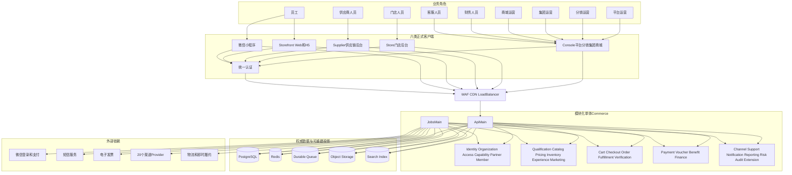

### 2.1 部署拓扑

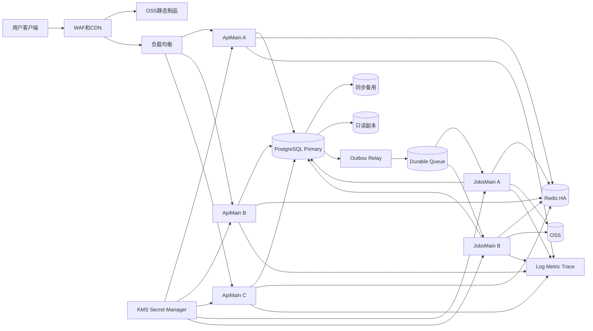

禁止用Vite Preview、单机PM2、本地文件、浏览器状态或未签名制品承担生产服务。

---

## 3. 组织、合作资源和Scope

### 3.1 唯一组织树

```text
Platform
├─ Distributor
│  └─ Tenant
└─ Tenant
   └─ Enterprise
      ├─ Mall
      └─ Department
         └─ Department
```

- Distributor可选。
- Tenant是硬租户边界。
- Supplier、Brand、Store不进入组织树，属于Partner关系图。
- 平台、分销、集团、商城不能各自实现一套角色、商品池、卡券或财务逻辑；它们复用相同用例，通过Scope改变数据边界。

### 3.2 Scope锚点

```text
platform
distributor
tenant
enterprise
mall
department
supplier
brand
store
self
```

所有Controller只接收资源ID，服务端使用`ResourceScopeResolver`解析真实归属。客户端提交的tenant、enterprise、mall、role和permission一律不可信。

### 3.3 授权流水线

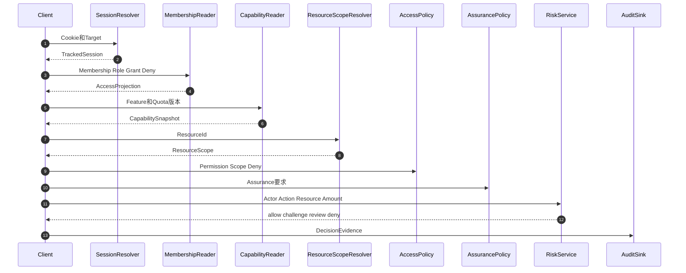

---

## 4. 限界上下文和依赖方向

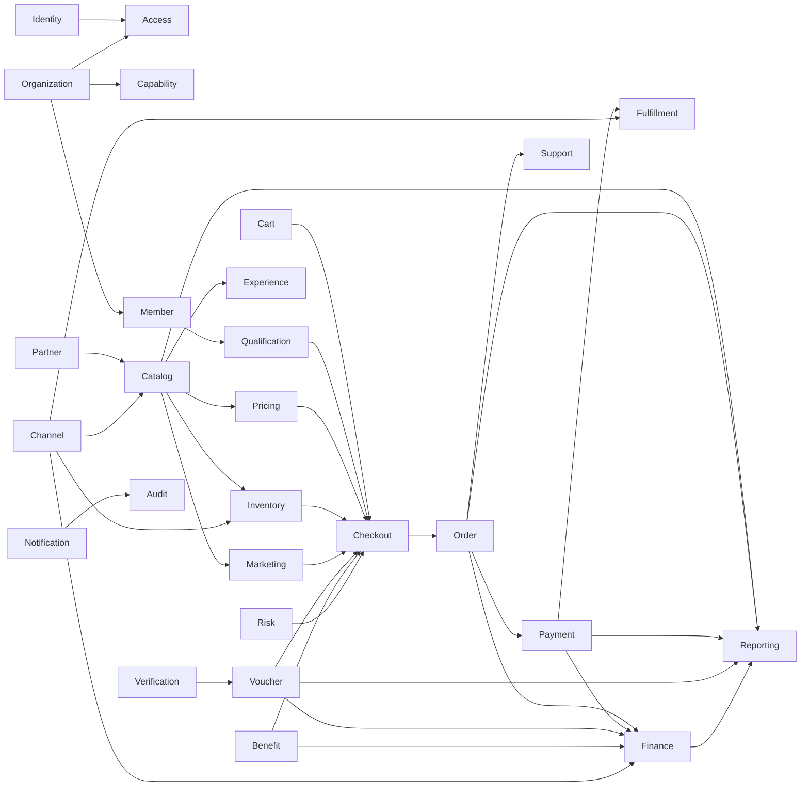

箭头只表示Port、DTO或Event。禁止：

- 跨模块导入Repository。
- 跨模块修改对方聚合。
- Controller直接访问其他模块表。
- 报表任意JOIN交易内部表。
- 外部Provider字段进入核心Domain。

---

## 5. 模块所有权和内部数据流

每个模块都使用`domain → application → infrastructure → interface`固定依赖方向。下表给出全部模块的输入、核心对象、内部处理、权威数据和输出事件；详细时序与本方案一致，以架构基线文档第24章为完整序列定义。

| 模块          | 主要输入                    | 聚合或核心策略                               | 内部数据流                                   | 数据Owner        | 主要输出                               |
| ------------- | --------------------------- | -------------------------------------------- | -------------------------------------------- | ---------------- | -------------------------------------- |
| identity      | 凭据、微信Code、OTP         | Member、Session、Challenge                   | 限流→凭据校验→保证级别→TrackedSession        | identity         | SessionStarted、SessionRevoked         |
| organization  | 层级命令                    | Tenant、Distributor、OrgUnit                 | 锁节点→父子校验→防环→Closure更新             | organization     | OrgUnitCreated、OrgUnitMoved           |
| access        | Session、Membership、资源ID | Role、Scope、Delegation、Deny                | 角色→拒绝→Scope→StepUp→证据                  | access           | AccessVersionRaised                    |
| capability    | 套餐、功能、配额            | Package、Assignment                          | 父级授权→版本→配额→分配                      | capability       | CapabilityChanged                      |
| partner       | 主体资料、协议              | Partner、Agreement、Authorization            | 全球去重→Enrollment→协议→范围授权            | partner          | PartnerEnrolled                        |
| member        | 会员资料、导入文件          | MemberProfile、Group、Level                  | 分片读取→匹配→档案→分组等级积分              | member           | MemberProfileChanged                   |
| qualification | 会员、Listing、城市、数量   | Policy、Decision、PurchaseLimit              | 规则版本→事实→Specification→证据快照         | qualification    | QualificationChanged                   |
| catalog       | 自有或渠道商品              | Product、Sku、Pool、Listing                  | 规范化→匹配→分类→审核→发布                   | catalog          | ListingPublished                       |
| pricing       | Offer、规则、数量           | PriceBook、PriceQuote                        | 成本→税→平台→分销→集团→商城→促销→舍入        | pricing          | PriceChanged、MarginViolated           |
| inventory     | 库存观察、预占命令          | StockItem、Reservation                       | 稳定锁序→可售校验→预占状态机→Movement        | inventory        | StockReserved、StockChanged            |
| experience    | 商城草稿、资源              | Application、Version、Publication            | Schema→资源→链接→Listing→快照→发布           | experience       | ExperiencePublished                    |
| marketing     | 活动、人群、预算            | Campaign、Coupon、Affiliate                  | 人群→资格→互斥叠加→预算→报价                 | marketing        | PromotionQuoted                        |
| cart          | 商品和数量                  | Cart                                         | 可见性→数量规范→合并→版本保存                | cart             | CartChanged                            |
| checkout      | Cart、地址、支付选择        | CheckoutQuote                                | 并行资格/价格/库存/券/福利→签名报价          | checkout         | QuoteCreated、QuoteConfirmed           |
| order         | 已确认报价                  | Order、AfterSaleCase                         | 幂等→快照→正交状态机→售后策略                | ordering         | OrderPlaced、AfterSaleApproved         |
| fulfillment   | 已支付订单、物流回调        | FulfillmentOrder、Shipment、Return           | 拆单→远程下单→追踪→签收→退货质检             | fulfillment      | ShipmentChanged、ReturnAccepted        |
| verification  | 动态码、设备、门店          | Challenge、VerificationSession               | 设备→一次消费→Scope→权益核验                 | verification     | MemberCodeVerified                     |
| payment       | 订单、Tender、回调          | PaymentIntent、Attempt、Refund               | 分配→内部Hold→外部支付→Inbox→捕获/退款       | payment          | PaymentCaptured、RefundSucceeded       |
| voucher       | 卡号、备券、核销            | CardPool、IssueBatch、Voucher、Redemption    | 导入加密→审批→锁卡→发行→状态→核销/冲正       | voucher          | VoucherIssued、VoucherRedeemed         |
| benefit       | 计划、人群、预算            | BenefitPlan、Budget、GrantBatch              | 人群快照→审批→预算→分片发放→到期/撤销        | benefit          | BenefitGranted                         |
| finance       | 业务会计事实                | Journal、Reconciliation、Settlement、Invoice | 分录→对账→结算→提现→发票                     | finance、invoice | LedgerPosted、SettlementClosed         |
| channel       | Provider数据和回调          | Connection、SyncRun、Mapping                 | Manifest→SecretRef→Provider→ACL→Cursor→Inbox | channel          | SourceRecordsReceived、ChannelDegraded |
| support       | 消息、订单引用              | Conversation、Ticket、AssignmentRule         | 会话→订单范围→坐席分派→SLA→升级              | support          | TicketAssigned、MessageReceived        |
| notification  | 领域事件、模板              | Template、Dispatch                           | 模板版本→同意偏好→通道→重试                  | notification     | NotificationDelivered                  |
| reporting     | 领域事件、查询维度          | Fact、Projection、ExportJob                  | Inbox→事实→聚合→水位→缓存→导出               | reporting        | ProjectionUpdated、ExportReady         |
| risk          | 行为、设备、金额            | RiskPolicy、RiskCase                         | Signal→规则/模型→决策→Case→灰度回放          | risk             | TransactionBlocked、RiskCaseOpened     |
| audit         | 命令和访问证据              | AuditRecord                                  | 脱敏→摘要→完整性链→追加写→归档               | audit            | AuditRecorded                          |
| extension     | 签名Manifest、SecretRef     | Extension、Installation                      | 验签→合同→健康→注册→灰度→原子切换            | extension        | ExtensionEnabled                       |

### 5.1 写命令内部统一时序

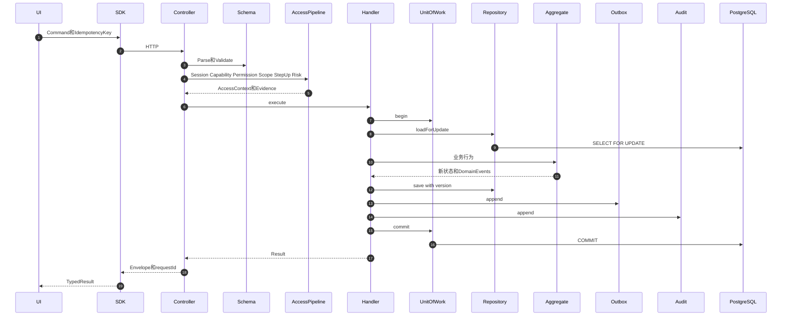

### 5.2 查询内部统一时序

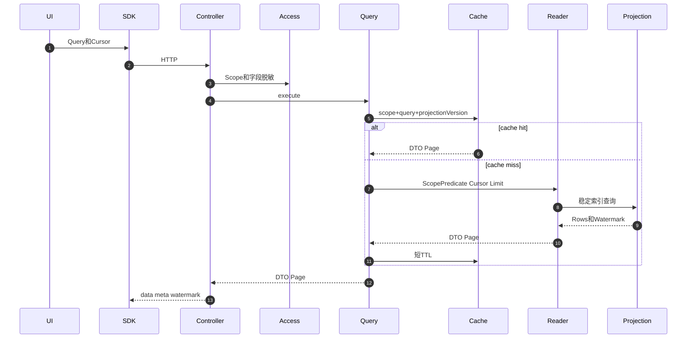

---

## 6. 关键模块间调用时序

### 6.1 商城装修保存、发布和多端消费

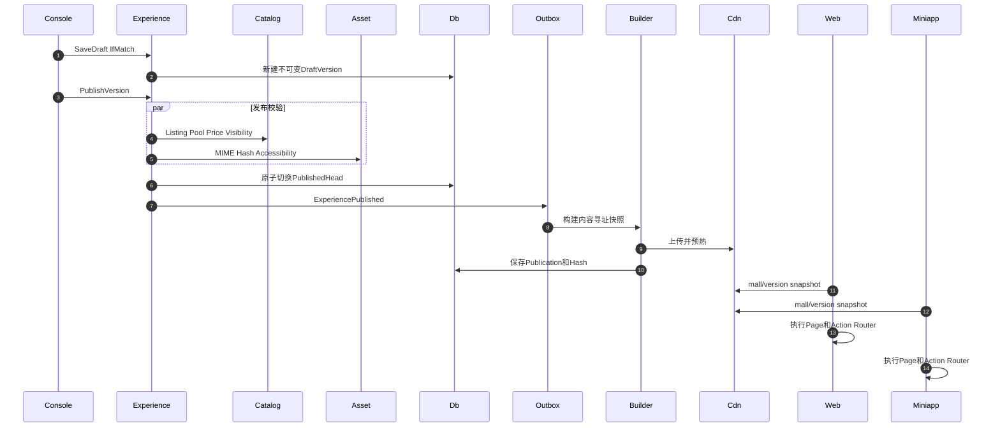

根治当前问题：Web必须消费`experience`；小程序必须实现统一`ActionDispatcher`和`PageRenderer`，所有action类型都有合同测试，不能再统一Toast“后续实现”。

### 6.2 渠道同步到商城发布

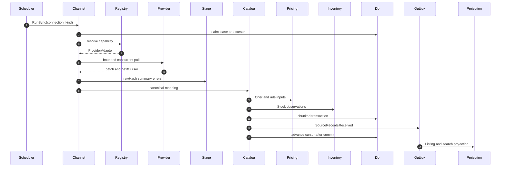

公共商品查询永远不在用户请求中调用Provider。Provider故障只影响对应连接，不拖垮Commerce整体。

### 6.3 结算预览与强一致下单

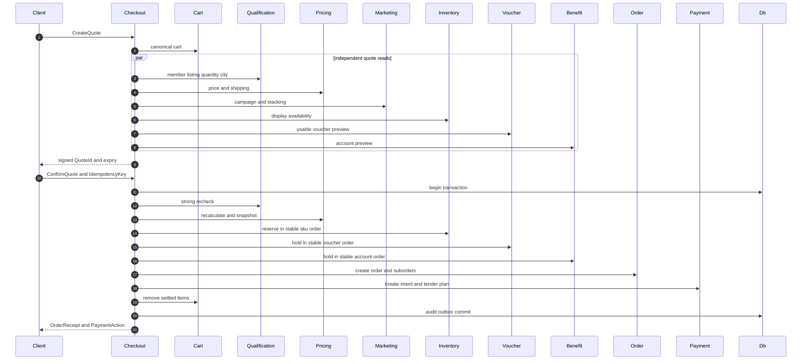

### 6.4 微信混合支付、回调和迟到支付

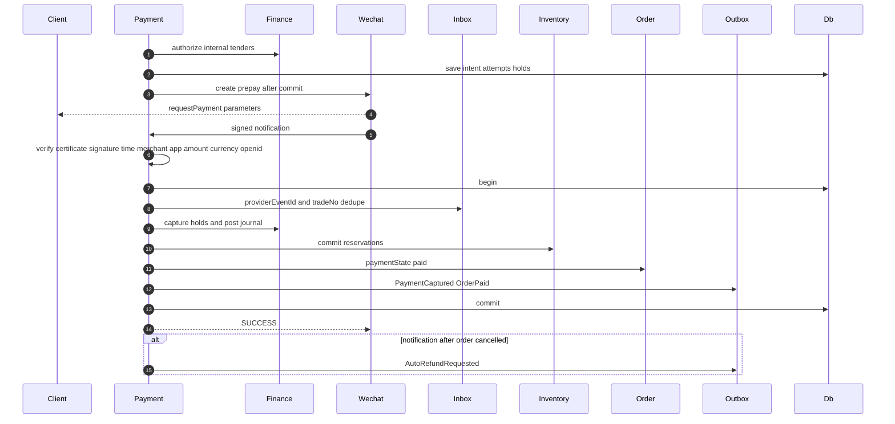

### 6.5 售后、退货、退款和库存回补

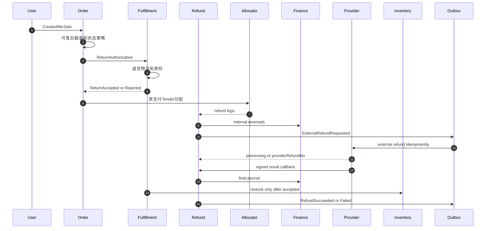

### 6.6 卡号池、发行、动态会员码和核销

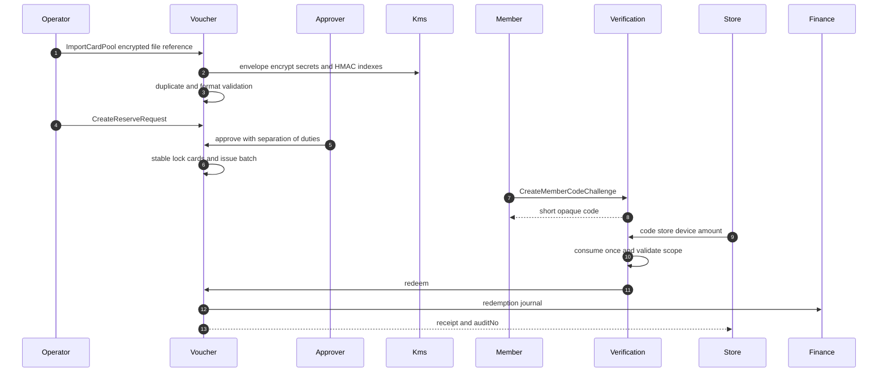

### 6.7 财务对账、结算、提现和发票

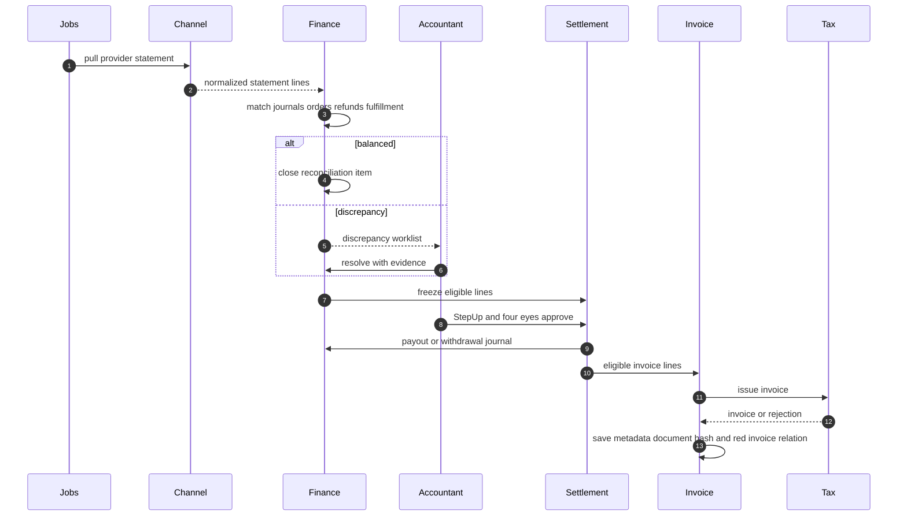

### 6.8 客服会话和SLA

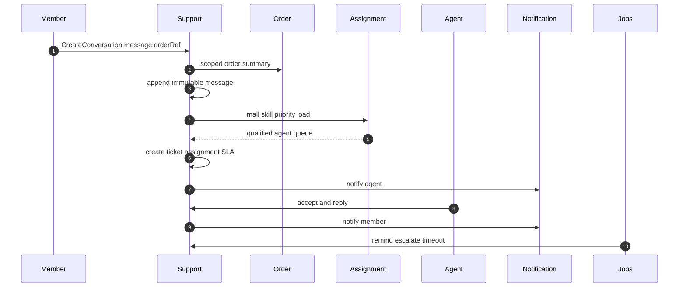

### 6.9 报表投影和异步导出

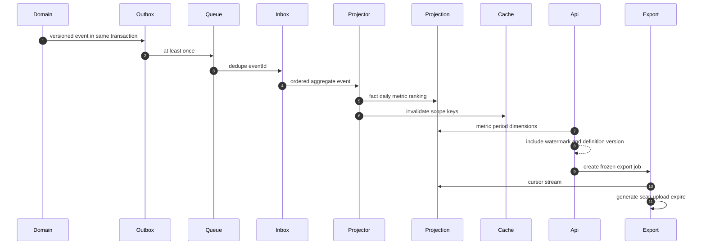

---

## 7. 最终代码目录

目录使用单数、小写英文；业务类和React组件使用PascalCase；函数和Hook使用camelCase；常量使用UPPERCASE。除脚本、审计代码、配置、SQL、迁移和测试外，自有目录与文件名不得包含下划线、连字符、空格或无意义缩写。

```text
Shop/
├─ apps/
│  ├─ console/
│  │  ├─ src/
│  │  │  ├─ app/
│  │  │  │  ├─ ConsoleApp.tsx
│  │  │  │  ├─ ConsoleBootstrap.ts
│  │  │  │  └─ ConsoleProvider.tsx
│  │  │  ├─ route/
│  │  │  │  ├─ ConsoleRouter.tsx
│  │  │  │  ├─ RouteGuard.tsx
│  │  │  │  └─ RouteError.tsx
│  │  │  ├─ shell/
│  │  │  │  ├─ ConsoleShell.tsx
│  │  │  │  ├─ Navigation.tsx
│  │  │  │  ├─ ScopePicker.tsx
│  │  │  │  ├─ Workstation.ts
│  │  │  │  └─ WorkstationRegistry.ts
│  │  │  ├─ feature/
│  │  │  │  ├─ dashboard/
│  │  │  │  ├─ organization/
│  │  │  │  ├─ distributor/
│  │  │  │  ├─ application/
│  │  │  │  ├─ catalog/
│  │  │  │  ├─ order/
│  │  │  │  ├─ voucher/
│  │  │  │  ├─ finance/
│  │  │  │  ├─ reporting/
│  │  │  │  ├─ support/
│  │  │  │  ├─ member/
│  │  │  │  ├─ partner/
│  │  │  │  ├─ notification/
│  │  │  │  ├─ risk/
│  │  │  │  └─ setting/
│  │  │  ├─ entity/
│  │  │  ├─ shared/
│  │  │  └─ main.tsx
│  │  └─ package.json
│  ├─ store/
│  │  └─ src/
│  │     ├─ app/
│  │     ├─ route/
│  │     ├─ shell/
│  │     ├─ feature/
│  │     │  ├─ dashboard/
│  │     │  ├─ profile/
│  │     │  ├─ catalog/
│  │     │  ├─ order/
│  │     │  ├─ verification/
│  │     │  ├─ finance/
│  │     │  ├─ reporting/
│  │     │  ├─ employee/
│  │     │  └─ setting/
│  │     ├─ entity/
│  │     └─ shared/
│  ├─ supplier/
│  │  └─ src/
│  │     ├─ app/
│  │     ├─ route/
│  │     ├─ shell/
│  │     ├─ feature/
│  │     │  ├─ dashboard/
│  │     │  ├─ profile/
│  │     │  ├─ catalog/
│  │     │  ├─ inventory/
│  │     │  ├─ order/
│  │     │  ├─ fulfillment/
│  │     │  ├─ aftersale/
│  │     │  ├─ finance/
│  │     │  ├─ reporting/
│  │     │  └─ setting/
│  │     ├─ entity/
│  │     └─ shared/
│  ├─ storefront/
│  │  └─ src/
│  │     ├─ app/
│  │     ├─ route/
│  │     ├─ feature/
│  │     │  ├─ home/
│  │     │  ├─ category/
│  │     │  ├─ search/
│  │     │  ├─ product/
│  │     │  ├─ cart/
│  │     │  ├─ checkout/
│  │     │  ├─ payment/
│  │     │  ├─ order/
│  │     │  ├─ aftersale/
│  │     │  ├─ voucher/
│  │     │  ├─ benefit/
│  │     │  ├─ support/
│  │     │  └─ account/
│  │     ├─ entity/
│  │     └─ shared/
│  ├─ auth/
│  │  └─ src/
│  │     ├─ app/
│  │     ├─ route/
│  │     ├─ feature/
│  │     │  ├─ login/
│  │     │  ├─ register/
│  │     │  ├─ recovery/
│  │     │  ├─ invitation/
│  │     │  ├─ stepup/
│  │     │  └─ security/
│  │     └─ shared/
│  └─ miniapp/
│     └─ miniprogram/
│        ├─ app/
│        ├─ page/
│        ├─ component/
│        ├─ feature/
│        ├─ service/
│        ├─ state/
│        └─ shared/
├─ services/
│  └─ commerce/
│     ├─ src/
│     │  ├─ entry/
│     │  │  ├─ ApiMain.ts
│     │  │  ├─ JobsMain.ts
│     │  │  └─ MigrationMain.ts
│     │  ├─ bootstrap/
│     │  │  ├─ ApiBootstrap.ts
│     │  │  ├─ JobsBootstrap.ts
│     │  │  ├─ Container.ts
│     │  │  ├─ ModuleRegistry.ts
│     │  │  └─ RouteRegistry.ts
│     │  ├─ foundation/
│     │  │  ├─ application/
│     │  │  ├─ domain/
│     │  │  ├─ infrastructure/
│     │  │  ├─ interface/
│     │  │  └─ security/
│     │  ├─ modules/
│     │  │  ├─ identity/
│     │  │  ├─ organization/
│     │  │  ├─ access/
│     │  │  ├─ capability/
│     │  │  ├─ partner/
│     │  │  ├─ member/
│     │  │  ├─ qualification/
│     │  │  ├─ catalog/
│     │  │  ├─ pricing/
│     │  │  ├─ inventory/
│     │  │  ├─ experience/
│     │  │  ├─ marketing/
│     │  │  ├─ cart/
│     │  │  ├─ checkout/
│     │  │  ├─ order/
│     │  │  ├─ fulfillment/
│     │  │  ├─ verification/
│     │  │  ├─ payment/
│     │  │  ├─ voucher/
│     │  │  ├─ benefit/
│     │  │  ├─ finance/
│     │  │  │  ├─ accounting/
│     │  │  │  ├─ reconciliation/
│     │  │  │  ├─ settlement/
│     │  │  │  └─ invoice/
│     │  │  ├─ channel/
│     │  │  ├─ support/
│     │  │  ├─ notification/
│     │  │  ├─ reporting/
│     │  │  ├─ risk/
│     │  │  ├─ audit/
│     │  │  └─ extension/
│     │  └─ test/
│     ├─ package.json
│     ├─ tsconfig.json
│     └─ vitest.config.ts
├─ packages/
│  ├─ contract/
│  ├─ sdk/
│  ├─ kernel/
│  ├─ authz/
│  ├─ design/
│  ├─ telemetry/
│  ├─ config/
│  └─ testing/
├─ extensions/
│  ├─ channel/
│  │  ├─ jd/
│  │  ├─ jdfresh/
│  │  ├─ tmall/
│  │  ├─ private/
│  │  ├─ cake/
│  │  ├─ flower/
│  │  ├─ book/
│  │  ├─ virtual/
│  │  ├─ foodvoucher/
│  │  ├─ movie/
│  │  ├─ foodservice/
│  │  ├─ taobaonow/
│  │  ├─ elephant/
│  │  ├─ meituan/
│  │  ├─ housekeeping/
│  │  ├─ jdhousekeeping/
│  │  ├─ laundry/
│  │  ├─ errand/
│  │  ├─ carservice/
│  │  └─ damai/
│  ├─ payment/
│  │  └─ wechat/
│  ├─ notification/
│  ├─ storage/
│  └─ tax/
├─ database/
│  ├─ migrations/
│  ├─ contracts/
│  ├─ fixtures/
│  └─ tools/
├─ tests/
│  ├─ contract/
│  ├─ integration/
│  ├─ journey/
│  ├─ performance/
│  ├─ security/
│  └─ recovery/
├─ infrastructure/
│  ├─ container/
│  ├─ cloud/
│  ├─ network/
│  ├─ monitoring/
│  ├─ backup/
│  └─ security/
├─ tools/
│  ├─ contractgen/
│  ├─ requirementgen/
│  ├─ tokengen/
│  └─ quality/
├─ docs/
│  ├─ architecture/
│  ├─ decisions/
│  ├─ operations/
│  ├─ requirements/
│  └─ security/
├─ package.json
├─ package-lock.json
├─ tsconfig.json
└─ README.md
```

### 7.1 后端模块固定骨架

```text
modules/order/
├─ domain/
│  ├─ model/
│  ├─ event/
│  ├─ policy/
│  ├─ repository/
│  └─ error/
├─ application/
│  ├─ command/
│  ├─ query/
│  ├─ handler/
│  ├─ dto/
│  └─ port/
├─ infrastructure/
│  ├─ persistence/
│  ├─ messaging/
│  └─ adapter/
├─ interface/
│  ├─ http/
│  └─ job/
├─ test/
└─ OrderModule.ts
```

强制规则：

- `domain`不导入框架、数据库、HTTP或其他模块实现。
- `application`只依赖Domain和Port。
- `infrastructure`实现Port。
- `interface`只处理协议转换。
- 只有`Module.ts`对Bootstrap暴露注册函数。
- 一个文件承载一个主要公共概念。
- 超过约300行且承担多职责的文件必须按职责拆分。

### 7.2 前端Feature固定骨架

```text
feature/order/
├─ api/
│  └─ OrderApi.ts
├─ model/
│  ├─ OrderFilter.ts
│  └─ useOrderPage.ts
├─ ui/
│  ├─ OrderPage.tsx
│  ├─ OrderTable.tsx
│  └─ OrderDetail.tsx
├─ route/
│  └─ OrderRoute.tsx
└─ test/
   ├─ OrderPage.test.tsx
   └─ OrderJourney.test.ts
```

只有`packages/sdk`可以访问Transport。Feature不得直接`fetch`，不得深层导入其他Feature。

### 7.3 Provider固定骨架

```text
extensions/channel/jd/
├─ JdExtension.ts
├─ JdManifest.ts
├─ JdClient.ts
├─ JdSigner.ts
├─ JdMapper.ts
├─ JdThrottle.ts
├─ JdError.ts
├─ contract/
├─ fixture/
└─ test/
```

其他Provider只替换语义明确的前缀，不复制宿主重试、日志、熔断、Inbox、Outbox和Secret逻辑。

---

## 8. 单一配置、合同和注册机制

| 事实        | 唯一Owner                        | 生成或消费方式                               |
| ----------- | -------------------------------- | -------------------------------------------- |
| 需求        | `docs/requirements/mapping.json` | 由Excel生成，CI校验Hash和数量                |
| API和事件   | `packages/contract`              | OpenAPI和Schema生成SDK                       |
| 权限和Scope | `packages/authz`                 | 前后端仅消费同一Catalog                      |
| 环境变量    | `packages/config`                | 启动时严格校验，禁止静默默认                 |
| 金额        | `packages/kernel/Money.ts`       | 整数分和currency，禁止浮点                   |
| 设计令牌    | `packages/design`                | 六端构建生成，不复制颜色常量                 |
| 日志和Trace | `packages/telemetry`             | 统一脱敏字段和Span                           |
| 模块        | `ModuleRegistry`                 | 显式注册，不反射扫描                         |
| Route       | `RouteRegistry`                  | 合同生成并绑定一个Handler                    |
| Workstation | `WorkstationRegistry`            | route、permission、capability、scope、loader |
| Provider    | `ExtensionRegistry`              | 签名Manifest和小能力接口                     |
| 指标        | `reporting/MetricCatalog`        | 版本、单位、口径和维度唯一                   |

任何重复常量、第二套DTO、第二个ErrorMapper、第二个HTTP Client或业务switch都由CI阻断。

---

## 9. 当前代码复用和迁移

### 9.1 可以复用但必须重构的能力

| 当前路径或能力                                  | 复用内容                           | 目标位置                    | 必须补齐                                  |
| ----------------------------------------------- | ---------------------------------- | --------------------------- | ----------------------------------------- |
| `database/...organization...sql`                | 平台/分销/Tenant/集团/商城层级语义 | organization、access        | Console入口、完整Scope、迁移合同          |
| `distributorRoutes.ts`和`distributorService.ts` | 创建、挂接、读取用例语义           | organization                | UI、Capability、审计、Cursor              |
| `MallApplicationWorkstation.tsx`                | 创建、复制、草稿、发布、恢复UI     | console/feature/application | Workstation注册、Web和小程序完整消费      |
| Mall Application SQL                            | 不可变版本和授权基础               | experience                  | Publication、CDN Builder、Action Router   |
| `MembershipPermissionWorkstation.tsx`           | 会员、角色、Scope和StepUp UI       | console/feature/member      | 唯一authz合同和跨Scope测试                |
| Qualification工作台和SQL                        | 资格、商业资源、审批和仿真         | qualification、partner      | 与Checkout同引擎，Supplier主数据          |
| Admin订单查询和导出                             | 查询过滤、CSV防注入、售后审核      | order                       | Cursor、集团跨Mall、完整退换货            |
| 微信预支付、回调验签和查询                      | 密码学和协议实现                   | payment/wechat              | Intent Tender Refund Inbox ProcessManager |
| Voucher SQL和读写路由                           | 卡券状态、备券、发行、核销基础     | voucher                     | 卡号池创建、批量、客户、财务和UI开关      |
| ProductSourcePool组件                           | 渠道筛选和入池交互思路             | console/feature/catalog     | 挂载、Provider目录、CRUD和批量操作        |
| Whyouye入池字段理解                             | 甲方字段映射和现有测试             | channel/private             | 宿主HttpClient、重试、熔断、任务和对账    |
| Admin Sales Overview                            | 指标原始定义参考                   | reporting                   | 事件投影、时间维度、跨应用和Watermark     |
| Outbox和支付任务基础                            | 表结构、租约、重放经验             | runtime、payment            | 统一Envelope、Relay、Inbox和Deadletter    |

### 9.2 必须删除的当前实现

替代链路上线并通过测试后删除：

- `App.tsx`中的`INITIAL_ENTERPRISES`、`INITIAL_SUPPLIERS`、`INITIAL_CASES`、`INITIAL_FINANCE_DISCREPANCIES`和`INITIAL_SYSTEM_CONFIG`状态。
- Supplier、Finance、CaseCenter、System中所有Demo Banner、固定KPI、内存状态和拒绝写入按钮。
- `writeEnabled={false}`这种永久关闭卡券写路径的硬编码。
- Storefront失败后回退Mock用户、商品、订单、卡券和支付成功的逻辑。
- 未挂载的平行工作台、重复Service和不可达Route。
- Hash工作台切换、巨型App switch和巨型MallContext。
- 旧大Router、旧RPC Overload、旧权限常量、旧事件转发别名。
- Simulation、Demo登录、固定OTP、万能密码和随机Ticket。
- `services/core-read-cache`，缓存能力并入Commerce查询基础设施。
- 生产PM2和Vite Preview流程。
- 任何当前已存在的双写、兼容View和迁移适配器在新制品构建前删除；Backfill只存在于不随应用部署的离线SQL和审计制品。

历史Migration文件不可删除或改写；通过追加Repair SQL撤销旧对象。

---

## 10. 数据库硬切换设计

### 10.1 Schema所有权

保持架构基线中的Schema：identity、organization、access、capability、partner、member、qualification、catalog、pricing、inventory、experience、marketing、cart、checkout、ordering、fulfillment、verification、payment、voucher、benefit、finance、invoice、channel、support、notification、reporting、risk、audit、extension、runtime。

### 10.2 通用列和约束

所有租户业务表必须包含：

```text
id
tenant_id
version
created_at
updated_at
```

并执行：

- 唯一索引包含tenant范围。
- 跨Tenant外键使用包含tenant的组合约束。
- 金额用`bigint`最小单位，时间用UTC。
- 可编辑聚合使用乐观版本。
- Journal、Audit、Outbox、Inbox、状态历史只追加。
- PII使用KMS信封加密，可检索值使用HMAC索引。
- 应用角色不拥有BYPASSRLS。
- 每个事务设置服务端Scope，RLS默认拒绝。

### 10.3 唯一下单锁顺序

```text
IdempotencyRecord
→ Order
→ StockItem按skuId
→ Voucher按voucherId
→ Account按accountId
→ PaymentIntent
```

所有批量锁按稳定ID排序，任何模块不得发明另一套锁顺序。

### 10.4 必须成立的不变量

```text
Journal借方总额 = 贷方总额
Balance = PostedEntries重放结果
available = onhand - activeReserved - safety
onhand >= 0
reserved >= 0
Reservation只能commit、release或expire一次
同一IdempotencyKey只能产生一个业务结果
同一ProviderEvent只能产生一次业务效果
退款累计 <= 原PaymentAllocation
同一Voucher最多一次有效核销
核销冲正不删除原核销
OrderLine不能重复结算
OrderLine不能重复开票
PublishedHead必须引用有效不可变版本
Membership不能越过Scope
Supplier和Store访问必须有有效Agreement
```

### 10.5 Repair迁移顺序

迁移文件允许时间戳和下划线。真正实施时必须预约时间槽：

```text
restore_migration_integrity
unify_access_scope
revoke_legacy_order_rpc
inventory_reservation
checkout_atomic_command
payment_intent_tender
refund_reconciliation
fulfillment_tracking
benefit_grant_budget
finance_journal_settlement
outbox_inbox_deadletter
reporting_projection
support_conversation
channel_connection
extension_registry
```

每个迁移同时提供Fresh Replay、生产副本升级、回滚策略和结构Diff证据。

---

## 11. MVP二十一项根治映射

| Excel行 | MVP项        | 目标UI                          | 核心模块                                    | 必须新增或补齐                                   | Released证据              |
| ------: | ------------ | ------------------------------- | ------------------------------------------- | ------------------------------------------------ | ------------------------- |
|       3 | 平台层       | `/platform`                     | organization、catalog、voucher              | 平台Scope商品池、卡号池创建和分配                | 平台管理员真实旅程        |
|       4 | 分销层       | `/distributors`                 | organization、capability、catalog、voucher  | 分销工作台、下属Tenant、池和配额                 | Distributor越权和管理旅程 |
|       5 | 集团数据大屏 | `/enterprises/:id/dashboard`    | reporting                                   | 金额、数量、退单、按应用、实时/昨天/7/30         | 指标对账和Watermark       |
|       6 | 集团应用     | `/enterprises/:id/applications` | experience                                  | 创建、复制、管理、装修、发布、多端Action         | Web和小程序同版本旅程     |
|       7 | 集团商品池   | `/enterprises/:id/catalog`      | catalog、pricing、channel                   | 总池、渠道、自有、加价、CRUD、批量上下架改价     | 批量幂等和Scope测试       |
|       8 | 集团订单     | `/enterprises/:id/orders`       | order、fulfillment、payment                 | 跨应用商品订单、退货、换货、退款                 | 全售后状态旅程            |
|       9 | 集团卡券     | `/enterprises/:id/vouchers`     | voucher、verification                       | 客户、档案、卡号池、审批开关、批量、绑定和消费   | 卡池到核销冲正旅程        |
|      10 | 集团财务     | `/enterprises/:id/finance`      | finance、invoice                            | 总览、商城财务、配置、账单、发票                 | 借贷平衡和发票旅程        |
|      11 | 集团统计     | `/enterprises/:id/reports`      | reporting                                   | 商品、商城、分类、渠道、清单原文粉类、卡券维度   | 指标字典和导出            |
|      12 | 集团客服     | `/enterprises/:id/support`      | support                                     | 分配规则、人员、账号、聊天、记录                 | 用户和坐席双端旅程        |
|      13 | 集团设置     | `/enterprises/:id/settings`     | access、member、partner、notification、risk | 项目、分商城会员、供应商、门店、短信、自动上下架 | 配置版本和权限旅程        |
|      14 | 商城数据     | `/malls/:id/dashboard`          | reporting                                   | 当前商城金额、数量、退单、实时/昨天/7/30         | Mall Scope指标对账        |
|      15 | 商城装修     | `/malls/:id/design`             | experience                                  | 全Page、Component、Action、资产和回滚            | Web、小程序、CDN同Hash    |
|      16 | 商城商品池   | `/malls/:id/catalog`            | catalog、pricing、channel                   | 查询、渠道、自有、H5加价、CRUD和批量             | Listing和价格快照旅程     |
|      17 | 商城订单     | `/malls/:id/orders`             | order、fulfillment、payment                 | 商品订单、售后、退货、换货和退款                 | 单Mall完整履约旅程        |
|      18 | 商城卡券     | `/malls/:id/vouchers`           | voucher、verification                       | 与集团相同但Mall Scope                           | Mall核销和越权测试        |
|      19 | 商城财务     | `/malls/:id/finance`            | finance、invoice                            | 总览、配置、账单、发票                           | Mall账务和发票对账        |
|      20 | 商城统计     | `/malls/:id/reports`            | reporting                                   | 商品、商城、分类、渠道、粉类、卡券               | Mall报表与交易对账        |
|      21 | 商城客服     | `/malls/:id/support`            | support                                     | 设置、坐席、聊天、记录                           | Mall客服旅程和SLA         |
|      22 | 商城设置     | `/malls/:id/settings`           | access、member、partner、notification、risk | 角色项目、会员、供应商门店、短信、风控           | 配置和自动规则旅程        |
|      23 | 优先级1接口  | `/platform/channels`            | channel、extension                          | Excel优先级1的11项全部真实Provider闭环           | 每Provider Integrated证据 |

### 11.1 数据指标口径

每个Dashboard和Report必须展示：

```text
metricCode
metricVersion
scope
period
dimensions
value
currency或unit
watermark
projectionVersion
definitionLink
```

“实时”定义为事件投影延迟目标内的截至时间，不允许用页面定时刷新冒充实时。昨天按商城业务时区闭区间计算；7天和30天必须明确是否含今天。

---

## 12. 渠道即插即用方案

### 12.1 小能力接口

```ts
interface CatalogSource {
  pullCatalog(cursor?: string): Promise<CatalogBatch>;
}
interface PriceSource {
  pullPrice(keys: readonly SourceSkuKey[]): Promise<PriceBatch>;
}
interface StockSource {
  pullStock(keys: readonly SourceSkuKey[]): Promise<StockBatch>;
}
interface RemoteOrderSubmitter {
  submit(order: RemoteOrderDraft): Promise<RemoteOrderReceipt>;
}
interface RemoteOrderCanceller {
  cancel(reference: string, reason: string): Promise<RemoteOrderState>;
}
interface TrackingSource {
  pullTracking(reference: string): Promise<TrackingSnapshot>;
}
interface RemoteRefundProvider {
  refund(request: RemoteRefundRequest): Promise<RemoteRefundReceipt>;
}
interface StatementSource {
  pullStatement(period: StatementPeriod): Promise<StatementFile>;
}
interface VerificationProvider {
  verify(request: RemoteVerificationRequest): Promise<RemoteVerificationReceipt>;
}
```

Provider不必实现全部接口，但Manifest必须准确声明。UI、Jobs和用例按Capability决定可用性，不使用`switch providerName`。

### 12.2 Excel优先级1十一项

| Provider    | 复用现状                     | 根治范围                                           |
| ----------- | ---------------------------- | -------------------------------------------------- |
| jd          | 可复用现有JD VOP入池字段理解 | 正式商品、价格、库存、订单、物流、售后、退款、对账 |
| jdfresh     | 仅有来源编码                 | 区域、温层、时效、生鲜售后和完整订单闭环           |
| tmall       | 仅有来源编码                 | 商品池、价格、库存、订单、物流、退款、对账         |
| private     | 有标准化Catalog Import后端   | 文件/API导入、校验、回执、差异、库存和订单接口     |
| cake        | 有合并来源编码               | 蛋糕品牌、门店、区域时段、预约、履约、取消和售后   |
| flower      | 与蛋糕混合                   | 独立鲜花语义、门店、区域、时段、履约和售后         |
| book        | 有图书来源编码               | 文轩等Provider合同、库存、订单、物流、售后和对账   |
| virtual     | 有虚拟卡券/直充来源编码      | 万联等发码/直充、查询、冲正、退款和对账            |
| foodvoucher | 当前未发现专用接入           | 提货券发码、门店范围、核销、冲正、退款和对账       |
| movie       | 当前只有分类和Mock           | 电影权益、城市影院、出票/发码、取消、核销和退款    |
| foodservice | 当前只有展示文案             | 肯德基、麦当劳、瑞幸、星巴克、库迪子Provider能力   |

优先级3和4的9项也必须保留Requirement和扩展目录，但不在MVP发布包中加载，状态保持Designed或Unavailable；禁止用空实现或模拟成功。

### 12.3 Provider韧性

每个连接独立配置：

```text
connectionTimeout
responseTimeout
totalDeadline
maxConcurrency
rateLimit
retryPolicy
circuitPolicy
bulkhead
credentialRef
healthState
syncWatermark
```

只有幂等读或具有稳定业务幂等号的写可以自动重试。网络超时后的远程下单必须先查询，不能直接重复提交。

---

## 13. 高性能和并发方案

### 13.1 快路径

- 公共目录、分类和商城发布快照走CDN和Redis版本化缓存。
- 管理查询走Reader和Projection，不加载聚合。
- 报表查询只查预聚合，不扫描订单和流水主表。
- 列表使用Cursor和稳定复合索引，禁止深Offset。
- Provider同步分页、有界并发、分块事务和断点Cursor。
- Export使用后台Job和对象存储，HTTP不生成大文件。

### 13.2 强一致路径

以下命令必须回PostgreSQL并重验，不以缓存决定：

- 下单资格。
- 最终价格。
- 可售库存。
- 余额和福利预算。
- 卡券核销状态。
- 支付和退款最终状态。
- 对账、结算和发票状态。

### 13.3 并发模型

- 同一聚合串行，不同聚合并行。
- Handler事务内禁止外部HTTP。
- Worker使用`SKIP LOCKED`和租约。
- 批量任务保存Cursor、成功、失败、Hash和最后错误。
- Outbox按aggregateId保序，不同聚合并行。
- 前端查询使用AbortController取消过时请求。

### 13.4 SLO

| 指标                     |                     目标 |
| ------------------------ | -----------------------: |
| 公共目录缓存命中p95      |                150ms以内 |
| 普通查询p95              |                300ms以内 |
| 写命令p95                |                800ms以内 |
| 创建订单p95              | 1500ms以内，不含用户支付 |
| API月可用性              |               99.95%以上 |
| 支付回调持久化p99        |                500ms以内 |
| Outbox事件99%投递        |                 30秒以内 |
| 超卖、重复扣款、重复核销 |                        0 |
| 财务借贷不平             |                        0 |
| RPO                      |                5分钟以内 |
| RTO                      |               30分钟以内 |

上线前必须用真实容量模型验证，不以单机测试或Mock吞吐宣称高性能。

---

## 14. 安全、隐私和审计

### 14.1 必须执行

- 密码使用Argon2id或批准的强KDF。
- OTP只保存带Pepper摘要，绑定用途、次数、过期和单次消费。
- Web使用Secure、HttpOnly、SameSite Cookie和CSRF防护。
- 高风险退款、调价、结算、导出、卡密查看、代管和批量发放要求StepUp。
- 发起与审批职责分离。
- PII字段级AEAD加密；卡号卡密KMS信封加密和HMAC索引。
- Provider Secret只保存在Secret Manager，数据库保存引用。
- 日志禁止Cookie、Token、密码、OTP、卡密、完整手机和地址。
- 上传执行大小、MIME、魔数、恶意内容和权限检查。
- Webhook执行证书、签名、时间窗、Nonce、Inbox去重。
- 构建执行Secret扫描、SBOM、许可证、镜像签名和来源证明。

### 14.2 工作簿凭据

接口工作表中历史出现过凭据。必须：

1. 轮换全部原值并确认旧值失效。
2. 工作簿只保留`SecretRef`和负责人，不保留明文。
3. 扫描Git历史、日志、CI制品和备份。
4. 建立轮换、到期告警和紧急吊销Runbook。

---

## 15. 可观测性和故障恢复

### 15.1 统一上下文

所有同步和异步操作携带：

```text
requestId
traceId
correlationId
causationId
actorId
membershipId
tenantId
scopeKind
scopeId
module
operation
resourceType
resourceId
result
errorCode
durationMs
dependency
dependencyDurationMs
```

### 15.2 Outbox和Inbox

- 至少一次投递，不宣称Exactly Once。
- Inbox保证一次业务效果。
- 指数退避加抖动。
- 超过最大次数进入Deadletter。
- Deadletter支持查看、重放、忽略和审计。
- 高风险Audit写失败时业务失败关闭。

### 15.3 必备Jobs

```text
catalogsync
pricesync
inventorysync
orderexpiry
paymentquery
paymentrefund
fulfillment
tracking
benefitgrant
voucherexpiry
reconciliation
settlement
invoice
notification
projection
export
riskscan
cleanup
```

### 15.4 必备Runbook

```text
databasefailover
migrationrollback
paymentincident
refundrepair
inventoryrepair
ledgerrepair
outboxreplay
deadletterreplay
channeldegrade
credentialrotation
crosstenantincident
databackfill
mallrollback
releaserollback
```

---

## 16. 测试和质量门

### 16.1 测试金字塔

| 层级        | 证明内容                                        |
| ----------- | ----------------------------------------------- |
| Domain      | ValueObject、Policy、状态机、不变量、性质测试   |
| Application | Handler、Port、事务、事件、错误和补偿           |
| Contract    | OpenAPI、事件、SDK、Provider可替换性            |
| Database    | Fresh Migration、RLS、约束、并发、RPC唯一签名   |
| Integration | PostgreSQL、Redis、Queue、Outbox、Inbox和锁     |
| Component   | Loading、Empty、Denied、Conflict、Offline、a11y |
| Journey     | 六端真实业务旅程                                |
| Performance | 阶梯压测、浸泡、峰值、故障恢复                  |
| Security    | 认证、越权、Secret、SAST、DAST、依赖供应链      |
| Recovery    | 备份恢复、重放、故障注入、RPO和RTO              |

### 16.2 每个模块最低测试

```text
Aggregate.test.ts
Policy.test.ts
Handler.test.ts
Repository.test.ts
Contract.test.ts
Integration.test.ts
Authorization.test.ts
Idempotency.test.ts
Concurrency.test.ts
Event.test.ts
```

测试文件允许`.test.ts`命名；生产文件不使用连接符或下划线。

### 16.3 CI顺序


质量门额外阻断：

- Production Bundle导入Mock、Fixture、Simulation。
- 直接`fetch`绕过SDK。
- 重复Permission或Contract。
- 跨模块Repository导入。
- 旧Migration被改写。
- 性能基线下降超过10%。
- Bundle预算超限。
- Critical或High安全问题未处置。

### 16.4 二十一条必过旅程

每个MVP标签至少一条主旅程和一条越权/错误旅程。除此之外必须覆盖：注册登录、平台建层级、渠道同步、商城发布、PC和小程序结算、支付回调重放、订单超时、完整售后、福利发放、卡号池到核销、供应商履约、门店核销、客服SLA、报表导出和每个优先级1 Provider。

---

## 17. 分阶段实施与并发工作

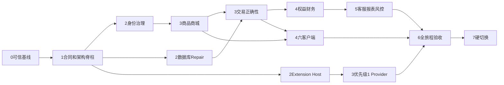

### 17.1 阶段出口门

| 阶段 | 主要交付                                                                        | 必须通过才能进入下一阶段         |
| ---- | ------------------------------------------------------------------------------- | -------------------------------- |
| 0    | 依赖锁、Git基线、构建矩阵                                                       | 全新目录`npm ci`，所有脚本可启动 |
| 1    | Contract、SDK、Kernel、Authz、Config、Telemetry、Registry                       | 无重复合同和反向依赖             |
| 2    | TrackedSession、Access、Organization、Partner、Repair SQL、Extension Host       | 全Scope越权和Fresh Migration     |
| 3    | Catalog、Pricing、Inventory、Experience、Checkout、Order、Payment、优先Provider | 商品到支付不变量和Provider沙箱   |
| 4    | Fulfillment、Refund、Voucher、Benefit、Finance、六端真实路由                    | 资金、库存、卡券和多端旅程       |
| 5    | Support、Notification、Reporting、Risk、Audit                                   | SLA、水位、告警和恢复可见        |
| 6    | 二十一MVP和全部P0旅程                                                           | 全部Accepted，无生产Mock         |
| 7    | 回填、金丝雀、删除旧路径                                                        | 21项Released、SLO稳定、回滚演练  |

### 17.2 可并发工作流

基线和Contract稳定后可并行：

- Identity/Access/Organization。
- Catalog/Pricing/Experience。
- Inventory/Checkout/Order/Payment。
- Voucher/Benefit/Finance。
- Console/Storefront/Miniapp/Auth。
- Store/Supplier新应用。
- 每个Provider独立小队。
- Reporting/Support/Notification/Risk/Audit。

高冲突区必须单一Owner：根Workspace和Lock、Contract、Authz、数据库迁移、根Router、交易状态机和财务指标口径。

---

## 18. 生产发布和硬切换

### 18.1 发布流水线

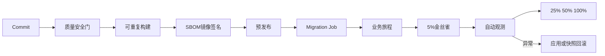

### 18.2 切换前核对

```text
订单数量和金额
支付成功数量和金额
退款数量和金额
库存总量和有效预占
福利余额和Journal
卡券状态数量和核销
供应商应付和结算
平台分销集团商城利润
未对账未结算未开票数量
Provider Cursor和Mapping
Reporting Watermark
```

### 18.3 删除顺序

1. 网关开启维护页，停止旧版本新会话和全部写流量。
2. 排空旧请求、队列和Outbox，释放Job Lease，停止全部旧实例。
3. 创建已演练可恢复整库快照。
4. 离线执行Target Schema、Backfill、对账和删旧；任一差异终止。
5. 启动只包含新Router、新Contract和新Schema的ApiMain、JobsMain和六端制品。
6. 在未对外开流前完成Smoke、Scope、Provider Health和业务不变量验证。
7. 只对新制品分段开放流量；异常时停新制品并整库恢复旧快照与匹配的整个旧制品。
8. 稳定期后关闭旧凭据、数据库角色、队列、域名和部署资源，仅保留不可变审计制品。

---

## 19. Definition of Done

### 19.1 单需求Released

- Requirement ID与Excel行互相定位。
- UI Route、API、Command/Query、Module、Data Owner和Test登记完整。
- 正常、拒绝、冲突、重复、并发、超时、补偿和越权路径有证据。
- 没有Mock、Toast、LocalStorage或不可达组件冒充实现。
- 真实依赖或正式沙箱已联调。
- 日志、Metric、Trace、Audit、Alert和Runbook存在。
- 性能、安全、隐私和可访问性达标。
- 业务验收与唯一发布制品关联。

### 19.2 单模块完成

- Domain、Application、Infrastructure、Interface方向正确。
- 业务规则只在聚合、Policy或Domain Service。
- Contract版本化且SDK无漂移。
- Migration可Fresh Replay、升级和恢复。
- Outbox、Inbox、Idempotency、Retry和Deadletter完整。
- Permission、Capability、Scope、StepUp、Risk和Audit完整。
- SLO、Dashboard、Runbook和Owner明确。

### 19.3 系统完成

- Excel 296条独立需求全部Released。
- MVP 21项全部Released。
- Excel接口20项都有准确状态；优先级1十一项全部Integrated并Accepted。
- 六客户端全部使用真实Route、统一SDK和真实后端。
- 订单、库存、支付、退款、卡券、福利和账务不变量在并发及故障下成立。
- 生产依赖图中没有Mock、Simulation、兼容层、旧Route、旧RPC和重复真值。
- 全新环境可由Commit、Lock和SecretRef自动构建、迁移、部署。
- 金丝雀、回滚、备份恢复、队列重放和密钥轮换均有演练证据。
- 产品、业务、财务、安全、法务、运维共同签署上线。

---

## 20. 最终执行原则

1. 先恢复可复现工程，再补业务。
2. 先确定Contract和不变量，再写UI和Repository。
3. 优先复用经过验证的业务语义，不复用错位的文件边界。
4. 新功能通过Module、Workstation或Extension Registry接入，不修改核心switch。
5. 所有批量和异步工作都有幂等、Cursor、租约、重试、Deadletter和审计。
6. 所有指标都带口径版本和Watermark。
7. 所有外部能力都带真实合同、沙箱、错误映射、限流、监控和Runbook。
8. 旧路径只在替代链路验收后删除，但删除是最终强制步骤，不形成长期兼容层。
9. 状态由证据推进：Missing → Designed → Implemented → Integrated → Accepted → Released。
10. 最终目标不是“代码很多”，而是每个业务事实只有一个Owner、每个写命令只有一条受控路径、每次失败都可恢复、每条需求都能追到生产证据。
