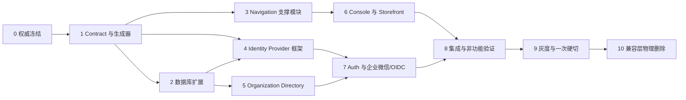
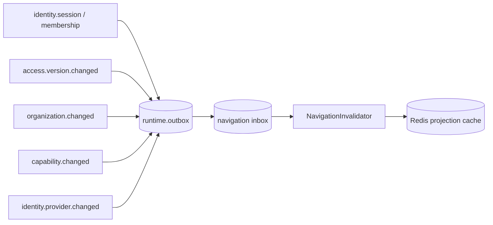
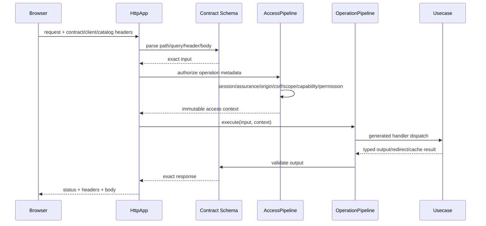
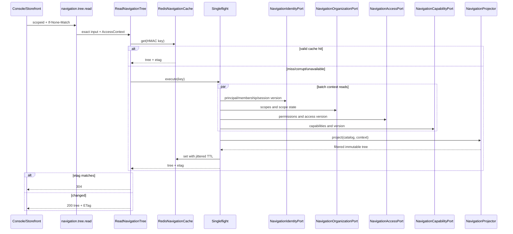
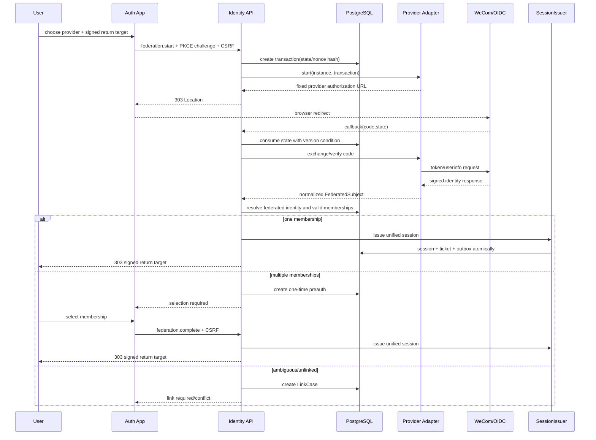
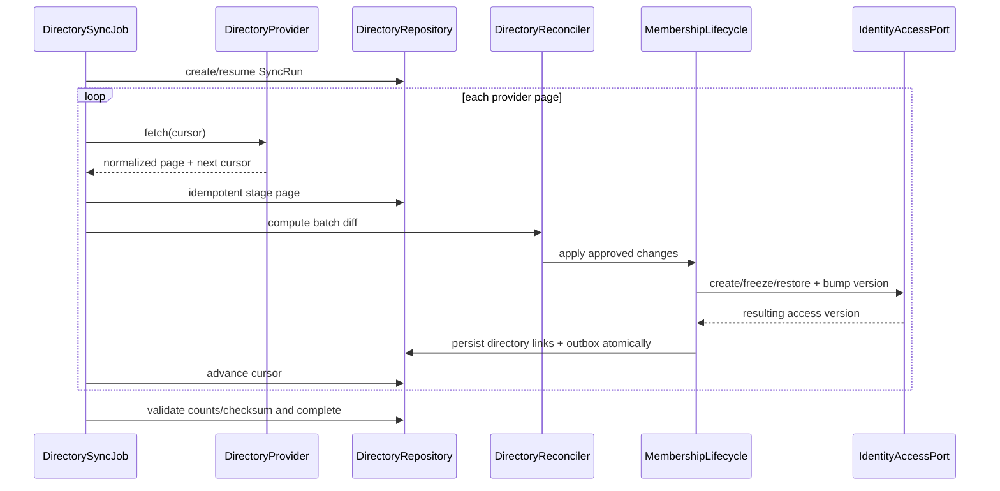
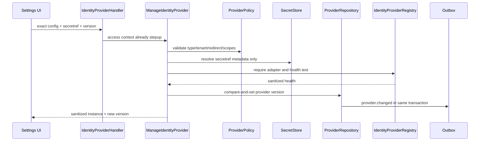
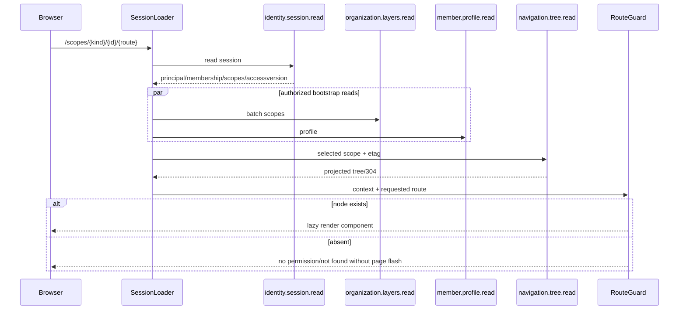

# 统一导航与单点登录代码修改清单

> 状态：实施设计稿，不代表代码已经修改。  
> 适用仓库：`zhudatuan` 当前工作区。  
> 目标：把《统一导航与单点登录方案》和《整体架构优化方案》无损合并为可按文件执行、可逐项验收、可一次硬切的代码修改清单。

## 1. 结论与不可变约束

本次改造的最终形态是：一个 Commerce 模块化单体制品、一个 PostgreSQL 事实源、一份 Canonical Contract、一个 Identity Broker、一个服务端导航投影模块、三个前端壳应用，以及通过端口和声明式清单即插即用的外部身份与业务渠道扩展。

必须同时满足以下约束，任何实现细节都不得绕开：

1. `navigation` 只回答“当前主体在当前目标端和当前作用域应看到什么”，绝不回答“当前请求是否允许执行”。后端 `AccessPipeline` 对每个操作重新鉴权；隐藏菜单不是安全边界。
2. SSO 只完成身份认证、身份关联、成员身份选择和统一会话签发；权限来源仍是 `access`，组织归属仍是 `organization`，能力开通仍是 `capability`。
3. 企业微信和 OIDC 都是 `identity` 的 Provider Adapter；企业微信通讯录同步是 `organization` 的 Directory Adapter。不得新增 SSO 微服务、企业微信业务模块或第二套会话系统。
4. Excel 中的 28 个业务限界上下文保持不变。新增 `navigation` 是支撑投影模块，不加入 `BUSINESS_MODULES`；最终装载顺序是 `runtime + observability + navigation + 28 business modules`。
5. Console、Storefront 和 Auth 都调用同一个 `services/commerce` API，使用同一套 Session、Auth Ticket、PKCE、Return Target、CSRF、Risk、Step-up 和 Access Version 机制。
6. 菜单定义只存在于 `config/navigation.yml`；操作定义只存在于 `packages/contract/definitions/operations.yml`；MVP 要求只以 Excel 为权威，`config/requirements.yml` 只保存无法从 Excel 推导的显式映射与澄清，不复制名称、优先级或路由。
7. 导航不建数据库表。编译后的 Catalog 随 Commerce 制品发布；个体导航树仅在 Redis 中短期缓存，缓存失效时可从权威数据重建。
8. 只发布强类型 v2 Contract。禁止 `Record<string, unknown>`、宽泛 `additionalProperties`、本地重复 DTO、手写 SDK 路径和通过字符串猜测响应结构。
9. 迁移期可以短暂使用扩展、回填、校验、强制、收缩步骤，但正式切换后必须删除旧目录、旧入口、旧 Cookie、旧角色、旧配置、旧适配器和双写逻辑；不保留兼容别名与辅助旁路。
10. 除脚本、配置、SQL 和测试外，新生产目录和文件名只使用简洁、有意义的字母数字名称，不使用 `_`、`-` 或多重后缀。现存生产文件的连接符或 `.generated.ts` 命名在本次硬切中一并消除。
11. MVP 范围严格限定为 `MVP03` 至 `MVP23` 和 11 个优先级 1 渠道。优先级 3、4 渠道、Miniapp、演示页、Mock、Fallback 和非 MVP 导航不得进入上线门禁。
12. Excel 中 `MVP04` 的“分销层”缺少业务说明，`MVP11`、`MVP20` 的“粉类”缺少定义。三项必须标记为 `releaseBlocker`，由产品补齐；代码不得自行猜测含义。

## 2. 权威来源与冲突裁决

| 优先级 | 权威来源                                          | 负责事实                                                         | 禁止重复的位置                                  |
| ------ | ------------------------------------------------- | ---------------------------------------------------------------- | ----------------------------------------------- |
| 1      | `docs/福利商城功能清单.xlsx` 的 `MVP上线功能清单` | MVP 编号、层级、模块、功能、描述                                 | TypeScript 常量、导航标题、测试内硬编码需求文本 |
| 1      | `docs/福利商城功能清单.xlsx` 的 `接口`            | 供应商、接口类型、优先级                                         | Provider 代码内优先级、手工 P1 名单             |
| 2      | `packages/contract/definitions/*.yml`             | 操作、事件、错误、能力、输入输出、安全元数据                     | HTTP 路由硬编码、前端本地 API 类型              |
| 2      | `config/navigation.yml`                           | 导航节点、父子关系、显示顺序、作用域、组件键、入口操作、MVP 映射 | `FeatureManifest` 的标题、菜单顺序、权限和能力  |
| 2      | `config/requirements.yml`                         | Excel 无法表达的模块、旅程、表、操作、澄清映射                   | 重复路由、重复标题、重复 P1 列表                |
| 2      | `extensions/channel/*/Manifest.ts`                | P1 渠道插件能力、端点用途、Secret Ref、Webhook 声明              | Provider 实现中的环境地址、优先级和密钥         |
| 3      | `packages/config`                                 | 环境读取、配置 Schema、默认安全阈值、引用解析                    | 各应用独立 `process.env` 读取                   |
| 3      | 生成物                                            | 只读的类型、Catalog、SDK、数据库 Contract                        | 手工编辑生成物                                  |

出现冲突时按下列规则裁决：

- “28 个业务模块”与“新增 navigation 模块”不冲突：前者是 Excel 业务限界上下文，后者是共享支撑模块。`BUSINESS_MODULES.length` 仍必须等于 28，并新增独立 `SUPPORT_MODULES.length === 1` 门禁。
- Console 与 Storefront 会调用相同身份端点，现有 `audience: storefront` 不正确。Contract 新增 `public` Audience，表示“不绑定 console/storefront 目标端”，并不表示匿名；是否需要登录仍由 `assuranceLevel` 决定。
- Group 和 Mall 可以复用同一路由、同一 React 组件，但必须拥有不同导航 ID、标题和入口操作。Catalog 路由唯一键是 `(surface, scopeKind, route)`，不是全局 `route`。
- 现有 `benefit`、`marketing` 功能代码继续服务业务流程，但不得作为 MVP 一级菜单；保留详情路由和工作流入口，移出主导航 Catalog。
- 企业微信不属于 11 个 P1 业务渠道。P1 渠道仍只来自 Excel `接口` Sheet；企业微信是身份/目录基础设施。

## 3. 修改动作标记与实施顺序

下文使用以下标记：

- `A`：新增文件或目录。
- `M`：修改并复用现有实现。
- `R`：移动或重命名，保留有效逻辑，不保留旧入口。
- `D`：切换并验证后物理删除。
- `G`：只能由生成器产生，禁止手工编辑。
- `K`：明确保留且不改变职责。

实施必须按以下依赖图推进。前一阶段门禁未通过，不得开始后一阶段的破坏性收缩：



### 3.1 阶段门禁

| 阶段 | 必须通过后才能继续的门禁                                                                   |
| ---- | ------------------------------------------------------------------------------------------ |
| 0    | Excel Hash、MVP03–MVP23、11 个 P1 Provider、三个需求 Blocker（两个未定义术语）均可机器验证 |
| 1    | Contract lint、生成物零漂移、所有新增操作强类型、Audience/安全元数据完整                   |
| 2    | 新表和索引可在线创建，回填可重入，RLS 和最小权限检查通过                                   |
| 3    | Catalog 编译、Projection、缓存降级、无权限节点泄漏、100 节点上限通过                       |
| 4    | 密码/OTP/微信/企微/OIDC 共用 SessionIssuer，关联冲突进入 LinkCase                          |
| 5    | 全量/增量/回调同步幂等，离职立即失效，脏数据不直接改授权                                   |
| 6    | Console/Storefront 无本地菜单事实，深链与作用域切换不越权                                  |
| 7    | 跨域 SSO、PKCE、State/Nonce、Return Target、Cookie、CSRF、Step-up 全部通过                 |
| 8    | MVP 旅程、安全、故障演练、性能、恢复、可观测性门禁全部通过                                 |
| 9    | 灰度指标稳定、回滚窗口内没有数据语义分叉、变更冻结                                         |
| 10   | 兼容目录和旧入口不存在，仓库扫描不能发现旧域名/Cookie/角色/配置                            |

## 4. 目标模块与依赖边界

### 4.1 Commerce 装载清单

`services/commerce/src/app/modules.ts` 必须调整为三个显式集合：

```ts
export const SUPPORT_MODULES = [NavigationModule] as const;
export const BUSINESS_MODULES = [
  /* 现有 28 个，顺序按拓扑规则 */
] as const;
export const COMMERCE_MODULES = [RuntimeModule, ObservabilityModule, ...SUPPORT_MODULES, ...BUSINESS_MODULES] as const;
```

必须新增以下不变量：

- `BUSINESS_MODULES.length === 28`；任何导航或身份 Adapter 都不能挤入该数组。
- `SUPPORT_MODULES.length === 1`，唯一成员是 `navigation`。
- `COMMERCE_MODULES.length === 31`。
- `navigation` 只依赖 `identity`、`access`、`organization`、`capability` 的 Public Port，不得直接访问它们的表、Repository 或内部服务。
- `identity` 不依赖 React 应用，不读取菜单 Catalog；`organization` 不签发 Session；`access` 不调用企业微信 SDK。

### 4.2 新增端口

| 所有者       | 文件                                                                              | 端口                         | 最小职责                                                           |
| ------------ | --------------------------------------------------------------------------------- | ---------------------------- | ------------------------------------------------------------------ |
| identity     | `services/commerce/src/modules/identity/public/NavigationIdentityPort.ts`         | `NavigationIdentityPort`     | 读取 Principal、有效 Membership、Assurance、Session Access Version |
| access       | `services/commerce/src/modules/access/public/NavigationAccessPort.ts`             | `NavigationAccessPort`       | 批量计算有效 Permission/Role，返回当前 Access Version              |
| organization | `services/commerce/src/modules/organization/public/NavigationOrganizationPort.ts` | `NavigationOrganizationPort` | 批量读取可选 Scope、层级、状态和默认 Scope                         |
| capability   | `services/commerce/src/modules/capability/public/NavigationCapabilityPort.ts`     | `NavigationCapabilityPort`   | 批量读取 Scope 有效 Capability 和版本                              |
| organization | `services/commerce/src/modules/organization/public/IdentityOrganizationPort.ts`   | 复用并扩展                   | 校验 Directory Tenant、成员状态和企业归属，不暴露 Repository       |
| access       | `services/commerce/src/modules/access/public/IdentityAccessPort.ts`               | 复用并扩展                   | 成员创建/冻结/离职、Access Version 递增、Session 撤销              |

所有批量端口都必须一次接收完整 ID 集合并返回不可变 Map，禁止导航 Projection 在循环中产生 N+1 查询。端口方法只返回领域需要的最小数据，不返回数据库 Row。

### 4.3 领域事件依赖

导航缓存失效必须由既有 Outbox/Inbox 事件驱动，而不是前端轮询数据库：



`navigation` 只消费事件并删除/换代缓存键；不得回写上述领域。重复事件通过 Inbox Key 幂等吞掉，乱序事件通过单调 Version 拒绝回退。

## 5. 权威、配置、生成器与命名修改点

### 5.1 权威配置

| 动作 | 文件                                     | 精确修改点                                                                                                                                 | 验收                                                          |
| ---- | ---------------------------------------- | ------------------------------------------------------------------------------------------------------------------------------------------ | ------------------------------------------------------------- |
| M    | `config/authorities.yml`                 | 保留 Excel 文件、Sheet 和 SHA-256；新增 `navigation` 与 `contract` 权威条目及生成物去向，不复制业务内容                                    | Hash 与实际工作簿一致；缺文件、错 Sheet、Hash 漂移立即失败    |
| M    | `config/requirements.yml`                | 删除每个 MVP 条目里的单值 `route`；保留模块、操作、表、旅程、澄清；将 `MVP04`、`MVP11`、`MVP20` 标记为 `releaseBlocker`                    | 不再存在第二份路由事实；Blocker 未解决时 release gate 失败    |
| A    | `config/navigation.yml`                  | 新增唯一导航源；包含版本、Surface、ScopeKind、节点、父节点、顺序、组件键、路由、入口操作、所需 Permission/Capability、需求编号、空状态策略 | Schema 校验、无环、父节点存在、同作用域路由唯一、入口操作存在 |
| A    | `config/identityproviders.yml`           | 只定义 Provider 类型 Schema、允许的回调基址、默认超时、熔断、缓存和密钥引用规则；不存租户实例或密钥值                                      | 无明文 Secret；环境差异只通过引用注入                         |
| M    | `config/naming.yml`                      | 将生产文件多后缀和连接符规则收紧；显式禁止 `.generated.ts`，脚本/配置/SQL/测试维持例外                                                     | 全仓生产命名检查零违规                                        |
| M    | `config/artifacts.json`                  | 将 `navigation.yml`、Identity Provider 配置、Navigation 生成物加入唯一 Commerce 制品输入；不新增单独 SSO 制品                              | Build graph 仍只有一个 Commerce API/Jobs 制品                 |
| M    | `config/requirements.yml` 的 `providers` | 将 20 个 `{id,label}` 改为仅含稳定 ID 与 Excel 行号的映射；名称、类别、备注、优先级全部从 Excel 读取                                       | 不复制 Excel 文案；Provider audit 与 Excel P1 集合完全相等    |
| K    | `extensions/channel/*/Manifest.ts`       | 11 个现有 P1 插件继续声明技术能力和 Secret Ref；不写 Excel 优先级，不写企业微信/OIDC                                                       | 已安装插件集合恰好覆盖 P1，不创建 P3/P4 空壳                  |

`config/navigation.yml` 的节点 Schema 必须至少包含：

```yaml
version: 1
nodes:
  - id: groupdashboard
    surface: console
    scope: enterprise
    parent: null
    title: 集团首页
    icon: dashboard
    route: /group/dashboard
    component: control
    order: 10
    entry: organization.layers.read
    permissions: [organization.layers.read]
    capabilities: []
    requirements: [MVP05]
    empty: hide
```

字段规则：

- `id`、`component`、`icon` 只允许小写字母数字，作为稳定机器键，不承载中文语义。
- `title` 允许中文，但必须与 Excel 功能名或经批准的导航文案映射一致。
- `entry` 必须是能成功渲染首页的最小只读 Operation，不能填写 Health 或占位操作。
- `permissions` 是投影过滤条件，不替代请求鉴权；最终请求仍按 Operation Contract 的 Permission 校验。
- `capabilities` 是交付/套餐过滤条件；空数组表示无额外能力要求。
- `requirements` 至少一个；非 MVP 管理能力只能挂到对应 MVP 设置节点，不得伪造新 MVP 编号。
- `empty` 只能是 `hide` 或 `showdisabled`；MVP 一级入口默认 `hide`，整棵树为空时展示无权限空状态。
- Catalog 不允许写人员、租户、角色实例、Access Version 或 Secret。

### 5.2 Requirement 生成链

| 动作 | 文件                                                                                                                        | 精确修改点                                                                                                                                                                                                                                            |
| ---- | --------------------------------------------------------------------------------------------------------------------------- | ----------------------------------------------------------------------------------------------------------------------------------------------------------------------------------------------------------------------------------------------------- |
| M    | `tools/requirementgen/src/RequirementGenerator.ts`                                                                          | 同时读取 Excel、`requirements.yml`、`navigation.yml`、Operations 和 Extension Manifest；从 Navigation 节点反向生成一个 MVP 对多个 Navigation/Route 的映射；从 Excel 生成 Provider 名称/分类/优先级；输出 Workbook Hash、Catalog Hash 和 Contract Hash |
| G/R  | `packages/contract/src/generated/RequirementCatalog.generated.ts` → `packages/contract/src/generated/RequirementCatalog.ts` | 生成强类型 `RequirementId`、`RequirementCatalog`、`NavigationIds`、`OperationIds`、`JourneyIds`；删除旧文件和全部旧 Import                                                                                                                            |
| M    | `scripts/audit/requirements.mjs`                                                                                            | 删除“一个 MVP 只能有一个 route”的假设；验证 Excel→Navigation→Component→Operation→Handler→Table→Journey 的完整链；验证三个 Blocker；验证 P1 Provider 恰为 11 个                                                                                        |
| M    | `scripts/evidence/frontendmanifest.mjs`                                                                                     | 从生成的 Navigation/Requirement Catalog 取证，不扫描已删除的本地菜单 Manifest                                                                                                                                                                         |
| M    | `scripts/check/generated.mjs`                                                                                               | 把 Navigation Catalog 和所有改名生成物加入零漂移校验                                                                                                                                                                                                  |

生成过程必须可复现：相同输入在任意机器输出逐字节相同；排序只按显式 `order` 和稳定 ID；禁止使用当前时间、绝对路径和对象插入顺序参与 Hash。

### 5.3 Navigation 生成器

| 动作 | 文件                                                                                   | 精确修改点                                                                                                                      |
| ---- | -------------------------------------------------------------------------------------- | ------------------------------------------------------------------------------------------------------------------------------- |
| A    | `tools/navigationgen/package.json`                                                     | 新增 workspace 工具，只依赖 YAML Parser、Contract 类型和通用生成基础库                                                          |
| A    | `tools/navigationgen/src/NavigationGenerator.ts`                                       | 解析、规范化、排序、校验、计算 SHA-256，并生成服务端 Catalog、前端绑定类型和证据文件                                            |
| A    | `tools/navigationgen/src/NavigationSchema.ts`                                          | 定义严格输入 Schema；所有对象 `additionalProperties: false`                                                                     |
| A    | `tools/navigationgen/src/NavigationValidator.ts`                                       | 校验无环、父子 Surface/Scope 合法、`(surface, scope, route)` 唯一、组件键存在、Operation/Permission/Capability/Requirement 存在 |
| A    | `tools/navigationgen/src/main.ts`                                                      | 唯一 CLI 入口；支持 `generate` 与 `check`，check 只比较不写文件                                                                 |
| G    | `services/commerce/src/modules/navigation/infrastructure/catalog/NavigationCatalog.ts` | 生成冻结后的服务端节点数组、索引 Map、版本和 Hash                                                                               |
| G    | `apps/console/src/generated/NavigationBinding.ts`                                      | 只生成 `NavigationId`、`ComponentKey`、`RouteKey` 类型，不生成 React 组件或权限判断                                             |
| G    | `apps/storefront/src/generated/NavigationBinding.ts`                                   | 同上，范围仅 Storefront Surface                                                                                                 |
| M    | `package.json`                                                                         | `generate` 中按 `contractgen → navigationgen → requirementgen` 顺序执行；`check:navigation` 使用新生成器                        |

### 5.4 生产生成物重命名

硬切时删除所有旧 Import，不保留转发文件：

| 动作 | 旧文件                                                            | 新文件                                                  |
| ---- | ----------------------------------------------------------------- | ------------------------------------------------------- |
| R/G  | `packages/contract/src/generated/ContractIdentity.generated.ts`   | `packages/contract/src/generated/ContractIdentity.ts`   |
| R/G  | `packages/contract/src/generated/ErrorContract.generated.ts`      | `packages/contract/src/generated/ErrorContract.ts`      |
| R/G  | `packages/contract/src/generated/RequirementCatalog.generated.ts` | `packages/contract/src/generated/RequirementCatalog.ts` |
| R/G  | `packages/sdk/src/generated/CommerceClient.generated.ts`          | `packages/sdk/src/generated/CommerceClient.ts`          |
| R/G  | `services/commerce/src/generated/HandlerCatalog.generated.ts`     | `services/commerce/src/generated/HandlerCatalog.ts`     |
| R/G  | `services/commerce/src/generated/EventRegistry.generated.ts`      | `services/commerce/src/generated/EventHandlers.ts`      |
| R/G  | `services/commerce/src/generated/RuntimeCatalog.generated.ts`     | `services/commerce/src/generated/RuntimeCatalog.ts`     |

生成器模板、Barrel Export、tsconfig 路径、审计脚本和测试快照必须在同一提交更新。旧文件在仓库、构建产物和 Sourcemap 中都不得残留。

## 6. Canonical Contract 修改点

### 6.1 Contract 模型

| 动作 | 文件                                             | 精确修改点                                                                                                                                             | 设计理由                                             |
| ---- | ------------------------------------------------ | ------------------------------------------------------------------------------------------------------------------------------------------------------ | ---------------------------------------------------- |
| M    | `packages/contract/src/Operation.ts`             | `OperationAudience` 增加 `public`；新增 `originPolicy`、`csrfPolicy`、`responseMode`、`cachePolicy`、`targetPolicy`、`idempotencyPolicy`；所有枚举封闭 | 把 HTTP 安全行为从 Handler/路由硬编码收敛到 Contract |
| M    | `packages/contract/src/CommerceSchemas.ts`       | 删除新增操作对 `exactOperationInput` 和宽泛 JSON Body 的依赖；支持 Query/Path/Header/Body 分区强类型 Schema；所有对象严格模式                          | 防止脏字段和协议漂移                                 |
| M    | `packages/contract/definitions/operations.yml`   | 增加 Navigation、Federation、Provider、Link、Directory 操作；修正共享身份操作 Audience；给每个写操作声明 Origin/CSRF/Idempotency                       | 唯一操作事实源                                       |
| M    | `packages/contract/definitions/events.yml`       | 新增身份关联、Provider、Directory、Access/Capability/Navigation 变更事件                                                                               | 缓存失效和审计解耦                                   |
| M    | `packages/contract/definitions/errors.yml`       | 新增稳定业务错误；Protocol/SDK 错误只在 Adapter 映射，不透传                                                                                           | 客户端不依赖供应商错误码                             |
| M    | `packages/contract/definitions/capabilities.yml` | 增加 `identity.federation`、`identity.directory` 管理能力；导航读取本身不设套餐能力                                                                    | 防止把基础登录变成菜单授权                           |
| M    | `tools/contractgen/src/ContractGenerator.ts`     | 生成严格 Zod/JSON Schema/OpenAPI/SDK/Handler Catalog/DB Contract；生成 `cachePolicy=etag` 的 304 类型分支                                              | 一次定义，全链复用                                   |
| M    | `tools/contractgen/src/ClientArtifacts.ts`       | 识别 `public` Audience 和 `303/304`；生成浏览器重定向与条件请求方法                                                                                    | Console/Auth/Storefront 无手写 Fetch                 |

`public` 的语义必须精确实现：

- `public + assuranceLevel: anonymous`：可匿名访问，例如 Provider 列表、Federation Start/Callback。
- `public + assuranceLevel: session`：Console 和 Storefront 均可调用，但必须有有效 Session，例如 Navigation Tree、Link 管理。
- `console`：`x-client-target` 必须是 Console。
- `storefront`：`x-client-target` 必须是 Storefront。
- `system`、`webhook`：只能由对应工作负载/签名通道进入，浏览器客户端不能伪装。

### 6.2 新增操作清单

| Operation ID                             | Method/Path                                                   | Audience | Assurance | Permission                      | Response/安全策略                               |
| ---------------------------------------- | ------------------------------------------------------------- | -------- | --------- | ------------------------------- | ----------------------------------------------- |
| `navigation.tree.read`                   | `GET /api/v1/navigation`                                      | public   | session   | 无额外 Permission               | ETag；输入 `scopeid`；输出已过滤树；支持 304    |
| `navigation.catalog.read`                | `GET /api/v1/navigation/catalog`                              | console  | stepup    | `navigation.catalog.read`       | 只返回脱敏编译信息，不返回个体权限              |
| `navigation.health.read`                 | `GET /api/v1/navigation/health`                               | system   | service   | `runtime.health.read`           | 供 Readiness/运维调用                           |
| `identity.providers.read`                | `GET /api/v1/identity/providers`                              | public   | anonymous | 无                              | 按目标域和企业上下文返回已启用登录方式          |
| `identity.federations.start`             | `POST /api/v1/identity/federations`                           | public   | anonymous | 无                              | same-origin、CSRF、PKCE、幂等键；返回 303 目标  |
| `identity.federations.callback`          | `GET /api/v1/identity/federations/{providerid}/callback`      | public   | anonymous | 无                              | 一次性 State；只允许 303 到已签名 Return Target |
| `identity.federations.selection.read`    | `GET /api/v1/identity/federations/selection`                  | public   | preauth   | 无                              | 只读一次性 Preauth 的候选 Membership            |
| `identity.federations.complete`          | `POST /api/v1/identity/federations/selection`                 | public   | preauth   | 无                              | CSRF；消费 Preauth；签发统一 Session            |
| `identity.links.read`                    | `GET /api/v1/identity/links`                                  | public   | session   | `identity.link.read`            | 仅当前 Principal 或授权管理员                   |
| `identity.links.create`                  | `POST /api/v1/identity/links`                                 | public   | stepup    | `identity.link.manage`          | CSRF、幂等键、再次验证 Provider                 |
| `identity.links.revoke`                  | `DELETE /api/v1/identity/links/{linkid}`                      | public   | stepup    | `identity.link.manage`          | 不允许撤销最后一个可用登录凭据                  |
| `identity.providers.manage`              | `PUT /api/v1/identity/providers/{providerid}`                 | console  | stepup    | `identity.provider.manage`      | 只接收 Secret Ref；审计前后差异                 |
| `identity.providers.test`                | `POST /api/v1/identity/providers/{providerid}/tests`          | console  | stepup    | `identity.provider.test`        | 限流；结果脱敏；禁止任意 URL                    |
| `organization.directories.read`          | `GET /api/v1/organization/directories`                        | console  | session   | `organization.directory.read`   | 只返回状态、版本和最近同步摘要                  |
| `organization.directories.manage`        | `PUT /api/v1/organization/directories/{directoryid}`          | console  | stepup    | `organization.directory.manage` | 只接收允许字段和 Secret Ref                     |
| `organization.directories.sync`          | `POST /api/v1/organization/directories/{directoryid}/syncs`   | console  | stepup    | `organization.directory.sync`   | 幂等键；返回 Job ID，不同步阻塞 HTTP            |
| `organization.directories.syncruns.read` | `GET /api/v1/organization/directories/{directoryid}/syncruns` | console  | session   | `organization.directory.read`   | 游标分页、稳定排序                              |
| `organization.directoryevents.receive`   | `POST /api/v1/organization/directories/{directoryid}/events`  | webhook  | signed    | 无 RBAC                         | 原始 Body 验签、Replay 防护、快速入 Inbox       |

既有 `identity.sessions.create`、`identity.otps.*`、`identity.tickets.*`、微信登录操作保留业务语义，但必须迁移到同一 SessionIssuer 和 Federation 流程；旧 URL/DTO 不保留兼容路由。

### 6.3 新增稳定错误

`errors.yml` 至少新增并为每个错误定义 HTTP 状态、是否可重试、是否应审计、客户端展示策略：

- `IDENTITY_PROVIDER_UNAVAILABLE`
- `IDENTITY_PROVIDER_DISABLED`
- `IDENTITY_PROVIDER_CONFIGURATION_INVALID`
- `FEDERATION_TRANSACTION_INVALID`
- `FEDERATION_TRANSACTION_EXPIRED`
- `FEDERATION_TRANSACTION_CONSUMED`
- `FEDERATION_CALLBACK_REJECTED`
- `FEDERATION_SUBJECT_REVOKED`
- `FEDERATION_LINK_REQUIRED`
- `FEDERATION_LINK_CONFLICT`
- `MEMBERSHIP_SELECTION_REQUIRED`
- `ACCESS_VERSION_STALE`
- `NAVIGATION_SCOPE_DENIED`
- `NAVIGATION_EMPTY`
- `NAVIGATION_CATALOG_MISMATCH`
- `DIRECTORY_SYNC_STALE`

Adapter 内部的 `invalid_grant`、`invalid_client`、企业微信 `errcode`、DNS/TLS 异常必须映射到上述稳定错误并写入受限审计细节，绝不能原样返回浏览器。

### 6.4 事件清单

新增或规范以下事件，Payload 必须包含事件 ID、Aggregate ID、Tenant/Scope、Version、OccurredAt、Correlation ID，不得包含 Token、Code、Secret、完整手机号或企业微信明文 Subject：

- `identity.federation.linked`
- `identity.federation.rejected`
- `identity.provider.changed`
- `identity.session.created`
- `identity.session.revoked`
- `organization.directory.changed`
- `organization.directory.synced`
- `organization.membership.changed`
- `access.version.changed`
- `capability.changed`
- `navigation.catalog.changed`

`access.version.changed` 只能由 `access` 发布；`navigation` 只消费。不得在 Identity 或 Directory 中复制 Access Version 计算逻辑。

## 7. HTTP、SDK 与统一请求管线修改点

| 动作 | 文件                                                                | 精确修改点                                                                                                                                                              |
| ---- | ------------------------------------------------------------------- | ----------------------------------------------------------------------------------------------------------------------------------------------------------------------- |
| M    | `services/commerce/src/foundation/security/AccessPipeline.ts`       | 完整实现 Audience：Console/Storefront 精确匹配，Public 接受两者，System/Webhook 拒绝浏览器；保持 Session→Assurance→Origin/CSRF→Scope→Capability→Permission→Handler 顺序 |
| M    | `services/commerce/src/foundation/application/OperationPipeline.ts` | 在 Handler 前解析严格 Schema；执行后解析输出；把 ETag、303、304、Cookie 指令作为强类型 Operation Response 交给 HTTP 层                                                  |
| M    | `services/commerce/src/foundation/interface/HttpApp.ts`             | 删除公开写 Operation ID Set；完全按 Contract 的 `originPolicy/csrfPolicy/responseMode/cachePolicy` 执行；Callback 支持安全 303；304 不写 Body；统一安全 Header          |
| M    | `packages/sdk/src/ApiClient.ts`                                     | 增加 Catalog Version、`If-None-Match`、303 禁止自动跨域跟随、304 强类型结果；继续自动发送 Contract Version/Client Target/Request ID                                     |
| M    | `packages/sdk/src/Transport.ts`                                     | 返回状态、响应 Header 和解析后数据；只对 Contract 声明允许的 2xx/303/304 建模；其他统一映射 Error Contract                                                              |
| M    | `packages/sdk/src/FetchTransport.ts`                                | `redirect: manual`；Credentials/Origin 策略固定；AbortSignal 和总超时；响应体大小上限；禁止静默解析 HTML                                                                |
| M    | `packages/authz/src/SecureOperationPolicy.ts`                       | Permission 为 `null` 时只表示无需 RBAC，不再用 Operation ID 兜底；每个非匿名管理操作必须在 Contract 明确 Permission                                                     |
| M    | `services/commerce/src/bootstrap/RuntimeReadiness.ts`               | 增加 Navigation Catalog Hash、Identity Provider Registry、Directory Job、Redis 降级状态；关键 Contract/DB 不匹配拒绝启动，Redis 故障只标 degraded                       |

统一请求时序：



任何 Controller、Handler 或 React Hook 都不得重复上述校验。业务 Usecase 只接收已验证的 Input 和 Access Context，但仍要维护领域不变量与资源归属校验。

## 8. Navigation 支撑模块逐文件修改点

### 8.1 目标目录

```text
services/commerce/src/modules/navigation/
├── NavigationModule.ts
├── Manifest.ts
├── application/
│   ├── NavigationOperations.ts
│   ├── projection/
│   │   ├── NavigationProjector.ts
│   │   ├── NavigationFilter.ts
│   │   ├── NavigationSorter.ts
│   │   └── NavigationVersion.ts
│   ├── query/
│   │   ├── ReadNavigationTree.ts
│   │   ├── ReadNavigationCatalog.ts
│   │   └── ReadNavigationHealth.ts
│   └── port/
│       ├── NavigationCache.ts
│       └── NavigationClock.ts
├── domain/
│   ├── model/
│   │   ├── NavigationNode.ts
│   │   ├── NavigationTree.ts
│   │   ├── NavigationContext.ts
│   │   └── NavigationKey.ts
│   └── policy/
│       ├── VisibilityPolicy.ts
│       └── ScopePolicy.ts
├── infrastructure/
│   ├── cache/
│   │   ├── RedisNavigationCache.ts
│   │   └── NavigationInvalidator.ts
│   └── catalog/
│       └── NavigationCatalog.ts
├── interface/
│   ├── handler/
│   │   ├── NavigationTreeHandler.ts
│   │   ├── NavigationCatalogHandler.ts
│   │   └── NavigationHealthHandler.ts
│   └── event/
│       └── NavigationEventHandler.ts
└── public/
    ├── NavigationPort.ts
    └── index.ts
```

所有目录名和生产文件名均无连接符。`NavigationCatalog.ts` 是生成物但名称仍遵守生产规则。

### 8.2 文件职责

| 动作 | 文件                                                                           | 精确职责与修改                                                                                                      |
| ---- | ------------------------------------------------------------------------------ | ------------------------------------------------------------------------------------------------------------------- |
| A    | `services/commerce/src/modules/navigation/Manifest.ts`                         | 声明模块 ID、Public Port、依赖的四个 Navigation Port、3 个 Operation 和事件消费者；禁止声明数据库表所有权           |
| A    | `services/commerce/src/modules/navigation/NavigationModule.ts`                 | 只负责组合依赖和注册；不得含过滤规则或 SQL                                                                          |
| A    | `services/commerce/src/modules/navigation/application/NavigationOperations.ts` | 实现 `OperationUsecase` 的小型路由表；把 Operation ID 映射到三个 Query；不写 `switch provider`                      |
| A    | `.../projection/NavigationProjector.ts`                                        | 并发批量读取 Identity/Access/Organization/Capability，组装 `NavigationContext`，调用纯领域 Filter/Sorter，生成 ETag |
| A    | `.../projection/NavigationFilter.ts`                                           | 纯函数：Surface、Scope、状态、Permission、Capability、父子可达性过滤；子节点全部隐藏时按 Catalog 策略处理父节点     |
| A    | `.../projection/NavigationSorter.ts`                                           | 稳定按 `order → id` 排序；不得依赖配置文件对象顺序                                                                  |
| A    | `.../projection/NavigationVersion.ts`                                          | 基于 Catalog Hash、Principal、Membership、Scope、AccessVersion、CapabilityVersion 生成不可逆版本和 ETag             |
| A    | `.../query/ReadNavigationTree.ts`                                              | 校验 Scope 可选；命中缓存返回；未命中使用 Singleflight 投影；缓存写失败仍返回结果                                   |
| A    | `.../query/ReadNavigationCatalog.ts`                                           | 仅授权管理员读取脱敏 Catalog 统计、版本、孤儿检查结果；不返回其他用户投影                                           |
| A    | `.../query/ReadNavigationHealth.ts`                                            | 检查生成 Catalog 可读、Hash 匹配、Redis 状态、最近事件延迟；不得把 Redis 故障判为 API 全局不健康                    |
| A    | `.../domain/model/NavigationNode.ts`                                           | 不可变 Value Object；只含已过滤的展示数据和入口操作，不含完整权限集合                                               |
| A    | `.../domain/model/NavigationTree.ts`                                           | 根节点、Scope、Version、ETag、生成时间、Catalog Version；构造时验证节点数不超过 100、无孤儿和环                     |
| A    | `.../domain/model/NavigationContext.ts`                                        | 聚合 Projection 所需最小数据；字段只读；禁止携带数据库连接或 Service                                                |
| A    | `.../domain/model/NavigationKey.ts`                                            | 生成 Redis Key；所有输入规范化和 HMAC，避免 PII 出现在 Key 中                                                       |
| A    | `.../domain/policy/VisibilityPolicy.ts`                                        | Specification 组合：有效会话、有效成员、Scope、Permission、Capability、节点状态                                     |
| A    | `.../domain/policy/ScopePolicy.ts`                                             | 校验 ScopeKind 与组织层级，不允许客户端自报越权 Scope                                                               |
| A    | `.../cache/RedisNavigationCache.ts`                                            | 严格序列化 Schema、TTL 加抖动、最大值、可选 HMAC、读失败视为 miss、写失败记录指标                                   |
| A    | `.../cache/NavigationInvalidator.ts`                                           | 按 Principal/Membership/Scope/版本索引失效；消费重复事件幂等；失败进入重试/死信                                     |
| A    | `.../interface/event/NavigationEventHandler.ts`                                | 仅适配 Event Envelope 到 Invalidator；不直接操作 Redis Key 细节                                                     |
| A    | `.../public/NavigationPort.ts`                                                 | 只在确有后端消费者时暴露树读取能力；前端始终通过 Operation，不直接依赖实现                                          |
| M    | `services/commerce/src/app/modules.ts`                                         | 注册 `SUPPORT_MODULES`；保留 28 个业务模块不变                                                                      |
| M    | `services/commerce/src/bootstrap/CommerceRuntime.ts`                           | 从 Container 解析四个 Port、Cache、Telemetry、Clock 并装配 Navigation；不实例化业务 Repository                      |

### 8.3 投影数据流



四个上下文读取应以 `Promise.all` 并发，但每个 Port 内部必须批量查询。建议预算：

- Catalog 内存访问：`< 1ms p95`。
- Redis 命中：服务端总耗时 `< 30ms p95`。
- Redis 未命中：四个端口并发，总耗时 `< 120ms p95`。
- 树序列化后 `< 64KiB`，节点 `<= 100`，深度 `<= 4`。
- TTL 基准 5 分钟，随机抖动 ±20%；Access Version 或 Capability Version 改变可天然换 Key，事件同时主动清旧索引。
- 同一 Key 同时重建只允许一个进程内请求执行；跨实例用带 Fencing Token 的短租约，失败时允许有限重复计算但不阻塞返回。

### 8.4 缓存 Key 与降级

Key 的逻辑输入为：

```text
catalogHash + target + principalId + membershipId + scopeId + accessVersion + capabilityVersion
```

实际 Redis Key 使用服务端 HMAC 后的固定长度摘要，不能出现原始 ID。Value 必须包含 Schema Version、Catalog Hash、Tree、ETag、CreatedAt、ExpiresAt 和完整性签名。

降级规则：

1. Redis 超时、连接失败、反序列化失败或签名失败：计数并当作 miss，从 PostgreSQL 权威端口重建。
2. PostgreSQL 或 Access/Organization/Capability 权威端口失败：返回稳定 `DEPENDENCY_UNAVAILABLE`，绝不返回未过滤 Catalog 或历史其他用户树。
3. 事件消费者落后：用 Version Key 保证新请求不命中过时版本；告警但不关闭登录。
4. Catalog Hash 与前端构建 Hash 不一致：Console 触发一次软刷新；仍不一致时显示升级提示，不猜测组件。
5. 未知 Component Key：构建门禁应阻止发布；运行时仍需 fail closed，隐藏节点并上报 `NAVIGATION_COMPONENT_MISSING`。

### 8.5 Navigation 测试

| 动作 | 测试文件                                                      | 必测场景                                                                   |
| ---- | ------------------------------------------------------------- | -------------------------------------------------------------------------- |
| A    | `tests/unit/navigation/NavigationFilter.test.ts`              | Permission/Capability/Scope/父子过滤、稳定排序、空父节点、100 节点限制     |
| A    | `tests/unit/navigation/NavigationVersion.test.ts`             | 任一版本变化 ETag 必变；相同输入稳定；不泄露 PII                           |
| A    | `tests/integration/navigation/NavigationProjection.test.ts`   | 四端口批量调用、无 N+1、Redis 命中/未命中/损坏/超时                        |
| A    | `tests/integration/navigation/NavigationInvalidation.test.ts` | Access/Organization/Capability/Provider 事件、重复/乱序/死信               |
| A    | `tests/security/navigation/NavigationIsolation.test.ts`       | 跨 Principal、Membership、Scope、Target 缓存不可串读；未知组件 fail closed |
| A    | `tests/performance/navigation/NavigationBenchmark.test.ts`    | 100 节点、缓存命中/重建 p95、并发惊群和内存上限                            |

## 9. 统一导航 Catalog 明细

### 9.1 Console 主导航

下表逐行对齐 Excel `MVP上线功能清单` 的第 3–23 行。Group 与 Mall 的 9 个入口必须按 Excel 原文落地，不能被“组织/人员/账户”等底层领域名替换。组件优先复用现有 Feature；Entry Operation 均选自当前 Contract 已有的真实只读操作。

| Scope       | Navigation ID         | Excel 标题     | Route                                    | Component    | Entry Operation                | MVP   |
| ----------- | --------------------- | -------------- | ---------------------------------------- | ------------ | ------------------------------ | ----- |
| platform    | `platformcontrol`     | 平台层         | `/scopes/:scopeKind/:scopeId/control`    | `control`    | `organization.layers.read`     | MVP03 |
| platform    | `platformcatalog`     | 商品池         | `/scopes/:scopeKind/:scopeId/products`   | `product`    | `catalog.pools.read`           | MVP03 |
| platform    | `platformvoucher`     | 卡号库         | `/scopes/:scopeKind/:scopeId/vouchers`   | `voucher`    | `voucher.cardlibraries.read`   | MVP03 |
| distributor | `distributioncontrol` | 分销层         | `/scopes/:scopeKind/:scopeId/control`    | `control`    | `channel.distributors.read`    | MVP04 |
| enterprise  | `groupdashboard`      | 数据大屏       | `/scopes/:scopeKind/:scopeId/cockpit`    | `cockpit`    | `reporting.dashboard.read`     | MVP05 |
| enterprise  | `groupapplication`    | 应用（即商城） | `/scopes/:scopeKind/:scopeId/experience` | `experience` | `experience.applications.read` | MVP06 |
| enterprise  | `groupproduct`        | 商品池         | `/scopes/:scopeKind/:scopeId/products`   | `product`    | `catalog.pools.read`           | MVP07 |
| enterprise  | `grouporder`          | 订单管理       | `/scopes/:scopeKind/:scopeId/orders`     | `order`      | `order.orders.read`            | MVP08 |
| enterprise  | `groupvoucher`        | 卡券中心       | `/scopes/:scopeKind/:scopeId/vouchers`   | `voucher`    | `voucher.cardlibraries.read`   | MVP09 |
| enterprise  | `groupfinance`        | 财务           | `/scopes/:scopeKind/:scopeId/finance`    | `finance`    | `finance.overview.read`        | MVP10 |
| enterprise  | `groupreporting`      | 数据统计       | `/scopes/:scopeKind/:scopeId/reporting`  | `reporting`  | `reporting.sales.read`         | MVP11 |
| enterprise  | `groupsupport`        | 客服中心       | `/scopes/:scopeKind/:scopeId/support`    | `support`    | `support.cases.read`           | MVP12 |
| enterprise  | `groupsettings`       | 设置           | `/scopes/:scopeKind/:scopeId/settings`   | `settings`   | `access.center.read`           | MVP13 |
| mall        | `malldashboard`       | 数据           | `/scopes/:scopeKind/:scopeId/cockpit`    | `cockpit`    | `reporting.dashboard.read`     | MVP14 |
| mall        | `malldesign`          | 装修           | `/scopes/:scopeKind/:scopeId/experience` | `experience` | `experience.applications.read` | MVP15 |
| mall        | `mallproduct`         | 商品池         | `/scopes/:scopeKind/:scopeId/products`   | `product`    | `catalog.pools.read`           | MVP16 |
| mall        | `mallorder`           | 订单管理       | `/scopes/:scopeKind/:scopeId/orders`     | `order`      | `order.orders.read`            | MVP17 |
| mall        | `mallvoucher`         | 卡券中心       | `/scopes/:scopeKind/:scopeId/vouchers`   | `voucher`    | `voucher.cardlibraries.read`   | MVP18 |
| mall        | `mallfinance`         | 财务           | `/scopes/:scopeKind/:scopeId/finance`    | `finance`    | `finance.overview.read`        | MVP19 |
| mall        | `mallreporting`       | 数据统计       | `/scopes/:scopeKind/:scopeId/reporting`  | `reporting`  | `reporting.sales.read`         | MVP20 |
| mall        | `mallsupport`         | 客服中心       | `/scopes/:scopeKind/:scopeId/support`    | `support`    | `support.cases.read`           | MVP21 |
| mall        | `mallsettings`        | 设置           | `/scopes/:scopeKind/:scopeId/settings`   | `settings`   | `access.center.read`           | MVP22 |
| platform    | `platformchannel`     | 优先级 1 接口  | `/scopes/:scopeKind/:scopeId/channels`   | `channel`    | `channel.connections.read`     | MVP23 |

注意：`platformcontrol` 与 `distributioncontrol` 不能使用 `runtime.health.*` 作为业务入口；分别使用平台组织层级与分销商读取操作。Group/Mall 的 Cockpit 只读取 Reporting 投影，不直接跨库聚合订单、卡券、财务表。

代码内部 ScopeKind 必须沿用现有规范：产品文案“集团层”映射 `enterprise`，“分销层”映射 `distributor`；不得再新增 `group` 或 `distribution` 别名。

### 9.2 设置子导航

| Parent          | ID                | 标题         | Component/区域     | Permission                    | 说明                             |
| --------------- | ----------------- | ------------ | ------------------ | ----------------------------- | -------------------------------- |
| `groupsettings` | `groupadmin`      | 管理员设置   | `access`           | `access.center.read`          | 角色、权限、项目                 |
| `groupsettings` | `groupmemberdata` | 用户会员数据 | `member`           | `member.read`                 | 按商城统计，不作为一级菜单       |
| `groupsettings` | `grouppartner`    | 供应商与门店 | `partner`          | `partner.read`                | 补齐当前缺失的供应商/门店设置 UI |
| `groupsettings` | `groupmessage`    | 短信设置     | `notification`     | `notification.template.read`  | 复用通知模板能力                 |
| `groupsettings` | `grouprisk`       | 风控设置     | `risk`             | `risk.center.read`            | 自动上下架等策略仍由 Risk 执行   |
| `groupsettings` | `groupprovider`   | 登录方式     | `identityprovider` | `identity.provider.manage`    | 配置企微/OIDC 实例和密钥引用     |
| `groupsettings` | `groupdirectory`  | 通讯录同步   | `directory`        | `organization.directory.read` | 查看连接、同步记录和失败项       |
| `mallsettings`  | `malladmin`       | 管理员设置   | `access`           | `access.center.read`          | 角色、权限、项目                 |
| `mallsettings`  | `mallmemberdata`  | 用户会员数据 | `member`           | `member.read`                 | 当前商城用户数据                 |
| `mallsettings`  | `mallpartner`     | 供应商与门店 | `partner`          | `partner.read`                | Mall 作用域设置                  |
| `mallsettings`  | `mallmessage`     | 短信设置     | `notification`     | `notification.template.read`  | 复用通知模板能力                 |
| `mallsettings`  | `mallrisk`        | 风控设置     | `risk`             | `risk.center.read`            | 自动上下架等策略                 |
| `mallsettings`  | `mallprovider`    | 登录方式     | `identityprovider` | `identity.provider.manage`    | 只有授权 Mall 管理员可见         |
| `mallsettings`  | `malldirectory`   | 通讯录同步   | `directory`        | `organization.directory.read` | 若能力未开通则隐藏               |

设置子项使用同一父页面内的路由 Outlet；不得再建立一套独立 Sidebar。企业微信扫码登录入口属于 Auth 页面，不依赖上述管理菜单是否可见。

### 9.3 Storefront 导航

| ID             | 标题   | Route       | Component | Entry                       | 对应 MVP          |
| -------------- | ------ | ----------- | --------- | --------------------------- | ----------------- |
| `storehome`    | 首页   | `/`         | `home`    | `experience.published.read` | MVP14/MVP15       |
| `storecatalog` | 商品   | `/products` | `catalog` | `catalog.listings.read`     | MVP16             |
| `storecart`    | 购物车 | `/cart`     | `cart`    | `cart.current.read`         | MVP17             |
| `storeorders`  | 订单   | `/orders`   | `orders`  | `order.orders.read`         | MVP17             |
| `storeprofile` | 我的   | `/profile`  | `profile` | `member.profile.read`       | MVP16/MVP17/MVP18 |

Storefront 的具体页面体验由 Experience 配置决定，但路由、组件键和可见性仍由统一 Catalog/Projection 提供。购物车和结算操作仍由后端 Transaction/Permission/Capability 校验。

## 10. Identity Broker 逐文件修改点

### 10.1 目标目录

```text
services/commerce/src/modules/identity/
├── IdentityModule.ts
├── IdentityOperations.ts
├── Manifest.ts
├── application/
│   ├── command/
│   │   ├── StartFederation.ts
│   │   ├── CompleteFederation.ts
│   │   ├── SelectMembership.ts
│   │   ├── CreateIdentityLink.ts
│   │   ├── RevokeIdentityLink.ts
│   │   ├── ManageIdentityProvider.ts
│   │   └── TestIdentityProvider.ts
│   ├── query/
│   │   ├── ReadIdentityProviders.ts
│   │   ├── ReadMembershipSelection.ts
│   │   └── ReadIdentityLinks.ts
│   ├── port/
│   │   ├── FederatedIdentityProvider.ts
│   │   ├── FederationRepository.ts
│   │   ├── ProviderRepository.ts
│   │   ├── IdentityLinkRepository.ts
│   │   ├── LinkCaseRepository.ts
│   │   └── SessionIssuer.ts
│   └── service/
│       ├── DefaultSessionIssuer.ts
│       ├── FederationService.ts
│       ├── ProviderResolver.ts
│       ├── MembershipSelector.ts
│       └── IdentityLinker.ts
├── domain/
│   ├── model/
│   │   ├── ProviderInstance.ts
│   │   ├── FederationTransaction.ts
│   │   ├── FederatedSubject.ts
│   │   ├── Preauth.ts
│   │   ├── IdentityLink.ts
│   │   └── LinkCase.ts
│   └── policy/
│       ├── FederationPolicy.ts
│       ├── LinkPolicy.ts
│       ├── ProviderPolicy.ts
│       └── SessionPolicy.ts
├── infrastructure/
│   ├── adapter/
│   │   ├── wechat/
│   │   │   └── WechatProvider.ts
│   │   ├── wecomcorp/
│   │   │   ├── WecomCorpProvider.ts
│   │   │   ├── WecomCorpClient.ts
│   │   │   └── WecomCorpMapper.ts
│   │   ├── wecomsuite/
│   │   │   ├── WecomSuiteProvider.ts
│   │   │   ├── WecomSuiteClient.ts
│   │   │   └── WecomSuiteMapper.ts
│   │   └── oidc/
│   │       ├── OidcProvider.ts
│   │       ├── OidcDiscovery.ts
│   │       ├── OidcClient.ts
│   │       └── OidcMapper.ts
│   ├── persistence/
│   │   ├── PgFederationRepository.ts
│   │   ├── PgProviderRepository.ts
│   │   ├── PgIdentityLinkRepository.ts
│   │   └── PgLinkCaseRepository.ts
│   ├── registry/
│   │   └── IdentityProviderRegistry.ts
│   └── security/
│       ├── SubjectHasher.ts
│       ├── FederationProtector.ts
│       ├── NonceService.ts
│       └── ProviderHttpClient.ts
├── interface/
│   └── handler/
│       ├── FederationStartHandler.ts
│       ├── FederationCallbackHandler.ts
│       ├── MembershipSelectionHandler.ts
│       ├── IdentityLinkHandler.ts
│       └── IdentityProviderHandler.ts
└── public/
    ├── NavigationIdentityPort.ts
    └── index.ts
```

现有 Password、OTP、AuthTicket、Session Security、ReturnTarget、Wechat Gateway 代码保留在适当层次，不为了目录整齐重写已正确逻辑。

### 10.2 复用、拆分与删除

| 动作 | 现有文件                                                                                                                                                                            | 精确修改点                                                                                                                             |
| ---- | ----------------------------------------------------------------------------------------------------------------------------------------------------------------------------------- | -------------------------------------------------------------------------------------------------------------------------------------- |
| M    | `services/commerce/src/modules/identity/Manifest.ts`                                                                                                                                | 增加 Provider Registry、Federation/Link Repository、SubjectHasher、SessionIssuer、NavigationIdentityPort 服务声明；依赖仍只走公开 Port |
| M    | `services/commerce/src/modules/identity/IdentityModule.ts`                                                                                                                          | 组合密码/OTP/微信/企微/OIDC 策略，注册生成 Handler；文件只做 Composition Root                                                          |
| M    | `services/commerce/src/modules/identity/IdentityOperations.ts`                                                                                                                      | 收缩为小型 Operation→Usecase 映射；现有数百行业务逻辑迁往 Command/Query/Domain Service                                                 |
| D    | `services/commerce/src/modules/identity/FullIdentityOperations.ts`                                                                                                                  | 新组合根完成后删除；不保留转发类                                                                                                       |
| D    | `services/commerce/src/modules/identity/WechatOperations.ts`                                                                                                                        | 微信流程迁入统一 FederationService/WechatProvider 后删除；禁止微信单独签 Session                                                       |
| D    | `services/commerce/src/modules/identity/IdentityPersistence.ts`                                                                                                                     | Repository 拆分并完成调用迁移后删除巨型持久化类                                                                                        |
| D    | `services/commerce/src/modules/identity/IdentitySecurity.ts`                                                                                                                        | Session/Challenge/Rate/Policy 分拆并迁移后删除；不得保留重复安全规则                                                                   |
| M    | `services/commerce/src/modules/identity/infrastructure/ReturnTargetCatalog.ts`                                                                                                      | 同时支持 Auth/Console/Storefront 的签名 Return Target；只允许精确 Origin+Path 前缀；禁止开放重定向                                     |
| M    | `services/commerce/src/modules/identity/infrastructure/ReturnTargetSigner.ts`                                                                                                       | 加入用途、目标端、过期时间、Nonce、Key Version；一次性消费；轮换时仅允许当前/上一个验证键                                              |
| M    | `services/commerce/src/modules/identity/infrastructure/PgAuthTicket.ts`                                                                                                             | Auth Ticket 继续一次性、短时、绑定 PKCE/Target/Principal/Membership；Federation 也只能经该机制跨域交换                                 |
| M    | `services/commerce/src/modules/identity/infrastructure/PgSessionSecurity.ts`                                                                                                        | 统一 Session 创建/旋转/撤销和 Access Version 校验；Cookie 属性由唯一配置生成                                                           |
| R/M  | `services/commerce/src/modules/identity/infrastructure/adapter/WechatIdentityGateway.ts` → `services/commerce/src/modules/identity/infrastructure/adapter/wechat/WechatProvider.ts` | 收敛为 Provider Adapter，复用 SubjectHasher、FederationService、SessionIssuer；更新引用后删除旧文件                                    |
| M    | `services/commerce/src/modules/identity/public/index.ts`                                                                                                                            | 只导出 Public Port、Token 和稳定 DTO；禁止导出 Repository、Provider SDK 或内部领域实体                                                 |

拆分顺序必须是“先加新类并让旧入口委托 → 迁移全部调用 → 测试通过 → 删除旧类”，但最终提交不得同时长期保留两套实现。

### 10.3 核心对象不变量

#### ProviderInstance

必须包含：`id`、`type`、`tenantid`、`issuer`、`clientid`、`secretref`、`status`、`redirecturi`、`scopes`、`version`、`createdat`、`updatedat`。其中：

- `type` 仅允许 Registry 中已安装策略：`wechat`、`wecomcorp`、`wecomsuite`、`oidc`。
- `tenantid` 对企业微信是 Corp ID/Suite 授权企业的内部映射，对 OIDC 是经规范化的 Issuer Tenant；不能由浏览器自由填写。
- `secretref` 指向 Secret Store，不保存 Secret；日志、事件、数据库错误都不得出现解析后的值。
- `redirecturi` 必须由服务端根据允许域生成，不能接受客户端任意 URL。
- `status=disabled` 时 Start 立即拒绝，已有关联不自动删除；管理员恢复后可继续使用。

#### FederatedSubject

全局关联键必须为：

```text
HMAC(subjectKeyVersion, providerType + providerInstanceId + providerTenantId + normalizedSubject)
```

禁止仅以手机号、邮箱、OpenID 或 UserID 关联。企业微信的 `userid` 只在同一 Corp 内唯一；OIDC 的 `sub` 只在同一 Issuer 内唯一；微信 UnionID 缺失时不能跨应用猜测。

#### FederationTransaction

状态机只能按以下方向前进：

```text
created -> redirected -> callbackreceived -> verified -> selectionrequired -> completed
                                      \-> linkrequired -> completed
created/redirected/callbackreceived -> expired
任意未完成状态 -> rejected
```

- 每个跃迁使用版本条件更新，重复 Callback 只能得到已消费错误，不能再次签发 Session。
- 事务绑定 Provider Instance、State Hash、Nonce Hash、PKCE Challenge、Return Target、Target App、IP/UA 风险摘要和 10 分钟以内过期时间。
- 数据库只存 State/Nonce/Code 的 Hash 或加密值；Callback 原始 Query 进入日志前必须脱敏。

#### Preauth

- 只用于已验证外部身份但尚未选择 Membership 的短时上下文；不是完整 Session。
- 最长 5 分钟、一次消费、绑定浏览器和 Federation Transaction。
- 只含候选 Membership 的最小 ID/展示名，不含 Permission；选择完成后重新从权威端口读取成员状态。

#### LinkCase

- 手机号/邮箱匹配、历史数据歧义、同 Subject 多 Principal、租户无法确定都进入人工/强验证流程。
- 任何歧义不得自动合并 Principal，不得覆盖现有关联。
- 管理员决策必须 Step-up、双人复核可配置、完整审计并递增 Access Version。

### 10.4 Provider 策略注册

`IdentityProviderRegistry` 使用 Strategy + Registry 模式：

```ts
export interface FederatedIdentityProvider {
  readonly type: ProviderType;
  start(input: FederationStart): Promise<FederationRedirect>;
  callback(input: FederationCallback): Promise<FederatedSubject>;
  health(instance: ProviderInstance): Promise<ProviderHealth>;
}
```

Registry 启动时一次性注册并冻结；Provider Type 重复、缺策略或声明能力不完整时拒绝启动。Usecase 只能调用 `registry.require(instance.type)`，禁止 `if/else` 或 `switch` 识别企业微信/OIDC。

新增 Provider 的即插即用要求：

1. 新增一个实现上述接口的 Adapter 目录。
2. 在唯一 Registry Composition 中注册。
3. 扩展封闭的配置/Contract 枚举。
4. 提供 Contract Test、错误映射、Health、Runbook。
5. 不修改 FederationService、SessionIssuer、AccessPipeline、Cookie 或 React 主流程。

### 10.5 SessionIssuer 唯一化

| 动作 | 文件                                                                                 | 精确修改点                                                                                                   |
| ---- | ------------------------------------------------------------------------------------ | ------------------------------------------------------------------------------------------------------------ |
| A    | `services/commerce/src/modules/identity/application/port/SessionIssuer.ts`           | 定义唯一接口：输入已验证 Principal/Membership/Assurance/Target/Device，输出 Session + AuthTicket/Cookie 指令 |
| A    | `services/commerce/src/modules/identity/application/service/DefaultSessionIssuer.ts` | 复用 `PgSessionSecurity`、`PgAuthTicket`、Access Version、Risk Gate；在一个事务内完成签发和 Outbox           |
| M    | Password Command                                                                     | 改为验证 Credential 后调用 SessionIssuer                                                                     |
| M    | OTP Command                                                                          | 改为消费 Challenge 后调用 SessionIssuer                                                                      |
| M    | Wechat Adapter/Command                                                               | 改为 FederationService 解析 Subject，最终调用 SessionIssuer                                                  |
| A    | WeCom/OIDC Complete                                                                  | 只调用同一 SessionIssuer                                                                                     |

Session Cookie 的唯一规则：`Secure`、`HttpOnly`、明确 `SameSite`、Host-only 优先、最小 Path、固定名称、固定 Domain 策略、短 Access Session + 可旋转续期、登录后与 Step-up 后旋转 ID。Auth、Console 和 Storefront 不得各自读取环境变量生成 Cookie。

### 10.6 Federation 时序



### 10.7 企业微信 Adapter

#### WeCom Corp

| 动作 | 文件                                         | 关键实现                                                                                       |
| ---- | -------------------------------------------- | ---------------------------------------------------------------------------------------------- |
| A    | `.../adapter/wecomcorp/WecomCorpProvider.ts` | 构造固定企业微信 OAuth URL；校验回调；通过 Client 获取 UserID；映射 Provider Tenant 与 Subject |
| A    | `.../adapter/wecomcorp/WecomCorpClient.ts`   | Access Token 单飞缓存、提前刷新、熔断、超时、重试预算；端点常量封闭，禁止任意 URL              |
| A    | `.../adapter/wecomcorp/WecomCorpMapper.ts`   | 企业微信错误码→稳定 Contract Error；字段规范化与脱敏                                           |

#### WeCom Suite

| 动作 | 文件                                           | 关键实现                                                                            |
| ---- | ---------------------------------------------- | ----------------------------------------------------------------------------------- |
| A    | `.../adapter/wecomsuite/WecomSuiteProvider.ts` | 通过 Suite 授权企业解析实际 Corp Tenant；验证授权状态；禁止把 SuiteID 当成员 Tenant |
| A    | `.../adapter/wecomsuite/WecomSuiteClient.ts`   | Suite Ticket/Permanent Code/Corp Token 分层缓存和轮换；所有缓存键 HMAC              |
| A    | `.../adapter/wecomsuite/WecomSuiteMapper.ts`   | 授权取消、企业冻结、用户删除映射为明确状态和事件                                    |

企业微信专属安全规则：

- Corp ID、Agent ID、Suite ID 可以作为配置标识；Secret、Token、EncodingAESKey 只能经 Secret Ref 获取。
- Callback 域必须来自服务端允许列表；企业微信返回的 Redirect URI 不可信。
- Access Token 刷新使用 Singleflight；缓存失败可直接刷新，但不得把失效 Token 无限重试。
- 只对网络超时、429、部分 5xx 做带抖动的有限重试；业务 `errcode` 按不可重试映射。
- 日志最多记录 Provider Instance ID、Corp Hash、Errcode、Request ID；不记录 Code、Token、UserID、手机号。

### 10.8 OIDC Adapter

| 动作 | 文件                                | 关键实现                                                                                                           |
| ---- | ----------------------------------- | ------------------------------------------------------------------------------------------------------------------ |
| A    | `.../adapter/oidc/OidcDiscovery.ts` | 只允许预配置 HTTPS Issuer；DNS 解析后拒绝私网/Loopback/Link-local；验证 Discovery Issuer 精确相等；缓存带 TTL/ETag |
| A    | `.../adapter/oidc/OidcClient.ts`    | Authorization Code + PKCE；Token Endpoint 固定来自已验证 Discovery；总超时、大小限制、TLS 校验                     |
| A    | `.../adapter/oidc/OidcProvider.ts`  | 校验 State、Nonce、Issuer、Audience、Authorized Party、时间窗、算法允许列表；解析稳定 `sub`                        |
| A    | `.../adapter/oidc/OidcMapper.ts`    | Claim 映射只使用 Provider Instance 声明；邮箱/手机号只作属性，不作自动唯一关联                                     |

OIDC 不允许动态客户端注册、不允许浏览器提交 Issuer、不允许 `none` 算法、不允许从 Token Header 任意拉取 JWK URL。JWKS 只来自已验证 Discovery，Key 缺失时单飞刷新一次，仍缺失则拒绝。

### 10.9 身份测试

| 动作 | 测试文件                                             | 必测场景                                                               |
| ---- | ---------------------------------------------------- | ---------------------------------------------------------------------- |
| A    | `tests/unit/identity/FederationTransaction.test.ts`  | 合法状态迁移、过期、重复回调、并发消费、版本冲突                       |
| A    | `tests/unit/identity/SubjectHasher.test.ts`          | Provider/Tenant/Subject 任一不同则 Hash 不同；Key 轮换；无 PII         |
| A    | `tests/contract/identity/ProviderContract.test.ts`   | 所有 Adapter 通过同一 Start/Callback/Health/Error 合约                 |
| A    | `tests/integration/identity/FederationFlow.test.ts`  | 单 Membership、多 Membership、LinkCase、Session/Outbox 原子性          |
| A    | `tests/integration/identity/WecomCorp.test.ts`       | Token 缓存、Errcode、Corp 隔离、取消授权、超时/重试                    |
| A    | `tests/integration/identity/WecomSuite.test.ts`      | Suite→Corp 解析、Ticket 轮换、授权撤回                                 |
| A    | `tests/integration/identity/Oidc.test.ts`            | Discovery、JWKS 轮换、Issuer/Aud/Azp/Nonce/PKCE、算法降级攻击          |
| A    | `tests/security/identity/FederationSecurity.test.ts` | CSRF、State 重放、开放重定向、SSRF、Session Fixation、Cookie、日志泄密 |
| A    | `tests/concurrency/identity/FederationRace.test.ts`  | 双回调、双关联、双选择只有一次成功                                     |

## 11. Organization Directory 逐文件修改点

### 11.1 目标目录

```text
services/commerce/src/modules/organization/
├── application/
│   ├── command/
│   │   ├── ManageDirectory.ts
│   │   ├── StartDirectorySync.ts
│   │   └── ReceiveDirectoryEvent.ts
│   ├── query/
│   │   ├── ReadDirectories.ts
│   │   └── ReadSyncRuns.ts
│   ├── port/
│   │   ├── DirectoryProvider.ts
│   │   ├── DirectoryRepository.ts
│   │   └── DirectoryJobPort.ts
│   └── service/
│       ├── DirectorySyncService.ts
│       ├── DirectoryReconciler.ts
│       └── MembershipLifecycle.ts
├── domain/
│   ├── model/
│   │   ├── DirectoryConnection.ts
│   │   ├── DirectorySubject.ts
│   │   ├── DirectoryMembership.ts
│   │   └── SyncRun.ts
│   └── policy/
│       ├── DirectoryPolicy.ts
│       └── LifecyclePolicy.ts
├── infrastructure/
│   ├── adapter/wecom/
│   │   ├── WecomDirectoryProvider.ts
│   │   ├── WecomDirectoryClient.ts
│   │   └── WecomDirectoryMapper.ts
│   └── persistence/
│       ├── PgDirectoryRepository.ts
│       └── PgDirectoryInbox.ts
└── interface/
    ├── handler/
    │   ├── DirectoryHandler.ts
    │   └── DirectoryWebhookHandler.ts
    └── job/
        ├── DirectorySyncJob.ts
        └── DirectoryReconcileJob.ts
```

### 11.2 现有文件修改

| 动作 | 文件                                                                            | 精确修改点                                                                                                       |
| ---- | ------------------------------------------------------------------------------- | ---------------------------------------------------------------------------------------------------------------- |
| M    | `services/commerce/src/modules/organization/Manifest.ts`                        | 声明 Directory Operations、Jobs、Public Ports、表所有权和 WeCom Directory Adapter；依赖 Access/Identity 公开端口 |
| M    | `services/commerce/src/modules/organization/OrganizationModule.ts`              | 装配 Registry/Repository/SyncService；禁止直接创建 Identity Session                                              |
| M    | `services/commerce/src/modules/organization/OrganizationOperations.ts`          | 收缩为生成 Handler 的分派入口；领域逻辑迁至 Command/Query                                                        |
| M    | `services/commerce/src/modules/organization/public/IdentityOrganizationPort.ts` | 批量读取/创建已核准 Membership，返回状态和版本；不自动用手机号合并 Principal                                     |
| M    | `services/commerce/src/modules/access/public/IdentityAccessPort.ts`             | 新增冻结/离职/恢复/角色变更原子方法，并统一递增 Access Version、撤销 Session                                     |
| M    | `services/commerce/src/modules/access/public/NavigationAccessPort.ts`           | 读取有效 Permission 时必须排除冻结/离职 Membership                                                               |

### 11.3 同步算法

全量同步不是“把上游数据直接覆盖本地”，而是分阶段对账：

1. 创建 `SyncRun`，记录 Directory Version 和 Provider Cursor。
2. 分页抓取部门、用户和部门成员关系；每页写 Staging/Inbox，使用 Provider Event ID 或 `(runid, subjecthash, version)` 幂等。
3. Mapper 规范化数据，拒绝缺 Tenant、非法层级、重复 Subject 和循环部门。
4. Reconciler 计算 `create/update/disable/noop/conflict` 差异，不在网络请求循环内逐行提交。
5. 每批在一个事务中写 Directory Subject/Membership、调用受控 MembershipLifecycle、写 Outbox。
6. 删除采用“连续两次全量均缺失 + 宽限策略”或上游明确删除事件；离职/冻结事件例外，必须立即冻结 Access 并撤销 Session。
7. 完成后写统计、Cursor、Checksum；若失败保留上次成功版本，不发布半成品为最新版本。
8. 重试从已提交 Cursor 继续；重复 Job 不重复创建成员、角色或事件。



### 11.4 Jobs

| 动作 | 文件                                                      | 精确修改点                                                                                                                                                                  |
| ---- | --------------------------------------------------------- | --------------------------------------------------------------------------------------------------------------------------------------------------------------------------- |
| M    | `services/commerce/src/app/jobs.ts`                       | 在唯一 `JOB_CATALOG` 新增 `directorysync`、`directoryreconcile`、`federationcleanup`、`providerhealth`；为每个 Job 配置 Owner/Queue/Concurrency/Timeout/Retry/Lease/Runbook |
| A    | `.../organization/interface/job/DirectorySyncJob.ts`      | I/O 密集型分页同步；每 Directory Connection 串行租约，不同企业可并发                                                                                                        |
| A    | `.../organization/interface/job/DirectoryReconcileJob.ts` | 低并发完整性对账，发现差异只创建告警/修复任务，不静默改权限                                                                                                                 |
| A    | `.../identity/interface/job/FederationCleanupJob.ts`      | 删除/归档过期 Transaction、Preauth、Nonce；保留审计所需摘要                                                                                                                 |
| A    | `.../identity/interface/job/ProviderHealthJob.ts`         | 有界并发检查 Provider/JWKS/Token，写脱敏健康状态；不阻塞登录请求                                                                                                            |
| M    | `services/commerce/src/bootstrap/JobRegistry.ts`          | 保留冻结和重复检查；新增按资源键的并发租约能力，防同 Directory 并发同步                                                                                                     |
| M    | `services/commerce/src/app/JobsMain.ts`                   | Runtime Catalog 与新增 Job 数量一致；启动前 Readiness 验证 Migration/Contract/Secret 引用                                                                                   |

建议初始参数：

| Job                  | Queue       | Concurrency | Timeout | Lease | Retry        |
| -------------------- | ----------- | ----------: | ------: | ----: | ------------ |
| `directorysync`      | identity    |           8 |    120s |  180s | 8 次指数抖动 |
| `directoryreconcile` | maintenance |           2 |    300s |  360s | 5 次         |
| `federationcleanup`  | maintenance |           2 |     60s |   90s | 8 次         |
| `providerhealth`     | identity    |           8 |     30s |   60s | 3 次         |

并发是跨 Directory/Provider 的，不允许同一 Connection 同时跑两个同步。外部 API 限流必须用 Token Bucket，不能仅靠全局并发数。

### 11.5 Directory 测试

| 动作 | 测试文件                                                    | 必测场景                                                         |
| ---- | ----------------------------------------------------------- | ---------------------------------------------------------------- |
| A    | `tests/unit/organization/DirectoryReconciler.test.ts`       | 新增/更新/冻结/恢复/冲突/缺失宽限/循环组织                       |
| A    | `tests/integration/organization/DirectorySync.test.ts`      | 分页、断点续跑、重复 Job、Cursor、批事务、Outbox                 |
| A    | `tests/integration/organization/DirectoryWebhook.test.ts`   | 验签、Replay、乱序、重复、快速 Inbox 响应                        |
| A    | `tests/security/organization/DirectoryIsolation.test.ts`    | 跨 Corp/Scope 隔离、离职即时失效、Access Version 和 Session 撤销 |
| A    | `tests/performance/organization/DirectoryBenchmark.test.ts` | 10 万用户分页同步、数据库批写、内存上限、限流与恢复              |

## 12. PostgreSQL 迁移与数据修改点

### 12.1 总原则

- 不修改任何已执行 Migration；所有变更追加在当前 Head `20260829109000_runtime_role_hardcut.sql` 之后。
- 遵循 Expand → Backfill → Validate → Enforce → Contract。DDL 使用短锁、并发索引和可重入检查；大表回填按主键游标小批提交。
- `navigation` 不拥有表；Catalog 不进数据库。只允许现有 Runtime Contract/Operation/Event 表登记生成 Contract。
- API 使用 `shopapp`，Jobs 使用 `shopjob`，Migration 使用 `shopmigration`；不恢复已删除旧角色。
- Provider Secret 只保存 Secret Ref；Token/Code/Nonce/State 不明文落库。
- 所有租户表启用 RLS 或等价强制租户 Predicate，并通过数据库调用图审计。

### 12.2 Migration 文件

| 顺序 | 动作 | 文件                                                                          | 精确内容                                                                                                                                                                  |
| ---: | ---- | ----------------------------------------------------------------------------- | ------------------------------------------------------------------------------------------------------------------------------------------------------------------------- |
|    1 | A    | `database/migrations/20260829110000_add_identity_federation.sql`              | 新建 `identity.provider`、`identity.federationtransaction`、`identity.preauth`、`identity.linkcase`、`identity.providersecretrotation`；扩展 `identity.federatedidentity` |
|    2 | A    | `database/migrations/20260829111000_secure_identity_federation.sql`           | RLS、最小 Grant、部分唯一索引、状态 Check、过期索引、不可变审计触发约束                                                                                                   |
|    3 | A    | `database/migrations/20260829112000_add_organization_directory.sql`           | 新建 `organization.directoryconnection`、`directorysubject`、`directorymembership`、`syncrun`、`directoryinbox`                                                           |
|    4 | A    | `database/migrations/20260829113000_publish_navigation_identity_contract.sql` | 由 Contract Generator 生成 Runtime Operation/Event/Capability/Error 元数据 upsert；不得手写业务副本                                                                       |
|    5 | A    | `database/migrations/20260829114000_grant_navigation_identity_access.sql`     | 仅给 `shopapp/shopjob` 所需函数/表权限；Provider Secret Ref 管理只给受控函数                                                                                              |
|    6 | A    | `database/migrations/20260829115000_add_navigation_read_functions.sql`        | 为四个 Navigation Port 增加批量只读函数/索引；函数固定 `search_path`，参数化 Scope，拒绝任意 SQL                                                                          |
|    7 | A    | `database/migrations/20260829116000_add_federation_cleanup_jobs.sql`          | 登记 Cleanup/Provider Health/Directory Jobs 和 Dead Letter 元数据                                                                                                         |
|    8 | A    | `database/migrations/20260829117000_validate_federation_data.sql`             | Validate Constraint、历史关联完整性报告、歧义 LinkCase 数量门禁、Directory 校验                                                                                           |
|    9 | A    | `database/migrations/20260829118000_retire_compatibility_runtime.sql`         | 仅硬切成功后执行：删除旧函数、旧 Cookie/Client 登记、临时列、双写触发器和兼容视图                                                                                         |

时间戳在真正实施时应按仓库 Migration 生成器取得，不能与并行变更冲突；表中名称表达依赖顺序，不授权手工改已占用编号。

### 12.3 `identity.provider`

最低字段：

| 字段                    | 类型/约束      | 说明                                           |
| ----------------------- | -------------- | ---------------------------------------------- |
| `id`                    | uuid PK        | 内部 Provider Instance ID                      |
| `tenant_id`             | uuid not null  | 平台/集团/Mall 管理归属                        |
| `type`                  | text check     | `wechat/wecomcorp/wecomsuite/oidc`             |
| `provider_tenant_hash`  | bytea not null | Corp/Issuer Tenant HMAC                        |
| `issuer_hash`           | bytea nullable | OIDC Issuer HMAC；明文仅受控加密配置需要时保存 |
| `client_id_hash`        | bytea not null | 用于定位和审计，不暴露 Client ID               |
| `secret_ref`            | text not null  | Secret Store 引用，不是 Secret                 |
| `redirect_uri`          | text not null  | 必须命中服务端允许域                           |
| `scopes`                | text[]         | Schema 校验后的允许 Scope                      |
| `status`                | text check     | draft/enabled/disabled/revoked                 |
| `version`               | bigint         | 乐观锁和缓存版本                               |
| `created_at/updated_at` | timestamptz    | UTC                                            |

唯一约束至少覆盖 `(tenant_id, type, provider_tenant_hash, client_id_hash)` 的有效实例；软删除实例不与新实例冲突时使用部分唯一索引。

### 12.4 `identity.federatedidentity` 扩展

在现有 `provider/application_hash/subject_hash/union_hash` 基础上新增：

- `provider_instance_id` FK。
- `provider_tenant_hash`。
- `subject_key_version`。
- `normalized_subject_hash`。
- `linked_at`、`verified_at`、`revoked_at`、`last_seen_at`。
- `source`：login/directory/manual/migration。
- `version` 乐观锁。

最终唯一索引：有效记录上的 `(provider_instance_id, provider_tenant_hash, normalized_subject_hash)`。同一组合绝不能关联两个 Principal。历史记录回填规则：

1. 能从已有 Application/Union 和明确配置唯一确定 Tenant 的，创建对应 Provider Instance 并回填。
2. 不能唯一确定 Tenant、Subject 或 Membership 的，不猜测；创建 `LinkCase`，旧关联在切换前保持只读，不能自动登录到新会话。
3. 手机号/邮箱只能作为人工确认线索，不参与唯一索引。
4. 回填脚本可重入，记录 Cursor/Checksum；每批完成后校验源数=成功+冲突+明确忽略数。

### 12.5 Federation 表约束

`identity.federationtransaction`：

- 唯一 `state_hash`；`state_hash/nonce_hash/pkce_challenge/return_target_hash` 非空。
- `expires_at > created_at` 且不超过策略上限。
- `consumed_at` 一旦设置不可清空；状态用 Check 限定。
- 索引 `(status, expires_at)` 供 Cleanup，`(provider_id, created_at)` 供审计；不为低选择性字段建冗余索引。

`identity.preauth`：

- `token_hash` 唯一、短时、一次消费。
- 候选 Membership 使用受控 JSON Schema 或关联表；不得把 Permission 快照塞入。
- `consumed_at/expires_at` 索引支持清理。

`identity.linkcase`：

- 保存冲突类型、候选主体引用、状态、决策人、双人复核、审计关联；敏感证据加密。
- 状态只能 `open → verified/rejected/expired`，禁止反向。

### 12.6 Directory 表约束

| 表                                 | 核心唯一键/索引                                | 关键规则                                               |
| ---------------------------------- | ---------------------------------------------- | ------------------------------------------------------ |
| `organization.directoryconnection` | `(tenant_id, provider_instance_id)` 有效唯一   | Secret Ref、Cursor、成功版本、状态、乐观锁             |
| `organization.directorysubject`    | `(connection_id, subject_hash)`                | 上游用户/部门统一内部键；类型 Check；属性最小化        |
| `organization.directorymembership` | `(connection_id, subject_id, organization_id)` | 连接 Directory Subject 与内部 Membership；状态单调版本 |
| `organization.syncrun`             | `(connection_id, provider_run_id)` 幂等        | Cursor、计数、Checksum、错误摘要、开始/结束时间        |
| `organization.directoryinbox`      | `(connection_id, provider_event_id)`           | 原始 Body 加密或最小留存；验签后状态；重放幂等         |

### 12.7 批量查询与性能索引

四个 Navigation Port 的 SQL 必须满足：

- 一次请求每个领域最多一次主查询，不在 Node 循环查库。
- 所有 Tenant/Principal/Membership/Scope Predicate 都可命中组合索引。
- Query Plan 基准纳入测试，禁止 Seq Scan 大型授权表。
- Permission/Capability 只选投影所需列；不 `select *`。
- `EXPLAIN (ANALYZE, BUFFERS)` 证据在代表性数据量下保存，但测试不依赖不稳定耗时断言。

### 12.8 数据库验证与回滚

每个 Migration 必须有：

- `tests/database/migrations/*`：空库、当前生产形态、重复执行保护、权限检查。
- `tests/database/identity/*`：唯一约束、状态机、RLS、跨租户拒绝。
- `tests/database/organization/*`：Inbox 幂等、同步版本、离职冻结。
- 扩展阶段回滚只停止新读路径，不回滚已写合法新数据；Contract 阶段不自动回滚 DDL。
- 执行 `retire_compatibility_runtime` 前必须导出冲突报告、剩余旧会话数、旧端点调用数、旧角色连接数，并全部达到批准阈值。

## 13. Foundation、配置、Secret 与可用性修改点

### 13.1 配置读取

| 动作 | 文件                                      | 精确修改点                                                                                     |
| ---- | ----------------------------------------- | ---------------------------------------------------------------------------------------------- |
| A    | `packages/config/src/IdentityProvider.ts` | Provider 类型、回调基址、State/Nonce/Preauth TTL、允许算法、超时、重试、熔断 Schema            |
| A    | `packages/config/src/WecomProvider.ts`    | 企业微信固定端点、Token TTL 安全余量、限流、Corp/Suite 配置引用；端点不允许环境任意覆盖        |
| A    | `packages/config/src/OidcProvider.ts`     | 允许 Issuer、算法、Clock Skew、Discovery/JWKS TTL、响应大小上限                                |
| A    | `packages/config/src/Navigation.ts`       | Cache TTL/抖动/最大节点/最大字节/Singleflight/降级阈值；Catalog 内容不在环境变量               |
| M    | `packages/config/src/ApiEnvironment.ts`   | 统一 Auth/Console/Storefront Origin、Cookie、Return Target、Callback 基址；移除各 App 重复变量 |
| M    | `packages/config/src/index.ts`            | 只导出解析后的不可变配置对象和类型，不导出原始环境读取帮助函数                                 |

所有配置在进程启动时一次解析并冻结。必需配置缺失、格式错误、回调域不安全或 Secret Ref 无法解析时拒绝启动；不得运行时悄悄使用 Demo/Fallback 默认值。

### 13.2 通用基础设施

| 动作 | 文件                                                                                    | 精确修改点                                                                                                                       | 复用方                             |
| ---- | --------------------------------------------------------------------------------------- | -------------------------------------------------------------------------------------------------------------------------------- | ---------------------------------- |
| A    | `services/commerce/src/foundation/performance/Singleflight.ts`                          | 相同 Key 只执行一个 Promise，支持超时、取消、指标和错误不缓存                                                                    | Navigation、WeCom Token、OIDC JWKS |
| M    | `services/commerce/src/foundation/infrastructure/LeaseStore.ts`                         | 在现有 DB 租约上补充返回单调 `version` 作为 Fencing Token，续约/释放校验 Owner+Token+Version                                     | 导航重建、Directory Sync           |
| M    | `services/commerce/src/foundation/http/HttpClient.ts`                                   | 在现有 Deadline/Executor/重试上增加 HTTPS、端点策略、DNS 后 IP 校验、响应大小、手动 Redirect 与 TLS 策略；不新增第二 HTTP Client | WeCom/OIDC/未来 Provider           |
| A    | `services/commerce/src/foundation/security/NetworkPolicy.ts`                            | IPv4/IPv6 Loopback、Private、Link-local、Metadata、DNS Rebinding 和端点允许列表                                                  | HttpClient                         |
| M    | `services/commerce/src/foundation/performance/CircuitBreaker.ts` 与 `@shop/kernel` 实现 | 复用现有封闭状态机，补半开探测、有界窗口和指标，不创建新 Breaker                                                                 | 外部身份和 Directory               |
| M    | `services/commerce/src/foundation/performance/Retry.ts` 与 `Executor.ts`                | 复用现有 Retry/Deadline；只按显式可重试错误重试，指数退避、全抖动、总 Deadline Budget                                            | 所有外部 Provider                  |
| M    | `services/commerce/src/foundation/infrastructure/SecretStore.ts`                        | 支持带 Version 的 Secret Ref、轮换、审计；返回 Secret 类型禁止隐式字符串化                                                       |
| M    | `services/commerce/src/foundation/infrastructure/KmsClient.ts`                          | 为历史敏感证据、Provider Config Envelope、缓存 HMAC 提供独立 Key Purpose                                                         |
| M    | `services/commerce/src/foundation/cache/Cache.ts`                                       | 增加原子 `setnx`/Compare-and-delete 或租约所需最小操作；不泄露 Redis Client                                                      |

不得把 Foundation 做成业务杂物箱：上述类只处理并发、网络、弹性、Secret、Cache 的通用机制；Provider URL、企业微信 Errcode、OIDC Claim 和 Navigation Node 规则必须留在各模块。

### 13.3 Secret 轮换

`identity.providersecretrotation` 记录 Provider Instance、旧/新 Secret Ref、计划窗口、验证状态、切换时间和回滚截止，不保存 Secret。轮换过程：

1. 管理员 Step-up 后提交新 Secret Ref。
2. 后端解析 Ref 并对固定 Provider 端点执行受限健康检查。
3. 健康通过后原子切换 Active Version；短窗口允许旧验证键验证既有 State，但新请求只用新键。
4. 监控错误率；失败可在截止前切回 Ref，不回写 Secret。
5. 窗口结束撤销旧 Ref 权限，清理缓存，写不可变审计。

### 13.4 高可用与故障边界

| 故障                   | 正确行为                                                                  | 禁止行为                         |
| ---------------------- | ------------------------------------------------------------------------- | -------------------------------- |
| Redis 故障             | Navigation 回源重建；Token/JWKS 有受控本地短缓存或直接刷新；状态 degraded | 返回未过滤 Catalog、全站拒绝登录 |
| 单个 Provider 故障     | 熔断该实例；保留密码/OTP/其他 Provider；管理端显示状态                    | 关闭全部 Identity、无限重试      |
| Directory API 故障     | 保留上次成功成员状态；离职事件队列告警；同步可续跑                        | 用空列表覆盖并批量删除成员       |
| PostgreSQL 只读/不可用 | Readiness 失败、停止签发/写入；已有静态壳可显示故障页                     | 在内存伪造 Session/权限          |
| Secret Store 故障      | 已安全缓存且未过期的 Secret 可短暂使用；新实例/轮换失败关闭               | 使用环境明文或默认 Secret        |
| Catalog 错配           | 构建拒绝；运行时未知节点隐藏并告警                                        | 动态加载任意组件名               |
| Event 延迟             | Version Key 防旧缓存命中；告警和重放                                      | 前端周期性拉全权限表             |

## 14. Access、Capability 与 Organization 边界修改点

### 14.1 Access

| 动作 | 文件/范围                                                             | 修改点                                                                                   |
| ---- | --------------------------------------------------------------------- | ---------------------------------------------------------------------------------------- |
| A    | `services/commerce/src/modules/access/public/NavigationAccessPort.ts` | 批量读取当前 Membership 在 Scope 内的有效 Permission 和 Access Version                   |
| M    | `services/commerce/src/modules/access/public/IdentityAccessPort.ts`   | 提供成员生命周期命令；每次权限相关变化统一递增 Version 并发布事件                        |
| M    | Access Repository/Usecase                                             | Access Version 更新与角色/成员状态变更同事务；Session 撤销写 Outbox                      |
| M    | `packages/authz` Permission Catalog                                   | 增加 Navigation Catalog 管理、Identity Provider/Link、Directory 管理权限；Scope 类型明确 |

Navigation Tree 不返回完整 Permission 字符串集合，只返回节点和可选的 `entry`。前端按钮授权如需要，应通过对应页面数据/能力响应，而不是从菜单推断。

### 14.2 Capability

| 动作 | 文件/范围                                                                     | 修改点                                                                             |
| ---- | ----------------------------------------------------------------------------- | ---------------------------------------------------------------------------------- |
| A    | `services/commerce/src/modules/capability/public/NavigationCapabilityPort.ts` | 批量返回有效 Capability 和单调 Version                                             |
| M    | Capability 变更 Usecase                                                       | 每次开通/关闭/到期发布 `capability.changed`；不得直接删 Navigation Cache           |
| M    | Capability Contract                                                           | Provider/Directory 管理能力与业务渠道能力分开；基础 SSO 登录不因管理能力缺失被关闭 |

### 14.3 Organization

| 动作 | 文件/范围                                                                         | 修改点                                                                |
| ---- | --------------------------------------------------------------------------------- | --------------------------------------------------------------------- |
| A    | `services/commerce/src/modules/organization/public/NavigationOrganizationPort.ts` | 返回当前 Principal 可选 Scope、ScopeKind、层级路径、状态和默认值      |
| M    | `organization.layers.read`                                                        | 保持权威 Scope 读取；输出强类型、批量、稳定排序；成为首页真实入口之一 |
| M    | Membership 生命周期                                                               | Directory/管理员变更只能通过统一领域服务，禁止 Repository 外部直写    |

Scope 切换请求必须重新校验目标 Scope 属于候选集合；客户端保存的 Scope ID 只是偏好，不是授权证据。

## 15. Console 逐文件修改点

### 15.1 目标结构

```text
apps/console/src/
├── app/
│   ├── App.tsx
│   └── RouteRegistry.ts
├── route/
│   ├── Router.tsx
│   ├── RouteGuard.tsx
│   └── SessionLoader.ts
├── shell/
│   ├── ScopeShell.tsx
│   ├── Header.tsx
│   ├── NavigationTree.tsx
│   ├── NavigationEmpty.tsx
│   └── NavigationError.tsx
├── shared/
│   └── manifest/
│       ├── ComponentManifest.ts
├── feature/
│   ├── control/
│   ├── cockpit/
│   ├── voucher/
│   ├── channel/
│   ├── order/
│   ├── finance/
│   ├── product/
│   ├── experience/
│   ├── reporting/
│   ├── support/
│   └── settings/
│       ├── access/
│       ├── member/
│       ├── notification/
│       ├── qualification/
│       ├── risk/
│       ├── partner/
│       ├── identityprovider/
│       └── directory/
├── entity/
│   └── session/
│       ├── ConsoleContext.tsx
│       └── ConsoleSession.ts
└── generated/
    └── NavigationBinding.ts
```

### 15.2 壳与路由

| 动作 | 现有/目标文件                                                                           | 精确修改点                                                                                                                                       |
| ---- | --------------------------------------------------------------------------------------- | ------------------------------------------------------------------------------------------------------------------------------------------------ |
| M    | `apps/console/src/route/SessionLoader.ts`                                               | Session 成功后并发读取 Profile、候选 Scopes、当前 Navigation Tree；处理 401、Membership Selection、Catalog Mismatch；把结果写唯一 ConsoleContext |
| M    | `apps/console/src/route/Router.tsx`                                                     | 路由来源改为静态 `RouteRegistry`；只注册构建内已知 Route/Component，不再从 FeatureManifest 生成菜单或权限                                        |
| A    | `apps/console/src/route/RouteGuard.tsx`                                                 | 校验当前服务端树是否包含 Route 对应 Node；缺失则 404/无权限，不渲染；页面 API 仍由后端二次鉴权                                                   |
| M    | `apps/console/src/shell/ScopeShell.tsx`                                                 | 复用现有壳布局，改为消费服务端 Navigation Tree；Scope 切换后清 Navigation Query 并选择可用落点                                                   |
| R    | `apps/console/src/components/Header.tsx` → `apps/console/src/shell/Header.tsx`          | 保留视觉实现；用户、Scope、退出、Step-up 状态来自 ConsoleContext                                                                                 |
| R/D  | `apps/console/src/components/Sidebar.tsx` → `apps/console/src/shell/NavigationTree.tsx` | 复用渲染样式，输入改为服务端树；删除旧 Sidebar 文件和本地可见性判断                                                                              |
| A    | `apps/console/src/shell/NavigationEmpty.tsx`                                            | 无有效节点时显示申请权限/切换组织/联系管理员，不显示空白页                                                                                       |
| A    | `apps/console/src/shell/NavigationError.tsx`                                            | 区分会话失效、依赖故障、Catalog 错配；不展示内部错误                                                                                             |
| M    | `apps/console/src/entity/session/ConsoleContext.tsx` 和 `ConsoleSession.ts`             | 唯一保存 Session、Profile、Scopes、CurrentScope、Navigation、CatalogVersion；禁止各 Feature 再取一份 Session                                     |

SessionLoader 并发原则：

1. 首先读取/恢复 Session；没有 Session 立即跳 Auth，不发业务请求。
2. Session 有效后，Profile 与 Scopes 可并发。
3. Navigation 依赖选定 Scope；若本地偏好 Scope 属于候选集合则直接并发，否则等 Scopes 后选默认值再拉树。
4. React Query Key 必须含 `principalid/membershipid/scopeid/accessversion/catalogversion` 的非敏感标识；退出时清全部身份相关 Cache。
5. 401 只允许一次集中刷新/跳转，禁止各组件并发刷新造成风暴。

### 15.3 Manifest 去重

当前 `apps/console/src/feature/*/Manifest.ts` 同时保存 title、summary、icon、scope、operations、permissions、capabilities、requirements、order、navigation、route，形成第二事实源。改造如下：

| 动作 | 文件                                                                                                       | 精确修改点                                                                                                        |
| ---- | ---------------------------------------------------------------------------------------------------------- | ----------------------------------------------------------------------------------------------------------------- |
| A    | `apps/console/src/shared/manifest/ComponentManifest.ts`                                                    | 类型只允许 `component`、`routes`、`load`、`navigationids`；不得包含 Permission/Capability/Requirement/Order/Title |
| R    | `apps/console/src/app/WorkspaceRegistry.ts` → `apps/console/src/app/RouteRegistry.ts`                      | 仅注册静态 Component Manifest，校验 Component/Route 唯一并冻结；删除 `available()` 的“任一 Operation 即可见”逻辑  |
| M    | 每个 `apps/console/src/feature/*/Manifest.ts`                                                              | 收缩为组件绑定；名称可保留以减少无价值重命名，但字段必须使用新类型                                                |
| D    | Manifest 中的 `title/summary/icon/scope/operations/permissions/capabilities/requirements/order/navigation` | 全部删除；来源分别归 Navigation/Contract/Requirement Catalog                                                      |

示意：

```ts
export const CatalogManifest = defineComponent({
  component: 'catalog',
  navigationids: ['platformcatalog'],
  routes: ['/platform/catalog'],
  load: () => import('./CatalogPage'),
});
```

`groupdashboard/malldashboard`、`groupproduct/mallproduct` 等成对节点可以绑定同一 Component，但路由需明确注册；组件从 Route Params/ConsoleContext 读取 Scope，不根据 URL 字符串猜 Scope。

### 15.4 Feature 修改

| 动作 | 目录/文件                                                                  | 修改点                                                                                                                                   |
| ---- | -------------------------------------------------------------------------- | ---------------------------------------------------------------------------------------------------------------------------------------- |
| M    | `apps/console/src/feature/control`                                         | 仅服务 Platform/Distribution；分别调用 `organization.layers.read` 与 `channel.distributors.read`，删除 Runtime Health 作为入口的错误声明 |
| M    | `apps/console/src/feature/cockpit`                                         | Group/Mall 复用，严格覆盖实时、昨天、近 7/30 日及金额/数量/退单/分应用；读取 Reporting Projection                                        |
| M    | `apps/console/src/feature/product`                                         | Platform/Group/Mall 商品池复用现有列表、详情、导入、上下架、改价；入口改为 `catalog.pools.read`，API 全部使用生成 SDK                    |
| M    | `apps/console/src/feature/voucher`                                         | Platform 卡号库、Group/Mall 卡券中心复用；根据 Scope 显示客户/产品档案、备券、审批、批量状态、绑定/使用记录、消费明细                    |
| M    | `apps/console/src/feature/channel`                                         | 对应 MVP23，显示 Excel P1 11 Provider；优先级来自生成 Catalog；不得出现 WeCom/OIDC                                                       |
| M    | `apps/console/src/feature/order`                                           | Group/Mall 订单与售后复用；保留详情深链，RouteGuard 与后端资源归属双重防护                                                               |
| M    | `apps/console/src/feature/finance`                                         | Group/Mall 复用；高风险导出/结算维持 Step-up                                                                                             |
| M    | `apps/console/src/feature/reporting`                                       | 对应 MVP11/MVP20；覆盖商品/商城/分类/渠道/卡券消费；“粉类”定义解决前保留 Blocker，不改 `powderclass` 业务口径                            |
| M    | `apps/console/src/feature/support`                                         | Group/Mall 客服设置、聊天、聊天记录复用；实时会话和持久化记录使用同一 Support Contract                                                   |
| M    | `apps/console/src/feature/experience`                                      | Group 对应应用创建/复制/管理/装修，Mall 对应装修；预览目标与 Storefront 域来自统一配置                                                   |
| M    | `apps/console/src/feature/settings`                                        | 作为父 Route/Outlet，不复制三类设置 API/权限                                                                                             |
| A    | `apps/console/src/feature/settings/partner`                                | 新增供应商与门店设置组件；复用 Organization/Channel 既有 SDK 与表格基元                                                                  |
| A    | `apps/console/src/feature/settings/identityprovider`                       | Provider Instance 列表/编辑/测试/轮换；表单只提交 Secret Ref，敏感字段不可回显                                                           |
| A    | `apps/console/src/feature/settings/directory`                              | Directory Connection、Sync Run、手动同步、冲突摘要；长任务轮询 Job 状态而非等待请求                                                      |
| M    | `apps/console/src/feature/settings/access`                                 | 对应管理员设置中的角色、权限、项目；继续使用 Access Contract                                                                             |
| M    | `apps/console/src/feature/settings/member`                                 | 对应用户会员数据；Group 可按商城统计，Mall 只看当前商城                                                                                  |
| M    | `apps/console/src/feature/settings/notification`                           | 对应短信设置；复用模板能力，不新增短信模块                                                                                               |
| M    | `apps/console/src/feature/settings/qualification`                          | 保留设置子项；只在实际 Permission/Capability 和批准需求映射存在时投影                                                                    |
| R/M  | `apps/console/src/feature/risk` → `apps/console/src/feature/settings/risk` | 复用现有实现，归入设置，更新全部 Import 后删除旧目录                                                                                     |
| M    | `apps/console/src/feature/benefit`                                         | 保留卡券/订单内使用的权益详情和流程，移出主导航绑定                                                                                      |
| M    | `apps/console/src/feature/marketing`                                       | 保留商品/Experience 流程引用，移出 MVP 主导航                                                                                            |
| M    | `apps/console/src/feature/risk`                                            | 维持隐藏/设置内管理，不能成为 Excel 未声明的一级菜单                                                                                     |

### 15.5 前端交互安全

- 登录前只显示由 `identity.providers.read` 返回的启用方式；前端不根据环境变量硬显示企业微信按钮。
- 所有返回地址先由 SDK 请求服务端签名，前端不拼 Callback/Return URL。
- Provider 配置表单禁止浏览器读取现有 Secret；只显示“已配置/待轮换/失效”状态。
- 错误页不显示 Corp ID、Issuer、Subject、State、Token、数据库 ID 或 Stack。
- Navigation HTML 可读标题不等于授权；任何按钮点击仍调用后端 Operation。
- Deep Link 首次进入时必须等待 Navigation Tree；无节点时不闪现页面内容。
- Scope 切换时取消旧 Scope 请求，清理旧 Query Cache，防止竞态把旧数据绘制到新 Scope。

### 15.6 Console 测试

| 动作 | 测试文件                                           | 场景                                                         |
| ---- | -------------------------------------------------- | ------------------------------------------------------------ |
| A    | `tests/unit/console/RouteRegistry.test.ts`         | Component/Route 唯一、未知组件、同组件多 Scope               |
| A    | `tests/unit/console/NavigationTree.test.tsx`       | 嵌套、空树、禁用、键盘可达、ARIA、长标题                     |
| A    | `tests/integration/console/SessionLoader.test.tsx` | 并发加载、Scope 默认、401 集中处理、Catalog Mismatch         |
| A    | `tests/security/console/RouteGuard.test.tsx`       | 深链不可越权、Scope 竞态、旧缓存清理、页面不闪现             |
| M    | `tests/journeys/mvp03.test.ts` 至 `mvp23.test.ts`  | 每个旅程从真实服务端导航进入，不再直接访问本地 Manifest 路由 |

## 16. Auth 应用逐文件修改点

### 16.1 目标结构

```text
apps/auth/src/
├── app/
│   ├── App.tsx
│   └── Router.tsx
├── feature/
│   ├── login/
│   │   ├── LoginPage.tsx
│   │   ├── PasswordLogin.tsx
│   │   ├── OtpLogin.tsx
│   │   ├── ProviderLogin.tsx
│   │   └── LoginError.tsx
│   ├── callback/
│   │   └── CallbackPage.tsx
│   ├── membership/
│   │   └── MembershipPage.tsx
│   └── link/
│       └── IdentityLinkPage.tsx
├── shared/
│   ├── auth/
│   │   ├── AuthClient.ts
│   │   └── AuthState.ts
│   └── returntarget/
│       └── ReturnTarget.ts
└── generated/
    └── CommerceClient.ts
```

### 16.2 文件修改

| 动作 | 现有/目标文件                                                                             | 精确修改点                                                                                                 |
| ---- | ----------------------------------------------------------------------------------------- | ---------------------------------------------------------------------------------------------------------- |
| R/M  | `apps/auth/src/App.tsx` → `apps/auth/src/app/App.tsx`                                     | 删除 MallProvider 包裹；只装 Router、Query/Error Boundary 和统一配置；更新 `main.tsx` 后不保留旧转发文件   |
| D    | `apps/auth/src/context/MallContext.tsx`                                                   | Auth 不拥有 Mall 业务上下文；迁移仍需的目标端信息到签名 Return Target 后删除                               |
| R/M  | `apps/auth/src/screens/LoginPage.tsx` → `apps/auth/src/feature/login/LoginPage.tsx`       | 拆分为上表 Feature；页面只组合 Provider/Password/OTP，不含 1000+ 行网络/状态/视图混合逻辑                  |
| R/M  | `apps/auth/src/services/canonicalIdentity.ts` → `apps/auth/src/shared/auth/AuthClient.ts` | 只保留生成 SDK 的浏览器语义包装；删除本地重复 DTO、手写 URL 和重复错误映射；更新测试后删除旧文件           |
| A    | `apps/auth/src/feature/login/ProviderLogin.tsx`                                           | 读取 Provider 列表，提交 Federation Start，按 SDK 给出的 303 Location 导航                                 |
| A    | `apps/auth/src/feature/callback/CallbackPage.tsx`                                         | 仅显示 Callback 处理中/错误；实际 Code 交换发生在后端 Callback，不把 Token 交给 JS                         |
| A    | `apps/auth/src/feature/membership/MembershipPage.tsx`                                     | 使用一次性 Preauth 读取候选并完成选择；消费后清页面状态                                                    |
| A    | `apps/auth/src/feature/link/IdentityLinkPage.tsx`                                         | 强验证 LinkCase/Identity Link 流程；冲突不自动合并                                                         |
| A/M  | `apps/auth/src/shared/auth/AuthClient.ts`                                                 | 由现有 `canonicalIdentity.ts` 收缩迁入，包装生成 SDK 的浏览器导航语义，不复制路径、Schema、Cookie 或错误码 |
| A    | `apps/auth/src/shared/returntarget/ReturnTarget.ts`                                       | 只保存签名句柄和目标显示信息；禁止自行 decode 后信任权限字段                                               |

密码、OTP、微信入口视觉可复用现有组件。只有状态管理、网络调用和统一错误处理必须重构，避免无收益 UI 重写。

### 16.3 跨域 SSO

部署域：

- `accounts.zhudatuan.com`：Auth 壳和 Federation Callback。
- Console/Mall 管理端域：只持有自己的 Host-only Session Cookie。
- Storefront 域：只持有自己的 Host-only Session Cookie。

流程使用一次性 Auth Ticket + PKCE：

1. 业务 App 生成 PKCE Verifier/Challenge，并请求签名 Return Target。
2. 浏览器跳 `accounts`，只带 Challenge 和签名句柄，不带业务 Token。
3. Auth 完成身份验证和 Membership 选择。
4. 后端生成绑定 Target/Challenge/Principal/Membership 的一次性 Ticket，303 回目标域。
5. 目标 App 后端/SDK 用 Verifier 交换自身 Host-only Session；Ticket 立即消费。

禁止设置 `.zhudatuan.com` 宽域 Cookie 来“共享登录”，禁止把 Access Token 放 URL Fragment/Query，禁止前端 LocalStorage 保存长期 Token。

### 16.4 Auth 测试

| 动作 | 测试文件                                         | 场景                                                                         |
| ---- | ------------------------------------------------ | ---------------------------------------------------------------------------- |
| A    | `tests/unit/auth/ReturnTarget.test.ts`           | 允许目标、过期、篡改、跨目标重放、开放重定向                                 |
| A    | `tests/integration/auth/ProviderLogin.test.tsx`  | Provider 列表、禁用、失败回退到其他登录方式                                  |
| A    | `tests/integration/auth/MembershipPage.test.tsx` | 单/多 Membership、Preauth 过期/重复消费                                      |
| A    | `tests/e2e/auth/CrossDomainSso.test.ts`          | Console→Accounts→Console、Storefront→Accounts→Storefront、PKCE/Ticket/Cookie |

## 17. Storefront 逐文件修改点

| 动作 | 文件/范围                                                  | 精确修改点                                                                                                      |
| ---- | ---------------------------------------------------------- | --------------------------------------------------------------------------------------------------------------- |
| D    | `apps/storefront/src/context/useNavigation.ts`             | 删除内存页面/菜单映射；迁移使用方到统一 Navigation Query/Route Registry；同步删除或重写 `useNavigation.test.ts` |
| A    | `apps/storefront/src/shared/manifest/RouteRegistry.ts`     | 静态绑定 5 个已编译组件；不含权限、能力和显示顺序                                                               |
| A    | `apps/storefront/src/shared/navigation/NavigationQuery.ts` | 调用生成 SDK 的 `navigation.tree.read`，处理 ETag/304/空树                                                      |
| M    | Storefront Router                                          | 只注册静态已知页面；服务端树控制可见节点；Deep Link 通过 RouteGuard                                             |
| M    | Storefront Auth Bootstrap                                  | 无 Session 跳 Accounts；Ticket+PKCE 交换 Host-only Session；不使用 Console Cookie                               |
| M    | Header/Bottom Navigation                                   | 输入改为服务端 Storefront Tree；保留现有样式和响应式布局                                                        |
| M    | Product/Cart/Order/Profile 页面                            | 继续使用各业务模块生成 SDK；不因菜单隐藏跳过后端授权                                                            |

Storefront 首屏性能：壳静态资源和 Catalog Binding 可缓存；Session 与 Navigation 可并行到最大安全程度；禁止把个体 Navigation Tree写入 CDN 公共缓存。SSR/HTML 若嵌入个体树必须 `private, no-store` 并防缓存混淆。

## 18. Design、Icon 与前端公共包

| 动作 | 文件/范围                                           | 修改点                                                                         |
| ---- | --------------------------------------------------- | ------------------------------------------------------------------------------ |
| A/M  | `packages/design/src/navigation/NavigationIcon.tsx` | 唯一 Icon Key→组件映射；键来自 Navigation Schema；未知键返回安全默认图标并上报 |
| M    | Console/Storefront Icon 使用处                      | 删除各自 Icon 字典，统一使用 Design 包                                         |
| M    | `packages/design` 导出                              | 只导出纯展示基元，不导出业务 Navigation Node、权限或 SDK                       |
| D    | `packages/design-system`                            | 所有 Import 迁到 `packages/design` 后物理删除旧兼容包                          |

可访问性门禁：导航可键盘操作、焦点可见、当前节点 `aria-current`、折叠状态 `aria-expanded`、图标不替代文本、颜色对比度符合 WCAG AA、窄屏与 200% 缩放可用。

## 19. MVP03–MVP23 逐条追踪与代码修改点

本节是发布范围的最终核对表。每行必须同时具备：Excel 行、Navigation Node、Component Binding、Entry Operation、Handler、领域表/投影、Journey 和 Runbook。任一断链都必须让 `check:requirements` 失败。

### 19.1 平台与分销

| MVP   | Excel 原始能力                             | Navigation/组件                                                                 | 复用/修改的模块与操作                                                                                                    | 数据/Job                                                                                  | Journey 验收                                                                                              |
| ----- | ------------------------------------------ | ------------------------------------------------------------------------------- | ------------------------------------------------------------------------------------------------------------------------ | ----------------------------------------------------------------------------------------- | --------------------------------------------------------------------------------------------------------- |
| MVP03 | 平台预留逻辑层级；商品池对接；卡号库可创建 | `platformcontrol/control`、`platformcatalog/product`、`platformvoucher/voucher` | 复用 `organization.layers.read`、`catalog.pools.*`、`voucher.cardlibraries.*`；Control Manifest 删除 Runtime Health 入口 | `organization.organization`、`catalog.poolbinding`、`voucher.cardpool`；`catalogsync`     | `tests/journeys/mvp03.test.ts` 从服务端树依次进入三节点，验证平台 Scope、商品池绑定、卡号库创建与越权拒绝 |
| MVP04 | 分销层；Excel 功能说明为空                 | `distributioncontrol/control`                                                   | 复用 `channel.distributors.*`、Capability Assignment；保留正式定义 Blocker                                               | `organization.organization`、`channel.connection`、`capability.assignment`；`catalogsync` | `mvp04.test.ts` 只能验证已批准的分销 Scope/入口/隔离；功能定义未补齐前 release 必须失败                   |

MVP03 一个 Excel 行映射三个 Navigation Node 是允许且必要的；`config/requirements.yml` 不再用单个 Route 压扁该事实。

### 19.2 集团

| MVP   | Excel 原始能力                                               | Navigation/组件                 | 必须覆盖的代码能力                                                                                                    | 数据/Job                                                                                          | Journey 验收                                                                  |
| ----- | ------------------------------------------------------------ | ------------------------------- | --------------------------------------------------------------------------------------------------------------------- | ------------------------------------------------------------------------------------------------- | ----------------------------------------------------------------------------- |
| MVP05 | 销售金额、数量、退单、分应用；实时/昨天/近7/30日             | `groupdashboard/cockpit`        | `reporting.dashboard.read`；Cockpit Query 使用稳定 Period 枚举；实时 Watermark                                        | `reporting.metric/fact/orderprojection`；`projection`                                             | 指标口径、时间窗、空数据、延迟标识、跨集团隔离                                |
| MVP06 | 多应用创建、复制、管理、装修                                 | `groupapplication/experience`   | `experience.applications.create/read/copy/update`、Version save/validate/publish/restore；复用现有 Experience Feature | `experience.application/version/release/publication`；`experiencepublish`                         | 创建→复制→装修草稿→校验→发布→Storefront 生效；失败版本不污染已发布版本        |
| MVP07 | 整体/渠道/自有/加价商品池；增删改查、批量上下架、改价        | `groupproduct/product`          | `catalog.pools.*`、Products/Listings/Imports；Pricing Rule；Channel P1 来源                                           | `catalog.pool/product/listing`、`pricing.rule`；`catalogsync/pricesync`                           | 多池筛选、批量操作幂等、部分失败明细、价格版本冲突、Scope 隔离                |
| MVP08 | 商品订单、售后订单                                           | `grouporder/order`              | `order.orders.read/export`、`order.aftersales.*`；Payment/Fulfillment 公开端口                                        | `ordering.orderrecord/aftersale`、`fulfillment.fulfillmentorder`、`payment.refund`；`fulfillment` | 列表/详情/售后/导出；资源归属、状态机、重复审批、退款一致性                   |
| MVP09 | 客户/产品档案、备券/卡券、审批开关、批量状态、查询、消费明细 | `groupvoucher/voucher`          | `voucher.cardlibraries/programs/reserves/batches/status/bindings/redemptions/history`；Maker-checker                  | `voucher.program/reserverequest/voucher/redemption`；`benefitgrant` 等                            | 申请→审批→发行→绑定→核销→冲正；禁用/延期/作废批量；审计完整                   |
| MVP10 | 财务总览、商城财务、配置、账单、发票                         | `groupfinance/finance`          | `finance.overview/entries/statements/reconciliations/settlements/policies`、Invoice Requests                          | `finance.journal/entry/statement`、`invoice.request`；`reconciliation/invoice`                    | 总账平衡、账单分页、对账差异、发票、Step-up、Maker-checker                    |
| MVP11 | 商品/商城/分类、渠道、“粉类”、卡券消费统计                   | `groupreporting/reporting`      | `reporting.sales/products/malls/categories/channels/powderclass/voucherconsumption`、Export                           | `reporting.metric/fact/export`；`projection/export`                                               | 各维度口径、Watermark、异步导出；“粉类”未定义则 release Blocker               |
| MVP12 | 客服设置、聊天框、聊天记录                                   | `groupsupport/support`          | `support.cases/messages/attachments/assignments/agents/accounts/rules/slas/history`                                   | `support.case/message/assignment/sla`；`supportsla`                                               | 分配规则、会话发送/重放、附件、历史检索、SLA、敏感信息脱敏                    |
| MVP13 | 管理员、会员数据、供应商/门店、短信、风控                    | `groupsettings` 下 7 个批准子项 | 复用 Access/Member/Partner/Notification/Risk/Qualification；新增 Identity Provider/Directory UI                       | `access.role`、`member.membership`、`partner.partner`、`notification.template`、`risk.policy`     | 每子项按独立 Permission/Capability 投影；高风险写 Step-up；配置 Secret 不回显 |

### 19.3 商城

| MVP   | Excel 原始能力                                   | Navigation/组件           | 必须覆盖的代码能力                                                       | 数据/Job                                                         | Journey 验收                                             |
| ----- | ------------------------------------------------ | ------------------------- | ------------------------------------------------------------------------ | ---------------------------------------------------------------- | -------------------------------------------------------- |
| MVP14 | 销售金额、数量、退单、分应用；实时/昨天/近7/30日 | `malldashboard/cockpit`   | 与 Group 共用 Cockpit 组件和 Reporting Contract，Scope 固定当前 Mall     | Reporting 投影；`projection`                                     | Mall 只能看到自身数据；口径与集团汇总可对账              |
| MVP15 | 商城装修                                         | `malldesign/experience`   | 复用 Experience Version/Validate/Publish/Restore；隐藏集团级应用创建权限 | `experience.*`；`experiencepublish`                              | 装修→预览→发布→回滚；非法组件/版本冲突拒绝               |
| MVP16 | 整体/渠道/自有/加价商品池；批量上下架、改价      | `mallproduct/product`     | 复用 Product Feature；Scope Policy 限当前 Mall Listing                   | `catalog.product/listing`、`pricing.rule`；`pricesync`           | Mall 选品、投放、批量状态、改价；不能改上游源商品        |
| MVP17 | 商品订单、售后订单                               | `mallorder/order`         | 复用 Order/AfterSales；导出和审批权限按 Mall Scope                       | Order/Fulfillment/Refund；`paymentrefund`                        | 下单后的运营查看、售后、退款、导出与跨 Mall 隔离         |
| MVP18 | 卡券中心全流程与消费明细                         | `mallvoucher/voucher`     | 复用 Voucher Feature；只显示当前 Mall Program/Batch/Voucher              | Voucher 表；`voucherexpiry`                                      | 发行、状态批处理、绑定/核销/冲正；集团与 Mall 数据一致性 |
| MVP19 | 财务总览、商城财务、配置、账单、发票             | `mallfinance/finance`     | 复用 Finance Feature；Maker-checker 与数据范围不降低                     | `finance.account/statement`、`invoice.request`；`reconciliation` | Mall 财务闭环、账单/发票、越权和版本冲突                 |
| MVP20 | 商品/商城/分类、渠道、“粉类”、卡券消费统计       | `mallreporting/reporting` | 复用 Reporting Feature，固定 Mall Scope                                  | Reporting 投影；`export`                                         | 维度统计和导出；“粉类”仍为 release Blocker               |
| MVP21 | 客服设置、聊天框、聊天记录                       | `mallsupport/support`     | 复用 Support Feature，客服账号与规则限定 Mall                            | Support 表；`supportsla`                                         | 分配/聊天/历史/SLA；跨 Mall 会话不可读                   |
| MVP22 | 管理员、会员数据、供应商/门店、短信、风控        | `mallsettings` 下批准子项 | 与 Group 设置复用组件，Scope/Permission/Capability 不同                  | Access/Member/Partner/Notification/Risk；`riskscan`              | 每子项独立可见性、配置审计、Scope 切换清缓存             |

### 19.4 P1 接口

MVP23 的权威集合必须严格等于以下 11 个 Extension 目录：

| Excel 二级类目 | 稳定 ID/目录                      | 现状与修改点                                                          |
| -------------- | --------------------------------- | --------------------------------------------------------------------- |
| 京东           | `extensions/channel/jdproduct`    | 复用 `Manifest/Provider/Mapper/ErrorMap/Webhook`；Manifest 不写优先级 |
| 京东生鲜       | `extensions/channel/jdfresh`      | 同上                                                                  |
| 天猫超市       | `extensions/channel/tmallmarket`  | 同上                                                                  |
| 自有供应商     | `extensions/channel/private`      | 同上；自有不等于绕过 Extension Contract                               |
| 蛋糕           | `extensions/channel/cake`         | 同上；品牌明细作为 Provider Catalog，不写死页面                       |
| 鲜花           | `extensions/channel/flower`       | 同上                                                                  |
| 图书           | `extensions/channel/book`         | 同上                                                                  |
| 虚拟卡券/直充  | `extensions/channel/directcharge` | 同上；敏感兑换信息经 KMS                                              |
| 虚拟食品提货券 | `extensions/channel/foodvoucher`  | 同上                                                                  |
| 电影           | `extensions/channel/movie`        | 同上                                                                  |
| 在线点餐       | `extensions/channel/meal`         | 复用现有 `BrandCatalog.ts`，品牌集合由 Provider 数据驱动              |

共用逻辑继续收敛在 `extensions/channel/core/src`：

- `Provider.ts`：统一 Port 和响应 Envelope。
- `Factory.ts`/`PortFactory.ts`：Manifest 驱动实例化，禁止业务模块 `switch provider`。
- `Mapper.ts`：Canonical Product/Order/Fulfillment 映射基元。
- `ErrorMap.ts`：供应商错误→稳定 Channel Error。
- `Webhook.ts`：验签、Replay、Inbox Envelope。
- `Limits.ts`：分页、批量、响应大小和并发上限。

每个 P1 目录保留 Provider 专属差异，不能复制 Core 的重试、幂等、Secret、Telemetry 或错误包装。`scripts/audit/providers.mjs` 必须从 Excel 动态得出 P1 集合，并验证：

1. 11 个目录全部存在且无额外 P3/P4 生产插件。
2. 每个目录具有 `Manifest.ts`、`Provider.ts`、`Mapper.ts`、`ErrorMap.ts`、`Webhook.ts`、`index.ts`、Package、tsconfig 和 Contract Test。
3. Manifest ID 等于目录名，Capability 与 Channel Contract 存在，Secret 只用引用。
4. 企业微信/OIDC 不出现在 Channel Extension Registry。

### 19.5 Blocker 的代码表达

`MVP04/MVP11/MVP20` 不通过注释或 TODO 表达，而必须成为可执行门禁：

- `config/requirements.yml` 的 `clarifications` 增加 `status: open`、`owner`、`acceptance`、`resolvedby` 可选字段。
- Requirement Generator 生成 `releaseBlockers`。
- `scripts/audit/release.mjs` 在生产发布模式下发现 `status: open` 立即失败；普通开发测试可继续运行。
- “粉类”当前 `reporting.powderclass.read` 仅代表已有占位口径，不能被视为产品定义已经完成；只有经批准的 Excel/需求变更和验收样例才能关闭 Blocker。
- Blocker 关闭必须同时更新 Workbook Hash、Requirement Evidence、对应 Contract/Schema、Journey 数据和产品签字记录。

## 20. 总体目标目录与文件边界

以下是改造后与本主题直接相关的仓库结构。省略的 28 个业务模块保持《整体架构优化方案》规定的 DDD 分层，不因此迁移到 SSO 或 Navigation。

```text
zhudatuan/
├── apps/
│   ├── auth/src/{app,feature,shared,generated}
│   ├── console/src/{app,route,shell,entity,feature,shared,generated}
│   └── storefront/src/{app,feature,shared,generated}
├── services/
│   └── commerce/src/
│       ├── app/
│       ├── bootstrap/
│       ├── foundation/{application,cache,http,infrastructure,performance,persistence,security,telemetry}
│       ├── generated/
│       └── modules/
│           ├── navigation/
│           ├── identity/
│           ├── organization/
│           ├── access/
│           ├── capability/
│           └── [其余现有业务模块]
├── packages/
│   ├── authz/
│   ├── config/
│   ├── contract/
│   ├── design/
│   ├── kernel/
│   ├── sdk/
│   ├── telemetry/
│   └── testing/
├── extensions/
│   └── channel/{core,jdproduct,jdfresh,tmallmarket,private,cake,flower,book,directcharge,foodvoucher,movie,meal}
├── config/
│   ├── authorities.yml
│   ├── artifacts.json
│   ├── identityproviders.yml
│   ├── naming.yml
│   ├── navigation.yml
│   └── requirements.yml
├── database/migrations/
├── tools/{contractgen,navigationgen,requirementgen}
├── scripts/{audit,check,evidence}
├── tests/{unit,contract,integration,security,concurrency,performance,e2e,journeys,database}
└── docs/{architecture,operations}
```

目录边界门禁：

- React App 不能 Import `services/commerce/src`；只 Import Packages 和生成 SDK。
- 一个业务模块不能 Import 另一个模块的 `application/domain/infrastructure/interface`；只 Import `public`。
- Navigation 不能 Import具体 Repository；Provider Adapter 不能 Import Access Repository。
- Extension 只能通过 Kernel/Extension Contract 和 Public Port 接入。
- `packages/config` 不依赖业务模块；`packages/contract` 不依赖 React/数据库实现。
- 根目录不出现第二套 Auth/SSO/Navigation Service。

## 21. 审计脚本、构建和生成门禁修改点

### 21.1 现有脚本修正

| 动作 | 文件                                   | 精确修改点                                                                                                                                                                                                           |
| ---- | -------------------------------------- | -------------------------------------------------------------------------------------------------------------------------------------------------------------------------------------------------------------------- |
| M    | `scripts/audit/navigation.mjs`         | 完全删除对已废弃 `ConsoleRouter.tsx`、`Workstation.ts`、`ProfessionalRouteCatalog.ts` 和 Miniapp 的扫描；改为验证 Navigation Schema/Catalog、Component Binding、Route Registry、MVP 链、Catalog Hash、无本地菜单事实 |
| M    | `scripts/audit/requirements.mjs`       | 读取 Navigation Generator 输出；允许一需求多节点；检查 Blocker、21 个 MVP、11 个 P1、Journey/Runbook/Table/Operation 链                                                                                              |
| M    | `scripts/audit/runtimegraph.mjs`       | 增加 Navigation Module、Provider Registry、Directory Jobs、Contract 安全元数据、禁止第二 SSO 入口；继续验证唯一 Api/Jobs/Migration/Smoke 入口                                                                        |
| M    | `scripts/check/callgraph/routes.mjs`   | 验证每个 Contract Operation 只能走 OperationController/Pipeline；禁止 Callback 专用旁路 Controller                                                                                                                   |
| M    | `scripts/check/callgraph/database.mjs` | Navigation 无表所有权；Identity/Organization 表只能由本模块 Repository 访问；跨模块只走 Public Port                                                                                                                  |
| M    | `scripts/check/callgraph/jobs.mjs`     | 新 Job 必须在 Catalog/Processor/Runbook/Readiness/Runtime 登记一致；同 Connection 租约检查                                                                                                                           |
| M    | `scripts/check/frontend.mjs`           | 禁止 FeatureManifest 权限字段、本地菜单数组、手写 API 路径、LocalStorage Token、宽域 Cookie 和未知动态 Import                                                                                                        |
| M    | `scripts/check/generated.mjs`          | 检查所有新生成物和改名生成物；旧 `.generated.ts` 必须不存在                                                                                                                                                          |
| M    | `scripts/audit/providers.mjs`          | 从 Excel Sheet 直接得出优先级 1；验证 11 Extension；拒绝 P3/P4/WeCom/OIDC 进入 Channel Registry                                                                                                                      |
| A    | `scripts/audit/identityproviders.mjs`  | 验证每种 Provider 策略具备 Registry/Contract Test/Error Map/Health/Runbook；扫描 Secret/任意 URL/分叉 SessionIssuer                                                                                                  |
| A    | `scripts/audit/directory.mjs`          | 验证 Directory 只在 Organization、幂等 Inbox、Job/Runbook/RLS/Access Version 链完整                                                                                                                                  |
| A    | `scripts/audit/securitymetadata.mjs`   | 每个 Operation 必须显式 Audience/Assurance/Origin/CSRF/Permission/Capability/Idempotency/Response/Cache 策略                                                                                                         |
| A    | `scripts/audit/compatibility.mjs`      | 硬切模式扫描旧目录、旧入口、旧 Cookie、旧域名、旧角色、旧配置键、双写/Mock/Fallback                                                                                                                                  |

### 21.2 Root Script

`package.json` 的目标顺序：

```text
generate
  contractgen
  navigationgen
  requirementgen

check
  check:naming
  check:contract
  check:navigation
  check:requirements
  check:operations
  check:events
  check:providers
  check:identityproviders
  check:directory
  check:architecture
  check:generated
  typecheck
  lint
  test:unit
  test:contract
  test:integration

release:check
  check
  test:security
  test:concurrency
  test:journeys
  test:e2e
  test:performance
  test:database
  check:compatibility
  evidence
```

每个脚本必须返回非零退出码并给出稳定 `code/location/detail`，不能只打印 Warning。CI 按依赖并行：生成门禁通过后，Type/Lint/Unit 可并行；Integration/Security/Database 用隔离环境并行；Journey/E2E 在制品部署后执行。

### 21.3 Runtime Readiness

`services/commerce/src/bootstrap/RuntimeReadiness.ts` 的状态对象新增：

- `navigation.catalogChecksum/matches/nodeCount/componentCount`。
- `identity.providers.registered/enabled/unhealthy`，只返回计数和 Hash。
- `jobs.directory/federationcleanup/providerhealth` 是否与 Catalog/DB 一致。
- `cache.navigation` 的 `healthy/degraded`，不含连接串。
- `database` 的 Federation/Directory Contract Head 与最小 Role。

硬失败：Contract/Migration/Role/Operation/Event/Job/Provider Registry/Catalog Hash 不一致。软降级：Redis、单个外部 Provider、Directory 最近同步超阈值。Readiness 输出不可包含 Provider URL、Corp ID、Issuer、Secret Ref 或租户 ID。

## 22. 安全修改与验证矩阵

### 22.1 威胁与控制

| 威胁                | 必须实现的控制                                                                      | 主要代码位置                             | 测试                                 |
| ------------------- | ----------------------------------------------------------------------------------- | ---------------------------------------- | ------------------------------------ |
| 菜单即授权          | AccessPipeline 每次请求重新鉴权，RouteGuard 仅 UX                                   | AccessPipeline、NavigationFilter         | 直接调用隐藏 Operation 必须 403      |
| 跨租户缓存串读      | HMAC Key 含 Principal/Membership/Scope/Versions；Value Schema+签名                  | NavigationKey/RedisNavigationCache       | 构造碰撞、换 Scope、换 Target        |
| State/Code 重放     | State Hash 唯一、版本条件消费、短时、绑定 PKCE/Nonce/Target                         | FederationTransaction/PgRepository       | 同码并发回调只有一次成功             |
| Open Redirect       | Return Target Catalog 精确 Origin/Path、签名、用途和过期                            | ReturnTargetCatalog/Signer               | 编码绕过、协议相对、Userinfo、双斜杠 |
| CSRF/Login CSRF     | Start/Complete/Link/Provider Manage 按 Contract same-origin+CSRF；Callback 用 State | HttpApp/AccessPipeline                   | 跨站表单、缺 Header、错误 Origin     |
| Session Fixation    | 登录/Step-up/成员切换旋转 Session；旧 Session 撤销                                  | SessionIssuer/PgSessionSecurity          | 旧 ID 不可继续使用                   |
| Token/Secret 泄露   | Secret 类型不可 stringify；日志 Redaction；URL 不带 Token；DB 仅 Hash/Ref           | SecretStore/Telemetry/Adapter            | 日志快照和错误响应扫描               |
| SSRF                | 固定端点、HTTPS、DNS 后 IP 拒绝、重定向手动、响应大小限制                           | HttpClient/NetworkPolicy/OidcDiscovery   | IPv4/IPv6/Metadata/DNS Rebinding     |
| OIDC 签名降级       | Issuer/Aud/Azp/Nonce/Alg/JWKS 来源强校验                                            | OidcProvider                             | none/HS-RS 混淆、恶意 jku/kid        |
| 企微租户混淆        | Subject Key 含 Provider Instance+Corp Tenant；Suite 解析真实 Corp                   | SubjectHasher/Wecom Mapper               | 相同 userid 不同 Corp 不关联         |
| 自动错误合并        | 手机/邮箱不作唯一关联；歧义进 LinkCase                                              | IdentityLinker/LinkPolicy                | 同手机号多 Principal                 |
| 离职仍可访问        | Directory 事件→Membership Freeze→Access Version→Session Revoke                      | MembershipLifecycle/IdentityAccessPort   | 已打开页面下一请求即 401/403         |
| 权限时序竞态        | Access Version 单调、每请求比对、事件 Version 拒绝回退                              | AccessPipeline/NavigationVersion         | 先撤权后旧事件、并发请求             |
| Webhook 重放        | 原始 Body 验签、时间窗、Event ID Inbox 唯一                                         | DirectoryWebhookHandler/PgDirectoryInbox | 重复、乱序、伪签、超窗               |
| 供应链 Webhook 混淆 | Channel Extension 与 Identity/Directory 路径、Key、Registry 完全隔离                | Extension Registry/Route audit           | 企微签名不能命中 Channel Handler     |
| XSS/动态组件注入    | Component Key 编译时白名单，React 不渲染配置 HTML                                   | RouteRegistry/NavigationBinding          | 未知 key、恶意标题/URL               |
| 暴力登录            | Principal/Device/IP/Provider 多维限流，风险升级和一致错误                           | Risk Gate/Rate Policy                    | 枚举、分布式尝试、OTP 重放           |

### 22.2 数据最小化

- Navigation Tree：只含展示节点、Route、Component Key、Entry、Scope 摘要和版本，不含角色全量、权限全量、Capability 全量。
- Provider 列表：匿名侧只含 ID、类型、显示名、图标键和可用状态，不含 Corp/Issuer/Client ID。
- Sync Run：前端只看计数、状态、开始/结束、脱敏错误类别；原始上游响应不返回。
- Audit：记录谁、何时、在哪个 Scope、执行什么、结果、Correlation；敏感值只记 Hash/尾号。
- Telemetry：禁止 Principal、手机号、邮箱、Subject、Ticket、State 作为 Metric Label，避免高基数和隐私泄漏。

### 22.3 Cookie 与浏览器头

唯一配置必须生成：

- Session Cookie：`Secure; HttpOnly; SameSite=Lax/Strict(按已验证跨域流程); Path=/; Max-Age`，优先 Host-only。
- Preauth/Transaction Cookie 如必须存在：独立名称、最小 Path、短时、一次性，不等同 Session。
- `Content-Security-Policy`：限制脚本、连接、Frame；企业微信/OIDC 跳转用顶层导航，不放宽任意 Frame。
- `X-Content-Type-Options: nosniff`、严格 `Referrer-Policy`、HSTS、Frame Ancestors、Permissions Policy。
- Auth/Callback/Provider 管理响应 `Cache-Control: no-store`；个体 Navigation `private`，不得 CDN 公共缓存。

## 23. 性能、并发与容量修改点

### 23.1 SLO 与预算

| 路径                  |   p50 |   p95 |    p99 | 可用性目标 | 说明                           |
| --------------------- | ----: | ----: | -----: | ---------: | ------------------------------ |
| Navigation Redis 命中 |  10ms |  30ms |   60ms |     99.95% | 不含公网 RTT                   |
| Navigation 回源投影   |  50ms | 120ms |  250ms |      99.9% | 四端口并发、100 节点           |
| Provider 列表         |  20ms |  80ms |  150ms |     99.95% | 本地 Registry+DB 状态          |
| Federation Start      |  50ms | 150ms |  300ms |      99.9% | 不含浏览器到外部 IdP           |
| Federation Callback   | 200ms | 800ms | 1500ms |      99.9% | 含一次 Token/UserInfo 网络调用 |
| Ticket Exchange       |  50ms | 150ms |  300ms |     99.95% | PostgreSQL 原子消费            |
| Directory Webhook     |  20ms | 100ms |  200ms |     99.95% | 只验签和写 Inbox               |
| Directory 手工触发    |  20ms | 100ms |  200ms |      99.9% | 只创建 Job                     |

目标是设计预算，最终阈值由容量基线校准；但不能通过放宽到秒级掩盖 N+1、锁竞争或无限重试。

### 23.2 并发控制

- Navigation Projector：四个领域 Port 并发；单个 Port 内批量 SQL；进程内 Singleflight + 跨实例短租约。
- WeCom Token/OIDC JWKS：按 Provider Instance 单飞刷新；旧值在安全有效期内可 serve-stale，过期绝不使用。
- Federation Callback：数据库唯一 State + Compare-and-set，应用锁只作优化，不作正确性边界。
- Identity Link：唯一索引 + 乐观锁；冲突返回 LinkCase，不捕获后覆盖。
- Directory：不同 Connection 有界并发，同一 Connection 单租约；页内批量 Upsert；API 限流 Token Bucket。
- Job Runner：Job Catalog 明确 Concurrency/Lease/Deadline；处理器检查 AbortSignal，Deadline 后不继续外部副作用。
- Frontend：Scope 切换取消旧请求；Session 失效单一协调；不让每个组件并发刷新身份。

### 23.3 防惊群与缓存

- 所有 TTL 加抖动，禁止整点同时过期。
- Provider Health 不在用户请求内串行探测；后台 Job 更新状态，登录请求只在必要时调用 Provider。
- Catalog 为进程内冻结对象，不每请求解析 YAML。
- OIDC Discovery/JWKS 和企业微信 Token 的内存 L1 不存跨租户混合 Key；Redis L2 Value 加版本。
- Navigation Projection 不缓存 401/403；空树可短缓存但 Key 仍含 Version，TTL 更短。
- ETag 只基于稳定数据；不得包含生成时间导致每次变化。

### 23.4 性能证据

新增：

- `tests/performance/navigation/NavigationBenchmark.test.ts`。
- `tests/performance/identity/FederationBenchmark.test.ts`。
- `tests/performance/organization/DirectoryBenchmark.test.ts`。
- `tests/performance/database/NavigationQueryPlan.test.ts`。
- `tests/performance/frontend/ConsoleBootstrap.test.ts`。

每个测试输出请求数、并发、p50/p95/p99、错误率、数据库查询数、Cache Hit、CPU/内存和基线对比；CI 使用稳定阈值和回归百分比，生产前用接近真实数据量单独压测。

## 24. 可观测性、审计和运维修改点

### 24.1 Metrics

| 动作 | 文件/范围                                                           | 指标（Label 必须低基数）                                                                                                                                                              |
| ---- | ------------------------------------------------------------------- | ------------------------------------------------------------------------------------------------------------------------------------------------------------------------------------- |
| A    | `services/commerce/src/modules/navigation/NavigationMetrics.ts`     | request count/latency、cache hit/miss/corrupt、projection latency、node count、empty count、invalidation lag、singleflight shared、dependency error；Label 仅 target/scopekind/result |
| A    | `services/commerce/src/modules/identity/IdentityProviderMetrics.ts` | start/callback/complete、success/failure/errorclass、provider type、token refresh、JWKS refresh、breaker state、linkcase count；不含 instance/tenant/subject                          |
| A    | `services/commerce/src/modules/organization/DirectoryMetrics.ts`    | sync duration、page/item counts、create/update/freeze/conflict、cursor lag、webhook replay、inbox lag；Label 仅 provider type/result                                                  |
| M    | `packages/telemetry`                                                | 增加上述稳定 Metric Name、Span Attribute 白名单和 Redaction；禁止模块直接依赖具体 OTel SDK                                                                                            |

### 24.2 Traces

必须有以下 Span：

- `navigation.read` → `navigation.cache` → `navigation.project` → 四个 `port.read`。
- `identity.federation.start/callback/complete` → `provider.exchange/verify` → `identity.resolve` → `session.issue`。
- `organization.directory.sync` → `provider.page` → `reconcile.batch` → `membership.lifecycle` → `outbox.write`。

允许属性：Operation ID、Provider Type、ScopeKind、Result、Retry Count、Cache State、HTTP Status、DB Statement Name。禁止属性：URL Query、Token、Code、State、Subject、手机号、Corp ID、Issuer 原文、Secret Ref。

### 24.3 Audit

| 事件                             | 必须记录                                                               | 不得记录                   |
| -------------------------------- | ---------------------------------------------------------------------- | -------------------------- |
| Provider 管理/测试/轮换          | Actor、Scope、Provider Instance Hash、字段差异类别、结果、审批         | Secret/Client Secret/Token |
| Identity Link 创建/撤销/冲突决策 | Actor、Principal Hash、Provider Type、Tenant Hash、Case、Step-up、结果 | 原始 Subject/手机号/邮箱   |
| Directory 管理/同步              | Actor/Job、Connection Hash、Cursor Version、计数、冲突、结果           | 原始通讯录 Payload         |
| Membership 冻结/恢复             | 来源、成员 Hash、旧/新状态、Access Version、撤销 Session 数            | Credential/Session Token   |
| Navigation Catalog 发布          | 旧/新 Hash、节点数、构建、审批、结果                                   | 个体 Navigation Tree       |

Audit 写入失败时，高风险管理操作必须失败关闭；普通导航读取只记录 Telemetry，不同步写审计。

### 24.4 Dashboard 与告警

新增 Dashboard：

1. `Identity Overview`：登录方式成功率、Callback 延迟、错误类别、Breaker、Session 签发、LinkCase。
2. `Navigation Overview`：命中率、投影延迟、空树、Catalog Version、事件滞后、未知组件。
3. `Directory Overview`：最近成功、同步时长、滞后、冲突、冻结、Webhook Replay、Dead Letter。
4. `SSO Security`：State 重放、Return Target 拒绝、CSRF、SSRF、签名失败、暴力尝试、Access Version Stale。

告警至少包括：

- 单 Provider 5 分钟成功率低于阈值或 Breaker 打开。
- Federation Callback p95/错误率突增。
- Navigation Empty 比例异常、Catalog Mismatch 非零、Cache Corrupt 非零。
- Directory 超过允许同步时限、Inbox/Outbox/Dead Letter 积压。
- 离职事件到 Session 撤销延迟超过安全阈值。
- LinkCase 冲突突增、Provider Secret 即将到期、JWKS 长时间刷新失败。

### 24.5 Runbook

| 动作 | 文件                                          | 内容                                                        |
| ---- | --------------------------------------------- | ----------------------------------------------------------- |
| A    | `docs/operations/identityprovideroutage.md`   | 判断单实例/供应商/网络故障、熔断、替代登录、恢复与复盘      |
| A    | `docs/operations/identityproviderrotation.md` | Secret/JWKS/HMAC Key 轮换、双键窗口、验证、回退和撤销       |
| A    | `docs/operations/directorysyncfailure.md`     | Cursor、限流、幂等重跑、冲突、禁止空列表覆盖、数据核对      |
| A    | `docs/operations/federationconflict.md`       | LinkCase 核验、双人复核、合并/拒绝、Access Version 和审计   |
| A    | `docs/operations/navigationdegrade.md`        | Redis/事件/Catalog/组件故障、回源、Hash 核验、恢复          |
| A    | `docs/operations/sessioncompromise.md`        | Principal/Scope/全局撤销、Access Version、Key 轮换、取证    |
| A    | `docs/operations/ssocutover.md`               | 灰度、指标、硬切、回滚窗口、兼容物理删除和最终确认          |
| M    | `docs/operations/cleanup.md`                  | 增加 Federation/Preauth 清理策略和保留期限，不复制 Job 配置 |

Runbook 引用 Job/Operation/Metric 稳定 ID，不复制超时/并发等配置值；值链接到生成证据，避免文档漂移。

## 25. 测试金字塔与全链验收

### 25.1 测试层次

| 层          | 目的                                 | 必须覆盖                                                                                       |
| ----------- | ------------------------------------ | ---------------------------------------------------------------------------------------------- |
| Unit        | 领域不变量和纯策略                   | Navigation Filter/Version、Federation State、Subject Hash、Link、Directory Diff、Retry/Breaker |
| Contract    | Adapter/Operation/Schema 一致        | 4 类 Identity Provider、11 类 Channel Provider、Directory Provider、303/304/Error Union        |
| Integration | PostgreSQL/Redis/Secret/Outbox/Inbox | 事务原子性、RLS、缓存、Job、回放、迁移                                                         |
| Security    | 攻击面                               | CSRF/SSRF/Replay/Open Redirect/Cookie/OIDC/租户隔离/日志泄漏                                   |
| Concurrency | 竞态                                 | 双 Callback、双 Link、Scope 切换、缓存惊群、同 Directory Job                                   |
| Journey     | Excel MVP                            | MVP03–MVP23 每行完整操作链                                                                     |
| E2E         | 浏览器跨域                           | Auth→Provider→Membership→Ticket→Console/Storefront→Navigation→业务 API                         |
| Performance | SLO/容量                             | 导航、Callback、Directory、SQL、首屏                                                           |
| Recovery    | 故障恢复                             | Redis/Provider/Directory/Postgres/Secret/Event/Catalog 故障                                    |

### 25.2 E2E 场景全集

1. 密码登录到 Console，Session/Scope/Navigation 正确，直接调用隐藏接口仍 403。
2. OTP 登录到 Storefront，跳转目标签名与 Host-only Cookie 正确。
3. 微信旧路径迁入 Federation 后行为一致但不保留旧 API。
4. 企业微信 Corp 单 Membership 自动进入目标 App。
5. 企业微信 Corp 多 Membership 进入一次性选择页，选择后旧 Preauth 无法重放。
6. 企业微信 Suite 不同 Corp 相同 UserID 不串号。
7. OIDC 正常 Authorization Code + PKCE，JWKS 轮换后单飞刷新成功。
8. OIDC Issuer/Audience/Nonce/State/Alg 任一错误均拒绝且不创建 Session。
9. 未关联外部 Subject 进入 LinkCase；相同手机号不自动合并。
10. 管理员 Link/Revoke 需 Step-up；撤销最后登录方式被策略拒绝。
11. Directory 全量同步创建成员；增量更新；重复事件幂等。
12. 离职事件冻结 Membership、递增 Access Version、撤销 Session、导航立即失效。
13. Redis 故障导航回源；恢复后无跨用户污染。
14. Access/Capability/Organization 事件乱序，旧 Version 不能覆盖新树。
15. Console Scope 切换时旧请求取消；目标 Route 不可见则落到首个可见节点。
16. Deep Link 不在服务端树时不渲染页面；合法深链保留。
17. Catalog/Component Hash 错配 fail closed 并提示刷新。
18. MVP03 的三个平台节点全部可达；MVP04/11/20 Blocker 对 Release 生效。
19. MVP05–22 每个 Excel 功能由对应 Navigation 进入并完成关键读写流程。
20. MVP23 只显示并可测试 11 个 P1 Channel，P3/P4 和 WeCom/OIDC 不出现。

### 25.3 测试数据

统一 Fixture Builder 位于 `packages/testing`，至少提供：

- 两个平台、两个集团、每集团两个 Mall、一个分销 Scope。
- 相同显示名但不同 Tenant 的 Principal/Membership。
- 单 Membership、多 Membership、冻结、离职、Access Version Stale。
- 4 类 Identity Provider Instance，含禁用/错误/轮换状态。
- 11 个 P1 Channel Provider，P3/P4 仅作为 Excel 读取断言，不创建生产插件。
- 100 节点上限 Catalog、空树、未知 Component 的非法 Fixture。
- Directory 10 万用户性能数据生成器；测试文件/脚本命名可用连接符或下划线，生产 Fixture 类型仍遵守命名规范。

测试禁止在生产代码加入 Demo Tenant、Preview Session、Mock Provider 或 Fallback 数据。所有 Fake 只能存在 `tests` 或 `packages/testing`。

## 26. 部署、灰度、硬切与回滚

### 26.1 发布前

1. 冻结 Workbook、Navigation 和 Contract 变更；记录三个 Hash。
2. 先部署 Expand Migration，不改变旧读路径。
3. 部署包含新表写入和新 Registry 的单一 Commerce 制品，但 Provider 默认禁用、Navigation 新端点只对内部验证主体开放。
4. 回填历史 Federated Identity；歧义全部进入 LinkCase；核对源数。
5. 建立 Provider Instance、Secret Ref、Callback 域、企业微信可信域/OIDC 配置；执行管理端 Health Test。
6. Directory 先 Dry Run 生成 Diff，不改 Membership；业务确认后首次全量。
7. Navigation Catalog 在测试/预发对所有角色矩阵生成树，与 MVP Journey 比较。
8. 执行完整 `release:check`，三个 Blocker 必须已正式关闭，否则不得上线。

### 26.2 灰度

灰度开关只能控制“新能力是否启用”，不能产生两套数据语义：

- Provider Instance `status` 控制登录方式；关闭时隐藏入口并拒绝 Start。
- Navigation 新端点按内部 Actor Cohort 灰度，但同一 Actor 一次请求只使用一条路径，不合并新旧树。
- Directory Connection 按企业逐个启用；成员生命周期一旦由 Directory 接管，不允许旧任务继续写同一成员。
- 所有开关存权威配置/数据库并审计；前端环境变量不能决定权限。

灰度观察：登录成功率、Callback p95、LinkCase、Session 签发、Navigation 空树/错配、缓存命中、403/401、Directory 差异和业务 MVP Journey。

### 26.3 一次硬切

硬切窗口按顺序：

1. 暂停身份/权限/目录配置变更和相关旧 Jobs。
2. 确认 Outbox/Inbox 清空到阈值，Directory 无运行中 Sync。
3. 执行最终增量回填和校验；未解决冲突阻止对应主体新外部登录，不阻止其他主体。
4. 发布最终 Contract/Catalog/Apps/Commerce 同版本制品。
5. 将 Auth 域流量切至统一 Broker；启用新 Provider；切 Console/Storefront Navigation。
6. 强制旧 Session 过期或通过 Access Version 全量失效；用户重新走统一 Ticket 流程。
7. 执行 Smoke：密码、OTP、微信、企微、OIDC、Scope、Navigation、一个读写业务旅程、离职撤权。
8. 观察批准窗口；若触发回滚，仅回退流量和制品，不删除新合法数据。
9. 稳定后执行 Contract Migration 和物理删除清单；从此不再支持旧客户端。

### 26.4 回滚边界

- Expand/灰度阶段：可禁用 Provider/Navigation 新入口，保留新表数据。
- 硬切后、Contract 前：可回滚制品，但不得让新/旧路径同时写同一 Session/Link/Membership。
- `retire_compatibility_runtime` 执行后：不承诺旧客户端恢复；只可前滚修复。
- 已完成的 External Identity Link、Directory 状态和审计不能通过回滚删除。
- 回滚不得恢复宽域 Cookie、旧角色、Mock、Fallback 或分裂数据库。

## 27. 兼容层、辅助项和旧实现物理删除清单

以下删除必须在新路径通过全量门禁、硬切稳定且 `retire_compatibility_runtime` 条件满足后执行。删除后不创建 Alias、Proxy、Redirect Route、Re-export、双写 Trigger 或“暂时保留”的 Archive 目录。

### 27.1 现存兼容目录

| 动作 | 目标                                      | 删除前置条件                                                         | 删除后扫描                                          |
| ---- | ----------------------------------------- | -------------------------------------------------------------------- | --------------------------------------------------- |
| D    | `services/commerce-api`                   | 所有部署/脚本/文档只指向 `services/commerce`，无流量和构建引用       | `rg 'services/commerce-api'` 仅允许历史决策文档说明 |
| D    | `database/storefront-compatibility`       | Canonical PostgreSQL Migration/备份/本地环境完整替代                 | 不存在 Supabase Compatibility 配置/角色/函数        |
| D    | `infrastructure/storefront-compatibility` | 正式 Infrastructure 已具有部署、备份、Caddy/Cloud 配置且通过恢复演练 | 不存在旧阿里云/Cloudflare 辅助部署入口              |
| D    | `packages/api-contract`                   | 全部 Import 改 `@shop/contract`，生成 SDK/DB Contract 无漂移         | Package/Lock/tsconfig 无引用                        |
| D    | `packages/design-system`                  | 全部组件迁到 `packages/design`                                       | 无 Re-export 和双主题 Token                         |
| D    | `packages/smart-wing-authz`               | 全部 Import 改 `packages/authz`，Permission Catalog 单一             | 无兼容 Policy/Role 判断                             |

若 `extensions/vendors` 在实施时仍不存在，保持不存在；不得为满足清单创建再删除。

### 27.2 本次被替代的生产文件

| 动作 | 旧文件/目录                                                                              | 替代物                                                        |
| ---- | ---------------------------------------------------------------------------------------- | ------------------------------------------------------------- |
| D    | `services/commerce/src/modules/identity/FullIdentityOperations.ts`                       | `IdentityModule.ts` + 小型 `IdentityOperations.ts` + Usecases |
| D    | `services/commerce/src/modules/identity/WechatOperations.ts`                             | `FederationService` + `WechatProvider`                        |
| D    | `services/commerce/src/modules/identity/IdentityPersistence.ts`                          | 细粒度 Pg Repository                                          |
| D    | `services/commerce/src/modules/identity/IdentitySecurity.ts`                             | Session/Federation/Link/Provider Policy 与共享安全基础设施    |
| D    | `services/commerce/src/modules/identity/infrastructure/adapter/WechatIdentityGateway.ts` | `adapter/wechat/WechatProvider.ts`                            |
| D    | `apps/console/src/app/WorkspaceRegistry.ts`                                              | `RouteRegistry.ts`                                            |
| D    | `apps/console/src/shared/manifest/FeatureManifest.ts`                                    | `ComponentManifest.ts`                                        |
| D    | `apps/console/src/components/Sidebar.tsx`                                                | `shell/NavigationTree.tsx`                                    |
| D    | `apps/console/src/components/Header.tsx`                                                 | `shell/Header.tsx`                                            |
| D    | `apps/console/src/feature/risk`                                                          | `feature/settings/risk`                                       |
| D    | `apps/auth/src/context/MallContext.tsx`                                                  | 签名 Return Target + Auth State                               |
| D    | `apps/auth/src/screens/LoginPage.tsx`                                                    | `feature/login/LoginPage.tsx`                                 |
| D    | `apps/auth/src/services/canonicalIdentity.ts`                                            | `shared/auth/AuthClient.ts` + 生成 SDK                        |
| D    | `apps/storefront/src/context/useNavigation.ts`                                           | `NavigationQuery.ts` + `RouteRegistry.ts`                     |
| D    | 所有生产 `*.generated.ts`                                                                | 无连接符的生成文件名                                          |

删除前必须迁移相邻测试；旧测试文件不能因 Import 失败被简单删除，必须在新边界上重写等价断言。

### 27.3 禁止残留的逻辑与配置

全仓 `scripts/audit/compatibility.mjs` 必须扫描：

- 旧 Auth/Console/Storefront 域名、旧 Callback Path、旧 Cookie 名称和宽域 Cookie。
- `supabase`、旧数据库 Role、旧 split service entry、旧 Migration Runner。
- `mock`、`fallback`、`demo`、`preview session` 在生产 Source/Config 中的兜底分支。
- `FeatureManifest` 的 Permission/Capability/Navigation 字段。
- 手写 Operation URL、手写 DTO、宽泛 JSON Schema、`Record<string, unknown>` 穿越 Contract 边界。
- Provider Type `switch/if` 出现在 Federation Usecase。
- 企业微信 Token/Secret/Code/Subject 的 Log。
- Identity/Organization Repository 被其他模块直接 Import。
- Menu/Nav 数据库表、SQL 或 CMS 动态脚本。
- P3/P4 Channel Extension 和 Miniapp 构建入口。
- 旧的 `.generated.ts`、Barrel Re-export、兼容 Package Alias。

`mock` 等字符串在测试、测试工具和明确否定式审计规则中允许；生产文件扫描按 AST/目录分类，避免误报注释同时防止字符串变形绕过。

## 28. 分批实施任务卡

### 28.1 批次 A：权威与生成

- [ ] `A01` 冻结并机器读取 Workbook 两个 Sheet，生成 Hash/21 MVP/20 Provider/11 P1 Evidence。
- [ ] `A02` 修改 `requirements.yml`：删 Route、Provider Label/Priority，增加三个 Blocker 状态。
- [ ] `A03` 新增 `navigation.yml` 和严格 Schema，写入 23 个 Console 主节点、设置子节点和 5 个 Storefront 节点。
- [ ] `A04` 新增 `navigationgen`，生成 Catalog/Binding/Hash；更新 Root generate/check。
- [ ] `A05` 重命名全部生产生成物，更新 Import/模板/tsconfig/audit，删除旧文件。
- [ ] `A06` 更新 Requirement Generator 和 Evidence，确保一需求多节点。

验收：两次 Generate `git diff --exit-code`；`MVP03` 映射 3 个主节点；`MVP04/11/20` 阻止 Release；P1 恰 11。

### 28.2 批次 B：Contract 与管线

- [ ] `B01` 扩展 Operation 元数据和 `public` Audience。
- [ ] `B02` 定义新增 17 个 Operation、错误、事件、Capability、严格输入输出 Schema。
- [ ] `B03` 生成 OpenAPI/SDK/Handler/DB Contract，消除新增操作宽泛对象。
- [ ] `B04` 修改 AccessPipeline Audience/Origin/CSRF/Permission 流程。
- [ ] `B05` 修改 HttpApp/Transport/SDK 支持 303/304/ETag，删除 Operation ID 硬编码。
- [ ] `B06` 给全部既有 Operation 补显式安全元数据，最终禁止默认推断。

验收：Contract Test、Schema Fuzz、Audience Matrix、303/304、公开写 CSRF、手写 URL 扫描全过。

### 28.3 批次 C：数据库扩展

- [ ] `C01` Identity Federation 表/列/索引/RLS。
- [ ] `C02` Organization Directory 表/索引/RLS/Inbox。
- [ ] `C03` Runtime Contract/Job/Grant 和 Navigation 批量查询函数。
- [ ] `C04` 历史 Federated Identity 可重入回填及 LinkCase 报告。
- [ ] `C05` Validate Constraint、Query Plan、最小角色检查。

验收：空库/升级库/10 万数据/RLS/回填数对账/锁时长/重复执行保护全过。

### 28.4 批次 D：Navigation

- [ ] `D01` 建立 Module/Manifest/Domain/Usecase/Handler/Public Port。
- [ ] `D02` 为 Identity/Access/Organization/Capability 实现四个批量 Port。
- [ ] `D03` Projector/Filter/Sorter/Version/ETag。
- [ ] `D04` Redis Cache/HMAC/Schema/TTL/Singleflight/事件失效。
- [ ] `D05` Readiness/Metrics/Trace/Health/Runbook。
- [ ] `D06` Unit/Integration/Security/Concurrency/Performance 测试。

验收：缓存命中/回源 SLO、100 节点、无 N+1、Redis 故障 fail secure、跨租户零泄漏。

### 28.5 批次 E：Identity Provider

- [ ] `E01` 把 Identity 巨型类拆成 Command/Query/Domain/Repository，保持现有登录测试绿。
- [ ] `E02` 建立 Registry/Strategy/Provider Instance/Federation Transaction/Preauth/LinkCase。
- [ ] `E03` 唯一 SessionIssuer 接管密码/OTP/微信。
- [ ] `E04` WeCom Corp Adapter。
- [ ] `E05` WeCom Suite Adapter。
- [ ] `E06` OIDC Discovery/Client/Provider。
- [ ] `E07` Provider 管理/测试/轮换、Metrics/Runbook。
- [ ] `E08` 删除 FullIdentityOperations/WechatOperations/IdentityPersistence/IdentitySecurity 和旧 Gateway。

验收：所有登录方式只出现一次 Session 创建实现；Adapter Contract 全过；重放/SSRF/OIDC/租户混淆安全测试全过。

### 28.6 批次 F：Directory

- [ ] `F01` Directory Domain/Provider/Repository/Sync/Reconcile/Lifecycle。
- [ ] `F02` WeCom Directory Client/Mapper/Webhook。
- [ ] `F03` Access Version/Session Revoke 事务链。
- [ ] `F04` 4 个 Jobs、Catalog/Processor/Lease/Dead Letter/Readiness。
- [ ] `F05` Settings UI、Metrics、Runbook、10 万用户测试。

验收：全量/增量/回调幂等；同 Connection 单任务；离职失效延迟达标；外部空响应不删除全员。

### 28.7 批次 G：前端

- [ ] `G01` Console Component Manifest/Route Registry/Session Loader/Route Guard/Navigation Tree。
- [ ] `G02` 修正 23 个 Console 主节点及设置子项，Benefit/Marketing 移出主导航。
- [ ] `G03` 补 Partner/Identity Provider/Directory，Risk 移入 Settings。
- [ ] `G04` Auth 拆页，删除 MallContext，接生成 Federation SDK。
- [ ] `G05` Storefront 删除内存 Navigation，接 Projection/Route Guard/Ticket。
- [ ] `G06` 统一 Icon、Accessibility、错误/空状态、Scope 竞态处理。

验收：前端无权限/能力/菜单重复事实；Deep Link/Scope/空树/跨域 SSO/E2E/A11y 全过。

### 28.8 批次 H：切换与收缩

- [ ] `H01` 预发全量 Journey/性能/安全/恢复演练。
- [ ] `H02` Provider/企业 Cohort 灰度和指标观察。
- [ ] `H03` 一次硬切，旧 Session 失效，Smoke。
- [ ] `H04` 执行 Contract Migration。
- [ ] `H05` 删除 6 个兼容目录、旧生产文件、旧配置/角色/Cookie/入口。
- [ ] `H06` Compatibility Audit、最终 Evidence、架构决策和运维交接。

验收：旧端点调用为零、旧连接为零、旧制品不可构建、仓库扫描零残留、MVP03–23 全绿。

## 29. 当前代码差距总表

这是实施时的首轮 Review 清单，用于防止开发人员因目标目录完整而误认为现状已经具备能力。

| 当前事实                                                                        | 直接风险                                    | 对应任务                               |
| ------------------------------------------------------------------------------- | ------------------------------------------- | -------------------------------------- |
| `services/commerce/src/app/modules.ts` 只有 Runtime/Observability + 28 Business | 缺统一 Navigation Projection                | D01、修改 modules/runtime              |
| `FeatureManifest.ts` 同时存菜单、路由、权限、能力、需求                         | 五类事实重复且会漂移                        | A03/A04、G01/G02、删除 FeatureManifest |
| `WorkspaceRegistry.available()` 用“任一 Operation 可用”判断 Feature             | 菜单可见但首页 Operation 仍 403             | Navigation Entry + 服务端 Filter       |
| `ControlManifest` 以 `runtime.health.dependency` 为入口                         | Health 冒充平台/分销业务                    | G02，改两种 Scope 的真实 Operation     |
| `SessionLoader.ts` 只读 Session/Layers/Profile                                  | 无服务端导航、Catalog Version、空树处理     | G01                                    |
| `ScopeShell.tsx` 从本地 Manifest 生成标题和 Sidebar                             | 导航不是服务端投影，Scope 竞态              | G01/G06                                |
| Auth `LoginPage.tsx` 超大、`MallContext` 侵入 Auth                              | 身份壳与 Mall 业务耦合、难扩 Provider       | G04                                    |
| `canonicalIdentity.ts` 手写调用/映射                                            | Contract/SDK 第二实现                       | B03/G04                                |
| Storefront `context/useNavigation.ts` 是内存页映射                              | 与统一 Catalog 完全分叉                     | G05                                    |
| `IdentityOperations.ts`、`IdentityPersistence.ts`、`IdentitySecurity.ts` 过大   | 违反 SRP，Provider 扩展必改核心             | E01/E08                                |
| `WechatOperations.ts` 独立流程                                                  | 容易分叉 Session/Link/错误策略              | E03/E08                                |
| 现有 Federated Identity 缺 Provider Instance/Tenant Key                         | Corp/Issuer Subject 可串号                  | C01/C04/E02                            |
| Organization 只有 Layers 和少量 Port                                            | 无通讯录 Connection/Sync/Inbox/Lifecycle    | C02/F01–F04                            |
| AccessPipeline Audience 只部分检查 Console                                      | Storefront/Public/System/Webhook 边界不完整 | B04                                    |
| HttpApp 以 Operation ID Set 硬编码公开写安全                                    | 新 Provider 端点容易漏 CSRF/Origin          | B01/B05                                |
| Contract Body 仍有宽泛 JSON/通用 Input                                          | 强类型 v2 未闭环                            | B01–B03/B06                            |
| `JOB_CATALOG` 无 Directory/Federation Job                                       | 同步、清理、健康无持久运行机制              | F04                                    |
| Runtime Readiness 只核 Contract/Migration/Registry/Extension                    | Catalog/Provider/Directory 漂移不能阻止启动 | D05/E07/F04                            |
| `scripts/audit/navigation.mjs` 扫描已废弃文件和 Miniapp                         | 错误门禁反而鼓励兼容项                      | A04/A06/21.1                           |
| 生产生成物使用 `.generated.ts`                                                  | 不符合本次命名硬约束                        | A05                                    |
| 6 个 Compatibility 目录仍存在                                                   | 双栈、旧部署和旧 Package 继续可用           | H05                                    |
| `requirements.yml` 复制 Route 和 Provider Label                                 | Excel/Navigation 重复事实                   | A02                                    |

## 30. 模块内部数据流与文件落点

### 30.1 Navigation

`NavigationTreeHandler` → `ReadNavigationTree` → `NavigationCache` → `NavigationProjector` → 四个 Public Port → `NavigationFilter/Sorter/Version` → Cache → Contract Output。Handler 不过滤；Repository 不组树；前端不补节点。

### 30.2 Identity Federation

`FederationStartHandler` → `StartFederation` → `ProviderResolver` → `FederationRepository` + `FederatedIdentityProvider.start`。Callback 走 `FederationCallbackHandler` → `CompleteFederation` → Adapter Verify → `IdentityLinker/MembershipSelector` → `SessionIssuer`。Adapter 不碰 Session；SessionIssuer 不识别 Provider 类型。

### 30.3 Identity Provider 管理



UI 不验证 Secret 是否正确；Repository 不调用外部 Provider；Health Test 不写 Provider 配置；Outbox 与配置写同事务。

### 30.4 Directory Webhook

`DirectoryWebhookHandler` 保存原始 Body 仅用于验签 → `ReceiveDirectoryEvent` 验证时间/签名/Provider → `PgDirectoryInbox` 幂等入队 → 快速 2xx。后续 Job → `DirectoryReconciler` → `MembershipLifecycle` → `IdentityAccessPort`。Webhook 请求线程不分页拉目录、不直接改权限。

### 30.5 Console Bootstrap



### 30.6 Storefront Bootstrap

Session 无效 → 生成 PKCE/Return Target → Accounts → Ticket → Target Session Exchange；Session 有效后并发拉 Experience Published、Navigation Tree 和非敏感首页数据。Cart/Address 延迟加载，不阻塞首屏；任何个体响应不得公共缓存。

### 30.7 业务 Feature

所有 Feature 都遵循同一路径：React Component → 生成 SDK → Canonical Operation → AccessPipeline → 生成 Handler → 模块 Usecase → Domain → 本模块 Repository/Public Port → UnitOfWork/Outbox → 严格 Output。禁止 Feature 为“提高速度”直接访问数据库、Extension 或 Identity Provider。

## 31. Definition of Done

### 31.1 架构

- [ ] 只有 `services/commerce` 一个后端制品和一套 API/Jobs/Migration Entry。
- [ ] 28 个 Business Module 不变，1 个 Navigation Support Module，Runtime 总装载 31。
- [ ] Navigation/Identity/Organization/Access/Capability 依赖只走 Public Port。
- [ ] Password/OTP/Wechat/WeCom/OIDC 只使用一个 SessionIssuer。
- [ ] Channel P1 Extension 与 Identity Provider/Directory Registry 三者完全分离。
- [ ] PostgreSQL 一份事实、Contract 一份、Navigation Catalog 一份、配置读取一份。

### 31.2 功能与 MVP

- [ ] Excel `MVP上线功能清单!A3:F23` 21 行全部映射并有 Journey。
- [ ] Console 23 个主节点与 Excel 一致；Group/Mall 各 9 个，不出现组织/人员/账户伪一级菜单。
- [ ] MVP03 的平台层包含层级、商品池、卡号库三个节点。
- [ ] MVP23 恰好 11 个 P1 Channel Provider。
- [ ] MVP04、MVP11、MVP20 的 Blocker 有正式产品结论和验收样例。
- [ ] 企业微信 Corp/Suite、OIDC、密码、OTP、微信、Membership Selection、Link/Revoke 全链可用。
- [ ] Directory 全量/增量/Webhook/离职/恢复/冲突全链可用。

### 31.3 安全

- [ ] 菜单不可作为授权；所有 Operation 后端鉴权。
- [ ] 303/304/CSRF/Origin/Audience/Assurance/Permission/Capability 全由 Contract 驱动。
- [ ] State/Nonce/PKCE/Ticket/Preauth 一次性和短时。
- [ ] 无 Open Redirect、SSRF、OIDC 降级、Corp 混淆、自动错误合并。
- [ ] Secret/Token/Code/Subject 不出现在 DB 明文、URL、日志、Metric、前端响应。
- [ ] RLS/最小角色、Maker-checker、Step-up、Access Version、离职撤销验证通过。

### 31.4 性能与可用性

- [ ] Navigation 命中/回源达到预算，100 节点无 N+1。
- [ ] Singleflight、租约、批量 SQL、Job Concurrency/Deadline 生效。
- [ ] Redis、单 Provider、Directory 故障按设计降级且不泄权。
- [ ] Callback/Directory/Console 首屏压测无回归，Query Plan 无异常 Seq Scan。
- [ ] Outbox/Inbox/Dead Letter 可重放，Runbook 和告警完成演练。

### 31.5 可维护性与命名

- [ ] 生产目录/文件无 `_`、`-`、`.generated.ts`；仅脚本/配置/SQL/测试例外。
- [ ] 无巨型 Identity Operations/Persistence/Security、无 Provider `switch`、无 N+1。
- [ ] 前端 Manifest 只绑定 Component/Route，无标题/权限/能力/需求/顺序重复。
- [ ] 无手写 API Path/DTO/Error、宽泛 Schema、重复 Cookie/Return Target/Retry/HTTP Client。
- [ ] 生成物不可手改且零漂移；文档只引用稳定 ID，不复制运行参数。

### 31.6 硬切收缩

- [ ] 6 个 Compatibility 目录和所有旧生产文件物理删除。
- [ ] 旧域名/端点/Cookie/Role/配置/双写/Mock/Fallback/Miniapp/P3/P4 扫描为零。
- [ ] 没有 Alias、Re-export、Redirect、Archive 或“临时”兼容分支。
- [ ] 最终制品、Migration、Contract、Catalog、Apps 使用同一 Release Identity 和三个 Hash。

## 32. 本文实施边界

本文给出的是严格结合两套理想方案、当前仓库和 Excel 权威后的代码级修改清单。本次整理只新增本文档，没有修改业务代码、配置、SQL、测试或原 Excel。实际实施必须按第 28 节分批执行；在三个产品 Blocker 未关闭、全链门禁未通过前，不应执行破坏性的兼容目录删除和最终 Contract Migration。
