# 统一导航与单点登录方案

版本：1.0  
状态：目标架构与实施蓝图，不代表代码已实现或生产已启用  
范围：统一导航、统一身份、企业 SSO、企业微信、权限裁剪、MVP 功能追踪、模块化、数据、安全、性能、可用性、测试、迁移和验收  
需求权威：`docs/福利商城功能清单.xlsx` 的 `MVP上线功能清单!A1:F23` 及 `接口!A2:K21`  
权威文件 SHA-256：`6f5a79542814d8f1de87ed740f52508584a00f66886a0dba09b4aeaaba99f641`  
本轮约束：只给方案，不修改任何代码、配置、SQL、测试或既有文档

## 1. 结论

目标不是另建一套菜单系统或另起一个 SSO 服务，而是在现有 Canonical Commerce 架构上完成两次收敛：

1. 将现有 `FeatureManifest → WorkspaceRegistry → Router/Sidebar` 提升为“编译期统一导航合同 + 服务端导航决策投影 + 客户端静态组件注册”三层模型。
2. 将现有 `identity` 的密码、短信 OTP、微信、一次性 Ticket、Host-only Cookie、PKCE、Access Version、Step-Up 和 Risk 复用为统一身份内核，在其外增加标准化 `FederatedIdentityProvider` 端口，并以企业微信和 OIDC 作为首批实现。

最终只有一条生产业务链：

```text
apps/auth | apps/console | apps/storefront
                    ↓
            services/commerce
                    ↓
 database/migrations + Redis + KMS + OSS
                    ↓
 企业微信 | 企业 OIDC | 微信 | 支付 | 短信 | 11 个 P1 Provider
```

目标态不再保留两套身份事实、两套 API 合同、两套数据库迁移或 Compatibility BFF。`services/commerce-api`、`packages/smart-wing-authz`、`database/storefront-compatibility` 和 `infrastructure/storefront-compatibility` 仅在完成一次性迁移、真实数据核对和切流验收后删除；它们不进入目标运行图，也不作为失败回退链路。

最重要的四条不变量：

- 导航只回答“当前用户在当前入口和数据范围内应看到什么”，绝不授予权限；每个 API 仍由服务端 `AccessPipeline` 重新鉴权。
- 账号、手机号、微信、企业微信和企业 OIDC 都是同一 `Principal/Member` 的登录别名，不得据此重复创建 Member、余额、订单、卡券或权限身份。
- SSO 只证明身份；`Membership + Role + ScopeGrant + Capability + Deny + AccessVersion` 才决定后台权限。
- Excel 是产品范围权威，Operation Catalog 是接口权威，Navigation Catalog 是信息架构权威；三者通过生成器校验，不互相复制业务事实。

## 2. 事实、范围和禁止项

### 2.1 已核实的仓库事实

- `apps/auth` 已拥有 `accounts.zhudatuan.com` 统一登录 UI；Console 密码和 OTP 已走 Canonical Identity。
- `identity.sessions.create` 当前只接受 `password` 和 `otp`；企业 SSO/企业微信按钮当前不应宣称可用。
- 已有一次性 Auth Ticket、内存 PKCE、Return Target 白名单、Host-only Cookie、CSRF、12 小时 Session、15 分钟手机认证 Assurance、登录限流和风险闸门。
- 已有微信小程序/公众号身份端口、`identity.federatedidentity`、一次性绑定凭据和微信身份冲突边界，可复用其领域思想，但企业微信必须使用独立 Provider 实例和主体键。
- Console 已有 18 个 `FeatureManifest`；其中菜单、路由、Operation、Permission、Capability、Scope 和 MVP 编号已联动。
- 后端已有 28 个业务模块、`ModuleManifest`、拓扑排序、公开 Application Port、Event Registry、Job Registry 和 Extension Registry。
- `extensions/channel` 已有 Excel 中 11 个优先级 1 Provider 的目录实现。
- `config/requirements.yml` 已将工作簿的 21 个 MVP 行映射到 Route、Journey、Runbook 和表。
- 当前需求证据文件中的状态多为 `Designed` 且真实 Provider evidence 为空；“代码存在”不能表述为“真实外部联调通过”。

### 2.2 本方案包含

- Console、Storefront 和 Auth 的统一导航合同；MVP 主范围是 Console 的平台、分销、集团和商城工作区。
- 密码、短信 OTP、微信、企业微信和标准 OIDC 的统一身份模型。
- 企业微信 PC 扫码、企业微信内网页静默授权、自建应用和服务商套件两种 Provider 实例形态。
- Member 唯一性、Membership 选择、账号绑定、冲突处置、入职/调岗/离职同步和 Session 失效。
- 与 21 个 MVP、11 个 P1 Provider、现有 28 个业务模块的逐项追踪。
- 目标目录、API、数据表、事件、缓存、并发、安全、容灾、观测、测试、迁移和验收。

### 2.3 本方案禁止

- 浏览器下发或保存数据库、企业微信、OIDC、支付、供应商或服务账号密钥。
- 在 `localStorage`、URL、Fragment、日志或埋点中存 Session Token、Auth Ticket、PKCE Verifier、企业微信 Code、OIDC Code、手机号或完整 UserId。
- 客户端传入并决定 Role、Permission、Scope、Membership、Enterprise、Mall、价格、库存、余额或支付结果。
- 根据菜单是否可见替代 API 鉴权。
- 根据手机号、邮箱、姓名或企业微信显示名静默合并两个 Member。
- 企业微信异常时自动降级到万能密码、固定验证码、共享账号或绕过 SSO。
- 从数据库下发任意 React 组件路径、远程脚本或未签名菜单插件。
- 同时维护手写 Sidebar 菜单、Router 菜单、权限菜单和后端菜单四份配置。
- 在目标态保留 Compatibility API、双写、双 Session 或双数据库事实源。

## 3. MVP 权威追踪

### 3.1 21 个 MVP 行

| ID    | Excel 范围   | 目标导航     | 入口 Operation                 | 主模块                                      | 必须复用的现有资产                         | 验收重点                                               |
| ----- | ------------ | ------------ | ------------------------------ | ------------------------------------------- | ------------------------------------------ | ------------------------------------------------------ |
| MVP03 | 平台层       | 平台治理     | `organization.layers.read`     | organization、catalog、voucher              | Control、商品池、卡号库 Operation          | 逻辑层级可扩展；商品池归属平台；卡号库可创建           |
| MVP04 | 分销层       | 分销治理     | `channel.distributors.read`    | organization、channel、capability           | Distribution Journey、Scope 模型           | Excel 功能说明为空；未获得正式定义前不得标记可发布     |
| MVP05 | 集团数据大屏 | 数据大屏     | `reporting.dashboard.read`     | reporting                                   | Cockpit、Projection Job                    | 金额、数量、退单、分应用；实时/昨日/7/30 天            |
| MVP06 | 集团应用     | 应用管理     | `experience.applications.read` | experience                                  | Application、Version、Release、Publication | 创建、复制、管理、装修、发布、回滚                     |
| MVP07 | 集团商品池   | 商品池       | `catalog.pools.read`           | catalog、pricing、inventory、channel        | Product Feature、Provider 扩展             | 整体/渠道/自有/加价商品池；批量上下架、改价            |
| MVP08 | 集团订单     | 订单管理     | `order.orders.read`            | order、fulfillment、payment                 | Order Feature、退款和履约                  | 商品订单、售后订单、退款闭环                           |
| MVP09 | 集团卡券     | 卡券中心     | `voucher.programs.read`        | voucher、benefit、finance                   | Voucher、Benefit                           | 客户、产品、备券、审批、批量状态、记录、消费明细       |
| MVP10 | 集团财务     | 财务         | `finance.overview.read`        | finance、invoice                            | Finance Feature、对账 Job                  | 总览、商城财务、配置、账单、发票                       |
| MVP11 | 集团数据统计 | 数据统计     | `reporting.sales.read`         | reporting                                   | Reporting Feature、Export Job              | 商品、商城、分类、渠道、粉类、卡券消费                 |
| MVP12 | 集团客服     | 客服中心     | `support.cases.read`           | support、notification                       | Support Feature、SLA Job                   | 分配规则、人员、账号、聊天、历史                       |
| MVP13 | 集团设置     | 设置         | `organization.layers.read`     | access、member、partner、notification、risk | Settings 子模块                            | 管理员、用户会员、供应商、门店、短信、风控             |
| MVP14 | 商城数据大屏 | 数据大屏     | `reporting.dashboard.read`     | reporting                                   | 同 MVP05，使用 mall Scope                  | 商城范围内金额、数量、退单和周期数据                   |
| MVP15 | 商城装修     | 商城装修     | `experience.applications.read` | experience                                  | Experience Feature                         | 草稿、校验、发布、历史、回滚                           |
| MVP16 | 商城商品池   | 商品池       | `catalog.listings.read`        | catalog、pricing、inventory                 | Product Feature                            | 当前商城可见商品、批量投放、上下架、改价               |
| MVP17 | 商城订单     | 订单管理     | `order.orders.read`            | order、fulfillment、payment                 | Order Feature                              | 商城订单、售后、发货、退款                             |
| MVP18 | 商城卡券     | 卡券中心     | `voucher.bindings.read`        | voucher、benefit                            | Voucher Feature                            | 券绑定、发行、状态、核销、冲正、消费明细               |
| MVP19 | 商城财务     | 财务         | `finance.overview.read`        | finance、invoice                            | Finance Feature                            | 商城账户、分录、账单、财务策略、发票                   |
| MVP20 | 商城数据统计 | 数据统计     | `reporting.sales.read`         | reporting                                   | Reporting Feature                          | 商城范围的商品/分类/渠道/粉类/券消费数据               |
| MVP21 | 商城客服     | 客服中心     | `support.cases.read`           | support、notification                       | Support Feature                            | 商城工单、分配、消息、历史、SLA                        |
| MVP22 | 商城设置     | 设置         | `organization.layers.read`     | access、member、partner、notification、risk | Settings 子模块                            | 商城管理员、会员、供应商、门店、短信、风控             |
| MVP23 | P1 接口      | 渠道与供应商 | `channel.connections.read`     | channel、extension                          | 11 个 Channel Extension                    | 创建、测试、启用、同步、回执、重放、健康和真实验收证据 |

`MVP04` 的“分销层”和 `MVP11/MVP20` 的“粉类”在工作簿中没有完整业务口径。实现可以保留现有 Operation 和占位领域名，但发布证据必须包含 Owner 批准的定义；生成器应将未澄清项输出为 `releaseBlocker`，禁止静默猜义。

### 3.2 11 个优先级 1 Provider

| Requirement | Provider ID    | Excel 名称     | 现有扩展目录                      | 目标交付状态 |
| ----------- | -------------- | -------------- | --------------------------------- | ------------ |
| INTEG001    | `jdproduct`    | 京东           | `extensions/channel/jdproduct`    | 必须真实联调 |
| INTEG002    | `jdfresh`      | 京东生鲜       | `extensions/channel/jdfresh`      | 必须真实联调 |
| INTEG003    | `tmallmarket`  | 天猫超市       | `extensions/channel/tmallmarket`  | 必须真实联调 |
| INTEG004    | `private`      | 自有供应商     | `extensions/channel/private`      | 必须真实联调 |
| INTEG005    | `cake`         | 蛋糕           | `extensions/channel/cake`         | 必须真实联调 |
| INTEG006    | `flower`       | 鲜花           | `extensions/channel/flower`       | 必须真实联调 |
| INTEG007    | `book`         | 图书           | `extensions/channel/book`         | 必须真实联调 |
| INTEG008    | `directcharge` | 虚拟卡券/直充  | `extensions/channel/directcharge` | 必须真实联调 |
| INTEG009    | `foodvoucher`  | 虚拟食品提货券 | `extensions/channel/foodvoucher`  | 必须真实联调 |
| INTEG010    | `movie`        | 电影           | `extensions/channel/movie`        | 必须真实联调 |
| INTEG011    | `meal`         | 在线点餐       | `extensions/channel/meal`         | 必须真实联调 |

优先级 3/4 Provider 不进入 MVP 运行图，不创建假连接、不展示“即将上线”交易入口，也不为它们保留 Compatibility 分支。后续接入只需新增符合相同签名 Manifest、Port、Contract Test 和健康检查的扩展包。

## 4. 架构原则与决策

### 4.1 决策摘要

| 决策           | 选择                                         | 原因                                                       | 明确不选                         |
| -------------- | -------------------------------------------- | ---------------------------------------------------------- | -------------------------------- |
| 总体形态       | 模块化单体 + 独立 API/Jobs 工作负载          | 现有 28 模块、事务一致性和团队维护成本最匹配               | 立即拆微服务                     |
| 导航事实源     | 编译期 Navigation Catalog                    | 可版本化、可校验、无运行时任意代码注入                     | 数据库手写菜单、前端多份菜单     |
| 导航裁剪       | 服务端决策投影，客户端只渲染                 | 权限、能力、Scope、Entitlement 和 AccessVersion 都在服务端 | 仅前端隐藏                       |
| SSO 形态       | `accounts.zhudatuan.com` 作为身份代理/Broker | 所有客户端只依赖同一 Canonical Identity                    | 每个 App 各自接 IdP              |
| 联邦身份       | Provider Port + 企业微信/OIDC Adapter        | 协议差异隔离，领域统一                                     | 在 LoginPage 中直接调用企业微信  |
| 企业微信主体键 | ProviderInstance + CorpId + UserId 的 HMAC   | UserId 只在企业内唯一，避免跨企业碰撞                      | 手机号、姓名、邮箱作为主键       |
| Session        | 服务端不透明 Token + Host-only Cookie        | 可撤销、可轮换、可绑定 AccessVersion                       | 浏览器 JWT/localStorage          |
| 组织同步       | 登录与目录同步分离                           | 登录快路径不承担全量 HR/通讯录同步                         | 每次登录拉完整通讯录             |
| 插件           | 编译期业务插件 + 运行期签名 Provider 安装    | 可插拔且不执行任意远程 UI                                  | 数据库远程组件 URL               |
| 缓存           | Redis 可失效读缓存，PostgreSQL 是真相        | 高性能且无第二写源                                         | Redis 写主、客户端权限缓存为真相 |
| 迁移           | 一次性硬切，无双写                           | 符合抛弃 Compatibility 的要求                              | 长期双轨、自动回退到旧身份       |

### 4.2 SOLID、DDD、迪米特法则与模式

- 单一职责：Navigation Catalog 管静态信息架构；Navigation Resolver 管可见性；Access Pipeline 管授权；Identity 管认证；Member 管真人；Access 管 Membership 权限；Organization 管组织树。
- 开闭原则：新增 IdP 实现 `FederatedIdentityProvider`；新增渠道实现现有 Provider Port；核心流程无需修改分支判断。
- 里氏替换：所有 Provider 都返回统一 `FederatedSubject`，不得把企业微信专有字段泄漏到 Identity 用例。
- 接口隔离：认证、目录同步、消息通知分别使用三个小端口；Provider 不必实现不需要的能力。
- 依赖倒置：Application 依赖 Port；企业微信/OIDC、PostgreSQL、Redis、KMS 是 Infrastructure 实现。
- 迪米特法则：UI 只认识 SDK；Feature 只认识 Application Client；Module 只通过声明的 Public Port/Event 与其他 Module 协作。
- Strategy：不同 IdP、导航可见性策略、JIT 策略、风险策略。
- Adapter：企业微信、OIDC、KMS、Redis、PostgreSQL、外部 Provider。
- Factory/Registry：ProviderFactory、IdentityProviderRegistry、NavigationRegistry、现有 ExtensionRegistry。
- Specification：Scope、Permission、Capability、Assurance、Provider Claim 和 JIT Eligibility 组合规则。
- State Machine：FederationTransaction、Session、LinkCase、DirectorySyncRun、ProviderInstallation。
- Repository/Unit of Work：事务内身份绑定、Member/Membership 创建、Outbox 追加。
- Outbox/Inbox：身份、权限、目录、导航失效和 Provider 回调的至少一次可靠处理。
- Circuit Breaker/Bulkhead：企业微信、OIDC、短信和渠道 Provider 相互隔离。
- Cache Aside + Singleflight：Navigation Projection 和企业微信 Token。

## 5. 总体系统架构

### 5.1 系统上下文

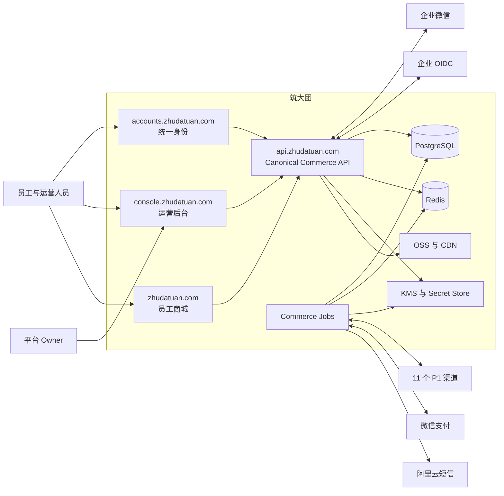

### 5.2 逻辑容器

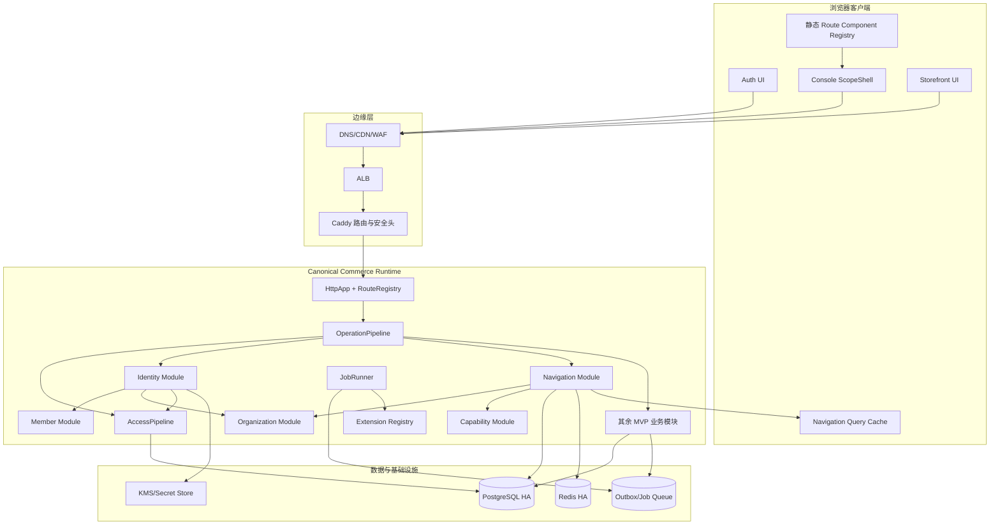

### 5.3 生产部署

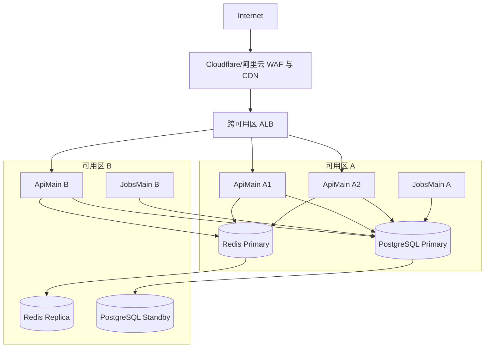

最低生产拓扑是 3 个无状态 ApiMain、2 个 JobsMain、PostgreSQL 跨可用区主备、Redis 主从/集群、托管 KMS 和独立对象存储。所有实例运行同一 `services/commerce` 制品；身份、Web 业务、购买业务可用 workload allowlist 和独立数据库 Role 隔离，但不能重新产生三套业务代码或三套合同。

## 6. DDD 边界和模块依赖

### 6.1 目标模块图

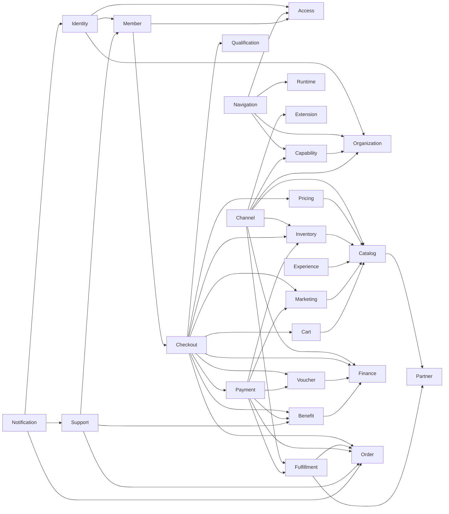

仅新增 `navigation` 业务模块。企业微信和 OIDC 是 `identity` 的 Infrastructure Adapter，不新增一个能绕开 Identity 的“SSO 微服务”。组织目录同步归 `organization`，身份映射归 `identity`，权限归 `access`，避免企业微信 Adapter 同时修改四个模块的表。

### 6.2 聚合和所有权

| 模块         | 聚合/事实                                                                                     | 唯一写入者                              | 对外端口/事件                                    |
| ------------ | --------------------------------------------------------------------------------------------- | --------------------------------------- | ------------------------------------------------ |
| identity     | Principal、Credential、FederatedIdentity、FederationTransaction、Session、Assurance、LinkCase | Identity Module                         | IdentityPrincipal、Session 事件、Federation 事件 |
| navigation   | Navigation Catalog Version、Navigation Projection                                             | Navigation Module；Catalog 为代码生成物 | NavigationReadPort、NavigationCatalogChanged     |
| organization | Organization、Layer、DirectoryConnection、DirectorySubject、SyncRun                           | Organization Module                     | IdentityOrganizationPort、OrganizationChanged    |
| access       | Membership、Role、RolePermission、ScopeGrant、Deny、AccessVersion                             | Access Module                           | IdentityAccessPort、AccessVersionChanged         |
| capability   | Capability、Entitlement、Assignment                                                           | Capability Module                       | CapabilityReadPort、CapabilityChanged            |
| member       | Member、Profile、Member 生命周期                                                              | Member Module                           | IdentityMemberPort、MemberChanged                |
| 其余模块     | 各自业务聚合                                                                                  | 对应模块                                | 公开 Application Port 或 Domain Event            |

跨模块写入的硬规则：Identity 不直接 `insert access.membership`、`insert member.profile` 或 `insert organization.*`；它必须在同一 Unit of Work 中通过已声明的 Public Port 调用 Owner 模块。当前 Identity 已使用 Access/Member/Organization Port，应继续扩展这一方式。

## 7. 统一导航模型

### 7.1 三层模型

```text
Navigation Catalog（编译期事实）
  定义 id、父子关系、入口、标题、图标、顺序、Scope、Requirement、Entry Operation
                         ↓
Navigation Projection（服务端决策）
  结合 Target、Membership、Scope、Permission、Deny、Capability、Entitlement、AccessVersion
                         ↓
Route Component Registry（客户端静态代码）
  只把获准的 navigationId 映射到本地已编译组件，不执行服务端提供的组件路径
```

三层不能合并：Catalog 不知道某个用户的权限；Projection 不应该知道 React 组件；Route Registry 不应该决定权限。

### 7.2 Catalog 字段

| 字段             | 含义                         | 约束                                                         |
| ---------------- | ---------------------------- | ------------------------------------------------------------ |
| `id`             | 全局稳定导航 ID              | 小写字母数字，发布后不复用                                   |
| `surface`        | `console` 或 `storefront`    | Auth 不用菜单驱动登录流程                                    |
| `kind`           | `group`、`workspace`、`link` | `group` 无业务 Operation；`workspace` 必须有 Entry Operation |
| `parent`         | 父节点 ID                    | 根节点为 `null`；禁止环                                      |
| `title`          | 用户可见名称                 | MVP 节点应与 Excel 术语一致                                  |
| `summary`        | 页面摘要                     | 不承载权限逻辑                                               |
| `icon`           | 设计系统图标 ID              | 必须存在于本地图标白名单                                     |
| `order`          | 同级排序                     | 同一 Parent 内唯一且稳定                                     |
| `route`          | Scope 后的相对路径           | 禁止协议、Host、查询和 Fragment                              |
| `targets`        | 可出现的客户端入口           | MVP 后台只允许 `console`                                     |
| `scopeKinds`     | 可出现的范围类型             | 必须和 Entry Operation 允许范围有交集                        |
| `requirements`   | MVP/Requirement ID           | 必须存在于生成的 Requirement Graph                           |
| `entryOperation` | 页面首个可用读取 Operation   | 决定节点是否可进入；不能用任意 Action 代替                   |
| `module`         | Owner 模块                   | 必须等于 Operation Catalog Owner                             |
| `childrenMode`   | `any` 或 `all`               | 仅用于 Group 聚合可见性                                      |
| `catalogVersion` | 内容哈希版本                 | 每次构建生成，不手写                                         |

不在 Catalog 保存 Role 名、Membership ID、Tenant ID、个人偏好、外部 URL、远程组件路径或 Provider Secret。

### 7.3 为什么必须显式 `entryOperation`

现有 `WorkspaceRegistry.available` 使用“Feature 中任意 Operation 可用”判断菜单。如果用户只拥有某个二级动作，但页面首次加载需要另一个读取 Operation，可能出现“菜单可见、进入即 403”。目标模型将页面首屏读取固定为 `entryOperation`：

```text
workspace visible
  = target matches
  ∧ scope kind matches
  ∧ entry capability enabled
  ∧ entry permission allowed
  ∧ no explicit deny
  ∧ membership active
  ∧ access version current
```

按钮级 Action 仍由各 Operation 单独决定，不能因为页面可见而一次性放行整页写操作。

### 7.4 Console 导航树

Scope 是导航上下文，不是重复的一层菜单。用户先在 Scope Switcher 选择平台/分销/集团/商城，再看到该 Scope 的工作区：

```text
Console
├─ 平台 Scope
│  ├─ 平台治理                         MVP03
│  ├─ 商品池                           MVP03
│  ├─ 卡号库                           MVP03
│  └─ 渠道与供应商                     MVP23
├─ 分销 Scope
│  └─ 分销治理                         MVP04，定义未确认前 releaseBlocker
├─ 集团 Scope
│  ├─ 数据大屏                         MVP05
│  ├─ 应用管理                         MVP06
│  ├─ 商品池                           MVP07
│  ├─ 订单管理                         MVP08
│  ├─ 卡券中心                         MVP09
│  ├─ 财务                             MVP10
│  ├─ 数据统计                         MVP11
│  ├─ 客服中心                         MVP12
│  └─ 设置                             MVP13
│     ├─ 权限中心
│     ├─ 成员管理
│     ├─ 供应商与门店
│     ├─ 通知设置
│     ├─ 资质管理
│     └─ 风险策略
└─ 商城 Scope
   ├─ 数据大屏                         MVP14
   ├─ 商城装修                         MVP15
   ├─ 商品池                           MVP16
   ├─ 订单管理                         MVP17
   ├─ 卡券中心                         MVP18
   ├─ 财务                             MVP19
   ├─ 数据统计                         MVP20
   ├─ 客服中心                         MVP21
   └─ 设置                             MVP22
      ├─ 权限中心
      ├─ 成员管理
      ├─ 供应商与门店
      ├─ 通知设置
      ├─ 资质管理
      └─ 风险策略
```

同一个 Component 可以由不同 Scope 使用，但标题、Entry Operation 和 Scope Policy 必须来自 Catalog。集团的“应用管理”和商城的“商城装修”可以共用现有 Experience Feature，不复制页面和业务逻辑。

### 7.5 Storefront 导航

Storefront 使用相同 Catalog 类型和客户端 Registry，但独立 Surface：

```text
Storefront
├─ 首页
├─ 分类
├─ 会员码
├─ 订单
└─ 我的
```

这五项继续遵守现有品牌 Token；它们不被 Console Role 控制。Storefront 节点由 Storefront Membership、Qualification 和对应 Entry Operation 决定。登录前允许的公开节点必须使用 `audience=public` Operation；登录节点不得伪装为公开。

### 7.6 Catalog 生成与门禁

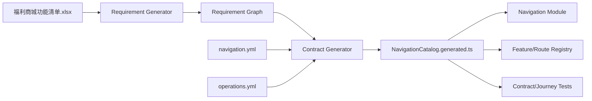

构建失败条件：重复 ID、Parent 缺失、环、Route 重复、Order 冲突、未知 Icon、未知 Requirement、未知 Operation、Owner 不一致、Surface/Audience 不一致、Scope 无交集、Entry Operation 不是读取操作、MVP03–MVP23 有未覆盖行、P1 Provider 数量不是 11、客户端 Component Registry 缺少节点或存在多余可部署节点。

### 7.7 服务端决策算法

1. `SessionResolver` 从 Target 专属 Host-only Cookie 解析 Actor。
2. `AccessPipeline` 校验 Session、Membership、Credential Version、Access Version、Target 和 Risk。
3. `ScopeResolver` 根据 URL Scope 和真实组织树解析当前 Scope；不信任客户端 Scope Path。
4. Navigation Resolver 读取内存 Catalog。
5. 一次性加载 Membership 的有效 Permission/Deny Set、Capability Set、Entitlement Set 和 ScopeGrant Set，禁止逐菜单 N+1 查询。
6. 对每个 Workspace 只评估 `entryOperation`。
7. 先过滤 Workspace，再自底向上删除没有可见子项的 Group。
8. 生成按 `order,id` 稳定排序的不可变树。
9. 计算 `ETag = sha256(catalogVersion + target + membership + accessVersion + scope + locale)`。
10. 写入 Redis Cache Aside；返回树、Catalog Version、Access Version、Scope 和 ETag。

导航缓存键：

```text
navigation:{catalogVersion}:{target}:{membershipId}:{accessVersion}:{scopeKind}:{scopeId}:{locale}
```

键中必须含 `accessVersion` 和 `catalogVersion`。权限变化后旧键即使尚未过期也不会再次命中；事件消费者负责主动删除同 Membership 的旧键，以释放内存。

### 7.8 导航 API

| Operation                 | Method/Path                      | Assurance          | 用途                                   |
| ------------------------- | -------------------------------- | ------------------ | -------------------------------------- |
| `navigation.tree.read`    | `GET /api/v1/navigation`         | Session            | 返回当前 Target/Scope 的裁剪树         |
| `navigation.catalog.read` | `GET /api/v1/navigation/catalog` | Platform + Step-Up | 运维查看编译期 Catalog，不返回用户决策 |
| `navigation.health.read`  | `GET /api/v1/navigation/health`  | Internal           | Catalog、Cache、Projection 健康        |

`navigation.tree.read` 请求只接受 `scopeKind`、`scopeId` 和 `locale`；`membership`、`permissions`、`capabilities`、`role` 不能由客户端提交。

示例响应：

```json
{
  "catalogVersion": "sha256:...",
  "accessVersion": 42,
  "target": "console",
  "scope": { "kind": "enterprise", "id": "enterprise:1001", "name": "示例集团" },
  "items": [
    {
      "id": "dashboard",
      "kind": "workspace",
      "title": "数据大屏",
      "summary": "销售、退单和应用经营数据",
      "icon": "chart",
      "route": "cockpit",
      "order": 10,
      "requirements": ["MVP05"]
    }
  ]
}
```

响应不返回隐藏节点、Permission 明细、Role 明细、Provider Secret 或 Component 路径。

### 7.9 Console 首次加载时序

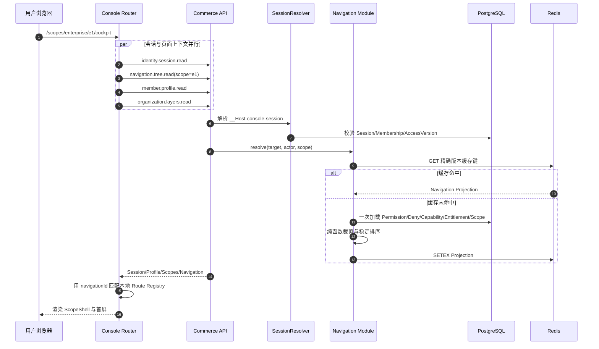

实现时可增加一个只读 `console.bootstrap.read` 聚合 Operation，把上述四个请求合并为一个网络往返；它只能编排各模块 Public Port，不能复制各模块查询和权限逻辑。若不增加聚合 Operation，则四请求必须使用 HTTP/2 并行，禁止串行瀑布。

### 7.10 Scope 切换时序

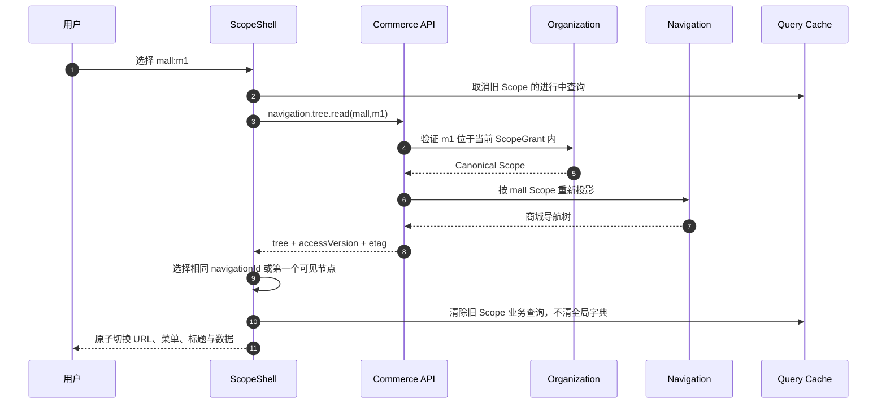

如果当前 Route 在新 Scope 不可见，Shell 必须跳到新树的第一个可见 Workspace；若树为空，显示“无可用工作区”而不是 404、无限重定向或默认放开权限。

### 7.11 导航失效时序

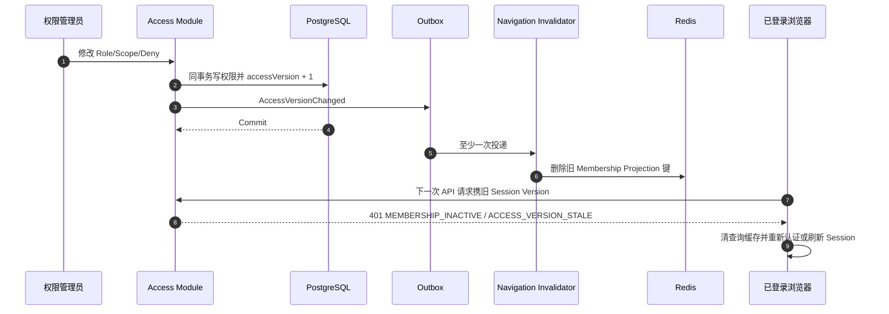

## 8. SSO 和企业微信身份模型

### 8.1 领域概念

| 概念                  | 含义                                                                | 不等于                 |
| --------------------- | ------------------------------------------------------------------- | ---------------------- |
| Principal             | 可认证主体，拥有 Credential Version                                 | Member                 |
| Member                | 系统内唯一真人，拥有福利资产和业务历史                              | 登录账号、企业微信用户 |
| Credential            | 密码、OTP 目的地址等本地登录凭据                                    | Permission             |
| ProviderInstance      | 某企业/平台配置的一套 OIDC 或企业微信信任关系                       | Provider 类型          |
| FederatedIdentity     | ProviderInstance 下的外部 Subject 与 Principal/Member 的绑定        | Membership             |
| Membership            | Member 在某组织和客户端入口中的关系                                 | SSO 身份               |
| FederationTransaction | 单次 SSO 发起、回调、选择和完成状态机                               | Session                |
| Session               | 已认证访问会话，绑定 Principal、Membership、Target 和 AccessVersion | 外部 access_token      |
| Assurance             | 本次认证强度和时效                                                  | 永久 Role              |
| LinkCase              | 身份冲突、历史重复或需要二次确认的人工处置单                        | 自动合并               |

### 8.2 Provider Port

Identity Application 只依赖以下最小接口概念：

```text
FederatedIdentityProvider
├─ start(context) -> AuthorizationRequest
├─ callback(input, transaction) -> FederatedSubject
├─ health() -> ProviderHealth
└─ logout(session) -> LogoutRequest?          可选

DirectoryProvider
├─ changes(cursor) -> DirectoryPage
├─ subject(externalId) -> DirectorySubject
└─ health() -> ProviderHealth

FederatedSubject
├─ providerInstanceId
├─ tenantSubject              CorpId 或 Issuer Tenant 的不可逆索引
├─ subject                    UserId 或 OIDC sub 的不可逆索引
├─ assuranceMethod
├─ claims                     经过白名单映射的最小 Claims
└─ observedAt
```

企业微信登录 Adapter、OIDC Adapter 和未来 Provider 均返回 `FederatedSubject`。Identity 用例不得 `if (provider === 'wecom')` 再访问企业微信字段；差异停在 Adapter。

### 8.3 Provider 实例类型

| 类型         | 使用场景           | 登录方式                  | Token                                                     |
| ------------ | ------------------ | ------------------------- | --------------------------------------------------------- |
| `wecomcorp`  | 单一企业的自建应用 | PC 扫码、企业微信内 OAuth | CorpId + Secret 获取应用 Token，Redis Singleflight 缓存   |
| `wecomsuite` | 平台服务多个企业   | 第三方套件授权和网页授权  | Suite Ticket → Suite Token → Corp Token，按 Corp 隔离缓存 |
| `oidc`       | 企业标准 SSO       | Authorization Code + PKCE | Discovery/JWKS 验签，不把 Token 交给业务前端              |

MVP 可以先启用获批的一种企业微信实例，但领域、表和端口从第一天支持多 ProviderInstance；不能把 CorpId、AgentId 和 Secret 写死为全局单例。

### 8.4 外部主体唯一键

```text
externalKey = HMAC(identityIndexKey,
  providerType + "\0" + providerInstanceId + "\0" + tenantSubject + "\0" + subject)
```

- 企业微信：`tenantSubject = CorpId`，`subject = UserId`。
- OIDC：`tenantSubject = normalized issuer/tenant`，`subject = iss + sub`，禁止用 email 作为 Subject。
- 原值用 KMS Envelope Encryption 保存；查询只用 HMAC 索引。
- UnionId 只用于同一受信应用集合内的微信身份辅助关联，不用于企业微信跨企业合并。

### 8.5 Provider 配置

Provider 配置由 `identity.provider` 管理，Secret 只存 Secret Ref：

| 字段               | 说明                                        |
| ------------------ | ------------------------------------------- |
| `id`               | ProviderInstance 稳定 ID                    |
| `kind`             | `wecomcorp`、`wecomsuite`、`oidc`           |
| `organization_id`  | 信任关系归属组织                            |
| `status`           | `draft`、`testing`、`active`、`disabled`    |
| `client_targets`   | 允许 `console`、`storefront` 的集合         |
| `issuer`           | OIDC Issuer 或企业微信固定类型标识          |
| `application_hash` | CorpId/AgentId 或 ClientId 的不可逆配置指纹 |
| `secret_ref`       | KMS/Secret Store 引用                       |
| `claim_policy`     | 版本化白名单映射规则                        |
| `jit_policy`       | `disabled`、`invite`、`directory`           |
| `assurance_level`  | Provider 成功后基础 AAL                     |
| `version`          | 乐观并发和缓存失效版本                      |

管理员不能输入任意 Authorization、Token、JWKS 或 Callback URL。OIDC Endpoint 必须由批准 Issuer Discovery 得出并经过 HTTPS、DNS/IP、Redirect 和 Host Allowlist 校验；企业微信 Endpoint 固定在 Adapter 中，防止 SSRF。

### 8.6 FederationTransaction 状态机

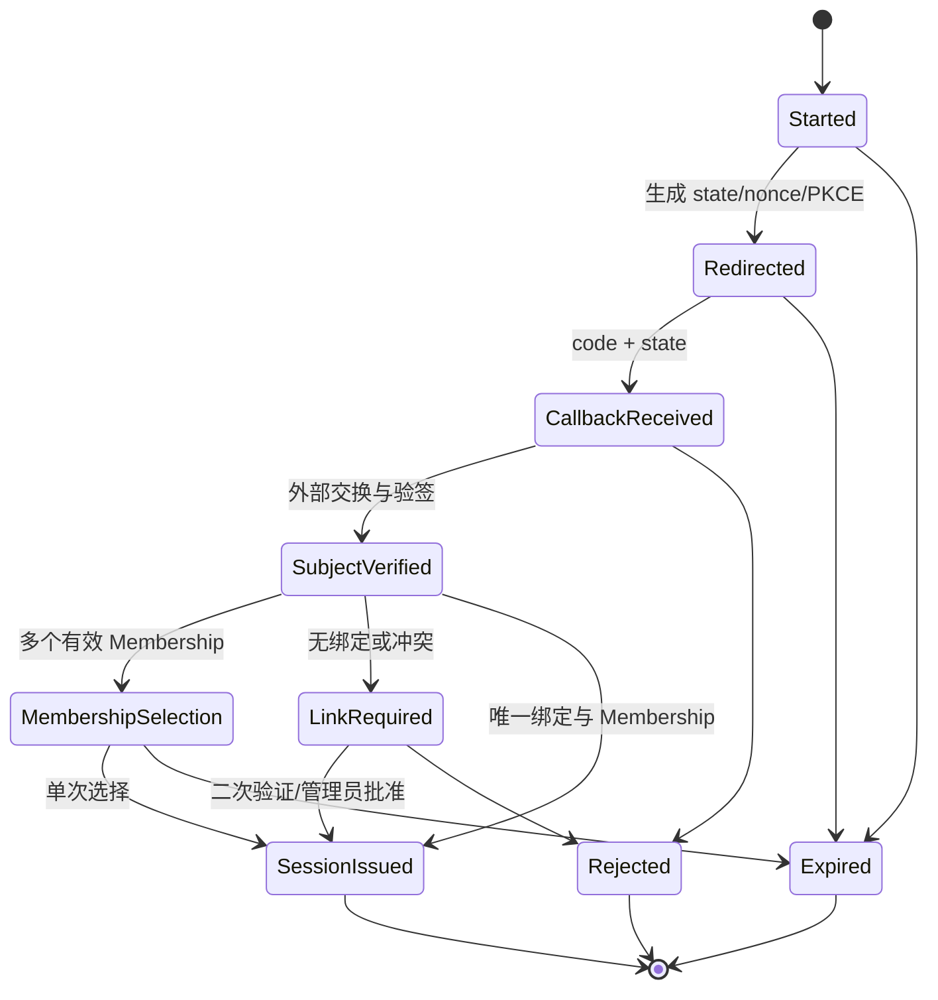

每条边必须使用数据库条件更新保证只发生一次。回调 Code 绝不自动重试；重复回调返回稳定 `FEDERATION_TRANSACTION_CONSUMED`，不能再次签发 Session。

### 8.7 PC 企业微信扫码登录

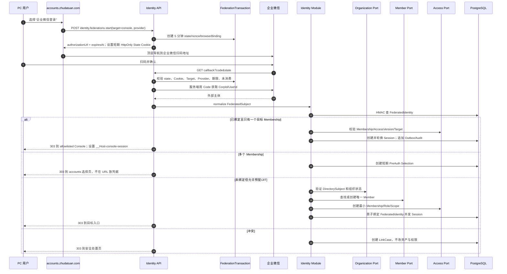

企业微信回调落到 `api.zhudatuan.com` 的固定 HTTPS 路径，由服务端清理 Query 后 303 到白名单入口。Callback 响应必须 `Cache-Control: no-store`、`Referrer-Policy: no-referrer`，接入层日志不得记录 Query。

### 8.8 企业微信内网页静默登录

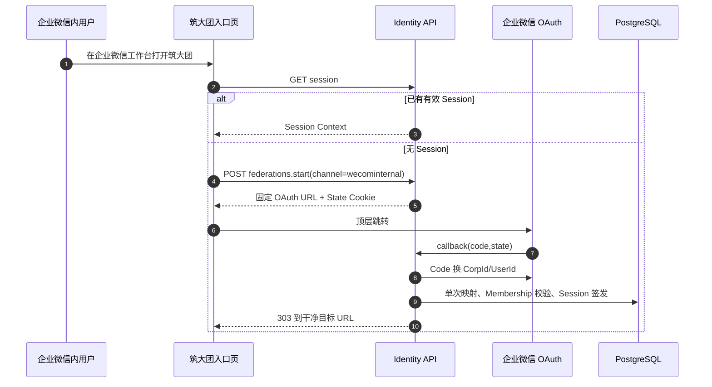

静默授权只减少交互，不提升 Assurance。涉及批量上下架、退款审批、财务决策、角色变更等高风险操作，仍必须完成独立 Step-Up。

### 8.9 标准 OIDC SSO

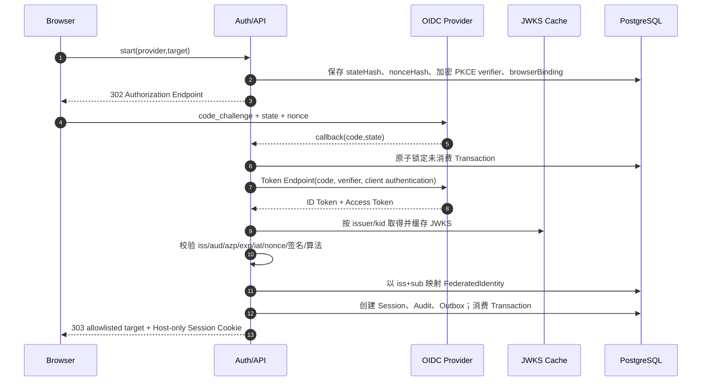

OIDC Discovery/JWKS 刷新使用固定 Issuer、HTTPS、短超时、最大响应体、重定向禁止、IP Allowlist/DNS 重绑定防护和 Circuit Breaker。未知 `kid` 最多触发一次受限刷新，禁止无限刷新放大攻击。

### 8.10 多 Membership 选择

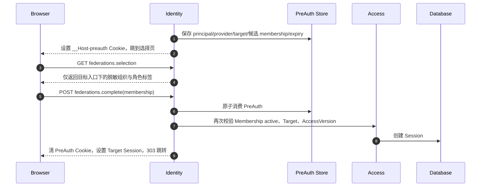

候选 Membership 来自服务端；客户端不能提交列表外 ID。选择页面不得泄露用户在其他企业或其他 Target 的 Membership。

### 8.11 身份绑定和冲突

绑定优先级：

1. 精确命中已激活的 `FederatedIdentity`。
2. 精确命中已预配的 `DirectorySubject → Member/Principal` 映射。
3. Provider 的 JIT Policy 允许，且邀请码/目录在职状态、组织和 Target 全部满足时创建最小关系。
4. 其他情况创建 LinkCase。

禁止规则：

- 不按相同手机号、邮箱、姓名、部门或头像直接合并。
- 不因企业微信登录自动授予 Console Membership。
- Storefront JIT 默认只授予员工最小 Role、自身 Scope 和所属商城资格；Console 必须预配或经管理员审批。
- 一个外部主体不能同时绑定两个活跃 Principal；唯一索引和事务锁双重保证。
- 一个历史 Member 迁移到新 Principal 必须经过 LinkCase、Step-Up、双主体资产核对和审计。

### 8.12 入职、调岗、离职

登录链路只读取已有目录投影；全量和增量同步由 Jobs 执行：

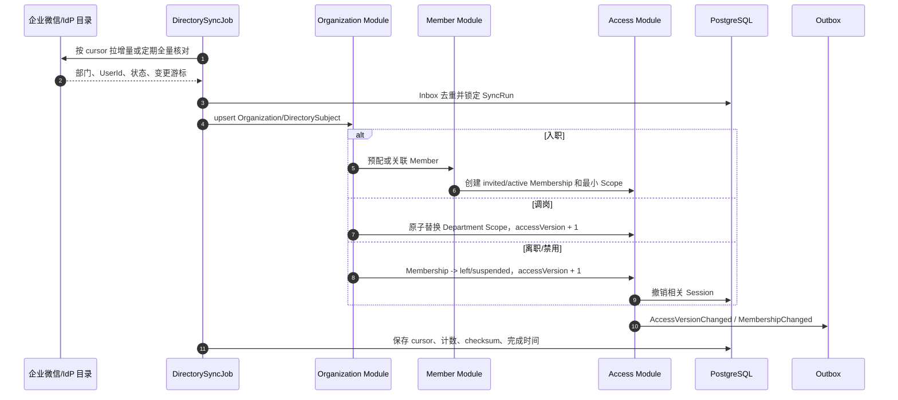

增量回调可能丢失、重复或乱序，因此每天至少一次全量 Reconciliation；每个外部变更用 `(providerInstance,eventId/version)` Inbox 去重，并以 Provider 时间戳和本地 Version 拒绝旧事件覆盖新状态。

### 8.13 Session、Step-Up 与退出

- Console Session：建议 8 小时绝对期限、30 分钟空闲续期上限；Storefront 可保持 12 小时绝对期限。最终数值必须配置为版本化安全策略，不散落常量。
- Session Token 使用至少 256 位 CSPRNG；数据库只存 Token Hash；登录、Membership 选择和 Step-Up 后轮换。
- Cookie：`Secure; HttpOnly; Path=/; SameSite=Strict`；不设置 `Domain`，按 Target 使用不同名称。
- 外部 SSO Transaction Cookie 单独使用 5 分钟 `SameSite=Lax`，只绑定回调，不是业务 Session。
- CSRF Token 继续使用与 Session、Target、Origin、Expiry 绑定的 HMAC；所有写请求校验 Origin 和 CSRF。
- Step-Up 默认 15 分钟；财务、退款、权限、Provider Secret 和大批量操作可要求更短策略。
- 本地退出先原子撤销 Session、提升 Session/Credential Version、清 Cookie，再尝试 Provider Logout；外部 Logout 失败不能阻止本地退出。
- 企业微信没有可靠全局登出语义时，只做本地 Session 撤销，不伪称已退出企业微信。

### 8.14 Identity API 合同

| Operation                             | Method/Path                                                   | Audience                            | 幂等性       | 说明                                     |
| ------------------------------------- | ------------------------------------------------------------- | ----------------------------------- | ------------ | ---------------------------------------- |
| `identity.providers.read`             | `GET /api/v1/identity/providers`                              | Public/Target filtered              | 否           | 返回当前入口可用 Provider 的安全展示信息 |
| `identity.federations.start`          | `POST /api/v1/identity/federations`                           | Public                              | 是           | 创建 Transaction 并返回授权 URL          |
| `identity.federations.callback`       | `GET /api/v1/identity/federations/{provider}/callback`        | Public callback                     | 单次 Code    | 服务端回调、交换、映射、跳转             |
| `identity.federations.selection.read` | `GET /api/v1/identity/federations/selection`                  | PreAuth                             | 否           | 返回脱敏候选 Membership                  |
| `identity.federations.complete`       | `POST /api/v1/identity/federations/selection`                 | PreAuth                             | 是           | 原子选择 Membership 并签发 Session       |
| `identity.links.create`               | `POST /api/v1/identity/links`                                 | Session + Step-Up                   | 是           | 发起外部身份绑定                         |
| `identity.links.read`                 | `GET /api/v1/identity/links`                                  | Session                             | 否           | 查询自己的绑定和冲突状态                 |
| `identity.links.revoke`               | `DELETE /api/v1/identity/links/{linkId}`                      | Session + Step-Up                   | 是           | 解绑；必须保证仍有可用登录方式           |
| `identity.providers.manage`           | `PUT /api/v1/identity/providers/{providerId}`                 | Platform/Enterprise Admin + Step-Up | 是 + Version | 管理 Provider 非秘密配置和 Secret Ref    |
| `identity.providers.test`             | `POST /api/v1/identity/providers/{providerId}/tests`          | Admin + Step-Up                     | 是           | 固定 Endpoint 健康和配置验证             |
| `organization.directories.sync`       | `POST /api/v1/organizations/directories/{connectionId}/syncs` | Admin + Step-Up                     | 是           | 启动异步目录同步                         |

`identity.providers.read` 不能暴露 CorpId、ClientId、Issuer 内部参数、Secret Ref 或不存在的企业绑定。对公开登录页应使用泛化的 Provider 显示名和 Logo，防止组织枚举。

## 9. 每个模块的内部数据流时序

### 9.1 强制模板

所有同步写 Operation 必须遵循同一内部时序：

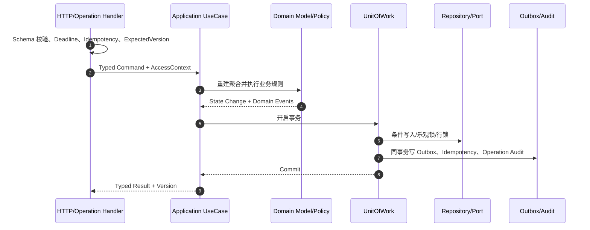

所有同步读 Operation 必须遵循：

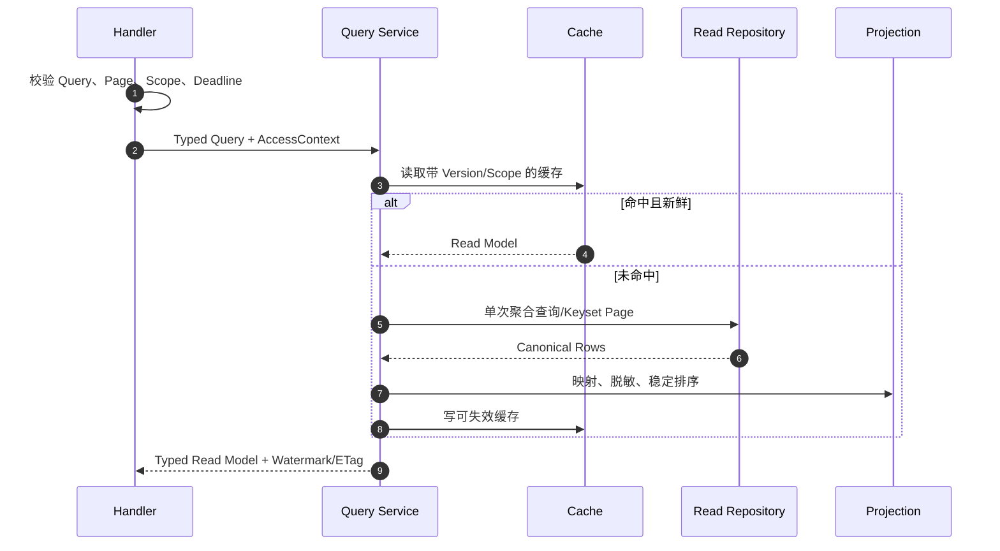

所有异步工作必须遵循：

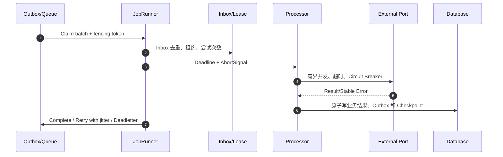

### 9.2 Identity 内部时序

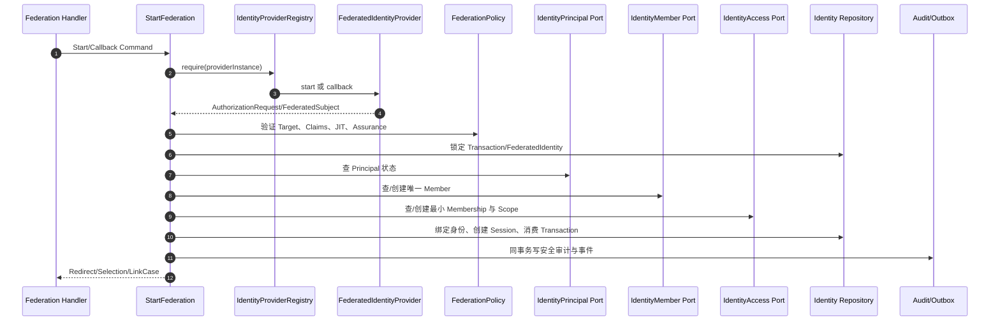

### 9.3 Navigation 内部时序

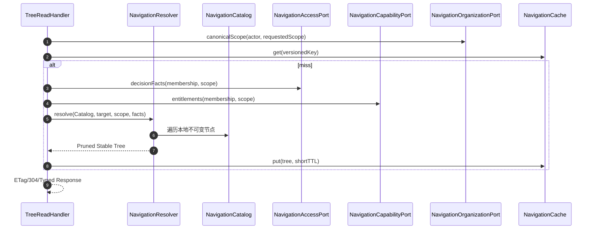

### 9.4 Access 内部时序

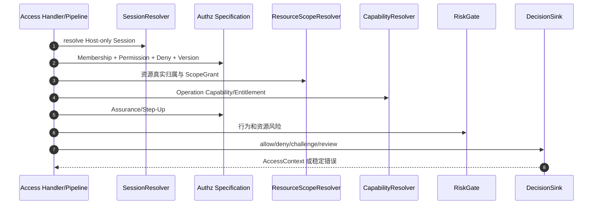

### 9.5 Organization/Directory 内部时序

```mermaid
sequenceDiagram
  autonumber
  participant Job as DirectorySyncJob
  participant Provider as DirectoryProvider
  participant Mapper as DirectoryMapper
  participant Policy as OrganizationPolicy
  participant Repo as OrganizationRepository
  participant Access as AccessLifecyclePort
  participant Outbox as Outbox

  Job->>Provider: changes(cursor)
  Provider-->>Job: page + nextCursor
  Job->>Mapper: 白名单字段、HMAC、加密 PII
  Mapper->>Policy: 层级、在职状态、版本和乱序校验
  Policy->>Repo: upsert Organization/Subject/SyncRun
  Policy->>Access: 入职/调岗/离职最小权限变更
  Policy->>Outbox: OrganizationChanged/AccessVersionChanged
```

### 9.6 逐模块完整目录

下表中的箭头就是每个模块的内部执行顺序；每一行都必须落到对应 Handler、Domain Policy/Model、Repository/Adapter、表和 Event，不允许把一行中的业务逻辑复制到 Controller、React 或 SQL Trigger 多处。

| 模块          | 查询时序                                                                                  | 命令时序                                                                                                  | 写入/投影                                                                                          | 事件与缓存                                                            |
| ------------- | ----------------------------------------------------------------------------------------- | --------------------------------------------------------------------------------------------------------- | -------------------------------------------------------------------------------------------------- | --------------------------------------------------------------------- |
| identity      | Handler → Session/Federation Query → Identity Repository → 脱敏 Profile                   | Handler → AuthTransaction/FederationPolicy → Provider Port → Member/Access/Organization Port → UnitOfWork | `identity.principal/credential/federatedidentity/federationtransaction/session/assurance/linkcase` | SessionCreated/Revoked、FederatedIdentityLinked；Session 不进共享缓存 |
| navigation    | TreeRead → Canonical Scope → Versioned Cache → Resolver                                   | Catalog 管理只在构建期；运行期无用户菜单写命令                                                            | 编译期 Catalog；Redis Projection                                                                   | Access/Capability/Organization/Catalog 事件失效                       |
| organization  | LayersRead → Organization Repository → Scope Tree                                         | DirectorySync/LayerManage → OrganizationPolicy → Repository                                               | `organization.organization/layer/directoryconnection/directorysubject/syncrun`                     | OrganizationChanged；短期 Scope Tree Cache                            |
| access        | CenterRead → Membership/Role/Scope 聚合                                                   | RolesManage/ScopesManage → AccessPolicy → 条件写 → AccessVersion+1                                        | `access.membership/role/rolepermission/membershiprole/scopegrant/membershipoverride`               | AccessVersionChanged；立即撤销旧决策缓存                              |
| capability    | AssignmentRead → Capability/Entitlement 聚合                                              | AssignmentManage → EntitlementPolicy → Versioned Write                                                    | `capability.capability/operation/entitlement/assignment`                                           | CapabilityChanged；Navigation Cache 失效                              |
| member        | MembersRead/ProfileRead → PII Decrypt Port → 脱敏                                         | MemberManage/Import → MemberPolicy → Access Port → Repository                                             | `member.profile/address/lifecycle/import`                                                          | MemberChanged、MembershipChanged；PII 不缓存明文                      |
| qualification | CenterRead/Preview → Facts + Policy Projection                                            | PolicyManage/Decision → QualificationPolicy → Versioned Publish                                           | `qualification.policy/fact/decision/revision`                                                      | QualificationChanged；按 Member/Listing 短缓存                        |
| catalog       | Pools/Listings/ProductDetail → Catalog Read Model                                         | ProductCreate/PoolAttach/ListingBatch/Import → CatalogPolicy                                              | `catalog.pool/product/sku/listing/poolbinding/import`                                              | ListingPublished、CatalogChanged；公开目录版本缓存                    |
| pricing       | OffersRead → 已发布 Rule + Scope + Qualification                                          | RuleCreate/Publish → PricingPolicy → Immutable Revision                                                   | `pricing.rule/revision/offerprojection`                                                            | PricingRulePublished；Offer Cache 带版本                              |
| inventory     | AvailabilityRead → Stock/Reservation Projection                                           | Import/Reserve/Release/Sync → InventoryPolicy + Lock Order                                                | `inventory.stock/reservation/import/syncrun`                                                       | InventoryChanged；热点 SKU 短缓存                                     |
| experience    | Applications/PublishedRead → Release Projection                                           | Create/Copy/Save/Validate/Publish/Restore → ExperiencePolicy                                              | `experience.application/version/release/publication`                                               | ExperiencePublished；CDN/Redis 版本失效                               |
| marketing     | CampaignsRead → Rule/Budget Projection                                                    | CampaignManage/Reserve/Confirm/Release → MarketingPolicy                                                  | `marketing.campaign/budget/reservation`                                                            | CampaignChanged；优惠计算版本缓存                                     |
| cart          | CurrentRead → Cart Aggregate                                                              | Put/Batch/Delete → CartPolicy → Versioned Write                                                           | `cart.cart/item`                                                                                   | CartChanged；按 Member 短缓存或直读                                   |
| checkout      | QuoteRead → Cart/Qualification/Pricing/Inventory/Benefit/Voucher Ports                    | QuoteCreate/Confirm → CheckoutPolicy → 有序锁 → Signed Quote                                              | `checkout.quote/confirmation` 及跨模块事务结果                                                     | CheckoutQuoted/Confirmed；Quote 短期不可变缓存                        |
| order         | Orders/AftersalesRead → Keyset Projection                                                 | OrderCreate/AftersaleApply/Approve/Reject/Expire → OrderPolicy                                            | `ordering.orderrecord/orderline/aftersale`                                                         | OrderCreated/StateChanged/AftersaleDecided                            |
| fulfillment   | TrackingRead → Provider/Shipment Projection                                               | Ship/ReturnReceive/Inspect → FulfillmentPolicy → Partner Port                                             | `fulfillment.fulfillmentorder/shipment/return`                                                     | FulfillmentShipped/Returned；异步追踪缓存                             |
| verification  | Session/History/DeviceRead → Verification Projection                                      | ChallengeIssue/Verify/DeviceManage → VerificationPolicy                                                   | `verification.challenge/session/device/history`                                                    | VerificationCompleted；挑战不缓存明文                                 |
| payment       | RecoveryRead → Payment Intent/Observation                                                 | IntentCreate/Refund/RecoveryResolve → PaymentPolicy → Gateway Port → Outbox                               | `payment.intent/attempt/refund/recovery/observation`                                               | PaymentAuthorized/Paid/Refunded；不缓存权威结果                       |
| voucher       | CardLibrary/Program/Reserve/Binding/RedemptionRead                                        | ProgramManage/ReserveDecide/Issue/Status/Reverse → VoucherPolicy                                          | `voucher.cardlibrary/program/reserverequest/batch/voucher/redemption/reversal`                     | VoucherIssued/Redeemed/Reversed；敏感券码 KMS 加密                    |
| benefit       | Accounts/Plans/Grants/Lots/LedgersRead                                                    | PlanManage/Grant/Create/Revoke/Consume/Release → GrantPolicy                                              | `benefit.account/plan/grant/lot/ledger`                                                            | BenefitGranted/Consumed；Ledger 只追加                                |
| finance       | Overview/Entries/Statements/Reconciliation/SettlementRead                                 | Post/Reconcile/Settle/Withdraw/Period/Policy → FinancePolicy                                              | `finance.account/journal/entry/statement/reconciliation/settlement/period`                         | FinanceEntryPosted/Settled；报表读投影缓存                            |
| invoice       | Profile/RequestRead 由 Finance Feature 编排                                               | ProfileManage/RequestCreate/Decide → InvoicePolicy → InvoiceGateway                                       | `invoice.profile/request/artifact`                                                                 | InvoiceRequested/Issued；文件进对象存储                               |
| channel       | Connection/SyncRun/OperationRead → Extension Health                                       | Create/Test/Enable/Sync/Replay → ChannelPolicy → ExtensionLoader                                          | `channel.connection/syncrun/provideroperation`                                                     | ChannelSyncStarted/Completed/Failed；Token Singleflight               |
| extension     | InstallationRead → Signed Manifest Projection                                             | Stage/Test/Activate/Disable → SignatureVerifier → ExtensionRegistry                                       | `extension.installation/revision/health`                                                           | ExtensionActivated/Disabled；进程内 Registry                          |
| partner       | Partner/RelationshipRead → Scope-filtered Projection                                      | Partner/Store/SupplierManage → PartnerPolicy → KMS PII                                                    | `partner.partner/relationship/store/supplier`                                                      | PartnerChanged；稳定字典短缓存                                        |
| support       | Cases/Messages/HistoryRead → SLA Projection                                               | CaseUpdate/Assign/MessageSend → SupportPolicy → Notification Port                                         | `support.case/message/assignment/sla`                                                              | SupportMessageSent/SlaEscalated；会话分页缓存                         |
| notification  | Template/Announcement/DeliveryRead                                                        | TemplateManage/Dispatch → NotificationPolicy → SMS/WeCom Port                                             | `notification.template/announcement/preference/endpoint/delivery`                                  | NotificationQueued/Sent/Failed；不缓存验证码                          |
| reporting     | Dashboard/Sales/Product/Mall/Category/Channel/Powder/VoucherRead → Projection + Watermark | ExportCreate → ExportPolicy → Object Store                                                                | `reporting.metric/fact/orderprojection/export/watermark`                                           | 消费业务事件更新投影；Dashboard/Report Cache                          |
| risk          | CenterRead/CaseRead → Policy + Signal Projection                                          | PolicyManage/Evaluate/Review/Replay → RiskEngine                                                          | `risk.policy/signal/decision/case`                                                                 | RiskDecisionMade/Reviewed；高风险信号短缓存                           |
| audit         | RecordsRead → RedactionPolicy → Archive Index                                             | Record/Archive → AppendOnly Repository → Object Store                                                     | `audit.record/accessrecord/archive`                                                                | 审计自身不再发可递归审计事件；只追加                                  |
| runtime       | Health/DependencyRead → Runtime Catalog                                                   | Cleanup/Recovery → RuntimePolicy                                                                          | `runtime.operation/event/job/idempotency/schemaversion/outbox`                                     | RuntimeDegraded/Recovered；健康短缓存                                 |
| observability | Metrics/Trace/Log Query → Telemetry Backend                                               | 仅记录，不执行业务命令                                                                                    | 外部 Metrics/Logs/Traces                                                                           | 不成为业务事实源，不回写业务状态                                      |

说明：当前仓库把 Invoice Operation 归入 Finance 展示，但数据库可保留 `invoice` Schema；它不是单独可绕过 Finance 的部署服务。Observability 是基础模块，不计入 28 个业务模块，但必须覆盖全部模块。

### 9.7 Channel 与 Extension 即插即用时序

```mermaid
sequenceDiagram
  autonumber
  participant Admin as 集成管理员
  participant Channel as Channel Module
  participant Loader as RuntimeExtensionLoader
  participant Verify as SignatureVerifier
  participant Secret as SecretStore
  participant Candidate as Provider Candidate
  participant Registry as ExtensionRegistry

  Admin->>Channel: 创建/测试 Provider Installation
  Channel->>Loader: stage(installation, scope)
  Loader->>Verify: 验证 Manifest 签名、ID、能力、版本
  Loader->>Secret: 读取 Secret Ref
  Loader->>Candidate: start + health + timeout
  Candidate-->>Loader: health/latency/capabilities
  Loader-->>Channel: Candidate Token
  Admin->>Channel: activate(expectedVersion)
  Channel->>Registry: 原子切换 Candidate
  Registry->>Registry: 停止旧实例，保持新实例
  Channel-->>Admin: Installation Version + Evidence
```

Provider 安装失败只影响对应 Provider/Scope，不能阻塞 Identity、Navigation、其他 Provider 或核心订单查询。

### 9.8 Reporting 投影时序

```mermaid
sequenceDiagram
  autonumber
  participant Event as Order/Payment/Voucher Event
  participant Job as ProjectionJob
  participant Inbox as Reporting Inbox
  participant Fact as Fact Repository
  participant Watermark as Watermark
  participant Cache as Dashboard Cache

  Event->>Job: 至少一次投递
  Job->>Inbox: eventId 去重
  Job->>Fact: 事务内 upsert 幂等事实与维度
  Job->>Watermark: 单调推进 source position
  Job->>Cache: 删除受影响 Scope/Period 键
  Job-->>Event: ack
```

“实时”必须有明确新鲜度 SLO 和 `watermark`，不能只显示当前时间。昨日、7 天、30 天使用同一事实表和受控时间维度，不复制四套查询。

## 10. 数据模型

### 10.1 身份和 SSO 表

尽量复用现有表并以新增迁移扩展，不改写历史 Migration：

| 表                                | 复用/新增 | 关键字段/索引                                                                                    | 约束                                                                     |
| --------------------------------- | --------- | ------------------------------------------------------------------------------------------------ | ------------------------------------------------------------------------ |
| `identity.principal`              | 复用      | status、credential_version、version                                                              | 状态或版本变化立即影响 Session                                           |
| `identity.credential`             | 复用      | provider、subject_hash、secret_hash                                                              | 唯一 `(provider,subject_hash)`                                           |
| `identity.provider`               | 新增      | id、kind、organization_id、status、secret_ref、version                                           | Secret 只存 Ref；配置版本化                                              |
| `identity.federatedidentity`      | 扩展      | provider_id、tenant_hash、subject_hash、ciphertext、principal_id、membership_id、status          | 唯一 `(provider_id,tenant_hash,subject_hash)`；只能一个 Active Principal |
| `identity.federationtransaction`  | 新增      | state_hash、nonce_hash、verifier_ciphertext、browser_hash、target、status、expires_at            | state 唯一；条件状态迁移；短保留                                         |
| `identity.preauth`                | 新增      | transaction_id、principal_id、candidate_hash、expires_at、consumed_at                            | 只存服务端候选快照；单次消费                                             |
| `identity.linkcase`               | 新增      | external_identity、candidate_member、reason、state、decision_by、version                         | 不能自动合并；全审计                                                     |
| `identity.session`                | 复用      | principal、membership、token_hash、credential_version、access_version、client、assurance、expiry | Token Hash 唯一；Target 绑定                                             |
| `identity.authticket`             | 复用      | session、state、nonce、pkce_challenge、target、expiry                                            | 密码/OTP 非重定向流程继续复用                                            |
| `identity.assurance`              | 复用      | method、level、evidence_hash、verified/expires                                                   | Provider Method 白名单                                                   |
| `identity.loginattempt`           | 复用      | subject/client/window/failures/locked                                                            | 账号、网络、设备多维限流                                                 |
| `identity.providersecretrotation` | 新增      | provider、old_ref、new_ref、state、activated_at                                                  | Secret Rotation 可审计且不中断                                           |

所有新增表启用 RLS，仅 `shopapp/shopjob/shopmigration` 的最小策略可访问。FederationTransaction、PreAuth 和一次性 Code 不允许普通业务查询或分析平台读取。

### 10.2 Organization 与 Directory 表

| 表                                 | 用途                            | 关键约束                                        |
| ---------------------------------- | ------------------------------- | ----------------------------------------------- |
| `organization.directoryconnection` | ProviderInstance 与组织目录连接 | 唯一 Provider/Organization；Secret Ref 不落明文 |
| `organization.directorysubject`    | 外部用户、部门、状态的本地投影  | 外部 ID HMAC；PII KMS 加密；版本单调            |
| `organization.directorymembership` | 外部 Subject 到部门/组织关系    | 有效期和来源不可省略                            |
| `organization.syncrun`             | 全量/增量同步运行               | cursor、checksum、counts、watermark、state      |
| `organization.directoryinbox`      | 回调去重                        | 唯一 provider/event/version                     |

### 10.3 Navigation 数据

Navigation Catalog 不落业务数据库；它是构建产物并随制品版本发布。数据库只保存授权事实，不保存重复菜单。Redis 只保存 Projection：

```text
Catalog: packages/contract/src/navigation/NavigationCatalog.generated.ts
Projection: Redis navigation:{...}
Authority: operations.yml + navigation.yml + generated Requirement Graph
```

如未来需要用户级折叠、收藏或最近访问，它们属于 `preference`，不能改变节点可见性；本 MVP 不增加此辅助模块。

### 10.4 必要索引

- `identity.federatedidentity(provider_id,tenant_hash,subject_hash) where status='active'` 唯一索引。
- `identity.federationtransaction(state_hash) where status in ('started','redirected','callbackreceived','selection')` 唯一索引。
- `identity.federationtransaction(expires_at,id)` 用于清理。
- `identity.session(token_hash)` 唯一；`(principal_id,revoked_at,expires_at)` 和 `(membership_id,access_version)`。
- `access.membership(member_id,organization_id,client)` 唯一。
- `access.scopegrant(membership_id,scope_kind,scope_id,effect,effective_at)`。
- `capability.entitlement(scope_id,capability_id,state,effective_at)`。
- `organization.directorysubject(connection_id,external_hash)` 唯一。
- `organization.directoryinbox(connection_id,event_hash)` 唯一。
- Reporting 按事实时间和 Scope 分区/索引，Keyset Page 禁止 Offset 扫描大表。

### 10.5 数据分类和保留

| 数据                        | 分类     | 存储                    | 日志                           | 保留原则                        |
| --------------------------- | -------- | ----------------------- | ------------------------------ | ------------------------------- |
| Session/Auth Ticket/PreAuth | Secret   | 仅 Hash 或加密短时值    | 永不记录                       | 到期立即不可用，定时清理        |
| CorpId/UserId/OIDC sub      | 身份标识 | HMAC 索引 + KMS 密文    | 只记录 Provider/Transaction ID | 绑定有效期 + 合法审计周期       |
| 手机/邮箱/姓名              | PII      | KMS Envelope Encryption | 脱敏                           | 最小必要，按隐私政策删除/匿名化 |
| Permission/Scope/Decision   | 安全数据 | PostgreSQL              | 可记录稳定 Code                | 覆盖调查和合规所需周期          |
| Operation/Audit             | 审计数据 | Append-only + 归档      | 本身即审计                     | 由法务/安全批准版本化策略       |
| 企业微信/OIDC access_token  | Secret   | Redis/KMS 加密或内存    | 永不记录                       | 比 Provider expiry 提前失效     |

不在架构文档硬编码法定保留年限；生产前由隐私、法务和安全 Owner 批准版本化 Retention Policy，自动执行并留下删除证明。

## 11. 事件、缓存与一致性

### 11.1 关键事件

| Event                            | Producer        | Consumer                      | 结果                                 |
| -------------------------------- | --------------- | ----------------------------- | ------------------------------------ |
| `identity.session.created`       | identity        | audit、observability          | 登录成功指标和审计                   |
| `identity.session.revoked`       | identity/access | cache、observability          | 清 Session 相关缓存                  |
| `identity.federation.linked`     | identity        | audit、member                 | 记录新绑定，不创建重复 Member        |
| `identity.federation.rejected`   | identity        | risk、audit                   | 异常登录信号                         |
| `identity.provider.changed`      | identity        | provider registry、navigation | 失效 Provider 展示与连接缓存         |
| `organization.directory.changed` | organization    | member、access                | 入职/调岗/离职处理                   |
| `organization.changed`           | organization    | navigation、reporting         | Scope Tree/导航/报表失效             |
| `access.version.changed`         | access          | identity、navigation、cache   | 旧 Session/导航立即失效              |
| `capability.changed`             | capability      | navigation、runtime           | 导航和 Operation 能力失效            |
| `navigation.catalog.changed`     | release runtime | navigation cache              | 新版本天然换键并清旧键               |
| `extension.activated`            | extension       | channel、runtime、navigation  | Provider 状态刷新，不自动新增任意 UI |

### 11.2 一致性规则

- Principal/Member/Membership/FederatedIdentity 的创建或绑定必须在一个数据库事务中完成；任何一步失败全部回滚。
- 权限写入和 `accessVersion + 1` 同事务；事件通过 Outbox 同事务追加。
- 导航是授权事实的派生读模型，允许短时缓存，但键必须绑定 Version；它不要求分布式事务。
- 目录同步为最终一致，但离职/禁用回调属于高优先级事件；收到后立即撤销 Session，随后全量核对。
- 外部 Provider 调用不能持有数据库事务等待网络；先锁定/声明 Intent，释放事务，调用外部，再以 Version/Fencing Token 提交结果。
- 支付、库存、余额和券仍遵守现有锁顺序和事务，不因 SSO/导航改变。

### 11.3 Cache 规则

| Cache                  |                              TTL 基线 | Key 必含                                             | Redis 故障                                |
| ---------------------- | ------------------------------------: | ---------------------------------------------------- | ----------------------------------------- |
| Navigation Projection  |                     5 分钟 + 事件失效 | Catalog/Target/Membership/AccessVersion/Scope/Locale | 回源 PostgreSQL 计算                      |
| Scope Tree             |                              1–5 分钟 | Organization Version/Membership                      | 回源数据库                                |
| Provider Metadata/JWKS |            按 HTTP Cache，最大 1 小时 | Issuer/Kid/Provider Version                          | 有新鲜本地键则用；否则 SSO 失败关闭       |
| 企业微信 Token         | 小于 Provider expiry，提前 5 分钟刷新 | Provider/Corp/Secret Version                         | Singleflight 回源；失败走 Circuit Breaker |
| Reporting              |                             30–120 秒 | Scope/Period/Watermark/Metric Version                | 回源投影表                                |
| Public Catalog         |                      不可变版本长缓存 | Catalog Version                                      | 回源对象存储/数据库                       |

缓存绝不存明文密码、验证码、Session Token、完整企业微信 UserId、OIDC Token、支付 Secret 或券码。

## 12. 目标代码目录与文件结构

### 12.1 命名规则

- 生产目录：全小写字母数字，如 `navigation`、`federation`、`provider`。
- TypeScript/TSX 生产文件：有意义的 PascalCase 或 camelCase，除扩展名外不出现 `_`、`-` 或额外连接点。
- React Component、Class、Aggregate、Policy、Port、Repository：PascalCase。
- Hook、纯函数和小型 Service：camelCase。
- 脚本、配置、SQL、Migration 和 Test 可按仓库既有例外使用连接符或下划线。
- 不再新增 `utils`、`helpers`、`common2`、`misc`、`legacy`、`compat`、`adapter-old` 等无明确领域含义的目录。
- 每个可维护源码文件小于 300 行；当前超长 `LoginPage.tsx` 和 `IdentityOperations.ts` 在实施时按用例拆分。

### 12.2 目标根目录

```text
zhudatuan/
├─ apps/
│  ├─ auth/                         统一登录与安全处置 UI
│  ├─ console/                      平台/分销/集团/商城后台
│  └─ storefront/                   员工商城
├─ services/
│  └─ commerce/                     唯一 Canonical API/Jobs/Migration 制品
├─ packages/
│  ├─ authz/                        纯授权规格
│  ├─ config/                       类型化环境和 Provider 配置解析
│  ├─ contract/                     Operation/Event/Navigation 合同唯一源
│  ├─ design/                       统一设计系统
│  ├─ kernel/                       时间、ID、Deadline 等基础抽象
│  ├─ sdk/                          生成式类型安全客户端
│  ├─ telemetry/                    日志、指标、Trace 合同
│  └─ testing/                      测试夹具和通用断言
├─ extensions/
│  ├─ channel/                      11 个 P1 Provider 及后续插件
│  ├─ notification/                 通知 Provider
│  └─ payment/                      支付 Provider
├─ database/
│  ├─ migrations/                   唯一 Canonical Migration 链
│  ├─ contracts/                    SQL 合同和对象清单
│  └─ tools/                        Replay/Verify 工具
├─ infrastructure/
│  ├─ zhudatuan/                    唯一生产交付拓扑
│  └─ local/                        本地同构环境
├─ tests/
│  ├─ contract/
│  ├─ integration/
│  ├─ journey/
│  ├─ browser/
│  ├─ security/
│  ├─ performance/
│  └─ recovery/
├─ tools/
│  ├─ contractgen/
│  ├─ requirementgen/
│  └─ seed/
├─ scripts/
├─ runbooks/
├─ config/
└─ docs/
```

### 12.3 Contract 结构

```text
packages/contract/
├─ definitions/
│  ├─ operations.yml               既有 Operation 权威
│  ├─ events.yml                   既有 Event 权威
│  ├─ capabilities.yml             既有 Capability 权威
│  ├─ errors.yml                   稳定错误码权威
│  └─ navigation.yml               新增统一导航权威
└─ src/
   ├─ navigation/
   │  ├─ NavigationCatalog.ts       生成，不带额外连接点
   │  ├─ NavigationSchema.ts
   │  ├─ NavigationTypes.ts
   │  └─ index.ts
   ├─ operations/
   ├─ events/
   └─ index.ts

tools/contractgen/src/
├─ ContractGenerator.ts             复用
├─ NavigationGenerator.ts           新增
├─ NavigationValidator.ts           新增
└─ NavigationGenerator.test.ts      新增测试
```

`navigation.yml` 只保存静态 UI 事实；Operation 的 Method/Path/Permission/Capability/Scope 继续只在 `operations.yml`。Generator 通过引用补全，不复制这些字段。

### 12.4 Navigation 模块结构

```text
services/commerce/src/modules/navigation/
├─ Manifest.ts
├─ NavigationModule.ts
├─ NavigationOperations.ts
├─ application/
│  ├─ query/
│  │  ├─ ReadNavigationTree.ts
│  │  └─ ReadNavigationCatalog.ts
│  ├─ handler/
│  │  ├─ TreeReadHandler.ts
│  │  └─ CatalogReadHandler.ts
│  └─ port/
│     ├─ NavigationAccess.ts
│     ├─ NavigationCapability.ts
│     ├─ NavigationOrganization.ts
│     └─ NavigationCache.ts
├─ domain/
│  ├─ model/
│  │  ├─ NavigationNode.ts
│  │  ├─ NavigationTree.ts
│  │  └─ NavigationContext.ts
│  └─ policy/
│     ├─ NavigationPolicy.ts
│     └─ NavigationResolver.ts
├─ infrastructure/
│  └─ cache/
│     └─ RedisNavigationCache.ts
├─ public/
│  ├─ NavigationReadPort.ts
│  └─ index.ts
├─ Manifest.test.ts
├─ NavigationResolver.test.ts
└─ NavigationOperations.test.ts
```

依赖声明：`navigation -> access, capability, organization, runtime`。Navigation 不依赖 React、不读取任意模块 Repository、不写业务表。

### 12.5 Identity 目标结构

```text
services/commerce/src/modules/identity/
├─ Manifest.ts                              复用并增加 Provider Registry 服务
├─ IdentityModule.ts                        复用
├─ IdentityOperations.ts                    缩减为组合器，不再放全部用例
├─ application/
│  ├─ command/
│  │  ├─ StartFederation.ts
│  │  ├─ CompleteFederation.ts
│  │  ├─ SelectMembership.ts
│  │  ├─ LinkIdentity.ts
│  │  ├─ RevokeIdentity.ts
│  │  ├─ CreateSession.ts
│  │  └─ RevokeSession.ts
│  ├─ query/
│  │  ├─ ReadProviders.ts
│  │  ├─ ReadSelection.ts
│  │  ├─ ReadLinks.ts
│  │  └─ ReadSession.ts
│  ├─ handler/
│  │  ├─ FederationsStartHandler.ts
│  │  ├─ FederationsCallbackHandler.ts
│  │  ├─ FederationsCompleteHandler.ts
│  │  ├─ ProvidersReadHandler.ts
│  │  ├─ ProvidersManageHandler.ts
│  │  ├─ ProvidersTestHandler.ts
│  │  └─ LinksManageHandler.ts
│  └─ port/
│     ├─ FederatedIdentityProvider.ts
│     ├─ IdentityProviderRegistry.ts
│     ├─ IdentityRepository.ts
│     ├─ FederationRepository.ts
│     └─ ProviderSecret.ts
├─ domain/
│  ├─ model/
│  │  ├─ AuthTransaction.ts                 复用
│  │  ├─ FederatedSubject.ts
│  │  ├─ FederatedIdentity.ts
│  │  ├─ FederationTransaction.ts
│  │  ├─ ProviderInstance.ts
│  │  ├─ PreAuth.ts
│  │  ├─ LinkCase.ts
│  │  └─ Session.ts
│  └─ policy/
│     ├─ FederationPolicy.ts
│     ├─ IdentityLinkPolicy.ts
│     ├─ MembershipSelectionPolicy.ts
│     ├─ SessionPolicy.ts
│     └─ PasswordPolicy.ts                   复用
├─ infrastructure/
│  ├─ adapter/
│  │  ├─ WecomIdentityGateway.ts
│  │  ├─ OidcIdentityGateway.ts
│  │  ├─ WechatIdentityGateway.ts            复用现有实现
│  │  └─ HttpProviderClient.ts
│  ├─ persistence/
│  │  ├─ PgIdentityRepository.ts
│  │  ├─ PgFederationRepository.ts
│  │  ├─ PgAuthTicket.ts                     复用
│  │  └─ PgSessionSecurity.ts                复用
│  ├─ registry/
│  │  └─ RuntimeIdentityProviderRegistry.ts
│  └─ security/
│     ├─ ReturnTargetCatalog.ts              复用
│     ├─ ReturnTargetSigner.ts               复用
│     ├─ OidcTokenVerifier.ts
│     └─ WecomCallbackVerifier.ts
└─ public/
   ├─ IdentityPrincipalPort.ts               复用概念
   ├─ IdentitySessionPort.ts
   └─ index.ts
```

企业微信文件名统一使用 `Wecom`，不要在同一代码库混用 `WeWork`、`WxWork`、`QyWechat` 和 `WorkWechat`。

### 12.6 Organization 目录同步结构

```text
services/commerce/src/modules/organization/
├─ Manifest.ts
├─ OrganizationModule.ts
├─ application/
│  ├─ command/
│  │  ├─ ManageDirectory.ts
│  │  ├─ StartDirectorySync.ts
│  │  └─ ApplyDirectoryChange.ts
│  ├─ query/
│  │  ├─ ReadLayers.ts
│  │  └─ ReadDirectoryStatus.ts
│  └─ port/
│     ├─ DirectoryProvider.ts
│     ├─ DirectoryRepository.ts
│     └─ AccessLifecycle.ts
├─ domain/
│  ├─ model/
│  │  ├─ DirectoryConnection.ts
│  │  ├─ DirectorySubject.ts
│  │  └─ DirectorySyncRun.ts
│  └─ policy/
│     ├─ DirectoryPolicy.ts
│     └─ EmploymentPolicy.ts
├─ infrastructure/
│  ├─ adapter/
│  │  ├─ WecomDirectoryGateway.ts
│  │  └─ OidcDirectoryGateway.ts
│  └─ persistence/
│     └─ PgDirectoryRepository.ts
├─ interface/
│  └─ job/
│     ├─ DirectorySyncJob.ts
│     └─ DirectoryReconcileJob.ts
└─ public/
   ├─ IdentityOrganizationPort.ts            复用
   └─ index.ts
```

若某 OIDC Provider 不支持目录接口，`OidcDirectoryGateway` 不部署；OIDC 登录仍可用。目录能力和认证能力按接口隔离。

### 12.7 Auth App 结构

```text
apps/auth/src/
├─ App.tsx                                   保留入口，缩减为组合
├─ app/
│  ├─ AuthRouter.tsx
│  └─ AuthProvider.tsx
├─ feature/
│  ├─ login/
│  │  ├─ LoginPage.tsx
│  │  ├─ PasswordForm.tsx
│  │  ├─ OtpForm.tsx
│  │  ├─ ProviderList.tsx
│  │  └─ MembershipSelection.tsx
│  ├─ federation/
│  │  ├─ FederationCallback.tsx
│  │  ├─ FederationError.tsx
│  │  └─ LinkResolution.tsx
│  ├─ registration/
│  │  ├─ RegistrationForm.tsx
│  │  └─ RegistrationPolicy.tsx
│  └─ recovery/
│     └─ PasswordRecovery.tsx
├─ entity/
│  ├─ Authentication.ts
│  ├─ Membership.ts
│  └─ Provider.ts
├─ shared/
│  ├─ api/
│  │  ├─ IdentityClient.ts
│  │  └─ IdentitySchema.ts
│  ├─ config/
│  │  └─ AppConfig.ts
│  └─ security/
│     └─ ReturnTarget.ts
└─ index.css
```

删除 `MallContext` 在 Auth 中承载商城业务状态的做法。Auth 只拥有认证流程状态；商城上下文属于 Storefront。

### 12.8 Console 结构

```text
apps/console/src/
├─ app/
│  └─ ConsoleApp.tsx
├─ route/
│  ├─ Router.tsx                             复用
│  ├─ SessionLoader.ts                       调整为并行 Bootstrap
│  ├─ RouteRegistry.ts                       取代手写 Workspace 元数据
│  └─ RouteGuard.ts
├─ shell/
│  ├─ ScopeShell.tsx                         复用
│  ├─ NavigationTree.tsx
│  ├─ ScopeSwitcher.tsx
│  └─ Header.tsx
├─ entity/
│  ├─ session/
│  └─ navigation/
│     ├─ Navigation.ts
│     └─ NavigationSchema.ts
├─ feature/
│  ├─ cockpit/
│  │  ├─ Component.ts                        本地注册文件只导出 Component
│  │  └─ CockpitRoute.tsx                    复用
│  ├─ control/
│  ├─ experience/
│  ├─ product/
│  ├─ order/
│  ├─ voucher/
│  ├─ benefit/
│  ├─ marketing/
│  ├─ channel/
│  ├─ finance/
│  ├─ reporting/
│  ├─ support/
│  └─ settings/
└─ shared/
   ├─ api/
   ├─ config/
   ├─ manifest/
   │  └─ ComponentManifest.ts                只含 navigationId + lazy Component
   └─ ui/
```

现有每个 Feature 的标题、摘要、图标、Route、Operation、Permission、Capability、Scope 和 Requirement 手写字段从 `Manifest.ts` 移到统一 Catalog；Feature 侧只保留 `navigationId` 和本地 `lazyComponent`。详情页 Route 作为 Parent Workspace 的静态子 Route 注册，不进入 Sidebar Catalog。

### 12.9 Config、Migration、Test 和 Runbook

```text
packages/config/src/
├─ IdentityProvider.ts
├─ WecomProvider.ts
├─ OidcProvider.ts
├─ ApiEnvironment.ts                         复用
└─ ServerEnvironment.ts                      复用

database/migrations/
├─ 2026..._add_identity_providers.sql
├─ 2026..._add_federation_transactions.sql
├─ 2026..._add_directory_sync.sql
├─ 2026..._add_navigation_operations.sql
└─ 2026..._retire_compatibility_runtime.sql

tests/security/
├─ federation_csrf.spec.ts
├─ federation_replay.spec.ts
├─ federation_mixup.spec.ts
├─ federation_ssrf.spec.ts
├─ navigation_tamper.spec.ts
├─ navigation_scope.spec.ts
└─ session_invalidation.spec.ts

tests/journey/
├─ mvp03_platform.spec.ts                    复用并强化
├─ ...
└─ mvp23_providers.spec.ts                   复用并增加真实证据门禁

runbooks/
├─ identityprovideroutage.md
├─ identityproviderrotation.md
├─ directorysyncfailure.md
├─ federationconflict.md
├─ navigationdegrade.md
└─ sessioncompromise.md
```

### 12.10 复用、新增、重构和删除清单

| 动作     | 目标                                                                                                                  | 原因                                                                       |
| -------- | --------------------------------------------------------------------------------------------------------------------- | -------------------------------------------------------------------------- |
| 直接复用 | `ModuleRegistry`、`PublicPortRegistry`、`OperationCatalog`、`AccessPipeline`、`ExtensionRegistry`、`JobRunner`        | 已满足模块拓扑、端口、鉴权、插件和并发基础                                 |
| 直接复用 | `AuthTransaction`、`PgAuthTicket`、`ReturnTargetCatalog/Signer`、`CsrfProtector`、`PgSessionSecurity`、PasswordPolicy | 已有正确的一次性、回跳、Cookie、CSRF、版本和密码边界                       |
| 直接复用 | Console 的 ScopeShell、Router、Feature 页面、SDK、18 个 Feature 的 MVP/Operation 映射思想                             | 避免重做 UI 和业务页面                                                     |
| 直接复用 | 11 个 `extensions/channel`、SignatureVerifier、RuntimeExtensionLoader                                                 | P1 Provider 的即插即用主干已存在                                           |
| 新增     | Navigation Catalog/Generator/Module/Cache                                                                             | 形成跨端唯一导航事实和服务端裁剪                                           |
| 新增     | FederationTransaction、ProviderInstance、Federated Provider Port、WeCom/OIDC Adapter                                  | 完成企业 SSO                                                               |
| 新增     | DirectoryConnection/Subject/SyncRun 和 Jobs                                                                           | 把入职/调岗/离职从登录快路径分离                                           |
| 重构     | `LoginPage.tsx`、`IdentityOperations.ts`                                                                              | 当前分别约 1237/666 行，违反职责和 300 行预算                              |
| 重构     | Console FeatureManifest                                                                                               | 去掉标题/Route/Permission 等重复静态事实，只保留组件绑定                   |
| 重构     | Identity 微信流程                                                                                                     | 与企业微信/OIDC 共用 SessionIssuer、BindingPolicy 和 Audit，不复制签发逻辑 |
| 删除     | `services/commerce-api`                                                                                               | 目标态只允许 Canonical Commerce                                            |
| 删除     | `database/storefront-compatibility`                                                                                   | 目标态只允许一条 Migration 和事实源                                        |
| 删除     | `infrastructure/storefront-compatibility`                                                                             | 防止旧域名和旧进程重新进入部署                                             |
| 删除     | `packages/api-contract`、`packages/smart-wing-authz`、`packages/design-system`                                        | 退役 `@smart-wing` 重复合同/授权/设计包                                    |
| 删除     | Auth Compatibility Proxy 和消费者双 Session 逻辑                                                                      | 统一到 Canonical Identity                                                  |
| 删除     | Demo/Fallback/Simulation/万能验证码/共享账号/旧 Host allowlist                                                        | 生产 fail-closed，不保留替代身份链                                         |

删除必须在数据迁移、真实 E2E、Owner 批准和制品扫描均通过后执行；本方案不授权本轮删除任何文件。

## 13. 安全设计

### 13.1 信任边界

```text
不可信：浏览器输入、URL、Header Scope Hint、企业微信/OIDC 回调参数、目录回调、Provider 响应、Redis 内容、客户端导航状态
半可信：已验签外部 Subject、签名 Extension Manifest、KMS 解密结果
可信：当前事务内从 PostgreSQL 重建并通过 AccessPipeline 的 Canonical State
```

任何外部输入先进入 Schema Validator；任何权限决策都从 Canonical State 重建。Redis 被篡改最多导致缓存拒绝/重算，不能授予权限。

### 13.2 威胁与控制

| 威胁                    | 攻击路径                               | 必须控制                                                                            | 必测结果                                |
| ----------------------- | -------------------------------------- | ----------------------------------------------------------------------------------- | --------------------------------------- |
| Login CSRF              | 攻击者把受害者登录到攻击者账号         | 高熵 State、短期 Browser Binding Cookie、Target/Provider 绑定、单次 Transaction     | 错 State/Cookie/Target 全拒绝           |
| Authorization Code 重放 | 重复提交企业微信/OIDC Code             | Transaction 条件状态更新、Code 单次消费、Idempotency 不能重新签 Session             | 第二次固定报 consumed                   |
| OIDC Mix-Up             | 用 A Provider 的响应完成 B Transaction | Transaction 绑定 ProviderInstance、Issuer、ClientId、Redirect；精确校验 iss/aud/azp | 跨 Provider 回调拒绝                    |
| Nonce/Token 替换        | 注入旧 ID Token                        | nonce、iat/exp、签名、算法、kid、Issuer、Audience 全校验                            | 任一 Claim 错误拒绝                     |
| PKCE 窃取               | 截获 OIDC Code                         | S256 PKCE，Verifier 加密保存且只在服务端使用                                        | 无 Verifier 无法换 Token                |
| Open Redirect           | 篡改 return URL                        | ReturnTargetCatalog 固定白名单 + 签名 + 期限；客户端不传任意 URL                    | 协议/Host/端口/用户名/Fragment 变更拒绝 |
| Session Fixation        | 登录前 Token 沿用                      | 登录、Membership 选择、Step-Up 后轮换；旧 Token 原子撤销                            | 旧 Cookie 立即 401                      |
| Session Theft           | XSS/日志/存储窃取                      | HttpOnly/Secure/SameSite、CSP、Token Hash、日志清洗、短闲置期                       | JS 读不到 Cookie；日志无 Token          |
| CSRF 写操作             | 跨站提交业务命令                       | SameSite Strict + Origin + Session-bound CSRF + Idempotency                         | 无/错 Origin 或 Token 403               |
| Clickjacking            | 外站嵌入登录/后台                      | `frame-ancestors 'none'`；只有批准 Labs 场景单独策略                                | 外域 iframe 被阻止                      |
| 账号枚举                | Provider/手机号/企业查询差异           | 泛化响应、恒定结构、限流、脱敏 Membership                                           | 不存在和存在账号外观一致                |
| 暴力破解                | 密码/OTP 重试                          | Subject+Account+Network+Device 多维速率、指数锁定、Risk                             | 阈值后 429，无绕过 Header               |
| OTP 攻击                | 重发、猜测、重复消费                   | HMAC Code、次数上限、Purpose/Destination 绑定、成功单次消费                         | 跨 Purpose/手机号重放拒绝               |
| 外部身份碰撞            | 同名/同手机自动合并                    | ProviderInstance+Tenant+Subject 主键；PII 只作显示/审核                             | 相同手机不自动合并                      |
| 权限提升                | SSO Claim 直接变 Role                  | Claim Mapper 不能输出 Role/Permission；Access 只读本地授权                          | IdP 自定义 Claim 无法赋权               |
| 离职后访问              | Directory 延迟或旧 Session             | 高优先级禁用回调、AccessVersion、Session 撤销、每日全量核对                         | 禁用后下一请求失败                      |
| Scope 越权              | 篡改 URL/Header Scope                  | ResourceScopeResolver + ScopeGrant + RLS；导航不作为边界                            | 跨企业/商城读写拒绝并审计               |
| 导航伪造                | 前端插入隐藏 Route                     | 本地 Registry 只决定组件；API AccessPipeline 重新鉴权                               | 直达 URL 仍 403                         |
| 缓存投毒                | 修改 Redis Projection                  | 版本键、Schema、可选 HMAC、服务端 Catalog ID 白名单                                 | 未知节点/版本使缓存作废                 |
| SSRF                    | 管理员填恶意 OIDC/Provider URL         | 固定企业微信 Endpoint；批准 Issuer；HTTPS；DNS/IP 检查；禁止 Redirect               | localhost/私网/重定向拒绝               |
| Secret 泄露             | 配置、错误、Trace 输出                 | Secret Ref、KMS、最小 RAM、Redaction、独立 Rotation                                 | Bundle/日志/错误扫描无 Secret           |
| Provider 回调伪造       | 伪造目录/套件事件                      | 官方签名/加密验证、时间窗、Nonce/Replay Inbox、来源限制                             | 篡改/旧事件拒绝                         |
| 供应链插件              | 恶意 Extension                         | 签名 Manifest、包哈希、SBOM、Capability Allowlist、无远程 UI                        | 未签名/超能力插件不能激活               |
| 审计篡改                | 删除或更新记录                         | Append-only、WORM 归档、哈希链/批次签名、独立只读权限                               | UPDATE/DELETE 被数据库拒绝              |
| 错误泄露                | SQL/Provider 响应返回浏览器            | 稳定 Error Code + RequestId；内部 Cause 仅脱敏日志                                  | 响应无栈、SQL、Token、PII               |

### 13.3 企业微信专项安全

- CorpId、AgentId、SuiteId、可信域和 Callback 必须由 Owner 在企业微信管理端批准；Secret 由 KMS/Secret Store 注入。
- PC 扫码和企业微信内 OAuth 使用不同 Channel，但归一到同一 ProviderInstance/Subject；不能产生两个 Member。
- UserId 在 Corp 内唯一，索引必须含 Corp/ProviderInstance；禁止只按 UserId 全局唯一。
- Access Token 使用 Redis Singleflight，刷新锁含 Fencing Token；失败不回退到过期 Token 超过允许时钟偏差。
- Suite Ticket/回调密文先验签解密，再进入 Inbox；解密失败不能回显原文。
- Provider 可见范围只用于判断应用访问，不能替代本地 Membership/Scope。
- 企业微信显示名、部门和手机号是 Directory Claim，不是授权 Role。
- 企业微信登录成功的基础 Assurance 由 Provider Policy 定义；高风险写命令仍使用独立 Step-Up。

### 13.4 OIDC 专项安全

- 仅支持 Authorization Code；不支持 Implicit、Password Grant 或浏览器持有 Refresh Token。
- 仅允许批准的签名算法，禁止 `none` 和算法降级。
- `iss` 必须逐字节等于配置 Issuer；`aud/azp` 必须含批准 ClientId。
- 时间校验使用受监控的系统时钟，允许极小 Clock Skew；NTP 异常触发告警和 SSO fail-closed。
- JWKS 响应限制 Content-Type、大小、Key 数量、算法和 Cache；未知 `kid` 只允许一次受控刷新。
- Access Token 只用于必要的 UserInfo/Directory 调用，用后不进入业务 Session 或前端。
- Email/phone/displayName 仅作为白名单展示 Claim；不作为唯一身份或自动角色映射。

### 13.5 管理面安全

- 创建、测试、启用、禁用、轮换 Provider 必须使用 `console` Target、企业/平台 Scope、独立 Permission、AAL3/新鲜 Step-Up、ExpectedVersion 和 Operation Audit。
- Secret Rotation 使用“两把 Secret 短重叠 → 新配置健康检查 → 原子激活 → 旧 Secret 撤销”状态机；不在 UI 返回 Secret。
- Break-glass 账号只用于 IdP 全部不可用时的 Owner 恢复；使用独立硬件 MFA、IP/时间策略、一次性批准和最高优先级告警，不能成为日常登录选项。
- 企业策略若要求 SSO-only，普通密码/OTP 登录必须被策略拒绝；不得在 IdP 故障时自动放开。

### 13.6 安全头和边缘策略

| Surface  | 关键策略                                                                                                            |
| -------- | ------------------------------------------------------------------------------------------------------------------- |
| Auth     | `Cache-Control: no-store`、严格 CSP、`frame-ancestors 'none'`、`form-action 'self'`、`Referrer-Policy: no-referrer` |
| Console  | 严格 CSP、无第三方脚本、`frame-ancestors 'none'`、HSTS、nosniff                                                     |
| API      | 精确 CORS Origin、Credentials、Method/Path allowlist、请求体上限、超时、Query 脱敏                                  |
| Callback | 只允许 GET/POST 合同指定方法、短响应、no-store、no-referrer、禁止 CDN Cache                                         |
| Webhook  | 独立 Path、签名验证、Body 大小上限、原始 Body Hash、限流、无浏览器 CORS                                             |

## 14. 高性能和并发设计

### 14.1 性能预算

以下是目标预算，不是当前实测结果：

| 链路                  |        P50 |     P95 |     P99 | 说明                          |
| --------------------- | ---------: | ------: | ------: | ----------------------------- |
| Navigation Cache Hit  |       5 ms |   20 ms |   50 ms | API 内部，不含公网 RTT        |
| Navigation Cache Miss |      20 ms |   80 ms |  150 ms | 一次聚合查询，无 N+1          |
| Session Read          |      10 ms |   60 ms |  120 ms | PostgreSQL/Redis 同地域       |
| Console Bootstrap     |      50 ms |  200 ms |  400 ms | 服务端时间；业务四块并发/聚合 |
| 密码/OTP 登录         | 依密码哈希 |  800 ms | 1500 ms | 密码哈希成本优先于低延迟      |
| 企业微信/OIDC 回调    |   外部依赖 | 2000 ms | 5000 ms | 分开记录本地与 Provider 耗时  |
| Dashboard Cache Hit   |      10 ms |  100 ms |  250 ms | 返回 Watermark                |
| 普通读 Operation      |      20 ms |  200 ms |  500 ms | Keyset Page、同地域数据库     |

### 14.2 导航热路径

- Catalog 启动时加载为不可变 Map/Tree，单次投影 O(N)，N 受构建门禁限制为每 Surface 不超过 100 个节点。
- Permission、Deny、Capability、Entitlement 使用 Set，一次交集，不逐节点查数据库。
- Redis 命中返回完整压缩 Projection；响应支持 ETag/304。
- 客户端 React Query Key 包含 CatalogVersion、AccessVersion、Scope；切 Scope 只清对应业务 Key。
- Route Component 使用 Lazy Import；不预加载用户不可见 Feature。
- 默认首屏只加载当前 Workspace，其余可见 Workspace 在浏览器空闲时按优先级预取静态 Chunk，不预取业务数据。

### 14.3 登录热路径

- Provider Metadata、OIDC Discovery、JWKS 和企业微信 Token 使用 Cache Aside + Singleflight。
- FederationTransaction 通过唯一索引和单行条件更新，避免全表锁。
- 外部交换不持有数据库事务；以 Transaction Version/Fencing Token 在调用前后确认所有权。
- Password Hash 使用固定并发池，防止高并发耗尽 Node Event Loop；池满返回受控 429/503，不降低 Hash 成本。
- 登录限流查询使用精确复合主键；清理过期 Transaction/Attempt 由 Jobs 分批 Keyset 删除。
- 目录同步绝不进入登录请求；登录只查本地 Directory Projection。

### 14.4 并发和背压

| 工作                   | 并发策略                                  | 背压/保护                                     |
| ---------------------- | ----------------------------------------- | --------------------------------------------- |
| API 请求               | Node 多实例 + 每请求 Deadline/AbortSignal | ALB 队列、连接/请求体上限、全局过载保护       |
| Password Verify        | 独立 Worker/Hash Semaphore                | 有界队列；不无限排队                          |
| 企业微信 Token Refresh | 每 Provider/Corp 单飞                     | 分布式锁 + Fencing + 抖动提前刷新             |
| OIDC JWKS Refresh      | 每 Issuer/Kid 单飞                        | 未知 Kid 一次刷新 + Circuit Breaker           |
| Navigation Miss        | 每 Cache Key 请求合并                     | Singleflight；Redis 故障时限制回源并发        |
| Directory Sync         | 每 Connection 单活 Lease                  | Page Size、Checkpoint、Rate Limit、Deadletter |
| Provider Catalog Sync  | 每 Provider/Scope 独立 Bulkhead           | 现有 Job Semaphore、Retry、Circuit Breaker    |
| Reporting Projection   | 按 Partition Key 有序、跨 Key 并行        | Inbox、Watermark、Lag 告警                    |
| Export                 | 异步 Job                                  | 并发配额、对象存储、过期清理                  |

### 14.5 容量模型

容量评估使用变量而非拍脑袋固定用户数：

```text
P = 峰值受保护 API RPS
L = 峰值登录发起次数/秒
C = 同时在线 Session 数
M = Membership 总数
S = Scope 总数
E = 每日目录变更事件数
R = 报表事实新增行/秒
```

- API 实例数满足 `ceil(P / 单实例安全RPS × 1.5)`，至少 3。
- Password Worker 并发按 CPU 核和 Hash 目标时长压测确定，不与普通 API 共用无限线程池。
- Navigation Cache 上限约为活跃 `(Membership,AccessVersion,Scope)` 组合，不按理论 M×S 全预热。
- Directory Job 每页大小和并发必须满足 Provider 限流的 70% 以下，留出登录/管理调用空间。
- 数据库连接池总和不超过数据库安全连接上限的 70%，为 Migration、运维和故障转移保留容量。
- 上线压测负载至少是预测峰值的 2 倍并持续 30 分钟；突发测试至少 5 倍 L 持续 1 分钟，期间不得降低安全校验。

## 15. 可用性、降级与灾备

### 15.1 SLO 目标

| 能力                       |        月可用性 | 业务 SLI                             |
| -------------------------- | --------------: | ------------------------------------ |
| Canonical API              |          99.95% | 合法请求非 5xx 比例                  |
| Session Read/Authorization |          99.95% | 有效 Session 成功解析与决策比例      |
| Navigation                 |          99.99% | 有效上下文成功返回或 304 比例        |
| 本地密码/OTP 登录          |          99.95% | 排除用户凭据错误后的成功率           |
| 企业微信/OIDC 登录         |  99.9% 内部组件 | 分开报告筑大团与外部 Provider 可用性 |
| Directory 禁用生效         | 99% 在 5 分钟内 | 外部禁用到 Session 拒绝的时间        |
| AccessVersion 失效         | 99.99% 下一请求 | 权限变更后旧访问被拒绝               |

### 15.2 降级矩阵

| 故障                       | 允许行为                                                                     | 禁止行为                         |
| -------------------------- | ---------------------------------------------------------------------------- | -------------------------------- |
| Redis 不可用               | Navigation/Scope/报表回源 PostgreSQL；启用受控并发                           | 将缓存当真相、放开权限           |
| Navigation Cache 损坏      | Schema/Version 校验失败后重算                                                | 渲染未知节点或远程组件           |
| Navigation Module 局部故障 | 使用同 AccessVersion/CatalogVersion 的客户端最近成功树并提示刷新；API 仍鉴权 | 使用旧 Version 树跨权限变更      |
| 企业微信不可用             | 已有有效 Session 继续；展示 Provider 不可用；允许企业策略批准的其他登录      | 自动启用万能密码/共享账号        |
| OIDC 不可用                | 同上；Circuit Breaker 防雪崩                                                 | 忽略签名或使用过期 JWKS 超出策略 |
| Directory Sync 延迟        | 登录使用有 Watermark 的本地投影；显示同步延迟                                | 在登录请求拉全量目录             |
| PostgreSQL 主库不可用      | 连接切换到已提升 Standby；写入短暂停止                                       | Redis 接管写真相                 |
| Jobs 停止                  | API 写入继续追加 Outbox；显示 Projection Lag                                 | 丢事件或同步执行所有慢任务       |
| 单 Provider 失败           | 对应 Provider/Scope 隔离，其他 Provider 正常                                 | 阻塞全局 Extension Registry      |
| KMS 不可用                 | 已缓存且仍有效的最小密钥材料按策略短时使用；新登录/敏感写失败关闭            | 明文 Secret 回退                 |

客户端最近成功导航只影响“显示”，且必须同时满足 Target、Membership、Scope、AccessVersion、CatalogVersion 完全相同；任何不匹配都显示安全错误页，不能猜测菜单。

### 15.3 恢复目标

- PostgreSQL：目标 RPO ≤ 5 分钟，RTO ≤ 30 分钟；身份/权限表必须包含在 PITR 和恢复演练中。
- Redis：RPO 可为 0（可重建缓存），RTO ≤ 10 分钟；恢复时不恢复过期 Session Secret。
- 静态 App/Catalog：不可变制品，可从已签名 Release 立即恢复；RPO 0。
- KMS/Secret：双副本/托管高可用；Rotation 和恢复演练至少每季度一次。
- Directory：Cursor、Inbox、SyncRun 在 PostgreSQL，可从上次 Checkpoint 重放；外部源仍是目录事实来源，本地业务关系变更有审计。

### 15.4 故障隔离

- Identity Provider、Channel Provider、Payment、SMS、Reporting Export 分别使用独立 Semaphore、Circuit Breaker、Connection Pool 和指标标签。
- 任何外部 Provider 超时不得占用数据库事务和全局 Event Loop。
- Callback API 使用独立速率、请求体和超时策略，不能挤占正常 Session Read。
- Job Lease 使用 Fencing Token；旧 Worker 恢复后不能覆盖新 Worker 结果。

## 16. 可观测性

### 16.1 Trace

统一 `traceId` 贯穿 Edge → HttpApp → OperationPipeline → Access Decision → Module → Database → Outbox → Job → External Provider。外部 Provider 的 Code/Token/UserId 不进入 Span Attribute。

必要 Span：

```text
identity.federation.start
identity.federation.callback
identity.provider.exchange
identity.subject.resolve
identity.membership.select
identity.session.issue
navigation.tree.read
navigation.cache.get
navigation.resolve
access.authorize
directory.sync.page
directory.change.apply
extension.provider.call
reporting.project
```

### 16.2 指标

| 指标                                | Labels                                   | 用途                 |
| ----------------------------------- | ---------------------------------------- | -------------------- |
| `identity_login_total`              | providerKind、target、outcome、errorCode | 登录成功率和失败分布 |
| `identity_callback_seconds`         | providerKind、phase                      | 区分本地与外部延迟   |
| `identity_transaction_replay_total` | providerKind                             | 重放攻击/客户端重复  |
| `identity_linkcase_total`           | reason、state                            | 身份冲突趋势         |
| `identity_session_active`           | target、assurance                        | 活跃会话容量         |
| `navigation_request_seconds`        | cache、scopeKind、outcome                | 导航性能             |
| `navigation_projection_nodes`       | surface、scopeKind                       | 异常空树/膨胀        |
| `navigation_cache_hit_ratio`        | surface                                  | 缓存效率             |
| `access_decision_total`             | operation、outcome、reason               | 权限拒绝/挑战/审计   |
| `directory_sync_lag_seconds`        | provider、connection                     | 同步延迟             |
| `directory_sync_change_total`       | kind、outcome                            | 入职/调岗/离职       |
| `provider_token_refresh_total`      | providerKind、outcome                    | Token 健康           |
| `outbox_lag_seconds`                | eventType                                | 异步可靠性           |
| `reporting_watermark_lag_seconds`   | projection、scopeKind                    | “实时”真实性         |

### 16.3 日志字段

允许：timestamp、level、service、workload、instance、traceId、requestId、operation、providerInstance 的不可逆短 ID、transactionId、membershipId 的不可逆短 ID、scopeKind、outcome、errorCode、duration。  
禁止：Cookie、Authorization、Code、Token、Secret、PKCE、State 原值、Nonce 原值、手机号、邮箱、姓名、地址、UserId 原值、请求/响应全文。

### 16.4 告警

- 5 分钟登录成功率低于基线且 Provider 5xx/timeout 上升。
- State/Nonce/Replay/Mix-Up 错误突增。
- Navigation 空树比例、Cache Miss、Projection Error 或 AccessVersion Stale 异常。
- Directory Sync Lag 超过 5 分钟或全量核对超过批准周期。
- 离职事件已接收但 Session 未在目标时间内撤销。
- Provider Token 刷新连续失败、Secret 即将到期、JWKS 异常变更。
- Outbox/Deadletter/Projection Watermark 超阈值。
- 同一 Subject/Network/Device 的登录拒绝异常聚集。
- Break-glass 账号任何使用立即 P1 告警。

## 17. 模块间调用时序

### 17.1 统一请求授权与业务调用

```mermaid
sequenceDiagram
  autonumber
  participant UI as Console Feature
  participant SDK as @shop/sdk
  participant HTTP as HttpApp
  participant OP as OperationPipeline
  participant AUTH as AccessPipeline
  participant MOD as Owner Module
  participant PORT as Public Port
  participant DB as PostgreSQL
  participant OUT as Outbox/Audit

  UI->>SDK: Typed Operation Input
  SDK->>HTTP: HTTP + Cookie + CSRF + Idempotency + Version
  HTTP->>OP: RouteRegistry 匹配 Operation
  OP->>AUTH: authorize(operation, permission, resource)
  AUTH->>DB: Session/Membership/Version/Scope/Capability
  AUTH-->>OP: AccessContext
  OP->>MOD: Typed Handler.execute
  MOD->>PORT: 仅调用声明依赖模块的公开 Port
  PORT->>DB: 同一 UnitOfWork 内 Owner 写入
  MOD->>OUT: Idempotency + Domain Event + Audit
  MOD-->>OP: Typed Reply
  OP-->>SDK: Stable Status/Error/Version
  SDK-->>UI: Validated Result
```

UI 不直接调用多个底层模块拼装一个写事务。跨模块强一致命令由 Application Service/Owner Module 使用 Public Port 编排；跨事务后效应使用 Event/Job。

### 17.2 应用创建、装修和发布（MVP06/MVP15）

```mermaid
sequenceDiagram
  autonumber
  participant UI as Experience Feature
  participant E as Experience Module
  participant C as Catalog Port
  participant O as Object Store
  participant D as PostgreSQL
  participant J as ExperiencePublishJob
  participant R as Redis/CDN

  UI->>E: applications.create/copy 或 versions.save
  E->>C: 校验 Scope 内商品池/Listing 引用
  E->>D: 写 Application/Version Draft + Audit
  UI->>E: versions.validate
  E->>E: Schema/Asset/Route/Eligibility 校验
  E-->>UI: Validation Report
  UI->>E: versions.publish(expectedVersion, stepup)
  E->>D: 原子创建 Immutable Release + Outbox
  D-->>J: experience publish job
  J->>O: 写不可变 Manifest/Assets
  J->>R: 切版本指针并失效缓存
  J->>D: Publication -> active + Event
```

发布失败保留上一 Active Release；不能部分覆盖当前商城，也不能让草稿直接成为线上事实。

### 17.3 P1 Provider 商品同步（MVP07/MVP16/MVP23）

```mermaid
sequenceDiagram
  autonumber
  participant Admin as Channel Feature
  participant Ch as Channel Module
  participant Ex as Extension Module
  participant Provider as P1 Provider
  participant Cat as Catalog Module
  participant Inv as Inventory Module
  participant Price as Pricing Module
  participant Db as PostgreSQL

  Admin->>Ch: syncruns.start(provider,scope)
  Ch->>Ex: require active installation + capability
  Ch->>Db: 创建 SyncRun/Checkpoint/Job
  Ch-->>Admin: 202 SyncRun
  loop 有界分页
    Ch->>Provider: catalog page(cursor)
    Provider-->>Ch: provider products + next cursor
    Ch->>Ch: Provider Mapper + ErrorMap + Canonical Schema
    Ch->>Cat: upsert Product/SKU/Listing through Port
    Ch->>Inv: apply Stock Snapshot through Port
    Ch->>Price: apply Price Facts/Rules through Port
    Ch->>Db: 保存 Checkpoint、Operation Receipt、Outbox
  end
  Ch->>Db: SyncRun complete + counts + checksum
```

单条坏数据进入可重放 Deadletter/Operation Receipt，不得用整批静默跳过；Provider 原始数据不是商城直接可见商品，必须经过 Canonical Catalog、Scope、Pricing、Inventory 和 Listing 发布。

### 17.4 订单售后和退款（MVP08/MVP17）

```mermaid
sequenceDiagram
  autonumber
  participant Admin as Order Feature
  participant O as Order Module
  participant F as Fulfillment Module
  participant P as Payment Module
  participant I as Inventory Module
  participant B as Benefit Module
  participant V as Voucher Module
  participant Fin as Finance Module
  participant Out as Outbox

  Admin->>O: aftersales.approve(expectedVersion, stepup)
  O->>O: AftersalePolicy 校验状态、金额、职责分离
  O->>F: 校验退货/履约证据
  O->>P: 创建 Refund Intent，绑定 Order/Aftersale
  P->>Out: PaymentRefundRequested
  Out->>P: PaymentRefundJob 调外部网关
  P->>I: 按策略释放/调整库存
  P->>B: 退回福利资产
  P->>V: 恢复或冲正券
  P->>Fin: 追加退款分录
  P->>O: 更新退款结果，不跨越非法状态
  O-->>Admin: 最终/处理中状态和可追踪 RequestId
```

退款结果以支付网关回调/主动查询和本地状态机共同确认；前端按钮成功不等于退款成功。

### 17.5 卡券发行、核销和消费明细（MVP09/MVP18）

```mermaid
sequenceDiagram
  autonumber
  participant Admin as Voucher Feature
  participant V as Voucher Module
  participant B as Benefit Module
  participant F as Finance Module
  participant K as KMS
  participant Verify as Verification Module
  participant R as Reporting Module

  Admin->>V: reserves.decide / batches.issue
  V->>V: Program/Reserve/Approval/Quota Policy
  V->>F: 预占/确认资金或券资产
  V->>K: 加密券码与敏感凭据
  V->>V: 批量发行，逐项幂等
  V-->>Admin: Batch 状态、成功/失败计数
  Verify->>V: redemption request + fresh member code
  V->>B: 校验 Membership/Benefit/资格
  V->>V: 原子核销或拒绝，写 Redemption
  V->>F: 追加消费分录
  V-->>R: VoucherRedeemed Event
```

批量状态操作必须有 Selection Snapshot、ExpectedVersion、最大批量、异步进度和逐项结果；不能浏览器循环调用单条接口。

### 17.6 财务、对账、结算和发票（MVP10/MVP19）

```mermaid
sequenceDiagram
  autonumber
  participant UI as Finance Feature
  participant Fin as Finance Module
  participant Ch as Channel Port
  participant Pay as Payment Port
  participant Job as ReconciliationJob
  participant Inv as InvoiceGateway
  participant Obj as Object Store
  participant Db as PostgreSQL

  UI->>Fin: reconciliations.manage(period, stepup)
  Fin->>Db: 创建 Reconciliation Run + Snapshot Boundary
  Job->>Ch: 获取渠道 Statement
  Job->>Pay: 获取支付 Observation
  Job->>Db: 对比 Append-only Journal/Entry
  Job->>Db: 写 Match/Difference/Case，不改原流水
  UI->>Fin: settlements.decide(expectedVersion, stepup)
  Fin->>Db: Settlement Policy + 双人职责分离 + 分录
  UI->>Fin: invoice.requests.create/decide
  Fin->>Inv: 受控开票
  Inv->>Obj: 保存发票文件
  Fin->>Db: 保存 Artifact Ref 与状态
```

财务总览、账单和报表是 Journal/Entry 的投影；任何对账修复以补充分录或受控状态机完成，不修改历史账。

### 17.7 数据大屏与统计（MVP05/MVP11/MVP14/MVP20）

```mermaid
sequenceDiagram
  autonumber
  participant Domain as Order/Payment/Voucher/Channel
  participant Out as Outbox
  participant Proj as Reporting ProjectionJob
  participant Db as Reporting Facts
  participant Cache as Redis
  participant UI as Dashboard/Reporting Feature

  Domain->>Out: Canonical Domain Event
  Out->>Proj: 至少一次投递
  Proj->>Db: Inbox 去重 + 事实/维度 + Watermark
  Proj->>Cache: 失效受影响 Scope/Period
  UI->>Db: reporting.*.read(scope,period,dimensions)
  alt Cache Hit
    Cache-->>UI: Metrics + Watermark
  else Miss
    Db-->>UI: Grouped Facts + Watermark
    UI->>Cache: Cache Aside
  end
```

集团和商城使用同一投影和 Query，只由 Scope 过滤；禁止复制集团报表表和商城报表表。

### 17.8 客服分配和消息（MVP12/MVP21）

```mermaid
sequenceDiagram
  autonumber
  participant UI as Support Feature
  participant S as Support Module
  participant M as Member Port
  participant O as Order Port
  participant B as Benefit Port
  participant N as Notification Module
  participant Job as SlaJob

  UI->>S: case create/update/assign/message
  S->>M: 读取脱敏会员上下文
  S->>O: 读取有权限订单上下文
  S->>B: 读取必要权益上下文
  S->>S: Assignment/SLA/Visibility Policy
  S->>N: 发送站内/短信/企业微信通知请求
  S-->>UI: Case/Message Version
  Job->>S: 扫描即将超时 Case
  S->>N: SLA escalation notification
```

客服只能读取工单所需最小 PII；聊天内容、导出和历史查询均按 Scope、Case Assignment 和审计策略裁剪。

### 17.9 设置、角色和导航立即变化（MVP13/MVP22）

```mermaid
sequenceDiagram
  autonumber
  participant Admin as Settings Feature
  participant Access as Access Module
  participant Cap as Capability Module
  participant Risk as Risk Module
  participant Db as PostgreSQL
  participant Nav as Navigation Invalidator
  participant User as 被影响用户

  Admin->>Access: roles.manage/scopes.manage(expectedVersion, stepup)
  Access->>Risk: critical grant evaluation
  Risk-->>Access: allow/challenge/review/deny
  Access->>Db: Role/Permission/Scope/Deny + AccessVersion+1 + Audit
  Access-->>Nav: AccessVersionChanged
  Nav->>Nav: 删除旧 Navigation Projection
  User->>Access: 旧 Session 下一请求
  Access-->>User: ACCESS_VERSION_STALE
  User->>User: 刷新 Session 后取得新导航
```

禁止让前端在本地直接增删菜单模拟权限变更；导航变化只能来自新的 AccessVersion Projection。

## 18. 错误合同和用户体验

### 18.1 稳定错误码

| Code                              |        HTTP | 用户行为                                   | 运维行为                             |
| --------------------------------- | ----------: | ------------------------------------------ | ------------------------------------ |
| `IDENTITY_PROVIDER_UNAVAILABLE`   |         503 | 显示当前登录方式暂不可用；保留获批其他方式 | 查 Provider Health/Circuit           |
| `IDENTITY_PROVIDER_DISABLED`      |         403 | 不展示技术细节，返回登录页                 | 查 Provider 状态和策略               |
| `FEDERATION_TRANSACTION_INVALID`  |         400 | 重新发起登录                               | 查 State/Browser Binding，不记录原值 |
| `FEDERATION_TRANSACTION_EXPIRED`  |         410 | 重新发起                                   | 检查时钟和用户耗时                   |
| `FEDERATION_TRANSACTION_CONSUMED` |         409 | 若已有 Session 则进入目标，否则重登        | 查重放/双回调                        |
| `FEDERATION_CALLBACK_REJECTED`    |         401 | 显示授权未完成                             | 查 Provider 错误码的脱敏映射         |
| `FEDERATION_SUBJECT_REVOKED`      |         403 | 联系企业管理员                             | 查 Directory/Identity 状态           |
| `FEDERATION_LINK_REQUIRED`        |         409 | 进入安全绑定流程                           | 查 LinkCase                          |
| `FEDERATION_LINK_CONFLICT`        |         409 | 不自动合并，提示人工处理                   | PII 脱敏核对和审计                   |
| `MEMBERSHIP_SELECTION_REQUIRED`   |         409 | 显示脱敏候选                               | 验证 Candidate Snapshot              |
| `MEMBERSHIP_INACTIVE`             |         403 | 联系管理员或选择其他组织                   | 查状态/AccessVersion                 |
| `ACCESS_VERSION_STALE`            |         401 | 清缓存并刷新 Session                       | 查权限变更事件                       |
| `STEPUP_REQUIRED`                 |     401/403 | 打开二次验证                               | 查 AAL 和 Freshness                  |
| `NAVIGATION_SCOPE_DENIED`         |         403 | 返回可用 Scope                             | 查 ScopeGrant/组织树                 |
| `NAVIGATION_EMPTY`                |         403 | 显示“无可用工作区”                         | 查 Entry Operation/Capability        |
| `NAVIGATION_CATALOG_MISMATCH`     |         503 | 强制刷新静态制品                           | 查客户端/服务端版本漂移              |
| `DIRECTORY_SYNC_STALE`            | 503/Warning | 登录按策略失败关闭或显示受限状态           | 查 SyncRun/Watermark                 |
| `PROVIDER_CONFIGURATION_INVALID`  |         422 | 管理页定位具体非秘密字段                   | 查 Issuer/可信域/Secret Ref          |

所有错误响应统一为 `{code, message, requestId, retryable}`。`message` 是安全的用户文本；Provider 原始响应、SQL、Stack 和内部 Cause 只进入脱敏日志。

### 18.2 页面状态

每个导航 Workspace 和登录步骤都必须有：Loading、Empty、Error、PermissionDenied、StepUpRequired、Stale、PartialData、Offline/ProviderUnavailable、Retrying、Success。禁止空白页、无限 Spinner、假成功 Toast 或把 403 显示成 404。

### 18.3 可访问性

- Navigation 使用真实 `nav`、层级列表、`aria-current`、键盘上下移动/展开/折叠和焦点恢复。
- Scope 切换后焦点移动到新页面 H1，并播报“已切换到某 Scope”。
- SSO Provider Button 有明确名称、状态和错误文本，不只靠颜色/Logo。
- 扫码登录同时提供文字说明、超时和重新生成；不在二维码 `alt` 暴露敏感 URL。
- 错误焦点移到摘要，字段错误与输入关联；倒计时不高频打扰屏幕阅读器。

## 19. 测试策略

### 19.1 测试金字塔

```text
静态生成与架构门禁
  → Domain/Policy Unit
    → Contract/Schema
      → Repository/Adapter Integration
        → Module Integration
          → Journey/Browser E2E
            → Security/Performance/Recovery/Chaos
              → 真实企业微信/OIDC/P1 Provider 验收
```

### 19.2 Navigation 测试

| 层            | 用例                                                                                               |
| ------------- | -------------------------------------------------------------------------------------------------- |
| Generator     | 重复 ID/Route/Order、Parent 缺失、环、未知 Operation/Requirement/Icon、Scope/Audience 不一致均失败 |
| Coverage      | MVP03–MVP23 每项至少一个节点；11 个 P1 Provider 精确相等；无 P3/P4 误入 MVP                        |
| Resolver Unit | allow、deny 优先、Entry Operation、Capability 缺失、Entitlement 禁用、Scope 不匹配、Group 空裁剪   |
| Property      | 任意输入下结果无环、无未知节点、顺序稳定、结果是 Catalog 子集、Deny 永不增加节点                   |
| Cache         | Key 含 Catalog/Access/Scope/Target；版本变化不命中；Redis 坏值被拒绝                               |
| Contract      | Server Response Schema 与 Console/Storefront Parser 完全一致                                       |
| Client        | 每个可见 navigationId 恰好一个 Component；未知 ID fail closed；详情页不出现在 Sidebar              |
| Browser       | 首次加载、刷新深链、Scope 切换、空树、权限变更、移动导航、键盘和焦点                               |
| Security      | 伪造树、改 URL、改 Scope Header、旧 AccessVersion、跨 Target 全拒绝                                |
| Performance   | 100 节点、最大权限集合下 Cache Hit/Miss 达到预算，无 N+1                                           |

### 19.3 SSO 单元和合同测试

- FederationTransaction 的所有合法/非法状态边。
- State、Nonce、PKCE、Browser Binding、Target、Provider、Return Target、Expiry、单次消费。
- WeCom 主体键在不同 Corp/ProviderInstance 不碰撞，同一主体稳定。
- OIDC `iss/sub/aud/azp/exp/iat/nonce/kid/alg` 每个字段的错误分支。
- 未知 `kid` 单次刷新；JWKS 过大、错误类型、私网、重定向、算法降级。
- Membership 0/1/N 个候选；跨 Target 候选过滤；PreAuth 重放。
- JIT disabled/invite/directory；Console 不自动授权；Storefront 最小角色。
- LinkCase 重复、并发、批准、拒绝、过期和资产冲突。
- Session 轮换、撤销、AccessVersion、CredentialVersion、Assurance、CSRF、Logout。
- Provider Secret Rotation 和旧 Version 并发冲突。

### 19.4 Adapter 测试

企业微信和 OIDC Adapter 使用可控协议服务器完成：

- 正常、超时、DNS 失败、TLS 失败、5xx、429、错误 JSON、超大响应、重定向、私网目标。
- 企业微信错误码映射、Token 到期、刷新竞争、回调篡改、重复事件、乱序目录事件。
- OIDC Discovery、JWKS Rotation、Issuer 变更、Kid 轮换、Clock Skew。
- 所有请求检查 Deadline、AbortSignal、User-Agent、Trace Header 和日志 Redaction。
- Mock 只用于自动化；上线门禁必须有真实租户/沙箱的脱敏签名 Evidence。

### 19.5 E2E 矩阵

| 维度              | 值                                                                     |
| ----------------- | ---------------------------------------------------------------------- |
| Target            | console、storefront                                                    |
| Provider          | password、otp、wechat、wecomcorp、wecomsuite（启用时）、oidc（启用时） |
| 浏览器/场景       | Chrome、Edge、Safari；PC 扫码；企业微信内置浏览器；移动 H5             |
| Principal         | active、locked、disabled、无本地密码                                   |
| FederatedIdentity | active、unbound、revoked、conflict                                     |
| Membership        | 0、1、多个；console/storefront 混合；active/suspended/left             |
| Scope             | platform、distributor、enterprise、mall；允许/拒绝/过期                |
| Permission        | allow、explicit deny、无 capability、需 step-up                        |
| Directory         | fresh、lagging、disabled event、full reconcile mismatch                |
| Network           | 正常、慢、断开、重复回调、刷新/后退、并发 Tab                          |

所有组合不必笛卡尔全展开；用 Pairwise + 风险驱动覆盖，但以下必须全量：Target×Provider、Membership 状态、Scope 越权、AccessVersion、重放和冲突。

### 19.6 MVP Journey

保留并强化现有 `tests/journey/mvp03...mvp23`：

- 每个 Journey 必须从登录/Session/Scope/Navigation Entry 开始，而不是直接调用内部 Handler。
- 每个 MVP 至少覆盖成功、输入失败、权限拒绝、Scope 拒绝、Step-Up、并发/幂等、外部失败、审计和可恢复性。
- 集团与商城复用同一业务模块，但必须各自验证 Scope 隔离。
- MVP05/14/11/20 校验 Watermark、周期和维度口径。
- MVP23 精确验证 11 个 P1 Provider 的签名、安装、测试、启用、同步、回执、重放和健康。
- 工作簿 SHA 或解析结果变化必须使 Requirement/Journey/Navigation Gate 失败，直到人工审阅。

### 19.7 安全测试

- SAST、依赖审计、SBOM、Secret Scan、Bundle Scan、CSP/CORS/Header Test。
- OAuth/OIDC：CSRF、Replay、Mix-Up、Open Redirect、Nonce、PKCE、JWT Algorithm、JWKS SSRF。
- Session：Fixation、Cookie Scope、SameSite、CSRF、Logout、Version Stale、并发撤销。
- Authorization：跨企业、跨商城、跨 Target、Deny、Capability、Resource Scope、RLS。
- Plugin：签名、Manifest 篡改、Capability 越界、恶意 Endpoint、Secret 泄露。
- PII：日志、Trace、错误、导出、缓存、对象存储和备份的 Redaction。
- DAST 在预发布执行；身份/权限/支付变更需第二人安全评审。

### 19.8 性能和稳定性测试

- Navigation Cache Hit/Miss、Redis 故障回源、Cache Stampede、100 节点最大树。
- 登录正常峰值、5 倍突发、密码 Hash Pool 饱和、Provider 慢响应、Circuit Breaker。
- 100 万 Membership/ScopeGrant 量级的索引和聚合 Query Plan；不得 Seq Scan 热表。
- Directory 10 万成员全量、增量重放、Worker 崩溃恢复、Cursor 续跑。
- Provider Catalog 大批量、坏数据、Deadletter、限流、恢复。
- Reporting 高事件率、Lag、重放、乱序、Cache 失效。
- PostgreSQL Failover、Redis Failover、单 API/Job 宕机、KMS/Provider 故障演练。

### 19.9 证据链

```text
Workbook Cell
→ Requirement ID
→ Navigation ID/Route
→ Operation
→ Input/Output Schema
→ Permission/Capability/Scope/Assurance
→ Handler/Module/Owner
→ Table/Event/Job
→ Unit/Contract/Integration/Journey/Security Test
→ Runbook
→ Signed Release Evidence
```

任何节点缺失都不能把该 Requirement 标记为 `Verified` 或 `ReleaseEligible`。

## 20. 实施和硬切迁移

### 20.1 阶段 0：冻结权威与澄清

1. 锁定工作簿 SHA、`MVP上线功能清单!A1:F23` 和 `接口!A2:D21`。
2. Owner 明确定义 MVP04“分销层”和 MVP11/MVP20“粉类”；未定义项保持 Release Blocker。
3. 批准 Console/Storefront/Auth 的唯一正式入口、Target、Scope 层级和域名。
4. 批准企业微信形态：自建应用、服务商套件或两者；批准 Corp/Agent/Suite、可信域和数据范围。
5. 批准 JIT 策略、Console 预配策略、Break-glass、Session/Step-Up 时长和 Retention Policy。

### 20.2 阶段 1：统一 Navigation Catalog

1. 新增 `navigation.yml`、Generator、Schema 和 Drift Gate。
2. 把 18 个 FeatureManifest 的静态元数据迁入 Catalog。
3. FeatureManifest 缩成 Component Binding；Router/Sidebar 使用 Catalog ID。
4. 实现纯函数 NavigationResolver、Server Module、Redis Cache 和 SDK。
5. 现有 UI 外观保持 Owner 批准基线；只替换数据来源和可见性逻辑。
6. 通过 MVP03–MVP23 覆盖、Scope、Permission、Capability、Deny、AccessVersion 和客户端 Registry Gate。

### 20.3 阶段 2：Identity 内核重构

1. 从 666 行 `IdentityOperations.ts` 提取 SessionIssuer、Federation、Challenge、Credential 和 Step-Up 用例。
2. 统一密码、OTP、微信、企业微信、OIDC 的 SessionIssuer、Membership Selection、Audit 和 Error Mapping。
3. 新增 ProviderInstance、FederationTransaction、PreAuth、LinkCase 表和 Repository。
4. 保留现有 Session/Cookie/CSRF/AuthTicket/ReturnTarget 行为并增加回归测试。
5. 先不启用任何生产 Provider；配置缺失时 Provider 不出现在登录页。

### 20.4 阶段 3：企业微信和 OIDC Adapter

1. 实现 `WecomIdentityGateway`、Token Cache、Callback Verifier 和错误映射。
2. 实现 PC 扫码和企业微信内 OAuth 两条 Channel，共用同一 Subject Resolver。
3. 如获批，增加 Suite 授权/Corp Token；否则代码保持未实例化，不创建假配置。
4. 实现 `OidcIdentityGateway`、Discovery/JWKS/PKCE/Nonce/Issuer/Audience 校验。
5. Auth UI 从 `identity.providers.read` 渲染可用 Provider，不手写“待接入”按钮。
6. 完成真实企业微信/OIDC 预发布验收和安全评审。

### 20.5 阶段 4：目录同步和生命周期

1. 新增 Directory 表、Port、WeCom Directory Adapter、Sync/Reconcile Jobs。
2. 导入外部 Subject 时只建立预配映射；不按 PII 自动合并。
3. 入职创建 invited/最小 Membership；Console 权限单独批准。
4. 调岗替换 Scope 并提升 AccessVersion；离职撤销 Membership/Session。
5. 回调 + 每日全量 Reconcile + Lag/Deadletter/Runbook 全部验收。

### 20.6 阶段 5：Canonical Storefront 收敛

1. 将 Storefront Session、商品、购物车、订单、支付全部切到 `@shop/contract` 和 `services/commerce`。
2. 一次性迁移 Compatibility Member、Membership、Credential、Address、Order 等数据；逐项 checksum 和业务核对。
3. 历史外部身份无法唯一映射的记录进入 LinkCase，不自动猜测。
4. 不做双写；切流前短暂停写，导入最后增量，验证后原子切换域名/路由。
5. 切流后所有新写只进入 Canonical Database。

### 20.7 阶段 6：硬切和删除 Compatibility

硬切顺序：

```mermaid
sequenceDiagram
  autonumber
  participant Owner as Release Owner
  participant Old as Compatibility Runtime
  participant Mig as MigrationMain
  participant New as Canonical Runtime
  participant Edge as Caddy/ALB
  participant Verify as Verification

  Owner->>Old: 开启维护/停止写入
  Owner->>Mig: 导入最后增量 + checksum + conflict report
  Mig->>New: Schema/Runtime/Provider readiness
  New-->>Verify: Identity/Navigation/MVP/Purchase smoke
  Verify-->>Owner: Signed Evidence
  Owner->>Edge: 原子路由到 Canonical
  Verify->>New: 真实登录/下单/支付/权限/Provider E2E
  Owner->>Old: 停止并撤销 Secret/DB Role/DNS
```

删除项包括旧 Service、旧数据库目录、旧 Infrastructure、旧 Package、旧 Secret、旧数据库 Role、旧域名路由和旧制品锁定项。先撤流、再撤 Secret/Role、最后删源文件；每一步有不可变清单和证据。

### 20.8 回滚原则

- 在切流前或尚无 Canonical 新写时，可原子回滚应用制品/Edge Route。
- 一旦 Canonical 接受第一笔新身份、订单、支付、权限或目录写入，不允许把旧 Compatibility 重新设为写主；只做 Forward Fix、队列重放或经过批准的数据恢复。
- 数据库 Migration 采用 Expand → Backfill → Validate → Enforce → Contract；历史 Migration 不改写。
- 删除 Compatibility 前保留加密只读归档和恢复说明，但归档不运行、不接流量、不持有有效 Secret。

### 20.9 每阶段完成定义

每阶段同时满足：Code/Config/SQL/Test、生成物、文档、Threat Model、监控、告警、Runbook、Migration Replay、性能预算、安全评审、预发布 E2E、Owner Evidence；缺一项不进入下一阶段。

## 21. 发布验收清单

### 21.1 需求一致性

- [ ] 工作簿 SHA 与 `config/authorities.yml` 完全一致。
- [ ] MVP03–MVP23 共 21 项无缺失、无额外“伪 MVP”。
- [ ] 集团和商城各 9 类菜单与 Excel 逐项对应。
- [ ] 平台逻辑层、商品池、卡号库真实可用。
- [ ] MVP04“分销层”有 Owner 批准的验收定义。
- [ ] “粉类”有 Owner 批准的数据口径、维度、来源和测试样本。
- [ ] P1 Provider 精确为 11 个；P3/P4 不进入 MVP。

### 21.2 Navigation

- [ ] Catalog、Operation、Requirement、Component Registry 构建门禁全通过。
- [ ] Entry Operation 可见性不会产生“菜单可见、首屏 403”。
- [ ] Scope 切换、深链刷新、空树、未知 ID、旧 Version 全部 fail closed。
- [ ] 显式 Deny、Capability、Entitlement、AccessVersion 实时影响导航。
- [ ] 客户端伪造菜单/Route 不能访问 API。
- [ ] Cache Hit/Miss、Redis 故障和 Catalog 版本漂移达到性能/安全要求。
- [ ] PC、笔记本、移动宽度、键盘、读屏和焦点通过 WCAG 目标。

### 21.3 SSO/企业微信

- [ ] 企业微信管理端可信域、回调域、应用可见范围和 Secret 已由 Owner 复核。
- [ ] PC 扫码和企业微信内 OAuth 在真实客户端完成。
- [ ] State、Browser Binding、Nonce、Code 单次消费、Return Target、Cookie 全通过。
- [ ] 相同 Corp/User 在两种 Channel 登录到同一 Principal/Member。
- [ ] 不同 Corp 的相同 UserId 不碰撞。
- [ ] 未绑定、已绑定、撤销、冲突、多 Membership、离职全部通过。
- [ ] Console 不因 SSO/JIT 自动获权；Storefront 只获最小角色。
- [ ] Provider 故障不触发不安全回退；Break-glass 使用有 P1 告警。
- [ ] Secret/JWKS/Token Rotation 演练通过，日志和 Bundle 无 Secret。

### 21.4 权限和安全

- [ ] Session → Membership → AccessVersion → Scope → Permission/Deny → Capability → Step-Up → Risk → Audit 顺序不可绕过。
- [ ] 跨 Target、跨企业、跨商城、跨供应商、跨门店和跨 Owner 测试全部拒绝。
- [ ] Role/Scope/Deny 修改后旧 Session 下一请求失效。
- [ ] Login CSRF、Replay、Mix-Up、Open Redirect、SSRF、XSS、CSRF、Fixation 测试通过。
- [ ] PII/Token/Code/Secret 不进入 URL、日志、Trace、缓存、错误或前端存储。
- [ ] RLS、最小数据库 Role、KMS/RAM、审计 Append-only 通过。

### 21.5 MVP 业务

- [ ] 数据大屏包含金额、数量、退单、分应用和实时/昨日/7/30 天，带 Watermark。
- [ ] 应用可创建、复制、装修、校验、发布、历史和回滚。
- [ ] 商品池覆盖整体、渠道、自有、加价/H5 边界及批量上下架/改价。
- [ ] 订单和售后完成履约、退款、幂等、审计和恢复。
- [ ] 卡券完成客户/产品/备券/审批/批量状态/查询/绑定/消费/冲正。
- [ ] 财务完成总览、商城财务、配置、账单、对账、结算、发票和不可变流水。
- [ ] 数据统计覆盖商品、商城、分类、渠道、粉类和券消费。
- [ ] 客服完成分配规则、人员/账号、聊天、历史和 SLA。
- [ ] 设置完成管理员/角色/权限/Scope、会员、供应商、门店、短信和风控。
- [ ] 11 个 P1 Provider 各有真实安装、健康、同步、回执、失败、重放和对账证据。

### 21.6 非功能和运维

- [ ] 3 API、2 Jobs、DB/Redis HA、KMS、备份、PITR 和跨 AZ 故障转移完成。
- [ ] SLO、Dashboard、Alert、Trace、Log Redaction、Deadletter 和 Runbook 已启用。
- [ ] 2 倍预测峰值 30 分钟和 5 倍登录突发测试通过。
- [ ] PostgreSQL/Redis/KMS/企业微信/OIDC/单 Provider 故障演练通过。
- [ ] RPO/RTO 恢复演练有签名 Evidence。
- [ ] SBOM、依赖审计、Secret Scan、Bundle Scan、Migration Replay、Quality Gate 全绿。

### 21.7 Compatibility 清零

- [ ] 生产制品只包含 `apps/auth`、`apps/console`、`apps/storefront`、`services/commerce` 和 Canonical Database。
- [ ] 无 `services/commerce-api`、`@smart-wing/*`、Compatibility Database/Infrastructure 引用。
- [ ] 无旧域名、旧 Cookie、旧数据库 Role、旧 Secret、旧 CORS Origin、旧部署进程。
- [ ] 无双写、双 Session、自动旧链回退、Demo/Fallback/Simulation 生产分支。
- [ ] 归档只读、加密、不可执行，且有明确销毁日期和 Owner。

## 22. 不遗漏检查表

| 维度               | 已在本方案覆盖的位置 |
| ------------------ | -------------------- |
| 产品范围与 Excel   | 第 2、3、21 节       |
| 系统架构图         | 第 5 节              |
| DDD/模块依赖       | 第 4、6 节           |
| 统一导航模型       | 第 7 节              |
| SSO/企业微信/OIDC  | 第 8 节              |
| 每模块内部数据流   | 第 9 节              |
| 数据模型/索引/保留 | 第 10 节             |
| 事件/缓存/一致性   | 第 11 节             |
| 代码目录/文件结构  | 第 12 节             |
| 安全/威胁模型      | 第 13 节             |
| 性能/并发/容量     | 第 14 节             |
| 可用性/降级/灾备   | 第 15 节             |
| 可观测性           | 第 16 节             |
| 模块间调用时序     | 第 17 节             |
| 错误/UX/可访问性   | 第 18 节             |
| 测试/证据链        | 第 19 节             |
| 迁移/硬切/删除     | 第 20 节             |
| 发布验收           | 第 21 节             |

## 23. 最终目标态

目标态只有一份产品范围、一份 Operation Catalog、一份 Navigation Catalog、一套 Canonical Identity、一套 Session、一条数据库迁移、一条 API/Jobs 制品链和一组真实发布证据。企业微信、OIDC、微信、短信、支付和 11 个 P1 Provider 都通过稳定 Port 接入；它们可以替换、禁用或扩展，但不能改变 Member 唯一性、Membership 权限、Scope 隔离、AccessVersion、资金事实和审计不变量。

本方案是实施蓝图。只有代码、真实外部环境、数据库迁移、自动化测试、预发布 E2E、性能/故障演练和 Owner 签名证据全部通过后，相关能力才可以从 `Designed` 更新为 `Verified/ReleaseEligible`。

## 24. 协议核验基线

- OIDC 身份验证、Authorization Code、ID Token 和 Claim 校验以 [OpenID Connect Core 1.0](https://openid.net/specs/openid-connect-core-1_0.html) 为规范基线。
- OAuth State、PKCE、Redirect、Code Replay、Mix-Up 和 Token 安全以 [RFC 9700 OAuth 2.0 Security Best Current Practice](https://www.rfc-editor.org/rfc/rfc9700.html) 为安全基线。
- 企业微信端点、参数、可信域、回调域、UserId、应用可见范围、Token 和套件回调必须在实施当日重新核对[企业微信开发者中心](https://developer.work.weixin.qq.com/)；企业微信扫码登录的管理端配置和回调域设置可参考[腾讯云官方企业微信扫码登录配置](https://cloud.tencent.cn/document/product/1441/107281)。
- 外部规范只定义协议，不定义筑大团 Role、Permission、Scope、Membership、JIT 或 Member 合并；这些始终由本地 Canonical Policy 决定。
