# zhudatuan 主打团｜战略全景图

> 一张可缩放的整体图。请在支持 Mermaid 的 Markdown 阅读器中全屏打开；文字与线条均为矢量渲染，放大后不会模糊。

```mermaid
%%{init: {"theme":"base","flowchart":{"htmlLabels":true,"curve":"linear","nodeSpacing":44,"rankSpacing":68,"useMaxWidth":false},"themeVariables":{"fontFamily":"Noto Sans SC, PingFang SC, Microsoft YaHei, sans-serif","fontSize":"21px","primaryColor":"#F4F7FF","primaryTextColor":"#07182F","primaryBorderColor":"#143A8F","lineColor":"#8493A8","secondaryColor":"#FFFFFF","tertiaryColor":"#F5F7FA","clusterBkg":"#FFFFFF","clusterBorder":"#CBD5E1","edgeLabelBackground":"#FFFFFF"}}}%%
flowchart TB

    NORTH["北极星<br/>完整、独立、可复制、低耦合运行的标准商城"]
    FORMULA["战略公式<br/>一个品牌根 × 两个系统边界 × 一套标准内核 × 十二级独立商城 × 四条业务主线"]
    BRAND["zhudatuan 主打团<br/>品牌与平台根"]

    NORTH --> FORMULA --> BRAND

    subgraph SYSTEM_MAP["一｜两大系统边界与复制模型"]
        direction LR

        subgraph CONTROL_PLANE["系统边界一｜平台控制面"]
            direction TB
            CP1["商城创建"]
            CP2["Hierarchy & Provisioning<br/>层级生成 · 继承 · 父子关系 · 解绑 · 重挂接"]
            CP3["平台配置"]
            CP4["统一运营与治理"]
            CP5["基础设施与发布治理"]
            CP6["可观测性<br/>Log · Metric · Trace"]
            CP1 --> CP2 --> CP3 --> CP4 --> CP5 --> CP6
        end

        subgraph MALL_PRODUCT["系统边界二｜商城系统 Mall｜完整产品所有权边界"]
            direction TB
            MP1["体验层<br/>Storefront · Console · Auth · Miniapp<br/>ZHU-VI Token · Component · Pattern"]
            MP2["唯一合同层<br/>Operations · Capabilities · Errors · Events · Generated SDK"]
            MP3["Commerce 业务内核｜Mall Core<br/>IAM · Organization · Member<br/>Catalog · Pricing · Inventory · Cart · Checkout · OMS<br/>Payment · Finance · Fulfillment · Growth · Operations"]
            MP4["运行层<br/>Commerce API · Application Service · Outbox<br/>Commerce Jobs · Provider / Vendor Adapters"]
            MP5["Canonical 数据层<br/>PostgreSQL · Cache · Object Storage · Migration Ledger"]
            MP6["唯一请求链<br/>UI → Generated SDK → Commerce API → Application Service<br/>→ Domain → Repository → Canonical PostgreSQL"]
            MP1 --> MP2 --> MP3 --> MP4 --> MP5 --> MP6
        end

        subgraph REPLICATION["复制模型｜一套标准内核，十二级独立商城"]
            direction TB
            RP1["标准商城内核 Mall Core<br/>同一套代码与构建产物"]
            RP2["L0 甄选商城<br/>平台自营"]
            RP3["L1—L11 完整独立商城<br/>由同一标准内核生成"]
            RP4["每个实例独立拥有<br/>mall_id · 业务数据 · 经营状态<br/>配置 · 品牌 · 生命周期"]
            RP5["运行独立性<br/>不查询父商城或祖先链<br/>层级服务不可用仍可浏览、下单、支付、履约、退款与记账"]
            RP6["名词边界<br/>Mall Product＝完整产品所有权边界<br/>Mall Scope＝mall_id 身份与数据范围<br/>MallContext ≠ 商城系统 Mall"]
            RP1 --> RP2
            RP1 --> RP3
            RP2 --> RP4
            RP3 --> RP4
            RP4 --> RP5 --> RP6
        end
    end

    BRAND -->|创建与治理| CONTROL_PLANE
    BRAND -->|完整产品| MALL_PRODUCT
    BRAND -->|标准化复制| REPLICATION

    CONTROL_PLANE --> SYSTEM_BASE["战略运行基座<br/>平台负责创建与治理 · Mall 负责完整交易 · 实例保持独立运行"]
    MALL_PRODUCT --> SYSTEM_BASE
    REPLICATION --> SYSTEM_BASE

    subgraph FOUR_FLOWS["二｜单个商城内部的四条永久业务线"]
        direction LR
        FLOW_HEAD["Mall Core 交易发动机<br/>四条线各自拥有状态与数据事实，不共享写入权"]
        ORDER["订单流｜蓝色<br/>购买意图 → 购物车与结算 → 订单创建 → 订单状态 → 取消或完成 → 售后关系"]
        PRODUCT["商品流｜绿色<br/>商品 → SKU → 价格 → 库存 → 预占或释放 → 履约 → 发货与收货 → 退货"]
        CASH["现金流｜橙色<br/>支付请求 → 支付渠道 → 回调与确认 → 实收 → 退款 → 资金移动状态 → 支付结果"]
        FINANCE["财务流｜紫色<br/>应收应付 → 内部账本 → 凭证 → 分配 → 结算 → 对账 → 差异处理"]
        LINKS["关键跨线关联<br/>结算读取商品与库存事实 · 订单触发库存预占与支付请求<br/>支付成功回写订单状态并形成财务事实 · 售后触发退货、退款与逆向记账"]
        COMPLETE["四线汇合｜完整交易事实<br/>订单事实 + 商品与库存事实 + 现金事实 + 财务事实"]
        FLOW_RULE["跨线规则<br/>只通过明确的命令、查询或领域事件协作<br/>可识别 · 可追踪 · 可重试 · 幂等 · 可补偿 · 历史快照不可改写"]

        FLOW_HEAD --> ORDER
        ORDER ~~~ PRODUCT
        PRODUCT ~~~ CASH
        CASH ~~~ FINANCE
        FINANCE --> LINKS --> COMPLETE --> FLOW_RULE
    end

    SYSTEM_BASE --> FOUR_FLOWS

    subgraph CORE_BOUNDARIES["三｜Mall Core 外围协作边界｜不是第五条业务线"]
        direction LR
        B1["Hierarchy & Provisioning<br/>生成 · 继承 · 关系 · 解绑<br/>不进入单商城运行依赖"]
        B2["Referral & Settlement<br/>消费稳定业务事实后计算与结算<br/>失败不得阻塞订单完成"]
        B3["Membership Capability<br/>控制入口 · 价格权益 · 资格<br/>订单创建后保存权益快照"]
        B4["Provider / Vendor Adapters<br/>商品 · 支付 · 履约 · 消息<br/>外部协议止于适配器"]
        B1 ~~~ B2
        B2 ~~~ B3
        B3 ~~~ B4
    end

    FOUR_FLOWS --> CORE_BOUNDARIES

    subgraph FLYWHEEL["四｜战略飞轮｜从标准化能力到规模化经营"]
        direction LR
        FW1["1 · 标准化<br/>锁定内核、合同与数据边界"] --> FW2["2 · 快速复制<br/>生成完整商城"] --> FW3["3 · 独立经营<br/>各自配置、品牌与生命周期"] --> FW4["4 · 稳定交易<br/>四线闭环与故障隔离"] --> FW5["5 · 沉淀事实<br/>订单 · 商品 · 现金 · 财务"] --> FW6["6 · 统一治理并反哺内核<br/>配置 · 运营 · 发布 · 观测"]
    end

    CORE_BOUNDARIES --> FLYWHEEL

    subgraph MOAT["五｜架构护城河｜规模扩大时仍保持一致"]
        direction LR
        M1["唯一合同<br/>Operation · Capability<br/>Error · Event · SDK"]
        M2["单一事实源<br/>领域数据所有权<br/>Canonical PostgreSQL"]
        M3["事件可靠性<br/>单一 Outbox<br/>幂等 · 重试 · 补偿"]
        M4["故障隔离<br/>商城独立<br/>外围模块不阻塞交易"]
        M5["可替换扩展<br/>Provider 细节<br/>止于 Adapter"]
        M6["独立发布<br/>不可变制品<br/>Release Manifest"]
        M7["生产真值<br/>Production State Manifest<br/>外部验证"]
        M8["统一体验<br/>唯一 VI Token<br/>Component · Pattern"]
        M1 ~~~ M2
        M2 ~~~ M3
        M3 ~~~ M4
        M4 ~~~ M5
        M5 ~~~ M6
        M6 ~~~ M7
        M7 ~~~ M8
    end

    FLYWHEEL --> MOAT

    subgraph EXECUTION["六｜实施主线｜非排期，以当前已确认边界推导"]
        direction LR
        E1["1 · 收束真值<br/>zdt-next 是唯一新系统主轴<br/>旧系统只作取证与能力来源"] --> E2["2 · 统一合同与数据<br/>Generated SDK<br/>Canonical PostgreSQL"] --> E3["3 · 闭合单商城四线<br/>订单 · 商品 · 现金 · 财务"] --> E4["4 · 打通体验入口<br/>Storefront · Console<br/>Auth · Miniapp"] --> E5["5 · 复制十二级实例<br/>L0 + L1—L11"] --> E6["6 · 平台治理与生态扩展<br/>Hierarchy · Referral<br/>Membership · Providers"] --> E7["7 · 生产状态可证明<br/>不可变制品<br/>Production State Manifest"]
    end

    MOAT --> EXECUTION

    PENDING["待 Ethan 定稿｜只影响技术实现，不改变上方已锁定的产品战略边界<br/>前端框架与单仓工具 · Storefront 多端方式 · PostgreSQL 物理与 Schema 策略 · 身份 Provider<br/>模块化单体或拆分服务 · 运行与发布平台 · 消息与任务平台 · 可观测性产品"]
    EXECUTION --> PENDING

    classDef north fill:#143A8F,stroke:#143A8F,color:#FFFFFF,stroke-width:4px,font-size:28px,font-weight:700;
    classDef formula fill:#EAF1FF,stroke:#1F5EFF,color:#143A8F,stroke-width:2.5px,font-weight:700;
    classDef brand fill:#1F5EFF,stroke:#143A8F,color:#FFFFFF,stroke-width:3px,font-size:25px,font-weight:700;
    classDef control fill:#EAF1FF,stroke:#143A8F,color:#143A8F,stroke-width:1.8px;
    classDef mall fill:#F4F7FF,stroke:#1F5EFF,color:#07182F,stroke-width:1.8px;
    classDef scale fill:#FFF7F5,stroke:#E5482D,color:#7A2518,stroke-width:1.8px;
    classDef base fill:#07182F,stroke:#143A8F,color:#FFFFFF,stroke-width:3px,font-weight:700;
    classDef order fill:#EAF1FF,stroke:#1F5EFF,color:#143A8F,stroke-width:2px;
    classDef product fill:#EEF9F1,stroke:#239B56,color:#145A32,stroke-width:2px;
    classDef cash fill:#FFF2E7,stroke:#E8751A,color:#9A3F00,stroke-width:2px;
    classDef finance fill:#F4ECFF,stroke:#7A4BC0,color:#4B2A7A,stroke-width:2px;
    classDef fact fill:#FFFFFF,stroke:#52667F,color:#07182F,stroke-width:1.8px;
    classDef external fill:#FFFFFF,stroke:#8493A8,color:#07182F,stroke-width:1.8px,stroke-dasharray:7 5;
    classDef flywheel fill:#FFF7F5,stroke:#E5482D,color:#7A2518,stroke-width:2px;
    classDef moat fill:#F4F7FF,stroke:#143A8F,color:#07182F,stroke-width:1.8px;
    classDef execution fill:#FFFFFF,stroke:#1F5EFF,color:#07182F,stroke-width:1.8px;
    classDef pending fill:#FFF7F5,stroke:#E5482D,color:#7A2518,stroke-width:2px,stroke-dasharray:7 5;

    class NORTH north;
    class FORMULA formula;
    class BRAND brand;
    class CP1,CP2,CP3,CP4,CP5,CP6 control;
    class MP1,MP2,MP3,MP4,MP5,MP6 mall;
    class RP1,RP2,RP3,RP4,RP5,RP6 scale;
    class SYSTEM_BASE base;
    class FLOW_HEAD,LINKS,COMPLETE,FLOW_RULE fact;
    class ORDER order;
    class PRODUCT product;
    class CASH cash;
    class FINANCE finance;
    class B1,B2,B3,B4 external;
    class FW1,FW2,FW3,FW4,FW5,FW6 flywheel;
    class M1,M2,M3,M4,M5,M6,M7,M8 moat;
    class E1,E2,E3,E4,E5,E6,E7 execution;
    class PENDING pending;

    style SYSTEM_MAP fill:#FFFFFF,stroke:#143A8F,stroke-width:3px
    style CONTROL_PLANE fill:#F8FAFC,stroke:#143A8F,stroke-width:2px
    style MALL_PRODUCT fill:#FFFFFF,stroke:#1F5EFF,stroke-width:3px
    style REPLICATION fill:#FFFDFC,stroke:#E5482D,stroke-width:2px
    style FOUR_FLOWS fill:#FFFFFF,stroke:#52667F,stroke-width:2px
    style CORE_BOUNDARIES fill:#F8FAFC,stroke:#8493A8,stroke-width:2px,stroke-dasharray:7 5
    style FLYWHEEL fill:#FFFDFC,stroke:#E5482D,stroke-width:2px
    style MOAT fill:#F8FAFC,stroke:#143A8F,stroke-width:2px
    style EXECUTION fill:#FFFFFF,stroke:#1F5EFF,stroke-width:2px
```

## 阅读图例

- 蓝色：订单、合同与平台主轴。
- 绿色：商品、库存与履约。
- 橙色：支付与现金事实。
- 紫色：财务与账务事实。
- 红色：复制模型、战略飞轮与待定项。
- 实线箭头：主要战略或运行顺序；无箭头连接：同级并列能力。

## 图的事实边界

- 已锁定：正式产品名称、平台控制面与商城系统 Mall 的边界、Mall Product 与 Mall Scope 的区别、L0 与 L1—L11 的复制模型、四条业务线、唯一合同和数据事实原则。
- 战略表达：战略飞轮与实施主线是依据当前已确认边界整理的整体视图，不代表日期承诺。
- 待定内容：图中“待 Ethan 定稿”区域只列实现选择，不替 Ethan 定案。

## 依据

- `docs/architecture/01-zdt-next-目标系统架构图.md`
- `docs/architecture/05-Mall产品边界取证与裁定.md`
- `docs/prompts/⭐️zhudatuan 主打团标准商城提示词.md`
- `ZHU-VI-1.4/README.md`
