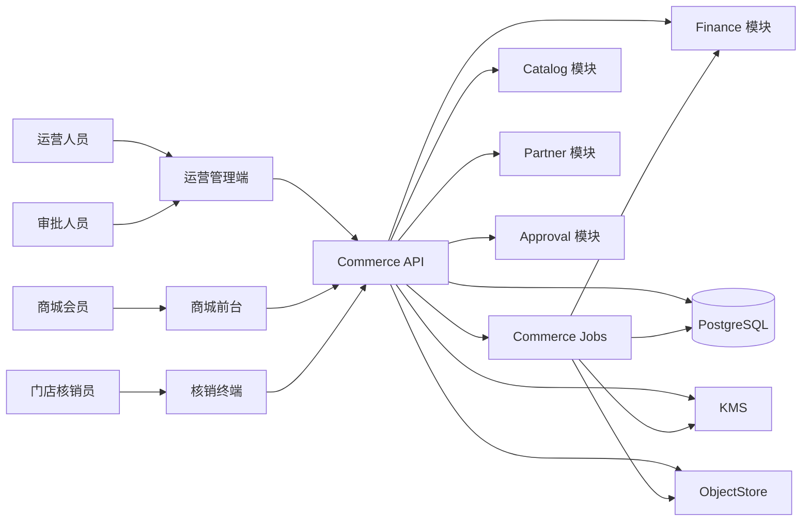
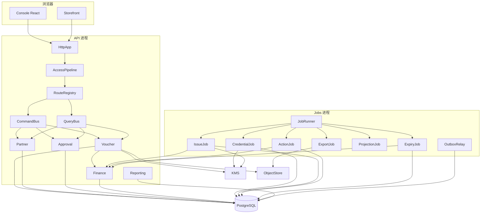
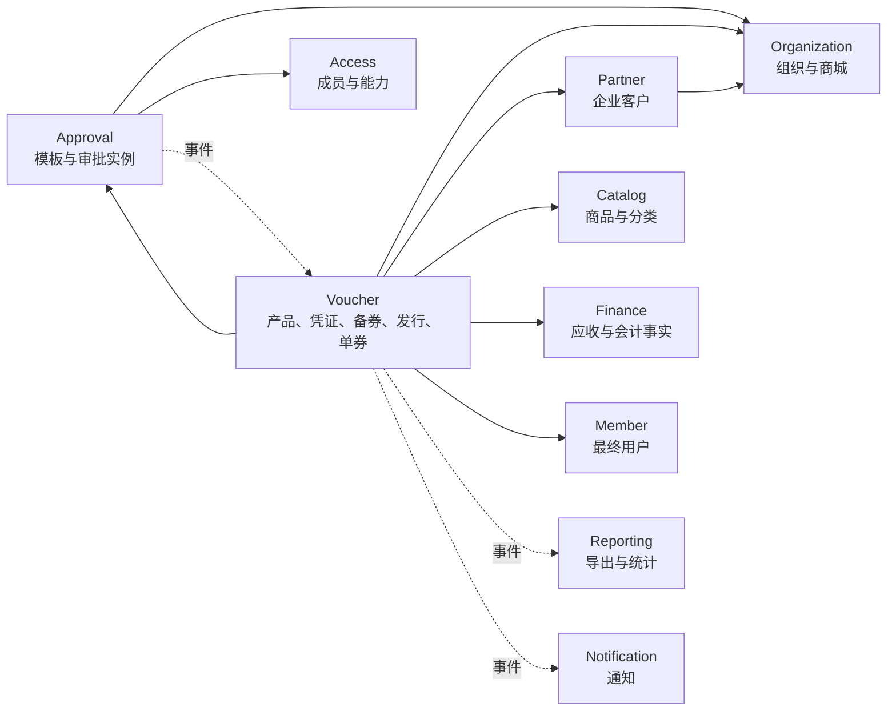
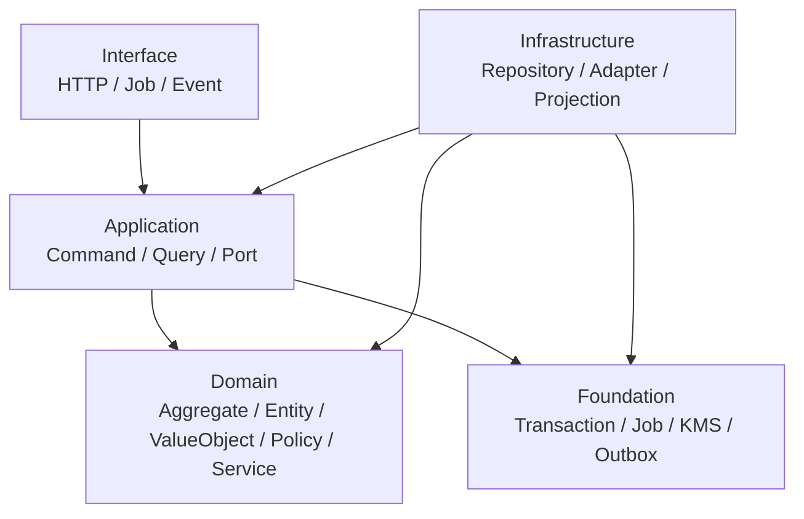
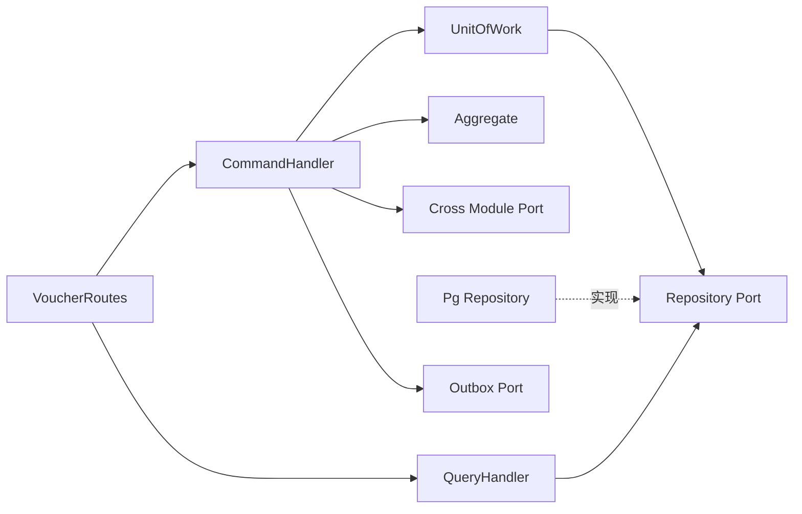
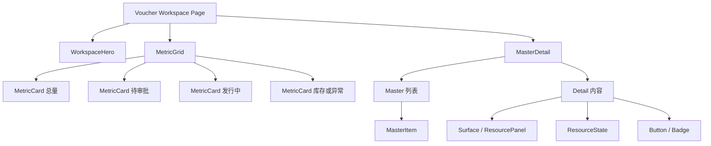

# 卡券系统架构

## 1. 架构目标

目标不是把甲方原型逐页翻译成 CRUD，而是建立一个能够长期承载实体卡、电子券、储值、未来积分和礼包的卡券子系统，同时保持当前项目的模块化单体、统一事务、统一鉴权、统一作业和统一财务边界。

关键取舍：

- 保留单一 Commerce 服务，API 与 Jobs 使用同一领域代码和数据库模型。
- 领域写模型遵循 DDD；列表、检索和导出使用独立读模型。
- 模块间不共享仓储，不跨 Schema 写表。
- 同库强一致操作使用一个事务；非关键衍生数据使用 Outbox 事件。
- 重任务通过现有 JobRunner 执行，不引入第二套队列。
- 外部卡券类型或供应商通过端口与注册表接入，不污染核心领域。

## 2. 系统上下文图



## 3. 容器架构图



## 4. 限界上下文



依赖方向固定如下：

| 模块 | 允许同步依赖 | 禁止事项 |
|---|---|---|
| Partner | Organization、KMS | 不读取或写入 Voucher 表 |
| Approval | Organization、Access | 不包含备券专属字段，不直接写 Voucher |
| Voucher | PartnerPort、ApprovalPort、CatalogPort、FinancePort、MemberPort | 不直接访问其他模块表 |
| Finance | 自己的仓储 | 不反向依赖 Voucher；只接收事实 |
| Reporting | 事件和读模型 | 不成为命令执行前置依赖 |
| Notification | 事件 | 通知失败不得回滚已完成业务 |

## 5. 模块职责

### 5.1 Partner

Partner 是企业客户唯一事实来源，负责：

- 客户身份、状态、类型、行业、规模和标签。
- 默认付款条件和销售负责人。
- 客户地址、电话与多联系人。
- 为 Voucher 提供只读 `CustomerPort`。
- 不保存收款状态、卡券数量或卡券订单字段。

Partner 复用现有 `partner.partner` 稳定身份，将 `customer` 增加为正式 subtype；客户专属属性放入 `partner.customer`，联系人放入 `partner.customercontact`。

### 5.2 Approval

Approval 是通用审批支持域，负责：

- 版本化审批模板。
- 节点顺序、通过模式和参与人规则。
- 为一次业务提交创建不可变模板快照。
- 激活当前节点、记录决定、推进或结束实例。
- 产生审批完成事件。

Approval 不理解客户、面值、卡号或备券数量。业务摘要作为不可变 subject snapshot 保存，具体业务状态由 Voucher 响应审批事件后改变。

### 5.3 Voucher

Voucher 是核心域，内部划分六个子域：

1. Product：产品及不可变版本。
2. Credential：凭证池、凭证生成、导入、占用和发行。
3. Stock：备券申请、修订和可发行数量。
4. Issue：销售订单、发行批次和逐项执行。
5. Lifecycle：单券、激活、绑定、余额和状态事件。
6. Action：批量状态操作、到期、核销与退款。

这些子域位于同一模块和 Schema，可在一个事务内维护关键不变量，但只能通过应用服务协调，不能由一个聚合直接修改另一个聚合的私有状态。

### 5.4 Finance

Finance 接收卡券事实并负责生成会计分录：

- 订单确认事实：销售额、面值总额、客户和付款条件。
- 发行事实：已成功发行数量与面值。
- 收款事实：本次实收金额。
- 核销事实：实际消耗余额。
- 退款事实：恢复金额。
- 作废和到期事实：剩余余额及原因。

Voucher 不选择借贷科目，不创建自己的财务挂账表。`FinancePort` 是唯一会计边界。

### 5.5 Reporting

Reporting 复用现有导出作业，负责：

- 接收当前筛选条件的快照。
- 分页读取 `voucher.searchdocument`。
- 生成 CSV 或 XLSX。
- 写入 ObjectStore 并返回文件回执。

## 6. 分层结构



依赖规则：

- Domain 只能依赖 `@shop/kernel` 和本模块 Domain。
- Application 可以依赖 Domain 和端口接口，不能依赖 PostgreSQL 实现。
- Infrastructure 实现 Application 端口。
- Interface 只做协议转换、校验后的 DTO 映射和回执映射。
- Route 文件不得包含 SQL、状态转换或金额计算。
- Job 文件不得复制 Command 业务规则；Job 调用应用服务。
- React 组件不得拼接 API URL、决定领域状态或计算服务端余额。

## 7. 模块调用结构



一个命令处理器的固定步骤：

1. 将请求 DTO 转为值对象。
2. 通过最小端口读取跨域事实。
3. 在 UnitOfWork 中加载聚合并执行领域行为。
4. 保存聚合和新增实体。
5. 保存聚合产生的领域事件到 Outbox。
6. 提交事务。
7. 返回业务回执，不返回基础设施对象。

## 8. 扩展机制

### 8.1 卡券类型注册表

```ts
export interface VoucherType {
  readonly code: string;
  parseProduct(input: unknown): ProductRule;
  planIssue(input: IssueContext): IssuePlan;
  activate(input: ActivationContext): ActivationResult;
  redeem(input: RedemptionContext): RedemptionResult;
  describe(product: ProductVersion): Readonly<Record<string, unknown>>;
}
```

`VoucherTypeRegistry` 负责按 `code` 注册和解析策略。MVP 只注册 `StoredValueType`。未来积分券和礼包分别由独立模块注册，不修改储值券类和核心流程。

使用的设计模式：

- Strategy：不同卡券类型的发行与核销规则。
- Registry：按类型查找策略，消除条件链。
- Factory：从持久化快照恢复聚合和值对象。
- Repository：隔离领域与 PostgreSQL。
- Unit of Work：统一事务和事件提交。
- Specification：搜索条件、审批参与人和状态选择器。
- State：聚合内显式状态转换。
- Template Method：生成、导入、发行和批量操作的作业骨架。
- Adapter：KMS、ObjectStore、Catalog、Finance 与外部提供商。
- Outbox：事务内记录、事务后分发事件。

### 8.2 凭证生成器

```ts
export interface CredentialGenerator {
  readonly source: 'generated' | 'imported';
  generate(plan: CredentialPlan): AsyncIterable<CredentialMaterial>;
}
```

- `GeneratedCredential` 使用编号策略与随机密钥材料。
- `ImportedCredential` 从已验证导入行读取。
- 两者输出同一个 `CredentialMaterial`，后续加密、持久化和事件逻辑完全复用。

### 8.3 目标选择器

批量券操作使用 `VoucherSelector`：

```ts
export type VoucherSelector =
  | Readonly<{ kind: 'ids'; ids: readonly string[] }>
  | Readonly<{ kind: 'number'; number: string }>
  | Readonly<{ kind: 'range'; pool: string; start: number; end: number }>
  | Readonly<{ kind: 'batch'; batch: string }>;
```

解析器只在创建 `ActionBatch` 时运行一次，得到冻结的 `ActionItem`。后台作业不重新解释筛选条件，避免执行期间目标集合变化。

## 9. SOLID 与迪米特法则落实

| 原则 | 具体落实 |
|---|---|
| 单一职责 | 每个 Command 只完成一个用例；每个 Aggregate 只维护自己的不变量 |
| 开闭原则 | 新卡券类型实现 `VoucherType` 并注册，不改核心命令 |
| 里氏替换 | 所有类型策略返回统一计划和结果，不泄露类型特有基础设施 |
| 接口隔离 | `CustomerPort`、`ApprovalPort`、`FinancePort`、`CatalogPort` 分开，不建万能服务接口 |
| 依赖倒置 | Application 依赖端口，Infrastructure 提供实现 |
| 迪米特法则 | Issue 命令只调用 `CustomerPort.customer()`，不穿透 PartnerRepository 或联系人集合 |

禁止出现：

- `VoucherService` 之类包含所有用例的上帝类。
- 一个仓储返回跨越多个上下文的可变对象图。
- Route 调 Repository 后自行修改多张表。
- React Page 向多个底层接口拼装同一个业务事务。
- 领域对象持有 Container、数据库连接、HTTP Request 或环境变量。

## 10. 后端目录结构

最终目录只保留下列结构。文件名使用 PascalCase，目录使用简短单词，不使用连接符或下划线。

```text
services/commerce/src/modules/
├── approval/
│   ├── ApprovalModule.ts
│   ├── application/
│   │   ├── command/
│   │   │   ├── CreateTemplate.ts
│   │   │   ├── ReviseTemplate.ts
│   │   │   ├── ChangeTemplate.ts
│   │   │   ├── StartApproval.ts
│   │   │   └── DecideApproval.ts
│   │   ├── query/
│   │   │   ├── GetTemplates.ts
│   │   │   ├── GetTemplate.ts
│   │   │   ├── GetApprovals.ts
│   │   │   └── GetApproval.ts
│   │   └── port/
│   │       ├── ApprovalRepository.ts
│   │       ├── ParticipantResolver.ts
│   │       └── ApprovalPort.ts
│   ├── domain/
│   │   ├── model/
│   │   │   ├── ApprovalTemplate.ts
│   │   │   ├── TemplateRevision.ts
│   │   │   ├── ApprovalNode.ts
│   │   │   ├── ApprovalInstance.ts
│   │   │   ├── ApprovalStep.ts
│   │   │   └── ApprovalDecision.ts
│   │   ├── policy/
│   │   │   ├── DecisionPolicy.ts
│   │   │   └── ParticipantPolicy.ts
│   │   └── value/
│   │       ├── ParticipantRule.ts
│   │       ├── SubjectRef.ts
│   │       └── DecisionMode.ts
│   ├── infrastructure/
│   │   ├── adapter/
│   │   │   └── AccessParticipant.ts
│   │   └── persistence/
│   │       └── PgApprovalRepository.ts
│   └── interface/
│       ├── http/
│       │   └── ApprovalRoutes.ts
│       └── event/
│           └── ApprovalEvents.ts
├── partner/
│   ├── PartnerModule.ts
│   ├── application/
│   │   ├── command/
│   │   │   ├── CreateCustomer.ts
│   │   │   ├── UpdateCustomer.ts
│   │   │   └── ChangeCustomer.ts
│   │   ├── query/
│   │   │   ├── GetCustomers.ts
│   │   │   └── GetCustomer.ts
│   │   └── port/
│   │       ├── CustomerRepository.ts
│   │       └── CustomerPort.ts
│   ├── domain/
│   │   ├── model/
│   │   │   ├── Customer.ts
│   │   │   └── CustomerContact.ts
│   │   └── value/
│   │       ├── CustomerCode.ts
│   │       ├── CustomerType.ts
│   │       └── PaymentTerm.ts
│   ├── infrastructure/
│   │   └── persistence/
│   │       └── PgCustomerRepository.ts
│   └── interface/
│       └── http/
│           └── CustomerRoutes.ts
└── voucher/
    ├── VoucherModule.ts
    ├── application/
    │   ├── command/
    │   │   ├── CreateProduct.ts
    │   │   ├── ReviseProduct.ts
    │   │   ├── ChangeProduct.ts
    │   │   ├── CreatePool.ts
    │   │   ├── GenerateCredentials.ts
    │   │   ├── ImportCredentials.ts
    │   │   ├── CreateStock.ts
    │   │   ├── UpdateStock.ts
    │   │   ├── SubmitStock.ts
    │   │   ├── ResolveStock.ts
    │   │   ├── CreateOrder.ts
    │   │   ├── UpdateOrder.ts
    │   │   ├── SubmitOrder.ts
    │   │   ├── CancelOrder.ts
    │   │   ├── RetryIssue.ts
    │   │   ├── CreateAction.ts
    │   │   ├── ActivateVoucher.ts
    │   │   ├── BindVoucher.ts
    │   │   ├── RedeemVoucher.ts
    │   │   └── ReverseRedemption.ts
    │   ├── query/
    │   │   ├── GetProducts.ts
    │   │   ├── GetProduct.ts
    │   │   ├── GetCredentials.ts
    │   │   ├── GetCredentialJob.ts
    │   │   ├── GetStocks.ts
    │   │   ├── GetStock.ts
    │   │   ├── GetOrders.ts
    │   │   ├── GetOrder.ts
    │   │   ├── GetIssues.ts
    │   │   ├── GetIssue.ts
    │   │   ├── GetActions.ts
    │   │   ├── GetAction.ts
    │   │   ├── SearchVouchers.ts
    │   │   ├── GetVoucher.ts
    │   │   └── GetTimeline.ts
    │   ├── port/
    │   │   ├── ProductRepository.ts
    │   │   ├── CredentialRepository.ts
    │   │   ├── StockRepository.ts
    │   │   ├── OrderRepository.ts
    │   │   ├── VoucherRepository.ts
    │   │   ├── ActionRepository.ts
    │   │   ├── CustomerPort.ts
    │   │   ├── ApprovalPort.ts
    │   │   ├── CatalogPort.ts
    │   │   ├── FinancePort.ts
    │   │   ├── MemberPort.ts
    │   │   ├── CredentialCipher.ts
    │   │   ├── CoverStore.ts
    │   │   └── VoucherSearch.ts
    │   └── service/
    │       ├── StockAllocator.ts
    │       ├── IssuePlanner.ts
    │       ├── CredentialIssuer.ts
    │       └── VoucherProjector.ts
    ├── domain/
    │   ├── model/
    │   │   ├── VoucherProduct.ts
    │   │   ├── ProductVersion.ts
    │   │   ├── CredentialPool.ts
    │   │   ├── Credential.ts
    │   │   ├── StockRequest.ts
    │   │   ├── StockRevision.ts
    │   │   ├── IssueOrder.ts
    │   │   ├── IssueBatch.ts
    │   │   ├── IssueItem.ts
    │   │   ├── Voucher.ts
    │   │   ├── TenderHold.ts
    │   │   ├── Redemption.ts
    │   │   ├── Refund.ts
    │   │   ├── ActionBatch.ts
    │   │   └── ActionItem.ts
    │   ├── policy/
    │   │   ├── ProductPolicy.ts
    │   │   ├── CredentialPolicy.ts
    │   │   ├── StockPolicy.ts
    │   │   ├── IssuePolicy.ts
    │   │   ├── VoucherPolicy.ts
    │   │   └── RedemptionPolicy.ts
    │   ├── service/
    │   │   ├── VoucherTypeRegistry.ts
    │   │   ├── StoredValueType.ts
    │   │   ├── CredentialNumbering.ts
    │   │   └── VoucherSelector.ts
    │   └── value/
    │       ├── CredentialMode.ts
    │       ├── DeliveryMedium.ts
    │       ├── RedemptionMode.ts
    │       ├── ValidityWindow.ts
    │       ├── JumpTarget.ts
    │       ├── VoucherNumber.ts
    │       └── VoucherSecret.ts
    ├── infrastructure/
    │   ├── adapter/
    │   │   ├── ApprovalAdapter.ts
    │   │   ├── CatalogAdapter.ts
    │   │   ├── CustomerAdapter.ts
    │   │   ├── FinanceAdapter.ts
    │   │   ├── KmsCredentialCipher.ts
    │   │   ├── MemberAdapter.ts
    │   │   └── ObjectCoverStore.ts
    │   ├── persistence/
    │   │   ├── PgProductRepository.ts
    │   │   ├── PgCredentialRepository.ts
    │   │   ├── PgStockRepository.ts
    │   │   ├── PgOrderRepository.ts
    │   │   ├── PgVoucherRepository.ts
    │   │   ├── PgActionRepository.ts
    │   │   └── PgVoucherSearch.ts
    │   └── projection/
    │       └── PgVoucherProjector.ts
    └── interface/
        ├── http/
        │   ├── ProductRoutes.ts
        │   ├── CredentialRoutes.ts
        │   ├── StockRoutes.ts
        │   ├── OrderRoutes.ts
        │   ├── ActionRoutes.ts
        │   └── VoucherRoutes.ts
        ├── event/
        │   ├── ApprovalSubscriber.ts
        │   └── VoucherEvents.ts
        └── job/
            ├── CredentialJob.ts
            ├── ImportJob.ts
            ├── IssueJob.ts
            ├── ActionJob.ts
            ├── ExpiryJob.ts
            └── ProjectionJob.ts
```

## 11. Console 目录结构

```text
apps/console/src/feature/voucher/
├── manifest.ts
├── VoucherRoute.tsx
├── voucher.css
├── api/
│   ├── Command.ts
│   ├── Query.ts
│   └── Schema.ts
├── model/
│   ├── Filter.ts
│   ├── Form.ts
│   ├── State.ts
│   └── View.ts
├── shell/
│   ├── Shell.tsx
│   ├── Menu.tsx
│   ├── Overview.tsx
│   └── Result.tsx
├── library/
│   ├── Page.tsx
│   ├── Table.tsx
│   ├── Generate.tsx
│   ├── Import.tsx
│   └── Details.tsx
├── customer/
│   ├── Page.tsx
│   ├── Table.tsx
│   ├── Form.tsx
│   └── Details.tsx
├── product/
│   ├── Page.tsx
│   ├── Table.tsx
│   ├── Form.tsx
│   └── Details.tsx
├── stock/
│   ├── Page.tsx
│   ├── Table.tsx
│   ├── Form.tsx
│   ├── Details.tsx
│   └── Timeline.tsx
├── order/
│   ├── Page.tsx
│   ├── Table.tsx
│   ├── Wizard.tsx
│   ├── Basics.tsx
│   ├── Sales.tsx
│   ├── Credentials.tsx
│   └── Details.tsx
├── approval/
│   ├── Page.tsx
│   ├── Template.tsx
│   ├── Node.tsx
│   ├── Inbox.tsx
│   └── Details.tsx
├── action/
│   ├── Page.tsx
│   ├── Table.tsx
│   ├── Form.tsx
│   └── Details.tsx
└── search/
    ├── Page.tsx
    ├── Filter.tsx
    ├── Table.tsx
    ├── Details.tsx
    └── Timeline.tsx
```

### 11.1 Smart Wing VI 1.2 基线

卡券 Console 的唯一视觉基础是 Smart Wing VI 1.2：

| 项目 | 权威值 |
| --- | --- |
| Git 提交 | `f7b13e239b496111d382190ed1c5a7abb7382dd3` |
| 分支 | `origin/codex/vi-1-2-foundation-20260901` |
| Design 包 | `@shop/design` 1.2.0 |
| 组合示例 | `packages/design/src/VI12Foundation.stories.tsx` |
| Token 权威源 | `packages/design/src/tokens.json`、`Token.ts`、`tokens.css` |

卡券模块只能从公共入口导入：

```ts
import {
  Badge,
  Button,
  MasterDetail,
  MasterItem,
  MetricCard,
  MetricGrid,
  ResourcePanel,
  ResourceState,
  Surface,
  WorkspaceHero,
} from '@shop/design'
```

禁止导入 `@shop/design/src/**`，禁止复制 `WorkspaceHero`、`MetricCard`、`MasterDetail` 或 `MasterItem` 的 JSX/CSS，禁止为卡券需求修改 `packages/design/**`。若公共能力缺失，先在卡券布局层用现有公开原语组合；是否扩展 Design 包应作为另一个独立交付物决策。

### 11.2 页面组合映射



| 页面区域 | VI 1.2 组件 | 卡券模块负责的数据与行为 |
| --- | --- | --- |
| 顶部品牌区 | `WorkspaceHero` | 工作区标题、说明、当前组织/产品身份、主操作、同步时间 |
| 运营概览 | `MetricGrid` + `MetricCard` | 总量、待审批、发行中、可用库存、失败或异常；数值来自查询模型 |
| 主从骨架 | `MasterDetail` | 桌面左右布局、窄屏上下布局；模块只传 master/detail 内容 |
| 左侧记录 | `MasterItem` | 方案、资源池、备券、发行批次、操作批次的选择与摘要 |
| 详情容器 | `Surface`、`ResourcePanel` | 表单、详情、时间线、明细表和操作区 |
| 状态反馈 | `ResourceState` | 加载、空结果、失败、无选择和作业处理中 |
| 操作与标签 | `Button`、`Badge` | 业务动作、状态文字、禁用原因和批次结果 |

客户、产品、卡号库、备券、卡券中心、审批、批量操作和统一查询共用同一工作区骨架，但不会把 API、权限、状态机或表单规则塞进 Design 组件。`Overview.tsx` 只负责把当前 workspace 的 Hero 和指标视图模型映射到公开组件。

### 11.3 响应式和 Token 纪律

- 桌面使用完整 `MasterDetail`；390 px 视口自然变成先 master 后 detail 的上下结构。
- 卡券专属 `voucher.css` 只允许组合 `--sw-*` Token。颜色、间距、圆角、阴影、字号和动效不得写十六进制、`rgb()`、临时渐变、自造阴影或无 Token 数值。
- 不复制旧会员页或甲方静态 HTML 的硬编码 CSS；原型只提供信息架构和业务意图。
- 页面不能通过固定宽度维持桌面表格。窄屏时筛选区、操作区和详情字段按语义换行；需要完整列的表格使用已有响应式容器，不让页面根节点横向溢出。
- 选中、焦点、悬停、禁用、危险和成功状态使用 Design System 既有语义，不在卡券模块重定义色彩语义。
- 动效遵循 Token 和现有 reduced-motion 行为；异步业务进度由状态组件表达，不用装饰动画代替真实状态。
- 尚未接通的写能力必须显示真实不可用原因，不能做假成功按钮或 `alert` 模拟。

前端规则：

- `api` 是唯一 SDK 入口。
- `model` 只保存视图模型、表单状态和筛选序列化。
- 每个业务目录拥有自己的页面组件，不跨目录导入内部组件。
- 共用按钮、状态、容器、表格、抽屉、日期、上传和分页来自 `@shop/design` 公共导出。
- 所有筛选写入 URL；翻页使用服务端游标。
- 命令成功后根据回执精准失效查询，不做全局刷新。
- 大批次只展示进度，不在浏览器循环调用单券接口。

## 12. 契约与生成代码

```text
packages/contract/definitions/
├── operations.yml
├── events.yml
└── schemas.yml

packages/sdk/src/operations/
└── voucher.ts              # 生成文件

tests/contracts/
├── voucher.contract.ts
└── voucher.event.ts
```

契约定义是唯一 API 与事件配置来源。权限映射、路由注册、SDK 和契约测试均从定义生成；不得在 Console、Route 和数据库迁移中分别手写四份操作清单。

## 13. 数据库迁移结构

既有迁移永不修改。升级使用新的受管迁移：

```text
database/supabase/migrations/
├── 20260901xxxxxx_voucher_target_model.sql
├── 20260901xxxxxx_voucher_target_data.sql
├── 20260901xxxxxx_voucher_target_contract.sql
└── 20260901xxxxxx_voucher_target_cutover.sql
```

SQL 文件保留下划线是迁移命名约定。最终切换不保留视图别名、旧函数或双写触发器。

## 14. 旧文件处置

下列文件的逻辑迁移到新分层后删除：

```text
services/commerce/src/modules/voucher/VoucherOperations.ts
services/commerce/src/modules/voucher/VoucherQueries.ts
services/commerce/src/modules/voucher/VoucherJobs.ts
services/commerce/src/modules/voucher/VoucherDeadletter.ts
services/commerce/src/modules/voucher/application/VoucherImportOperations.ts
services/commerce/src/modules/voucher/infrastructure/persistence/PgVoucherImport.ts
services/commerce/src/modules/voucher/interface/job/VoucherImportJob.ts

apps/console/src/feature/voucher/VoucherQuery.ts
apps/console/src/feature/voucher/VoucherSchema.ts
apps/console/src/feature/voucher/VoucherTable.tsx
apps/console/src/feature/voucher/VoucherDialogs.tsx
apps/console/src/feature/voucher/voucher-dialogs.css
apps/console/src/feature/voucher/voucher-workspace.css
apps/console/src/feature/voucher/voucher-responsive.css
apps/console/src/feature/voucher/voucher-table.css
```

删除发生在新路径定向测试通过后的同一集成批次。逻辑必须移动，不允许仅复制后留下两套实现。
