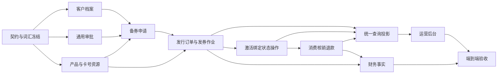
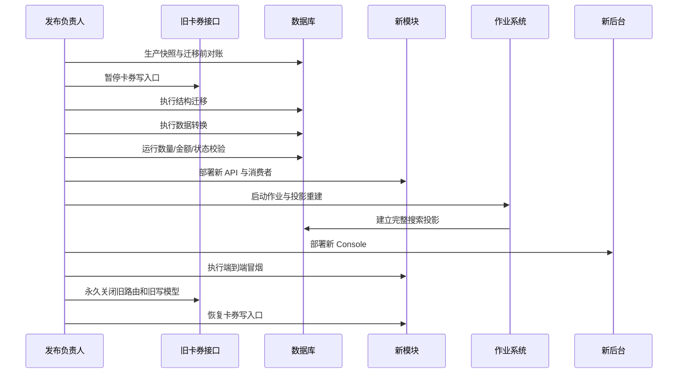

# 卡券升级实施与验收方案

> 本文负责把目标架构转换为可实施、可迁移、可压测、可验收的交付计划。领域模型见 [Domain.md](./Domain.md)，模块边界与目录结构见 [Architecture.md](./Architecture.md)，完整业务时序见 [Flows.md](./Flows.md)。

## 1. 交付原则

1. 本次升级是一次目标模型切换，不保留旧写模型、旧接口或旧页面的长期兼容层。
2. 复用基础设施与已经验证的核心算法，不复用错误的领域边界和命名。
3. 先冻结契约和状态机，再建表与领域层，随后实现命令、查询、作业和界面。
4. 所有写操作只有一个事实入口；列表、统计和导出从同一搜索投影读取，禁止各页面重复拼接口径。
5. 同一业务事实只能有一个所有者：卡券状态归 `voucher`，客户档案归 `partner`，审批归 `approval`，账务归 `finance`。
6. 同步事务只完成必须立即一致的动作；批量发券、密钥生成、投影、导出和通知通过作业或事件异步执行。
7. 不在本次范围内主动增加新的安全门禁；沿用项目现有访问控制、加密、审计和契约机制。
8. 不修改已经登记的迁移，不伪造迁移账本；目标结构全部通过新的受管迁移建立。

## 2. 交付依赖图



实现不得绕过该依赖顺序。例如，卡券中心不能先用临时字段实现客户和审批，之后再迁移；这样会产生第二套事实来源。

## 3. 契约设计

### 3.1 契约组织

所有操作定义保存在 `packages/contract/definitions/operations.yml`，由契约生成器产生 Contract、OpenAPI、SDK、服务端运行态注册和数据库契约。操作标识只在定义层出现一次；SDK 文件由标识首段推导，服务端归属由 `owner` 推导，禁止在 Console、服务端和测试中各维护字符串清单或产物路径。

契约按以下资源命名：

- `customer`：企业客户及联系人。
- `voucherproduct`：卡券产品和不可变版本。
- `credentialpool`：卡号资源池、卡号、导入与生成作业。
- `stockrequest`：备券申请和可用额度。
- `approval`：审批模板、审批实例与任务。
- `issueorder`：发行订单、发行批次和发行明细。
- `voucher`：单张卡券生命周期。
- `actionbatch`：批量禁用、启用、作废和延期。
- `redemption`：金额预占、消费、释放与退款。
- `vouchersearch`：统一查询、详情、时间线和导出。

### 3.2 通用请求规则

| 项目 | 规则 |
| --- | --- |
| 标识 | 所有资源使用不可变 UUID 作为内部标识，业务编号只用于展示和检索 |
| 金额 | 请求使用 `{ amountMinor, currency }`，禁止浮点金额 |
| 时间 | API 使用 UTC ISO-8601；界面按组织时区展示 |
| 日期 | 有效期按业务日期表达，结束日期包含当日 |
| 分页 | 列表使用 `cursor` 和 `limit`，默认 20，最大 100 |
| 排序 | 每个列表只开放白名单排序字段，并追加 `id` 作为稳定次序 |
| 幂等 | 创建、审批、发行、批量操作、消费和退款必须携带 `Idempotency-Key` |
| 并发 | 可编辑资源返回 `version`；更新命令必须提交预期版本 |
| 作业 | 大批量命令返回 `202 + jobId`，状态通过统一作业查询读取 |
| 错误 | 使用稳定的业务错误码，不让数据库错误和内部异常穿透契约 |
| 收据 | 成功写操作返回资源标识、业务编号、版本、状态和发生时间 |
| 密钥 | 列表和日志永不返回完整券密；只有被授权的单卡详情按现有机制解密 |

### 3.3 标准错误模型

```ts
type ErrorContract = {
  code: string
  message: string
  requestId: string
  retryable?: boolean
  details?: Record<string, JsonValue>
}
```

字段错误和版本冲突信息统一放入 `details`，字段名由对应操作契约定义；不再建立第二个 Problem DTO。

稳定错误码至少覆盖：

| 错误码 | 场景 |
| --- | --- |
| `CUSTOMER_NOT_FOUND` | 客户不存在 |
| `PRODUCT_DISABLED` | 产品已禁用，不能用于新申请 |
| `PRODUCT_VERSION_STALE` | 提交时产品版本已变化 |
| `CREDENTIAL_SHORTAGE` | 可用卡号不足 |
| `STOCK_EXHAUSTED` | 备券额度不足 |
| `APPROVAL_NOT_ASSIGNED` | 当前用户不是待办审批人 |
| `APPROVAL_ALREADY_DECIDED` | 审批任务已处理 |
| `ISSUE_ORDER_LOCKED` | 发行订单已提交，不能编辑 |
| `VOUCHER_STATE_CONFLICT` | 卡券状态不允许该动作 |
| `VOUCHER_EXPIRED` | 卡券已过期 |
| `VOUCHER_DISABLED` | 卡券已禁用 |
| `VOUCHER_VOID` | 卡券已作废 |
| `INSUFFICIENT_BALANCE` | 可用余额不足 |
| `REDEMPTION_DUPLICATE` | 外部消费请求重复且参数不一致 |
| `VERSION_CONFLICT` | 乐观并发版本不一致 |

### 3.4 目标操作目录

目标操作的唯一机器事实位于 `packages/contract/definitions/operations.yml`；逐项的设计意图、规范 ID、完整路由、权限、策略、MVP 证据、生成模块和验证方式统一记录在 [Operations.md](./Operations.md)。本文只冻结分组与行为规则，避免再复制一份会漂移的操作表。

| owner | 资源组 | 规范命名空间 | 数量 |
| --- | --- | --- | ---: |
| `partner` | Partner Customer | `partner.customers.*`、`partner.customeroptions.*` | 7 |
| `approval` | Approval Template、Task、Instance | `approval.templates.*`、`approval.tasks.*`、`approval.instances.*` | 10 |
| `voucher` | Voucher Product | `voucher.products.*`、`voucher.productoptions.*` | 7 |
| `voucher` | Credential Pool、Credential、Job | `voucher.credentialpools.*`、`voucher.credentials.*`、`voucher.credentialexports.*`、`voucher.jobs.*` | 10 |
| `voucher` | Stock Request | `voucher.stockrequests.*`、`voucher.stockrequestoptions.*` | 7 |
| `voucher` | Issue Order、Issue Batch | `voucher.issueorders.*`、`voucher.issuebatches.*`、`voucher.issueorderexports.*` | 9 |
| `voucher` | Action Batch | `voucher.actionbatches.*`、`voucher.actionexports.*` | 5 |
| `voucher` | Activation、Voucher Detail | `voucher.activations.*`、`voucher.vouchers.*` | 7 |
| `voucher` | Redemption、Tender Hold、Refund | `voucher.redemptions.*`、`voucher.tenderholds.*`、`voucher.refunds.*` | 7 |
| `voucher` | Search Document、Export Job | `voucher.search.*`、`voucher.searchfacets.*`、`voucher.searchsnapshots.*`、`voucher.searchexports.*`、`voucher.exports.*` | 5 |
|  | **合计** |  | **74** |

冻结规则：

1. 每项必须显式定义 `id`、`owner`、`method`、完整 `/api/v1/**` 路径、`audience`、`permission`、`idempotent`、`idempotency`、`expectedVersion`、`execution`、`availability`、`summary`、`schema` 和 `requirements`。
2. 74 项在批次 0 全部为 `availability=frozen`。它们生成 Contract、OpenAPI、Schema 和 SDK，但 SDK 的真实 HTTP 执行、服务端路由注册、数据库能力发布和小程序运行态清单均拒绝或排除 frozen 操作。
3. 对应业务批次实现完成并通过验收后，只把该项切为 `runtime`；不得变更 ID、方法、路径、owner 或重建别名。
4. 既有 19 个 voucher 操作仍是旧页面和服务的运行态契约，只在批次 6 一次性切换时删除。目标操作不转发、不映射、不复用这些旧路由。
5. `controller`、`handler` 和 SDK 文件路径不写入 YAML。运行态注册文件由生成器固定，SDK 文件由 ID 首段推导，服务端模块由 `owner` 推导。

行为规则：

- `partner.customers.update` 对联系人采用完整意图命令；服务端在单事务内计算新增、修改和删除。
- Voucher Product 以不可变版本承载面值、有效期和适用范围；MVP 类型仅为 `storedvalue`。
- Credential 生成命令只接收数量、兑换方式和备注；编号及密钥规则由领域配置统一产生。
- Stock Request 提交后冻结快照；驳回后修改会创建新的 Approval Instance，历史实例不覆盖。
- Approval 只推进模板、实例和任务并发布结果，不直接更新 Voucher 存储。
- Issue Order 提交、Credential 生成/导入、Action Batch 和导出均按矩阵返回 `202` 异步回执；目标集合在入队前冻结，逐项结果可精确重试。
- 激活、绑定、禁用、作废、过期和退款是状态机命令，不是相互独立的布尔字段更新。
- Redemption 与 Refund 以外部请求号幂等；重复键且载荷一致返回原收据，载荷不同返回 `REDEMPTION_DUPLICATE`。
- 搜索、筛选计数和导出共用 Search Document 投影与同一过滤器语义，不跨模块现场联表。

## 4. 数据一致性与并发设计

### 4.1 事务边界

| 用例 | 同一事务内必须完成 |
| --- | --- |
| 创建客户 | 客户、联系人、领域事件、操作收据 |
| 创建产品 | 产品、首版本、事件 |
| 生成资源申请 | 资源池、生成作业、事件；实际卡号异步 |
| 提交备券 | 申请状态、业务快照、审批实例启动请求、事件 |
| 审批通过 | 审批任务、实例推进、结果事件；额度状态由卡券消费者处理 |
| 提交发行 | 锁定额度、增加 committed、占用实体卡号、创建发行批次与明细、入队作业 |
| 单卡激活/绑定/禁用 | 聚合状态、版本、状态事件、出站事件 |
| 消费 | 余额、预占/消费记录、状态事件、财务事实、操作收据 |
| 退款 | 原消费累计退款、余额恢复、退款记录、财务事实、收据 |

跨模块更新通过事务外事件衔接；消费与财务的可靠交付使用现有 Outbox，禁止同步调用另一个模块后同时提交两个数据库事务。

### 4.2 锁顺序

所有涉及多实体的写操作固定按以下顺序加锁，避免死锁：

1. `stockrequest`
2. `credentialpool`
3. `credential`，按 `id` 升序
4. `issueorder`
5. `issueitem`，按 `ordinal` 升序
6. `voucher`，按 `id` 升序
7. `tenderhold` 或 `redemption`

领域仓储只暴露与用例一致的锁方法，例如 `lockAvailableCredentials(poolId, count)`；应用层不得自行拼 `FOR UPDATE`。

### 4.3 额度并发

发行提交使用单条条件更新：

```sql
update voucher.stockrequest
set committed_count = committed_count + :quantity,
    version = version + 1,
    updated_at = now()
where id = :id
  and status = 'approved'
  and requested_count - committed_count >= :quantity
returning *;
```

没有返回行即为额度冲突。`remainingCount` 永远由 `requestedCount - committedCount` 计算，不允许单独维护第三个可写计数。

发行作业成功后增加 `issuedCount`，但不再次减少剩余额度。发行失败可重试；若整个订单最终取消，必须通过显式补偿命令释放尚未成功发行的 committed 数量。

### 4.4 实体卡号并发

实体卡号选择采用：

```sql
select id
from voucher.credential
where pool_id = :poolId and state = 'available'
order by sequence_no
for update skip locked
limit :quantity;
```

随后在同一事务中更新为 `held` 并绑定 `issueOrderId`。选中数少于请求数时整笔回滚，不允许创建半满订单。多个发行订单可并行从同一池选择，不会获得同一张卡。

### 4.5 卡券余额并发

消费、释放、退款都锁定单张 `voucher`。可用余额定义为：

```text
available = balance - activeHoldAmount
```

直接消费以条件更新保证余额不为负；预占消费先锁预占记录，再锁卡券。部分退款累计值不得超过原消费金额。任何重试先读取幂等收据，再进入余额事务。

### 4.6 作业认领与分片

- 作业通过现有 JobRunner 租约认领，同一作业同时只有一个有效执行者。
- 大任务先建立稳定明细，再由工作者认领明细；不得每次重试重新选择目标。
- 明细以 `FOR UPDATE SKIP LOCKED` 分片，默认每片 500 条。
- 单进程默认并行 8 个分片；KMS 加解密采用上限 16 的有界并发。
- 并发、片大小和租约时长来自唯一运行配置，不在处理器中硬编码。
- 每项有独立状态和失败码；批次状态由明细计数推导。
- 重试只处理 `retryablefailed`，业务状态冲突记为 `terminalfailed`。

### 4.7 幂等与重复投递

| 层 | 唯一键 |
| --- | --- |
| HTTP 命令 | `actor + operationId + Idempotency-Key` |
| 审批决定 | `approvalTaskId` 的唯一决定记录 |
| 发行明细 | `issueBatchId + ordinal` |
| 卡券生成 | `issueItemId` 唯一关联一个 voucher |
| 状态事件 | `aggregateId + aggregateVersion` |
| 消费 | `merchantId + externalRequestId` |
| 退款 | `redemptionId + externalRequestId` |
| 财务事实 | `sourceType + sourceId + factType + sequence` |
| 投影消费 | `projectionName + eventId` |

Outbox、作业和投影允许至少一次投递，但所有消费者必须借助上述唯一键实现业务上的恰好一次效果。

## 5. 性能设计

### 5.1 性能目标

目标以生产常态数据量和暖缓存为准，验收环境需记录硬件、数据规模和并发数：

| 场景 | 目标 |
| --- | --- |
| 后台列表首屏 | p95 ≤ 300 ms，p99 ≤ 800 ms |
| 单实体详情 | p95 ≤ 200 ms |
| 普通同步命令 | p95 ≤ 500 ms |
| 激活和核销 | p95 ≤ 350 ms，排除外部支付等待 |
| 提交发行订单 | p95 ≤ 700 ms，只完成同步准备 |
| 搜索投影延迟 | 正常 p95 ≤ 5 s |
| 1 万张生成/发行 | 10 分钟内完成，失败可逐项重试 |
| 10 万张批量操作 | 30 分钟内完成且不阻塞在线请求 |
| 10 万行导出 | 5 分钟内生成对象文件 |

这些是首轮基线，不作为静态常量写入业务代码。压测后按实际数据库、KMS 和对象存储能力调整工作者并发。

### 5.2 查询策略

1. 所有运营列表读取投影表，禁止在请求期跨 `partner`、`approval`、`finance` 做大联表。
2. 使用游标分页。游标包含排序值和 `id`，不使用高偏移量 `OFFSET`。
3. 详情查询最多执行固定数量的批量查询，禁止逐行查询联系人、审批节点或事件。
4. 搜索条件转换由单一 `VoucherFilterCompiler` 完成；列表、导出和批量选择共用。
5. 模糊搜索使用规范化搜索列与 trigram/全文索引；精确业务编号使用 B-tree 唯一索引。
6. 日期范围采用左闭右开时间区间，避免在列上调用函数导致索引失效。
7. 选择项接口只返回 `id`、业务编号、名称、剩余量和版本，最多 50 条并支持关键词游标。
8. 状态统计和筛选计数从投影聚合读取，不对主交易表执行全表 `count`。

### 5.3 写入策略

- 批量插入使用数据库批次写入，默认每批 500 条。
- 卡号哈希、编号格式化等纯 CPU 工作可以分片并行；数据库提交保持有界。
- 领域事件先写 Outbox，再由投影消费者合并更新搜索文档。
- 相同卡券的事件严格按 `aggregateVersion` 应用；不同卡券可并行。
- 封面只保存对象引用和发行时快照，不在数据库保存二进制。
- 导入先上传对象，再流式解析；不把整个文件载入内存。

### 5.4 索引验收

每个目标列表必须提供一条与默认排序匹配的索引，并通过 `EXPLAIN (ANALYZE, BUFFERS)` 验证。验收标准：

- 默认列表不出现主表顺序扫描。
- 单页查询不读取数量级高于返回行数两个数量级的数据页。
- 多条件组合没有隐式类型转换。
- 外键删除和状态更新涉及的引用列均有索引。
- 索引总量以实际查询证明为准，不为未使用条件预建重复索引。

## 6. 可用性、恢复与可观测性

### 6.1 可恢复作业

| 故障 | 恢复方式 |
| --- | --- |
| 工作者中途退出 | 租约到期后其他工作者继续未完成明细 |
| KMS 暂时不可用 | 明细记录可重试失败，指数退避后重试 |
| 对象存储失败 | 保留业务草稿或导出作业，恢复后继续 |
| 单张卡号冲突 | 当前明细终止失败，不回滚已经成功的其他明细 |
| 投影消费者退出 | 从事件检查点继续，支持整表重建 |
| 财务消费者失败 | Outbox 保留事实，重投时按事实唯一键去重 |
| 导入格式错误 | 合法行不直接入正式资源；校验完成后整体确认导入 |
| 批量操作部分失败 | 批次显示成功/失败数量，可仅重试可重试项 |

### 6.2 状态可见性

所有异步作业统一返回：

```ts
type JobView = {
  id: string
  kind: string
  state: 'queued' | 'running' | 'succeeded' | 'partiallyfailed' | 'failed' | 'cancelled'
  total: number
  processed: number
  succeeded: number
  failed: number
  retryable: number
  startedAt?: string
  finishedAt?: string
  errorSummary?: Array<{ code: string; count: number }>
  result?: { resourceId?: string; objectKey?: string }
}
```

Console 用退避轮询或现有事件通道更新进度；离开页面后重新进入仍可凭 `jobId` 查看，不依赖浏览器内存。

### 6.3 日志与追踪

每条请求、命令、作业明细和领域事件携带：

- `traceId`
- `operationId`
- `actorId`
- `organizationId`
- `aggregateType`
- `aggregateId`
- `aggregateVersion`
- `jobId`、`batchId`、`itemId`（适用时）
- `idempotencyKeyHash`
- `durationMs`
- `resultCode`

日志只记录券号掩码、密钥哈希或内部标识，不记录完整券密。此处沿用现有凭据加密与日志规范，不新建第二套脱敏配置。

### 6.4 指标

最低指标集合：

- HTTP：请求数、成功率、错误码、延迟分位数。
- 命令：幂等命中、版本冲突、状态冲突。
- 资源：可用/占用/已发行卡号数，备券剩余额度。
- 发行：排队时长、处理速度、失败率、重试次数。
- 生命周期：激活、绑定、禁用、作废、过期数量。
- 金额：发行面值、当前负债余额、预占、核销和退款金额。
- 作业：队列深度、租约超时、死信数、最老任务年龄。
- 投影：检查点延迟、失败事件、重建进度。
- 外部依赖：KMS、对象存储、财务消费者的延迟与失败率。

告警阈值从性能目标和历史基线推导，配置集中在现有观测系统，业务代码只暴露指标。

### 6.5 对账任务

每日执行只读对账，输出差异而不自动篡改业务数据：

1. `requestedCount >= committedCount >= issuedCount`。
2. 实体发行明细与 credential 分配一一对应。
3. 每个成功发行明细恰好对应一张 voucher。
4. voucher 当前余额等于发行面值减净核销金额。
5. 活跃预占总额不超过卡券余额。
6. 消费累计退款不超过原消费。
7. 状态事件最后版本与聚合版本一致。
8. 财务事实与发行、核销、退款、作废和过期事件逐项对应。
9. 搜索投影状态和余额与主表一致。

对账输出走现有审计/报告能力；发现差异后以显式修复命令处理，不直接执行无记录的数据修补。

## 7. 数据迁移与一次性切换

### 7.1 迁移包

只新增以下受管迁移，实际序号按仓库当时最新迁移确定：

1. `voucher_target_model.sql`：建立新产品、资源、备券、发行、生命周期、操作和投影表。
2. `approval_context.sql`：建立通用审批模板、版本、节点、实例和任务。
3. `partner_customer.sql`：扩展客户类型并建立客户资料、联系人和结算资料表。
4. `voucher_target_data.sql`：从旧表一次性转换目标数据。
5. `voucher_target_contract.sql`：登记目标契约操作与权限映射。
6. `voucher_target_cutover.sql`：建立最终约束、切换视图/路由依赖并移除旧对象。

文件名属于 SQL，可按项目迁移约定使用下划线。迁移必须可在空库和生产数据快照上分别验证。

### 7.2 旧数据映射

| 旧对象 | 目标对象 | 转换规则 |
| --- | --- | --- |
| `voucher.program` | `voucher.product` | 稳定身份和启停状态 |
| `voucher.programversion` | `voucher.productversion` | 每版业务规则和展示快照 |
| `voucher.cardpool` | `voucher.credentialpool` | 资源池身份、兑换方式和来源 |
| `voucher.card` | `voucher.credential` | 已生成卡号；保留密文、哈希和状态历史 |
| generated cardpool 的未生成余量 | credential generation job | 切换前物化为真实 credential，或明确舍弃未使用容量 |
| `voucher.reserequest` | `voucher.stockrequest` | 修正命名，转入 requested/committed/issued 计数 |
| `voucher.approval` | `approval.instance/task` | 按历史结果创建已完成审批实例 |
| `voucher.issuebatch` | `voucher.issueorder` + `issuebatch` | 旧批次补建订单头和客户/产品快照 |
| `voucher.allocation` | `voucher.issueitem` | 转换为稳定发行明细 |
| `voucher.voucher` | `voucher.voucher` | 保留身份、余额、币种、用户绑定和有效期 |
| `voucher.statusevent` | `voucher.lifecycleevent` | 规范化事件类型并保留原时间与操作者 |
| `voucher.reserve` | `voucher.tenderhold` | 仅转换仍有效且语义一致的金额预占 |
| `voucher.redemption` | `voucher.redemption` | 保留原核销事实与外部订单引用 |
| `voucher.reversal` | `voucher.refund` | 一次迁移并支持累计部分退款 |
| `voucher.hold` | 不迁移 | 先与 reserve/余额事实对账；确认无独立语义后删除 |

若旧字段不能无歧义映射，迁移生成差异报告并停止切换，不能猜测填充。允许的显式默认值必须在迁移决策记录中逐项列出。

### 7.3 切换时序



不采用长期双写、双读或按用户灰度到两套模型。迁移窗口内旧写入口暂停，读服务可在确认不会制造口径差异的前提下短暂保留。

### 7.4 迁移校验

切换前后必须逐项一致：

| 校验项 | 判据 |
| --- | --- |
| 产品 | 总数、启停数、每产品最新版本一致 |
| 卡号 | 总数、按状态数、券号哈希唯一数一致 |
| 备券 | 申请数和请求总量一致；新计数满足不变量 |
| 发行 | 批次数、发行明细数、成功/失败数一致 |
| 卡券 | 总数、按状态数、面值和余额合计一致 |
| 用户绑定 | 已绑定卡数及用户分布一致 |
| 核销 | 笔数、原始金额、净退款金额一致 |
| 预占 | 活跃笔数和金额一致 |
| 事件 | 每卡最后状态可由事件重放得到 |
| 财务事实 | 发行、核销、退款、作废、过期均有唯一事实 |

金额使用最小货币单位整型求和。任何差异必须有具名解释和处理记录，不能用容差掩盖。

### 7.5 回滚

由于目标切换不做双写，回滚单位是“应用 release + 数据库快照/受控逆迁移”，不能只回滚应用。恢复条件：

1. 写入口仍处于暂停状态。
2. 新系统产生的数据尚未对外消费，或已完成明确补偿。
3. 回滚到迁移前快照后重新执行旧系统对账。
4. 所有非卡券服务进程和外部域名基线保持不变。

生产发布继续遵循仓库既有部署流程：记录回滚点、只重启目标服务、Caddy 归一化差异、15 个域名部署前后外部基线对比。本文不复制第二套部署脚本。

## 8. 代码实施批次

每个批次是独立交付物、独立会话和独立验收。共享迁移与集成按顺序串行。

### 批次 0：契约与决策冻结

**范围**

- 确认 README、Architecture、Domain、Flows 与本文五份目标设计文档，并建立 Operations 追踪矩阵。
- 冻结名词、状态机、编号规则、金额口径和 MVP 边界。
- 在 `packages/contract` 中建立目标资源和操作定义。
- 生成 Contract、OpenAPI、SDK；目标操作以 `frozen` 进入契约，但在对应业务批次实现前不进入服务端路由、数据库能力或小程序运行态清单。

**允许文件**

- `docs/voucher/**`
- `packages/contract/**`
- `packages/authz/src/PermissionCatalog.ts`，仅补充现有目录无法表达的审批读取、模板管理和任务决策权限
- `packages/sdk/**`
- `tools/contractgen/**`
- `scripts/check/callgraph/operations.mjs`
- 生成器直接维护的 `services/commerce/src/foundation/application/OperationHandler.ts`、`services/commerce/src/foundation/interface/OperationController.ts`、`services/commerce/src/app/events.ts` 与 `database/contracts/current.sql`
- `apps/miniapp/miniprogram/api/identity.js` 和 `operations.js` 仅在该既有目录存在时生成；不得为此新建小程序目录

**验收**

- 操作定义只有一个事实来源。
- 74 个目标操作全部可由 Contract/OpenAPI/SDK 发现，且全部处于不可路由的 `frozen` 生命周期。
- 契约生成、类型检查和现有契约测试通过。
- 旧 voucher 操作不再被新页面引用。

**预计**：1 个开发批次，60–90 分钟。

### 批次 1：客户与审批上下文

**范围**

- 在 Partner 增加 Customer 聚合和联系人。
- 新建 Approval 模块及上下文端口。
- 创建 DOCX 角色链对应的默认审批模板数据。

**允许文件**

- `services/commerce/src/modules/partner/**`
- `services/commerce/src/modules/approval/**`
- 对应 `packages/contract`、SDK、迁移和测试

**验收**

- 客户新增、编辑、详情和搜索端到端通过。
- 模板版本不可变，启停有效。
- 多级审批、驳回、重新提交、重复点击幂等通过。
- 审批模块不直接依赖 Voucher 内部仓储。

**预计**：拆成客户与审批两个独立交付物，各 1–2 个工作日。

### 批次 2：目标卡券模型

**范围**

- 产品、产品版本、资源池、卡号、备券、发行订单、发行明细、卡券和事件聚合。
- 类型、密钥和选择器注册表。
- 目标数据库结构迁移。

**允许文件**

- `services/commerce/src/modules/voucher/**`
- `packages/kernel/**` 仅在确有通用抽象且已有两个以上消费者时
- 对应迁移和测试

**验收**

- 所有领域状态转换有单元测试。
- 额度与卡号并发测试无超卖、无重复分配。
- 产品版本和发行快照不可被历史编辑污染。
- 类型插件测试证明新增假类型不修改核心发行处理器。

**预计**：分产品资源、备券审批衔接、发行生命周期三个交付物，各 1–3 个工作日。

### 批次 3：作业、核销与财务事实

**范围**

- 生成、导入、发行和批量操作工作者。
- 激活、绑定、预占、消费、释放和部分退款。
- FinancePort 事实补齐和统一 Outbox 交付。
- 搜索投影与导出。

**验收**

- 工作者中断恢复、重复投递和失败项重试通过。
- 同一券并发消费不会负余额。
- 发行、核销、退款、作废和过期财务事实完整且不重复。
- 10 万级批量操作不阻塞在线激活和核销。

**预计**：拆成作业、核销财务、查询导出三个交付物，各 2–4 个工作日。

### 批次 4：运营后台

**开工前置**

- 唯一视觉基线为提交 `f7b13e239b496111d382190ed1c5a7abb7382dd3`、分支 `origin/codex/vi-1-2-foundation-20260901`、`@shop/design` 1.2.0。
- 2026-09-01 架构设计时，共享 `main` 的 `packages/design/**` 已有其他任务未提交改动，卡券 `manifest.ts` 也为未跟踪文件；禁止在该目录盲目 cherry-pick 或写 Console。
- 实现时从准确卡券基线创建独立 worktree，在该 worktree 集成 `f7b13e2` 后再修改 `apps/console/src/feature/voucher/**`。
- 本批只消费 `@shop/design` 公共导出，不修改 `packages/design/**`；后端功能提交与 VI 接入提交分开，先功能后视觉。

**范围**

- 建立八个 workspace 及共享组件。
- 顶部统一使用 `WorkspaceHero`，概览统一使用 `MetricGrid` 与 `MetricCard`。
- 方案、卡号库、备券和批次类页面使用 `MasterDetail` 与 `MasterItem` 形成桌面主从、窄屏上下布局。
- 操作、状态和容器复用 `Button`、`Badge`、`Surface`、`ResourceState` 与 `ResourcePanel`。
- 删除旧只读 Tabs 和预览式写入对话框。
- 完成客户、产品、卡号库、备券、卡券中心、审批、批量操作和统一查询。

**验收**

- 甲方原型每一页都有真实 API 和数据库闭环。
- 表单关闭重开不残留上一次状态。
- 异步进度可跨页面恢复。
- 列表、导出和批量选择过滤条件完全一致。
- 禁用、审批、作废等动作有明确结果，不用 `alert` 模拟。
- 所有 Design 组件只从 `@shop/design` 导入，不引用内部私有路径。
- 卡券 CSS 只组合 `--sw-*` Token，没有新增硬编码颜色、渐变、阴影、圆角、字号或动效。
- `@shop/design` 定向测试、卡券定向测试、`@shop/console` typecheck 和 production build 通过。
- 浏览器实测桌面和 390 px：页面无横向溢出、无控制台错误，Axe serious/critical 违规为 0。
- 对比升级前后截图，逐项标注 `WorkspaceHero`、`MetricCard`、`MasterDetail`、`MasterItem` 的应用区域。
- 独立提交并回报提交号、改动文件、测试和截图；未经明确要求不与其他任务并发部署生产。

**预计**：按共享壳、基础档案、备券发行、操作查询四个交付物实施，各 1–3 个工作日。

### 批次 5：商城和会员接入

**范围**

- 购买或企业发放后的会员到账。
- 激活和绑定入口。
- 结算预占、消费确认、取消释放和退款。
- 用户端余额、有效期和使用记录。

**验收**

- 电子券发行到指定用户后可查询和使用。
- 实体券两种兑换方式严格匹配。
- 不适用商城、过期、禁用、作废和余额不足均返回稳定业务结果。
- 同一商城订单重试不重复扣款。

**预计**：2–4 个工作日，取决于现有商城结算接入点。

### 批次 6：迁移、压测与发布

**范围**

- 在生产快照演练全部迁移。
- 对账、性能、故障恢复和端到端回归。
- 一次性切换，删除旧代码和旧表。
- 生产冒烟与外部基线对比。

**验收**

- 三次连续迁移演练结果一致。
- 迁移前后数量、金额、状态全部通过。
- 性能目标达到或形成经确认的新基线。
- 回滚演练完成。
- 旧写接口、旧 UI 和旧模型均无运行时引用。

**预计**：2–4 个工作日，不含业务方选择发布窗口的等待时间。

## 9. 测试体系

### 9.1 测试分层

| 层级 | 目标 | 必测内容 |
| --- | --- | --- |
| Value Object | 纯规则 | 编号、金额、有效期、兑换方式、筛选器 |
| Aggregate | 状态与不变量 | 每条允许/禁止转换、版本递增、事件内容 |
| Application | 用例编排 | 事务、幂等、端口调用、失败补偿 |
| Repository | 持久化 | 映射、锁、条件更新、唯一键和游标分页 |
| Contract | 外部行为 | 请求校验、错误码、收据、生成 SDK 一致性 |
| Worker | 批量恢复 | 分片、租约、重试、部分失败、重复投递 |
| Projection | 查询口径 | 乱序/重复事件、重建、列表与导出一致 |
| Finance | 事实完整 | 发行、核销、退款、作废、过期、重复消费 |
| UI component | 交互单元 | 表单依赖、状态按钮、错误映射、进度展示 |
| Browser E2E | 完整故事 | 原型逐页真实操作到数据库结果 |
| Concurrency | 竞争条件 | 额度、卡号、余额、审批、幂等 |
| Performance | 容量 | 在线流量与后台作业并行 |
| Migration | 数据切换 | 空库、生产快照、重复演练和回滚 |

### 9.2 核心并发用例

1. 100 个并发发行订单争抢 1,000 张实体卡，最终分配无重复且不超过 1,000。
2. 两个订单同时消费同一备券申请的最后额度，仅一个成功。
3. 同一卡券 50 个并发消费请求，净扣减不超过余额。
4. 相同消费幂等键并发 20 次，只生成一条消费和一条财务事实。
5. 两名审批人同时处理同一任务，仅第一条决定生效，第二条收到已处理结果。
6. 作业处理完成但响应前进程退出，重启后不重复生成卡券。
7. 财务事件投递 10 次，账务事实只有一条。
8. 投影事件乱序到达时等待缺失版本，补齐后按版本推进。

### 9.3 核心业务用例

- 产品禁用后不能用于新备券，但历史申请、订单和卡券可查询。
- 待审批和已拒绝申请可编辑；已同意申请不可改审批事实。
- 同一备券额度可以分多个发行订单逐次消耗。
- 实体卡在提交发行时占用；电子券在发行工作者中生成密钥。
- 发行失败只重试失败明细，不重复已成功卡券。
- 仅券密和券号加券密两种激活方式不串用。
- 激活、绑定、兑换、作废是独立事件但受统一状态机约束。
- 禁用后不能消费，重新启用后恢复原余额。
- 作废不可恢复；延期不允许把结束日期改到开始日期之前。
- 过期后余额不再可用，并产生一次过期财务事实。
- 部分退款可多次执行，但累计不超过原消费。
- 详情时间线可以解释当前状态、余额和用户绑定来源。

## 10. 甲方原型逐页验收矩阵

| 原型页面 | 目标模块 | 核心操作 | 关键验收证据 |
| --- | --- | --- | --- |
| 卡号库 | Credential | 生成、搜索、状态、导出 | 数据库真实卡号、生成作业、未激活/已发行状态准确 |
| 客户管理 | Partner | 新增、编辑、详情、联系人 | 客户编号唯一，联系人集合可增删改 |
| 产品档案 | Voucher Product | 新增、版本、启停 | 禁用后选项消失，历史快照不变 |
| 备券中心 | Stock | 申请、编辑、提交、剩余量 | 审批通过后可多次发行，计数不超卖 |
| 卡券中心列表 | Issue | 实体/电子、搜索、导出 | 订单、批次、数量、金额和状态真实 |
| 新增卡券 Step 1 | Type Registry | 选择类型 | storedvalue 插件被选择且可扩展 |
| 新增卡券 Step 2 | Issue Order | 规则、封面、价格、备券、跳转 | 面值/售价分离，表单依赖和校验正确 |
| 新增卡券 Step 3 | Issue Order | 选择卡面信息/确认 | 提交后生成稳定订单快照和作业 |
| 卡券审批配置 | Approval | 模板启停、节点和人员 | 新实例使用新版本，运行中实例不变 |
| 审批待办 | Approval | 同意、驳回、轨迹 | 权限范围内任务可处理且幂等 |
| 券操作 | Action Batch | 禁用、启用、作废、延期 | 三种选择器、逐卡结果、失败重试 |
| 卡券查询 | Search | 17 类筛选、详情、日志、导出 | 列表、详情、时间线、导出口径一致 |
| 激活页 | Voucher Lifecycle | 两种兑换方式 | 凭据匹配、状态变化和绑定正确 |
| 用户卡包 | Member + Voucher | 查看、余额、有效期、记录 | 用户只能看到已归属卡券，余额实时准确 |
| 商城结算 | Redemption | 预占、确认、释放、退款 | 幂等、不超余额、适用商城校验和财务闭环 |

## 11. 删除清单与完成判据

### 11.1 删除条件

只有在目标端到端测试和迁移演练通过后，才能删除旧实现。删除包括：

- 旧 Voucher 读模型控制器与旧操作定义。
- `VoucherDialogs.tsx` 及只预览不落库的交互。
- 旧四 Tabs 页面和其重复过滤逻辑。
- 旧 program/cardpool/reserequest/allocation/hold 的运行时代码。
- 旧接口适配器、临时字段映射、双读开关和迁移期脚本。
- 已无引用的导出、测试夹具和配置项。

SQL 迁移和审计历史不得因代码删除而篡改；旧表由 cutover 迁移显式删除或归档后删除。

### 11.2 禁止遗留的辅助项

最终主干不得存在：

- `legacy`、`compat`、`adapterV1`、`oldVoucher` 等兼容代码。
- 新旧状态互转函数。
- 双写、影子写或“先读新表失败再读旧表”。
- 页面硬编码样例数据、`alert` 假成功和本地临时状态模拟服务器结果。
- 两套编号规则、两套错误码、两套导出过滤器或两套状态文案配置。
- 注释掉但未删除的旧路由。
- 无明确移除日期的功能开关。

### 11.3 Definition of Done

升级只有同时满足以下条件才算完成：

1. 甲方原型覆盖的页面和 DOCX 核心业务均有真实闭环。
2. 所有写操作经过目标聚合和状态机，不存在表级旁路。
3. 物理卡号、备券额度、发行订单、用户卡券和消费余额五类事实可独立追溯。
4. 所有批量任务可恢复、可重试、可查看逐项结果。
5. 列表、详情、时间线、导出和对账口径一致。
6. 面值、售价、应收和储值负债分别建模。
7. 发行、核销、退款、作废和过期财务事实完整且幂等。
8. 并发测试证明无额度超卖、卡号重复、余额负数和重复账务。
9. 性能测试达到已确认目标，后台作业不拖慢在线核销。
10. 生产快照迁移演练、对账和回滚演练完成。
11. 新旧代码一次性切换，旧接口、页面、表和配置无运行时引用。
12. 代码目录符合 [Architecture.md](./Architecture.md) 的模块结构，业务源码命名简洁且不用连接符。
13. 契约、SDK、服务端和 Console 不重复维护操作清单或状态文案。
14. 定向测试、类型检查、一次 production build 和浏览器完整故事验收全部通过。
15. 发布只影响目标服务，其他项目进程和 15 个域名外部基线未变化。

## 12. 决策记录

以下决策若改变，必须先更新四份设计文档，再改代码：

| 编号 | 已定决策 | 原因 |
| --- | --- | --- |
| V001 | MVP 只交付储值券 | HTML 原型和现有系统主能力均围绕储值券 |
| V002 | 积分券、礼包通过类型插件扩展 | DOCX 有需求，但不污染 MVP 主流程 |
| V003 | 模块化单体，不拆微服务 | 当前部署和事务需求更适合单体，模块边界仍可独立演进 |
| V004 | 新建通用 Approval 上下文 | 审批不是卡券专属，模板和实例需要独立版本化 |
| V005 | 企业客户归 Partner | 避免卡券维护第二套客户主数据 |
| V006 | 一个备券申请可支持多个发行订单 | 原型存在剩余数量，旧一对一约束不满足目标业务 |
| V007 | 实体卡预生成凭据，电子券发行时生成 | 匹配线下卡号管理与线上发放差异 |
| V008 | 激活/绑定/核销/作废由状态和事件表达 | 避免多个可写布尔字段组合出非法状态 |
| V009 | 面值、售价、应收、余额分开 | 四者经济含义不同，不能复用一个 amount |
| V010 | 搜索投影为运营查询唯一入口 | 保证复杂筛选、导出和批量操作口径一致 |
| V011 | 一次性切换，无长期兼容层 | 用户明确要求彻底抛弃兼容性和辅助项 |
| V012 | 复用现有 KMS、Outbox、JobRunner、ObjectStore、FinancePort | 这些基础设施已解决通用问题，无需重复实现 |
| V013 | 卡券 Console 只消费 Smart Wing VI 1.2 公共组件与 Token | 保持全站唯一视觉系统，避免卡券复制出第二套基础组件和硬编码样式 |

## 13. 开工入口

首个代码批次应从“批次 0：契约与决策冻结”开始。它是后续数据库、领域层、Console 和验收测试的共同基线。未经该批次冻结，不应并行编写页面或迁移，因为字段、状态和操作标识一旦分叉，后续会重新形成当前系统的重复模型问题。
