# 卡券领域模型

## 1. 事实所有权

| 事实 | 唯一所有者 | 其他模块如何获取 |
|---|---|---|
| 企业客户与联系人 | Partner | `CustomerPort` 或客户查询 API |
| 商城与组织层级 | Organization | `ScopePort` |
| 审批模板与执行决定 | Approval | `ApprovalPort` 与审批事件 |
| 卡券产品、凭证、备券、订单、单券、余额 | Voucher | Voucher 命令与查询 |
| 最终会员身份 | Member | `MemberPort` |
| 商品与分类目标 | Catalog | `CatalogPort` |
| 会计分录、应收、收款 | Finance | `FinancePort` 与 Finance 查询 |
| 导出文件与统计 | Reporting | 事件投影和导出任务 |

历史订单允许保存客户名称、产品名称、付款条件等不可变快照。这些快照用于解释历史，不成为客户或产品的第二写入源。

## 2. 领域关系图

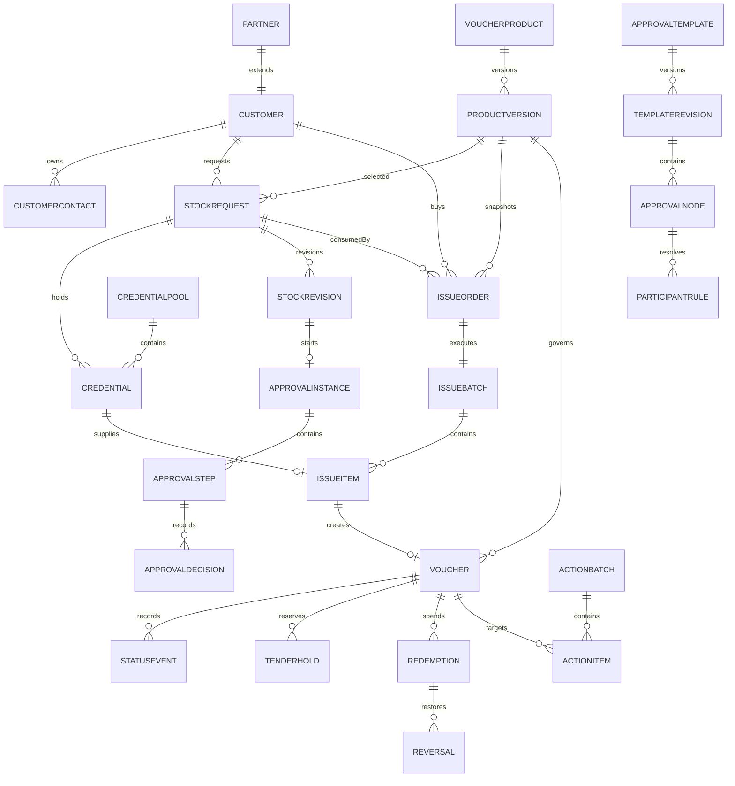

## 3. 聚合边界

### 3.1 Customer 聚合

根：`Customer`
实体：`CustomerContact`
值对象：`CustomerCode`、`CustomerType`、`PaymentTerm`

职责：

- 创建和维护企业客户基本资料。
- 保证客户编号在 Scope 内唯一。
- 保证联系人属于同一个客户。
- 维护默认付款条件，不维护订单收款状态。
- 产生客户创建、更新和状态变化事件。

不变量：

- 客户名称和客户电话必填。
- 客户类型只能是企业、政府、公共事业或其他。
- 联系人至少保留一条，除非业务明确允许无联系人。
- 终止客户不能创建新备券或新订单。
- 已被引用的客户不能物理删除。

### 3.2 VoucherProduct 聚合

根：`VoucherProduct`
实体：`ProductVersion`

职责：

- 维护稳定产品身份和当前活动版本。
- 每次修改业务规则产生一个不可变版本。
- 关联适用商城、审批模板和卡券类型。
- 控制新备券是否可选择。

不变量：

- MVP 类型必须由 `VoucherTypeRegistry` 识别。
- 活动产品必须有活动版本。
- 面值为正安全整数，币种一致。
- 默认有效天数为正；绝对有效期规则必须结束晚于开始。
- 已发布版本不可更新或删除。
- 停用只阻止新业务，不改变已发行卡券。

### 3.3 CredentialPool 聚合

根：`CredentialPool`
大集合实体 `Credential` 由仓储按批次操作，不整体装载进内存。

职责：

- 定义编号前缀、来源、兑换方式和所有 Scope。
- 创建生成或导入任务。
- 汇总总数、可用数、占用数、已发行数和作废数。
- 冻结后不允许改变编号或兑换规则。

凭证状态属于单张 `Credential`，聚合根只维护批次配置和计数版本。

不变量：

- 实体券池才允许预生成 NO 与 QH。
- 同一个池中的 sequence 唯一且单调递增。
- NO 编号、QH 券号和券密指纹全局唯一。
- 一个凭证最多属于一个备券和一个发行项。
- 已发行凭证不可回到可用状态。

### 3.4 StockRequest 聚合

根：`StockRequest`
实体：`StockRevision`

职责：

- 保存一次备券申请及每次提交快照。
- 控制请求数量、承诺数量、已发行数量和剩余数量。
- 关联审批实例。
- 审批通过后触发实体凭证占用或电子额度确认。
- 支持多张发行订单分次消耗。

计数定义：

```text
requested = 申请总量
committed = 已被提交订单承诺的数量
issued    = 已成功创建单券的数量
remaining = requested - committed
pending   = committed - issued
```

不变量：

- `0 <= issued <= committed <= requested`。
- 提交版本必须快照活动产品版本和客户版本。
- 实体券审批完成前必须确认池中存在足够可用凭证。
- 实体券最终批准与凭证占用在一个事务内完成。
- 电子券不占用实体凭证。
- 被拒绝后可修改并重新提交，新提交创建新修订和新审批实例。
- 已批准修订不可直接编辑。

### 3.5 ApprovalTemplate 聚合

根：`ApprovalTemplate`
实体：`TemplateRevision`、`ApprovalNode`、`ParticipantRule`

职责：

- 版本化维护审批定义。
- 节点按照严格 sequence 执行。
- 每个节点指定 `any` 或 `all` 决策模式。
- 参与人可以是明确成员、角色或相对 Scope 角色。

不变量：

- 活动模板至少一个节点。
- sequence 从 1 连续递增。
- 每个节点至少一个审批人规则。
- 活动修订不可修改。
- 停用模板不影响运行中的审批实例。

### 3.6 ApprovalInstance 聚合

根：`ApprovalInstance`
实体：`ApprovalStep`、`ApprovalDecision`

职责：

- 快照模板修订、subject、subject version 和业务摘要。
- 激活当前步骤并记录决定。
- 按节点模式判断通过、等待或拒绝。
- 结束时产生 approved 或 rejected 事件。

不变量：

- 决定人必须属于步骤解析出的参与人集合。
- 同一参与人在一个步骤只能作出一个有效决定。
- 已完成步骤和决定不可修改。
- 任一步骤拒绝即结束实例。
- 后续步骤只能在前一步批准后激活。
- 已完成实例不可再次决定。

### 3.7 IssueOrder 聚合

根：`IssueOrder`

职责：

- 保存 B2B 销售与发行指令。
- 快照客户、产品、备券、价格、有效期、封面和跳转目标。
- 提交时承诺备券数量并创建发行批次。
- 跟踪发行和收款状态。

不变量：

- 客户、产品版本、Scope、商城、介质和兑换方式必须与备券一致。
- 数量为正且不超过备券剩余。
- 销售单价非负，销售总额由服务端计算。
- 实体券订单必须绑定同等数量的已占用凭证。
- 电子券订单不得绑定实体凭证。
- 有效期结束必须晚于开始。
- 商品和分类跳转必须由 CatalogPort 验证存在于目标商城。
- 已提交订单不可修改销售和发行规则。

### 3.8 IssueBatch 聚合

根：`IssueBatch`
实体：`IssueItem`

职责：

- 将一张 IssueOrder 分解为稳定的逐券执行项。
- 记录每项凭证、券、重试次数和错误。
- 支持分块并发处理和可恢复重试。
- 所有项成功后完成订单和财务事实。

不变量：

- 一个订单只有一个有效发行批次。
- IssueItem ordinal 在批次内唯一。
- 一个 IssueItem 最多创建一张 Voucher。
- 重试复用同一个 Item，不创建新 Item。
- `succeeded + failed + queued + running = requested`。
- 批次完成事件和发行财务事实只产生一次。

### 3.9 Voucher 聚合

根：`Voucher`

职责：

- 保存单张卡券产品版本、订单、客户、会员、介质、有效期和余额。
- 执行激活、绑定、禁用、恢复、延期、作废和到期。
- 维护状态版本和追加式状态事件。
- 提供结算预占与核销入口。

不变量：

- 初始余额等于发行时产品版本面值。
- `0 <= remaining <= initial`。
- 终态卡券不能再次改变状态。
- 绑定会员后不能直接绑定另一个会员。
- 延期只能延后，不能缩短。
- 核销不能超过剩余余额。
- 作废和到期后不可核销。
- 所有状态变化必须产生 `StatusEvent`。

### 3.10 Redemption 聚合

根：`Redemption`
实体：`Reversal`

职责：

- 记录订单或门店核销事实。
- 支持多个部分冲正。
- 维护已冲正金额和剩余可冲正金额。

不变量：

- 核销金额为正且不超过卡券可用余额。
- 相同 verification 或业务 reference 只产生一次核销。
- 冲正金额为正。
- 累计冲正不超过原核销金额。
- 每个冲正 reference 唯一。
- 卡券余额恢复和冲正事实在同一事务中完成。

### 3.11 ActionBatch 聚合

根：`ActionBatch`
实体：`ActionItem`

职责：

- 冻结批量操作的目标集合。
- 异步执行激活、禁用、恢复、延期或作废。
- 汇总成功、失败与错误原因。

不变量：

- 创建后目标集合不可改变。
- 同一批次内 Voucher 唯一。
- 延期必须有新的结束时间，其他操作不得携带延期时间。
- 一个 Item 的成功结果不可再次执行。

## 4. 值对象

| 值对象 | 关键字段 | 规则 |
|---|---|---|
| `Money` | minor、currency | 复用 `@shop/kernel`，安全整数 |
| `CustomerCode` | value | `KH` 加时间和随机段，仅由服务端生成 |
| `DeliveryMedium` | physical/electronic | 创建备券后不可改变 |
| `RedemptionMode` | secret/numbersecret | 与凭证池和订单一致 |
| `CredentialMode` | generated/imported | 仅表示凭证来源 |
| `ValidityWindow` | startsAt、endsAt | 结束严格晚于开始 |
| `JumpTarget` | product/category/link + value | 对应类型验证 |
| `VoucherNumber` | normalized | 统一大小写与空白规范 |
| `VoucherSecret` | plaintext only in memory | 只在生成、导入和验证边界短暂存在 |
| `SubjectRef` | type、id、version | 审批对象不可变引用 |
| `ParticipantRule` | kind、ref、scopeRelation | 由 Approval 解析参与人 |

## 5. 数据库模型

### 5.1 Partner Schema

#### `partner.partner`

在现有 kind 中增加 `customer`，保留稳定身份字段：

| 列 | 类型 | 说明 |
|---|---|---|
| id | text PK | `customer:<uuid>` |
| scope_id | text | 所属 Scope |
| kind | text | customer |
| name | text | 客户名称 |
| status | text | active/suspended/terminated |
| version | bigint | 乐观版本 |
| created_at | timestamptz | 创建时间 |
| updated_at | timestamptz | 更新时间 |

#### `partner.customer`

| 列 | 类型 | 说明 |
|---|---|---|
| id | text PK/FK | Partner ID |
| code | text unique | KH 编号 |
| customer_type | text | company/government/public/other |
| industry | text | 行业代码 |
| employee_band | text | 企业规模 |
| sales_owner_id | text nullable | 销售负责人 membership |
| payment_term | text | prepaid/delivery/postpaid/other |
| phone_ciphertext | text | 客户电话 |
| phone_token | char(64) | 精确搜索令牌 |
| phone_key_version | text | KMS 版本 |
| address_ciphertext | text | 地址 |
| address_token | char(64) | 精确搜索令牌 |
| address_key_version | text | KMS 版本 |
| note | text nullable | 需求备注 |

#### `partner.customertag`

`customer_id + tag` 联合主键，避免把标签塞入逗号字符串。

#### `partner.customercontact`

| 列 | 类型 | 说明 |
|---|---|---|
| id | text PK | 联系人 ID |
| customer_id | text FK | Customer |
| name | text | 姓名 |
| gender | text nullable | male/female/unknown |
| position | text nullable | 职位 |
| mobile_ciphertext/token/key_version | text | 手机 |
| email_ciphertext/token/key_version | text | 邮箱 |
| note | text nullable | 备注 |
| position_index | integer | 稳定排序 |
| version | bigint | 乐观版本 |

关键索引：`partner(scope_id,kind,status,updated_at desc,id)`、`customer(code)`、电话 token、联系人 customer 和 position。

### 5.2 Approval Schema

#### `approval.template`

稳定模板：id、scope_id、name、subject_type、status、active_revision、version、created_at、updated_at。

#### `approval.templaterevision`

不可变版本：template_id、revision、decision_policy、created_by、created_at、published_at。

#### `approval.node`

template_id、revision、sequence、name、decision_mode、required_count。

#### `approval.participant`

template_id、revision、node_sequence、kind、reference、scope_relation、position_index。

`kind` 支持 member 与 role；`scope_relation` 支持 self、parent、ancestor。MVP 初始模板使用角色规则，不硬编码成员 ID。

#### `approval.instance`

id、scope_id、template_id、template_revision、subject_type、subject_id、subject_version、subject_snapshot、state、current_sequence、started_by、started_at、completed_at、version。

#### `approval.step`

instance_id、sequence、state、decision_mode、required_count、activated_at、completed_at。

#### `approval.stepactor`

instance_id、sequence、actor_id、source_rule、resolved_at。实例开始时冻结解析出的参与人。

#### `approval.decision`

id、instance_id、sequence、actor_id、decision、reason、evidence、occurred_at。只插入不更新。

关键索引：待办 `(actor_id,state,resolved_at)`、实例 subject 唯一检索、运行实例 scope/state/time、决定 instance/sequence/time。

### 5.3 Voucher Product

#### `voucher.product`

| 列 | 类型 | 说明 |
|---|---|---|
| id | text PK | 产品 ID |
| code | text unique | CP 编号 |
| scope_id | text | 所属 Scope |
| mall_id | text | 适用商城 |
| name | text | 产品名称 |
| type | text | storedvalue |
| status | text | draft/active/paused/retired |
| active_version | bigint nullable | 当前活动版本 |
| version | bigint | 聚合版本 |
| created_by | text | 创建人 |
| created_at/updated_at | timestamptz | 时间 |

#### `voucher.productversion`

| 列 | 类型 | 说明 |
|---|---|---|
| product_id + version | PK | 不可变版本 |
| value_minor | bigint | 单券面值 |
| currency | char(3) | CNY |
| validity_kind | text | relative/absolute |
| valid_days | integer nullable | 相对天数 |
| valid_from/valid_to | timestamptz nullable | 绝对窗口 |
| redemption_modes | text[] | 支持的兑换方式 |
| approval_template_id | text nullable | 默认审批模板 |
| approval_template_revision | bigint nullable | 发布时模板版本 |
| type_config | jsonb | 由 VoucherType 校验的扩展配置 |
| created_by/created_at | text/timestamptz | 版本来源 |

关键索引：scope/mall/status、名称检索、活动版本外键。

### 5.4 Credential

#### `voucher.credentialpool`

| 列 | 类型 | 说明 |
|---|---|---|
| id | text PK | 池 ID |
| number | text unique | 卡号库批次编号 |
| owner_scope_id | text | 所有 Scope |
| medium | text | physical |
| source | text | generated/imported |
| redemption_mode | text | secret/numbersecret |
| inventory_prefix | text | NO 前缀 |
| voucher_prefix | text | QH 前缀 |
| secret_prefix | text nullable | QM 前缀 |
| next_sequence | bigint | 下一编号 |
| status | text | preparing/ready/depleted/disabled/failed |
| total_count | integer | 总数 |
| available_count | integer | 可用 |
| held_count | integer | 已占用 |
| issued_count | integer | 已发行 |
| void_count | integer | 作废 |
| version | bigint | 聚合版本 |
| created_by/created_at/updated_at | text/time | 审计字段 |

#### `voucher.credential`

| 列 | 类型 | 说明 |
|---|---|---|
| id | text PK | 凭证 ID |
| pool_id | text nullable | 电子券可为空 |
| sequence | bigint | 池内顺序 |
| medium | text | physical/electronic |
| inventory_number | text nullable unique | NO |
| voucher_number | text nullable unique | QH |
| secret_ciphertext | text | QM 或电子券密 |
| secret_fingerprint | char(64) unique | 精确匹配 |
| secret_key_version | text | KMS 版本 |
| redemption_mode | text | secret/numbersecret |
| state | text | available/held/assigned/issued/void |
| stock_id | text nullable | 当前或历史备券 |
| order_id | text nullable | 发行订单 |
| voucher_id | text nullable unique | 最终单券 |
| held_at/assigned_at/issued_at/voided_at | timestamptz | 生命周期时间 |
| version | bigint | 版本 |

物理凭证唯一索引：pool/sequence、inventory number、voucher number、secret fingerprint。可用凭证索引：`(pool_id,state,sequence)`，用于 `FOR UPDATE SKIP LOCKED` 顺序占用。

#### `voucher.credentialjob`

生成与导入统一任务：id、pool_id、kind、object_ref、sha256、state、cursor、requested_count、success_count、failure_count、report_ref、last_error、created_at、updated_at。

#### `voucher.credentialerror`

job_id、row_number、field、code、detail。仅保存失败行，不复制成功数据。

### 5.5 Stock

#### `voucher.stockrequest`

id、number、scope_id、customer_id、product_id、product_version、mall_id、medium、redemption_mode、pool_id nullable、name、requested_count、committed_count、issued_count、state、active_revision、requested_by、approved_at、created_at、updated_at、version。

#### `voucher.stockrevision`

stock_id、revision、customer_version、product_version、requested_count、reason、note、snapshot、submitted_by、submitted_at、approval_instance_id、decision、decided_at。提交后不可变。

物理备券的 `pool_id` 必填，电子备券为空。`remaining_count` 不落库，通过 `requested_count - committed_count` 返回，避免重复事实。

关键索引：scope/state/time、customer/time、product/time、approval instance、可用备券部分索引。

### 5.6 Issue

#### `voucher.issueorder`

| 列 | 类型 | 说明 |
|---|---|---|
| id | text PK | 订单 ID |
| number | text unique | DZQ 编号 |
| scope_id/mall_id | text | 作用域 |
| stock_id | text FK | 备券 |
| customer_id/customer_version | text/bigint | 客户快照版本 |
| product_id/product_version | text/bigint | 产品快照版本 |
| medium/redemption_mode | text | 发行模式 |
| name | text | 卡券名称 |
| quantity | integer | 销售数量 |
| face_minor | bigint | 单券面值快照 |
| sale_unit_minor | bigint | 销售单价 |
| sale_total_minor | bigint | 服务端计算 |
| currency | char(3) | CNY |
| payment_term | text | 客户默认值快照 |
| receivable_state | text | unpaid/partial/paid/cancelled |
| received_minor | bigint | 实收累计 |
| valid_from/valid_to | timestamptz | 本订单卡券有效期 |
| cover_ref/cover_hash | text | ObjectStore 封面 |
| jump_kind/jump_target | text | product/category/link |
| note | text nullable | 备注 |
| state | text | draft/submitted/issuing/completed/failed/cancelled |
| created_by/created_at/updated_at | text/time | 审计 |
| version | bigint | 乐观版本 |

#### `voucher.issuebatch`

id、order_id unique、state、requested_count、queued_count、running_count、succeeded_count、failed_count、attempts、created_at、started_at、completed_at、updated_at、version。

#### `voucher.issueitem`

batch_id、ordinal、credential_id nullable、voucher_id nullable、state、attempts、error_code、updated_at。主键 batch/ordinal，credential 和 voucher 均唯一。

关键索引：订单 scope/time、customer/time、stock、批次 state/time、待执行 item `(batch_id,state,ordinal)`。

### 5.7 Voucher Lifecycle

#### `voucher.voucher`

id、scope_id、mall_id、customer_id、product_id、product_version、order_id、batch_id、credential_id、member_id nullable、medium、initial_minor、remaining_minor、currency、state、valid_from、expires_at、distributed_at、activated_at、bound_at、redeemed_at、disabled_at、voided_at、version。

#### `voucher.statusevent`

voucher_id、sequence、event_type、previous_state、next_state、amount_minor nullable、reason、actor_id、reference_type、reference_id、metadata、occurred_at。主键 voucher/sequence，只插入。

#### `voucher.tenderhold`

id、voucher_id、order_id、member_id、amount_minor、state、expires_at、version、created_at、updated_at。状态 open/released/consumed/expired；同一商城订单和券只有一个有效预占。

#### `voucher.redemption`

id、voucher_id、verification_id unique、order_id nullable、store_id nullable、amount_minor、reversed_minor、state、redeemed_at、version。

#### `voucher.reversal`

id、redemption_id、reference_id unique、amount_minor、reason、evidence、occurred_at。只插入；删除现有 `redemption_id unique` 限制。

关键索引：scope/state/expiry、member/state/expiry、credential、order、状态事件时间、核销 order/time、到期部分索引。

### 5.8 Action 与查询投影

#### `voucher.actionbatch`

id、scope_id、number、action、new_expiry nullable、reason、selector_snapshot、state、requested_count、succeeded_count、failed_count、actor_id、created_at、updated_at。

#### `voucher.actionitem`

batch_id、voucher_id、state、previous_state、next_state、previous_expiry、next_expiry、error_code、updated_at。主键 batch/voucher。

#### `voucher.searchdocument`

单张卡券统一读模型，至少包含：

- voucher_id、voucher_number、inventory_number、masked_secret。
- product_id、product_name、product_type。
- customer_id、customer_name。
- stock_id、stock_number。
- order_id、order_number、issue_batch_id。
- scope_id、mall_id、medium、redemption_mode。
- member_id、member_name、member_mobile_hint。
- state、initial_minor、remaining_minor、currency。
- valid_from、expires_at、distributed_at、activated_at、bound_at、redeemed_at、voided_at。
- activated、bound、redeemed、voided 派生字段。
- latest_event_at、projection_version。

`activated` 等列只在投影中作为派生查询字段，不参与命令规则。

索引按照甲方筛选设计：scope+time、customer+time、product+time、order、batch、stock、voucher number、inventory number、member、state、各时间字段。自由关键字使用单独标准化搜索列，不对所有 JSON 做模糊扫描。

## 6. 状态机

### 6.1 Product

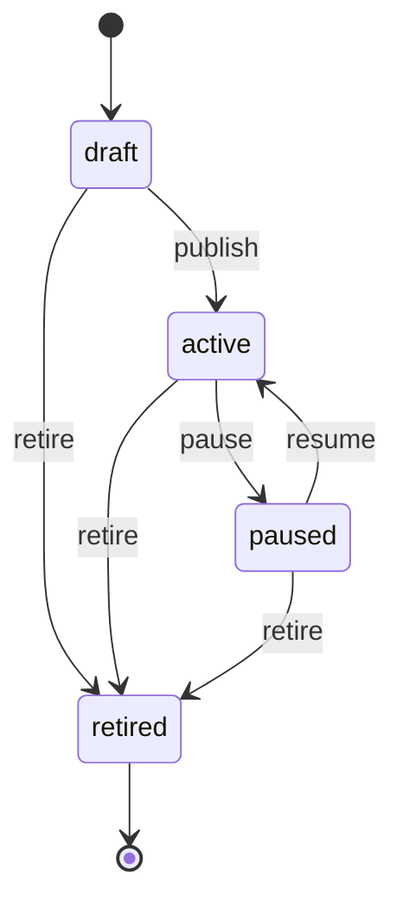

### 6.2 CredentialPool

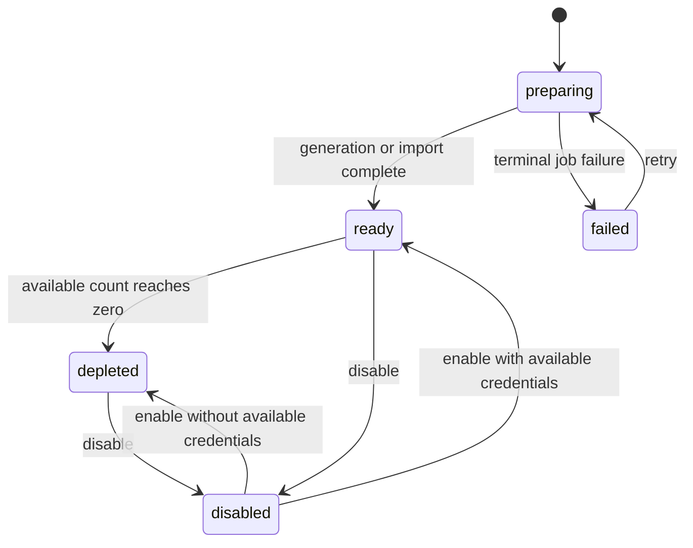

### 6.3 Credential

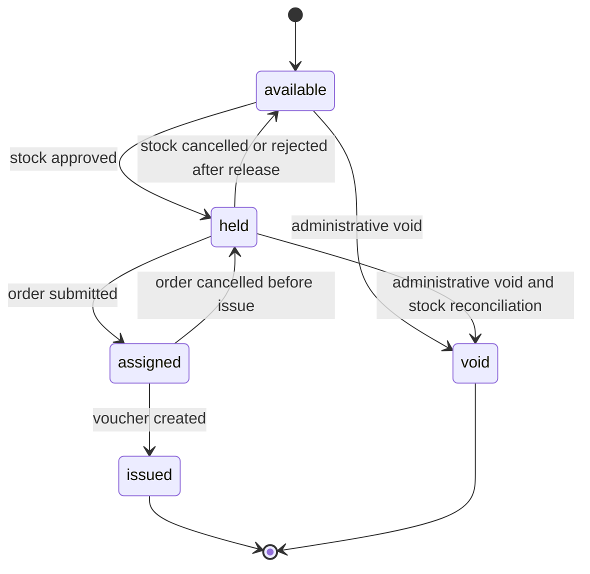

### 6.4 StockRequest

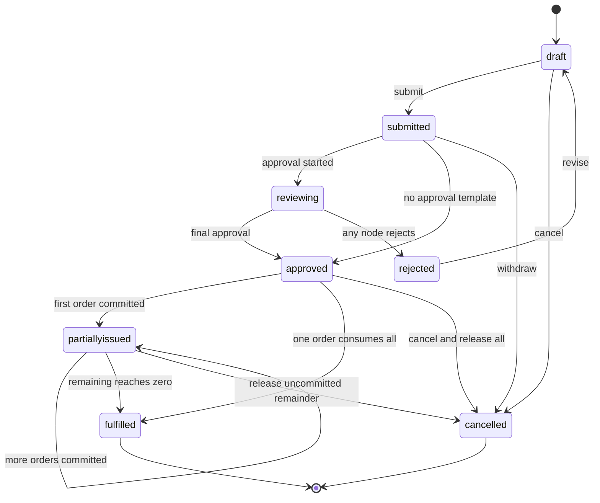

### 6.5 ApprovalInstance

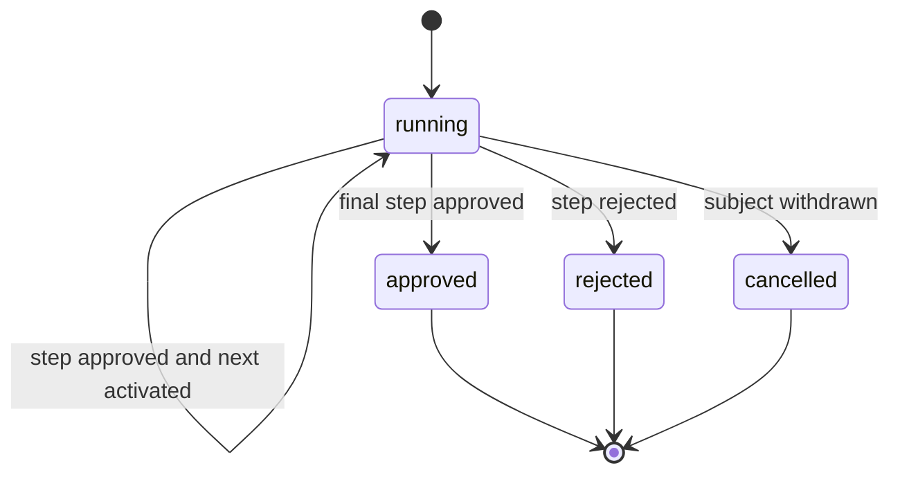

### 6.6 IssueOrder

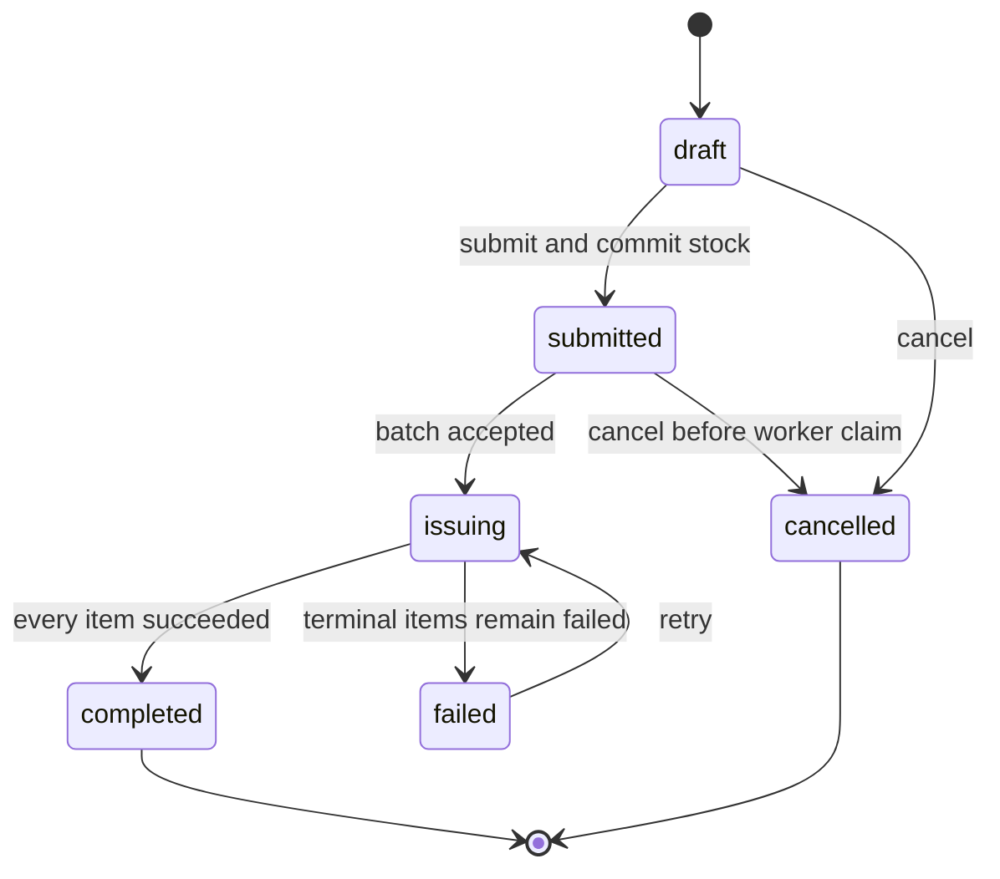

### 6.7 IssueBatch Item

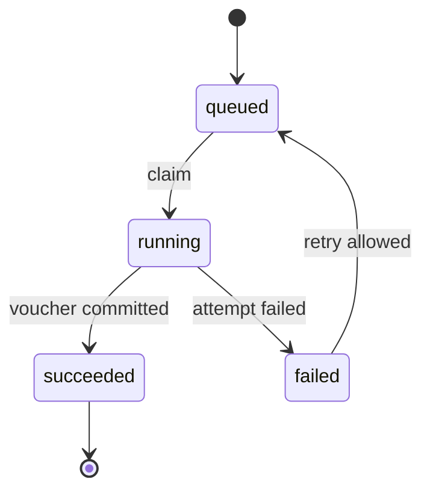

### 6.8 Voucher

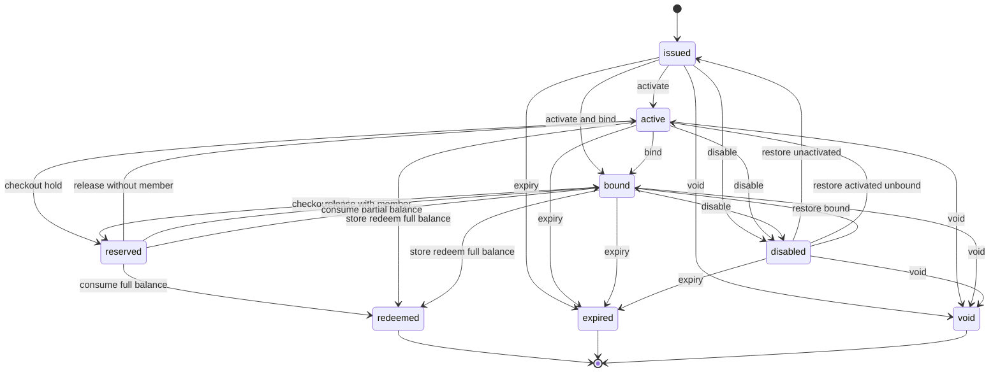

恢复目标不能仅依据 `member_id` 判断，还要依据 `activated_at`：

- 未激活且未绑定恢复为 issued。
- 已激活且未绑定恢复为 active。
- 已绑定恢复为 bound。

### 6.9 ActionBatch

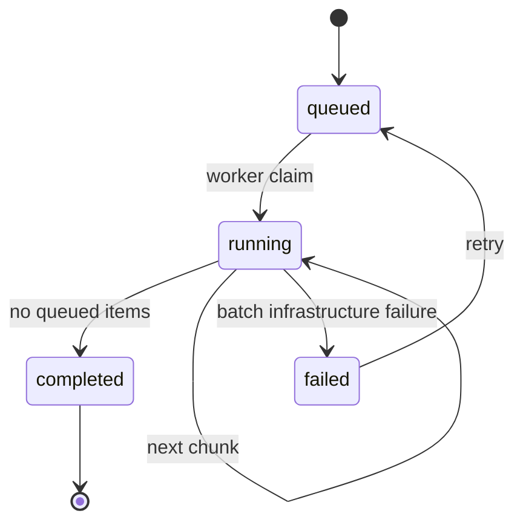

### 6.10 Redemption

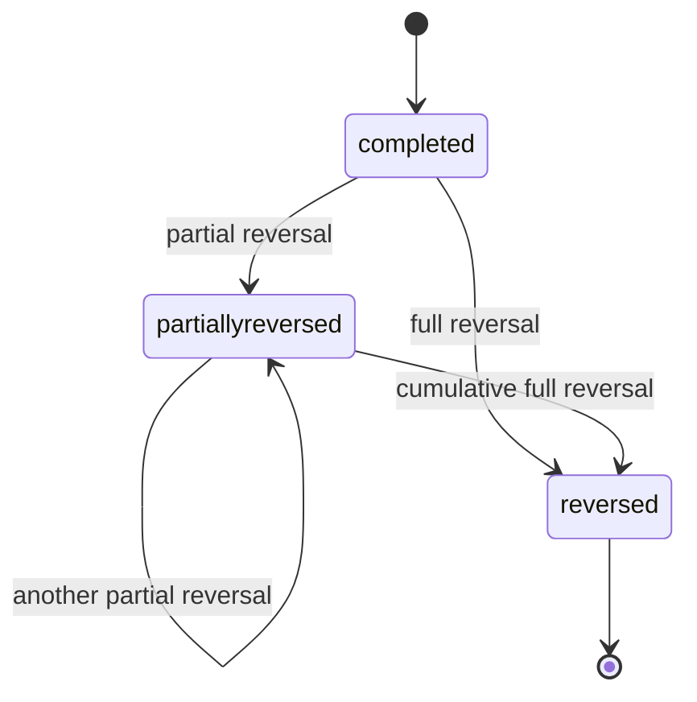

## 7. 编号规则

编号由单一 `CredentialNumbering` 服务生成，不在各 Command 中复制字符串模板。

| 对象 | 示例 | 规则 |
|---|---|---|
| 客户 | KH202609011230001234 | KH + 时间 + 随机段 |
| 产品 | CP202609011230001234 | CP + 时间 + 随机段 |
| 卡号库 | KL202609011230001234 | KL + 时间 + 随机段 |
| 库存号 | NO.202609000001 | 池前缀 + 固定宽度 sequence |
| 券号 | QH260901123000000001 | QH + 时间前缀 + sequence |
| 券密 | QM 加随机材料 | 生成后立即加密，仅保留指纹检索 |
| 备券 | BQ202609011230001234 | BQ + 时间 + 随机段 |
| 卡券订单 | DZQ202609011230001234 | DZQ + 时间 + 随机段 |
| 发行批次 | PH202609011230001234 | PH + 时间 + 随机段 |
| 券操作 | CZ202609011230001234 | CZ + 时间 + 随机段 |

业务编号只用于展示和搜索；主键使用带领域前缀的 UUID，不从编号推断关系。

## 8. 一致性边界

必须在同一数据库事务完成：

- 客户与联系人更新。
- 产品当前版本指针与新版本写入。
- 实体备券最终批准、凭证占用和计数更新。
- 订单提交、备券 committed 增量、凭证 assigned 和发行批次创建。
- 单券状态改变、状态事件和 ActionItem 结果。
- 卡券余额改变、核销或冲正记录及 FinancePort 事实。
- 批次最终完成、订单完成和发行财务事实。

允许最终一致：

- 搜索投影。
- 报表和导出。
- 通知。
- 聚合统计卡片。
- 外部分析事件。

## 9. 领域事件

事件使用过去式、带版本并由 Outbox 提交：

| 事件 | 生产者 | 主要消费者 |
|---|---|---|
| partner.customer.created.v1 | Partner | Voucher projection |
| partner.customer.updated.v1 | Partner | Voucher projection |
| voucher.product.published.v1 | Voucher | Projection |
| voucher.credentials.generated.v1 | Voucher Jobs | Projection、Audit |
| voucher.credentials.imported.v1 | Voucher Jobs | Projection、Audit |
| voucher.stock.submitted.v1 | Voucher | Approval |
| approval.instance.approved.v1 | Approval | Voucher Stock resolver |
| approval.instance.rejected.v1 | Approval | Voucher Stock resolver |
| voucher.stock.approved.v1 | Voucher | Notification、Projection |
| voucher.order.submitted.v1 | Voucher | Projection |
| voucher.issued.v1 | Voucher Jobs | Finance、Projection、Notification |
| voucher.activated.v1 | Voucher | Projection |
| voucher.bound.v1 | Voucher | Projection |
| voucher.disabled.v1 | Voucher | Projection |
| voucher.extended.v1 | Voucher | Projection |
| voucher.voided.v1 | Voucher | Finance、Projection |
| voucher.expired.v1 | Voucher Jobs | Finance、Projection |
| voucher.redeemed.v1 | Voucher | Finance、Projection |
| voucher.reversed.v1 | Voucher | Finance、Projection |
| voucher.action.completed.v1 | Voucher Jobs | Projection、Notification |

事件 payload 只包含稳定 ID、业务金额、状态和必要快照，不包含可由消费者读取的整张数据库行。

## 10. 财务事实

Voucher 向 Finance 发送事实而不是会计科目：

```ts
type VoucherFinanceFact =
  | { kind: 'order'; order: string; customer: string; sale: Money; face: Money; payment: string }
  | { kind: 'issue'; batch: string; count: number; face: Money }
  | { kind: 'receipt'; order: string; amount: Money; reference: string }
  | { kind: 'redeem'; redemption: string; voucher: string; amount: Money }
  | { kind: 'reverse'; reversal: string; redemption: string; amount: Money }
  | { kind: 'void'; voucher: string; remaining: Money; reason: string }
  | { kind: 'expire'; voucher: string; remaining: Money };
```

Finance 根据活动会计策略决定应收、现金、负债、收入或营销费用科目。Voucher 不假设销售价等于面值。

每个事实的 `reference` 唯一，Finance 必须幂等受理。领域事务只有在必要财务事实成功持久化后才提交。

## 11. 查询字段派生

甲方原型字段映射：

| 原型字段 | 事实来源 |
|---|---|
| 激活状态 | `activated_at is not null` |
| 绑定状态 | `member_id is not null` |
| 兑换状态 | 存在核销或 `remaining_minor = 0`，按产品展示规则派生 |
| 作废状态 | `state = void` |
| 发放额度 | `initial_minor` |
| 剩余额度 | `remaining_minor` |
| 分发时间 | `distributed_at` |
| 激活时间 | `activated_at` |
| 绑定时间 | `bound_at` |
| 开始/结束券号 | 同一订单实体凭证 sequence 的最小/最大券号 |
| 剩余备券 | `requested_count - committed_count` |
| 收款状态 | IssueOrder.receivable_state，由 Finance 收款事实更新 |

任何派生列都不能反向作为命令判断的唯一事实。
