# 卡券调用与数据流

## 1. 通用请求流水线

所有 HTTP 命令和查询沿用同一入口，不允许业务页面绕过：

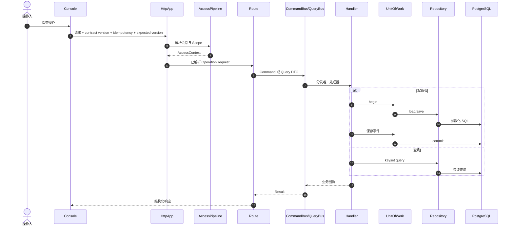

## 2. 客户管理

### 2.1 新增客户

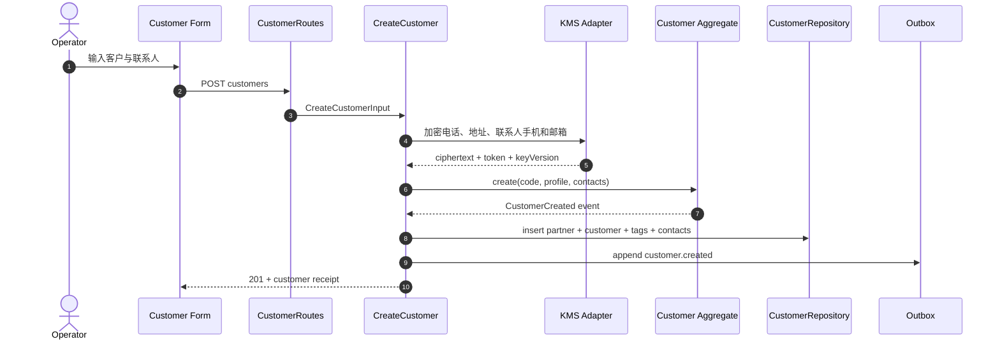

内部数据流：

```text
Form DTO
  → CustomerType / PaymentTerm / Contact value validation
  → KMS envelopes
  → Customer aggregate
  → PartnerRepository transaction
  → Outbox event
  → Customer read model invalidation
```

### 2.2 编辑客户

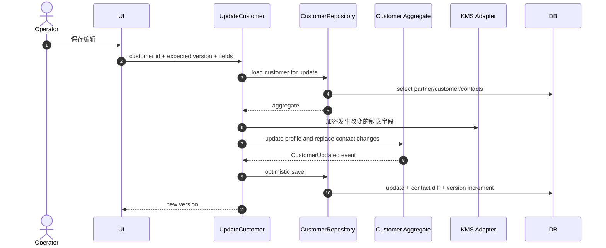

联系人使用 ID 差异集合：新增 insert、修改 update、移除 delete；不先全删再插，避免历史引用和无意义写放大。

## 3. 产品档案

### 3.1 创建并发布产品

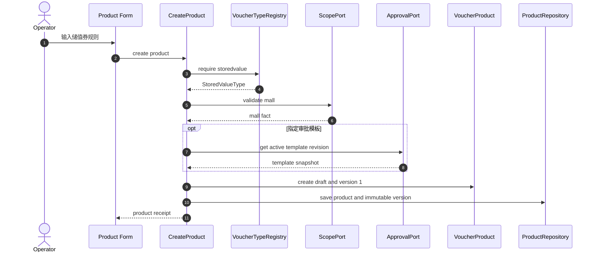

### 3.2 修改产品

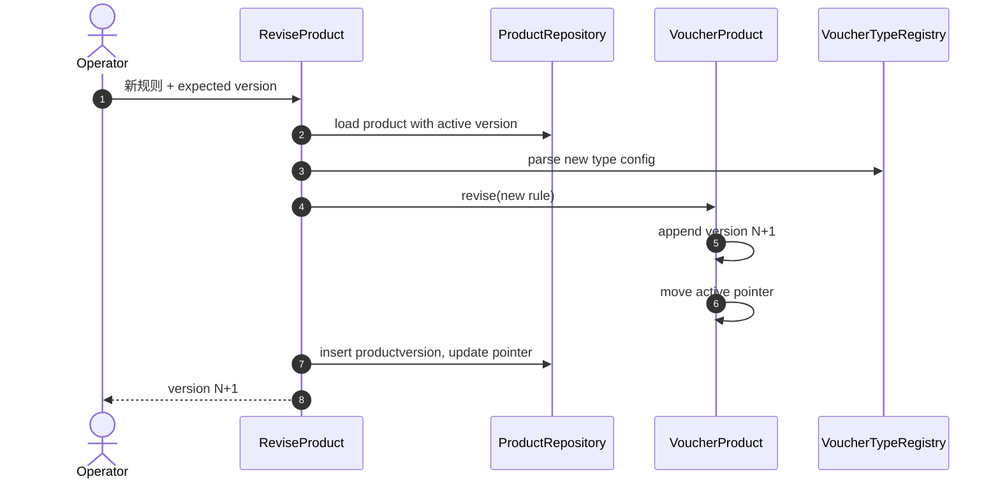

旧版本不更新，既有 StockRequest、IssueOrder 和 Voucher 继续引用旧版本。

## 4. 卡号库

### 4.1 系统生成实体凭证

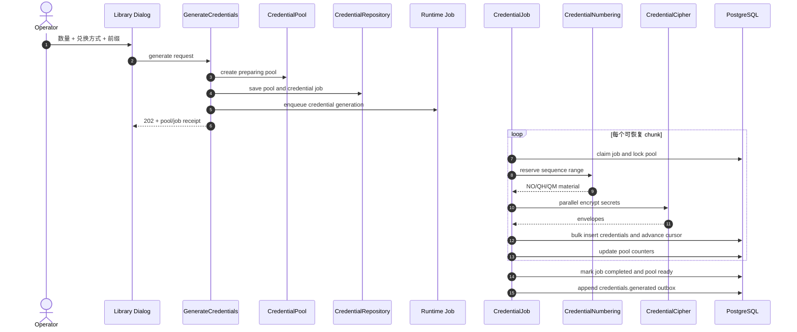

内部数据流：

```text
GenerationPlan
  → sequence range reservation
  → CredentialMaterial stream
  → bounded parallel KMS encryption
  → bulk INSERT
  → pool counters
  → job cursor
  → outbox
```

发生进程中断时，job cursor 与已写 credential 是恢复依据。下一次从尚未完成的 ordinal 继续，编号不回退，不重新插入成功项。

### 4.2 文件导入

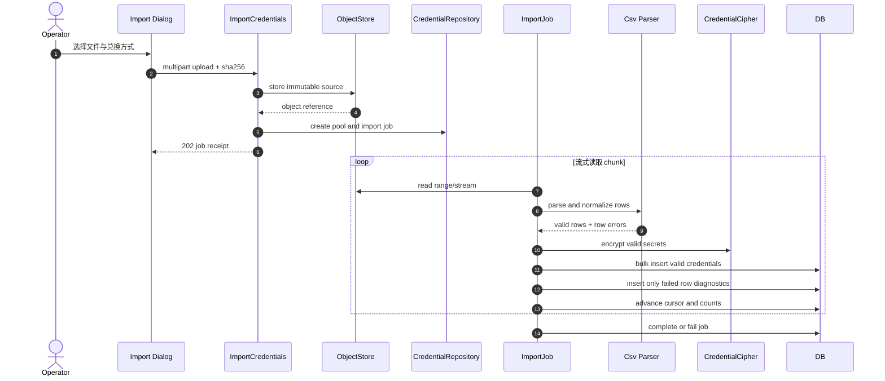

导入验证包含：字段完整性、格式、重复 NO、重复券号、重复券密指纹、兑换方式一致。错误报告由同一 job 生成，不创建第二套导入状态。

## 5. 备券与审批

### 5.1 创建草稿并提交

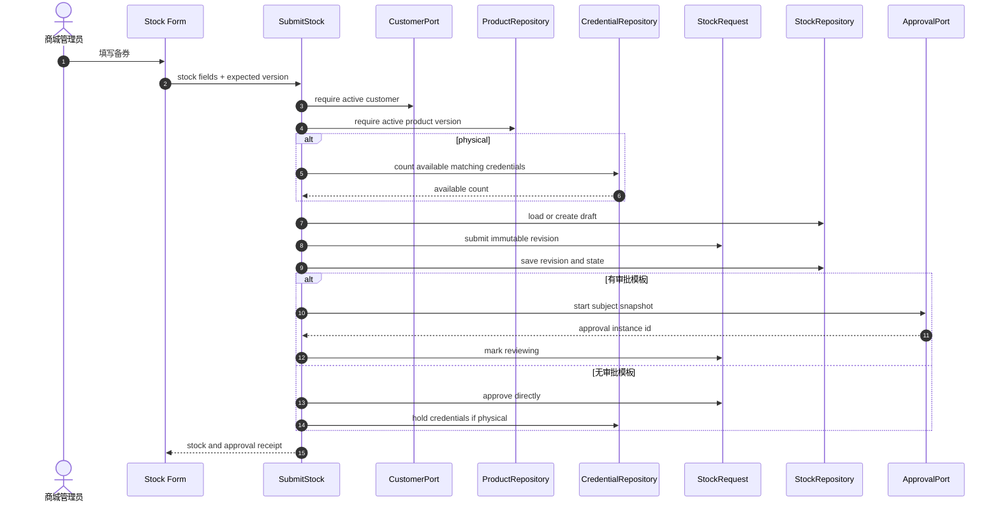

### 5.2 多级审批

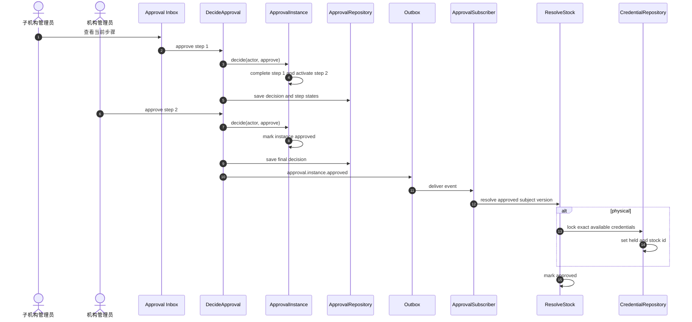

如果最终凭证占用因为并发库存不足而失败，审批事实保持 approved，Stock 进入 `allocationfailed` 内部故障态并由恢复作业重试；对外不能伪装成审批拒绝。正常实现应在提交时预检、最终批准时原子占用，使该情况只可能来自外部数据故障。

### 5.3 拒绝和重提

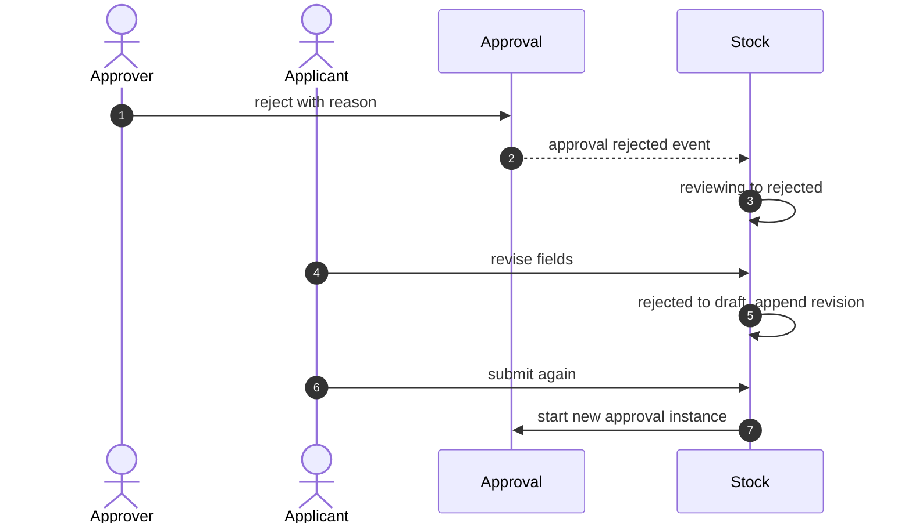

旧审批实例、步骤和决定永久保留；新提交不复用旧实例。

### 5.4 审批模板维护

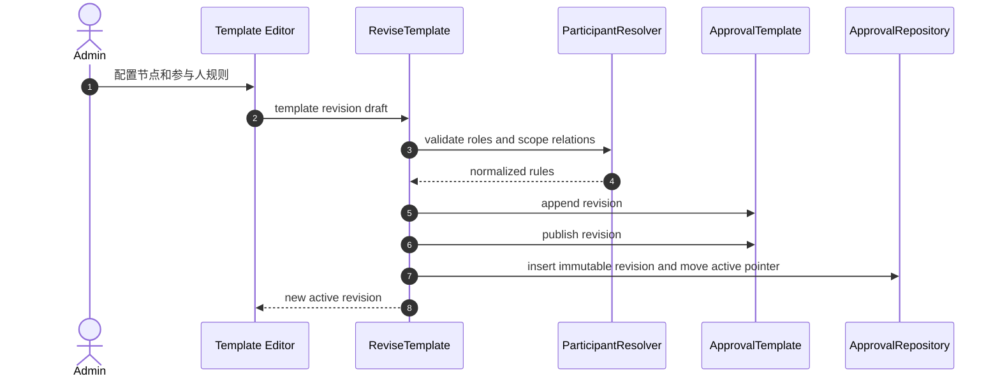

## 6. 卡券订单与发行

### 6.1 实体券订单

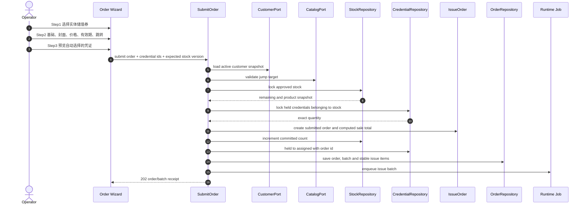

如果 UI 不传凭证 ID，服务端按 sequence 自动选择。UI 传 ID 时仍要验证每张凭证属于该备券且处于 held；浏览器选择不构成可信分配事实。

### 6.2 电子券订单

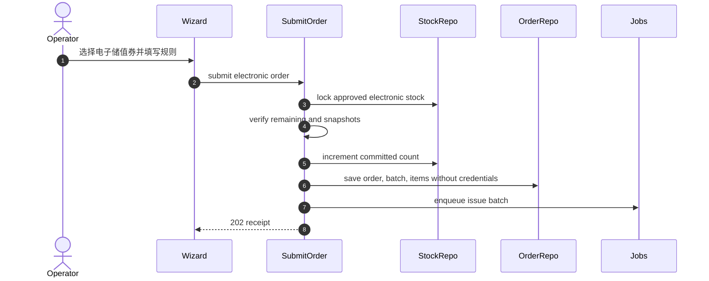

电子券密由 IssueJob 逐项生成；订单提交阶段不生成明文密钥。

### 6.3 发行作业

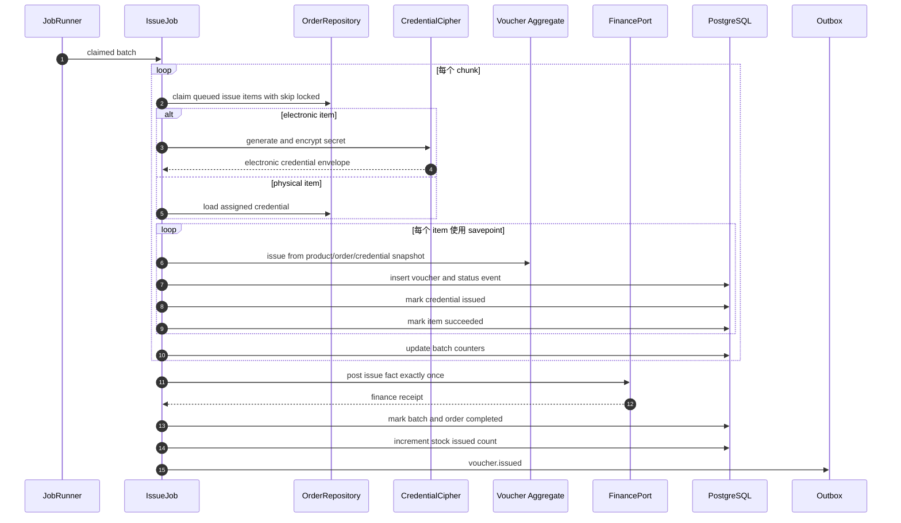

单项失败回滚到 savepoint，只把该 Item 标记 failed，不丢弃同一 chunk 的其他成功项。基础设施级失败回滚整个 chunk，由 JobRunner 重试。

### 6.4 失败重试

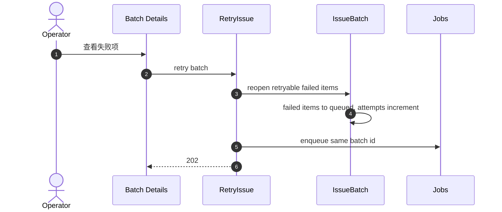

成功 Item 永不重开。重试不重新扣备券、不重新分配凭证、不重复发送发行财务事实。

## 7. 激活与绑定

### 7.1 仅券密激活

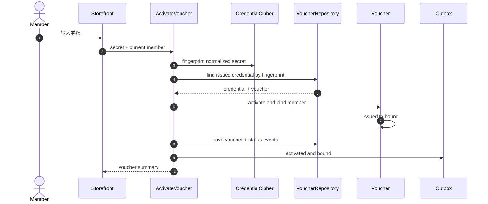

### 7.2 券号加券密激活

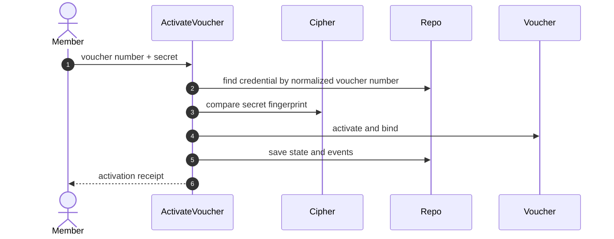

兑换方式由 Credential 决定。请求输入与凭证模式不一致时返回明确业务错误，不尝试第二套匹配逻辑。

### 7.3 运营人员单独绑定

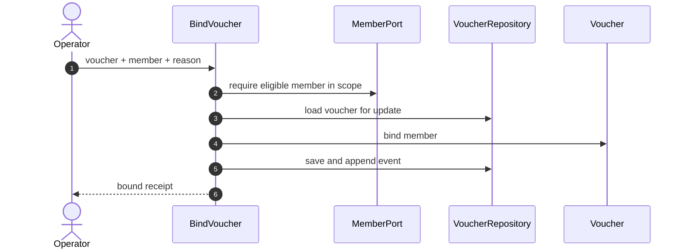

## 8. 商城订单预占与核销

### 8.1 结算预占

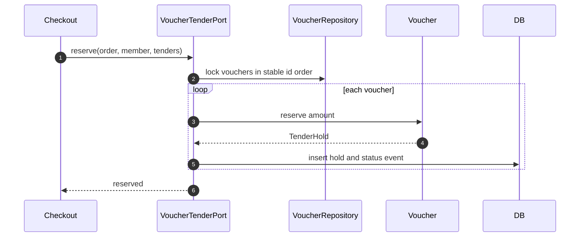

多券锁定按 Voucher ID 排序，所有调用使用同一锁顺序，避免死锁。

### 8.2 支付成功核销

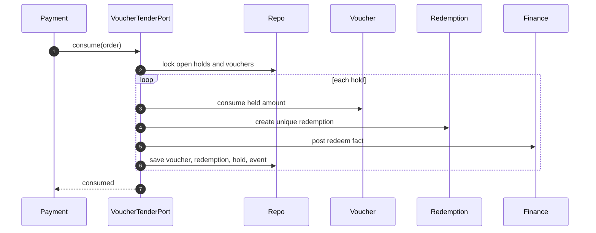

### 8.3 订单取消释放

```mermaid
sequenceDiagram
    autonumber
    participant Order
    participant Port as VoucherTenderPort
    participant Repo
    participant Voucher

    Order->>Port: release(order)
    Port->>Repo: lock open holds
    loop each hold
        Port->>Voucher: release reservation
        Port->>Repo: update hold and voucher state event
    end
    Port-->>Order: released
```

### 8.4 门店核销

```mermaid
sequenceDiagram
    autonumber
    actor Verifier
    participant App as Verification App
    participant Command as RedeemVoucher
    participant Verify as VerificationPort
    participant Repo
    participant Voucher
    participant Finance

    Verifier->>App: 扫码或输入券码
    App->>Verify: create verification
    Verify-->>App: verification id and scope
    App->>Command: voucher credential + verification id
    Command->>Repo: resolve and lock voucher
    Command->>Voucher: redeem remaining balance
    Command->>Repo: insert redemption and event
    Command->>Finance: post redeem fact
    Command-->>App: redemption receipt
```

## 9. 退款与冲正

```mermaid
sequenceDiagram
    autonumber
    actor Operator
    participant Payment as Refund Settlement
    participant Command as ReverseRedemption
    participant Repo as VoucherRepository
    participant Redemption
    participant Voucher
    participant Finance
    participant Outbox

    Payment->>Command: redemption + amount + refund reference
    Command->>Repo: lock redemption and voucher
    Command->>Redemption: reverse partial amount
    Redemption->>Redemption: assert cumulative amount
    Command->>Voucher: restore amount and operational state
    Command->>Repo: insert reversal, update redemption and voucher, append event
    Command->>Finance: post reversal fact
    Command->>Outbox: voucher.reversed
    Command-->>Payment: reversal receipt
```

冲正后的状态：

- 会员已绑定：bound。
- 已激活但未绑定：active。
- 从未激活：issued。
- 如果冲正后仍为零余额，保持 redeemed；正常正金额冲正会离开 redeemed。

## 10. 券操作

### 10.1 创建操作批次

```mermaid
sequenceDiagram
    autonumber
    actor Operator
    participant UI as Action Form
    participant Command as CreateAction
    participant Selector as VoucherSelector
    participant Search as VoucherSearch
    participant Batch as ActionBatch
    participant Repo as ActionRepository
    participant Jobs

    Operator->>UI: 客户 + 操作 + 单券/范围/批次
    UI->>Command: action request
    Command->>Selector: normalize selector
    Selector->>Search: resolve stable voucher ids
    Search-->>Selector: ordered ids
    Command->>Batch: create with frozen selector snapshot
    Command->>Repo: insert batch and action items
    Command->>Jobs: enqueue action job
    Command-->>UI: 202 action receipt
```

### 10.2 执行操作

```mermaid
sequenceDiagram
    autonumber
    participant Runner
    participant Job as ActionJob
    participant Repo as ActionRepository
    participant VoucherRepo as VoucherRepository
    participant Voucher
    participant Finance

    Runner->>Job: claimed action batch
    loop claim item chunk
        Job->>Repo: claim queued items skip locked
        loop item savepoint
            Job->>VoucherRepo: lock voucher
            Job->>Voucher: activate, disable, restore, extend or void
            opt void with remaining balance
                Job->>Finance: post void fact
            end
            Job->>VoucherRepo: save state and event
            Job->>Repo: mark item succeeded
        end
        Job->>Repo: update counters
    end
    Job->>Repo: complete batch
```

一个 Item 的业务状态不允许时，仅该 Item 失败并记录明确 code；批次继续处理其他券。

## 11. 到期处理

```mermaid
sequenceDiagram
    autonumber
    participant Scheduler
    participant Job as ExpiryJob
    participant Repo as VoucherRepository
    participant Voucher
    participant Finance
    participant Outbox

    Scheduler->>Job: periodic run
    loop keyset chunk
        Job->>Repo: claim expired nonterminal vouchers skip locked
        loop voucher
            Job->>Voucher: expire(now)
            Job->>Finance: post expiry remaining fact
            Job->>Repo: save state and event
            Job->>Outbox: voucher.expired
        end
    end
```

到期查询使用 `expires_at` 部分索引和固定 chunk，不扫描终态数据。单券失败不会阻止其他到期处理。

## 12. 查询投影

```mermaid
sequenceDiagram
    autonumber
    participant Business as Domain Transaction
    participant Outbox
    participant Relay
    participant Job as ProjectionJob
    participant Sources as Domain Tables
    participant Projection as searchdocument
    participant UI as Voucher Search

    Business->>Outbox: append versioned event in same transaction
    Relay->>Job: enqueue projection event
    Job->>Sources: load authoritative facts by ids
    Sources-->>Job: customer/product/order/voucher facts
    Job->>Projection: upsert if event version newer
    UI->>Projection: indexed keyset query
    Projection-->>UI: flattened rows
```

投影幂等键为 event id；`projection_version` 防止乱序旧事件覆盖新状态。

### 12.1 卡券查询

```mermaid
sequenceDiagram
    autonumber
    actor Operator
    participant UI as Search Page
    participant Query as SearchVouchers
    participant Search as PgVoucherSearch
    participant DB as searchdocument

    Operator->>UI: 设置 17+ 筛选条件
    UI->>Query: normalized filters + cursor
    Query->>Search: search specification
    Search->>DB: indexed keyset query
    DB-->>Search: page + next cursor
    Search-->>UI: voucher summaries
```

### 12.2 单券详情与时间线

```mermaid
sequenceDiagram
    autonumber
    actor Operator
    participant UI
    participant Detail as GetVoucher
    participant Timeline as GetTimeline
    participant Repo

    Operator->>UI: 打开详情
    par 详情
        UI->>Detail: voucher id
        Detail->>Repo: projection + authoritative balance
        Repo-->>UI: detail
    and 时间线
        UI->>Timeline: voucher id + cursor
        Timeline->>Repo: status events + redemptions + reversals
        Repo-->>UI: ordered timeline
    end
```

详情中的当前余额从权威 Voucher 表读取；名称等展示字段可来自投影。两者返回各自版本，UI 不自行合并冲突状态。

## 13. 导出

```mermaid
sequenceDiagram
    autonumber
    actor Operator
    participant UI
    participant Command as CreateExport
    participant Reporting
    participant Worker as ExportJob
    participant Search as VoucherSearch
    participant Objects as ObjectStore

    Operator->>UI: 导出当前筛选
    UI->>Command: report type + normalized filter snapshot
    Command->>Reporting: create export job
    Command-->>UI: 202 export receipt
    loop keyset pages
        Worker->>Search: read next page
        Search-->>Worker: rows
        Worker->>Worker: stream encode
    end
    Worker->>Objects: finalize file
    Worker->>Reporting: complete with object reference
    UI->>Reporting: poll export status
    Reporting-->>UI: completed file receipt
```

## 14. 封面上传

```mermaid
sequenceDiagram
    autonumber
    actor Operator
    participant UI
    participant API as Cover Upload
    participant Objects
    participant Order as UpdateOrder

    Operator->>UI: 选择 JPG/PNG
    UI->>API: upload object
    API->>Objects: store immutable object
    Objects-->>API: ref + hash + metadata
    API-->>UI: upload receipt
    UI->>Order: save cover ref and hash in draft
```

删除重传只移除草稿引用；对象清理由统一对象生命周期任务根据未引用对象处理，不在浏览器直接删除任意对象。

## 15. 失败与恢复矩阵

| 失败点 | 事务结果 | 恢复方式 |
|---|---|---|
| 客户或产品命令失败 | 全部回滚 | 修正输入后以新幂等键重试 |
| KMS 在生成 chunk 前失败 | chunk 不提交 | JobRunner 重试 |
| KMS 部分加密失败 | chunk 不提交 | 同一 sequence 计划重试 |
| 导入单行错误 | 成功行继续，错误行记录 | 下载错误报告后新建导入 |
| 审批决定写入失败 | 决定不存在 | 相同幂等键安全重放 |
| 审批事件分发失败 | 审批已完成，Outbox 未发布 | OutboxRelay 重试 |
| 订单提交失败 | 备券、凭证和订单全部回滚 | 重试命令 |
| IssueItem 业务失败 | Item failed，其他 Item 可成功 | 修复原因后批次重试 |
| IssueJob 进程退出 | 已提交 Item 保留，running lease 到期 | JobRunner 重新认领 |
| Finance 发行事实失败 | 最终完成事务不提交 | 重试最后 chunk |
| 投影失败 | 写模型已成功 | ProjectionJob 重试或重建单券投影 |
| 导出失败 | 业务数据不受影响 | 重试导出任务 |
| 到期单券失败 | 该券保留原状态并记录错误 | 下一轮重试 |

## 16. 模块内部数据流总表

| 模块 | 输入 | 领域处理 | 持久化 | 输出 |
|---|---|---|---|---|
| 客户 | Customer DTO | Customer aggregate | partner/customer/contact | Customer receipt + event |
| 产品 | Product rule | VoucherProduct + type strategy | product/version | Product receipt + event |
| 卡号库 | Generation/import plan | CredentialPool + generator | pool/credential/job | Job receipt + event |
| 备券 | Customer/product/count | StockRequest | stock/revision | Stock receipt + approval subject |
| 审批 | Decision DTO | ApprovalInstance | instance/step/decision | Approval event |
| 卡券订单 | Sales and issue plan | IssueOrder + IssuePlanner | order/batch/items | Batch receipt |
| 发行 | IssueItem | Voucher type strategy + Voucher | credential/voucher/events | Issued event + finance fact |
| 激活绑定 | User credential | Credential lookup + Voucher | voucher/events | Member voucher receipt |
| 券操作 | Selector + action | ActionBatch + VoucherPolicy | action items/voucher/events | Progress and result |
| 核销 | Tender/verification | Voucher + Redemption | hold/redemption/voucher/event | Finance fact |
| 冲正 | Redemption + amount | Redemption + Voucher | reversal/redemption/voucher/event | Finance fact |
| 查询 | Filter specification | Query service | searchdocument/events | Keyset pages |
| 导出 | Filter snapshot | Reporting job | export job/object | File receipt |
